## 第一章：作者：Matthew Beckler

欢迎来到*10 个适合极客的 LED 项目*，本书展示了 10 个难度不同的项目，你可以使用电子元件来制作它们。在本书中，你将使用 Raspberry Pi 和 Arduino 来创造各种小工具和发明。在本书的介绍中，你将学习如何开始使用这两块开发板，包括如何安装必要的软件，同时你还会认识到本书的核心电子元件——LED。

在本介绍的最后，你还会找到一份列出项目所需零件的常见供应商列表。

### LED 的所有内容

在你开始使用 LED 制作酷炫项目之前，让我们先花点时间来定义一下它们。*LED*是一种电路元件，将电能转化为光。LED 有各种颜色、形状和尺寸，广泛应用于各种项目。大多数 LED 用于*指示*，意味着它们向附近的人指示某物的状态，比如“门已打开”、“收音机开着”或“安全系统已启用”。如今，已有更大且更亮的 LED 可用于照明物体或区域。图 1 展示了一些用于指示的基本 LED。


**图 1：** 各种单颗 LED

LED 代表*发光二极管*。这里有几个词需要解释，但我们先从“*二极管*”开始。在电路中，二极管像一个单向阀门，只允许电流朝着一个预定的方向流动。如果你尝试反方向传输电流，它将无法流动。二极管将交流电（AC）转化为直流电（DC），这个过程称为*整流*。二极管最初是为 AM 收音机接收器设计的，用来整流无线电频率信号，但现在被广泛应用于许多需要电流单向流动的场合。例如，许多消费电子产品中的二极管有助于保护电路免受电池反向插入的损害。然而，通常情况下，LED 的二极管特性并不重要。名字中的“*发光*”部分意味着这种类型的二极管在电流通过时会发光。

#### LED 的工作原理

LED 是一种*半导体器件*，由像硅和锗这样的晶体金属构成，并且加入少量杂质来改变材料的特性。这些杂质通过一个叫做*掺杂*的过程添加到半导体中。添加的元素叫做*掺杂剂*，它将基础材料转变为*p 型*或*n 型*半导体。

P 型和 N 型的区别取决于掺杂物是添加了过多的自由电子，还是导致自由电子的缺乏。这两种掺杂半导体相遇的地方被称为*P-N 结*，这里是光的生成区域。通过结的电能使一些载流子激发，载流子在返回到其非激发状态时会发出光，这一过程被称为*电致发光*。

半导体材料的精确化学成分决定了所涉及材料的带隙，进而决定了所产生的光的颜色。第一代 LED 开发于 1960 年代，发出的光位于光谱的红外端，虽然人眼不可见，但在科学实验中仍然具有重要价值。后来，其他半导体和掺杂物的发展引入了新的可见颜色，导致 1960 年代末红色 LED 的大规模生产，1970 年代初黄色 LED 的大规模生产。

高亮度蓝色 LED 的开发非常困难，直到 1994 年，三位日本科学家终于找到了蓝色 LED 的秘密，它被认为是 LED 世界中的圣杯。他们因此成就获得了 2014 年的诺贝尔物理学奖！

**人工照明简史**

在人类历史上，人工照明的发展对技术进步至关重要。没有人工照明，日落后几乎不可能进行任何高效的工作，无论是手工制作、娱乐还是教育。长期以来，产生人工光源的唯一方法是燃烧某种燃料，如木材、蜂蜡、石油、煤气或煤油。这一切在 1800 年代末电力配电网的发展中发生了变化，电照明得到了广泛应用。

早期的电照明由*白炽灯泡*组成，这些灯泡通过加热一根细小的灯丝直到其发出白色热光，通常是在充满惰性气体的灯泡中（以延长灯丝寿命）。这些灯泡只将输入能量的一小部分转化为光，其余部分以热量的形式浪费掉。白炽灯泡最终被*气体放电灯泡*取代，包括荧光灯、霓虹灯和高强度放电（HID）灯，如街灯，这些灯泡通过电弧通过封闭气体的管道产生更高效的光。气体放电灯泡通常需要高电压，因此不适用于便携式和低功率应用。而*发光二极管（LED）*则不需要让任何物质变得白热化，也不涉及气体电弧，仅通过高效的光生产来实现照明。

#### LED 配置

LED 广泛应用于各种类型的人工光源，并且有许多不同的配置。让我们来了解一些你最常遇到的类型。

##### 单色和双色 LED

基本的*单色 LED*配置有两个连接点：阳极和阴极。如果施加足够的电压，LED 会亮起。非常简单！单色 LED 有各种不同的形状、大小和颜色，其中一些，如图 1 中显示的第二个和第四个 LED，额外带有塑料外壳，帮助将产生的光线引导通过电子设备外壳侧面的开口。

*双色 LED* 在同一个两引脚封装中包含两个 LED，通常是将两个 LED 连接成阳极对阴极，如图 2 所示。

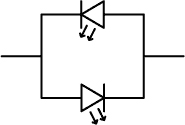

**图 2：** 双色 LED 具有两个连接成阳极对阴极的 LED。

通常这两个 LED 的颜色不同，使得电路只使用两个引脚就能显示两种不同的颜色。例如，如果电流从左到右流过电路，下方的 LED 会亮起。如果电流从右到左流过电路，上方的 LED 会亮起。

另一种有趣的类型是*烛光闪烁 LED*，它包含一个小型计算机芯片，使 LED 以闪烁的模式开关，旨在模拟蜡烛的自然闪烁。你可能在高档餐厅、婚礼宴会或任何想要拥有蜡烛氛围却没有火灾风险的地方见过这些 LED。

##### 红绿蓝 LED

*红绿蓝（RGB）LED* 将三个 LED 集成在一个封装中，实际上允许你创造出整个颜色光谱，而不仅仅是红色、绿色和蓝色。例如，你可以将红色和绿色光混合，得到黄色；将绿色和蓝色光混合，得到青色；将红色和蓝色光混合，得到紫色。将三种颜色的光以相同的强度混合，便会产生白光。

通过组合这三种颜色的光，并在每种颜色上调整亮度，可以创造出数百万种颜色；这就是你的电视和手机用来显示全彩图像的方法。通常，为了调整亮度，每种颜色会非常快速地开关，这会使我们的眼睛看到每种颜色的不同亮度。最简单的 RGB LED 有四个连接点，每种颜色一个连接点，再加上一个与三个 LED 公用的连接点。这个公用连接点可以是*共阳极 (CA)*或*共阴极 (CC)*，它描述了四脚 RGB LED 的内部连接。图 3 显示了共阳极 RGB LED 的连接示意图。

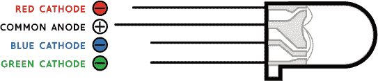

**图 3：** 共阳极 RGB LED 包含红色、绿色和蓝色 LED，且有四根引线

另一种常见的 RGB LED 类型是*数字控制 RGB LED*，它包含一个微小的计算机芯片，用于控制每种颜色的亮度。你的微控制器与每个 RGB LED 中的芯片进行通信，并设置所需的颜色。RGB LED 中的芯片通常是 WS2812B 或 SK6812，并且几乎任何你想使用的系统（包括 Arduino、树莓派等）都有相应的软件库。

使用数字控制 RGB LED 的最大好处是，你可以“设置并忘记”它们，这样你的微控制器就可以更新 LED 到最新的所需颜色，然后继续执行其他任务，而不需要不断更新 LED 的亮度。你还可以将 RGB LED 串联在一起，形成大型的 RGB LED 串或阵列，使其在艺术项目和户外展示中非常有用。

这些 LED 有多种形态，如图 4 和图 5 所示。

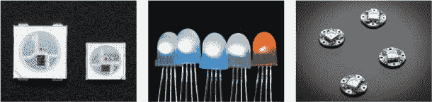

**图 4：** 各种 RGB LED：微型表面贴装芯片；四脚插孔封装；预先安装在小电路板上的 LED

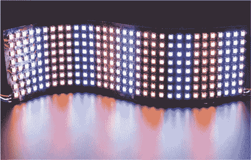

**图 5：** 一种灵活的数字控制 RGB LED 网格

这些图形展示了各种封装形式的数字控制 RGB LED，包括微型表面贴装芯片、四脚插孔封装、附加在小电路板上的 LED，甚至是预先安装在灵活网格中的 LED。

最后一种类型的 RGB LED 是双连接、内部控制的 LED。如果你只需要两个引脚的非常便宜的 RGB LED，这些是一个不错的选择。这些 LED 内部有一个小控制芯片，但不同于数字控制 RGB LED，你不能真正控制它们的行为。例如，当你为这些 LED 提供电源时，内部控制芯片会开始在 RGB LED 上显示预录的颜色序列，通常是循环显示每种主色和次色，并在每个颜色之间有漂亮的颜色渐变。

#### 阅读 LED 数据表

任何 LED 的制造商通常都会提供一份技术数据表，里面充满了事实和数据。它可能看起来很复杂，但别担心！对于本书的目的，你只需要知道两个重要的数字，以确保安全使用 LED。图 6 展示了你将用来查找关键细节的典型 LED 数据表，这些细节在这里被红色高亮显示。

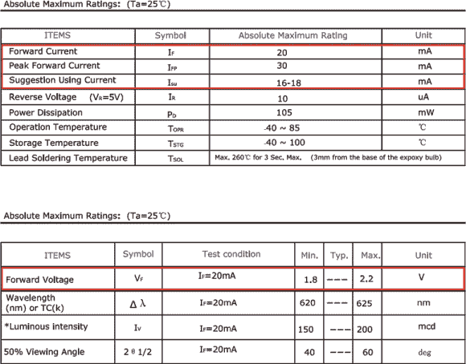

**图 6：** 高亮显示前向电流和前向电压的 LED 数据表

当电流通过 LED 时，它会发光，但过多的电流会使其过热并损坏它。通过使用数据表中的*前向电压*和*最大电流*参数，我们可以计算出需要多大尺寸的电阻来安全地驱动 LED。

##### 前向电压

LED 的*正向电压*，或*V[f]*，是 LED 开始导电所需的最小电压。它测量的是 LED 开启时阳极和阴极之间的电压差。如果你施加的电压低于 V[f]，LED 将无法导电或点亮。当 LED 正常工作时，LED 两端的电压将等于 V[f]。我们将在稍后的计算电路参数时用到这个事实。

LED 的 V[f]取决于所用材料的化学成分，这也决定了 LED 的颜色。例如，红色 LED 的典型 V[f]为 1.5 到 2 V，而蓝色或白色 LED 的 V[f]值通常较高，范围为 2 到 3 V。

##### 最大电流

如果电压超过 V[f]，LED 会尽可能多地导电，这可能导致过热并损坏 LED。为避免这种情况，我们需要从数据表中获取第二个数值：*最大电流*，即 LED 能够通过的最大电流而不会导致过热。

大多数 LED 有一个*最大稳态电流*和一个较高的*最大脉冲电流*。通常，我们在计算时使用最大稳态电流。电流的单位是安培（*A*），也可以用千分之一安培来表示，称为*毫安*（简写为*mA*）。电流是通过设备流动的电量，它决定了 LED 的亮度。例如，大多数小型 LED 只需 10 至 30 mA 的电流就能点亮。一些较大的 LED 和 LED 组件需要几百毫安甚至几安培的电流！

#### 电阻、LED 与欧姆定律

为了安全地驱动 LED，我们需要在 LED 两端提供至少 V[f]的电压，同时还要限制电流，以确保它保持在数据表所允许的最大电流以下。最简单的做法是将一个电阻“串联”（inline）到 LED 中。*电阻*是最简单的电路元件，其电压、电流和电阻之间有着非常简单的关系。这个关系被称为*欧姆定律*，可以通过以下方程表示：

电压 = 电流 × 电阻

我们可以通过使用字母*I*来代表电流，简化这个表达式，得到我们熟悉的*V* = *I* × *R*的欧姆定律方程。电阻的单位是*欧姆*，简写为Ω。

让我们通过一个实际的例子来理解这种关系。假设有一个电阻，其电阻值为 1,000 Ω。如果我们对这个电阻施加 12 V 的电压，那么通过它的电流是多少？为了回答这个问题，我们只需将方程中的变量替换为给定的信息：

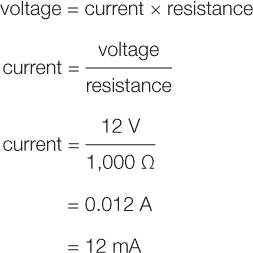

使用欧姆定律，你可以看到，当我们对一个 1,000 Ω的电阻施加 12 V 时，会有 12 mA 的电流通过这个电阻。现在我们再做一次相同的计算，不过这次电压是 36 V：

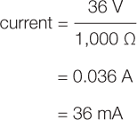

现在，让我们看看电阻器如何帮助我们保护 LED 不至于承受过多电流。

#### 计算与 LED 配套使用的电阻

如果我们将 LED 和电阻器配对，它们共同工作，限制流过两个设备的电流。图 7 展示了这一工作原理。


**图 7：** 使用串联（内联）电阻器与 LED 一起限制电流并保护 LED

请注意，LED 的电流与电阻器中的电流是相同的。你可以看到，电源的总电压也等于 LED 的电压与电阻器的电压之和。我们可以用两个简单的方程式来描述我们的电路：


我们已经知道 LED 的电流需要低于它能承受的最大值。对于这个电路，假设我们希望 LED 的最大电流为 20 mA。我们还知道 LED 的正向电压（V[f]）来自数据手册。对于这个示例，假设正向电压为 2 V，电源电压为 5 V。根据这些已知条件，我们可以将一些变量代入这两个方程式。

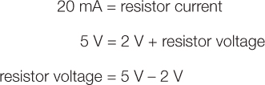

所以我们已经计算出电阻器电流为 20 mA，电阻器电压为 3 V。现在我们需要做的就是利用欧姆定律计算所需的电阻值。


重新排列后，我们发现：

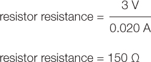

这告诉我们，我们需要 150 Ω的电阻来保持 LED 电流在 20 mA，电源电压为 5 V。请记住，大多数电阻器的准确度仅在其标称值的 5%以内。这意味着一个 1,000 Ω的电阻器的实际电阻值会在 950 到 1,050 Ω之间，某些电阻器的准确度容差可能甚至高达 10%。如果你的计算结果得到的电阻值不是常见的标准值，可以四舍五入到最近的可用值。增加电阻可能会略微减少电流，但总比略微增加电流并可能导致 LED 过载要好！

我们可以将这个计算推广到一个情况，其中你有一个 LED 和串联电阻连接到电源：


这涉及很多数学计算。但这种技术如何应用呢？让我们来看看人们使用 LED 的几种方式。

#### 世界上的 LED

我们在各种各样的应用中使用 LED，无论是显而易见的还是不那么显而易见的方式。例如，许多家电（如微波炉或收音机）上的数字时钟显示屏都为每个时间数字配备了一个*七段显示*。这个显示屏由七个 LED 组成，排列成一个块状的数字 8 形状，如图 8 所示。通过打开或关闭这七个段，我们可以显示从 0 到 9 的所有数字。

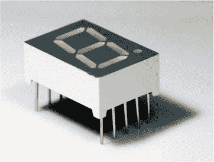

**图 8：** 一个七段显示器由多个 LED 集成到一个塑料外壳中，能够显示数字 0 到 9。

一个不太显眼的 LED 应用是它们在许多*光纤*和*红外遥控器*中的通信用途。连接城市和大陆的巨大海底互联网电缆由细玻璃纤维丝组成，每端都有一个 LED（或有时是激光器），通过电缆传输光脉冲以进行数据通信。图 9 显示了光纤电缆的示例。

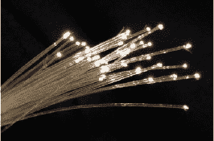

**图 9：** 一束光纤电缆

电视和其他家电的红外（IR）遥控器使用一种特殊类型的 LED，产生人眼不可见的红外光，只有设备的传感器能够检测到。由于许多摄像机对红外光敏感，我们在安防摄像头中使用红外 LED，生成夜间照明，且这种照明对人眼不可见。

许多新的交通信号和汽车灯现在使用 LED，如图 10 所示，这有助于提高能见度并减少功耗和废热产生。

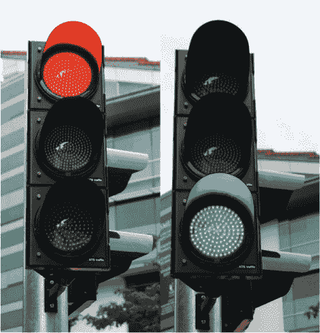

**图 10：** 一个 LED 交通信号灯

随着最近开发的令人愉悦的“暖白”LED，如图 11 所示，许多家庭和企业开始采用 LED 照明。这些 LED 灯泡的效率比白炽灯泡高出 10 倍以上，其降低的能耗使得其更高的购买价格在使用几年后便能得到回报。

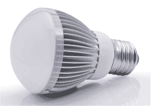

**图 11：** 设计适配标准灯座的白色 LED 灯泡

现在您已经了解了不同类型的 LED 及其工作原理，您几乎准备好开始项目了！除了各种各样的 LED，本书中的一些项目还需要树莓派或 Arduino。接下来的部分将指导您如何设置这两者。如果您已经完成这些设置，或者希望稍后在需要时再进行设置，您可以暂时跳过这些部分，直接进入第一个项目！

### 开始使用树莓派

本节将向您展示如何使用格式化的 SD 卡和 Raspbian 操作系统设置您的树莓派。

#### 所需材料

树莓派可能是目前市场上最著名的小型计算机。树莓派大约有信用卡大小，是一款微型计算机，包含处理器、USB 和其他连接器以及输入/输出引脚，如图 12 所示。

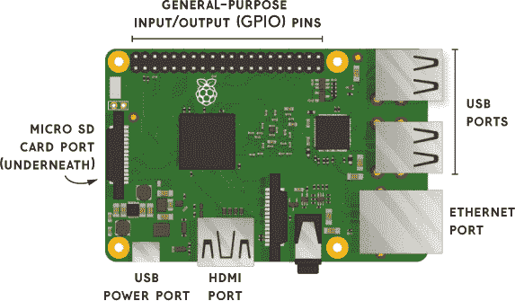

**图 12：** 一款树莓派单板计算机

树莓派有几种不同的型号，任何一款 Pi 都可以用于本书中的目的。

和任何计算机一样，Pi 需要一个键盘、鼠标、显示器、电源供应和一些存储来放置操作系统。你可以使用任何 USB 鼠标和键盘，以及任何 HDMI 显示器，如计算机显示器或电视。电源供应是微型 USB 连接器，就像你在许多手机中找到的那样，所以如果你已经有旧手机充电器，可以重复使用它。虽然许多计算机使用旋转的磁性硬盘驱动器作为存储设备，但 Pi 需要一个单独的 micro SD 卡来存储操作系统（OS）和你创建的文件。因此，你需要购买一个 8GB 或 16GB 的 micro SD 卡——越大越好。我们将按照官方的 Raspberry Pi 软件指南进行操作（* [`www.raspberrypi.org/learning/software-guide/quickstart/`](https://www.raspberrypi.org/learning/software-guide/quickstart/) *）。

#### 使用 NOOBS 安装 Raspbian

最受欢迎的 Raspberry Pi 操作系统叫做 *Raspbian*，你可以通过将文件从另一台计算机复制到 micro SD 卡上来轻松安装它。开始使用 Raspberry Pi 最简单的方式是使用 *NOOBS*（“新盒子外软件”）系统，它可以让你选择要安装的操作系统。

要安装 NOOBS，访问 Raspberry Pi 网站的下载部分（* [`www.raspberrypi.org/downloads/noobs/`](https://www.raspberrypi.org/downloads/noobs/) *）。然后选择 **NOOBS（离线和网络安装）** 选项。不要选择 NOOBS LITE，因为它默认没有包含 Raspbian。要下载 NOOBS，点击 **下载 ZIP** 选项。如果你熟悉使用 BitTorrent 软件，也可以选择 **下载 Torrent**（这有助于减少 Raspberry Pi 基金会的带宽成本）。无论哪种方式，当下载完成后，使用解压程序打开 ZIP 压缩包，并将文件提取到你的计算机中。将它们放在容易找到的位置，比如桌面或 *文档* 目录。

#### 准备 SD 卡

接下来，我们需要格式化 micro SD 卡，以便准备接收 NOOBS 文件。即使你的 SD 卡是全新的，我也推荐格式化它，因为它需要完全为空才能接收操作系统。如果你的计算机运行 Windows 或 macOS，可以从 SD 协会网站下载 SD Formatter 4.0（* [`www.sdcard.org/`](https://www.sdcard.org/) *），进入下载部分并找到适合你当前操作系统的格式化工具。按照说明安装软件，并使用它格式化你的 micro SD 卡。

**注意**

*如果你的计算机运行 Linux，你可以使用任何磁盘格式化工具将 SD 卡格式化为主引导记录（MBR）并创建一个 FAT 分区。*

格式化 micro SD 卡后，将提取的 NOOBS 文件拖放到 micro SD 卡驱动器中。等待文件复制完成后，安全移除 micro SD 卡并插入 Raspberry Pi。

#### 启动你的 Pi

如果你还没有连接键盘和鼠标，请插入它们。使用 HDMI 电缆连接显示器。如果你有以太网电缆可用，将树莓派连接到互联网，在此时插入电缆。最后，插入微型 USB 电源电缆，树莓派应该开始启动。与大多数电脑不同，树莓派没有电源按钮，但在插入电源连接器时会自动启动。请参阅图 12，查看各端口的对应关系。

如果这是你第一次使用此 micro SD 卡，NOOBS 系统将要求你选择要使用的操作系统。因为 Raspbian 特别为树莓派设计并内置在 NOOBS 系统中，所以我推荐使用 Raspbian，但也有其他选项，可能需要互联网连接进行下载。

现在，你已经完成了树莓派和 Raspbian 操作系统的设置，准备好开始构建一系列项目。本书中的项目 6 使用了树莓派。之后，你可以尝试一些网上记录的有趣项目，既可以在官方树莓派网站（*[`www.raspberrypi.org/resources/`](https://www.raspberrypi.org/resources/)）上找到，也可以在像 Instructables 和 Hack-a-Day 这样的网站上找到。

### 开始使用 Arduino 和 Arduino IDE

本书中的一些项目使用 Arduino 作为其核心。Arduino 比树莓派更简单，因为它没有像树莓派那样的计算和网络功能，而是简单地重复运行一个程序，直到你拔掉它。然而，Arduino 在许多硬件项目中表现出色，尤其是在需要高精度计时的情况下（例如与数字 RGB LED 进行通信）。让我们了解一下什么是 Arduino，学习如何安装它，并熟悉 Arduino 的工作流程。

#### 什么是 Arduino？

Arduino 项目始于 2003 年，旨在让人们更容易入门电子学、编程和互动设计。该项目创造了多种开源微控制器电路板，并提供了一系列的软件库，这些库都集成在一个易于使用的*集成开发环境（IDE）*中。Arduino 板提供了一个在数字世界和现实世界之间的接口，使用户能够轻松读取来自按钮、开关、温度计等传感器的数据，同时驱动灯光、电机和 LED 显示器等执行器。围绕核心 Arduino 系统，已经建立了一个完整的生态系统，提供了大量的附加硬件和软件，供你设计下一个伟大的机器人、艺术装置或乐器。

基本的 Arduino 工作流程大致如下：首先，在计算机上的 Arduino IDE 程序中编写编程代码，称为*草图*。其次，使用 USB 电缆将 Arduino 电路板连接到计算机。第三，在 Arduino IDE 中选择**上传**按钮，将代码传输到 Arduino 板子中。然后，代码会自动开始运行，读取传感器并驱动执行器与现实世界进行交互。

最受欢迎的 Arduino 板是*Arduino Uno*，我们将在本节中以此为例，说明将代码上传到板子的过程。Arduino 板子有一个主处理器芯片（例如 Arduino Uno 上的 Atmel ATMega328），以及一个 USB 芯片，用于处理计算机和主处理器之间的接口。这些板子只需通过 USB 电缆就可以连接到你的计算机。

其他兼容 Arduino 的板子，如 EMSL Diavolino 和 SparkFun Arduino Pro Mini，通常没有 USB 芯片，通常是为了降低成本。对于这些板子，你需要一个单独的硬件设备，提供计算机和主处理器芯片之间的 USB 接口。因为 Arduino 最常用的 USB 接口芯片是由名为 FTDI 的公司制造的，所以我们称这个 USB 接口为*FTDI 电缆*，或*FTDI 朋友*。

#### 安装和使用 Arduino IDE

要开始使用 Arduino，你首先需要从官方网站的*[`www.arduino.cc/`](https://www.arduino.cc/)*软件部分下载安装 Arduino IDE。我建议你下载离线版本的 IDE，而不是依赖于网页版编辑器。Windows、macOS、Linux 发行版和 Raspberry Pi 都有安装包可供选择。

图 13 显示了在 Windows 10 上运行的 Arduino IDE。

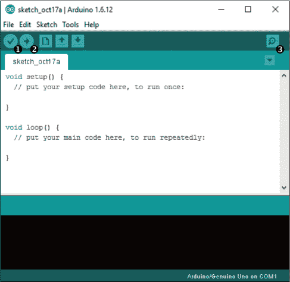

**图 13：** Arduino IDE 界面

在不同平台上，界面应该看起来相似。重要的工具栏按钮如下：

➊ **对勾** 检查是否有错误，并验证草图是否可以编译

➋ **右箭头** 上传并将草图传输到电路板中

➌ **放大镜** 打开串口监视器，查看 Arduino 板发送的信息

草图的编程代码输入到屏幕中间的较大文本区域。Arduino 使用的编程语言叫做*Wiring*，它与 C++语言相似。

#### Arduino 草图的样子

Arduino IDE 带有大量示例草图，旨在演示 Arduino 可以做的各种事情。最简单的草图叫做*Blink*，它使 LED 灯闪烁。大多数 Arduino 板子都有一个内置的 LED，你可以通过草图代码打开和关闭它，而 Blink 草图将此内置 LED 作为输出信号。这个草图是测试新 Arduino 板并确认 IDE 是否正确设置的好方法。

要打开 Blink 示例草图，使用菜单选择 **文件** ▸ **示例** ▸ **01.基础** ▸ **Blink**，如图 14 所示。

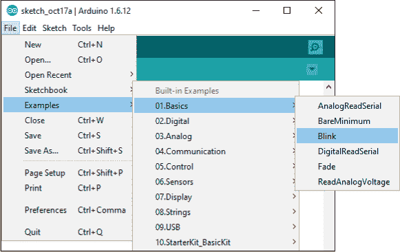

**图 14：** 选择并打开 Blink 草图

每个 Arduino 草图至少有两个编程代码部分，我们称之为 *函数*。第一个必需的函数是 `setup()`，它只在板子第一次通电或重置时调用一次。`setup()` 函数是我们放置所有初始化和配置活动的地方，例如初始化每个引脚的功能和配置外部库的功能。另一个必需的函数是 `loop()`，它在 `setup()` 函数执行完一次后会被重复调用。您也可以创建自己的函数来帮助组织草图代码。列表 1 展示了 Blink 草图的完整程序列表。

**列表 1：** Blink 草图的完整代码列表

```
// the setup function runs once when you press reset
// or power the board
void setup() {
  // initialize digital pin LED_BUILTIN as an output
  pinMode(LED_BUILTIN, OUTPUT);
}

// the loop function runs over and over again forever
void loop() {
  digitalWrite(LED_BUILTIN, HIGH);   // turn the LED on (HIGH
                                     // is the voltage level)
  delay(1000);                       // wait for a second
  digitalWrite(LED_BUILTIN, LOW);    // turn the LED off by
                                     // making the voltage LOW
  delay(1000);                       // wait for a second
}
```

在这里，您可以看到 `setup()` 函数将 LED 的引脚配置为输出引脚，可以使 LED 开启或关闭。这与输入引脚不同，输入引脚会读取 `HIGH`、`LOW` 或者施加到引脚上的变化电压。

**注意**

*以 // 开头的行和短语是注释，不会影响代码的执行。*

`loop()` 函数包含了两个其他的 Arduino 函数。最简单的是 `delay()`，它会暂停程序执行指定的毫秒数（千分之一秒）。每次程序执行到 `delay(1000)` 这一行时，程序会停止并等待 1 秒钟，然后继续执行。

`digitalWrite()` 函数仅对先前配置为输出的引脚有效，它将输出电压设置为 `HIGH` 或 `LOW`。`LOW` 电压始终为 0 V（通常称为 *地*），而 `HIGH` 电压则取决于特定的电路板，但通常为 5 V 或 3.3 V。

总结来说，这个草图首先将 LED 的引脚配置为数字输出，然后点亮 LED，等待 1 秒，熄灭 LED，再等待 1 秒，重复这个过程，直到 Arduino 板被重置或断电。

#### 配置您的板子和端口

在我们编译并上传草图到 Arduino 板之前，我们需要使用工具菜单告诉 Arduino IDE 我们使用的是哪种 Arduino 板。图 15 展示了如何通过选择 **工具** ▸ **板** 来选择 Arduino Uno。在这里，我们使用 Uno 作为示例，但请确保选择与您使用的板子匹配的选项。

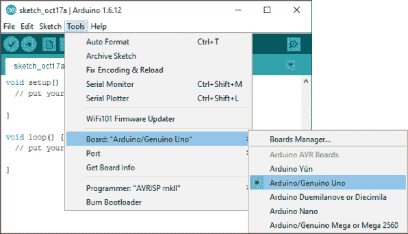

**图 15：** 使用工具菜单选择连接的 Arduino 板

一些 Arduino 开发板提供额外的选项，可以用来指定可用内存的大小、运行速度或安装的处理器类型，但 Uno 开发板没有类似的选项。所有开发板都有端口选项，用来指定设备连接到哪个 USB 端口。当然，这取决于平台，因为 macOS、Windows 和 Linux 上的端口名称不同，但大多数现代的 Arduino 开发板能够传输它们的名称，并且这个名称应该会出现在端口菜单中，如图 16 所示。

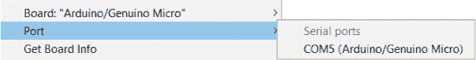

**图 16：** 从端口菜单中选择正确的 Arduino 开发板

配置好开发板和端口后，最后一步是使用“上传”按钮准备（*编译*）并上传草图代码到连接的 Arduino 开发板。要执行此操作，点击工具栏上的右箭头按钮，或者选择 **草图** ▸ **上传** 菜单选项。你应该能够在草图代码下方的黑色区域看到编译器输出，该区域还显示了剩余的程序存储空间和全局变量空间。由于每个 Arduino 开发板为存储编译后的草图和全局变量分配的空间不同，请务必关注这些数字，以便跟踪芯片的使用情况。

虽然 Blink 草图不会向串口监视器发送任何调试信息，但许多其他草图使用串口监视器作为提供程序反馈的一种方式。一些草图甚至从串口监视器获取输入，并利用这些输入来影响程序的运行方式。通过这种方式，你可以让你的草图与计算机或任何可以连接到 USB 串口的设备进行交互。

现在你已经学会了使用 Arduino IDE 编译和上传代码的基本流程，让我们再简要介绍一下本书中使用的一些附加组件。

本书中的一些项目使用了 Arduino 附件来完成特定任务。例如，Adafruit Trinket 用于项目 2：桌面 UFO，而 Adafruit Lilypad 通常用于开发可穿戴设备，出现在项目 9：可穿戴定时护腕中。每个使用附加组件的项目都会解释如何设置和使用它。

**没有内建 USB 连接的 Arduino 开发板**

如前所述，一些与 Arduino 兼容的开发板省略了 USB 接口芯片，以节省成本或减少功耗，或者两者兼顾。像 *Arduino Pro Mini* 这样的流行开发板由 SparkFun 创建。Arduino Pro Mini（如图所示；左侧）需要一个独立的板子，FTDI Friend（如图所示；右侧）来提供与计算机的 USB 接口。这两块板子一起工作，提供一个低成本的 Arduino 开发板，并且有一个可拆卸（且可重复使用）的 USB 接口。

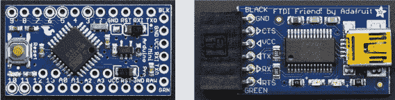

这些照片是根据电路板连接在一起时的排列方式对齐的。只需在 Arduino Pro Mini 的右侧焊接一些插针，这样它们就可以连接到 FTDI Friend 的插座上。使用 Arduino IDE 的 Boards 菜单选择**Arduino Pro 或 Pro Mini**。这样应该会启用板选项下方的 Processor 选项；请确保选择正确的处理器类型和速度。

### 推荐供应商

在本书中，每个项目都会列出少数几个在线商店，作为项目中所用元件的来源。尽管如此，每家商店都有其独特的产品，所以更多的来源总是更好！以下是服务于全球或地区市场的在线商店。

#### 美国

**Adafruit（纽约州；* [www.adafruit.com](http://www.adafruit.com) *）** 这家电子商店有大量的 LED 产品，以及令人印象深刻的微控制器、扩展板和套件。

**BGMicro（德克萨斯州；* [www.bgmicro.com](http://www.bgmicro.com) *）** 我们喜欢这家别具一格的商店中那些稀有和过时的零件。

**Digi-Key（明尼苏达州；* [www.digikey.com](http://www.digikey.com) *）** 在这个庞大的在线商店中，你可以迷失在各种零件的海洋里。

**Evil Mad Scientist（加利福尼亚州；* [www.evilmadscientist.com](http://www.evilmadscientist.com) *）** 套件制造商和元件销售商的杰出代表。店主 Lenore Edman 和 Windell H. Oskay 还共同编写了本书的 Project 1。

**Jameco Electronics（加利福尼亚州；* [www.jameco.com](http://www.jameco.com) *）** 自 1974 年以来，Jameco 可能真的是你父亲的电子商店。它有一本很棒的纸质目录。

**Mouser Electronics（德克萨斯州；* [www.mouser.com](http://www.mouser.com) *）** 如果你需要稀有传感器或成千上万的元件，可以到这个超级分销商那里查找。

**SparkFun Electronics（科罗拉多州；* [www.sparkfun.com](http://www.sparkfun.com) *）** 由一位大学生创办的 SparkFun，已经发展成为一家在线销售套件和单独元件的零售商。

**Tower Hobbies（伊利诺伊州；* [www.towerhobbies.com](http://www.towerhobbies.com) *）** 位于香槟的 Tower Hobbies 是一家无线电遥控和无人机超级商店。

#### 欧洲

**Elextra（丹麦；* [www.elextra.dk](http://www.elextra.dk) *）** 这个有趣的商店提供套件、工具以及比普通商店更多的电子产品选择。

**Farnell/Newark element 14（英国；* [www.newark.com](http://www.newark.com) *）** 总部位于利兹的 Farnell 在全球范围内销售电子元件。总部位于芝加哥的 Newark 是其姊妹公司。

**Maplin（英国；* [www.maplin.co.uk](http://www.maplin.co.uk) *）** 电子零售商 Maplin 在英国拥有超过 200 家门店，并且也提供在线销售。

**Play Zone（瑞士；* [www.play-zone.ch](http://www.play-zone.ch) *）** 这个爱好电子网站，提供英语和德语版本，涵盖从建套件到树莓派以及各种单独元件。

**RS Components（英国；*[`uk.rs-online.com/web`](https://uk.rs-online.com/web)*)** 这家电子超级商店拥有超过五十万种产品。

#### 亚洲

**AliExpress（中国；*[www.aliexpress.com](http://www.aliexpress.com)*)** 你无法列举出你可以在类似 eBay 的 AliExpress 上购买的所有疯狂商品。

**DealExtreme（香港；*[www.dx.com](http://www.dx.com)*)** 所有你能想象的东西都有，且价格令人瞠目结舌——会有什么问题呢？

**HobbyKing（香港；*[www.hobbyking.com](http://www.hobbyking.com)*)** 这是一个拥有美国仓库的遥控和无人机超级商店。

**Seeed Studio（深圳；*[www.seeedstudio.com](http://www.seeedstudio.com)*)** 不仅仅是一个在线商店，Seeed 还运营着商业孵化器 Seeed Propogate 以及原型制作商店 Seeed Fusion。
