## 第二章：Lenore Edman 和 Windell Oskay 的四个简单项目

在本章中，你将完成四个简单的 LED 项目。

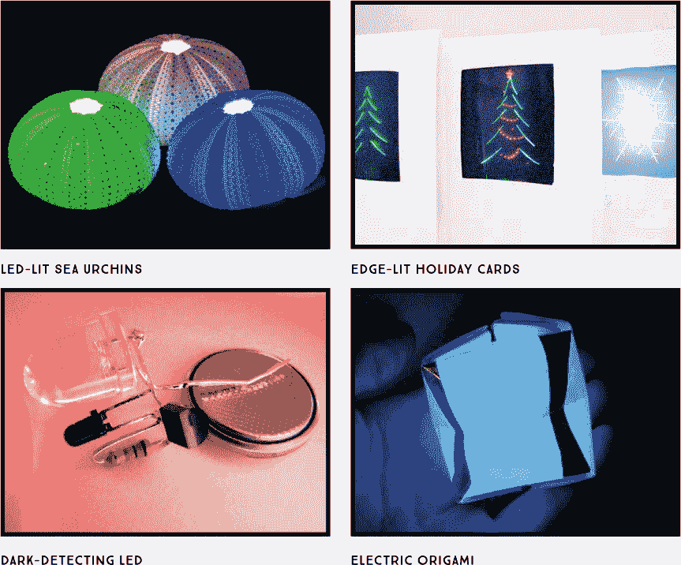

有一个原因使得 LED 项目成为许多电子爱好者的入门项目：它们既简单，又能发出光亮的效果。以下项目曾在 Evil Mad Scientist Laboratories 博客上发布（*[`www.evilmadscientist.com/`](https://www.evilmadscientist.com/)*）。这些简单的项目将为你应对书中后面更为复杂的项目做准备。首先，我们将教你如何制作一个 LED 照亮的海胆壳，接着你将制作一个边缘发光的节日卡片、一个黑暗探测 LED 和电动折纸。

### #1：LED 照亮的海胆

在一次假期的海滩商店里，我们发现了一些小巧的海胆壳，薄如蛋壳，轻盈异常。能做什么呢？当然是用 LED 将它们点亮！

海贝灯并不是什么新奇的东西，但通常是用大而重且色彩鲜艳的贝壳做的。相比之下，这些海胆壳较小且轻盈，照明效果突出了它们的自然美感。

#### 获取零件

对于这个项目，你需要找到一些小型的海胆壳，或者其他类似的容器，要求壁薄到足够透明。理想的大小约为 4 英寸宽。

+   LED（例如，Evil Mad Scientist *[`emsl.us/743`](https://emsl.us/743)* 或 SparkFun P/N 12062）

+   硬币电池 CR2032（SparkFun P/N 338）

+   小巧、轻盈的海胆壳

每个海胆壳底部都有一个足够大的孔，可以容纳一个相当大的 LED，尽管不一定能同时容纳电池。当壳体被点亮时，它们应该看起来像图 1-1 一样。

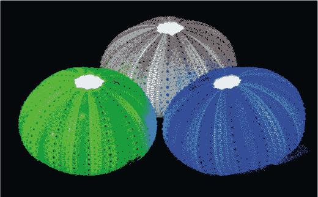

**图 1-1：** 不同颜色的 LED 构成了多种颜色的海胆。

#### 制作它

首先，我们将 LED 与手表电池连接，这种组合被称为*抛投灯*，因为它们小巧且便宜，理论上你可以随意抛掷它们。虽然我们不会让你在这个项目中抛掷任何东西，但你会利用这些抛投灯来照亮海胆壳。

1.  **制作抛投灯。** 选择任何颜色的 LED。长腿是正极，短腿是负极。只需将引脚连接到电池端子，将正极腿贴到电池的正极侧，负极腿贴到负极侧，就得到一个微小的光源，如图 1-2 所示。将引脚弯曲，使 LED 指向上方，远离电池。

    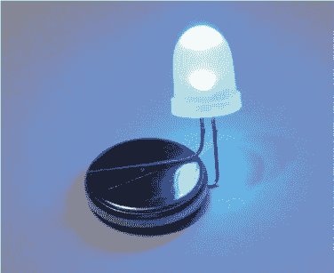

    **图 1-2：** 将电池和 LED 结合在一起，轻松便捷地实现照明效果。

1.  **组装海胆。** 将 LED 抛投灯放入壳底的孔中。如果电池不合适，只需将 LED 的头部穿过壳体，电池可以直接放在壳体下方。对于多个壳体和颜色，你可以重复此过程。

完成了！海胆已经制作完成并发出炫目的光芒，展示出精美的外壳结构。你的灯具应该能持续一到两周，具体取决于 LED 的颜色。

### #2: 边缘发光圣诞卡

在这个项目中，你将使用透明塑料和简单的 LED 装配，制作自己的 LED 发光圣诞卡。图 1-3 展示了我们制作的一些卡片。我们使用的技巧通常被称为*边缘发光*，即将一个点亮的 LED 放置在雕刻好的亚克力边缘。这种方法可以使雕刻区域发出柔和的光芒，同时不露出可见的电线或其他硬件。

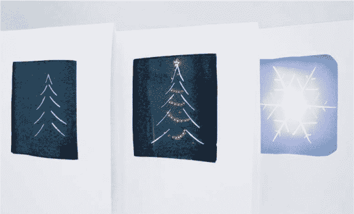

**图 1-3：** 为你的亲人制作 LED 卡片。

#### 获取材料

你只需要一些基本的材料，就能制作出 LED 圣诞卡。

+   带透明镜头的 LED，最好是 3 毫米或矩形的（例如，*[`emsl.us/533`](https://emsl.us/533)* 或 SparkFun P/N 08285）

+   透明塑料（大约 2.5 × 3 英寸，1/16 英寸厚）

+   电工胶带

+   CR2032 硬币电池（SparkFun P/N 338）

+   钢笔

+   纸张和卡纸

+   剪刀

+   美工刀

#### 开始制作

要制作自己的圣诞卡，首先你需要一个设计。你将把这个设计雕刻到塑料上，然后 LED 从底边点亮它，光线反射到雕刻线条上，形成发光效果。你需要保持设计简洁（比如图 1-3 中的圣诞树和雪花设计），因为雕刻到塑料上的方法并不是最精确的绘图方式。

你将从一块大约 2.5 × 3 英寸（65 × 75 毫米）并且 1/16 英寸（1.6 毫米）厚的透明塑料开始。我们使用的是亚克力，但你也可以使用聚碳酸酯、聚丙烯或其他许多透明塑料。你可以从厚壁透明塑料容器中切割出一块，或者在五金店或爱好商店购买类似材料。我们的透明亚克力两面有保护蓝膜。

1.  **剪下一块塑料。** 如果你的塑料片比 2.5 × 3 英寸大，你需要把它剪下来。这种材料不能用剪刀剪——它会裂开和碎裂——所以你需要用锋利的美工刀或箱切刀以及金属直尺进行打刻，然后沿着刻痕迅速折断。使用这种方法，可以相当快速地从大板材中切出合适尺寸的塑料片。图 1-4 展示了带保护膜的塑料。

    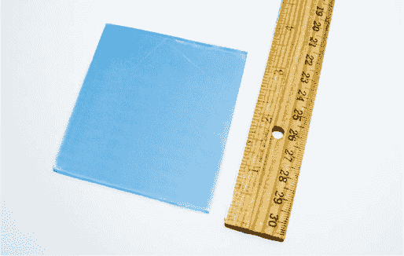

    **图 1-4：** 剪下一块塑料，匹配你的卡片设计。

1.  **制作纸质模板。** 在纸张上描绘出塑料片的尺寸。然后，在第一个矩形内部绘制第二个矩形（图 1-5），留出大约 0.5 英寸（13 毫米）的间隙。你的设计需要很好地适应内矩形，以确保最终设计在塑料上居中。

    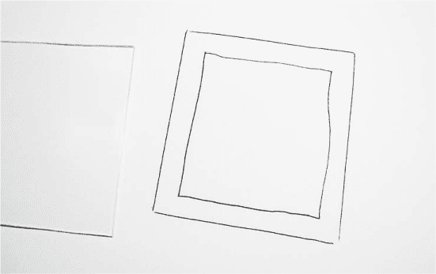

    **图 1-5：** 描绘塑料片，然后在其内部绘制矩形。

1.  **绘制设计并描摹。** 当你的纸上图纸完成后，将其放在塑料片上，用雕刻刀沿着图纸轮廓描摹。

    很明显，形状的酷炫程度会影响最终产品的效果。图 1-6 只是一个简单的树形图案——并不复杂。对于雪花图案，你可以打印并描摹一些真实的雪花图案。

    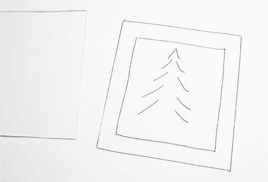

    **图 1-6：** 在内矩形区域内绘制你的设计。

1.  **连接 LED 和电池。** 这个项目使用了与“LED 照明海胆”项目中相同的经典 LED 投射方式。按照 “建造它” 中的说明，将 LED 直接连接到 CR2032 锂硬币电池的引脚上，详见第 27 页，但这次不要将引脚弯成直角。现在，当你将亮光 LED 放置在塑料片的边缘时（如图 1-7 所示），它将照亮你已刻划的区域。

1.  **用胶带封住边缘。** 持续将 LED 灯固定在塑料片的底部边缘，以便光线能够进入刻线中。接下来，使用黑色电工胶带限制光线向其他方向泄漏。先放下一段胶带，粘性面朝上，然后将塑料片和 LED 固定在胶带的上半部分。接着，在顶部放上一段配套的胶带，紧密封住 LED，确保光线只向塑料片内部照射 (图 1-8)。

    接着，用黑色胶带封住塑料板的另外三面，如图 1-9 所示。注意，胶带只需要覆盖塑料的边缘部分。完成这一过程后，单个 LED 将点亮刻在塑料上的设计，而不会让光线泄漏到其他地方。

    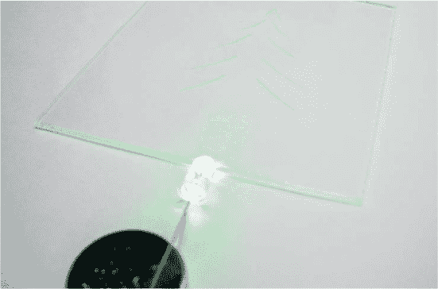

    **图 1-7：** 从底部边缘照亮设计

    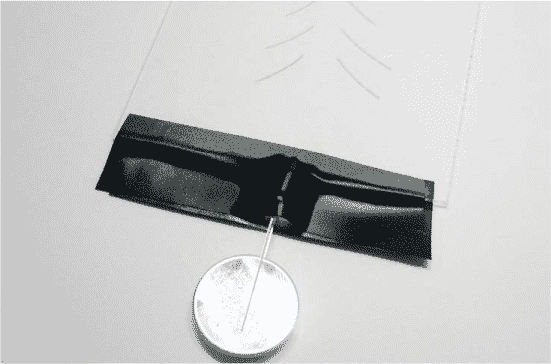

    **图 1-8：** 用胶带封住 LED，确保没有光线泄漏

    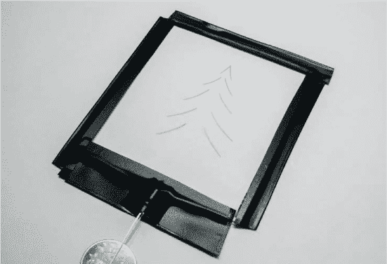

    **图 1-9：** 封住设计的边缘

1.  **准备纸卡。** 接下来，你需要开始制作卡片本身。我们使用了 9 × 12 英寸的厚布里斯托纸卡，但其他厚的不透明纸也可以使用，尺寸并不是特别关键。将纸对折两次，制作出经典的贺卡形状，前后两层的大小大约为 4.5 × 6 英寸。

    将完成的边缘发光塑料组件放在折叠卡片上，确保它适合，并确定你打算将其放置的位置。

    接下来，你需要在卡片的前面切一个窗口，以便展示塑料设计。将步骤 2 中的内矩形从模板上剪下并在卡片的前面描摹轮廓。在切割之前先展开卡片，确保只切割前面的那一层。用雕刻刀沿着轮廓刻划，然后小心地用雕刻刀或剪刀将其剪出。你将把边缘发光的塑料组件固定在你刚切出的窗口后面。

    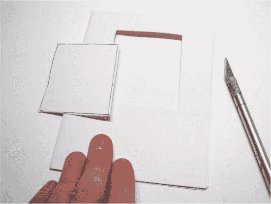

    **图 1-10：** 剪切与设计匹配的矩形

1.  **组装卡片。** 现在将塑料组件放入卡片中，使设计位于窗口中央，切割过的塑料面朝外。将其固定好，包括电池部分（见图 1-11）。

    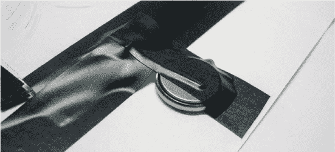

    **图 1-11：** 固定电池位置

    使用这种设置，卡片将一直亮着，直到电池在一周左右耗尽。如果你是亲手送礼，这没问题，但如果是邮寄，就不太适用了。为此，你可以将其设置成直到接收者打开卡片时，LED 才会亮起。

1.  **插入拉条（可选）。** 在粘贴电池之前，将一条纸条插入 LED 的一个引脚和电池之间，使纸条的一端露出来。这个纸条将切断电路，防止 LED 亮起。在纸条的末端写上*Pull*（拉）字样，并将电池固定好。当卡片的接收者拉起纸条时，LED 的引脚将再次接触电池，完成电路并点亮 LED。

#### 进一步探索

另一个额外酷的技巧：使用两层颜色，堆叠独立的边缘光显示屏，一层使用绿色 LED，一层使用红色 LED。你可以在图 1-12 中看到一个例子，红色 LED 的塑料层位于绿色层的上方。

用相机拍摄并不容易，但红色的点非常清晰并漂浮在绿色的树木前面，这是由于第二层的原因。3D 效果真的非常棒。我们在红色层上制作这些点，是用图钉压入塑料而不是用刀片。卡片内部正如你所预期：两层塑料，每层底部都有一个 LED，电池周围用电工胶带封边以防止光泄漏。这实际上是一种非常古老的显示技术。堆叠足够多的层，你甚至可以制作一个侧光的数字显示时钟！

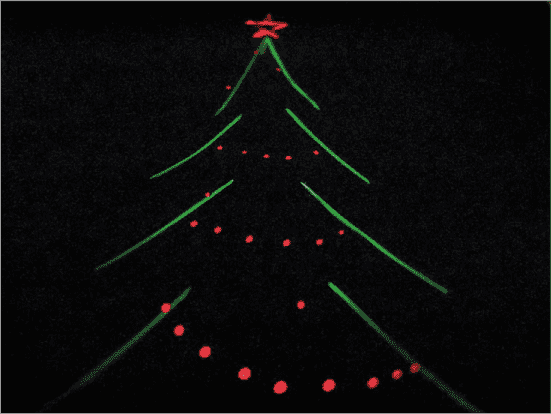

**图 1-12：** 将两层或更多层塑料叠加在一起，为设计添加多种颜色。

### #3：光暗检测 LED

这里有一个常见问题：如何在黑暗时点亮 LED？你可以称其为“夜灯问题”，但它出现在许多熟悉的场景中——紧急灯、街灯、电脑键盘背光，等等。

解决这个问题有很多方法。传统的方法是使用一个*CdS 光敏电阻*，有时称为*光电池*或*光依赖电阻（LDR）*。光敏电阻非常可靠，且每个仅需大约 1 美元，但因为它们含有镉这种有毒重金属，而且其使用正受到越来越严格的管制，所以它们的使用逐渐减少。幸运的是，还有许多其他选择。

这个项目将向你展示如何使用光电晶体管设计自己的光暗检测 LED，见图 1-13。

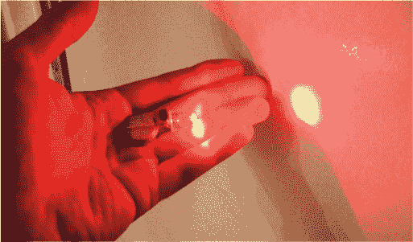

**图 1-13：** 当灯光熄灭时，这个 LED 会亮起。

使用这个便宜的光控 LED 电路，你几乎可以做任何事情，但其中一个有趣的应用是制作 LED 抛物器，它能在白天自动关闭以节省电力。抛物器通常能持续工作长达两周，加入像这样的光敏开关可以显著延长它们的使用寿命。

#### 获取零件

为了制作这个项目，你需要使用附录中描述的焊接工具。此外，你还需要使用以下电子元件，这些元件在图 1-14 中有所展示。

+   超亮 LED（例如，* [`emsl.us/620`](https://emsl.us/620) * 或 * [`emsl.us/606`](https://emsl.us/606) *；或者 SparkFun P/N 528 或 10632）

+   硬币电池 CR2032（SparkFun P/N 338）

+   LTR-4206E 光敏晶体管（* [`emsl.us/437`](https://emsl.us/437) * 或 Mouser P/N 859-LTR-4206E）

+   2N3904 晶体管（* [`emsl.us/98`](https://emsl.us/98) * 或 SparkFun P/N 521）

+   1 kΩ电阻（* [`emsl.us/234`](https://emsl.us/234) * 或一个包含多种规格的套件，如 SparkFun P/N 10969）

最后三个部分总共花费大约 0.30 美元，批量购买时价格会更便宜。

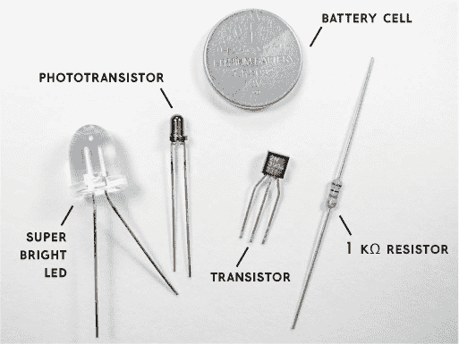

**图 1-14：** 构建你的暗光探测 LED 所需的组件

LTR-4206E 是一种 3 毫米黑色封装的光敏晶体管。黑色封装能够阻挡可见光，因此该光敏晶体管只对红外光敏感——它能感应到阳光和白炽灯光，但不能感应到荧光灯或大多数放电灯，这意味着它可以被编程为只在夜晚开启。

如同之前的项目，你将首先制作一个 LED 抛物器。然后，加入光敏晶体管，并使用其输出信号控制晶体管，从而开启 LED。

#### 工作原理

当光线照射到光敏晶体管时，它开始导电，电流可达大约 1.5 mA，这会将电阻两端的电压降低 1.5 V。这将关闭晶体管，从而关闭 LED。在黑暗中，光敏晶体管能通过 LED 导电约 15 mA，因此当 LED 关闭时，电路的电流消耗仅为原来的十分之一。

#### 构建它

现在是时候开始构建了。你当然可以在面包板上搭建这个项目，但我们这里所演示的紧凑且可部署的构建方式更令人满意。

1.  **焊接电阻和晶体管。** 首先准备好晶体管和电阻。2N3904 晶体管的引脚，从前方看，从左到右分别是发射极、基极和集电极。你需要按照图 1-15 所示，将电阻焊接在晶体管的基极和集电极之间。（如果你从未焊接过或需要一些指导，请参考附录。）将电阻的引脚保持与晶体管的引脚呈 90 度角焊接，然后剪掉基极（中间引脚）和集电极（右侧引脚）多余的电阻引脚。

    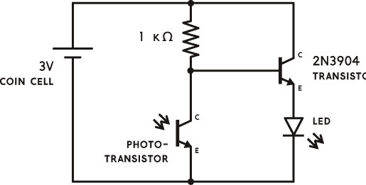

    **图 1-15：** 光暗探测 LED 的电路图

1.  **连接光电晶体管。** 接下来，添加光电晶体管，如图 1-16 所示。注意它有一个扁平的一面，就像 LED 一样。扁平侧的引脚是光电晶体管的集电极。将扁平侧的集电极焊接到晶体管的基极（中间引脚），同样是 90 度的角度。暂时将光电晶体管的另一引脚（发射极）保持未连接状态。

    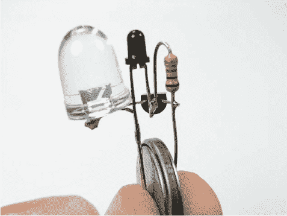

    **图 1-16：** 光电晶体管是图中上方中央的黑色小球

1.  **测试 LED。** 对于这一步，你需要知道哪个 LED 腿是正极，哪个是负极。不幸的是，LED 的标记并不一致，因此检查极性的最佳方法是用锂硬币电池测试：将 LED 横跨电池的端子，两只腿分别放在两侧。如果第一次没有点亮，交换一下两腿的位置。当 LED 点亮时，注意接触的是哪个端子（+端子）；这个就是正极腿（通常是较长的那根）。将 LED 的正极引脚焊接到晶体管的发射极（左侧引脚），该引脚没有连接任何东西。修剪掉焊点之后多余的 LED 引脚。将 LED 的负极引脚焊接到光电晶体管的发射极——即未扁平化的一侧引脚，该引脚现在还没有连接任何东西。不要修剪这个引脚。

    到目前为止，只有两个引脚从组件下方伸出：一个连接到电阻器和晶体管的集电极（最右侧引脚），另一个连接到光电晶体管的发射极和 LED 的负极腿。要测试电路，将硬币电池夹在这两个端子之间，正极面接触电阻器。图 1-17 显示了在黑暗房间中的电路；其 LED 亮起了。

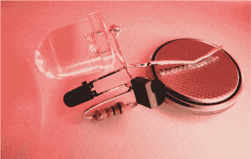

**图 1-17：** 黑暗触发了组装好的 LED 电路。

现在你有了一个微小的光暗探测灯！你可以通过将腿部固定在电池上，使它更加稳定。这个灯在门框顶部做一个不错的夜灯——当房间的灯关掉时，它会在天花板上投射出一个明亮的光点。

#### 进一步展开

虽然这个小电路可以独立工作，但它也可以作为更大电路的一部分使用。当然，这是用光传感器控制 LED 最简单且最便宜的方法之一，因此你可以制作多个并将其应用于许多用途，例如将其与第一个项目中的海胆壳结合，用于制作海胆夜灯。

### #4: 电动折纸

在图 1-18 中看到的那个小型 LED 照明立方体，远不止一个纸灯笼：它是一个透明的薄膜电子电路，将电池与 LED 连接，并且足够灵活，可以折叠成折纸盒。这些电路最酷的地方？你可以在家制作它们。

在本项目中，你将结合基本的 LED 抛光和纸艺，形式为传统的折纸气球，制作一个可以称为*LED 折叠灯*的物品。电路由铝箔电路组成，铝箔被熨贴到粘合纸上（如冰箱纸或照片粘贴纸），或用激光打印的图案。这种结构随后可以折叠以容纳 LED 和电池，从而完成电路。

**注意**

*本项目的模板可在书籍资源中找到* ([`nostarch.com/LEDHandbook/`](https://nostarch.com/LEDHandbook/))。

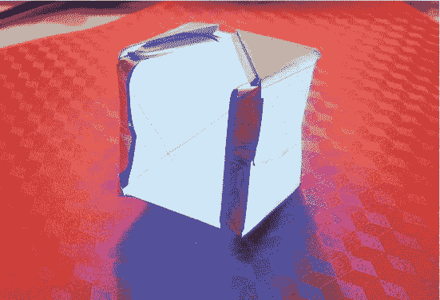

**图 1-18：** 这个 LED 灯笼使用了粘附在纸上的铝箔电路。

#### 获取零件

收集以下零件和材料：

+   LED（例如，*[`emsl.us/369`](https://emsl.us/369)* 或 SparkFun P/N 12062）

+   硬币电池 CR2032（SparkFun P/N 338）

+   折纸纸（我们使用的是标准的 10 英寸正方形）

+   铝箔

+   冰箱纸或照片粘贴纸（与折纸纸张大小相同）

#### 制作它

设计像这样的三维电路的第一步是创建外壳，并查看各个组件的位置。之后，你将展开模型，绘制你想要连接的各个点之间的电路路径，然后继续进行。

1.  **折叠气球原型。** 开始之前，首先折叠一个折纸气球。（如果需要指导，网上有成千上万的教程。）这个气球不是你最终使用的气球，但你将在其上绘制电路。不要给气球充气——保持它的最终折叠形状，因为你将把设计转移到一张冰箱纸上。

    折纸气球具有一些对本项目有用的特点。它们在侧面有一个方便的小袋子，用于放置锂币电池。底部还有一个小孔，LED 灯将放在这里，所以请把电线引脚藏进与电池相对的折叠部分。图 1-19 展示了组件暂时放置在气球上的样子。

    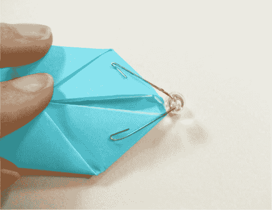

    **图 1-19：** 临时将组件放置在你的气球原型上。

1.  **展开气球。** 在折纸气球还没有展开时，标记电池和 LED 端子的位置信息，然后将其展开。这就是你的电路板。此时，你应该已经标记了组件的位置，但尚未绘制它们之间的连接线。你可以在图 1-20 中看到展开后的气球。

    

    **图 1-20：** 展开气球，看看电路如何工作。

1.  **绘制电路。** 接下来，你将添加电池与 LED 之间的电路线路（电路板电线或线路），如图 1-21 所示。绘制将正极 LED 引脚连接到电池正极，将负极 LED 引脚连接到电池负极的线路。你需要将这些线路从箔片中剪下来并粘贴到纸上。将纸艺与电子元件结合时要记住的一点是：如果电路线路能够覆盖 LED 引脚以保持良好的接触，这样是有帮助的，因此在线路的两端留点余量总是一个好主意。

    在连接好所有线路后（可以这么说），你就得到了电路的布局。这里很简单——只有两条线路！这两块圆形焊盘分别接触电池的两端，两个角度焊盘则接触 LED 的两根引脚。

    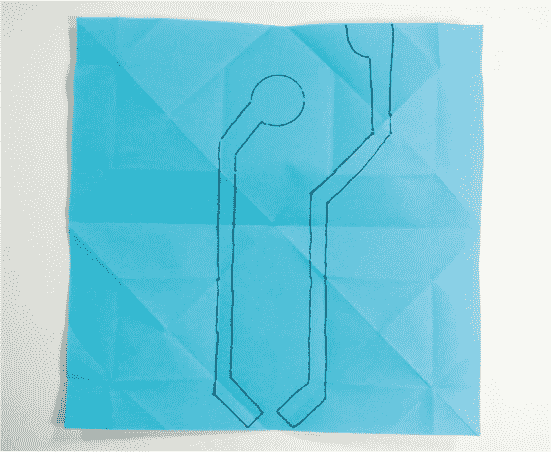

    **图 1-21：** 绘制线路

1.  **制作电路板。** 下一步是实际制作电路板。我们称之为*冷冻纸*附着法，即将箔片线路粘贴到涂有塑料的纸上。将电路图铺在一块铝箔上（见图 1-22），然后用雕刻笔（木签或钝牙签效果很好）沿着图形描绘，留下一个凹陷的轮廓。

    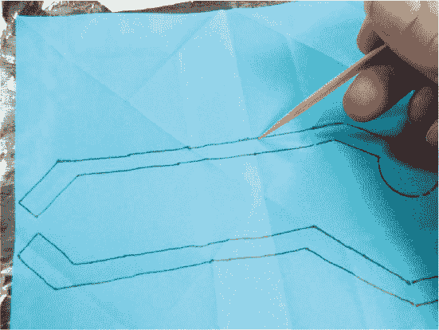

    **图 1-22：** 电路板开始组合。

1.  **剪裁并附加线路。** 接下来，剪下你描绘的图案。当然，用剪刀就可以了。小心不要撕破箔片！图 1-23 展示了剪裁好的图案，准备剪裁。

    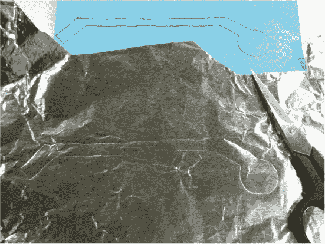

    **图 1-23：** 描绘好的图案，准备剪裁

1.  **层压箔片。** 预先将冷冻纸折叠成折纸气球形状，并与电路布局进行对比，确定铝箔片在冷冻纸上的位置。将箔片放置在冷冻纸的光面上，如图 1-24 所示。为了防止熨斗粘到胶粘剂上，可以在冷冻纸上放一大张羊皮纸。将电路线路定位好后，使用设置为华氏 330 度的熨斗将箔片层压到纸上。

    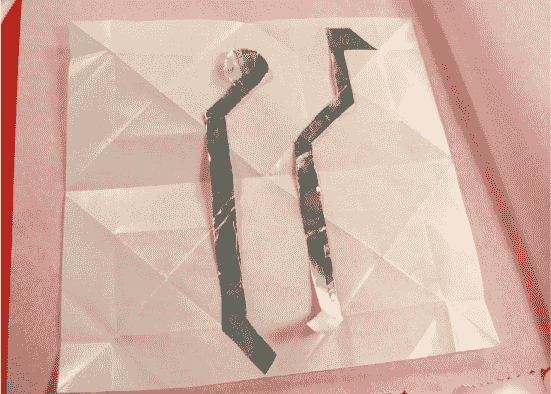

    **图 1-24：** 将箔片放置在纸张的光面上。

    我们使用了小型爱好铁将箔片熔接到不同的纸张上，但普通的熨斗同样有效。干式装裱胶不需要太高的温度，但熨斗必须设置为高温，以熔化冷冻纸的塑料。

    我们尝试了涂蜡纸，但它对铝箔不够粘，而且我们甚至试图将铜叶应用到蜡纸上，但它太脆弱，折叠时线路断裂。这种组合可能在不需要折叠的应用中能很好地工作：它非常美观，但在折纸中完全不可靠。图 1-25 展示了折叠时的线路。

    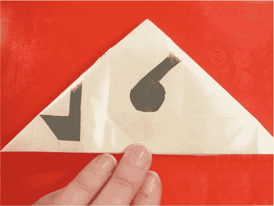

    **图 1-25：** 熨烫过程中折叠气球

1.  **完成气球。** 一旦箔纸粘附到纸上，再将气球重新折叠，使线路在外侧，从底部的孔吹气给气球充气，然后测试气球。将组件放入正确的位置，气球应该会亮起。如果没有，试着将电池反转。如果它仍然不亮，确保 LED 的引脚与线路接触。它是通过摩擦固定的，其强度取决于折纸的紧密度。

**提示**

*你插反了 LED 并不会损坏它，所以这比实际去跟踪极性是一个更好的方法。LED 折叠面自然会坐落在最重的部分——电池上，LED 会投射到气球的一侧。电池的重量有助于保持电路连接。*

当你把一切弄好后，它应该看起来像图 1-26。

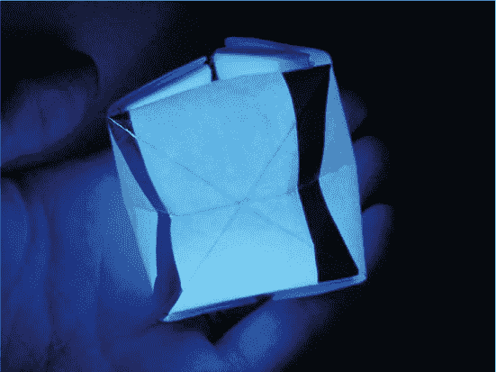

**图 1-26：** 完成的气球

#### 深入探讨：直接碳粉方法

我们的最后一次突破是创造了一个 PDF 图案来打印出来。我们发现你可以将箔纸直接熔合到激光打印机的碳粉上。这只适用于激光打印机，不适用于喷墨打印机。你可以打印出图案，并将箔纸直接熨烫到纸上——加热的碳粉会附着在箔纸上。

这种方法有一个注意事项。虽然箔纸能很好地粘附在碳粉上，但它的强度不足以让你直接将一整块箔纸熨烫上去然后撕下，只让它粘附在有碳粉的地方，因此你仍然需要至少粗略地剪下箔纸形状。打印出图案后，将其放置在铝箔上，描绘轮廓，并剪下箔纸块。

小心地将箔纸放在图案上，用非常高的温度熨烫。一定要用烘焙纸覆盖你的作品，否则你会在熨斗上沾上碳粉。当箔纸粘附到碳粉上并且冷却后，剪下气球的方形部分，准备进行折叠。

温柔地折叠，尽量减少对线路的干扰。可能在多次折叠的区域线路会松动，但应该足够牢固以便组装。给气球充气，安装电池和 LED，然后欣赏它的光辉。如前所述，如果遇到问题，试着将电池反转，确保 LED 的引脚与箔纸接触。

### 总结

在本章中，你了解了最简单的 LED 项目——投掷灯（throwie），并将其应用于多个（非投掷的！）项目中。你还学到了一些更具挑战性的技巧，这些技巧会对你有很大帮助，比如制作自己的电路线路。希望这些简单的项目激发了你对未来项目的好奇心！
