## 第三章：James Floyd Kelly 制作的桌面 UFO

在这个项目中，你将制作一个可以发光的装饰性 UFO。

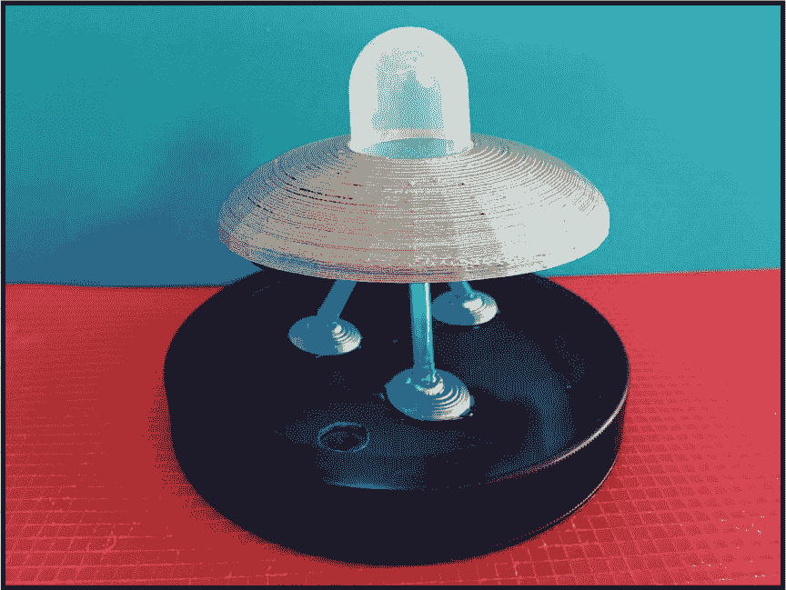

我的桌面总是堆满了几件极客小饰品——这里有个手办，那里有几张旧的*星球大战*收藏卡，有时还会有一个没有实际用途的新的小玩意，只是为了发出声音。有些我会保留在桌面上，以便写作时能获得灵感，其他的则只是为我的日常生活增添了一些色彩和趣味。如果你的桌面缺少这些无用的小饰品，那就用你自己的桌面 UFO 版本来装点它吧。

桌面 UFO 由 LED 灯提供照明，发出一种迷人的神秘光芒。它有一个开关来节省电力，占用的空间非常小。它由 3D 打印组件和一些你可能在家里找到的物品，以及一些电子组件组成。包括 3D 打印时间，整个项目即使是初学者也可以在六小时内完成。

如果你没有 3D 打印机，也不用担心。仔细观察桌面 UFO，你会发现一些非常基本的形状。任何类型的塑料飞碟都可以替代 3D 打印版，着陆垫可以用塑料或木材或任何可以钻孔的小平物体制作。如果有的话，可以看看当地的图书馆和创客空间是否提供可以使用的 3D 打印机。

### 获取零件

这里是你需要制作桌面 UFO 的工具和组件列表。这个项目需要一些焊接工作；如果你需要指导，请参阅附录。

#### 组件

+   Adafruit NeoPixel 环，24 × 5050 RGB LED 带集成驱动器（Adafruit P/N 1586）

+   Adafruit Trinket（Adafruit P/N 1501）和 A 到 MicroB USB 电缆（Adafruit P/N 898）

+   电池座，3 × AAA，带开关和两针 JST（Adafruit P/N 727）

+   40 个针脚（Adafruit P/N 3002）

+   5 英寸或 7 英寸的母对母跳线

+   22 号固体电线（Adafruit P/N 1311）

+   具有至少 1.5 厘米垂直空间的塑料盖

+   三根可弯曲的塑料吸管

+   （可选）小型塑料口香糖机玩具外壳盖

+   喷漆

#### 工具

+   3D 打印机或 3D 打印机的使用权限

+   PLA 或 ABS 耗材（取决于 3D 打印机）

+   钻床、手钻和/或旋转工具

+   焊接铁

+   焊锡

+   电线剪刀和钳子

+   热熔胶枪

+   电工胶带

+   油漆胶带

### 介绍 NEOPIXEL

在开发 UFO 的创意时，我发现 Adafruit NeoPixel 组件，如图 2-1 所示，提供了一个很棒的特殊效果。NeoPixel 是一个 LED 条或环，你可以编程使其按模式发光，形成一个在飞碟下方旋转发光的环。

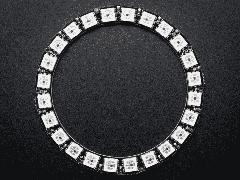

**图 2-1：** Adafruit NeoPixel

NeoPixel 将被放置在桌面 UFO 下面，电线将穿过一根或两根我们用饮料吸管做的脚。控制 NeoPixel 上灯光的电池盒和 Trinket 控制器将位于一个从塑料容器回收的圆形塑料盖子下方。UFO 的主体和着陆垫将在 CAD 应用程序（Tinkercad）中创建，并通过 3D 打印机打印出来。让我们开始吧！

### 构建它

首先我们将设置 Trinket，如图 2-2 所示。这是整个项目的控制板，它将告诉 NeoPixel 上的 LED 如何工作。接着，我们将为 NeoPixel 准备电池，并将所有组件放入最后制作的 UFO 主体中。

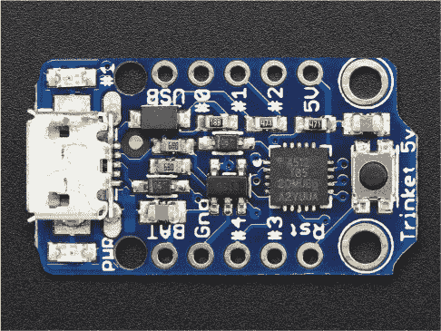

**图 2-2：** Trinket 板

当一切建成后，我们将上传一个短程序，称为*草图*，它告诉 Trinket 如何触发 NeoPixel 环中各种 LED 的图案。当电压被提供时，LED 将亮起。NeoPixel 为每个 LED 提供一个“地址”，因此草图可以指示 Trinket 在任何时刻向哪些 LED 提供电压。

#### 准备 Trinket

在运行告诉 NeoPixel LED 按照特定顺序亮起的草图之前，您需要完成以下步骤以准备您的 Trinket：

1.  **在 Trinket 上安装软件。** 使用 A 到 MicroB 的 USB 电缆将 Trinket 连接到桌面计算机或笔记本电脑。（USB 电缆有许多种类型；Trinket 使用 MicroB 类型。如果您快速搜索 USB 电缆类型，您可以找到更多如何识别正确电缆的细节。）

    Mac 和 Linux 电脑无需安装额外的驱动程序，但如果您使用的是 Windows，您需要下载驱动程序。请访问*[`nostarch.com/LEDHandbook/`](https://nostarch.com/LEDHandbook/)*，然后按照链接获取项目 2 的驱动程序。

1.  **下载*adafruit_drivers.exe*文件。** 双击运行*adafruit_drivers.exe*安装文件（文件名也将包含最新的版本号），然后按照提示进行操作，完成所有驱动程序的安装。

    您还需要安装 Arduino IDE。请参见第 15 页上的“Arduino 和 Arduino IDE 入门”部分了解详细步骤。如果您在 IDE 或驱动程序安装过程中遇到问题，以下两个链接会很有帮助：*[`learn.adafruit.com/introducing-trinket/starting-the-bootloader`](https://learn.adafruit.com/introducing-trinket/starting-the-bootloader)* 和 *[`learn.adafruit.com/introducing-trinket/setting-up-with-arduino-ide`](https://learn.adafruit.com/introducing-trinket/setting-up-with-arduino-ide)*。

    您需要使用 Arduino IDE 以便将草图上传到 Trinket。

1.  **测试 Trinket。** 现在，我们将设置 Arduino IDE 与 Trinket 的通信，并使用 Arduino IDE 中安装的一个简单示例程序来测试 Trinket。确保 Trinket 连接到电脑并打开 Arduino IDE。进入工具菜单，选择**板子**，在列表中选择**Adafruit Trinket 8MHz**作为板类型。在工具菜单中，点击**程序员**，选择**USBtinyISP**。按下 Trinket 上的红色按钮，准备上传示例程序。进入**文件** ▸ **示例** ▸ **01.Basics** ▸ **Blink**。一个新的 IDE 界面将打开并显示 Blink 示例程序，如图 2-3 所示。

    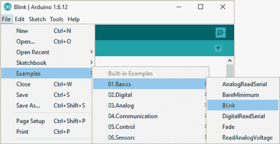

    **图 2-3：** Arduino IDE 中的 Blink 示例程序

    当 Trinket 上的红色 LED 闪烁时，点击 Arduino IDE 工具栏上的上传按钮（  ）上传 Blink 示例程序。我们稍后会上传本项目的示例程序，但现在我们只是在检查我们的设置是否正常。

    Trinket 上的红色 LED 应反复闪烁。这表示它正在工作！如果你没有看到 LED 闪烁，请尝试重新上传示例程序，并确保 Trinket 完全连接到电脑。

1.  **上传 NeoPixel 示例程序。** 我们控制 NeoPixel 的代码基于 Adafruit 的一个示例程序（*[`learn.adafruit.com/kaleidoscope-eyes-neopixel-led-goggles-trinket-gemma/software`](https://learn.adafruit.com/kaleidoscope-eyes-neopixel-led-goggles-trinket-gemma/software)*），并做了一个小的修改。在原始代码的这一行：

    ```
    for(i=0; i<16; i++) {
    ```

    我们将 16 改为 24，因此该行代码应为：

    ```
    for(i=0; i<24; i++) {
    ```

    定制的示例程序*UFO.ino*可以在本书的资源中找到，链接为* [`nostarch.com/LEDHandbook/`](https://nostarch.com/LEDHandbook/)*。下载文件并保存。你还需要将 NeoPixel 库保存到你的库文件夹中。这个库也可以在本书的资源中找到。

    通过在 Arduino IDE 中选择**文件** ▸ **打开**并找到文件，上传*UFO.ino*。这段代码将使 NeoPixel 显示多个随机动画。如果你擅长编程，可以修改代码制作任何类型的动画。

**注意**

*希望编辑代码的程序员可以使用十六进制代码* 0xff0000 *表示红色，* 0x0000ff *表示蓝色，* 0x00ff00 *表示绿色。*

上传了 Adafruit NeoPixel 示例程序到 Trinket 之后，就可以开始添加接线了。

#### 接线电子元件

接下来，是时候连接电路并进行测试，然后再设计 UFO 外壳。

**注意**

*有关焊接说明，请参阅附录。*

1.  **焊接引脚。** Trinket 是未组装的，需要进行一些焊接。Trinket 中附带有可以拆分并焊接到 Trinket 上的引脚。

    对于本项目，我们将在 Trinket 上使用以下位置：

    +   BAT

    +   5V

    +   #0

    +   GND

    将引脚焊接到 Trinket 的这些位置。你可能还想焊接更多的引脚，如图 2-4 所示。如果你以后想为 Trinket 添加更多功能，这样做可以避免再次焊接。

    **注意**

    *作为使用引脚的替代方法，你可以将四根 8 英寸的导线直接焊接到 Trinket 上标有 BAT、5V、#0 和 GND 的小铜质孔上。*

    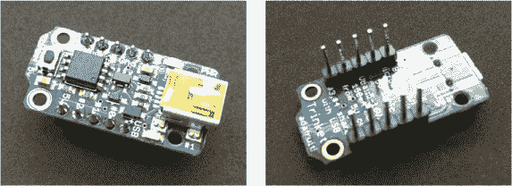

    **图 2-4：** 将引脚焊接到 Trinket 上。

1.  **焊接导线到 NeoPixel。** 接下来，将导线焊接到 NeoPixel 上的以下位置：

    +   PWR +5V（有两个引脚，任意一个都可以使用）

    +   GND（有两个引脚，任意一个都可以使用）

    +   数据输入

    你可以使用三个引脚，但我发现使用三根 8 英寸的导线效果最好，如图 2-5 所示。请注意，导线是从 LED 侧插入孔内，然后直接焊接到 NeoPixel 背面的铜环上（黑色的一面）。一般约定使用红色导线连接电源，黑色导线连接 GND（地）。

    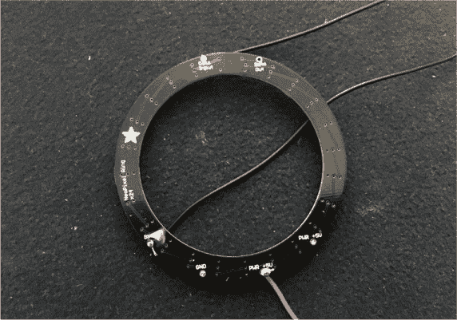

    **图 2-5：** 将导线焊接到 NeoPixel 环上。

    **注意**

    *如果你剪掉两个母跳线的末端并将它们焊接到电池盒的红黑导线上以延长这些导线，这一步将变得更容易。*

1.  **焊接插头。** 接下来，拿起电池盒，剪掉末端的白色插头，并剥去红黑两根线末端大约 1/4 英寸的绝缘层。

    红线将为 Trinket 提供电源，我们稍后会将其连接到 BAT 引脚。黑线不会直接连接到 Trinket；相反，NeoPixel 上的 GND 引脚和电池盒的黑线必须共享 Trinket 上的 GND 引脚。为实现这一点，请拿出之前放置的三个引脚，用焊锡将它们一侧的所有引脚焊接，以创建一个共同连接点，您可以将三根导线连接到此处，如图 2-6 所示。

    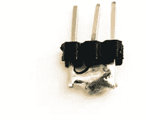

    **图 2-6：** 使用引脚创建一个小的共享连接。

1.  **连接各个部件。** 一旦所有引脚都准备好，使用在第 2 步中焊接的导线或指定位置的母跳线（见图 2-7）进行以下连接：

    +   将 NeoPixel 的数据输入连接到 Trinket 上的#0 引脚

    +   将 NeoPixel 的 PWR +5V 连接到 Trinket 上的 5V 引脚

    +   将 NeoPixel 的 GND 连接到三个公共连接引脚中的一个

    +   将电池盒的红线连接到 Trinket 上的 BAT 引脚

    +   将电池盒的黑线连接到三个公共连接引脚中的一个

    +   将 Trinket 上的 GND 通过母跳线连接到三个公共连接引脚中的一个

    如果你有热缩管，可以将其套在焊接点上；如果没有，普通的电工胶带也可以。

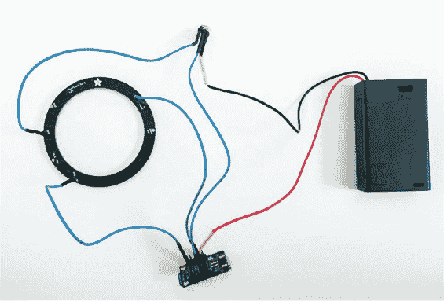

**图 2-7：** 所有组件接线完成，准备测试

一旦所有连接完成，将电池放入电池盒并将开关拨到“开”位置。如果 NeoPixel 草图已正确加载到 Trinket，并且接线正确，你将看到 NeoPixel 上显示的随机动画和颜色。

#### 故障排除

如果你没有看到任何动画，首先检查所有接线连接。小的三头常用连接器经常是问题所在，所以确保所有电线都有良好的连接。

如果接线没问题，将 Trinket 连接到你的电脑，再次上传草图；上传未来的草图时，你无需断开所有电线。你也可以重新上传 Blink 草图，并用它来测试 Trinket 是否正常工作。

一旦你看到 NeoPixel 显示出色彩斑斓的动画，就可以开始制作 UFO 机身组件了。

#### 创建 UFO 机身和着陆垫

创建自定义的 UFO 机身可能需要一些时间，因此我已经将我用来制作 UFO 机身和着陆垫的 3D 打印文件与本书的资源一起提供在* [`nostarch.com/LEDHandbook/`](https://nostarch.com/LEDHandbook/)*。如果你熟悉 CAD 软件，可以轻松修改这些文件或创建自己的设计。

UFO 机身作为一个整体打印。它的底部是空心的，这里将放置 NeoPixel 环。机身上还会有三个孔，三个吸管将被插入这些孔中，作为支撑腿。

UFO 机身是在 Tinkercad 中创建的（* [`www.tinkercad.com`](http://www.tinkercad.com)*），如图 2-8 所示。它基于从 NeoPixel 环、吸管和底座的直径所测得的尺寸。我还测量了塑料圆顶的尺寸，以便在 UFO 机身上为其预留适当的空间。尺寸如下：

**NeoPixel** 外径 6.5 厘米，内径 5.3 厘米

**吸管** 外径 0.5 厘米

**塑料圆顶** 外径 2.9 厘米

**底座** 直径 12 厘米

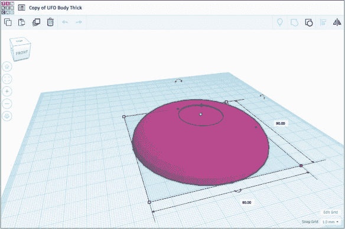

**图 2-8：** Tinkercad 中的 UFO 机身设计

项目的基础仅仅是一个大塑料容器的圆形盖子。你需要确保盖子至少有 1.5 厘米高，并且足够大，可以将电池盒放在下面，而不会使整个结构摇晃。记住，电线将从底部插入，通过吸管隐藏在视线之外。

我们还需要三个小型着陆垫，中间有孔，用于将 Trinket 和电池盒的电线通过吸管引入 UFO 机身。图 2-9 展示了着陆垫的最终设计，这些着陆垫也可以使用 3D 打印机制作。

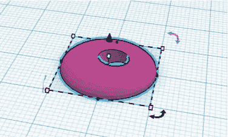

**图 2-9：** 着陆垫的设计

图 2-10 展示了最终打印的 UFO 机身，准备组装（并且稍后进行上色）。

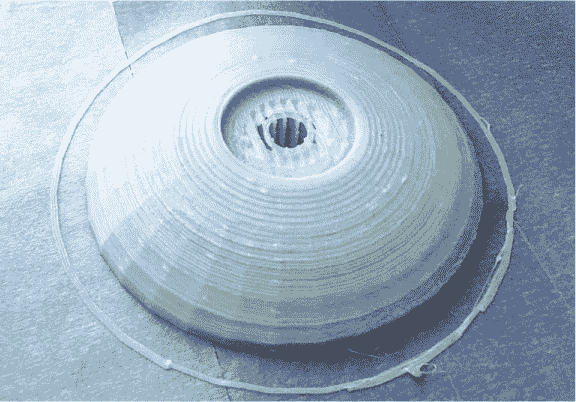

**图 2-10：** 3D 打印的飞碟机身

在电子组件准备好，飞碟机身、着陆垫和底座都收集齐全之后，只有几个最后的步骤需要完成，你的飞碟就可以启动了。

### 组装它

我们将分阶段组装桌面飞碟。我建议在开始组装之前，先阅读整个部分，这样你就能了解整个过程和各个部件如何配合。

1.  **安装电池盒。** 在飞碟底部（塑料盖）钻一个 3/8 英寸的孔，以便电池盒的开关可以访问。你可以选择自己喜欢的位置，但我选择在底座的边缘附近钻孔，如图 2-11 所示。

    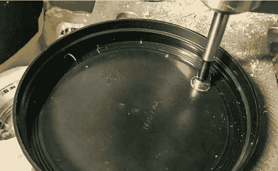

    **图 2-11：** 用于访问开关的孔

    将电池盒放置在一个可以更换电池的位置。在粘合之前，确保电池盒的开关与钻好的孔对齐。将少量热熔胶涂抹在电池盒的背面，并将其固定在底座的底部。图 2-12 显示了电池盒已粘贴到位。

    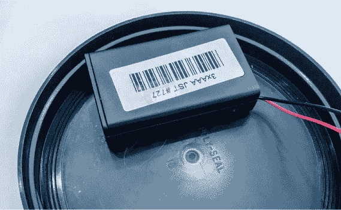

    **图 2-12：** 将电池盒用热熔胶粘到底座底部。

    等胶水干透后，将底座翻过来，确保你可以通过钻孔移动开关，如图 2-13 所示。

    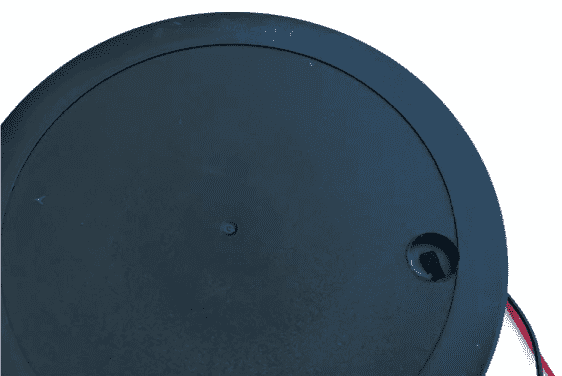

    **图 2-13：** 应该能访问开关。

1.  **安装 NeoPixel。** 接下来，使用两小块热熔胶将 NeoPixel 固定在飞碟机身的底部。图 2-14 显示了我如何在 NeoPixel 的两侧使用热熔胶；如果在将其放入机身之前让热熔胶稍微冷却几秒钟，它不会损坏 NeoPixel，并且可以帮助你将其中心对准飞碟机身。

    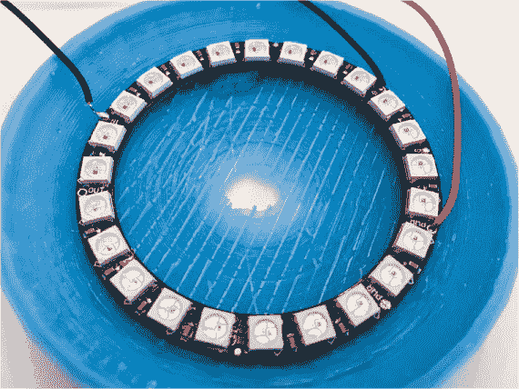

    **图 2-14：** 用热熔胶将 NeoPixel 环固定在飞碟机身下方。

    使用蓝色油漆胶带将三根电线固定在机身边缘。你还应使用小块胶带标记 NeoPixel 的每根电线（GND、PWR +5V 和数据输入）。

1.  **准备着陆垫。** 在每根吸管的可弯曲部分周围涂上一些热熔胶，并将短而灵活的末端插入每个着陆垫，如图 2-15 所示。不要把吸管插入孔里太深；只需插入足够让胶水把吸管固定在着陆垫上的长度即可。每个着陆垫上方应该有一点吸管的可弯曲部分可见。

    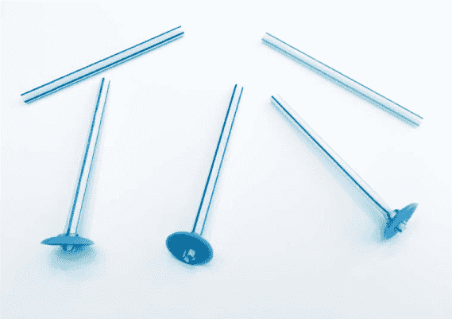

    **图 2-15：** 用热熔胶将每根吸管的柔性部分粘到着陆垫上。

    完成将柔性端粘入着陆垫后，从每根吸管的较长部分剪下约 3 英寸；你可以在组装完 UFO 后再微调长度，但 3 英寸或更多的长度应该足够你在平衡飞碟与支脚时进行实验。

1.  **固定 Trinket 并为着陆垫钻孔。** Trinket 需要固定在底座下面；你可以使用画家胶带暂时将其固定，直到桌面 UFO 完成，然后用热熔胶或更强的胶带将其固定。

    图 2-16 显示了我已经固定好 Trinket，并将电线整理到接近我要为着陆垫钻孔的位置。

    你只需要在一个着陆垫下方钻孔。这个孔也可以用 3/8 英寸的钻头来钻（而且你可以在钻之前描述的开关孔时同时钻这个孔）。柔性吸管使你可以弯曲支脚，因此不必精确地确定钻孔位置，但尽量想象一个等边三角形，着陆垫将在 UFO 机体下方粘贴，并在距离电池盒开关最远的地方钻孔。

    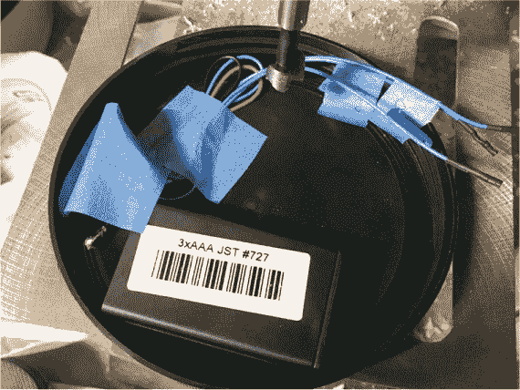

    **图 2-16：** Trinket 已固定好，电线被捆绑在一起。

    你需要断开一些电线，以便通过吸管；图 2-17 显示了一个着陆垫的孔和从 Trinket 拉出的电线。

    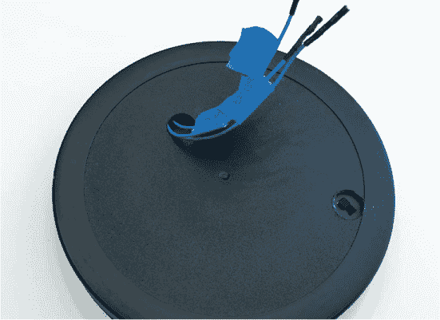

    **图 2-17：** 着陆垫孔和 Trinket 电线

1.  **将 Trinket 的电线连接到 NeoPixel。** 使用你制作的着陆垫和吸管的一根支脚，插入 Trinket 的三根电线，使电线末端从吸管穿出来。如果吸管太长，修剪它，直到三根电线的末端可以方便地连接到 NeoPixel 的电线，如 图 2-18 所示。

    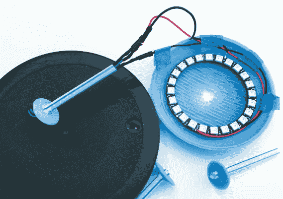

    **图 2-18：** Trinket 电线连接到 NeoPixel 电线

    记得，将 Trinket 的 5V 电线连接到 NeoPixel 的 PWR +5V 电线。（在照片中，这根电线是红色的，但你的电线颜色可能不同。）Trinket 的 GND 电线连接到 NeoPixel 的 GND 电线，Trinket 的 #0 电线连接到 NeoPixel 的数据输入电线。

    所有电线连接好后，翻转开关，测试 NeoPixel 是否仍然显示动画。如果没有，重新检查所有连接是否符合之前的说明，并返回查看 “故障排除” 部分，参见 第 55 页。

1.  **粘贴着陆垫。** 在每个着陆垫的底部放一点热熔胶；你可能需要从吸管上修剪掉更多的塑料，以便让垫子平稳地贴合在底座上。图 2-19 显示了三个着陆垫都已经粘到底座上的情况。

    你可以利用吸管的柔性部分调整着陆垫的角度。调整着陆垫的角度，让 UFO 的机身能够稳稳地落在三只脚上。把透明圆顶放到顶部，打开开关。希望你能看到 UFO 底部透出的漂亮光芒！

    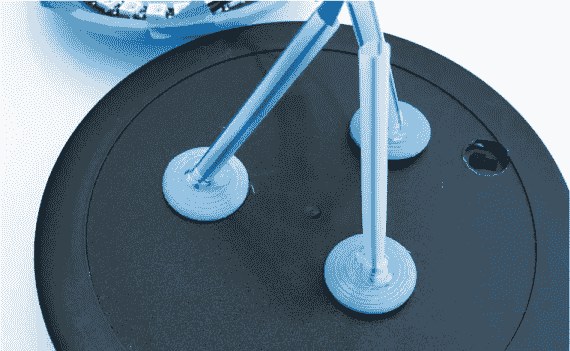

    **图 2-19：** 用热熔胶将三个着陆垫固定在底座上。

如果你对动画效果满意，可以使用一些额外的热熔胶将 UFO 机身固定在支腿上；翻转底座和支腿时要小心，最好有人帮忙确保支腿粘牢。使用胶带或涂上一点热熔胶，把 UFO 机身底部暴露的线缆藏起来。

用一些油漆（我推荐使用银色给 UFO 机身上色），最终你将得到一个很酷的桌面雕塑。

### 进一步提升

这个 UFO 可以轻松修改。你可以添加一些武器，或者改变形状让它看起来更具威胁性。你还可以将 NeoPixel 替换成 Adafruit 的其他特色 LED——有很多种变化，你很可能会找到吸引眼球的设计。

以下是一些其他的想法，可以用来升级桌面 UFO：

+   在透明圆顶下方添加一个脉冲 LED

+   添加随机音效

+   在 UFO 下方放一个玩具奶牛小雕像

### 总结

有很多方法可以装饰桌面 UFO，这确实是一个很好的项目，能够教年轻学生一些关于电学、编程以及原型设计的基础知识。最终的 UFO 不需要完美；这款 UFO 有些瑕疵，但它能正常工作并且看起来很酷——对我来说，这就足够了！
