## 第四章：约翰·贝奇塔尔的《作弊者的掷骰器》

在这个项目中，你将构建一个带有小惊喜的数字掷骰器。

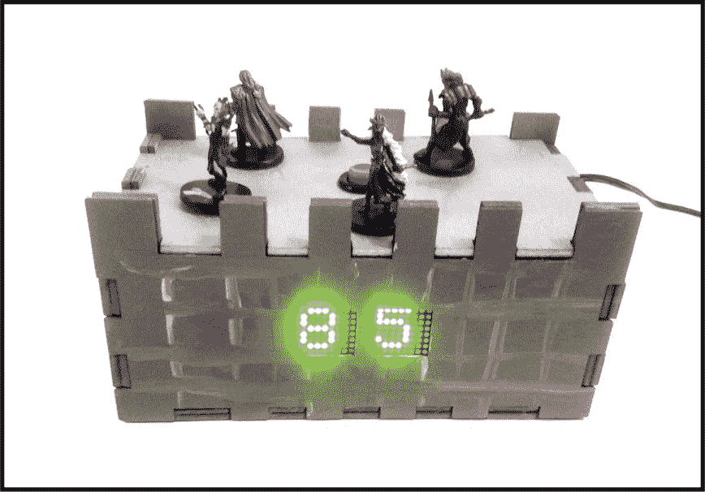

你是否因为玩太多*龙与地下城*或其他桌面角色扮演游戏而患上了“多面骰肘”？（我说的就是那些有许多不同形状的骰子。玩家扔这些骰子太多次可能会拉伤韧带！）或者你只是想享受用电子方式生成骰子结果的便捷？无论哪种情况，这个掷骰器都能为你提供解决方案，甚至更多。

你可以在标准的 20 面 D&D 骰子和两颗 10 面骰子之间切换，适用于《战锤奇幻角色扮演》和其他系统，虽然我会教你如何将其定制成任何两位数的组合。然而，这不仅仅是一个普通的掷骰器：内置的作弊功能使它与众不同。我会教你如何在不让任何不知情的游戏伙伴察觉的情况下，利用磁铁、传感器和一些巧妙的手法，触发高掷或低掷骰子的结果。

我将项目外壳做成了一个中世纪城堡的形状，使用激光切割木材制作。本章的最后部分将进一步讨论我的外壳设计理念以及如何制作你自己的外壳。

### 获取部件

获取以下部件来构建你的掷骰器。我大多数部件是从 Adafruit 和 SparkFun 订购的。

#### 组件

**注意**

*请参见 “开始使用 Arduino 和 Arduino IDE” 章节中的 第 15 页，了解设置说明。*

+   Arduino Uno（Adafruit P/N 50 或 SparkFun P/N 11021）

+   USB A-B 数据线（Adafruit P/N 62）

+   两个 8 × 8 LED 矩阵，带 I²C 背包（Adafruit P/N 872）

+   两个簧片开关（SparkFun P/N 8642）

+   大型按钮（例如，SparkFun P/N 9336）

+   双投掷开关（Adafruit P/N 805）

+   墙插式电源适配器或 9V 电池夹（Adafruit P/N 63 或 Adafruit P/N 80）

+   蜂鸣器（Adafruit P/N 1739）

+   10 kΩ电阻（SparkFun P/N 10969 是一个不错的多件套）

+   足够强大的磁铁，用来可靠地触发传感器（例如，Adafruit P/N 9）

+   （可选）面包板（SparkFun P/N 12002）

**注意**

*为项目供电，可以选择 9V 墙插式电源适配器（如 Adafruit P/N 63）或 9V 插头适配器（如 Adafruit P/N 80），然后插入 Arduino 上的电源插口。*

#### 工具

+   激光切割机或锯子（如曲线锯或带锯）

+   焊接铁

+   焊锡

+   电线剪和钳子

+   电线

+   热熔胶枪

+   木工胶水

+   喷漆

### 介绍 LED 矩阵

我们使用 8 × 8 LED 矩阵来显示骰子投掷的结果。LED 矩阵的每个像素都是独立的，你可以选择性地触发它们，点亮或调暗每个 LED 来形成图案。最简单的方式是将每个像素的状态存储在数组中。例如，图 3-1 展示了一个选择性点亮的 LED 数组，形成了一个笑脸。

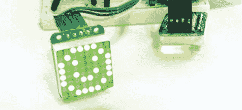

**图 3-1：** 使用数组存储笑脸图案。

你可以使用 Arduino 上的代码控制 LED 矩阵。Arduino 草图查看数组以查看每个 LED 的状态，在每次草图循环时点亮或关闭它们。

以下代码片段可以让你了解它是如何工作的：

```
smile_bmp[] =
{ B00111100,
  B01000010,
  B10100101,
  B10000001,
  B10100101,
  B10011001,
  B01000010,
  B00111100 },
```

每一行代表矩阵上的一行，每个数字代表一个 LED。当 LED 的值设置为 `1` 时，它会亮起；当设置为 `0` 时，它会熄灭。你可以用这种方法设计任何你想要的图形。

然而，每次为每个设计手动输入这些内容可能会很繁琐，因此有一个方便的数据库，其中包含由 Arduino 库控制的矩阵形状，这些形状用于本项目中的矩阵。该库存储了绘制字母和数字的函数，以及基础形状，如方形和圆形，因此你不需要从头开始设计这些形状。在第 71 页的 “代码实现” 中，我将解释草图如何与库交互来绘制这些默认形状。

**注意**

*如果你需要焊接说明，请参见附录。*

### 构建它

按照以下步骤构建一个骰子滚动器，可以秘密地执行你的命令：

1.  **将矩阵焊接到它们的板子上。** 矩阵配有被称为 *背包* 的迷你控制板，这些控制板通过仅用少数几根电线来管理 64 个 LED 的复杂性。你需要将这些背包焊接到矩阵上：将矩阵添加到背包上，IC（*集成电路*，也称为 *微芯片*）位于底部，然后将引脚焊接到孔中。最终效果应如下所示：图 3-2。矩阵没有上下之分，只要你将它添加到板子的正确一面即可。如果你需要更多指导，请参考该产品（P/N 872）在 *[`www.adafruit.com/`](http://www.adafruit.com/)* 上的页面。

    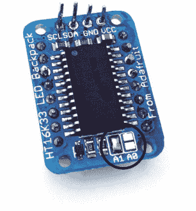

    **图 3-2：** 焊接一个或两个跳线来更改矩阵的 I²C 地址。

1.  **焊接引脚或电线。** 有四个引脚将矩阵与项目的其余部分连接。如果你计划将矩阵与面包板一起使用，请焊接随附的头引脚。如果你打算使用电线代替，引脚可以不焊接。

1.  **焊接板引脚 A1。** 特别重要的是两个 A0 和 A1 焊盘，见于图 3-2，它们允许你通过选择性地焊接焊盘来将最多四个矩阵串联在一起。这被称为“更改 I²C 地址”。如果不焊接任何焊盘，则该矩阵的 I²C 地址默认为 0x70。焊接 A0 将地址设置为 0x71，焊接 A1 将地址设置为 0x72，焊接 A0 和 A1 两个焊盘则将地址设置为 0x73。为每个矩阵分配独立的地址，可以让我们在共享电线的情况下与某个矩阵通信，而不会干扰其他矩阵。你只需要在一个板子上的引脚上加焊，因此请在引脚 A1 上加焊。

1.  **连接矩阵到 Arduino。** 将矩阵放置在面包板上，并分别将电源和接地轨道连接到 5V 和 GND，然后将面包板两侧的电源轨道连接，如图 3-3 所示。将第一个矩阵的电源和接地引脚分别连接到板上的电源和接地引脚，然后连接两个矩阵的电源和接地引脚，使它们都能获得电源。还需要连接数据线和时钟线。将 Arduino 的 A4 和 A5 引脚分别连接到第一个背包的 D 和 C 引脚，另外用一对电线将第一个矩阵的 D 和 C 引脚连接到第二个矩阵的 D 和 C 引脚。在图 3-3 中，数据线和时钟线分别是黄色和绿色的。

    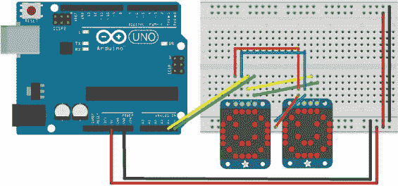

    **图 3-3：** 连接矩阵。

    根据你的项目需求，你可能需要用电线连接矩阵，而不是将它们插入面包板，以便它们能适配。如果是这种情况，仍然可以像图 3-3 所示那样连接矩阵。

1.  **连接双刀开关。** 接下来，按照图 3-4 所示连接双刀开关，中间的引线连接到 5V（粉色线），左侧和右侧的引线分别连接到 Arduino 的数字引脚 10 和 11（棕色线）。同时，将开关的左右引线通过 10 kΩ电阻接地，如图 3-4 所示。这种开关将决定是使用 D&D d20 模式还是 Warhammer d100 模式：Arduino 可以通过扫描 10 号和 11 号引脚来检查开关的位置。

    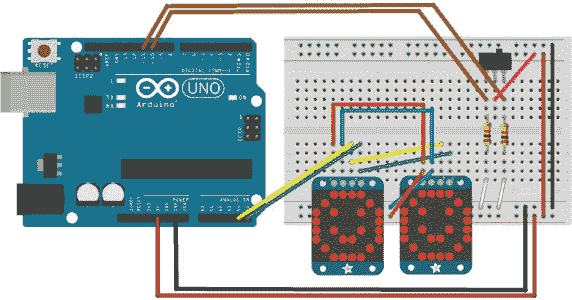

    **图 3-4：** 添加双刀开关

1.  **连接簧片开关。** 接下来是连接簧片开关。如图 3-5 所示，将开关连接到 Arduino 的 5 号和 6 号引脚（紫色线），另一个引线连接到地（灰色线）。

    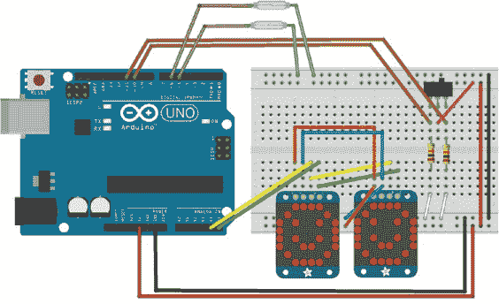

    **图 3-5：** 簧片开关告诉 Arduino 何时有磁铁靠近。

1.  **添加重置按钮。** 重置按钮并不是用来在出错时重新开始的；它实际上是你的掷骰子按钮。项目软件规定骰子掷一次然后停止，你必须断电或重置 Arduino 才能重新掷骰子。图 3-6 显示了按钮的安装位置。将一个引线连接到 Arduino 电源总线上的 Reset 引脚（橙色线），另一个引线连接到 GND（粉色线），根据需要将电线焊接到按钮的引脚上。当按钮被按下时，Arduino 会重新启动并自动重新运行骰子滚动程序。

    

    **图 3-6：** 添加一个按钮来重置 Arduino

1.  **安装蜂鸣器。**蜂鸣器完成了整个项目。它会发出声音来表示骰子投掷已完成。我在零件列表中包含的蜂鸣器具有适合面包板的引线，并且如图 3-7 所示进行连接：将正极引线连接到 Arduino 的 9 号引脚，负极引线连接到 GND。

    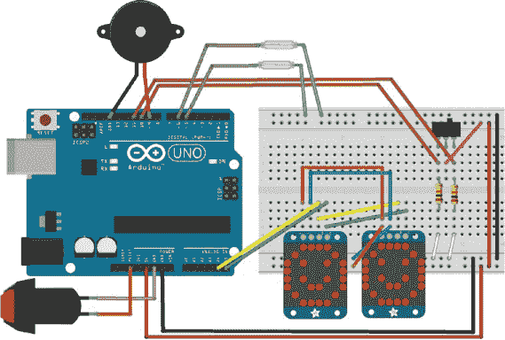

    **图 3-7：**蜂鸣器接线

现在是时候添加代码了！

### 编写代码

现在电子组件已经组装好，是时候通过将代码上传到 Arduino 来测试项目了。

LEDBackpack 库在此脚本中完成了大部分繁重工作。背包的库包含完整字母表的代码，并且可以绘制诸如线条、圆形和方形等形状。你需要从 Adafruit 产品页面下载此库（* [`learn.adafruit.com/adafruit-led-backpack/0-8-8x8-matrix`](https://learn.adafruit.com/adafruit-led-backpack/0-8-8x8-matrix) *），并将其保存到你的 Arduino 库文件夹中，才能使用它。如果你想了解更多，还可以访问该页面，里面有教程和大量信息。

项目的代码也包含在本书的资源中，所以现在打开 Arduino IDE 并让我们逐节查看代码。

代码的第一部分包含对示例中使用的三个库的引用。

```
#include <Wire.h>
#include "Adafruit_LEDBackpack.h"
#include "Adafruit_GFX.h"
```

接下来，背包正式初始化：

```
Adafruit_8x8matrix matrix1 = Adafruit_8x8matrix();
Adafruit_8x8matrix matrix2 = Adafruit_8x8matrix();
```

我们将背包命名为`matrix1`和`matrix2`。然后我们启用串口通信，以便进行调试：

```
void setup() {

  Serial.begin(9600);
```

这使得我们可以与串口监视器进行通信。接下来，我们初始化一些引脚：

```
pinMode(5, INPUT_PULLUP);
pinMode(6, INPUT_PULLUP);
pinMode(9, OUTPUT);
 pinMode(10, INPUT);
 pinMode(11, INPUT);
```

与双投掷开关、蜂鸣器和簧片开关交互的引脚已初始化。在后一种情况下，已初始化引脚以使用 Arduino 的内置电阻器，确保不会出现误触发作弊模式的情况。

这一行初始化随机数：

```
randomSeed(analogRead(0));
```

通过读取 A0 引脚的值，我们初始化将用作骰子投掷的随机数。接下来，我们需要启动矩阵：

```
matrix1.begin(0x70);  // the default
matrix2.begin(0x72);  // with A1 soldered

matrix1.clear();
matrix2.clear();
```

这让 Arduino 知道启动矩阵，并确保所有 LED 从关闭状态开始。这是开关的引脚声明：

```
int reedLow = 5;
int reedHigh = 6;
int switch1 = 10;
int switch2 = 11;
```

记住我们有两种不同类型骰子的设置。这是 d100 骰子的数字生成功能：

```
// switch selection roll d100

if (digitalRead(switch1) == HIGH) {

  int tensDigit = random(0, 10);
  int onesDigit = random(0, 10);

  Serial.print(tensDigit);
  Serial.println(onesDigit);
  Serial.println();
```

我们将使用投掷开关在 d100 模式和 D&D 骰子模式之间切换。在此模式下，如果开关设置为 d100，Arduino 将投掷两个随机数，每个数值在 0 到 9 之间。然后它将这些数字打印到串口监视器，但尚未打印到矩阵上。

接着，我们需要监听簧片开关，看看它们是否被磁铁触发，通过两个`if`语句来实现——这就是我们的作弊方式。

```
if (digitalRead(reedLow) == LOW) {
  tensDigit = 0;
  onesDigit = 1;
}

if (digitalRead(reedHigh) == LOW) {
  tensDigit = 0;
  onesDigit = 0;
}
```

如果簧片开关被触发，产生的随机值将被一个最大值或最小值所替代，具体取决于触发了哪个簧片开关。两个数字将被写入`matrix1`和`matrix2`：

```
  // write result
  matrix1.setTextSize(1);
  matrix1.setTextWrap(true);
  matrix1.setTextColor(LED_ON);
  matrix1.print(tensDigit);
  matrix1.writeDisplay();

  matrix2.setTextSize(1);
  matrix2.setTextWrap(true);
  matrix2.setTextColor(LED_ON);
  matrix2.print(onesDigit);
  matrix2.writeDisplay();
}
```

然后，我们有 d20 的随机数生成器：

```
// switch selection roll d20

if (digitalRead(switch2) == HIGH) {
  int d20result = random(0, 20);

  Serial.print("d20 result: ");
  Serial.println(d20result + 1);
  Serial.println();
```

如果开关设置为 d20，即经典的 D&D 骰子，Arduino 将生成一个 0 到 19 之间的随机数，增加 1，然后将结果发送到串口监视器。以下一系列的`if`语句允许草图在触发簧片开关时，用作弊手段覆盖掷出的数字：

```
  if (reedLow == LOW) {
    d20result = 0;
  }

  if (reedHigh == LOW) {
    d20result = 19;
  }

  if (d20result == 19) {
    tensDigit = 2;
    onesDigit = 0;
  }

  else if (d20result > 9) {
    tensDigit = 1;
    onesDigit = d20result - 9;
  }

  else if (d20result == 9) {
    tensDigit = 1;
    onesDigit = 0;
  }

  else if (d20result < 9) {
    tensDigit = 0;
    onesDigit = d20result + 1;
  }

}
```

无论结果如何，掷出的数字需要在矩阵上显示：

```
// write result
matrix1.setTextSize(1);
matrix1.setTextWrap(true);
matrix1.setTextColor(LED_ON);
matrix1.print(tensDigit);
matrix1.writeDisplay();

matrix2.setTextSize(1);
matrix2.setTextWrap(true);
matrix2.setTextColor(LED_ON);
matrix2.print(onesDigit);
matrix2.writeDisplay();
```

这会显示结果。程序运行一次后停止。

```
}

void loop() {
}
```

因为我们只需要代码运行一次，所以不需要使用循环，它也就没有被使用！草图完成。

### 组装它

接下来，你需要一个盒子来封装你的项目。你可以有几种不同的方式来处理这一步。

#### 激光切割你自己的外壳

我的第一个建议通常是设计并自己动手制作。我的设计像一个小城堡（见图 3-8），这不仅让你感受到剑斗和魔法咒语的氛围，而且还能帮助掩盖你触发簧片开关、改变游戏结果的方法。（关于最后一点，我会在这一部分之后详细说明。）在这里，我将展示我如何制作我的城堡外壳。

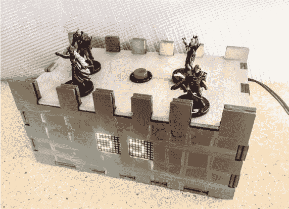

**图 3-8：** 我的城堡骰子掷骰器，准备就绪

1.  **设计外壳。** 使用像 Inkscape (*[`inkscape.org/`](https://inkscape.org/))* 这样的矢量图形程序，或者像 MakerCase (*[`www.makercase.com/`](http://www.makercase.com/))* 这样的在线工具来设计你的外壳。你还可以下载我在书中提供的城堡设计资源 (*[`nostarch.com/LEDHandbook/`](https://nostarch.com/LEDHandbook/))*，并根据需要重新创建或修改它。图 3-9 显示了我在 Inkscape 中设计的外壳。你可以用四分之一英寸的胶合板或等效材料来切割——我使用了双层的八分之一英寸胶合板。

1.  **输出设计。** 在 CNC 路由器或激光切割机上切割设计。图 3-10 展示了我从激光切割机中取出的设计。

    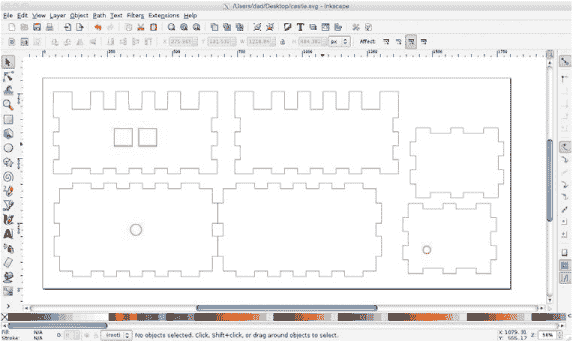

    **图 3-9：** 我在 Inkscape 中设计了我的城堡设计，并借助了*[makercase.com](http://makercase.com)*。

    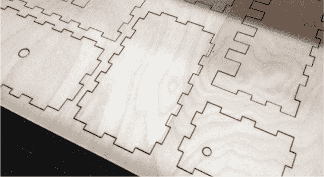

    **图 3-10：** 我的设计，刚刚激光切割完成

1.  **组装城堡。** 清理并组装城堡，如图 3-11 所示。很少有设计能够直接从机器上出来就能组装，因此你应该计划使用锉刀和砂纸处理切割部件，以使它们能够合适地拼接。当你准备好时，将部件粘合在一起。

    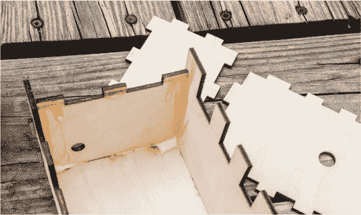

    **图 3-11：** 组装激光切割的部件。

1.  **涂装并装饰城堡。** 涂装城堡，正如图 3-12 所示。我建议使用光面喷漆，以防止污垢和指纹。另一个不错的涂料来源是当地的爱好商店，那里肯定有各种各样的“地下城灰”和“史莱姆绿”，可以用于增加细节。没有血迹和苔藓，怎么能算是一个合适的骰子滚筒呢？

    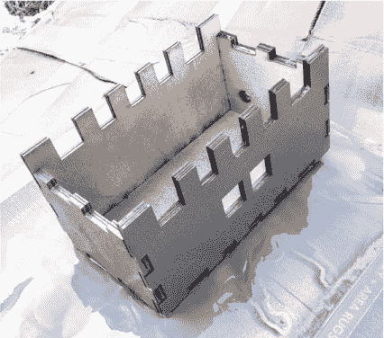

    **图 3-12：** 一层银色涂料为城堡增添了光彩。

1.  **添加电子元件。** 将你的项目放入外壳中，确保按钮可以触及。街机按钮体积较大，可能会影响 Arduino 的位置。你还需要注意簧片开关的位置。在固定它们之前，务必用磁铁测试开关的位置，确定磁铁需要放置的位置，以便开关能够感应到它。

#### 替代外壳

如果你没有激光切割机或铣床，那么就需要找到其他方法来容纳你的项目。这里有几个建议：

+   **重新利用另一个盒子。** 只需找到一个结实的合适大小的盒子来放置组件，并把它们放进去。切出孔洞，以便安装按钮、开关和矩阵。

+   **购买外壳。** 你还可以在网上找到许多便宜的项目盒子。我最喜欢的来源之一是 Jameco Electronics（*[`www.jameco.com/`](https://www.jameco.com/)*），它提供不同尺寸和耐用性的盒子。和重新利用的盒子一样，你需要注意项目内部的空间占用。像 Jameco P/N 18869 这种 8×6×3 的项目盒就能完美适用。

+   **用乐高积木搭建一个外壳。** 你家里很可能已经有一个合适的外壳，放在地下室的桶里，旁边堆着节日箱子。我说的就是乐高！只需搭建一个合适大小的盒子，留出按钮、开关、LED 矩阵和电源线的位置。

### 使用它

只需通过将墙壁适配器或 9V 电源适配器插入电源插孔，给骰子滚筒供电，然后每次想掷骰子时按下按钮，根据你的邪恶目标使用磁铁靠近任一簧片开关。

我通过将一个底部有空心塑料基座的游戏人物伪装成磁铁，使用热熔胶将磁铁粘在基座上，正如图 3-13 所示。簧片开关被放置在城堡顶部附近，触发它们时，只需将带有磁铁的人物放置在城堡的城垛旁，并与一些无害的人物一起摆放。在游戏过程中，你可以将人物移到“城堡”周围，根据需要将触发人物移到正确的位置。


**图 3-13：** 将磁铁用热熔胶粘在游戏人物的底座上，并用它触发骰子滚筒。

### 总结

当你完成这个项目的硬件和软件部分时，它应该看起来像第 65 页的照片，或者是你自己富有创意的设计的变体。

希望你也在为欺骗你的游戏伙伴的道德问题而挣扎。祝你这个项目顺利！
