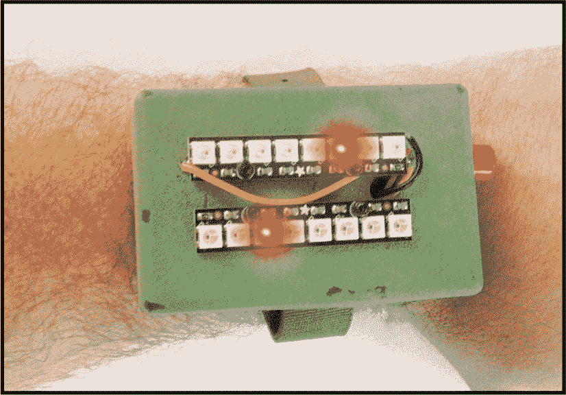
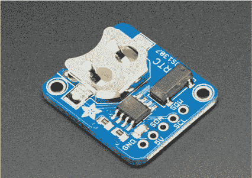
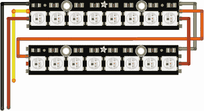
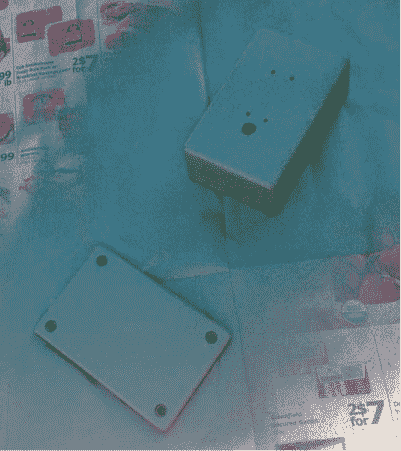
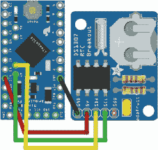
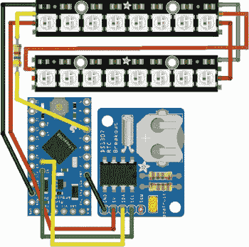
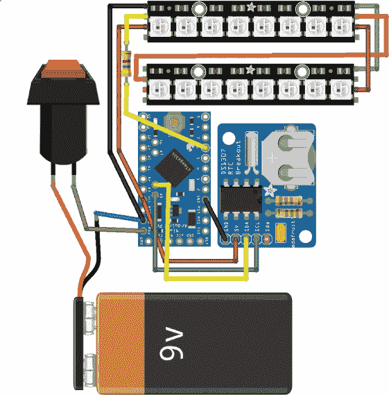
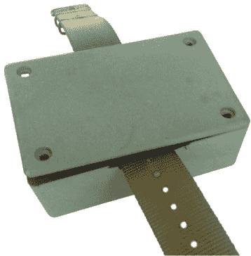

## 第五章：由 John Baichtal 制作的彩色编码 LED 手表

在这个项目中，你将制作一款使用颜色显示时间的手表。



尽管手机、微波炉甚至咖啡机中都有数字时钟，你可能会认为再做一个时钟是多余的。另一方面，多久你在重要电话中、徒步旅行时，或者完全不在厨房附近时需要知道时间呢？便携式手表依然有它的市场，而为了让它更现代化，我想出了一个解决方案：一款定制的数字时钟，拥有一个引人入胜、神秘的显示屏。

在这个项目中，你将使用一对八点 NeoPixel LED 条来通过*颜色*展示时间。虽然一开始可能不清楚如何通过颜色来判断时间，但继续跟进，你会发现其中的窍门。我们手表的大脑将是 Arduino，它简化了部分时间显示的过程，但也带来了特别的挑战。

### 获取部件

你将需要以下部件来构建这个项目。

**注意**

*请参见 “使用 Arduino 和 Arduino IDE 入门”（第 15 页）中的设置说明。*

#### 组件

+   Arduino Pro Mini（SparkFun P/N 11113；附加引脚可以通过 P/N 00116 获取。）

+   FTDI 基本扩展板（SparkFun P/N 09716；这是一个必要的编程器，用于编程 Arduino Pro Mini。）

+   2 根 NeoPixel 条（Adafruit P/N 1426 或 SparkFun P/N 12661；这是一条包含八个 LED 的 RGB 条。）

+   DS1307 RTC 扩展板（SparkFun P/N 12708；其他选择包括 Adafruit P/N 255 或 Adafruit P/N 3013。）

+   470 Ω 电阻（SparkFun P/N 10969 是一个不错的多件装）

+   外壳（我的外壳的最大边长为 85 mm × 55 mm，深度为 30 mm；可以通过在线搜索其 P/N，WCAH2855 来找到它。一个类似的部件是 RadioShack 的经典 3 × 2 × 1 项目外壳，P/N 2701801。）

+   手表带（任何普通的尼龙或橡胶手表带都可以。我使用了来自亚马逊的山寨 iWatch 手表带。）

+   9 V 电池包和电池（一个标准的 9 V 连接器带导线；我使用的是 Jameco P/N 109154。你也可以购买 SparkFun P/N 00091 的快拆连接器，并剪掉插头。）

+   按钮（我使用了 SparkFun 的面板安装瞬时按钮，P/N 11992。按钮越小越好。如果你希望显示器一直显示，直到你关闭它，可以将按钮替换为开关。）

+   螺丝（我使用了 HobbyKing 的 M2 × 10 mm 螺丝和螺母，P/N HA0506。）

我们使用的这款小型 Arduino 提供了与其他 Arduino 相同的体验，但去掉了所有花哨的功能，以便能适配小型外壳。例如，你不能通过 USB 编程它，你需要一个 FTDI 扩展板（例如 SparkFun P/N 09716）来编程它。在开始构建这个项目之前，请参见 “没有内建 USB 连接的 Arduino 板”（第 21 页）了解如何设置 Arduino Pro Mini 和 FTDI。

在选择外壳时，记住 LED 条和 9V 电池是尺寸的主要限制。你可能还需要一个夹子来防止电池在外壳盒内滚动，尽管我的外壳已经密集地塞满了，什么都无法移动。

#### 工具

+   烙铁和焊锡

+   Dremel 或类似的旋转工具，带切割和钻孔工具

+   （可选）喷漆

### 介绍实时时钟模块

事实证明，保持准确的时间并不是 Arduino 擅长的事情。它们能够从秒到秒地很好地跟踪时间，得益于板上内置的时钟晶体，但它们必须使用自己的内部存储器来保留这些信息，因此当内存满时，时钟就会停止工作。另一个问题出现在 Arduino 失去电源时——你会失去时间，并且当你再次启动 Arduino 时需要重置时间。这些挑战的解决方案在于一个附加板，称为*实时时钟（RTC）*模块。

RTC 由一个专用的时间保持芯片和一个电池备份组成，因此即使主项目断电，它也能保留时间。它负责保持时间，因此你的 Arduino 就不必做这个工作。

图 4-1 显示了由 Adafruit Industries 销售的 DS1307 RTC 模块。它可以准确计算到 2100 年的日历，并考虑闰年的因素，通过两线接口与 Arduino 进行通信。



**图 4-1：** Adafruit 的 DS1307 扩展板帮助你的 Arduino 保持时间。

### 工作原理：LED 的颜色编码

由于只能使用一个小的时钟面，我们仅限于使用两个八个 LED 的条形灯来显示时间。我设计了一个系统——如图 4-2 所示——它通过 LED 的颜色来传递信息。我选择了五种颜色来代表数字，如表 4-1 所列。

**表 4-1：** 颜色的编号代码

| **颜色** | **数值** |
| --- | --- |
| 黑色 | 0 |
| 蓝色 | 1 |
| 红色 | 2 |
| 黄色 | 4 |
| 绿色 | 5 |

顶部的 LED 条将指示小时，底部的 LED 条将指示分钟。如前所述，每条 LED 条将有八个 LED。每个 LED 在条中的位置将是你应用于颜色在表 4-1 中所关联数字的*倍数*。例如，第七个点亮的黄色 LED（4）将是 4 × 7，所以如果它在底部条亮起，将表示 28 分钟。

你可以使用更多或更少的颜色，但为了简便，我决定只使用四种颜色（加上黑色）。我希望我的时钟使用与制造商用于电阻器颜色编码相同的颜色——在他们的世界里，0 是黑色，1 是棕色，2 是红色，依此类推。然而，棕色作为可见光并不容易显示出来，所以我用蓝色代替了它。最终，选择每个时间点的颜色并不重要。如果它对你有意义，就可以使用它。

为了避免使用更多的颜色来显示较大的时间，我们将在底部条形灯上点亮*第二个* LED，你可以将底部条形灯的两个数字加起来，计算出时间。记住，顶部条形灯表示小时，底部条形灯表示分钟。假设时间是上午 7:56，或者 756。为了表示这个时间，我可以在顶部条形灯的第 7 位点亮一个蓝色 LED，在底部条形灯的第 4 位（16）点亮一个黄色 LED，在第 8 位（40）点亮一个绿色 LED。图 4-2 展示了应该是什么样子的。如果你不确定我是如何得出这些数字的，请参考表 4-1。这将是一个很好的考验你心算能力的机会。


**图 4-2：** LED 的颜色和位置表示时间。这个模拟显示屏显示的是上午 7:56。

### 制作它

这款手表由电子元件和它们的外壳组成。我们将同时进行这两部分的工作。

**注意**

*如果你需要焊接的说明，请参阅附录。*

1.  **焊接 NeoPixel 条形灯。** 焊接两根短导线，将两个 NeoPixel 条形灯串联起来，如图 4-3 所示。将标记为 Dout（数据输出）的引脚连接到标记为 Din（数据输入）的引脚，这在图 4-3 中用橙色导线表示。将剩余的两个引脚，4-7VDC（红色）和 GND（灰色），分别连接到另一个条形灯的对应引脚。注意，有两个 GND 引脚，任意一个都可以使用。

    

    **图 4-3：** 将 LED 条形灯焊接在一起。

1.  **钻孔外壳。** 一旦你将 LED 条形灯接好，将它们放在外壳顶部，并用记号笔标记它们的安装孔位，以便钻孔；你还应该标记出导线将进入外壳的位置。与此同时，标记出你希望放置电源按钮的位置。

    一旦外壳标记好，就可以钻孔了。你也许还想考虑如何佩戴这款手表。如果你打算使用腕带，你需要弄清楚如何将腕带固定到外壳上。图 4-4 展示了我已经钻好孔的外壳。

    

    **图 4-4：** 在外壳上钻孔。

1.  **涂装外壳。** 如果黑色涂层让你觉得不满意，可以考虑给外壳涂上一层油漆。图 4-5 展示了我正在给外壳上色。我选择了类似军事风格的橄榄绿色。

    

    **图 4-5：** 用一抹色彩为普通黑色盒子进行个性化装饰。

1.  **将 RTC 连接到 Arduino。** 在油漆干燥时，开始焊接内部组件。首先连接 RTC 模块，将其接到 Arduino Pro Mini 上；参考图 4-6。将 RTC 上的 5V 接到 Arduino 的 VCC 引脚（在图 4-6 中用红色导线表示），将 GND 接到 Arduino 的 GND 引脚（用黑色导线表示）。将 SCL（串行时钟，用绿色导线表示）连接到 Arduino 的 A5 引脚，将 SDA（用黄色导线表示）连接到 A4 引脚。

    

    **图 4-6：** 将 RTC 连接到 Arduino。

    **注意**

    *FTDI 板未在接线图中显示，但你应该已经将它连接到你的 Pro Mini。如果你还没有这么做，请参见第 21 页的“没有内置 USB 连接的 Arduino 板”*。

1.  **将 LED 条安装到外壳上。** 涂料干燥后，你可以使用 M2 螺丝将 LED 条安装到外壳上。注意，LED 条的具体方向会影响你是否能准确读取数据。*两条 LED 条必须朝相同的方向排列*。在第 81 页我的原型照片中，你可以看到我有一条 LED 条与另一条方向相反。不过，这证明是一个问题，我在最终设计中修正了这个问题。确保按照接线图中显示的方向安装 LED 条。

1.  **连接 LED 条到 Arduino。** 将 LED 条的电源、接地和数据线按图 4-7 所示连接到 Arduino 上。

    

    **图 4-7：** 将 NeoPixel LED 条连接到 Arduino。

    数据线（以黄色电线表示）连接到 Arduino 的 6 号引脚，并通过一个 470 Ω的电阻保护 LED 条免受电力波动的影响。电源（红色）和接地（黑色）分别连接到+5V 和接地。

1.  **安装按钮或开关。** 将按钮接线并用随附的面板安装硬件将其固定在外壳上。将按钮的一根引脚连接到电池包的红线，如图 4-8 所示。将按钮的另一根引脚（以紫色表示）连接到 Arduino 的 RAW 引脚。电池包的 GND 线连接到 Arduino 的 GND 引脚。你也可以替换为一个开关，这样你需要手动打开和关闭显示器。代码无需修改——只要 LED 和项目的其他部分有电，LED 每秒更新一次。

    

    **图 4-8：** 安装按钮并将其引脚焊接到 Arduino 上。

1.  **安装手表表带。** 安装表带。我使用 Dremel 工具在外壳口和盖子之间铣出一个槽，能够在盖子固定后“夹住”表带。图 4-9 展示了表带的安装情况。

    

    **图 4-9：** 系上表带！

### 编写代码

让我们来看看这个项目的 Arduino 代码。你可以在本书的资源中找到名为*led_watch.ino*的文件，网址为*[`nostarch.com/LEDHandbook/`](https://nostarch.com/LEDHandbook/)*。清单 4-1（Listing 4-1）中设置了脚本。

**清单 4-1：** 库文件和声明

```
➊ #include <Adafruit_NeoPixel.h>
  #include <Wire.h>
  #include "RTClib.h"

➋ RTC_DS1307 RTC;

  #define PIN 6

➌ Adafruit_NeoPixel strip = Adafruit_NeoPixel(16, PIN,
  NEO_GRB + NEO_KHZ800);
```

我们从库声明开始 ➊。然后初始化 RTC ➋ 和 NeoPixel LED 条 ➌。按钮/开关不需要声明，因为它只是将电源连接到 Arduino。

如果你还没有安装相关库，那么在代码运行之前，你需要先安装它们。你可以从各自的产品页面下载并安装 NeoPixel 和 RTC 库，相关信息可以参考*[`www.adafruit.com/`](https://www.adafruit.com/)*。你应该已经安装了 Wire 库，因为它包含在 Arduino 软件中。

接下来，让我们深入探讨代码的核心部分，参见清单 4-2，它初始化了跟踪不同时间对应颜色的数组。

**清单 4-2：** 初始化数组

```
byte numberMatrix[60][8] = {  //array of numbers
  { //time 0
    2, 2, 2, 2, 2, 2, 2, 2    //all pixels red 
  },

  { //time 1
    1, 0, 0, 0, 0, 0, 0, 0    //pixel 1 is blue
  },

  { //time 2
    0, 1, 0, 0, 0, 0, 0, 0    //pixel 2 is blue
  },
--snip--
```

一共有 60 个条目——每分钟一个——但为了节省空间，这里只列出了三个作为示例。手表通过相同的数组来显示小时，因此 7 点的颜色编码与 7 点整后的分钟相同。部分出于调皮，部分为了调试，我让 0 点的颜色全部是红色。这样，你可以看到每小时的开始，同时如果你恰好在整点附近调试代码，这也能确认代码是否正常工作。

清单 4-3 定义了`setup()`函数。

**清单 4-3：** `setup()`函数

```
void setup() {
  Serial.begin(57600);
➊ Wire.begin();
➋ RTC.begin();

  strip.begin();
  strip.show(); // Initialize all pixels to 'off'

  if (! RTC.isrunning()) {
  ➌ Serial.println("RTC is NOT running!");
    // The following line sets the RTC to the date and time
    // this sketch was compiled
  ➍ RTC.adjust(DateTime(__DATE__, __TIME__));
  }
}
```

这一段代码首先引入 Wire ➊库，用于管理串行通信，并激活 RTC ➋。如果 RTC 芯片没有响应，Arduino 会将错误信息➌发送到串口监视器。接着，脚本会调整 RTC 的时间，使其与编译程序时的日期和时间匹配 ➍。

清单 4-4 包含`loop()`函数，其中包含控制 LED 条激活的代码。

**清单 4-4：** 激活循环

```
void loop() {
    //determine time
    DateTime now = RTC.now();

    int hourDisplay = (now.hour(), DEC);
    int minuteDisplay = (now.minute(), DEC);

  Serial.println();
    Serial.print("time: ");
    Serial.print(hourDisplay);
    Serial.print(':');
    Serial.println(minuteDisplay);

  //hour display
  for (int thisPin = 0; thisPin < 8; thisPin++) {

    int LEDcolor = numberMatrix[hourDisplay][thisPin];

    switch (LEDcolor) {

      case 0:
        strip.setPixelColor (thisPin, 0, 0, 0);
        break;

      case 1: //make that pixel blue
        strip.setPixelColor (thisPin, 0, 0, 100);
        break;

      case 2: //make that pixel red
        strip.setPixelColor (thisPin, 100, 0, 0);
        break;

      case 4: //make that pixel yellow
        strip.setPixelColor (thisPin, 100, 50, 0);
        break;

      case 5: //make that pixel green
        strip.setPixelColor (thisPin, 0, 100, 00);
        break;
    }
  }
    for (int thisPin = 0; thisPin < 8; thisPin++) {
      int LEDcolor = numberMatrix[minuteDisplay][thisPin];

      switch (LEDcolor) {

        case 0:
          strip.setPixelColor ((thisPin+8), 0, 0, 0);
          break;

        case 1:
          strip.setPixelColor ((thisPin+8), 0, 0, 100);
          break;

        case 2:
          strip.setPixelColor ((thisPin+8), 100, 0, 0);
          break;

        case 4:
          strip.setPixelColor ((thisPin+8), 100, 50, 0);
          break;

        case 5:
          strip.setPixelColor ((thisPin+8), 0, 100, 00);
          break;
      }
  strip.show();
    }
  Serial.println();
  delay(1000);
}
```

一旦你开启 Arduino 电源（通过按下按钮或切换开关），程序就会启动。循环会从 RTC 读取时间，然后根据适当的颜色点亮 LED，只要电路板通电，LED 会持续显示。每个 LED 都有一个编号（0–7 代表小时，8–15 代表分钟），并从程序开头的数组中接收颜色数据。如果使用开关代替按钮，LED 会持续点亮，时间每秒更新一次。

### 总结

完成物理搭建并上传代码后，你的手表就完成了！它可能不是一个精密的仪器，但肯定会引发几次对话。
