## 第六章：实时音乐可视化器，作者：Michael Krumpus

本项目向你展示如何使用 Arduino 和 LED 灯带创建一个炫酷的音乐可视化器。

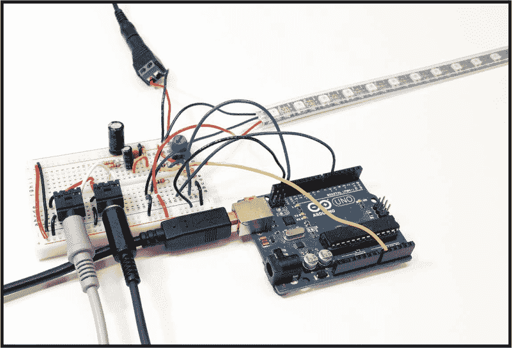

构建完此项目后，你将能够将任何音乐源插入电路，LED 灯带会根据音乐同步显示酷炫的多彩灯光秀。这个项目非常适合派对、DJ 舞台，甚至你的宿舍！想要看到可视化器的实际效果，可以查看这个简短的视频： *[`youtu.be/GkjBT-EmRw8`](https://youtu.be/GkjBT-EmRw8)*。

首先，我们将了解制作音乐可视化器的原理，以便在开始构建之前，你对其工作原理有所了解。在电路搭建完成后，你将了解代码如何工作以及如何将代码加载到 Arduino 中。最后，我们将讨论一些如何修改代码的技巧，以便让其表现不同，让你可以自己进行实验。

### 获取零件

实时音乐可视化器所需的零件非常容易找到。本清单推荐 Adafruit 提供一些更专业的零件，Mouser 提供简单的被动元件。

**注意**

*你的 LED 灯带的长度决定了你的电力需求。对于 2 米的灯带，2 A 的电源就足够了。但如果使用 3 米的灯带，你将需要 5 A 或 10 A 的电源。Adafruit P/N 658 是一个适用于 10 A 的好选择。*

+   Arduino Uno (Adafruit P/N 50; 请参阅 “Arduino 入门与 Arduino IDE” 第 15 页 ([intro.xhtml#page_15]) 获取安装说明)

+   1, 2 或 3 米 WS2812B RGB LED 灯带 (例如，Adafruit NeoPixel P/N 1461)

+   5 V，2 A 电源 (Adafruit P/N 276，或 P/N 658 用于 10 A)

+   2.1 mm 直流面包板电源插座 (Adafruit P/N 368)

+   两个面包板音频插座 (Adafruit P/N 1699)

+   10 kΩ 电位器 (例如，Adafruit P/N 356)

+   无焊接全尺寸面包板 (Adafruit P/N 239)

+   22 号实心连接线，用于连接组件 (Adafruit P/N 1311)

+   三个 4.7 kΩ 电阻 (Mouser P/N 291-4.7K-RC)

+   两个 100 kΩ 电阻 (Mouser P/N 291-100K-RC)

+   2.2 kΩ 电阻 (Mouser P/N 291-2.2K-RC)

+   470 Ω 电阻 (Mouser P/N 291-470-RC)

+   0.047 μF (47 nF) 陶瓷电容器 (Mouser P/N 594-K473K10X7RF5UH5)

+   10 μF 铝电解电容器 (Mouser P/N 80-ESK106M016AC3AA)

+   1,000 μF 铝电解电容器 (Mouser P/N 647-UVR1C102MPD)

+   两根 3.5 mm 音频线 (Adafruit P/N 2698)

+   你选择的音乐播放器和音响

### 工作原理：将音乐转化为数据

要可视化你的音乐，视觉化工具必须分析音频信号的内容，并在 LED 条上显示相应的内容。那么，如何用 Arduino 代码分析音频信号呢？其中的秘诀在于*快速傅里叶变换（FFT）*算法，这是一种追溯到 19 世纪的数学技术。我们不会深入讨论数学细节，因为数字信号处理相当复杂，但基本思想是，随着时间变化的信号（如音频信号的电压）可以被分析并分解为其频率成分。如果你曾在立体声设备或计算机上的音乐播放器中见过频谱分析仪，那么你可能已经熟悉了这一概念，见于图 5-1。

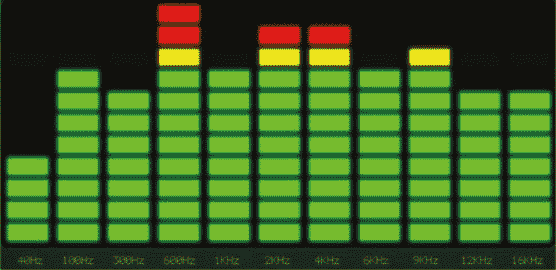

**图 5-1：** 一个典型的频谱分析仪

垂直条形代表频带，左侧的条形代表低频（低音），右侧的条形代表高频（高音）。本项目中的 Arduino 代码将对音频信号的电压进行采样，并对音频样本执行 FFT 算法，以确定每个频带中的信号强度。然后，我们将使用低频频带的电平（音乐的低音节奏）来在 LED 条上创建一个有趣的显示效果。

在视觉化电路中，你将把计算机、手机、平板或其他音乐设备连接到一个 3.5 毫米（1/8 英寸）输入插孔，以接收音乐信号。你将连接一个输出插孔到你电源驱动的扬声器、立体声放大器，或其他用于放大音乐并输出到扬声器的设备。换句话说，电路位于你的音乐源和放大器/扬声器设备之间，这样它就可以“听”到音乐并展示效果。电路的其余部分由一些简单的元件和一个 Arduino 组成。处理音频信号在电子学中有一些棘手的地方，因此本节描述了我们将用于使电路工作的一些技术。本节将教你很多关于音频处理的知识！

#### 输入偏置

Arduino 板可以测量其六个模拟输入引脚上的电压，这些引脚在板上标记为 A0 到 A5。你的视觉化工具将会把音频信号连接到 Arduino 的 A0 引脚，以快速进行大量采样测量，然后应用 FFT 算法将信号转换为 Arduino 可以分析的数据。

如果你熟悉 Arduino 上的模拟输入测量，你就知道，调用`analogRead()`函数从模拟引脚读取数据时，返回的值在 0 到 1023 的范围内，这代表测得的电压范围为 0 至 5 伏。但当我们想测量模拟音频信号时，会遇到一个问题：音频是*交流电*，而不是直流电。也就是说，电压在地面（0 伏）上方波动，然后*低于*地面，变为负电压（见图 5-2）。

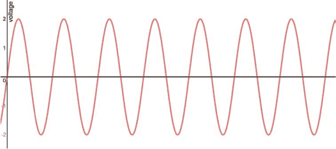

**图 5-2：** 一个简单的音频信号在正负电压之间振荡

Arduino 无法测量低于 0 V 的电压，因此我们不能将音频信号直接连接到 A0 引脚，否则可能会损坏 Arduino。我们该如何解决这个问题？

解决方法是将电压“偏置”到更高的水平，这样它就不再围绕 0 V 而是围绕更高的电压波动。这意味着当电压下降时，它不会低于 0 V。我们通过一个由两个相等电阻值组成的电压分压器来实现这一点。音频信号有一个电阻将其连接到 5 V，另一个电阻将其连接到 0 V（图 5-3）。这样就将信号偏置到 0 V 和 5 V 之间的中点，即 2.5 V。

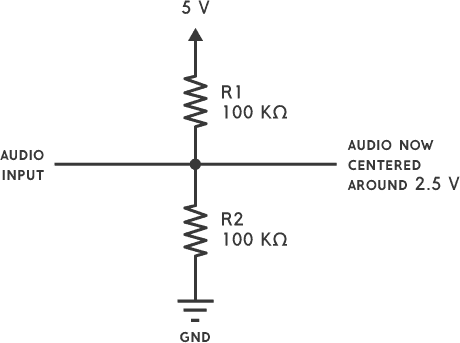

**图 5-3：** 音频信号的输入偏置电路

图 5-4 显示了相同的信号，但它是围绕 2.5 V 而不是 0 V 进行偏置的。现在，Arduino 可以测量音频电压，而不必担心它们会低于地电位。音频信号通常只有几伏特的峰值到峰值电压，因此这种方法效果很好。

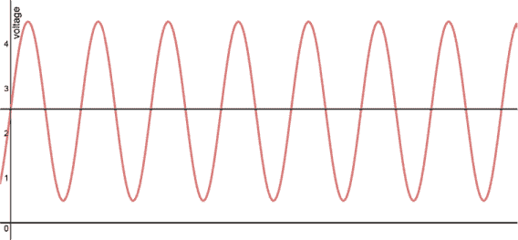

**图 5-4：** 一个音频信号，现在偏置为 2.5 V

#### 灵敏度控制

音频信号需要足够强，以便电压在一个足够大的范围内波动，这样可视化工具才能有效地分析它。但一些音频源输出的信号并不十分强烈。我们需要为电路提供调节灵敏度的能力，以便可以处理弱信号。本节描述了一个巧妙的技巧来实现这一点。

回想上一节内容，Arduino 可以测量 0 V 到 5 V 之间的电压，并且我们已经将音频电压偏置为围绕 2.5 V。若音频信号较弱，电压变化不大，我们就会得到类似于 图 5-5 中显示的信号。这可能出现在“线路电平”信号中，其中峰值到峰值电压仅为 1 V。

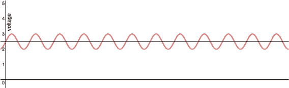

**图 5-5：** 一个弱音频信号

测量这个信号会得到大约 512 的 `analogRead(0)` 值（0–1023 范围的中点），但这些值变化不大，无法给我们提供有效的分析。

幸运的是，Arduino 板上有一个特别的引脚，称为 *模拟参考 (AREF)*。我们可以在这个引脚上提供电压，并告诉 Arduino 代码，这就是我们在模拟输入上要读取的最高电压。例如，要测量 0 V 到 2 V 之间的电压，并使得 `analogRead()` 的值使用完整的 0–1023 范围，我们就在 AREF 引脚上提供 2 V 的电压。此时，2 V 的测量值会是 1023，而不是更低的值。

在这个电路中，我们将使用一个电位器为 AREF 引脚提供电压。为了提高灵敏度，我们只需通过调节电位器来提供更低的电压。

容易吧？别着急！记住，音频信号是围绕 2.5 V 的。如果我们将模拟参考电压调得过低，我们就会忽略信号的上部分，因为信号的峰值会被“截断”。在这种情况下，FFT 算法将无法正确处理信号。解决方法是我们*还*需要将输入偏置电路的最高电压降低，这样偏置电路就能将音频信号居中于 0 V 与我们提供给 AREF 的电压之间的中点。图 5-6 展示了我们得到的弱音频信号，它的波动只有大约 1 V 的峰-峰值。电路中的可调电阻提供了一个 2 V 的 AREF 电压，我们也将其作为偏置电路的上限。现在，音频信号居中在 1 V，填充了更广泛的`analogRead()`值范围。实际上，我们已经放大了信号！我们并没有实际增加信号的电压，而是减少了我们测量的电压范围，使得弱信号可以填充更多的范围。巧妙。

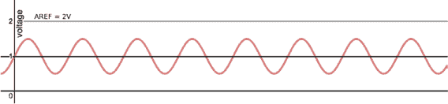

**图 5-6：** 一个弱音频信号，灵敏度调整到设定的最高电压为 2 V

### 搭建它

现在是时候开始在面包板上搭建音乐可视化电路了。这些说明将通过多个步骤展示整个过程，以便更容易地搭建电路。你可以选择不同的方式布局你的组件，但这些示意图旨在为你提供最大的清晰度。让我们开始吧！

1.  **将音频插孔添加到面包板上。** 如图 5-7 所示，将输入插孔的左声道和右声道直接连接到输出插孔的左声道和右声道。这样，音乐信号就可以流到输出端。插孔的中间引脚应连接到地。同时，使用红色和黑色导线将电路板两侧的电源轨连接起来，如图所示。

    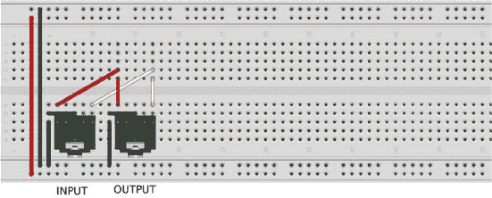

    **图 5-7：** 音频插孔和电源轨连接

1.  **使用音频汇总电路滤除噪声。** 现在，通过每个通道上的电阻将左声道和右声道连接起来，以防止它们之间的串音（干扰）。在每个通道上加一个 4.7 kΩ的电阻，如图 5-8 所示。然后在左侧加上一个 10 μF 的电容器，负极（较短的引脚）连接到输出插孔，通过 4.7 kΩ电阻连接。接着添加一个 0.047 μF（或 47 nF）的电容器，并将一端连接到 10 μF 电容器的正极，另一端连接到地，如图所示。这些有助于滤除噪声并阻止直流电流。

    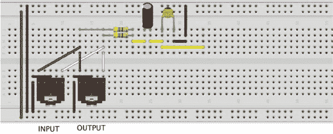

    **图 5-8：** 音频汇总电路和滤波器

1.  **构建输入偏置和模拟参考电路。** 回想一下，我们的电压分压器由两个 100kΩ的电阻器组成，它将音频信号中心化于 0V 和模拟参考电压之间，模拟参考电压通过 10kΩ的可调电阻来控制。将这些电阻器插入面包板，其中第一个电阻器的一端直接连接到电源地轨道，另一端与第二个 100kΩ电阻器连接，如图 5-9 所示。确保第二个电阻器与第一个电阻器相邻插入。现在，在面包板上放置一个可调电阻，并通过一个 2.2kΩ电阻将最右边的引脚连接到电源地。将一个 4.7kΩ电阻连接到可调电阻的中间引脚——这将最终连接到 Arduino 的 AREF 引脚——并确保这个电阻跨越面包板的中央分隔。这个中间引脚还应该连接到第二个 100kΩ电阻器的第二个引脚。可调电阻的最后一个空引脚连接到电源轨道。

    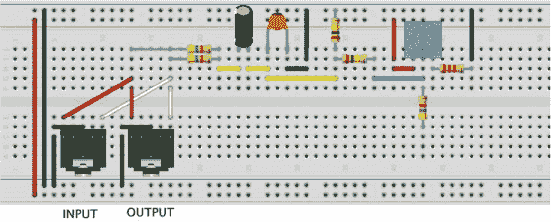

    **图 5-9：** 输入偏置组件

1.  **连接电源插口为电路供电。** 将电源插口连接到面包板的电源轨道。还要将大的 1,000μF 电解电容器连接到电源线路，如图 5-10 所示。电解电容器是有极性的，所以要注意极性：正极引线比负极引线长，并应连接到正电源轨道。电容器的负极一侧也有一条白色的标线。这个电容器为电路提供电压储备，以防 LED 条带一次性吸收大量电流。例如，将 LED 条带上的所有 LED 灯同时设置为白色会消耗大量电流，但电容器有助于平滑由此产生的电压下降，从而避免电路过载。

    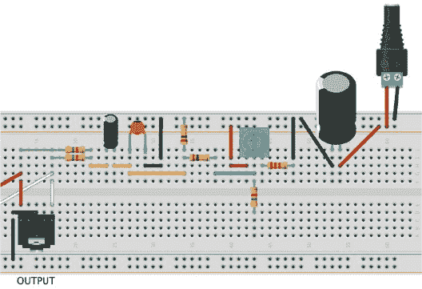

    **图 5-10：** LED 条带的电源连接

1.  **将 LED 条带连接到电路中。** LED 条带有三个连接端口：5V、电源地和数据输入（DIN）。这些电气连接在不同的 LED 条带上可能顺序不同。例如，DIN 连接通常位于中间，但图 5-11 中它显示在顶部。只需密切注意 LED 条带上的标签。如果你的 LED 条带没有连接器，可能需要将导线焊接到条带上（有关焊接的说明，请参见附录）。无论如何，请按照图 5-11 所示，将 5V、电源地和 DIN 连接到电路中，DIN 引脚连接到一个 470Ω电阻（电阻的另一端将连接到 Arduino）。

    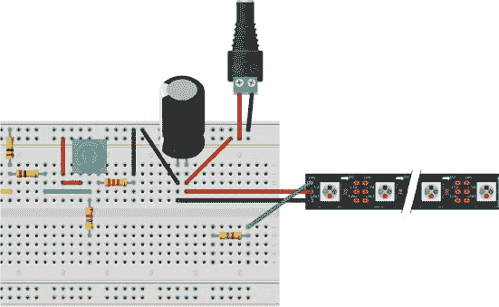

    **图 5-11：** 连接 LED 条带

1.  **连接 Arduino。** 我们快完成了！最后的电线连接到你的 Arduino 板，如图 5-12 所示。绿色电线连接 Arduino 的 6 号引脚到 DIN 连接处的 470 Ω 电阻。蓝色电线连接到 Arduino 的 AREF 引脚。黄色电线是音频信号，连接到 Arduino 的模拟引脚 A0。最后需要连接的是将面包板的接地信号连接到标有 GND 的 Arduino 接地引脚，但此时不要进行此连接。如果 Arduino 上已经有程序在运行，连接电路时可能会损坏电路的部分元件。因此，为了安全起见，我们会先加载本项目的草图，然后再完成 Arduino 的连接。

    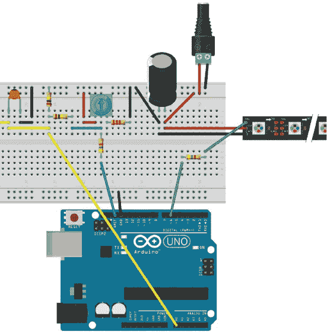

    **图 5-12：** 将 Arduino 连接到电路

### 编写代码

这个电路在没有 Arduino 上的精彩代码之前是不会做任何事情的！我们将使用的 Arduino 草图相当复杂，这里没有足够的空间将其全部打印出来，但本节将描述它的基本工作原理，帮助你掌握基础。你可以从书本资源中下载草图，网址是 *[`nostarch.com/LEDHandbook/`](https://nostarch.com/LEDHandbook/)*。

#### 工作原理

Arduino 程序的工作是通过在缓冲区捕获电压样本来“监听”音乐，然后对这些样本进行 FFT 分析，以确定每个频率带的水平。这给我们提供了类似普通频谱分析仪的数据——在任何特定时刻每个频率带的信号强度。

然而，我们并不是仅仅显示一列列的 LED，而是做一些更有趣的事情。每当检测到频率带中出现新的最大值或峰值时，代码会生成一对从 LED 带中间起始并向两端移动的动态像素。像素的移动速度取决于峰值的强度，并且像素在向外移动时会逐渐变暗。峰值的颜色是随机变化的。请注意，我们只关注底部的三个频率带（总共八个频率带），以便可视化音乐的节拍。

这是主循环的代码，并附有解释性的注释：

```
void loop() {
  // While the ADC interrupt is enabled, wait. The program is
  // still gathering audio samples in the capture buffer.
  while (ADCSRA & _BV(ADIE)) {
    // Wait...
  }

  // The sampling interrupt has finished filling the buffer,
  // so show the output we computed last time through the
  // loop. This sends the data to the LED strip.
  strip.show();

  // Perform the FFT algorithm to convert samples to
  // complex numbers.
  fft_input(capture, bfly_buff);

  // Now that we've updated the LED strip and processed the
  // audio samples with FFT, we can resume the collection
  // of audio samples in the sample buffer. The interrupt
  // service routine (ISR) will run while we compute the next
  // LED output based on the audio samples we captured.
  startSampling();

  // Perform the rest of the FFT computation:
  fft_execute(bfly_buff);          // Process complex data
  fft_output(bfly_buff, spectrum); // Complex -> spectrum

  // Now call this to analyze the audio. See comments in this
  // function for details.
  analyzeAudioSamples();

  // The peak values for each of the 8 bands has been
  // computed. A bit in the 8-bit value newPeakFlags
  // indicates whether the analysis found a *new* peak
  // in the band.
  for (i = 0; i <= CUTOFF_BAND; i++) {
    // If a new peak was found in band i...
    if (newPeakFlags & (1 << i)) {
      // Map the peak value to a magnitude in range [0,255].
      // We pass in the band number because the mapping is
      // different for different bands.
      uint8_t magnitude = getMagnitude(i, bandPeakLevel[i]);

      // A nonzero magnitude means that the peak value is
      // large enough to do something visually with it. We
      // ignore small peaks.
      if (magnitude > 0) {
        // We want to store the information about the peak
        // in a peak_t structure. When we actually draw a
        // visualization, the peak_t structures in peaks[]
        // represent the "visually active" band peaks.

        // Look through the list of peak structures 'peaks'
        // for an unused one.
        for (j = 0; j < N_PEAKS; j++) {
          if (peaks[j].magnitude == 0) {
            // Unused peak found.
            peakIndex = j;
            break;
          }
        }
        // If an unused one not found, we use the last one
        // that was used (peakIndex).

        // Initialize the structure.
        peaks[peakIndex].age = 0;
        // A random component for a visualization to use. For
        // example, to shift the color a small amount.
        peaks[peakIndex].rnd = random(255); 
        peaks[peakIndex].baseColor =
          getRandomBaseColor(peaks[peakIndex].rnd);
        peaks[peakIndex].magnitude = magnitude;
      }
    }
  }

  // Clear the last frame.
  strip.clear();
  // Draw the peaks on the LED strip.
  doVisualization();
} // end loop()
```

代码中远不止这一个主循环，许多繁重的计算工作由 `analyzeAudioSamples()` 和 `doVisualization()` 函数完成。尽管如此，你完全不需要理解它是如何工作的就能享受这个项目。在下一节中，你将把代码加载到 Arduino 上。

#### 获取代码

项目的完整源代码可以在书籍资源中的*[`nostarch.com/LEDHandbook/`](https://nostarch.com/LEDHandbook/)*找到。你还可以在资源中找到用于驱动 RGB（红绿蓝）LED 灯条的库，你需要将其安装到 Arduino IDE 中。Adafruit 提供了一个关于如何安装 Arduino 库的优秀指南，地址是*[`learn.adafruit.com/adafruit-neopixel-uberguide/arduino-library-installation`](https://learn.adafruit.com/adafruit-neopixel-uberguide/arduino-library-installation)*。安装后，你的 Arduino 目录应具有以下结构：

```
your_sketchbook
 |
 +--libraries
 |   |
 |   +--ffft
 |   |
 |   +--Adafruit_NeoPixel
 |
 +--RealtimeMusicVisualizer
     |
     +--RealtimeMusicVisualizer.h
     +--RealtimeMusicVisualizer.ino
```

现在打开 Arduino IDE 并加载 RealtimeMusicVisualizer 草图。编译并将其上传到你的 Arduino。通常最好在给 Arduino 供电前，先将 Arduino 从新的电路中断开连接。上传代码到 Arduino 后，你可以按照之前描述的方式将四个线路连接到电路中。

### 使用它

使用音乐可视化器就像进行几个简单的连接一样容易：

1.  使用 3.5 毫米音频电缆将音频输入插孔连接到你的音乐源。

1.  将音频输出插孔连接到你的立体声接收器或一些有源扬声器。

1.  将你的 5V 电源连接到面包板电路上的电源插孔。电源必须能够提供至少 2A 的电流。

1.  将电源连接到你的 Arduino 板，可以使用 USB 电缆或其他电源适配器。否则，你也可以通过将一根线连接到 Arduino 上的 5V 引脚，从面包板的 5V 电源为 Arduino 供电。

现在打开音乐，享受表演吧！你可能希望将音乐播放器的音量调高，尤其是当设备较小，如手机或平板时。电脑通常输出更强的信号。如果音乐没有产生太多的可视化效果，可以通过顺时针旋转面包板上的电位器旋钮来增加灵敏度，直到你能清楚地看到音乐的节奏。

### 进一步操作

如果你有 Arduino 编程经验，可能会想对代码进行修改，让它执行不同的功能。这里有一些探索的想法：

+   **更改 LED 数量。** 如果你的 LED 灯条有不同数量的 LED，你应该调整代码。例如，如果你有一个 3 米长、180 个 LED 的灯条，请在*RealtimeMusicVisualizer.ino*文件中更改定义`N_LEDS`的那一行，将其改为新值：

    ```
    #define N_LEDS 180
    ```

+   **让像素向一个方向移动。** 不再让移动的像素从灯条的中心朝两个方向移动，你可以让它们仅从一端开始。将*RealtimeMusicVisualizer.ino*中的`SINGLE_DIRECTION`设置为`true`：

    ```
    #define SINGLE_DIRECTION true
    ```

+   **使代码响应更多频率带。** 当前代码只关注底部三个频率带。通过更改`CUTOFF_BAND`的值，你可以听到更多频率带。目前的值为`2`，因为底部三个频率带编号为 0、1 和 2。如果你想响应底部五个频率带，可以将这一行改成这样：

    ```
    #define CUTOFF_BAND 4
    ```

+   **改变亮度。** 可视化工具太亮了吗？也许你不是在举办一场盛大的派对，而只是想为你的宿舍增添一些亮点。你可以通过减少`MAX_BRIGHTNESS`的值来调低亮度。默认值是`255`，你可以尝试设置一个较低的值，比如`100`：

    ```
    #define MAX_BRIGHTNESS 100
    ```

+   **改变颜色随时间的变化方式。** 这个可视化工具展示了两种颜色的像素，它们随着时间变化。对于这两种颜色，每种颜色随时间变化的速度由`MIN_COLOR_CHANGE_COUNT`和`MAX_COLOR_CHANGE_COUNT`的值控制。当选择新颜色时，会在这两个最小值和最大值之间设置一个值，表示在选择新颜色之前，多少个像素将显示为当前颜色。默认的最小值和最大值是`5`和`10`。如果你希望所选颜色在改变之前显示更长时间，可以增加这些值。如果你希望每个像素都是新颜色，你可以将这两个值都设置为`1`：

    ```
    #define MIN_COLOR_CHANGE_COUNT 1
    #define MAX_COLOR_CHANGE_COUNT 1
    ```

+   **编写你自己的可视化。** 如果你有一个全新的可视化创意，你可以修改或重写函数`doVisualization()`。这个函数绘制由数组`peaks`中的`peak_t`结构定义的移动像素。如果你仔细研究代码，你会理解它是如何工作的。这个项目基于一个更复杂的可视化工具，它有许多不同的可视化效果：Lumazoid 板（一个认知设计产品）。你可以从* [`github.com/nootropicdesign/lumazoid`](https://github.com/nootropicdesign/lumazoid)*中的 Lumazoid 源代码获取不同可视化效果的灵感。

### 摘要

如果你已经搭建好了电路并且一切正常，恭喜你！你现在有了一种非常酷的方式来为你的音乐增添光彩，希望你在这个过程中也学到了些东西。如果你已经阅读了本章所有关于如何通过数字信号处理分析音乐，以及如何使用简单的电子学技巧处理音频信号电压的内容，你已经比大多数人更了解音频信号的真实性质。
