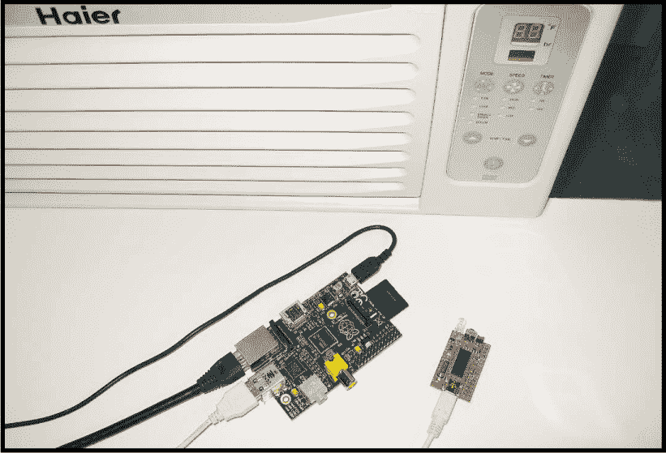
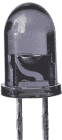
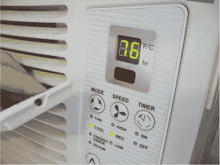
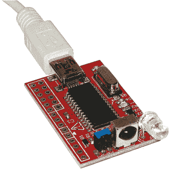

## 第七章：自动红外遥控，由 Kaas Baichtal 编写

在这个项目中，你将使用红外 LED 和树莓派自动操作遥控设备。



### 工作原理：红外光

在 19 世纪初，天文学家威廉·赫歇尔发现，通过棱镜分解的阳光，越接近红色光谱端的部分温度越高。然而，红色之外的光谱区域则更热。原来有一种温度更高的光——称为*红外（IR）*——人类能感觉到，但看不见。

红外意味着“低于红色”，因其频率（每秒波数）低于可见红光。电磁波谱图在图 6-1 中展示了所有辐射能量之间的关系，包括光、电波、微波、伽马射线和 X 射线。


**图 6-1：** 电磁波谱

#### 红外 LED

红外 LED 自 20 世纪 60 年代初就已经存在。事实上，它们的发明比发出可见光的 LED 早一到两年。图 6-2 展示了一个红外 LED 的例子。



**图 6-2：** 一个红外 LED。内部较大的部分对应于负极引脚。

像所有二极管一样，LED 是一种半导体。电流在正向方向通过二极管的阻力较小，而在反向方向则较大。当电流通过二极管时，它还会发出少量电磁辐射。该辐射位于电磁波谱中的位置取决于制造二极管时所使用的材料。由硅和锗制成的常规二极管通常不发光，而其他半导体材料则可以发出各种颜色的可见光，以及紫外光和红外光。红外 LED 通常由砷化镓（GaAs）或铝镓砷（AlGaAs）制成。

当 LED 被反向偏置（反向连接时），不会产生光。

#### 视距通信

红外 LED 有许多重要应用，包括数据通信。使用 IR LED 发送数据的电路称为*发射器*。接收红外光并将其转换回数据的电路称为*接收器*。

因为红外组件传输和接收光，它们需要能够“看到”彼此才能成功通信（见图 6-3）。这通常被称为*视距通信*。传输 LED 发出的光束越窄，发射器就越需要精确对准接收器。没有什么不透明物体可以阻碍光的传播，然而，在必要时，光也可以通过使用镜子、光纤和光导管等方式引导或反射到非视距方向。



**图 6-3：** 这个红外遥控器有一个孔用于发射器的 LED 发射光束，而它控制的空调则有一个小红色窗口，允许红外光照射到接收器上。

虽然这看起来像是一个劣势，但红外通信的视距特性实际上有其优点：红外传输不太可能干扰到发生在完全不同房间或建筑中的其他红外通信。任何曾经被邻居的遥控器开关天花板风扇的用户，都会理解这一点！

在本项目中，我们将使用简单的视距通信，将附加在树莓派上的红外发射器定向，使其可以毫无问题地被空调接收。

#### 数据传输

从最简单的角度来看，红外发射器通过开启和关闭 LED 来传输数据。例如，用 LED 发送摩尔斯电码也是可能的。然而，为了通过红外进行数据通信，已经开发了几种复杂的语言和系统，称为*协议*。几十年来，遥控器发送的消息需要传递越来越多的信息。这激发了许多提高信噪比、错误校正和数据承载能力的创新方法。以下是协议规范中可能包含的一些内容的概述：

+   使用的红外光频率

+   使用的载波频率

+   支持的设备数量

+   每个设备的命令数量

+   编码中使用的位数

+   编码过程

+   键到码的映射

+   数据传输速率，可能是可变的

+   传输脉冲的调制方案和/或它们之间的间隔

在可编程微控制器出现之前，发射器和接收器需要额外的电路来完成协议所要求的一切。普遍缺乏兼容性导致了“万能遥控器”的发展，这些遥控器要么预先编程了许多其他遥控器的负载，要么只是记录其他遥控器的信号，并在命令下将它们原样播放。这后一种方法是我们在本项目中开始“教”树莓派如何控制空调时所使用的过程，利用一个 USB 红外玩具（见图 6-4）。USB 红外玩具在同一电路板上集成了发射器和接收器，因此我们可以用它来记录空调遥控器的信号并模仿它们。



**图 6-4：** USB 红外玩具

### 获取零件

本项目中的说明将使用这里列出的设备。电子项目新手？坚持使用这个零件清单，我会让你轻松搞定！

如果你有更多经验，能够修改步骤，随时可以替换你自己的发射器、接收器、计算机、操作系统和空调或其他要控制的设备。

+   USB 红外发射器和接收器（我使用的是 Dangerous Prototypes USB IR Toy 2，它有预装版本和套件版。预装版可在 Seeed Studios 购买，SKU 编号为 #102990037；* [`www.seeedstudio.com/USB-Infrared-Toy-v2-p-831.html`](https://www.seeedstudio.com/USB-Infrared-Toy-v2-p-831.html) *）。

+   配有 A 型和迷你 B 型连接器的 USB 电缆（例如，Adafruit P/N 260）

+   Raspberry Pi（任何型号都可以使用，但需要通过 NOOBS 安装 Raspbian—有关设置说明，请参阅 Raspberry Pi 入门，详见 第 13 页）。

+   一台带有红外遥控器的空调（我使用的是海尔 HWR08XC7 型号）。

本节剩余内容涉及修改，如果你使用的是列出的零件，可以跳到 “动手制作” 部分，详见 第 117 页。

任何具有 USB 端口并支持运行 LIRC（Linux 红外遥控控制）的计算机都可以用于这个项目。我选择了 Raspberry Pi，因为我可以在亚马逊上以较低的价格购买带有外壳、电源和 NOOBS SD 卡的套件。Raspbian 是本书中其他项目使用的操作系统，因此我将提供基于该系统的说明，但我们在这里所做的一切应该都能修改适配你的机器。

无论你使用什么设备，你都需要 LIRC 包（* [`www.lirc.org`](http://www.lirc.org) *）来完成这个项目。LIRC 对于这种任务非常有用，因为 1) 它可以安装在多种类 Unix 系统和 Windows 操作系统上；2) 它允许多个程序监听一个接收器；3) 它附带有用于记忆遥控器和手动发送命令的有用工具；4) 它的网站有丰富的硬件兼容信息，因此你可以轻松地调整这个项目来适配其他硬件。

例如，有很多预配置的 *.conf* 文件，适用于不同的手持遥控器，存放在 *[`lirc-remotes.sourceforge.net/remotes-table.html`](http://lirc-remotes.sourceforge.net/remotes-table.html)* 网站上。理论上，你可以控制任何与这些列出的红外遥控器兼容的设备，无需编写任何代码，甚至不必翻找沙发垫下的遥控器。但很少有预配置的遥控器是为空调设计的，因此在本项目中，我们将创建自己的 *.conf* 文件，而不必为找匹配的文件而烦恼。

事实上，由于我们反正会创建自己的 *.conf* 文件，你可以使用任何支持红外控制的设备，操作步骤完全相同，只要你仍然拥有它的物理遥控器来模拟代码即可。Xbox？Roomba？DVD 播放器？没问题！

如果你打算为这个项目购买空调，选择一个除了具有红外功能外，还能满足你制冷需求的，并且是你所在地区常见的品牌即可。

对于我的红外发射器和接收器，我选择了 Dangerous Prototypes 的 USB IR Toy 2，原因有三：它与 LIRC 完全兼容；它的价格相对便宜，预组装版只需$20（如果你自己组装几乎不花钱）；最后，由于它同时具有发射器和接收器，我只需要处理一个设备。虽然实际上控制空调只需要发射器，但由于我们正在创建自己的初始配置文件，所以也需要接收器。

### 构建它

让我们开始这个项目吧！以下步骤假设你已经拥有一个组装好的红外发射器和接收器、空调设备和遥控器，并且你的树莓派拥有`sudo`根权限。（Raspbian 提供了“pi”用户用于此目的。）

**备注**

*在撰写本文时，也有用户贡献的 v23 和 v24 版本，它们可以在网站的论坛中找到。*

1.  **升级你的 USB IR Toy 2 固件。** 请按照 Dangerous Prototypes 网站上 USB IR Toy 2 页面的说明（*[`dangerousprototypes.com/docs/USB_IR_Toy_firmware_update`](http://dangerousprototypes.com/docs/USB_IR_Toy_firmware_update)*)，将其固件升级到最新版本，在撰写本文时，官方版本是 v22。根据你的设备附带的固件版本，进行固件升级可能会避免很多麻烦，因为一些早期版本并不支持发射功能！

    你可以通过 USB 端口使用几乎任何计算机来升级固件。在从 Dangerous Prototypes 网站下载并解压固件升级包后，按照网站提供的说明操作。具体过程和结果会根据你的设置有所不同，因此我不会详细讲解，除了提到在我的 Windows 7 桌面上，我必须手动安装*inf-driver*子目录中的驱动程序，而这个细节在说明中并没有提到。

    一旦计算机识别到 USB IR Toy 2，运行固件子目录中的*update-USBIRToy.v22.bat*文件，并在系统提示时，提供分配给设备的端口号（详情请参见备注）。

    **备注**

    *如果你没有收到 COM 端口，并且在设备管理器或类似工具中找不到它作为 COM 端口列出，只需在此问题出现时按 ENTER 键即可。如果你是自动分配端口号的，才需要端口号。*

    我发现每次插入或更改任何内容时稍作暂停会很有帮助，因为在这个过程中，Windows 会多次重新识别 USB IR Toy 2，而这个中断会导致固件更新程序无法找到设备。一旦设备成功识别，固件升级过程便又快速又简单。

1.  **升级树莓派的操作系统和固件。** 我建议在开始之前，确保你的操作系统已经 100%打上补丁/升级，树莓派的固件也已经更新到最新版本。

1.  **检查 LIRC 的依赖项。** 现在，确保你的系统具备 LIRC 所需的所有内容。相关列表可以在*[`www.lirc.org/html/install.html#dependencies`](http://www.lirc.org/html/install.html#dependencies)*找到。我通过在 Linux 命令行输入以下命令来检查：

    ```
    $ which make
    $ which gcc
    $ which g++
    $ which ld
    $ which modinfo
    $ which pkg-config
    $ which xsltproc
    ```

    每个命令应该输出相关项目的完整路径。如果没有响应，说明该项目在系统中缺失。你还应进行两个检查：

    ```
    $ dpkg -l python3-yaml
    $ dpkg -l raspberrypi-kernel-headers
    ```

    如果你有这些，你应该看到关于该软件包的一些信息；如果没有，你应该看到一个抱怨，提示找不到这些软件包。我的新安装的 Raspbian 系统缺少这些软件包，以及前面提到的 xsltproc，因此我按如下方式安装了必要的项目：

    ```
    $ sudo apt-get install xsltproc python3-yaml \
    raspberrypi-kernel-headers
    ```

1.  **安装 LIRC。** 接下来，下载 LIRC 源代码，可以在 SourceForge 上获得，地址是*[`sourceforge.net/projects/lirc/files/LIRC/`](https://sourceforge.net/projects/lirc/files/LIRC/)*。选择最新版本的代码所在的目录，保存该版本的*.tar.gz*文件，然后进入保存位置。要解压并安装 LIRC，请在 Linux 命令行输入以下命令，替换为你的正确版本号：

    ```
    $ tar xjf lirc-version.tar.bz2

    $ cd lirc-version
    $ ./configure
    $ make
    $ sudo make install
    $ sudo ldconfig
    ```

1.  **连接 USB IR Toy 2。** 现在，关闭你的 Pi 电源，然后插入 USB IR Toy 2。每次插入或拔出你的 Toy 时，确保关闭 Pi 的电源，否则可能会损坏设备！重新启动机器后，查看`dmesg`日志文件，看看 Pi 是否找到了你的设备：

    ```
    $ dmesg | grep –e usb
    ```

    你应该看到类似这样的输出：

    ```
    [    2.982746] usb 1-1.2: new full-speed USB device number 4 using dwc_otg
    [    3.090984] usb 1-1.2: New USB device found, idVendor=04d8, idProduct=fd08
    [    3.092965] usb 1-1.2: New USB device strings: Mfr=1, Product=2, SerialNumber=3
    [    3.096209] usb 1-1.2: Product: CDC Test
    [    3.097827] usb 1-1.2: Manufacturer: Dangerous Prototypes
    [    3.099458] usb 1-1.2: SerialNumber: 00000001
    [    4.358474] usbcore: registered new interface driver cdc_acm
    ```

    这个输出表明 Pi 找到了我的 USB IR Toy 2，并且能够自动找到并加载正确的内核级驱动程序`cdc_acm`。如果你的机器在找到 Toy 后没有加载内核级驱动程序，你可以修改系统，使其每次启动时加载此驱动程序。如果你使用的是 Raspbian，可以通过编辑文件*/etc/modules*并添加以下行来实现：

    **注意**

    *如果你为你的项目使用了完全不同的 IR 发射器/接收器，你很可能会有不同的内核级驱动程序。这个驱动程序也可以在*/etc/modules*中加载。*

    ```
    cdc_acm
    ```

    一旦这一步正常工作，你可以使用`dmesg`如下操作来查找分配给 USB IR Toy 2 的设备名称（这是下一步需要的）：

    ```
    $ dmesg | grep -e cdc_acm
    ```

    我的输出给出了以下内容：

    ```
    [    4.332559] cdc_acm 1-1.2:1.0: ttyACM0: USB ACM device
    [    4.358474] usbcore: registered new interface driver cdc_acm
    [    4.360314] cdc_acm: USB Abstract Control Model driver
    for USB modems and ISDN adapters
    ```

    在这种情况下，我的 USB IR Toy 2 已被分配到设备*/dev/ttyACM0*。记录下你的设备分配。

1.  **配置*lirc_options.conf*。** LIRC 已经将一些默认配置文件放在*/usr/local/etc/lirc*中。此步骤需要以超级用户身份编辑*/usr/local/etc/lirc/lirc_options.conf*，并将`driver`参数（此处不是内核级驱动程序，而是 LIRC 插件）更改为`irtoy`，将`device`参数更改为你在`dmesg`中看到的设备的完整路径。打开*/usr/local/etc/lirc/lirc_options.conf*文件，并将这些参数更改为如下所示：

    ```
    driver = irtoy
    device = /dev/ttyACM0
    ```

    如果你使用的不是 USB IR Toy 2，你可以使用以下命令找到所有其他可用插件的列表：

    ```
    $ lirc-lsplugins
    ```

    在你进行此操作时，你可能还需要更改 `pidfile` 和 `output` 的默认位置，以便它们与系统实际安装位置匹配。以我使用的 NOOBS 安装的 Raspbian 为例，我必须在每个位置前面加上 */usr/local*。如果 LIRC 报告无法写入 PID 文件，说明你失败了！

    ```
    output = /usr/local/var/run/lirc/lircd
    pidfile = /usr/local/var/run/lirc/lircd.pid
    ```

1.  **偏执检查。** 为了确保你没有偏离轨道，请通过以下命令检查你使用的设备和驱动程序是否正确：

    ```
    $ sudo mode2 -H irtoy -d /dev/ttyACM0
    ```

    将任何 IR 遥控器对准 USB IR Toy 2 并按下几个按钮。你应该会看到屏幕上出现流动的数据，表示通过按键操作，Pi 上的串行数据已经可用。我的开始是这样的：

    ```
    Using driver irtoy on device /dev/ttyACM0
    Trying device: /dev/ttyACM0
    Using device: /dev/ttyACM0
    Running as regular user pi
    space 1000000
    pulse 3861
    space 1000000
    space 1000000
    pulse 21
    space 76799
    pulse 127
    space 12501
    pulse 63
    space 1112467
    pulse 42
    space 1000000
    space 1000000
    pulse 5119
    space 4543
    pulse 554
    space 575
    pulse 533
    space 575
    pulse 554
    --snip--
    ```

    完成后，按 CTRL-C 退出该程序。

1.  **为你的按钮选择名称。** 你所有遥控器的信息将存储在 *.conf* 文件中，位于 */usr/local/etc/lirc/lircd.conf.d* 目录下。接下来的步骤是在这里为空调创建一个文件。我们将使用一个名为 *irrecord* 的程序来完成这项工作。

    你遥控器上的每个按钮都需要在配置文件中有一个名称。写下你的选择，以便在录制按键时方便查看。LIRC 有一些标准的按钮名称，你可以选择使用或禁用；为了简单起见，我们在这个项目中将使用这些标准名称。你可以通过输入以下命令获取列表：

    ```
    $ irrecord -l
    ```

    对于我的按钮，我选择并记录了以下内容：

    ```
    on/off: KEY_POWER
    mode: KEY_MODE
    speed: KEY_FASTFORWARD
    timer: KEY_TIME
    temp/time up arrow: KEY_UP
    temp/time down arrow: KEY_DOWN
    ```

1.  **额外加分：获取遥控器的型号。** 虽然对于这个项目来说这不是严格必要的，但为了好看（也是 LIRC 的惯例），将配置文件命名为你正在使用的遥控器的名字是个不错的做法。我通过仔细查看海尔官网的备件部分并找到匹配项，找到了我的遥控器型号，Haier AC-5620-30。

    **注意**

    *如果在录制过程中 USB IR Toy 2 停止工作，我建议在 Pi 断电的情况下重启 Pi，并拔掉/重新插上 USB IR Toy 2 的电缆。我不确定问题出在哪里，但录制可能会有些不稳定！*

1.  **记录遥控器发送的代码。** 现在，你将通过命名按钮并按下它们来创建一个粗略的初始配置文件，以便将原始（尚未解码的）代码记录并与其正确的按钮名称关联。记录原始信号将允许 LIRC 在你编程让电脑控制空调时，之后将其作为输出重现。

    首先，移动到一个你有写权限的临时目录：

    ```
    $ cd /home/pi/
    ```

    手持遥控器，并将 USB IR Toy 2 安排好，使其 LED 指向你，输入：

    ```
    $ sudo irrecord -H irtoy -d /dev/ttyACM0 -f
    ```

    确保使用正确的驱动程序和设备名称。程序会引导你通过一些步骤收集你的遥控器发送的信号的技术信息。首先它会要求你输入遥控器的名称。然后它会要求你按下许多随机按钮，这样它就能了解这些按钮在新遥控器的未知协议中如何工作。一旦它确认能区分不同的按钮按压，它将要求你一一输入你选择的按钮名称，并为每个按钮展示按压操作。

    按照所有指示操作直到完成。完成后，内容会保存到一个以你提供的遥控器型号为开头，以 *.lircd.conf* 结尾的文件中。

    如果你之后发现某些按钮没有正确录制，你可以通过指定要更新的配置文件并使用 `-u` 重新录制那些按钮。例如：

    ```
    $ irrecord -H irtoy -d /dev/ttyACM0 -f -u \
    Haier_AC-5620-30.lircd.conf
    ```

    这种技术也可以用来将他人的配置文件适配到你的遥控器，只要它们足够兼容。

1.  **编辑你的 *.lirc.conf* 文件。** 使用你喜欢的文本编辑器打开你新创建的配置文件，你应该会看到它有三个部分：

    +   首先是一个注释区域，用井号 (#) 括起来，里面有空白处供你填写遥控器和其他相关细节。LIRC 社区希望这些信息以统一格式填写完整，以防你决定将文件与他人分享。如果你打算将文件保留为个人使用，填写注释是可选的。

    +   接下来，在 `begin remote` 下面，应该有一个部分，包含遥控器的名称和一些信号的基本串行通信特性。这个信息是在你执行第 10 步时，irrecord 收集到的，并且不同类型的遥控器会有所不同。我的配置看起来是这样的：

        ```
        begin remote
          name  Remote_Haier_AC-5620-30.conf
          flags RAW_CODES|CONST_LENGTH
          eps            30
          aeps          100
          gap          108529
        ```

    +   第三部分会列出你选择的按钮名称，每个按钮旁边都有 irrecord 关联的代码块。你可能会注意到其中一些看起来异常简短，或者与其他按钮明显不同。这些可能是录制错误的按钮。你将在下一步确认这一点。这是我在该部分的第一个按钮：

        ```
        begin raw_codes

            name KEY_POWER
               8981    4565     533     575     533     597
                511     575     533    1706     511    1727
                533     575     511     597     533    1706
                511    1706     554    1685     533    1706
                533    1706     533     575     511    1727
                533    1706     533     575     533    1706
                533     575     511     597     511    1727
                533    1706     533     575     533     575
                533     597     511     575     533    1706
                533    1706     533     597     511     575
                533    1706     533    1727     511    1706
                533
        ```

1.  **测试你的 *.lirc.conf* 文件。** 将 *.lirc.conf* 文件的副本移动到配置目录，方法如下：

    ```
    $ sudo cp Haier_AC-5620-30.lircd.conf \
    /usr/local/etc/lirc/lircd.conf.d/
    ```

    如果你没有使用默认的配置文件 *devinput.lircd.conf*，你可能希望将其更名为 *devinput.lircd.conf.unused*，这样 LIRC 就不会尝试使用它。

    接下来，让我们测试配置文件。通过输入以下命令启动 LIRC：

    ```
    $ sudo lircd
    ```

    在 LIRC 运行时，通过输入以下命令测试你的新配置文件：

    ```
    $ sudo irw
    ```

    现在按下遥控器上的按钮，并对准 USB IR Toy 2。测试每个按钮，确保当你按下它时，屏幕上出现你为它选择的名称。如果有任何按钮按下后显示错误的名称，或者有按钮导致系统混乱（你会知道，因为它不会显示任何内容，而且在再次按下按钮之前会有很长时间的停顿），请做个记号。这些按钮可能是记录错误的。

    测试完成后，按 CTRL-C 退出`irw`，然后使用以下命令终止 LIRC 进程：

    ```
    $ sudo killall lircd
    ```

    拿着你列出的错误按钮，并使用第 10 步最后描述的 `–u` 技巧重新录制它们。如果 irrecord 无法连接到 USB IR Toy 2，你可能需要断电重启 Pi 和 USB IR Toy 2。

    完成重新录制后，再次运行 sudo lircd。然后再次运行 sudo irw，测试按钮。重复此步骤，直到你的配置文件 100% 准确！这是 LIRC 在你要求它生成用于控制空调的代码时会查看的文件，因此这部分必须做好。

1.  **测试空调控制。** 接下来，你必须验证录制的命令是否足够准确，以便在 LIRC 重现时能控制空调。你可以使用 `irsend` 命令来做到这一点。首先，启动 LIRC：

    ```
    $ sudo lircd
    ```

    现在输入：

    ```
    $ irsend list "" ""
    ```

    你应该能看到配置文件中列出的任何遥控器名称——在我的例子中，只有一个：

    ```
    Haier_AC-5620-30
    ```

    你可以通过精确插入其名称，列出某个遥控器可用的命令，如列表中所示：

    ```
    $ irsend list Haier_AC-5620-30 ""
    ```

    对我来说，这会产生以下内容：

    ```
    0000000000000001 KEY_POWER
    0000000000000002 KEY_FASTFORWARD
    0000000000000003 KEY_UP
    0000000000000004 KEY_DOWN
    0000000000000005 KEY_TIME
    0000000000000006 KEY_MODE
    ```

    我从第 8 步选择的按钮名称与这个列表的相似性绝非巧合！它是从我们创建的配置文件中读取名称的。现在应该可以取其中一个按钮名称，并将其与遥控器名称组合，发送如下命令：

    ```
    $ irsend SEND_ONCE Haier_AC-5620-30 KEY_POWER
    ```

    哇！我的空调开了。如果你打算长期使用这个来控制某些设备，你需要充分测试所有按钮，确保你的 LIRC 和 USB IR Toy 2 能够稳定地配合工作。

**修补不稳定的 LIRC**

当我第一次使用 LIRC 0.9.4d 达到这一步时，发现它非常不稳定。每执行几条命令，LIRC 和 USB IR Toy 2 都会死机并显示错误信息。如果我重新插拔 USB IR Toy 2 并重新运行 LIRC，它又会正常工作——持续几个命令。如果你像我一样遇到这个问题，可以在 *[`sourceforge.net/u/bengtmartensson/lirc/ci/experimental-irtoy/`](https://sourceforge.net/u/bengtmartensson/lirc/ci/experimental-irtoy/)* 上找到一个补丁，应该可以修复这个问题。尽管 diff 补丁设计成可以自动应用，但由于版本的不同，你可能需要手动应用这个补丁。

要应用补丁，首先备份你的 *lirc_options.conf* 文件，如下所示：

```
$ sudo mv /usr/local/etc/lirc/lirc_options.conf \
/usr/local/etc/lirc/lirc_options.conf.backup
```

然后返回到你编译 LIRC 的目录，在我的例子中是 *~/lirc-0.9.4d/*。从那里，编辑 *./plugins/irtoy.c*，并根据 diff 中的绿色和红色行进行增减。接着清理目录并像下面这样重新编译：

```
$ ./configure
$ make clean
$ make
$ sudo make install
```

重新编译完成后，恢复你自己的*lirc_options.conf*文件：

```
$ sudo mv /usr/local/etc/lirc/lirc_options.conf.backup \
/usr/local/etc/lirc/lirc_options.conf
```

如果你之前更改过*devinput.lircd.conf*的名称，你需要删除编译后添加的新副本：

```
$ sudo rm /usr/local/etc/lirc/lircd.conf.d/\
devinput.lircd.conf
```

现在重复第 13 步，看看系统是否现在能可靠运行。补丁完全解决了我的问题！

1.  **分析你的*.conf*文件。** 当你对*.conf*文件的性能 100%满意时，你可以通过以下命令告诉 LIRC 更彻底地分析遥控器的协议：

    ```
    $ cd ~
    $ sudo cp /usr/local/etc/lirc/lircd.conf.d/\
    Haier_AC-5620-30.lircd.conf .
    $ irrecord –a ~/Haier_AC-5620-30.lircd.conf
    ```

    从技术上讲，你本可以在第一次录制后立即尝试这个方法，但就我个人而言，我发现如果先处理任何错误或缺失的按钮会更有效。一旦分析完毕，我的整个文件已经大大缩小，现在看起来像这样：

    ```
    begin remote
      name  Haier_AC-5620-30
      bits           32
      flags SPACE_ENC|CONST_LENGTH
      eps            30
      aeps          100

      header       8984  4554
      one           525  1712
      zero          525   584
      ptrail        529
      gap          108529
      toggle_bit_mask 0x0
      frequency    38000

          begin codes
              KEY_POWER                0x19F69867
              KEY_MODE                 0x19F610EF
              KEY_FASTFORWARD          0x19F620DF
              KEY_TIME                 0x19F658A7
              KEY_UP                   0x19F6A05F
              KEY_DOWN                 0x19F6906F
          end codes

    end remote
    ```

    这不仅比第 11 步中显示的原始版本（部分）更简洁、更易读，而且现在关于空调所使用的协议有了更多的了解。除了头部、频率等信息外，实际的命令已经被解码，并以十六进制的形式表示，而不是模仿不同长度的闪烁信号。这意味着 LIRC 现在真正知道它在做什么，而不是重复它无法理解的内容。对于准确控制空调来说，这无疑是件好事！

    将分析结果剪切并粘贴到原始的*.lircd.conf*文件中，然后杀死并重新启动 LIRC 来尝试一下，应该能正常工作。

    **注意**

    *如果在尝试分析文件时没有任何变化或发生任何事情，说明 LIRC 无法识别你的协议。在这种情况下，继续使用原始的*.conf*文件。*

1.  **自动运行 LIRC。** 一旦你正确配置了 LIRC，你可以最后一次运行它并让它保持运行。如果你计划设置任务来控制空调，且希望机器重启后能够继续工作，你还可以设置它在启动 Pi 时自动运行。要在 Raspbian 系统上做到这一点，作为超级用户编辑*/etc/rc.local*文件，并添加以下行：

    ```
    lircd
    ```

1.  **编程 Pi 来控制空调。** 现在你已经让 USB IR Toy 2 与 LIRC 通信，并证明可以用它控制空调，你有很多有趣的选项来自动化空调的实际运行。请访问*[`www.lirc.org/software.html`](http://www.lirc.org/software.html)*，查看与 LIRC 相关的兼容软件和应用程序，允许你以不同的方式操作空调，或将其与多媒体设备集成。我喜欢使用命令行，所以我的示例脚本将使用 bash 编写。但不要让这个限制了你对所有可能工具的尝试！

    假设你的空调所在的房间在白天升温，而你在上班或上学时不在家。你可以让空调整天开着以保持房间凉爽，但如果在你回家前才开空调，经济性会更好。那么假设你希望空调在下午 4:30 开启。Linux 有一个叫做`cron`的守护进程，可以按计划运行程序。你可以写一个`cron`任务来实现这个目标，输入：

    ```
    $ sudo crontab –e
    ```

    然后在你的 crontab 中添加类似这样的行：

    ```
    30 16 * * * /path/to/your/script/air_conditioner.sh
    ```

    这指定了一个名为*air_conditioner.sh*的脚本，将在每天 16 点 30 分运行。（如果你想更深入了解`cron`，可以尝试阅读`man crontab`！）

    接下来，创建实际的脚本并在文本编辑器中保存为*air_conditioner.sh*。一个打开空调的 bash 脚本示例可能是非常简单的：

    ```
    #!/bin/sh
    #
    # Sample program to control A/C
    #
    irsend SEND_ONCE Haier_AC-5620-30 KEY_POWER
    ```

    这假设空调在你早上离开时总是关闭的。由于这是一个*开环*控制系统（意味着计算机无法知道空调最初是开着还是关着），为了使其正常工作，必须知道初始状态。因此，一些你想要做的事情可能需要你自己动脑筋，确保初始状态总是已知的。

### 进一步操作

修改这个项目的一个选择是将其变成一个*闭环*系统，在这个系统中，树莓派实际上可以检查空调的状态。你可以在房间里安装一个温度传感器，或者在空调电源线安装一个感应电流传感器，然后让树莓派读取这些信号来确定空调的工作状态。如果你有摄像头，并且有些雄心壮志，你甚至可以让树莓派通过检查空调前面板上的 LED 灯状态来判断空调的工作情况。

即使你保持开环系统，还是有办法利用外部信息为自动化提供动力。这里有一个你现在可以尝试的实验：假设你希望空调只有在外面气温超过 90 华氏度时才在 4:30 开启。你可以在早上关闭空调，并让你的树莓派检查 NOAA（美国国家海洋和大气管理局）网站，获取你所在地区的当前天气状况，像这样：

```
wget -q -O current_conditions.txt "http://forecast.weather
.gov/MapClick.php?CityName=Los_Angeles&state=CA&site=LAX&lat
=34.06076&lon=-118.23510"
```

**注意**

*像所有网站一样，NOAA 网站的 URL 或内容可能会发生变化，这可能会导致你的脚本失效。如果发生这种情况，请修改 URL 和/或脚本中的 sed 模式匹配，以获取你想要的信息。*

除非你住在洛杉矶，否则当你完成这一部分时，想要更改为你自己城市的 URL。以下命令将去掉保存的网址，仅保留当天的当前温度：

```
grep -e myforecast-current-lrg current_conditions.txt | sed 's/.*myforecast-current-lrg\">\(.*\)\&deg;F<\/p>.*/\1/g'
```

添加日志功能是很有用的，这样你就可以看到树莓派是否尝试发送开机命令。你可以使用`logger`命令来实现，比如：

```
logger 'Your message here'
```

将所有内容结合起来，我为你提供了这个示例程序，供你编辑和尝试：

```
#!/bin/sh
#
# Sample program to control A/C
#
CONTROL_TEMP=90
wget -4 -q -O current_conditions.txt "http://forecast
.weather.gov/MapClick.php?CityName=Los_Angeles&state=CA&site
=LAX&lat=34.06076&lon=-118.23510"
CURRENT_TEMP=`grep -e myforecast-current-lrg
current_conditions.txt | sed 's/.*myforecast-current-lrg\">\(.*\)\&deg;F<\/p>.*/\1/g'`
if [ $CURRENT_TEMP -ge $CONTROL_TEMP ];
then
        irsend SEND_ONCE Haier_AC-5620-30 KEY_POWER
        logger 'Temperature of '$CURRENT_TEMP' is at or above '$CONTROL_TEMP'. Air conditioner power command sent.'

else
        logger 'Temperature of '$CURRENT_TEMP' is below '$CONTROL_TEMP'. Air conditioner power signal not sent.'
fi
```

### 总结

在本章中，你了解了红外光和红外 LED，以及一些——希望！——引人入胜的通信协议知识。你创建了一个系统，通过红外光从计算机远程控制空调。我希望你能在书籍和网上进一步探索，因为串行通信、电路设计和 LED 技术有很多值得学习的内容。要深入学习如何从离散元件设计电子电路，包括 LED，我推荐霍罗维茨和希尔的*《电子艺术》*。
