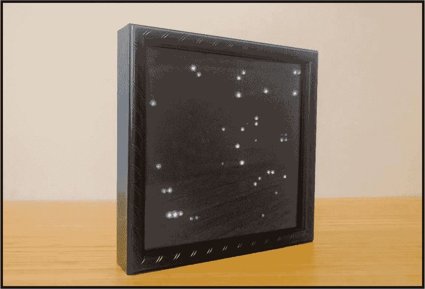
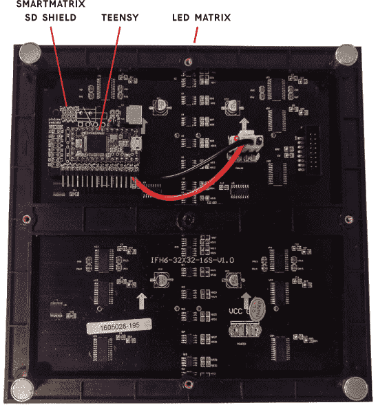
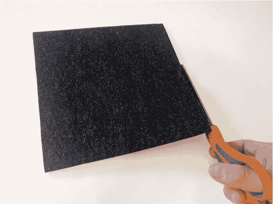
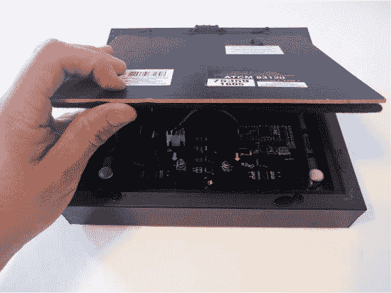
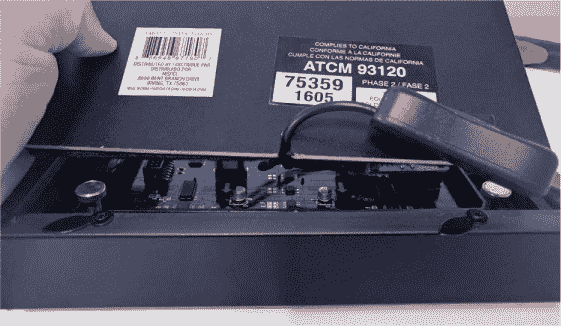
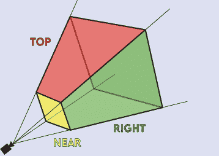

## 第八章：星域灯效盒，由 Adam Wolf 设计

在这个项目中，你将制作一个带有星域灯效的装饰性显示盒。



星域效果是最早的计算机效果演示之一：星星在屏幕上呈现并被模糊，使得看起来就像在星际中飞行。远离你的星星移动缓慢，靠近你的星星则快速飞过。许多人认识这个效果是通过 Windows 3.1 的屏幕保护程序，但它至少自 70 年代末就已存在。在这个项目中，我们将使用 32 × 32 LED 矩阵和 SmartMatrix SD Shield 创建一个星域演示，SmartMatrix SD Shield 作为微控制器与 LED 之间的中介硬件。这款 Shield 微控制器处理了驱动所有 LED 所需的复杂工作。

我将矩阵安装在带有黑色扩散器的影像盒中。我将其称为 Bowman 盒子，灵感来自于 *2001 太空漫游* 中的 Dave Bowman。

### 获取零件

我已经尽力将此项目的代码和说明做得易于适配任何 LED 矩阵，但如果你使用 SmartMatrix SD Shield 和与其兼容的 SmartMatrix SD Shield LED 矩阵，项目会更加简单。

#### 组件

**注意**

*如果你修改项目，使得更多的 LED 同时点亮，你需要找到一个额定电流更高的开关，或者直接将电源连接到板子上。*

+   32 × 32 RGB LED 矩阵（Adafruit P/N 1484 或 SparkFun P/N 12584；必须与直接插入 Hub75 连接器的 SmartMatrix SD Shield 兼容）

+   5 V 4A+ 壁式电源适配器（Adafruit P/N 1466；必须具备标准的 2.1 毫米中心正极连接器）

+   SmartMatrix SD Shield（可从制造商或 Adafruit P/N 1902 购买；v3 是截至本文写作时的最新版本）

+   Teensy 3.1 或 3.2（Adafruit P/N 2756；这是一款小巧、廉价且功能强大的微控制器开发板）

+   MicroUSB 电缆

+   带有 2.1 毫米连接器的内联电源开关（Adafruit P/N 1125 或 SparkFun P/N 11705）

+   影像盒（8 × 8 英寸）

+   扩散器（一种能够扩散光线的半透明材料，填补 LED 之间的空隙；我使用的是一块薄黑色毡布，但你也可以使用纸巾、塑料，甚至是涂抹在玻璃上的东西）

+   （可选）纸板（用于将所有组件紧凑地安装在影像盒中）

#### 工具

+   烙铁和焊料

+   斜口钳

+   剥线钳

+   小螺丝刀

+   剪刀

+   锯子、钻机或锉刀

+   黑色马克笔

### 构建它

首先，按照制造商的说明组装 SmartMatrix SD Shield，并将其连接到 LED 矩阵。接着，你需要将扩散器夹在 LED 显示屏和影像盒的玻璃之间。检查一切是否都能恰好装入影像盒后，再取下盒子背面，剪一个小缺口以便电源线通过，上传程序并重新组装一切。

**注意**

*如果你需要焊接说明，请参阅附录。*

1.  **组装 SmartMatrix SD Shield。** 访问制造商网站 *[`docs.pixelmatix.com/`](http://docs.pixelmatix.com/)* 并导航到 SmartMatrix Shield 部分。找到 SmartMatrix SD v3 部分，然后在左侧菜单中点击 **Kit Assembly**。这应该会带你到 Shield 的组装说明。阅读并仔细遵循制造商的说明——这需要大量的焊接——然后仔细检查你的工作。

    当你的 Shield 完成后，将其插入 LED 面板的输入连接器中，如 图 7-1 所示。

    

    **图 7-1：** 组装好的 SmartMatrix SD Shield 插入 LED 显示屏

    Smart Matrix SD Shield 使用 Teensy 3.1 或 3.2 微控制器板。我们将在 Arduino 中编程 Teensy，Arduino 支持 Windows、macOS 和 Linux 系统。

1.  **设置 Teensy。** 从 *[`www.arduino.cc/`](https://www.arduino.cc/)* 下载最新版本的 Arduino IDE，从 *[`www.pjrc.com/teensy/teensyduino.html`](https://www.pjrc.com/teensy/teensyduino.html)* 安装 Teensyduino，然后通过 IDE 的库管理器安装 SmartMatrix3 库。使用 microUSB 电缆将 Teensy 连接到计算机，并将显示器连接到电源。进入 **工具** ▸ **板** 并选择 **Teensy 3.2/3.1**。

1.  **测试 Teensy。** 通过进入 **文件** ▸ **示例** ▸ **SmartMatrix3** ▸ **FeatureDemo** 来加载 *FeatureDemo* 示例。将代码上传到 Teensy，Teensyduino Uploader 应该会出现并将代码发送到 Teensy。如果你以前从未使用过 Teensy，可能会发现它看起来不同于标准的 Arduino IDE，但 Teensy 部分会自动完成，因此你无需额外操作。

    如果一切正常，你应该会看到一个演示在 Teensy 上播放，展示 SmartMatrix3 库的各种功能。你会看到不同的颜色、移动的形状和滚动的文本。这表明计算机、LED 面板、SmartMatrix SD Shield 和 Teensy 都在正常工作。现在让我们完成外壳部分。

1.  **切割扩散器。** 拆下影像盒的背面并测量内部尺寸。用剪刀裁剪扩散器材料，如 图 7-2 所示。你可以精确匹配影像盒的内部尺寸，或者稍微切大一些，这样你可以将边缘粘贴到盒子的侧面。

    

    **图 7-2：** 切割扩散器

    如果尺寸稍微偏差一点，可能也没关系！盒子内部的其余部分是黑色的，所以任何缝隙都不会太显眼。

1.  **将显示器试装到影箱内。** 清理影箱玻璃上的污渍，然后将影箱的玻璃面朝下放在桌子上，接着将扩散器放入影箱并贴合玻璃。接着将显示器（LED 面朝下）放在扩散器上。如果你有小磁螺丝，将它们拧到 LED 面板的四个角落。检查一下影箱的背面是否仍然能装上，如图 7-3 所示。

    如果装配过紧，试着去除影箱背面任何黑色的天鹅绒材料，或者取下 LED 面板框架上的磁螺丝。如果装配过松，你可以使用一些纸板作为垫片，确保一切都固定好。

    

    **图 7-3：** 测试一切是否适配在影箱内

1.  **在影箱的背面切一个缺口。** 再次取下影箱的背面。将 2.1 毫米的直插开关电源插头插入 SmartMatrix SD Shield 的 DC 电源连接器中。电缆应该恰好能伸出箱外。按照图 7-4 的示意，在影箱背面切一个小缺口，深约 3/4 英寸，宽约 1/4 英寸，用来穿过电源线。我建议你在一个边缘的中间或角落切这个缺口。你可以使用许多工具来完成这个切割，比如手锯、电钻、锉刀，甚至是尖嘴钳。

    

    **图 7-4：** 带有切割缺口以便电源线通过的影箱背面

    如果你的影箱背面有天鹅绒衬里，你也需要在背面切一个缝隙，并确保它与背面切割的缺口对齐。最后，用黑色马克笔修复任何擦伤的痕迹。

1.  **组装它。** 现在重新安装影箱的背面。一切应该都很合适。如果不合适，可以用一些纸板作为垫片和隔板。安装完后，任何小的外观问题都可以忽略，尤其是当星星飞速掠过时。说到这，还是把背面再取下来，这样我们就可以访问 Teensy 进行编程了！

如果你想直接跳到下一步骤，可以跳到第 140 页的“编码它”部分。如果你对星空效果的原理感到好奇，继续往下读。

**生成星空效果**

我们需要创建一个穿越一群星星的效果。近距离的星星应该更亮并且移动得比远距离的星星更快。所有的星星都应该从中心向外径向移动。

为了在软件中实现星空效果，我们将创建一个星星的列表，并将它们随机分布在一个三维空间的坐标系统中。我们将用三个坐标值来表示每个点，比如 (*x*, *y*, *z*)，其中 *x* 代表水平轴，*y* 代表垂直轴，*z* 代表深度。你可以把 *z* 看作是你与点的距离——*z* 值越高，点看起来就越远。我们的*眼睛*，即三维空间中的默认点，位于原点 (0, 0, 0)。

一旦我们完成了随机放置的星星列表，我们就得克服在 2D 显示器上绘制 3D 空间中的点的问题。想象一下把空间区域画成一个四面体，上面和下面被切掉了。这就是所谓的*视锥体*，如图所示。



黄色的方块代表我们的显示屏，每个单位在*x*和*y*上都有一个 LED。这意味着坐标为(0, 0, 0)的点位于显示器的中间，坐标为(–8, –8, 0)的点位于左下角的中间，坐标为(8, 8, 0)的点位于 LED 面板的右上角中间。

我们还需要考虑*z*距离。坐标为(8, 8, 100)的点不应该绘制在 LED 面板右上角的中间。它应该比坐标(8, 8, 0)更靠近显示器的中间，因为它离相机更远。换句话说，随着 z 坐标变大，x 和 y 坐标需要向眼睛移动。

为了将 3D 坐标转换为 2D 坐标，我们将每个 x 和 y 坐标除以*z*。可以把 2D 坐标看作是在特定深度（或*z*）下总框架大小的百分比。将 x 和 y 坐标除以*z*，我们得到的是视锥体边缘的 45 度角，这样对于每一步的*z*，我们就可以看到在*x*和*y*上的额外一步。我们可以尝试不同的因子，比如将其除以 2 倍的*z*，或者将其除以*z*的一半，这会改变视锥体边缘的坡度。

在我的 Bowman Box 中，任何距离的星星都是由一个 LED 绘制的，但 LED 的亮度与距离成正比：距离我们最远的星星亮度最小，位于圆锥体最前面中心的星星亮度最大。为了简化程序，我们仅根据 z 值进行缩放。

哎呀！编程比解释短得多！现在我们知道如何在显示器上绘制星星，我们需要移动！我们想要穿越星星，但不是让眼睛在*z*轴上向前移动，而是让所有星星在*z*轴上朝着眼睛移动。这样做让编程更简单。一旦星星超过了我们的视线，我们当然看不见它了，所以我们会在距离我们最远的地方重新创建它。

### 编程它

如果你想跳过所有关于代码和它如何工作的解释，你可以直接下载代码到*[`nostarch.com/LEDHandbook/`](https://nostarch.com/LEDHandbook/)*并将其上传到你的项目中。完整的代码可以在清单 7-1 中查看。

**清单 7-1：** 星域效果代码

```
  /* StarfieldEffect.ino
    by Adam Wolf

    Uses a SmartMatrix SD Shield, a 32 by 32 RGB LED display,
    and a Teensy to show a starfield effect.
  */

➊ #include <SmartMatrix3.h>
  #define COLOR_DEPTH 24
  const uint8_t kMatrixWidth = 32;
  const uint8_t kMatrixHeight = 32;
  const uint8_t kRefreshDepth = 36;
  const uint8_t kDmaBufferRows = 4;
  const uint8_t kPanelType = SMARTMATRIX_HUB75_32ROW_MOD16SCAN;
  const uint8_t kMatrixOptions = (SMARTMATRIX_OPTIONS_NONE);
  const uint8_t kBackgroundLayerOptions =
   (SM_BACKGROUND_OPTIONS_NONE);
  const uint8_t kScrollingLayerOptions =
   (SM_SCROLLING_OPTIONS_NONE);
  const uint8_t kIndexedLayerOptions = (SM_INDEXED_OPTIONS_NONE);
  SMARTMATRIX_ALLOCATE_BUFFERS(matrix, kMatrixWidth,
   kMatrixHeight, kRefreshDepth, kDmaBufferRows, 
   kPanelType, kMatrixOptions);
  SMARTMATRIX_ALLOCATE_BACKGROUND_LAYER(backgroundLayer,
   kMatrixWidth, kMatrixHeight, COLOR_DEPTH, 
   kBackgroundLayerOptions);
  SMARTMATRIX_ALLOCATE_SCROLLING_LAYER(scrollingLayer,
   kMatrixWidth, kMatrixHeight, COLOR_DEPTH, 
   kScrollingLayerOptions);
  SMARTMATRIX_ALLOCATE_INDEXED_LAYER(indexedLayer, kMatrixWidth,
   kMatrixHeight, COLOR_DEPTH, kIndexedLayerOptions);

  struct Star {
    int16_t x;
    int16_t y;
    float z;
  };

  #define NUM_STARS 32
  struct Star stars[NUM_STARS];

  const int X_RANGE = 400;
  const int Y_RANGE = 400;
  const int HALF_X_RANGE = X_RANGE / 2;
  const int HALF_Y_RANGE = Y_RANGE / 2;
  const int MAX_Z = 16;

  const uint8_t SCREEN_WIDTH = 32;
  const uint8_t SCREEN_HEIGHT = 32;
  const uint8_t HALF_SCREEN_WIDTH = SCREEN_WIDTH / 2;
  const uint8_t HALF_SCREEN_HEIGHT = SCREEN_HEIGHT / 2;

  const float SPEED = 0.1;

➋ void randomizeStarPosition(struct Star* s) {
    s->x = random(-HALF_X_RANGE, HALF_X_RANGE);
    s->y = random(-HALF_Y_RANGE, HALF_Y_RANGE);
    s->z = MAX_Z; // Put the star in the back.
  }

  void drawStar(struct Star* s) {
    uint8_t display_x = (int) (s->x / s->z);
    uint8_t display_y = (int) (s->y / s->z);

➌  display_x = display_x + HALF_SCREEN_WIDTH;
    display_y = display_y + HALF_SCREEN_HEIGHT;

    // Let's check if our calculated point should be displayed.
    if (display_x >= 0 &&
      display_y >= 0 && 
      display_x < SCREEN_WIDTH &&
      display_y < SCREEN_HEIGHT) {
      uint8_t brightness = map(s->z, 0, MAX_Z, 255, 0);
      drawPoint(display_x, display_y, brightness); // It fits,
                                                   // so draw it!
    } else {
      randomizeStarPosition(s);  // It does not fit,
                                 // so make a new star.
    }
  }

  void advanceStar(struct Star* s) {
    s->z -= SPEED;

    if (s->z <= 0) {
      randomizeStarPosition(s);  // If the star has passed us,
                                 // make a new one.
    }
  }

  void setup() {
➍   randomSeed(analogRead(A1));

    for (int i = 0; i < NUM_STARS; i++) {
      Star* current_star = &stars[i];
      randomizeStarPosition(current_star);
➎    current_star->z = random(0, MAX_Z);
    }
   setupDisplay();
  }

  void loop() {
    clearDisplay();

    for (int i = 0; i < NUM_STARS; i++) {
      drawStar(&stars[i]);
    }
    paintDisplay();
    for (int i = 0; i < NUM_STARS; i++) {
      advanceStar(&stars[i]);
    }
  }

  uint16_t distanceToStar(struct Star* s) {      // distance
    return sqrt(sq(s->x) + sq(s->y) + sq(s->z)); // from (0, 0, 0)
  }

  void clearDisplay() {
    backgroundLayer.fillScreen({0x00, 0x00, 0x00});
  }

  void drawPoint(uint8_t x, uint8_t y, uint8_t brightness) {
    // Note this doesn't actually show it on the display.
    backgroundLayer.drawPixel(x, y, 
     {brightness, brightness, brightness});
  }

  void paintDisplay() {
    // Send the image we've built up to the screen.
    backgroundLayer.swapBuffers(false);
  }

➏ void setupDisplay() {
    matrix.addLayer(&backgroundLayer);
    matrix.addLayer(&scrollingLayer);
    matrix.addLayer(&indexedLayer);
    matrix.begin();

    backgroundLayer.enableColorCorrection(true);
  }
```

在阅读这个草图时，有几件事需要注意。Arduino 草图首先运行`setup()`函数，然后反复运行`loop()`函数。

➊和➏处的代码块直接来自与 IDE 一起提供的 SmartMatrix 示例，用于设置 SmartMatrix 库。

我们使用了一个*结构体*（struct），它是一个变量的集合，用来存储我们草图中的一些信息。结构体可以通过将相关信息分组，使代码的意图更加清晰。我们在程序开始时创建了一堆星星结构体。当一颗星星移动到我们视野之外或被我们超越时，我们随机化那颗星星的坐标，并将其设置得远离我们，以便我们能够再次遇到它➋。这样我们就能重用这些结构体，而不需要无限量的星星。

我们希望星星的原点位于显示屏的中央，但 SmartMatrix 库将原点设置在左下角，因此在显示星星时，我们需要调整这一点➌。

我们还需要一个随机数生成器来将星星放置在随机的位置。Arduino 本身没有真正的随机数生成器，因此我们通过在➍读取一个未连接的引脚来初始化系统，以便每次获得不同的伪随机数。读取未连接的引脚并不是一个很好的“随机种子”，因此如果你多次运行，可能会看到它以相同的方式启动。有一些方法可以使其更加随机，但我们为了清晰性保持了简单。

因为通常新星只会出现在背景中，所以我们在初始化星星的位置时，将它们散布在整个 z 轴上➎。

确保你已经将电源连接到电源开关上，然后打开开关。将代码上传到你的 Teensy，确保一切上传正确，然后重新将背面装回你的影像盒。

### 总结

恭喜！你现在应该有了一个漂亮的 LED 矩阵，装在一个精致的盒子里。你可以以多种方式改进和扩展这个项目。但请记住，在我们的项目中，大多数 LED 在任何时刻都是关闭的。如果你改变项目，同时开启更多的 LED，你需要注意电源问题。内联开关的额定电流不足以支撑整个屏幕的全亮度，但你可以移除它，并将电源直接插入板子。

作为进一步的升级，我考虑添加一个加速度计，这样我就可以通过移动框架来操控，改变飞行时的角度和速度。我甚至可能添加彩色星星——不是明亮的彩虹色星星，而是稍微带点红色和蓝色的星星，用来代表行星和星云。天空才是极限！尝试一些不同的方式，看看哪种效果最适合你。
