## 第九章：John Baichtal 的光学螺丝刀

这个项目是一个基于光的打击乐器，呈魔杖形状，与配有光传感器的合成器一起使用，创造酷炫的音效。

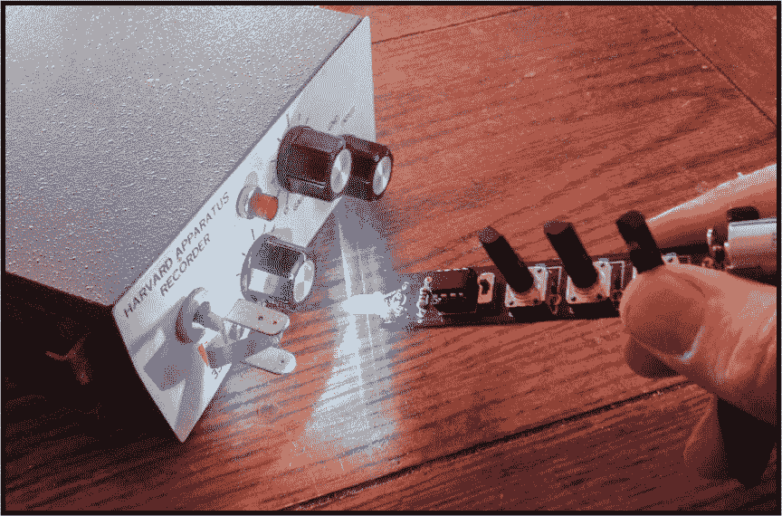

在这个项目中，你将制作一个光学螺丝刀，通过 LED 闪烁向光传感器发送信号，传感器根据接收到的输入告知合成器播放哪些节奏。你可以修改节奏的速率和时长，创造复杂的合成音乐。

我将向你展示如何制作三种不同的螺丝刀，从简单到高级。你不必做全部三种，只需选择你准备好处理的“酷度”级别。

第一个版本是一个超级基础的 Arduino 项目，任何人都可以轻松构建。你还需要组装一个测试装置——一个基本的合成器，由 Arduino、扬声器和光传感器组成——以确保它能正常工作。之后，我将向你展示如何通过几个改进来升级你的螺丝刀：简化的微控制器和一块棒状的印刷电路板（PCB）。

### 构建基础螺丝刀

让我们从最简单的光学螺丝刀配置开始：一个普通的 Arduino，配备 LED 和三个可调电位器，如图 8-1 所示。虽然它看起来不特别像魔杖，但它给你一个不那么华丽但同样有效的等效物——它使得光学 LED 闪烁，与配有传感器的合成器互动。三个电位器将用于控制 LED 闪烁的速度、持续时间和暂停。

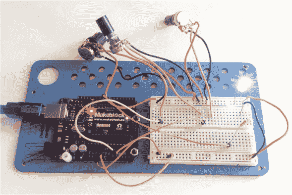

**图 8-1：** 螺丝刀的基础版本

#### 获取零件

完成这个项目的第一阶段，你只需要一些零件。我还包括了你需要构建的测试装置的零件，只有通过它才能听到任何声音。测试装置只是一个光传感器、Arduino 和扬声器。

**注意**

*参见 “Arduino 和 Arduino IDE 入门” 在 第 15 页 获取设置说明。*

+   两块 Arduino Uno 板或类似的（Adafruit P/N 50）

+   半尺寸面包板（Adafruit P/N 64）

+   跳线套件（Adafruit P/N 153）

+   电池适配器或 9V 电池夹（Adafruit P/N 63 或 Adafruit P/N 80）

+   超亮 LED（例如，SparkFun P/N 531）

+   三个 10 kΩ电位器（我使用了 SparkFun P/N 9939，但 P/N 9288 也可以使用；我使用了 Adafruit 的细旋钮，P/N 2057）

+   光传感器（Adafruit P/N 161）

+   8 Ω 扬声器（例如，Adafruit P/N 1313；你需要自己焊接电线）

+   220 Ω 和 10 kΩ 电阻（SparkFun P/N 10969 是一个不错的多包装）

#### 组装电路

最基础的螺丝刀可能不会给你带来太大挑战，但不用担心——这个项目升级得很快！我们开始吧：

1.  **插入 LED。** 将 LED 的长脚连接到 9 号引脚，中间加上一个 220 Ω电阻，然后将短脚连接到 GND 旁边。图 8-2 显示了它应该是什么样子。

    

    **图 8-2：** 将 LED 和电阻添加到面包板上

1.  **连接电位器。** 添加三个电位器。对于每个电位器，将最左侧的引脚连接到 GND，最右侧的引脚连接到 5V。中间的引脚是数据连接，如图 8-3 所示。哪一个是 GND，哪一个是 5V 并不重要，只要中间引脚连接到数据即可。将每根线的一端连接到 A0、A1 和 A2 引脚，如图 8-3 中的紫色线所示。

    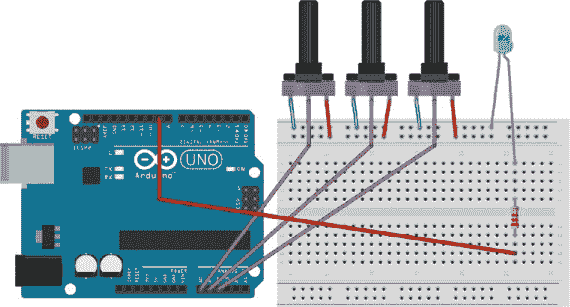

    **图 8-3：** 将电位器连接到适当的模拟引脚

1.  **添加电源。** 通过将 Arduino 连接到墙壁电源或 9V 电池来为其供电。你还需要为原型板供电，因此将 Arduino 的 5V 和 GND 引脚连接到板两侧的电源和接地总线。这些新线用红色（电源）和黑色（接地）表示，如图 8-4 所示。

    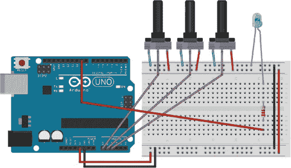

    **图 8-4：** 将面包板连接到 Arduino 的 5V 和 GND 引脚

#### 编写代码

这个草图基本上是 Blink 示例草图，我在其中添加了电位器来修改节奏。你可以在* [`nostarch.com/LEDHandbook/`](https://nostarch.com/LEDHandbook/)* 下载它以及本书的其他项目文件。

让我们逐部分了解代码：

```
void setup() {

  pinMode(9, OUTPUT); //change to 0 with the Tiny85
  pinMode(A0, INPUT);
  pinMode(A1, INPUT);
  pinMode(A2, INPUT);
}
```

**注意**

*如果你使用 ATtiny85 微控制器，请记得将所有 pin 9 的实例更改为 pin 0——稍后会详细介绍！*

`void setup()` 函数在 Arduino 通电或重置时运行一次。在本例中，setup 函数告诉 Arduino 哪些引脚用作输入，哪些用作输出。

接下来是循环部分。

```
void loop() {
  int speedKnob = analogRead(A0); 
  int durationKnob = analogRead(A1);
  int skipKnob = analogRead(A2);

  int currentSpeed = map(speedKnob, 0, 1027, 10, 900);
  int currentDuration = map(durationKnob, 0, 1027, 100, 800);
  int currentSkip = map(skipKnob, 0, 1027, 1, 150);
```

`void loop()`的第一部分声明了一系列变量，与三个电位器对应——速度、时长和跳过。为了方便编写代码，我将节奏之间的时间标记为*speed*，每个节拍的时长标记为*duration*，LED 在“关闭”状态下的亮度级别标记为*skip*。这样，我们就有了“从亮到暗”的选项，而不是“开或关”，使得流畅度更高。

最后，代码将三个电位器的读数映射出来，并将其值转换为我们可以使用的内容——电位器的输出范围是 0–1023，因此代码将该值转换为秒数。你可以随意更改这些值，以便使螺丝刀更好地为你工作！

```
  digitalWrite(9, HIGH); //the LED turns on
  delay(currentDuration);
  digitalWrite(9, LOW); //the LED turns off for a moment
  delay(10);
  digitalWrite(9, currentSkip); //the LED dims
  delay(currentDuration * 0.5);
  digitalWrite(9, LOW); //the LED turns off
  delay(currentSpeed);
}
```

代码的最后部分控制草图的实际工作：打开和关闭 LED。LED 的亮灭时间等于`currentDuration`的值，或者在 100 到 800 微秒之间。当合成器的光传感器检测到这些节拍时，它会发出声音。将螺丝刀靠得更近会产生更大的节拍声音，而拉远它则会发出更微妙的声音。

#### 搭建测试设备

除非你手头有一个光感合成器，否则你需要自己制作一个。这个平台发出一个节拍，节拍通过光传感器传送的数据进行修改，因此它能够与螺丝刀互动。你需要从零件清单中获取额外的 Arduino 以及扬声器。你可以在 图 8-5 中看到我制作的超级简单的测试平台。


**图 8-5：** 测试平台帮助你确保螺丝刀正常工作。

1.  **接线扬声器。** 将扬声器的正极引脚插入第二个 Arduino 的 9 号引脚，负极引脚插入 GND。图 8-6 显示了它的连接方式。

    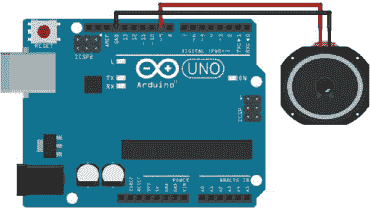

    **图 8-6：** 将扬声器连接到 Arduino

1.  **连接光传感器和电阻。** 将光传感器的一端连接到 A0 引脚，另一端连接到 5V。将一个 10 kΩ 电阻插入同一个 A0 引脚，或者将光传感器的引脚和电阻连接在一起。将电阻的另一端连接到 GND，如 图 8-7 所示。

    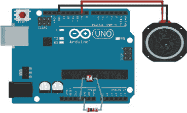

    **图 8-7：** 连接光传感器和电阻

1.  **编写代码。** 测试平台的代码是 `tonePitchFollower` 示例草图的一个变种，根据光传感器检测到的级别来改变音调。我通过将节拍长度和暂停长度与同一个光传感器绑定，加入了一些额外的创意，使光学螺丝刀能够同时通过光传感器修改节拍的音调、长度和节拍间的时间。

    ```
    void setup() {
    }

    void loop() {

      int sensorReading = analogRead(A0);
      int thisPitch = map(sensorReading, 400, 1000, 120,
    1500);
      int reverseReading = map(sensorReading, 400, 1000,
    1023, 1);

      tone(9, thisPitch, reverseReading);
      delay(10);

    }
    ```

1.  **测试。** 测试平台创建一个循环的音调序列，每秒 100 个音调，频率等于光传感器的读数，并通过重新映射传感器读数来确定音调的持续时间。即使没有螺丝刀，你也可以通过把手指放在光传感器上并改变其读数来玩这个测试平台。

当你将螺丝刀那闪烁的怪异光线加入其中时，随着光的波动产生复杂的声音结构，更加复杂的模式也随之出现。

### 使用 ATtiny85 构建魔杖版

接下来，我将向你展示如何换上 ATtiny85，这是一款比 Arduino 中的 ATmega328p 更小的微控制器。它是一个更简单的芯片，没有 Arduino 板的额外功能，但它也更紧凑，这使得你能够将螺丝刀电路从原型板上移到一个更便于携带的魔杖上。

#### 获取零件

获取以下零件，使用 ATtiny85 构建一个焊接版的基础螺丝刀。如果你愿意，可以重新使用之前原型构建中的零件。

##### 组件

+   Arduino Uno（重新使用 “构建测试平台” 中的那个，第 152 页）

+   ATtiny85 微控制器（例如，SparkFun P/N 9378）

+   超亮 LED（例如，SparkFun P/N 531）

+   两个 220 Ω 电阻

+   10 μF 电容（SparkFun P/N 523）

+   Perma-Proto 板（Adafruit P/N 571；这些板需要你焊接组件）

+   8 针 IC 插座（Adafruit P/N 2202）

+   三个可调电阻（我建议使用 SparkFun P/N 9288，因为它们可以焊接到位）

+   5V 电源（例如，SparkFun P/N 12889）

+   电源的桶形插座（Adafruit P/N 373 或 SparkFun P/N 10811）

**注意**

*你不应该使用 9V 电池，因为 ATtiny85 缺乏 Uno 的电源管理功能，Uno 可以将输入电压转换为 5V。如果使用 9V 电池，芯片将过载。*

##### 工具

+   焊接铁

+   焊接

**注意**

*请参见附录中的焊接说明。*

让我们来看一下 ATtiny85 的技术细节。它有八个引脚，包括电源、接地以及各种模拟和数字数据引脚。图 8-8 展示了引脚布局。

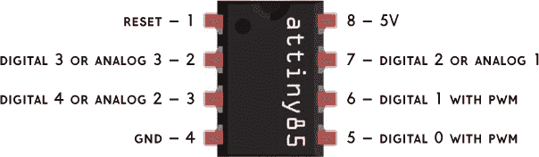

**图 8-8：** ATtiny85 的八个引脚控制了惊人的计算能力。

#### 烧录 ATtiny85

使用 ATtiny85 的一个缺点是，我们失去了一些在使用 Arduino 时所拥有的编程便利性。Arduino 具有一个非常方便的基于 USB 的引导加载程序，但它的较小版本没有，因此你需要使用另一块 Arduino 来编程 ATtiny85。由于芯片的引脚需要用于编程，我们不能在编程之前组装项目。使用这个版本的光学螺丝刀，当芯片安装到电路板上后，你将无法重新烧录芯片。

操作方法如下：

1.  **连接 ATtiny85。** 按照第 152 页中的“构建测试平台”使用 Arduino，如图 8-9 所示。在这一步中，图 8-8 中显示的引脚分配变得非常重要。将引脚 1 连接到数字引脚 10，图 8-9 中的蓝色线表示。将引脚 4 通过黑线连接到 GND。将一根红线从引脚 5 插入电源总线。将引脚 6、7 和 8 分别连接到 Arduino 的 13、12 和 11 引脚，图 8-9 中的黄色、白色和绿色线表示。

1.  **连接 LED 和电容器。** 你还需要连接一个 LED，并为其配上一个 220Ω的电阻来保护它，连接到 ATtiny85 的引脚 8；这个 LED 会闪烁，显示它正在工作。接下来，你需要将一个 10µF 电容器的短引脚连接到 Arduino 的复位引脚（用紫红色线表示），长引脚连接到 GND。

1.  **连接电源和接地。** 最后，将面包板的电源和接地总线连接到各自的 Arduino 引脚。

1.  **在 Uno 上安装 ArduinoISP 草图。** 在 Arduino 程序的工具菜单中找到这个选项，然后将 Uno 的程序器设置为“ArduinoISP”，从程序员列表中选择**ArduinoISP**。然后转到**工具** ▸ **板子**，选择正确的 ATtiny 型号。接着上传草图！

你还可以购买一些产品，让你无需第二块 Arduino 即可编程 ATtiny85——例如，SparkFun 的 Tiny AVR Programmer（P/N 11801）和 Evil Mad Scientist 的 ISP Shield（* [`emsl.us/253`](http://emsl.us/253) *）。

这是一个简化版的过程描述。若要获取更全面的 ATtiny 编程指南，请访问 MIT 的 High-Low Tech 页面，点击 *[`highlowtech.org/`](http://highlowtech.org/)*，然后点击 **教程**，再点击 **使用 Arduino 1.6（或 1.0）编程 ATtiny** 的链接。David Caminati 也提供了一个很好的教程，网址是 *[`fritzing.org/projects/programmer-for-attiny85-with-arduino-uno-as-interf/`](http://fritzing.org/projects/programmer-for-attiny85-with-arduino-uno-as-interf/)*。

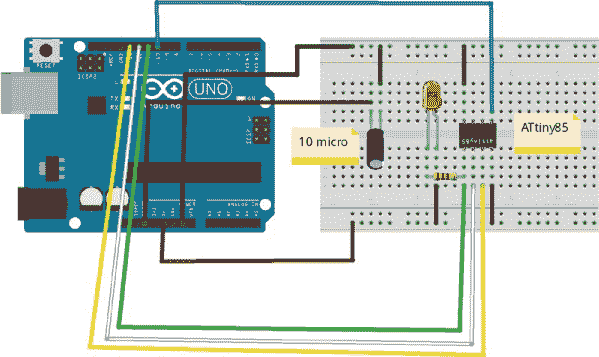

**图 8-9：** 使用另一块 Arduino 编程 ATtiny85

#### 制作 ATtiny85 螺丝刀

接下来的挑战是将那一团凌乱的电线变得更加稳固。你将使用 Adafruit 的一块信用卡大小的原型板，并将其设计成，除了电源线之外，你可以一手持有整个螺丝刀。

1.  **焊接电位器。** 如 图 8-10 所示，将三个电位器焊接到原型板上。将每个电位器的外部两个引脚连接到电源和地面。

    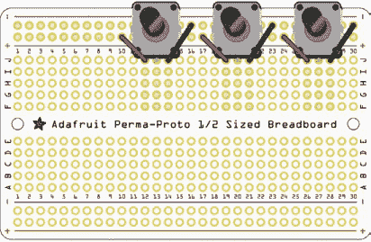

    **图 8-10：** 安装电位器

1.  **安装 IC 插座。** 接下来，如 图 8-11 所示，焊接 IC 插座。ATtiny85 顶部有一个缺口，应该朝向星标，正如图中所示。将第 2、3 和 7 引脚分别连接到每个电位器的中间引脚（从右到左），并将第 8 引脚连接到电源，第 4 引脚连接到地面（有关 ATtiny85 引脚配置，请参阅 图 8-8）。如果这些连接顺序错误，可能会出现意外结果，因此一定要注意每个电位器连接到哪个引脚。

    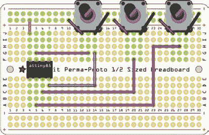

    **图 8-11：** 焊接 IC 插座

1.  **连接 LED。** 将 LED 的长引脚通过一个 220 Ω 电阻器连接到 ATtiny85 的第 5 引脚，将 LED 的短引脚连接到地面。图 8-12 展示了该如何连接。

    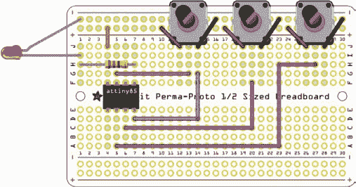

    **图 8-12：** 添加 LED 和电阻器

1.  **添加电源。** 焊接圆形插口（如 图 8-13 所示），将中间引脚连接到电源，任意一个侧边引脚连接到地面。

    只要你已经将 ATtiny85 刷写了草图，应该就可以立刻插入使用了。

    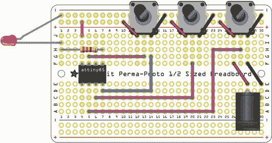

    **图 8-13：** 焊接电源插口

这就是你已经焊接好的电路！

#### 编写代码

初始构建中的代码在这个版本中也适用！不过，你需要做一个关键的修改。ATtiny85 上没有第 9 引脚，所以你需要将其改为 `0`。还记得原始代码中的这一行吗？

```
pinMode(9, OUTPUT); //change to 0 with the Tiny85
```

你需要将那个 `9` 和接下来的所有 `9` 改为 `0`。

```
digitalWrite(9, HIGH); //the LED turns on
delay(currentDuration);
digitalWrite(9, LOW); //the LED turns off for a moment
delay(10);
digitalWrite(9, currentSkip); //the LED dims
delay(currentDuration * 0.5);
digitalWrite(9, LOW); //the LED turns off
delay(currentSpeed);
```

当你做完修改后，使用本章前面提到的编程设备上传草图——也就是将 ATtiny85 连接到 Arduino，然后将代码加载到 Arduino 上。一旦 ATtiny85 被编程，它可以插入插座中，你就可以开始使用了。

### 制作 PCB 魔杖

不需要完整的 Arduino，你就可以将光学螺丝刀做得更小巧、更有吸引力。事实上，你可以把它做得足够小，以适应一个魔杖形状的印刷电路板（PCB），如图 8-14 所示。之前版本的螺丝刀是为那些不想购买或加工自己电路板的人设计的。如果你愿意接受挑战，这个版本的项目就适合你了！

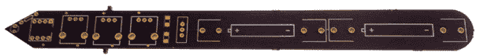

**图 8-14：** 这种魔杖形状的 PCB 容纳了螺丝刀的组件。

**关于 Fritzing**

Fritzing 是一款简单的电路设计程序，允许你通过传统的电路符号、面包板组件或 PCB 设计来构建电路。要创建设计，你只需要从调色板中拖动组件并在它们之间绘制连线。我一直在使用这款程序，你可能也会觉得它很有用。你可以从 *[`www.fritzing.org/`](http://www.fritzing.org/)* 下载它。

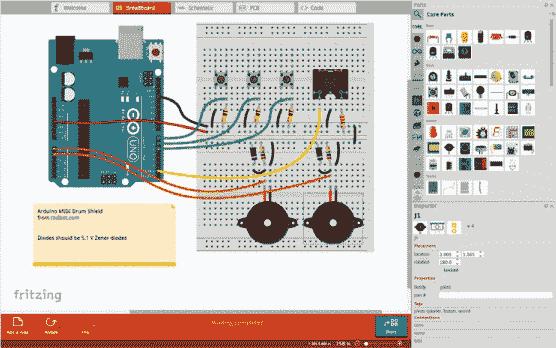

#### 获取零件

这些部件大多数与我们在项目的前一版本中使用的组件相同。你将需要以下零件来完成这个版本。

##### 组件

+   超亮 LED（例如，SparkFun P/N 531）

+   ATtiny85 (SparkFun P/N 9378)

+   8 脚 IC 插座（Adafruit P/N 2202）

+   三个 10 kΩ电位器（SparkFun P/N 9939 或 P/N 9288）

+   微型电源开关（SparkFun P/N 102）

+   电池夹（SparkFun P/N 7949）

+   表面贴装 LED（SparkFun P/N 12619）

+   两个表面贴装电阻（Jameco P/N 2008882）

+   两节 AA 电池

##### 工具

+   焊接铁

+   焊锡

**注意**

*请参见附录中的焊接说明。*

#### 制作它

按照以下步骤构建你的光学螺丝刀魔杖，见图 8-15。

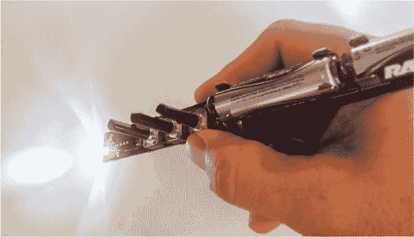

**图 8-15：** 完成的光学螺丝刀在使用中

1.  **设计 PCB 轮廓。** 我使用了 Inkscape（*[`inkscape.org/`](https://inkscape.org/)）来绘制一个与我想要的 PCB 形状相对应的矢量图。图 8-16 展示了我绘制的形状：一个大约 8 英寸长、3/4 英寸宽的铅笔形状。Inkscape 文件与本书的其他资源一起提供（*[`nostarch.com/LEDHandbook/`](https://nostarch.com/LEDHandbook/)*）。你可以将电路板做成任何你想要的形状。在 Inkscape 文件中，PCB 可以是任何颜色，但这不会影响最终效果；程序关注的是矢量图形。Fritzing 提供了一个关于如何制作适用于该程序的形状的教程，地址是 *[`fritzing.org/pcb-custom-shape/`](http://fritzing.org/pcb-custom-shape/)*。

    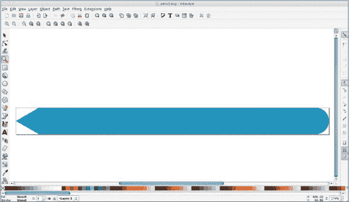

    **图 8-16：** 我在 Inkscape 中设计了一个铅笔形状，用于魔杖。

1.  **在 Fritzing 中制作电路。** 将电路添加到电路板形状中，如图 8-17 所示。别担心——我会逐步说明如何进行每个子步骤！

    

    **图 8-17：** 添加到电路板设计中的光学螺丝刀

    1.  **添加 PCB 轮廓。** 若要添加在 Inkscape 中制作的电路板轮廓，单击一次默认的 PCB，然后在检查器中单击**加载图像文件**按钮，用自己的图像替换它。图 8-18 显示了准备加载组件的 PCB 轮廓。记住，蓝色并没有特殊含义，它只是一个占位符。真正的颜色决策是在你支付 PCB 加工费用时作出的。

        

        **图 8-18：** PCB 文件已加载。

    1.  **添加电池。** 从零件面板中拖动电池夹并将其添加到电路板上。按照图 8-19 中的示意图，将两块电池串联连接。图中的黑色线条代表将在 PCB 上出现的丝印，而圆圈则表示 PCB 上的孔位，绿色表示已焊接的端子，红色表示未焊接的端子。

        

        **图 8-19：** 添加电池夹

    1.  **添加开关。** 开关有三个安装孔（参见图 8-20）；你应该将电池连接到中间的孔。

        

        **图 8-20：** 添加开关

    1.  **添加表面贴装 LED 和电阻。** 从图 8-21 可以看到，LED 和电阻没有安装孔，而是安装焊盘。这意味着这些组件是表面贴装的，而不是穿孔安装的。将开关的顶部引脚连接到 LED 的第一个焊盘，将 LED 和电阻串联连接，然后将电阻接地到电池组的负端。这种电阻作为电源指示器，因此无论螺丝刀发生什么，你都能知道电池是否正常工作！

        

        **图 8-21：** 添加 LED 和电阻

    1.  **添加三个电位器。** 从面板中拖动三个电位器，并按图 8-22 中的示意图添加。左侧引脚通过开关连接到电源，右侧引脚连接到接地。中间（数据）引脚暂时不接线。

        

        **图 8-22：** 连接三个电位器

    1.  **添加 ATtiny85。** 通过将引脚连接到与前一个项目相同的方式，添加 ATtiny85 插座：引脚 2、6 和 7 连接到电位器，而引脚 4 连接到接地，8 引脚连接到电源。图 8-23 显示了正确的接线方式。

        

        **图 8-23：** 添加 ATtiny85 插座

    1.  **添加电阻和超亮 LED。** 最后一步是添加 LED 和保护它的电阻。将这两个元件串联，电阻连接到 ATtiny85 的第 5 针脚，LED 的负极引脚连接到地线。图 8-24 展示了完成的电路板。

        

        **图 8-24：** 电路板已完成。

1.  **输出 Gerber 文件。** 导出 Gerber 文件，这是生产人员用来铣削电路板的设计文件。进入**文件** ▸ **导出** ▸ **用于生产**，然后选择**扩展 Gerber 文件**。系统会提示您将文件保存到文件夹中。

    当输出 Gerber 文件时，请使用 Gerber 检查工具如 MCN（图 8-25），该工具可以从 *[`mcn-audio.com/`](http://mcn-audio.com/)* 获取。该工具允许您检查电路板上的痕迹，确保它们按预期布线。我曾因为盲目相信软件能够正确处理而导致许多电路板损坏，因此我强烈推荐使用此工具。

    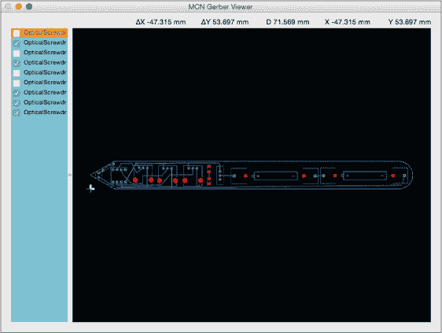

    **图 8-25：** 使用 MCN 或类似应用检查您的 Gerber 文件。

1.  **铣削电路板。** 选择其中一种 PCB 铣削服务。我使用 OSHPark（*[`www.oshpark.com/`](http://www.oshpark.com/)）](http://www.oshpark.com/)，因为它们简单且价格便宜。图 8-26 展示了我从服务商那里返回的铣削电路板。

    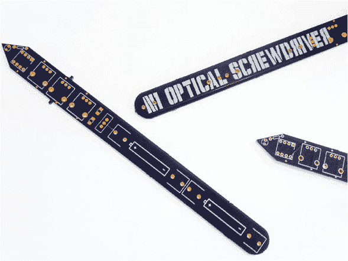

    **图 8-26：** 电路板已完成，现在可以开始添加元件！

1.  **焊接元件。** 按照预期焊接元件。特别需要注意的是 ATtiny85，它容易受到损坏。与其将 IC 直接焊接到电路板上，不如先焊接座子，再将 IC 放入座子中。这样还可以在未来的某个时间刷新 ATtiny85。

1.  **编写代码。** 按照本章前面描述的方法，将光学螺丝刀的代码上传到 ATtiny85 上。它应该能够正常工作！您完成的项目应类似于图 8-27。

    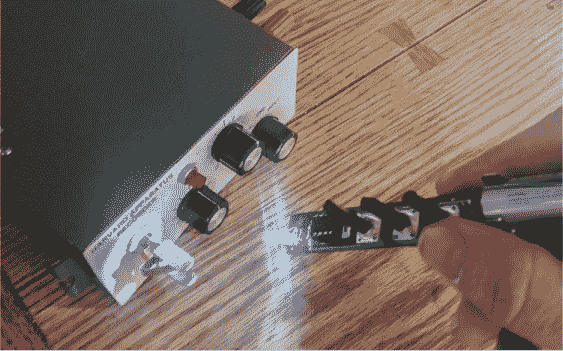

    **图 8-27：** 完成的螺丝刀，通过自制合成器闪烁出节拍

### 总结

虽然被许多人认为是最简单的电子项目，闪烁的 LED 仍然能提供一些很酷的挑战和机会。本项目展示了如何将数字和模拟结合，制作一个有趣的工具，您可以自己动手制作。
