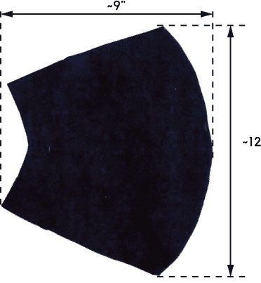
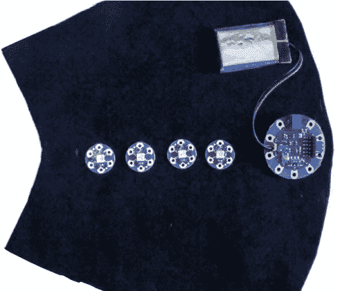
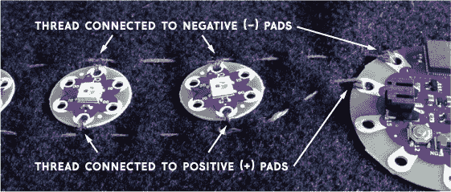
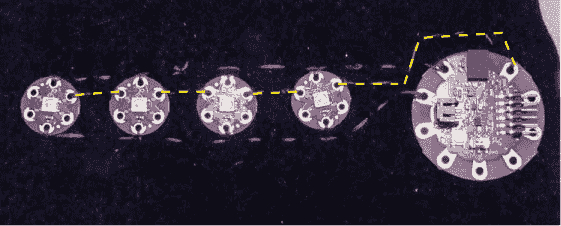
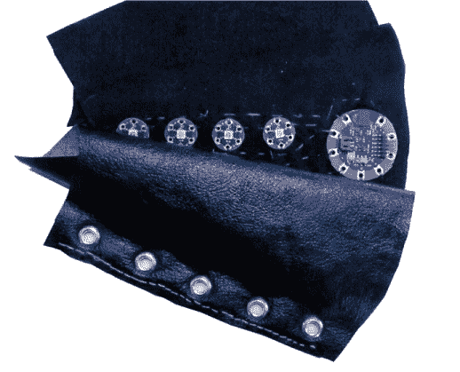

## 第十章：由 Mike Hord 设计的可穿戴计时护腕

在这个项目中，你将制作一个发光的手腕计时器，非常适合 LARP 服装。


我有很多朋友参加*实景角色扮演（LARP）*游戏。作为一个概念，它与桌面角色扮演类似，只不过没有回合制，没有骰子，而且你周围发生的一切都有现实成分。

游戏中的一个元素是计时效果；例如，一个魔法可能会让你睡觉 10 分钟，固定你 1 分钟，或者让你 uncontrollably 笑 5 分钟。由于游戏发生在一个幻想的奇幻世界中，使用手表来计时会显得格格不入，破坏了游戏的氛围。玩家需要一种不引人注意的方式来保持时间。为了解决这个问题，在这个项目中，我们将制作一个护腕（或护手）配有神秘发光的宝石，并且还能告诉你效果还会持续多久。作为额外奖励，我们将让它可以与智能手机连接，这样你就可以在不重新编程项目的情况下设置计时器的持续时间！

这个护腕上有四颗宝石，每颗宝石在按下时都会启动计时器。默认情况下，计时器会持续 1 分钟、5 分钟或 10 分钟。宝石会在效果持续期间脉动发光，计时器结束时熄灭。

### 获取零件

这个项目包括了缝纫和电子部分。我将材料分为两份清单，以便于使用。你可以在任何库存较全的缝纫用品或面料商店找到这些手工用品。

#### 组件

+   LilyPad Simblee 板（SparkFun P/N 13633）

+   4 个 LilyPad 像素板（SparkFun P/N 13264）

+   4 个 LilyPad 按钮板（SparkFun P/N 08776）

+   1,000 mAh 锂聚合物离子电池组（SparkFun P/N 13813）

+   LilyPad FTDI 基础板（SparkFun P/N 10275）

+   Mini-B USB 电缆（SparkFun P/N 11301）

+   导电线（SparkFun P/N 13814）

#### 手工材料

+   眼圈工具包

+   缎带、花边或其他类似线状的装饰材料；我使用的是降落伞绳

+   各种缝纫用品，如线和缝针

+   弹性织物胶水

+   透明或半透明的宝石或珠子，约 1/2 到 1 英寸大小

+   旧礼品卡或过期的信用卡

+   5 到 10 张预切的毡片（9 × 12 英寸）

+   1/3 码的人造皮革

#### 工具

+   锤子（用于设置眼圈）

+   剪刀

### 制作过程

由于手工部分的尺寸会根据个人喜好和穿戴者的尺寸有所不同，很多部分需要通过“试试看”的方法来调整。

我还假设你对缝纫有足够的熟悉度，所以不需要我解释缝纫部分的每一步。如果你以前从未做过电子纺织品项目，我建议你先查看这些优秀的教程，帮助你掌握基础知识：

+   ***[`www.sparkfun.com/tutorials/313`](https://www.sparkfun.com/tutorials/313)*** 这个非常实用的视频教程解释了基本的电子纺织缝合技巧。

+   ***[`www.sparkfun.com/tutorials/306`](https://www.sparkfun.com/tutorials/306)*** 我们将使用本教程中的技术来制作启动定时器的按钮。

+   ***[`learn.sparkfun.com/tutorials/dungeons-and-dragons-dice-gauntlet`](https://learn.sparkfun.com/tutorials/dungeons-and-dragons-dice-gauntlet)*** 这个项目制作了一种类似风格的服装，但它用来隐藏掷骰子机制，而不是定时器。

最终的护腕将有三层：最上层是类似皮革的材料，中间层包含带电路的材料，底部是另一层毛毡或布料。我们开始吧。

1.  **剪裁布料。** 图 9-1 显示了你需要剪裁的大致形状。具体的尺寸取决于你想要护腕的大小，尽量做得大一点，以便容纳电子元件。可以用纸或废布尝试不同的形状和尺寸，直到找到合适的尺寸。

    一旦你找到喜欢的形状和大小，从毛毡中剪下两块相同形状的材料，再从人造皮革中剪下一块。让皮革材料稍微大一点，这样它可以将下面的毛毡部分遮盖住。

    

    **图 9-1：** 剪裁毛毡和人造皮革的大致形状

1.  **布置一些电子元件。** 现在你将尝试将电子元件如何布置在毛毡护腕的形状上。你需要找到一个你觉得舒适的位置。

    首先，你需要将 LilyPad Simblee 板朝向一个边缘，六针连接头指向外侧，这样你才能访问这些引脚进行编程和充电。其次，像素板（我简短地称之为 LED）应该沿着护腕的中央形成一条直线，这样更符合美观的考虑。图 9-2 展示了我如何设置的。

    在这个阶段，你只需要布置 LED、蓄电池和 Simblee 板。按钮会稍后添加。

    

    **图 9-2：** 将电子元件排列在形状的中央。

1.  **缝入 LED 的导电电源线。** 使用导电线，首先将 LED 的正 (+) 和负 (–) 电源线缝制到位。你需要在电子元件的一侧沿着正极焊盘连接一根电源线，另一侧连接负极焊盘。请参见 图 9-3 了解缝线的布置。

    

    **图 9-3：** LED 的正负电源线

    注意 LED 的朝向！确保你将 Simblee 板上的负极垫与 LED 上的负极垫缝合。当你确信所有线路布置正确时，用导电线缝合这些垫片，确保缝线较长，并且缝线之间有适当的间隔，就像图 9-3 中所示的那样。在下一步中，你需要将另一根线穿过负电源线，最简单的方式是将它穿过两针缝隙之间。你将电子元件缝制的毡布将成为中间层，位于仿皮革层下方。

1.  **将数据线从 Simblee 板缝制到 LED。** 现在你需要将 LED 与 Simblee 板连接起来，这样 Simblee 就可以控制它们。图 9-4 展示了如何缝制导电线。

    

    **图 9-4：** 将 Simblee 板连接到 LED

    在图 9-4 中，我使用了黄色虚线来更清晰地展示数据线从 Simblee 板上的垫子（板上标记为垫子 3）到第一个 LED 的路径，以及连接 LED 的连续线。

    请注意，数据线会横跨负电源线，正如我在前一步中提到的。你必须确保这两根线不要接触，否则你的项目会发生短路。为了实现这一点，确保数据线从两个缝隙之间穿过负电源线。

1.  **在每个 LED 板下的毡布上切孔。** 每个 LED 下面需要一个按钮，这样当你按下 LED 时，它就会触发开关。为了确保最佳连接，在每个 LED 下方的毡布中心切一个小孔，以便 LED 板能直接接触到按钮，而不被毡布隔开。但要小心不要切孔太大；你不想不小心切到已经放置的线，或者削弱周围的毡布，导致它撕裂！

1.  **放置、缝制并穿线按钮板。** 在每个 LED 下方放置一个按钮板，使按钮面朝 LED 板的背面。每个 LED 下方应正好有一个按钮板，如图 9-5 所示。

    再次强调，我用黄色高亮了线的路径。顶部的长线是来自另一侧毡布的负电源线，这是你之前铺设的。

    

    **图 9-5：** 将按钮板连接到支架

    用导电线将每个按钮板的一侧缝到之前铺设的负电源线上。与 LED 板不同，按钮板没有极性，因此你可以将任何一端穿到负电源线上。

    接下来，从每个按钮的另一侧穿过一根线到 Simblee 板，如图 9-5 所示。将最靠近的按钮缝到垫片 15 上，下一个缝到垫片 12，再下一个缝到 11，最后一个缝到 9。一定要特别小心这些线与之前的正电源线交叉的位置。你需要*非常*确定这些线不会接触到，否则那个按钮将无法工作，修复起来会非常麻烦。

1.  **将背面材料粘贴到按钮板上。** 现在将旧的礼品卡或类似的硬材料剪成大约与 LED 板直径相同的方块。将其中一个粘贴到每个按钮板的背面，如图 9-6 所示。

    

    **图 9-6：** 胶水粘贴在每个按钮板背面的纸板方块

    我使用了一种专门设计用于柔韧性的织物胶。这些纸板方块为按钮提供了一个坚固的支撑，使按钮可以被按下而不会沉入下面的层中。这个步骤很重要，不容忽视。

1.  **将各层缝合并放置孔眼。** 你一直在使用的材料形成了中间层；顶层是类似皮革的材料，底层是另一层毡或布料。沿着一边缝合这三层，如图 9-7 所示。确保使用普通的、非导电的线。

    

    **图 9-7：** 将各层缝合在一起并放置孔眼

    一旦你将各层的边缘缝合在一起，就可以在这一边放置孔眼。按照孔眼套件包装上的说明进行操作。然后在另一边重复缝合和放置孔眼的过程。

1.  **在 LED 灯珠上切割孔洞。** 通过在每个 LED 灯珠上方切一个小孔来暴露 LED。如果你愿意，你还可以在每个孔上方粘贴一个半透明的宝石或珠子，以获得更闪亮的外观。我使用了带有蘑菇底座的 3D 打印宝石。如果你想自己 3D 打印这些宝石，你可以在本书资源中找到相关文件，网址是 *[`nostarch.com/LEDHandbook/`](https://nostarch.com/LEDHandbook/)*。感谢 Youmagine 用户 jensa (*[`www.youmagine.com/jensa/designs`](https://www.youmagine.com/jensa/designs)*) 提供了原始的“绿宝石”设计。图 9-8 展示了完成的项目。

    

    **图 9-8：** 安装好宝石的完整护腕，覆盖在 LED 灯珠上

    当护腕准备好佩戴时，将你的缎带或绳子穿过孔眼，将护腕系到你的手腕上。

    按下 LED 灯珠，或者如果你添加了半透明装饰物，按钮激活时应该会发出清脆的“咔嗒”声。如果没有，添加更多层纸板到按钮板的背面，直到按钮足够坚固。

### 编程

让我们来看看代码。完整代码相当长——超过 500 行——因此这里只包含了最有趣的部分。你可以在书籍资源中下载代码，地址是 *[`nostarch.com/LEDHandbook/`](https://nostarch.com/LEDHandbook/)*，并阅读下面代码清单中的注释，了解它的一般工作原理。

Simblee 的支持并没有内置于 Arduino IDE 中，因此你需要自己添加它。按照* [`learn.sparkfun.com/tutorials/simblee-concepts`](https://learn.sparkfun.com/tutorials/simblee-concepts)*中的设置 Arduino 教程，完成相关设置。该页面会带你走完编程 Simblee 的所有步骤。你在这里需要用到 FTDI 基本板和 USB 数据线。

这段代码比它的长度看起来简单得多。它设置了四个独立的定时器，这些定时器可以通过按下隐藏在 LED 下面的按钮来触发或重置，然后在对应的 LED 上创建一个脉冲效果，表示一个正在运行的定时器。大部分代码其实是相同的，只是重复了四次，每次对应一个定时器。最后是所有必要的 UI 设置代码。

```
#include <SimbleeForMobile.h>

#define SFM SimbleeForMobile // A macro to shorten our later
                             //  library calls to a
                             //  reasonable length.

// Aliases for the pin assignments for each button.
#define BUTTON1 15
#define BUTTON2 12
#define BUTTON3 11
#define BUTTON4 9

// Linearize the output of the LED in 16 steps. Because of the
//  nonlinear response of the human eye, for the LED to look
//  like it is fading in a linear fashion, nonlinear steps
//  of brightness are needed.
const int LEDSteps[16] = {255, 191, 154, 128, 107, 90, 76, 64,
                            53,  43,  34,  26,  19, 12,  6,  0};

// Timer variable definitions.
int timer1 = 60;   // timer1 defaults to 60 seconds

int t1Default = 60;

long t1last = 0;

int t1LEDIndex = 0;

int t1LEDDir = 1;

int t1LEDVal = 255;

long LEDUpdateLast = 0;

// Timer active definitions.
bool t1active = false;

// Flash storage definitions and variables.
#define FLASH_PAGE 251

unsigned long *t1p = ADDRESS_OF_PAGE(FLASH_PAGE);

void setup()
{
  // Our buttons need to be inputs, with pullups.
  pinMode(BUTTON1, INPUT_PULLUP);
  pinMode(BUTTON2, INPUT_PULLUP);
  pinMode(BUTTON3, INPUT_PULLUP);
  pinMode(BUTTON4, INPUT_PULLUP);
  // This is the output pin for the LEDs. I didn't
  //  make a #define for it because this is the only
  //  place we use it.
  pinMode(3, OUTPUT);
  // This function is defined farther down in the
  //  code. It handles writing the current values
  //  of LED brightness to the four LEDs.
  updateLEDs();
  // Serial is only used during debugging.
  Serial.begin(115200);

  // SFM.deviceName and SFM.advertisementData must,
  //  together, contain fewer than 16 characters.
  //  These strings put us at 15\. Whew!
  SFM.deviceName = "Bracer of Time";
  SFM.advertisementData = " ";
  SFM.begin();

  // If we have values in the flash memory, we want to
  //  extract them and use those as our defaults. If we
  //  don't have values in flash, the flash value will
  //  read as -1, so we can check that to see whether we
  //  want to use the value in flash or not.
  if ((int)*t1p > 0) t1Default = (int)*t1p;
  timer1 = t1Default;

}

void loop()
{
  // SFM.process() handles the UI processing, if a phone
  //  is connected to the device.
  SFM.process();

  // Timer 1 section
  // Start the timer when the button is pressed and the timer
  //  isn't running.
  if ((digitalRead(BUTTON1) == LOW) && (t1active == false)) 
  {
    delay(25);          // Debounce the input.
    t1active = true;    // Start the timer.
    t1last = millis();  // Start counting from now.
    timer1 = t1Default; // Use the current default value for
                        //  the timer.
    while (digitalRead(BUTTON1) == LOW) 
    {/*Wait for the button to be released*/}
  }

  // Stop the timer if it's running.
  if ((digitalRead(BUTTON1) == LOW) && t1active)
  {
    delay(25);          // Debounce the input.
    t1active = false;   // Stop the timer.
    while (digitalRead(BUTTON1) == LOW) 
    {/*Wait for the button to be released*/}
  }
  // Activates every 1000ms while the timer is running to
  //  keep the time updating.
  if ((millis() - t1last > 1000) && t1active)
  {
    t1last = millis();
    timer1--;
    Serial.println(timer1);
    if (timer1 == 0)
    {
      timer1 = t1Default;
      t1active = false;
      t1LEDVal = 255;
      updateLEDs();
      Serial.println("Timer 1 expired!");
    }
  }

  // LED blinking section
  // Updates 10 times a second, to update the LED of any
  //  timer that is running.
  if (millis() - LEDUpdateLast > 100)
  {
    // First, take a note on the current time, so we
    //  know when to next enter this subsection of code.
    LEDUpdateLast = millis();

    // Update the values being displayed on the LEDs.
    updateLEDs();

    // Now, calculate the values that we'll display on
    //  the LEDs next time through the loop.
    // T1 LED section
    if (t1active)
    {
      // Adjust the LED value for this LED by changing
      //  the index we use from the LEDSteps array.
      t1LEDVal = LEDSteps[t1LEDIndex+=t1LEDDir];
      // "Bounce" the direction of adjustment when we
      //  reach one end or the other of the array.
      if (t1LEDIndex == 0)
      {
        t1LEDDir = 1;
      }
      else if (t1LEDIndex == 15)
      {
        t1LEDDir = -1;
      }
    }

  }
}

// UI Element object handles
// We could have put this stuff up at the top, but I
//  wanted it closer to the UI function.
uint8_t t1Input;

uint8_t getValuesButton;
uint8_t updateButton;

// This function is a Simblee library function that
//  defines the UI elements that we'll see on the phone.
void ui()
{
  SFM.beginScreen();
  // We need to refetch these values every time we
  //  reconnect to the phone, in case they changed.
  if ((int)*t1p > 0) t1Default = (int)*t1p;
  timer1 = t1Default;

  // These are the text boxes that display the name of
  //  the timer the text field will be controlling.
  SFM.drawText(40,80, "Timer 1:");

  // These are the text fields that allow the user to input
  //  a number to be used for the default value of each timer.
  int temp = -1;
  t1Input = SFM.drawTextField(100, 70, 50, temp);

  // Define two buttons: one to get the values from flash and
  //  populate the text fields, and one to store the values to
  //  flash.
  getValuesButton = SFM.drawButton(40,240,150, "Get settings");
  updateButton = SFM.drawButton(40, 300, 150, "Store settings");
  SFM.endScreen();
}

// This is a Simblee library function that handles events caused
//  by objects in the UI. We have two types of events in this
//  application: text field entry events and button events.
void ui_event(event_t &event)
{
  // First, handle the text field entry events. These occur when
  //  the "enter" key is pressed while the cursor is in a text
  //  field.
  if (event.id == t1Input)
  {
    t1Default = event.value;
    Serial.println(event.value);
  }

  // Now, the update stored values button. This records
  //  the values in the fields to flash memory so they
  //  persist through power loss or reset.
  if (event.id == updateButton)
  {
    int rc = flashPageErase(FLASH_PAGE);
    Serial.println(rc);
    rc = flashWrite(t1p, (unsigned long)t1Default);
    Serial.println(*t1p);
    timer1 = t1Default;
  }

  // This button fetches the current values and puts them
  //  into the text fields.
  if (event.id == getValuesButton)
  {
    SFM.updateValue(t1Input, timer1);
  }
}

// Put the current intensity on each LED.
void updateLEDs()
{
  RGB_Show(t1LEDVal,0,0,3);
}
```

### 使用它

你需要将 Simblee *For Mobile*应用下载到你的智能手机上，以便更改定时设置。这个应用就像是 Simblee 项目的浏览器，适用于 iPhone 和 Android，并且可以免费下载安装。

使用这个应用非常简单：当你的护腕通电并且 Simblee 已经加载了项目代码后，打开 For Mobile 应用，你应该能看到一个名为“Bracer of Time”的列表项。点击这个列表项，就会弹出护腕的界面，如图 9-9 所示，在那里你可以为每个定时器输入所需的延迟时间（秒），并将这些值存储到护腕的闪存中，以便断电后仍能保存。


**图 9-9：** 护腕界面

### 总结

现在你应该已经拥有一个完整的神奇定时护腕了！希望你能派上用场。

我建议查看完整的代码和其中留下的注释。你会发现一些有用的技巧，能够线性化 LED 的输出，使其从完全关闭到完全开启时，呈现平滑且均匀的渐变效果，还有一些关于在循环中执行代码而无需大量空闲等待的技巧。你可以在此项目的 GitHub 页面找到更多信息，地址是 *[`www.github.com/mhord/bracer_of_time/`](http://www.github.com/mhord/bracer_of_time/)*。所有资源，包括完整代码，都可以在 *[`nostarch.com/LEDHandbook/`](https://nostarch.com/LEDHandbook/)* 获取。
