## 第十一章：可穿戴 LED 文字滚动腰带，作者：Kristina Durivage

在本章中，你将制作一个带有互动滚动文字的 LED 腰带。

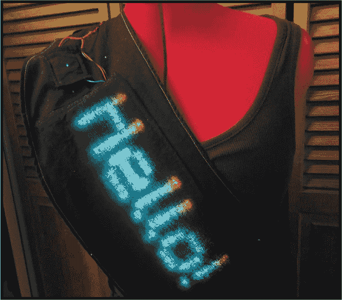

小巧而明亮的 LED 非常适合制作可穿戴的物品！在晚上穿戴 LED 衣物绝对能让你在人群中脱颖而出。本章将向你展示如何制作一个可以滚动文字并让你与之无线互动的 LED 腰带。作为本书的最终项目，它在电子部分和腰带制作方面都比其他项目稍微复杂一些，但它的回报是一个可以随时通过手机修改和更新滚动文字的腰带。

### 获取零件

**注意**

*缝制腰带所需的材料和工具列在“收集材料”一节中，位于第 208 页。*

这份零件清单相当庞大，许多零件有不同的选择，所以你可以提前浏览本章以获取更多的规格信息。有了这些零件，你几乎可以把无线 LED 放在任何地方！

#### 组件

+   电池（我使用的是一块 7.2V NiMH 电池，容量为 5000mAh。请参阅“计算所需电池容量”一节，位于第 186 页，了解你的项目需要多少电流。）

+   降压可调电压调节器

+   8 × 32 NeoPixel RGB LED 矩阵（Adafruit P/N 2294，SparkFun P/N 13304，或在 eBay 上搜索“WS2812”——NeoPixel 是 WS2812 类型 LED 的昵称）

+   Particle Photon 开发板，有或没有引脚（可以从* [`store.particle.io/products/photon`](https://store.particle.io/products/photon)* 购买；更多细节请参阅“连接 Particle Photon 开发板”一节，位于第 196 页）

+   T 型 Deans 插头连接器（1 个女性，1 个男性）

+   22 号实心连接线（黑色、红色及其他颜色）

**注意**

*如果你想做一个更小的衣物，可以使用更小的 NeoPixel 阵列。而且，如果你希望 LED 更灵活，比如在裙摆或裤腿边缘，我建议使用绞合线而不是实心线。*

本章将展示如何调整电压调节器，但如果你不熟悉这些内容，可能需要先回顾一下“连接电压调节器”一节中的开头部分，位于第 190 页，因为有几种不同的选项，操作起来可能会有些复杂。

#### 工具

这是你在构建电子部分时所需的工具列表，还有一些只是推荐的工具，可以使工作更轻松：

+   烙铁

+   焊锡

+   援助手（或其他类型的台钳）

+   鳄鱼夹

+   钳子

+   万用表

+   电工胶带

+   热缩管

### 构建它

我们将分阶段构建这个项目。首先，我们将构建所需的电源。然后，我们将连接 Photon 和 LED 阵列，因为只有它们有电源才能进行测试。电子部分连接完成后，我们将制作一个合适容纳整个项目的腰带。

电力是最不起眼的部分，但拥有一个完全移动的项目将是值得的！

图 10-1 展示了最终电路的示意图。如果你卡住了，可以将此图作为参考。

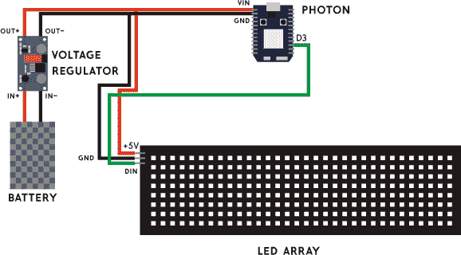

**图 10-1：** 文本横幅的电路图

#### 获取电力：更换电池插头

使用我们的电池时，我们将处理两根电线——电源线和接地线。这里有一个重要的规则：*不要让电源线和接地线接触或与同一金属部件接触*。这是一个简单的规则，但非常重要，因为如果它们接触会导致电路短路，这可能会导致项目无法正常工作，甚至会损坏组件。

**计算所需的电池容量**

电池容量是重量、成本和耐用性之间的折衷。为了确定你的项目需要多少电池容量，首先检查你有多少个 LED。我使用的阵列是 8 × 32 个 LED，意味着我总共有 256 个 LED。大多数情况下，一个 LED 的最大电流为 60 mA（全亮白光），平均使用电流为 20 mA。因此，如果我们将其乘以 LED 的数量，我们的计算结果显示，我们的横幅的最大电流为 15,360 mA（约 15.5 A），平均电流为 5,120 mA（5 A）。

然而，由于我们的 LED 将显示滚动文本，在任何给定时刻，大多数 LED 都是关闭的，因此我们的实际用电量将远低于此。通过万用表，我测得最终项目的电流为 0.5 到 0.7 A 之间。在这种电流下，3600 mAh 的电池大约可以使用 5 小时，而 5000 mAh 的电池大约可以使用 7 小时。

如果你想将阵列用于其他用途，比如同时驱动所有 LED，并且需要更高的电流，那么 3600 mAh 的电池将持续 13 到 42 分钟，而 5000 mAh 的电池将持续 20 到 58 分钟。这些数字并不精确——电池永远不可能完全准确——并且你还会因为电压调节器和其他组件而损失一些功率，所以最好高估你的需求。

对于这个项目，我推荐使用 7.2 V 5000 mAh 的镍氢电池。LED 和 Photon 需要 5 V，而 7.2 V 的电池提供的电压最接近。稍后，我们将使用一个调节器将电压降至 5 V，以避免损坏部件。

我们的电池需要插入充电器和项目中，但它们可能目前没有相同的连接类型。我们将把电池和充电器上的插头都更换为 T 型 Deans 插头，以使它们兼容。对于这一部分，你需要对焊接有一定的熟练度。

首先，我们给 Deans 插头标记，以免混淆电源和接地线。Deans 插头有两个端子，形状像一个 T 字形。横向端子（T 字的上方）通常用于电源（红色）线，而纵向端子用于接地（黑色）线。按照图 10-2 所示，用**+**标记横向端子，用**–**标记纵向端子。

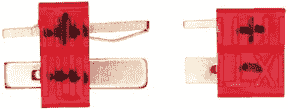

**图 10-2：** 带标签的 Deans 插头，公头（左）和母头（右）

**警告**

*不要让电源线和接地线接触或与同一金属部分接触。这会导致电路短路，可能会导致你的项目无法正常工作或损坏组件。一次只处理一根电线，并用电工胶带覆盖另一根电线。*

假设你的电池没有配备 Deans 插头连接器，你需要将其插头替换为 Deans 插头。同样，最好一次处理一根电线，并用电工胶带将未处理的电线包好。

1.  **给电源线和接地线镀锡。** 将每根电线剪到尽可能靠近电池插头的地方，剥开末端一段，长度大致与插头端子相同，将其扭转，使电线不散开，然后在裸露的电线部分四周加上焊锡（如果需要焊接建议，请参见附录）。这个过程，如图 10-3 所示，叫做*镀锡*电线。

    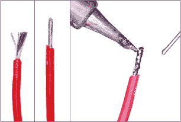

    **图 10-3：** 扭动电线，然后加焊锡使其更易操作

1.  **准备母 Deans 插头。** 拿出母插头（只有一侧裸露端子的那个），并将一些热缩管套在电线和插头端子上，正如图 10-4 所示。现在将热缩管放在一旁；暂时不要将它滑到端子上。我们会在将电线连接到插头后再收缩它。

    如果你没有热缩管，可以用电工胶带包裹裸露的电线。热缩管看起来更整洁一些，但电工胶带可以更容易地拆卸并重新应用。

    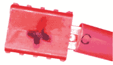

    **图 10-4：** 将热缩管（右）套在母 Deans 插头（左）的端子上——我们稍后会收缩它

1.  **焊接母 Deans 插头。** 使用一对帮助手或台钳固定母 Deans 插头。插头的一侧端子上有一个凹痕。加热 Deans 插头的一个端子，在凹痕的一侧融化一小块焊锡（见图 10-5）。不过，务必不要让焊接铁的尖端接触到塑料！在两个端子的凹痕上都加上焊锡。

    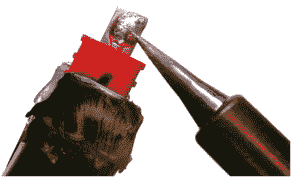

    **图 10-5：** 将焊锡融化在 Deans 插头上，以固定电线。

1.  **焊接电源线。** 拿出从电池上出来的红线。剪下两段半英寸长的热缩管，像之前准备的那样，将一段滑到裸露的电线部分上。尽可能将它推到远离你将要焊接的部分，正如图 10-6 所示——焊接铁的热量可能会在我们准备好之前就开始收缩热缩管！

    

    **图 10-6：** 电线上的热缩管。我们会在将电线连接到 Deans 插头后，将其滑到插头端子上并收缩。

    当我们完成后，所有暴露的电线部分都必须被覆盖，所以确保暴露的电线部分不长于端子——最好是稍短而不是过长。重新熔化女性 Deans 插头正极端子的焊锡池，将红色电池线的锡端插入，直到被焊锡覆盖（图 10-7）。移开电烙铁，按住电线直到焊锡冷却，但在冷却之前不要触碰。

    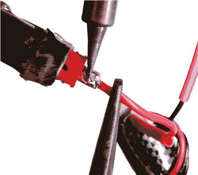

    **图 10-7：** 在这个步骤中，电线会变热，所以用钳子将电线靠近 Deans 插头，在熔化焊锡并连接电线时固定住。

1.  **焊接接地线。** 一旦接头冷却，重复在负极端子上进行此操作，使用黑色电池线——别忘了在连接到 Deans 插头之前将热缩管滑到电线上！稍后我们会收缩这些管子。

1.  **绝缘电线。** 一旦两根电线冷却至可以触摸的温度，将热缩管移到以覆盖金属端子和连接的暴露电线。如果你没有合适大小的热缩管，你可以用电工胶带覆盖这些部件。如果需要重新操作，你需要拆开焊接，换上新的热缩管，并重新焊接。

    如果你有热风枪，可以用它来加热和收缩热缩管。否则，你也可以用打火机靠近管子加热，但一定不要让火焰直接接触管子。像图 10-8 所示，扭紧红黑两根电线，增强安装的支撑。

    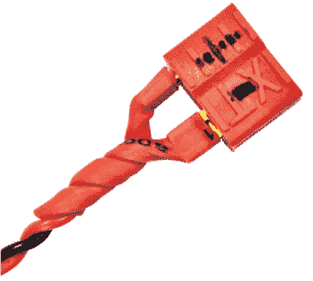

    **图 10-8：** 带电线的 Deans 插头

这样，你就完成了！你已经在电池上添加了一个不同的连接器！图 10-8 显示了它应该是什么样子。

如果你的充电器当前没有 Deans 插头，你需要对充电器重复这个过程，但使用一个雄性 Deans 插头来连接你的雌性电池插头。确保在安装插头时将充电器与电源断开，以避免暴露的带电电线。

#### 连接电压调节器

你的电池很可能提供超过 5V 的电压，因此我们需要将其降至 Photon 需要的 5V，以避免电压过高。电压调节器，如图 10-9 所示，可以将电压降到所需的水平。我们将使用可调电压调节器，因为它们是最容易找到的。

*电压调节器*这个术语听起来很吓人，板子看起来也挺吓人，但别担心！一旦你安装好，它就会自动工作，你再也不需要动它了。

1.  **购买电压调节器。** 在购买电压调节器时有几点重要事项需要注意。首先，购买一款*开关型*电压调节器，它看起来与图 10-9 中的类似。其次，确保购买一款有两个蓝色盒子的调节器，而不是一个——这样你可以调节电流和电压。

    大多数电压调节器返回的电流是 3A 或 5A。对于仅显示文本的情况，这两者都可以使用（如果你还记得电池部分，我们的电流为 0.5–0.7A），但是如果你更改了程序，让大多数 LED 灯亮起，你需要确保电流不超过调节器的最大允许值。

    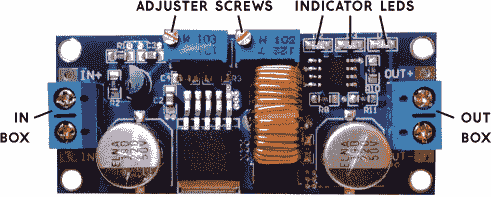

    **图 10-9：** 从上方看电压调节器

1.  **连接插头。** 这块电路板上只有四个部分需要关注——图 10-9 顶部的两个带螺丝的塑料盒，以及两侧的 IN 和 OUT 盒子。

    你需要四根电线——两根黑色的和两根红色的。一组将连接电池和电压调节器，另一组将电压调节器与其他电子设备连接。

    **注意**

    *大铜包裹轮是电感线圈，它可能非常松动。如果它松动了，可以在它的两侧涂上热熔胶来固定它。热熔胶不导电，所以不会干扰电路板上的任何元件。*

    拿一根红线和一根黑线，把它们扭在一起，方便操作，然后对另一对线也做同样的处理。将所有八个电线的端头剥去大约四分之一英寸。按照我们之前接电池的方式，将一对红黑电线连接到一个公 Deans 插头上。公插头的两侧都有金属端子；将其中一侧焊接到较小金属件的一侧。你连接到电池上的母插头将插入这个公插头，它将是电压调节器的输入端。

1.  **检查电池电压。** 拿出你的万用表，然后将你刚刚接好红黑电线的公 Deans 插头插入电池的母 Deans 插头。非常小心，确保电压调节器另一端的两个裸露电线绝对不接触！

    将万用表设置为测量直流电压。将红色探头接触红线，黑色探头接触黑线，并检查万用表上的读数（参见图 10-10）。

    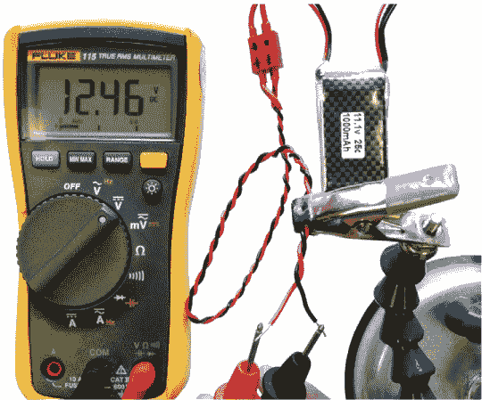

    **图 10-10：** 测量电池电压，并测试电线与 Deans 插头的连接

    如果没有显示读数，尝试以下操作：

    +   检查你的万用表探头是否插入了万用表的电压和地线端口。

    +   确认你的万用表已设置为测量直流电压。

    +   确保电线已经连接到电池。

    +   看看你是否能通过连接红色探头到正极，黑色探头到负极，使用普通电池（比如 AA 电池）来确认你的万用表是否正常工作。

    +   更直接地测试电池：将电池的母式 Deans 插头放入辅助夹具中，然后将探针插入两个端子（红线连接正极，黑线连接负极），看看是否能得到读数。如果没有，尝试捏住电线与端子连接的地方，看看是否能得到读数——可能是焊接连接不够牢固。

    +   尝试捏住电线与男式 Deans 插头连接的地方，看看是否能够得到读数。

    +   如果你还是无法获得读数，找个人检查你的工作！只要确保在电池插入时不要携带这个设置。

    一切正常后，拔掉电池，将其放置一旁，然后拿起电压调节器。

1.  **连接电压调节器。** 你需要一把足够小的十字螺丝刀，以适应 IN 端子顶部的螺丝，这些端子在图 10-9 中标记为 IN。我们将红线连接到 IN+，黑线连接到 IN–。

    拧松螺丝直到顶部与周围的外壳平齐，然后将男式 Deans 插头的黑线插入 IN–端子，检查是否适配（见图 10-11）。如果你看到端子中有任何裸露的电线，修剪掉一些——你不希望有裸露的电线，但希望尽可能多的电线插入端子。

    一旦电线合适，拧紧螺丝以固定它们，如图 10-11 所示。重复此步骤，连接红线到 IN+，然后轻拉两根电线，确保它们不会掉出来。你可以再次将电线拧回去，确保它们紧密贴在一起；只要确保没有裸露的电线暴露或接触。

    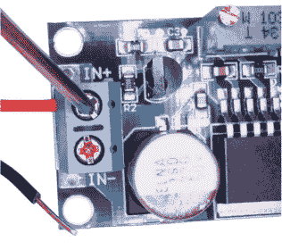

    **图 10-11：** 将红线旋入端子后，确保红线被裁剪得恰到好处，避免金属部分暴露。

    拿起另外一组尚未连接的黑色和红色电线，按照相同的方法连接到 OUT 端子上。记住，红线连接到 OUT+，黑线连接到 OUT–。图 10-12 显示了应该如何连接。

    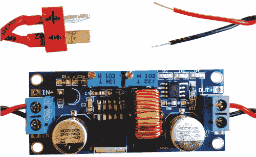

    **图 10-12：** 到目前为止的电压调节器——男式 Deans 插头连接到 IN 端，裸露的电线连接到 OUT 端。

1.  **将电压调整为 5 V。** 要调整电压，我们需要转动稳压器 OUT 端的螺丝。左侧螺丝调整输出电压，右侧螺丝调整最大输出电流。在某些板子上，螺丝端子会标记为 CV（电压调整）和 CC（电流调整）（如图 10-13 所示）。你可能想把它们标记为 V（伏特）和 A（安培），以避免混淆。

    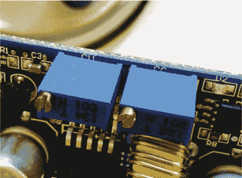

    **图 10-13：** CV（左）用于调节电压，CC（右）用于调节电流或安培数。

    拿出你的万用表，将鳄鱼夹的一端连接到每根裸露电线的末端，另一端分别连接到正负的万用表探针，如图 10-14 所示。再次小心不要让红线和黑线互相接触。如果此时没有读取到任何数据，检查电压调节器两端的连接。

    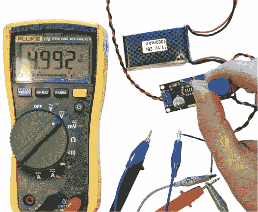

    **图 10-14：** 使用鳄鱼夹将每根电线的末端和万用表探针连接起来，这样你的手就可以自由调整电压调节器。

    一些电压调节器有一个小灯，如果灯亮了，说明它正在接收电力，但没有输出。如果灯没有亮，说明它根本没有接收到电力，那么你应该检查电池连接。不过，在调整电线时一定要断开电池——你可不想让地线和电源线意外接触。

    一旦你的万用表开始读取数据，将电压调节螺丝逆时针旋转，直到万用表显示电压变化。继续旋转螺丝，直到万用表显示 5V，最好略低于 5V，而不是高于 5V。如果逆时针旋转无法调整到所需的电压方向，尝试顺时针旋转，并记住哪个方向使电压升高或降低。

    **注意**

    *这一部分可能会让人感到沮丧。两个螺丝盒看起来完全一样，而且你可能需要一段时间才能从万用表的电压变化中得到反馈。可能需要很多次旋转，但调整最终会生效，然后你就可以使用任何电池，并且拥有可穿戴的 LED 灯来参加派对。坚持下去。*

1.  **调整电流。** 电流的测量方式与电压不同：电压需要非常精确，因为像 Photon 或 LED 阵列这样的元件如果电压偏离 5V 太远，就无法正常工作。电流可以设置得很高，组件会根据需要自行吸取电流。我们将电流设置为最大值。

    记住哪个方向是增大电压，并且将电流调节螺丝朝同一方向旋转。当旋转到最大时，你会听到每次旋转都会有咔哒声。好消息是，如果电流过低，所有的设备会直接关闭，不会损坏，如果电流过高，零件会只吸取它们需要的电流。记住你旋转这个螺丝的方向，以便以后调试。

1.  **分线。** 我们的 LED 阵列需要的功率比 Photon 能够输出的要多，因此我们将从电压调节器处分开电源线，这样一组电源/地线将为 Photon 供电，而另一组将为 LED 阵列供电。我们将通过将电压调节器出来的电线分叉来实现这一点，使红线和黑线成对变成两对红线和黑线。

    剪下一段约两英尺长的黑色和红色电线。将红色电线对折，并在折叠处剥开一小段电线。在折叠处将暴露的金属中间与电压调节器的红色电线暴露端连接起来，并添加一些焊料使它们固定。无论你如何将这两根电线固定在一起，都能达到目的。完成后，在这段电线处加上热缩管。

    对黑色电线重复此步骤。这些步骤如图 10-15 所示。

    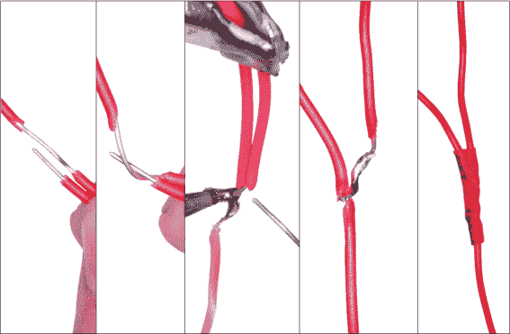

    **图 10-15：** 将红色电线的裸露端绕在一根更长的红色电线的裸露中间，进行焊接并加热收缩。

1.  **创建两对电线。** 将从分叉处出来的红色和黑色电线通过扭在一起形成一对，这样你就有了两对电线，并使用更多的热缩管在分叉处将它们固定在一起，如图 10-15 所示。记住，插入电池时，绝不要让暴露的黑色和红色电线接触！

这样，我们就完成了这个项目的电源部分！图 10-16 展示了到目前为止的项目示意图。现在你可以插入电池，一旦我们将其连接到电路板和 LED 阵列，你就能为两个组件供电，并使它们完全无线运行。

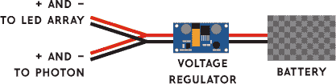

**图 10-16：** 到目前为止组件的示意图

#### 连接 Particle Photon 板

本节将只涉及 Photon 的接线部分；你将把 Photon 连接到你的手机作为无线热点，并在第 200 页的“编程”中进行编程。如果你想在开始半永久性地将电线焊接到 Photon 之前先了解一下它，随时可以先去那里或查看其他使用该板的示例项目。我们将只使用 Photon 上的三个引脚——VIN、GND 和 D3。

一些 Photon 板会附带接头，而有些则不会——图 10-17 展示了它们在外观上的差异。

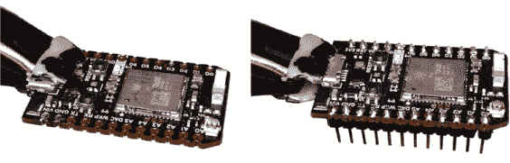

**图 10-17：** 没有接头的 Photon（左）和有接头的 Photon（右）

接头允许你通过插拔将 Photon 临时连接到面包板上，而不是焊接电线。但接头也会增加体积，而且如果组件被拉扯到错误的方向，它们更容易从面包板上脱落。

如果没有接头，你将直接将电线焊接到电路板上。这是更为永久的连接方式——你可以通过重新加热焊接点来移除电线，但这样有可能损坏电路板。

如果你想做实验，并担心搞错了，我建议使用接头和面包板，尤其是在你可能想把 Photon 用于其他用途的情况下。

如果你想使这个项目变得永久，我建议在某个时刻直接焊接到电路板上，即使你一开始使用的是面包板。以下说明假设你将电线直接焊接到 Photon 上。

1.  **焊接线缆。** 取电压调节器上的一对红色和黑色叉形线缆，并将它们连接到 Photon 上，红色线接 VIN，黑色线接 GND，然后将它们焊接到位，如 图 10-18 所示。确保 VIN 和 GND 的焊接点*不要*接触到彼此或电路板上的其他任何部分。如果有任何多余的线缆突出电路板，请修剪掉，以免它们卡住。

    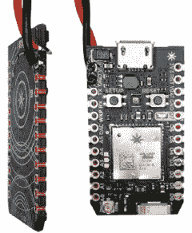

    **图 10-18：** 将线缆直接焊接到电路板上

1.  **测试插头。** 仔细检查来自电压调节器的另一对线缆是否已得到保护（如果你剥开了线端，请确保它们没有接触到任何东西），然后插入电池。你应该能看到 Photon 启动了！如果你对这个步骤感到紧张，可以只插入电池一秒钟，确保没有看到烟雾或火花。如果你*确实*看到烟雾或火花，说明你的 VIN/红线和 GND/黑线某处接触了。请再次检查你的焊接，确保一切连接正确，焊锡也只在应该的位置，没有溅到其他地方。

#### 连接 LED 数组的线缆

我们将通过将第二对叉形线缆焊接到 LED 数组上来完成连接。LED 数组需要三根线：电源线、接地线和来自数字引脚（D3）的数据线。

市面上有许多不同品牌的 LED 数组，连接方式可能有所不同。你需要寻找指示数据线应连接哪一侧的箭头（指向或远离电路板）或 IN 和 OUT 字样。

应该有三个端子，分别标有 + 或 5V、– 或 GND 和 DI（或 DIN），如 图 10-19 所示。如果没有标注，请查看附带的线缆：红色通常是 +，黑色是 –，数据线是其他颜色。在移除这些线缆时，如果需要，可以在电路板上做标记。

1.  **移除电路板附带的线缆。** 这些线缆只是焊接在表面，因此将热烙铁放在接线端子上，轻轻拉动线缆，直到焊锡足够融化，线缆可以脱落。记住，焊锡只能融化在接线端子处，不要让它溅到电路板的其他地方，也不要用烙铁接触电路板的其他部分。

1.  **连接电源线。** 接下来，取剩下的一对红色和黑色叉形线缆，将它们连接到 LED 数组上的电源 + 和 – 端子（它们也可能标为 5V 和 GND）。首先在每个焊盘上加一点焊锡，然后剥开小段的线缆，剪裁合适长度，使其适合焊盘，接着加热焊盘上的焊锡，并将剥好的线放入焊锡中。此步骤如 图 10-19 所示。

    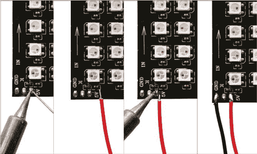

    **图 10-19：** 向端子添加更多焊锡。确保暴露的线缆长度大约与焊盘相同，然后融化端子上的焊锡，将线缆连接到 LED 数组上。

1.  **连接数据线。** 使用一根不是红色或黑色的电线，将它从 LED 阵列的 DIN 端子连接到 Photon 的 D3（或任何其他 D 引脚），如图 10-20 所示。电线的长度非常重要——Photon 和 LED 之间的电线越短，干扰的可能性就越小，这样可以避免影响 LED 显示。像电源连接一样将这条线焊接起来。

    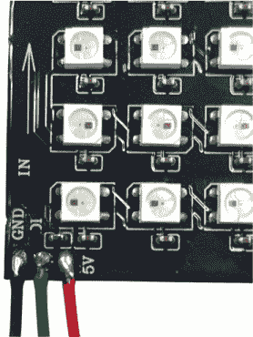

    **图 10-20：** 焊接 DIN 连接。

    现在，通过插入电池来测试接线。您应该能看到 Photon 的灯光亮起。LED 仍然不会亮起，因为没有程序指示它们亮起。从现在起，您将插入电池以开关设备。

如果您的 Photon 的灯光没有亮起，请检查从电池到 Photon 的接线。可能某个地方的电线断开了，导致 Photon 无法接收到电力。使用万用表在不同位置测量电压，以诊断断点的位置。还要检查红线和黑线是否接反了。

如果仍然无法正常工作，您可能不小心将电流调整螺丝调得过低，而不是调高。尝试将电流螺丝调到完全相反的方向，看看是否能解决问题。

一旦 Photon 开机，您可以收起烙铁了，因为除了您在缝制腰带后可能需要进行的调整外，您已经完成了这个项目的硬件部分！接下来，我们将上传一些滚动文本的代码，进行测试，然后组装电子设备放入服装中！

### 编程

我们编写代码的最终目标是能够将一条短信发送到一个号码，并让该短信显示在腰带上。为了实现这一目标，我们需要在两个地方运行代码：一个是在 Photon 上，另一个是在一个等待接收消息并将其发送到您的腰带的服务器上。我们将首先关注 Photon 上的代码。

您可以从*([`nostarch.com/LEDHandbook/`](https://nostarch.com/LEDHandbook/))*下载此项目的完整代码。我将概述代码的各个方面，但我也在代码中添加了注释，以记录它的工作原理。

#### 将 Photon 连接到 Wi-Fi

首先，您需要将 Photon 连接到 Wi-Fi。请参考 Photon 网站的文档*([`docs.particle.io/guide/getting-started/intro/photon/`](https://docs.particle.io/guide/getting-started/intro/photon/))*了解如何开始。请注意，文档内容可能会在您阅读时有所更新，因此可能看起来有所不同，但应该很容易跟随。

这一步是可选的，可以稍后重新配置，因此如果您只想让 Photon 立即连接到互联网，请将其连接到传统 Wi-Fi 网络，并跳过此部分。一旦 Photon 连接成功，您应该很少遇到问题。

您需要下载 Particle 应用程序才能将 Photon 连接到 Wi-Fi 网络。

1.  **下载应用。** 去你的应用商店，搜索 Particle。该应用的图标如图 10-21 所示。下载并安装 Particle 应用，并创建自己的账户。

    

    **图 10-21：** Particle 应用图标

    你应该会进入“你的设备”屏幕。点击角落的**+**按钮，选择**设置一个 Photon**。现在你应该能够连接到你的 Photon 了。

1.  **（推荐）将你的 Photon 连接到你手机的热点。** 我推荐开启你手机的 Wi-Fi 热点功能，并将你的 Photon 连接到该热点。这可能有点复杂，但它让你可以完全移动，不必依赖于连接多个 Wi-Fi 网络。

    要将你的 Photon 连接到手机，请记下你手机的网络名称和密码，然后点击**连接到 Wi-Fi 网络**，并选择**我的网络未列出**。输入你的 Wi-Fi 名称和密码，如图 10-22 所示。

    当应用显示一个旋转的指示器并提示正在寻找 Wi-Fi 网络时，返回设置并打开你手机的热点功能。Photon 将连接到互联网，从此只要热点功能开启，它就会连接到你手机的热点。


**图 10-22：** 连接到你手机的 Wi-Fi 热点的 Photon 界面

#### 编写 Photon 代码

一旦你的 Photon 连接成功，前往*[`build.particle.io/build`](https://build.particle.io/build)*。这里是你上传代码到 Photon 的地方。你需要创建一个账户，然后你将进入一个编辑器，在这里你可以发送消息到你的电子横幅！

##### 添加 LED 库

你可以在*[`nostarch.com/LEDHandbook/`](https://nostarch.com/LEDHandbook/)*下载你的 Photon 代码，文件名为*textsash1.ino*，但你首先需要告诉 Particle 使用这个库来控制 LED 灯。

在编辑器中，点击创建新应用的按钮。给你的应用起一个易于识别的名字，比如 TextSashPhoton。点击左侧的保存按钮（文件夹图标）。

库图标看起来像是屏幕左侧的书签；点击它并滚动至社区库列表。你可能会看到 NeoPixel 库排在列表的顶部（图 10-23）。

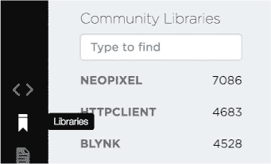

**图 10-23：** 库图标和社区库部分

点击 NeoPixel 库，你应该会看到一些代码。暂时忽略这些代码，寻找“在应用中包含”按钮，如图 10-24 所示。点击它，然后按名称选择你最近创建的应用（如果找不到，可能是你在输入名称后忘记点击保存）。

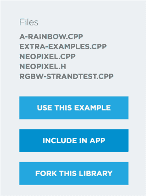

**图 10-24：** 包括 NeoPixel 库

你应该会在左侧灰色栏中看到“包含的库”部分，其中列出了 NeoPixel 库，以及文件顶部的`#include`行，指明了`neopixel`库。现在你已经准备好添加更多代码了！

##### 测试 Photon

在我们添加能够向阵列发送消息的代码之前，让我们先写一些代码，测试所有的连接线是否正确连接，一切是否按计划工作。

1.  从* [`nostarch.com/LEDHandbook/`](https://nostarch.com/LEDHandbook/)*下载的代码文件中，打开文件*testArray.ino*并将其复制到屏幕的主要部分。确保其中有包含`#include`的那一行。

1.  现在，确保 Photon 应用知道它将上传代码到哪个设备。点击设备图标，它看起来像一个瞄准镜或十字准线（见图 10-25）。你应该会看到你新配对的 Photon 设备出现在列表中。给它命名，然后点击名称。名称左侧应该会显示一个星标—当你现在上传代码，也就是所谓的*闪烁*代码，它将上传到这个设备上。

    

    **图 10-25：** 设备图标

1.  确保你的 Photon 已通电并连接到互联网—如果是，Photon 上的 LED 应该闪烁青色—然后点击左边栏顶部的闪烁按钮（看起来像一个闪电）。你应该会看到 Photon 闪烁品红色。如果这是你第一次上传代码，它可能会经历一些不同的颜色变化，以确保固件是最新的并进行重置。当一切完成后，阵列角落的一个 LED 应该会亮红色。

如果灯没有亮起，请进行更多的故障排除。

##### 将代码发送到你的 LED 显示屏

一旦你的 Photon 工作正常，将书本资源中的*shortstr_textsash.ino*代码粘贴到 Photon 编辑器中。我已经完全记录了每个函数和代码中任何让人困惑的部分，所以可以随意查看。只需向下滚动，跳过顶部的编码字符的代码部分。

按下闪烁按钮上传代码，你应该会看到`Hello World!`显示在你的 LED 阵列上。这很酷，但现在让我们让它显示我们想要的内容！

请注意，目前有一个限制：你一次只能发送 63 个字符。如果发送更多字符，不会返回明显的错误；它只是无法工作。稍后我会教你如何绕过这个限制。

要向你的 LED 发送消息，你需要两个东西：Photon 的设备 ID 和访问令牌。要找到设备 ID，点击编辑器侧边栏上的设备图标，然后点击设备名称右侧的箭头。这样设备 ID 会在一个文本框中展开。现在将这个 ID 复制到文本文件中。

要找到访问令牌，点击左下角的**设置**，你会看到一个框里有代码。也请将其复制到一个文本文件中。

我们将使用这两个标识符将数据发送到 sash。就像你的电脑从互联网获取和发送数据一样，将 Photon 连接到互联网后，你可以将数据发送到你的特定设备，以执行代码。我们将使用 *Postman*，一个 Chrome 应用。你可以下载并在 *[`www.getpostman.com/`](http://www.getpostman.com/)* 上了解更多。

**注意**

*如果你有选择的程序来发送 REST 调用，可以自由使用它。*

下载 Chrome 应用并打开 Postman。现在我们将设置一个调用，向你的 sash 发送文本。

1.  从 图 10-26 中的下拉菜单中选择 **POST**，并输入 [`api.particle.io/v1/devices/deviceID/buildString`](https://api.particle.io/v1/devices/deviceID/buildString) 作为 URL，将你的设备 ID 替换为 *deviceID*。

1.  从 URL 框下方的菜单中点击 Body 选项卡，如 图 10-26 所示，选择 **x-www-form-urlencoded** 单选按钮。将 access_token 作为键，输入你从 Photon 账户复制的访问令牌作为值。然后，在新的一行中，输入 args 作为键，键入你想在 LED 数组上显示的文本作为值。图 10-26 显示了所有参数设置正确后的样子。记住，目前消息的字符数限制为 63 个。

    

    **图 10-26：** 如何在 Postman 中设置对 Photon 的调用

完成后，保存你的帖子并点击大蓝色的**发送**按钮。你应该能看到 LED 数组显示你的文本！

如果此时没有任何显示，而且之前的一切都正常工作，那么可能是你的电压调节器的电流调节设置得太低。请返回 “连接电压调节器” 第 190 页，复习一下如何设置电压调节器的电流并进行调整。

##### 提高字符限制

现在你有了一个可以通信的 LED 数组，但你可能需要发送超过 63 个字符。返回你的 Particle 编辑器，将你一直使用的程序替换为文件*longstr-textsash.ino*。这样你就能创建更长的字符串，但这比想象的要复杂一些。

与之前发送单条消息不同，你现在将依次发送多条消息，Photon 将存储并合并它们，直到你告诉它完成，然后显示这些消息。

在文本编辑器中输入你想显示的内容，但将其分成每行 60 个字符。然后，不是发送一条消息，而是将每一行作为单独的消息，通过将其粘贴到 Postman 中的 `args` 值里发送。你的第一行必须是 `1,BEGIN`，最后一行是 `1,END`，用来表示消息结束。每行文本需要以 `0,` 和一个空格开头。例如，对于消息“这是一个非常长的字符串，一直在延续下去，我忍不住打字，实在是太有趣了！”你将通过 Postman 发送五个 args。

第一条消息告诉窗帘它将开始接收文本。`1,END` 命令告诉窗帘你已经完成文本发送，它可以展示合并后的内容。

```
1,BEGIN
0, This is a really long string that goes on and on and on and
0, I just can’t stop myself from typing so much. It's so much
0, fun!
1,END
```

这手动操作可能有些麻烦，但别担心——你不会长期使用手动发送消息的方式。

#### 编写服务器代码以通过短信发送消息

如果你不介意以这种方式向窗帘发送消息，你可以在这里停止。否则，本节将向你展示如何设置一个服务，允许你通过短信向窗帘发送消息。这需要一个 Twilio 账户，且免费。Twilio 会为你提供一个独特的号码来发送消息，如果你使用自己的号码发送，所有的短信都会显示出来！如果在本节中遇到问题，可以访问我的 GitHub 仓库，获取如何在服务器文件夹中的不同文件保存信息的说明：*[`github.com/gelicia/textSashChapter`](https://github.com/gelicia/textSashChapter)*。

##### 安装 node 和 npm

这段代码将用 JavaScript 编写，你需要安装 node 和 npm。根据你使用的操作系统，安装过程可能会有所不同，因此请按照 *[`docs.npmjs.com/getting-started/installing-node`](https://docs.npmjs.com/getting-started/installing-node)* 上的说明，按照你选择的操作系统安装 node 和 npm。

**注意**

*你需要以管理员身份运行命令终端。*

1.  一旦 npm 安装完成，打开一个终端（在 macOS 中使用 Terminal 应用，或者在 Windows 中从开始菜单搜索 cmd 并点击命令提示符）。

1.  找到 node 在你电脑上的存储位置，并使用 `cd` 命令在终端中导航到服务器文件夹；例如：

    ```
    $ cd User/Program Files/nodejs/node_modules/npm
    ```

1.  在终端中从该文件夹运行 `npm install`，你应该会看到类似 `q@`、`restler@` 和 `nedb@` 的文本。这是 npm 在安装我们将用在服务器程序中的库，比如 `neopixel` 库。你还会看到服务器文件夹现在包含了一个名为 *node_modules* 的文件夹。

    在 *node_modules* 文件夹内有一些 *.js* 文件。你需要使用之前在 Photon 中找到的设备 ID 和访问令牌来修改一些权限。

1.  首先将*particleConfigTEMP.js*和*twilioConfigTEMP.js*重命名为 particleConfig.js 和 twilioConfig.js（即，去掉*TEMP*）。*particleConfig.js*文件更简单——你已经通过 Postman 获得了设备 ID 和访问令牌。

##### 设置一个唯一的 Twilio 号码

你需要对*twilioConfig.js*文件进行的更改将需要一个 Twilio 帐户。

1.  在* [`www.twilio.com/`](https://www.twilio.com/)*上注册一个 Twilio 帐户，确保选择你将使用 SMS（其余问题不重要，可以留空）。你需要提供一个有效的手机号码来接收确认代码，并使用它完成注册。

1.  当你登录时，你应该看到一个“开始使用”按钮；点击它，然后点击**获取号码**。你应该会被提供一个号码；点击**选择这个号码**。记下这个号码以备后用。你将从这个号码发送消息以显示在腰带上。如果找不到它，请从仪表板向下滚动到“电话号码”并点击它。

1.  你应该看到你的号码被列出。记下这个号码，然后点击主页按钮。你应该在页面上看到你的帐户 SID 和身份验证令牌。将它们放入你在本节开始时重命名的*twilioConfig.js*文件中——记住，如果你需要更多指导，可以查看我 GitHub 上的文件。

1.  将你的 LED 阵列连接到电源，然后在终端中运行`node bot.js`。现在，从你的手机发送你想要显示的消息到你的 Twilio 号码。

    你应该看到消息排队出现在终端中，然后它应该显示在 LED 阵列上。如果有问题，检查控制台中的错误消息，并确认你是否正确设置了权限 ID。

现在你有了与 LED 互动的简单方式！你可以自己保留号码并发送新消息，或者将号码给一些可信的朋友让他们也可以发短信。

**深入了解服务器**

本节的最后一步是将此程序放到一个即使计算机关机也不会关闭的地方。这超出了本书的范围，但如果你有这方面的知识或有朋友懂，我建议使用 DigitalOcean（他们有很好的新手帮助）和 npm 库`forever` (*[`github.com/foreverjs/forever`](https://github.com/foreverjs/forever)*)，它允许你持续运行*bot.js*脚本，并在脚本失败时重新启动它。

### 组装它

最后，我们将制作一个衣物来容纳 LED 显示屏。你有两个选择——要么从头开始制作一切，要么买现成的东西并进行修改以适应你的项目。这就是为什么先做电子部分很重要的原因：你需要知道要放进口袋的东西，然后才能开始做口袋。

我将向你展示如何制作一个腰带，里面有三个口袋，用来放电池、电压调节器、Photon 和 LED 阵列，如图 10-27 所示。

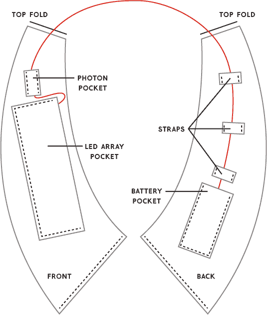

**图 10-27：** 腰带由三个口袋和固定电线的带子组成。

#### 收集材料

我们将制作一个黑色腰带，它能够很好地展示 LED 灯的颜色。然而，深色可能会吸收光线，使得显示的文字难以看清，因此我们需要两层材料——首先是一层薄薄的毛巾布，可以用剪下来的白色毛巾或洗脸巾，然后再加上一层黑色布料。

毛巾布很好地扩散了光线，并抵消了黑色布料吸光的效果。图 10-28 至 10-31 展示了不同布料下的同一 LED 灯光效果。

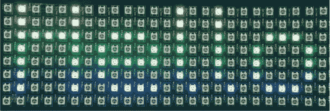

**图 10-28：** 没有覆盖物的 LED 阵列

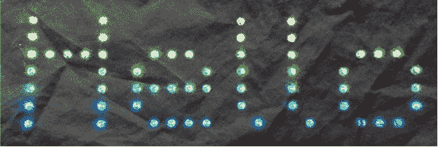

**图 10-29：** 被黑色布料覆盖的 LED 阵列。注意，灯光完全没有扩散——滚动时这很难阅读。


**图 10-30：** 被毛巾布覆盖的 LED 阵列。注意，灯光非常扩散，彼此之间融合得很好。


**图 10-31：** 被毛巾布和黑色布料覆盖的 LED 阵列。这是最终的作品。

##### 材料

你将需要以下物品：

+   1.5 码的黑色布料（我使用的是普通的黑色棉布）

+   白色毛巾布（可以是大块的毛巾布或剪下来的毛巾）

+   报纸或废纸

##### 工具

你还需要以下工具：

+   剪刀——最好是布料剪刀或波浪边剪刀

+   卷尺

+   标记笔

+   针、线和直别针

+   （可选）缝纫机；你也可以选择手工缝制腰带

+   （可选）白色布料笔或粉笔；这有助于标记出需要缝制的位置

+   （可选）熨斗

#### 制作腰带

首先，考虑一下你可能放置项目部件的位置；我们需要将电池放在靠近底部的位置，因为它很重且笨重，如果放在顶部会逐渐下拉。我们希望 LED 阵列位于中央，同时需要将 Photon 放在附近，以减少电线的干扰。我们将先尝试用纸制作腰带，实验一下各个部件的合适位置。

1.  首先，从肩膀顶部到对侧臀部的距离进行测量，以估算腰带的大小。对我来说，30 英寸大约合适。

1.  将两页报纸或一大张新闻纸平放在地上。腰带的前后形状相同，因此可以同时剪出两块。将软尺放在纸上，稍微弯曲，模拟出你希望腰带的形状（图 10-32）。在报纸上画出这个弯曲线，标记出你之前测量的长度的起点和终点。

1.  关于宽度，考虑 LED 阵列的宽度，以及你希望两边留多少空间。LED 阵列宽度为 3.5 英寸，我一开始设计的腰带宽度大约是 7 到 8 英寸。使用你画的线作为中心，在两侧标记出你宽度的一半（图 10-33）。

    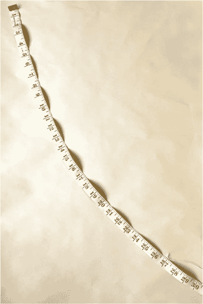

    **图 10-32：** 使用卷尺确保腰带大致的正确长度

    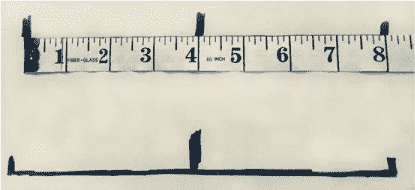

    **图 10-33：** 使用中心线和你想要的宽度在报纸上画出其余的腰带形状。

1.  你将得到两块大致像腰带形状的纸片。将它们从纸上剪下来，然后用胶带将两端粘合在一起形成腰带。把这个纸质腰带放上去（图 10-34），看看是否需要对形状进行任何调整。我通常会从肩部和底部修剪掉一些，因为它会突出。

    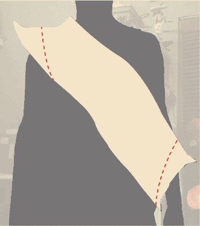

    **图 10-34：** 试穿纸质腰带，并根据需要修剪。

    不断调整形状，直到你满意为止。我的最终纸质腰带看起来像图 10-35。

    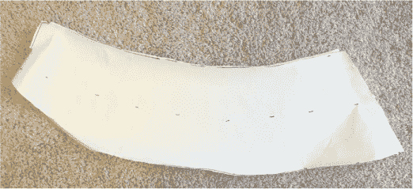

    **图 10-35：** 调整后的腰带形状

1.  一旦形状正确，你可以将其作为模板来剪裁布料。为了让腰带更结实，我们会使用两层布料，所以你需要剪裁出两个完整的腰带形状并将它们缝合在一起。最好的方法是将布料对折，使折边从肩部穿过。

    直接在布料上标出纸样的轮廓，或将纸样别在布料上，沿着纸样裁剪。

    如果你有包边机，使用布料剪刀剪裁腰带。如果没有，使用锯齿剪来防止布料散边。

1.  如果你无法将布料折过肩部，只需将两块布料缝合在一起，使其看起来像图 10-36，即前后在顶部缝合。你将需要两块这种形状。

1.  如图 10-36 所示，标记两侧并将两层布料缝合在一起，可以使用包边机，或者如果你用锯齿剪裁布料，则使用直线缝合缝制锯齿边缘。

    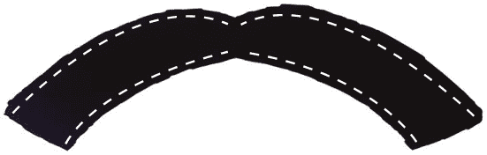

    **图 10-36：** 标记缝合两层布料的地方。

1.  将布料翻到里面，这样缝合的边缘就会在里面。你可以将布料熨平，或者在上面缝一层以确保它们保持平整。完成后，你应该得到像图 10-37 那样的效果。

    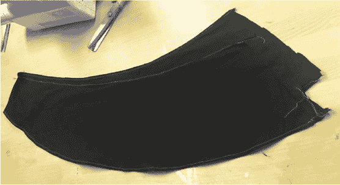

    **图 10-37：** 腰带基础部分基本完成！

1.  现在缝合其中一端并将另一端的毛边收进内侧，这样就能得到一个漂亮的折边。将缝合好的端口放入折叠的端口大约一英寸的位置，然后缝合两端以关闭腰带。

现在腰带的基础部分已经完成，我们还需要一些其他的东西：三个口袋（一个用来放电池和电压调节器，一个用来放 LED 阵列，另一个用来放 Photon）和用来固定电线的带子。我们从电池和电压调节器的口袋开始。

#### 缝制电池和电压调节器口袋

电池需要紧密地适应口袋，以防止它在口袋里晃动。为了实现这一点，我们将制作一个类似盒子的口袋，侧面大约有一英寸深。这个口袋将放在腰带的底部靠背的位置，这样它就会靠在你的下背部。这可以平衡前面 LED 阵列的重量。最重要的是确保电池能合适地放入。我已经扔掉了很多口袋，因为它们太大或太紧。

1.  为了确保口袋适合电池和电压调节器，将电池放在一块面料的中间，围绕它画出形状，四周留出几英寸，再剪掉多余的部分。将面料的一边折起来一点，做成缝边并缝牢——这将成为口袋的开口端。

1.  在与缝边相对的那一侧，将末端和两侧折约一英寸，再将角落折进去，直到三角形的尖角与电池的角对齐，然后将折叠部分用别针固定（见图 10-38，顶部）。

1.  将口袋的两侧折叠，使角落处形成的三角形将侧面和底部支撑起来（见图 10-38，中间），然后用别针固定。即使它看起来不太美观也不用担心，因为没人会看到口袋的底部。

1.  用电池测试尺寸，如果合适，就将角落的三角形缝合固定，再沿每个角的外边缘缝一圈以确保稳固（见图 10-38，底部）。

    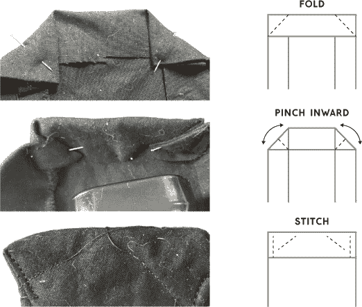

    **图 10-38：** 开始塑形口袋底部

1.  将口袋垂直放置，开口朝上。你将把口袋放在腰带后部的底部，因为它较重，你希望它远离视线并不显眼。

1.  用别针将口袋固定在位置，先缝制底部，再缝制两侧，然后缝到腰带上。在角落留出一些未缝合的空间，以便如果需要的话，口袋可以稍微膨胀。

1.  试着将电池和调节器放入口袋，并将腰带系上。稍后你可以在另一侧添加更多重量以平衡，但如果需要移动电池或使用其他方式固定它，随时可以调整。

#### 缝制 LED 阵列口袋

接下来是 LED 口袋，它是一个平口袋。我们将在口袋内部添加一层毛巾布，以便扩散光线。所以，从身体向外的层次将是：两层黑色腰带面料，然后是 LED 阵列，再然后是毛巾布和口袋的外部黑色面料。

1.  在毛巾布上标出并剪裁出 LED 矩阵的区域，留出一点点活动空间，如图 10-39 所示。如果没有包缝机，可以使用锯齿剪。顶部留出更多空间，这样你可以将一块黑色面料折叠并缝制在口袋顶部。

    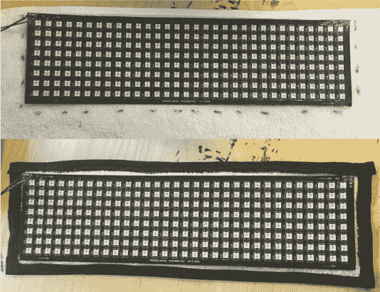

    **图 10-39：** 剪裁并缝制毛巾布和面料层

1.  锁边毛巾布的边缘，或者如果你没有锁边机，可以留一个锯齿边。我们会用口袋布料覆盖这些边缘，所以它们不会显现出来。将毛巾布放在黑色布料上，围绕它画出轮廓，四周留出 3 到 4 英寸的空隙。

1.  将黑色布料折叠约一英寸，然后再将其折叠到毛巾布上，以便毛巾布的锯齿边缘或毛边不显露出来，并将折叠部分别针固定。按此方式处理所有四边，如图 10-39 的底部面板所示。

1.  将 LED 阵列放置在布料上，确保它仍然适合。

1.  确定你想要口袋放置的位置，将其对齐，然后将其别针固定。这是一个很好的机会再次试穿腰带，确保穿上后口袋看起来合适，并且阵列适合。将口袋缝合在腰带上，尽量保持靠近口袋的边缘。

现在我们将制作一个光子口袋。

#### 缝制光子口袋

如果你的光子没有接头，按照 LED 口袋的做法制作一个平口袋。如果你的光子有接头，按照电池口袋的做法来适应体积。你可能需要手工缝制底部。然后按如下方式将其放置在腰带上：

1.  一旦做完光子口袋，将它放置在 LED 口袋上方，如图 10-40 所示，使得光子与 LED 之间的电线尽可能短。

    

    **图 10-40：** 光子口袋位于 LED 口袋上方约一小段距离处

1.  只缝合两个长边，这样电线可以从顶部和底部出来。它们将固定光子。如果看起来光子突出太多，你可以在口袋顶部加一个按扣来固定光子。

#### 添加电线带子

最后我们要加上小带子，用来固定电线在腰带上。

1.  切下一条大约 3 英寸宽、1.5 英尺长的布料。将长边缝合或锁边在一起，做成一个圆筒，然后翻转它——你可能想在其中一端的一侧附上安全别针，再把它从另一端推过去，这样会更容易。

1.  一旦正面朝外，你会得到一个更像管状而非带状的物品。缝合与接缝相对的长边，或者熨平它以保持平整。

1.  将布料剪成较短的部分，大约 3 英寸长。你可能需要大约四个。现在先保留它们；一旦你确定下一部分电线会从哪里突出，你可以将它们缝到腰带上。

1.  现在你需要根据腰带的大小调整项目的连接电线长度。

    这是你的项目，所以你可以做任何调整！我已移除一些接缝，让电线可以从口袋的侧面出来，给没有封口的口袋加了按扣等等。

    要延长或缩短电线，你只需拆开焊接，剪短或添加新的电线，并确保记下重新连接的位置。更多焊接技巧请参见附录。

    记住，电压调节器不一定需要焊接，因此你可以卸下电线，把它们穿过带子，再将它们重新连接。如果需要回顾接线部分，可以回头看本章的电子部分。现在你应该能将电子元件放入你的腰带中了！

1.  一旦确定了电线长度，沿着腰带间隔好带子，使电线平整地贴合。固定带子后再缝上。我只需要那些从前面穿过肩膀到背部电池口袋的带子。参见图 10-41 了解我如何放置带子以固定电线。

    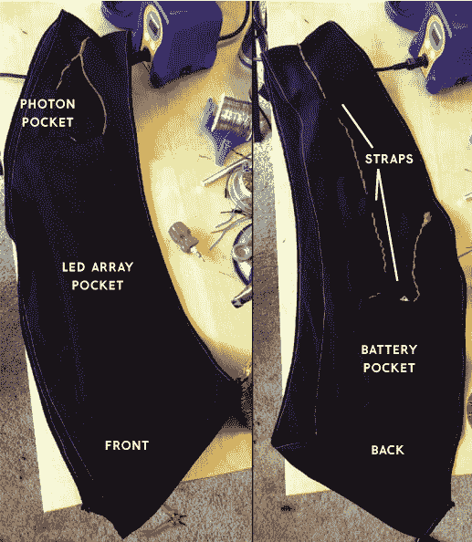

    **图 10-41：** 腰带的正面和背面，电线长度适当并且位于带子下方。所有组件都放入了它们的口袋里，准备佩戴！

完成之后，把所有物品放入口袋，将电线固定在其支架里，你的腰带就完成了！

### 总结

现在你拥有一个可穿戴的 LED 阵列，可以显示文本。我提供了一个示例服务器来发送文本消息，但也有其他选择。小图片、颜色和设计都可以使用。只需记住：一次点亮的 LED 越多，所需的电流也越大。带着你自己的超酷 LED 腰带走向世界吧！
