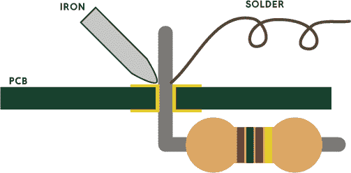
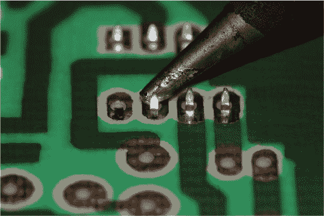

## 附录

《焊接入门》由 Matthew Beckler 编写

焊接是一项简单的技能，但如果你从未做过焊接，你可能需要一些指导。此附录提供了焊接组件到电路板的快速介绍。

焊接是通过融化*焊锡*（通常是由锡和铅制成的金属合金）将两块金属连接在一起的过程。焊锡液化，包裹住两块金属，随后重新固化，形成强大的电气和机械连接。这是电气组件、导线和电路板之间连接的常用方法。

### 焊接工具

你需要以下工具来进行焊接：

+   焊接铁

+   焊锡（用于电子，不是管道。可使用无铅或含铅焊锡。）

+   焊接的对象，比如印刷电路板

+   电线剪

+   要焊接的零件（这些可能是导线或电子元件。如果这是你的第一次焊接，建议先焊接导线，因为它们较便宜。）

你需要一个干净的工作空间，并且需要一个耐热的地方来放置烙铁，烙铁架就是为了这个目的。你还可以使用帮助架来固定你的零件，以便在焊接时保持稳定。除了这些工具，建议随身准备一个湿海绵，用来定期清洁烙铁的尖端。

### 六步焊接方法

在印刷电路板（PCB）上有*焊盘*，这些是暴露的金属小块，通常位于孔的周围。这个孔是你插入组件引脚或导线并焊接的地方。

在焊接前，先收集好所有零件和 PCB，并将它们放在平坦的表面上以保持稳定。我们将使用一个电阻器作为示例。按照以下步骤操作，并参照图 A-1 作为视觉指南。

1.  将组件的引脚插入焊盘中的孔内。使用焊接铁的尖端加热*焊盘*和穿过孔的引脚。

1.  等待几秒钟，让所有部件加热。

1.  使用戳的动作将焊锡添加到热接头处。

    

    **图 A-1：** 焊接组件到 PCB

1.  当你在引脚周围形成一个漂亮的焊锡堆，并且覆盖了焊盘但不接触其他焊盘时，停止添加焊锡——这应该类似于图 A-2 的情况。

1.  在停止加焊锡后，将烙铁保持在接头上几秒钟。这可以确保焊锡完全流入接头中。然后移开烙铁，让焊锡冷却。

1.  焊锡完全冷却后，修剪掉多余的引脚，检查你的焊接工作。

焊接每个接头后，确保其表面光亮光滑，如图 A-2 所示。

**图 A-2：** 焊锡量适当的接头

焊锡的量不应过多或过少。它应该像一个小火山一样围绕着引脚。

### 保持烙铁尖端清洁

每次焊接完毕后，务必保持烙铁头的清洁。这会提高热量传导到连接点的效率，使焊接更加轻松。图 A-3 展示了一个相对干净的焊接烙铁头示例。

**图 A-3：** 使用干净的烙铁头能使焊接变得更容易。

当烙铁加热时，定期用湿海绵或湿纸巾擦拭烙铁头，然后重新涂上一点焊锡，使其闪亮！

### 附加资源

想了解更多焊接知识，可以参考 Mitch Altman、Andie Nordgren 和 Jeff Keyzer 合作的《*焊接很简单*》漫画书。你可以在书籍资源中免费下载，链接地址为 *[`nostarch.com/LEDHandbook/`](https://nostarch.com/LEDHandbook/)* 或 *[`mightyohm.com/blog/2011/04/soldering-is-easy-comic-book/`](http://mightyohm.com/blog/2011/04/soldering-is-easy-comic-book/)*。
