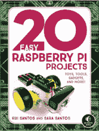
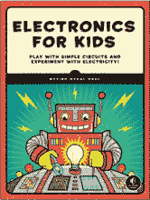
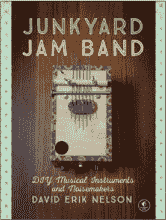
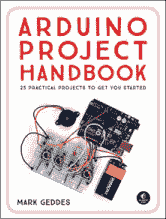
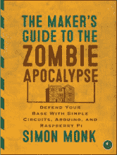
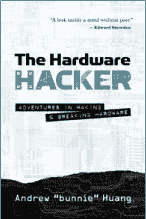

# 第十二章

**资源**

访问 *[`nostarch.com/LEDHandbook/`](https://nostarch.com/LEDHandbook/)* 获取项目模板和代码文件、更新、勘误表以及其他信息。

更多直截了当的书籍来自  **NO STARCH PRESS**

**20 个简单的 Raspberry Pi 项目**

玩具、工具、小玩意儿，及更多！

*作者* RUI SANTOS *和* SARA SANTOS

2018 年 4 月，288 页，$24.95

ISBN 978-1-59327-843-4

*全彩色*

**儿童电子学**

玩转简单电路，实验电力！

*作者* ØYVIND NYDAL DAHL

2016 年 7 月，328 页，$24.95

ISBN 978-1-59327-725-3

*全彩色*

**废品堆乐队**

DIY 音乐乐器和噪音制造器

*作者* DAVID ERIK NELSON

2015 年 10 月，408 页，$24.95

ISBN 978-1-59327-611-9

**Arduino 项目手册**

25 个实用项目，助你起步

*作者* MARK GEDDES

2016 年 6 月，272 页，$24.95

ISBN 978-1-59327-690-4

*全彩色*

**制造者的僵尸末日指南**

使用简单电路、Arduino 和 Raspberry Pi 来防御你的基地

*作者* SIMON MONK

2015 年 10 月，296 页，$24.95

ISBN 978-1-59327-667-6

**硬件黑客**

制作与拆解硬件的冒险

*作者* ANDREW “BUNNIE” HUANG

2017 年 3 月，416 页，$29.95

ISBN 978-1-59327-758-1

*精装版*

**1.800.420.7240 或 1.415.863.9900 | sales@nostarch.com | [www.nostarch.com](http://www.nostarch.com)**
