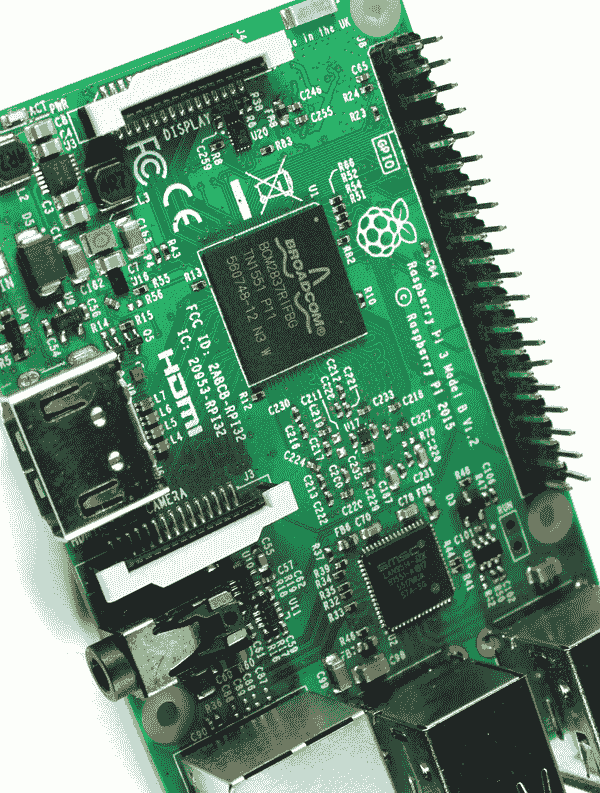

## 前言

你是否曾想过你可以花 35 美元买到一台计算机？不，我们不是在说从当铺买来的古董计算机。我们说的是树莓派——一块大约和信用卡大小的计算机板。但不要被它脆弱的外观欺骗，它比看起来更强大。

树莓派是由树莓派基金会创始人埃本·厄普顿（Eben Upton）在英国开发的。厄普顿和他的同事们注意到，申请剑桥大学计算机科学专业的学生技能有所下降，原因是新一代学生从小就接触到易于使用的计算机。这些学生从未需要了解计算机是如何运作的，也没有多少机会进行编程或修理。厄普顿开发树莓派是为了推动学校教授基础计算机科学知识。因此，树莓派是一个裸板而非装在机箱里的计算机：这样每个人都可以看到计算机的各个组件。

自 2012 年首次发布以来，树莓派已售出超过一千万块。树莓派不仅在学生中受欢迎，而且在电子爱好者、修理工、计算机科学家以及各个年龄段的“孩子”中也很流行。

树莓派可以作为一台普通的计算机使用——你可以上网、发邮件、写文档、看视频等等——但这并不是它的主要用途。树莓派是一个你可以实验、破解和玩耍的工具，来构建你自己的程序和发明。树莓派和类似的开发板使得进入电子学和编程的世界变得不仅可能，而且*轻松*，这也导致了全球范围内创意发明的涌现。现在，轮到你发明一些东西了。

### 本书适合谁阅读？

本书适合任何希望充分利用树莓派的初学者，无论是想探索电子学和编程世界的孩子，还是希望帮助孩子和学生学习的家长与教育者，或是希望使用树莓派将创意付诸实践的爱好者和制造者。

我们不假设读者有任何关于树莓派、电路或编程的先前知识。如果你具备一些基础技能，本书将帮助你进一步发展这些技能，并为你提供下一步的创意。

### 关于本书

*20 个简单的树莓派项目*是一本集合了 20 个树莓派项目的书。我们认为，发现新概念的最佳方式是通过实践，而项目书正是开始的绝佳途径。

本书首先简要介绍树莓派和 Python 编程语言，然后直接进入项目部分。本书采用“边做边学”的方式，这意味着你不需要花费无数小时学习理论知识，才能实际构建一些有趣的东西。

你将通过构建有趣且互动的项目来学习，例如家庭监控系统和 Wi-Fi 控制机器人。你还将设计用户友好的界面来控制电子设备，制作物联网项目，建立网站，创建自己的游戏，以及更多内容。

如果你没有任何编程或电路制作经验，不用担心。每个项目都会提供逐步的指导，帮助你搭建电路、绘制电路图，以及编写程序代码来控制树莓派。你可以从书中复制代码，或者你可以访问 *[`www.nostarch.com/RaspberryPiProject/`](https://www.nostarch.com/RaspberryPiProject/)* 下载代码。

你的树莓派学习不应该仅限于本书中的项目，这就是为什么每个项目都有一个“进一步探索”的部分，我们会提供一些建议，帮助你进一步发展自己的项目，并将本书中学到的概念结合起来，创造更复杂和有趣的东西。我们希望到本书结尾时，你能够掌握必要的技能，将自己的项目创意付诸实践。

### 这本书需要什么？

本书中的项目是基于树莓派 3 开发的。如果你有较旧型号的树莓派，仍然可以跟着做，但使用树莓派 3 时项目会更容易构建。较旧版本的性能较低，而且*非常*老的版本 GPIO 引脚较少。

我们不知道树莓派 4 是否会发布，或者何时发布，但到目前为止，所有树莓派版本都与旧版本兼容，因此未来版本也应该与本书中的项目兼容。

本书中的大多数项目都涉及使用树莓派与外部世界交互，利用电路进行操作。这意味着除了树莓派之外，你还需要一些电子元件。在每个项目的开始部分，我们会提供所需元件的清单，标明元件的成本和预计的构建时间。带有一个$符号的项目可能会花费不到 10 美元的元件，带有两个$符号的项目则可能在 10 到 50 美元之间（价格范围较广，但元件的价格因购买地点而异）。如果你希望一次性购买所有元件，也可以参考第 9 页的“项目元件清单”，那是本书所需所有元件的完整列表。

### 本书的组织结构

本书分为七个部分。第一部分是树莓派简介，对于正确设置树莓派至关重要，后续部分包含各个项目。以下是本书的组织结构：

**入门篇**

在这一部分，我们将向你展示如何开始使用树莓派，并首次设置它。我们还将介绍本书中使用的编程语言——Python 的基础知识。

**LED**

你将从制作 LED 项目开始。如果你是电子学初学者，本部分将教你构建电路的基本概念。

**显示器**

在本部分，你将学习如何使用几种类型的显示器，使你的电子项目更加互动。这些项目不仅仅是显示示例文本；你还将学习如何从网络获取数据，并编写一个乒乓游戏。

**传感器**

这些项目使用了多种传感器。传感器非常棒，因为它们能让你的项目对周围的世界作出反应并与之互动。几乎任何你能想到的东西都有传感器。你将学习如何使用温度传感器、PIR 运动传感器等。

**相机**

本部分的项目使用了树莓派摄像头模块。你将学习如何使用摄像头拍照以及如何进行视频流传输，之后你将运用这些技能制作像是入侵探测器和家庭监控系统等酷炫的项目。

**Web 应用**

在这里，你将建立自己的网站，然后通过创建自己的 Web 服务器学习如何远程控制树莓派的 GPIO。此外，你还将探索 Node-RED，这是一个用于轻松构建物联网应用的强大工具。

**游戏与玩具**

本部分的项目是为你制作可以玩耍的物品。你将制作一个数字鼓组，使用 Scratch 编程并设计你自己的游戏，还将制作一个可以通过智能手机控制的 Wi-Fi 机器人。

在书的最后，你还会找到一些参考信息，包括当前所有可用树莓派板的 GPIO 指南，以及一个可以帮助你识别不同电阻值的电阻颜色表。

本书中的项目是独立的，这意味着你无需遵循特定顺序，你可以随时选择任何你想要制作的项目。

我们希望你在制作本书中的项目时能够玩得开心，并享受这个学习过程。

