## 第一章：教程

在本教程中，你将为接下来的项目做好所有必要的准备。我们将向你介绍树莓派主板及其最重要和最有趣的部分。接着，我们将引导你完成设置树莓派的过程，包括所有必需的硬件和软件。

这是一个简单的过程，让你可以将树莓派用于许多任务，包括作为一台常规计算机！我们将介绍如何将树莓派设置为计算机，并展示如何浏览桌面和文件系统。我们还会向你展示如何使用终端，也就是命令行，来给树莓派下达指令。最后，我们将向你介绍 Python 编程语言，这是我们在项目中使用的编程语言。

完成本教程后，你将准备好进行项目的实施。

### 开始使用树莓派

我们将从探索树莓派主板的用途开始，收集所需的资源来使其启动，并将操作系统加载到一个刚格式化的 microSD 卡上，然后将其插入树莓派主板中。

树莓派是一款信用卡大小的微型计算机板，售价大约为 $35。它拥有普通计算机所需的一切：处理器、内存、用于连接显示器、鼠标和键盘的端口，以及连接互联网的能力。树莓派主板甚至有一个普通计算机没有的特殊功能：通用输入输出引脚（GPIO）。这些 GPIO 让树莓派与现实世界互动，使你能够构建智能电子项目，并用树莓派进行控制。

你可以使用树莓派做大多数常规计算机能做的事情，例如浏览网页、编辑文档、玩游戏、编程等。图 0-1 展示了树莓派作为桌面计算机使用的场景。


**图 0-1：** 将树莓派作为桌面计算机使用

然而，请记住，树莓派的性能不如更昂贵的计算机，因此它有一些局限性。首先，它无法满足某些现代软件的要求，因此并非所有软件都能在树莓派上运行。其次，它运行的是 Linux 操作系统，而不是 Windows 或 macOS，这些系统可能你更加熟悉。

#### 树莓派的用途

那么，如果树莓派和普通计算机差不多，但有一些限制，它的优势在哪里呢？树莓派为你提供了实验的自由，这些是你在自己的计算机上可能不敢或无法尝试的。计算机通常很贵，而且修复起来更加困难，因此如果你不完全了解自己在做什么，你可能不愿意去胡乱改动。然而，正如 Linux 创始人林纳斯·托瓦兹（Linus Torvalds）在接受 BBC 新闻采访时所说，树莓派让你“能够承受失败”。你可以在树莓派上玩弄硬件和软件，而不用担心弄坏昂贵的东西或丢失重要文件！

树莓派可以通过两种主要方式进行实验：

**创建你自己的程序** Pi 配备了一套免费的软件开发工具。如果你犯了错，可以直接重置你的 Pi 并重新开始。

**创建你自己的电子项目** Pi 板卡具有 GPIO 接口，允许你连接传感器和其他可以与现实世界互动的电子设备。你可以制作有用的物品，并让你的项目 24 小时运转而不消耗太多电力。

树莓派有无穷的用途。以下是世界各地人们制作的一些项目示例：复古游戏机，用于玩老式街机游戏；通过连接多个 Pi 板卡构建的超级计算机；云服务器，用于存储和访问数据；媒体中心，用于在电视上组织和播放媒体；家庭自动化系统，用于控制和监控家庭设备；一系列超酷且实用的机器人，例如农业机器人和自动驾驶机器人——这里只列举了一些。要了解一个非常酷的 Pi 项目，可以看看图 0-2 中展示的 SeeMore 雕塑，它通过关联 256 节点树莓派集群的运动，展示了并行算法的美妙。


**图 0-2：** SeeMore 项目

#### 区分不同的板卡

树莓派板卡有多个版本，如图 0-3 所示。

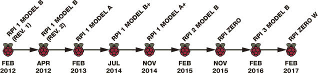

**图 0-3：** 树莓派板卡的时间轴

本书中我们将使用树莓派 3 Model B，这是我们推荐购买的板卡。然而，如果你已经拥有旧版树莓派，它应该能与本书中的大部分项目兼容。（如果你使用的是 26 个 GPIO 而不是 40 个 GPIO 的型号，可能需要修改某些项目的电路，这可能需要一些研究。你也可以查阅《树莓派 GPIO 引脚指南》（位于第 261 页），以了解旧版板卡的引脚分配。）

树莓派板卡在多个方面有所不同，包括 GPIO 数量、连接器类型和数量。表格 0-1 展示了 Model B 板卡的不同特点。（注意，较新的板卡具有更好的特性，如更大的 RAM 和更强的处理器。你还可以看到 Pi 3 是第一款具有内置蓝牙和 Wi-Fi 的板卡。）

**表格 0-1：** Model B 板卡的特性

| **特性** | **Pi 1 Model B** | **Pi 1 Model B+** | **Pi 2 Model B** | **Pi 3 Model B** |
| --- | --- | --- | --- | --- |
| 处理器 | 700 MHz 单核 ARMv6 | 700 MHz 单核 ARMv6 | 900 MHz 四核 ARMv7 | 1.2GHz 四核 ARMv8 |
| RAM | 512MB | 512MB | 1GB | 1GB |
| USB 端口 | 2 | 4 | 4 | 4 |
| GPIOs | 26 | 40 | 40 | 40 |
| 以太网端口 | ✓ | ✓ | ✓ | ✓ |
| HDMI | ✓ | ✓ | ✓ | ✓ |
| 存储 | SD | MicroSD | MicroSD | MicroSD |
| Wi-Fi | - | - | - | ✓ |
| 蓝牙 | - | - | - | ✓ |
| 价格 | $35 | $25 | $35 | $35 |
| 电源 | MicroUSB | MicroUSB | MicroUSB | MicroUSB |

#### 了解树莓派及其配件

让我们更仔细地看看树莓派板。图 0-4 显示了标注的树莓派 3 Model B 板。

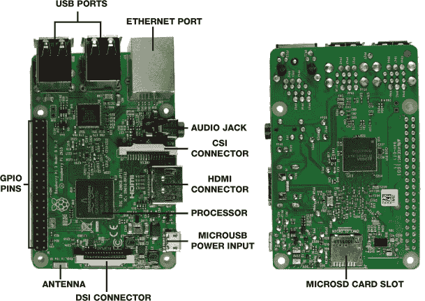

**图 0-4：** 树莓派 3 Model B

树莓派 3 Model B 包含以下组件：

**USB 端口** 连接外设，如鼠标和键盘。

**以太网端口** 连接树莓派到互联网。

**音频插孔** 连接音频设备。

**CSI（摄像头串行接口）连接器** 连接一个小型摄像头。

**HDMI（高清多媒体接口）连接器** 连接显示器或电视。

**MicroUSB 电源输入** 为树莓派供电。（树莓派板上没有电源开关。）MicroUSB 接口仅用于电源输入。

**DSI（显示串行接口）连接器** 允许你通过 15 针排线轻松连接兼容 DSI 的显示屏，如 LCD 触摸屏。

**MicroSD 卡槽** 存储 microSD 卡，其中包含操作系统以及树莓派工作所需的所有内容。

**处理器** 作为树莓派的大脑。它配备了 Broadcom BCM2837 系统芯片（SoC），具有 64 位四核 CPU，最大运行速度为 1.2 GHz。

**天线** 接收无线局域网和蓝牙信号。

**GPIO 引脚** 允许你连接传感器以收集数据或发送输出信号来控制输出设备，如电动机或 LED。

如你所见，树莓派只是一个裸露的电子板，单独不能做太多事情。你需要一些配件才能开始使用（参见 图 0-5）。

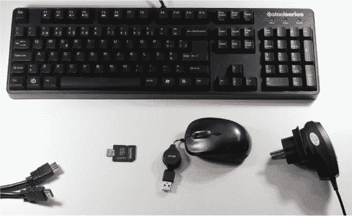

**图 0-5：** 一台键盘，左至右依次为 HDMI 电缆、microSD 卡、鼠标和电源适配器

这里是你为树莓派需要购买的配件清单：

**电源适配器**

树莓派 3 应该使用 2.5 A 5 V 电源来供电。

**MicroSD 卡**

我们建议购买一张 8GB（或更高）10 类 microSD 卡。如果你使用的是树莓派 1 Model B，你需要使用标准大小的 SD 卡，而不是 microSD 卡。

**显示器和 HDMI 电缆**

你的树莓派可以与显示器或电视配合使用，并通过 HDMI 连接。大多数现代电视和显示器都配备 HDMI 插座，因此你可以直接通过 HDMI 电缆将其连接到树莓派板。如果你有一台旧显示器或电视，它可能配有 VGA 或 DVI 插口。你仍然可以将树莓派连接到这些屏幕，但需要使用 VGA 或 DVI 转 HDMI 适配器。

**鼠标和键盘**

你可以使用任何具有 USB 插头的鼠标和键盘。你还可以使用无线鼠标和键盘，只要它们带有 USB 接收器。

**MicroSD 卡适配器和写卡器（可选）** 用于你的 PC。

大多数现代计算机都有 SD 卡槽。你需要将 microSD 卡插入 SD 卡适配器，并将其连接到计算机。如果计算机没有 SD 卡槽，你还需要一个通过 USB 连接的 SD 卡读写器。

**以太网线或 Wi-Fi 加密狗（可选）**

Raspberry Pi 3 内置 Wi-Fi，但旧版本没有。这意味着旧版本需要通过以太网线或 Wi-Fi 加密狗来连接互联网。如果你购买了 Wi-Fi 加密狗，确保它与你的 Pi 板兼容。你可以访问 *[`elinux.org/RPi_USB_Wi-Fi_Adapters`](https://elinux.org/RPi_USB_Wi-Fi_Adapters)* 以查看加密狗是否兼容。

**保护壳（可选）**

Raspberry Pi 没有附带外壳，直接使用也可以。但我们建议为你的板子购买一个保护壳，这样会更坚固。如果你不想花钱，也可以使用 3D 打印、LEGO 或任何你喜欢的方式自己制作外壳。只要确保外壳能够让你访问 GPIO 引脚，这样你就可以构建电子项目。

**注意**

*你也可以通过电脑运行你的 Raspberry Pi，无需键盘、鼠标或显示器。这种方式称为* 无头模式。

如果你不确定你的外设是否与 Raspberry Pi 兼容，可以访问 *[`elinux.org/RPi_VerifiedPeripherals`](https://elinux.org/RPi_VerifiedPeripherals)* 查找兼容和不兼容的外设列表。

#### 项目部件清单

除了这些设备，你还需要一些电子元件来完成本书中的项目。每个项目会在开始时提供一份详细的所需部件清单，你可以轻松地在大多数在线电子商店找到这些元件，或者通过快速的 Google 搜索找到。我们推荐像 Element14/Farnell、Adafruit、ThePiHut 和 SparkFun 这样的商店。或者，你也可以通过亚马逊购买部件——确保选择高评价的产品。

**注意**

*对于那些以 * 开头的部件，我们建议你购买一个混合包。这些组件非常便宜，你需要大量的它们，所以大宗包更具性价比。*

以下是你在本书项目中所需的所有部件清单：

Raspberry Pi 3 Model B

Raspberry Pi Zero W（可选）

面包板

*5 毫米 LED（至少两个不同颜色的 LED）*

*跳线（公对公和公对母）*

*330 Ω 电阻（至少三个）*

4.7 kΩ 电阻

*按键（至少八个）*

10 kΩ 电位器（至少两个）

MCP3008 芯片

共阴极 RGB LED

WS2812B 可寻址 RGB LED 灯带

排针

逻辑电平转换模块 BSS 138

16×2 Hitachi HD44780 兼容 LCD

0.96 英寸 OLED 显示屏

Sense HAT

PIR 移动传感器 HC-SR501

蜂鸣器

MQ-2 气体和烟雾传感器

Raspberry Pi 摄像头模块 v2

继电器模块 HL-52S

塑料盒外壳

12 V 灯和灯座

12 V 电源适配器

公 DC 插孔电源插座

DHT22 温湿度传感器

MotoZero 扩展板

智能机器人车底盘套件

四节 AA 电池

便携式充电器

打火机

耳机或带有扬声器的显示器以及 HDMI 电缆

你还需要一个烙铁以及焊料、焊锡丝和助焊工具等配件。此外，针头钳、迷你剪钳和剥线器也会非常有用。

### 上传操作系统

Raspberry Pi 运行的是 Linux 操作系统，这是一款由全球专家志愿者共同开发的开源软件。因为 Linux 是开源的，所有人都可以访问源代码。

**注意**

*Raspberry Pi 有 Android 和 Windows 版本，但它们的表现不如 Linux 系统。最好坚持使用 Linux，它是 Raspberry Pi 支持最广泛的操作系统。*

有多种 Linux 发行版可以用于 Raspberry Pi，但对于初学者来说，推荐使用 Raspbian，它在 Raspberry Pi 社区中获得了最多的支持。Raspbian 也可以免费下载。

因为 Raspberry Pi 没有硬盘，所以你需要将操作系统安装在 microSD 卡上，而这需要另一台日常使用的个人电脑。

最简单的方式是通过新设备自带软件（NOOBS）来安装 Raspbian，NOOBS 是一个简单的操作系统安装器，包含了 Raspbian。

#### 下载 NOOBS

要下载 NOOBS，请访问*[`www.raspberrypi.org/downloads/noobs/`](https://www.raspberrypi.org/downloads/noobs/)*。NOOBS 提供两种版本：NOOBS 和 NOOBS LITE。NOOBS LITE 没有 Raspbian，所以你需要选择 NOOBS 版本（参见图 0-6）。

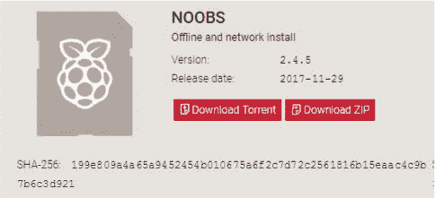

**图 0-6：** 下载 NOOBS

点击**下载 ZIP**按钮以下载 NOOBS。（这是一个大文件，下载可能需要一些时间。）找到文件并保存在你的*下载*文件夹中，或者其他你保存下载文件的地方，但暂时不要解压它。

你需要将 NOOBS 文件的内容复制到一张空白的 microSD 卡中，但首先你需要格式化这张卡。你的 microSD 卡至少需要 8GB 才能正常运行。按照你计算机操作系统的指引进行操作。

#### 在 Windows 或 macOS 上格式化 microSD 卡

将 microSD 卡连接到计算机后，按照以下步骤格式化你的 microSD 卡：

1.  访问*[`www.sdcard.org/downloads/formatter_4/`](https://www.sdcard.org/downloads/formatter_4/)*，下载适用于 Windows 或 Mac 的 SD 卡格式化工具（参见图 0-7）。

    

    **图 0-7：** SD 卡格式化工具下载

1.  接受条款后，ZIP 文件应开始下载。

1.  运行安装文件在你的计算机上安装 SD 卡格式化工具。然后，连接你的 microSD 卡到计算机，打开 SD 卡格式化应用程序。

1.  如果你使用的是 Windows，在 SD 卡格式化工具对话框中，从下拉菜单中选择你的 SD 卡驱动器，并选择**覆盖格式化**选项。点击**格式化**按钮进行格式化（参见图 0-8）。

    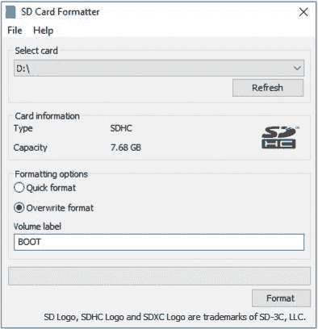

    **图 0-8：** Windows 上的 SD 卡格式化工具对话框

1.  如果您使用的是 macOS，在 SD 卡格式化器对话框中，从下拉菜单中选择 microSD 卡驱动器，选择**覆盖格式**，并将您的 microSD 卡命名为**BOOT**，如图 0-9 所示。然后，点击**格式化**。

    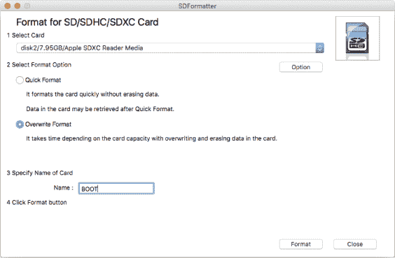

    **图 0-9：** macOS 上的 SD 卡格式化器对话框

#### 在 Linux 上格式化 microSD 卡

将您的 microSD 卡连接到计算机，然后按照以下说明在 Linux 上格式化您的 microSD 卡：

1.  访问*[`gparted.org/`](http://gparted.org/)*并下载 GParted 软件。

1.  安装并打开 GParted。

1.  如图 0-10 所示，在右上角选择您的 microSD 卡。

    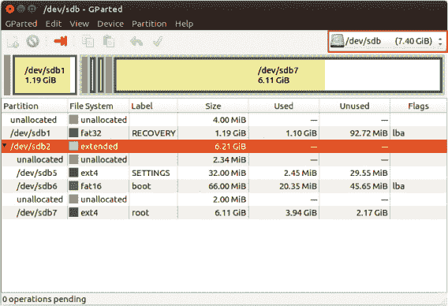

    **图 0-10：** 在 Ubuntu 上使用 GParted

1.  在窗口的下半部分，您应该看到列出的一系列分区。右键点击其中一个分区并删除它。重复此过程，删除 microSD 卡的所有分区，使所有内存未分配。

1.  右键点击未分配的分区，选择**创建新分区**。

1.  将文件系统设置为**fat32**，输入标签**BOOT**，并点击**添加**按钮，如图 0-11 所示。最后，点击主窗口顶部的绿色勾选标志以恢复操作。

    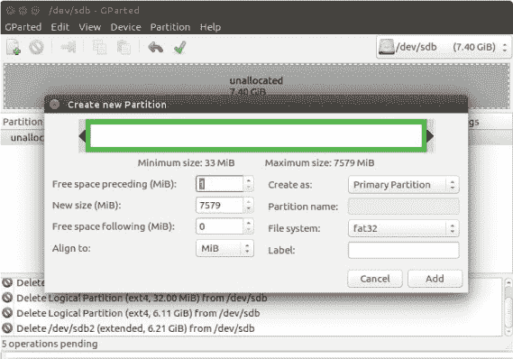

    **图 0-11：** 在 GParted 中创建新的 microSD 卡分区

最终，您的 microSD 卡应该像图 0-12 一样。

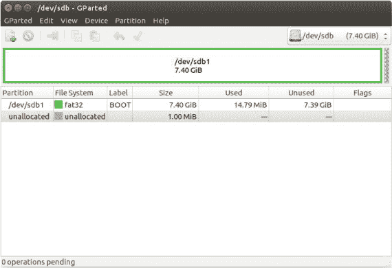

**图 0-12：** 使用 GParted 格式化的 microSD 卡

#### 将 Raspbian 加载到 microSD 卡上

在 microSD 卡正确格式化后，将其插入计算机，从*NOOBS.zip*文件中提取文件，并将文件复制到卡中。然后安全弹出 microSD 卡。

现在，您的 microSD 卡已准备好启动 Raspberry Pi，您可以将 Pi 设置为完全功能的桌面计算机。

### 将您的 Raspberry Pi 设置为桌面计算机

将 Raspberry Pi 用作桌面计算机就像拥有一个学习中心，允许您构建项目并编写自己的软件，而无需担心弄坏计算机。这也是初学者使用 Raspberry Pi 与物理世界互动的最简单方式。

#### 连接您的 Raspberry Pi

以下是将您的 Pi 用作桌面计算机所需的所有设备列表：

+   安装了 NOOBS 的 microSD 卡

+   显示器或电视

+   HDMI 电缆

+   鼠标

+   键盘

+   电源适配器

电源适配器应是最后连接的设备，但其他组件无需按照特定顺序连接。为了简便起见，我们建议您按照以下步骤操作：

**注意**

*如果您的 microSD 卡上没有安装 NOOBS，请返回“下载 NOOBS”的第 10 页，查看如何安装它。*

1.  将 microSD 卡插入 Pi 上的 microSD 卡槽。

1.  使用 HDMI 电缆将显示器或电视连接到 Raspberry Pi 的 HDMI 接口。

1.  将鼠标和键盘连接到可用的 USB 端口。

1.  将电源适配器连接到 microUSB 电源输入端口。

1.  将电源适配器插入电源插座。

图 0-13 展示了这些连接。

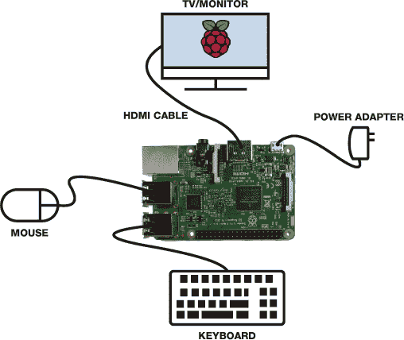

**图 0-13：** 将树莓派连接到必要外设

当你为树莓派通电时，你应该会看到一个红色 LED 和一个绿色 LED 亮起，正如图 0-14 所示。这些被称为*状态 LED*，它们为你提供一些有用的信息。

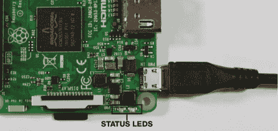

**图 0-14：** 树莓派主板状态 LED

当红色 LED 亮起时，表示树莓派已连接到电源。当绿色 LED 闪烁时，表示 microSD 卡正在活动。

#### 首次启动树莓派

一旦你为树莓派主板通电，它应该会自动启动。如果你正确设置了 NOOBS，几秒钟后，你应该会看到图 0-15 所示的安装窗口。

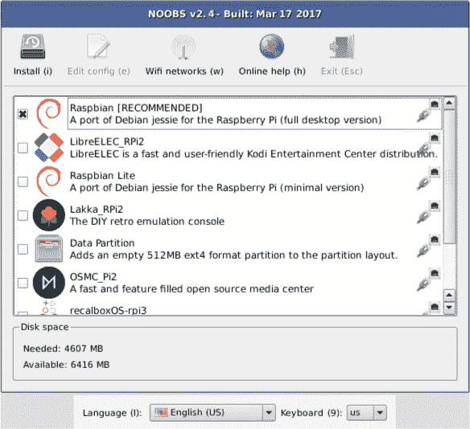

**图 0-15：** NOOBS 安装窗口

**注意**

*正确选择你的键盘布局非常重要，否则你输入时屏幕上会显示错误的字符。*

默认情况下，应该会选择 Raspbian。在 NOOBS 安装窗口外部的屏幕底部，你需要选择你的语言和键盘布局，按地区分类。

在设置语言和键盘偏好后，点击安装窗口左上角的**安装**按钮。接下来，系统会提示你是否覆盖 microSD 卡；选择**是**，安装就会开始。

当安装完成后，点击**确定**，系统应提示你重启树莓派。重启后，你应该会看到 Raspbian 桌面环境，界面类似于图 0-16。

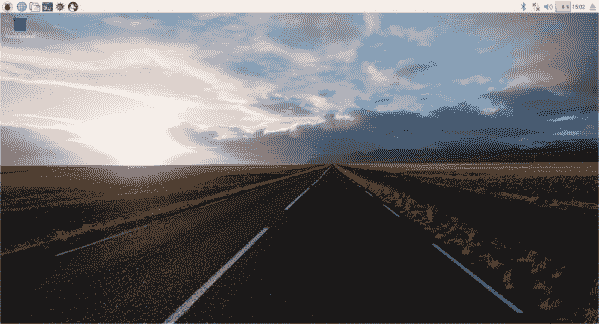

**图 0-16：** Raspbian 桌面环境

**注意**

*你只会在第一次启动时看到安装菜单。下次启动树莓派时，你将直接进入桌面环境。*

恭喜！你成功将你的树莓派设置为桌面电脑。

你不应该被要求输入用户名和密码，但未来可能会要求你这么做。默认的用户名是*pi*，默认的密码是*raspberry*。你可以通过点击任务栏主菜单，选择**偏好设置** ▸ **树莓派配置**来更改密码。在**系统**标签页中，点击**更改密码**按钮来更改密码，如图 0-17 所示。

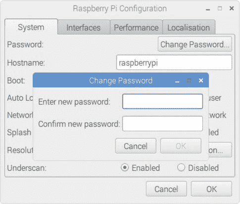

**图 0-17：** 在树莓派上更改密码

我们建议在本书中的项目中使用默认用户账户。不过，如果你需要创建一个新用户账户，请参阅“添加新用户账户”框。

**添加新用户帐户**

要在树莓派上添加一个新的用户帐户，打开终端并输入以下命令，将用户名替换为你希望给用户设置的名字：

```
pi@raspberrypi:~ $ sudo adduser *username*
```

系统会提示你输入密码两次（在输入密码时，终端不会显示字符）。然后，系统会要求你提供有关用户的其他信息，你可以按 ENTER 键跳过这些字段。最后，终端会提示你确认信息。如果信息无误，输入`Y`并按 ENTER 键。现在，你应该已成功创建了一个新的用户帐户。

#### 桌面导览

一旦你开始探索桌面环境，你会发现它和普通计算机非常相似：它有一个任务栏和一个带有废纸篓的桌面区域。你可以打开、拖动、调整窗口大小和关闭窗口；创建、重命名、移动和删除文件夹；启动应用程序；并做大多数你通常在普通桌面计算机上做的事情。

##### 使用任务栏

任务栏位于屏幕顶部，右侧有几个有用的图标。图 0-18 展示了每个图标的功能。

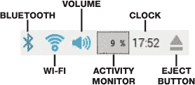

**图 0-18:** 任务栏右侧的图标

任务栏的左侧有任务栏菜单和一些有用的快速启动程序图标（见图 0-19）。

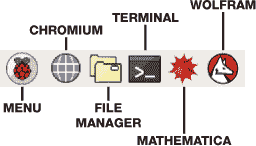

**图 0-19:** 任务栏快速启动图标

我们鼓励你点击这些图标，探索这些程序。

##### 探索程序菜单

当你点击任务栏菜单（任务栏上的树莓派图标）时，应该会弹出一个下拉菜单，其中包含多个子菜单（见图 0-20）。

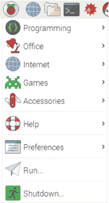

**图 0-20:** 任务栏菜单

探索每个菜单项，看看里面有什么。例如，编程子菜单包含了多种编程工具，可以用来编写 Java 和 Python 等语言的软件。你可以在空闲时自己探索这些工具。

##### 文件管理器

任务栏的左侧有一个文件夹图标，点击它会打开文件管理器窗口，如图 0-21 所示。文件管理器是一个包含多个文件夹的文件夹，你可以用它来组织你的文件。你可以创建、重命名、移动和删除文件夹。

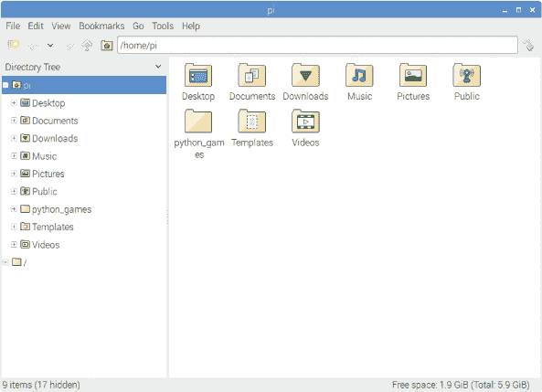

**图 0-21:** 文件管理器

##### 访问终端

另一个重要的程序是终端，你在使用树莓派时会频繁用到它。简单来说，终端通过命令行发送基于文本的指令，与树莓派进行交互。要访问终端，点击任务栏上的快速启动**终端**图标（如图 0-19 所示），或者进入任务栏菜单，选择**附件** ▸ **终端**。你应该会看到一个类似于图 0-22 的窗口。

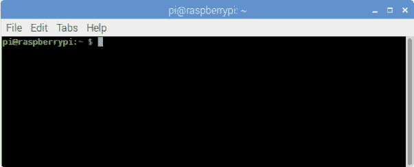

**图 0-22:** 树莓派终端

在终端中，你可以输入特定的命令来控制你的树莓派。例如，你可以使用命令`ls foldername`查看文件夹的内容，或者使用`mkdir foldername`创建一个新文件夹。基本上，你可以做电脑上能做的所有操作，只不过是通过输入特定的文本命令，而不是点击图标。

不要被终端吓到。它可能看起来有点令人生畏，但在本书中，每个项目都会提供你需要输入的命令，因此跟随起来很容易。

##### 将 Pi 连接到互联网

你可以通过 Wi-Fi 或将 Pi 通过以太网线连接到调制解调器来连接互联网。通过 Wi-Fi 连接就像在普通电脑上一样简单。

点击任务栏右侧的第二个图标，如图 0-23 所示。选择你要连接的网络，输入网络凭据，完成连接。

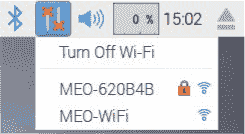

**图 0-23：** 连接 Wi-Fi

如果你使用的是以太网线，只需将其插入 Pi 的以太网端口。

##### 访问互联网并浏览网页

树莓派浏览器是 Chromium。要打开 Chromium，请点击任务栏上的**Chromium**图标（蓝色地球图标），或者前往任务栏菜单，选择**互联网** ▸ **Chromium**。

图 0-24 展示了一个打开的 Chromium 窗口。

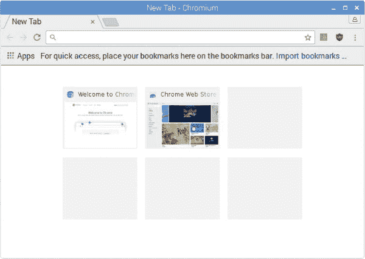

**图 0-24：** Chromium 网页浏览器

正如你所见，它与 Google Chrome 非常相似。实际上，Chromium 是 Google Chrome 的开源浏览器。

##### 连接外部设备

要使用外部设备，如 USB 可移动磁盘，只需将设备插入其中一个可用的 USB 端口。一个像图 0-25 所示的窗口应该会弹出。选择**在文件管理器中打开**以查看设备内容或将文件移动到设备上。

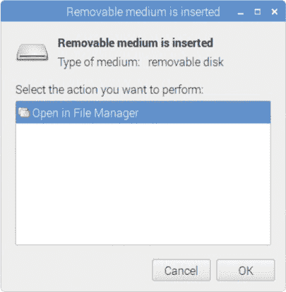

**图 0-25：** 可移动介质插入窗口

完成后，通过点击任务栏上的**弹出**图标并选择你的设备来安全弹出设备。

#### 关机、重启和注销

当你关闭 Pi 时，必须确保正确关闭它。如果直接拔掉电源，可能会损坏 Pi。最简单的关闭 Pi 的方法是从任务栏菜单中选择**关机**，然后点击**关机**，如图 0-26 所示。

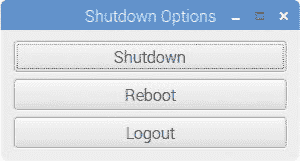

**图 0-26：** 关机菜单选项

在你拔掉电源适配器前，等待绿灯停止闪烁。

你也可以通过关机菜单重启或注销树莓派。如果你想重新登录，只需输入用户名和密码即可。注销选项在你需要切换帐户时非常有用。

你的树莓派现在准备好运行一些程序了！但是首先，让我们了解一些 Python 编程基础，包括用户输入、变量、数学运算符、条件语句和循环。

### 开始使用 Python

Python 是你将在本书中大多数项目中使用的编程语言。它是最简单且易学的编程语言之一，所以即使你从未编程过，它也是一个很好的起点。

你的树莓派安装了两个版本的 Python：Python 2 和 Python 3。在本书中，我们将尽可能使用 Python 3，因为 Python 3 是最新版本。Python 2 仍然被许多程序员使用并且有频繁的更新，但它正在逐渐被淘汰。

**注意**

*我们只在项目 12 中使用 Python 2，该项目使用了一些当时在 Python 3 中无法使用的包。*

#### Python 3 集成开发环境

要在 Python 中编写代码，你需要 Python 3 IDLE（*集成开发环境*），它会在你安装 Raspbian 时自动安装。将你的树莓派连接到显示器、鼠标和键盘后，通过任务栏主菜单启动 IDLE，然后选择 **编程** ▸ **Python 3 (IDLE)**。图 Figure 0-27 显示了*Python Shell*，即打开的 IDLE 窗口。

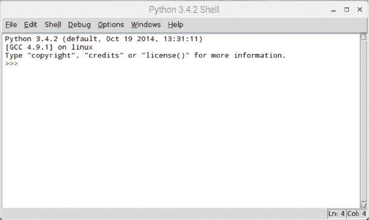

**图 0-27：** Python Shell

Python Shell 是你输入并运行 Python 指令的地方，Python 使用*解释器*来运行你的指令，解释器实际上是理解并执行你代码的部分。

当 Shell 打开时，你应该看到三个箭头 `>>>`，如图 Figure 0-27 所示——这叫做*提示符*，它表示 Shell 已准备好接收你的代码。一些 Python 可以运行的最简单指令是数学运算。试试输入以下内容：

```
>>> 2 + 2

```

按下 ENTER，你应该会看到以下结果：

```
4
>>>
```

你可以看到结果前没有提示符。这是为了表明它是 Python 的*输出*，而不是你的输入。

#### 基础 Python 指令

Python 可以理解多种指令。你可以通过将这些指令或命令组合起来来构建*程序*。我们将在这里介绍不同种类的指令。

##### 数学运算符

Python 能够执行大多数数学运算。表 0-2 列出了 Python 中使用的数学运算符。

**表 0-2：** Python 中的数学运算符

| **运算符** | **数学运算** |
| --- | --- |
| `+` | 加法 |
| `-` | 减法 |
| `*` | 乘法 |
| `/` | 除法 |
| `//` | 除法，去掉小数点后的部分 |
| `%` | 除法后的余数 |

试试更多这样的运算，熟悉一下 Shell。

##### Python 关系运算符

Python 可以使用*关系运算符*进行比较，这些运算符比较两边的值并显示它们之间的关系。一个值，通常是数字或字母，是程序处理的基本组成部分。

表 0-3 展示了在 Python 中使用的不同关系运算符。

**表 0-3：** Python 中的关系运算符

| **运算符** | **描述** |
| --- | --- |
| `==` | 等于 |
| `!=` | 不等于 |
| `>` | 大于 |
| `<` | 小于 |
| `>=` | 大于或等于 |
| `<=` | 小于或等于 |

例如，在 Python Shell 中输入以下内容：

```
>>> 2 > 4
```

你应该得到：

```
False
>>>
```

Python 检查`2`是否大于`4`并告诉你不是。另一方面，如果你输入：

```
>>> 2 < 4
```

你将得到：

```
True
>>>
```

##### 给变量赋值

一个*变量*就像你创建的一个箱子，用来存储一个值。你给变量起个名字，当你需要使用这个值时，只需输入变量的名字即可。图 0-28 展示了这个概念。要给变量赋值，你使用等号（`=`），将变量名写在左侧，值写在右侧。

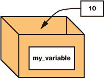

**图 0-28：** 给变量赋值

变量对于存储程序中的信息非常有用，这样你可以在以后引用或重用这些信息。例如，输入以下内容：

```
>>> my_variable = 10
```

在这一行，你创建了一个名为`my_variable`的变量，并将值 10 赋给它，如图 0-28 所示。

然后，如果你像这样在 Python Shell 中输入变量名：

```
>>> my_variable
```

它应该返回存储的值作为输出：

```
10
>>>
```

你给变量起的名字不能包含空格，并且是区分大小写的，因此`my_variable`与`my_Variable`或`MyVariable`是不同的。

##### 数据类型

变量可以存储多种类型的值，而不仅仅是整数。这就是数据类型的作用。*数据类型*是对值的分类，它告诉解释器可以对值执行哪些操作，以及如何存储它。表 0-4 展示了你最常使用的数据类型。

**表 0-4：** Python 数据类型

| **数据类型** | **描述** |
| --- | --- |
| Int | 整数（整体数字） |
| Float | 带小数点的数字 |
| String | 由引号括起来的字符集 |
| Boolean | 真或假 |

让我们来看一下表中每种数据类型的例子：

```
>>> a = 5
>>> b = 7.2
>>> c = 'Hello'
>>> d = True
```

这些是四个赋值语句。第一个赋值给`a`的是一个*整数*，即一个整数。`b`变量包含一个*浮点数*值，即带小数的数字。第三个值`'Hello'`是一个*字符串*，即一串字符。（注意，字符串必须放在单引号或双引号内。）最后，`True`是一个*布尔值*，这是一种只能取`True`或`False`的类型。你在之前使用`>`操作符时看到了这种数据类型。

#### Python 编辑器

Python shell 很适合用于简单代码片段的实验，但它一次只能执行一行代码。要编写一个程序，也就是一个 *脚本*，你需要将许多命令组合在一起一次性执行。编写脚本的正确地方是 *Python 编辑器*，它就像一个用于编写代码的文字处理器。在编辑器中，你可以创建、编辑和保存 Python 文件。然后，通过运行文件来执行这些脚本。Python 文件的扩展名是 *.py*。

要在 Python 编辑器中打开一个新文件，首先进入 Python shell 然后选择 **文件** ▸ **新建文件**。 应该会打开一个像图 0-29 这样的窗口。

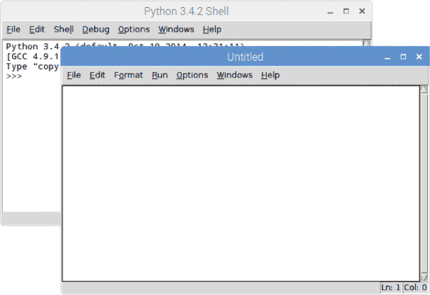

**图 0-29：** Python 编辑器和 Python shell

Python 编辑器没有提示符，因为你输入的命令不会立即执行。你将它们保存到文件中，稍后再运行。让我们写一个非常简单的 Python 脚本来试用这个编辑器。

#### 你的第一个 Python 程序

传统上，你编写的第一个程序是一个简单的程序，它显示“Hello, world!”的信息。要在 Python 中做到这一点，输入以下内容：

```
#this script prints Hello, world!
print('Hello, world!')
```

第一行是一个注释。*注释*必须以井号（`#`）开头，表示 Python 解释器应该忽略井号后面的所有文本。注释对于提醒你或使用你脚本的人代码的作用非常有用。

第二行是实际打印 `Hello, world!` 的代码，使用了 `print()` 函数。*函数*告诉 Python 执行某个特定的操作；在这个例子中，`print()` 函数告诉 Python 显示你输入的括号中的内容。括号中的信息叫做函数的 *参数*。`print()` 函数是 Python 的内置函数，这意味着它总是可以用来执行打印操作。

**注意**

*所有 Python 脚本都需要一个* .py *扩展名。不要忘记在文件名中添加扩展名。*

在你运行代码之前，需要先保存脚本。点击 **文件** ▸ **另存为**，然后输入脚本的名称——例如，*hello_world.py*——并选择一个文件夹。

要运行你的脚本，按 **F5** 键，或者进入 **运行** ▸ **运行模块**。结果会显示在 Python shell 中，而不是编辑器里。你应该会看到一个显示 `Hello, world!` 的消息，如图 0-30 所示。

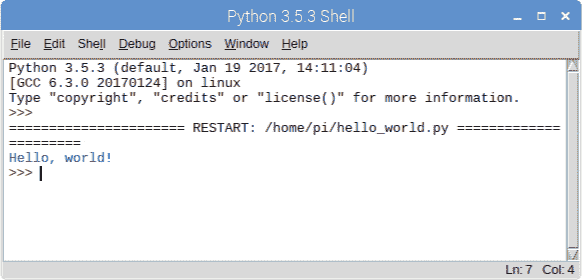

**图 0-30：** 运行 *hello_world.py* 脚本

现在，尝试更改 `print()` 函数的参数，看看在 Python shell 中显示不同的消息。

##### 请求用户输入

你可以通过请求用户输入来提升你的程序功能，这意味着用户需要输入一些信息才能让程序继续。 在编辑器中，输入以下代码片段来请求用户输入他们的名字，并使用该名字打印一个问候消息：

```
username = input('What is your name?')
print('Hello ', username)
```

你使用 `input()` 函数向用户询问输入。在这个例子中，用户会被问到 `What is your name?`。这个文本会显示给用户，并且程序会在用户输入之前不会继续执行。无论用户输入什么，都会被赋值给 `username` 变量，以便我们在程序中稍后使用它。

将这两行代码保存在一个新的文件中，命名为 *username.py* 并运行该文件，看看会发生什么。你应该会在终端看到提示让你输入名字，当你输入后，你应该会看到问候语。

`input()` 函数只接受字符串类型的数据，所以如果你想要获取一个数字，并在程序中使用它，你需要将其转换为整数或浮动数。例如，如果你想以整数形式获取用户的年龄，你需要使用 `int()` 函数：

```
age = int(input('How old are you?'))
```

同样，转换输入为浮动数，你可以使用 `float()` 函数：

```
height = float(input('How tall are you?'))
```

如果你想对输入进行数学运算，将字符串转换为数字是必要的。

##### 通过条件语句做决策

要编写有用的程序，你几乎总是需要根据某个条件的真假来执行不同的操作。在编程中，这些叫做 *条件语句*，它们有以下结构：

```
if something is true:
    do_something()
elif this is true instead:
    do_something_else()
(...)
else:
    do_another_something_else()
```

例如，下面的代码片段尝试根据你选择的颜色来猜测你在想的水果：

```
  print('Pick a fruit:')
  print('strawberry, banana, or kiwi?')
  color = input ('Enter the color of the fruit you chose: ')
➊ if (color == 'red'):
    ➋ print('Your fruit is a strawberry.')
➌ elif (color == 'yellow'):
      print('Your fruit is a banana.')
➍ elif (color == 'green'):
      print('Your fruit is a kiwi.')
➎ else:
      print('Invalid input.')
```

第一个 `if` 条件测试用户是否输入了 `red` ➊。 如果是，程序猜测水果是草莓，并在 ➋ 输出 `Your fruit is a strawberry.` 的语句。

`elif` 语句代表 *else if*，只有在第一个 `if` 条件不成立时才会运行。所以如果用户没有输入 `red`，代码会检查输入是否为 `yellow` ➌。如果是，程序会猜测水果是香蕉。如果不是，它将检查颜色是否为 `green` ➍，如果是，程序会猜测你选择了猕猴桃。

**注意**

*Python 的标准缩进是四个空格，而不是一个制表符。然而，在 IDLE 中，你可以按 Tab 键自动插入四个空格。*

注意这里一个非常重要的地方。一些行的开头会有几个空格——精确来说是四个空格。这叫做 *缩进*。缩进对定义 *代码块* 很重要。例如，你在 ➊ 有一个 `if` 语句，接下来的行在 ➋ 有缩进。缩进告诉 Python，这一行 ➋ 属于前面的 `if` 语句，因此该行只有在 `if` 条件为真时才会执行。位于 ➌ 的这一行没有缩进，这意味着它不属于同一个代码块，会单独执行。缩进在 Python 中至关重要，它让解释器知道什么时候执行哪些代码，因此在编写本书时，请特别注意空格。

最后，如果用户拼写错误或者没有输入小写颜色，`else` 语句 ➎ 会执行，程序会提示用户输入无效。

总结来说，脚本会依次检查每个条件。当某个条件为假时，它会跳到下一个条件，依此类推。当某个条件为真时，它会执行相应的缩进代码，并结束该语句。注意，程序中没有`elif`语句的数量限制。`else`语句也不是必须的，但如果有，它必须放在最后。

尝试使用你自己的示例创建一些`if`/`else`语句，使用`print()`和`input()`函数——这是最好的学习方式。

##### while 和 for 循环

循环允许你在条件满足时多次执行一段代码。循环有两种类型：`while`循环和`for`循环。例如，你可以用`while`循环打印从 1 到 10 的所有数字。请在 Python 编辑器中输入以下内容：

```
number = 1
while (number <= 10):
    print(number)
    number = number + 1
```

属于`while`循环的代码（由缩进标识）会在变量`number`的值小于或等于（`<=`）10 时执行。在每次循环中，当前的`number`会被打印出来，然后再加 1。

你也可以使用`for`循环打印从 1 到 10 的数字，像这样：

```
number = 1
for number in range(1,11):
    print(number)
```

`for`循环会在变量`number`的值处于 1 和 11 之间时执行。`range()`函数会自动为`number`变量分配下一个值，直到你指定的最终数字的下一个数值。

当你希望重复一段代码指定次数时，应该使用`for`循环。使用`while`循环当你希望代码重复执行，直到某个条件不再满足为止。在某些情况下，你可以使用任意一个，但正如你在本书中逐渐了解的那样，通常一个比另一个更高效。

#### 制作一个简单的计算器

为了测试你新的编程技能，你将构建一个计算器。这个程序的脚本非常简单，并且使用了你刚学到的所有概念。你的计算器将执行以下操作：

+   显示欢迎信息

+   询问用户要执行什么操作

+   让用户输入一个数字

+   让用户输入另一个数字

+   执行计算

+   打印结果

打开 Python shell，选择**文件** ▸ **新建文件**。将以下代码复制到 Python 编辑器中。（请记住，所有脚本也可以通过书籍资源下载，网址是 *[`www.nostarch.com/RaspberryPiProject/`](https://www.nostarch.com/RaspberryPiProject/)*。）

```
➊ #Python Calculator
➋ running = True
➌ welcome_message = '***Welcome to Python Calculator***'
➍ print(welcome_message)

➎ while running:
      print('Operations')
      print('1 = Addition')
      print('2 = Subtraction')
      print('3 = Multiplication')
      print('4 = Division')
      print('5 = Quit program')
   ➏ operation = int(input('Enter a number to choose an operation: '))
   ➐ if operation == 1:
         print('Addition')
      ➑ first = int(input('Enter first number: '))
        second = int(input('Enter second number: '))
      ➒ print('Result = ', first + second)
   ➐ elif operation == 2:
          print('Subtraction')
        ➑ first = int(input('Enter first number: '))
          second = int(input('Enter second number: '))
        ➒ print('Result = ', first - second)
   ➐ elif operation == 3:
          print('Multiplication')
        ➑ first = int(input('Enter first number: '))
          second = int(input('Enter second number: '))
        ➒ print('Result = ', first * second)
   ➐ elif operation == 4:
          print('Division')
        ➑ first = int(input('Enter first number: '))
          second = int(input('Enter second number: '))
        ➒ print('Result = ', first / second)
   ➐ elif operation == 5:
          print('Quitting program... ')
        ➓ running = False
```

让我们解析一下计算器程序是如何工作的。第一行只是一个注释，告诉任何阅读该程序的人脚本的功能 ➊。然后，在 ➋ 和 ➌ 处，我们为变量赋值，并在 ➍ 处打印欢迎信息。

接下来我们启动一个`while`循环 ➎，只要`running`被设置为`True`，它就会继续运行；也就是说，只要用户没有退出程序。我们要求用户选择一个数学运算，使用数字 1 到 5，程序将他们选择的值存储在`operation`变量中 ➏。我们使用一系列的`if`/`elif`语句来根据输入选择要执行的正确运算 ➐。然后，我们要求用户提供进行运算的数字 ➑，每个`if`/`elif`语句块的最后一行执行选定的数学运算并打印结果 ➒。

如果用户输入`5`，则`running`变量被设置为`False`，并且`while`循环停止 ➓。

##### 运行脚本

将你的脚本保存为*calculator.py*。然后要运行它，按**F5**或进入**Run** ▸ **Run Module**。图 0-31 展示了你应该得到的结果。

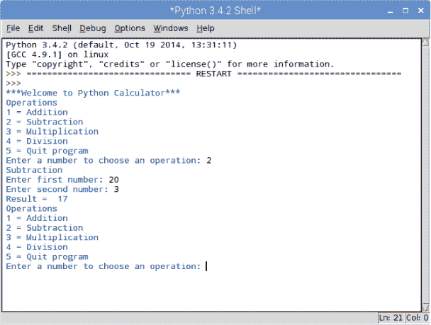

**图 0-31：** 运行*calculator.py*

##### 进一步拓展

恭喜你！你已经构建了一个工作中的计算器程序。现在，看看你能做什么来改进它。举个例子，你可能注意到用户输入只能接受整数；如果计算器能够接受浮点数会更有用，看看你能否添加这个功能。你还可以尝试的另一个改进是允许用户使用超过两个数字进行计算。
