## 第二章：LED

## **使 LED 闪烁**

在这个第一个项目中，你将把一个 LED 连接到你的 Pi，并通过 Python 脚本让它闪烁。学习如何使用 GPIO 引脚使 LED 闪烁是你 Pi 教育中的重要一步；一旦你知道如何控制 LED，就可以控制几乎任何输出，无论是电机、灯泡，甚至是烤面包机。

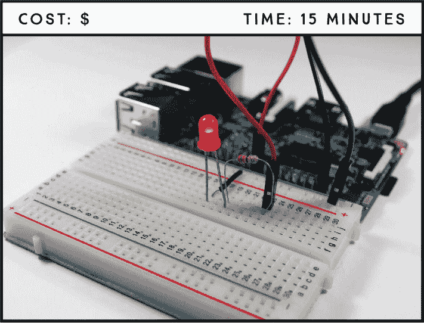

**所需材料**

树莓派

面包板

5 毫米 LED**

330 Ω 电阻

跳线

### 介绍 GPIO 引脚

*通用输入/输出（GPIO）* 引脚允许你将电子硬件（如 LED 和传感器）连接到你的 Pi。它们既可以用来读取信息，也可以用来发送信息，使你的 Pi 能与现实世界进行交互。

Raspberry Pi 3 Model B 板具有一排 40 个 GPIO 引脚，如图 1-1 所示。此布局与 Pi 2 Model B 和 Pi 1 Model B+ 相同，但与 Pi 1 Model A 和 B 略有不同，后者只有前 26 个引脚。如果你使用的不是 Raspberry Pi 3 Model B，请查看“树莓派 GPIO 引脚指南”中的第 261 页。


**图 1-1：** 树莓派 GPIO 布局

有两种方式来表示一个 GPIO 引脚：其名称（通常称为 GPIO 编号或 Broadcom 编号）或它对应的引脚编号（通常称为物理编号）。例如，GPIO 25 对应引脚 22。在本书中，我们将使用 GPIO 引脚的名称进行引用。GPIO 引脚可以设置为 HIGH，输出 3.3 V 并打开组件，或者设置为 LOW，输出 0 V 并关闭组件。

| **功能** | **名称** | **编号** | **编号** | **名称** | **功能** |
| --- | --- | --- | --- | --- | --- |
| DC 电源 | 3.3 V | 1 | 2 | 5 V | DC 电源 |
| SDA1, I²C | GPIO 2 | 3 | 4 | 5 V | DC 电源 |
| SCL1, I²C | GPIO 3 | 5 | 6 | GND |  |
| GPIO_GCLK | GPIO 4 | 7 | 8 | GPIO 14 | TXD0 |
|  | GND | 9 | 10 | GPIO 15 | RXD0 |
| GPIO_GEN0 | GPIO 17 | 11 | 12 | GPIO 18 | GPIO_GEN1 |
| GPIO_GEN2 | GPIO 27 | 13 | 14 | GND |  |
| GPIO_GEN3 | GPIO 22 | 15 | 16 | GPIO 23 | GPIO_GEN4 |
| **功能** | **名称** | **编号** | **编号** | **名称** | **功能** |
| --- | --- | --- | --- | --- | --- |
| DC 电源 | 3.3 V | 17 | 18 | GPIO 24 | GPIO_GEN5 |
| SPI_MOSI | GPIO 10 | 19 | 20 | GND |  |
| SPI_MISO | GPIO 9 | 21 | 22 | GPIO 25 | GPIO_GEN6 |
| SPI_CLK | GPIO 11 | 23 | 24 | GPIO 8 | SPI_CE0_N |
|  | GND | 25 | 26 | GPIO 7 | SPI_CE1_N |
| I²C ID EEPROM | DNC | 27 | 28 | DNC | I²C ID EEPROM |
|  | GPIO 5 | 29 | 30 | GND |  |
|  | GPIO 6 | 31 | 32 | GPIO 12 |  |
|  | GPIO 13 | 33 | 34 | GND |  |
|  | GPIO 19 | 35 | 36 | GPIO 16 |  |
|  | GPIO 26 | 37 | 38 | GPIO 20 |  |
|  | GND | 39 | 40 | GPIO 21 |  |

**警告**

*GPIO 引脚设计为 3.3 V 工作，因此如果你将它们连接到更高电压的设备上，可能会永久损坏你的 Raspberry Pi。*

表格中灰色高亮的引脚 27 和 28 是 DNC，即“不连接”引脚。树莓派还具有八个 GND（地）引脚—表格中以黑色高亮显示—用于将地连接到电路。还有四个电源引脚，其中两个是 5V 引脚，两个是 3.3V 引脚，分别以红色和橙色高亮显示，用于提供电力。几个引脚具有特殊功能；例如，黄色高亮的引脚用于串行外设接口（SPI）通信，绿色高亮的引脚用于集成电路间（I²C）通信。你将在项目 3 和项目 7 中了解这些通信协议。

### 介绍 LED

LED 有各种尺寸、形状和颜色，有些甚至可以混合颜色以产生几乎任何颜色。在这个项目中，你将使用一个简单的 5 毫米红色 LED。

*LED*，即*发光二极管*，顾名思义，是一种发光的二极管。二极管是具有*极性*的电子元件，意味着它们只允许电流单向流动，从正极流向负极。LED 与所有二极管一样，有一个正连接称为*阳极*，和一个负连接称为*阴极*。LED 的两个引脚，或*引线*，长度不同，帮助你区分哪个是正极，哪个是负极，如图 1-2 所示。较长的引线是阳极（+），较短的引线是阴极（–）。

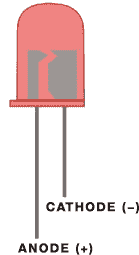

**图 1-2：** 5 毫米红色 LED

### 找到合适的电阻器

LED 只能承受一定的电流，超过电流限制会导致 LED 过载并烧毁，这可能会损坏 LED 甚至 Pi 板。为防止这种情况发生，你必须始终将 LED 与*电阻器*串联连接：一个限制通过电流的小元件。

电阻器有各种不同的阻值，你需要选择一个足够强大的电阻器来保护你的组件，同时又不会强到限制组件的性能。例如，较强的电阻器可能会使 LED 发出的光变暗。合适的电阻值取决于你使用的 LED——你在电子项目中使用的大多数 LED 可以承受最大 20 mA 的电流。对于本项目中的 LED，选择一个 220 Ω到 470 Ω之间的电阻器都可以，在这个范围内，较低的电阻值会导致 LED 稍微更亮一些。

**注意**

*我们建议你购买一个 1/4 W 的电阻器组合，涵盖广泛的电阻值范围。这些可以满足你大多数的需求。*

电阻值由电阻上的色环表示。电阻通常有四个色环，如图 1-3 所示。前两个代表值的前两个数字。第三个是乘数，表示前两个数字后面的零的个数。第四个是电阻的*公差*，标明实际电阻值可能偏高或偏低的百分比。例如，一个 330Ω的电阻，公差为 5％，其值可能在 313.5Ω和 346.5Ω之间。


**图 1-3：** 330Ω电阻

如果需要帮助识别电阻，请查看“解码电阻值”中的电阻色环卡，在第 264 页上。

### 电路接线

现在你准备好构建第一个电路了。本书中的所有项目都使用*无焊接面包板*，它为你提供了一种便宜且简便的方法来构建电路，而无需使用焊接连接组件。如果你以前从未使用过面包板，确保在开始之前阅读“面包板是如何工作的？”，该章节位于第 42 页。

要将 LED 连接到树莓派，请按照以下步骤操作。参考图 1-4 中的接线图，并在需要时查看图 1-1 以确认引脚位置。

1.  将蓝色面包板轨道连接到树莓派的任意一个 GND 引脚（6、9、14、20、25、30、34 和 39 号引脚都提供 GND）。

1.  将 LED 插入面包板。

1.  将 330Ω电阻插入面包板，使一端连接到 LED 的阳极（较长的正极引脚）。

1.  使用跳线将电阻的另一端连接到 GPIO 25（第 22 号引脚）。

1.  将 LED 的阴极（较短的负极引脚）连接到 GND 电源轨。

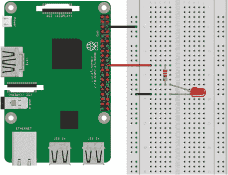

**清单 1-1：** 将 LED 接到树莓派上。带弯曲的 LED 引脚是阳极。

我们已经告诉你将电阻放置的位置，但其实电阻连接到阳极还是阴极并不重要，只要它连接到其中一个就行。你可能会想，既然我们只需要 GND 轨道来连接那一个点，为什么不直接将 LED 的阴极连接到 6 号引脚（GND）呢？原因是，使用面包板上的 GND 轨道是一种良好的做法，尤其在更复杂的电路中，它会变得更加有用。

**面包板是如何工作的？**

使用面包板接线就像插拔组件一样简单。面包板上有排孔，通过下面的铜条连接在一起，所以你只需要将组件插入这些孔，然后用跳线将它们连接起来。面包板的孔是以特定方式连接的，这里通过橙色线条展示了这一点。

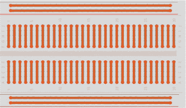

每个单独的行都是电气隔离的。水平线是*电源轨*，用于连接电源：蓝色轨道用于连接 GND，红色轨道用于连接电源。在面包板的中间有一个分隔，分开两边的行。您应将组件放置在这些行中。位于同一行且位于中心分隔两侧的组件将通过下面的铜条连接。

### 编写脚本

为了保持所有项目的组织性，在桌面环境中创建一个名为*Projects*的文件夹，用于保存所有项目的脚本。在新创建的文件夹内，创建一个名为*LEDs*的新文件夹，您将在其中保存本书中的 LED 项目。

简单来说，闪烁 LED 项目的工作原理如下：

1.  LED 亮起 1 秒钟——GPIO 25 设置为 HIGH。

1.  LED 关闭 1 秒钟——GPIO 25 设置为 LOW。

1.  LED 再次亮起 1 秒钟——GPIO 25 设置为 HIGH。

1.  LED 再次关闭 1 秒钟——GPIO 25 设置为 LOW。

这种模式会持续进行，直到您告诉程序停止。

在本书中，我们将使用一个名为 gpiozero 的 Python 库来控制树莓派的 GPIO。gpiozero 库提供了一系列接口，用于操作日常组件，如 LED、按钮、电位器、传感器等。

#### 输入脚本

打开**Python 3 (IDLE)**并进入**File** ▸ **New File**以创建一个新脚本。将以下代码复制到 Python 编辑器中，并将脚本保存在*LEDs*文件夹中的*blinking_led.py*文件中（记得你可以在*[`www.nostarch.com/RaspberryPiProject/`](https://www.nostarch.com/RaspberryPiProject/)*下载所有脚本）：

```
  #importing necessary libraries
➊ from gpiozero import LED
➋ from time import sleep

  #create an object called led that refers to GPIO 25
➌ led = LED(25)

  #create variable called delay that refers to delay time in seconds
➍ delay = 1

➎ while True:
      #set led to on for the delay time
    ➏ led.on()
      print('LED set to on')
    ➐ sleep(delay)
      #set led to off for the delay time
    ➑ led.off()
      print('LED set to off')
      sleep(delay)
```

这里有很多内容，所以我们将逐一讲解每个主要的代码部分。

##### 导入库

在➊处，您从 gpiozero 库导入`LED`以控制 LED 连接的 GPIO。然后，您导入`time`模块中的`sleep()`函数➋。

##### 声明引脚

在➌处，您创建了一个名为`led`的`LED`对象，该对象指向 GPIO 25，这是 LED 连接的 GPIO。当您创建并使用这个`LED`对象时，Python 会知道 GPIO 25 是一个输出，因此应设置为 HIGH 或 LOW。声明后，您可以使用`led`来引用 GPIO 25。

##### 启动 while 循环

在➎处，您开始了一个条件为`True`的`while`循环，这意味着该循环将永远运行，直到您手动停止程序。紧随循环声明之后的代码行被缩进，告诉 Python 这是循环中的内容，只有在`while`条件满足时才会执行。

##### 设置数字输出

接下来，你需要设置 LED 的数字输出。你使用 `led.on()` 函数 ➏ 将 GPIO 25 设置为高电平，从而点亮 LED；使用 `led.off()` 函数 ➑ 将 GPIO 25 设置为低电平，熄灭 LED。每次 LED 状态变化之间都有 1 秒的暂停，使用 `sleep()` 函数 ➐ 创建闪烁效果。代码会在当前位置暂停，并等待 `delay` 变量中指定的时间（以秒为单位） ➍ 后再继续执行下一行代码。这允许你保持 LED 在指定时间内开启或关闭。

#### 运行脚本

要运行脚本，首先保存它，然后按 **F5** 或前往 **运行** ▸ **运行模块**。你的电路应该类似于图 1-5，LED 每秒钟开关一次。要停止正在运行的程序，请按 CTRL-C。

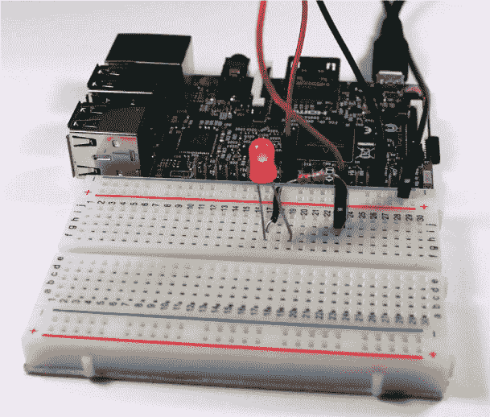

**图 1-4：** 完成的项目

恭喜你——你刚刚完成了第一个工作项目！

### 更进一步

学习电子和编程的最佳方式就是通过实验。这里有两个你可以尝试的简单修改想法：

+   更改脚本中的延迟时间。

+   修改电路和脚本以控制多个 LED。

看看你能否利用在这个项目中学到的知识来完成每个任务。

## 按钮 LED 手电筒**

这个 LED 手电筒将教你如何使用按钮，这是电子电路中的一项基本技能。你将学习如何在电路中使用按钮来触发一个事件——在这个例子中，是点亮一个 LED——当按钮按下时触发事件，当按钮释放时停止事件。

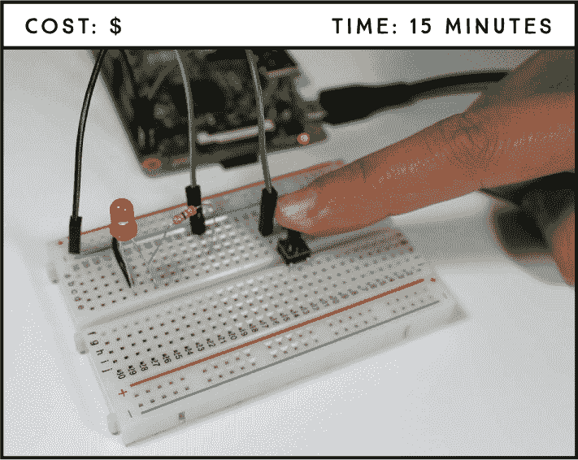

**所需零件**

树莓派

面包板

5 毫米 LED

330 Ω 电阻

跳线

### 介绍开关和按钮

开关无处不在。你用它们来打开灯、调节搅拌机的速度、点燃炉子，还有更多。市面上有各种各样的开关，但你在家里可能会看到的有按钮开关、翻转开关、旋转开关和磁性簧片开关。图 2-1 展示了几种常见的电子开关。

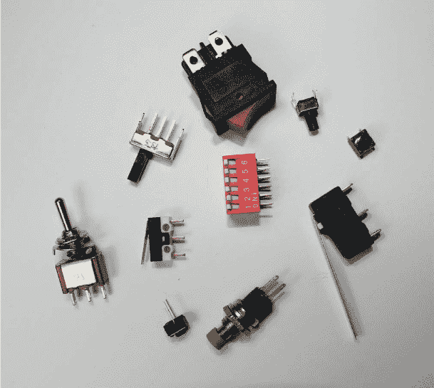

**图 2-1：** 电子设备中使用的几种开关

开关可以充当 *中断器*，中断电流以允许或限制电力流向某个组件，或者充当 *分流器*，将电流引导到电路的其他部分。这个项目将使用一个简单的按钮——一个中断器开关，它在电子设备中非常受欢迎，因为它便宜、完美适配面包板，并且易于操作。

按钮有两种主要类型：常开型和常闭型。*常开型* 按钮，如图 2-2 所示，默认电路是开路的，防止电流通过它。当你按下按钮时，两个触点连接，电路闭合，电流开始流动。

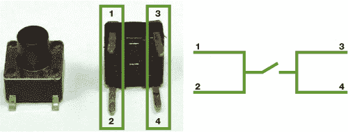

**图 2-2：** 常开按钮的内部连接

*常闭*按钮在按钮未被按下时回路是闭合的，允许电流通过，直到你按下按钮打开电路并停止电流流动。

按钮可以有两脚或四脚。四脚按钮在原型项目中更为常见，因为它们能很好地适配面包板。图 2-2 的右侧展示了一个典型的常开四脚按钮的示意图。脚 1 和脚 2 总是连接的，脚 3 和脚 4 也是如此。

在这个项目中，你将使用一个常开四脚按钮。这个按钮只在按下时允许电流通过，因此与普通的开关不同，项目中的 LED 只有在按钮被按下时才会亮起。

### 连接电路

在这个项目中，只有在按下按钮时，LED 才会亮起，因此你的 Raspberry Pi 需要能够判断按钮是被按下还是未被按下。你的 Raspberry Pi 将通过 GPIO 引脚获取这些信息。

按照这些步骤连接电路，使用图 2-3 作为参考：

1.  将 GND 连接到蓝色电源轨。

1.  将一个 LED 插入面包板，并通过一个 330 Ω的电阻将 LED 的正极连接到 GPIO 25，像在项目 1 中那样。将 LED 的负极连接到 GND 轨道。

1.  将按钮插入面包板的中间，使得两个脚位位于中间的分隔两侧。确保顶部两个脚与底部两个脚之间没有连接。（记住，面包板中间的这一条孔排是断开的。）

1.  将按钮的一侧连接到 GPIO 2，另一侧连接到 GND，如图 2-3 所示。

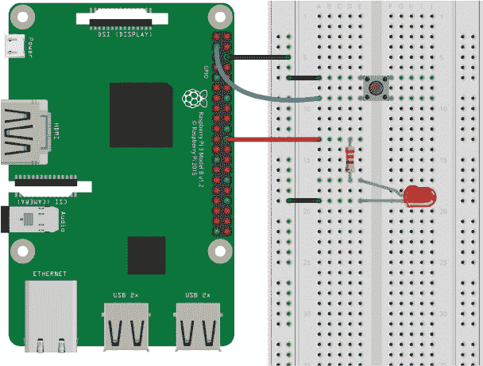

**图 2-3：** LED 手电筒电路

### 编写脚本

这个脚本会根据按下或释放按钮的状态触发不同的事件。以下的*pseudoscript*——一个以简单英语描述的代码指令版本——可以帮助你理解 Python 脚本。编写 pseudoscript 是概述程序的一种好方法。程序应该做的事情如下：

+   当按钮被按下时，LED 设置为亮起。

+   当按钮没有被按下（即被释放时），LED 保持关闭。

打开**Python 3 (IDLE)**，并点击**文件** ▸ **新建文件**，创建一个新的脚本。将以下代码复制到 Python 编辑器中，然后将脚本保存为*led_flashlight.py*到*LEDs*文件夹中（记得你可以在*[`www.nostarch.com/RaspberryPiProject/`](https://www.nostarch.com/RaspberryPiProject/)*下载所有脚本）：

```
➊ from gpiozero import LED, Button
  from signal import pause

➋ led = LED(25)
  button = Button(2)
➌ button.when_pressed = led.on
➍ button.when_released = led.off

➎ pause()
```

这个脚本很容易理解。你首先导入 LED 和 Button 库来控制 LED 和按钮；然后，从 signal 库导入`pause` ➊。`pause()` ➎函数让程序在所有代码执行完后仍然保持运行状态，以检测事件——在这种情况下，它会持续检查按钮的状态。

你创建了一个叫做`led`的`LED`对象，它指向 GPIO 25，这是 LED 连接的引脚；同时，创建了一个叫做`button`的`Button`对象，它指向 GPIO 2，这是按钮连接的引脚 ➋。

`button.when_pressed`函数在按下按钮时调用`led.on`，打开 LED ➌。同样，`button.when_released`函数在按钮释放时调用`led.off`，关闭 LED ➍。

按下**F5**或前往**运行** ▸ **运行模块**来运行脚本。当按下按钮时，LED 应该亮起。要停止程序，按下 CTRL-C。

### 进一步探讨

通过在这个简单项目中学到的内容，你可以创建无数其他项目。以下是一些可以测试你技能的想法：

+   添加更多的按钮和 LED。

+   修改代码，使得按下按钮时改变 LED 状态，这样你就不必按住按钮来保持 LED 闪烁。

+   构建一个红绿灯。

## LED 调光开关**

在这个项目中，你将通过控制电位器来调节 LED 的亮度，从而构建一个调光器。这个项目的关键在于你能利用树莓派读取模拟输入并输出脉冲宽度调制信号。这些将在未来的项目和树莓派学习中成为非常有用的技能。

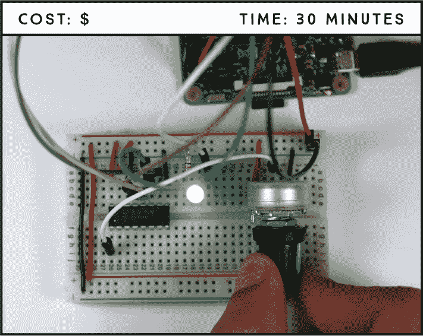

**所需零件**

树莓派

面包板

10 kΩ 电位器

MCP 3008 芯片

5 毫米 LED

330 Ω 电阻

跳线

### 介绍电位器

电位器就像是电源调节旋钮，广泛应用于你日常生活中的各种场景，如控制收音机音量、调整显示器亮度、设定风扇转速等等。你在这个项目中使用的电位器如图 3-1 所示。

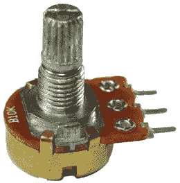

**图 3-1：** 一个 10 kΩ 电位器

电位器，也称为*电位调节器*，是一种手动可调的可变电阻器。这意味着你可以通过旋转旋钮来改变它对电路施加的电阻，从而改变到达特定元件的电流量。

电位器有三个引脚，如图 3-2 所示。两个外部引脚，分别用蓝色和红色标出，连接到一个电阻元件；而第三个引脚，黑色标出，连接到一个可调的导电*滑臂*。

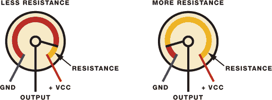

**图 3-2：** 电位器的工作原理

摇臂的位置决定了电路中的电阻大小。在这个项目中，你将通过控制电路中的电阻来调节 LED 的亮度。

### 使用树莓派读取模拟信号

树莓派的 GPIO 只能读取数字信号，这意味着它们只能读取 HIGH（3.3 V）或 LOW（0 V）的状态，但无法读取两者之间的信号。然而，电位计是模拟输入，旋转旋钮会改变其输出电压，从 0 V 到 3.3 V。你希望树莓派能够读取这些中间值——如 1 V、1.4 V、1.8 V 等——这样就能实现亮度的渐变，而不仅仅是开与关的切换。为此，你需要通过模拟到数字转换器芯片将模拟信号转换为数字信号，然后利用脉冲宽度调制产生模拟信号的仿真效果。在开始构建之前，让我们先了解这两个主题。

#### 模拟到数字转换器

如图 3-3 所示，模拟到数字转换器（ADC）芯片（MCP3008）将电位计的模拟信号转换为数字信号。


**图 3-3：** MCP3008 芯片模拟到数字转换器

该芯片有 16 个引脚，其中 8 个是模拟输入，你可以将其连接到模拟设备。其他 8 个引脚连接到树莓派的 GPIO。芯片引脚布局如图 3-4 所示。要识别每个引脚，请将芯片按图示方向放置，顶部有一个半圆形标记。

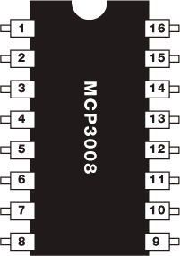

**图 3-4：** MCP3008 芯片

下表列出了每个引脚的功能。

| **引脚** | **符号** | **描述** |
| --- | --- | --- |
| 1 | CH0 | 模拟输入（通道 0） |
| 2 | CH1 | 模拟输入（通道 1） |
| 3 | CH2 | 模拟输入（通道 2） |
| 4 | CH3 | 模拟输入（通道 3） |
| 5 | CH4 | 模拟输入（通道 4） |
| 6 | CH5 | 模拟输入（通道 5） |
| 7 | CH6 | 模拟输入（通道 6） |
| 8 | CH7 | 模拟输入（通道 7） |
| 9 | DGND | 数字地 |
| 10 | CS/SHDN | 芯片选择/关机输入 |
| 11 | D[IN] | 串行数据输入 |
| 12 | D[OUT] | 串行数据输出 |
| 13 | CLK | 串行时钟 |
| 14 | AGND | 模拟地 |
| 15 | V[REF] | 参考电压输入 |
| 16 | V[DD] | +2.7 V 到 5.5 V 电源 |

#### 脉冲宽度调制

如前所述，树莓派的 GPIO 只能设置为 HIGH 或 LOW，但不能输出两者之间的电压。然而，你可以通过*脉冲宽度调制（PWM）*输出“伪”中间电压，这也是你在此项目中调节 LED 亮度的方式。

如果你快速交替改变 LED 的电压在 HIGH 和 LOW 之间，你的眼睛无法跟上 LED 开关的速度；你会看到亮度的渐变变化。这基本上就是 PWM 的工作原理——通过产生在 HIGH 和 LOW 之间快速变化的输出，工作频率非常高。*占空比*是 LED 设为 HIGH 的时间比例。图 3-5 展示了 PWM 如何工作。

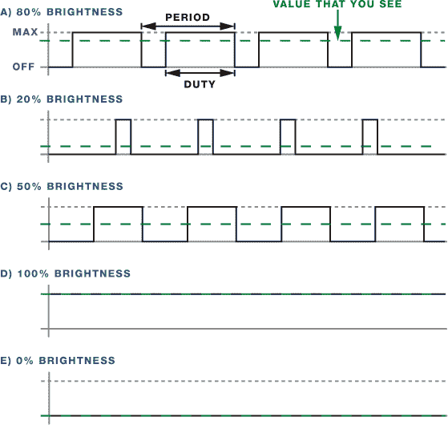

**图 3-5：** PWM 工作原理

50%的占空比对应 50%的 LED 亮度，0%的占空比表示 LED 完全关闭，100%的占空比表示 LED 完全亮起。通过改变占空比，你可以产生不同亮度的效果。

### 电路连接

对于此电路，你需要将 LED、电位器和 MCP3008 芯片连接到树莓派。按照这些说明构建电路，并以图 3-6 为参考。

1.  将 GND 连接到蓝色面包板轨道。

1.  将 3.3 V 连接到红色面包板轨道。

1.  将 LED 插入面包板，将较长的 LED 引脚通过 330 Ω电阻连接到 GPIO 17，将较短的引脚连接到 GND 轨道。

1.  将 MCP3008 芯片放置在面包板的中央，并按照下表所示进行连接。

    | **MCP3008** | **树莓派** |
    | --- | --- |
    | 1 | 电位器中间引脚 |
    | 9 | GND |
    | 10 | GPIO 8 |
    | 11 | GPIO 10 |
    | 12 | GPIO 9 |
    | 13 | GPIO 11 |
    | 14 | GND |
    | 15 | 3.3 V |
    | 16 | 3.3 V |

    **注意**

    *在为电路供电之前，确保你已经按照图 3-4 中的引脚图正确连接了 MCP3008 芯片，否则可能会损坏芯片。*

1.  将电位器的一个外部引脚连接到 GND，另一个引脚连接到 3.3 V——哪个引脚连接哪个电源都无所谓。如果你还没有，将中间引脚连接到 MCP3008 芯片的引脚 1。

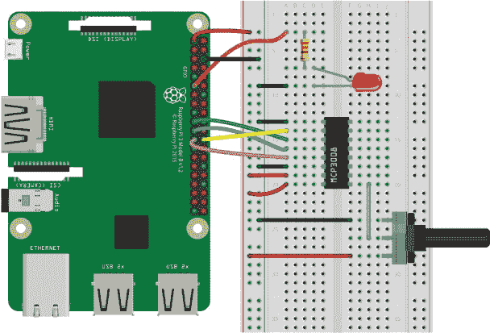

**图 3-6：** 使用电位器控制 LED 亮度的电路

### 编写脚本

Pi 通过 SPI 通信读取 MCP3008 芯片的模拟值，因此你需要首先启用 SPI。

从任务栏主菜单中选择**首选项** ▸ **树莓派配置**。在“接口”标签页中，启用 SPI，如图 3-7 所示，然后点击**确定**。

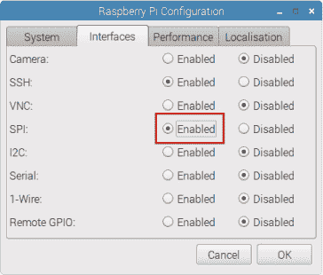

**图 3-7：** 启用 SPI 通信

你的脚本需要能够完成以下任务：

+   从电位器通过 MCP3008 芯片读取模拟输入值。

+   使用 PWM 控制 LED 的亮度。

+   根据从电位器读取的输入值更改 PWM 的占空比。

#### 输入脚本

打开**Python 3 (IDLE)**，然后点击**文件** ▸ **新建文件**以创建一个新的脚本。将以下代码复制到 Python 编辑器中，并将脚本保存在*LEDs*文件夹下，命名为*brightness_controller.py*（记得可以在*[`www.nostarch.com/RaspberryPiProject/`](https://www.nostarch.com/RaspberryPiProject/)*下载所有脚本）：

```
  #import necessary libraries
  from gpiozero import PWMLED, MCP3008
  from time import sleep

  #create an object called pot that refers to MCP3008 channel 0
➊ pot = MCP3008(0)

  #create a PWMLED object called led that refers to GPIO 17
➋ led = PWMLED(17)

➌ while True:
      #pot.value accesses the current pot reading
    ➍ if(pot.value < 0.001):
          #if the pot value is very small, the led is turned off
        ➎ led.value = 0
    ➏ else:
          #change led brightness according to the pot value
          led.value = pot.value
      #print the pot value
      print(pot.value)
      #pause for 0.1 seconds
      sleep(0.1)
```

和往常一样，首先导入所需的库。然后创建一个名为`pot` ➊的对象，指向 MCP3008 的通道 0，这是电位器连接的通道。通道 0 对应 MCP3008 的引脚 1，通道 1 对应引脚 2，依此类推。

##### 设置 PWM 引脚并读取模拟值

gpiozero 库允许你通过使用`PWMLED`对象来控制 LED 的亮度。因此，在➋，你创建了一个名为`led`的`PWMLED`对象，它指向 LED 连接的引脚，在这个例子中是 GPIO17。

使用 gpiozero 库读取模拟值时，你只需通过`pot.value`获取电位器的值。记住，`pot`指的是 MCP3008 的通道 0。你会获得介于`0`和`1`之间的小数值。

##### 调整亮度

要使用 PWM 调整 LED 亮度，你需要改变它的占空比。要调整占空比，你只需将`0`到`1`之间的一个值赋给`led.value`，其中`0`表示 LED 完全熄灭，`1`表示 LED 完全亮起。

在这个脚本中，一个始终为`True`的`while`循环 ➌ 使程序保持运行。这个循环不断检查电位器的值：如果从电位器读取的值低于`0.001` ➍，占空比设置为`0`，这将关闭 LED ➎。否则，代码进入`else`块 ➏，其中占空比根据从电位器读取的值变化。

#### 运行脚本

按**F5**或进入**运行** ▸ **运行模块**来运行脚本。现在你应该能够旋转电位器来控制 LED 的亮度。

### 进一步探索

学会如何读取模拟值和使用 PWM 控制输出引脚，为你打开了丰富的项目创作空间。作为入门，你可以尝试以下几个项目：

+   用同一个电位器控制多个 LED。

+   构建一个 LED 条形图，通过电位器控制。

+   使用电位器控制 LED 的闪烁速度。

## 多彩 LED 的图形用户界面**

在这个项目中，我们将介绍多彩 RGB LED，你将学会如何在 Tkinter 中构建一个简单的图形用户界面来控制你的电子设备。

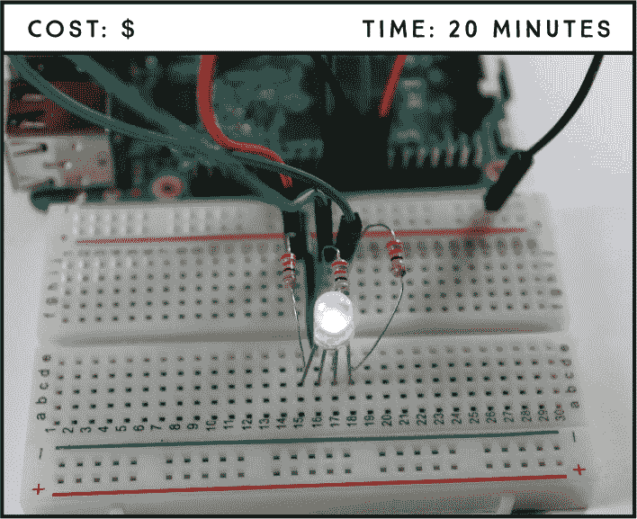

**所需组件**

树莓派

面包板

共阴 RGB LED

三个 330 Ω电阻

跳线

### 介绍 RGB LED

RGB LED 是三个 LED 集成在一个模块中——红色、绿色和蓝色——通过组合这三种颜色，几乎可以产生任何颜色。

使用 RGB LED，你当然可以产生红色、绿色和蓝色光，通过调节每个 LED 的强度，你还可以产生其他颜色。例如，要产生纯蓝色光，你需要将蓝色 LED 设置为最大强度，而将绿色和红色 LED 设置为最小强度。要产生白光，你需要将三个 LED 都设置为最大强度。图 4-1 展示了一个简化的 RGB 色彩混合图，帮助你理解如何结合红色、绿色和蓝色产生不同的颜色。


**图 4-1：** 简单的 RGB 色彩混合

RGB LED 有两种类型：*共阴极*LED，其中每个颜色的 LED 共享一个负极连接，以及*共阳极*LED，其中每个 LED 共享一个正极连接。图 4-2 展示了共阳极和共阴极 LED。


**图 4-2：** 共阳极和共阴极 RGB LED

RGB LED 有四个引脚——每种 LED 一个，还有一个用于共阳极或共阴极的引脚。你可以通过引脚的长度来识别每个引脚，参考图 4-3。


**图 4-3：** 共阳极和共阴极 RGB LED 引脚

当 LED 朝向你时，阳极或阴极（最长引脚）位于左侧第二个位置，引脚的顺序应该是：红色、阳极或阴极、绿色和蓝色。我们将在本项目中使用共阴极 LED，但如果你已经有共阳极 LED，也可以使用它；只需注意电路连接中的差异。

### 电路连接

将 RGB LED 连接到树莓派非常简单，与连接普通 LED 没有太大区别。你需要三个限流电阻——每种 LED 颜色一个。

按照以下说明操作，使用图 4-4 作为参考。

1.  将 LED 引脚连接到面包板，并为每个颜色引脚串联一个 330 Ω限流电阻。

1.  将 GND 连接到面包板的蓝色轨道，并根据下表将 RGB LED 连接到树莓派的 GPIO，红色连接到 GPIO 23，阴极连接到 GND，绿色连接到 GPIO 24，蓝色连接到 GPIO 25。查看图 4-3，确保你正确地定向 LED。

**注意**

如果你使用的是共阳极 RGB LED，请将最长的引脚（阳极）连接到 3.3V。

| **RGB LED** | **树莓派** |
| --- | --- |
| 第一根引脚：红色 | GPIO 23 |
| 第二根引脚：阴极 | GND |
| 第三根引脚：绿色 | GPIO 24 |
| 第四根引脚：蓝色 | GPIO 25 |

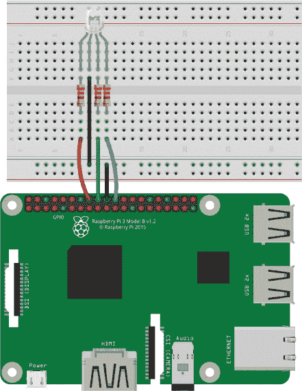

**图 4-4：** 将共阴极 RGB LED 连接到树莓派

### 编写脚本

在你的脚本中，你将使用一个名为 Tkinter 的库来创建一个桌面环境中的用户界面窗口，利用它来控制 RGB LED。Tkinter 已经预装在你的 Raspbian 系统中，所以你只需要在脚本中导入它。

界面窗口将有三个滑块（值范围从`0`到`1`）来控制内置红色、绿色和蓝色 LED 的亮度，并且有一个关闭按钮来退出程序。通过调整滑块的值，你可以改变 RGB LED 的颜色。

现在，打开**Python 3 (IDLE)**，然后进入**文件** ▸ **新建文件**以创建一个新的脚本。接着，将以下代码输入 Python 编辑器，并将脚本保存为*rgb_led_controller.py*，保存在*LEDs*文件夹中（记得你可以从*[`www.nostarch.com/RaspberryPiProject/`](https://www.nostarch.com/RaspberryPiProject/)*下载所有脚本）：

```
  #import necessary libraries
➊ from gpiozero import PWMLED
  from tkinter import *

  #change the RGB LED color
➎ def change_color(self):
      red.value = red_slider.get()
      green.value = green_slider.get()
      blue.value = blue_slider.get()
      print(self)

  #close the window
➌ def close_window():
      window.destroy()

  #create a PWMLED object for each color
➍ red = PWMLED(23)
  green = PWMLED(24)
  blue = PWMLED(25)

  #create window
➎ window = Tk()
  window.title('RGB LED Controller')
  window.geometry('300x200')

  #create three sliders to control each RGB LED lead
➏ red_slider = Scale(window, from_=0, to=1, resolution = 0.01,
  orient=HORIZONTAL, label='Red', troughcolor='red', length=200,
  command=change_color)
  red_slider.pack()

  green_slider = Scale(window, from_=0, to=1, resolution = 0.01,
  orient=HORIZONTAL, label='Green', troughcolor='green', length=200,
  command=change_color)
  green_slider.pack()

  blue_slider = Scale(window, from_=0, to=1, resolution = 0.01,
  orient=HORIZONTAL, label='Blue', troughcolor='blue', length=200,
  command=change_color)
  blue_slider.pack()

  #create close button
➐ close_button = Button(window, text='Close', command=close_window)
  close_button.pack()

➑ mainloop()
```

**用户自定义函数**

要定义一个新函数，你使用关键字`def`，后面跟上你想给该函数起的名称以及一对括号。

在括号后添加一个冒号（`:`），然后告诉函数执行什么操作。Python 通过冒号和缩进来识别哪些操作是函数定义的一部分：冒号后面的每一行缩进代码都属于该函数。之后，你可以通过输入函数名称来运行你在函数内部设置的操作，这也叫做*调用*函数。

首先，你从 gpiozero 库导入`PWMLED`来通过 PWM 控制 LED，然后导入 tkinter 库来构建用户界面➊。接下来，你创建了一个控制 LED 颜色的函数。记住，函数基本上是一个可重用的代码块，用来执行某些操作。Python 有许多内置函数，如`print()`、`int()`和`input()`，你也可以像在这个脚本中那样，自己定义*用户自定义函数*。阅读“用户自定义函数”框了解更多内容。

#### 控制 LED 亮度并关闭窗口

`change_color()`函数➋根据滑块的值变化来改变 LED 的占空比，从而改变 LED 的亮度和产生的颜色。每次滑块移动时都会调用此函数，因此你应该会看到 LED 亮度的即时变化。在➍，你创建了`PWMLED`对象来引用 RGB LED 的每种颜色。

`close_window()`函数➌使用`window.destroy()`关闭窗口。每当你点击 Tkinter 界面中的关闭按钮时，这个函数就会被调用。接下来我们将探讨如何创建 Tkinter 界面。

#### 使用 Tkinter 设计用户界面

在➎，你定义了界面的主窗口。你创建了一个名为`window`的变量，它是一个`tkinter`窗口，通过`window = Tk()`这行代码生成。接着，你为窗口设置了标题，并通过`title()`和`geometry()`方法分别设置了窗口的尺寸。

##### 创建滑块和按钮

创建窗口后，你可以开始添加控件，称为*小部件*，比如按钮、标签和滑块。你使用一个`Button`小部件来关闭窗口，并使用三个`Scale`小部件来将滑块添加到窗口中。

然后，使用以下语法创建三个滑块，每个滑块对应一个 RGB 颜色➏：

```
*slider_name* = Scale(*master*, *option*, *option*, ...)
```

master 参数是你将添加小部件（widget）的窗口，每个选项参数则允许你个性化你的滑块。在*rgb_led_controller.py*脚本中，你使用了以下选项：

+   `from_`定义了范围的下限。

+   `to`定义了范围的上限。在我们的例子中，范围是从 0 到 1。

+   `resolution`设置滑块的分辨率——即两个连续值之间的最小差值。在这里，分辨率是`0.01`。

+   `orient`定义了滑块的方向，可以是`HORIZONTAL`或`VERTICAL`。此脚本将滑块设置为`HORIZONTAL`。

+   `label`设置滑块的标签。你根据每个滑块控制的 LED 颜色为每个滑块加上标签。

+   `troughcolor` 设置滑块的背景颜色。每个滑块的背景颜色与它所控制的 LED 颜色相同。

+   `length` 定义了滑块的长度（以像素为单位）。所有滑块的长度都设置为 `200`。

+   `command` 指定了每次滑动滑块时将调用的过程。在这个案例中，滑动滑块会调用 `change_color()` 函数，它会改变 LED 的占空比，从而改变其发出的颜色。

创建滑块后，你使用 `pack()` 方法将小部件放置在主 `window` 中。由于没有向 `pack()` 方法传递任何参数，因此小部件会根据默认设置放置：小部件只填充它们的最小尺寸，并且它们被放置在窗口的顶部或上面的控件旁边。

接下来，你将使用以下语法创建关闭按钮 ➐：

```
*Button_name* = Button(*master*, *option*, *option*, ...)
```

在你的代码中，你使用了这些选项：

+   `text` 定义了按钮上将显示的文本。

+   `command` 指定了按下按钮时将调用的过程——在这里，是 `close_window()` 函数，它会关闭窗口。

##### 使用主循环

脚本的最后一条语句调用了 `mainloop()` 函数 ➑，这是一个无限循环，允许窗口绘制和事件处理。`mainloop()` 函数是让程序持续运行的关键。

#### 运行脚本

按 **F5** 或者去 **运行** ▸ **运行模块** 来运行脚本。你的界面窗口应该弹出，如 图 4-5 所示。

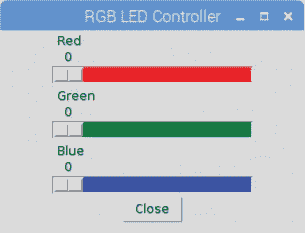

**图 4-5：** RGB LED 控制器用户界面

恭喜！你已经制作了自己的组件用户界面！现在试着移动滑块来改变 LED 的颜色。当你改变每个滑块的位置时，RGB LED 的颜色应该会相应变化。

要关闭程序，只需按下“关闭”按钮。

### 进一步扩展

现在你已经知道如何制作图形用户界面了，我们鼓励你编辑其参数，定制界面外观以符合你的个人喜好。以下是一些你可以尝试的其他项目创意：

+   构建一个图形用户界面，用于控制 LED 的开关。

+   创建一个图形用户界面，用于控制 LED 的亮度。

+   修改用户界面以控制多个 LED。

## 彩虹灯带**

在这个项目中，你将使用一个可寻址的 RGB LED 灯带创建一个彩虹灯光效果。你将使用按钮来启动和停止彩虹效果，并通过两个电位器来控制彩虹的速度和亮度。

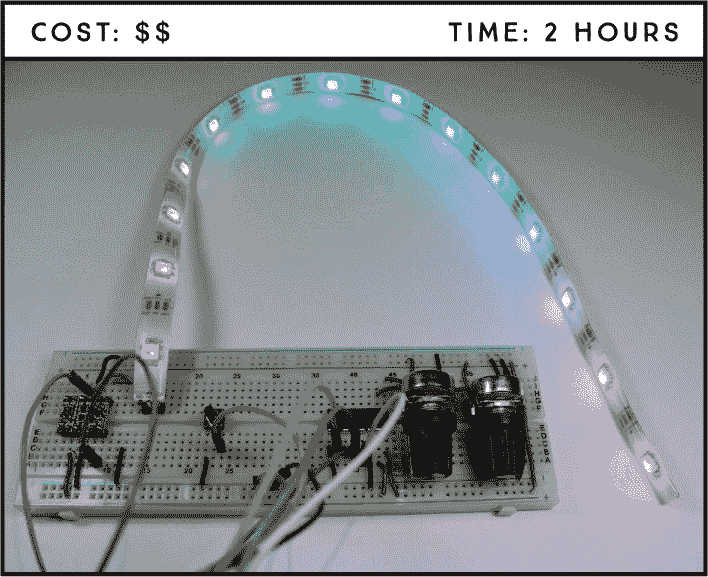

**所需零件**

树莓派

面包板

WS2812B 可寻址 RGB LED 灯带

逻辑电平转换模块 BSS 138

两个 10 kΩ 电位器

MCP 3008 芯片

按钮

三个针脚

跳线

**所需软件**

WS281X 库

### 介绍 WS2812B 可寻址 RGB LED 灯带

对于彩虹灯光效果，你将使用 WS2812B RGB LED 条，该条有多种不同的尺寸可供选择。该条呈卷轴状，如图 5-1 所示，你可以根据需要切割出合适的长度。

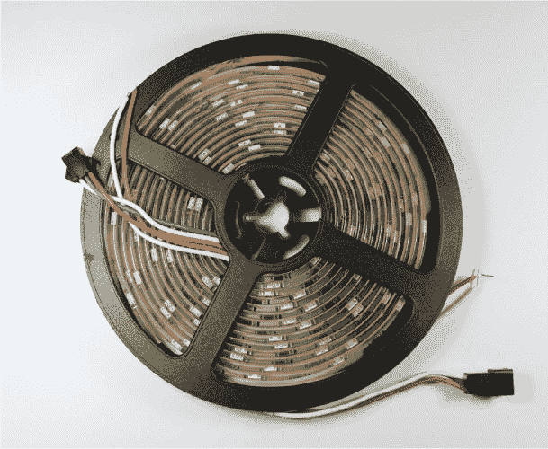

**图 5-1：** 卷轴上的 WS2812B 可寻址 RGB LED 条

图 5-1 中的条形灯长 5 米，包含 300 个串联的可寻址 WS2812B RGB LED，稍后你将切割出 14 个 LED 用于这个项目。条形灯沿整条长度上都有切割标记，如图 5-2 所示。

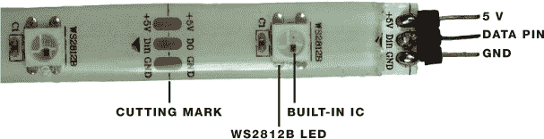

**图 5-2：** WS2812B 可寻址 RGB LED 条的引脚

每个 LED 的颜色和亮度可以单独控制，使你可以轻松制作出惊艳的效果。每个 LED 都内建了一个集成电路（IC），这意味着你可以只通过一个 GPIO 引脚来控制整个条形灯，该引脚连接到条形灯末端的中间引脚——数据引脚（见图 5-2）。

按照以下步骤为这个项目准备 LED 条：

1.  沿着条形灯上的切割标记切割 14 个 LED。

1.  根据图 5-2 所示，将引脚焊接到 5V、数据和 GND 引脚。

**注意**

*我们发现，树莓派的 5V 引脚（例如引脚 2 或引脚 4）能够为 20 个或更少的 LED 提供电力，但在使用较长条形灯的项目中，你需要使用外部的 5V 电源来提供足够的电流。*

现在你需要确定电源。LED 条需要一个 5V 的电源。你可以通过每个 LED 所需的功率来确定所需的电流。每个 LED 在全亮状态下（即产生白光时）最多消耗 60 mA，但由于你不太可能长时间让所有 LED 都达到最大亮度，因此可以安全地估计每个 LED 需要 20 mA 的电流。所以，如果你的条形灯有 14 个 LED，你将需要一个大约为 20 × 14 = 280 mA 的 5V 电源。

控制条形灯的数据引脚需要 5V 信号，但树莓派的 GPIO 引脚工作在 3.3V 电压下。为了获得所需的 5V 信号，你将使用一个名为逻辑电平转换器的组件。

### 引入逻辑电平转换器

*逻辑电平转换器*可以将 3.3V 信号转换为 5V 信号。逻辑电平转换器有很多种类型，但在这个项目中你将使用图 5-3 中所示的双通道逻辑电平转换器双向模块。（要找到与我们使用的相同的逻辑电平转换器模块，可以在线搜索*logic level converter module bss138*。）

该模块的双向性允许你双向转换数据——从 3.3 V 转换到 5 V，或从 5 V 转换到 3.3 V。在这个项目中，你不需要将 5 V 转换为 3.3 V，但在你的工具包中拥有这个更灵活的模型（相较于单向模型）将来对其他项目可能会很有帮助。这个逻辑电平转换器还有两个通道，通道 1 和通道 2。在这个项目中，你只需使用其中一个通道来控制 LED 灯带的数据引脚。

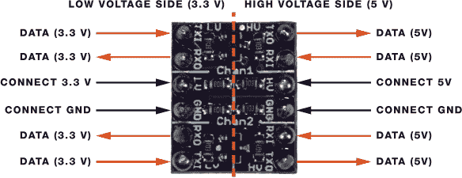

**图 5-3：** 双通道逻辑电平转换器双向模块

很可能你的模块会配有分离的引脚排针，因此你需要将引脚焊接到模块上，使其适合面包板。取下两排六个引脚的排针，并将每个引脚焊接到每个小孔上。

该模块有一个低电压端（图 5-3 左侧），你需要将所有 3.3 V 的设备连接到此端，而高电压端（右侧）用于连接 5 V 的设备。在这个项目中，你需要使用标红的引脚之一，因为你要发送 3.3 V 数据并将其转换为 5 V。

要使用逻辑电平转换器，首先将两侧的 GND 引脚连接在一起，将低电压侧的 3.3 V 和高电压侧的 5 V 连接好。然后，将 Pi 的数据连接到 TX1 引脚之一——你可以选择通道 1 或通道 2——并在相应的 TX0 引脚上获取 5 V 数据。

### 连接电路

此时，你应该已经将 LED 灯带剪裁成所需的尺寸（14 个 LED），并已将排针焊接到灯带的末端以及逻辑电平转换器上。现在，你可以开始连接电路了。为此，你需要将一个按钮、两个电位计通过 MCP3008 芯片连接起来，并使用逻辑电平转换器模块将可寻址 RGB LED 灯带连接在一起，如图 5-4 所示。

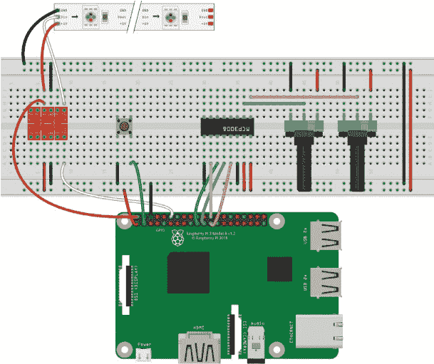

**图 5-4：** 控制 RGB LED 灯带的电路

**警告**

*请记住，你不能将 5 V 连接到 Pi 的 GPIO 引脚，因为那样可能会永久损坏你的板子。*

**注意**

*要识别 MCP3008 引脚，定位芯片，使其正面朝向你，顶部有一个半圆形的缺口。第一个引脚在左上角，最后一个引脚在右上角。有关完整的 MCP3008 引脚图，请参见“模拟到数字转换器”第 55 页。*

1.  将 GND 和 3.3 V 引脚连接到面包板的轨道。

1.  将 MCP3008 芯片插入面包板的中间，两侧跨越中心隔板。

1.  将两个电位计插入面包板，将一个的外引脚连接到 GND，另一个的外引脚连接到 3.3 V。

1.  按照下表连接 MCP3008 芯片。连接哪个电位计到哪个引脚并不重要，它们的工作方式相同。

    | **MCP3008** | **连接到** |
    | --- | --- |
    | 1 | 一个电位计的中间引脚 |
    | 2 | 另一个电位计的中间引脚 |
    | 9 | GND |
    | 10 | GPIO 8 |
    | 11 | GPIO 10 |
    | 12 | GPIO 9 |
    | 13 | GPIO 11 |
    | 14 | GND |
    | 15 | 3.3 V |
    | 16 | 3.3 V |

1.  将一个按键插入面包板，跨过中间分隔线。在中间分隔线的一侧，将一个引脚连接到 GND，另一个引脚连接到 GPIO 2。

1.  将 RGB LED 条形灯的引脚插入面包板。

1.  将逻辑电平转换器插入面包板。按照指示连接低电压端。

    | **逻辑电平转换器** | **树莓派** |
    | --- | --- |
    | TX1 (通道 2) | GPIO 18 |
    | LV | 3.3 V |
    | GND | GND |

1.  按照指示连接高电压端。

    | **逻辑电平转换器** | **连接到** |
    | --- | --- |
    | TX0 (通道 2) | RGB LED 条形灯的数据引脚（中间引脚） |
    | HV | 5 V |
    | GND | GND |

1.  连接好逻辑电平转换器后，按指示连接 RGB LED 条形灯。

    | **RGB LED 条形灯** | **连接到** |
    | --- | --- |
    | 5 V | 5 V |
    | Din | 逻辑电平转换器 TX0 引脚 |
    | GND | GND |

**注意**

*如果您选择使用超过 20 个 LED 的条形灯做这个项目，您需要将 5 V 电源连接到条形灯的 5 V 引脚，将 GND 电源连接到 GND 导轨。*

### 编写脚本

该脚本依赖于 WS281X 库来控制各个 LED，因此您需要先安装该库，然后启用串行外设接口（SPI）通信，条形灯需要通过 SPI 与树莓派进行通信。

#### 安装 WS281X 库

安装 WS281X 库有几个步骤，因为它需要您首先设置其依赖的库。

1.  打开终端窗口并安装 scons、python3-dev 和 swig 库：

    ```
    pi@raspberrypi:~ $ sudo apt install scons python3-dev swig
    ```

1.  仍然在终端中，导航到桌面，创建一个名为 *Libraries* 的文件夹，然后进入新创建的文件夹：

    ```
    pi@raspberrypi:~ $ cd ~/Desktop
    pi@raspberrypi:~/Desktop $ mkdir Libraries
    pi@raspberrypi:~/Desktop $ cd Libraries
    pi@raspberrypi:~/Desktop/Libraries $
    ```

1.  克隆该库以进行下载。

    ```
    pi@raspberrypi:~/Desktop/Libraries $ git clone https://
    github.com/jgarff/rpi_ws281x.git
    ```

1.  转到 *rpi_ws281x* 库文件夹并运行 `scons` 命令：

    ```
    pi@raspberrypi:~/Desktop/Libraries $ cd rpi_ws281x
    pi@raspberrypi:~/Desktop/Libraries/rpi_ws281x $ sudo scons
    ```

1.  转到 *python* 文件夹并在树莓派上安装 WS281X 库：

    ```
    pi@raspberrypi:~/Desktop/Libraries/rpi_ws281x $ cd python
    pi@raspberrypi:~/Desktop/Libraries/rpi_ws281x/python $ sudo
    python3 setup.py install
    ```

现在您已经准备好在代码中使用 WS281X 库。

#### 启用 SPI 通信

要与 MCP3008 芯片通信，您需要启用 SPI 通信。打开任务栏主菜单，选择 **首选项** ▸ **树莓派配置**。在“接口”选项卡中，点击 SPI 行中的 **启用**，如 图 5-5 所示，然后点击 **确定**。

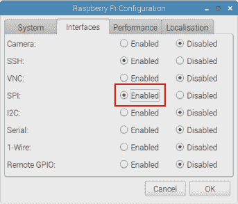

**图 5-5：** 启用 SPI 通信

#### 输入脚本

让我们回顾一下电路如何工作，以便在输入脚本之前帮助您更好地理解：

+   您的 RGB LED 条形灯将显示一个移动的彩虹。

+   一个电位器控制彩虹动画的速度。

+   另一个电位器控制彩虹的亮度。

+   按键用于启动和停止彩虹动画。

**故障排除：像素乱跳**

在写本文时，较新版本的 Raspbian 存在条形灯像素的问题。用于控制条形灯的引脚与模拟音频输出共享，因此像素可能会出现问题并无法正常工作。如果在加载代码时发生这种情况，您需要在 *config.txt* 文件中添加两行。进入终端并输入以下内容：

```
pi@raspberrypi:~ $ sudo nano /boot/config.txt
```

在打开的文件中，添加以下两行（可以放在任何位置）：

```
hdmi_force_hotplug = 1
hdmi_force_edid_audio = 1
```

按下 CTRL-X 保存文件，然后在提示时输入**Y**并按回车键。重新启动你的 Pi，使更改生效，然后继续进行库的安装。

打开**Python 3 (IDLE)**，然后进入**文件** ▸ **新建文件**来创建一个新的脚本。将列表 5-1 中的代码复制到 Python 编辑器中，并将脚本保存在*LEDs*文件夹内，命名为*rainbow_effect.py*（记得你可以在*[`www.nostarch.com/RaspberryPiProject/`](https://www.nostarch.com/RaspberryPiProject/)*下载所有脚本）：

**列表 5-1：** 彩虹灯带*rainbow_effect.py*代码

```
  #based on Tony DiCola's NeoPixel library strandtest example

  #import necessary libraries
➊ from neopixel import *
  from time import sleep
  from gpiozero import Button, MCP3008

  #LED strip configuration
➋ LED_COUNT = 14 #number of LED pixels
  LED_PIN = 18 #GPIO pin connected to the pixels (must support PWM!)
  LED_FREQ_HZ = 800000 #LED signal frequency in Hz (usually 800 kHz)
  LED_DMA = 5 #DMA channel to use for generating signal (try 5)
  LED_INVERT = False #set True to invert the signal

  #create pot objects to refer to MCP3008 channel 0 and 1
➌ pot_brightness = MCP3008(0)
  pot_speed = MCP3008(1)

  #connect pushbutton to GPIO 2, pull-up
  button_start = Button(2)

  #animation running control variable
  running_animation = False

  #generate rainbow colors across 0-255 positions
➍ def wheel(pos):
      if pos < 85:
          return Color(pos * 3, 255 - pos * 3, 0)
      elif pos < 170:
          pos -= 85
          return Color(255 - pos * 3, 0, pos * 3)
      else:
          pos -= 170
          return Color(0, pos * 3, 255 - pos * 3)

  #draw rainbow that uniformly distributes itself across all pixels
➎ def rainbowCycle(strip):
      for j in range(256):
          for i in range(strip.numPixels()):
              strip.setPixelColor(i, wheel((int(i * 256 /
  strip.numPixels()) + j) & 255))
          strip.show()
➏         sleep((pot_speed.value*40)/1000.0)

  #function to start and stop the animation
➐ def start_animation():
      global running_animation
      if running_animation == True:
          running_animation = False
      else:
          running_animation = True

  #assign a function that runs when the button is pressed
➑ button_start.when_pressed = start_animation

  #create NeoPixel object with appropriate configuration
➒ strip = Adafruit_NeoPixel(LED_COUNT, LED_PIN, LED_FREQ_HZ, LED_DMA,
  LED_INVERT, int(pot_brightness.value*255))

  #initialize the strip
  strip.begin()
➓ while True:
      if running_animation == True:
          #set LED strip brightness
          strip.setBrightness(int(pot_brightness.value*255))
          rainbowCycle(strip)
```

首先，你导入你将用于控制项目的库 ➊。你需要 neopixel 库来控制 LED 灯带，time 库来导入`sleep()`函数以控制延迟时间，另外从 gpiozero 库导入`Button()`和`MCP3008()`接口，用于分别读取按钮和电位器的值。

##### 设置灯带参数

在➋处，你创建了配置 RGB LED 灯带的变量，包括 LED 的数量和所使用的 GPIO 引脚。然后，在➌处，你创建了用于表示两个电位器的对象，一个是 MCP3008 通道 0（引脚 1）上的亮度，另一个是 MCP3008 通道 1（引脚 2）上的速度，还有一个对象用于 GPIO 2 上的按钮。你还创建了一个名为`running_animation`的变量，用于启动和停止动画，它是一个布尔值，默认值为`False`（关闭）。

##### 创建彩虹效果函数

在➋和➎处，你创建了产生移动彩虹效果的函数。这些函数与 neopixel 库自带的*strandtest.py*示例中使用的函数相同。简单来说，`wheel()`函数通过将每个颜色参数在 0 到 255 之间变化来生成颜色光谱。每种颜色由红色、绿色和蓝色（RGB）参数组成，通过在 0 到 255 之间变化这些参数会产生不同的颜色，进而实现彩虹效果。`rainbowCycle()`函数则在你的 LED 灯带的数量上分布彩虹效果。

➏处的这一行设置了`sleep()`函数的延迟时间。为了计算延迟时间，你将从一个电位器读取的值（范围在 0 到 1 之间）乘以 40，然后将结果除以 1,000。将电位器的值乘以 40 可以产生明显的延迟时间，否则延迟时间会太短，导致彩虹效果太快，你来不及看到灯光的变化。除以 1,000 会将延迟时间转换为毫秒。

##### 控制按钮

使用 gpiozero 库，你可以将特定的动作分配给按钮按下事件，方法如下：

```
button.when_pressed = *function_name*
```

`function_name`函数是指一个通用函数，当按钮被按下时会被调用；该函数必须在被调用之前定义。在这个案例中，那个函数是`start_animation` ➑，在➐处定义。注意`function_name`后面没有括号。这是因为我们只是将一个函数赋值给另一个函数，而不是直接运行它。在我们的例子中，我们告诉代码当触发`button_start.when_pressed`函数时运行`start_animation`函数。

当按钮被按下时，`running_animation`值会变化。当`running_animation`变量为`False`且按钮被按下时，它会变为`True`，反之亦然。这样你就可以启动和停止彩虹效果。

##### 使用 while 循环控制动画

在➒处，你创建了一个名为`strip`的`Adafruit_Neopixel`对象，它接收你之前在➋处定义的条带参数。为了控制条带 LED 的亮度，你使用`int(pot_brightness.value*255)`。亮度根据从一个电位器读取的值（在 0 和 1 之间）来变化。你将这个值乘以 255，因为条带 LED 的亮度范围是 0 到 255。使用`int()`函数将数字四舍五入为整数。这样，你就可以通过旋转电位器来调整 LED 亮度。

然后，你使用`strip.begin()`，这是在对`Adafruit_Neopixel`对象进行其他调用之前必须先调用的。

`while`循环 ➓ 使程序持续运行。接着，在开始动画之前，你设置条带的亮度。如果`running_animation`变量等于`True`，`rainbowCycle()`函数将运行，启动动画。如果你按下按钮，`running_animation`变量会变为`False`，动画停止。

#### 运行脚本

要运行这个脚本，你需要使用终端窗口。从 Python 3 IDLE 编辑器运行会导致权限错误。

将脚本保存为*rainbow_effect.py*，放在*Projects*目录中的*LEDs*文件夹内，然后打开终端。接着，导航到*LEDs*文件夹并运行脚本：

```
pi@raspberrypi:~ $ cd ~/Desktop/Projects/LEDs
pi@raspberrypi:~/Desktop/Projects/LEDs $ sudo python3
rainbow_effect.py
```

现在，你可以通过旋转各自的电位器来控制速度和亮度，按下按钮则可以停止和启动动画。

恭喜！你为你的家增添了一个超棒的装饰！

### 进一步探索

这里有一些简单的想法，你可以尝试一下，如果你想增加对条带的控制能力：

+   在条带的中间点亮一个特定的 LED。

+   将所有 LED 点亮为一个单一的颜色。

+   添加一个按钮来切换预设效果。

+   像圣诞灯一样闪烁 LED。

+   发明你自己的效果。
