## 第三章：显示屏

## **LCD 提醒**

在这个项目中，你将把一个字符型 LCD 连接到树莓派上，以显示滚动的提醒信息。你将首先显示短消息的静态文本，然后学习如何显示适合长消息的滚动文本。

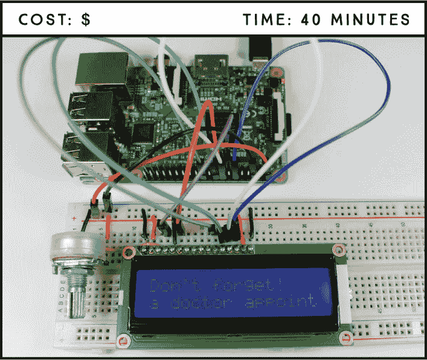

**所需部件**

树莓派

面包板

16×2 Hitachi HD44780 兼容 LCD

10 kΩ 可调电阻

跳线线

**所需软件**

Adafruit_CharLCD 库

### 液晶显示屏介绍

最简单且最便宜的显示屏是 *液晶显示器（LCD）*。LCD 广泛应用于日常电子设备中，如自动售货机、计算器（见 图 6-1）、停车计时器和打印机，非常适合显示文本或小图标。

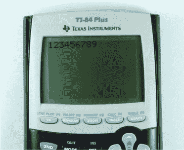

**图 6-1：** 带 LCD 的计算器

LCD 的大小是根据屏幕上能够显示的字符的行数和列数来测量的。一个 16×2 的 LCD 可以显示 2 行每行 16 个字符。你会找到从 8×1 到 40×4 不等的不同尺寸。

LCD 还可以在背景颜色上有所不同。你可以找到各种各样的背景颜色，包括 RGB 背景灯，允许你创建任何颜色。

最常见的 LCD 模块使用的是 Hitachi HD44780 芯片，它允许你使用自定义字符。图 6-2 展示了一个标准的 16×2 Hitachi HD44780 兼容 LCD；我们建议在本项目中使用这种类型。大多数 16×2 屏幕是兼容的，但在购买之前，最好检查一下该部件的数据手册以确保兼容性。你也可以使用 20×4 的 LCD，只要它们是 Hitachi HD44780 兼容的。

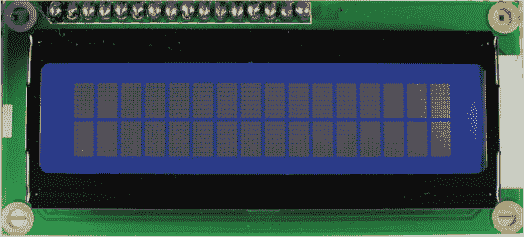

**图 6-2：** 标准 16×2 Hitachi HD44780 兼容 LCD

如果你仔细查看 图 6-2，你会看到由 5×8 像素组成的 32 个矩形。开关像素的组合构成了字符形状。

#### 焊接插针

更有可能的是，你的 LCD 模块将带有单独的插针，如 图 6-3 所示。你需要将插针焊接到模块上，以使其适用于面包板。将插针放入可用的孔中——每个 16 个孔中应有 16 个插针——长端朝下并将其焊接到位。

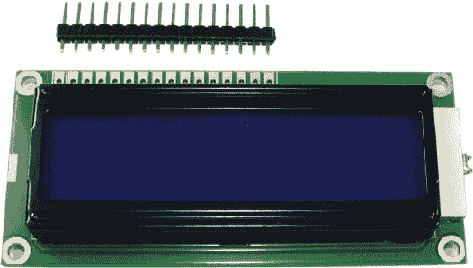

**图 6-3：** 带有单独插针的 LCD

#### LCD 模块引脚图

LCD 模块的引脚编号从 1 到 16，当引脚位于屏幕上方时，从左到右排列：

| **PIN** | **符号** | **描述** |
| --- | --- | --- |
| 1 | VSS | 地 |
| 2 | VDD | 电源 |
| 3 | V0 | 对比度调整 |
| 4 | RS | 寄存器选择 |
| 5 | R/W | 读/写选择 |
| 6 | E | 启用 |
| 7–14 | DB0–DB7 | 数据引脚 |
| 15 | LEDA | 背光阳极（5V） |
| 16 | LEDK | 背光阴极（–） |

**警告**

*树莓派的 GPIO 设计为 3.3V，但大多数 LCD 为 5V。只要您仅从树莓派发送数据而不是从屏幕读取数据到树莓派，这不是问题。使用 5V 屏幕时，*请勿将显示器的 R/W 引脚连接到树莓派。* 该引脚以 5V 发送数据，很可能会烧坏您的树莓派！*

VSS 是接地引脚，应连接到 GND。VDD 是电源引脚，应该根据 LCD 的类型连接到 5V 或 3.3V；大多数需要 5V。

V0 允许您在 LCD 连接到电位器时调整字符与背光之间的对比度。

RS、R/W 和 E 是控制引脚。仅使用屏幕显示文本时（如本项目所示），应将 R/W 引脚永久连接到地面；换句话说，您将只向 LCD 写入数据，而不从中读取数据。

引脚 7 到 14 是数据引脚，用于发送信息。引脚 15 和 16 是背光的阳极和阴极。

尽管 LCD 模块有 16 个引脚，但您只需要其中的 6 个来与树莓派通信：4、6、11、12、13 和 14。

### 接线您的电路

现在您的 LCD 已准备好使用，可以开始构建此项目的电路。按照以下步骤连接 LCD 和树莓派，并参考图 6-4 的电路图进行接线。

1.  将面包板的电源轨连接到 5V 和 GND。

1.  要为 LCD 供电，将 5V 从电源轨连接到 LCD 引脚 2（VDD）和 LCD 引脚 15（LEDA）。将 LCD 引脚 1（VSS）、引脚 5（R/W）和引脚 16（LEDK）连接到面包板的 GND 轨。

1.  添加一个电位器来调整对比度：将一个外部引脚连接到 GND，另一个外部引脚连接到 5V，然后将中间引脚连接到 LCD 引脚 3（V0）。

1.  按照下表连接树莓派的 GPIO 引脚。

| **LCD** | **树莓派** |
| --- | --- |
| 4 (RS) | GPIO 27 |
| 6 (E) | GPIO 22 |
| 11 (DB4) | GPIO 25 |
| 12 (DB5) | GPIO 24 |
| 13 (DB6) | GPIO 23 |
| 14 (DB7) | GPIO 18 |

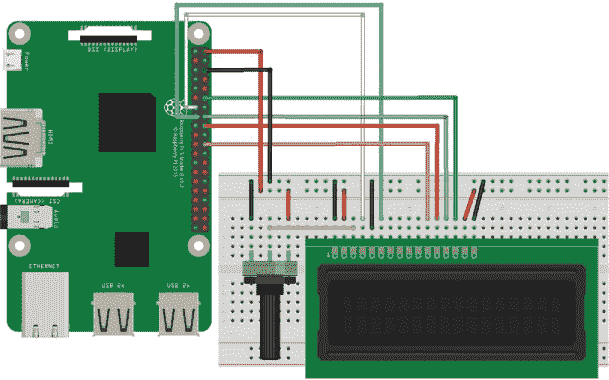

**图 6-4：** LCD 与树莓派的接线

完成接线后，尝试旋转电位器调整 LCD 的对比度；您应该能看到背光变化。如果对比度没有变化，请在继续之前仔细检查接线。

### 编写脚本

在编写脚本以在 LCD 上显示消息之前，您需要安装字符 LCD 的 Python 库 Adafruit_CharLCD。该库具有许多功能，便于控制 LCD。

#### 为字符 LCD 安装 Python 库

打开树莓派桌面任务栏中的终端。在安装 Adafruit_CharLCD 库之前，您需要安装以下依赖项：

```
pi@raspberrypi:~ $ sudo apt update
pi@raspberrypi:~ $ sudo apt install build-essential python3
python-dev python-smbus python3-pip git-core
```

当提示时，输入 y 并按下 ENTER。

导航到桌面，创建一个名为*Libraries*的文件夹，然后使用以下命令更改目录到新创建的文件夹：

```
pi@raspberrypi:~ $ cd ~/Desktop
pi@raspberrypi:~/Desktop $ mkdir Libraries
pi@raspberrypi:~/Desktop $ cd Libraries
pi@raspberrypi:~/Desktop/Libraries $
```

通过输入以下命令下载安装文件：

```
pi@raspberrypi:~/Desktop/Libraries $ git clone https://github.com/
adafruit/Adafruit_Python_CharLCD.git
```

导航到 *Adafruit_Python_CharLCD* 目录：

```
pi@raspberrypi:~/Desktop/Libraries $ cd Adafruit_Python_CharLCD
```

最后，执行以下命令来安装 Adafruit_CharLCD 库：

```
pi@raspberrypi:~/Desktop/Libraries/Adafruit_Python_CharLCD $ sudo
python3 setup.py install
```

恭喜你！你成功安装了字符 LCD 的 Python 库。我们鼓励你浏览 *Examples* 文件夹并看看。

#### 显示字符消息

转到你的 *Projects* 文件夹，并创建一个名为 *Displays* 的新文件夹。打开 **Python 3 (IDLE)**，并转到 **文件** ▸ **新建文件** 创建一个新脚本。然后，将以下代码输入到 Python 编辑器中，并将脚本保存为 *character_lcd.py*（记得你可以在 *[`www.nostarch.com/RaspberryPiProject/`](https://www.nostarch.com/RaspberryPiProject/)* 下载所有脚本）：

```
➊ import Adafruit_CharLCD as LCD

  #Raspberry Pi pin configuration
➋ lcd_rs = 27
  lcd_en = 22
  lcd_d4 = 25
  lcd_d5 = 24
  lcd_d6 = 23
  lcd_d7 = 18
  lcd_backlight = 4

  #define the LCD size
➌ lcd_columns = 16
  lcd_rows = 2

  #initialize the LCD
➍ lcd = LCD.Adafruit_CharLCD(lcd_rs, lcd_en, lcd_d4, lcd_d5, lcd_d6, 
  lcd_d7, lcd_columns, lcd_rows, lcd_backlight)

  #write your message
➎ lcd.message('It works\nYou rock!')
```

你首先在➊导入之前安装的字符 LCD 库。然后，在➋配置你的 Pi 引脚。在➌定义你的 LCD 大小。如果你使用的是 20×4 的 LCD，需要相应地更改这两行代码。

之后，LCD 在 ➍ 初始化，你在函数 `lcd.message('`string`')` 中写下你的消息，消息放在单引号之间 ➎。`\n` 转义字符告诉 LCD 在下一行显示随后的文本。随时可以更改这个消息为你喜欢的任何内容！

按 **F5** 或转到 **运行** ▸ **运行模块** 来运行脚本，你的 LCD 应显示文本，如图 6-5 所示。

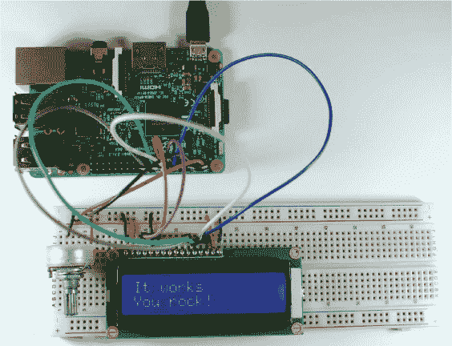

**图 6-5：** 显示静态消息的电路

#### 添加其他功能

了解一些其他有用的函数是值得的，你可以用它们做的不仅仅是显示文本；例如，你可能想将光标设置到某个位置，或者清除显示以准备新消息。你安装的库为你提供了以下功能：

+   `lcd.message(`string`)` 显示括号中写的消息。

+   `lcd.clear()` 清除显示。

+   `lcd.show_cursor(`boolean`)` 在消息后显示光标。

+   `lcd.blink(`boolean`)` 显示一个闪烁的光标。

+   `lcd.move_right()` 将显示的消息向右移动一个字符。

+   `lcd.move_left()` 将显示的消息向左移动一个字符。

+   `lcd.home()` 将光标设置到第一列和第一行（0,0）。

+   `lcd.set_cursor(int, int)` 将光标设置到指定的列和行。例如，`lcd.set_cursor(2, 1)` 将光标设置到第三列和第二行。

斜体中的数据类型告诉你需要输入什么类型的值作为参数；例如，布尔值可以输入 `True` 或 `False`。

#### 滚动提醒消息

这个 LCD 屏幕相当小，所以如果你尝试显示超过 32 个字符的消息，显示会卡住。因此，现在我们将向你展示如何编写一个脚本，显示一个较长的滚动消息，就像一个你不能错过的医生预约提醒。在第一行，你将有一个消息的标题，比如“提醒”或者“别忘了”，第二行则是你的提醒消息会滚动显示。

显示滚动消息并不像显示静态消息那样简单，所以在编写代码之前，让我们思考一下我们想要发生什么：

+   第一行显示静态标题。

+   第二行显示滚动消息。

+   滚动消息从右向左移动。

+   字符应从最右侧的列出现。

+   字符应在最左侧的列消失。

消息会永远滚动，直到被停止。在 *Displays* 文件夹内，创建一个新的 **Python 3 (IDLE)** 脚本，命名为 *scrolling_text.py*，并输入以下代码：

```
  import Adafruit_CharLCD as LCD
➊ import time

  #Raspberry Pi pin configuration
  lcd_rs = 27
  lcd_en = 22
  lcd_d4 = 25
  lcd_d5 = 24
  lcd_d6 = 23
  lcd_d7 = 18
  lcd_backlight = 4

  #define the LCD size
  lcd_columns = 16
  lcd_rows = 2

  #initialize the LCD
  lcd = LCD.Adafruit_CharLCD(lcd_rs, lcd_en, lcd_d4, lcd_d5, lcd_d6,
  lcd_d7, lcd_columns, lcd_rows, lcd_backlight)

  #write your message
➋ title = "Don't forget!"
➌ reminder = "You have a doctor appointment next Monday"

  #set the delay for scroll
➍ delay = 0.3

  #write a function to scroll the message
➎ def scroll_message(reminder, delay):
      padding = ' ' * lcd_columns
      reminder_message = padding + reminder + ' '
    ➏ for i in range(len(reminder_message)):
          lcd.set_cursor(0, 1)
          lcd.message(reminder_message[i:(i+lcd_columns)])
          time.sleep(delay)

➐ lcd.clear()
  lcd.home()
  lcd.message(title)

  #scroll the message in an infinite loop
➑ while True:
      scroll_message(reminder, delay)
```

你已经熟悉导入 Adafruit_CharLCD 库、配置 Raspberry Pi 引脚、定义屏幕大小和初始化 LCD。

对于这个示例，你还需要导入时间库 ➊ 来使用与时间相关的函数。在 ➋ 和 ➌ 处，你分别为将要显示的标题和提醒消息分配文本。`delay` ➍ 是角色在移动到左侧一个字符之前停留在一个位置的时间。在这个例子中，你将延迟设置为 `0.3` 秒；延迟越小，文本滚动越快。

在 ➎ 处，你创建一个名为 `scroll_message(``*string*, *float*)` 的函数，该函数接受两个参数：一个字符串作为你的 `reminder`，和一个浮动数值作为 `delay`。在函数内部，你首先创建一个 `padding` 变量，它由若干个空白字符组成，空白字符的数量与 LCD 的列数相等。这将最初填满所有字符槽，创造字符逐渐出现的错觉。接着，你创建一个名为 `reminder_message` 的新变量，它是 `padding`、`reminder` 和一个空格的连接。你需要添加这个额外的空格来创造 `reminder_message` 消失的效果。

该函数通过一个 `for` ➏ 循环从 `0` 到 `reminder_message` 的长度进行循环。函数 `len(`object`)` 返回一个对象的长度——在这个例子中，就是 `reminder_message` 字符串中的字符数量，这告诉我们循环的次数。

**注意**

*Python 使用* 从零开始的索引，*这意味着索引从零开始计数。例如，字符串的第一个字符的索引是 `0`。*

在循环内部，代码首先设置光标到第一列、第二行的位置，你希望开始显示提醒的地方。在下一行，`reminder_message[i:(i+lcd_columns)]` 截取你的 `reminder_message`，返回从索引 `i` 到索引 `i+lcd_columns` 之间的字符（不包括 `i+lcd_columns`）。

每次循环运行时，你将显示消息的不同部分；这就是实际产生滚动效果的原因（见 图 6-6）。

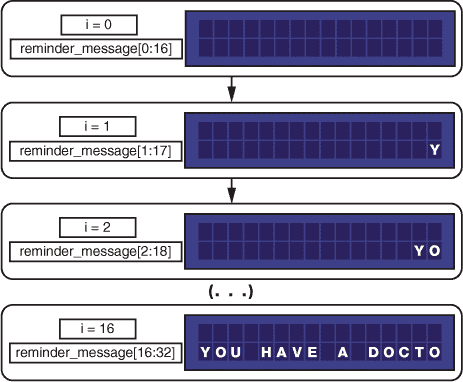

**图 6-6：** 截断字符串以产生滚动效果

显示完整消息后，代码会等待 `delay` 变量中分配的秒数。

在 ➐ 处，你清除屏幕，并从第一列、第一行显示 `title` 消息。

最后，在 ➑ 处，你创建了一个始终为 `True` 的 `while` 循环。这是一个小技巧，让某个程序永远运行下去。在这个循环内部，你调用函数 `scroll_message(``*string*, *float*)`，并传入你自己的参数：`reminder` 和 `delay`。

#### 运行脚本

按**F5**键或进入**运行** ▸ **运行模块**来运行脚本。不幸的是，我们无法展示书中文字的滚动效果，但你大致能理解！

### 进一步深入

我们建议你根据你在此处以及之前学到的编码技巧，修改我们提供的示例脚本，并尝试使用 “添加其他功能” 中展示的函数，这些内容出现在 第 91 页，以熟悉 LCD。当你完成后，下面是一些可以尝试的项目：

+   使用 LCD 显示屏构建天气预报器——查看 项目 7，我们将展示如何获取天气数据。

+   根据天气情况显示消息，例如“别忘了带伞。”

+   在 LCD 上显示传感器数据——查看 项目 9–12，学习如何读取传感器数据。

## Mini Weather Forecaster**

在这个项目中，你将构建一个天气预报器，显示你所在地当天的天气信息。你将学习如何发出 API 请求，这对于依赖频繁更新数据的项目非常有用，并且学习如何使用 OLED 显示屏。

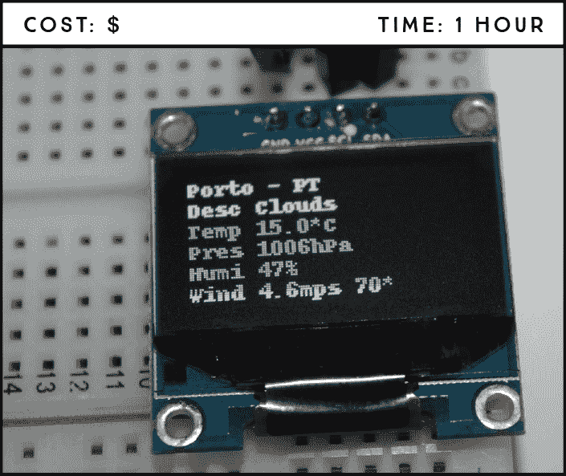

**所需部件**

树莓派

面包板

0.96 英寸 OLED 显示屏

跳线

**所需软件**

Adafruit_SSD1306 库

### 介绍 OLED 显示屏

本项目使用的 *有机发光二极管（OLED）* 显示屏是 SSD1306 型号：一款单色、0.96 英寸、128×64 像素的显示屏，如 图 7-1 所示。与 LCD 显示屏相比，LCD 每个字符预留了 5×8 像素的空间，而 OLED 显示屏更为灵活。它允许您选择哪些像素是开（点亮）或关（熄灭）的，能够在显示屏的任意位置生成自定义文本和图像。OLED 显示屏也不需要背光，因此在暗环境中对比度很好。此外，OLED 的像素仅在点亮时消耗电能，因此它比 LCD 显示屏消耗更少的电量。

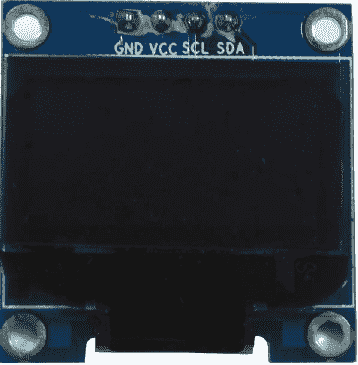

**图 7-1：** SSD1306 0.96 英寸单色 OLED 显示屏

**注意**

*一些 OLED 显示屏使用 SPI 通信而不是 I²C—这些显示屏会有一组不同的引脚。在购买 OLED 显示屏之前，请务必检查引脚布局。*

该 OLED 显示屏通常有四个引脚，GND、VCC、SCL 和 SDA（见 图 7-1），但您可能会发现一些型号额外配有复位引脚。有些显示屏的引脚顺序也可能不同—VCC、GND、SCL、SDA—因此在按照本项目说明操作时，请注意查看标签。

图 7-1 中的 OLED 显示屏使用内部集成电路（I²C）通信协议与树莓派进行通信，您需要使用 SDA 和 SCL 引脚（分别为 GPIO 2 和 GPIO 3）。

### 使用 OpenWeatherMap API

应用程序编程接口（API）是一组由软件开发人员编写的函数，用于使任何人都能使用他们的数据或服务。例如，OpenWeatherMap 项目 (*[`openweathermap.org/`](https://openweathermap.org/)* ) 提供了一个 API，允许用户使用多种编程语言请求天气数据。在本项目中，您将使用该 API 请求所选位置的天气预报。学习如何使用 API 与树莓派配合工作是一项很棒的技能，因为它可以让您访问各种不断变化的信息，如当前股价、货币兑换率、最新新闻、交通更新、推文等。

OpenWeatherMap 的免费计划提供了完成此项目所需的一切。要使用 API，您需要一个 API 密钥，称为 *APIID*。获取 APIID 的方法：

1.  打开浏览器，访问 *[`openweathermap.org/appid/`](https://openweathermap.org/appid/)。

1.  按下 **注册** 按钮并创建一个免费账户。

1.  您将看到一个包含多个标签的仪表板。选择 **API 密钥** 标签，如 图 7-2 所示。

    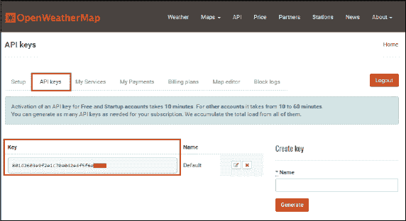

    **图 7-2：** OpenWeatherMap 的 API 密钥

1.  在 API 密钥标签页中，你将看到一个默认的密钥（如图 7-2 所示）；这是你需要从网站提取信息的唯一密钥。复制并粘贴此密钥到某个地方，稍后你会用到它。如果你喜欢，可以为每个单独的项目创建一个新密钥，但如果你不熟悉使用 API，我们建议你直接使用默认密钥。

1.  要获取你选择位置的天气信息，请输入以下 URL：

    ```
    http://api.openweathermap.org/data/2.5/weather?q=*your_city*,
    *your_country_code*&APPID=*your_unique_API_key*
    ```

    **警告**

    *API 对用户是唯一的，不应与他人共享。在这种情况下，拥有你 API 密钥的人只能请求天气信息，但如果你在使用社交媒体 API 时，可能会遇到安全问题——例如，陌生人获取你的个人信息。不要与任何人分享你的 API 密钥。*

    将 your_city 替换为你想要获取数据的城市，将 your_country_code 替换为该城市的国家代码，将 your_unique_API_key 替换为步骤 4 中获得的唯一 API 密钥。例如，葡萄牙波尔图市的更新 API URL 将是：

    ```
    http://api.openweathermap.org/data/2.5/weather?q=Porto,
    PT&APPID=801d2603e9f2e1c70e042e4f5f6e0---
    ```

1.  将你的 URL 复制到浏览器中，API 将返回与你当地天气相关的一大堆信息。列表 7-1 显示的是我们写这个项目时波尔图（葡萄牙）的天气。

    **列表 7-1：** API 响应

    ```
    {"coord":{"lon":8.61,"lat":41.15},"weather":[{"id":802,
    "main":"Clouds","description":"scattered clouds","icon":"03d"}],
    "base":"stations","main":{"temp":280.704,"pressure":1010.06,
    "humidity":96,"temp_min":280.704,"temp_max":280.704,
    "sea_level":1041.03,"grnd_level":1010.06},"wind":{"speed":1.01,
    "deg":74.0017},"clouds":{"all":36},"dt":1487153693,
    "sys":{"message":0.0042,"country":"PT","sunrise":1487143701,
    "sunset":1487182157},"id":2735943,"name":"Porto","cod":200}
    ```

**注意**

*有关如何使用 API 获取天气信息的更多信息，请访问* [`openweathermap.org/current`](https://openweathermap.org/current)。

现在可能看起来不太重要，但接下来你将看到如何使用标签和段落组织这些数据，使其更易于阅读。

#### 理解 JSON 语法

如你所见，选择位置的天气数据以特定的方式存储，使用了像 `{}[] : ""` 和 `,` 等符号。这种语法是 *JavaScript 对象表示法（JSON）*，一种用于数据交换的标准，方便计算机处理。在 JSON 语法中：

+   数据以名称/值对的形式表示。

+   每个名称后面都跟一个冒号（`:`）。

+   名称/值对之间用逗号分隔。

+   花括号用于表示对象。

+   方括号用于表示数组。

列表 7-2 显示了如何组织 API 信息，使其更易理解。

**列表 7-2：** 重排后的 API JSON 信息，结构更加清晰

```
{
   "coord":{
      "lon":-8.61,
      "lat":41.15
   },
   "weather":[{
         "id":803,
         "main":"Clouds",
         "description":"broken clouds",
         "icon":"04d"
      }
   ],
   "base":"stations",
   "main":{
      "temp":288.15,
      "pressure":1020,
      "humidity":93,
      "temp_min":288.15,
      "temp_max":288.15
   },
   "visibility":10000,
   "wind":{
      "speed":3.6,
      "deg":230
   },
   "clouds":{
      "all":75
   },
   "dt":1488726000,
   "sys":{
      "type":1,
      "id":5959,
      "message":0.002,
      "country":"PT",
      "sunrise":1488697277,
      "sunset":1488738646
   },
   "id":2735943,
   "name":"Porto",
   "cod":200
}
```

现在，你可以更轻松地看到 API 提供的各种信息。

#### 发起 API 请求

现在你有了一个返回你当地天气数据的 URL。为了展示如何使用 Python 访问这些信息，我们将给出一个示例。

列表 7-3 中的简单代码片段请求波尔图（葡萄牙）的当前最大温度（单位：开尔文），并在 Python shell 中打印出来。用你自己的 URL 替换我们的 URL，你将获得所选位置的相同信息。

**列表 7-3：** 请求最大温度

```
➊ import requests
➋ weather_data = requests.get('http://api.openweathermap.org/data/2.5/
  weather?q=Porto,PT&APPID=801d2603e9f2e1c70e042e4f5f6e0---')
➌ temp_max = weather_data.json().get('main').get('temp_max')
  print(temp_max)
```

在 ➊ 处，你导入了 `requests` 库，这是发起 API 请求所必需的。

在 ➋ 步，你创建了一个名为 `weather_data` 的变量，用来存储 API 请求返回的数据。要发起 API 请求获取信息，你使用命令 `requests.get('`your_url`')`，其中 `your_url` 是你 URL 的参数，并且需要放在单引号中。

在 ➌ 步，你创建了 `temp_max` 变量来存储你所请求的特定数据。在这个例子中，你需要的是最大温度。

为了获取该值，你首先使用 `.json()` 方法将 `weather_data` 变量转换为 JSON 格式。然后，使用 `.get()` 方法，你可以访问包含最大温度值的 `temp_max` 变量。你可以在 清单 7-2 中看到，`main` 是你需要访问的 `temp_max` 数据的顶级父元素，所以你需要先通过 `main` 来获取。

同样地，要访问风速信息，你需要输入：

```
weather_data.json().get('wind').get('speed')
```

你需要通过 `wind`（风速数据的父元素）来请求关于风速的信息。

如果你只想获取城市名称，输入：

```
weather_data.json().get('name')
```

学会了如何在 Python 中发起 API 请求之后，你已经准备好开始这个项目了！

**requests 库**

requests 库，也叫做“HTTP for Humans”，是一个 Apache2 许可的 Python 库，用于发送 *超文本传输协议（HTTP）* 请求。这个强大的库使得通过 HTTP 连接到 Web 服务器变得简单。这一功能让你能够轻松地从任何网页请求信息，就像你在这里所做的那样。

### 电路连接

只需按照表中显示的引脚图将 OLED 显示器连接到树莓派。记住，不同型号的引脚顺序可能不同，因此请根据引脚标签来连接。

| **OLED 显示器** | **树莓派** |
| --- | --- |
| VCC | 3.3 V |
| GND | GND |
| SDA | GPIO 2 (SDA) |
| SCL | GPIO 3 (SCL) |
| RST（如果存在） | GPIO 24 |

对照 图 7-3 检查你的电路，然后继续进行软件部分。

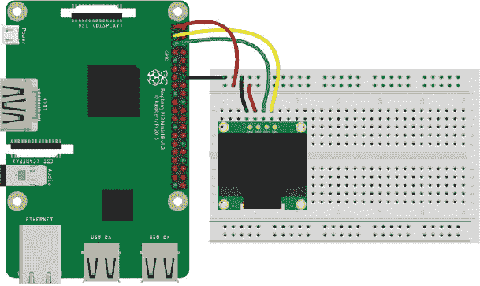

**图 7-3：** 将 OLED 显示器连接到树莓派

### 编写脚本

在输入脚本之前，你需要安装 Adafruit_SSD1306 库来使用 OLED 显示器和树莓派。这个库使得在显示器上写文本和绘制图像变得简单。你还需要启用 I²C 通信，以便 OLED 和树莓派之间能够通信。

#### 安装 OLED 显示器的库

如果你还没有做过，先在桌面上创建一个名为 *Libraries* 的文件夹。然后，打开终端并导航到你树莓派上的 *Libraries* 文件夹：

```
pi@raspberrypi:~ $ cd Desktop/Libraries
```

克隆 OLED 库：

```
pi@raspberrypi:~/Desktop/Libraries $ git clone https://github.com/
adafruit/Adafruit_Python_SSD1306.git
```

安装 Adafruit_Python_SSD1306 库：

```
pi@raspberrypi:~/Desktop/Libraries $ cd adafruit/
Adafruit_Python_SSD1306
pi@raspberrypi:~/Desktop/Libraries/adafruit/Adafruit_Python_SSD1306
$ sudo python3 setup.py install
```

#### 启用 I²C 通信

OLED 使用 I²C 通信协议与树莓派进行通信，因此你需要在树莓派上启用 I²C 通信。前往桌面主菜单，选择 **Preferences** ▸ **Raspberry Pi Configuration**。在 Interfaces 选项卡中，启用 I²C，如 图 7-4 所示，然后按 **OK**。

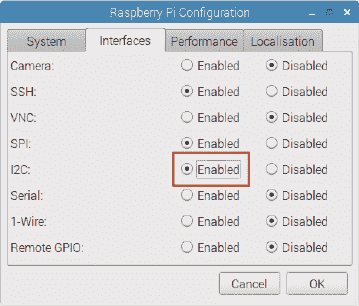

**图 7-4：** 启用 I²C 通信

**I²C 通信协议**

*I²C*，即 *集成电路互联*，是一种通信协议，允许多个 *从属* 集成电路与一个主芯片之间进行通信。从属设备是响应主设备的设备。主芯片可以与所有从设备通信，但从设备只能与主设备通信。主从设备都可以传输数据，但传输始终由主设备控制。在这个案例中，树莓派是主芯片，OLED 集成电路是从设备。树莓派通过其 GPIO 引脚的 SDA 和 SCL 引脚支持 I²C 通信。使用这种通信协议的最大优势是，你只需要通过 SDA 和 SCL 引脚就能连接多个设备——无需使用额外的引脚。

#### 输入脚本

打开 **Python 3 (IDLE)** 并转到 **文件** ▸ **新建文件** 来创建一个新脚本。将 清单 7-4 中显示的代码复制到 Python 编辑器中，并将脚本保存在 *Displays* 文件夹中，命名为 *weather_forecast.py*（记住，你可以在 *[`www.nostarch.com/RaspberryPiProject/`](https://www.nostarch.com/RaspberryPiProject/)* 下载所有脚本）：

**清单 7-4：** *weather_forecast.py* 脚本

```
➊ import time
  import Adafruit_SSD1306
  import requests

  from PIL import Image
  from PIL import ImageDraw
  from PIL import ImageFont

  #Raspberry Pi pin configuration
➋ RST = 24

➌ #128x32 display with hardware I2C
  #disp = Adafruit_SSD1306.SSD1306_128_32(rst=RST)

  #128x64 display with hardware I2C
  disp = Adafruit_SSD1306.SSD1306_128_64(rst=RST)

  #set your unique OpenWeatherMap.org URL
➍ open_weather_map_url = 'http://api.openweathermap.org/data/2.5/
  weather?q=Porto,PT&APPID=801d2603e9f2e1c70e042e4f5f6e0---'

  #initialize display
➎ disp.begin()

  while True:
      #clear display
      disp.clear()
      disp.display()

      #create blank image for drawing
      #make sure to create image with mode '1' for 1-bit color
      width = disp.width
      height = disp.height
      image = Image.new('1', (width, height))

      #get drawing object to draw on image
      draw = ImageDraw.Draw(image)

      #draw a black filled box to clear the image
      draw.rectangle((0,0,width,height), outline=0, fill=0)

      #define constants to define drawing area
      padding = 2
      top = padding

      #move left to right, keeping track of the current x position
      #for drawing text
      x = padding

      #load default font
      font = ImageFont.load_default()

      #openWeatherMap.org weather data request
➏     weather_data = requests.get(open_weather_map_url)

      #display location
➐     location = weather_data.json().get('name') + ' - '
  + weather_data.json().get('sys').get('country')
      draw.text((x, top), location, font=font, fill=255)

      #display description
      description = 'Desc ' + weather_data.json().get('weather')[0]
  .get('main')
      draw.text((x, top+10), description,  font=font, fill=255)

      raw_temperature = weather_data.json().get('main')
  .get('temp')-273.15

      #temperature in Celsius
      temperature = 'Temp ' + str(raw_temperature) + '*C'

      #uncomment for temperature in Fahrenheit
      #temperature = 'Temp ' + str(raw_temperature*(9/5.0)+32) + '*F'
      #display temperature
      draw.text((x, top+20), temperature, font=font, fill=255)

      #display pressure
      pressure = 'Pres ' + str(weather_data.json().get('main')
  .get('pressure')) + 'hPa'
      draw.text((x, top+30), pressure, font=font, fill=255)

      #display humidity
      humidity = 'Humi ' + str(weather_data.json().get('main')
  .get('humidity')) + '%'
      draw.text((x, top+40), humidity, font=font, fill=255)

      #display wind
      wind = 'Wind ' + str(weather_data.json().get('wind')
  .get('speed')) + 'mps ' + str(weather_data.json().get('wind')
  .get('deg')) + '*'
      draw.text((x, top+50), wind, font=font, fill=255)

      #display image
➑     disp.image(image)
      disp.display()
      time.sleep(10)
```

和往常一样，你的代码从导入所需的库开始 ➊。Adafruit_SSD1306 库包含了 OLED 显示驱动类。你从 Python Imaging Library（PIL）中导入了三个模块——`Image`、`ImageDraw` 和 `ImageFont`——来创建一个带有文本的图像，这些文本将显示在 OLED 上。

**OLED 库**

Adafruit_SSD1306 库将 OLED 显示器上显示的所有内容都称为“图像”——即使是文本。你在这里使用的三个模块各自的角色如下：

+   Image 创建一个新图像。

+   ImageDraw 在图像内绘制文本或图标，并显示你将在实际 OLED 显示器上看到的内容。

+   ImageFont 设置文本字体。

##### 初始化 OLED 显示屏

即使你的显示屏没有重置引脚，你也需要在代码中设置 `RST` 引脚。如果你的显示屏有重置引脚，它应该连接到 GPIO 24。所以，无论哪种情况，你都需要在此处 ➋ 将 `RST` 设置为 `24`。

在 ➌ 处，你创建了一个显示类。对于 128×32 显示屏，创建 `SSD1306_128_32` 类；对于 128×64 显示屏，创建 `SSD1306_128_64` 类。我们在代码中给出了这两种选项，你只需取消注释与你的显示屏尺寸匹配的那一行，并注释掉另一行。

在 ➎ 处，你初始化显示库并准备显示屏，以便可以在其上绘制文本。我们对代码进行了大量注释，以帮助你理解每一行的作用。

##### 发起 API 请求

在 ➍ 处，你创建了一个名为 `open_weather_map_url` 的变量来保存 API URL。确保用你自己的 API URL 更新这一行。

在 ➏ 处，你发出 API 请求，之后有几个代码块起到类似的作用。我们将解释 ➐ 处的代码，然后你就能理解其他代码块的功能。你创建一个名为 `location` 的变量来获取位置。这个变量是多个字符串的拼接。首先，使用 `weather_data.json().get('name')` 获取位置，在这个例子中返回 `Porto`。然后用 `+ ' - '` 添加一个连字符，再用 `weather_data.json().get('sys').get('country')` 获取国家代码；在这个例子中，返回 `PT`。因此，`location` 变量返回 `Porto – PT`。

##### 在 OLED 显示屏上绘制文本

要在显示屏上绘制文本，可以使用 `draw.text()` 函数，函数接受以下参数：

x 和 y 坐标  文本开始绘制的位置

text  要显示的文本

font  文本显示的字体

fill  像素亮度—255 是最大值

例如，要在 OLED 预报器的顶行显示位置，请使用以下代码：

```
draw.text((x, top), location, font=font, fill=255)
```

`x` 和 `top` 坐标在 ➎ 处定义。这个例子使用了默认的库字体，不过你可以通过下载字体文件并修改代码，来探索其他字体。

显示天气描述、温度、气压、湿度和风速的代码块都很相似。请注意，你需要递增 `top` 变量才能在显示屏的下一行绘制文本。

最后，在 ➑ 处的代码行将图像显示在 OLED 上。末尾的延时时间决定了循环更新天气信息的速度——在这个例子中，是每 10 秒更新一次。

#### 运行脚本

按 **F5** 或前往 **运行** ▸ **运行模块** 来运行脚本。恭喜你，现在你有了一个小型天气预报器，能不断更新你所选地点的天气数据！

### 进一步探索

你可以使用 API 获取比天气更多的信息。使用你最喜欢的搜索引擎，输入类似 *free API for <thing>* 的查询，来找到你可以访问的 API。以下是一些可以让你开始的想法：

+   交通

+   推文

+   最新新闻

+   股票价格

+   当前比特币汇率

## 使用带有 Sense HAT 的 Pong**

在这里，你将使用 Sense HAT 构建你自己的 LED Pong 游戏。Sense HAT 是一个附加板，可以为你的 Pi 增加更多功能，提供额外的特性，如 LED 矩阵、操纵杆以及从外界获取信息的多个传感器。

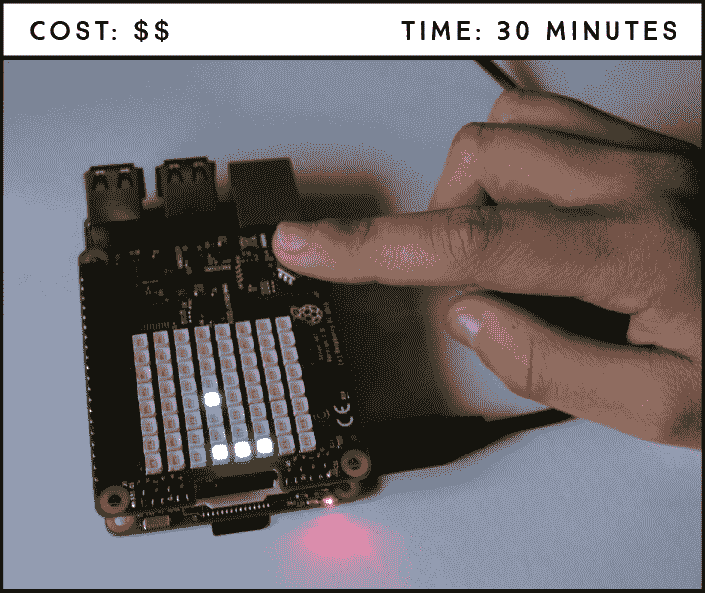

**所需部件**

Raspberry Pi（具有 40 个 GPIO 引脚的版本）

Sense HAT

你将使用 Sense HAT 的 LED 矩阵来显示游戏，并用操纵杆来玩。如果你没有硬件，不用担心：你还将学习如何使用 Sense HAT 模拟器，在没有硬件的情况下创建相同的游戏。

### 介绍 Pong

“Pong”是最早创建的视频游戏之一，是一款非常流行的 2D 乒乓球游戏，可以单人或双人模式玩。你将创建单人版，所以这更像是打壁球：你用球拍把球弹回墙壁，然后在球回来的时候用球拍接住它。如果你错过了球，就输了。

### 介绍 Raspberry Pi Sense HAT

Raspberry Pi Sense HAT 具有一个 8×8 RGB LED 矩阵、一个五按钮操纵杆、一个陀螺仪、一个加速度计、一个磁力计、一个温度传感器、一个气压传感器和一个湿度传感器，所有这些都集成在一个包中，如图 8-1 所示。

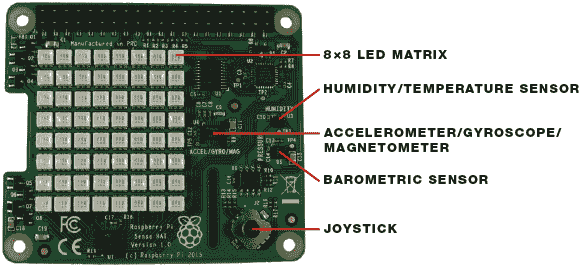

**图 8-1：** Raspberry Pi Sense HAT

#### 安装电路板

**注意**

*Sense HAT 与 Raspberry Pi 1 Model A 和 B 不兼容，但如果你有不兼容的板子，可以使用模拟器来构建这个项目。*

这个项目不需要太多的硬件组装——你只需要将 Sense HAT 安装到 Pi 上，剩下的工作都在代码中完成。

将 Sense HAT 上的 40 个 GPIO 引脚连接到 Raspberry Pi 上的 40 个 GPIO 引脚；两块板子应该完全对齐。当你第一次成功地将 Sense HAT 安装到一个通电的 Pi 上时，LED 矩阵会显示一个发光的彩虹背景，如图 8-2 所示。

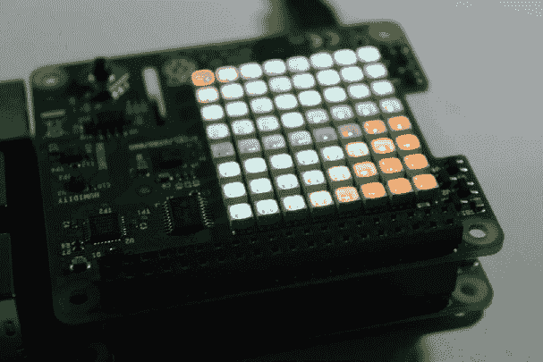

**图 8-2：** Sense HAT 欢迎彩虹

#### 使用 Sense HAT 模拟器

如果你没有 Sense HAT 或兼容的板子，或者你只想先测试脚本，可以使用 Sense HAT 模拟器在你的计算机上构建 Pong 游戏。模拟器是一个虚拟的 Sense HAT，你可以与其互动来测试脚本。要从桌面主菜单启动它，进入**编程** ▸ **Sense HAT 模拟器**。这将打开模拟器窗口，如图 8-3 所示。

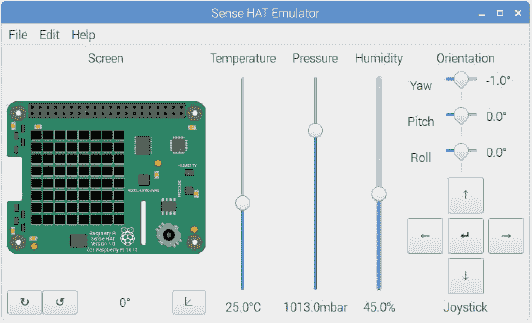

**图 8-3：** Sense HAT 模拟器窗口

Sense HAT 模拟器自带一些存储在**文件** ▸ **示例**中的示例；只需选择你想要的示例，然后运行文件，在模拟器窗口中查看代码效果。

### 使用 Sense HAT 功能和控制

在开始构建游戏之前，了解如何控制 LED 矩阵和读取操纵杆输入是非常重要的。让我们看一些你将在 Pong 脚本中使用的示例。

#### 控制 LED 矩阵

Sense HAT LED 矩阵有 8 列和 8 行，共有 64 个 RGB LED。你可以通过单独控制每个 LED 来显示文本和创建图像。你还可以设置每个 LED 的颜色。

##### 显示文本

列表 8-1 中的代码会在点阵上以蓝色显示滚动文本“Hello World!”。

**列表 8-1：** 在 Sense HAT LED 矩阵上显示文本

```
➊ from sense_hat import SenseHat
  #uncomment the following line if you are using the emulator
➋ #from sense_emu import SenseHat
  sense = SenseHat()
➌ sense.show_message('Hello World!', text_colour = [0, 0, 255])
```

首先导入`SenseHat`类 ➊。如果你使用的是模拟器，请删除或注释掉这一行，并取消注释➋处的代码。

`show_message()` 函数 ➌ 接受要显示的消息——文本字符串——作为第一个参数，然后接受多个选项作为进一步的参数：

**注意**

*sense_hat 库使用英国拼写“colour”，因此你必须在代码中使用“colour”。*

+   使用 `text_colour = [*r*, *g*, *b*]` 来设置文本的 RGB 颜色，将 `*r*, *g*, *b*` 替换为介于 `0` 和 `255` 之间的整数（就像你在项目 5 中做的那样）。

+   使用 `scroll_speed = *x*`，其中 x 是一个浮点数，来控制文本在显示屏上滚动的速度。默认的滚动速度设置为每次文本向左移动一个像素时暂停 0.1 秒。

+   使用 `back_colour = [*r*, *g*, *b*]` 来设置背景颜色，将 `*r*, *g*, *b*` 替换为与 `text_colour` 相同的整数值。

##### 控制特定的 LED

要控制单个 LED，你需要通过它在矩阵中的位置来引用每个想要点亮的 LED。为此，Sense HAT 使用 (x, y) 坐标系统。例如，图 8-4 中的 LED 坐标就在图示旁边列出。

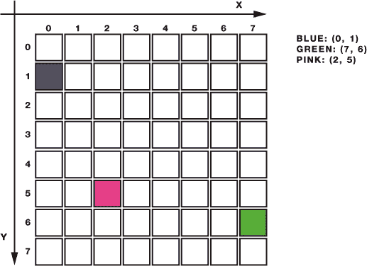

**图 8-4：** Sense HAT 坐标系统

为了用对应的颜色点亮图 8-4 中的 LED，你可以使用清单 8-2 中的代码。

**清单 8-2：** 使用 `set_pixel()` 点亮特定的 LED

```
from sense_hat import SenseHat
#uncomment the following line if you are using the emulator
#from sense_emu import SenseHat
sense = SenseHat()
#set blue pixel
sense.set_pixel(0, 1, 0, 0, 255)
#set green pixel
sense.set_pixel(7, 6, 0, 255, 0)
#set pink pixel
sense.set_pixel(2, 5, 255, 51, 153)
```

函数 `sense.set_pixel(*x*, *y*, *r*, *g*, *b*)` 点亮特定的 LED，其中 x 是 x 坐标；y 是 y 坐标；r、g 和 b 设置颜色。

##### 显示图片

与其控制单个 LED，你可以使用函数 `sense.set_pixels()` 来更快速地显示图像。你可以插入一个包含所有 64 个 LED 颜色的列表，而不是输入坐标。看看代码清单 8-3，它显示了一个悲伤的表情。

**清单 8-3：** 使用 `set_pixels()` 显示图像

```
from sense_hat import SenseHat
#uncomment the following line if you are using the emulator
#from sense_emu import SenseHat
sense = SenseHat()

#red color
X = [255, 0, 0]

#no color
N = [0, 0, 0]

#sad face array
sad_face = [
N, N, X, X, X, X, N, N,
N, X, N, N, N, N, X, N,
X, N, X, N, N, X, N, X,
X, N, N, N, N, N, N, X,
X, N, N, X, X, N, N, X,
X, N, X, N, N, X, N, X,
N, X, N, N, N, N, X, N,
N, N, X, X, X, X, N, N
]

sense.set_pixels(sad_face)
```

**注意**

*在 `sad_face` 数组中的红色 X 不会在你的代码中显示为红色。我们只是用红色 X 来突出它们，这样更容易可视化 LED 的显示效果。*

你创建一个变量来存储点亮的 LED 的颜色（`X`），另一个变量来存储背景颜色（`N`）——你可以将背景设置为任何颜色，或者设置为 `0` 使其保持不亮。然后你需要创建一个数组，将每个 64 个 LED 设置为 `X` 或 `N`。图 8-5 显示了清单 8-3 中的代码执行后的结果：

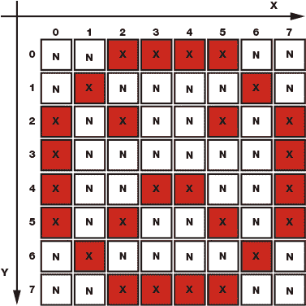

**图 8-5：** 在 LED 矩阵上显示一个悲伤的表情

在你的绘图中，你可以包含任意多的颜色；你只需要更改颜色参数。我们鼓励你通过更改颜色并绘制自己的图像来练习使用 LED 矩阵。

现在你知道如何控制 LED 矩阵了，接下来我们来看如何编程控制摇杆。

#### 从摇杆读取数据

随 Sense HAT 一起提供的摇杆有五个控制选项：

+   向上移动

+   向下移动

+   向右移动

+   向左移动

+   按下

你需要告诉程序每个控制选项应该让 Pi 做什么。列表 8-4 中的脚本设置了与每个摇杆控制相关联的事件，并在计算机屏幕上显示哪个控制被使用的信息：

**列表 8-4：** 将事件与每个摇杆控制关联

```
  from signal import pause

  from sense_hat import SenseHatm
  #uncomment the following line if you are using the emulator
  #from sense_emu import SenseHat
  sense = SenseHat()

➊ def move_up(event):
      print('joystick was moved up')

  def move_down(event):
      print('joystick was moved down')

  def move_right(event):
      print('joystick was moved right')

  def move_left(event):
      print('joystick was moved left')

  def move_middle(event):
      print('joystick was pressed')

➋ sense.stick.direction_up = move_up
  sense.stick.direction_down = move_down
  sense.stick.direction_right = move_right
  sense.stick.direction_left = move_left
  sense.stick.direction_middle = move_middle

  pause()
```

首先，你需要告诉你的 Pi 在每个摇杆控制被触发时应该采取什么行动。你通过定义一系列函数来执行这些动作。例如，当摇杆被向上移动时，你调用`move_up()`函数➊来打印消息`joystick was moved up`。`event`参数告诉 Pi 摇杆将向这些函数发送信息。然后，你使用`sense.stick.direction_up = move_up`➋将`move_up`函数与摇杆的向上移动关联起来。

其他的运动功能也以相同的方式工作。

### 编写脚本

现在，你知道了如何在 LED 矩阵上显示文本和图形，以及如何在摇杆使用时触发某些事件，你已经准备好开始编写游戏脚本了。

这是游戏的目标：

+   一个长 3 像素、宽 1 像素的球拍应该出现在第 0 列。

+   每次你移动摇杆向上或向下时，球拍应该相应地移动。

+   球应该从一个随机位置开始并朝对角线移动。

+   当球碰到某物——墙壁、天花板或球拍——时，它应该朝相反的方向对角线移动。

+   如果球击中第 0 列，意味着你错过了球，那么你就输了，游戏结束。

#### 输入脚本

打开**Python 3 (IDLE)**，然后点击**文件** ▸ **新建文件**来创建一个新的脚本。接着将列表 8-5 中的代码复制到新文件中，并将脚本保存为*pong_game.py*，存放在*Displays*文件夹内（记得你可以在*[`www.nostarch.com/RaspberryPiProject/`](https://www.nostarch.com/RaspberryPiProject/)*下载所有脚本）。

**列表 8-5：** Pong 游戏代码

```
  #based on raspberrypi.org Sense HAT Pong example

  #import necessary libraries
➊ from random import randint
  from time import sleep

  #use this line if you are using the Sense HAT board
  from sense_hat import SenseHat
  #uncomment the following line if you are using the emulator
  #from sense_emu import SenseHat

  #create an object called sense
➋ sense = SenseHat()

  #set bat position, random ball position, and velocity
➌ y = 4
➍ ball_position = [int(randint(2,6)), int(randint(1,6))]
➎ ball_velocity = [1, 1]

  #red color
  X = [255, 0, 0]
  #no color
  N = [0, 0, 0]

  #sad face array
  sad_face = [
  N, N, X, X, X, X, N, N,
  N, X, N, N, N, N, X, N,
  X, N, X, N, N, X, N, X,
  X, N, N, X, N, N, N, X,
  X, N, N, X, N, N, N, X,
  X, N, X, N, N, X, N, X,
  N, X, N, N, N, N, X, N,
  N, N, X, X, X, X, N, N
  ]

  #draw bat at y position
➏ def draw_bat():
      sense.set_pixel(0, y, 0, 255, 0)
      sense.set_pixel(0, y+1, 0, 255, 0)
      sense.set_pixel(0, y-1, 0, 255, 0)

  #move bat up
➐ def move_up(event):
      global y
      if y > 1 and event.action=='pressed':
          y -= 1

  #move bat down
  def move_down(event):
      global y
      if y < 6 and event.action=='pressed':
          y += 1

  #move ball to the next position
➑ def draw_ball():
      #ball displayed on current position
      sense.set_pixel(ball_position[0], ball_position[1], 75, 0, 255)
      #next ball position
      ball_position[0] += ball_velocity[0]
      ball_position[1] += ball_velocity[1]
      #if ball hits ceiling, calculate next position
      if ball_position[0] == 7:
          ball_velocity[0] = -ball_velocity[0]
      #if ball hits wall, calculate next position
      if ball_position[1] == 0 or ball_position[1] == 7:
          ball_velocity[1] = -ball_velocity[1]
      #if ball reaches 0 position, player loses and game quits
      if ball_position[0] == 0:
          sleep(0.25)
          sense.set_pixels(sad_face)
          quit()
      #if ball hits bat, calculate next ball position
      if ball_position[0] == 1 and y - 1 <= ball_position[1] <= y+1:
          ball_velocity[0] = -ball_velocity[0]

  #when joystick moves up or down, trigger corresponding function
➒ sense.stick.direction_up = move_up
  sense.stick.direction_down = move_down

  #run the game
➓ while True:
      sense.clear()
      draw_bat()
      draw_ball()
      sleep(0.25)
```

这段代码做了很多事情。让我们一步一步地解析它。

##### 导入必要的库

在➊处，你从 rand 库导入了`randint()`函数，用来生成伪随机整数，从 time 库导入了`sleep()`函数，用来设置延迟时间。

在➋处，你创建了一个名为`sense`的对象，它将在代码中引用 Sense HAT。

##### 创建球拍

球拍是一个 3 像素长、1 像素宽的条形，移动在最左侧的列上。在➌处，你定义了球拍的起始位置为从顶部向下 4 像素，`y = 4`。完整的球拍在`draw_bat()`函数中以绿色绘制➏，它在起始位置的顶部（`y - 1`）和底部（`y + 1`）各加上一个像素，使得球拍总长度为 3 像素。

##### 移动球拍

球拍仅在 y 轴上移动，因此它的 x 坐标始终为`0`，但随着玩家移动球拍，y 坐标需要变化。换句话说，玩家只能上下移动球拍。`move_up()`和`move_down()`函数（在➐处定义）控制这些移动。在➒处，你通过调用`move_up()`和`move_down()`分别告诉 Pi 当玩家向上或向下移动操纵杆时采取什么动作。

仔细看看`move_up()`函数（`move_down()`函数的工作方式类似）：

```
#move bat up
def move_up(event):
    global y
    if y > 1 and event.action=='pressed':
        y -= 1
```

`move_up()`函数接受`event`作为参数。基本上，`event`参数允许你将一些有关操纵杆的信息传递给函数——比如操纵杆使用的时间、推动的方向，以及它是被按下、释放还是保持——这样 Pi 就知道如何做出反应。

**提示**

*在 Python 中*写`y -= 1` *等同于* `y = y - 1`。

当玩家向上移动操纵杆时，函数通过从变量`y`中减去`1`来将球拍的 y 坐标向上移动。但首先，代码检查`y > 1`；否则，球拍可能会移动出矩阵。

##### 声明变量作用域

注意，`y`被定义为`global`变量。并非程序中的所有变量都可以在程序的所有位置访问，所以可能有些地方无法调用某些变量。变量的*作用域*是程序中可以访问它的区域。在 Python 中，有两种基本的变量作用域：*局部*和*全局*。

在主代码主体中定义的变量是全局的，这意味着它可以在代码中的其他任何地方访问。在函数内部定义的变量是局部变量，所以在函数内部对局部变量的操作不会影响外部的变量，即使它们有相同的名称。

由于你希望`y`在定义它的函数内以及整个代码中都能使用，所以它需要被声明为`global`。否则，当你移动操纵杆时，什么也不会发生，因为`y`变量只是在函数内部发生了变化，而不是在代码的主主体中发生变化。

##### 创建球

要制作一个移动的球，首先需要一个起始位置和一个速度。在➍处，你使用列表设置球的起始位置。列表是由方括号定义的，`[*第 0 个元素*，*第 1 个元素*，...，*第 n 个元素*]`，每个元素之间用逗号分隔。列表中的元素是*零索引*，这意味着第一个元素的索引是 0，而不是 1。这里，我们的第 0 个元素是 x 坐标，第 1 个元素是 y 坐标。

当你开始游戏时，球的位置是随机的，由`randint()`函数生成。该随机位置的 y 轴范围是 1 到 6，x 轴范围是 2 到 6。这些数字确保球不会出现在天花板、墙壁或球拍旁边。

##### 移动球

一旦你为小球设置了起始位置，你需要给它一个速度 ➎ 使其开始移动。你创建了一个小球速度的列表，其中第 0 个元素是 x 坐标的速度，第 1 个元素是 y 坐标的速度。

你需要将速度加到或从当前小球位置中减去，使小球向前或向后移动。➑处的`draw_ball()`函数是用来显示和移动小球的地方，小球总是沿对角线移动。如果它向前，它就会继续向前；如果它向后，它就会继续向后，除非它碰到天花板或球拍，这时它会反向移动。

##### 保持游戏运行

一旦一切准备就绪，你就可以添加一个`while`循环来保持游戏运行 ➓。`while`循环从清除显示开始；然后，它调用`draw_bat()`函数来绘制球拍，并调用`draw_ball()`来显示小球。

最后一行中的`sleep()`函数定义了小球移动到另一个位置所需的时间，因此你可以使用此函数来决定小球的移动速度。如果增加延迟时间，游戏会变慢且更容易；如果减少延迟时间，游戏会加速。我们鼓励你尝试不同的延迟时间。

#### 运行脚本

恭喜！经过大量编程，你获得了回报：你可以在你的 Sense HAT 上玩 Pong 游戏！按**F5**或者进入**Run** ▸ **Run Module**来运行脚本。

当你输了且游戏结束时，LED 矩阵会显示一个悲伤的表情，如图 8-6 所示。

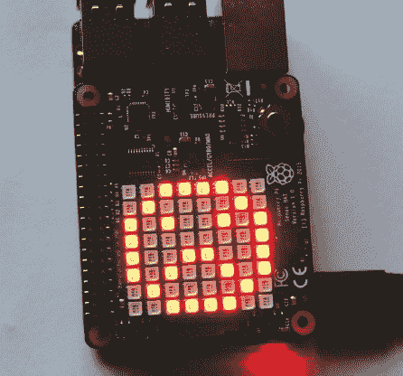

**图 8-6：** 游戏结束时 LED 矩阵显示悲伤的表情

### 进一步提升

这里有一些升级游戏的想法：

+   随着游戏的进行，减少延迟时间以增加游戏的难度。

+   添加一个得分系统，每次小球击中球拍时得一分，并在屏幕上显示分数。

+   插入一个条件，当你按下操纵杆时重新开始游戏。
