## 第四章：传感器

## **一体化气象传感器站**

在这个项目中，你将构建一个本地气象站，使用 Sense HAT 检测温度、湿度和气压。你还将创建一个图形用户界面，实时显示温度、湿度和气压的读数。

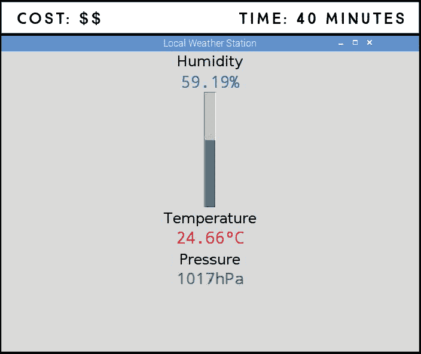

**所需组件**

树莓派（具有 40 个 GPIO 引脚的版本）

Sense HAT

### 将 Sense HAT 作为气象站

Sense HAT 是一个非常优秀的小型且价格实惠的气象站，因为它配备了温度、湿度和气压传感器。使用 Sense HAT 读取传感器值非常简单，因此这是一个学习传感器读取的好起点。

#### 温度传感器

**注意**

*与真实值相比，温度读数可能会偏差几度。Sense HAT 安装在 Pi 上，树莓派处理器的热量可能会略微影响结果。*

如其名称所示，温度传感器测量温度。默认情况下，Sense HAT 读取的是摄氏度温度，因此如果你更喜欢华氏度，你需要进行转换。方法是，将摄氏度乘以 9，再除以 5，最后加上 32，公式如下所示。

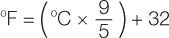

你可以将此公式添加到你的代码中，以便自动进行转换。

#### 湿度传感器

有两种常见的湿度表示方式：绝对湿度和相对湿度。*绝对湿度*是指某一体积空气中水蒸气的质量，与温度无关，单位为千克/立方米（kg/m³）。空气能够容纳的水蒸气量随温度变化。温度越高，空气可以容纳的水蒸气量越多。*相对湿度*以百分比表示，是指当前空气中的水蒸气量与在某一温度下空气最大能够容纳的水蒸气量的比例。

Sense HAT 记录相对湿度，因为它对天气预报更有用：相对湿度百分比越高，降水的概率越大。由于相对湿度随着温度变化，因此它总是与温度传感器一起使用。

#### 气压传感器

气压传感器读取大气压力，即某一点的空气“重量”，单位为 hPa（百帕斯卡），相当于 mbar（毫巴）。为什么测量气压很有趣？因为气压的变化可以帮助你预测天气。气压上升通常是好天气的标志，而气压下降则通常预示着恶劣天气，如降雨或风暴。

压力变化非常微小。你需要仔细观察气压计的读数才能发现趋势。

### 读取温度、湿度和气压

现在让我们看看如何从传感器读取数据，并将其打印到 Python 命令行。

像在 项目 8 中一样将 Sense HAT 安装到你的 Pi 上，并确保它连接良好。当它首次连接时，Sense HAT 应该显示一个彩虹背景，这个彩虹背景与你启动 Pi 时屏幕上看到的彩虹相匹配（参见 图 9-1）。

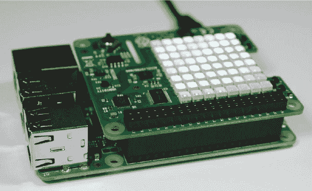

**图 9-1:** Sense HAT 彩虹背景

在你的 *Projects* 文件夹内创建一个名为 *Sensors* 的新文件夹。然后打开 **Python 3 (IDLE)**，选择 **文件** ▸ **新建** 创建一个新的脚本文件，命名为 *weather_data.py*，并输入 清单 9-1 中的代码（记住你可以在 *[`www.nostarch.com/RaspberryPiProject/`](https://www.nostarch.com/RaspberryPiProject/)* 下载所有脚本）。

**清单 9-1:** 使用 Sense HAT 读取温度、湿度和压力

```
➊ from sense_hat import SenseHat
  #from sense_emu import SenseHat

  from time import sleep

  #create an object called sense
➋ sense = SenseHat()

  while True:
   ➌ temperature = sense.temperature
   ➍ temperature = str(round(temperature, 2))
   ➎ print('Temperature: ' + temperature + '*C\n')
     humidity = sense.humidity
     humidity = str(round(humidity, 2))
     print ('Humidity: ' + humidity + '%\n')

     pressure = sense.pressure
     pressure = str(round(pressure, 2))
     print('Pressure: ' + pressure + 'hPa\n')

     sleep(1)
```

首先，从 sense_hat 库中导入 `SenseHat` 类 ➊。然后，你创建一个名为 `sense` 的对象，来引用 Sense HAT ➋。

获取传感器读数 ➌ 非常简单，这得益于以下这些恰如其分命名的函数：

+   `sense.temperature` 获取温度读数。

+   `sense.humidity` 获取湿度读数。

+   `sense.pressure` 获取压力读数。

读数精确到几位小数，因此你使用 `round()` 函数来对数字进行四舍五入，使结果更易读。`round()` 函数 ➍ 接受两个参数：你想要四舍五入的数字和你希望设置的小数位数，顺序为：首先是数字，其次是小数位数——在这里，它被设置为两位小数。你还使用 `str()` 函数，它将传入的参数转换为字符串。你需要将读数转换为字符串，这样才能将它们与你将在命令行中打印的文本进行连接 ➎。

现在你几乎是一个气象学家了！接下来，你将为你的天气数据构建一个用户界面。

### 构建你的读数用户界面

让我们把这个项目提升到另一个层次，构建一个酷炫的用户界面来显示传感器读数。你的界面应包含：

+   一个显示温度、湿度和压力的桌面窗口

+   以从 0 到 100 百分比的垂直进度条显示湿度

+   以数字形式显示的温度和压力

+   每个读数的标签

图 9-2 显示了一个用户界面的草图布局，应该能够帮助你理解如何处理代码。

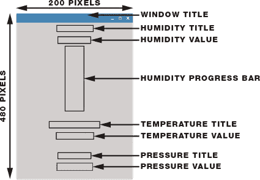

**图 9-2:** 图形用户界面草图

你还可以编辑代码来选择字体类型、大小和颜色，以及标签和读数在窗口中的位置。下表列出了所有标题和值及其显示方式。

| **小部件** | **选项** |
| --- | --- |
| 窗口标题 | 文本：“本地气象站” |
| 湿度标题 | 文本：“湿度”，字体：Helvetica，大小：18，垂直间距：3 |
| 湿度值 | 字体：Courier，大小：20，颜色：蓝色，位置：北 |
| 湿度进度条 | 方向：垂直，大小：20，颜色：蓝色，位置：北，长度：200，最大值：100 |
| 温度标题 | 文本：“温度”，字体：Helvetica，大小：18，位置：南 |
| 温度值 | 字体：Courier，大小：20，颜色：红色，位置：北 |
| 压力标题 | 文本：“压力”，字体：Helvetica，大小：18，位置：南 |
| 压力值 | 字体：Courier，大小：20，颜色：绿色，位置：北 |

### 编写脚本

打开**Python 3 (IDLE)**，然后选择**文件** ▸ **新建文件**，以创建一个新的脚本。将 Listing 9-2 中的代码复制到 Python 编辑器中，并将脚本保存为*weather_station.py*，并保存在*Sensors*文件夹中（请记住，您可以在*[`www.nostarch.com/RaspberryPiProject/`](https://www.nostarch.com/RaspberryPiProject/)*下载所有脚本）：

**LISTING 9-2:** 在图形用户界面中显示 Sense HAT 的读数

```
  #import necessary libraries
➊ from tkinter import *
  from tkinter import ttk
  import time
  from sense_hat import SenseHat
  #from sense_emu import SenseHat

  #create an object called sense
  sense = SenseHat()

  #create window
➋ window = Tk()
  window.title('Local Weather Station')
  window.geometry('200x480')

  #create humidity label for title and value
➌ humidity_label = Label(window, text = 'Humidity', font =
  ('Helvetica', 18), pady = 3)
  humidity_label.pack()

➍ humidity = StringVar()

➎ humidity_value=Label(window, textvariable = humidity,font =
  ('Courier', 20), fg = 'blue', anchor = N, width = 200)
  humidity_value.pack()

  #create humidity canvas
➏ humidity_canvas = Canvas(window, width = 200, height = 200)
  humidity_canvas.pack()

  #create humidity progress bar
➐ humidity_bar = DoubleVar()

➑ progressbar_humidity = ttk.Progressbar(humidity_canvas, variable =
  humidity_bar, orient = VERTICAL, length = 200, maximum = 100)
  progressbar_humidity.pack(fill=X, expand=1)

  #create temperature label for title and value
  temperature_label = Label(window, text = 'Temperature', font =
  ('Helvetica', 18),anchor = S, width = 200, height = 2)
  temperature_label.pack()

  temperature = StringVar()

  temperature_value = Label(window, textvariable = temperature, font =
  ('Courier', 20),fg = 'red', anchor = N, width = 200)
  temperature_value.pack()

  #create pressure label for title and value
  pressure_label = Label(window, text = 'Pressure', font =
  ('Helvetica', 18), anchor = S, width = 200, height = 2)
  pressure_label.pack()

  pressure = StringVar()

  pressure_value = Label(window, textvariable = pressure, font =
  ('Courier', 20), fg = 'green', anchor = N, width = 200)
  pressure_value.pack()

➒ def update_readings():
      humidity.set(str(round(sense.humidity, 2)) + '%')
      humidity_bar.set(sense.humidity)
      temperature.set(str(round(sense.temperature, 2)) + '°C')
      #temperature.set(str(round(sense.temperature*(9/5)+32, 2))
  + '*F')
      pressure.set(str(round(sense.pressure)) + 'hPa')
      window.update_idletasks()
      window.after(3000, update_readings)

➓ update_readings()
  window.mainloop()
```

和往常一样，您首先通过导入必要的库开始编写代码 ➊。您可能会想，既然我们在上一行中已经从 tkinter 库导入了所有内容，为什么还需要单独导入 ttk 呢？在这种情况下，当您使用通配符`*`导入时，您只导入了库文件夹中存储的一个子集——没有特别的原因，这是库的作者选择的方式——因此我们需要单独导入 ttk 库，它在此用户界面中也是必需的。

要收集天气数据，您需要使用物理 Sense HAT 和 sense_hat 库。

#### 创建用户界面

在导入所有库后，您实现了创建用户界面部分的代码。首先，您创建一个 200×480 像素的窗口，并为其设置标题为`Local Weather Station` ➋。然后，您为湿度标题创建一个标签 ➌，其设置如第 131 页中的表格所示。接着，在 ➍，您创建一个名为`humidity`的字符串变量，用于存储湿度值。此值随后将在 ➎ 处显示。

➏处的代码行创建了一个画布，用于放置进度条——画布就像是为进度条预留的空间。之后，代码初始化了一个名为`humidity_bar`的`double`类型变量 ➐，这是进度条接受的变量类型。最后，➑处的代码创建了湿度进度条并将其放置在画布上。

显示温度和压力标题及值的过程与 ➌、➍ 和 ➎ 中的步骤相同。

#### 自动更新读数

在 ➒ 处，您定义了`update_readings()`函数，该函数每三秒更新一次显示的值，以确保天气读数始终保持最新。

以下行更新`temperature`变量：

```
temperature.set(str(round(sense.temperature, 2)) + '*C')
```

让我们将这一行拆解成各个部分：

+   `sense.temperature` 从 Sense HAT 获取温度读数。

+   `round(sense.temperature,2)` 将温度读数四舍五入到小数点后两位。

+   `str(round(sense.temperature,2))` 将四舍五入后的读数转换为字符串。

+   `(str(round(sense.temperature,2)) + '*C')` 将摄氏度符号附加到字符串中。

+   `temperature.set(str(round(sense.temperature, 2)) + '*C')` 更新 `temperature` 变量为最新的读数。

脚本采用类似的方法来更新 `pressure` 和 `humidity` 变量。

`window.update_idletasks()` 函数在监控时保持窗口的最新状态。最后，`window.after(3000, update_readings)` 将 `update_readings` 作为事件添加到 `mainloop()` 中，并告诉树莓派每 3,000 毫秒（3 秒）调用一次这个函数。

在 ➓ 处，你调用了 `update_readings()` 函数和保持窗口运行的 `window.mainloop()` 函数。

最后，你可以通过注释和取消注释这两行代码来以华氏度显示温度：

```
#temperature.set(str(round(sense.temperature, 2)) + '*C')
temperature.set(str(round(sense.temperature*(9/5)+32, 2)) + '*F')
```

#### 运行脚本

按 **F5** 键或进入 **Run** ▸ **Run Module** 来运行脚本。你应该能看到项目开始时所示的用户界面上显示你的天气数据。

恭喜你！你已经制作了自己的天气站，你现在正式是一个初级气象学家。

### 进一步提升

这里有一些自定义此项目的想法：

+   将华氏温度转换添加到代码中，并以 °F 显示温度。

+   更改图形用户界面的布局、字体颜色、大小和类型，以适应你的个人喜好。

+   使用 Sense HAT 上的 LED 矩阵显示天气信息。例如，你可以显示文本、相对柱状图，或用绿色和红色箭头表示温度、湿度或气压的升降。

+   在这个部分的其余项目中，你将学习如何用 Python 发送电子邮件以及如何保存传感器读数。利用这些技能，你可以将天气数据发送到你的电子邮件，或构建一个天气站数据记录器。一定不要错过下一个项目！

## **带电子邮件通知的入侵报警**

在这个项目中，你将创建一个入侵报警系统，通过电子邮件通知你。该报警系统将利用被动红外（PIR）运动传感器检测是否有人闯入禁区。当 PIR 传感器探测到运动时，它将发送一封警告邮件。

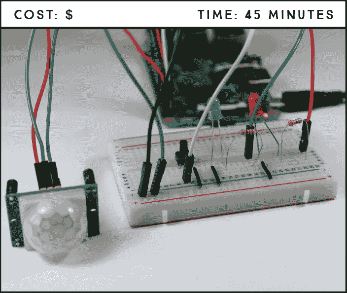

**所需组件**

树莓派

面包板

PIR 运动传感器 HC-SR501

两个 5 毫米 LED（不同颜色）

两个 330 Ω 电阻

按钮

跳线

### 介绍 PIR 运动传感器

你可能在许多不同的应用中见过运动传感器。它们用于安防灯、商业建筑中经过时自动开启的灯光以及入侵报警系统。

PIR 运动传感器（见图 10-1）通过测量其视野内物体发出的红外线来工作。它根据红外线光的变化来检测运动，这表示温度的变化。这使它非常适合检测人类或动物，因为它能感知到在其范围内移动的生物体，但不会感知到像被风吹动的叶子这样的无生命物体。您可以编程让 Pi 对红外线光的变化做出反应，例如触发事件，如打开灯、响铃，或者像我们在这个项目中所做的那样，发送电子邮件。

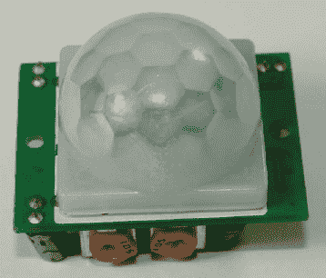

**图 10-1：** PIR 运动传感器

该传感器在检测到运动时输出高电平（HIGH），没有检测到运动时输出低电平（LOW），并且它只有 3 个引脚：VCC、GND 和数据。数据输出一个 3.3V 的信号，非常适合您的 Pi！

### 使用 PYTHON 发送电子邮件

Python 的电子邮件库使得通过 Python 发送电子邮件变得简单。我们将在编写脚本之前先组装各个部分。

#### 查找您的 SMTP 服务器详细信息

要通过代码发送电子邮件，您需要包括您的*简单邮件传输协议（SMTP）*服务器详细信息。SMTP 是电子邮件传输的互联网标准，每个电子邮件提供商都有不同的 SMTP 服务器。

这些详细信息包括您的服务提供商的*服务器地址*和*端口*，以及是否使用*传输层安全性（TLS）*。TLS 是一种用于在两个电子邮件服务器之间建立安全连接的协议。要获取这些信息，只需在互联网上搜索*SMTP 服务器设置*，并加上您的电子邮件提供商名称。您将把这些详细信息插入到脚本中以进行个性化设置。

#### 电子邮件发送脚本

**注意**

*不要将您的文件命名为* email.py *，因为这是 Python 库的名称，您的脚本将无法工作。*

打开**Python 3（IDLE）**，并进入**文件** ▸ **新建文件**以创建一个新的脚本。将示例 10-1 中的代码复制到 Python 编辑器中，并将脚本保存为*send_email.py*，放在*Sensors*文件夹中（记得，您可以在*[`www.nostarch.com/RaspberryPiProject/`](https://www.nostarch.com/RaspberryPiProject/)*下载所有脚本）：

**示例 10-1：** 电子邮件通知脚本

```
➊ import smtplib
  from email.mime.text import MIMEText

  #replace the next three lines with your credentials
➋ from_email_addr = '*YOUR_EMAIL@gmail.com*'
  from_email_password = '*YOUR_EMAIL_PASSWORD*'
  to_email_addr = '*TO_YOUR_OTHER_EMAIL@gmail.com*'

  #set your email message
➌ body = 'Motion was detected in your room.'
  msg = MIMEText(body)

  #set sender and recipient
  msg['From'] = from_email_addr
  msg['To'] = to_email_addr

  #set your email subject
  msg['Subject'] = 'INTRUDER ALERT'

  #connecting to server and sending email
  #edit the following line with your provider's SMTP server details
➍ server = smtplib.SMTP('*smtp.gmail.com*', *587*)
  #comment out the next line if your email provider doesn't use TLS
  server.starttls()
➎ server.login(from_email_addr, from_email_password)
  server.sendmail(from_email_addr, to_email_addr, msg.as_string())
  server.quit()
  print('Email sent')
```

**警告**

*如果您在`while`循环中使用下面的代码片段➎，并且没有延迟，您的收件箱将被成千上万封电子邮件填满，您的账户可能会被封锁，所以如果在其他项目中使用此代码片段，请务必添加延迟！*

首先，您需要导入用于 SMTP 和电子邮件相关功能的库：smtplib 和 MIMEText ➊。接下来，您需要为发件人电子邮件地址、该电子邮件的密码以及收件人电子邮件地址创建变量➋。我们建议您创建一个第二个电子邮件账户来接收通知，因为您将为发送邮件的账户授予不太安全的应用程序访问权限。确保为这些字符串输入您自己的信息。

➌ 处的代码块编写电子邮件。首先创建一个`body`变量来存储你的电子邮件正文文本。然后创建一个名为`msg`的对象，该对象使用`msg = MIMEText(body)`生成电子邮件本身。你可以通过更改`body`和`msg['Subject']`变量中的字符串来随意更改电子邮件正文和主题。

在 ➍ 处，您与 SMTP 服务器建立通信。将提供商的 SMTP 服务器地址作为字符串传递给`smtplib.SMTP()`的第一个参数，并将端口作为 int 传递给第二个参数。在此脚本中，我们使用的是 Gmail SMTP 服务器和端口。如果您使用其他电子邮件提供商，请确保更改这些值。

`server.starttls()`函数对于使用 TLS 加密消息的电子邮件提供商是必需的。如果你的电子邮件提供商不使用 TLS，你可以删除或注释掉该行。

接下来，脚本登录到发送电子邮件的帐户 ➎，发送电子邮件，并停止与服务器的通信。最后，脚本将`'Email sent'`消息打印到 Python shell，以告知用户已发送电子邮件。

#### 运行电子邮件发送脚本

现在是时候看看你的脚本的实际效果了！保存你的脚本并按 **F5** 或转到 **Run** ▸ **Run Module** 来运行脚本。然后检查你发送消息的电子邮件收件箱。你应该收到一封新邮件。你可以在图 10-2 中看到我们使用此脚本收到的电子邮件。

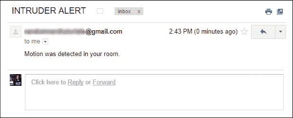

**图 10-2：** 使用 *send_email.py* 发送的电子邮件

如果您没有收到电子邮件，请验证 *send_email.py* 中的电子邮件和 SMTP 信息是否正确。另请验证您是否已授予权限，允许安全性较低的应用程序在您的电子邮件帐户设置中使用您的帐户。

### 电路接线

现在让我们将你的 PIR 传感器连接到你的 Raspberry Pi，以便它可以在传感器检测到移动时向你发送电子邮件。你还将在你的系统中包含两个 LED，一个用于指示警报是否已启动，另一个用于指示警报是否已被触发，以及一个用于启动和禁用传感器的按钮。

按照以下步骤构建入侵者警报电路，使用图 10-3 作为参考。

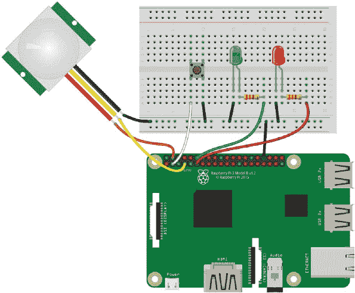

**图 10-3：** 入侵者警报电路

1.  将 Pi 的 GND 连接到面包板的蓝色导轨之一。

1.  将红色 LED 和绿色 LED 插入面包板。通过一个 330 Ω 电阻将绿色 LED 的正极引脚连接到 GPIO 18，电阻位于 LED 引脚和 GPIO 引脚之间，并将负极引脚连接到 GND 导轨。通过另一个 330 Ω 电阻将红色 LED 的正极引脚连接到 GPIO 17，并将负极引脚连接到 GND 导轨。

1.  将按钮插入面包板的中间，使其桥接中心断裂处，如图 10-3 所示。将右下角的引脚连接到 GND 导轨，将左下角的引脚连接到 GPIO 2。

1.  按照下表中的连接方式连接 PIR 运动传感器。

| **PIR 动作传感器** | **树莓派** |
| --- | --- |
| GND | GND |
| 输出 | GPIO 4 |
| VCC | 5 V |

### 编写脚本

打开**Python 3 (IDLE)**，并进入**文件** ▸ **新建文件**，创建一个新的脚本。将清单 10-2 中的代码输入新文件，并将脚本保存为*intruder_alarm.py*，保存在*Sensors*文件夹中（记得你可以在*[`www.nostarch.com/RaspberryPiProject/`](https://www.nostarch.com/RaspberryPiProject/)*下载所有脚本）：

**清单 10-2：** 入侵者报警脚本

```
  #import necessary libraries
➊ from gpiozero import LED, Button, MotionSensor
  import smtplib
  from email.mime.text import MIMEText
  from signal import pause

  #create objects to refer to each LED, the button, and the PIR sensor
➋ led_status = LED(17)
  led_triggered = LED(18)
  button = Button(2)
  pir = MotionSensor(4)

  #control variables
➌ motion_sensor_status = False
  email_sent = False

  #arm or disarm the PIR sensor
➍ def arm_motion_sensor():
      global email_sent
      global motion_sensor_status
      if motion_sensor_status == True:
          motion_sensor_status = False
          led_status.off()
          led_triggered.off()
      else:
          motion_sensor_status = True
          email_sent = False
          led_status.on()

  #send email when motion is detected and the PIR sensor is armed
➎ def send_email():
      global email_sent
      global motion_sensor_status
      if(motion_sensor_status == True and email_sent == False):

          #replace the next three lines with your credentials
          from_email_addr = '*YOUR_EMAIL@gmail.com*'
          from_email_password = '*YOUR_EMAIL_PASSWORD*'
          to_email_addr = '*TO_YOUR_OTHER_EMAIL@gmail.com*'

         #set your email message
          body = 'Motion was detected in your room.'
          msg = MIMEText(body)

          #set sender and recipient
          msg['From'] = from_email_addr
          msg['To'] = to_email_addr

          #set your email subject
          msg['Subject'] = 'INTRUDER ALERT'

          #connect to server and send email
          #edit this line with your provider's SMTP server details
          server = smtplib.SMTP('*smtp.gmail.com*', *587*)
          #comment out this line if your provider doesn't use TLS
          server.starttls()
          server.login(from_email_addr, from_email_password)
          server.sendmail(from_email_addr, to_email_addr,
  msg.as_string())
          server.quit()
          email_sent = True
          led_triggered.on()
          print('Email sent')

  #assign a function that runs when the button is pressed
➏ button.when_pressed = arm_motion_sensor
  #assign a function that runs when motion is detected
➐ pir.when_motion = send_email

➑ pause()
```

这段代码非常简单，应该和清单 10-1 中的内容非常熟悉。首先，导入所需的库 ➊，并创建`gpiozero`对象来引用 LED、按钮和动作传感器 ➋。接着在 ➌ 处创建`motion_sensor_status`和`email_sent`控制变量，以确定动作传感器是否被触发，以及邮件是否已发送。然后创建`arm_motion_sensor()`函数，当你按下按钮时，这个函数会启动和关闭动作传感器 ➍。在 ➎ 处，`send_email()`函数会在传感器检测到运动时发送电子邮件，前提是传感器被激活且`email_sent`变量为`False`。

最后，你为事件分配函数：当按下按钮时，会调用`arm_motion_sensor()`函数 ➏，而当检测到运动时，会调用`send_email()`函数 ➐。代码末尾的`pause()`函数使得脚本持续运行，以便检测事件 ➑。

注意，`send_email()`函数中有一个`if`语句条件，只有在检测到运动并且`email_sent`变量为`False`时，脚本才会发送电子邮件。当电子邮件发送后，`email_sent`变量会变为`True`，此时脚本将不再发送电子邮件。你可以通过按下按钮两次将`email_sent`变量重置为`False`，从而重新激活报警。

这个条件防止脚本发送大量不必要的电子邮件。例如，如果你把狗留在家里，而它触发了传感器；有了这个条件，你只会收到一封说检测到运动的电子邮件。如果没有这个条件，你将会收到无尽的邮件，直到你的狗离开传感器范围。

按下**F5**或进入**运行** ▸ **运行模块**来运行脚本。按下按钮激活传感器；红色状态 LED 应亮起。通过在动作传感器前挥动手测试报警。当运动被检测到时，你应该会在收件箱中收到一封新邮件，并且触发的绿色 LED 会亮起。

将此电路放置在一个战略位置，等待看看是否有人在你不在时进入你的房间。

### 进一步拓展

本项目演示了如何使用 PIR 移动传感器与树莓派配合使用，以及如何通过 Python 发送电子邮件。这些是非常实用的技能，你可以将它们与其他项目中学到的知识结合起来，发明你自己的设备。以下是一些你可以使用移动传感器构建的简单项目想法：

+   在你的报警电路中加入一个蜂鸣器，这样当检测到运动时，不仅会发送电子邮件，还会触发报警声。

+   自动化控制你房间的灯光，使其在你进入时自动打开。你可能需要一个继电器来实现这一功能—请参考项目 16，其中我们介绍了如何使用继电器。

+   使用继电器和光敏电阻制作一个安全夜灯，只有在黑暗中检测到运动时才会打开。

## 燃气和烟雾报警器**

在这个项目中，你将使用 MQ-2 燃气和烟雾传感器以及蜂鸣器构建一个燃气和烟雾报警器。每次传感器检测到大气中超过一定阈值的气体或烟雾时，蜂鸣器就会响起。

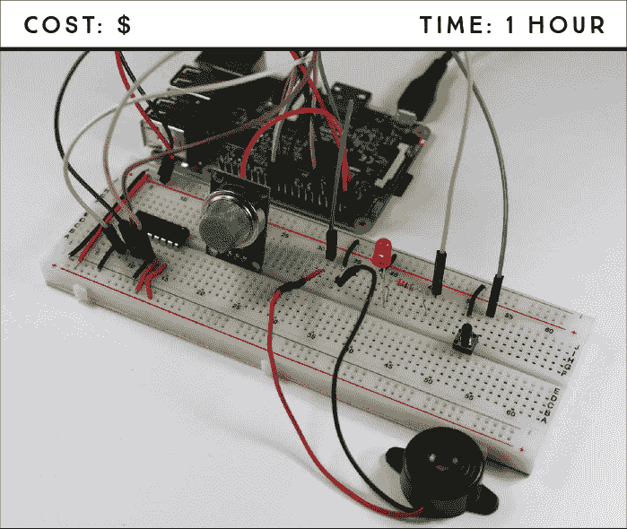

**所需部件**

树莓派

面包板

MQ-2 燃气和烟雾传感器

MCP 3008 芯片

蜂鸣器

5 毫米 LED

330 Ω 电阻

按钮

打火机

跳线

### 介绍 MQ-2 燃气和烟雾传感器

MQ-2 燃气和烟雾传感器对烟雾以及以下可燃气体敏感：丙烷、丁烷、甲烷、酒精和氢气。图 11-1 展示了传感器的正反面。

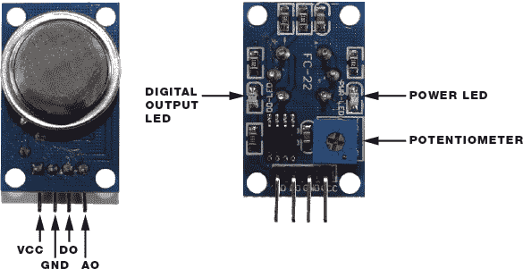

**图 11-1：** MQ-2 燃气和烟雾传感器，正反面图

MQ-2 具有两种输出气体浓度的方式。第一种方式是读取大气中的气体浓度，并通过模拟输出引脚 AO 输出模拟信号，气体浓度越高，输出电压越高。

第二种方式是设定一个阈值，如果气体浓度超过该阈值，则从数字输出引脚 DO 输出高电平信号，如果气体浓度低于该阈值，则输出低电平信号。MQ-2 后面内置有一个电位器，你可以用螺丝刀调整它来改变这个阈值。

传感器背面还配有一个电源 LED，指示传感器是否开启，以及一个数字输出 LED，当检测到的气体浓度超过设定阈值时，LED 会亮起。

你将读取模拟信号，该信号提供了气体浓度的定量测量，使你能够更好地定义阈值，超过该阈值时，蜂鸣器会警告你气体浓度过高。请记住，树莓派只能读取数字信号，因此，要使用树莓派读取模拟信号，你将使用一个模拟到数字转换模块（MCP3008 芯片），该模块在项目 3 中首次介绍。

### 介绍蜂鸣器

当蜂鸣器接收到来自树莓派的数字信号时，它会发出警报。你将使用的蜂鸣器，如图 11-2 所示，是非常简单的。


**图 11-2：** 蜂鸣器

蜂鸣器的外壳内包含一个在接收到电压时按特定频率振动的圆盘。接线压电蜂鸣器很简单。你需要做的就是将一根电线连接到树莓派的 GND 引脚，另一根连接到一个 GPIO 引脚。

### 电路接线

要构建烟雾和气体探测器报警电路，你需要将 LED 和按钮连接到树莓派；你应该已经知道如何根据之前的项目进行接线。你还需要将压电蜂鸣器和 MQ-2 传感器连接到树莓派——后者通过 MCP3008 芯片连接）。按照这些说明，使用 图 11-3 作为参考。

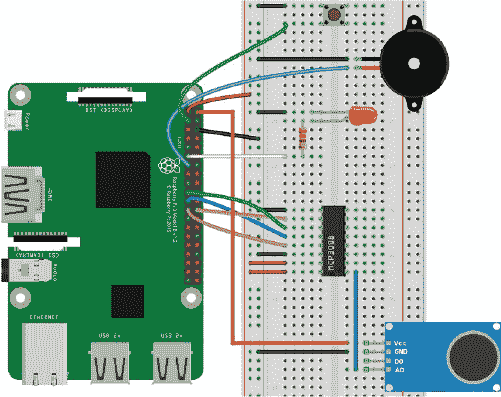

**图 11-3：** 烟雾和气体探测器电路图

1.  将 GND 连接到蓝色面包板导轨，将 3.3 V 连接到红色导轨。

1.  将 MCP3008 芯片放置在面包板的中央，使其引脚平行地位于中央分隔线两侧，如 图 11-3 所示，并按照下表接线。

    | **MCP3008** | **连接到** |
    | --- | --- |
    | 1 | MQ-2 AO 引脚 |
    | 9 | GND |
    | 10 | GPIO 8 |
    | 11 | GPIO 10 |
    | 12 | GPIO 9 |
    | 13 | GPIO 11 |
    | 14 | GND |
    | 15 | 3.3 V |
    | 16 | 3.3 V |

    记住，当 MCP3008 的半圆形标记在顶部时，引脚 1 是左侧的顶部引脚；完整的 MCP3008 引脚图请参见 “模拟到数字转换器” 第 55 页 ([ch03.xhtml#page_55])。

1.  将 MQ-2 气体和烟雾传感器插入面包板，并按照指示接线。

    | **MQ-2 传感器** | **连接到** |
    | --- | --- |
    | VCC | 5 V |
    | GND | GND |
    | DO | 无连接 |
    | AO | MCP3008 引脚 1 |

1.  将 LED 插入面包板。通过一个 330 Ω 电阻将正极引线连接到 GPIO 17，将负极引线连接到 GND 导轨。

1.  将按钮插入面包板的中央，确保两个引线位于中心分隔线的两侧。将右下方的引线连接到 GND 电源轨，将左下方的引线连接到 GPIO 2，确保连接的两个引线位于分隔线的同一侧。

1.  将蜂鸣器插入面包板，并将黑线连接到 GND，将红线连接到 GPIO 27。

电路接好后，接下来就是上传代码了。

### 编写脚本

打开 **Python 3 (IDLE)**，然后转到 **文件** ▸ **新建文件** 来创建一个新的脚本。将 清单 11-1 中的代码复制到 Python 编辑器，并将脚本保存为 *smoke_detector.py*，保存在 *Sensors* 文件夹中。（记住，你可以从 *[`www.nostarch.com/RaspberryPiProject/`](https://www.nostarch.com/RaspberryPiProject/)* 下载所有脚本）：

**清单 11-1：** 烟雾和气体探测器脚本

```
  #import necessary libraries
➊ from gpiozero import LED, Button, Buzzer, MCP3008
  from time import sleep

➋ led = LED(17)
  button = Button(2)
  buzzer = Buzzer(27)
  gas_sensor = MCP3008(0)

➌ gas_sensor_status = False

➍ threshold = 0.1

➎ def arm_gas_sensor():
      global gas_sensor_status
      if gas_sensor_status == True:
          gas_sensor_status = False
          led.off()
      else:
          gas_sensor_status = True
          led.on()
➏ button.when_pressed = arm_gas_sensor

➐ while True:
➑     #print(gas_sensor.value)
      #check if the gas sensor is armed and
      #reached the threshold value
      if(gas_sensor_status == True and gas_sensor.value > threshold):
          buzzer.beep()
      else:
          buzzer.off()
      sleep(2)
```

首先，您从 gpiozero 库导入 `LED`、`Button`、`Buzzer` 和 `MCP3008` 类，以及从 time 库导入 `sleep` 函数 ➊；然后，您创建 `gpiozero` 对象来引用 LED、按钮、MCP3008（MQ-2 气体传感器）和蜂鸣器 ➋。接下来，您创建一个 `gas_sensor_status` 变量，用来指示烟雾传感器是否已武装 ➌；如果该变量为 `True`，则表示传感器已武装，如果为 `False`，则表示未武装。您需要设置一个 `threshold` 值，以便只有当气体浓度超过该阈值时，蜂鸣器才会响起 ➍。我们稍后将介绍如何找出您的阈值值。

`arm_gas_sensor()` 函数 ➎ 通过将 `gas_sensor_status` 变量的值切换为当前值的相反值（无论是 `True` 还是 `False`），来使传感器处于武装或解除武装状态。当该函数被调用时，它会执行这一操作。 ➏ 时，您设置函数在按下按钮时调用，这样您就可以手动武装或解除武装传感器。您还设置了一个 LED，当传感器被武装时，它会亮起；这样，您就可以通过视觉识别其状态。

最后一段代码是一个 `while` 循环 ➐，它会不断检查传感器是否已武装，以及气体浓度是否超过阈值。如果传感器已武装且气体浓度超过阈值，蜂鸣器会通过 `buzzer.beep()` 函数发出声音。最后，`buzzer.off()` 函数会停止蜂鸣器。

#### 设置阈值

为了准确设置安全的气体浓度阈值，您首先需要根据环境来校准传感器。这意味着您需要在没有气体存在时测量气体浓度，然后将阈值设置为略高于此值。首先，找出您所在环境的气体浓度通常是多少：

1.  取消注释 ➑ 处的代码行，然后保存并运行脚本。

1.  您应该能在 Python shell 中看到 `gas_sensor` 的值。这些值是在传感器范围内没有气体或烟雾时读取的值。您的 `threshold` 值应该稍高于这些值。例如，如果您的默认值是 `0.07`，我们建议将阈值设置为 `0.1`，但这取决于您所需的灵敏度水平。

1.  拿一个打火机并按下触发器（不要点燃打火机）。将打火机靠近传感器，释放一些气体。Python shell 中显示的 `gas_sensor` 值应该会增加。您的 `threshold` 值应该低于暴露传感器到气体时获得的最大值。

    **警告**

    *使用打火机和气体时一定要小心；不要长时间按住气体触发器，且不要在气体已释放到空气中时点燃打火机。*

1.  根据上两步获得的值，调整 `threshold` 值 ➍ 使其介于这两者之间，这样它既不太灵敏，也不太迟钝。

1.  注释掉 ➑ 处的 `print` 语句并保存脚本。

#### 运行脚本

按下**F5**或选择**运行** ▸ **运行模块**来运行脚本。按下按钮以启动传感器。红色 LED 灯应该亮起。然后，使用打火机将一些气体释放到传感器旁，直到蜂鸣器响起，测试一下。

**警告**

*此燃气和烟雾报警器不应替代现成的烟雾探测器。*

恭喜！你现在拥有了一套燃气和烟雾报警器，可以监控你的家并警告你火灾发生！

### 进一步扩展

本项目的目的是向你展示如何读取输出模拟信号的传感器。现在，你可以为这个项目添加更多功能。例如，你可以修改脚本，当燃气或烟雾超过阈值时发送电子邮件，正如我们在项目 10 中所做的那样。

## 温湿度数据记录器**

在本项目中，你将构建一个数据记录器，自动存储温度和湿度数据。你将学习如何读取和记录来自环境的数据，这在许多应用中都非常有用。

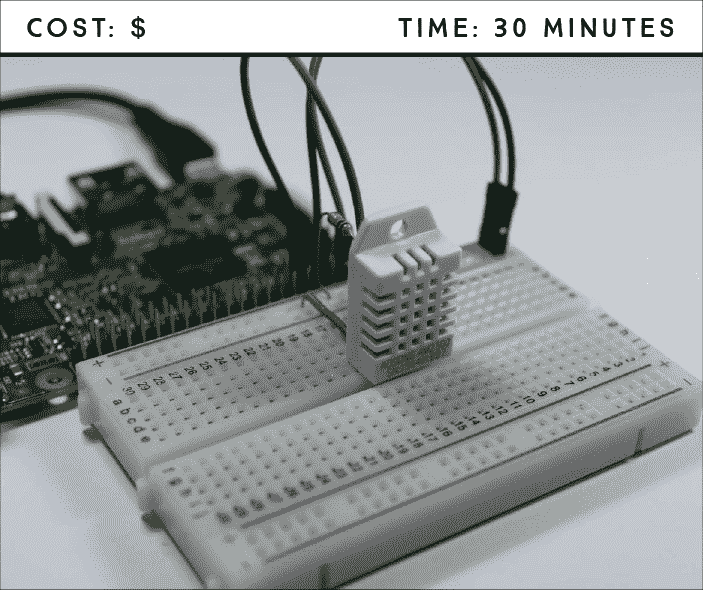

**所需组件**

树莓派

面包板

DHT22 温湿度传感器（DHT11 和 AM2302 也可以使用）

4.7 kΩ电阻

跳线

**所需软件**

Adafruit_Python_DHT 库

你将使用 DHT22 温湿度传感器来收集数据，这些数据将保存在一个*.txt*文件中，之后可以用于构建图表、图形和其他可视化内容。本项目为你提供了数据收集的基础，这在许多使用传感器的不同应用中非常有用——例如，监测土壤湿度、测量鱼缸水温，甚至在你家周围检测到意外运动的准确时间。你可以将本项目中的概念应用到任何传感器上。

### 介绍 DHT22 传感器

DHT22（见图 12-1）是一款数字温湿度传感器，内置芯片将模拟信号转换为数字信号，因此无需使用模拟到数字转换器。这使得布线变得非常简单。

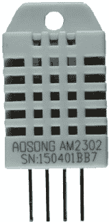

**图 12-1：** DHT22 温湿度传感器

### 电路接线

这是一个简单的电路，只需要通过电阻将 DHT22 传感器连接到你的 Pi。按照这些说明，并参考图 12-2 中的电路图。

1.  将 Pi 上的 GND 和 3.3 V 分别连接到面包板的蓝色和红色电源轨。

1.  按照以下表格连接 DHT22 传感器，传感器面对你时，插针从左到右编号为 1。确保将电阻连接在传感器的第 2 脚和面包板的红色电源轨之间。

| **DHT22** | **树莓派** |
| --- | --- |
| 1 | 3.3 V |
| 2 | GPIO 4；还需通过一个 4.7 kΩ电阻连接至 3.3 V |
| 3 | 不连接 |
| 4 | GND |

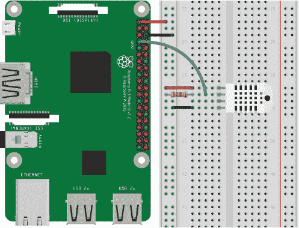

**图 12-2：** 将 DHT22 传感器连接到 Pi

### 编写脚本

你将使用 Adafruit_Python_DHT 库，它可以让你轻松控制 DHT22 传感器并读取数据。

#### 安装 DHT22 库

如果你使用的是类似的传感器，如 DHT11 或 AM2302（Adafruit 版 DHT22 的有线版本），这个库也可以使用。

打开终端并输入以下内容：

```
pi@raspberrypi:~ $ sudo apt update
pi@raspberrypi:~ $ sudo apt install build-essential python-dev
```

从终端开始，进入桌面，如果尚未创建名为*Libraries*的文件夹，则创建该文件夹，然后进入新创建的文件夹：

```
pi@raspberrypi:~ $ cd ~/Desktop
pi@raspberrypi:~/Desktop $ mkdir Libraries
pi@raspberrypi:~/Desktop $ cd Libraries
pi@raspberrypi:~/Desktop/Libraries $
```

使用以下命令克隆该库：

```
pi@raspberrypi:~/Desktop/Libraries $ git clone https://github.com/
adafruit/Adafruit_Python_DHT.git
```

最后，进入*Adafruit_Python_DHT*目录，并使用以下命令安装库：

```
pi@raspberrypi:~/Desktop/Libraries $ cd Adafruit_Python_DHT
pi@raspberrypi:~/Desktop/Libraries/Adafruit_Python_DHT $ sudo python
setup.py install
```

安装完必要的库后，接下来是编写脚本的步骤。

#### 输入脚本

DHT22 库不支持 Python 3，因此你需要使用 Python 2.7。打开**Python 2.7 (IDLE)**，然后进入**文件** ▸ **新建文件**以创建一个新的脚本。将 Listing 12-1 中的代码复制到 Python 编辑器，并将脚本保存为*temperature_humidity_data_logger.py*，并保存在*Sensors*文件夹中（记得你可以从*[`www.nostarch.com/RaspberryPiProject/`](https://www.nostarch.com/RaspberryPiProject/)*下载所有脚本）：

**LISTING 12-1：** 温湿度数据记录脚本

```
  #import necessary libraries
➊ import Adafruit_DHT
  import time

  #comment and uncomment the lines below depending on your sensor
  #sensor = Adafruit_DHT.DHT11
➋ sensor = Adafruit_DHT.DHT22
  #sensor = Adafruit_DHT.AM2302

  #DHT pin connects to GPIO 4
  sensor_pin = 4

  #create a variable to control the while loop
  running = True

  #new .txt file created with header
➌ file = open('sensor_readings.txt', 'w')
➍ file.write('time and date, temperature, humidity\n')

  #loop forever
  while running:
      try:
          #read the humidity and temperature
       ➎ humidity, temperature = Adafruit_DHT.read_retry(sensor,
  sensor_pin)

          #uncomment the line below to convert to Fahrenheit
       ➏ #temperature = temperature * 9/5.0 + 32

          #sometimes you won't get a reading and
          #the results will be null
          #the next statement guarantees that
          #it only saves valid readings
       ➐ if humidity is not None and temperature is not None:
              #print temperature and humidity
              print('Temperature = ' + str(temperature) +
  ', Humidity = ' + str(humidity))
              #save time, date, temperature and humidity in .txt file
           ➑ file.write(time.strftime('%H:%M:%S %d/%m/%Y') + ', ' +
                  str(temperature) + ', ' + str(humidity) + '\n')
          else:
              print('Failed to get reading. Try again!')
          #wait 10s between each sensor reading
       ➒ time.sleep(10)
      #if KeyboardInterrupt triggered, stop loop and close .txt file
      except KeyboardInterrupt:
          print ('Program stopped')
          running = False
       ➓ file.close()
```

首先，导入你刚刚安装的 Adafruit_DHT 库➊以及内置的 time 库。然后，在➋处取消注释与你使用的传感器对应的那一行。如果你使用的是 DHT22，就无需做任何更改。

➎处的代码读取温湿度并将读数分别保存在`temperature`和`humidity`变量中。如果你希望温度读取为华氏度，请取消注释➏处的代码行来进行摄氏度到华氏度的转换。

有时传感器无法读取数据，并将`null`结果发送到 Pi。➐处的`if`语句确保只有当数据不为`null`时，Pi 才保存数据。你还使用`time.strftime("%H:%M:%S %d/%m/%Y")`为每次读取添加时间戳——括号中的参数表示你希望时间和日期以小时、分钟、秒、日、月和年为顺序显示。

这个脚本每隔 10 秒读取并记录一次温湿度，但你可以通过在➒处更改延迟时间来调整这个间隔。传感器每 2 秒可以读取一次数据，但不能更快。

#### 创建、写入和关闭.txt 文件

DHT22 的温湿度读数会自动保存在一个*.txt*文件中，该文件通过`open()`函数➌创建并存储在`file`变量中。此函数接受你希望文件名作为参数，在本例中，`'w'`表示你希望文件处于*写入模式*，即程序可以写入并修改文件。写入模式会覆盖同名的现有文件。

**注意**

*每次运行代码时，它都会覆盖* sensor_readings.txt *文件中已经存在的内容。如果你不希望发生这种情况，请更改第➍处的文件名，以便每次运行脚本时都创建一个新文件。*

`file.write()` 函数向文件写入内容，并接受一个字符串作为参数。例如，在第➍处使用`file.write('time and date, temperature, humidity\n')`，你将“time and date, temperature, humidity”写入文件。在第➐处，你将传感器数据写入文件，在第➑处写入时间戳。`\n`告诉 Python 在下一行开始显示文本，这叫做*换行*。

最后，`file.close()` 函数 ➓ 保存并关闭文件。

#### 运行脚本

按**F5**键或进入**运行** ▸ **运行模块**来运行脚本。让脚本运行几个小时，以收集足够的数据，当你对数据记录时间满意时，通过按 CTRL-C 停止脚本。然后，你应该会在*Sensors*文件夹中得到一个包含所有数据的*sensor_readings.txt*文件。

### 进一步深入

在这个项目中，你学到了一个非常有用的概念：数据记录。现在你可以在其他监测项目中使用数据记录。这里有一些想法：

+   使用 PIR 运动传感器，每当它检测到运动时，会生成一个时间戳。

+   使用 Sense HAT 构建一个天气站数据记录器。

+   搜索其他监测传感器应用程序——例如土壤湿度、雨量和光照传感器——以构建一个温室数据记录器。
