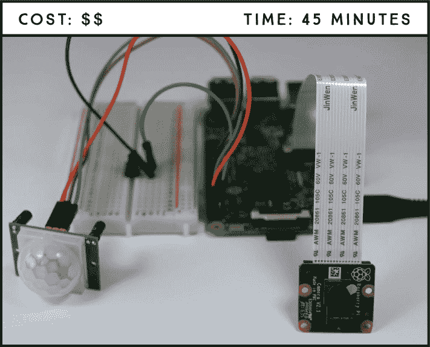
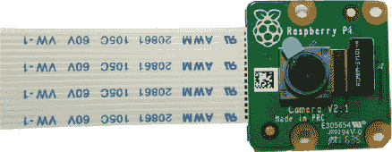
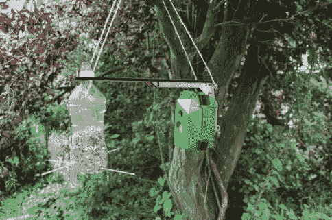
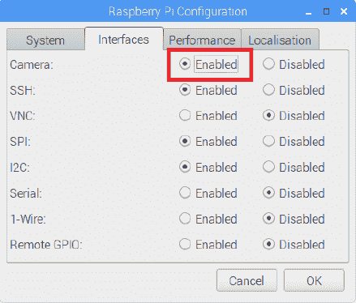
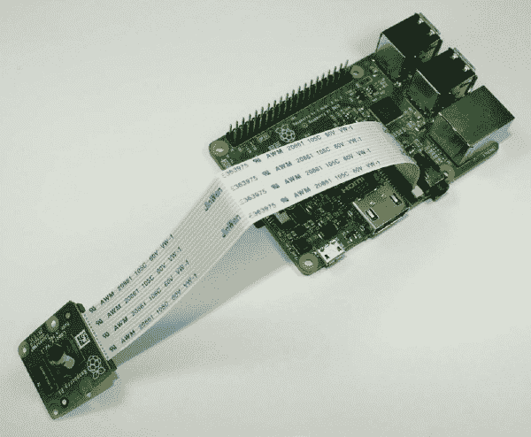
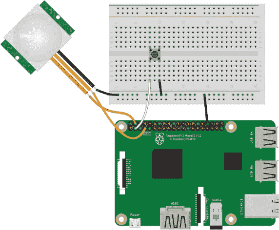
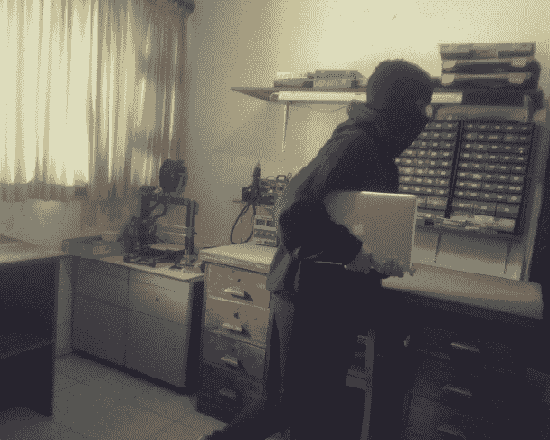
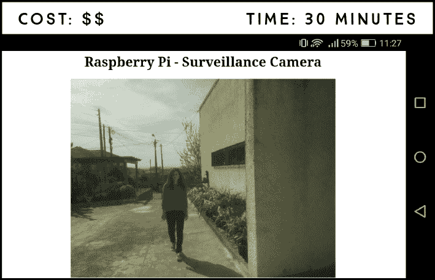
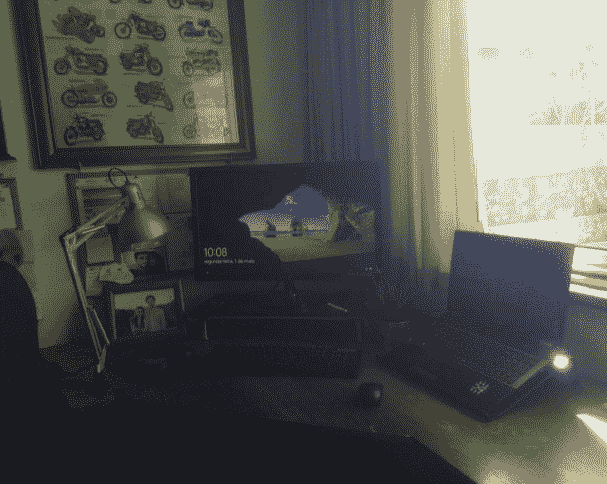
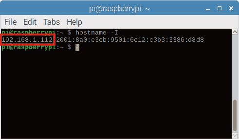

## 第五章：摄像头

## **带有照片捕捉功能的入侵检测器**

本项目将教你如何使用 Raspberry Pi Camera Module v2，结合 PIR 动态传感器，它将用于检测并拍摄入侵者的照片。当运动传感器探测到运动时，它会触发拍照事件，帮助你知道谁在你外出时进入了你的家。



**所需组件**

Raspberry Pi

面包板

Raspberry Pi Camera Module v2

PIR 动态传感器 HC-SR501

按钮

跳线

### 介绍 Raspberry Pi 摄像头模块 V2

如 图 13-1 所示，Raspberry Pi Camera Module v2 配备了一颗 8 MP 的 Sony IMX219 图像传感器，具有固定焦距镜头。它支持 3280×2464 像素的静态图像，并支持 1080p 30 帧、720p 60 帧和 640×480 90 帧的视频分辨率——这些都意味着它在这个尺寸下是非常不错的摄像头！在本项目中，你将只使用其静态图像功能。



**图 13-1：** Raspberry Pi Camera Module v2

该摄像头与所有 Raspberry Pi 型号（1、2、3 和 Zero）兼容，并附带一根 15 cm 的带状电缆，使其可以轻松连接到 Raspberry Pi 上的 CSI 接口，该接口专为与摄像头连接而设计。如果你希望摄像头距离 Pi 超过 15 cm，你可以找到并购买更长的电缆。

Raspberry Pi Camera Module v2 是 Raspberry Pi 最受欢迎的扩展之一，因为它为用户提供了一种经济实惠的方式，可以拍摄静态照片并录制全高清的视频。一个有趣的 Camera Module v2 项目来自 Naturebytes 社区，该社区提供套件，能够远程捕捉野生动物照片。图 13-2 展示了野生动物相机的实际应用。



**图 13-2：** 配备 PIR 动态传感器的 Raspberry Pi 摄像头对准鸟类喂食器

Naturebytes 套件还配备了 PIR 动态传感器，因此，如果鸟类停在 图 13-2 中的喂食器上，它将触发摄像头拍摄鸟类的照片。你将使用相同的原理来构建本项目的入侵检测器。

### 构建入侵检测器

入侵检测器由一个 PIR 动态传感器、一个按钮和一个连接到 Pi 的摄像头模块组成。你将使用内置的 picamera 库，它可以简化对摄像头的控制。

#### 启用摄像头

在你可以使用摄像头模块之前，你需要先启用 Pi 的摄像头软件。在桌面环境下，进入主菜单并选择 **首选项** ▸ **Raspberry Pi 配置**。你应该会看到类似于 图 13-3 中的窗口。



**图 13-3：** 启用摄像头软件

在摄像头行选择 **启用**，然后点击 **确定**，这样你就可以开始使用了。

#### 连接摄像头

启用相机软件后，关闭你的 Pi，然后将相机连接到 CSI 端口。确保相机连接时蓝色字母朝上，并且按照图 13-4 所示的方向进行连接。然后重新启动 Pi。



**图 13-4：** 连接树莓派相机到 CSI 端口

### 接线电路

**注意**

*在移动相机时要小心。排线非常脆弱，如果接触到 GPIO 端口，可能会永久损坏相机。可以尝试使用一些模型粘土或粘性胶带来固定相机。*

连接相机后，按照以下说明连接电路的其余部分，参考图 13-5。

1.  将一个 GND 引脚连接到面包板的 GND 轨道。

1.  将按钮插入面包板，使其横跨中心分隔。将一条引脚连接到 GND，另一条引脚连接到按钮同侧的 GPIO 2。

1.  按照下表所示的连接方式接线 PIR 运动传感器。

    | **PIR 运动传感器** | **树莓派** |
    | --- | --- |
    | GND | GND |
    | OUT | GPIO 4 |
    | VCC | 5 V |



**图 13-5：** 入侵检测器电路

### 编写脚本

要控制相机，你将使用内置的 picamera 库。它是一个非常简单的库，所以这个脚本将轻松完成。下面是代码应该执行的操作概述：

1.  初始化相机。

1.  当 PIR 运动传感器检测到运动时，拍照。

1.  将照片保存在你的*桌面*文件夹中。

1.  按顺序命名照片，这样你就能知道它们拍摄的顺序——例如，*image_1.jpg*、*image_2.jpg*，依此类推。

1.  当按下按钮时停止相机。如果不包括此功能，你将无法退出屏幕上弹出的相机预览。

#### 输入脚本

转到你的*项目*文件夹，创建一个名为*相机*的新文件夹。然后打开**Python 3 (IDLE)**，转到**文件** ▸ **新建**，创建一个名为*burglar_detector.py*的新脚本，并将以下代码复制到其中（记得你可以在*[`www.nostarch.com/RaspberryPiProject/`](https://www.nostarch.com/RaspberryPiProject/)*下载所有脚本）。

**注意**

*你不能将文件命名为* picamera.py *，因为 picamera 是一个 Python 库名称，不能使用该名称。*

```
  #import the necessary libraries
➊ from gpiozero import Button, MotionSensor
  from picamera import PiCamera
  from time import sleep
  from signal import pause

  #create objects that refer to a button,
  #a motion, sensor, and the PiCamera
➋ button = Button(2)
  pir = MotionSensor(4)
  camera = PiCamera()

  #start the camera
  camera.rotation = 180
➌ camera.start_preview()

  #create image names
➍ i = 0

  #stop the camera when the pushbutton is pressed
➎ def stop_camera():
      camera.stop_preview()
      #exit the program
      exit()

  #take a photo when motion is detected
➏ def take_photo():
      global i
      i = i + 1
      camera.capture('/home/pi/Desktop/image_%s.jpg' % i)
      print('A photo has been taken')
➐    sleep(10)

  #assign a function that runs when the button is pressed
➑ button.when_pressed = stop_camera
  #assign a function that runs when motion is detected
➒ pir.when_motion = take_photo

  pause()
```

首先导入所需的库 ➊；正如我们所说，程序使用 picamera 库来控制相机。你应该已经熟悉这里使用的其他模块，这些模块在之前的项目中都有使用。然后创建对象来引用按钮、PIR 运动传感器和相机 ➋，并通过`camera.start_preview()` ➌初始化相机。根据相机的方向，可能还需要使用`camera.rotation = 180`将其旋转 180 度，以免拍摄倒立的照片。如果测试代码时图像倒立，请返回并将旋转设置为`0`，或者注释掉这一行。

接下来，你初始化一个从 `0` 开始的 `i` 变量 ➍。在 ➏ 处定义的 `take_photo()` 函数将使用这个变量来计数并给图片编号，每拍一张照片，文件名中的数字就递增 1。

然后你定义了 `stop_camera()` 函数，使用 `camera.stop_preview()` 方法停止摄像头 ➎。在 ➏ 处，你定义了刚才提到的 `take_photo()` 函数，用来拍照。为此，你使用 `camera.capture()` 方法，并在括号中指定你希望保存图片的目录。在这种情况下，我们将图片保存到 *Desktop* 文件夹，并将图片命名为 `image_%s.jpg`，其中 `%s` 会被我们之前在 `i` 中递增的数字替代。如果你想将文件保存到其他文件夹，只需将该目录替换为你选择的文件夹路径。

接着，你添加了一个 10 秒的延迟 ➐，这意味着只要 PIR 传感器检测到运动，摄像头将每隔 10 秒拍一次照片。你可以自由增加或减少延迟时间，但要小心不要通过将延迟时间设置得过小来让 Pi 被大量图片压垮。

在 ➑ 处，你定义了按下按钮时触发 `stop_camera()` 函数的行为。这个函数停止摄像头预览并退出程序。`exit()` 函数会弹出一个窗口，询问你是否要关闭程序；要关闭它，只需点击**确定**。最后，当检测到运动时，你通过触发 `take_photo()` 函数来让摄像头拍照 ➒。

#### 运行脚本

按下**F5**或进入**运行** ▸ **运行模块**来运行脚本。在脚本运行时，你应该能在屏幕上看到摄像头所看到的预览画面。要关闭摄像头预览，按下按钮并在弹出的窗口中点击**确定**。

恭喜！你的入侵探测器已经准备好抓捕窃贼了。将入侵探测器放在一个战略位置，稍后回来查看任何保存的照片。图 13-6 显示了我们入侵探测器拍摄的一张照片，捕捉到有人从我们的实验室偷走一台电脑。



**图 13-6：** 用入侵探测器拍摄的照片

### 进一步探索

如你所见，带有摄像头的项目非常有趣！这是一个改进你安全系统的想法：重新设计你的项目，使得当传感器检测到运动时，Raspberry Pi 拍照，发送电子邮件通知，并触发警报。你应该已经掌握了如何利用第 9 项–第 12 项中学到的技能来完成这一切。

## 家庭监控摄像头**

在这个项目中，你将创建一个家庭监控摄像头系统，它将实时视频流传输到网页上，你可以通过任何连接到与 Raspberry Pi 相同网络的设备上的浏览器访问。这意味着你可以在不离开沙发的情况下监控家中的任何地方！



**所需零件**

Raspberry Pi

树莓派摄像头模块 v2

在本项目中，你需要将摄像头连接到树莓派，就像我们在“连接摄像头”中展示的那样，位于第 165 页。如果你还没有启用软件摄像头，请返回第 13 项目，按照说明设置摄像头，然后再继续。

### 将视频录制到文件

在构建你的家庭监控摄像头系统之前，你需要学习如何将视频录制到文件中。

参考第 13 项目，通过 CSI 端口将树莓派摄像头模块 v2 连接到你的树莓派。创建一个新的脚本文件，命名为*record_file.py*，在**Python 3 (IDLE)**中保存，并将其放入*Cameras*文件夹中，输入 LISTING 14-1 中的代码。

**LISTING 14-1:** 将视频录制到文件

```
➊ import picamera

➋ camera = picamera.PiCamera()

➌ camera.resolution = (640, 480)
➍ camera.start_recording('videotest.h264')
➎ camera.wait_recording(60)
➏ camera.stop_recording()

  print('Finished recording')
```

和往常一样，首先导入 picamera 库来控制摄像头 ➊。你创建一个名为`camera`的对象来引用摄像头 ➋，然后将摄像头的分辨率设置为 640×480 ➌。摄像头的分辨率是可配置的；视频录制的最大分辨率为 1920×1080，最小分辨率为 64×64。为了启用最大分辨率，还需要通过添加`camera.framerate = 15`这一行代码来设置帧率为 15。你现在可以尝试使用不同的分辨率测试此脚本，看看哪种最适合你，或者你可以先使用我们的设置，稍后再进行调整。

然后，摄像头开始录制到名为*videotest.h264*的文件中 ➍。当然，你可以更改文件名，但应保持文件扩展名为*.h264*，因为这是视频文件的格式。接着，你需要指定摄像头录制的时间 ➎。在这个例子中，摄像头录制 60 秒。`wait_recording()`方法也会反复检查是否有错误，比如磁盘空间不足以继续录制。

最后，你停止视频录制 ➏，并打印一条消息表示录制已完成。按**F5**或转到**运行** ▸ **运行模块**来运行脚本。你的视频文件位于脚本所在的*Cameras*文件夹中。从终端中输入以下命令导航到视频文件夹并观看：

```
pi@raspberrypi:~ $ cd ~/Desktop/Projects/Cameras
pi@raspberrypi:~/Desktop/Projects/Cameras $ omxplayer videotest.h264
```

这会打开一个新窗口并全屏播放整个视频。Figure 14-1 显示了我们视频录制测试的截图。



**FIGURE 14-1:** 使用树莓派摄像头录制视频

### 编写脚本

现在是关键部分：你将构建一个托管在树莓派上的网页——也就是一个*Web 服务器*——用于直播视频流。（我们将在第 15 项目、16 项目和 17 项目中详细讨论 Web 服务器。）

本项目的脚本较为复杂，因此我们不会详细解释每一行。以下是代码应该执行的概览：

1.  初始化 Web 服务器和 Pi 摄像头。

1.  设置网页服务器，在树莓派的 IP 地址和端口 8000 下显示一个你可以使用 HTML 自定义的网页。

1.  设置网页以显示摄像头的视频流。

1.  使得网页服务器可以从任何连接到同一网络的浏览器访问。

#### 输入脚本

打开**Python 3 (IDLE)**，然后进入**文件** ▸ **新建**来创建一个新脚本。输入清单 14-2 中的代码，并将其保存在*Cameras*文件夹中，命名为*surveillance_system.py*（记得你可以从*[`www.nostarch.com/RaspberryPiProject/`](https://www.nostarch.com/RaspberryPiProject/)*下载所有脚本）。

这个脚本是基于* [`picamera.readthedocs.io/en/latest/recipes2.html`](http://picamera.readthedocs.io/en/latest/recipes2.html)*上的流媒体示例。

**清单 14-2：** 将视频流传输到网页

```
  import io
  import picamera
  import logging
  import socketserver
  from threading import Condition
  from http import server

➊ PAGE="""\
  <html>
  <head>
  <title>Raspberry Pi - Surveillance Camera</title>
  </head>
  <body>
  <center><h1>Raspberry Pi - Surveillance Camera</h1></center>
  <center></center>
  </body>
  </html>
  """

  class StreamingOutput(object):
      def __init__(self):
          self.frame = None
          self.buffer = io.BytesIO()
          self.condition = Condition()

      def write(self, buf):
          if buf.startswith(b'\xff\xd8'):
              #new frame, copy the existing buffer's content and
              #notify all clients it's available
              self.buffer.truncate()
              with self.condition:
                  self.frame = self.buffer.getvalue()
                  self.condition.notify_all()
              self.buffer.seek(0)
          return self.buffer.write(buf)

  class StreamingHandler(server.BaseHTTPRequestHandler):
      def do_GET(self):
          if self.path == '/':
              self.send_response(301)
              self.send_header('Location', '/index.html')
              self.end_headers()
          elif self.path == '/index.html':
              content = PAGE.encode('utf-8')
              self.send_response(200)
              self.send_header('Content-Type', 'text/html')
              self.send_header('Content-Length', len(content))
              self.end_headers()
              self.wfile.write(content)
          elif self.path == '/stream.mjpg':
              self.send_response(200)
              self.send_header('Age', 0)
              self.send_header('Cache-Control', 'no-cache, private')
              self.send_header('Pragma', 'no-cache')
              self.send_header('Content-Type', 
  'multipart/x-mixed-replace; boundary=FRAME')
              self.end_headers()
              try:
                  while True:
                      with output.condition:
                          output.condition.wait()
                          frame = output.frame
                      self.wfile.write(b'--FRAME\r\n')
                      self.send_header('Content-Type', 'image/jpeg')
                      self.send_header('Content-Length', len(frame))
                      self.end_headers()
                      self.wfile.write(frame)
                      self.wfile.write(b'\r\n')
              except Exception as e:
                  logging.warning(
                      'Removed streaming client %s: %s',
                      self.client_address, str(e))
          else:
              self.send_error(404)
              self.end_headers()

  class StreamingServer(socketserver.ThreadingMixIn,
  server.HTTPServer):
      allow_reuse_address = True
      daemon_threads = True

➋ with picamera.PiCamera(resolution='640x480', framerate=24) as
  camera:
      output = StreamingOutput()
      camera.start_recording(output, format='mjpeg')
      try:
          address = ('', 8000)
          server = StreamingServer(address, StreamingHandler)
          server.serve_forever()
      finally:
          camera.stop_recording()
```

清单 14-2 比我们之前写的脚本要复杂，并且解释视频流所需的每个类和函数超出了本书的范围，因此我们不会在这里详细介绍。

当然，仍然有定制的空间。你可以编辑网页的外观以及摄像头设置：

+   在➊处，你使用 HTML 定义网页内容；在这里，你可以更改网页的标题和标题。有关 HTML 的更多信息，请查看项目 15，并学习如何使用 CSS 为网页设置样式。

+   在➋处，你初始化了摄像头；在这里，你可以更改摄像头的分辨率和帧率。

#### 运行脚本

按**F5**或进入**运行** ▸ **运行模块**来运行脚本。脚本运行后，你的摄像头将向网页流式传输视频。要访问此网页，你需要找到树莓派的 IP 地址，并输入网址*http://<Pi IP address>:8000*，将*<Pi IP address>*替换为你树莓派的 IP 地址。

要找到树莓派的 IP 地址，请打开终端并输入以下命令：

```
pi@raspberrypi:~ $ hostname -I
```

这将打印出树莓派的 IP 地址，如图 14-2 中所示。



**图 14-2：** 查找树莓派的 IP 地址

恭喜你——你已经建立了自己的家庭监控系统！你可以通过连接到本地网络的计算机、智能手机或平板电脑浏览器访问视频流。在这个例子中，由于我们的 IP 地址是 192.168.1.112，我们输入*http://192.168.1.112:8000*。确保使用你自己的 IP 地址。

### 进一步探索

在这个项目中，你学会了如何录制视频，并且如何构建一个可以流式传输实时视频的网页服务器。你可以将所学内容与其他项目结合，进一步增强它们。例如：

+   编辑项目 13，使得当树莓派在你外出时检测到家里有运动时，它会录制视频一段指定时间。

+   使用项目 15 中学到的技巧，使用 CSS 自定义流媒体网页。
