## 第六章：Web 应用程序

## **创建你的第一个网站**

在这个项目中，你将构建一个简单的网站，其中包含标题、段落、图片、链接和按钮。你将使用 HTML 来创建页面，并使用 CSS 来进行样式设置。你在这里学到的技能可以用来构建任何你想要的网站。


**所需部件**

树莓派

### 设置项目文件

对于这个项目，你不需要任何电路；所有工作都在你的树莓派桌面计算机上完成。你将使用文本编辑器程序创建 HTML 和 CSS 文件。要访问文本编辑器，从桌面的主菜单进入**配件** ▸ **文本编辑器**。

这个项目需要几个文件，因此我们建议你为这个项目创建一个专门的文件夹。在你的*Projects*目录下创建一个名为*Web_Applications*的新文件夹，然后再创建一个名为*Project_15*的项目文件夹。

打开文本编辑器后，使用 CTRL-N 创建两个空白文件；你需要为每个文件做一次。然后将这些文件保存在*Project_15*文件夹中，并将它们命名为*index.html*和*style.css*，如图 15-1 所示。你可以在[`www.nostarch.com/RaspberryPiProject/`](https://www.nostarch.com/RaspberryPiProject/)下载脚本。

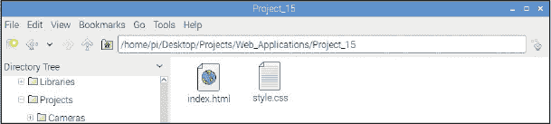

**图 15-1：** 创建 HTML 和 CSS 文件

### 设置 HTML 网页

*HTML*，即*超文本标记语言*，是用于创建网页的主要标记语言。网页浏览器是为了读取 HTML*标签*而设计的，这些标签告诉浏览器如何在页面上显示内容。让我们来看看标签是如何工作的。

#### 设置基本内容

以下代码片段显示了 HTML 文档的基本结构。使用文本编辑器打开你的*index.html*文件，并输入列表 15-1 中的内容。

**列表 15-1：** HTML 网页的基本结构

```
  <!DOCTYPE html>
➊ <html>
➋ <head>
  </head>
➌ <body>
  </body>
  </html>
```

该文档只是 HTML 标签的列表，用`< >`符号括起来。任何 HTML 文档的第一行总是`<!DOCTYPE html>`。这告诉网页浏览器该文档是一个 HTML 文件。

剩余的结构需要被夹在`<html>` ➊和`</html>`标签之间，前者表示网页的开始，后者表示网页的结束。请注意，关闭标签必须在`<`符号后加上`/`，这对所有 HTML 的闭合标签都适用。然而，并不是所有的 HTML 标签都需要闭合标签，稍后你会看到。

HTML 文档有两个主要部分：头部和正文。*头部*，位于`<head>` ➋和`</head>`标签之间，是你插入 HTML 文档数据的地方，这些数据不会直接显示在页面上，但能为网页增加功能，如显示在浏览器标签中的标题、脚本、样式等。*正文*，位于`<body>` ➌和`</body>`标签之间，包含页面内容，如标题、文本、图片、表格等。

#### 添加标题、标题和段落

要查看您的网页效果，请打开任务栏菜单并启动 Chromium 浏览器，然后将*index.html*文件拖入 Chromium 浏览器中。此时，您应该只看到一个空白页面，因为您尚未向 HTML 文件中添加任何内容。在本节中，您将添加标题、标题和段落。

##### 使用标题标签

标题应放在`<title>`和`</title>`标签之间，这些标签应该放在`<head>`和`</head>`标签之间。为您的文件添加一个标题，如下所示：

```
<head>
<title>Max - The Dog</title>
</head>
```

**注意**

*在保存 HTML 文件后，您可以简单地刷新网页，而无需再次将文件拖入浏览器；更改会立即更新。*

如果您保存了*index.html*并再次将文件拖入浏览器，不要惊讶于仍然看到一个空白页面。标题会显示在浏览器标签中，而不是页面本身。我们将网页命名为“Max – The Dog”，但您可以将页面命名为任何您喜欢的名字。

##### 使用标题标签

您可以使用标题来组织网页上的文本。标题标签以`h`开头，后面跟着一个数字，表示标题级别。例如，`<h1>`和`</h1>`是标题 1 的标签，即最高级别；`<h2>`和`</h2>`是标题 2 的标签，以此类推，直到标题 6，这是标题的最低级别。标题标签应放在`<body>`和`</body>`标签之间。现在，创建几个标题并将其放入文件的主体部分：

```
<body>
  <h1>MAX - THE DOG</h1>
  <h2>About Max</h2>
</body>
```

我们在页面上添加了两个标题：“MAX – THE DOG”是顶级标题，下面的标题是“关于 Max”。现在是时候在这些标题下添加一些文本了。

##### 使用段落标签

大多数可读内容应该放在段落中。每个段落需要放在`<p>`和`</p>`标签之间。为您的文件添加一两个段落，如下所示：

```
  <h2>About Max</h2>
  <p>Howdy, I'm Max. I'm an aspiring police dog living in Portugal.
I enjoy barking, running, and playing catch. I like meat, bones, and
leftovers.</p>
  <p>My favorite TV series is Inspector Rex.</p>
```

现在，您已经有了自己的网页！可以随意添加任意数量的段落和标题。

#### 查看您的网页

保存您的*index.html*文档并刷新网页。图 15-2 显示了此时 Max 的网页样子。

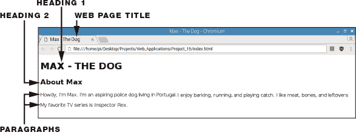

**图 15-2：** 一个简单的 HTML 页面

如您所见，HTML 除了将原始文本添加到页面外，几乎没有其他功能；它主要是由一系列段落组成，看起来并不漂亮。稍后，您将使用 CSS 来为细节进行样式设置，使页面看起来更加吸引人。

#### 添加链接、图片和按钮

任何一个自尊的网页都不应仅仅包含文字。我们将展示如何添加图片、按钮、更多页面以及指向其他页面的链接。

##### 包含超链接

要添加指向互联网上其他页面的超链接，可以将`<a>`标签放在`<body>`和`</body>`标签之间的任何位置。例如，您可以像这样插入指向《Inspector Rex》维基百科页面的超链接：

```
<a href="https://en.wikipedia.org/wiki/Inspector_Rex">Inspector
Rex</a>
```

`a`代表*锚点*，位于这些标签之间的文本称为*锚文本*，在此情况下是`Inspector Rex`。在`<a>`标签内部，我们包括了`href`属性，它指定了链接应指向的地址。锚文本是页面访问者在页面上看到的内容；当他们点击该文本时，Inspector Rex 的维基百科页面会打开。

大多数网站都有多个页面，你可以在这些页面之间进行导航。页面之间的导航也是通过超链接完成的。例如，如果你想插入一个新页面——比如 Max 的照片画廊——你可以像这样链接到它：

```
<a href="gallery.html">Take a look at my gallery</a>
```

单独使用该链接不会带你到任何地方，因为它指向的页面还不存在。你需要创建*gallery.html*文件并将其保存在与你的*index.html*文件相同的文件夹中。在这个项目中你不会创建其他页面，但现在你知道如何去做了。

##### 包含图片

图片让任何网站看起来更吸引人。要插入图片，你使用``标签，它没有闭合标签，因为你在尖括号`<>`中列出要显示的图片。你想要包含的图片文件必须保存在网站的文件夹中——在此情况下是*Project_15*——才能显示在网页上。要插入名为*max.jpg*的图片，你使用以下代码：

```

```

`src`表示图片文件的位置。因为我们将图片保存在网站的文件夹中，所以只需使用图片文件名即可。在代码中将`max.jpg`替换为你自己的图片文件名。你也可以通过将`max.jpg`替换为超链接，使用指向图片的链接。

你可以通过手动编辑图片文件或在``标签内使用`height`属性来调整图片的大小。例如，要将图片高度调整为 350 像素，你可以使用：

```

```

宽度会根据高度自动调整。你也可以使用`width`属性来改变宽度，且高度会自动调整。

``标签必须位于`<p>`或`<div>`标签内部——你可以使用`<div>`标签在你的页面内容中创建一个部分（参见 Listing 15-2）。

##### 包含按钮

要在你的页面中包含一个按钮，插入你想要的按钮标签，放在`<button>`和`</button>`标签之间。我们想插入一个指向有趣警犬追逐视频的按钮，所以我们使用：

```
<button>Funny police dog chase</button>
```

为了使按钮可点击并将你重定向到视频页面，在`<a>`超链接标签之间插入按钮标签，指向相关的视频：

```
<a href="https://youtu.be/znM9YD2J3Cw"><button>Funny police dog
chase</button></a>
```

##### 查看 Max 的 HTML 文件

我们已经在 Max 的网页中添加了一张图片、一个链接和一个按钮。Listing 15-2 中的代码显示了目前 HTML 文档的样子。

**LISTING 15-2：** Max 网页的 HTML 文档，包含一个链接、一张图片和一个按钮

```
  <!DOCTYPE html>
  <html>
  <head>
  <title>Max - The Dog</title>
  </head>
  <body>
➊ <header>
➋   <div class="title">
      <h1>MAX - THE DOG</h1>
➌   </div>
➍ </header>

➎ <main>
    <h2>About Max</h2>
    <p>Howdy, I'm Max. I'm an aspiring police dog living in Portugal.
  I enjoy barking, running, and playing catch. I like meat, bones, and
  leftovers.</p>
    <p>My favorite TV series is <a href="https://en.wikipedia.org/
  wiki/Inspector_Rex">Inspector Rex</a>.</p>
    <p></p>
    <a href="https://youtu.be/znM9YD2J3Cw"><button>Funny police dog
  chase</button></a>
➏ </main>
  </body>
  </html>
```

请注意，我们添加了三个新标签：

+   `<header>` ➊和`</header>` ➍包含了介绍性内容。在这些标签内部是一级标题。

+   `<div class="title">` ➋ 和 `</div>` ➌ 用于定义一个区块或部分。`class`属性名为`title`，表示 HTML 元素是某个特定类的成员——在这个例子中是`title`类，但你可以为它指定任何你想要的名字。使用`class`属性很有用，因为它允许你为属于同一类的多个元素在 CSS 中定义相同的样式。

+   `<main>` ➎ 和 `</main>` ➏ 用于指定文档的主要内容。这里应该放置文档特有的内容——即网站中不重复的内容。单个 HTML 文档中不应有多个`<main>`元素。

我们这样构建 HTML 内容，因为这使得以后使用 CSS 来格式化页面更加容易。图 15-3 展示了在列表 15-2 中的 HTML 文件下，网页的外观。

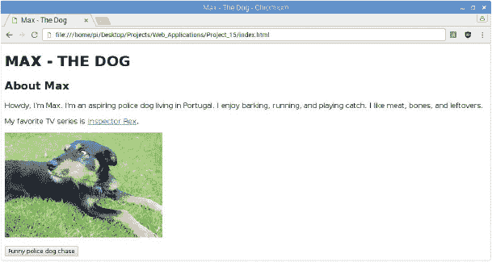

**图 15-3：** Max 的网页，包含链接、图像和按钮

### 使用 CSS 样式化你的页面

现在你将添加*CSS*（层叠样式表），这是一种用于描述网页元素渲染后外观的样式表语言。你可以将 CSS 直接添加到 HTML 文件中，或者在一个单独的文件中进行引用。在这个项目中，你将为 CSS 文档创建一个单独的文件；这样，阅读 CSS 和 HTML 文件时会更加清晰，便于理解它们的作用。

#### 嵌入样式表

在进入 CSS 文档本身之前，你需要将样式表嵌入到*index.html*文件中，这样 HTML 就知道要引用外部 CSS 文件。为此，在`<head>`和`</head>`标签之间添加以下行：

```
<link rel="stylesheet" type="text/css" href="style.css">
```

这个`<link>`标签告诉 HTML 文件你正在使用外部样式表来格式化页面的外观。`rel`属性指定外部文件的性质，在这种情况下，它是一个样式表——CSS 文件——将用于改变页面的外观。`type`属性设置为`"text/css"`，表示你正在使用 CSS 文件来定义样式。`href`属性指示文件的位置；同样，由于文件位于网站的文件夹中，你只需要引用文件名。

在你添加了指向样式表的链接后，你的头部应该像列表 15-3 一样。

**列表 15-3：** 在 HTML 文档中链接到 CSS 样式表

```
<head>
    <title>Max - The Dog</title>
    <link rel="stylesheet" type="text/css" href="style.css">
</head>
```

使用这个额外的标签，样式表与 HTML 文档连接起来。创建一个单独的样式表是很有用的，因为你可以通过一行代码将同样的样式表嵌入到多个网页中。

#### 样式化你的 HTML 内容

要样式化你的 HTML 内容，CSS 使用*选择器*来定义一组 CSS 规则应用于哪些元素。它们有*属性*，而这些属性又有*值*。代码将如下所示：

```
*selector* {
    *property*: *value*;
}
```

定义某个选择器样式的规则集应位于大括号`{}`之间。你用冒号（`:`）为属性赋值，每个值后面应以分号（`;`）结尾。每个选择器可以有多个属性，通常也有多个。

#### 样式化头部

如果你按照指示操作，你应该在*Project_15*文件夹中有一个*style.css*文件以及一个*index.html*文件。打开*style.css*文件并通过输入列表 15-4 中的内容来编辑头部样式。

**列表 15-4：** 使用 CSS 样式化头部

```
  header {
➊   background: url(background.jpg);
➋   background-size: cover;
➌   height: 70vh;
  }
```

在这个列表中，`header`是选择器，这意味着你将在大括号中描述的样式规则将应用于网页的头部区域。记住，头部区域是位于`<header>`和`</header>`标签之间的内容，通常包括介绍性内容。在这里，我们插入了一张背景图像——一张 Max 的美丽照片。为此，我们使用`background`属性，其值为`url(background.jpg)` ➊；在`url()`内，你写入图像的路径目录。将`background.jpg`替换为你希望用作背景的图像名称。因为你要将图像文件保存在与 HTML 和 CSS 文件相同的文件夹中，所以只需引用图像文件名。

将`cover`值赋给`background-size`属性➋。这表示背景图像应该填充整个头部区域。

`height`属性的值为`70vh` ➌，表示头部的高度。你可以使用多种单位来设置高度，但我们使用`vh`（视口高度），它相对于视口高度的 1%的比例，确保头部元素能够适应视口。这条指令意味着无论浏览器窗口的大小如何，头部将占据网页窗口的 70%。你可以尝试其他百分比值，看看页面效果如何。

保存 CSS 文件并刷新包含 HTML 文档的浏览器标签，以查看你新样式化的网页效果。

#### 样式化 title 类

现在你将编辑`title`类，它包含任何位于`<div class="title">`和`</div>`标签之间的内容。这些标签位于`<header>`和`</header>`标签之间，这意味着`header`是`title`类的*祖先*。将列表 15-5 中的代码片段添加到你的 CSS 文件中。

**列表 15-5：** 样式化`title`类

```
  .title {
➊   position: absolute;
➋   top: 50%;
➌   left: 50%;
➍   transform: translate(-50%, -40%);
➎   color: white;
➏   text-align: center;
  }
```

要选择具有特定类的元素，使用一个点（`.`）后跟类名，如`.title`。我们将一步步教你每个元素的操作。

##### 调整位置

你可以使用`top`、`bottom`、`left`和`right`属性来定位元素，但首先你需要设置`position`属性➊。

元素在页面上的定位方式取决于`position`值是否设置为`static`、`relative`、`fixed`或`absolute`。

**位置属性**

`position` 属性可以具有以下值：

static

一个 `static` 值的元素根据页面的正常流进行定位，并且不受 `top`、`bottom`、`left` 和 `right` 属性的影响。默认情况下，HTML 元素是 `static`。

relative

一个 `relative` 值的元素相对于其默认位置进行定位，使用 `top`、`bottom`、`left` 和 `right` 属性。

fixed

一个 `fixed` 值的元素即使在页面滚动时也会保持在相同的位置。要将元素定位在视口上，使用 `top`、`bottom`、`left` 和 `right` 属性。

absolute

一个 `absolute` 值的元素相对于其最近的祖先进行定位。要调整位置，使用 `top`、`bottom`、`left` 和 `right` 属性。

在这种情况下，我们使用的是 `absolute` 值。这意味着每个元素相对于其最近的祖先进行定位，在本例中是标题区域。查看图 15-4 以了解 `title` 类元素如何相对于标题进行定位。

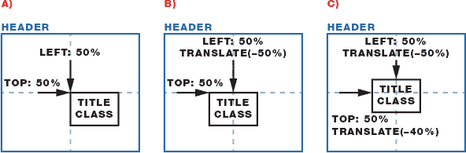

**图 15-4：** 在标题区域内定位 `title` 类元素

`top` ➋ 和 `left` ➌ 属性指定了每个元素相对于其祖先的位置，以百分比形式表示，表示元素在页面中出现的位置，其中`0%`表示其祖先的最左边和最上边。`top` 和 `left` 的`50%`值将 `title` 类区域的左上角移动到其祖先的中间。这意味着 `title` 类区域的左上角，而不是其中心点，将被定位在标题区域的中心位置；请查看图 15-4（A）。你可以通过 `transform` 属性来调整此位置。

`transform` 属性 ➍，结合 `translate(–50%, –40%)` 值，可以移动元素的位置。`–50%` 值将 `title` 类元素相对于其大小向左移动 50%，这会使它在水平上居中于标题区域——请查看图 15-4（B）。我们还将 `–40%` 应用于垂直位置，将其从底部向上移动 40%（请参见图 15-4（C））。尝试使用不同的值，看看它如何变化。`–50%` 和 `–40%` 对于 Max 的页面来说效果很好，但根据你的背景图像，你可能需要将文本移动到不同的位置。

##### 设置文本颜色和对齐方式

`color` ➎ 和 `text-align` ➏ 属性分别定义了文本颜色和文本对齐方式。你可以通过颜色名称（HTML 识别基本颜色名称）或使用十六进制或 RGB 颜色代码来设置颜色。我们使用十六进制代码。你可以搜索*十六进制颜色选择器*来查找特定颜色的十六进制参考。`text-align`属性有几个值，如`left`、`right`、`center`和`justify`，用于将文本左对齐、右对齐、居中或两端对齐。

#### 样式化标题、段落和链接

Listing 15-6 样式化标题、段落和链接。将这些样式添加到你的 CSS 文档中。

**LISTING 15-6:** 样式化标题、段落和超链接

```
  h1 {
➊   font-size: 4rem;
  }
  h2 {
    font-size: 2.5rem;
  }
  p {
    font-size: 1.3rem;
  }
➋ main {
    max-width: 500px;
    margin:0 auto;
  }
  a {
➌   text-decoration: none;
  }
```

要定义文本大小，请使用`font-size`属性 ➊。定义字体大小有几种单位，但我们将使用`rem`单位。*Rem*是根元素上`font-size`的计算值——我们使用一种字体大小作为页面的参考。这意味着所有字体大小都是相对的，减少了使用旧字体大小单位时可能出现的问题，因为这些单位在不同屏幕尺寸的设备上查看页面时可能会导致不规则性。

当在根元素的`font-size`属性中使用时，rem 单位指的是该属性的初始值。因此，1rem 等于 HTML 元素的字体大小——也就是大多数浏览器中默认的 16 像素。

在 Listing 15-6 中，我们分别为标题 1、标题 2 和段落定义了`4`、`2.5`和`1.3`rem 的字体大小，使每个标题级别比上一个标题稍小，最低级别的字体稍大于默认文本。

`main`部分格式化页面的主要内容 ➋。我们将内容的最大宽度设置为`500px`。定义元素的宽度可以防止元素扩展到其容器的边界；在这种情况下，它防止文本在网页浏览器窗口中水平扩展。然后，我们将边距设置为`auto`，以使元素水平居中。

超链接默认是带下划线的。将`text-``decoration`设置为`none` ➌以去除下划线。

#### 样式化按钮

要样式化按钮，请将 Listing 15-7 中的样式复制到你的*style.css*文档文件中。

**LISTING 15-7:** 按钮样式

```
button {
  display: block;
  margin: 0 auto;
  padding: 10px 20px;
  font-size: 1.7rem;
  border-radius: 4px;
  color: #fff;
  background-color: #009933;
  border: none;
}
```

设置`display`为`block`确保按钮以块级元素的形式显示，就像段落一样；例如，按钮将不会和文本元素在同一行。我们使用`padding`属性为内容添加空白区域。我们为按钮的上下边距设置`10px`，左右边距设置`20px`——这决定了按钮内容周围的空间。注意，这里我们使用十六进制颜色代码来设置按钮文本和按钮背景的颜色。其他按钮属性不言自明。你可以通过调整这些属性来定制按钮的样式。你也可以在网上搜索*button properties CSS*来了解更多属性和值。

保存你的*style.css*文件并刷新浏览器，以查看你所做的更改。现在你应该有一个简单的网页，类似于项目开始时展示的页面。

### 进一步发展

这个项目只是一个快速介绍，讲解如何使用 HTML 和 CSS 构建一个简单的网页。你可以通过无数种方式编辑和改进它。我们鼓励你尝试这里介绍的所有选项。为了获得灵感，你可以：

+   向你的主页添加多个页面，并使用超链接相互连接。

+   创建一个展示你树莓派项目的网页。

+   在网上搜索更多 CSS 属性和值，并编辑网页的外观。

## 将你的电子设备连接到网络**

在这个项目中，你将创建自己的物联网网络服务器，使用手机远程控制灯泡。你构建的简单网络服务器可以添加到其他项目中，以便控制其他电子设备。

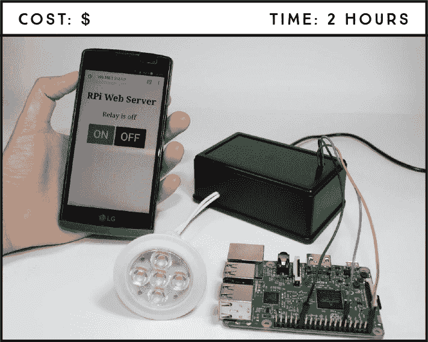

**所需组件**

树莓派

继电器模块 HL-52S

12 伏灯泡和灯座

12 伏电源适配器

母 DC 条形直流电源插座

塑料盒外壳

跳线

**所需软件**

Flask 框架

在这个项目中，你将创建自己的网络服务器，通过浏览器控制电子设备。你将使用动态网页和按钮来控制一个 12 伏灯泡。

### 介绍网络服务器

网络服务器是提供网页的计算机。它存储网站的文件，包括所有的 HTML 文档和相关的资源，如图片、CSS 样式表、字体和视频。当用户向服务器的 URL 发出请求时，它还会将这些文件传送到用户设备的网页浏览器中。

当你在浏览器中访问一个网页时，你实际上是通过*超文本传输协议（HTTP）*向服务器发送请求。这只是一个在互联网上请求和返回信息的过程。服务器通过 HTTP 将你请求的网页返回。

在这个项目中，你将使用你的 Raspberry Pi 在本地网络上托管一个网络服务器，如图 16-1 所示。

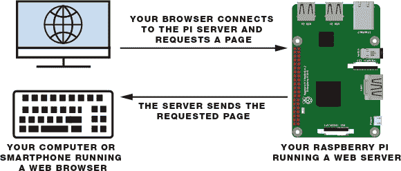

**图 16-1：** 你的树莓派正在运行一个网络服务器

作为服务器，树莓派可以通过其 GPIO 针脚提供一些输出。换句话说，使用本地网络上的浏览器，你可以访问树莓派的 Web 服务器，远程控制 GPIO 并打开某些设备。

Web 服务器可以提供*静态*或*动态*内容。静态网站的内容除非你编辑其 HTML 文件，否则不会发生变化。项目 15 中构建的网站就是一个静态网站的例子。动态网站的内容会根据用户的交互发生变化。在这个项目中，你将创建一个动态网站，用于控制并显示连接到继电器的 12V 灯的当前状态，我们稍后会更详细地介绍。

**注意**

*只有连接到与你的树莓派同一路由器的设备才能通过浏览器访问你树莓派上托管的网页。从* 外部 *网络访问你的 Web 服务器则更为困难。你可以通过使用一种叫做*路由器端口转发*的技术，使树莓派 Web 服务器可以从任何地方的计算机访问，但这一主题超出了本书的范围。*

### 介绍继电器模块

*继电器* 是一种电动开关，可以打开或关闭，允许电流通过或阻止电流流动，并且可以通过低电压控制，例如树莓派提供的 3.3V。你将在本项目中使用的继电器模块有两个继电器——即图 16-2 中显示的两个蓝色方块。

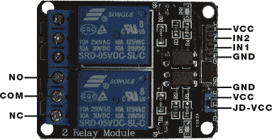

**图 16-2：** 带有两个通道的继电器模块

继电器模块左侧的六个针脚连接高电压，而右侧的针脚连接需要低电压的组件——树莓派 GPIO。

#### 继电器引脚分配

高压端有两个连接器，每个连接器有三个插孔：*公共（COM）*、*常闭（NC）* 和 *常开（NO）*。当你希望继电器默认闭合时使用常闭配置，意味着电流是流动的，除非你从树莓派向继电器模块发送信号来打开电路并停止电流。常开配置则相反：继电器始终保持打开状态，因此电路被切断，除非你从树莓派发送信号来闭合它。

低压端有一组四个针脚和一组三个针脚。第一组包括 VCC 和 GND，用于为模块供电，以及输入 1（IN1）和输入 2（IN2），分别用于控制底部和顶部的继电器。第二组针脚包括 GND、VCC 和 JD-VCC 针脚。JD-VCC 针脚为继电器的电磁铁供电。请注意，模块上有一个跳线帽将 VCC 和 JD-VCC 针脚连接在一起；这里显示的是蓝色的，但你的可能是其他颜色。

跳线帽允许你选择电路是否与树莓派电路物理连接，你可以选择是否将其打开。使用跳线帽时，VCC 和 JD-VCC 引脚会连接。这意味着继电器电磁铁直接由树莓派的电源引脚供电，因此继电器模块和树莓派电路在物理上是相互连接的。这就是我们将使用的配置。如果没有跳线帽，你需要提供独立的电源，通过 JD-VCC 引脚为继电器电磁铁供电。这种配置通过模块内置的光耦合器将继电器与树莓派物理隔离，从而在电气浪涌发生时保护树莓派不受损坏。

**光耦合器**

我们不会过多讨论光耦合器。它基本上是一个允许你在两个隔离电路之间发送信号的组件，这样你就可以用低电压控制高电压，而这两个电路之间实际上没有物理连接。光耦合器通过一个发光二极管（LED）发出光，再通过一个光敏晶体管接收光并激活或关闭继电器，从而在电路之间建立“连接”。

#### 继电器使用

你将在这个项目中使用常开配置。你希望只有在你选择时才点亮灯泡，因此电路应该保持断开，直到你另行指示。为此，你将使用 COM 和 NO 插座。

在常开配置中，COM 和 NO 插座之间没有接触，除非你触发继电器。继电器在输入电压低于约 2V 时被触发。这意味着如果你从树莓派发送低电平信号，继电器会打开；如果发送高电平信号，继电器会关闭；这被称为*反向逻辑*。你只需控制一个继电器，因此你将 IN1 连接到树莓派的一个 GPIO 引脚。

**警告**

*如果你不太熟悉处理像 12V 这样的高电压，但又想做这个项目，你可以用 LED 替代继电器模块。你还需要对 Python 脚本做一些小改动，因为继电器是使用反向逻辑，而 LED 则不是。*

项目的硬件涉及连接一个可以提供 1A 电流的 AC 12V 电源适配器到继电器模块，用以控制 12V 的灯泡。我们将使用一个 DC 圆形电源插孔，以便更容易地将适配器与继电器连接。圆形插孔与电源适配器端子完美对接，如图 16-3 所示。

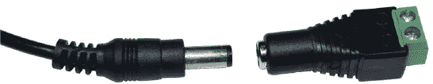

**图 16-3：** 电源适配器端子和 DC 圆形电源插孔

### 项目概览

在开始构建这个项目之前，让我们先快速浏览一下概览，以便你更好地理解每一步（见图 16-4）。你还应该掌握 HTML 和 CSS 的基础知识，如果你还没有完成项目 15，我们建议你先完成它，然后再继续。

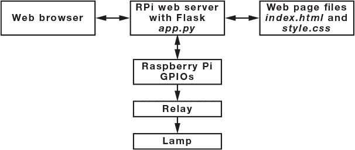

**图 16-4：** 项目概览

你将使用 Flask——一个 Python 的 Web 框架——来创建你的网页服务器，方法是创建一个名为*app.py*的文件。当你访问树莓派的 IP 地址，端口 80 时，你的网页浏览器会请求存储在树莓派中的网页文件——*index.html*和*style.css*——然后显示网页。你的网页将有 ON 和 OFF 按钮，分别触发开关灯的事件。

### 电路连接

出于安全考虑，你需要将继电器放置在一个塑料外壳内。你可能需要在塑料外壳上打几个孔——一个孔用于树莓派的电缆，一个孔用于灯具电缆，另一个孔用于电源适配器。图 16-5 显示了没有盖子的外壳样子。树莓派的电缆将穿过盖子上的孔。

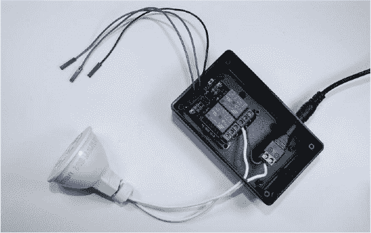

**图 16-5：** 继电器放置在塑料外壳内的电路

**注意**

*确保 JD-VCC 和 VCC 引脚上安装了跳线帽。*

在树莓派关闭*电源*的情况下，按照以下说明搭建电路：

1.  将一个灯座终端连接到直流圆筒电源插座的负（–）端。

1.  将直流圆筒电源插座的正（+）端连接到继电器的 COM 插口。

1.  将另一个灯座终端连接到继电器的 NO 插口。你需要使用螺丝刀将继电器插座连接得很紧。

1.  按照表格连接树莓派与继电器，并确保你的完成设置与图 16-6 一致。

    | **继电器** | **树莓派** |
    | --- | --- |
    | VCC | 5 V |
    | IN2 | 不连接 |
    | IN1 | GPIO 17 |
    | GND | GND |

    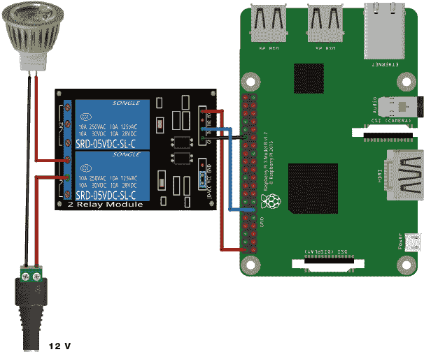

    **图 16-6：** 使用继电器通过树莓派控制 12V 灯具

**警告**

*在继电器或任何接通 12V 电源的电缆连接时，请勿触碰它们。如果出现问题并且你决定更改电路，务必先从插座中拔掉 12V 电源适配器的插头，然后再动手。*

完成电路并仔细检查所有连接后，给树莓派供电，连接一个 12V 电源适配器到直流圆筒电源插座，并通过将 12V 电源适配器插入墙壁插座来供电。

如果你想控制一个 LED，请参考项目 1 原理图（见第 41 页），将 LED 连接到 GPIO 17。

### 为树莓派准备运行 Web 服务器

树莓派支持多种 Web 服务器，但我们将使用 Flask，一个 Python 的 Web 框架，把树莓派变成一个动态 Web 服务器。

#### 安装 Flask

要安装 Flask，你需要使用 pip——一个用于从 Python 包索引安装库的工具。打开终端并运行以下命令来更新树莓派并安装 pip：

```
pi@raspberrypi:~ $ sudo apt update && sudo apt upgrade
pi@raspberrypi:~ $ sudo apt install python3-pip
```

然后使用 pip 安装 Flask 及其依赖项，输入以下命令：

```
pi@raspberrypi:~ $ sudo pip3 install flask
```

如果 Flask 安装成功，终端将显示`成功安装 Flask`的信息。

#### 组织文件

在这个项目中保持文件有序非常重要，因为 Flask 需要你的文件以特定的方式进行结构化才能正确工作。为此项目创建一个名为`Project_16`的文件夹，放在`Web_Applications`文件夹内。然后按照图 16-7 中显示的结构创建所需的文件夹和文件。

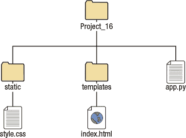

**图 16-7：** 文件和文件夹结构

使用文本编辑器创建`index.html`和`style.css`文件，并使用 Python 3（IDLE）创建`app.py`文件。`static`文件夹将存储静态文件，如 CSS 文件。`templates`文件夹将存储可更改的文件；例如，`index.html`文件是一个模板，根据用户输入动态更改继电器状态标签。

### 编写脚本

你需要为这个项目编写三个脚本：一个 Python 脚本用于创建 Pi web 服务器，一个 HTML 文件用于构建网页，另一个 CSS 文件用于设置网页样式。

#### 创建 Web 服务器

要创建 web 服务器，打开你目前为空的`app.py`文件，并输入列表 16-1 中的代码。该代码会在 Raspberry Pi 的 80 端口创建 web 服务器，并生成一个网页，你可以在本地网络中的任何 web 浏览器上访问。你可以在*[`www.nostarch.com/RaspberryPiProject/`](https://www.nostarch.com/RaspberryPiProject/)*下载在整个项目中使用的所有代码。

**列表 16-1：** 使用 Flask 创建 web 服务器

```
  #import necessary libraries
➊ from gpiozero import LED
  from flask import Flask, render_template, request

  #create a Flask object
➋ app = Flask(__name__)

  #create an object that refers to a relay
➌ relay = LED(17)
  #set the relay off; remember the relay works with inverted logic
  relay.on()
  #save current relay state
  relay_state = 'Relay is off'

  #display the main web page
➍ @app.route('/')
  def main():
     global relay_state
     #pass the relay state to index.html and return it to the user
   ➎ return render_template('index.html', relay_state=relay_state)

  #execute control() when someone presses the on/off buttons
➏ @app.route('/<action>')
  def control(action):
     global relay_state
     #if the action part of the URL is 'on', turn the relay on
   ➐ if action == 'on':
        #set the relay on
        relay.off()
        #save the relay state
        relay_state = 'Relay is on'
     if action == 'off':
        relay.on()
        relay_state = 'Relay is off'

     #pass the relay state to index.html and return it to the user
     return render_template('index.html', relay_state=relay_state)
  #start the web server at localhost on port 80
  if __name__ == '__main__':
  ➑ app.run(host='0.0.0.0', port=80, debug=True)
```

首先导入所需的库 ➊，然后创建一个名为`app`的 Flask 对象 ➋。你在 GPIO 17 上初始化继电器 ➌，并默认将继电器设置为*关闭*状态。继电器使用反向逻辑，因此你需要使用`relay.on()`来关闭它。

`@app.route('/')`装饰器 ➍ 在有人访问根 URL（即服务器的 Pi 主 IP 地址）时运行`main()`函数。在 Python 中，*装饰器*以`@`符号开始，位于函数定义的上方。装饰器基本上是一个接受另一个函数的函数，但你暂时不需要担心这个。

你将`index.html`文件渲染到 web 浏览器，并使用 HTML 文件中的`relay_state`变量值打印当前继电器状态 ➎。然后，你添加一个动态路由，将`action`作为变量 ➏。当有人访问这个动态路由时，`control()`函数会被触发。如果 URL 中的`action`是`on`，程序就会打开继电器并保存当前继电器状态 ➐。也就是说，当你访问 Raspberry Pi 的 IP 地址并后跟`/on`（例如`http://192.168.1.112/on`）时，继电器会打开。稍后你会获取到你自己的 IP 地址。

如果 URL 中的`action`是`off`，程序会关闭继电器并保存当前继电器状态。服务器监听 80 端口，并将调试模式设置为`True`，以报告任何错误 ➑。

#### 编写 HTML 文件

列表 16-2 是一个简单的 HTML 文档，用于构建网页结构。随意添加更多段落和标题，以使用你在项目 15 中学到的知识对其进行个性化设置。将此代码复制到你的 *index.html* 文件中，该文件应位于 *templates* 文件夹中，如前面的图 16-7 所示。

**列表 16-2:** 为你的网页编写 HTML 文件

```
  <!DOCTYPE html>
  <head>
  <title>RPi Web Server</title>
  <link rel="stylesheet" type="text/css" href="{{ url_for('static',
  filename='style.css') }}">
➊ <meta name="viewport" content="width=device-width, initial-scale=1">
  </head>

  <body>
      <h2>RPi Web Server</h2>
   ➋ <p>{{relay_state}}</p>
   ➌ <a href="/on"><button>ON</button></a>
   ➍ <a href="/off"><button class="off">OFF</button></a>
  </body>
  </html>
```

这是一个简单的 HTML 结构，我们不会在这个 HTML 代码中深入探讨太多细节，因为你应该已经熟悉项目 15 中的大部分内容。你可以随时回顾该项目以进行复习。

`<meta>` 标签和给定的属性使你的网页在任何移动浏览器中都具有响应性 ➊。使用此标签，浏览器会将页面的宽度渲染为移动屏幕的宽度。在第 ➋ 行，在双花括号 `{{ }}` 之间，是 `relay_state`，这是我们在 *app.py* 中用于保存当前继电器状态的变量。此段落显示保存在 `relay_state` 变量中的状态。当你单击 ON 按钮时，你将被重定向到 `/on` 根目录 ➌，这将打开继电器，如 *app.py* 中所示。当你单击 OFF 按钮时，你将被重定向到 `/off` 根目录 ➍，这将关闭继电器。

#### 编写 CSS 文件

列表 16-3 设置你的网页样式。这只是一个如何设置页面样式的示例；你可以根据需要编辑属性。你的 *style.css* 文件应位于 *static* 文件夹中，如你在前面的图 16-7 中看到的那样。

**列表 16-3:** 使用 CSS 设置网页样式

```
➊ h2 {
    font-size: 2.5rem;
  }
  p {
    font-size: 1.8rem;
  }
➋ body {
    display: inline-block;
    margin: 0px auto;
    text-align: center;
  }
➌ button {
    display: inline-block;
    margin: 0 auto;
    padding: 15px 25px;
    font-size: 3rem;
    border-radius: 4px;
    color: #fff;
    background-color: #009933;
    border: none;
  }
  .off {
    color: #fff;
    background-color: #604f43;
  }
  a {
    text-decoration: none;
  }
```

总而言之，我们已经为标题 2 和段落 ➊ 设置了字体大小。然后，我们对齐了所有页面主体 ➋。最后，我们编辑了 ON 和 OFF 按钮的外观 ➌。

#### 启动你的 Web 服务器

完成 Python 脚本、HTML 文件和 CSS 文件后，就可以运行你的 Web 服务器了。打开终端窗口并通过输入以下命令导航到 *Project_16* 文件夹：

```
pi@raspberrypi:~ $ cd ~/Desktop/Projects/Web_Applications/Project_16
```

然后，使用以下行运行 *app.py*：

```
pi@raspberrypi:~Desktop/Projects/Web_Applications/Project_16 $ sudo
python3 app.py
```

你的 Web 服务器现在正在运行。在本地网络上的任何浏览器中打开并输入你的 Raspberry Pi IP 地址。

要查找你的 Pi 的 IP 地址，请转到终端并输入以下内容：

```
pi@raspberrypi:~ $ hostname -I
```

这将打印 Pi 的 IP 地址。

在你的电路准备就绪并且服务器正在运行的情况下，打开浏览器并导航到你的 Raspberry Pi IP 地址。你的浏览器将显示 Web 服务器页面。现在点击按钮来远程控制灯！图 16-8 显示了智能手机浏览器中的网页。

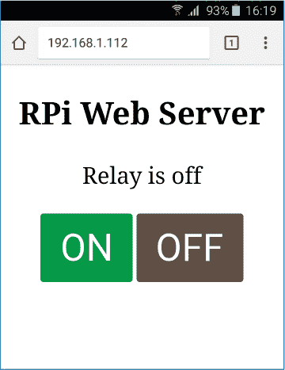

**图 16-8:** 智能手机浏览器上的 Raspberry Pi Web 服务器页面

要停止 Web 服务器，只需按 CTRL-C。

### 进一步探索

在这个项目中，你学习了如何使用继电器以及如何设置 Web 服务器来提供网页，以及如何将你的 HTML 和 CSS 技能付诸实践。以下是一些进一步扩展这些概念的想法：

+   编辑此项目以控制多个输出。

+   编辑 CSS 和 HTML 文件以符合您的个人口味。

+   控制其他电子设备。

+   编辑以前的项目以控制连接到继电器的灯，而不是 LED。

## 使用 Node-RED 的物联网控制中心**

在这个项目中，您将创建一个物联网应用，通过一个网络服务器使用 Node-RED 来控制您最喜爱的家庭电子设备，Node-RED 是一个功能强大且易于使用的物联网应用工具。

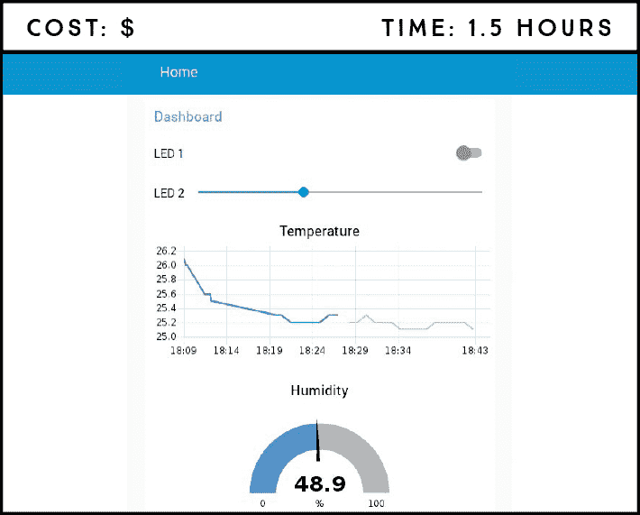

**所需零件**

树莓派

面包板

DHT22 温湿度传感器

4.7 kΩ 电阻

两个 5 mm LED

两个 330 Ω 电阻

跳线

**所需软件**

Node-RED DHT 节点

Node-RED 仪表盘

您将创建一个 Node-RED 应用，控制本地网络中的输出并读取输入。您将用它来控制 LED，以及使用 DHT22 传感器远程读取和显示温湿度值——所有操作都通过网络服务器完成。

### 介绍 Node-RED

Node-RED 是一个开源的可视化接线工具，用于构建物联网应用，它已经预安装在您的树莓派操作系统中，并且与树莓派完美兼容。

Node-RED 使用视觉编程，具有称为 *节点* 的模块，您可以将它们连接起来以执行某项任务，从而大大简化了编程。Node-RED 允许您快速而简单地原型化一个复杂的家庭自动化系统，让您有更多时间去设计和制作酷炫的东西。

我们在这个项目中不会涵盖 Node-RED 的所有功能，但如果您想进一步探索，这里有一个简要概述：

+   访问树莓派的 GPIO 引脚。

+   与 Arduino 和 ESP8266 等其他板子建立连接。

+   创建一个响应式图形用户界面。

+   与第三方服务进行通信。

+   从网页获取数据。

+   创建时间触发事件。

+   存储和检索数据库中的数据。

#### 安装 DHT22 节点

虽然 Node-RED 软件已经预装在树莓派的操作系统中，但它没有提供能够读取 DHT22 传感器的节点。我们需要先安装它，方法是通过 npm（Node 包管理）来安装，如下所示：

```
pi@raspberrypi:~ $ sudo apt install npm
```

当提示时，键入 Y 并按 ENTER。安装过程可能需要几分钟。然后，输入以下命令以将 npm 升级到推荐用于 Node-RED 的最新 3.x 版本：

```
pi@raspberrypi:~ $ sudo npm install -g npm@3.x
pi@raspberrypi:~ $ hash -r
```

这些命令将输出警告消息，但不用担心——它是无害的，您可以忽略它。

接下来，您将下载并解压一个适用于树莓派的 C 库。您需要这个库来通过 Node-RED 控制 DHT22。本文撰写时，库的最新版本是 1.55。安装该库之前，请访问 *[`www.airspayce.com/mikem/bcm2835/`](http://www.airspayce.com/mikem/bcm2835/)* 检查最新版本。然后，输入以下命令，将斜体显示的 `1.55` 替换为最新版本。

```
pi@raspberrypi:~ $ wget http://www.airspayce.com/mikem/bcm2835/
bcm2835-*1.55*.tar.gz
pi@raspberrypi:~ $ tar zxvf bcm2835-*1.55*.tar.gz
```

最后，输入以下命令列表以编译和安装控制 DHT22 传感器和添加仪表盘支持所需的节点：

```
pi@raspberrypi:~ $ cd bcm2835-*1.55*
pi@raspberrypi:~/bcm2835-1.55 $ ./configure
pi@raspberrypi:~/bcm2835-1.55 $ make
pi@raspberrypi:~/bcm2835-1.55 $ sudo make check
pi@raspberrypi:~/bcm2835-1.55 $ sudo make install
pi@raspberrypi:~/bcm2835-1.55 $ cd
pi@raspberrypi:~ $ sudo npm install -–unsafe-perm -g node-dht-sensor
pi@raspberrypi:~ $ sudo npm install --unsafe-perm -g node-red-
contrib-dht-sensor
pi@raspberrypi:~ $ sudo npm install --unsafe-perm -g node-red-
dashboard
```

完成所有安装后，重启你的 Pi。现在我们将简要介绍一下 Node-RED。

#### 开始使用 Node-RED

要打开 Node-RED，请进入终端并输入以下命令：

```
pi@raspberrypi:~ $ sudo node-red start
```

你的终端窗口应该显示类似于 图 17-1 的内容。高亮的那一行显示的是本地主机的 Raspberry Pi IP 地址，后面跟着 Node-RED 服务器运行的端口号。*本地主机* 是一个主机名，意思是“这台计算机”，并解析为终端窗口中显示的 IP 地址：http://127.0.0.1\。使用这个 IP 地址你只能在 Raspberry Pi 浏览器中访问 Node-RED。要在本地网络的任何浏览器中访问 Node-RED，你需要找到 Pi 的 IP 地址。

**注意**

*通常，你可以不通过终端，而是通过点击任务栏主菜单中的 **编程 ▸ Node-RED** 来打开 Node-RED。然而，在这个项目中，你需要从终端启动 Node-RED，因为 DHT22 节点需要管理员权限。*

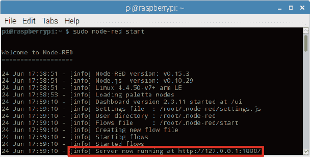

**图 17-1：** 从终端启动 Node-RED

要查找你的 Raspberry Pi 的 IP 地址，请在终端中输入以下命令：

```
pi@raspberrypi:~ $ hostname -I
```

打开 Chromium 浏览器并输入 *http://<Pi IP 地址>:1880/*，将 *<Pi IP 地址>* 替换为你的 Raspberry Pi 的 IP 地址。你的 Node-RED 页面服务器应该会如 图 17-2 所示打开。

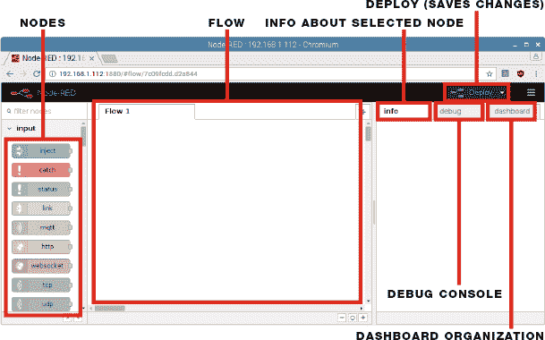

**图 17-2：** 浏览器中的 Node-RED 编辑器

在左侧，你将看到一个块或节点的列表。节点根据它们的功能进行分组；向下滚动列表以查看你有哪些节点。在本项目中，我们将介绍少数现有节点，包括来自输入、Raspberry_Pi、功能和仪表盘部分的节点，如 图 17-3 所示。

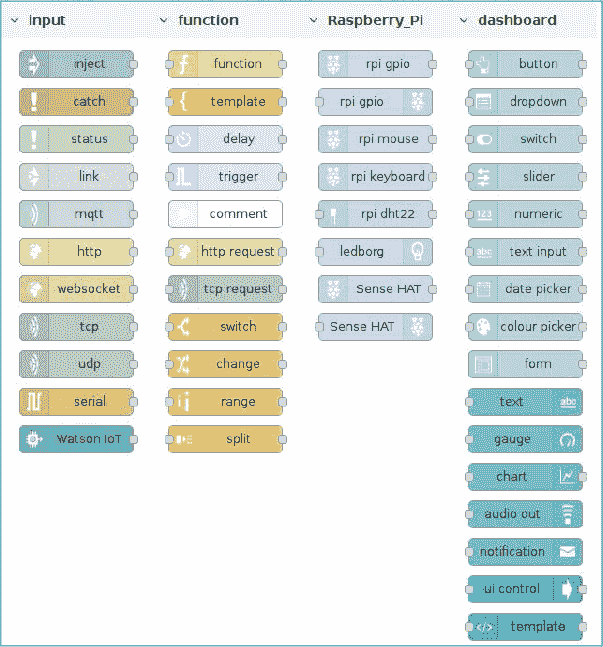

**图 17-3：** 一些 Node-RED 节点

Node-RED 页面中的中央框是 *流程* 部分；这是你拖拽节点并将它们连接在一起以构建应用程序的地方。右侧有几个选项卡：*信息* 选项卡显示所选节点的信息，*调试* 选项卡用于调试，*仪表盘* 选项卡是你组织应用程序用户界面控件的地方。最后，*部署* 按钮保存对流程所做的更改并执行它。接下来，你将连接硬件，并在 Node-RED 中组装你的流程。

### 电路连接

你应该已经熟悉 LED 和 DHT22 传感器，但如果你需要复习 DHT22 传感器，请查看 项目 12。要连接电路，请按照以下说明操作：

1.  将 Pi 的 5 V 和 GND 分别连接到面包板的红色和蓝色轨道上。

1.  将两个 LED 插入面包板中。将每个 LED 的短引脚通过一个 330 Ω 电阻接到 GND 排，较长引脚分别连接到 GPIO 18 和 GPIO 17。

1.  将 DHT22 插入面包板（带凸起的一面朝向你），并按照下表接线。完成的电路应与 图 17-4 相匹配。

| **DHT22** | **树莓派** |
| --- | --- |
| 1 | 3.3 V |
| 2 | GPIO 4 和 3.3 V（通过 4.7 kΩ 电阻） |
| 3 | 不连接 |
| 4 | GND |

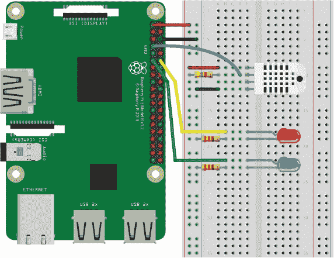

**图 17-4：** 将 DHT22 和两个 LED 连接到树莓派

### 创建流程

脚本在这里指的是你将在 Node-RED 中创建的流程。这个流程将允许你执行以下操作：

+   用开关控制一个 LED。这颗 LED 还将具有时间敏感性，也就是说，它将在你设定的特定时间自动点亮并熄灭。

+   使用滑块通过 PWM 控制另一个 LED，作为调光开关。

+   从 DHT22 传感器读取温度，并将其显示在时间与温度的图表上。

+   从 DHT22 传感器读取湿度并显示在仪表上。

首先，你需要创建一个用户界面，用于从服务器控制各个组件。

#### 创建仪表板用户界面

来自仪表板部分的节点提供了在应用程序用户界面（UI）中显示的小部件，用于控制各个组件。你添加到流程中的每个小部件——如按钮、滑块或图表——都必须与一个 *组* 相关联，组会告知该小部件在 UI 中应该出现的位置。

你还需要选项卡，就像应用程序中的页面一样（类似于浏览器中的标签页）。组则是选项卡内的部分，你可以在其中将小部件分组。在任何项目中，你都需要在仪表板中创建选项卡和组，以便组织 UI 中的小部件。你将创建一个名为“Home”的选项卡，其中有一个名为“Dashboard”的组。

参考 图 17-5，点击右上角的 **仪表板** 选项卡 ➊，然后按 **+ 选项卡** 按钮 ➋ 创建一个新选项卡。点击 **编辑** 来编辑选项卡 ➌，并输入名称“Home”。创建后，按 **+ 组** 按钮 ➍ 创建一个新组；然后点击 **编辑** ➎ 并输入名称“Dashboard”。

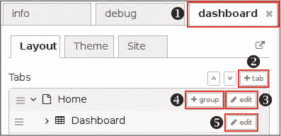

**图 17-5：** 在仪表板中创建选项卡和组

要查看当前仪表板的样子，打开浏览器并访问 *http://<Pi IP 地址>:1880/ui*，将 *<Pi IP 地址>* 替换为你之前获得的树莓派 IP 地址。如 图 17-6 所示，目前你的用户界面是空的，因为你还没有添加任何小部件，接下来我们将添加一些功能。

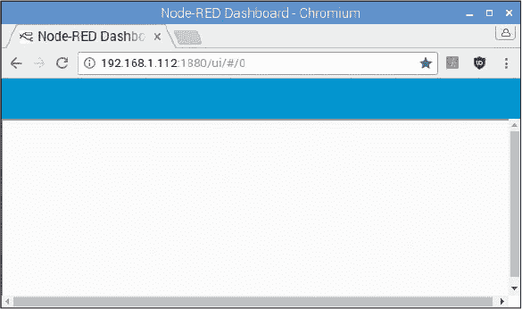

**图 17-6：** Node-RED 用户界面

#### 连接节点

现在，你将向流程中添加节点。你的流程将控制连接到树莓派 GPIO 的 LED，并从 DHT22 传感器读取温度和湿度。

##### 添加开关和调度事件

返回到 Node-RED 编辑器，拖动两个注入节点到流程中的输入部分。当你将它们放入流程中时，它们的名称会变为*时间戳*。从仪表盘部分添加一个开关，并从 Raspberry_Pi 节点部分添加一个 rpi gpio 输出节点（左侧有接头的那个）。按照 图 17-7 中所示的方式排列这些节点并将它们连接起来。

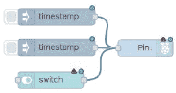

**图 17-7：** 控制 LED 1 的流程

这组节点控制连接到 GPIO 17 的 LED。该 LED 可以通过开关进行远程控制，且具有时间敏感性；时间戳 1 确定 LED 点亮的时间，而时间戳 2 确定 LED 关闭的时间。

如果你双击一个节点，新的窗口将打开，允许你编辑该节点的属性。双击第一个时间戳节点并按如下方式编辑其属性：将有效负载数字设置为**1**，这样当该节点被触发时，会向树莓派 GPIO 17 发送 1。在重复字段中，选择**在特定时间**并选择你希望 LED 点亮的时间和日期；你将在时间戳 2 中选择关闭时间。我们为一周的所有天选择了 19:00（晚上 7 点）。你可以选择任何你希望的时间和日期。名称字段允许你为节点命名，在我们的例子中，我们将其命名为**晚上 7 点开**。编辑完节点后，点击**完成**按钮。图 17-8 显示了我们为此节点设置的属性。

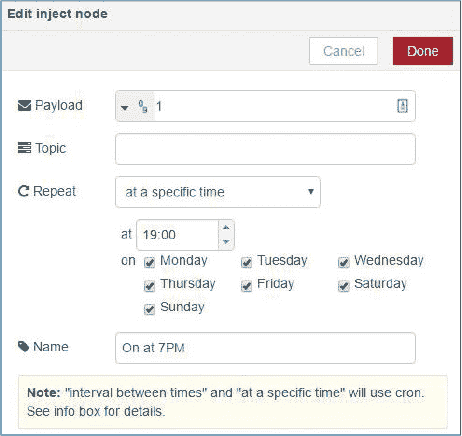

**图 17-8：** 编辑注入节点属性

编辑其他节点的属性，使其与下表中的内容一致。

| **节点** | **属性** |
| --- | --- |

| 时间戳 | 有效负载: 数字 1 重复: 在特定时间

时间：19:00

开：选择所有日期 |

| 时间戳 | 有效负载: 数字 0 重复: 在特定时间

时间：23:00

开：选择所有日期 |

| 开关 | 分组: 仪表盘 [首页] 标签: LED 1

开启有效负载：数字 1

关闭有效负载：数字 0

名称：LED 1 – 开关 |

| 引脚 | GPIO: GPIO17 – 11 类型: 数字输出

名称：LED 1 – GPIO 17 |

要运行你的 Node-RED 应用程序，点击右上角的**部署**按钮。这也将保存更改。要查看应用程序的效果，请在浏览器中访问*http://<Pi IP 地址>:1880/ui*。此时，应该与 图 17-9 类似。

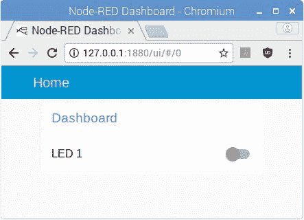

**图 17-9：** 带有 LED 1 控制开关的用户界面

点击开关测试是否可以控制连接到 GPIO 17 的 LED。如果不能，请返回并确保你已正确接线并设置了正确的属性。

##### 添加滑块

现在，你将添加节点来控制连接到 GPIO 18 的 LED 的亮度。将一个滑块和一个 rpi gpio 输出节点拖入流程，并按照 图 17-10 中所示的方式排列它们。

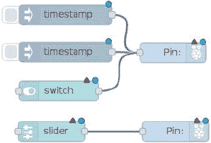

**图 17-10：** 控制 LED 1 和 LED 2 的流程

按照下表中的设置编辑新节点的属性。

| **节点** | **属性** |
| --- | --- |

| 滑块 | 分组：仪表盘 [主页] 标签：LED 2

范围：最小值：0；最大值：100；步长：1

名称：LED 2 – 滑块 |

| 引脚 | GPIO：12 – GPIO18 类型：PWM 输出

名称：LED 2 – GPIO 18 |

这一组新的节点通过 PWM 控制连接到 GPIO 18 的 LED。移动滑块将改变 LED 的亮度。点击 **部署** 按钮，进入 Node-RED UI，测试你的应用程序。它应该看起来像图 17-11。

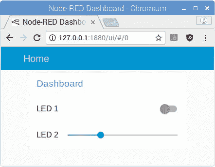

**图 17-11：** 带有 LED 1 开关和 LED 2 滑块的用户界面

##### 添加温度图表和湿度计

最后，要创建温度图表和湿度计，拖动一个注入节点、rpi dht22 节点、功能节点、图表和湿度计到流程中。图表和湿度计是仪表盘节点。排列这些节点，使你的流程像图 17-13 那样。

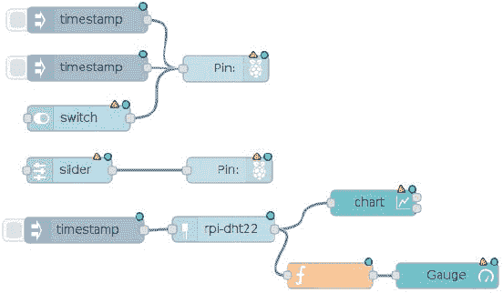

**图 17-12：** 完整的 Node-RED 流程

使用下表中的设置编辑新节点的属性。

| **节点** | **属性** |
| --- | --- |

| 时间戳 | 负载：布尔值 true 重复：间隔

每隔：1 分钟

名称：读取 DHT22 |

| rpi-dht22 | 传感器型号：DHT22 引脚编号：BCM GPIO

引脚编号：4

名称：DHT22 – GPIO 4 |

| 图表 | 分组：仪表盘 [主页] 标签：温度

类型：折线图

X 轴：1 小时

X 轴标签：HH:mm

名称：温度 – 图表 |

| f | 名称：获取湿度 功能：

msg.payload = msg.humidity;

return msg; |

| 湿度计 | 分组：仪表盘 [主页] 类型：湿度计

标签：湿度

值格式：{{value}}

单位：%

范围：最小值：0；最大值：100

名称：湿度 - 湿度计 |

点击 **部署** 按钮，再次测试你的应用程序。记住，如果遇到任何问题，确保你的属性与这里的表格匹配，并且仔细检查你的节点连接与图示的线缆连接。

### 运行你的应用程序

恭喜！你已经使用 Node-RED 构建了你的第一个物联网应用程序。前往 *http://<Pi IP 地址>:1880/ui* 查看你的用户界面效果。你可以使用任何本地网络中的浏览器访问这个网址，无论是在电脑还是智能手机上。图 17-13 展示了你可以用 Node-RED 应用控制的最终电路。

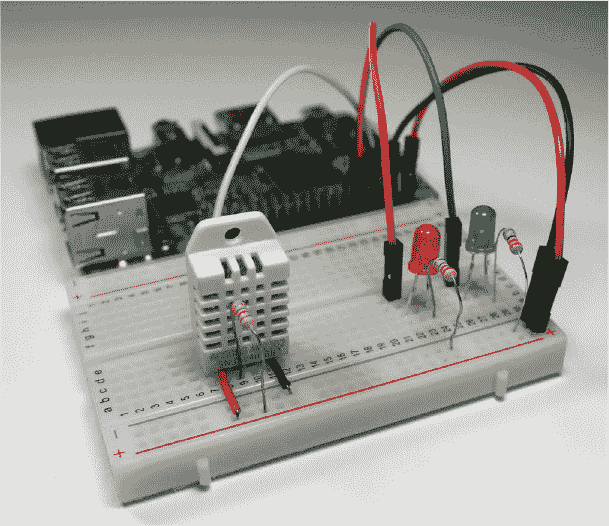

**图 17-13：** 使用 Node-RED 的物联网项目

你的应用程序有一个开关来控制 LED 1，它也是时效性的；一个滑块来控制 LED 2 的亮度；以及一个图表和湿度计来显示温度和湿度。

### 进一步探索

这个项目只是 Node-RED 能做的冰山一角。以下是一些将这个项目进一步扩展的想法：

+   将时效性 LED 替换为继电器和灯泡（有关继电器模块的介绍，请参阅项目 16）。

+   向你的应用程序添加更多的传感器读取，比如烟雾传感器和运动检测传感器。
