## 第七章：游戏与玩具

## 数字鼓组**

在这个项目中，你将创建一个由面包板电路和几个按钮控制的数字鼓组。按下不同的按钮将产生不同的鼓声，包括两个鼓点循环。

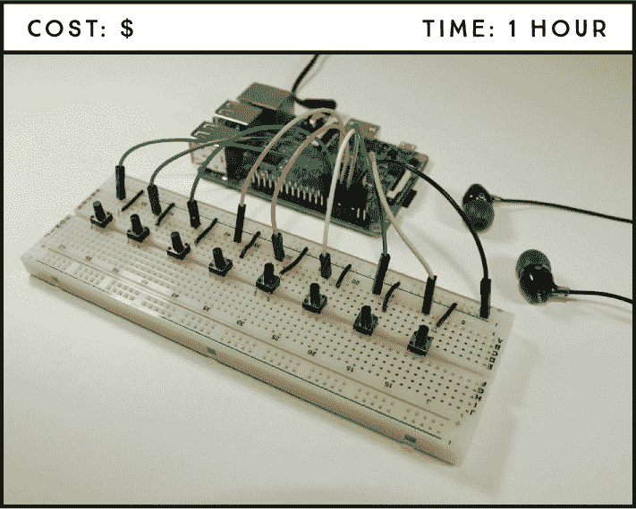

**所需部件**

树莓派

面包板

八个按键

耳机，或通过 HDMI 连接到树莓派的显示器带扬声器

跳线

**所需软件**

avconv

本项目使用来自 Sonic Pi 样本库的样本，但你可以根据需要适配它，使用任何你喜欢的声音。

### 准备音频

首先，你需要正确配置树莓派的音频设置，并准备好使用 Sonic Pi 的音频样本。

#### 配置音频

首先，将耳机或扬声器插入树莓派音频插孔。如果你的显示器内建扬声器，并且通过 HDMI 电缆连接到树莓派，则不需要连接任何东西到音频插孔——你可以通过显示器扬声器来听音频。

在桌面环境的右上角，右键单击音频符号并选择音频源，如图 18-1 所示。如果你使用耳机，选择模拟（Analog），如果你使用带扬声器的显示器，选择 HDMI。


**图 18-1：** 选择音频源

#### 获取音频样本文件

**注意**

*我们在本书中不会介绍 Sonic Pi，但如果你想自己探索它，可以通过任务栏主菜单中的**编程*** ▸ ***Sonic Pi**来打开软件并浏览。*

Sonic Pi 软件已预装在树莓派的操作系统中，允许你使用代码创作数字音乐，但在这个项目中，你只会使用 Sonic Pi 的示例音频文件。

在终端中，输入以下命令，在*Projects*文件夹内创建一个名为*Games_and_Toys*的新文件夹，并进入该文件夹。你将在这里保存样本。

```
pi@raspberrypi:~ $ cd ~/Desktop/Projects
pi@raspberrypi:~/Desktop/Projects $ mkdir Games_and_Toys
pi@raspberrypi:~/Desktop/Projects $ cd Games_and_Toys
```

然后输入以下命令，将 Sonic Pi 的*sample*文件夹复制到*Games_and_Toys*文件夹中（注意，最后的`/`和句点之间有一个空格）：

```
pi@raspberrypi:~/Desktop/Projects/Games_and_Toys $ cp -r /opt/
sonic-pi/etc/samples/ .
```

接下来，输入以下命令列出*sample*文件夹中的内容，检查它们是否正确转移：

```
pi@raspberrypi:~/Desktop/Projects/Games_and_Toys $ cd samples
pi@raspberrypi:~/Desktop/Projects/Games_and_Toys/samples $ ls
```

如果一切顺利，你应该看到如下的文件列表：

```
ambi_choir.flac        drum_cowbell.flac        elec_ping.flac
ambi_dark_woosh.flac   drum_cymbal_closed.flac  elec_plip.flac
...
```

你可能注意到这些文件具有不常见的扩展名*.flac*。这种格式在 Sonic Pi 中使用，但要在 Python 中使用它们，你需要将它们转换为*.wav*文件。为此，你将使用 avconv 软件。输入以下命令来安装 avconv：

```
pi@raspberrypi:~/Desktop/Projects/Games_and_Toys/samples $ sudo apt
install libav-tools
```

然后输入以下命令，这将遍历*sample*文件夹中的所有文件，并将每个*.flac*文件转换为*.wav*文件：

```
pi@raspberrypi:~/Desktop/Projects/Games_and_Toys/samples $ for f in
*.flac; do avconv -i "$f" "${f%.flac}.wav"; done
```

接下来，使用`ls`命令列出*sample*文件夹中的项目，并检查是否已准备好*.wav*文件：

```
pi@raspberrypi:~/Desktop/Projects/Games_and_Toys/samples $ ls
```

每个样本应该同时拥有*.wav*和*.flac*文件。要从*sample*文件夹中删除*.flac*文件，请输入以下命令：

```
pi@raspberrypi:~/Desktop/Projects/Games_and_Toys/samples $ rm *.flac
```

如果你愿意，可以通过再次使用 `ls` 命令来核对文件是否正确。

你可以使用操作系统默认安装的 *omxplayer* 软件来播放这些声音。要播放名为 *drum_snare_soft.wav* 的示例音频，请在命令行中输入以下内容：

```
pi@raspberrypi:~/Desktop/Projects/Games_and_Toys/samples $ omxplayer
drum_snare_soft.wav
```

如果你浏览示例文件，你会看到各种各样的声音，从吉他声到牛铃声和鼓声。选择八种不同的鼓声加入你的鼓组（或任何其他你喜欢的声音）。

我们选择的声音如下；最后两个是鼓点，而其他的是单个鼓声：

+   *drum_cymbal_open.wav*

+   *drum_heavy_kick.wav*

+   *drum_snare_hard.wav*

+   *drum_cymbal_closed.wav*

+   *drum_roll.wav*

+   *perc_snap.wav*

+   *loop_amen_full.wav*

+   *loop_mika.wav*

### 电路连接

本项目的电路仅涉及将八个按键连接到树莓派。每个按键都与不同的声音相关联。

要连接电路，请按照这些说明进行操作，并参考 图 18-2。

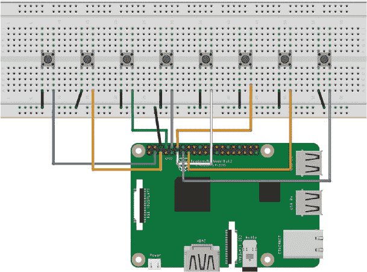

**图 18-2：** 数字鼓电路

1.  将 GND 引脚连接到面包板的 GND 导轨。

1.  将八个按键均匀地插入面包板，并沿着中间分隔线排列。

1.  将底部左侧的按键引脚连接到 GND，将底部右侧的引脚依次连接到以下 GPIO 引脚之一：GPIO 2、3、14、15、17、18、22 和 27。

    | **PUSHBUTTON** | **树莓派** |
    | --- | --- |
    | 1 | GPIO 2 |
    | 2 | GPIO 3 |
    | 3 | GPIO 14 |
    | 4 | GPIO 15 |
    | 5 | GPIO 17 |
    | 6 | GPIO 18 |
    | 7 | GPIO 22 |
    | 8 | GPIO 27 |

### 编写脚本

打开 **Python 3 (IDLE)**，然后点击 **文件** ▸ **新建文件** 来创建一个新脚本。将以下代码复制到 Python 编辑器中，并将脚本保存为 *digital_drum_set.py*，存放在 *Games_and_Toys* 文件夹内（记得你可以从 *[`www.nostarch.com/RaspberryPiProject/`](https://www.nostarch.com/RaspberryPiProject/)* 下载所有脚本）：

```
  #import the necessary libraries
➊ import pygame.mixer
  from pygame.mixer import Sound
  from gpiozero import Button
  from signal import pause

  #create an object for the mixer module that loads and plays sounds
➋ pygame.mixer.init()

  #assign each button to a drum sound
➌ button_sounds = {
      Button(2): Sound("samples/drum_cymbal_open.wav"),
      Button(3): Sound("samples/drum_heavy_kick.wav"),
      Button(14): Sound("samples/drum_snare_hard.wav"),
      Button(15): Sound("samples/drum_cymbal_closed.wav"),
      Button(17): Sound("samples/drum_roll.wav"),
      Button(18): Sound("samples/perc_snap.wav"),
      Button(22): Sound("samples/loop_amen_full.wav"),
      Button(27): Sound("samples/loop_mika.wav"),
  }
  #the sound plays when the button is pressed
➍ for button, sound in button_sounds.items():
      button.when_pressed = sound.play
  #keep the program running to detect events
➎ pause()
```

和往常一样，你首先通过导入必要的库来开始你的脚本 ➊。这里的新库是 `pygame.mixer`，用于加载和播放声音。从 `pygame.mixer` 中，你还导入了 `Sound` 模块，用于创建声音对象。

然后初始化 Pygame mixer ➋ 并创建一个字典，用于存储声音 ➌。在 Python 中，*字典* 是一种用于存储项目间关系的数据结构。在本例中，你将每个按钮与特定的声音关联。字典的基本结构如下：

```
dictionary_name = {key_1: value_1, key_2: value_2}
```

字典用花括号 `{}` 括起来，并由键/值对组成。你使用冒号 (`:`) 将每个键与其对应的值关联，并使用逗号 (`,`) 分隔每个键/值对。

在这个项目中，键是按钮，值是声音。要创建一个声音对象，你需要将声音文件路径作为字符串传递给`Sound()`函数。在这种情况下，由于*sample*文件夹位于*Games_and_Toys*文件夹内，你不需要提供完整的路径，只需要提供文件夹名称，然后跟上声音文件名。你需要将此脚本中以粗体突出显示的声音文件名更改为你选择的声音文件。

接下来，将每个按钮分配到一个声音效果 ➍；这意味着，当按下按钮时，相应的声音会播放。最后，脚本末尾的`pause()`函数 ➎ 保持程序运行，以便能够检测事件。

要运行脚本，按**F5**或转到**运行** ▸ **运行模块**。

恭喜你——你刚刚完成了自己的数字鼓组！现在，按下按钮，创作你自己的音乐片段。

### 进一步探索

这是一个很酷的项目，而且非常简单。我们鼓励你通过尝试以下内容来扩展这个项目：

+   向你的数字鼓组添加其他声音

+   录制你自己的声音或在网上搜索免费的声音

+   建造一个数字钢琴、数字吉他或一个混合音效的混合音乐盒

## 在 Scratch 中制作一个游戏：饥饿的猴子**

在这个项目中，你将使用基于块的编程语言 Scratch 来创建一个可以通过两个按钮和你的 Pi 进行控制的游戏。

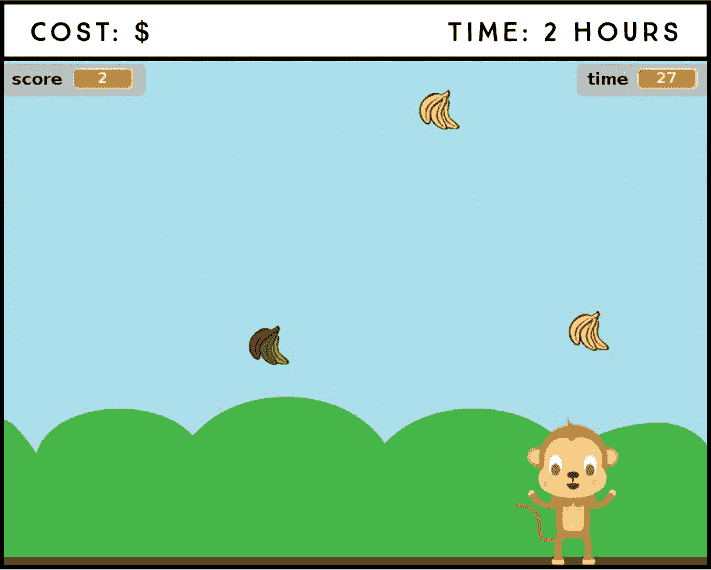

**所需零件**

树莓派

两个按钮

面包板

跳线

在这个项目中，你将创建自己的游戏《饥饿的猴子》。游戏的目标是让猴子在 30 秒内尽可能多地抓住成熟的香蕉，同时避免腐烂的香蕉。你可以通过两个按钮控制猴子左右移动，这些按钮将连接到你的树莓派。

### 介绍 Scratch 2

**注意**

*要了解更多关于 Scratch 的信息，请访问官方 Scratch 网站* [`scratch.mit.edu/`](http://scratch.mit.edu/)。

Scratch 是一种可视化编程语言，你可以使用它通过拖拽代码块来创建动画、故事和游戏。虽然 Scratch 是为了教孩子如何编程而开发的，但它适合任何想要学习一些基本编程概念或只是想通过制作自己的游戏来娱乐的人。

Scratch 2 在 Raspbian 上默认安装。你可以通过桌面主菜单中的**编程** ▸ **Scratch 2**来打开它。当你打开 Scratch 2 时，你应该会看到像图 19-1 中的窗口。

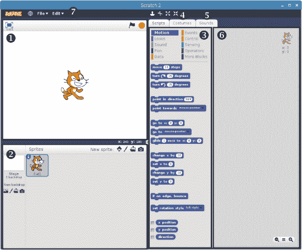

**图 19-1：** Scratch 2 窗口

Scratch 窗口将屏幕分为四个主要部分。舞台 ➊ 是你的游戏或动画播放的地方。在右上角，你会看到一个绿色旗帜和一个停止标志；你可以使用这些图标分别开始和停止游戏。当你第一次打开 Scratch 时，默认情况下，你应该会在舞台上看到一只猫。

Sprite 列表➋显示了所有的*精灵*，这些精灵是你游戏中的角色或任何在项目中执行动作的物体。窗口中间是代码区➌，它有三个标签：脚本、服装和声音。脚本标签包含了你用来构建程序的编程块。每个块代表一种编程指令，你可以将它们拖放到程序中。你会看到按照功能分类的不同块，每个分类都有特定的颜色；例如，**运动**类别的块，用来控制精灵如何移动，颜色是深蓝色的。

服装标签➍显示了用于自定义和创建新服装的选项，声音标签➎允许你为精灵添加声音。脚本区➏是你拖动块并将它们组合在一起创建脚本的地方。

顶部的菜单栏➐显示了左侧的“文件”和“编辑”主菜单。中央的图标允许你复制、删除、放大和缩小精灵，也可以从 Scratch 获取帮助。

### 连接电路

本项目的电路由两个按钮和树莓派组成。按照这些指示连接它们，并使用图 19-2 作为参考。

1.  将一个 GND 引脚连接到面包板的 GND 轨道。

1.  将两个按钮插入面包板中。

1.  将右下角按钮的引脚连接到 GND 轨道。

1.  将一个按钮的左下角引脚连接到 GPIO 2，另一个连接到 GPIO 3。

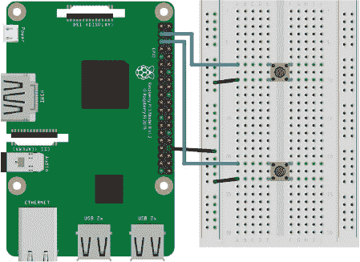

**图 19-2：** 将两个按钮连接到树莓派

就这些！你已经准备好编写游戏代码了。

### 构建脚本

在创建游戏之前，列出你希望游戏具备的功能是有用的，这样你就能明确需要做什么。

在《饥饿的猴子》游戏中，玩家控制一只猴子，需要尽量抓住熟香蕉，同时避开坏香蕉。每抓到一个好香蕉，玩家得一分；如果抓到一个坏香蕉，游戏会扣一分。以下是构建《饥饿的猴子》游戏的主要步骤：

1.  创建主要角色——猴子，并允许玩家使用两个按钮控制它的移动：一个按钮向右移动猴子，另一个向左移动猴子。也允许玩家使用键盘按键控制猴子的移动。

1.  创建好香蕉和坏香蕉的精灵并让它们从天空中掉下来。

1.  编写代码让猴子在接触到香蕉时抓住它们。

1.  创建一个得分系统，当猴子抓到一个好香蕉时加一分，抓到一个坏香蕉时扣一分。

1.  创建一个计时器，当计时器归零时结束游戏。

1.  游戏结束时显示玩家的得分。

这个项目的 Scratch 文件可以在 *[`www.nostarch.com/RaspberryPiProject/`](https://www.nostarch.com/RaspberryPiProject/)* 获取。要将保存的程序上传到 Scratch，请选择 **文件 ▸ 加载项目**。要构建脚本，请按照接下来的几个部分进行操作。

#### 创建角色并选择舞台背景

**注意**

*你也可以使用画笔图标从零创建角色，点击文件夹图标上传你自己的角色，或使用摄像头图标拍照创建你的角色。*

在《饥饿猴子游戏》中，你将使用猴子角色和来自角色库的香蕉角色。你不需要使用默认出现在舞台上的猫角色，所以你可以通过右键点击该角色并选择 **删除** 来删除它。

转到角色列表，点击最左侧的图标（看起来像一个人物图标，见图 19-3），以打开角色库。


**图 19-3：** 创建新角色的图标

从动物类别中选择 `Monkey2` 角色，并点击 **确定**。然后，再次打开角色库，从物品类别中选择 `Bananas` 角色，点击 **确定**。

你可以从角色列表的最左侧选择游戏的背景。在那里，你会找到一组背景图标。点击第一个图标——在图 19-4 中突出显示——从背景库中选择一个背景。我们选择了叫做*蓝天*的背景。

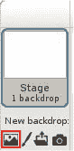

**图 19-4：** 从背景库中选择背景

现在，你的角色部分应该像图 19-5 所示。

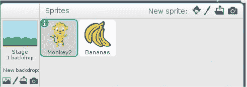

**图 19-5：** 选定角色和背景的角色列表

#### 编辑角色

Scratch 允许你增加或减少角色的大小，改变其颜色，或像在图像编辑程序中一样编辑它。Scratch 内置的图像编辑器叫做*绘图编辑器*。在这里，你将对角色的外观进行一些修改。

在角色列表中选择 `Monkey2` 角色；如果某个角色被选中，它会被蓝色轮廓框住，如图 19-5 所示。接下来，点击 `Monkey2` 角色的造型标签，并编辑第一个造型，名为 `monkey2-a`。使用鼠标指针拖动角色的一个角，直到它的大小为 98×138 像素，或者使用缩小工具调整到所需大小；角色的大小会显示在 `monkey2-a` 造型下方。同时，将 `Bananas` 角色的大小调整为 28×28 像素。

在调整角色大小时，确保它们位于画布的中心，以保持角色的参考点。

#### 为猴子角色添加控制功能

现在，你将为猴子添加控制功能，这样你就可以通过按下按钮或键盘上的左右箭头让它向左或向右移动。

为了让树莓派 GPIO 与 Scratch 接口，这样程序在按下按钮时能够响应，你需要将一个扩展库添加到 Scratch 中。选择“脚本”标签下的 `Monkey2` 精灵，选择 **更多积木**，然后点击 **添加扩展**。接下来选择 Pi GPIO 图标，如 图 19-6 所示，然后点击 **确定**。

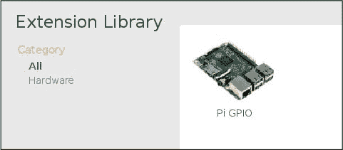

**图 19-6：** 添加 Pi GPIO 扩展

扩展库添加了新的积木来控制 Pi GPIO，这些积木应出现在“更多积木”类别中。

在 Scratch 中，有许多不同的方法可以让你的精灵移动。你将使用 (x,y) 坐标系统，其中 (0,0) 位置是舞台的中央。增加 x 坐标会将精灵向右移动，减少 x 坐标会将精灵向左移动。增加 y 坐标会将精灵向上移动，减少 y 坐标会将精灵向下移动。控制移动的积木位于深蓝色的 **动作** 类别中。

为了控制猴子，选择 `Monkey2` 精灵并将 图 19-7 中的积木拖入脚本区域。然后修改积木中的设置，使其与 图 19-7 中的设置一致。

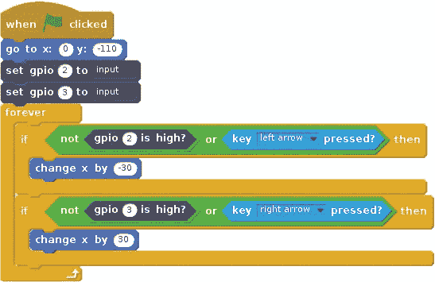

**图 19-7：** 控制猴子的积木

你首先将 `Monkey2` 精灵的 x 位置设置为 0，y 位置设置为 –110。将 x 设置为 0 会将精灵水平居中，而将 y 设置为 –110 会将精灵移到地面。这样，每次开始游戏时，精灵都会处于这个位置。

接下来的两个积木将 GPIO 2 和 GPIO 3 设置为输入，这样程序就能判断按钮是否被按下。

**注意**

*找到这些积木很容易。记住，每个积木类别都有特定的颜色，每个类别中的积木也会相应地着色。*

然后你需要添加一个永远循环，不断检查玩家是否按下按钮或左右箭头键。如果玩家按下连接到 GPIO 3 的按钮，或按下右箭头键，精灵的 x 位置将增加 30，向右移动；如果玩家按下连接到 GPIO 2 的按钮，或按下左箭头键，精灵的 x 位置将减少 30，向左移动。你可以增加这个数值来让猴子移动得更快，或者减少它让猴子移动得更慢。

一旦你添加了这些积木，双重检查它们是否与 图 19-7 相符，然后你就可以进行测试了。

#### 测试你的脚本

在 Scratch 中启动脚本时，你使用绿色旗帜积木， 。这个积木会启动你的游戏并同步所有精灵中的脚本。当你点击舞台右上角的绿色旗帜图标时，Scratch 会启动所有位于这个积木下方的脚本。

现在点击舞台右上角的绿色旗帜图标！image。按下按钮和箭头键，测试精灵是否按预期移动。当一切正常时，继续进行计时器部分。

#### 创建倒计时器

玩家需要知道他们剩下多少时间来抓住香蕉，因此接下来你将创建一个倒计时器。

要将计时器添加到游戏中，选择`Monkey2`精灵，然后将图 19-8 中的块添加到脚本区域。你可能会注意到找不到显示变量块。这是因为你需要创建一个变量来保存时间。要创建变量，请进入**数据**块类别，然后点击**创建变量**按钮。将新变量命名为 time，并通过勾选**对所有精灵可用**框，使其对所有精灵可用。现在将该块拖到脚本区域。

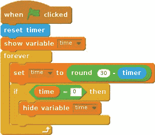

**图 19-8：** 创建倒计时器的块

要创建倒计时器，你将使用一个叫做计时器的块。这个块会计数从脚本开始到现在已经过去的时间。当你点击绿色旗帜图标时，脚本会重置计时器，因此每次开始游戏时，计时器都会从 0 开始计数。接下来，你将包括一个显示`time`变量的块，并可以通过将其拖动到舞台区域来定位它；将其移动到舞台的右上角。

接下来，永远循环将不断更新`time`变量，使其从 30 开始，每秒减少 1。你可以使用四舍五入块，这样倒计时的时间只会以整数显示。如果你想更改游戏的持续时间，可以调整四舍五入块中的数字。

请特别注意这里的嵌套结构（见图 19-9）；你会注意到设置时间块首先出现，然后是四舍五入块。接着，在它之上，你需要放置一个绿色块，里面有两个空圆圈。在第一个空圆圈内输入 30，在第二个空圆圈内，从**传感器**类别中拖入计时器块。


**图 19-9：** 嵌套的 if 块

末尾的 if 块（见图 19-8）隐藏了`time`变量，直到`time`达到 0。现在试试看吧！

#### 计数和显示得分

要创建得分系统，首先需要创建一个变量来跟踪得分。在**数据**块类别中，创建一个新变量，命名为`score`，并使其对所有精灵可用。选择`Monkey2`精灵，然后将图 19-10 中的块添加到脚本区域。

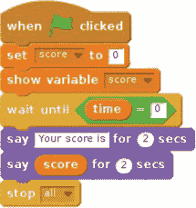

**图 19-10：** 显示得分并停止游戏的块

将设置得分块设为`0`，这样游戏开始时得分就会重置。然后添加显示变量块，将得分显示在舞台上。

在游戏结束时，当时间归零时，猴子应在对话框中说出得分，所有脚本将停止，游戏结束。为了让猴子说话，添加一些紫色的**外观**积木来显示对话框——你可以在此输入任何你希望猴子说的话。

再次提醒，注意积木的嵌套结构，并仔细查看图 19-10。

#### 让香蕉从天而降

现在你已经创建了所有的`Monkey2`动画和控制，你需要让`Bananas`角色从天而降。以下是`Bananas`角色的待办事项：

+   香蕉应该从天而降，从一个随机的 x 位置开始，随后 y 位置逐渐下降，直到它们碰到地面。

+   当香蕉碰到地面时，它们应该消失。

+   当香蕉碰到猴子时，应该播放一个声音，得分加一，香蕉应该消失。

+   当时间归零时，所有香蕉应被删除，以防它们在游戏结束后继续掉落。

首先，你需要从声音库中添加一个声音到积木区。

##### 从声音库添加声音

你将为`Bananas`角色添加一个"砰"的声音，当它与`Monkey2`角色碰撞时播放。为此，选择`Bananas`角色，在积木区选择**声音**选项卡。然后点击图标，从声音库中选择一个声音并选择`pop`。选择**脚本**选项卡以添加你的动作积木。

##### 让香蕉掉落

为了完成待办事项，选择`Bananas`角色，然后将图 19-11 中的积木添加到其脚本区。

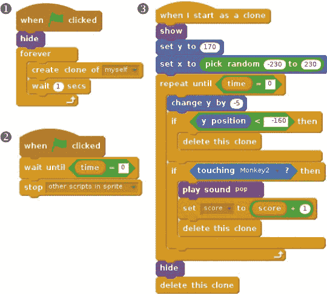

**图 19-11：** 创建和控制`Bananas`角色的积木

在图 19-11 中，使用左上方的一组积木➊，每秒创建一个`Bananas`角色的克隆。换句话说，每秒都会让一个新的`Bananas`角色出现。

在右侧的积木组➌中，你初始化了`Bananas`克隆的值。show 积木确保香蕉出现在屏幕上。你将香蕉的 y 位置设置为 170，对应舞台的顶部，并将 x 位置设置为-230 到 230 之间的随机数，这是舞台的水平空间，从左到右。

然后，你初始化了一个`repeat until`积木，这就像一个`while`循环，直到`time`变量为 0 时才停止。在`repeat until`积木内部的`change y by`积木使香蕉的 y 位置减少，看起来像是从天而降。在这个例子中，我们将 y 位置减少了 5。如果你想让它们掉得更快，可以增加 y 值；如果你想让它们掉得更慢，可以减少 y 值。

在`repeat until`块内的第一个`if`块会在香蕉到达舞台底部时（y < -160）让香蕉消失。第二个`if`块会在香蕉碰到猴子时给`score`变量加一分并播放`pop`声音，同时让香蕉消失。最后，当`repeat until`块结束时，`Bananas`克隆体会从舞台上消失。

图 19-11 中左下角的模块➋会在`time`变量为 0 时停止创建新的`Bananas`克隆体。

#### 添加烂香蕉

现在你已经有了猴子、好的香蕉、计时器和分数。你只缺少烂香蕉。烂香蕉的脚本和图 19-11 中的脚本非常相似；你只需要做以下更改：

+   每 2 秒生成一次烂香蕉，而不是每秒一次。

+   当烂香蕉碰到猴子时，减少一分。

+   当猴子碰到烂香蕉时播放不同的声音。我们选择了`F elec bass`的声音。

+   修改烂香蕉的外观。

因为这个脚本和之前的非常相似，所以你将复制好的香蕉精灵并进行更改。右键点击`Bananas`精灵并选择**复制**。精灵及其脚本会被复制，并自动命名为`Bananas2`。右键点击`Bananas2`精灵并选择**信息**；将会出现一个菜单，允许你更改精灵的名称。将新名称输入为`Rotten`。你需要对脚本进行的更改在图 19-12 中已标出。

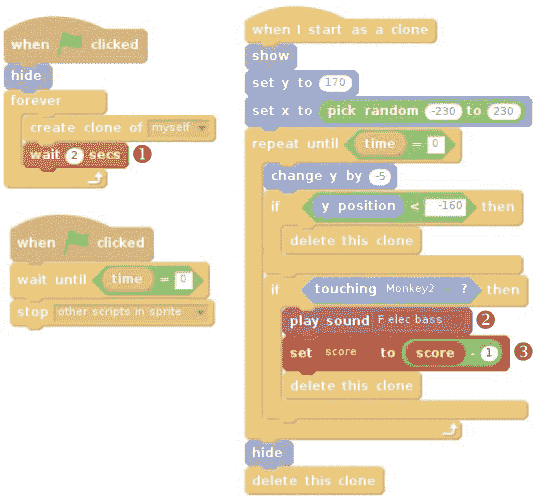

**图 19-12：** 控制烂香蕉的模块

将等待模块的值改为`2` ➊，这样每隔 2 秒就会生成一个新的`Rotten`克隆体，而不是每秒生成一个。同时，将声音模块改为播放`F elec bass` ➋，并在设置分数的模块中将分数减少`1` ➌。记住，你需要先在“声音”选项卡中从库中添加这个声音。

完成烂香蕉的脚本后，接下来你需要更改`Rotten`精灵的颜色，使香蕉看起来像是烂掉了。选择`Rotten`精灵并点击**造型**选项卡。应出现绘画编辑器屏幕（见图 19-13）。

在窗口的右侧，选择桶图标➊；然后，在底部选择不同的颜色➋来为每根香蕉填充不同的颜色。选择棕色、橄榄绿色和深绿色等颜色，表示它们已经烂了。

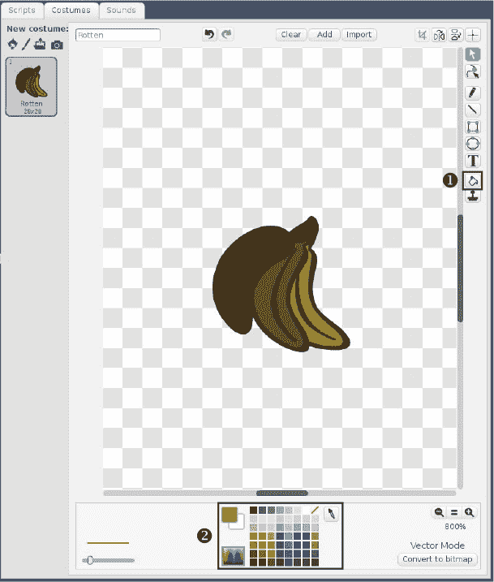

**图 19-13：** 编辑**Rotten**精灵颜色

### 玩游戏

恭喜！你的游戏已经准备好了。要在全屏模式下玩游戏，点击舞台左上角的全屏图标，然后点击绿色旗帜图标。在全屏模式下玩游戏会让它运行得更流畅、更快速。

记住，你可以使用推按钮或键盘键来玩游戏。当游戏结束时，只需点击绿色旗帜图标重新开始。

### 进一步发展

这个项目只是展示了你可以用 Scratch 做的一小部分内容。以下是一些改进这个游戏的想法：

+   随着游戏的进行，增加香蕉掉落的速度。

+   随着游戏的进行，增加腐烂香蕉的数量。

+   通过创建另一个具有不同控制的角色精灵，使这个游戏支持多人游戏。（你需要添加一个`score`变量来保存玩家 2 的分数。）

+   在你的电路中添加可以与 Scratch 接口的其他电子元件，例如按钮、蜂鸣器或传感器。

玩得开心，创造你自己的游戏！

## **Wi-Fi 远程控制机器人**

在这个项目中，你将构建一个两轮电池供电的机器人，使用 Raspberry Pi Zero W 和 MotoZero 附加板。你可以通过 Wi-Fi 使用你用 Node-RED 制作的网页应用程序来控制它。

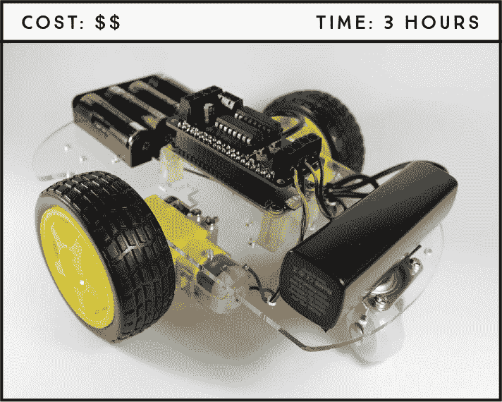

**所需部件**

Raspberry Pi Zero W（或其他 40 个 GPIO 的 Raspberry Pi）

智能机器人车底盘套件

MotoZero 附加板（或其他电机控制器附加板）

四个 AA 电池

便携充电器

跳线

**所需软件**

Node-RED 仪表板

### 项目概要

我们不会直接进入项目，而是会先介绍机器人的最重要部分，给你一个整体的了解。

**Wi-Fi**

你将使用 Node-RED 应用程序控制机器人，因此你的 Raspberry Pi 需要具备 Wi-Fi 功能。Raspberry Pi 3 和 Zero W 型号内置了 Wi-Fi，如果你的板子没有，你可以使用兼容 Pi 的 Wi-Fi 加密狗。

**Raspberry Pi 主板**

我们使用的是 Raspberry Pi Zero W，因为它的体积小，非常适合用于小型机器人底盘。但是，只要具有 Wi-Fi 功能，任何带有 40 个 GPIO 的 Raspberry Pi 版本都可以与本项目兼容。

**机器人底盘套件**

我们使用的是一个机器人底盘套件，里面包含了构建机器人所需的所有部件，包括车轮、电机和螺丝。你可以通过在亚马逊或 eBay 等在线市场上搜索*智能车机器人底盘套件*来找到这个套件。你需要的是带有两个直流电机的套件。

**MotoZero 附加板**

直流电机将使机器人移动，你将通过名为 MotoZero 的附加板来控制它们。一个可以找到这个附加板的地方是 The Pi Hut 网站 (*[`thepihut.com/motozero/`](https://thepihut.com/motozero/)*)。你也可以使用任何其他与 Raspberry Pi 兼容的电机驱动附加板，或者使用 LC293D 芯片构建电路。我们不会在这里详细介绍如何构建这个电路，但如果你想自己制作，可以在网上找到很多教程。

**电源**

我们不想将 Pi 机器人连接到墙壁插座，因为我们希望它具有便携性，因此需要使用便携充电器或*移动电源*为机器人供电。移动电源必须能够输出 5V 和 2A。我们使用一款容量为 2200mAh 的移动电源进行了测试，效果良好；如果使用容量更大的电源，机器人可以运行更长时间。

直流电动机需要独立于树莓派供电，这意味着你需要两个独立的电源。为了为电动机供电，我们使用了底盘套件中附带的电池盒和四个 AA 电池（套件中不包含电池）。

**Node-RED 应用程序**

你将用来控制机器人 Node-RED 应用程序应该能够让机器人前进和后退、左右移动和停止。由于你并没有将树莓派作为桌面计算机使用，树莓派需要在启动时自动启动 Node-RED。你还将为应用程序添加一个关机按钮，以便你可以远程关闭树莓派。

图 20-1 显示了机器人如何工作的高层概览。

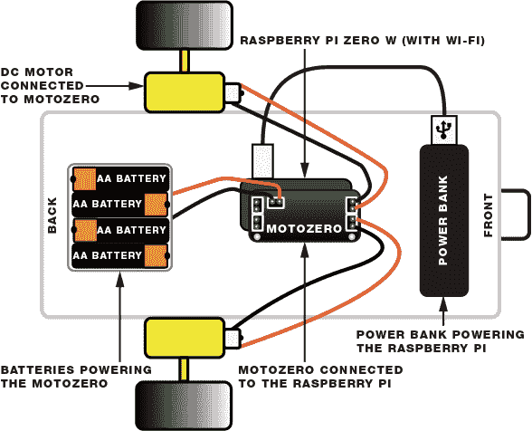

**图 20-1：** 机器人结构

### 准备树莓派

我们使用的是树莓派 Zero W 板，如图 20-2 所示，这是一款带有内置无线局域网和蓝牙的树莓派 Zero 变体，但请记住，你可以使用其他兼容 Wi-Fi 的板子或 Wi-Fi 加密狗。树莓派 Zero W 的尺寸仅为 2.56 英寸 × 1.18 英寸 × 0.20 英寸（65 mm × 30 mm × 5 mm），价格约为 10 美元。

树莓派 Zero 具有 40 个 GPIO 引脚，排列与树莓派 3 相同。如图 20-2 所示，它配备了一个迷你 HDMI 接口和两个 Micro USB 接口，其中一个专用于电源。如果你打算将树莓派 Zero 作为桌面计算机使用，你需要一些额外的配件，例如 USB 集线器、USB 转 Micro USB 适配器和 HDMI 转迷你 HDMI 适配器来连接外设。为了节省一些费用，我们将在常规的树莓派 3 上准备好所有内容，然后将 Micro SD 卡切换到树莓派 Zero W 上。

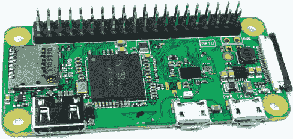

**图 20-2：** 树莓派 Zero W

我们建议为此项目使用一张新的 Micro SD 卡。请参考“上传操作系统”章节，了解如何在新的 Micro SD 卡上安装最新版本的 Raspbian。

安装操作系统后，将 Micro SD 卡插入你的常规树莓派。启动树莓派，并等待几秒钟，直到系统启动。然后，从桌面右上角点击**Wi-Fi**配置 Wi-Fi。接下来，输入你的 Wi-Fi 密码，并等待几秒钟，直到 Wi-Fi 连接成功建立。

Node-RED 软件已经预装在树莓派的操作系统中，但你仍然需要安装 Node-RED 仪表板。为此，首先更新库源，然后通过在命令行中输入以下命令安装 npm（Node 包管理器）：

```
pi@raspberrypi:~ $ sudo apt update
pi@raspberrypi:~ $ sudo apt install npm
```

当系统提示时，键入 Y 并按回车键。安装过程可能需要几分钟。然后输入以下命令，将 npm 升级到最新的 3.x 版本，这是推荐与 Node-RED 一起使用的版本：

```
pi@raspberrypi:~ $ sudo npm install -g npm@3.x
pi@raspberrypi:~ $ hash –r
```

最后，输入以下命令以安装 Node-RED 仪表板：

```
pi@raspberrypi:~ $ sudo npm install --unsafe-perm -g node-red-dashboard
```

同样，Node-RED 需要在 Pi 启动时自动启动。为此，请在终端中输入以下命令。

```
pi@raspberrypi:~ $ sudo systemctl enable nodered.service
```

完成后，关闭树莓派并将 micro SD 卡换到树莓派 Zero W 上。

### 接线电路

要构建机器人结构，您需要一个机器人底盘、两个带相应车轮的直流电机、MotoZero 附加板、跳线和您的树莓派（带 Wi-Fi）。使用 图 20-1 作为参考。我们将从将 MotoZero 安装在树莓派的顶部开始，然后再将电机接到 MotoZero 上。

#### 将直流电机接线到 MotoZero

MotoZero 允许您独立控制四个电机，但您只需要控制两个直流电机。MotoZero 将以未组装的形式提供，因此您需要焊接它的零件。Pi Hut 在产品页面上提供了组装手册，因此请访问 *[`thepihut.com/motozero/`](https://thepihut.com/motozero/)* 并在继续之前按照说明进行操作。组装完成后，您的 MotoZero 应该看起来像 图 20-3 一样。

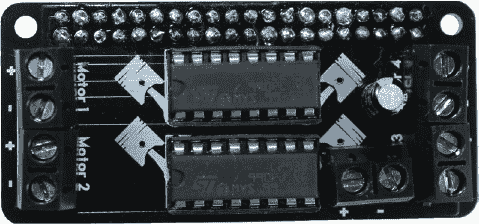

**图 20-3：** 组装好的 MotoZero 附加板

图 20-3 显示了可以连接到 MotoZero 的接线方式：四个直流电机的正极 (+) 和负极 (–) 接口，以及电源的正极 (+) 和负极 (–) 接口。您需要一个外部电源来驱动电机。电机需要较大的电流跳跃才能运转，因此使用外部电源可以防止当这种电流跳跃发生时，树莓派突然失去电源。

按照这些说明并参考 图 20-1 来连接电机和电池座。

1.  将右侧直流电机的红线连接到 MotoZero 上的电机 1 正极 (+) 引脚，黑线连接到电机 1 负极 (–) 引脚。您需要松开螺丝，将线放入引脚槽中，然后再重新拧紧螺丝。

1.  对左侧电机执行相同操作，将电源线连接到 MotoZero 的电机 2 接口。

1.  在没有插入电池的情况下，将电池座的红线连接到 MotoZero 电源连接器上的正极 (+) 引脚，黑线连接到负极 (–) 引脚，如 图 20-3 所示的电路底部。

**注意**

*如果您发现机器人的车轮旋转方向与您预期的相反，您可能需要交换直流电机的红线和黑线，分别连接到电机 1 或电机 2 的正极 (+) 和负极 (–) 端子。当您在项目结束时测试应用程序时，您就会知道是否需要进行此更改。*

#### 使用 MotoZero 控制电机

每个直流电动机都有三个与之相关的 GPIO 引脚。一个引脚，称为*使能*引脚，用于启动电动机，类似于开关。另两个引脚控制正负电动机线的电源。将电源连接到一根线，GND 连接到另一根线时，电动机会向一个方向旋转；而将电源和 GND 接到相反的电动机线时，电动机会向相反方向旋转。

**注意**

*有关电动机 3 和电动机 4 的 GPIO 信息，可以查阅 MotoZero 手册，访问 The Pi Hut 的产品页面* ([`thepihut.com/motozero/`](https://thepihut.com/motozero/))。

当你将 MotoZero 安装在树莓派顶部时，我们只使用电动机 1 和电动机 2 的端子，它们由下表中显示的 GPIO 控制。

| **电动机 1** | **电动机 2** |
| --- | --- |
| 使能：GPIO 5 | 使能：GPIO 6 |
| 电动机 1 (+)：GPIO 27 | 电动机 2 (+)：GPIO 22 |
| 电动机 1 (–)：GPIO 24 | 电动机 2 (–)：GPIO 17 |

要使电动机旋转，使能引脚必须为 HIGH 才能启动电动机，且正负引脚之一（且仅有一个）应为 HIGH。例如，如果你想让电动机 1 向一个方向旋转，可以使用以下设置：

+   GPIO 5：HIGH

+   GPIO 27：HIGH

+   GPIO 24：LOW

要让同一个电动机向相反方向旋转，请使用以下设置：

+   GPIO 5：HIGH

+   GPIO 27：LOW

+   GPIO 24：HIGH

要关闭电动机，你需要向所有 GPIO 发送一个 LOW 信号。其他电动机也适用相同的逻辑。

### 编写应用程序

一旦你组装好硬件，就可以开始创建 Node-RED 应用程序了。由于树莓派已经安装在你的机器人底盘中，最实用的方法是使用你常用的台式机或笔记本电脑，从那里控制它。

首先，你需要找到树莓派 Zero W 的 IP 地址；你将使用它来访问树莓派的 Node-RED 应用程序仪表盘，在那里你可以创建机器人应用程序。

在继续之前，确保树莓派已开启，并且你的计算机和树莓派连接到同一网络。

#### 查找树莓派的 IP 地址

**警告**

*树莓派 Zero W 有两个迷你 USB 端口，其中一个标有* PWR IN，*用于为树莓派供电。*

通过将 5V 电源适配器连接到墙壁插座，为树莓派供电。在创建 Node-RED 应用程序时，你只使用这个电源；一旦完成，你应该切换到便携电源。

你可以使用 Angry IP Scanner 软件来查找树莓派的 IP 地址。免费从* [`angryip.org/download/`](http://angryip.org/download/)*下载到你的常用台式机或笔记本电脑，并按照提示安装。

安装完成后，打开 Angry IP Scanner 并点击 **开始** 按钮。等待几秒钟，直到它显示可用的 IP 地址。你的 Pi IP 地址应该显示为 *raspberrypi.lan* 的主机名，因此记下对应的 IP 地址。图 20-4 高亮显示了我们的 Raspberry Pi IP 地址，即 192.168.1.122。

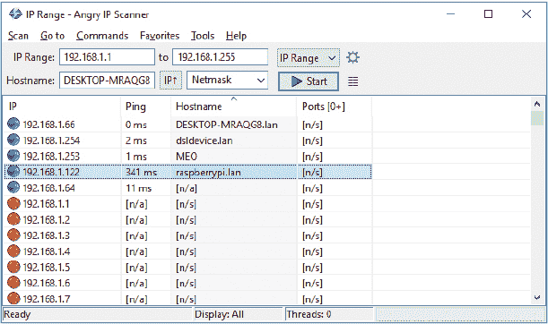

**图 20-4：** 使用 Angry IP Scanner 软件查找 Raspberry Pi IP 地址

#### 创建 Node-RED 流程

**注意**

*关于 Node-RED 的介绍，请参见 项目 17。*

在你的常规计算机上，确保它与 Raspberry Pi 在同一网络下，打开一个网页浏览器标签并访问 *http://<Pi IP 地址>:1880*，将 *<Pi IP 地址>* 替换为你之前记录的 Raspberry Pi IP 地址。在我们的例子中，我们访问了 *http://192.168.1.122:1880*。你的 Raspberry Pi Node-RED 网络服务器应该会打开。

在窗口的右上角，选择 **仪表盘** 标签，在 **布局** 标签内创建一个名为 **机器人** 的标签。接下来，在该机器人标签内创建两个组，分别为 **主** 和 **关闭电源**。主组是你将组织控制机器人按钮的地方，而关闭电源组是你将添加远程关闭 Raspberry Pi 按钮的地方。完成这些标签和组之后，你的布局应当与 图 20-5 相似。

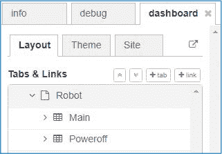

**图 20-5：** Node-RED 应用程序仪表盘布局

向流程中添加五个按钮、一个函数、六个 RPI GPIO 输出节点以及一个执行节点。连接节点并编辑它们的名称，使其与 图 20-6 中的名称一致。

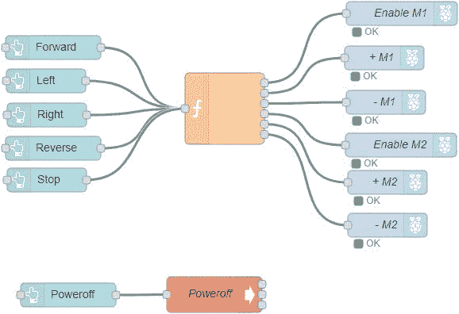

**图 20-6：** Node-RED 应用程序节点

编辑函数的属性，使其具有六个输出，并根据 表 20-1 显示的内容分配所有节点的属性。

**表 20-1：** 分配给每个节点的属性

| **节点** | **属性** |
| --- | --- |

| 前进 | 分组：主 [机器人] 大小：自动

图标：fa-arrow-up

标签：前进

有效载荷：前进 |

| 左 | 分组：主 [机器人] 大小：自动

图标：fa-arrow-left

标签：左

有效载荷：左 |

| 右 | 分组：主 [机器人] 大小：自动

图标：fa-arrow-right

标签：右

有效载荷：右 |

| 反向 | 分组：主 [机器人] 大小：自动

图标：fa-arrow-down

标签：反向

有效载荷：反向 |

| 停止 | 分组：主 [机器人] 大小：自动

图标：fa-hand-paper-o

标签：停止

有效载荷：停止 |

| f | 函数：在 清单 20-1 中输入代码 输出：6 |
| --- | --- |
| 启用 M1 | GPIO: GPIO5 – 29 类型：数字输出 |
| + M1 | GPIO: GPIO27 – 13 类型：数字输出 |
| – M1 | GPIO: 18 – GPIO24 类型：数字输出 |
| 启用 M2 | GPIO: GPIO17 – 11 类型：数字输出 |
| + M2 | GPIO: GPIO6 – 31 类型：数字输出 |
| – M2 | GPIO: GPIO22 – 15 类型：数字输出 |

| 关闭电源 | 分组：关闭电源 [机器人] 大小：自动

图标：fa-power-off

标签：关闭电源

背景：红色 |

| exec | 命令：`/usr/bin/sudo` + 附加：未选中

关机

名称：关机 |

图 20-7 展示了 exec 节点的设置方式。

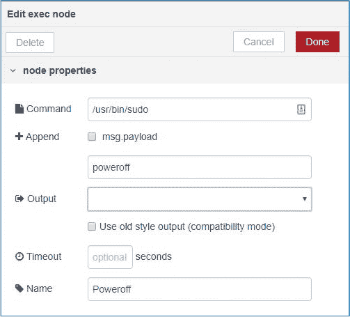

**图 20-7：** exec 节点属性

所有节点应当在主组中，除了关机按钮，应该属于关机组。

#### 输入脚本

将 JavaScript 代码插入到清单 20-1 中（也可以从 *[`www.nostarch.com/RaspberryPiProject/`](https://www.nostarch.com/RaspberryPiProject/)* 下载）：

**清单 20-1：** 遥控机器人脚本

```
➊ var msg1 = { payload: 0 };
  var msg2 = { payload: 0 };
  var msg3 = { payload: 0 };
  var msg4 = { payload: 0 };
  var msg5 = { payload: 0 };
  var msg6 = { payload: 0 };
➋ if (msg.payload === "forward") {
     msg1.payload = 1;
     msg2.payload = 1;
     msg4.payload = 1;
     msg5.payload = 1;
  }
  else if (msg.payload === "left") {
     msg1.payload = 1;
     msg2.payload = 1;
  }
  else if (msg.payload === "right") {
     msg4.payload = 1;
     msg5.payload = 1;
  }
  else if (msg.payload === "reverse") {
     msg1.payload = 1;
     msg3.payload = 1;
     msg4.payload = 1;
     msg6.payload = 1;
  }
➌ return [msg1, msg2, msg3, msg4, msg5, msg6];
```

这个函数会按照它们连接到函数节点的顺序，将消息发送到连接的 rpi gpio 输出节点。这意味着 `msg1` 会发送到启用 M1 节点，`msg2` 会发送到 + M1，`msg3` 会发送到 – M1，依此类推（参见 图 20-6）。

首先，你将所有负载消息变量值初始化为 `0` ➊。然后，一系列的 `if` 和 `else if` 语句检查按下了哪个按钮 ➋，根据函数收到的负载设置消息值，以决定机器人应执行的动作。例如，如果你按下前进按钮，函数节点接收到的负载是 `forward`，因此 ➋ 处的条件被满足，代码会将 `msg1`、`msg2`、`msg4` 和 `msg5` 的负载值设置为 `1`，而 `msg3` 和 `msg6` 保持为 `0`。

然后，函数节点将`msg.payload`的值发送到相应的节点➌。为了让机器人前进，负载需要是：

+   启用 M1: `1`

+   + M1: `1`

+   – M2: `0`

+   启用 M2: `1`

+   + M2: `1`

+   – M2: `0`

这里，两个电机都已启用并朝相同方向转动——前进。下表显示了函数应发送给每个节点的消息，以实现每个动作。

| **动作** | **启用 M1** | **+ M1** | **– M1** | **启用 M2** | **+ M2** | **– M2** |
| --- | --- | --- | --- | --- | --- | --- |
| 前进 | 1 | 1 | 0 | 1 | 1 | 0 |
| 左 | 1 | 1 | 0 | 0 | 0 | 0 |
| 右 | 0 | 0 | 0 | 1 | 1 | 0 |
| 反向 | 1 | 0 | 1 | 1 | 0 | 1 |
| 停止 | 0 | 0 | 0 | 0 | 0 | 0 |

当点击停止按钮时，代码中设置的条件没有一个被满足，函数会发送在开始时初始化的值➊。

在函数节点外部，当点击关机按钮时，exec 节点会执行`poweroff`命令以关闭 Pi。记住你已经在`exec`命令属性中填写了*/usr/bin/sudo/poweroff*——参见表 20-1。

一切就绪后，点击右上角的**部署**按钮，保存更改并运行流程。

#### 运行应用

现在你的 Node-RED 应用已经准备好了。访问 *http://<Pi IP 地址>:1880/ui* （将 *<Pi IP 地址>* 替换为你自己的地址）来查看你的应用仪表盘。它应该像 图 20-8 那样。

测试控制，看看轮子是否朝正确方向转动，别忘了你需要将四节 AA 电池插入电池座，以便为电机提供电源。

如果一个或两个电机转动方向错误，请交换该电机终端上的黑色和红色电线，或者更改负载消息以匹配所需的方向。

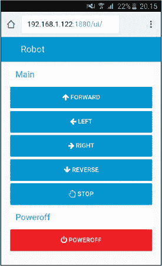

**图 20-8：** Node-RED 应用程序远程控制机器人

### 启动机器人

现在应用程序已经准备好，点击 **关机** 按钮关闭树莓派。然后等待几秒钟，直到它关闭。

将树莓派的电源从墙壁插座切换到移动电源。等待几分钟，直到树莓派启动并自动启动 Node-RED。在与树莓派处于同一网络的智能手机或其他设备上，打开一个新的浏览器标签页，访问 *http://<Pi IP address>:1880/ui*。然后点击按钮来远程控制你的机器人。

恭喜——你现在拥有了一台 Wi-Fi 控制的机器人！

### 进一步操作

你的机器人有很多升级空间。以下是一些需要硬件和软件更改的升级思路。你需要在 Node-RED 中做一些实验，以使这些功能正常工作：

+   获取一个四轮的机器人底盘，控制四个电机而不是两个。

+   给机器人添加 LED 灯和蜂鸣器，使其更具互动性。

+   添加传感器，例如超声波传感器，让机器人能够自主避开障碍物。
