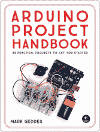
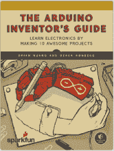
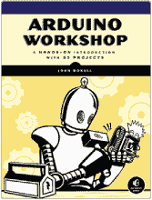
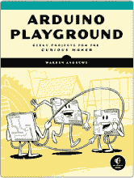
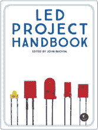

## 第九章：解码电阻值

本快速指南展示了如何识别不同的电阻器。电阻器是一种被动电子元件，用于对电流流动产生阻力，限制电流到达电路的某个部分。在本书中，你主要使用电阻器来限制电流到达 LED。

使用这个电阻颜色图表来帮助你根据电阻器上的色带计算电阻值。

| **颜色** | **第一条色带** | **第二条色带** | **第三条色带** | **乘数** | **公差** |
| --- | --- | --- | --- | --- | --- |
| 黑色 | 0 | 0 | 0 | 1 Ω |  |
| 棕色 | 1 | 1 | 1 | 10 Ω | +/–1% |
| 红色 | 2 | 2 | 2 | 100 Ω | +/–2% |
| 橙色 | 3 | 3 | 3 | 1 KΩ |  |
| 黄色 | 4 | 4 | 4 | 10 KΩ |  |
| 绿色 | 5 | 5 | 5 | 100 KΩ | +/–0.5% |
| 蓝色 | 6 | 6 | 6 | 1 MΩ | +/–0.25% |
| 紫色 | 7 | 7 | 7 | 10 MΩ | +/–0.10% |
| 灰色 | 8 | 8 | 8 |  | +/–0.05% |
| 白色 | 9 | 9 | 9 |  |  |
| 金色 |  |  |  | 0.1 Ω | +/–5% |
| 银色 |  |  |  | 0.01 Ω | +/–10% |

电阻器通常有四条色带。前两位数字代表电阻值的前两位数字。第三条是乘数，表示前两位数字后面零的数量。第四条是电阻的公差。

例如，让我们计算图 B-1 中电阻器的电阻值。

**图 B-1:** 四条色带电阻器

+   第一条色带是绿色（5）= 5。

+   第二条色带是蓝色（6）= 6。

+   第三条色带是黄色（4）= 0000（表示零的数量）。

+   第四条色带是金色，所以公差为+/– 5%。

电阻值为 56 × 10,000（10 kΩ），结果为 560 kΩ。公差为 5%，这意味着电阻值可能在 560 kΩ ± 5%之间，即在 532 kΩ和 588 kΩ之间。除非你使用非常敏感的元件，否则不必过于担心公差。对于本书，公差为 5%的电阻器完全可以使用。

**更新**

访问[`www.nostarch.com/RaspberryPiProject/`](https://www.nostarch.com/RaspberryPiProject/)获取更新、勘误和其他信息。

更多实用书籍来自  **NO STARCH PRESS**

**ARDUINO 项目手册，第 1 卷**

25 个实用项目让你快速上手

*作者* 马克·吉迪斯

2016 年 6 月，272 页，$24.95

ISBN 978-1-59327-690-4

*全彩*

**ARDUINO 发明者指南**

通过制作 10 个酷炫项目来学习电子学

*作者* 布莱恩·黄 *和* 德里克·伦伯格

2017 年 6 月，336 页，$29.95

ISBN 978-1-59327-652-2

*全彩*

**ARDUINO 工作坊**

通过 65 个项目进行实践入门

*作者* 约翰·博克索尔

2013 年 5 月，392 页，$29.95

ISBN 978-1-59327-448-1

**生还者指南：丧尸末日**

用简单电路、Arduino 和树莓派保护你的基地

*作者* 西蒙·蒙克

2015 年 10 月，296 页，$24.95

ISBN 978-1-59327-667-6

**ARDUINO 操场**

适合经验丰富的创客的极客项目

*作者* WARREN ANDREWS

2017 年 3 月，344 页，$29.95

ISBN 978-1-59327-744-4

**LED 项目手册**

*编辑* JOHN BAICHTAL

2018 年春季，280 页，$24.95

ISBN 978-1-59327-825-0

*全彩*

**电话：**

1.800.420.7240 或 1.415.863.9900

**电子邮件：**

sales@nostarch.com

**网站：**

[www.nostarch.com](http://www.nostarch.com)

