## 安装**

你已经考虑过你希望你的 FreeBSD 安装做些什么。你已经选择了硬件。你已下载启动介质，并将其刻录到闪存驱动器或光盘上。你找到了一台可用的 USB 键盘，并设置你的测试机器从该介质启动。现在，让我们开始 FreeBSD 的安装过程。启动你的安装介质并跟随操作。

在整个安装过程中，我会提到各种键盘映射、怪癖和安装程序提供的快捷方式。有一个让人烦恼的问题是，安装程序没有“返回”按钮：如果你在基本设置上犯了错误，比如磁盘分区，就得重新开始。

当然，我的桌面系统已经安装并运行了好几年。不过，我还是被迫为 Bert 设置一个系统，^(1)。如果他不喜欢我的安装方法，他可以阅读本章并自己安装他的机器。

### 核心设置

启动安装介质后，我看到启动加载器屏幕，并且有一个 10 秒的倒计时，如图 3-1 所示。

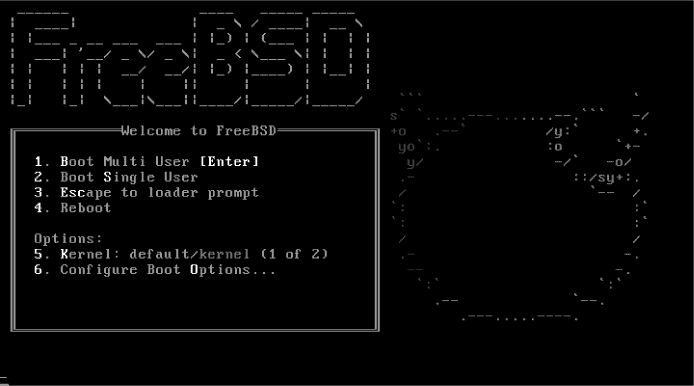

*图 3-1：启动加载器*

按 ENTER 跳过 10 秒倒计时。

接着我看到如图 3-2 所示的选择菜单。

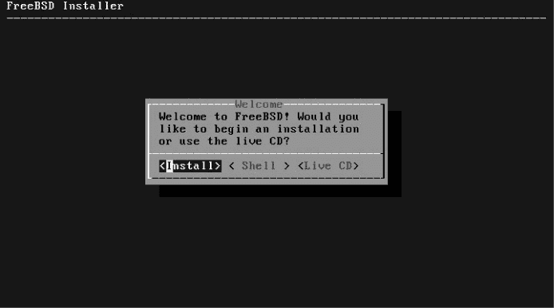

*图 3-2：选择安装*

在第五章，我们会讨论如何使用 live CD 选项来修复损坏的系统。现在，选择默认的安装（Install）选项，按 ENTER。

你可能会注意到，每个选项的第一个字母是红色的，而大部分文本是灰色的。你可以直接输入那个字母来选择，而不必用箭头键。这里，输入 S 会进入 shell，而输入 L 会启动 live CD 镜像。

现在你进入了 bsdinstall(8)，FreeBSD 的传统安装器。其他操作系统有漂亮的图形化安装器，带有鼠标驱动的菜单和多色饼图，而 FreeBSD 的看起来像是一个老旧的 DOS 程序。你将通过选择一个键盘映射开始安装，如图 3-3 所示。

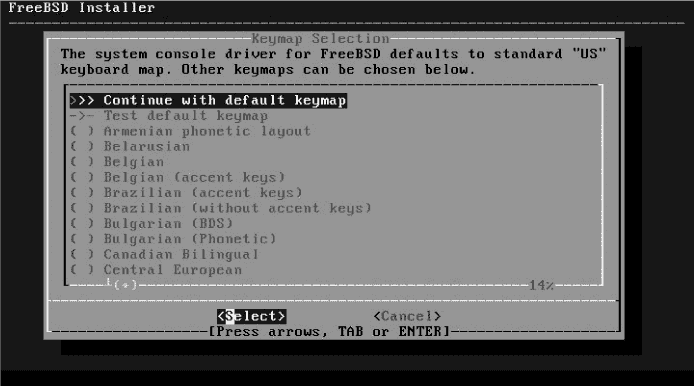

*图 3-3：键盘映射选择*

Bert 的打字习惯糟糕透了，他真的需要一个更好的键盘布局。你可以用上下箭头浏览这个列表，但这很慢。PAGEUP 和 PAGEDOWN 可以一次性上下翻页，而 HOME 和 END 则分别让你跳到顶部和底部。当我找到一个我喜欢的键盘映射时，我按下 ENTER。然后我可以测试这个键盘映射，如图 3-4 所示。

这个键盘映射看起来很熟悉，但许多键盘映射的名字都很相似。按下 ENTER 会弹出一个输入框，让我可以猛敲键盘测试这个键盘映射是否符合我所选择的。如果看起来没问题，按 ENTER 返回这个界面，然后我可以按上箭头再按 ENTER 继续。

安装程序接着会要求我输入主机名，如图 3-5 所示。

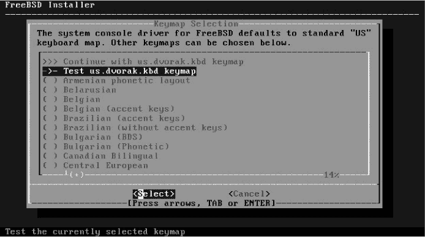

*图 3-4：测试或不测试？*

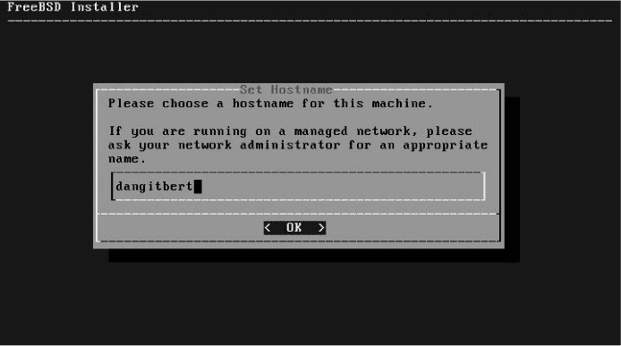

*图 3-5：输入主机名*

我是自己的网络管理员，所以可以使用任何我想要的名称。你的组织可能有不同的规则。按回车键继续。

### 分发选择

设置键盘映射和主机名很重要，但当我们选择要安装的分发版本时，才是真正特有于 FreeBSD 的内容。在 FreeBSD 中，*分发版本*是 FreeBSD 组件的一个特定子集。当你安装 FreeBSD 时，需要选择你想要的分发版本。安装程序没有列出任何强制选择项：你必须安装内核和基本用户空间。一些部分是可选的（见图 3-6）。

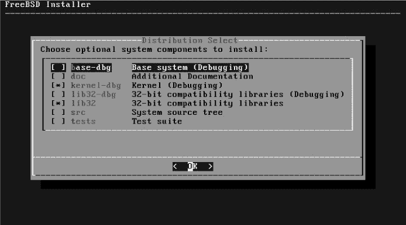

*图 3-6：分发版本*

你不一定需要这些选项，但有些在特定情况下会非常有用。

**base-dbg** 基础系统的调试符号，对程序员有用

**doc** FreeBSD 的官方文档，例如手册

**kernel-dbg** 内核的调试符号，对程序员有用

**lib32-dbg** 32 位库的调试符号（仅限 64 位系统）

**lib32** 32 位兼容库（仅限 64 位系统）

**src** 已安装操作系统的源代码

**tests** FreeBSD 的自测工具

如果你在 FreeBSD 上进行编程或开发，或者正在开发 FreeBSD 本身，可以上下箭头选择调试库。新用户可能会发现文档有帮助。使用空格键选择或取消选择某个选项，按回车键继续进行磁盘分区。

我建议始终安装操作系统源代码。它占用的空间非常小，但可以成为一个宝贵的资源。

对我来说，我希望 Bert 尽量少打扰我。我会给他所有的调试库和系统源代码，如果他抱怨，我可以告诉他去读*/usr/src*。

### 磁盘分区

FreeBSD 支持两种主要文件系统：UFS 和 ZFS（见图 3-7）。第二章讨论了如何在它们之间做选择，因此我不会再次讨论这个问题。现在我需要停止拖延，做出选择。

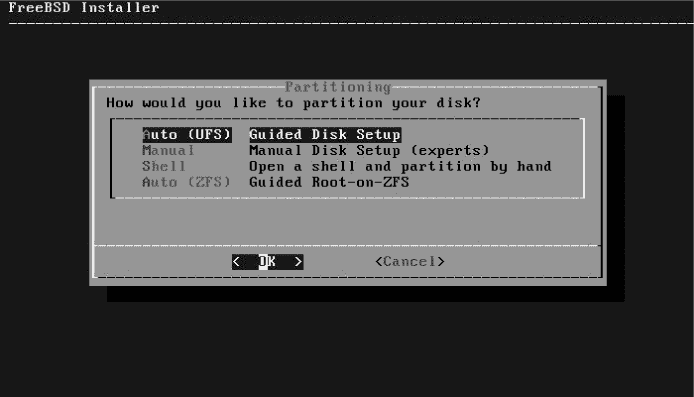

*图 3-7：选择文件系统*

经验丰富的用户可以选择手动安装，或者对于硬核用户，选择 Shell。不过我会让你跟着操作，因此我会选择自动安装（UFS）或自动安装（ZFS）。我会使用 UFS 来演示磁盘分区，然后再介绍 ZFS。

#### *UFS 安装*

由于默认的 UFS 安装非常简单，许多人使用默认选项也能顺利安装，因此我选择了一些不太常见的选项来演示如何使用 bsdinstall。首先，它会问我想使用多少磁盘空间，如图 3-8 所示。

如果 Bert 想使用多个操作系统，他可以启动一个虚拟化管理程序。我按回车键使用整个磁盘。弹出窗口会警告我即将擦除磁盘。没错，我就是要这么做。选择**是**。接下来我需要选择一个分区方案，如图 3-9 所示。

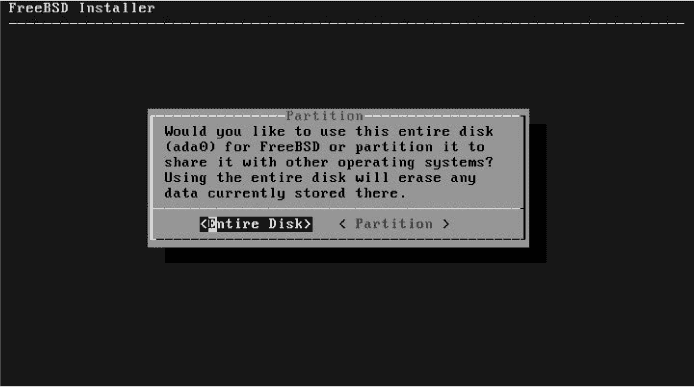

*图 3-8：磁盘使用*

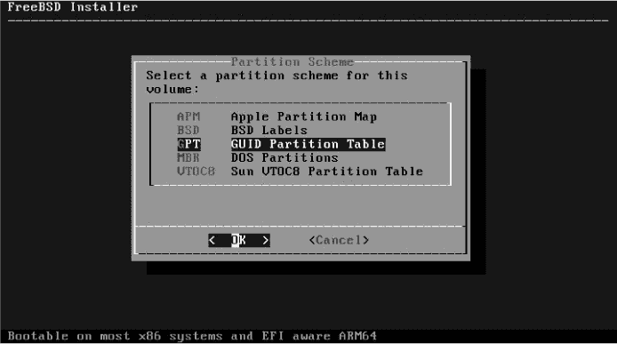

*图 3-9：分区方案*

Bsdinstall 默认使用保守的 MBR 分区方案。几乎所有设备都支持 MBR 分区，就像几乎所有设备都支持 BIOS 而不是 EFI，但 GPT 会在后续过程中减少我很多麻烦。我按箭头键向上移动，选择 GPT，弹出默认的 GPT 分区方案（见图 3-10）。

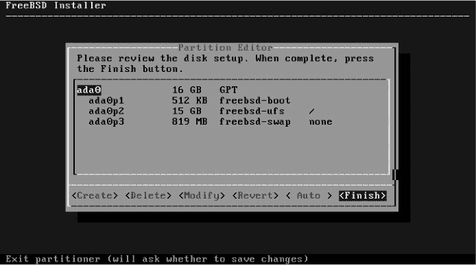

*图 3-10：默认 GPT 分区方案*

你现在可以按 ENTER 完成 UFS 分区，但我确定 Bert 需要特别处理。我们为他创建特殊的分区方案。

每个 GPT 系统都需要一个 freebsd-boot 分区，因此不要更改 ada0p1。按箭头键下移至 ada0p2，按 D 键或按箭头选择“删除”按钮将其删除。同样操作 ada0p3，这样你就会剩下一个分区和一堆空闲空间，如图 3-11 所示。

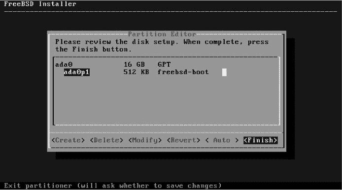

*图 3-11：仅包含引导加载程序*

现在决定如何对这个磁盘进行分区。磁盘有 16GB 的空间，我将其分配如下：

+   512KB freebsd-boot EFI 启动分区

+   1GB 交换区

+   4GB 紧急转储空间（见第二十四章）

+   1GB 根分区 (/)

+   512MB /tmp

+   2GB /var

+   其他所有内容在 */usr*

启动分区已经存在，因此我按箭头键选择“创建”或直接按 C 来添加第一个分区，弹出对话框如图 3-12 所示。

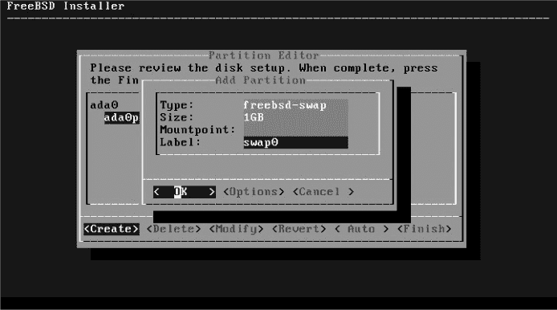

*图 3-12：添加新分区*

箭头键将帮助你在屏幕底部的选项之间移动，但你需要使用 TAB 键才能跳到顶部的文本区。一旦进入文本区，箭头键可以让你在各个字段之间移动，或者在每行内部前后移动。我们的第一个分区将是交换空间，因此使用 DELETE 键清除类型字段的内容并输入 *freebsd-swap*。将大小设置为 1GB。每个分区都应该有一个标签，因此我将其标记为 *swap0*。我们将在第十章中讨论标签。

现在按 TAB 键离开文本框并选择 **OK**。

我敢肯定 Bert 会让这台机器崩溃，并且以非常糟糕的方式进行操作，以至于我必须将所有主机内存转储到磁盘。主机有 4GB 的 RAM，所以我创建了一个 4GB 的转储分区。它看起来和交换空间完全一样，包括 *freebsd-swap* 类型，但我将大小设置为 4GB，并将其标记为 *dump0*。

根分区有点不同，如图 3-13 所示。根分区需要一个文件系统，因此将类型设置为 *freebsd-ufs*。我决定将其分配 1GB。根分区的挂载点总是 */*，我将其标记为 *root*。

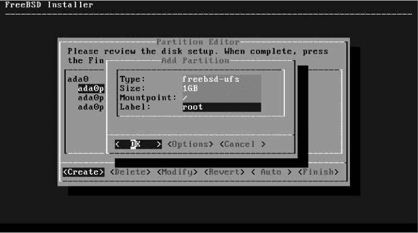

*图 3-13：添加根分区*

剩下的分区用于 */tmp*、*/var* 和 */usr*，它们看起来都很相似。当你用完所有磁盘空间时，你将得到一个类似于图 3-14 中的分区表。

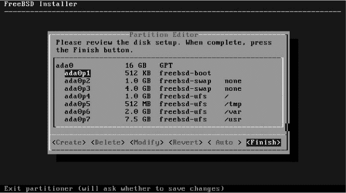

*图 3-14：完整的自定义 GPT/UFS 分区表*

安装程序询问我是否确定。这个布局应该能防止 Bert 抱怨日志文件溢出他的系统，所以我很满意。选择**完成**来分区磁盘并继续安装。

#### *ZFS 安装*

如果我选择 ZFS，我将看到图 3-15 所示的 ZFS 配置屏幕。

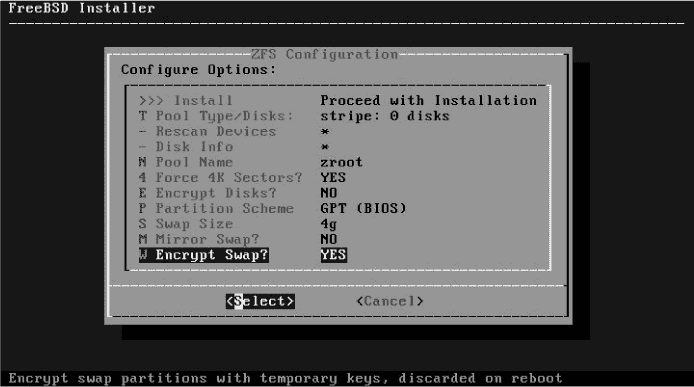

*图 3-15：ZFS 配置*

默认选项是安装，这会因为你还没有选择 ZFS 虚拟设备类型而报错。你需要先选择池类型/磁盘。虽然在我们进入之前，让我们看看其他选项。

FreeBSD 根 ZFS 池的默认名称是*zroot*。除非你希望系统看起来与其他 ZFS 系统不同，或者你的组织有命名池的标准，否则没有必要更改此名称。

强制 4K 扇区选项非常重要，原因我们将在第十章中讨论。除非你完全确定你的磁盘有 512 字节扇区，否则保持此选项为“是”。

如果你选择加密磁盘，你将被提示输入用于全磁盘加密的密码短语。FreeBSD 使用 GELI 进行 ZFS 加密（见第二十三章），尽管当 ZFS 支持原生加密时，这可能会有所改变。

对于分区方案，选择 GPT。如果你的主机可以合理地运行 ZFS，它支持 GPT。

你需要多少交换空间？根据需要调整交换空间大小。我希望这个主机有足够的空间来存储完整的内核内存转储，因为 Bert，所以我将交换空间大小调整为 4GB。

拥有多个硬盘的主机可以在多个硬盘上使用交换分区。当包含交换分区的硬盘故障时，主机会丧失该交换内存块中的所有内容并崩溃。选择镜像交换会为你的交换空间提供冗余，但会占用更多的磁盘空间。

你是否应该选择加密交换区？它的性能成本非常低，而且如果你的硬盘被盗，这可能带来一些潜在的优势。

现在上移并选择池类型/磁盘以选择 ZFS 虚拟设备类型，如图 3-16 所示。

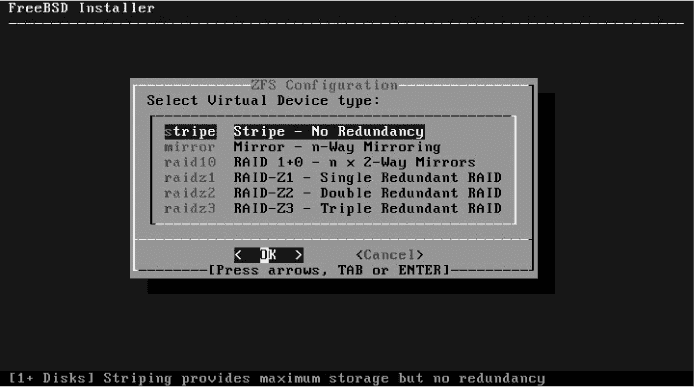

*图 3-16：虚拟设备选择*

第十二章详细讨论了 ZFS 虚拟设备。选择虚拟设备类型是你为 ZFS 系统做出的最重要决策。然而，对于单磁盘主机，唯一可行的选项是*条带*。选择它后，你将有机会选择 ZFS 池中的硬盘（见图 3-17）。

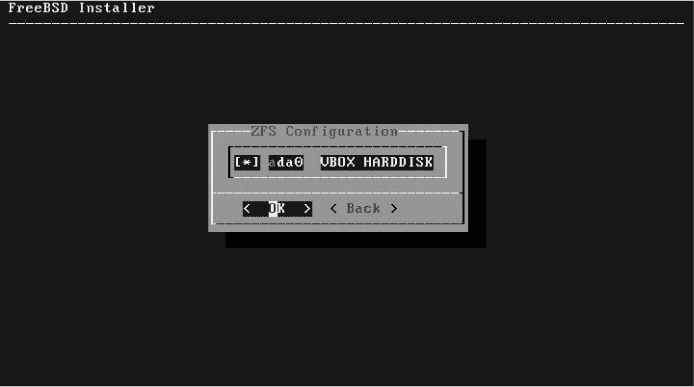

*图 3-17：ZFS 磁盘选择*

使用空格键选择你想要包含在此池中的磁盘。由于此主机只有一块磁盘，我选择它，然后选择“确定”继续。

安装程序将我带回主 ZFS 配置屏幕。我再次检查我的选择（GPT 分区和 4GB 交换分区），然后向上箭头选择“安装”。安装程序给了我最后一个“你真的确定吗？”的警告。我确定。

### 网络和服务配置

一旦你批准了磁盘布局，bsdinstall 会将新的分区表写入磁盘，创建文件系统，并提取你选择的发行版，无需进一步干预。安装程序继续设置网络、服务和用户。

首先，系统会提示你设置新的 root 密码。root 用户可以对系统执行任何操作，所以请设置一个强密码。你需要输入两次密码以便接受。

使用上下箭头选择一个网络接口。此主机只有一个接口，所以我按 ENTER 来配置它（见图 3-18）。

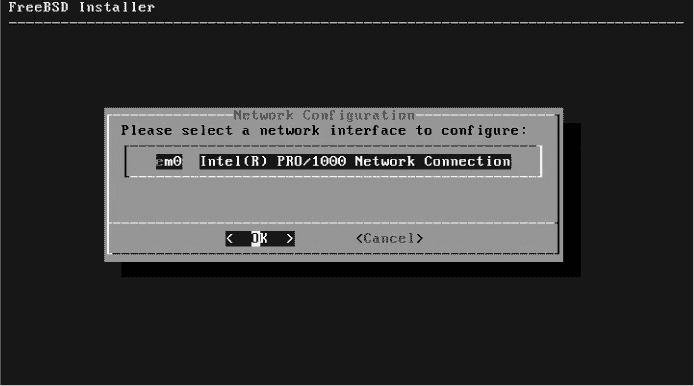

*图 3-18：选择网络接口*

接下来，我们被询问是否要为此接口配置 IPv4。如果你不确定 IPv4 是什么，但你需要互联网连接，选择**是**。我当然选择是。接着，我们被询问是否希望使用 DHCP 自动配置网络。如果这是一个一次性的系统，那可能会选择，但这将是 Bert 的个人服务器。它需要特殊的网络配置。我选择否，并进入网络配置屏幕，如图 3-19 所示。

光标已经位于文本区域。使用箭头键向下移动，而不是 TAB 或 ENTER。看到“确定”被高亮了吗？一旦按下 ENTER，安装程序会继续到下一个屏幕，无论你是否已设置好网络。填写 IP 地址、子网掩码和默认网关的适当值。如果你不知道这些是什么，你应该使用 DHCP 或者阅读第七章。不用担心这里出错；如果你搞砸了，安装程序的最后一个屏幕会提供更改网络配置的机会。完成后按 ENTER。

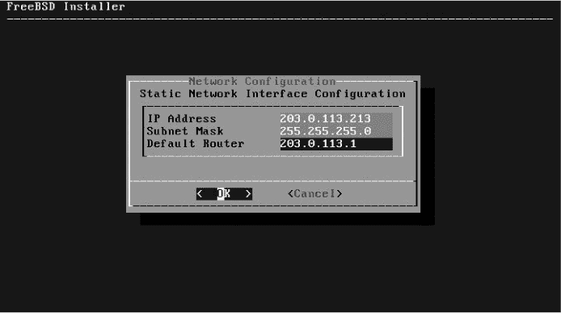

*图 3-19：网络配置*

一旦配置了 IPv4，安装程序会继续配置 IPv6。你们现在都在使用现代网络，所以可以继续配置 IPv6。IP 地址、子网掩码和默认路由器设置与 IPv4 相似。安装程序还支持 SLAAC，也就是*IPv6 的 DHCP*。不过，如果你还在使用老旧的仅 IPv4 网络，就跳过 IPv6 配置。

接下来，你可以选择配置 DNS。在这里，我输入我的网络的搜索域和名称服务器（参见图 3-20）。

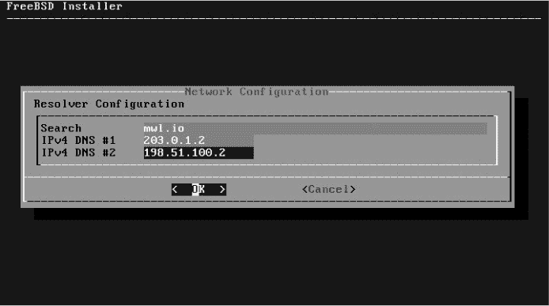

*图 3-20：解析器配置*

如果你有网络的 IP 地址信息，但不知道搜索域和名称服务器的 IP 地址，可以从另一台机器上复制这些值。

安装程序现在会请求主机的时区。与其把所有时区列在一个巨大的列表中，不如通过一系列层次化菜单来选择，如图 3-21 所示。

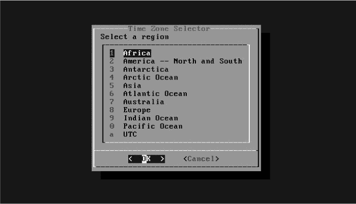

*图 3-21：时区选择器*

选择你的大洲。然后，你将被要求选择一个地区。我选择了美国——Bert 确实在欧洲，但我希望他清楚地意识到，如果他在早上请求帮助，他是得不到的。记住，END 和 HOME 键可以让你快速跳转到这些长列表的顶部和底部；通过按 END 键然后向上移动几个位置，比一页一页地浏览整个西半球的每个国家（包括那些小岛屿）要快得多。然后我可以选择美国的任何时区。美国公民将再次被提醒，许多州的时区设置非常混乱。^(2) 即使是我来自的密歇根州也不例外。但我选择了密歇根州，并有机会确认我的选择（见图 3-22）。

我认出 EDT，即东部夏令时。如果我不认得，我会选择“不”，然后重新尝试。

接下来的几个界面提供了设置系统时钟的选项。奇怪的是，默认设置为跳过。虽然你可以在这里输入时间和日期，但更容易的方法是从网络上设置时间，正如我们稍后将做的那样。

现在我们可以在系统启动时启用一些服务，如图 3-23 所示。

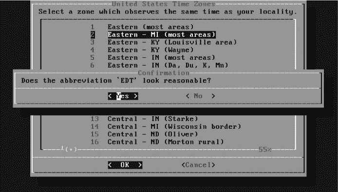

*图 3-22：美国时区*

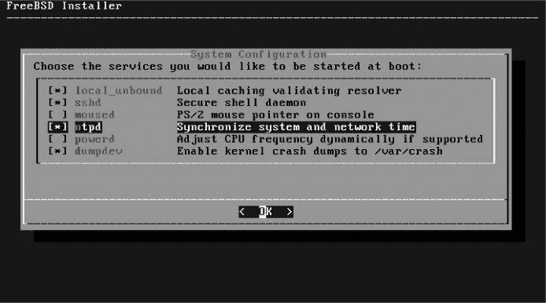

*图 3-23：启动服务*

大多数主机都需要 SSH，并且你*总是*应该启用内核崩溃转储。然而，其他服务可能不适合你的网络。我总是启用`ntpd`（见第二十章）和`local_unbound`（见第八章），以便主机的时钟可以与公共 NTP 服务器同步，并保持本地 DNS 缓存，但如果你的主机无法访问公共互联网，它们就没有那么有用了。笔记本电脑用户可以研究 moused(8)和 powerd(8)。

然后我们在图 3-24 中看到系统加固选项。

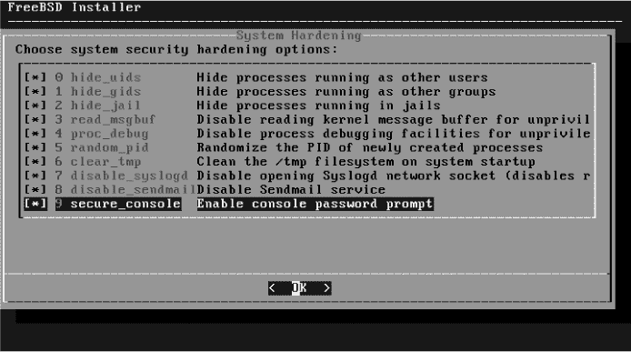

*图 3-24：加固选项*

我们在第十九章中详细讨论了加固选项。如果这是你第一次安装，而且你想要一个轻松的学习体验，保持默认设置不启用任何选项。如果你想学习如何在一个更加安全的系统上工作，可以选择启用所有选项。我在所有主机上启用每一个加固选项，学习如何在更安全的环境中工作对 Bert 来说会很有帮助。

现在我们可以向系统添加一个用户（参见图 3-25）。我建议为每个系统至少添加一个非特权用户，这样你就可以登录到新安装的主机，而不是直接进入*root*。如果你有一个需要用户账户的配置系统，如 Ansible，可以在这里创建该账户。这个主机是为 Bert 准备的，所以我给他创建了一个账户。

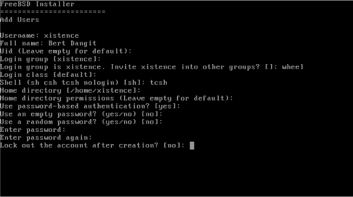

*图 3-25：添加用户*

第九章详细讨论了如何创建用户账户，但在这里我会给出一些合理的设置。Bert 首选的账户名是*xistence*，我会满足他的要求。我填写了他的名字，并直接按回车键接受默认的*Uid*和*登录组*。他是这个系统的主要用户，所以我将他添加到 wheel 组中，允许他使用 root 密码。由于 tcsh 是我最喜欢的 shell，所以他使用的是 tcsh。

如果你有关于用户主目录位置的策略，请遵循它。否则，使用默认设置。类似地，虽然你可以根据默认设置调整密码设置，但通常情况下，输入用户的密码是最简单的。很多人推荐使用像*ChangeMe*这样的密码，但我更喜欢选择那些能积极促使用户尽快更改的密码—也许类似于*BertIsTheWorstIMeanTheWorstHumanBeingEver*。^(3) 如果我在创建账户后将其锁定，只有在他需要使用这台机器时我才会解锁它。

在添加一个用户后，系统会询问我是否想要添加另一个。如果我为自己添加一个账户，我将对该主机承担部分责任。我选择了“不”。

### 完成安装

核心配置，如图 3-26 所示，已经完成！接下来，我可以回去调整一些设置。

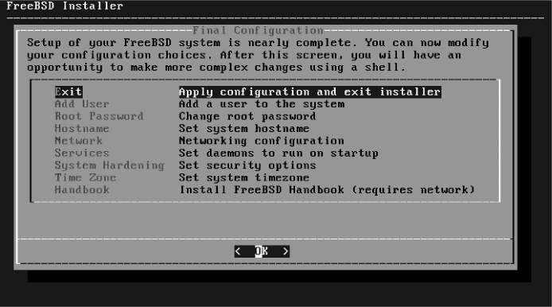

*图 3-26：最终配置*

这些选项大部分来自安装过程中早期的设置。你想返回更改网络配置吗？选择**网络**。你是否想添加另一个用户或启用更多服务？是不是输入了错误的密码？这是你纠正这些错误的机会。

当你觉得准备好了，选择**退出**，你会发现你并不需要完成所有操作。

安装程序涵盖了基础内容，但每个环境都是独特的。手动配置提供了一个命令行提示符，允许你进入系统，并进行最后的更改（参见图 3-27）。选择“不”，系统会提示你移除启动介质并重启。我通常发现，在主机首次启动前进行调整可以简化我的操作，所以我选择了“是”。

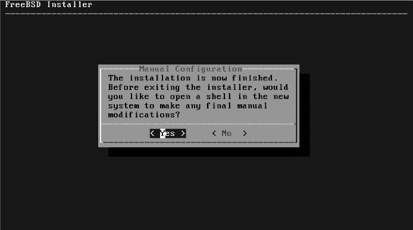

*图 3-27：手动配置*

我已经通过 root shell 进入安装的主机。你在这里执行的任务完全取决于你的网络。第九章讨论了 chflags(8) 和 schg。现在我输入`exit`，如图 3-28 所示。

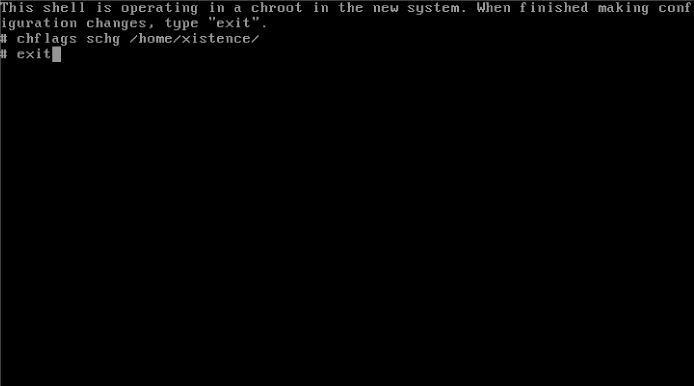

*图 3-28：最终的 shell 配置*

然后我重新启动，拔出安装介质，并启动进入完整的 FreeBSD 安装！
