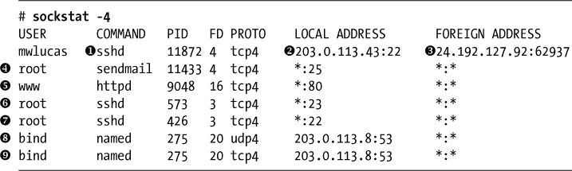

## **8

配置网络**


现在您已经掌握了足够的网络知识，可以配置网络连接了。虽然 FreeBSD 支持许多不同的协议，但我们将专注于几乎无处不在的以太网连接，通常通过 CAT5 或 CAT6 电缆提供。^(1)

我们将从确保主机能够连接到网络并访问其他互联网主机的基本步骤开始。然而，原始的 TCP/IP 连接不足够；您还需要能够将主机名解析为 IP 地址的功能，因此接下来我们将介绍这一点。然后，我们将讨论网络活动的测量、性能、VLAN 以及链路聚合。

然而，在您做任何事情之前，您需要一些信息。

### **网络先决条件**

如果您的网络提供动态主机配置协议（DHCP），您可以作为客户端连接到网络，而无需了解网络的任何信息。然而，在服务器上，静态 IP 地址更加合适。虽然安装程序会为您配置网络，但最终每台服务器都需要进行更改。IPv4 和 IPv6 都需要以下信息：

+   一个 IP 地址

+   该 IP 地址和协议的子网掩码

+   默认网关的 IP 地址

拥有这些信息后，使用 ifconfig(8)和 route(8)将系统连接到网络，并将配置保存到*/etc/rc.conf*中。

#### ***使用 ifconfig(8)配置更改***

ifconfig(8)程序显示您计算机上的接口，并允许您配置它们。首先，通过不带任何参数运行 ifconfig(8)来列出系统上现有的接口：

```
# ifconfig
➊em0: flags=8843<➋UP,BROADCAST,RUNNING,SIMPLEX,MULTICAST> metric 0 mtu 1500
        options=85259b<RXCSUM,TXCSUM,VLAN_MTU,VLAN_HWTAGGING,VLAN_HWCSUM,TSO4,
LRO,WOL_MAGIC,VLAN_HWFILTER,VLAN_HWTSO>
        inet ➌203.0.113.43 netmask 0xfffffff0 broadcast 198.51.100.47
        inet6 ➍fe80::225:90ff:fee8:1270%em0 prefixlen 64 scopeid 0x1
        inet6 ➎2001:db8::bad:c0de:cafe prefixlen 64
        ether ➏00:25:90:db:d5:94
        media: ➐Ethernet autoselect (1000baseTX <full-duplex>)
        status: ➑active

rl0: flags=8802<BROADCAST,SIMPLEX,MULTICAST> mtu 1500
        options=8<VLAN_MTU>
        ether 00:20:ed:72:3b:5f
        media: Ethernet autoselect (10baseT/UTP)
        status: ➒no carrier
➓lo0: flags=8049<UP,LOOPBACK,RUNNING,MULTICAST> metric 0 mtu 16384
        options=600003<RXCSUM,TXCSUM,RXCSUM_IPV6,TXCSUM_IPV6>
        inet6 ::1 prefixlen 128
        inet6 fe80::1%lo0 prefixlen 64 scopeid 0x2
        inet 127.0.0.1 netmask 0xff000000
        nd6 options=21<PERFORMNUD,AUTO_LINKLOCAL>
```

我们的第一个网络接口是 em0 ➊，即使用 em(4)驱动程序的第一张网卡。em(4)的手册页显示，这是 Intel PRO/1000 卡。接下来，您将看到有关此卡的基本信息 ➋，包括它处于 UP 状态，意味着它正在工作或正在尝试工作。它被分配了 IPv4 地址 203.0.113.43 ➌和子网掩码 0xfffffff0（或 255.255.255.240，参见表 7-2）。这张卡有两个 IPv6 地址，链路本地地址（以 fe80 开头） ➍和全局 IPv6 地址 ➎。您还会看到 MAC 地址 ➏和连接速度 ➐。最后，`status`条目显示该卡是活动的 ➑：电缆已插入，我们有连接指示灯。

第二张卡片，rl0，几乎没有任何相关信息。一个关键事实是`no carrier`信号 ➒：它没有插入，并且没有连接指示灯。这张卡片没有被使用。

最后，我们有 lo0 接口➓，即回环接口。该接口在每台机器上都有 IPv4 地址 127.0.0.1 和 IPv6 地址::1。这个回环地址用于机器与自己通信。这是一个标准的软件接口，没有关联的物理硬件。不要尝试删除回环接口，也不要更改其 IP 地址——如果这么做，系统会以一种有趣的方式出错。FreeBSD 还支持其他软件接口，如 disc(4)、tap(4)、gif(4)等。

#### ***向接口添加 IP 地址***

安装过程将会配置所有在安装时可用的网络卡。如果在安装过程中没有配置所有网卡的网络，或者在安装完成后你添加或移除网络卡，你可以通过 ifconfig(8)为网卡分配 IP 地址。你需要网卡的分配 IP 地址和子网掩码。

```
# ifconfig interface-name inet IP-address netmask
```

例如，如果你的网卡是 em0，IP 地址是 203.0.113.250，子网掩码是 255.255.255.0，你可以输入：

```
# ifconfig em0 inet 203.0.113.250 255.255.255.0
```

如上所示，可以以点分十进制表示法或十六进制格式（0xffffff00）指定子网掩码。最简单的方式可能是使用斜杠表示法，如下所示：

```
# ifconfig em0 inet 203.0.113.250/24
```

要配置 IPv6 地址，在接口名称和地址之间添加`inet6`关键字。

```
# ifconfig em0 inet6 2001:db8::bad:c0de:cafe/64
```

ifconfig(8)程序还可以执行其他网络卡所需的配置，帮助你绕过硬件问题，比如各种类型的校验和卸载功能，设置子千兆网卡的媒体类型和双工模式等。你可以在驱动程序和 ifconfig(8)的手册页中找到支持的选项。这里，我在设置 IP 地址的同时，禁用了 em0 接口的校验和卸载和 TCP 分段卸载。

```
# ifconfig em0 inet 203.0.113.250/24 -tso -rxcsum
```

为了在重启后保持该配置，向*/etc/rc.conf*中添加一行，告诉系统在启动时配置该网卡。IPv4 的配置项形式是`ifconfig_`接口名称`="`ifconfig 参数`"`。例如，配置空闲的 rl0 网卡时需要像下面这样添加配置项：

```
ifconfig_rl0 ="inet 203.0.113.250/24"
```

IPv6 的配置项形式是`ifconfig_`接口名称`_ipv6="`ifconfig 参数`"`。

```
ifconfig_rl0_ipv6="2001:db8::bad:c0de:cafe/64"
```

一旦你有了一个正常工作的接口配置，将你的 ifconfig(8)参数复制到*/etc/rc.conf*配置文件中。

#### ***测试你的接口***

现在你的接口已分配了 IP 地址，尝试 ping 一下默认网关的 IPv4 地址。如果你得到了响应，如下例所示，那么你就连接到了本地网络。用 CTRL-C 中断 ping 命令。

```
# ping 203.0.113.1
PING 203.0.113.1 (203.0.113.1): 56 data bytes
64 bytes from 203.0.113.1: icmp_seq=0 ttl=64 time=1.701 ms
64 bytes from 203.0.113.1: icmp_seq=1 ttl=64 time=1.436 ms
^C
--- 203.0.113.1 ping statistics ---
2 packets transmitted, 2 packets received, 0% packet loss
round-trip min/avg/max/stddev = 1.436/1.569/1.701/0.133 ms
```

对于 IPv6，使用 ping6(8)而不是 ping(8)。如果你使用路由器发现功能，默认路由几乎总是一个链路本地地址。

```
# ping6 2001:db8::1
PING6(56=40+8+8 bytes) 2001:db8::bad:c0de:cafe --> 2001:db8::1
16 bytes from 2001:db8::1, icmp_seq=0 hlim=64 time=0.191 ms
16 bytes from 2001:db8::1, icmp_seq=1 hlim=64 time=0.186 ms
16 bytes from 2001:db8::1, icmp_seq=2 hlim=64 time=0.197 ms
--snip--
```

如果没有得到任何回应，说明你的网络连接没有正常工作。要么是连接有问题（检查你的电缆和连接指示灯），要么是网卡配置错误。

#### ***设置默认路由***

默认路由是系统将所有非本地网络流量发送到的地址。如果你能 ping 通默认路由的 IPv4 地址，可以通过 route(8)设置它。

```
# route add default 203.0.113.1
```

就是这样！现在您应该能够 ping 任何公共 IPv4 地址。

添加默认的 IPv6 路由非常相似，但您需要添加 `-6` 命令行标志来更改 IPv6 路由表。

```
# route -6 add default 2001:db8::1
```

如果在系统安装时没有选择名称服务器，则必须使用 IP 地址而不是主机名。

一旦您有了有效的默认路由器，可以通过在 */etc/rc.conf* 中添加适当的 `defaultrouter` 和 `ipv6_defaultrouter` 条目，使其在重启后仍然有效：

```
defaultrouter="203.0.113.1"
ipv6_defaultrouter="2001:db8::1"
```

#### ***一个接口上的多个 IP 地址***

一个 FreeBSD 系统可以在一个接口上响应多个 IP 地址。这对 Jail（参见 第二十二章）尤其有用。使用 ifconfig(8) 和 `inet` 及 `alias` 关键字为一个接口指定额外的 IPv4 地址。IPv4 别名的子网掩码总是 /32，无论主地址使用的网络地址块大小如何。

```
# ifconfig em0 inet alias 203.0.113.225/32
```

IPv6 别名使用它们所在子网的实际前缀长度（斜杠）。请确保使用 `inet6` 关键字。

```
# ifconfig em0 inet6 alias 2001:db8::bad:c0de:caff/64
```

一旦为接口添加了别名，额外的 IP 地址将在 ifconfig(8) 输出中显示。主 IP 地址总是首先出现，别名随后列出。

```
   # ifconfig fxp0
   fxp0: flags=8843<UP,BROADCAST,RUNNING,SIMPLEX,MULTICAST> mtu 1500
           options=b<RXCSUM,TXCSUM,VLAN_MTU>
           inet6 fe80::225:90ff:fee8:1270%vtnet0 prefixlen 64 scopeid 0x1
➊          inet6 2001:db8::bad:c0de:cafe prefixlen 64
           inet6 2001:db8::bad:c0de:caff prefixlen 64
           inet 203.0.113.250 netmask 0xffffff00 broadcast 203.0.113.255
➋          inet 203.0.113.225 netmask 0xffffffff broadcast 203.0.113.255
           ether 00:02:b3:63:e4:1d
   --snip--
```

在这里，我们看到了全新的 IPv4 ➊ 和 IPv6 ➋ 别名。对您的别名地址进行 ping 的主机会从此服务器获得响应。

一旦您将别名设置按预期工作，可以通过在 */etc/rc.conf* 中添加额外的 `ifconfig` 语句，使其在重启后仍然有效：

```
ifconfig_em0_alias0="inet 203.0.113.225/32"
ifconfig_em0_alias1="inet6 2001:db8::bad:c0de:caff/64"
```

这个条目和标准 *rc.conf* 中的“这是我的 IP 地址”条目之间唯一的真正区别是 `alias0` 和 `alias1` 部分。`alias` 关键字告诉 FreeBSD 这是一个别名 IP，`0` 和 `1` 是分配给每个别名的唯一编号。每个在 */etc/rc.conf* 中设置的别名必须具有唯一的编号，并且该编号必须是连续的。如果跳过了某个编号，则跳过的后面的别名在启动时不会被安装。这是我见过的最常见的接口配置错误。

许多守护进程，如 inetd(8) 和 sshd(8)，可以绑定到一个单一的地址（参见 第二十章），因此您可以使用多个地址在同一服务器上运行多个相同程序的实例。

**别名和外部连接**

所有来自您的 FreeBSD 系统的连接都使用系统的真实 IP 地址。您可能将 2,000 个地址绑定到一张网卡上，但当您从该机器 `ssh` 时，连接将来自主 IP 地址。在编写防火墙规则和其他访问控制过滤器时，请记住这一点。Jail 从 Jail 的 IP 地址发起所有连接，但我们直到 第二十二章 才会讨论 Jail。

#### ***重命名接口***

FreeBSD 根据网络卡所使用的设备驱动程序为其网络接口命名。这是 Unix 世界中的一项悠久传统，也是大多数工业操作系统的常见行为。一些操作系统通过接口类型来命名其网络接口——例如，Linux 将其以太网接口命名为*eth0*、*eth1*，以此类推。有时，重新命名接口是有意义的，要么是为了遵循内部标准，要么是为了使其功能更加明显。例如，我有一台设备，拥有 12 个网络接口，每个接口都连接到不同的网络。每个网络都有一个名称，如*test*、*QA*等。将这些网络接口重新命名为与附加网络相匹配是合理的。

虽然 FreeBSD 在接口名称方面比较灵活，但一些软件则不然——它假设网络接口名称是一个短单词，后面跟着一个数字。预计在不久的将来这种情况不会改变，因此最佳实践是使用以数字结尾的短接口名称。使用 ifconfig(8) 的 `name` 关键字来重命名接口。例如，要将 *em1* 重命名为 *test1*，可以运行：

```
# ifconfig em1 name test1
```

运行 ifconfig(8) 不带参数将显示你已重命名该接口。

```
--snip--
test1: flags=8843<UP,BROADCAST,RUNNING,SIMPLEX,MULTICAST> mtu 1500
        options=b<RXCSUM,TXCSUM,VLAN_MTU>
--snip--
```

使用 `ifconfig_`interface`_name` 选项在 */etc/rc.conf* 中使此更改永久生效。

```
ifconfig_em1_name="test1"
```

FreeBSD 在启动过程中早期就重命名接口，在设置 IP 地址或其他值之前。这意味着任何进一步的接口配置必须引用新接口名称，而不是旧接口名称。对重命名接口进行完整配置，包括 IP 地址和别名，应该如下所示：

```
ifconfig_em1_name="dmz2"
ifconfig_dmz2="inet 203.0.113.2 netmask 255.255.255.0"
ifconfig_dmz2_alias0="inet 203.0.113.3"
```

#### ***DHCP***

很少有网络使用 DHCP 来处理所有设备，包括服务器。DHCP 服务器会为你设置服务器的 IP 地址、子网掩码、域名服务器和默认网关。如果你的网络管理员通过 DHCP 配置服务器，你可以告诉网络卡通过 DHCP 获取配置，方法如下：

```
ifconfig_em0="DHCP"
```

#### ***重启！***

现在，你已经完全配置了网络接口，务必重启以测试你对*/etc/rc.conf*所做的任何更改。如果 FreeBSD 在 */etc/rc.conf* 中发现错误，特别是在网络配置方面，你将遇到远程访问系统的问题。在受控条件下发现打字错误总比在你睡觉的时候发现要好得多。

如果你觉得挑战刺激，你可以运行 `service netif restart` 并指定接口名称来仅重新配置单个接口。

```
# service netif restart em0
```

如果省略接口名称，则会重启所有接口。这不是一个完美的测试，但它可以捕捉到一些愚蠢的错误。重启始终是最好的测试。

### **域名服务**

*域名服务*，或*DNS*，是那些安静的幕后服务之一，通常得不到应有的关注。尽管大多数用户从未听说过它，DNS 却是我们所知的互联网能够正常工作的原因。DNS 也叫做*名称服务*，它提供了主机名与 IP 地址之间的映射。它还提供了反向映射，即 IP 地址到主机名的映射。没有 DNS，网页浏览器和电子邮件程序无法使用像* [www.michaelwlucas.com](http://www.michaelwlucas.com) *或* [www.nostarch.com](http://www.nostarch.com) *这样的简便主机名；相反，你将不得不输入一些令人震惊的东西，如*https://2001:19f0:5c00:9041:225:90ff:fee8:1270*来浏览网页。这将极大地减少互联网的普及率。^(2) 对大多数终端用户来说，DNS 故障就是互联网故障，故事到此为止。虽然我们不会讨论如何构建自己的权威型名称服务器，但我们必须讲解如何配置你的服务器以使用 DNS。

一个用于在互联网上搜寻 DNS 映射的主机被称为*名称服务器*，或*DNS 服务器*。DNS 服务器并不难以运行，但大多数个人不需要一个。只有那些运行自己服务器的组织（以及像我一样在地下室有数十台主机的疯子）才需要 DNS 服务器。名称服务器有两种类型，权威型和递归型。

*权威型*名称服务器提供 DNS 映射，使公众能够找到组织的名称服务器。作为* [michaelwlucas.com](http://michaelwlucas.com) *的运营者，我必须为该域提供权威型名称服务器并让公众查询它们。这些权威型名称服务器只回答关于我管理的域的查询。配置权威型名称服务器超出了本书的范围。

*递归型*名称服务器处理客户端请求。当你尝试浏览* [`www.michaelwlucas.com`](https://www.michaelwlucas.com) *时，你的本地递归型名称服务器会在互联网上查找我的权威型名称服务器。一旦递归型名称服务器找到了主机名到 IP 地址的映射，它会将该响应返回给客户端。本书将向你展示如何使用递归型名称服务器，以及如何启用你自己的递归型名称服务器。

系统的*解析器*负责配置主机如何执行 DNS 查询，并将响应转发给程序。配置解析器是系统管理中的一项重要工作。即使是 DNS 服务器，也需要配置解析器，因为除非你告诉它，否则主机不会知道自己是名称服务器。配置解析器需要回答一些问题：

+   服务器在哪里查找 DNS 信息？

+   你想要哪些本地覆盖？

+   什么是本地域名？

+   应该查询哪些名称服务器？

这些问题的答案在*/etc/nsswitch.conf*和*/etc/resolv.conf*中进行配置。

#### ***主机/IP 信息来源***

这应该很简单。服务器通过名称服务器获取主机信息，对吧？我刚刚花了几段话告诉你这个，不是吗？

然而，现实情况并没有那么简单。也许你有一个只有三台机器的小型家庭网络，你希望每台机器都能通过主机名互相找到，但你不想运行一个本地的权威名称服务器。或者，也许你在一个大型公司网络中，完成 DNS 更改需要几周时间，而你有几台需要相互通信的测试系统。像所有类 Unix 操作系统一样，FreeBSD 可以从 DNS 和明文 hosts 文件 */etc/hosts* 中获取信息。

当 FreeBSD 需要知道一个主机的地址（或者一个地址的主机名）时，默认情况下查询首先会访问 hosts 文件，然后是配置的名称服务器。这意味着你可以本地覆盖名称服务器的结果，这对于位于 NAT 后的主机或在大型公司网络中具有特殊需求的主机非常有用。在某些情况下，你可能需要反转这个顺序，首先查询 DNS，然后再查询 hosts 文件。可以在 */etc/nsswitch.conf* 中设置此顺序。

**名称服务切换**

文件 */etc/nsswitch.conf* 不仅由解析器使用，还由所有其他名称服务使用。一个网络操作系统包括许多不同的名称服务。*/etc/services* 中的 TCP/IP 端口既是名称服务，也是网络协议的名称和编号。确定用户的 UID 和 GID 需要不同类型的名称查找（参见 第九章）。*/etc/nsswitch.conf* 确定所有这些查询的顺序及更多内容。我们这里只讨论主机名查找，更多关于名称服务切换的内容请参考 第二十章。

*/etc/nsswitch.conf* 中的每个条目都是一行，包含名称服务的名称、冒号和信息源列表。以下是主机名服务查找的配置：

```
hosts: files dns
```

解析器按照列出的顺序查询信息源。如果你有额外的信息源，例如 nscd(8)，请在此列出。关于这些附加组件的文档来源应包括服务的名称。

#### ***使用 /etc/hosts 设置本地名称***

*/etc/hosts* 文件将互联网地址与主机名匹配。曾几何时，在域名服务（DNS）之前，互联网有一个单一的 hosts 文件，提供互联网中每个节点的主机名和 IP 地址。系统管理员将他们的主机更改提交给一个中央维护者，后者每隔几个月发布一次更新的 hosts 文件。然后，系统管理员会下载该文件并将其安装到他们的所有机器上。当整个互联网只有四个系统时，这种方式运行得很好，当主机数量只有几百个时也能接受。然而，一旦互联网开始呈指数增长，这种方案就变得完全无法维护。

虽然 hosts 文件非常有效，但它只在安装它的机器上工作，并且必须由系统管理员维护。公共 DNS 在很大程度上取代了 */etc/hosts*，但它在你不想运行本地权威 DNS^(3) 或者你处于 IPv4 NAT 设备后面时仍然很有用。如果你在家有一两台服务器，或者由别人管理你的权威名称服务器，使用 hosts 文件是完全合理的。一旦你有足够多的主机，以至于更新 hosts 文件的想法让你感到恶心，就该学习构建权威名称服务器了。

每行 */etc/hosts* 中的条目代表一个主机。每行的第一个条目是 IP 地址，第二个是主机的完全限定域名，例如 *mail.michaelwlucas.com*。在这两个条目之后，你可以列出该主机的任意数量的别名。

例如，一个小公司可能只有一台服务器处理电子邮件、提供 FTP、网页和 DNS 服务，并执行其他各种功能。该网络上的桌面计算机可能会有类似这样的 hosts 文件条目：

```
203.0.113.3     mail.mycompany.com    mail ftp www dns
```

使用这个 */etc/hosts* 条目，桌面计算机可以通过完整的域名或列出的任何简短别名来找到服务器。然而，这不会让你访问 Facebook。为此，你需要名称服务。

#### ***配置名称服务***

通过文件 */etc/resolv.conf* 告诉你的主机如何查询名称服务器。你可能希望提供一个本地域名或一个域名搜索列表，然后列出名称服务器。

##### **本地域名和搜索列表**

如果你的组织有许多机器，逐个输入完整的主机名会很快让人感到厌烦。如果你正在进行维护并需要登录每一台 Web 服务器，当你输入到 *www87.BertJWRegeerHasTooManyBlastedComputers.com* 时，你可能已经需要治疗即将到来的腕管综合症了。你可以在 */etc/resolv.conf* 的第一行提供一个本地域名或一个要搜索的域名列表。

*domain* 关键字告诉解析器默认检查哪个本地域名，用于所有主机名。我的所有测试主机都在域名 *[michaelwlucas.com](http://michaelwlucas.com)* 下，所以我可以将其设置为默认域。

```
domain  michaelwlucas.com
```

一旦你指定了一个本地域名，解析器将自动将该域名附加到任何简短的主机名上。如果我输入 `ping www`，解析器会附加本地域名并将 ping(8) 发送到 *[www.michaelwlucas.com](http://www.michaelwlucas.com)*。但如果我提供一个完整的主机名，比如 *[www.bertjwregeer.com](http://www.bertjwregeer.com)*，解析器就不会添加默认域名。

也许我有多个域名想要搜索。使用 *search* 关键字来提供一个按顺序尝试的域名列表。像 `domain` 一样，*search* 必须是 *resolv.conf* 的第一行。

```
search  michaelwlucas.com bertjwregeer.com mwl.io
```

当你使用简短的主机名，如*www*时，解析器会将第一个域名添加到搜索列表中。如果没有找到结果，它会使用第二个域名重复查询，然后是第三个。如果我运行`ping` `petulance`，解析器会依次搜索*petulance.michaelwlucas.com*、*petulance.bertwjregeer.com*和*petulance.mwl.io*。如果在这些域名中都没有该主机，查询将失败。

如果在*/etc/resolv.conf*中既没有域名（domain）也没有搜索项（search），但机器的主机名中包含域名，解析器将使用本地机器的域名。

##### **名称服务器列表**

现在你的解析器已经知道了尝试哪些域名，接下来告诉它查询哪些名称服务器。在*/etc/resolv.conf*中为每个名称服务器列出一行，按优先顺序排列。使用关键字`nameserver`和 DNS 服务器的 IP 地址。解析器会按顺序查询列出的名称服务器。一个完整的*resolv.conf*可能如下所示：

```
domain mwl.io
nameserver 127.0.0.1
nameserver 203.0.113.8
nameserver 192.0.2.8
```

这个解析器已经准备好工作了。

注意第一个名称服务器条目。地址 127.0.0.1 总是与本地主机相关联。此机器正在运行一个本地递归名称服务器。你也可以这样做！

#### ***缓存名称服务器***

每次主机必须联系一个主机时，都需要执行 DNS 查找。一个忙碌的服务器会发出大量查询，而解析器本身并不会缓存这些响应。如果一个主机一分钟内需要连接 Google 500 次，那就意味着有 500 次 DNS 查找。虽然设置一个权威 DNS 服务器需要特定的技能，但配置一个本地递归服务器只需要在*/etc/rc.conf*中添加一行。这让你的 FreeBSD 主机能够缓存 DNS 响应，同时减少网络拥堵并提高性能。

使用*rc.conf*变量`local_unbound_enable`启用本地名称服务器。

```
# sysrc local_unbound_enable=YES
local_unbound_enable: NO -> YES
```

现在可以启动本地名称服务器。

```
# service local_unbound start
```

当你第一次启动该服务时，`unbound`会自行配置。它会从*/etc/resolv.conf*中提取系统的名称服务器，并配置自己将所有查询转发到这些名称服务器。然后，设置过程会编辑*/etc/resolv.conf*，使所有查询指向运行在 IP 地址 127.0.0.1 上的本地名称服务器。

当你的主机发起 DNS 查询时，解析器会查询`unbound`。本地名称服务器会检查其缓存，看看是否有有效且未过期的查询结果。如果没有缓存的响应，`unbound`会查询你偏好的名称服务器。

我建议在每台不是 DNS 服务器的服务器上启用`local_unbound`。

### **网络活动**

现在你已经接入网络，怎么查看发生了什么呢？有几种方法可以查看网络，我们将逐一考虑。与许多商业操作系统不同，FreeBSD 中的命令如 netstat(8) 和 sockstat(1) 能为你提供比健康所需更多的网络信息。

#### ***当前网络活动***

通用网络管理程序 netstat(8) 根据给定的标志显示不同的信息。人们常问的一个问题是：“我的系统现在正在处理多少流量？” netstat(8) 的 `-w`（即 *等待*）选项显示系统正在处理多少数据包和字节。`-w` 标志需要一个参数，即更新之间的秒数。添加 `-d`（即 *丢弃*）标志会告诉 netstat(8) 包含有关未到达系统的数据包的信息。在这里，我们要求 netstat(8) 每五秒更新一次显示：

```
# netstat -w 5 -d
            input        (Total)           output
   packets  errs idrops      bytes    packets  errs      bytes colls drops
       ➊34   ➋0     ➌0    ➍44068        ➎23   ➏0      ➐1518    ➑0   ➒0 
         33    0       0     42610          23    0        1518      0    0
--snip--
```

当你输入此命令时，似乎什么也没有发生，但几秒钟后，显示屏会打印出一行信息。前三列描述了入站流量，接下来的三列描述了出站流量。我们可以看到自上次更新以来接收的数据包数 ➊，入站流量的接口错误数 ➋，以及丢失的入站数据包数 ➌。输入信息的最后是自上次更新以来接收的字节数 ➍。接下来的三列显示了机器自上次更新以来传输的数据包数 ➎，传输中的错误数 ➏，以及我们发送的字节数 ➐。然后，我们会看到自上次更新以来发生的网络冲突数 ➑，以及丢失的数据包数 ➒。例如，在此显示中，系统自 `netstat -w 5 -d` 开始运行以来接收了 34 个数据包 ➊。

五秒钟后，netstat(8) 打印出第二行，描述自第一行打印以来的活动。

你可以根据需要使输出尽可能详细，并随时运行它。如果你想每秒获取更新，只需运行 `netstat -w 1 -d`。如果每分钟一次足够，你可以使用 `netstat -w 60 -d`。我发现当我在积极监控网络时，五秒的间隔最合适，但你会很快学到什么最适合你的网络和问题。

按 CTRL-C 停止报告，直到你看够为止。

#### ***哪个端口在监听什么？***

另一个常见问题是：“哪些端口是开放的，哪些程序在监听这些端口？” FreeBSD 包含了 sockstat(1)，这是一个友好的工具来回答这个问题。它显示了活跃的连接和可供客户端使用的端口。

sockstat(1) 程序不仅列出了监听网络的端口，还包括系统上的其他任何端口（或 *套接字*）。使用 `-4` 标志可以查看 IPv4 套接字，使用 `-6` 可以查看 IPv6。以下是来自一个 *非常* 小型服务器的截断 sockstat(1) 输出：



第一列给出了运行附加到相关端口的程序的用户名。第二列是命令的名称。接下来是程序的进程 ID 以及附加到套接字的文件描述符号。接下来的列显示了套接字使用的传输协议——如果是 TCP/IP 版本 4 上的 TCP，则为`tcp4`，如果是 TCP/IP 版本 4 上的 UDP，则为`udp4`。接着列出了本地 IP 地址和端口号，最后是每个现有连接的远程 IP 地址和端口号。

看看我们第一个条目。我正在运行程序 sshd ➊。一个手册页搜索会带你到 sshd(8)，即 SSH 守护进程。主 sshd(8)守护进程为我分叉了一个子进程来处理我的连接，因此我们看到多个不同进程 ID 的 sshd(8)实例。我连接到本地 IP 地址 203.0.113.43 ➋上的 TCP 端口 22。这个连接的远端 IP 地址是 24.192.127.92 ➌，端口为 62937。 这是来自远程系统到本地计算机的 SSH 连接。

其他可用的连接包括运行在端口 25 上的 Sendmail ➍邮件服务器。请注意，此项没有列出作为外部地址的 IP 地址。这个套接字正在监听传入的连接。我们的 httpd 进程 ➎ 正在监听端口 80 上的传入连接。

机智的你可能会注意到，这台服务器有两个 SSH 守护进程可以接受传入连接，一个在端口 23 ➏上，另一个在端口 22 ➐上。正如*/etc/services*所示，SSH 通常运行在端口 22 上，而端口 23 则预留给 telnet。任何通过 telnet 连接到此机器的人都会连接到一个 SSH 守护进程，而这并不会按他们预期的那样工作。怀疑的你可能会猜测，这个 SSH 服务器是为了绕过只基于源和目标端口而非实际协议过滤流量的防火墙而设置的。（对于这样的指控，我不做评论。）

最后两项是一个命名服务器，名为 named，正在等待端口 53 上的传入连接。这个命名服务器正在监听 UDP ➑和 TCP ➒连接，并附加到单个 IP 地址 203.0.113.8。

#### ***端口监听器详细信息***

虽然 sockstat(1)提供了一个网络服务可用性的高层视图，但你可以通过 netstat(8)获得有关单个连接的更详细信息。要查看开放的网络连接，请使用 netstat(8)的`-a`标志。`-n`标志告诉 netstat(8)不要翻译 IP 地址为主机名；这种翻译不仅可能减慢输出速度，还可能导致模糊的输出。最后，`-f inet`选项告诉 netstat(8)只关注 IPv4 网络连接，而`-f inet6`则关注 IPv6。以下是与我们刚刚运行 sockstat(1)相同机器的 netstat 输出：

```
# netstat -na -f inet
Active Internet connections (including servers)
Proto Recv-Q Send-Q  Local Address          Foreign Address        (state)
tcp4       0     48  203.0.113.43.22        24.192.127.92.62937    ESTABLISHED
tcp4       0      0  *.25                   *.*                    LISTEN
tcp4       0      0  *.23                   *.*                    LISTEN
tcp4       0      0  *.80                   *.*                    LISTEN
tcp4       0      0  *.22                   *.*                    LISTEN
tcp4       0      0  203.0.113.8.53         *.*                    LISTEN
udp4       0      0  203.0.113.8.53         *.*  
```

在这里，我们无法得知任何端口上附加的程序是什么。每一列的第一项是套接字使用的传输协议——通常是 TCP，但最后一行显示的是 UDP。

`Recv-Q` 和 `Send-Q` 列显示了等待被该连接处理的字节数。如果你看到某些连接的 `Recv-Q` 数字大部分时间都不为零，说明监听该端口的程序处理传入数据的速度不够，无法跟上网络堆栈的速度。同样，如果 `Send-Q` 列持续出现非零值，说明网络或远程系统无法以你发送的速度接收数据。偶尔的队列数据包是正常的，但如果它们一直存在，你可能需要调查为什么处理速度慢。你需要观察自己的系统，了解什么是正常的。

`Local Address` 是你猜的那样，表示本地系统上网络连接监听的 IP 地址和端口号。网络端口出现在条目的末尾，并且与 IP 地址之间由一个点分隔。例如，203.0.113.43.22 就是 IP 地址 203.0.113.43，端口 22。如果条目是一个星号后跟一个点和端口号，意味着该系统在所有可用的 IP 地址上都在监听该端口，系统已准备好接受该端口上的连接。

`Foreign Address` 列显示任何连接的远程地址和端口号。

最后，`(state)` 列显示 TCP 握手的状态。你不需要了解所有可能的 TCP 连接状态，只要了解什么是正常的就行。`ESTABLISHED` 表示连接已建立，数据可能正在流动。`LAST_ACK`、`FIN_WAIT_1` 和 `FIN_WAIT_2` 表示连接正在关闭。`SYN_RCVD`、`ACK` 和 `SYN+ACK` 是连接创建的一部分（来自 第七章 的三次握手）。`LISTEN` 表示端口已准备好接收传入连接。在前面的示例中，一个 TCP 连接正在运行，四个连接准备接受客户端。由于 UDP 是无状态的，这些连接没有列出状态信息。

通过读取这些输出并结合 sockstat(1) 提供的信息，你可以准确了解哪些程序表现良好，哪些程序存在瓶颈。

如果你对监听套接字不感兴趣，只关心那些有活动连接的套接字，可以使用 netstat(8) 的 `-b` 选项，而不是 `-a`。运行 `netstat -nb -f inet` 只会显示与远程系统的连接。

你还可以使用 `netstat -T` 来显示单个连接的 TCP 重传和乱序数据包。重传和乱序数据包是丢包的症状。

#### ***内核中的网络容量***

FreeBSD 内核通过使用 mbufs 来处理网络内存。*mbuf* 是用于网络的内核内存块。你将在 FreeBSD 网络堆栈文档中不断遇到关于 mbuf 的提及，因此了解它们至少有一个模糊的概念是很重要的。

FreeBSD 在启动时会自动根据系统中物理内存的大小分配网络带宽。我们假设，如果你有一个 64GB 内存的系统，你希望在网络上使用更多的内存，而不是一个只有 1GB 内存的小设备。通过 `netstat -s` 和 `netstat -m` 查看 FreeBSD 如何使用其资源。我们先来看最简洁的一个。

要获取关于用于网络的内核内存的概览，运行 `netstat -m`。输出可以分为两个大类：使用了多少内存和有多少请求失败。以下是经过剪裁的输出，只包括这些项中的几个例子，但它们都遵循相同的格式：

```
# netstat -m
--snip--
➊32/372/404/➋25600 mbuf clusters in use (current/cache/total/max)
--snip--
0/0/0 requests for mbufs ➌denied (mbufs/clusters/mbuf+clusters)
--snip--
```

在这里我们看到使用了多少个 mbuf 集群 ➊。你可能会猜测这些与 mbuf 有关，答案是对的。你不需要完全知道 mbuf 集群是什么；重要的是你知道可以分配多少个，并且能够看到自己没有超过这个限制 ➋。

同样，我们可以看到内核拒绝了多少次对 mbuf 的请求 ➌。这个系统没有拒绝任何 mbuf 请求，这意味着我们没有因为内存不足而造成的性能问题。如果你的系统开始因为内存不足而拒绝 mbuf 请求，那就麻烦了。接下来请查看“优化网络性能”部分。

虽然 `netstat -m` 会生成十几行输出，`netstat -s` 则会产生多页输出。它提供了每种协议的性能统计数据。与 `netstat -m` 类似，你可以将这些统计数据分为两类：做了多少事情以及遇到了多少问题。偶尔在你的系统上运行这两个命令，并查看结果，这样你就知道服务器上什么是正常的，并且在遇到问题时能够识别出异常的数据。

### **优化网络性能**

既然你已经了解了发生了什么，那么如何提高 FreeBSD 的网络性能呢？在考虑优化时有一个简单的经验法则：*不要优化*。网络性能通常只受硬件的限制。许多应用程序处理数据的速度跟不上网络的提供速度。如果你认为需要优化性能，可能是你在错误的地方寻求解决方案。查看第二十一章，那里有关于调查性能瓶颈的提示。

一般来说，只有在遇到网络问题时，才需要调整网络性能。这意味着你应该从 `netstat -m` 或 `netstat -s` 中获得输出，显示内核正在面临资源问题。如果内核开始拒绝资源请求或丢弃连接请求，请查看本节中的提示。如果你遇到问题，或者认为应该获得更好的性能，首先检查硬件。

#### ***优化网络硬件***

不是所有的网络硬件都是一样的。虽然在 IT 行业中这句话被频繁提到，但 FreeBSD 的开放性让这一点显而易见。例如，以下是 rl(4) 网卡驱动源代码中的一条注释：

```
The RealTek 8139 PCI NIC redefines the meaning of 'low end.' This is
probably the worst PCI ethernet controller ever made, with the possible
exception of the FEAST chip made by SMC. The 8139 supports bus-master
DMA, but it has a terrible interface that nullifies any performance
gains that bus-master DMA usually offers.
```

这可以总结为：“这张卡同时又烂又差。买一张新卡吧。”虽然这是我在 FreeBSD 源代码中看到的最尖刻的评论，而且这款硬件今天很难找到，但某些其他卡的驱动程序以更礼貌的方式表达了相同的观点。用低端硬件优化网络性能就像将高性能赛车变速器装进 1974 年的 Gremlin 车里。更换你的廉价网卡可能会解决你的问题。一般来说，英特尔生产的网卡不错；他们为有线网卡维护 FreeBSD 驱动程序，并提供支持，以便 FreeBSD 社区帮助维护这些驱动程序。（无线网卡则是另一回事。）类似地，许多制造服务器级机器的公司特别注重使用服务器级网卡。有些公司提供 FreeBSD 驱动程序，但不提供硬件文档。这意味着驱动程序可能正常工作，但你完全依赖于厂商未来对 FreeBSD 的喜好来获取更新。专注于低成本消费级网络设备的公司并不是高性能卡的最佳选择——毕竟，普通家庭用户通常不知道如何选择网卡，所以他们只看价格。如果不确定，可以查阅 FreeBSD-questions 邮件列表的档案，寻找近期的网卡推荐。

同样，交换机的质量差异也非常大。声称交换机支持千兆连接协议并不意味着你能够通过每个端口真正达到千兆速度！我有一台 100Mb 的交换机，在 15Mbps 时会形成瓶颈，还有一台“千兆”交换机似乎在大约 50Mbps 时就开始卡顿。我建议你将交换机的速度视为一种协议或语言：我可以声称我会说俄语，但在我停止学习 30 年后，我的口语速度每分钟大约只能说三个词。我的俄语接口质量非常差。同样，专为家庭使用设计的交换机并不是生产环境中的最佳选择。

如果获得合适的硬件没有解决你的问题，请继续阅读。

#### ***内存使用***

FreeBSD 使用系统中安装的内存量来决定为 mbuf 保留多少内存空间。除非 `netstat -m` 告诉你 mbuf 空间不足，否则不要调整你创建的 mbuf 数量。如果你遇到 mbuf 问题，真正的解决方法是向你的机器添加内存。这将使 FreeBSD 在启动时重新计算创建的 mbuf 数量，并解决你的问题。否则，你只会将问题转移到系统的其他部分或其他应用程序上。你可能为网络连接配置了大量内存，却发现你的数据库服务器被压垮了。不过，如果你确定要继续操作，下面是如何做的。

有两个 sysctl 值控制 mbuf 的分配，`kern.maxusers` 和 `kern.ipc.nmbclusters`。第一个，`kern.maxusers`，是一个启动时可调的参数。你的系统会在启动时自动根据系统硬件确定合适的 `kern.maxusers` 值。调整这个值可能是扩展系统整体规模的最佳方法。在旧版本的 FreeBSD 中，`kern.maxusers` 会预分配网络内存，并拒绝将其释放给其他任务，因此增加 `kern.maxusers` 可能会严重影响系统的其他部分。然而，现代 FreeBSD 并不会预分配网络内存，因此这仅仅是网络内存的上限。如果 `kern.maxusers` 设置得过小，你将在 */var/log/messages* 中收到警告（请参阅 第二十一章）。

sysctl `kern.ipc.nmbclusters` 专门控制系统为数据（存储在套接字缓冲区中，等待被应用程序发送或读取）分配的 mbufs 数量。尽管这是一个可以在运行时调整的参数，但最好在启动时就通过在 */etc/sysctl.conf* 中定义它来进行设置（请参阅 第六章）。然而，如果设置得过高，你实际上可能会导致内核无法为其他任务分配内存，从而使机器发生崩溃。

```
# sysctl kern.ipc.nmbclusters
kern.ipc.nmbclusters: 25600
```

Mbufs 是以称为 *nmbclusters*（有时也称为 *mbuf 集群*）的单位进行分配的。虽然一个 mbuf 的大小有所不同，但一个集群大约是 2KB。你可以使用简单的数学计算来确定当前 nmbcluster 设置需要多少内存，然后为你的系统和应用程序计算出合适的值。这个示例机器有 25,600 个 nmbclusters，这意味着内核可以为网络通信用途使用大约 50MB 的内存。对于我这台具有 1GB 内存的测试笔记本来说，这几乎可以忽略不计，但在嵌入式系统上可能不适用。

要计算适当数量的 mbuf 集群，当服务器非常繁忙时运行 `netstat -m`。输出的第二行将显示正在使用的 mbuf 数量和可用的总数量。如果你的服务器在最繁忙时使用的 nmbclusters 数量远远少于可用数量，那说明你可能走错了方向——停止调整 mbufs，尽早更换硬件吧。^(4) 例如：

```
➊32/➋372/➌404/➍25600 mbuf clusters in use (current/cache/total/max)
```

目前此系统在此机器上使用了 32 个 nmbclusters ➊，并且缓存了 372 个之前使用过的 nmbclusters ➋。此时内存中共有 404 个集群 ➌，而我们的 25,600 个集群 ➍ 仅使用了 1.5%。如果这就是你实际的系统负载，实际上减少 nmbclusters 的数量可能是有意义的。

我的个人经验是，服务器应该有足够的 mbufs 来处理其标准高负载的两倍。如果你的服务器在高峰时段使用了 25,000 个 nmbclusters，那么它至少应该有 50,000 个可用来应对这些短暂的异常高峰。

**一生一次的负载与标准负载**

始终将一次性事件的规划与常规负载的规划区分开。当美国政府的《平价医疗法案》健康保险注册网站上线时，数百万用户立即尝试注册。在最初几天，该网站极其缓慢。经过一周，硬件处理负载时没有问题。这无疑是正确的容量规划。

#### ***最大并发连接数***

FreeBSD 内核提供了处理一定数量新 TCP 连接的能力。这并不是指服务器之前接收到并正在处理的连接，而是指那些尝试同时发起连接的客户端。例如，目前正在传递给客户端的网页不算在内，但已经到达内核但还未到达 Web 服务器进程的请求则会计算在内。这是一个*非常*狭窄的窗口，但有些网站会超出这个限制。

sysctl `kern.ipc.somaxconn` 决定了系统将尝试处理的同时连接请求的最大数量。默认值为 128，这对于高负载的 Web 服务器可能不够。如果你正在运行一个高容量的服务器，并且预计会有超过 128 个新请求同时到达，你可能需要增加这个 sysctl 的值。如果用户开始抱怨无法连接，这可能就是问题所在。当然，很少有应用程序会接受这么多同时的新连接；在遇到这个问题之前，你可能需要对应用程序进行优化。

#### ***轮询***

一些千兆网卡可以通过*轮询*来提高性能。轮询采用了传统的中断和 IRQ 的概念，并将其抛出窗外，取而代之的是定期检查网络活动。在经典的中断驱动模式中，每当数据包到达网卡时，网卡会通过生成中断来请求 CPU 的注意。CPU 会停止当前的任务，处理这些数据。当网卡处理的数据量不大的时候，这样做是很棒的，甚至是必要的。然而，一旦系统开始处理大量数据，网卡会持续生成中断。与其不断中断，系统更高效的做法是内核定期从网卡抓取网络数据。这个定期检查的过程叫做*轮询*。一般来说，轮询只有在推送大量流量时才有用。

目前，轮询（Polling）并未作为内核模块提供，因为它需要修改设备驱动程序。这也意味着并非所有网络卡都支持轮询，因此请务必查阅 polling(4) 获取完整的支持列表。通过在内核配置中添加 `DEVICE_POLLING` 来启用轮询。重启后，可以通过 ifconfig(8) 逐个接口启用轮询。

```
# ifconfig em0 polling
```

同样地，使用参数`-polling`禁用轮询。ifconfig(8)命令还会显示接口上是否启用了轮询。由于可以动态启用和禁用轮询，当系统负载较重时，启用轮询，看看性能是否有所改善。

轮询仅在旧卡上使用。10GB 卡及更快的卡无法进行轮询。

#### ***其他优化***

FreeBSD 有大约 200 个与网络相关的 sysctl。你拥有所有的工具，可以优化系统到一个极限，以至于它完全不再通过任何流量。玩网络优化时要非常小心。许多看似能解决问题的设置，实际上只修复了某一类问题，却引入了新的问题。

一些软件供应商（例如 Samba）推荐特定的网络 sysctl 更改。谨慎尝试这些更改，并观察它们是否对其他程序产生意外的副作用，然后再将其作为新默认设置。TCP/IP 是一个极其复杂的协议，而 FreeBSD 的默认设置和自动调优反映了多年的经验、测试和系统管理员的痛苦。

还要记住，FreeBSD 已经有二十多年历史了。几年前的邮件列表和论坛帖子可能对网络调优不再有用。

### **网络适配器团队**

随着网络服务器在业务中的重要性不断增加，冗余变得愈发重要。我们在服务器中有冗余硬盘，在数据中心有冗余带宽，但服务器的冗余带宽如何解决呢？在小范围内，当你在办公室内移动时，可能会在有线和无线连接之间切换。能够在拔掉电缆后仍然保持现有的 SSH 会话不掉线，真的是一件非常棒的事情。

FreeBSD 可以将两个网卡视为一个实体，允许你与一个交换机建立多个连接。这通常被称为*网络适配器团队*、*绑定*或*链路聚合*。FreeBSD 通过 lagg(4)实现适配器团队，即链路聚合接口。

**TRUNKING、TEAMING 和 VLANs**

一些供应商使用*trunk*这个词来描述链路聚合。其他供应商则使用*trunk*来描述一根带有多个网络（VLAN）的电缆。FreeBSD 通过不使用*trunk*这个词来避免这种争议。如果有人在你面前讨论 trunk，问问他们指的是哪一种。

内核模块 lagg(4)提供了一个 lagg0 虚拟接口。你将物理接口分配给 lagg0 接口，使它们成为聚合链路的一部分。虽然你可以只使用一个物理接口来使用 lagg(4)，但只有在你有两个或更多物理接口可分配到聚合链路时，聚合链路才有意义。lagg(4)模块允许你在有线和无线网络之间实现无缝漫游、故障转移，以及几种不同的聚合协议。

#### ***聚合协议***

不是所有的网络交换机都支持所有的链路聚合协议。FreeBSD 对一些复杂的高端协议提供了基本实现，同时也包括了非常基础的故障转移设置。我推荐的三种协议是 Fast EtherChannel、LACP 和故障转移。（还有更多的方案，可以在 lagg(4)中查看。）

Cisco 的*Fast EtherChannel (FEC)*是一个可靠的链路聚合协议，但仅适用于运行特定版本 Cisco 操作系统的高端到中端 Cisco 交换机。如果你使用的是非托管交换机，Fast EtherChannel 就不是一个可行的选择。Fast EtherChannel 的配置比较复杂（在交换机上），因此我只建议在它已经成为你公司链路聚合标准的情况下使用 FEC。

*链路聚合控制协议（LACP）*是链路聚合的行业标准。物理接口被合并为一个虚拟接口，其带宽大约等于所有单独链接的总和。LACP 提供了出色的容错能力，几乎所有交换机都支持它。除非你有特定要求使用 Fast EtherChannel，或者在使用 LACP 时交换机会出现问题，否则我推荐使用 LACP。

如果你的交换机在使用 LACP 时出现问题，使用*failover*。故障转移方法一次通过一个物理接口传输流量。如果该接口出现故障，连接会自动切换到池中的下一个连接。虽然你无法获得聚合带宽，但你可以将服务器连接到多个交换机上以实现容错。使用故障转移可以让你的笔记本电脑在有线和无线连接之间切换。

#### ***配置 lagg(4)***

lagg 接口是虚拟的，意味着没有物理部分可以指认为“这是 lagg0 接口”。在你配置该接口之前，必须先创建它。FreeBSD 允许你使用`ifconfig`命令通过`ifconfig interfacename create`创建接口，但你也可以在*/etc/rc.conf*中使用`cloned_interfaces`语句来创建接口。

在*rc.conf*中配置 lagg(4)接口有三个步骤：创建接口、启动物理接口、以及聚合它们。在这里，我们通过两个 Intel 千兆以太网卡 em0 和 em1 创建一个单独的 lagg0 接口。

```
cloned_interfaces="lagg0"
ifconfig_em0="up"
ifconfig_em1="up"
ifconfig_lagg0="laggproto lacp laggport em0 laggport em1 inet 203.0.113.1/24"
```

首先，你将 lagg0 列为一个克隆接口，这样 FreeBSD 在启动时就会创建这个接口。然后，启动 em0 和 em1 接口，但不要配置它们。最后，告诉 lagg0 接口使用哪种聚合协议（LACP）、哪些物理接口属于它，以及它的网络信息。这几行配置将为你提供一个高可用性的以太网连接。

### **虚拟局域网（VLAN）**

*虚拟局域网*，或*VLAN*，允许你在一根线上的多个以太网段。你有时会看到 VLAN 被称为*802.1q*、*标记*，或这几个术语的组合。你可以通过配置附加到物理接口的额外逻辑接口来使用这些多个网络。然而，物理线路仍然只能承载有限的数据量，因此所有 VLAN 和共享线路的常规网络（或*原生 VLAN*）都使用一个共同的带宽池。如果你需要在多个以太网段上同时使用 FreeBSD 主机，这就是一种不需要再拉更多电缆的方式。

到达网络卡的 VLAN 帧就像常规以太网帧，附带一个额外的头部，表示“这是 VLAN 编号的部分。”每个 VLAN 通过 1 到 4096 之间的标签来识别。原生 VLAN 则没有任何标签。网络通常（但不总是）内部称其为*VLAN 1*。

在你的 FreeBSD 主机上配置 VLAN 并不会自动将主机连接到 VLAN。网络必须配置为将这些 VLAN 发送到你的主机。你需要与网络团队合作以获得 VLAN 的访问权限。

#### ***配置 VLAN 设备***

使用 ifconfig(8)来创建 VLAN 接口。你必须知道物理接口和 VLAN 标签。

```
# ifconfig interface.tag create vlan tag vlandev interface
```

在这里，我为 VLAN 2 创建一个接口，并将其附加到接口 em0。

```
# ifconfig em0.2 create vlan 2 vlandev em0
```

现在我可以像配置物理接口一样配置接口 em0.2。

```
# ifconfig em0.2 inet 192.0.2.236/28
```

实际上，我可能会在一个命令中完成所有这些操作。

```
# ifconfig em0.2 create vlan 2 vlandev em0 inet 192.0.2.236/28
```

一切完成了。现在使用 ifconfig(8)来显示你的新接口。

```
# ifconfig em0.2
em0.2: flags=8843<UP,BROADCAST,RUNNING,SIMPLEX,MULTICAST> metric 0 mtu 1500
        options=503<RXCSUM,TXCSUM,TSO4,LRO>
        ether 00:25:90:db:d5:94
        inet 198.22.65.236 netmask 0xffffff00 broadcast 255.255.255.240
        inet6 fe80::225:90ff:fedb:d594%em0.2 prefixlen 64 scopeid 0x6
        nd6 options=21<PERFORMNUD,AUTO_LINKLOCAL>
     ➊ media: Ethernet autoselect (100baseTX <full-duplex>)
        status: active
     ➋ vlan: 2 vlanpcp: 0 parent interface: em0
     ➌ groups: vlan
```

这看起来几乎和任何其他物理接口一样。媒体信息➊直接来自底层接口。你会看到一个带有 VLAN 信息的标签➋，以及一个说明这是与其他 VLAN 接口分组的注释➌。

#### ***启动时配置 VLAN***

使用*rc.conf*变量在启动时配置 VLAN。首先，使用带有接口名称的`vlan_`变量列出附加到该接口的 VLAN。在这里，我告诉 FreeBSD 在接口 em0 上启用 VLAN 2 和 3，并为每个 VLAN 分配 IP 配置。

```
vlans_em0="2 3"
ifconfig_em0_2="inet 192.0.2.236/28"
ifconfig_em0_3="inet 198.51.100.50/24"
```

如果底层接口没有配置，你至少需要将其启用。除非物理接口开启，否则 VLAN 接口无法工作。

```
ifconfig_em0="up"
```

现在你在启动时已经有了虚拟局域网。恭喜！

现在你已经有了一个正常工作的网络，让我们稍微本地化一点，来看一下基本的系统安全。
