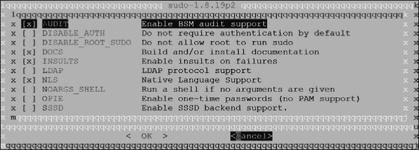

## **16**

**使用端口定制软件**


包含了最常见配置的最受欢迎的程序。如果你要构建一个通用的 web 服务器，官方的 FreeBSD 包，如 nginx 或 lighttpd，或是你偏好的任何 web 服务器应该就足够了。如果你有一个特殊的环境或更少见的需求，那么 Ports Collection（端口集合）就派上用场了。Ports Collection 是一个可以轻松构建许多软件包定制版本的工具。它将依赖关系、许可证、维护者和所有其他软件信息结合成一个既适合机器处理也适合人类阅读的标准格式。通过端口，你可以设置一些系统选项，比如“禁止第三方 GPL 许可证代码”（对嵌入式供应商有用）、“为所有软件添加 LDAP”或者“禁用 X11”。

从长远来看，端口最好通过 poudriere 包构建系统来管理。然而，在你能够使用 poudriere 之前，必须了解端口是如何工作的。我鼓励你在测试系统上探索端口。但与其将端口部署到每台单独的服务器上，不如使用 poudriere 来构建你自己的包存储库。完全通过包来管理你的服务器。除非是你的包构建器，否则永远不要在生产服务器上使用端口树。

在我们深入讨论端口之前，让我们先聊聊软件构建的基本概念。

### **制作软件**

传统的软件构建非常复杂，因为源代码必须被非常具体地处理，才能创建一个可运行的程序——更不用说一个运行良好的程序了！这与使用，比如说，JavaScript 编译器的过程完全不同。尽管程序员可以为每个程序提供安装说明，里面充满了像`Now type ar cru .libs/lib20_zlib_``plugin.a istream-zlib.o zlib-plugin.o`这样的指令，但这简直是出于极端恶意的设计。虽然 Unix 管理员似乎会批准这种恶作剧，但他们对对自己施加的残酷行为是坚决反对的；如果可以自动化，那就一定会自动化。

构建软件的主要工具是 make(1)。当运行 make 时，它会在当前目录中查找一个名为*Makefile*的文件，里面充满了类似于前面段落中那个可怕示例的指令。它读取这些指令并执行，自动化安装过程，无论过程多么复杂。你其实不需要了解*Makefile*的内部细节，因此我们不会对它进行详细分析。

每个*Makefile*都包含一个或多个*targets*，或者说是一组需要执行的指令。例如，输入`make install`指示 make(1)查找名为*install*的目标，并在找到时执行它。目标的名称通常与要执行的过程相关，因此你可以放心地认为`make install`会安装软件。你会发现有许多目标用于安装、配置和卸载大多数软件。make(1)处理了各种各样的功能，其中一些功能远远超出了创建者的初衷。但这正是 Unix 的乐趣所在！

### **源代码和软件**

源代码是用于构建实际机器代码的可读指令，这些机器代码构成了一个可运行的程序。你可能已经以某种形式接触过源代码。如果你从未见过它，可以查看 */usr/src* 下的几个文件或* [`svnweb.freebsd.org/`](https://svnweb.freebsd.org/)*。即便是新手系统管理员也需要能在三次中识别源代码两次。

一旦你拥有一个程序的源代码，你就在你希望运行它的系统类型上构建（或*编译*）程序。（通过交叉编译来为外部平台构建软件要复杂得多。）如果程序是为一个与你正在构建的系统足够相似的操作系统编写的，它就能运行。如果你的平台与原始平台差异过大，它就会失败。一旦你在你的系统上成功构建了软件，你可以将生成的程序（或*二进制文件*）复制到其他相同的系统上，并且它应该能正常运行。

一些程序写得足够好，以至于它们可以在许多不同的平台上进行编译。有一些程序特别支持广泛不同的平台；例如，Apache web 服务器可以在 Windows 和类 Unix 系统上编译。这代表了软件作者的巨大努力，尽管如此，在 Windows 上进行构建之前，您仍然必须运行一些脚本并严格按照指示配置环境。

一般来说，如果你能够从源代码构建程序，它可能会运行。它可能不会正确运行，可能不会做你期望的事情，但它会运行。经验丰富的系统管理员可以利用源代码和错误信息，了解为什么一个程序无法构建或运行。在许多情况下，问题是简单的，并且可以通过最小的努力解决。这也是为什么访问源代码非常重要的原因之一。

在每个系统管理员都是程序员的时代，调试软件占用了管理员大量的时间。每个类 Unix 系统都有些许不同，因此每个系统管理员都必须了解自己的平台、软件设计所针对的平台以及两者之间的差异，才能希望使一段代码正常运行。这种重复性的工作真是令人吃惊。

多年来，程序员开发了像 autoconf 这样的工具来帮助解决这些跨平台问题。并非每个程序都使用这些工具，而当它们出错时，系统管理员就不得不重新开始。系统管理员必须编辑源代码和*Makefiles*，才能有机会使程序运行。而且，*运行*并不等同于*运行良好*，更别提*正确运行*了。

FreeBSD Ports 集合旨在简化这一过程，为 FreeBSD 用户提供便利。

### **Ports 集合**

*Ports 集合*，也叫做*ports 树*或简称*ports*，包含了一个在 FreeBSD 上编译软件的自动化系统。

端口系统的基本理念是，如果源代码需要修改才能在 FreeBSD 上运行，那么这些修改应该是自动化的。如果你需要其他软件来从源代码构建这个程序或运行该软件，那么这些依赖关系应该被记录和跟踪。如果你要自动化这些更改，那么不妨记录下程序所包含的内容，这样你就可以轻松地安装和卸载它。而且，由于你有一个生成每次都能产生相同结果的软件构建过程，并且你已经记录了这个过程创建的所有内容，你可以复制二进制文件并将其安装到任何类似的系统上。

除了创建软件包所需的信息外，端口集还包含有关构建软件的法律限制、安全信息、许可详情等。

端口与软件包互操作。端口集用于创建软件包。你可以根据需要从端口安装一些软件，从软件包安装其他软件，灵活地混合安装来源。你需要使用与构建软件包时相同版本的端口集，无论是季度分支还是最新版本。大多数端口用户希望获得最新的软件，因此我们将重点关注这一点。

#### ***端口***

*端口*是一组说明如何修复或*补丁*一组源代码文件，并构建和安装这些文件的指令。一个端口包含创建完成软件所需的所有信息。这使得系统管理员不再为安装程序而苦恼，而是可以将精力集中在配置它们上。

##### **端口树安装**

如果你按照第三章中的安装说明进行操作，你应该已将端口树安装在*/usr/ports*目录中。在该目录下，你应该能找到几个文件和几十个目录。如果你在*/usr/ports*中没有任何内容，显然你没有按照说明操作。没关系——我也没做到——但你必须安装端口树才能继续。

FreeBSD 支持几种不同的方法来获取端口树。你可以使用 svn(1)查看端口树，或者从网上下载一份。对于系统管理员来说，推荐的方法是使用 portsnap(8)下载最新的（非季度版）端口树。

```
# portsnap auto
Looking up portsnap.FreeBSD.org mirrors... 6 mirrors found.
Fetching snapshot tag from your-org.portsnap.freebsd.org... done.
Fetching snapshot metadata... done.
Updating from Mon Oct 17 15:59:41 EDT 2018 to Mon Mar 20 14:13:53 EDT 2019.
Fetching 5 metadata patches... done.
Applying metadata patches... done.
Fetching 5 metadata files... done.
Fetching 10202 patches.
(700/10202) 6.86% .........
```

在这里，portsnap 会搜索 portsnap 文件的镜像，进行加密验证以确认这些文件在 portsnap 服务器上的完整性，下载文件，并验证下载本身的完整性。

现在，你已经拥有了所有 FreeBSD 端口的最新版本。要将现有的端口树更新到最新版本，只需再次运行`portsnap auto`。

如果你希望通过 cron(1)定期调度 portsnap 更新运行，使用`portsnap cron update`命令，而不是`portsnap auto`。这会告诉 portsnap 在命令运行后 60 分钟内的某个随机时间更新端口树。这有助于分散 FreeBSD portsnap 服务器的负载。在 root 的 crontab 中安排一个在上午 5 点到 5:59:59 之间的 portsnap 运行，可以使用如下条目：

```
0    5    *    *    *    /usr/sbin/portsnap cron update
```

这会在早上 5 点到 6 点之间的随机时间启动实际更新，这比 24 个 portsnap 用户中 1 个在早上 5 点同时访问下载服务器要*有效得多*。

##### **端口树内容**

你在这里看到的大多数目录都是软件类别。每个类别包含进一步的目录层次，而这些目录中的每一个都是一个软件包。截止到我写这篇文章时，FreeBSD 有超过 28,000 个端口，因此使用目录树并正确分类软件至关重要。在这个类别中，不是软件类别的文件和目录中的主要部分在此进行描述。

*CHANGES*文件列出了对 FreeBSD 端口基础设施所做的更改。它主要供 FreeBSD 端口开发者和那些对端口集合内部结构感兴趣的人使用。

*CONTRIBUTING.md*文件存在于 GitHub 上的 FreeBSD 源代码镜像中。所有 FreeBSD 源代码都镜像在 GitHub 上，方便用户使用，但 FreeBSD 内部并不使用 Git。GitHub 用户通常会查阅*CONTRIBUTING.md*，了解如何贡献——而在 FreeBSD 的情况下，回答是“访问 FreeBSD 官网。”（截至我写这篇文章时，将 GitHub 的拉取请求自动提交到 FreeBSD PR 系统的工作仍在进行中。）

*COPYRIGHT*包含了整个端口集合的许可信息。虽然端口集合中每个单独的软件都有自己的版权和许可信息，但端口集合本身是根据两条条款的 BSD 许可证进行许可的。

*GIDs*文件包含了端口集合中所有软件使用的组 ID 列表。集合中的许多软件期望以无特权用户身份运行。如果每个端口都创建一个随机用户，用户名、用户 ID 和组 ID 就会重叠。相反，需要无特权 GID 的端口在这个文件中预留一个。这个文件记录了分配给端口集合的 GID。直到使用时，GID 才会在*/etc/passwd*中分配。

你的*/usr/ports*中有一个以你运行的 FreeBSD 版本命名后缀的*INDEX*文件。这个 FreeBSD 12 系统中有*/usr/ports/INDEX-12*。端口系统的搜索和描述功能使用这个索引。索引是本地生成的，不存储在 Subversion 中。

*Keywords*目录包含了通用配置语言系统的信息，详见第二十三章。

*LEGAL*描述了端口集合中任何软件的法律限制。有些软件有特定的限制——比如不允许商业使用、不允许再分发、不允许盈利等。每个单独的端口也列出了这些限制；这只是从所有端口中汇总的主列表。

*MOVED* 列出了所有已重命名、从一个类别移动到另一个类别或被移除的端口，并附上了原因。自动化管理工具如 portmaster(8) 会使用此列表来查找已移动端口的新位置。为什么要移动端口？当我开始使用 FreeBSD 时，它有一个用于 X Windows 软件的类别。这个类别变得极其庞大，因此端口团队将其拆分，然后再次拆分，直到我们到了 2017 年的九个类别。

*Makefile* 包含了整个 Ports Collection 的高级指令。只有当你想构建整个 Ports Collection 中的每一个端口时才会使用它。你最好使用像 “Private Package Repositories” 在 381 页 讨论的 poudriere，而不是在这里直接运行 `make`。

*Mk* 子目录包含了驱动 make(1) 从互联网获取源文件、打补丁、构建和安装的逻辑。许多类型的程序期望能够集成在一起，这些文件确保同一工具的不同部分能够以兼容的方式构建和安装。一些功能，如 LDAP 和 Emacs，可能会影响许多端口。这个目录包含了像 *bsd.ldap.mk* 和 *bsd.emacs.mk* 这样的 Makefiles，专门用于这些功能。

在 *Mk* 子目录下，你会找到 *Uses* 目录。这个目录包含了广泛使用的 *Makefiles*，用于其他广泛使用的功能或软件套件。例如，KDE 和 GNOME 桌面套件包括数十个或数百个小程序，每个程序都必须正确构建才能相互协作。如果你查看 *Uses*，你会看到专门配置这些程序的 *gnome.mk* 和 *kde.mk* 文件，以及 GSSAPI、Lua、Varnish 等许多其他软件系列的文件。

如果你真的想了解 Ports Collection 是如何工作的，可以阅读 */usr/ports/Mk* 和 */usr/ports/Mk/Uses* 中的所有内容。这些内容非常具有教育意义，尽管支持这些不同程序的本质意味着 *Makefiles* 像一篮被疯狂小猫攻击过的线团一样纠结。

*README* 文件包含了 Ports Collection 的高层次介绍。

*Templates* 目录包含其他部分的 Ports Collection 使用的框架文件。

*Tools* 目录包含了程序、脚本和其他自动化工具，主要供端口开发者使用。

*UIDs* 文件包含系统中端口使用的非特权用户 ID。与 *GIDs* 文件类似，这有助于端口开发者避免端口软件所需的非特权用户之间的冲突。

*UPDATING* 包含了升级软件时的使用说明。需要特别干预的更新会按日期逆序出现在这里。在更新软件之前，请查看此文件，以获取对你有影响的重要说明。

*distfiles* 目录包含了已移植软件的原始源代码。当一个端口下载一段源代码时，该源代码会保存在 */usr/ports/distfiles* 下。

所有其他目录都是端口的分类。以下是*ports/arabic*目录的内容，其中包含了专门针对阿拉伯语言的软件。虽然端口集合中的其他软件也支持阿拉伯语，但此类别是针对阿拉伯语的软件——例如字体、某些类型文档的翻译等等。这个类别对大多数人来说并不有用，但它的优势在于它足够小，可以放入这本书中。有些端口类别有数百个条目。^(1)

```
Makefile        ae_fonts_ttf    kacst_fonts     libitl
Makefile.inc    arabtex         kde4-l10n       libreoffice
ae_fonts_mono   aspell          khotot
```

这个*Makefile*包含了该目录中所有端口的指令。它们比*/usr/ports*中的全局*Makefile*更为具体，但没有单个端口的*Makefile*那么具体。文件*Makefile.inc*包含了该目录中端口的元指令。所有其他目录则是独立的软件包。我们将在第 371 页的“安装端口”中剖析其中一个目录。

独立端口通常根据它们在端口集合中的目录来命名。gnuplot 图形程序可能被称为 math/gnuplot，因为它的端口可以在*/usr/ports/math/gnuplot*找到。

### **端口索引**

端口索引文件包含了所有基于特定 FreeBSD 版本构建的端口列表。在 FreeBSD 13 中，这是*/usr/ports/INDEX-13*。端口集合使用该索引有多个用途，包括搜索整个端口树。

索引文件描述了每个端口的单行信息，字段之间用管道符号(`|`)分隔。虽然这种方式对于系统工具很方便，但对人类并不特别友好。在*/usr/ports*中运行`make print-index`可以得到一个更长且更易理解的索引。这个索引包含了如下条目：

```
Port:   p5-Archive-Extract-0.80
Path:   /usr/ports/archivers/p5-Archive-Extract
Info:   Generic archive extracting mechanism
Maint:  perl@FreeBSD.org
Index:  archivers perl5
B-deps: perl5-5.24.1
R-deps: perl5-5.24.1
E-deps:
P-deps:
F-deps:
WWW:    http://search.cpan.org/dist/Archive-Extract/
```

索引从端口的名称和端口目录的完整路径开始。`Info`提供了端口的简短描述。`Maint`标题列出了端口的维护者，即负责将该软件集成到端口集合中的个人或团队。`Index`部分列出了该端口可能归类的所有类别。列出的第一个类别是该端口在端口集合中的所在目录。在本例中，端口出现在*archivers*目录中。

接下来是依赖项。`B-deps`列出了构建依赖项——即构建此端口时必须安装的其他软件。`R-deps`列出了运行时依赖项，即实际运行时所需的软件。这是一个 Perl 模块，因此它需要一个 Perl 解释器。某些软件必须由特定的工具提取或解压缩，这在`E-deps`中指定。`P-deps`字段列出了用于补丁的软件依赖项——一些稀有的软件必须使用特定工具进行修补。`F-deps`字段类似，指定*fetch 依赖项*——即必须使用的特殊软件来下载软件。

最后，`WWW`部分给出了该软件的主页。

#### ***搜索索引***

Ports Collection 包括用于搜索索引的工具。如果你需要一个特定程序，可能更好通过`pkg search`或者甚至`locate -i`来找到端口目录。将搜索 Ports Collection 留给回答类似“哪些端口使用 SNMP？”的问题。

如果你知道某个软件的名称，可以使用`make search`在*INDEX*文件中搜索它。这里，我查找包含*net-snmp*名称的端口：

```
   # cd /usr/ports
   # make search name=net-snmp
➊ Port:   net-snmp-5.7.3_12
   Path:   /usr/ports/net-mgmt/net-snmp
   Info:   Extendable SNMP implementation
   Maint:  zi@FreeBSD.org
   B-deps: perl5-5.24.1
   R-deps: perl5-5.24.1
   WWW:    http://net-snmp.sourceforge.net/

   Port:   p5-Net-SNMP-6.0.1_1rt:   p5-Net-SNMP-365-3.65
   --snip--
```

截至目前，FreeBSD 有几个端口名称中包含*net-snmp*。第一个是当前标准的 net-snmp 软件集合➊。其他的包括使用 SNMP 通过网络传输的 Perl 库，但与 net-snmp 套件无关，已经不再支持的旧版本 net-snmp，以及 Tcl/Tk 接口到 net-snmp。描述中的字段直接来自*INDEX*文件。

如果你不需要这么详细的信息，可以尝试`make quicksearch`，这样只会显示端口、路径、信息和（如果适用）关于为什么它不再存在的备注。

##### **关键字搜索**

你也可以使用端口描述中的任意字段作为关键字进行搜索。请去除关键字名称中的任何连字符。你想要查找所有依赖于 Perl 的运行时端口吗？

```
# make quicksearch rdeps=perl5
```

你可以将多个搜索词组合在一个查询中。例如，假设你想要查找所有名称中包含 Apache 且依赖于 Python 运行时的程序。

```
# make quicksearch name=apache rdeps=python
```

通过在关键字前加上* x *来排除某个单词的搜索结果。在这里，我们查找所有依赖于 Python 运行时但*不*包含 Apache 名称的端口：

```
# make quicksearch xname=apache rdeps=python
```

然而，这些按字段搜索并不适用于所有软件。例如，如果你在寻找 Midnight Commander 文件管理器，你可能按名称进行搜索。

```
# make search name=midnight
#
```

好吧，这个搜索结果并不太有帮助。搜索所有字段，以匹配`key`这个词。

这会扫描更多字段并返回更多结果。不过，如果你正在搜索一个常见词汇，`key`搜索可能会提供过多的信息。使用`quicksearch`来精简输出结果。

```
# make quicksearch key=midnight
```

这将返回所有描述、名称或依赖中包含`midnight`字符串的端口。我们很快就能发现 Midnight Commander 可以在*/usr/ports/misc/mc*找到。

##### **浏览 Ports Collection 的其他方式**

如果你更喜欢使用网页浏览器，可以构建一个 HTML 索引。只需进入*/usr/ports*目录，并以 root 用户身份输入`make readmes`，生成一个包含端口树索引的*README.html*文件，以及每个端口的 HTML 文件。你可以点击浏览不同的类别，甚至查看每个端口的详细描述。

如果这些选项都不适用，可以尝试 FreeBSD Ports Tree 搜索，访问 *[`www.freebsd.org/cgi/ports.cgi`](http://www.freebsd.org/cgi/ports.cgi)*。此外，FreshPorts 搜索引擎在 *[`www.freshports.org/`](http://www.freshports.org/)* 提供了一个独立的但非常不错的搜索功能。

在网页浏览器和搜索引擎之间，你应该能够找到满足需求的软件。找到所需的端口可能是使用端口时最困难的部分。

#### ***法律限制***

尽管大多数 Ports Collection 中的软件可以用于任何用途，但其中一些软件有更为严格的许可证。*/usr/ports/LEGAL* 文件列出了 Ports Collection 中的法律限制。最常见的限制是禁止重新分发；FreeBSD 项目不会将此类软件包含在其 FTP 站点或 CD 镜像中，而是提供如何构建它的说明。

法律限制出现在你可能没有预料到的地方。你不能下载已编译好的 Oracle Java 软件包，FreeBSD 项目也不能重新分发 Java 源代码。FreeBSD 可以并且确实会分发关于如何在 FreeBSD 上构建 Oracle Java 源代码的说明，但用户必须自行前往 Oracle 网站下载代码。幸运的是，OpenJDK 已经取代了 Oracle Java，成为大多数软件的首选，而 FreeBSD 为它提供了高质量的软件包。

类似地，一些软件禁止商业使用或嵌入到商业产品中。一些软件由于美国商务部的加密技术出口限制，无法从美国出口。^(2) 如果你正在为重新分发、出口或商业用途构建 FreeBSD 系统，你需要查看这个文件。

幸运的是，大多数 Ports Collection 中的软件可以免费用于商业或非商业用途。这些有限制的软件包是例外，而非常规。

### **端口包含了什么？**

从端口安装软件比使用包管理工具要花更长时间，而且 Ports Collection 需要一个活跃的互联网连接。作为交换，Ports Collection 可以比包管理工具生成更优化的结果。让我们来看一个端口。以下是 dns/bind911 的内部结构，这是 ISC BIND 域名服务器的 9.11 版本：

```
Makefile        files           pkg-help
distinfo        pkg-descr       pkg-plist
```

*Makefile* 包含了构建端口的基本指令。如果你阅读这个文件，你会发现它只有几百行。对于如此复杂的软件来说，这并不是很多指令，而且大多数 *Makefile* 都要短得多。这个文件的主要内容是一些很少用到的定制设置。这里几乎没有关于 BIND 本身的信息，也没有多少关于如何在 FreeBSD 上构建软件的内容。大多数 FreeBSD 端口系统的 *Makefile* 都位于 */usr/ports/Mk* 目录中。

*distinfo* 文件包含端口下载的各种文件的校验和，确保你的系统能够确认文件在传输过程中没有出现错误，并且在你获取文件之前没有人篡改它。

*files* 目录包含了在 FreeBSD 上构建此端口所需的所有附加文件和补丁。BIND 9.11 需要十几个补丁。大多数补丁并不是构建所必需的，因为 ISC 在 FreeBSD 上支持他们的 DNS 服务器。它们仅提供与 FreeBSD 包管理系统的集成。

*pkg-descr* 文件包含了软件的详细描述。

一些端口包括 *pkg-help* 文件，提供如何使用该端口的额外细节。

一些端口（不是这个端口）有一个*pkg-message*文件，包含一个模板，用于创建软件包的安装信息。

最后，*pkg-plist*文件是一个列出所有已安装文件的清单（“包装清单”）。端口只会安装包装清单中列出的文件。一些端口（如与 Python 相关的端口）使用自动生成的包装清单，因此如果包装清单缺失，不要感到惊讶。

这些文件结合在一起，包含了构建软件所需的工具和指令。

#### ***安装端口***

如果你熟悉源代码，你可能已经注意到一个端口实际上包含的源代码非常少。没错，确实有一些补丁需要应用到源代码上，并且有一些脚本需要在源代码上运行，但没有软件的源代码！你可能会问，既然没有源代码，怎么从源代码构建软件呢？

**端口和生产环境**

我强烈建议你使用 poudriere 构建自己的软件包仓库，并通过该仓库管理服务器的端口。从主机上直接升级已安装的端口既麻烦又困难。像 portmaster 和 portupgrade 这样的工具目前已经过时，尽管它们可能会被更新或重写，但 poudriere 是永恒的方法。你已经被提醒了。请在可丢弃的测试系统上探索端口。

当你激活一个端口时，FreeBSD 会自动从包含的站点列表中下载相应的源代码。然后，端口会检查下载的代码是否有完整性错误，将代码提取到临时工作目录，打上补丁，构建它，安装所有内容，并将安装记录到包数据库中。如果该端口有依赖项，并且这些依赖项没有安装，它会中断当前端口的构建，开始从源代码构建依赖项。要触发所有这些操作，你只需要进入端口目录并输入：

```
# make install
```

当端口执行其工作时，你会看到大量文本滚动通过终端，完成后你会重新获得命令提示符。

然而，随着你在从源代码构建方面经验的增加，你会发现这种一体化的方法并不适用于所有场合。别担心；端口集合提供了按照你希望的方式进行端口构建的能力，因为`make install`实际上会运行一系列子命令。如果你指定其中一个子命令，make(1)会运行所有前面的命令以及你指定的命令。例如，`make extract`会运行`make config`、`make fetch`、`make checksum`、`make depends`和`make extract`。这些子命令的顺序如下：

##### **make config**

许多端口有可选组件。运行`make config`可以让你选择希望在该端口中支持的选项。你选择的选项会保存在*/var/db/ports*中，以便将来构建该端口时使用。这些选项会影响端口的构建方式——例如，如果你选择使用 net-snmp 支持来构建一个程序，那么你就在添加对 net-snmp 的依赖。我们在本章后面的“端口自定义选项”一节中更详细地讨论了`make config`，第 373 页也有相关内容。

##### **make fetch**

配置好端口后，系统会搜索一个预先配置的互联网站点列表以查找程序源代码。端口的*Makefile*可能会列出该文件的权威下载站点，或者可能使用 Ports Collection 提供的多个权威列表之一。当端口找到源代码时，它会将其下载。原始下载的源代码称为*distfile*，并存储在*/usr/ports/distfiles*中。

如果端口需要特定的程序来获取 distfile，端口会在`make fetch`过程中安装该程序。

##### **make checksum**

`make checksum`步骤计算 distfile 的加密哈希值，并将其与端口的*distinfo*文件中记录的哈希值进行比较。文件可能会以多种方式损坏：在下载过程中、在下载站点上被恶意入侵者篡改，或由于某种随机的不可预见情况。校验和验证可以检测任何原因导致的文件损坏，并在文件损坏时停止构建。

该步骤不会尝试确定文件为何或如何损坏。对于端口而言，源代码在下载过程中是否损坏，或是某个恶意入侵者在你下载之前将后门代码加入 distfile，都无关紧要。无论如何，都不要浪费时间构建它，当然也不要安装它！

**足射法 #839：忽略校验和**

软件作者，特别是自由软件作者，有时会对代码做出小的更改，但不会更改软件版本或 distfile 的文件名。FreeBSD 端口会正确地发现这个问题，并在发生此类更改后无法正常工作。如果你完全确定 distfile 没有被篡改或损坏，你可以通过`make NO CHECKSUM=yes install`来覆盖此检查。

我强烈建议在这样做之前，咨询软件的原作者——而不是端口维护者。与作者确认能确保你没有安装被篡改的软件，并有助于教育软件作者理解版本号和发布工程的重要性。

##### **make depends**

许多软件是建立在其他软件之上的。虽然 FreeBSD 包括了 make(1) 和编译器，但有些软件只能用特定的编译器编译，或要求特定版本的 make。也许源代码文件使用了一种罕见的压缩算法分发。可能它需要一个 FreeBSD 没有提供的第三方库。在 `make depends` 阶段，端口会检查缺失的依赖项，并尝试通过构建端口来解决这些问题。

依赖项可能也有它们自己的依赖项。`make depends` 会递归地处理依赖关系，直到端口拥有构建、安装和运行所需的一切。

##### **make extract**

一旦 FreeBSD 拥有了端口的源代码文件，它必须解压并提取它们。大多数源代码会使用类似 gzip(1)、bzip(1) 或 xz(1) 这样的工具压缩，并使用 tar(1) 归档。此命令会在端口中创建一个 *work* 子目录，并在那里解压 tar 包。如果端口需要特定的程序来提取源代码文件，它会在此时安装该程序。

##### **make patch**

此命令将端口中的任何补丁应用到 *work* 子目录中提取的源代码。如果端口需要特定的补丁程序，而不是基础系统中的 patch(1)，它将在此时安装该程序。

##### **make configure**

接下来，FreeBSD 会检查软件是否有配置脚本。这与端口执行的 `make config` 步骤不同。如果软件自带了配置脚本，端口会运行它。有些端口在这个阶段会中断构建，提示用户输入信息，但大多数会默默运行。

##### **make build**

这一步编译已检查、解压、打补丁并配置好的软件。那些不需要编译的端口在这里可能没有任何操作。有些端口仅用于方便地打包其他端口。

##### **make install**

最后，`make install` 安装软件并告诉包管理系统记录其存在。

#### ***端口自定义选项***

许多软件包有大量的自定义构建功能。虽然为任何个别软件启用这些功能并不难，但没有通用的方法来定义它们。对于某些软件，你可能需要编辑原始软件的 *Makefile*；对于另一些，你可能需要向配置脚本提供标志。学习如何进行这些更改需要时间，而且可能会让人烦恼。FreeBSD Ports Collection 提供了两种方法来一致地配置系统上的这些选项。

较新且更美观的方法由 `make config` 支持。这会弹出一个对话框，类似于你首次安装 FreeBSD 时看到的界面。例如，流行的访问控制系统 sudo (*[`www.sudo.ws/`](http://www.sudo.ws/)*) 支持 LDAP、审计，并且最重要的是，当用户输入错误密码时会侮辱用户。如果你进入 */usr/ports/security/sudo* 目录并输入 `make config`，你会看到一个类似于 图 16-1 所示的菜单。

使用空格键选择你喜欢的选项，使用箭头键和 TAB 键移动。按 ENTER 键选择 OK 或 Cancel 以完成。端口会将你选择的选项记录在 */var/db/ports/<category>_<portname>/options* 中。当你需要重建或升级端口时，端口会重复使用这些选项，除非你运行 `make config` 来更改它们，或者运行 `make rmconfig` 来清除它们。



*图 16-1：端口配置*

##### **在命令行进行自定义**

有时候，你不想要一个漂亮的箭头选择菜单，而是想要一个适合系统管理员使用的命令行界面。Ports Collection 让你跳过菜单，直接在 make(1) 命令中提供所有配置选项。在你进行此操作之前，你需要关闭漂亮的菜单。在命令行上设置环境变量 `BATCH=1` 来关闭菜单。在这里，我们使用默认配置构建端口，正如 FreeBSD 包集群所做的那样：

```
# make BATCH=1 install
```

现在你已经摆脱了烦人的菜单，看看端口支持的配置选项。`make pretty-print-config` 命令会以易于阅读的格式显示当前设置。让我们来看看 *security/sudo*。

```
# make pretty-print-config
+AUDIT -DISABLE_AUTH -DISABLE_ROOT_SUDO +DOCS -INSULTS -LDAP +NLS -NOARGS_
SHELL -OPIE -SSSD
```

每一个选项都代表一个配置选项。标记为加号的选项已启用，而标记为减号的选项已禁用。这些选项意味着什么？运行 `make showconfig` 会显示所有端口的选项及其作用。

```
# make showconfig
===> The following configuration options are available for sudo-1.8.19p2:
     AUDIT=on: Enable BSM audit support
     DISABLE_AUTH=off: Do not require authentication by default
     DISABLE_ROOT_SUDO=off: Do not allow root to run sudo
     DOCS=on: Build and/or install documentation
     INSULTS=off: Enable insults on failures
--snip--
```

尽管 sudo 支持 LDAP、SSD 和各种复杂的信息源，但我真正需要的是让 sudo 在用户输入错误密码时侮辱用户。我想要 `INSULTS` 选项。在命令行上使用 `WITH` 环境变量来设置该选项。选项名称区分大小写。在这里，我设置了该选项并再次检查配置：

```
# make WITH=INSULTS pretty-print-config
+AUDIT -DISABLE_AUTH -DISABLE_ROOT_SUDO +DOCS +INSULTS -LDAP +NLS -NOARGS_
SHELL -OPIE -SSSD
```

`INSULTS` 选项现在已设置。

使用引号来启用多个选项。

```
# make WITH="INSULTS LDAP" pretty-print-config
```

同样，使用 `WITHOUT` 来禁用一个选项。

```
# make WITH=INSULTS WITHOUT="AUDIT NLS" pretty-print-config
```

如果在构建端口时保留了菜单启用状态，`make config` 图形菜单将会出现，但会使用你选择的选项。记住，通过设置 `BATCH` 变量来关闭菜单。

##### **全局使用自定义设置**

你构建端口是为了在软件中获取特定功能。通常，你希望在所有支持该功能的端口中都包含这个功能。以 LDAP 为例。如果你的企业使用 LDAP，你可能希望所有软件都能使用它。你会希望 LDAP 成为默认选项。

FreeBSD 将每次运行 make 时使用的设置存储在 */etc/make.conf* 中。你可以在这里启用 LDAP 或 LibreSSL 或其他应在系统中全局出现的自定义设置。将任何希望全局应用的选项放入 *make.conf* 中。与命令行不同，*make.conf* 使用变量 `OPTIONS_SET` 和 `OPTIONS_UNSET`。

在这里，我希望在每个端口上启用 LDAP 和 INSULTS 选项：

```
OPTIONS_SET=INSULTS LDAP
```

*make.conf*设置对不支持该选项的端口无效。许多端口根本不认识 LDAP。我不知道除了 sudo 之外是否有其他端口提供侮辱用户的可选功能，但如果有这个功能，我*需要*它。

为什么要在*make.conf*中使用单独的选项而不是命令行？优先级。使用`WITH`设置的选项会覆盖使用`OPTIONS_SET`设置的选项。在这个例子中，我已经全局启用了侮辱功能。如果出于某种难以理解的原因，我需要某个端口不侮辱用户，^(3) 我可以在构建该端口时在命令行使用`WITHOUT=INSULTS`来覆盖全局默认设置。

##### **/etc/make.conf 和单个端口**

也许你想用特定选项构建某个端口，但又不想在命令行中指定它。可以在*/etc/make.conf*中使用端口类别、下划线、端口名称、另一个下划线和`SET`变量。

```
security_sudo_SET=INSULTS
```

虽然端口应该缓存配置，但这将提供额外的保护，防止因手误导致的错误。

##### **设置默认版本**

FreeBSD 支持多种端口自定义选项。然而，并非所有选项都是合理的端口选项。有些选项必须在整个端口集合中使用才能生效。最常见的例子是 SSL 库。你可以使用基础系统的 SSL 库构建所有端口，一切正常。你也可以使用外部 SSL 库构建所有端口，同样软件可以正常工作。然而，如果部分端口使用基础系统的 SSL，另一些使用第三方 SSL，则会导致灾难。类似的情况也适用于例如 PostgreSQL 数据库服务器和 Python 解释器的不同版本。不同的 SSL 库与不同版本的数据库服务器结合，常常会引发我非常喜欢交给初级系统管理员的那种灾难，他们急需一次无法忘记的关于共享库如何工作的教训。

端口集合使用`DEFAULT_VERSIONS`变量列出应作为默认使用的关键软件。这替代了像`DEFAULT_MYSQL_VER`和`WITH_BDB_VER`这样的旧变量。获取完整的变量列表唯一的方法是通过*/usr/ports/Mk/*进行查找。*bsd.default-versions.mk*、*bsd.apache.mk*和*Mk/Uses*下的文件特别有用。

在这里，我告诉端口集合始终使用 LibreSSL 构建端口，而不是使用基础系统的 OpenSSL 库，并使用 Python 3.7。

```
DEFAULT_VERSIONS += ssl=libressl
DEFAULT_VERSIONS += python=python3.7
```

我将每个默认版本列在单独的一行，并使用`+=`语法告诉端口系统将其添加到列表中。

我建议在构建第一个端口之前设置默认版本。否则，你最终会重建端口，以便它们链接到你偏好的库。

不要将预构建的包与使用替代 `DEFAULT_``VERSIONS` 构建的端口混合使用。通过包构建的程序将使用默认的库，而你的端口将使用你首选的库。如果你的系统在之后能够正常工作，那也只是偶然的结果。

##### **预加载递归**

有时候，构建一个端口时的交互性并不是问题，递归才是问题。

假设你正在构建一个大型端口，例如 LibreOffice 或 GNOME。这些端口有数十个甚至数百个依赖项。许多这些端口需要交互式配置。也许你决定在睡觉前启动一个 KDE 构建，想着醒来后会看到最新的窗口管理器，或者至少是一个有趣的错误信息。相反，你会发现依赖项的 `make config` 菜单自你离开后 30 秒起就耐心地等待着你的关注。

从端口构建软件的重点是你可以定制它。然而，对于这些大型构建，你确实希望在一开始就做所有的定制。这就是 `make config-recursive` 发挥作用的地方。

`make config-recursive` 会遍历所需端口的树，并对每一个端口运行 `make config`。你会花几分钟时间在每个端口中选择选项，或者仅在你不关心的端口上点击 OK。一旦完成递归配置，你就可以安全地在你实际需要的端口上运行 `make install`，然后去做其他事情。等你回来时，你将看到一个已安装的端口或一个构建失败的结果。

改变一个端口的构建选项可以增加或删除依赖项。如果你决定启用 LibreOffice 中的 SNMP 支持，^(4) 该端口将需要适当的 SNMP 库。该库的端口需要配置。重新运行 `make config-recursive`，直到你的所有决定不再变化。

端口系统会缓存你所有的配置选择。要删除一个端口及其所有依赖项的缓存，可以运行 `make rmconfig-recursive`。

如果带宽时延是问题，你可以通过 `make fetch-recursive` 下载所有依赖项所需的所有 distfiles。如果你身处像南极这样地方，那里构建时间和服务器冷却无限制，但你每天只有几个小时的互联网连接，这个方法会非常有用。

##### **打包依赖**

有些软件有数百个依赖项，你可能并不想构建它们所有的部分。虽然我可能想要一个定制的 Emacs 构建，但我可能不想从源代码构建 gmake 和最新的 GNU C 编译器。`make missing` 命令会显示缺失的依赖项。你可以使用该命令挑选你想要构建的部分。

如果你不想从源代码构建任何依赖项，而是希望从包中安装它们，你可以将 `make missing` 传递给 `pkg` 命令。

```
# pkg install -Ay $(make -DBATCH missing)
```

如果有可用的包，它会被安装。你只需要从端口安装那些只能通过端口获取的东西。

##### **端口风味**

一些端口有复杂的依赖关系。虽然你可以使用 Python 2 或 Python 3 来构建 Ansible，但一个支持 Python 2 的 Ansible 软件包与支持 Python 3 的完全不同。*Flavors*是一种在单个端口中表达这些可能性的机制，最近才引入到 Ports 集合中。Flavors 目前还未在整个端口系统中普及，但在我写这篇文章时，它们已经在 Python、Perl、Qt 和 Emacs 中实现。你可以预期它们会越来越频繁地出现在其他地方。

要查看一个端口是否支持任何不同的版本，可以进入端口目录并运行`make -V FLAVORS`。在这里，我查看了流行的 Python 打包工具 Setuptools 支持的版本。

```
# cd /usr/ports/devel/py-setuptools
# make -V FLAVORS
py27 py36 py35 py34
```

我当前的端口树支持 Python 2.7、3.6、3.5 和 3.4。

要为特定版本的 Python 构建 Setuptools，请在命令行中指定版本。

```
# make FLAVOR=py34 install clean
```

如果没有指定版本，端口将使用当前默认的 Python 进行构建。要为系统设置默认的 Python，请在*make.conf*中设置`DEFAULT_VERSIONS`。

#### ***构建软件包***

你可以从已安装的端口创建一个软件包。然后，你可以将自定义的端口复制到其他机器并进行安装。

在创建软件包之前，创建目录*/usr/ports/packages*。Ports 系统将构建好的软件包放入该目录。如果没有*packages*目录，软件包将会被放到端口目录中，导致软件包文件散布在文件系统各处。

使用`make package`创建软件包。如果你想打包当前端口以及所有依赖项，可以运行`make package-recursive`。

需要大量定制端口的人应该考虑使用 poudriere 设置自己的仓库（本章稍后会讨论），但如果你有特殊情况或者希望省事，偶尔构建单独的软件包也是可以的。

#### ***卸载和重新安装端口***

虽然你可以使用`pkg remove`来卸载一个端口，但也可以从端口目录中卸载一个端口。在端口目录中运行`make deinstall`将程序从系统中删除，但会保留已编译的端口，随时可以重新安装。

卸载端口后，已编译的程序和源文件仍然保存在端口的*work*子目录下。运行`make reinstall`将重新安装已编译的程序。你可以任意多次卸载和重新安装。

#### ***跟踪端口构建状态***

Ports 集合如何跟踪已完成的操作？如果你能运行`make extract`然后运行`make install`，那么 FreeBSD 如何知道已经完成了哪些步骤？Ports 集合使用隐藏文件（以点开头的文件），也就是*cookie*，来跟踪已完成的步骤。可以通过列出端口的*work*目录中的所有文件来查看这些文件：

```
# cd /usr/ports/security/sudo/work
# ls -a
ls -a
--snip--
.PLIST.flattened
.PLIST.mktmp
.PLIST.objdump
.PLIST.setuid
.PLIST.writable
.build_done.sudo._usr_local
.configure_done.sudo._usr_local
.extract_done.sudo._usr_local
.install_done.sudo._usr_local
.license-catalog.mk
--snip--
```

文件*.configure_done.sudo._usr_local*表示`make configure`步骤已经完成。

在多次执行`make install`/`deinstall`循环之后，我曾遇到过端口拒绝重新安装的情况。通常这是由隐藏文件造成的，指示安装已完成。删除该文件后，重新安装即可进行。

#### ***清理端口***

端口可能占用大量磁盘空间。像 GNOME、KDE 和 LibreOffice 这样的程序，由于其许多依赖，可能会占用数十 GB 的空间！大部分内容都存储在端口的*work*目录中，那里存放着源代码文件以及所有中间生成的二进制部分。然而，一旦端口安装完成，你就不再需要这些文件。

使用`make clean`删除端口的工作文件。这将删除当前端口及所有依赖的*work*目录，因此在执行此操作之前，请确保你对新程序感到满意。你还可以在安装后立即清理端口，方法是运行`make install clean`。

你可能还想删除存储在*/usr/ports/distfiles*中的原始 distfiles。`make distclean`命令会删除当前端口及所有依赖的 distfiles。

要清理整个端口树，在*/usr/ports*目录下直接运行`make clean -DNOCLEANDEPENDS`。`-DNOCLEANDEPENDS`是可选的，但它防止了默认的递归清理。没有它，你将清理一些热门端口几十次或几百次。虽然有更快速的方法可以删除端口树中的每个*work*目录，但这个方法是 FreeBSD 项目直接支持的。

#### ***只读端口树***

很多人不喜欢在*/usr/ports*中保留临时文件甚至包文件。你可以将各种工作目录移动到文件系统的其他位置，从而保持*/usr/ports*只读，除了更新之外。

使用*make.conf*中的`WRKDIRPREFIX`选项在单独的目录中构建端口。许多人会将此设置为类似*/usr/obj*的位置。

`PACKAGES`选项设置一个新的包目录，而不是*/usr/ports/packages*。

最后，`DISTDIR`设置一个存储 distfiles 的路径，除了*/usr/ports/distfiles*以外。

相关地，尽管必须具有相应目录的写权限才能构建端口和包，但仍然可以在不是 root 用户的情况下进行构建。然而，只有 root 用户才能安装软件。

#### ***更改安装路径***

许多环境都有关于附加软件安装的标准。我曾在一些组织中看到，*/usr/local*专用于该机器的特定文件，禁止将软件安装到该目录。相反，软件安装必须放入*/opt*或其他指定位置。

使用`LOCALBASE`和`PREFIX`变量设置备用安装位置。你可以在命令行中执行此操作，但如果你遵循组织标准，建议使用*make.conf*。无论哪种方式，都从构建 pkg(8)本身开始。

```
# cd /usr/ports/ports-mgmt/pkg
# make LOCALBASE=/opt PREFIX=/opt install
```

该端口将所有文件安装到该目录下。例如，通常会放入*/usr/local/bin*的程序将会放入*/opt/bin*。

不是每个端口都能处理从*/usr/local*更改`LOCALBASE`和`PREFIX`。一些软件对*/usr/local*有硬编码依赖，而其他软件则可能存在尚未发现的 bug。如果某个端口在更改安装路径时出现问题，可以提交一个 PR（参见第二十四章）。考虑检查该端口，找出问题的原因。像这样提交修复是参与 FreeBSD 项目最简单的方式之一。

### **私有软件包仓库**

软件包很方便，直到你需要定制版本；这时你就需要端口。同样，端口也很有用，直到你有几十台机器都需要定制的端口。在一台主机上容易构建的东西，在多台主机上就很难维护，而在大规模服务器集群中几乎不可能。当你超越端口时，你需要软件包，定制的软件包。

FreeBSD 项目使用 poudriere（发音为 *poo-DRE-er*）来构建软件包。为什么使用 poudriere？它是法语中的 *powderkeg*（火药桶）的意思。作为“tinderbox”工具的继任者，^(5) poudriere 是一组 shell 脚本，利用现有的 FreeBSD 基础设施，如监狱（jails）、tmpfs 和端口集合（Ports Collection）。

构建跨多个系统可用的软件包与在本地主机上构建软件是不同的。任何由人类管理的东西都会积累杂物。当我的桌面使用超过几个月时，我相当自信某些我所做的小改动会让它与任何新安装的系统有所不同。也许我在升级后保存了一个共享库。也许我手动安装了一些东西并忘记了它。也许 Gremlins（小怪物）篡改了链接器，我也不知道。重要的是，我的主机不再与每个运行相同操作系统的主机保持完美一致。一个在这台主机上构建和打包的端口可能包括依赖关系、库或其他什么，导致它无法在其他主机上运行。

Poudriere 通过在它自己管理的监狱（jails）中构建所有内容，避免了这个问题。一个 poudriere 可以为任何支持的 FreeBSD 版本构建软件包，即使该版本比其运行的主机版本要旧。比如，你不能在 12.4-RELEASE 主机上为 13.0-RELEASE 构建软件包，因为内核缺少必要的接口。

使用 poudriere，你可以在一台主机上构建软件包，并在所有服务器之间分发它们。虽然 poudriere 包含许多高级功能，但启动一个基本的仓库并不困难。

#### ***Poudriere 资源***

构建软件包需要系统资源。你可以限制 poudriere 在构建期间使用的处理器数量，这有助于减少其内存使用。然而，虽然 poudriere 本身只有几兆字节，但监狱（jails）和构建环境可能会占用大量磁盘空间。官方的 poudriere 文档建议为每个监狱分配至少 4GB 的磁盘空间，为端口树（ports tree）分配 3GB 的磁盘空间。我通常在使用 ZFS 时为每个监狱分配大约 1GB，但我建议你还是按照推荐配置来分配空间。

Poudriere 利用 ZFS 克隆和快照来构建 jail，大大减少了所需的磁盘空间，并且越来越提高了性能。你可以在 UFS 上运行 poudriere，但它会占用更多空间并且运行得更慢。

更重要的是构建端口所需的空间。我的 Web 服务器只运行几十个软件包，其中许多非常小。Poudriere 只需要几 GB 的磁盘来构建它们。如果你在构建成百上千个软件包，你需要大量的磁盘空间。需要多少？嗯，你是在构建 GnuPG 还是构建 LibreOffice？为了估算，先构建但不要清理你所有的端口软件包，然后查看 */usr/ports* 的大小。

每个主机应该只使用一个软件包仓库。是的，从技术上讲，你可以构建本地软件包并将它们与官方 FreeBSD 仓库中的软件包一起安装。问题是软件包之间是相互依赖的。你可以让主机首先检查你的仓库，然后再回退到官方仓库。然而，官方仓库每隔几天就会更新。更新之间的时间取决于构建集群中可用的硬件，但几天是一个不错的估计。你的 poudriere 更新是否与官方仓库的稍微不规律的更新完全同步？你的端口树是否与端口集群使用的完全一致？软件包应该作为一个集成集合来工作，而不是来自两个不同集合的一堆东西。问问任何 Linux 管理员，他们关于从多个仓库安装软件包的恐怖故事，然后决定自己构建所有的软件包。根据需要合理规划磁盘使用。

最后，首先在你打算安装软件包的相同架构的主机上构建软件包。如果你在为 arm64 系统构建软件包，请使用 arm64 主机来运行 poudriere。你可以在 amd64 上构建 i386 软件包，但 amd64 硬件设计本身就可以运行 i386 代码。一旦你对 poudriere 熟悉了，你可以使用 qemu-user-static 包来为较慢的平台交叉构建软件包。

你可以将 poudriere 添加到现有的生产主机吗？也许可以。在测试系统上运行几次 poudriere 可以帮助你了解你的环境所需的资源。

#### ***安装和配置 Poudriere***

Poudriere 没有构建选项，因此从软件包中安装它。

```
# pkg install poudriere
```

在 */usr/local/etc* 中配置 poudriere。你会发现一个用于配置特定软件包构建的目录，*poudriere.d*，但我们将从通用配置文件 *poudriere.conf* 开始。在这里，你将告诉 poudriere 如何运行。虽然你可以自定义目录和路径，但我们将使用默认设置。

你必须通过设置 `FREEBSD_HOST` 变量来告诉 poudriere 从哪里下载 FreeBSD 安装文件。如果没有本地安装镜像，请使用默认的 `download.freebsd.org`。

```
FREEBSD_HOST=https://download.FreeBSD.org
```

Poudriere 包含 ZFS 支持功能。当然，ZFS 对 poudriere 并非必需，但如果在 ZFS 上运行，它会根据需要创建、克隆和销毁数据集。在 UFS 上运行不会妨碍 poudriere，但复制文件的速度比克隆要慢。如果你使用 UFS，取消注释`NO_ZFS=yes`配置选项。就这样。

ZFS 用户需要指定 poudriere 将使用的 ZFS 池。我的主操作安装可能在*zroot*池上，但该池位于一对我不想过度使用的闪存 SATADOM 上。我有一个专门用于处理数据的*scratch*池。在*poudriere.conf*中设置`ZPOOL`。

```
ZPOOL=scratch
```

在你第一次运行 poudriere 之前，创建一个*/usr/local/poudriere*数据集。这样你会更高兴。

所有 poudriere 的工作文件都会放在*/usr/local/poudriere*下。如果你使用的是单独的 ZFS 池，该池上数据集的挂载点将被设置为*/usr/local/poudriere*下的不同位置。在 UFS 上，它是一个像其他目录一样的目录。

我的示例运行在 ZFS 上，因为我可以。poudriere 的输出在 UFS 系统上可能看起来稍有不同，但无论底层文件系统是什么，你运行的命令都是相同的。

稍后我们将看看一些 poudriere 的自定义设置，但这些足以让你入门。现在，创建用于你的包的 jails。

#### ***Poudriere Jail 创建***

Poudriere 可以从各种不同来源创建 jails。你可以从不同的来源下载，或者从源树中构建，等等。请查阅 poudriere(8)以获取完整的列表。在这里，我将通过我最喜欢的三种方法安装三个不同的 jails：从互联网下载，从安装镜像安装，以及从我自定义构建的*/usr/src*和*/usr/obj*安装。所有安装命令都使用相同的通用语法。某些安装方法会添加新选项，但一切都从这些命令开始。

```
# poudriere jail -c -j jailname -v version
```

`jail`子命令告诉 poudriere 处理某个 jail。`-c`标志表示创建，`-j`允许你为 jail 分配一个名称。一个 jail 可以有任何不包含句点的名称。我将我的 poudriere jails 命名为架构和版本号，用连字符替代任何句点。这让我得到了像*amd64-12-0*、*amd64-11-4*这样的 jails。`-v`标志需要一个参数，即`uname -r`中的 FreeBSD 版本，但不包括任何补丁级别信息。如果你的主机当前运行的是 12.3-RELEASE-p20，只需使用 12.3-RELEASE 即可。补丁级别会在随后的 poudriere 运行中发生变化——是的，poudriere 会将安全补丁应用到 jails 中。

##### **从网络安装 Jail**

默认的 jail 安装从*poudriere.conf*中指定的下载站点获取 FreeBSD 软件。FreeBSD 的主下载站点是地理负载均衡的，因此除非你有自己的镜像站点，否则不需要使用其他站点。在这里，我创建了一个名为*amd64-11-1*的 jail，用于构建 11.1 包：

```
# poudriere jail -c -j amd64-11-1 -v 11.1-RELEASE
[00:00:00] ====>> Creating amd64-11-1 fs... done
[00:00:01] ====>> Using pre-distributed MANIFEST for FreeBSD 11.1-RELEASE amd64
[00:00:01] ====>> Fetching base.txz for FreeBSD 11.1-RELEASE amd64
--snip--
```

Poudriere 会访问网站并开始下载发行文件。一旦它将所有文件下载到本地，它会将*/etc/resolv.conf*复制到监狱中，并运行`freebsd-update`以获取所有最新的安全补丁。poudriere 的运行以以下内容结束：

```
[00:04:21] ====>> Recording filesystem state for clean... done
[00:04:21] ====>> Jail amd64-11-1 11.1-RELEASE-p1 amd64 is ready to be used
```

你现在可以配置这个监狱了。

##### **从媒体安装监狱**

从互联网上下载没问题，但如果你本地有安装介质怎么办？为什么要重新下载你已经保存在 ISO 或内存棒镜像中的内容呢？将这些发行文件提取到本地硬盘上，你可以用它们来创建你需要的任意数量的监狱。对于 ISO 文件，使用 tar(1)。

```
# tar -xf ../FreeBSD-11.0-RELEASE-amd64-disc1.iso usr/freebsd-dist
```

内存棒镜像稍微复杂一些；遗憾的是，libarchive 目前无法打开磁盘镜像。你必须将镜像附加到内存设备并挂载它。

```
# mdconfig -at vnode -f FreeBSD-11.0-RELEASE-amd64-memstick.img
md0
```

如果你尝试挂载*/dev/md0*，会遇到错误。这不是一个文件系统；它是一个分区磁盘镜像。识别磁盘上的分区。

```
# gpart show md0
=>      3  1433741  md0  GPT  (700M)
        3     1600    1  efi  (800K)
     1603      125    2  freebsd-boot  (63K)
     1728  1429968    3  freebsd-ufs  (698M)
  1431696     2048    4  freebsd-swap  (1.0M)
```

分区 3 是一个 UFS 文件系统。这看起来很有前景。^(6) 挂载它。

```
# mount /dev/md0p3 /mnt
```

发行文件现在可在*/mnt/usr/freebsd-dist*中找到。我可以将它们复制出来，或者直接从当前位置安装。

在这里，我创建了一个用于构建 FreeBSD 11.0 软件包的监狱。它将被命名为*amd64-11-0*，并使用从挂载的内存棒获取的文件。使用`-m`标志来指定 poudriere 应从何处获取文件。

```
# poudriere jail -c -j amd64-11-0 -v 11.0-RELEASE -m url=file:///mnt/usr/freebsd-dist/
```

请注意，`-m`的参数是一个 URL。我可以在这里指定一个网站，但`file://`是完全有效的 URL 类型。在 Unix 主机上，`file://` URL 通过第三个斜杠来表示文件系统根目录。

##### **从本地构建安装监狱**

我运行的是-current 版本，并定期从源代码构建。我想为我的自定义构建创建软件包，因此监狱需要一个与我的主机匹配的 FreeBSD 版本。获取它的简单方法是从构建主机时使用的相同*/usr/src*安装。（你也可以使用 Subversion 下载你用来构建该系统的源代码的新副本，但这需要理解 Subversion。）使用-m 来指定源目录的位置。

```
# poudriere jail -c -j amd64-current -v 12.0-CURRENT -m src=/usr/src

[00:00:00] ====>> Copying /usr/src to /usr/local/poudriere/jails/amd64-current/usr/src...
--snip--
```

Poudriere 在*/usr/obj*中预构建的世界上运行`make installworld`来创建你的监狱。它不会运行`freebsd-update`，因为-current 版本不支持它。

我们将在所有未来的示例中使用*amd64-current*监狱。

##### **查看监狱**

要查看 poudriere 设置的所有监狱，请运行`poudriere jail -l`。输出非常宽，因此我无法在本书中复现，但你会看到监狱的名称、安装的 FreeBSD 版本、硬件架构、安装方法、安装时间戳以及监狱的路径。

#### ***安装 Poudriere 端口树***

Poudriere 可以为不同的构建使用不同的端口树。你可能会为一台主机使用季度端口分支，为另一台主机使用当前端口树，为第三台主机使用去年的端口树。（你需要使用 Subversion 从 FreeBSD 镜像中提取特定的端口树，所以我们不会详细介绍这部分内容。）支持多个端口树意味着你必须为每个安装的端口树分配一个名称。多个 jail 可以共享一个端口树。默认情况下使用的是当前的端口树。

使用`poudriere ports`子命令进行所有与端口相关的操作。`-c`标志告诉 poudriere 创建一个端口树，`-p`标志让你分配名称。

```
# poudriere ports -cp head
[00:00:00] ====>> Creating head fs... done
[00:00:00] ====>> Extracting portstree "head"...
Looking up portsnap.FreeBSD.org mirrors... 6 mirrors found.
--snip--
```

Poudriere 利用了我们在本章之前讨论过的 portsnap(8)。

如果你安装了多个端口树，可以使用`poudriere ports -l`查看它们。

#### ***配置 Poudriere 端口***

构建端口的重点在于定制它。你不需要将整个端口树都构建为包——除非你正在运行 FreeBSD 包构建集群或类似的东西！你必须告诉 poudriere 要构建哪些端口。一旦你有了这个列表，你可能需要为某些端口指定特定的选项，但你也可能需要全局选项。通常你会使用*/etc/make.conf*来设置这些选项，但你不希望 poudriere 使用系统的设置。Poudriere 需要一个隔离的*make.conf*。同样，你可能会使用`make config`来设置一个端口，但你如何在 poudriere 中做到这一点呢？

##### **包列表**

首先定义你希望 poudriere 构建的包列表。这个列表通常放在*/usr/local/etc/poudriere.d/pkglist*文件中，尽管你可以将它放在任何你想要的位置。通过类别和目录指定每个端口。要构建 poudriere 本身，可以使用类似这样的条目：

```
ports-mgmt/poudriere
```

这里的难点在于建立一个基础的包集。你必须构建主机所需的所有包。一台主机可能需要几十个或上百个包。你真的需要所有这些包吗？这些包是怎么进入系统的？

记住，你可能并没有选择安装所有这些包。你安装了像 Emacs、Apache 或 LibreOffice 这样的应用程序，而这些应用程序引入了所有这些依赖项。你关心的只是那些依赖项如何影响你需要的软件。如果 LibreOffice 失去了一个依赖项，你不希望 poudriere 再构建这个依赖项。Poudriere 会自动构建和打包依赖项。你只需要指定你需要的应用程序，让 poudriere 处理剩下的部分。

使用`pkg-query(8)`获取生产系统中所有非自动安装软件的列表。

```
# pkg query -e '%a=0' %o
www/apache24
shells/bash
sysutils/beadm
--snip--
```

使用这个作为包列表的基础。审查它是否有不需要的内容。从你的其他生产主机那里获取类似的列表。使用它们来汇总你的仓库包列表。

##### **Poudriere make.conf**

Poudriere 为每个监狱环境从 */usr/local/etc/poudriere.d/* 目录中的文件中组装一个独特的 *make.conf* 文件。文件 */usr/local/etc/poudriere.d/make.conf* 包含了您希望为所有监狱环境设置的全局 *make.conf* 选项。其他 *make.conf* 文件可以覆盖这些设置，正如 poudriere(8) 中所述，但我们将专注于每个监狱环境的 *make.conf* 文件。

假设我希望在我的整个企业中都使用 LDAP。Poudriere 的 */usr/local/etc/poudriere.d/make.conf* 文件将包含：

```
OPTIONS_SET=LDAP
```

但是，我所有运行自定义 FreeBSD 构建的主机都使用 LibreSSL。我会为该监狱环境创建一个单独的 *make.conf* 文件，命名为 *amd64-current-make.conf*。该文件将包含 LibreSSL 配置。

```
DEFAULT_VERSIONS += ssl=libressl
```

更具体的文件会覆盖一般文件。每个监狱环境文件中的设置会覆盖 poudriere 的全局 *make.conf*。即使启用了 LibreSSL，我也可以关闭这个监狱环境中的 LDAP。

##### **运行 make config**

使用 `poudriere options` 来为您的监狱环境运行 `make config`。每个监狱环境和端口树的组合可以有自己独特的端口选项，因此您需要在命令行中指定它们。您必须使用 `-j` 指定监狱环境，使用 `-p` 指定端口树名称，使用 `-f` 指定软件包文件。

```
# poudriere options -j amd64-current -p head -f pkglist
```

Poudriere 会计算出哪些端口实际被构建以及它们的所有依赖关系。它会为每个端口运行 `make config`。

记下您选择的选项；如果其中的一些应该放入全局或每个监狱环境的 *make.conf* 中呢？将它们设置为默认值可以在未来的 poudriere 运行中为您节省麻烦。

现在，您可以构建您的软件包仓库。

#### ***运行 Poudriere***

`poudriere bulk` 子命令批量构建软件包。使用 -j 指定监狱环境，-p 给出端口树名称，-f 指定软件包列表文件。（是的，这些和配置端口时使用的标志相同；好像 poudriere 设计者想保持一致性一样。）

```
# poudriere bulk -j amd64-current -p head -f pkglist
```

Poudriere 启动监狱环境，挂载所有端口，将各种配置文件复制到监狱环境中，决定构建的顺序，并开始构建。您将看到每个端口开始构建时的名称。

一些端口构建可能需要很长时间。按 CTRL-T 获取当前状态，或检查日志以查看当前状态。

构建结束时，您将看到已构建的端口列表和未能构建的端口列表。以下是来自一个小型 pkglist 的结果：

```
[00:04:56] ====>> Built ports: ports-mgmt/pkg devel/pkgconf security/libressl
[00:04:56] ====>> Failed ports: www/obhttpd:build
```

`pkg`、`pkgconf` 和 `libressl` 端口构建正常。它们可能无法运行，但端口集合能够构建并打包它们。然而，`obhttpd` 包未能构建。如果该包至关重要，我需要在允许我的客户使用这个仓库之前解决这个问题。

让我们先看看问题，然后再检查仓库。

##### **问题端口**

在构建的端口列表之后，您将看到一条消息，指示在哪里可以找到日志。

```
[00:04:56] ====>> Logs: /usr/local/poudriere/data/logs/bulk/amd64-current-head/2018-10-10_15h05m43s
```

日志文件会放在一个以监狱和端口树命名的目录中，并按日期存放子目录。如果你不想手动输入日期，可以使用方便的 *latest* 目录，它会直接带你到最近的日志目录。

```
# cd /usr/local/poudriere/data/logs/bulk/amd64-current-head/latest
```

这里不仅有日志文件；还有一个网站。如果你将你的 Web 服务器配置为提供 */usr/local/poudriere/data* 目录，你可以使用 Web 浏览器检查 poudriere 构建（以及将仓库提供给客户端）。此处的 *logs* 子目录包含每个端口的 poudriere 构建日志。如果你不想一一查看这些日志，可以在 *logs/errors* 子目录中找到仅包含构建失败日志的文件。

现在你需要做一些非常激进的事情：阅读错误日志。也许 poudriere 无法获取 distfile，可能主机磁盘空间不足，或者发生了一些非常奇怪的事情。或者，也许端口本身与所选的构建选项不兼容。并不是所有端口都始终用所有选项构建；端口维护者很容易忽略一些少用的功能可能会出错。不过要记住，poudriere 是 FreeBSD 的官方端口构建机制。如果某个端口在 poudriere 下构建失败，那它就是坏的，你应该考虑提交一个 bug（见 第二十四章）。

##### **软件包仓库**

在 */usr/local/poudriere/data/packages* 目录下查找已完成的包。每个监狱和端口树的组合都有自己的子目录。我在 amd64-current 监狱上使用端口树的主干构建这组包，因此我的新仓库位于 */usr/local/poudriere/data/packages/amd64-current-head*。你会找到各种 *.txz* 文件和 *Latest* 子目录，其中存放最新的包。

恭喜你。你已经拥有了一个私有软件包仓库。接下来，应该让你的客户端使用它。

#### ***使用私有仓库***

使用私有仓库的最简单方法是在 poudriere 主机上。pkg(8) 的本地仓库配置文件位于 */usr/local/etc/pkg/repos*。该目录默认不存在，因此需要创建它。

```
# mkdir -p /usr/local/etc/pkg/repos
```

在其中创建一个 *FreeBSD.conf* 文件。本地仓库配置会增强或覆盖系统默认设置——这是 UCL 内置的功能。我们需要在默认仓库配置文件 */etc/pkg/FreeBSD.conf* 中添加一个设置。

```
FreeBSD: {
        enabled: no
}
```

这样会保留 */etc/pkg/FreeBSD.conf* 文件不变，但会将名为 *FreeBSD* 的仓库的 `enabled` 设置为 `no`。默认仓库不再使用。

现在为我们的自定义仓库创建一个单独的配置文件。我将这个仓库命名为 *amd64-current*，与监狱的名称一致。

```
amd64-current: {
        url: "file:///usr/local/poudriere/data/packages/amd64-current-head",
        enabled: yes,
}
```

你的主机现在已经准备好使用这些包了。你需要强制重新安装所有当前的包，以停止使用 FreeBSD 仓库的版本，并使用你本地的版本。

```
# pkg install -fy
```

pkg(8) 程序将下载仓库目录，但下载的过程会与平时有所不同。

```
--snip--
Updating amd64-current repository catalogue...
Fetching meta.txz: 100%    260 B   0.3kB/s    00:01
Fetching packagesite.txz: 100%   17 KiB  17.4kB/s    00:01
Processing entries: 100%
amd64-current repository update completed. 62 packages processed.
--snip--
```

与官方仓库目录相比，这个目录相当小。它提取目录和元数据只需要一秒钟。最后一行显示该仓库只有 62 个软件包。你正在使用新的仓库。安装你的自定义软件包！

##### **远程自定义仓库**

包仓库的核心理念是你只需构建软件包一次，然后将其部署到各地。你可以使用只读 NFS 导出将软件包提供给本地机器，但互联网常常会滥用公开可访问的 NFS 服务器。*pkg.conf* 文件通过 URL 定义仓库位置。虽然我使用了文件作为 URL，但没有理由这个仓库不能改为使用网站。你可以在包构建器上安装一个 web 服务器，让它提供 */usr/local/poudriere/data/packages* 中的内容给其他服务器。然后，将应该使用该仓库的其他主机配置其自己的仓库配置。

```
amd64-current: {
        url: "https://pkg.mwl.io/amd64-current-head",
        enabled: yes,
}
```

我们所有的机器现在都得到了一套相同的定制端口。这一改变让我的手下 Bert 不再需要在十几台机器上构建端口，而是开始为我擦车。

### **所有 Poudriere，无论大小**

Poudriere 默认运行得相当好，但有几个选项可以在小型和大型系统上提供帮助。

#### ***小型系统***

如果你有一台资源受限的主机，你不希望让 poudriere 随意运行。这里有一些 *poudriere.conf* 选项来限制它。

一般来说，如果你能在主机上构建一个端口，poudriere 就能构建该端口。你不希望的是多个同时运行的 poudriere 进程淹没主机。Poudriere 通常会运行与主机处理器数量相同的并发进程。使用 `PARALLEL_JOBS` 选项来限制并行构建的数量。

```
PARALLEL_JOBS=1
```

其他限制，比如减少 poudriere 构建可以使用的内存，比你想象的要少用。软件构建所需的内存与它所需的相同。仅用 1GB 内存构建 LibreOffice 结果不会好。

记住，你也可以通过 nice(1) 全局降低 poudriere 进程的优先级，正如 第二十一章 所讨论的那样。

#### ***大型系统***

Poudriere 可以利用强大的系统加速构建。你不能加速磁盘，但可以利用内存使用 tmpfs(5) 来处理构建中的关键部分。设置 `USE_TMPFS` 选项以使用内存作为工作目录。

```
USE_TMPFS=yes
```

你可以使用 tmpfs(5) 来存放工作目录之外的部分构建内容，但我们中的少数人拥有*那样*多的内存。有关详情，请阅读 *poudriere.conf.sample*。

如果你构建许多软件包仓库，可以研究 poudriere 对缓存的支持（*[`ccache.samba.org/`](https://ccache.samba.org/)）。你每个 jail 大约需要 5GB 的磁盘空间，但能节省大量重建软件包的时间。

### **更新 Poudriere**

新的端口不断被添加，并且带有新的选项。其他软件项目也会持续发布新版本，而 FreeBSD 端口会相应地更新。你肯定希望这些新版本能够在你的服务器上使用。如果你使用 poudriere 构建端口，更新过程会相当简单。你需要更新你的监狱和端口树。然而，在更新之前，确保 *poudriere.conf* 已经设置好以处理更新。

**/USR/PORTS/UPDATING**

在更新端口之前，检查 */usr/ports/UPDATING*，看看是否有任何可能影响你环境的特别说明。Python 或 Perl 默认版本的意外变化可能会让你的一整天都泡汤。

Poudriere 提供了两种处理依赖关系变化的选项。你需要启用这两者。`CHECK_CHANGED_DEPS` 告诉 poudriere 不要信任之前的依赖关系计算，而是重新执行这些检查。这可以捕捉到底层 Perl、Python 等的变化。类似地，`CHECK_CHANGED_OPTIONS` 告诉 poudriere 验证每个端口的选项。将其设置为 `verbose` 会告诉 poudriere 显示任何变化。

```
CHECK_CHANGED_OPTIONS=verbose
CHECK_CHANGED_DEPS=yes
```

现在你可以更新你的监狱和端口树。使用 `-u` 标志来更新监狱。通过 `-j` 指定监狱的名称。在这里，我更新了 poudriere 的 amd-11-1 监狱。

```
# poudriere jail -j amd64-11-1 -u
```

对于从官方媒体安装的监狱，poudriere 会运行 freebsd-update(8) 并应用任何缺失的安全补丁。如果你是从源代码安装的，poudriere 会重复安装过程。

类似地，使用 `-u` 更新端口树。通过 `-p` 指定端口树的名称。

```
# poudriere ports -p head -u
```

你会看到 poudriere 使用 portsnap(8) 获取最新的更新。现在你可以像第一次那样构建新版本的软件包仓库。

```
# poudriere bulk -j amd64-current -p head -f pkglist
```

Poudriere 会确定哪些需要更新，哪些必须重新构建，并相应地执行操作。构建完成后，客户可以从仓库中升级他们的软件包。

### **更多 Poudriere**

Poudriere 拥有比我在这里介绍的更多功能。你可以通过 `PKG_REPO_SIGNING_KEY` 变量对你的软件包进行加密签名。软件包集合允许你为不同的仓库定义不同的构建选项。想要构建一个实验性的包并运行最新的 Python 吗？看看软件包集合。你还可以将某些端口列入黑名单，确保它们永远不会被构建，即使它们作为依赖被调用。查看 poudriere(8) 了解更多实用功能。

在端口和 poudriere 之间，你现在可以根据需要定制软件。如果你真的想深入了解 Ports Collection，查看 FreeBSD Porter’s Handbook 在 *[`www.freebsd.org/`](https://www.freebsd.org/)* 上的内容。其他人则可以继续了解 FreeBSD 的一些高级软件功能。
