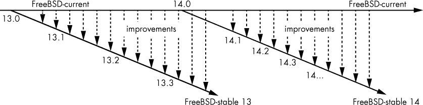

## 第十八章：升级 FreeBSD**


升级服务器可能是系统管理员日常工作中最让人头痛的任务。我可以应对桌面在升级后出现的不可解释的行为，但当我的整个组织或数百个客户依赖一台服务器时，甚至想动一下系统都会让我感到不安。任何操作系统的升级都可能让你增加越来越多的白发。即使是非常有经验的系统管理员，在面对升级一个关键系统的选择时，也经常需要坐下来仔细考虑自己的选择，这比用红热的针刺自己眼睛还要让人犹豫不决。虚拟化和编排的云系统可能看起来不那么麻烦，但即使如此，准备升级也会让人彻夜难眠。记住，尽管自动化带来了许多好处，但它在大规模实施时也可能是一条通往错误的捷径。

FreeBSD 的最大优势之一就是它的升级程序。FreeBSD 设计为一个整体操作系统，而不是一组软件包。（即使 FreeBSD 转向将基础系统提供为软件包，它仍然会保持整体设计和构建的方式。）我曾经让多个主机通过五个不同的主要版本和无数的修补级别，而无需重新安装系统。只有当 FreeBSD 系统老旧到硬件故障的风险让我晚上无法安睡时，我才会退役它们。^(1) 虽然我可能会担心操作系统上运行的应用程序，但即使是跨越主要版本的升级，现在也不再让我担心了。

### FreeBSD 版本

为什么升级 FreeBSD 是一件相对简单的事情？关键在于 FreeBSD 的开发方法。FreeBSD 是一个不断发展的操作系统。如果你在下午下载当前版本的 FreeBSD，它会和早上版本略有不同。来自世界各地的开发者不断添加更改和改进，这使得传统的严格发布版本号（常见于封闭软件）不再适用。在任何给定的时刻，你可以获得几种不同版本的 FreeBSD：发布版本、-stable、-current 和快照版本。

#### *发布版本*

FreeBSD 发布主要版本和次要版本。*主要版本*的版本号像 11.0、12.0、13.0 等等。每个主要版本都包含在早期版本中没有的大特性。大规模的更改仅出现在主要版本中。

*次要版本*是主要版本的更新版本。你会看到像 12.1-RELEASE、12.2-RELEASE、12.3-RELEASE 等次要版本。（大多数人会省略“release”这个词。）这些次要版本为主要版本添加了一些小功能和修复错误。你可能会得到新的功能或程序，但只有在这些新功能不会干扰现有功能的情况下。避免出现意外的、破坏性的更改。

你还会看到 *补丁级别*。多亏了 freebsd-update(8)，更新发布变得又快又容易。补丁号通常作为版本后的数字显示。这意味着你会看到类似 12.1-RELEASE-p20、11.4-RELEASE-p9、13.0-RELEASE-p31 等 FreeBSD 版本。

用户应通过逐步升级各个次版本来密切跟踪其主要版本，就像其他操作系统一样。

#### *FreeBSD-current*

FreeBSD-current，也叫做 *-current* 或 *HEAD*，是 FreeBSD 的最前沿版本，包含了首次公开发布的代码。尽管开发者有测试服务器，并在应用之前发布补丁供审核，但这仍然比 FreeBSD-current 的广泛用户群体的曝光要少得多。FreeBSD-current 是初步同行评审进行的地方；有时，current 会经历激烈的变化，给有经验的系统管理员带来头痛。

FreeBSD-current 为开发者、测试人员和感兴趣的各方提供，但它并不适用于一般用途。由于开发者根本没有时间在成千上万的紧急问题面前帮助用户修复他的网页浏览器，因此对 -current 用户问题的支持非常有限。用户需要帮助修复这些问题，或者耐心忍受，直到其他人修复它们。

更糟糕的是，-current 的默认设置包括各种调试代码、特殊警告和相关的开发者功能。这些都使得 -current 比任何其他版本的 FreeBSD 运行得更慢。你可以禁用所有这些调试功能，但如果这么做，你在遇到问题时将无法提交适当的故障报告。这意味着你将更加孤立无援。你可以查看 -current 系统中的文件 */usr/src/UPDATING* 以获取调试细节。

如果你不懂 C 语言和 shell 代码，不想调试操作系统，不喜欢计算机功能随机失败，或者只是不喜欢等到你的问题烦到能修复它的人的时候再被解决，那么 -current 可能不适合你。勇敢的人当然欢迎尝试 -current，就像任何愿意投入大量时间学习和调试 FreeBSD 的人，或者需要一课谦逊的人一样。你并不被禁止使用 -current；只是你要自己应对。FreeBSD-current 并不总是最前沿的，但有时它可能是那种“为什么我的手指突然变成了小小的晃动残肢？”的前沿。你已经被警告过了。

要运行 -current，你真的 *必须* 阅读 *FreeBSD-current@FreeBSD.org* 和 *svn-src-head@FreeBSD.org* 邮件列表。这些都是高流量的列表，每天有数百条警告、提醒和评论。如果你正在读这本书，你可能不应该在这些列表上发帖；只需阅读并学习。如果有人发现最新的文件系统补丁将硬盘变成了克苏鲁的僵尸爪牙，信息将会在这里发布。

##### -current 代码冻结

每 12 到 18 个月，FreeBSD-current 会经历一个月的*代码冻结*，在此期间不允许进行非关键性变更，所有已知的关键问题都在修复中。目标是稳定 FreeBSD 的最新版本，并打磨其粗糙的边角。在代码冻结结束（或稍后），-current 版本将成为新的 FreeBSD 主要版本的*.0*版本。例如，FreeBSD 12.0 曾经是-current 版本，FreeBSD 13.0 也是如此。当新的主要版本发布时，-current 版本号将递增。FreeBSD 17.0 的发布意味着-current 将被称为*FreeBSD 18*。

一旦.0 主要版本发布到公共环境中，开发工作就会分为两条路线：FreeBSD-current 和 FreeBSD-stable。

#### *FreeBSD-stable*

FreeBSD-stable（或简称* -stable*）是“普通用户的前沿技术”，包含了一些最新的同行评审代码。熟悉 Linux 的系统管理员知道-stable 是一个“滚动发布”。你会发现每个主要版本都有一个 FreeBSD-stable 版本。

一旦一段代码在-current 中经过彻底测试，它可能会被合并回-stable。-stable 版本是几乎任何时候都可以安全升级的版本；你可以把它当作 FreeBSD 的 beta 版本。

每年三到四次，发布工程团队会要求开发人员集中精力解决与-stable 版本相关的未解决问题，而不是进行重大变更。发布工程团队从这段代码中剪切出几个候选版本，并提供给公众进行测试。当 FreeBSD 团队对自己以及社区的测试结果满意时，最终的版本会被赋予一个发布编号。开发团队随后将注意力转回到他们的常规项目上。^(2)

这个过程如何在实践中运作呢？考虑 FreeBSD 13。当 13.0 发布时，开发人员将开始将 bug 修复和功能添加到 13-stable 版本中。希望帮助测试新 FreeBSD 版本的用户可以运行 13-stable。在合并功能并进行一些测试几个月后，13-stable 将变为 13.1。当 13.1 发布后，该开发路径会恢复为 13-stable。FreeBSD 13.1、13.2 和 13.3 只是 FreeBSD 13-stable 的连续版本。

FreeBSD-stable 预计是平稳且可靠的，几乎不需要用户的注意。

随着-stable 版本的老化，-stable 和-current 之间的差异会越来越大，直到必须从-current 分支出一个新的-stable 版本。旧的-stable 会在几个月内继续维护，而新的-stable 会进行完善。一些用户会立即升级到新的-stable 版本，而其他用户则会更为谨慎。在新-stable 发布一到两个版本后，旧的-stable 会被淘汰，开发人员会鼓励用户迁移到新版本。经过一段时间后，旧的 stable 将只接收关键的 bug 修复，最终会完全被废弃。你可以在图 18-1 中看到这一过程是如何运作的。



*图 18-1：FreeBSD 开发分支*

每个版本实际上应该有一个稍微拖曳到一侧的补丁级别尾部，但那样会使图表变得非常混乱。

FreeBSD-stable 的用户必须阅读* FreeBSD-stable@FreeBSD.org *邮件列表。虽然该邮件列表的流量适中，并且有一些本应在*-questions@*上进行的问答交换，但来自开发人员的重要信息通常会以“HEADS UP”开头。请留意这些邮件，它们通常意味着，如果你不知道某些更改，系统可能会让你的一天变得糟糕透顶。

**-STABLE 的稳定性**

*稳定*这个词描述的是代码库，而不是 FreeBSD 本身。从稳定分支上的某个随机点运行代码并不能保证你的系统会稳定，只能保证底层代码不会发生剧烈变化。API 和 ABI 预计保持不变。尽管开发人员会尽力确保-stable 保持稳定，但错误是有可能发生的。如果这种风险让你担忧，最好还是使用打过补丁的发布版本。

##### 从-当前合并

*从-当前（MFC）合并*这个短语意味着某个功能或子系统已经从 FreeBSD-current 回溯到 FreeBSD-stable（或者，在少数情况下，回溯到 errata 分支）。然而，并不是所有功能都会被 MFC。FreeBSD-current 的重点在于，它是进行重大变更的地方，而这些变更通常需要几个月的测试和调试。这些大的变更不能被回溯，因为它们会严重影响期望稳定代码库的-stable 用户。

有时，看似“显而易见的 MFC 候选项”的功能无法被合并。有时内核基础设施需要变更以支持新的驱动程序和功能，而这些基础设施无法安全地合并。需要这些基础设施的新驱动程序无法进行 MFC。这种情况通常发生在视频和无线网络驱动程序中。

选择性的新驱动程序、bug 修复和小的增强功能可以进行 MFC——但仅限于此。FreeBSD 项目特别强调不进行 MFC 大规模更改，以免破坏用户应用程序。

#### *快照*

每个月左右，FreeBSD 发布工程团队会发布-当前和-稳定版本的快照，并将其放到 FTP 站点上供大家下载。快照只是开发分支中的某些时间点，它们不会经过特殊的打包或测试。快照没有像正式发布版本那样的质量控制，它们的目的仅是作为那些有兴趣运行-当前或-稳定版本的用户的一个良好起点。质量控制相对有限，很多开发人员直到快照出现在 FTP 服务器上时才知道它的发布。你会发现 bugs，你会发现错误，你会遇到一些问题，可能会让你母亲的头发都白了，假设你还没有把她弄成那样。

#### *FreeBSD 支持模型*

随着 FreeBSD 11.0 的发布，项目的支持模式发生了变化，更加接近其他商业和非商业操作系统的使用模式。

每个主要版本将在首次发布后提供五年的安全性和稳定性补丁。如果 FreeBSD 13 于 2021 年 1 月 1 日发布，支持将于 2026 年 1 月 1 日结束。

每个小版本在下一个小版本发布后会得到三个月的支持。FreeBSD 12.3 的支持将在 FreeBSD 12.4 发布后三个月结束。这为你提供了三个月的时间来安排升级。

官方支持的失效并不意味着你不能继续运行不受支持的版本。然而，你需要检查每个安全公告，确定它是否影响你的环境，并创建自己的补丁。你最好还是进行升级。

FreeBSD 小版本发布的核心意义在于它们对系统的干扰最小。从 FreeBSD 12.3 升级到 12.4 应该类似于应用 Windows 更新或从 Centos 8.1 升级到 8.2。应用程序应继续正常运行。

一个版本的最后一个 FreeBSD 小版本将得到支持，并在五年内修复漏洞。如果 FreeBSD 12.5 是 FreeBSD 12 的最后一个版本，它将在发布 FreeBSD 12.0 后五年内提供安全补丁。

#### *测试 FreeBSD*

每个版本和发布的 FreeBSD 都经过各种方式的测试。个别开发者在自己的硬件上检查他们的工作，并相互请求对方进行复核。如果工作较为复杂，他们可能会使用官方的 FreeBSD Phabricator 系统（*[`reviews.FreeBSD.org/`](https://reviews.FreeBSD.org/)）或甚至私有的源代码仓库，在提交到 -current 之前将他们的工作提供给更广泛的社区进行检查。分析公司向 FreeBSD 团队捐赠了分析软件，使得源代码可以在持续的基础上自动进行审核、测试和调试，捕获许多错误，防止它们影响到实际用户。像 Sentex、EMC、Netflix 和 iX Systems 等公司为项目提供了测试支持。几位备受尊敬的 FreeBSD 开发者将测试工作作为项目的重点问题，他们目前已经拥有了自动化的 Kyua 测试框架。

然而，最终，一个只有几百个开发者的志愿者项目无法购买所有曾经生产过的计算机硬件，也无法在所有可能的负载下运行这些硬件。FreeBSD 项目作为一个整体，依赖于使用 FreeBSD 的公司和个人来进行软件测试。

最有价值的测试来自于那些拥有实际设备、实际测试平台和实际工作负载的用户。遗憾的是，大多数用户在进行测试时，只是在将发布 CD 插入计算机，运行安装程序并启动系统时进行测试。到那个时候，已无法对发布版本产生实际的帮助。你发现的任何 bug 可能对下一个版本有帮助，但在此期间，可能通过补丁解决你的问题。

解决方案显而易见——在发布之前，在你的实际工作负载上测试 FreeBSD。对新 -stable 版本的测试请求可以发送至 *FreeBSD-stable@FreeBSD.org*。通过测试 -stable 或 -current，你将从 FreeBSD 中获得更大的价值。

#### *你应该使用哪个版本？*

-current、-stable、release、snapshot——令人头晕。是的，这看起来很复杂，但它确保了特定的质量水平。用户可以放心，发布版经过了广泛的测试和同行评审，是尽可能可靠的。同样的用户知道，在 -stable 和 -current 中的炫酷新特性是可以使用的——如果他们愿意承担每个版本所固有的风险。那么，你应该使用哪个版本呢？以下是我的建议：

**生产环境**

如果你在生产环境中使用 FreeBSD，请安装最新的次版本发布。当下一个次版本发布出来时，进行升级。

**预发布**

如果你需要了解下一个 FreeBSD 次版本发布的内容以及它将如何影响你的生产环境，可以在你的预发布环境中跟踪 -stable。

**测试**

这里的问题是你希望测试什么。项目方希望在 -current 和 -stable 上都进行测试。如果你不确定，从运行 -stable 开始。

**开发**

操作系统开发者、闲得无聊且缺乏刺激的人，以及彻底的傻瓜应该运行 -current。当 -current 摧毁了你的 MP3 收藏时，调试问题并提交修复补丁。

**爱好**

如果你是爱好者，可以运行任何版本！只是要记住你选择的分支的局限性。如果你刚开始学习 Unix，我建议使用 -release。等你熟悉了，再升级到 -stable。虽然 -current 比 20 年前更加稳定，但如果你觉得系统崩溃带来的肾上腺素激增能让你的一天更有趣，那就选择它吧。那些运行 -current 的高风险玩家欢迎志同道合的伙伴。

### 升级方法

FreeBSD 提供两种升级方式：二进制更新和从源代码构建。

FreeBSD 支持通过 freebsd-update(8) 进行 *二进制更新*。这与 Windows、Firefox 和其他商业软件提供的二进制更新服务非常相似。（软件作者表示，freebsd-update(8) 是以 Windows Update 命名的。）你可以使用 FreeBSD Update 来升级主要版本、次版本和补丁级别。

从源代码升级意味着下载 FreeBSD 源代码，构建组成 FreeBSD 的程序，并将它们安装到你的硬盘上。例如，如果你有 FreeBSD 13.1 的源代码，你可以升级到该版本。这需要更多的设置和使用工作，但它为你提供了更大的灵活性。当跟踪 -stable 或 -current 时，使用从源代码升级。

**保护你的数据！**

第五章被称为“在破坏其他东西之前请阅读！”是有充分理由的。升级可能会破坏你的数据。在尝试任何形式的升级之前，请备份你的系统！我每周都会升级我的桌面，纯粹是为了娱乐（参见我之前关于肾上腺素瘾君子跑 -current 的评论）。但在升级之前，我会确保所有重要数据已安全地缓存到另一台机器上。将数据备份到磁带、文件或其他地方，但不要在没有新备份的情况下进行升级。已经警告过你了。

### 二进制更新

许多操作系统提供二进制更新，用户可以下载操作系统的新二进制文件。FreeBSD 通过 freebsd-update(8)提供类似的程序，允许你轻松地升级系统。^(3) 你不能使用 freebsd-update(8)跟踪-stable 或-current，只能跟踪发布版本。例如，如果你安装了 FreeBSD 12.0，freebsd-update(8)可以将你升级到 12.0-p9、12.1 或 13.0，但不能升级到 12-stable 或 14-current。

如果你使用的是自定义内核，你必须从源代码构建内核更新，而不是依赖于更新服务。同样，如果你从源代码升级了主机（本章稍后讨论），运行 freebsd-update(8)将会用默认的二进制文件覆盖你自定义的二进制文件。

在*/etc/freebsd-update.conf*中配置更新。

#### */etc/freebsd-update.conf*

使用 freebsd-update(8)进行更新旨在为普通用户提供无缝体验，因此很少建议更改其配置。然而，你可能会遇到特殊情况，下面是你在此文件中会找到的最有用选项：

KeyPrint 800...

`KeyPrint`列出了更新服务的加密签名。如果 FreeBSD Update 服务遭到安全漏洞，FreeBSD 项目需要修复漏洞并发布新的加密密钥。在这种情况下，漏洞将通过安全公告邮件列表发布（并且在 IT 界也会成为重大新闻）。换句话说，正常使用中没有理由更改此项。（构建自定义的 FreeBSD 并通过 freebsd-update(8)分发，尽管可能且实际可行，但被认为是异常使用。）

ServerName update.freebsd.org

`ServerName`告知 freebsd-update(8)从哪里获取更新。虽然 FreeBSD 项目确实提供了构建自己更新的工具，但实际上没有必要这样做。如果你有足够多的服务器来考虑建立自己的更新服务器，那么你可能也有一个代理服务器，可以缓存官方更新。

组件 src world kernel

默认情况下，FreeBSD Update 提供 */usr/src* 中的源代码、用户空间（world）和 GENERIC 内核的最新补丁。然而，你可能不需要所有这些组件。虽然用户空间是必须的，但你可能有一个自定义内核。删除内核声明可以让 freebsd-update(8) 忽略内核。自定义内核用户还可以将 GENERIC 内核复制到 */boot/GENERIC*。更新将更新 GENERIC 内核，但不会更改你的自定义内核。或者，你可以删除 `kernel` 条目，从而避免警告。如果你没有在机器上安装源代码，freebsd-update 会意识到这一点，并且不会尝试打补丁，但你也可以删除 `src` 条目，省去软件的麻烦。你还可以选择只接收源代码更新的部分内容，正如 freebsd-update.conf(5) 中所述。

UpdateIfUnmodified /etc/ /var/ /root/ /.cshrc /.profile

更新包括对 */etc* 中配置文件的更改。然而，如果你修改了这些文件，你可能不希望 freebsd-update(8) 覆盖它们。同样，*/var* 是非常动态的，设计上便于系统管理员定制；你不希望 FreeBSD Update 改动你的设置。FreeBSD Update 只会在文件自默认值未更改的情况下，将补丁应用于 `UpdateIfUnmodified` 中列出的目录。

MergeChanges /etc/ /boot/device.hints

更新到新版本可能会更改配置文件。更新过程将为你提供机会将更改合并到出现在 `MergeChanges` 位置的文件中。

MailTo root

如果你计划运行 FreeBSD Update（如本章后面所述），freebsd-update(8) 会将结果通过邮件发送到 `MailTo` 中列出的账户。

KeepModifiedMetadata yes

也许你已经修改了系统文件或命令的权限或所有者。你可能不希望 freebsd-update(8) 将这些权限恢复为默认。设置 `KeepModifiedMetadata` 为 `yes` 后，freebsd-update(8) 将保持你的自定义权限和所有权不变。

查看 freebsd-update.conf(5) 以了解更多选项。

#### *运行 freebsd-update(8)*

使用二进制更新更新系统分为两个阶段：下载更新和应用更新。如果你应用的是补丁，或者跨越大版本，过程会略有不同。

如果你使用 ZFS，升级或打补丁之前一定要创建一个新的启动环境！

##### 更新到最新的补丁级别

要下载最新的补丁到你选择的版本，运行 `freebsd-update fetch`。在这里，我正在将一台 FreeBSD 11.0 主机更新到最新的补丁级别。

```
# freebsd-update fetch
```

你将看到程序查找下载源的补丁，比较这些下载源的加密密钥，最终将补丁下载到 */var/db/freebsd-update* 中。检查系统可能需要几分钟，具体取决于存储设备的速度。

偶尔，你会看到类似如下的消息：

```
   The following files will be removed as part of updating to 11.0-RELEASE-p12:
➊ /boot/kernel/hv_ata_pci_disengage.ko
➋ /usr/share/zoneinfo/America/Santa_Isabel
➌ /usr/share/zoneinfo/Asia/Rangoon
```

我们正在更新一个 .0 版本，即一个主要 FreeBSD 版本的第一个版本，直接更新到 11.0-RELEASE-p12，因此有一些累计的补丁。为什么这样的补丁集会先删除文件呢？

时区文件相对简单。在 FreeBSD 11.0 发布到现在之间，Santa Isabel ➋ 和 Rangoon ➌ 的时区发生了变化。可惜的是，各国并没有与 FreeBSD 发布同步调整时区。从系统中删除这些时区能简化这些国家系统管理员的工作，而不会影响我们其他人。

但他们也在移除一个内核模块 ➊。为什么会发生这种情况？稍作研究 FreeBSD 邮件列表可以发现，这个模块本不应该随着 11.0 发布，*而且*你*真的*不应该使用它。这类变更很少见，但在一个主要发布后的不久有时会发生。

接着你会看到作为该补丁集一部分的新增文件（如果有的话）。

```
The following files will be added as part of updating to 11.0-RELEASE-p12:
/usr/share/zoneinfo/Asia/Barnaul
/usr/share/zoneinfo/Asia/Famagusta
/usr/share/zoneinfo/Asia/Tomsk
--snip--
```

看来仰光的系统管理员这个夏天非常忙。

几乎所有的补丁都会修改系统上的现有文件。接下来你会看到这些。

```
The following files will be updated as part of updating to 11.0-RELEASE-p12:
/bin/freebsd-version
/boot/gptboot
/boot/gptzfsboot
/boot/kernel/cam.ko
/boot/kernel/hv_storvsc.ko
--snip--
```

如果你的版本接近生命周期结束，你会看到这样的通知：

```
WARNING: FreeBSD 11.0-RELEASE-p1 is approaching its End-of-Life date.
It is strongly recommended that you upgrade to a newer
release within the next 1 month.
```

如果该版本已经过了生命周期结束，通知会变得更加... 强调。

要安装下载的文件，运行 `freebsd-update install`：

```
# freebsd-update install
Installing updates... done.
```

如果更新还需要其他步骤，你将在这里看到它们。重启系统后，你将看到自己运行的是最新的补丁版本。

##### 更新发布版本

这台 FreeBSD 11.0-p12 机器已接近生命周期结束？让我们使用 `freebsd-update upgrade` 更新它。用 `-r` 标志指定目标版本。

```
# freebsd-update -r 11.1-RELEASE upgrade
```

最难的部分是记住 -RELEASE 是版本名称的一部分。

升级会检查你的系统并呈现其结论。

```
The following components of FreeBSD seem to be installed:
kernel/generic world/base world/lib32

The following components of FreeBSD do not seem to be installed:
kernel/generic-dbg world/base-dbg world/doc world/lib32-dbg

Does this look reasonable (y/n)? y
```

还记得安装过程中，你选择了哪些 FreeBSD 组件来设置新主机吗？这就是 freebsd-update 在检查的内容。不过，你可能添加或移除了某些组件，所以请查看一下列表。如果看起来没问题，按 y 继续。

更新会更仔细地审查系统，将现有文件与新版本进行比较，然后开始下载。

```
Fetching 10697 patches.....10....20....30....40....50....60....70....80....90
```

去泡杯茶吧。根据你主机的带宽，应该能在返回后看到：

```
Applying patches...
```

你的茶可能太烫了，让它冷却一下吧。

```
Fetching 236 files...
```

还要下载更多内容？没问题，享受你的茶，看看程序怎么运行吧。

```
Attempting to automatically merge changes in files... done.

The following files will be removed as part of updating to 11.1-RELEASE-p1:
/usr/include/c++/v1/__undef___deallocate
/usr/include/c++/v1/tr1/__undef___deallocate
/usr/include/netinet/ip_ipsec.h
--snip--
```

你可以查阅邮件列表存档和 FreeBSD 源代码树，了解每个文件被删除的原因。

小版本将包含从 -current 回移植的新特性。那些可能涉及将文件添加到系统中。

```
The following files will be added as part of updating to 11.1-RELEASE-p1:
/boot/kernel/amd_ecc_inject.ko
/boot/kernel/bytgpio.ko
/boot/kernel/cfiscsi.ko
/boot/kernel/cfumass.ko
--snip--
```

这些新功能不应干扰现有功能，但浏览一下列表可能会让你发现一些有趣的内容。

升级应该会改变系统中的几乎所有文件，接下来我们会看到这一点。

```
The following files will be updated as part of updating to 11.1-RELEASE-p1:
/.cshrc
/.profile
/COPYRIGHT
/bin/
/bin/cat
--snip--
```

最终你会看到：

```
To install the downloaded upgrades, run "/usr/sbin/freebsd-update install".
```

你是谁，居然敢忽视指令？

到目前为止，更新过程只下载了文件并在临时暂存区进行了比较，操作系统并没有受到影响。如果你觉得可以继续操作，运行安装程序。

```
# freebsd-update install
src component not installed, skipped
Installing updates...
Kernel updates have been installed.  Please reboot and run
"/usr/sbin/freebsd-update install" again to finish installing updates.
```

为什么在更新的不同阶段之间需要重启？新的用户空间程序可能需要新的内核功能。安装一个不可用的`reboot`命令会导致你需要断电重启主机，这会让你的技术卡片丢脸。

```
# reboot
```

一旦机器重新启动，完成用户空间升级。

```
# freebsd-update install
src component not installed, skipped
Installing updates...
Completing this upgrade requires removing old shared object files.
Please rebuild all installed 3rd party software (e.g., programs
installed from the ports tree) and then run "/usr/sbin/freebsd-update 
install" again to finish installing updates.
```

这是什么疯狂的操作？

更新过程会尽力避免留下损坏的系统或功能失常的软件。如果`freebsd-update`移除了旧版本的共享库，这些库是你附加软件所需的，那么这些软件将无法运行。此时更新会暂停，给你机会升级软件。我们将在本章稍后讨论如何升级软件包和端口。沿着-stable 分支的升级通常不需要删除旧的无用文件。

这次`freebsd-update`的操作移除了旧的共享库等。

```
# freebsd-update install
```

升级现在已经完成。就像每次进行大规模系统维护时一样，最后再重启一次，确保一切能正常启动。

#### *回滚更新*

你以为升级会很顺利，之前每次都很顺利。但这次，你错了。新补丁和你软件之间的某些微妙交互让你遇到了麻烦。如果你正在使用启动环境，现在是时候恢复到之前的安装了。如果没有使用启动环境，请使用`freebsd-update`的`rollback`命令移除最近安装的升级。

```
# freebsd-update rollback
Uninstalling updates... done.
```

回滚比安装补丁要快得多。无需检查系统；`freebsd-update`只需读取之前操作的日志并撤销所有更改。

#### *安排二进制更新*

最佳实践是定期在固定的时间下载和应用更新，比如每月的维护日。`freebsd-update`程序提供了专门的支持，避免每小时定时向下载服务器发送请求。`freebsd-update cron`命令会告诉系统在接下来的一个小时内随机时间下载更新。将此命令放在*/etc/crontab*文件中，就可以在这个一小时的窗口内下载更新。这有助于减少下载服务器的负载。系统有更新时，你会收到一封电子邮件，这样你就可以在方便的时候安排重启。

#### *优化和自定义 FreeBSD 更新*

关于 FreeBSD 更新，有两个常见的问题：自定义构建的 FreeBSD 版本和本地分发更新。

许多人为内部使用构建自己的 FreeBSD 版本。通常，这只是删除了一些部分的 FreeBSD 版本，但一些公司会进行广泛的修改。如果你从 FreeBSD 安装中删除了文件，`freebsd-update(8)`将不会尝试修补这些文件。

类似地，许多公司喜欢为补丁管理设置内部更新服务器。FreeBSD Update 系统专门设计用于与缓存 Web 代理配合工作。尽管所有文件都经过加密签名并验证，但它们通过普通 HTTP 传输，以便你的代理可以对其进行缓存。

### 通过源代码升级

另一种更新系统的方式是从源代码构建它。FreeBSD 是*自托管的*，这意味着它包含了构建 FreeBSD 所需的所有工具。你不需要安装任何编译器或开发工具包。构建一个新的 FreeBSD 系统所需要的唯一条件是更新的源代码。

当开发者发布 FreeBSD 的改进时，这些更改会在几分钟内全球范围内可用。FreeBSD 主源代码服务器跟踪源代码、所有对该代码所做的更改以及这些更改的作者。开发者可以提交新的代码，用户可以通过*Subversion (SVN)*检出最新版本。FreeBSD 有一个简单的 SVN 客户端 svnlite(1)，足以处理所有源代码操作。这是一个没有 svn(1)支持的复杂选项的标准 Subversion 客户端。许多人发现 svnlite(1)足够满足他们所有非 FreeBSD 的 Subversion 需求。

**CSUP、CVSUP、CVS、SUP 和 CTM？**

不幸的是，互联网上的文档通常会长时间存在，并在最糟糕的时刻引发混乱。复生的 FreeBSD 文档和第三方教程可能会提到使用名为*CVS*或*CVSup*的工具进行源代码更新。这些工具在 2013 年被取代。任何提到这些程序的地方都表明你在阅读旧文档。如果你看到提到 CTM，那么你正在阅读比 CVS 更早的文档。^([4)

升级源代码需要控制台访问。你并不总是需要它，但从一个坏的构建恢复可能需要在键盘上进行干预。在安装自建操作系统版本之前，请测试你的串口控制台、Java 应用程序或 IPMI 控制台。根据我的经验，唯一需要控制台访问的升级是那些我没有控制台访问的情况。

#### *哪个源代码？*

每个 FreeBSD 版本都附带用于构建你正在安装的系统的源代码。如果你在安装系统时没有选择安装源代码，你会在安装介质的*/usr/freebsd-dist/src.txz*找到它。如果你安装了源代码，你会在*/usr/src*找到它。

不幸的是，这个版本的源代码缺少构建 FreeBSD 所需的版本控制标签。它仅供参考。你需要使用 svnlite(1)下载一个带有这些标签的代码版本。

你在*/usr/src*的源代码副本是否适合构建 FreeBSD？请询问 svnlite(1)。

```
# svnlite info /usr/src
svn: E155007: '/usr/src' is not a working copy
```

“不是工作副本”错误意味着这里的任何源代码都不能与 Subversion 一起使用。

获取源代码的 svnlite(1)命令如下。

```
# svnlite checkout ➊svn.freebsd.org/➋repository/➌branch ➍localdir
```

镜像 ➊ 是一个 FreeBSD Subversion 镜像。镜像 *svn.FreeBSD.org* 是一个地理路由别名，指向最近的 Subversion 镜像。

仓库 ➋ 是你正在使用的代码组。你可以在 *[`svnweb.FreeBSD.org/`](https://svnweb.FreeBSD.org/)* 上获取当前仓库的完整列表。主要的项目仓库包括 *base*（操作系统），*doc*（文档）和 *ports*（Ports 集合）。

分支 ➌ 是你想要的 FreeBSD 版本。对于最新的短指头 -current，使用 *head*。要获取稳定版本，使用分支 *stable/* 后跟主版本号。FreeBSD 12-stable 就是 *stable/12*。要获取一个版本及其所有当前补丁，使用 *releng/* 和发布号。完全打补丁的 FreeBSD 12.2 位于 *releng/12.2*。

如果你不确定需要哪个分支，可以浏览 *[`svnweb.freebsd.org/`](https://svnweb.freebsd.org/)*。分支实际上告诉 svnlite(1) 从这个站点获取哪个子目录。

最后，localdir ➍ 是我希望放置源代码的本地目录。

这台主机运行的是 FreeBSD 11.1。我想要尝试升级到 FreeBSD 11-stable。以下是我将怎么做：

```
# svnlite checkout https://svn0.us-east.FreeBSD.org/base/stable/11 /usr/src/
Error validating server certificate for 'https://svn0.us-east.freebsd.org:443':
 - The certificate is not issued by a trusted authority. Use the
   fingerprint to validate the certificate manually!
Certificate information:
 - Hostname: svnmir.ysv.FreeBSD.org
 - Valid: from Jul 29 22:01:21 2013 GMT until Dec 13 22:01:21 2040 GMT
 - Issuer: svnmir.ysv.FreeBSD.org, clusteradm, FreeBSD.org, CA, US(clusteradm@FreeBSD.org)
 - Fingerprint: 1C:BD:85:95:11:9F:EB:75:A5:4B:C8:A3:FE:08:E4:02:73:06:1E:61
(R)eject, accept (t)emporarily or accept (p)ermanently? p
```

这是什么新鲜的疯狂事？我们尝试获取 FreeBSD 源代码，结果却遇到了证书错误？

将显示的证书指纹与 FreeBSD.org 网站上的服务器指纹进行比较。如果匹配，输入 p 永久接受证书。源代码文件的文件名将在你的终端上滚动显示。

一旦 svnlite(1) 完成，查看 */usr/src*。

```
# ls /usr/src/
COPYRIGHT               cddl                    sbin
LOCKS                   contrib                 secure
MAINTAINERS             crypto                  share
Makefile                etc                     sys
Makefile.inc1           gnu                     targets
Makefile.libcompat      include                 tests
ObsoleteFiles.inc       kerberos5               tools
README                  lib                     usr.bin
README.md               libexec                 usr.sbin
UPDATING                release
bin                     rescue
```

这是 FreeBSD 源代码树的顶级目录，包含构建你选择的 FreeBSD 版本所需的所有代码。

#### *更新源代码*

所以你昨天构建了 FreeBSD？很酷。但现在你想要构建今天的版本。

好消息是，Subversion 只需要更新你已经下载的代码，而不是重新下载整个源代码树。更好的消息是，源代码会记录你从哪里获取它，以及它应该属于哪个分支，这些信息存储在 *.svn* 目录中。这使得更新比初始下载要简单得多。

FreeBSD 已经将 Subversion 命令集成到源代码中。你需要做的就是告诉系统，它可以通过设置 SVN_UPDATE 在 */etc/src.conf* 中调用 svnlite(1) 来更新。

```
# echo 'SVN_UPDATE=yes' >> /etc/src.conf
```

现在运行 make update 来获取最新的源代码。

```
# cd /usr/src
# make update
```

你会看到相同类型的更新流过。尽管这些更新会比最初的下载速度快得多。

### 从源代码构建 FreeBSD

一旦你拥有最新的源代码，查看*/usr/src/UPDATING*文件。该文件的开头按时间倒序列出了与 FreeBSD 变更相关的任何警告和特别通知，这些内容对从源代码构建的人尤为重要。这些说明会告诉你在重建系统之前是否需要采取任何特别的操作，或者系统的主要功能是否发生了变化。如果你希望在升级后系统能够正常工作，请严格按照这些说明操作。

*UPDATING*文件的末尾给出了从源代码构建 FreeBSD 的官方说明。本书中描述的过程自 FreeBSD 6-current 以来一直在使用，虽然与 5-current 相比仅有些微变化，但我仍然建议你将本书中的说明与*UPDATING*中的说明进行核对。

如果你使用自定义内核，还需要检查新的 GENERIC 或 NOTES 内核配置文件，查看是否有新的选项或有趣的内核变更。

**自定义你的 FreeBSD 构建**

还记得在第十六章中我们讨论过*/etc/make.conf*吗？FreeBSD 使用一个单独的文件来处理构建 FreeBSD 自身的自定义设置。虽然*/etc/make.conf*中的设置会影响系统上构建的所有软件，但*/etc/src.conf*中的任何内容只会影响从源代码构建 FreeBSD。

如果你在 FreeBSD 社区呆一段时间，你会听到各种关于人们用来构建 FreeBSD 的特殊方法的故事。你会听到一些非正式的证据，声称某种方法比标准方法更快、更高效，或者在某种神秘的方式上“更好”。虽然你当然可以自由选择任何你喜欢的构建方法，但 FreeBSD 项目唯一支持的方法是*/usr/src/UPDATING*文件末尾所记录的方法。如果你采用其他程序并遇到问题，你将被引导回文档中记录的程序。

#### *构建世界*

首先，构建新的用户环境：

```
# cd /usr/src
# make buildworld
```

`make buildworld`命令从源代码构建构建系统编译器所需的基本工具，然后构建编译器及其相关库。最后，它使用新工具、编译器和库来构建 FreeBSD 核心安装中包含的所有软件。（这就像在开始构建一辆车时，指令是“从地下挖出铁矿石。”）`buildworld`将其输出放在*/usr/obj*目录下。根据你的硬件，它可能需要从一小时到几个小时的时间。如果你的硬件足够强大，`buildworld`运行时你可以继续正常工作；尽管构建过程中会消耗系统资源，但它不会占用你的注意力。

当`buildworld`完成后，确认它没有错误地完成。如果构建结束时显示了类似内核编译失败时的错误信息，不要继续进行升级。如果你无法弄清楚为什么构建失败，去第一章查看如何获得帮助。绝不要尝试安装损坏或不完整的升级版本。

**并行构建世界**

经验丰富的系统管理员可能已经使用过 make(1) 的 `-j` 标志来提高构建速度。这会启动多个构建进程，并允许系统利用多个 CPU。如果你有一个多 CPU 系统，或者你的 CPU 有多个核心，使用 `-j` 在构建 FreeBSD 时是可行的。一个合理的启动构建进程数是比你的 CPU 数量多一个。例如，如果你有一个八核处理器，你可以通过运行 `make -j9 buildworld && make -j9 kernel` 来合理地使用九个构建进程。

FreeBSD 项目官方并不支持 `-j` 用于升级，尽管许多开发者使用它。如果在使用 `-j` 时构建失败，在抱怨之前请尝试去掉 `-j`。

#### *构建、安装并测试内核*

测试升级的最佳方法是构建一个新的 GENERIC 内核。这可以将自定义内核中的问题与 FreeBSD 的通用问题分开。冲动的用户当然可以直接升级到他们的自定义内核配置，但如果你的内核失败了，你需要尝试使用 GENERIC 内核。请确保比较你的自定义内核与新的 GENERIC 配置，以便捕捉到任何自定义设置所需的修改。你可以使用 Subversion 历史记录在 *[`svnweb.FreeBSD.org/`](https://svnweb.FreeBSD.org/)* 上对比不同版本的内核配置。

默认情况下，内核升级过程会构建一个 GENERIC 内核。如果你想直接升级到自定义内核，可以使用变量 `KERNCONF` 告诉 make(1) 内核的名称。你可以在命令行、*/etc/make.conf* 或 */etc/src.conf* 中设置 `KERNCONF`。

你可以通过两种方式构建一个新的内核。`make buildkernel` 命令会构建一个新的内核，但不会安装它。你可以在运行 `make buildkernel` 后，接着运行 `make installkernel` 来安装内核。`make kernel` 命令会在执行时同时运行这两个命令。选择最适合你计划的方式。例如，如果我在工作中进行系统升级，并且是在周日的维护窗口进行，我可能会在前一周运行 `make buildworld` 和 `make buildkernel` 来节省几个小时的宝贵周末时间。但我不想在维护日之前安装该内核——如果机器在周五出现问题并需要重启，我想启动旧的生产内核，而不是新的升级内核。周日早上，当我准备好进行升级时，我会运行 `make installkernel`。另一方面，当升级我的桌面系统时，使用 `make kernel` 是更有意义的。因此，要使用我的自定义内核进行升级，我会运行：

```
# make KERNCONF=THUD kernel
```

同样，请不要尝试安装未成功编译的内核。如果你的 `make buildkernel` 出现错误并中断，请在继续之前先解决该问题。

安装了新内核后，重新启动计算机进入单用户模式。为什么要单用户模式？用户空间可能期望与新内核提供的不同的内核接口。虽然*/usr/src/UPDATING*应列出所有这些内容，但没有文档可以涵盖所有可能的更改及其对第三方软件的影响。这些更改在-stable 上很少发生，但在-current 上却是不可预测的。如果每周更新主机，则您的用户空间可能在新内核上出现问题。如果您一年没有更新主机，那么所有变更将同时被推送给您。虽然许多人可以在完全多用户模式下安装升级，但单用户模式是最安全的选择。

如果您的系统在新内核的单用户模式下运行正常，请继续。否则，请完全记录问题并启动旧内核以恢复服务，同时解决问题。

#### *准备安装新世界*

当心，小虫子！这是无法回头的时刻。您可以轻松地回退到一个糟糕的内核——只需启动较旧的、已知良好的内核即可。一旦安装了新构建的世界，您将无法撤销，除非从备份中恢复或使用 ZFS 引导环境。在继续之前，请确认您有一个良好的备份，或者至少认识到第一个不可逆转的步骤正在发生。

如果新内核运行正常，请继续安装您刚刚构建的用户空间。首先确认您的系统能够安装新的二进制文件。每个新版本的 FreeBSD 都希望旧系统支持新版本所需的所有必要用户、组和权限。如果一个程序必须由特定用户拥有而该用户在系统上不存在，则升级将失败。这就是 mergemaster(8)的用武之地。

##### mergemaster(8)

mergemaster 程序将现有的配置文件在*/etc*下与*/usr/src/etc*中的新文件进行比较，突出显示它们之间的差异，并为您安装它们，将它们设置为评估的一部分，甚至允许您将两个不同的配置文件合并为一个。在升级过程中，这非常有用。您在安装新世界之前运行一次 mergemaster 以确保系统能够安装新的二进制文件，并在安装新世界后再运行一次以使*/etc*的其余部分与新世界同步。

以 mergemaster(8)的 prebuildworld 模式开始，使用`-Fp`标志。`-F`标志自动安装仅通过版本控制信息不同的文件。`-p`标志比较*/etc/master.passwd*和*/etc/group*，并突出显示任何必须存在以使`installworld`成功的帐户或组。

```
  # mergemaster -Fp

➊  *** Creating the temporary root environment in /var/tmp/temproot
   *** /var/tmp/temproot ready for use
➋  *** Creating and populating directory structure in /var/tmp/temproot

   *** Beginning comparison
```

这些初始消息，均以三个星号开头，是 mergemaster 在解释其操作。我们从临时根目录 ➊ */var/tmp/temproot* 开始，这样 mergemaster 就可以安装一组原始的配置文件 ➋ 以便与已安装的文件进行比较。之后，mergemaster 展示了第一次比较。

```
➊   *** Displaying differences between ./etc/group and installed version:

  --- /etc/group  2017-09-01 11:12:49.693484000 -0400
  +++ ./etc/group 2017-09-01 13:22:15.849816000 -0400
  @@ -1,6 +1,6 @@
➋  -# $FreeBSD: releng/11.1/etc/group 294896 2016-01-27 06:28:56Z araujo $
➌  +# $FreeBSD: stable/11/etc/group 294896 2016-01-27 06:28:56Z araujo $
    #
➍  -wheel:*:0:root,mwlucas
➎  +wheel:*:0:root
    daemon:*:1:
    kmem:*:2:
    sys:*:3:
  @@ -33,4 +33,3 @@
    hast:*:845:
    nogroup:*:65533:
    nobody:*:65534:
➏  -mwlucas:*:1001:
```

一个重要的信息是正在对比的文件，mergemaster 会在前面显示文件名 ➊。我们正在检查已安装系统中的*/etc/group*，并与新的*/etc/group*进行对比。

然后，我们看到两个不同版本的文件进行对比，首先是已安装的文件 ➋，其次是升级后的文件 ➌。注意这些行前的减号和加号。减号表示该行来自当前已安装的文件，而加号表示该行来自*/usr/src*中的版本。

这一点在 mergemaster 显示的接下来的两行中得到了很好的说明。第一行带有减号的组是当前的 wheel 组 ➍。第二行是出厂升级的密码条目 ➎。这个主机的 wheel 组包含了一个不在默认安装中的用户。我想保留我的账户在其中。

在列表的最后，有一个前面带有减号的组 ➏。这个组存在于本地系统中，但不在源代码中。这是完全正常的。

这些更改与本次无关。

一旦 mergemaster 显示完所有这些文件中的更改，它会显示我的选项。

```
  Use 'd' to delete the temporary ./etc/group
  Use 'i' to install the temporary ./etc/group
  Use 'm' to merge the temporary and installed versions
  Use 'v' to view the diff results again

  Default is to leave the temporary file to deal with by hand

How should I deal with this? [Leave it for later] d
```

我有四个选择。我可以使用`d`删除临时的*/etc/group*。如果我想抛弃当前配置并直接从源代码安装一个新配置，我可以使用`i`安装。如果我需要旧版和新版的一部分内容，我可以使用`m`。如果我没注意到变化，我可以使用`v`再次查看对比。

新的*/etc/group*没有我需要的更改。我删除它，让 mergemaster 继续处理下一个文件，*/etc/passwd*。

mergemaster 显示的密码文件开始时与组文件类似。是的，root 密码已经更改——我希望是这样！我的账户有一个额外的条目。但在显示的中间，有一个这样的条目：

```
   _pflogd:*:64:64::0:0:pflogd privsep user:/var/empty:/usr/sbin/nologin
➊ +_dhcp:*:65:65::0:0:dhcp programs:/var/empty:/usr/sbin/nologin
   uucp:*:66:66::0:0:UUCP pseudo-user
```

用户 _dhcp ➊的行前面带有加号，并且没有对应的带减号的 _dhcp 条目。用户 _dhcp 存在于下载的源代码中，但不在当前运行的系统中。如果新用户出现在默认的 FreeBSD 配置中，那是因为新系统中的程序或文件期望由该用户拥有。

如果这个用户不存在，安装新版本将失败。

我不能替换当前的*/etc/passwd*，因为它包含了活动用户账户。我也不能丢弃新的*/etc/passwd*，因为它包含了我需要的用户。我想我必须将这两个文件合并在一起。

```
How should I deal with this? [Leave it for later] m
```

合并文件时，mergemaster 会将你的命令窗口一分为二，显示 sdiff(1)。左侧显示当前已安装文件的开头，而右侧显示新版文件。只有不同的部分会显示。选择你希望保留在新*master.passwd*文件中的部分。

```
# $FreeBSD: releng/11.1/etc/master.passwd 299 | # $FreeBSD: stable/11/etc/master.passwd 29936
```

这一行显示了 */etc/passwd* 文件两份副本的版本控制信息。左侧是 releng/11.1 分支中的文件版本，即 11.1；右侧是 stable/11 分支中的文件版本，即 11-stable。未来的 mergemaster 运行将使用版本信息（以及其他工具）来确定文件是否需要更新，因此我们的合并文件需要正确的版本号。请选择左侧（`l`）或右侧（`r`）列。我想要右侧的条目，所以我输入 `r`。

Mergemaster 显示下一个差异。

```
root:$6$fD7a5caQtkZbG93E$wGfw5G2zNORLq8qxlT8z | root::0:0::0:0:Charlie &:/root:/bin/csh
```

我已经更改了我的 root 密码，并且希望保留它。输入 l 以保留左侧版本。

```
                                              > _dhcp:*:65:65::0:0:dhcp programs:/var/empty:/
```

在下一个示例中，当前文件中没有 _dhcp 用户，而新文件中有。我们需要 _dhcp 用户来完成 `installworld`，因此输入 r 选择右侧条目，并获取下一个差异。

```
mwlucas:$1$zxU7ddkN$9GUEEVJH0r.owyAwU0NFX1:10 <
```

这是我的账户。如果我想在升级后以自己身份登录，我最好输入 l。

一旦我们浏览完文件中的每个差异，mergemaster 将展示我们的下一个选择：

```
  Use 'i' to install merged file
  Use 'r' to re-do the merge
  Use 'v' to view the merged file
  Default is to leave the temporary file to deal with by hand

    *** How should I deal with the merged file? [Leave it for later]
```

查看合并后的文件总是个好主意，除非你已经知道自己搞砸了，并且想重新做一遍。用 v 查看合并后的文件，如果看起来正确，就用 i 安装它。

```
*** You installed a new master.passwd file, so make sure that you run
    '/usr/sbin/pwd_mkdb -p /etc/master.passwd'
     to rebuild your password files

    Would you like to run it now? y or n [n]y
```

只有当你希望新的用户账户生效时，才需要重建密码数据库。输入 y。

你现在可以安装你的新用户空间。

#### *安装世界*

仍在单用户模式下，你可以使用 `make installworld` 安装全新的 FreeBSD。你会看到大量消息滚动屏幕，主要包括 *install* 这个词。

```
# cd /usr/src
# make installworld
```

你现在拥有了新的用户空间，与全新的内核一起。恭喜！

##### 过时的文件

然而，仅仅安装所有新程序还不够。更新可能会从基础系统中删除程序和文件。要查看哪些文件已经过时，可以运行 `make check-old`。

```
# make check-old
>>> Checking for old files
/usr/include/sys/ksyms.h
/usr/lib/clang/4.0.0/include/sanitizer/allocator_interface.h
/usr/lib/clang/4.0.0/include/sanitizer/asan_interface.h
/usr/lib/clang/4.0.0/include/sanitizer/common_interface_defs.h
--snip--
```

这将列出系统中曾经安装但现在不再需要的每一部分。确认你不再使用这些程序；如果仍在使用，可以保留现有的不受支持的程序或寻找替代方案。

稍后，你会看到现在已经过时的共享库：

```
>>> Checking for old libraries
/lib/libzfs.so.2
/usr/lib/debug/lib/libzfs.so.2.debug
/usr/lib/libarchive.so.6
/usr/lib/debug/usr/lib/libarchive.so.6.debug
/usr/lib/libmilter.so.5
--snip--
```

最后，你可能会看到一个不再需要的目录列表。与删除文件相比，删除目录比较少见。

如果你没有特别使用任何旧的程序或目录，可以用 `make delete-old` 删除它们。make(1) 会提示每个文件的名称，并询问你是否确认删除该文件。

```
# make delete-old
>>> Removing old files (only deletes safe to delete libs)
remove /usr/include/sys/ksyms.h? y
remove /usr/lib/clang/4.0.0/include/sanitizer/allocator_interface.h? y
remove /usr/lib/clang/4.0.0/include/sanitizer/asan_interface.h?
```

这真是愚蠢。这些文件有好几十个。我打算删除每一个。幸运的是，每个真实的 Unix 系统都包括一些自动化愚蠢操作的工具。

```
# yes | make delete-old
```

所有这些文件都会被删除。或者，如果你想使用 FreeBSD 的内建选项，可以使用 `BATCH_DELETE_OLD_FILES` 标志。

```
# make -DBATCH_DELETE_OLD_FILES delete-old
```

不过，我觉得使用 yes(1) 更简单。

##### 过时的共享库

过时的共享库需要更加小心。许多第三方程序依赖共享库。如果你删除了共享库，该程序将无法运行。如果你删除了关键任务应用程序所需的库文件，这会非常麻烦。恢复服务的唯一方法是重新编译程序或替换共享库。我们在第十七章中讨论了共享库。如果没有程序需要该库，你可以删除它。然而，识别每个需要该库的程序是件麻烦事。

例如，检查上面列出的过时共享库。条目之一是 libzfs.so.2。查看*/lib*，我发现现在有 libzfs.so.3。也许我不需要两个不同版本的 ZFS 库。虽然这台主机使用 ZFS，并且我安装了很多 ZFS 工具。如果我删除旧版本的 libzfs，可能会导致其中某些程序无法再工作。过时的库版本短期内并不会造成问题；你可以在系统上同时保留旧库和新库，并以更从容的方式重新安装附加软件。稍后我们将在本章更新你的端口。

如果你认为列出的旧库都不重要，可以安全删除它们，那么在删除之前先备份每个库文件。只需将库文件复制到某个*old-libs*目录中，当你发现关键任务软件不再工作时，恢复起来会简单得多。

你还可以将旧库文件复制到*/usr/lib/compat*目录中，这样你的程序将继续运行，但旧的库文件会被安全地放在一旁。这里的问题是，我们都知道你永远不会去清理这些库文件。

我更喜欢先备份库文件，然后再将它们从实时系统中移除。当我发现某个程序无法工作时，我会暂时从备份中将缺失的库文件复制到兼容目录中。这种额外的麻烦足以让我去解决真正的问题，这样我就可以删除兼容库。

```
# make check-old-libs | grep '^/' | tar zcv -T - -f /root/old-libs.tgz
```

一旦你备份了库文件，删除它们。你可以在这里使用`BATCH_DELETE_OLD_FILES`选项，但我发现 yes(1)更容易输入。

```
# yes | make delete-old-libs
```

如果由于某种原因删除这些库文件导致 pkg(8)出现问题，可以运行`pkg-static` `install -f pkg`来修复 pkg(8)本身，或者运行`pkg-static upgrade -f`来重新安装所有包。

另一个选择是使用 libchk 包来识别链接到旧库的程序。

##### mergemaster 重访

我们快完成了！虽然我们已经更新了*/etc*中的密码和组信息，但我们还必须更新其余的文件。mergemaster 有很多特殊功能，所有这些都在其手册页中有详细记录。我将特别推荐两个我认为特别有用的功能。

当一个文件被添加到基础 FreeBSD 安装中时，无需与任何内容进行比较。`-i`选项会使 mergemaster 自动安装*/etc*中的新文件。在 mergemaster 运行结束时，我会得到一个自动安装文件的列表。

另一些我不太关心的文件是那些我没有编辑过的文件。例如，FreeBSD 在*/etc/rc.d*中有数十个启动脚本。如果我没有编辑过某个启动脚本，我只想安装该脚本的最新版本。`-U`标志告诉 mergemaster 自动更新任何我没有编辑过的基础系统文件。

```
# mergemaster -iU
```

mergemaster 程序会检查*/etc*中的每个文件，并与 FreeBSD 基础发行版中的文件进行比较。这与你在安装前运行 mergemaster 时的方式完全相同，因此我们这里不再详细讲解。你应该熟悉你对系统所做的自定义，因此不应该有什么意外。如果有任何看起来不熟悉的内容，请参考第十四章。

重启后，基础系统就完全升级了！

#### *自定义 Mergemaster*

一旦你运行 mergemaster 几次，你会发现某些文件总是让你烦恼。mergemaster 总是抱怨你定制的*/etc/motd*和*/etc/printcap*。你可能会每次都输入`-F`或`-U`。你可以将你偏好的选项设置在*$HOME/.mergemasterrc*中，具体见 mergemaster(8)文档。虽然你应该阅读手册页面来查看完整的选项列表，以下是我最常使用的选项。

##### 忽略文件

某些文件你不希望 mergemaster 甚至去检查。你组织的*/etc/motd*文件永远不会与 FreeBSD 发行版中的文件匹配。你的自定义打印机配置、*snmpd.conf*或定制的*sshd_config*也不会匹配。要让 mergemaster 跳过这些文件，可以将它们列在`IGNORE_FILES`中。

```
IGNORE_FILES='/etc/motd /etc/printcap'
```

我在这里没有列出密码或组文件，因为有时 FreeBSD 会引入新的用户。

##### 自动安装新文件

如果你希望 mergemaster 自动安装 FreeBSD 新版本中但尚未出现在系统上的文件，可以设置`AUTO_INSTALL`。

```
AUTO_INSTALL=yes
```

这相当于`-i`标志。

##### 自动更新未更改的文件

不同版本的 FreeBSD 有类似的文件。有些文件几乎是相同的，只在包含版本控制信息的那一行上有所不同。你可以告诉 mergemaster 通过使用`FREEBSD_ID`选项自动更新那些只在版本控制信息上有所不同的文件。

```
FREEBSD_ID=yes
```

这与`-F`标志相同。

##### 自动更新未编辑的文件

你可以告诉 mergemaster 更新那些自安装以来未被编辑过的文件。FreeBSD 团队会在希望改变系统行为时修改*/etc/*中的文件。虽然这些变化中的许多可能与你无关，但其中的一些可能会给你带来麻烦。如果你想盲目更新所有未更改过的文件，可以设置`AUTO_UPGRADE`。

```
AUTO_UPGRADE=yes
```

这相当于`-U`选项。

##### 更新数据库

FreeBSD 从*/etc/master.passwd*、*/etc/services*等文件构建数据库。如果你更新了这些文件，也需要更新相应的数据库。Mergemaster 会在每次运行结束时询问你是否要运行这些更新。通过设置`RUN_UPDATES`，告诉 mergemaster 始终运行更新。

```
RUN_UPDATES=yes
```

你可以在 mergemaster(8)中找到其他选项。

#### *升级与单用户模式*

根据说明，升级的几个部分必须在单用户模式下完成。许多用户认为这是烦人的，甚至是一个障碍。FreeBSD 程序不就是磁盘上的文件吗？常识告诉我们，你可以将它们复制到磁盘上，重新启动，然后就完成了。

这是另一个常识试图毁了你一个月的例子。偶尔，FreeBSD 团队需要做一些系统的底层更改，这些更改要求在单用户模式下运行安装程序。你可能会遇到冲突，导致一些重要程序在多用户模式下无法运行。这种情况很少发生，但如果它发生在*/bin/sh*上，你会陷入麻烦。如果发生这种情况，你有一个非常简单的恢复路线：将硬盘从服务器中取出，挂载到另一台机器上，启动该机器，并在格式化并重新安装之前将数据从损坏的系统中复制出来。或者，你可以从安装介质启动，展示你惊人的系统管理员技能。^(5)

在多用户模式下运行可能会导致其他升级问题，比如微妙的竞争条件、符号问题和无数其他头痛问题。你可以选择在多用户模式下升级，但如果系统出现问题，不要抱怨。

在多用户模式下构建新世界是完全安全的。你甚至可以在多用户模式下构建并安装你的新内核。然而，一旦你开始安装用户空间，你*必须*进入单用户模式，并在升级后的内核上运行。

**NFS 和升级**

有很多机器需要更新吗？请查看我们在第十三章中讨论过的 NFS。你可以在一台中央的快速机器上构建世界和所有内核，然后将*/usr/src*和*/usr/obj*从该系统导出到其他客户端。从这些 NFS 导出中运行`make installkernel`和`make installworld`可以节省其他机器的构建时间，并确保所有 FreeBSD 系统上的二进制文件一致。

### 缩减 FreeBSD

如果你无法自定义操作系统，拥有这些源代码有什么意义呢？FreeBSD 不仅提供源代码，它还提供了现成的旋钮，轻松自定义你的 FreeBSD 构建。

这些选项可以在*/etc/make.conf*（参见第十六章）或*/etc/src.conf*中设置。*src.conf*中的设置仅适用于构建 FreeBSD 源代码，而*make.conf*的设置适用于所有源代码构建。*src.conf*选项的完整列表在 src.conf(5)中有文档说明，但它们都遵循一个标准的模式。

这些选项中的每一个都以`WITHOUT_`开头，少数情况下是`WITH_`，然后是特定子系统的名称。例如，`WITHOUT_BHYVE`选项会关闭 bhyve(8)虚拟机监控器的构建或安装。`WITHOUT_INETD`选项会关闭 inetd(8)守护进程的构建（参见第二十章）。`WITHOUT_INET6`选项会关闭 IPv6。如果你想缩小你的 FreeBSD 安装，剔除所有不需要的部分。

构建系统会检查这些变量是否已定义为某个值。这意味着即使你将其中一个设置为`NO`，仅仅是选项的存在就会激活该选项。不要把这些全部复制到*src.conf*并将它们都设置为`NO`，因为这样你会禁用系统中大量的构建内容。

在大多数情况下，添加这些`WITHOUT_`选项会将移除的系统包含在`make delete-old`检查中。例如，如果你决定系统不需要 bhyve(8)，升级时不仅不会构建新的 bhyve 二进制文件，还会提议从已安装的系统中移除现有的 bhyve。如果你不打算构建某个软件，最好完全移除它，而不是让旧版本继续存在于系统中。

### 软件包和系统升级

操作系统升级很棒，除了没人关心的那部分。^(6) 基础操作系统更新是必要的，但大多数人并不关心使用基础系统。他们关心的是在基础系统上运行的软件。而这些软件和其他程序一样，容易出现缺陷。你需要升级它。第十五章讨论了软件包的一般升级，但我们来谈谈当你升级操作系统时对软件包的影响。

软件包和系统升级中常见的问题通常归结为共享库。如果你正在升级 FreeBSD 的主要版本——比如从 FreeBSD 12 升级到 FreeBSD 13——你需要重新安装所有的软件包。

首先，升级 pkg(8)本身，使用`-f`标志进行`pkg upgrade`。如果升级破坏了 pkg(8)本身，你需要使用 pkg-static(8)。这个工具包含了 pkg(8)的核心功能，但它是一个静态二进制文件。

```
# pkg-static upgrade -f pkg
```

这将把你引导进入当前的软件包工具。现在你可以强制重新下载并重新安装所有软件包。

```
# pkg upgrade -f
```

一旦你升级了所有通过软件包构建的内容，就需要重新构建任何通过端口构建的内容。我真心希望你是通过 poudriere 安装的端口。

### 更新已安装的端口

如果你使用 portsnap 来更新端口树，那么从现在开始，你安装的任何内容都会是最新版本。但之前安装的应用程序怎么办？FreeBSD 跟踪各种附加包之间的依赖信息，通常更新一个程序会影响到其他数十个程序。这是一个非常麻烦的管理问题。难道不希望能简单地说，“更新我的 Apache 安装”，然后让 FreeBSD 为你管理依赖关系吗？有几种方法可以解决这个问题。

最好的方法是在生产主机上不使用端口树。改为使用 poudriere 构建一个私有仓库（参见第十六章），然后让所有主机从中拉取。这与传统的 FreeBSD 系统管理员做法有所不同。

也许你已经在本地安装了端口树，并在一堆包上方使用一两个自定义端口。如果你只安装了一个端口，可以重建它，卸载包，然后安装新端口。对于依赖关系复杂的端口来说，这很糟糕，但对于只有一两个端口的主机来说，效果很好。

我们中的一些人已经存在很长时间了，感觉自己生活在这些解决方案之间。我们的主机感觉太小，无法运行 poudriere，但我们需要自定义端口。FreeBSD 没有包含用于更新主要由端口管理的系统的官方工具，但有人编写了附加工具，如 portupgrade 和 portmaster。这些工具的问题在于它们是在 FreeBSD 之外维护的。如果它们无法升级端口，但正常的构建过程有效，工具的用户需要负责修复问题。这适用于 FreeBSD 的所有部分，但基础系统的用户群比任何附加工具都要广泛。

然而，随着我写这篇文章时，FreeBSD 的端口基础设施正在发生变化，以支持单个包的多个版本。这些工具尚未更新以适应新的基础设施。我预计它们中的一个会更新，但我不能说具体会是哪一个。第十六章建议在生产环境中仅使用包。这就是原因。

现在你可以更新系统和已安装的软件，让我们来看一下 FreeBSD 一些更有趣的安全功能。
