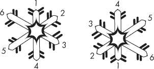
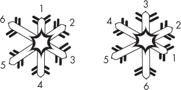
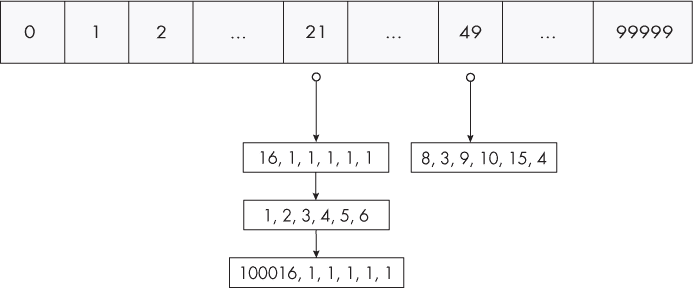
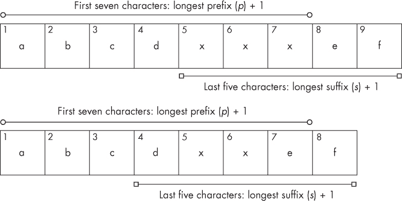

## **1

哈希表**


计算机程序多么频繁地需要搜索信息，是否为了在数据库中查找用户资料，或者检索客户订单。没有人喜欢等待一个缓慢的搜索完成。

在本章中，我们将解决两个依赖于能够执行高效搜索的问题。第一个问题是确定集合中的所有雪花是否相同。第二个问题是确定有多少密码可以用于登录某人的账户。我们希望正确解决这些问题，但我们将看到一些正确的方法实在太慢了。我们将能够通过使用一种被称为哈希表的数据结构来大幅提升性能，我们将详细探讨它。

本章最后，我们将探讨第三个问题：确定如何从一个单词中删除字母以得到另一个单词。在这里，我们将看到盲目使用新数据结构的风险——在学习新东西时，往往会有尝试在所有地方使用它的冲动！

### 问题 1：独特的雪花

这是 DMOJ 问题`cco07p2`。

#### *问题*

我们被给定了一组雪花，我们必须确定这些雪花中是否有相同的。

一个雪花由六个整数表示，每个整数代表雪花一条臂的长度。例如，这是一个雪花：

```
3, 9, 15, 2, 1, 10
```

雪花也可以包含重复的整数，例如：

```
8, 4, 8, 9, 2, 8
```

两个雪花相同意味着什么呢？我们通过几个例子逐步理解这个定义。

首先，我们来看这两个雪花：

```
1, 2, 3, 4, 5, 6
```

和

```
1, 2, 3, 4, 5, 6
```

这些显然是相同的，因为一个雪花中的整数与另一个雪花中对应位置的整数匹配。

这是我们的第二个例子：

```
1, 2, 3, 4, 5, 6
```

和

```
4, 5, 6, 1, 2, 3
```

这些也是相同的。我们可以通过从第二个雪花的`1`开始并向右移动来验证这一点。我们看到整数`1`、`2`和`3`，然后，当我们绕到左边时，看到`4`、`5`和`6`。这两部分加在一起就构成了第一个雪花。

我们可以将每个雪花看作是一个圆形，如图 1-1 所示。



*图 1-1：两个相同的雪花*

这两个雪花是相同的，因为我们可以从第二个雪花中的`1`开始，顺时针移动，得到第一个雪花。

我们来试一个不同类型的例子：

```
1, 2, 3, 4, 5, 6
```

和

```
3, 2, 1, 6, 5, 4
```

从目前为止所见，我们可以推断这些雪花并不相同。如果我们从第二个雪花中的`1`开始，向右移动（当到达右端时绕到左边），得到的是`1, 6, 5, 4, 3, 2`。这与第一个雪花中的`1, 2, 3, 4, 5, 6`差得远。

然而，如果我们从第二个雪花中的`1`开始并向左移动，而不是向右移动，那么我们确实得到 `1, 2, 3, 4, 5, 6`！从`1`开始向左移动，得到 `1, 2, 3`，然后再绕回右侧，继续向左收集 `4, 5, 6`。在图 1-2 中，这相当于从第二个雪花中的`1`开始，按逆时针方向移动。



*图 1-2：另外两个相同的雪花*

这是雪花相同的第三种方式：如果两个雪花在我们按逆时针方向遍历数字时匹配，则它们相同。

综合来看，我们可以得出结论：如果两个雪花相同，或者我们可以通过右移其中一个雪花（顺时针方向）使它们相同，或者我们可以通过左移其中一个雪花（逆时针方向）使它们相同，那么这两朵雪花就是相同的。

##### 输入

第一行输入是一个整数*n*，表示我们将处理的雪花数量。值*n*将在 1 和 100,000 之间。接下来的*n*行表示每个雪花，每行包含六个整数，每个整数至少为 0，最多为 10,000,000。

##### 输出

我们的输出将是一个单行文本：

+   如果没有相同的雪花，输出`No two snowflakes are alike.`（没有两个雪花是相同的）。

+   如果至少有两个相同的雪花，输出`Twin snowflakes found.`（找到双胞胎雪花）。

解决测试用例的时间限制为一秒。

#### *简化问题*

解决竞争编程挑战的一般策略是首先处理问题的简化版本。让我们通过去掉一些复杂性来热身一下这个问题。

假设我们不是处理由多个整数构成的雪花，而是处理单个整数。我们有一组整数，我们想知道是否有任何两个是相同的。我们可以使用 C 语言的`==`运算符来测试两个整数是否相等。我们可以测试所有整数对，如果找到任何一对相同的整数，我们就停止并输出

```
Twin integers found.
```

如果没有找到相同的整数，我们将输出

```
No two integers are alike.
```

让我们创建一个`identify_identical`函数，使用两个嵌套循环来比较整数对，如清单 1-1 所示。

```
void identify_identical(int values[], int n) {
  int i, j;
  for (i = 0; i < n; i++) {
  ❶ for (j = i + 1; j < n; j++) {
       if (values[i] == values[j]) {
         printf("Twin integers found.\n");
         return;
       }
     }
 }
 printf("No two integers are alike.\n");
}
```

*清单 1-1：查找相同的整数*

我们通过`values`数组将整数传递给函数。我们还传递`n`，即数组中的整数数量。

请注意，我们的内层循环从`i + 1`开始，而不是从`0`开始❶。如果我们从`0`开始，最终`j`会等于`i`，我们会将一个元素与其自身进行比较，导致错误的正面结果。

让我们使用这个小的`main`函数来测试`identify_identical`：

```
int main(void) {
  int a[5] = {1, 2, 3, 1, 5};
  identify_identical(a, 5);
  return 0;
}
```

运行代码，你将从输出中看到我们的函数正确地识别出了一对匹配的`1`。通常，在本书中我不会提供太多的测试代码，但在过程中你需要亲自动手操作并测试代码。

#### *解决核心问题*

让我们拿到`identify_identical`函数，并尝试修改它来解决雪花问题。为此，我们需要对代码做两项扩展：

1.  我们必须一次处理六个整数，而不是一个。这里使用二维数组应该会很合适：每一行将代表一个雪花，六列（每列对应一个元素）。

1.  正如我们之前看到的，两个雪花可以有多种方式是相同的。不幸的是，这意味着我们不能仅仅使用`==`来比较雪花。我们需要考虑“向右移动”和“向左移动”的条件（更不用说，C 语言中的`==`本身也无法比较数组的内容！）。正确地比较雪花将是我们算法的主要更新内容。

首先，让我们编写一对辅助函数：一个用于检查“向右移动”，另一个用于检查“向左移动”。每个辅助函数都接受三个参数：第一个雪花、第二个雪花以及第二个雪花的起始点。

##### 向右检查

这是`identical_right`函数的函数签名：

```
int identical_right(int snow1[], int snow2[], int start)
```

为了判断雪花是否相同，通过“向右移动”进行扫描，我们从索引`0`开始扫描`snow1`，从索引`start`开始扫描`snow2`。如果发现对应的元素不相等，则返回`0`，表示没有找到相同的雪花。如果所有对应的元素都匹配，则返回`1`。可以把`0`看作是“假”，`1`看作是“真”。

在清单 1-2 中，我们第一次尝试编写这个函数的代码。

```
// bugged!
int identical_right(int snow1[], int snow2[], int start) {
  int offset;
  for (offset = 0; offset < 6; offset++) {
 ❶ if (snow1[offset] != snow2[start + offset])
      return 0;
 }
 return 1;
}
```

*清单 1-2：识别向右移动的相同雪花（有错误！）*

正如你可能注意到的，这段代码并不会像我们希望的那样工作。问题出在`start + offset` ❶。如果`start = 4`，`offset = 3`，那么`start + offset = 7`。问题出在`snow2[7]`，因为`snow2[5]`是我们允许访问的最大索引。

这段代码没有考虑到我们必须将`snow2`的索引回绕到左侧。如果代码即将使用错误的索引（比如`6`或更大），我们应该通过减去六来重置索引。这样，我们就可以继续使用索引`0`而不是索引`6`，使用索引`1`而不是索引`7`，以此类推。让我们再试一次，清单 1-3。

```
int identical_right(int snow1[], int snow2[], int start) {
  int offset, snow2_index;
  for (offset = 0; offset < 6; offset++) {
    snow2_index = start + offset;
    if (snow2_index >= 6)
      snow2_index = snow2_index - 6;
        if (snow1[offset] != snow2[snow2_index])
      return 0;
  }
  return 1;
}
```

*清单 1-3：识别向右移动的相同雪花*

这段代码可以工作，但我们仍然可以改进它。此时，许多程序员可能会考虑做一个更改，使用`%`，即取模运算符。`%`运算符计算余数，所以`x % y`返回`x`除以`y`的余数。例如，`9 % 3`等于 0，因为 9 除以 3 没有余数；`10 % 4`等于 2，因为 10 除以 4 余 2。

我们可以在这里使用模运算来帮助实现循环行为。注意，`0 % 6` 等于 0，`1 % 6` 等于 1，……，`5 % 6` 等于 5。每个数字都小于 6，因此它们自己就是除以 6 的余数。数字 0 到 5 对应着 `snow2` 的合法索引，所以 `%` 运算符不会改变它们，这很好。对于我们问题中的索引 `6`，`6 % 6` 等于 0：6 能够被 6 整除，没有余数，从而使我们回到起点。这正是我们想要的循环行为。

让我们更新 `identical_right` 以使用 `%` 运算符。示例 1-4 展示了新的函数。

```
int identical_right(int snow1[], int snow2[], int start) {
  int offset;
  for (offset = 0; offset < 6; offset++) {
    if (snow1[offset] != snow2[(start + offset) % 6])
      return 0;
  }
  return 1;
}
```

*示例 1-4：使用模运算识别向右移动的相同雪花*

是否使用这个“模运算技巧”由你决定。它节省了一行代码，是一种许多程序员都能识别的常见模式。然而，它并不总是容易应用，哪怕是类似的循环行为，比如 `identical_left`。我们现在就来看看这个。

##### 检查向左移动

`identical_left` 函数与 `identical_right` 非常相似，唯一的区别是我们需要向左移动，然后再回绕到右边。当向右遍历时，我们需要小心不要错误地访问索引 6 或更大的值；而这次，我们需要小心不要访问索引 -1 或更小的值。

不幸的是，我们的模运算解决方案在这里不能直接使用。在 C 语言中，`-1 / 6` 等于 0，余数是 -1，因此 `-1 % 6` 等于 -1。我们需要的是 `-1 % 6` 等于 5。

让我们不使用模运算来实现这个。我们在示例 1-5 中提供了 `identical_left` 函数的代码。

```
int identical_left(int snow1[], int snow2[], int start) {
  int offset, snow2_index;
  for (offset = 0; offset < 6; offset++) {
    snow2_index = start - offset;
    if (snow2_index <= -1)
      snow2_index = snow2_index + 6;
    if (snow1[offset] != snow2[snow2_index])
      return 0;
  }
  return 1;
}
```

*示例 1-5：识别向左移动的相同雪花*

注意这个函数与示例 1-3 的相似性。我们所做的只是将偏移量相减而不是相加，并将 `6` 的边界检查改为 `-1` 的边界检查。

##### 综合起来

有了这两个辅助函数 `identical_right` 和 `identical_left`，我们终于可以编写一个函数，告诉我们两朵雪花是否相同。示例 1-6 给出了一个实现此功能的 `are_identical` 函数的代码。我们只需测试每个可能的起始点在 `snow2` 中向右和向左移动即可。

```
int are_identical(int snow1[], int snow2[]) {
  int start;
  for (start = 0; start < 6; start++) {
 ❶ if (identical_right(snow1, snow2, start))
      return 1;
 ➋ if (identical_left(snow1, snow2, start))
      return 1;
  }
  return 0;
}
```

*示例 1-6：识别相同的雪花*

我们通过在 `snow2` 中向右移动 ➊ 来测试 `snow1` 和 `snow2` 是否相同。如果它们在这个标准下相同，我们返回 `1`（即 true）。然后，我们同样检查向左移动的标准 ➋。

在继续之前，值得暂停一下，测试 `are_identical` 函数在一些示例雪花对上的效果。请在继续之前先进行测试！

#### *解决方案 1：成对比较*

当我们需要比较两朵雪花时，我们直接调用 `are_identical` 函数，而不是使用 `==`。比较两朵雪花现在就像比较两个整数一样简单。

让我们修改之前的`identify_identical`函数（列表 1-1），使其能够使用新的`are_identical`函数（列表 1-6）处理雪花。我们将对雪花进行逐对比较，根据是否找到相同的雪花输出两条消息之一。代码见列表 1-7。

```
void identify_identical(int snowflakes[][6], int n) {
  int i, j;
  for (i = 0; i < n; i++) {
    for (j = i + 1; j < n; j++) {
      if (are_identical(snowflakes[i], snowflakes[j])) {
        printf("Twin snowflakes found.\n");
        return;
      }
    }
  }
  printf("No two snowflakes are alike.\n");
}
```

*列表 1-7：寻找相同的雪花*

这个关于雪花的`identify_identical`函数几乎和列表 1-1 中处理整数的`identify_identical`函数一模一样，符号逐一对应。我们所做的只是用一个比较雪花的函数替换了`==`。

##### 读取输入

我们还没有准备好提交给评测系统。我们还没有写代码从标准输入中读取雪花。请回顾一下本章开头的问题描述。我们需要读取一行包含整数*n*，告诉我们雪花的数量，然后读取接下来的*n*行，每行表示一片雪花。

列表 1-8 是一个`main`函数，它处理输入，然后调用列表 1-7 中的`identify_identical`函数。

```
#define SIZE 100000

int main(void) {
❶ static int snowflakes[SIZE][6];
   int n, i, j;
   scanf("%d", &n);
   for (i = 0; i < n; i++)
     for (j = 0; j < 6; j++)
       scanf("%d", &snowflakes[i][j]);
   identify_identical(snowflakes, n);
   return 0;
}
```

*列表 1-8：* 主 *函数（Solution 1）*

注意到`雪花（snowflakes）`数组是一个`静态（static）`数组➊。这是因为数组非常大；如果不使用`静态`数组，所需的空间很可能会超过函数可用的内存量。我们使用`static`将数组放置在一个单独的内存块中，在那里空间不是问题。然而，使用`static`时要小心。普通的局部变量在每次调用函数时会被初始化，而`static`变量会保留上一次函数调用时的值（参见第 xxvi 页的“Static 关键字”）。

另外请注意，我们已经分配了一个包含 100,000 片雪花的数组➊。你可能会担心这是浪费内存。如果输入只有几片雪花怎么办？对于竞赛编程问题，通常可以为最大问题实例硬编码内存要求：无论如何，测试用例很可能会在最大规模下对你的提交进行压力测试！

剩下的部分很简单。我们使用`scanf`读取雪花的数量，并用这个数字来确定外层`for`循环的迭代次数。每次迭代时，我们会在内层`for`循环中循环六次，每次读取一个整数。然后，我们调用`identify_identical`函数，生成相应的输出。

将这个`main`函数与我们写的其他函数结合起来，就得到一个完整的程序，可以提交给评测系统。试一下……你应该会看到一个“时间限制超出”错误。看来我们还有工作要做！

##### 诊断问题

我们的第一个解决方案太慢了，因此出现了“时间限制超出（Time-Limit Exceeded）”错误。我们来理解一下为什么。

在我们这里的讨论中，我们假设没有相同的雪花。这是我们代码的最坏情况，因为这样它不会提前停止处理。

我们第一个解决方案慢的原因是 Listing 1-7 中的两个嵌套 `for` 循环。这些循环将每个雪花与其他所有雪花进行比较，当雪花数量 *n* 很大时，会导致进行大量的比较。

让我们计算一下我们的程序进行的雪花比较次数。由于我们可能会比较每对雪花，因此我们可以将这个问题重新表述为求雪花对的总数。例如，如果我们有四个编号为 1、2、3 和 4 的雪花，那么我们的方案会进行六次雪花比较：雪花 1 和 2、1 和 3、1 和 4、2 和 3、2 和 4、以及 3 和 4。每一对由选择一个 *n* 雪花作为第一个雪花，再选择一个剩下的 *n* – 1 个雪花作为第二个雪花。

对于第一个雪花的每个 *n* 决策，我们对第二个雪花有 *n* – 1 个决策。这一共会有 *n*(*n* – 1) 次决策。然而，*n*(*n* – 1) 计算的是比较的总次数，但它重复计算了真实的雪花比较次数——例如，它同时包括了比较 1 和 2 以及比较 2 和 1。我们的解决方案只进行一次比较，所以我们可以除以 2，从而得到 *n*(*n* – 1)/2 次雪花比较，适用于 *n* 个雪花。

这可能看起来没什么大不了的，但让我们代入一些 *n* 的值到 *n*(*n* – 1)/2 中看看会发生什么。代入 10 得到 10(9)/2 = 45。进行 45 次比较对于任何计算机来说都轻松可以完成，并且可以在毫秒内完成。那如果 *n* = 100 呢？那会得到 4,950：还是没问题。看起来对于小的 *n* 我们还可以应付，但问题陈述中说我们最多可以有 100,000 个雪花。试着代入 100,000 到 *n*(*n* – 1)/2 中：得到 4,999,950,000 次雪花比较。如果你在一台普通笔记本电脑上运行 100,000 个雪花的测试用例，可能需要三分钟左右。这太慢了——我们最多需要一秒钟，而不是几分钟！对于今天的计算机，可以将每秒能执行的步骤数大约看作 3000 万。试图在一秒钟内进行接近 50 亿次雪花比较是不可行的。

如果我们展开 *n*(*n* – 1)/2，会得到 *n*²/2 – *n*/2。这里最大的指数是 2。所以，算法开发者通常将这种算法称为 *O*(*n*²) 算法，或者叫做 *二次时间算法*。*O*(*n*²) 被读作“*n* 平方的大 O”，你可以理解为它表示工作量的增长速度与问题规模的平方成正比。关于大 O 的简要介绍，请参见 附录 A。

我们需要做这么多比较，因为相同的雪花可能出现在数组的任何位置。如果有办法把相同的雪花聚集在一起，我们就能快速判断某个雪花是否属于一个相同的配对。或许我们可以尝试通过排序来将相同的雪花靠得更近？

##### 排序雪花

C 语言有一个名为 `qsort` 的库函数，我们可以用它来对数组进行排序。关键要求是一个比较函数：它接收两个待排序元素的指针，如果第一个元素小于第二个，则返回负整数，若相等则返回 `0`，若第一个元素大于第二个，则返回正整数。我们可以使用 `are_identical` 来判断两个雪花是否相同；如果相同，则返回 `0`。

那么，一个雪花小于或大于另一个雪花是什么意思呢？我们很容易就想在这里达成某种任意的规则。例如，我们可以说，"更小" 的雪花是其第一个不同元素比另一雪花对应元素小的那个雪花。我们在清单 1-9 中做了这个操作。

```
int compare(const void *first, const void *second) {
  int i;
  const int *snowflake1 = first;
  const int *snowflake2 = second;
  if (are_identical(snowflake1, snowflake2))
    return 0;
  for (i = 0; i < 6; i++)
    if (snowflake1[i] < snowflake2[i])
      return -1;
  return 1;
}
```

*清单 1-9：排序用的比较函数*

不幸的是，这种排序方法并不能帮助我们解决问题。你可能会尝试编写一个程序，使用排序将相同的雪花排列在一起，以便能够快速找到它们。但这是一个四个雪花的测试用例，可能会在你的笔记本电脑上失败：

```
4
3 4 5 6 1 2
2 3 4 5 6 7
4 5 6 7 8 9
1 2 3 4 5 6
```

第一和第四个雪花是相同的——但是可能会输出消息`No two snowflakes are alike.`。出了什么问题？

以下是 `qsort` 在执行过程中可能学到的两个事实：

1.  雪花 4 小于雪花 2。

1.  雪花 2 小于雪花 1。

从这个例子中，`qsort` 可以得出雪花 4 小于雪花 1，而无需直接比较雪花 4 和雪花 1！这里它依赖于“小于”的传递性。如果 *a* 小于 *b*，且 *b* 小于 *c*，那么 *a* 当然应该小于 *c*。看来我们对“更小”和“更大”的定义最终还是很重要的。

不幸的是，目前并不清楚如何在雪花上定义“小于”和“大于”，以满足传递性。如果你感到失望，也许可以安慰自己，因为我们将能够开发一个不使用排序的更快解决方案。

一般来说，利用排序将相似的值聚集在一起是一种有用的数据处理技巧。作为额外的好处，好的排序算法运行速度很快——肯定比 *O*(*n*²) 快，但我们在这里无法使用排序。

#### *解决方案 2：做更少的工作*

比较所有雪花的配对并尝试对雪花进行排序，结果证明工作量太大。为了朝着下一个、也是最终的解决方案迈进，让我们探索避免比较显然不相同的雪花的思路。例如，如果我们有雪花

```
1, 2, 3, 4, 5, 6
```

和

```
82, 100, 3, 1, 2, 999
```

这些雪花肯定不可能是相同的。我们甚至不应该浪费时间去比较它们。

第二个雪花中的数字与第一个雪花中的数字差异很大。为了设计一种方法来检测两个雪花是否不同，而无需直接比较它们，我们可以从比较雪花的第一个元素开始，因为 1 和 82 差别很大。但现在考虑这两种雪花：

```
3, 1, 2, 999, 82, 100
```

以及

```
82, 100, 3, 1, 2, 999
```

尽管 3 与 82 差异很大，这两个雪花*是*相同的。我们需要做的远不止只看第一个元素。

判断两个雪花是否可能相同的快速测试是使用它们元素的*和*。当我们将两个示例雪花的元素求和时，`1, 2, 3, 4, 5, 6`的总和为 21，`82, 100, 3, 1, 2, 999`的总和为 1,187。我们说，第一个雪花的*代码*是 21，第二个雪花的代码是 1,187。

我们的希望是将“21 代码的雪花”放进一个箱子，将“1,187 代码的雪花”放进另一个箱子，然后我们就再也不需要将 21 和 1,187 的雪花进行比较了。我们可以为每个雪花执行这样的分箱操作：将它的元素加起来，得到一个*代码*，然后将它与所有具有相同代码*代码*的雪花一起存储。

当然，找到两个代码为 21 的雪花并不能保证它们是相同的。例如，`1, 2, 3, 4, 5, 6`和`16, 1, 1, 1, 1, 1`的代码都是 21，但它们肯定不是相同的。

这没关系，因为我们的“和”规则旨在排除明显不相同的雪花。这使我们能够避免比较所有的配对——这是方案 1 中低效的根源——只比较那些没有被过滤掉的、显然不同的配对。

在方案 1 中，我们将每个雪花按顺序存储在数组中：第一个雪花存储在索引`0`，第二个存储在索引`1`，以此类推。在这里，我们的存储策略不同：求和代码决定了雪花在数组中的位置！也就是说，对于每个雪花，我们计算它的代码，并将该代码作为存储雪花的索引。

我们需要解决两个问题：

1.  给定一朵雪花，我们如何计算它的代码？

1.  当多个雪花具有相同代码时，我们该怎么办？

让我们先处理计算代码的问题。

##### 计算求和代码

乍一看，计算代码似乎很简单。我们可以像这样将每个雪花中的所有数字加起来：

```
int code(int snowflake[]) {
  return (snowflake[0] + snowflake[1] + snowflake[2]
          + snowflake[3] + snowflake[4] + snowflake[5]);
}
```

这对许多雪花有效，例如`1, 2, 3, 4, 5, 6`和`82, 100, 3, 1, 2, 999`，但考虑一下具有大数字的雪花，例如

```
1000000, 2000000, 3000000, 4000000, 5000000, 6000000
```

我们计算出的代码是`21000000`。我们计划将这个代码作为数组中的*索引*来存储雪花，因此为了容纳它，我们必须声明一个可以存储 2100 万个元素的数组。由于我们最多使用 100,000 个元素（每个雪花一个），这将是一个极为浪费内存的做法。

我们将继续使用一个可以容纳 100,000 个元素的数组。我们需要像之前一样计算雪花的代码，但之后必须将该代码强制转换为`0`到`99999`之间的数字（我们数组中的最小和最大索引）。实现这一点的一种方法是再次使用`%`（模）运算符。对一个非负整数取模*x*会得到一个介于 0 和*x* – 1 之间的整数。无论雪花的和是多少，只要对其取模 100,000，我们就能得到一个有效的数组索引。

这种方法有一个缺点：像这样取模会强制*更多*不同的雪花最终得到相同的代码。例如，`1, 1, 1, 1, 1, 1`和`100001, 1, 1, 1, 1, 1`的和是不同的——`6`和`100006`——但一旦对它们取模 100,000，结果都是`6`。这是一个可以接受的风险：我们只希望这种情况不会发生得太频繁；当它发生时，我们将进行必要的逐对比较。

我们将计算雪花的和并对其取模，如清单 1-10 中所示。

```
#define SIZE 100000

int code(int snowflake[]) {
  return (snowflake[0] + snowflake[1] + snowflake[2]
          + snowflake[3] + snowflake[4] + snowflake[5]) % SIZE;
}
```

*清单 1-10：计算雪花代码*

##### 雪花碰撞

在解决方案 1 中，我们使用了以下片段将一个雪花存储在`snowflakes`数组的索引`i`处：

```
    for (j = 0; j < 6; j++)
      scanf("%d", &snowflakes[i][j]);
```

之所以有效，是因为二维数组的每一行只存储一个雪花。

然而，现在我们必须处理`1, 1, 1, 1, 1, 1`和`100001, 1, 1, 1, 1, 1`类型的碰撞问题，因为它们最终会得到相同的模代码，而该代码作为雪花在数组中的索引，我们需要在同一个数组元素中存储多个雪花。也就是说，每个数组元素将不再是一个雪花，而是零个或多个雪花的集合。

存储多个元素在同一数组索引中的一种方法是使用*链表*，一种将每个元素与下一个元素连接起来的数据结构。在这里，雪花数组中的每个元素将指向链表中的第一个雪花；剩余的雪花可以通过`next`指针访问。

我们将使用典型的链表实现。每个`snowflake_node`包含一个雪花和指向下一个雪花的指针。为了收集这两个组件，我们将使用一个结构体。我们还会使用`typedef`，这让我们可以后续使用`snowflake_node`代替完整的`struct snowflake_node`：

```
typedef struct snowflake_node {
  int snowflake[6];
  struct snowflake_node *next;
} snowflake_node;
```

这一变化需要更新两个函数，`main`和`identify_identical`，因为这两个函数使用了我们之前的二维数组。

##### 新的主函数

你可以在清单 1-11 中看到更新后的`main`代码。

```
int main(void) {
❶ static snowflake_node *snowflakes[SIZE] = {NULL};
➋ snowflake_node *snow;
   int n, i, j, snowflake_code;
   scanf("%d", &n);
   for (i = 0; i < n; i++) {
  ➌ snow = malloc(sizeof(snowflake_node));
    if (snow == NULL) {
      fprintf(stderr, "malloc error\n");
      exit(1);
    }
    for (j = 0; j < 6; j++)
   ➍ scanf("%d", &snow->snowflake[j]);
  ➎ snowflake_code = code(snow->snowflake);
  ➏ snow->next = snowflakes[snowflake_code];
  ❼ snowflakes[snowflake_code] = snow;
  }
  identify_identical(snowflakes);
  // deallocate all malloc'd memory, if you want to be good
  return 0;
}
```

*清单 1-11：解决方案 2 的*main*函数*

让我们逐步分析这段代码。首先，注意到我们将数组的类型从一个二维数字数组更改为一个一维指向雪花节点的指针数组 ➊。我们还声明了`snow` ➋，它将指向我们分配的雪花节点。

我们使用`malloc`为每个`snowflake_node`分配内存 ➌。当我们读取并存储了一个雪花的六个数字 ➍后，我们使用`snowflake_code`来保存雪花的代码 ➎，该代码是通过我们在列表 1-10 中编写的函数计算得出的。

最后一步是将雪花添加到`snowflakes`数组中，这相当于向链表中添加一个节点。我们通过将雪花插入到链表的开头来完成此操作。我们首先将插入节点的`next`指针指向链表中的第一个节点 ➏，然后将链表的起始点指向插入的节点 ❼。这里的顺序很重要：如果我们反转这两行的顺序，之前已经在链表中的元素将无法访问！

请注意，就正确性而言，我们在链表中添加新节点的位置并不重要。它可以添加到开头、结尾或中间——这由我们决定。所以我们应该选择最快的方式，而将节点添加到开头是最快的，因为这不需要遍历整个链表。如果我们选择将元素添加到链表的末尾，则必须遍历整个链表。如果这个链表有一百万个元素，我们就得跟随`next`指针一百万次，直到到达末尾——那会非常慢！

让我们看一个关于`main`函数如何工作的快速示例。以下是测试用例：

```
4
1 2 3 4 5 6
8 3 9 10 15 4
16 1 1 1 1 1
100016 1 1 1 1 1
```

`snowflakes`中的每个元素最初都是`NULL`，即空链表。当我们向`snowflakes`中添加元素时，元素将开始指向雪花节点。第一个雪花的数字之和为 21，因此它进入了索引`21`。第二个雪花进入了索引`49`。第三个雪花进入了索引`21`。此时，索引`21`处的链表包含*两个*雪花：`16, 1, 1, 1, 1, 1`后面跟着`1, 2, 3, 4, 5, 6`。

那第四个雪花呢？它又进入了索引`21`，现在我们在该位置有了一个包含三个雪花的链表。请参见图 1-3 了解我们构建的哈希表。



*图 1-3：包含四个雪花的哈希表*

索引`21`中有多个雪花。这是否意味着我们有相同的雪花？不！这强调了这样一个事实：一个包含多个元素的链表不足以证明我们有相同的雪花。我们必须比较这些元素中的每一对，才能正确地得出结论。这是谜题的最后一块拼图。

##### 新的 `identify_identical` 函数

我们需要`identify_identical`来在每个链表中进行所有雪花的成对比较。列表 1-12 展示了实现该功能的代码。

```
void identify_identical(snowflake_node *snowflakes[]) {
  snowflake_node *node1, *node2;
  int i;
  for (i = 0; i < SIZE; i++) {
 ❶ node1 = snowflakes[i];
    while (node1 != NULL) {
   ➋ node2 = node1->next;
      while (node2 != NULL) {
        if (are_identical(node1->snowflake, node2->snowflake)) {
          printf("Twin snowflakes found.\n");
          return;
        }
        node2 = node2->next;
      }
   ➌ node1 = node1->next;
    }
  }
  printf("No two snowflakes are alike.\n");
}
```

*列表 1-12：在链表中识别相同的雪花*

我们从`node1`开始，位于链表的第一个节点➊。我们使用`node2`从`node1`右侧的节点➋开始遍历，直到链表的末尾。这样，我们将链表中的第一个雪花与该链表中所有其他雪花进行比较。然后我们将`node1`移动到第二个节点➌，并将第二个雪花与右侧的每个雪花进行比较。我们一直重复这个过程，直到`node1`到达链表的末尾。

这段代码与解决方案 1 中的`identify_identical`非常相似（见列表 1-7），它对所有雪花进行了两两比较。相比之下，我们的新代码仅在单个链表内进行两两比较。但如果有人构造了一个测试用例，将所有雪花都放入同一个链表中呢？那样的话，性能是不是会和解决方案 1 一样差？是的，确实会，但在没有这样的恶意数据时，我们的性能就很好。花一点时间提交解决方案 2 给评测系统，亲自看看效果。你应该会发现我们找到了一个更高效的解决方案！我们做的是使用了一种叫做哈希表的数据结构。接下来我们会深入了解哈希表。

### 哈希表

*哈希表*由两部分组成：

1.  一个数组。数组中的位置称为*桶*。

1.  *哈希函数*，它接收一个对象并返回其代码作为数组的索引。

哈希函数返回的代码称为*哈希码*；该代码决定了对象存储或*哈希*的位置。

仔细看看我们在列表 1-10 和 1-11 中的操作，你会发现我们已经有了这两项内容。那个`code`函数，它接收一个雪花并生成它的代码（一个 0 到 99,999 之间的数字），就是一个哈希函数；而那个`snowflakes`数组就是桶数组，每个桶里包含一个链表。

#### *哈希表设计*

设计哈希表涉及许多设计决策。这里我们将讨论其中的三项。

第一个决策是大小。在《独特的雪花》项目中，我们使用了 100,000 的数组大小。我们也可以选择使用更小或更大的数组。较小的数组节省内存。例如，在初始化时，50,000 个元素的数组存储的`NULL`值是 100,000 个元素数组的一半。然而，较小的数组会导致更多的对象落入同一个桶中。当多个对象落入同一个桶时，我们说发生了*碰撞*。碰撞过多的问题在于它们会导致长链表。理想情况下，所有的链表都应该很短，这样我们就不需要遍历并处理很多元素。较大的数组可以避免一些碰撞。

总结一下，我们这里存在一个内存-时间的权衡。哈希表太小会导致碰撞泛滥，哈希表太大则会浪费内存。一般来说，尝试选择一个合理的数组大小，比如最大元素数量的 20%、50%或 100%，作为哈希表中元素的预计数量。

在“独特的雪花”示例中，我们使用了 100,000 的数组大小来匹配雪花的最大数量；如果我们被限制使用更少的内存，较小的数组也能很好地工作。

第二个考虑因素是我们的哈希函数。在“独特的雪花”示例中，我们的哈希函数将雪花的数字加起来，取模 100,000。重要的是，这个哈希函数保证了，如果两个雪花是相同的，它们将被哈希到同一个桶中。（当然，如果它们不相同，它们也可能被哈希到同一个桶中。）这就是为什么我们可以在链表内查找，而不是在链表之间查找相同雪花的原因。

在使用哈希表解决问题时，我们所用的哈希函数应该考虑到什么情况下两个对象是相同的。如果两个对象相同，那么哈希函数必须将它们哈希到同一个桶中。如果两个对象必须完全相同才能被认为是“相同的”，我们可以进行复杂的混淆，使得对象与桶之间的映射远比我们在雪花示例中做的更为复杂。查看清单 1-13 中的`oaat`（逐个处理）哈希函数，了解一个例子。

```
#define hashsize(n) ((unsigned long)1 << (n))
#define hashmask(n) (hashsize(n) - 1)

unsigned long oaat(char *key, unsigned long len, unsigned long bits) {
  unsigned long hash, i;
  for (hash = 0, i = 0; i < len; i++) {
    hash += key[i];
    hash += (hash << 10);
    hash ^= (hash >> 6);
  }
  hash += (hash << 3);
  hash ^= (hash >> 11);
  hash += (hash << 15);
  return hash & hashmask(bits);
}

int main(void) { // sample call of oaat
  char word[] = "hello";
  // 2¹⁷ is the smallest power of 2 that is at least 100000
❶ unsigned long code = oaat(word, strlen(word), 17);
   printf("%u\n", code);
   return 0;
}
```

*清单 1-13：一个复杂的哈希函数*

为了像我们在`main`函数中那样调用`oaat` ➊，我们需要传入三个参数：

key    我们希望哈希的数据（这里是我们正在哈希的`word`字符串）

len    数据的长度（这里是`word`字符串的长度）

bits   我们希望得到的哈希码的位数（这里是 17）

哈希码的最大值是`bits`次方减去 1。例如，如果我们选择 17，那么 2¹⁷ - 1 = 131,071 就是哈希码的最大值。

`oaat`是如何工作的？在`for`循环内部，它首先将当前字节的键值添加进去。这个部分类似于我们在计算雪花中的数字和时做的事情（清单 1-10）。这些左移和异或操作的目的是将键值进行混合。哈希函数通过这种混合实现*雪崩效应*，也就是说，键的位发生细微变化时，会导致键的哈希值发生巨大变化。除非你故意为这个哈希函数创建了病态数据或插入了大量的键，否则很难发生多次碰撞。这突显了一个重要的观点：对于单个哈希函数，总是存在一组数据会导致大量碰撞，进而带来糟糕的性能。像`oaat`这样的复杂哈希函数无法防止这一点。不过，除非我们担心恶意输入，否则通常可以使用一个相当不错的哈希函数，并假设它能有效地分散数据。

的确，这就是我们使用哈希表解决方案（解决方案 2）来处理独特雪花问题如此成功的原因。我们使用了一个优秀的哈希函数，将许多不同的雪花分配到不同的桶中。由于我们没有保护代码免受攻击，因此不需要担心某个恶意人物研究我们的代码并找到方法造成数百万次碰撞。

对于我们的第三个也是最后一个设计决策，我们需要考虑使用什么作为桶。在独特雪花中，我们将链表作为每个桶的存储结构。像这样使用链表被称为*链式法*。

另一种方法被称为*开放寻址法*，每个桶最多存放一个元素，并且没有链表。为了解决碰撞问题，我们会遍历桶，直到找到一个空桶。例如，假设我们尝试将一个对象插入到桶号 50 中，但桶 50 已经被占用了。那么我们可能会尝试桶 51，再试桶 52，再试桶 53，直到找到一个空桶。不幸的是，这种简单的序列在哈希表中存储了许多元素时，可能导致较差的性能，因此在实践中通常会使用更复杂的查找方案。

链接法通常比开放寻址法更容易实现，这也是我们在独特雪花问题中使用链接法的原因。然而，开放寻址法确实有一些优点，包括通过不使用链表节点来节省内存。

#### *为什么使用哈希表？*

使用哈希表大大加速了我们解决独特雪花问题的方案。在典型的笔记本电脑上，处理包含 100,000 个元素的测试用例只需几分之一秒的时间！不需要进行元素之间的配对比较，也不需要排序，只需对一堆链表进行一些处理。

回想一下我们使用的数组大小是 100,000。我们程序中最多可以处理的雪花数量也是 100,000。如果我们给定 100,000 个雪花，并假设每个雪花都放入自己的桶中，那么每个链表中将只有一个雪花。如果我们运气稍差，可能会有几个雪花发生碰撞并进入同一个桶。不过，在没有病态数据的情况下，我们预计每个链表最多只有几个元素。因此，在一个桶内进行所有成对比较只需要很少的常数步骤。我们预计哈希表能提供一个*线性时间*的解决方案，因为我们在每个*n*个桶中都只进行常数次数的步骤。所以我们预计需要大约*n*步，而不是我们在解决方案 1 中使用的*n*（*n* – 1）/2 公式。从大 O 的角度来看，我们预计会得到一个*O*(*n*)的解决方案。

每当你在解决一个问题时发现自己反复搜索某个元素时，可以考虑使用哈希表。哈希表将慢速的数组搜索转换为快速查找。对于某些问题，你可能能通过排序数组而不是使用哈希表来解决。此时，可以使用一种叫做二分查找的技术（在第七章中讨论）来快速查找已排序数组中的元素。但通常——就像在独特雪花问题和我们接下来要解决的问题中——那是行不通的。哈希表来救援！

### 问题 2：登录混乱

让我们再来看一个问题，并注意一个天真的解决方案如何依赖于慢速搜索。然后，我们将引入哈希表来实现显著的加速。我们会比解决独特雪花问题时快一点，因为现在我们知道该注意什么了。

这是 DMOJ 问题`coci17c1p3hard`。

#### *问题*

要登录社交网站上的账户，你会期望只有你的密码有效——没有人能用其他密码进入你的账户。例如，假设你的密码是`dish`。（这是一个非常弱的密码——千万不要在任何地方使用它！）要登录你的账户，某人需要输入准确的`dish`作为密码。这就是登录的工作原理。

但现在想象一下，你想加入一个（希望是理论上的）社交网络网站，这个网站有一个重大的安全问题：除了你的密码，其他密码也可以用来进入你的账户！具体来说，如果某人尝试一个包含你密码作为子字符串的密码，那么他们就能进入。如果你的密码是`dish`，那么像`brandish`和`radishes`这样的密码也能用来进入你的账户，因为字符串`dish`包含在其中。你不知道该为你的账户选择什么密码——所以你会在不同的时刻问自己：“如果我选择了这个密码，有多少当前用户的密码能够进入我的账户？”

我们需要支持两种类型的操作：

**添加**   使用给定的密码注册一个新用户。

**查询**   给定一个提议密码 *p*，返回当前用户密码中有多少个可以用来进入密码为 *p* 的账户。

##### 输入

输入包含以下几行：

+   包含 *q* 的一行，表示要执行的操作次数。*q* 介于 1 和 100,000 之间。

+   *q* 行，每行执行一个添加或查询操作。

以下是可以在 *q* 行中执行的操作：

+   添加操作以数字 `1` 开头，后跟一个空格和新用户的密码。它表示一个新用户已加入，并使用提供的密码。此操作不会产生任何输出。

+   查询操作以数字 `2` 开头，后跟一个空格和提议的密码 *p*。它表示我们应当输出能够进入密码为 *p* 的账户的当前用户密码的数量。

所有在这些操作中提供的密码都是由 1 到 10 个小写字母组成。

##### 输出

输出每个查询操作的结果，每行一个。

解决测试用例的时间限制是三秒钟。

#### *解决方案 1：查看所有密码*

让我们通过一个测试用例来确保我们完全理解需要做什么。

```
❶ 6
➋ 2 dish
   1 brandish
   1 radishes
   1 aaa
➌ 2 dish
➍ 2 a
```

从第一行 ➊ 可以看出我们需要执行 6 次操作。第一次操作 ➋ 问我们有多少个现有用户的密码能够进入一个密码为 `dish` 的账户。好吧，当前没有任何用户，所以答案是 `0`！

接下来，我们添加三个用户密码，然后进行下一个查询操作 ➌。现在我们要查询 `dish` 在这三个密码中的情况。你可能会想，我们需要遍历现有的密码，统计其中有多少个包含 `dish`。 （嗯，搜索！这给了我们第一个提示，可能需要使用哈希表。）如果你这样做，你会发现两个密码——`brandish` 和 `radishes`——包含了 `dish`。所以答案是 `2`。

那么最后一个查询 ➍ 呢？我们要查找包含 `a` 的密码。如果你遍历这三个现有的密码，你会发现它们都有 `a`！因此，答案是 `3`。

完成！完整测试用例的正确输出是：

```
0
2
3
```

如果我们实现刚才使用的解决策略，最终可能会得到像 清单 1-14 这样的内容。

```
❶ #define MAX_USERS 100000
  #define MAX_PASSWORD 10

  int main(void) {
    static char users[MAX_USERS][MAX_PASSWORD + 1];
    int num_ops, op, op_type, total, j;
    char password[MAX_PASSWORD + 1];
    int num_users = 0;
    scanf("%d", &num_ops);
    for (op = 0; op < num_ops; op++) {
      scanf("%d%s", &op_type, password);

   ➋ if (op_type == 1) {
        strcpy(users[num_users], password);
        num_users++;

   ➌ } else {
        total = 0;
        for (j = 0; j < num_users; j++)
          if (strstr(users[j], password))
            total++;
        printf("%d\n", total);
      }
    }
    return 0;
}
```

*清单 1-14：解决方案 1*

问题描述中说，我们最多会有 100,000 次操作。如果每次都是添加操作，那么我们会得到 100,000 个用户 ➊，并且不能超过这个数量。

对于每个添加操作 ➋，我们将新密码复制到我们的用户数组中。而对于每个查询操作 ➌，我们遍历所有现有用户的密码，检查其中有多少个密码包含了提议的密码作为子字符串。

就像我们对独特雪花问题的第一个解决方案一样，这个解决方案的速度不足以及时通过测试用例。因为我们这里使用的是一个 *O*(*n*²) 算法，其中 *n* 是查询的数量。

我们能够迅速将用户密码添加到数组中——这没有问题。让我们速度变慢的是查询操作，因为每次查询都需要扫描所有现有的用户密码。这就是二次时间行为的来源。例如，假设一个测试案例开始时添加了 50,000 个用户密码，然后再进行 50,000 次查询。总共需要大约 50,000 × 50,000 = 2,500,000,000 步。超过了 20 亿步；在我们允许的三秒时间限制内，显然无法完成这么多步骤。

#### *解决方案 2：使用哈希表*

我们需要加快查询操作的速度。我们将使用哈希表来实现这一点。但是怎么做呢？难道我们不需要将每个查询密码与所有现有密码进行比较吗？不！继续阅读，我们将从另一个角度解决这个问题。

##### 如何使用哈希表

对于每个查询操作，如果我们能够直接在哈希表中查找所需的密码，以确定有多少现有用户密码可以进入其账户，那就太好了。例如，一旦我们添加了密码为`brandish`、`radishes`和`aaa`的用户，那么我们就能够在哈希表中查找`dish`并得到一个值`2`。但是，在我们添加这三个用户密码的同时，我们怎么知道需要跟踪`dish`的情况呢？我们并不知道哪些密码会在之后被查询。

好吧，因为我们无法预知未来，不如对每个用户密码的每个子字符串都加一。这样一来，如果我们以后需要查找任何子字符串的总数，就已经做好准备了。

关注`brandish`密码。如果我们考虑每个子字符串，那么我们会为`b`、`br`、`bra`、`bran`、`brand`、`brandi`、`brandis`、`brandish`、`r`、`ra`等子字符串递增总数。别担心：如果我们处理所有这些子字符串，我们肯定会碰到`dish`并对它进行递增。当我们对`radishes`进行相同的子字符串处理时，我们会再次递增`dish`。因此，`dish`的总数最终会达到 2，正如我们需要的那样。

你可能会担心我们在这里做得过于冗余，处理大量的子字符串密码，而其中绝大部分不会被查询。然而，请记住，从问题描述中我们知道密码最多有 10 个字符。每个子字符串都有一个起始点和一个终止点。在一个 10 个字符的密码中，只有 10 个可能的起始点和 10 个可能的终止点，所以一个密码中子字符串的最大数量是 10 × 10 = 100。由于我们最多有 100,000 个用户密码，每个密码最多有 100 个子字符串，我们在哈希表中最多会存储 100,000 × 100 = 10,000,000 个子字符串。这肯定会占用一些兆字节的内存，但这完全不值得担心。我们正在用一点内存换取在需要时能够查找任何密码总数的能力。

与“独特雪花”问题类似，我们的解决方案将使用链表的哈希表。我们还需要一个哈希函数。这里我们不会使用像雪花哈希函数那样的方式，因为它会导致像`cat`和`act`这样的密码发生冲突（它们是字母重排的）。与“独特雪花”问题不同，密码不仅应该通过字母来区分，还应该通过字母的位置来区分。当然，某些冲突是不可避免的，但我们应该尽力减少它们的发生频率。为此，我们将使用清单 1-13 中的那个“狂野”的`oaat`哈希函数。

##### 搜索哈希表

我们将使用以下节点在哈希表中存储密码：

```
#define MAX_PASSWORD 10

typedef struct password_node {
  char password[MAX_PASSWORD + 1];
  int total;
  struct password_node *next;
} password_node;
```

这个节点类似于“独特雪花”中的`snowflake_node`，但我们现在还增加了一个`total`成员，用来跟踪该密码的总计数。

现在我们可以编写一个辅助函数来在哈希表中搜索给定的密码。查看清单 1-15 获取代码。

```
#define NUM_BITS 20

password_node *in_hash_table(password_node *hash_table[], char *find) {
  unsigned password_code;
  password_node *password_ptr;
❶ password_code = oaat(find, strlen(find), NUM_BITS);
➋ password_ptr = hash_table[password_code];
   while (password_ptr) {
  ➌ if (strcmp(password_ptr->password, find) == 0)
       return password_ptr;
     password_ptr = password_ptr->next;
  }
  return NULL;
}
```

*清单 1-15：搜索密码*

这个`in_hash_table`函数接收一个哈希表和一个要查找的密码。如果找到该密码，函数将返回指向对应`password_node`的指针；否则，返回`NULL`。

该函数通过计算密码的哈希码 ➊，并利用该哈希码找到合适的链表来进行搜索 ➋。然后，它检查链表中的每个密码，寻找匹配项 ➌。

##### 向哈希表添加数据

我们还需要一个函数，用于在哈希表中将给定密码的数量加一。查看清单 1-16 获取代码。

```
void add_to_hash_table(password_node *hash_table[], char *find) {
  unsigned password_code;
  password_node *password_ptr;
❶ password_ptr = in_hash_table(hash_table, find);
   if (!password_ptr) {
     password_code = oaat(find, strlen(find), NUM_BITS);
     password_ptr = malloc(sizeof(password_node));
     if (password_ptr == NULL) {
       fprintf(stderr, "malloc error\n");
       exit(1);
    }
    strcpy(password_ptr->password, find);
 ➋ password_ptr->total = 0;
    password_ptr->next = hash_table[password_code];
    hash_table[password_code] = password_ptr;
  }
➌ password_ptr->total++;
}
```

*清单 1-16：将密码的总数加一*

我们使用`in_hash_table`函数 ➊来判断密码是否已经存在于哈希表中。如果没有，我们将它添加到哈希表，并暂时将其计数设置为 0 ➋。将每个密码添加到哈希表的技术与“独特雪花”问题中的方法相同：每个桶都是一个链表，我们将每个密码添加到这些链表的开头。

接下来，无论密码是否已经存在，我们都将其总数增加 ➌。这样，我们刚添加的密码的`total`将从 0 增加到 1，而已存在的密码则只是将其`total`增加。

##### `main`函数，第一版

准备好编写`main`函数了吗？我们的第一次尝试在清单 1-17 中。

```
// bugged!
int main(void) {
❶ static password_node *hash_table[1 << NUM_BITS] = {NULL};
   int num_ops, op, op_type, i, j;
   char password[MAX_PASSWORD + 1], substring[MAX_PASSWORD + 1];
   password_node *password_ptr;
   scanf("%d", &num_ops);
   for (op = 0; op < num_ops; op++) {
     scanf("%d%s", &op_type, password);

  ➋ if (op_type == 1) {
       for (i = 0; i < strlen(password); i++)
         for (j = i; j < strlen(password); j++) {
           strncpy(substring, &password[i], j - i + 1);
           substring[j - i + 1] = '\0';
        ➌ add_to_hash_table(hash_table, substring);
        }

  ➍ } else {
    ➎ password_ptr = in_hash_table(hash_table, password);
    ➏ if (!password_ptr)
         printf("0\n");
       else
         printf("%d\n", password_ptr->total);
    }
  }
  return 0;
}
```

*清单 1-17：主函数（有 Bug！）*

为了确定哈希表的大小，我们使用了这段奇怪的代码：`1 << NUM_BITS` ➊。我们在列表 1-15 中将`NUM_BITS`设置为 20；`1 << 20`是计算 2²⁰的快捷方式，结果是 1,048,576（`oaat`哈希函数要求哈希表的元素数量是 2 的幂）。记住，我们的最大用户数量是 100,000；我选择的哈希表大小大约是这一最大值的 10 倍，以考虑到每个密码会插入多个字符串。较小或较大的哈希表也能正常工作。

对于每个添加操作 ➋，我们通过使用`add_to_hash_table`辅助函数 ➌来为每个子字符串增加总数。对于每个查询操作 ➍，我们使用`in_hash_table`辅助函数 ➎来检索密码的总数；如果密码不在哈希表中 ➏，那么我们输出`0`。

将我们所有的函数放在一起，试试运行我们的代码！记得这个测试用例吗？

```
6
2 dish
1 brandish
1 radishes
1 aaa
2 dish
2 a
```

输出应该是：

```
0
2
3
```

不幸的是，我们的代码给出了以下结果：

```
0
2
5
```

等等，`5`？这个`5`从哪里来的？

看看密码`aaa`。里面有多少个`a`的子字符串？有三个！我们将找到其中的每一个，从而使`a`的总数增加三次。但这不合理：`aaa`最多应该让`a`的总数增加一次，而不是多次。毕竟，`aaa`只是一个密码。

##### 主函数，第 2 版

我们需要做的是确保，对于每个密码，它的每个子字符串只计数一次。为此，我们将维护一个数组，记录当前密码生成的所有子字符串。在使用一个子字符串之前，我们会检查，确保该子字符串还没有被使用过。

我们在这里引入了一个新的搜索，所以值得思考是否需要一个新的子字符串哈希表。虽然我们确实可以为此添加另一个哈希表，但我们不需要这样做：正如我们之前所说，每个密码的子字符串数量不会太多，因此通过它们进行*线性搜索*（即逐个元素搜索）会足够快。

查看列表 1-18 了解最后的调整。

```
❶ int already_added(char all_substrings[][MAX_PASSWORD + 1],
                     int total_substrings, char *find) {
     int i;
     for (i = 0; i < total_substrings; i++)
       if (strcmp(all_substrings[i], find) == 0)
         return 1;
     return 0;
  }

  int main(void) {
    static password_node *hash_table[1 << NUM_BITS] = {NULL};
    int num_ops, op, op_type, i, j;
    char password[MAX_PASSWORD + 1], substring[MAX_PASSWORD + 1];
    password_node *password_ptr;
    int total_substrings;
    char all_substrings[MAX_PASSWORD * MAX_PASSWORD][MAX_PASSWORD + 1];
    scanf("%d", &num_ops);
    for (op = 0; op < num_ops; op++) {
      scanf("%d%s", &op_type, password);

      if (op_type == 1) {
        total_substrings = 0;
        for (i = 0; i < strlen(password); i++)
          for (j = i; j < strlen(password); j++) {
            strncpy(substring, &password[i], j - i + 1);
            substring[j - i + 1] = '\0';
          ➋ if (!already_added(all_substrings, total_substrings, substring)) {
               add_to_hash_table(hash_table, substring);
               strcpy(all_substrings[total_substrings], substring);
               total_substrings++;
             }
          }

      } else {
        password_ptr = in_hash_table(hash_table, password);
        if (!password_ptr)
          printf("0\n");
        else
          printf("%d\n", password_ptr->total);
  }
 }
 return 0;
}
```

*列表 1-18：一个新的辅助函数和修正过的*主*函数*

我们有一个新的`already_added`辅助函数 ➊，它用来告诉我们当前密码的`find`子字符串是否已经存在于`all_substrings`数组中。

在`main`函数中，注意我们现在检查是否已经遇到当前子字符串 ➋。如果没有，只有在此时我们才将其添加到哈希表中。

现在是时候将我们的代码提交给评审了。加油！像《唯一的雪花》一样，使用哈希表带来的加速效果将时间复杂度从*O*(*n*²)改进为*O*(*n*)，这对于三秒的时间限制来说已经足够快了。

### 问题 3：拼写检查

有时，问题看起来可以通过某种方式解决，因为它们与其他问题相似。这里有一个问题，看起来哈希表很合适，但经过进一步思考，我们发现哈希表过于复杂，超出了实际要求。

这是 Codeforces 问题 `39J`（拼写检查）。(找到它的最简单方法是在线搜索 *Codeforces 39J*)。

#### *问题*

在这个问题中，我们给定了两个字符串，第一个字符串比第二个字符串多一个字符。我们的任务是确定从第一个字符串中删除一个字符到达第二个字符串的方式数量。例如，从 `favour` 到 `favor` 只有一种方法：我们可以删除第一个字符串中的 `u` 字符。

从 `abcdxxxef` 到 `abcdxxef` 有三种方法：我们可以从第一个字符串中删除任意一个 `x` 字符。

该问题的背景是拼写检查器。第一个字符串可能是 `bizzarre`（一个拼写错误的单词），第二个字符串可能是 `bizarre`（一个正确的拼写）。在这种情况下，有两种方法可以修正拼写错误——删除第一个字符串中的两个 `z` 中的任意一个。然而，问题更为一般，和实际的英语单词或拼写错误无关。

##### 输入

输入是两行，第一行是第一个字符串，第二行是第二个字符串。每个字符串最多可以有一百万个字符。

##### 输出

如果没有办法从第一个字符串中删除一个字符以获得第二个字符串，输出 `0`。否则，输出两行：

+   第一行输出从第一个字符串中删除一个字符以获得第二个字符串的方式数量。

+   第二行输出一个以空格分隔的列表，列出可以从第一个字符串中删除的字符的索引，以获得第二个字符串。问题要求我们从 `1` 开始索引字符串，而不是从 `0`（虽然这有点麻烦，但我们会小心）。

例如，对于以下输入：

```
abcdxxxef
abcdxxef
```

我们将输出：

```
3
5 6 7
```

`5 6 7` 是第一个字符串中三个 `x` 字符的索引，因为我们是从一开始计数（而不是从零）。

解决测试用例的时间限制是两秒。

#### *思考哈希表*

我花了非常多的时间去寻找驱动本书章节的题目，这些题目决定了我可以教你有关相关数据结构或算法的内容。我需要这些问题的解决方案在算法上足够复杂，但问题本身要简单到足以让我们理解要求并保留相关细节。我真的以为我找到了这种类型的哈希表问题，正好适合这一章节。然后我去解决它。

在问题 2，登录混乱中，我们作为输入得到了密码。这是件好事，因为我们只需将密码的每个子字符串放入哈希表中，然后根据需要使用哈希表进行查找。而在这里，在问题 3 中，我们没有得到任何这样的字符串列表来插入。毫不气馁，当我第一次尝试解决这个问题时，我创建了一个哈希表，并将第二个（即较短）字符串的每个前缀插入其中。例如，对于单词`abc`，我会插入`a`、`ab`和`abc`。我还为第二个字符串的后缀创建了另一个哈希表。对于单词`abc`，我会插入`c`、`bc`和`abc`。有了这些哈希表，我开始考虑第一个字符串的每个字符。删除每个字符相当于将字符串分成一个前缀和一个后缀。我们只需使用哈希表检查前缀和后缀是否都存在。如果它们存在，那么删除这个字符就是我们将第一个字符串转换为第二个字符串的一种方式。

这种技巧很诱人，对吧？想试试看吗？

我没有考虑到的一点是，每个字符串的长度可能达到一百万个字符。我们当然不能将所有的前缀和后缀本身存储在哈希表中——那会占用太多内存。我尝试过在哈希表中使用指针指向前缀和后缀的开始和结束位置。这解决了内存使用的问题，但并没有让我们摆脱每次使用哈希表进行搜索时都要比较这些超长字符串的问题。在《独特的雪花》和《登录混乱》中，哈希表中的元素很小：一个雪花 6 个整数，密码 10 个字符。那没什么。然而，在这里，情况不同：我们可能有一百万个字符的字符串！比较这么长的字符串非常耗时。

另一个时间杀手是计算这些字符串的前缀和后缀的哈希码。我们可能会在一个长度为 900,000 的字符串上调用`oaat`，然后在一个多了一个字符的字符串上再次调用它。这会重复执行第一次`oaat`调用中的所有工作，而我们只想将一个额外的字符加入到正在哈希的字符串中。

然而，我坚持了下去。我心里一直认为哈希表是解决此问题的正确方式，因此没考虑其他选择。此时，我本应该重新审视这个问题。然而，我学到了关于*增量哈希函数*的知识，这种哈希函数在生成与之前哈希元素非常相似的元素的哈希码时非常快速。例如，如果我已经拥有了`abcde`的哈希码，那么使用增量哈希函数计算`abcdef`的哈希码会非常快速，因为它可以依赖于已完成的`abcde`的工作，而不需要从头开始。

另一个见解是，如果比较过长的字符串代价太高，我们应该尽量避免进行比较。我们可以仅仅寄希望于我们的哈希函数足够好，并且测试用例足够幸运，不会发生碰撞。如果我们在哈希表中查找某个元素，并且找到了匹配……好吧，我们希望它确实是一个有效的匹配，而不是我们在碰到假阳性时运气不好。如果我们愿意做出这个让步，那么我们可以使用比本章到目前为止所用的哈希表数组更简单的结构。在数组`prefix1`中，每个索引`i`给出了第一个字符串长度为`i`的前缀的哈希值。在数组`prefix2`中，每个索引`i`给出了第二个字符串长度为`i`的前缀的哈希值。在另外两个数组中，我们可以对第一个字符串的后缀和第二个字符串的后缀做类似的操作。

下面是一些代码，展示了如何构建`prefix1`数组：

```
// long long is a very large integer type in C99
unsigned long long prefix1[1000001];
prefix1[0] = 0;
for (i = 1; i <= strlen(first_string); i++)
❶ prefix1[i] = prefix1[i - 1] * 39 + first_string[i];
```

其他数组可以类似构建。

在这里使用无符号整数非常重要。在 C 语言中，溢出对于无符号整数是定义明确的，但对于有符号整数则不然。如果一个单词足够长，我们肯定会发生溢出，因此我们不希望出现未定义行为。

现在我们可以使用这些数组来确定前缀或后缀是否匹配。例如，要确定第一个字符串的前`i`个字符是否等于第二个字符串的前`i`个字符，只需检查`prefix1[i]`和`prefix2[i]`是否相等。

注意，给定`prefix1[i - 1]`的哈希值，计算`prefix1[i]`的哈希值需要做的工作非常少：仅仅是一次乘法操作，再加上新的字符➊。为什么要乘以 39 并加上字符呢？为什么不使用其他方法作为哈希函数？说实话，因为我选择的方法在 Codeforces 的测试用例中没有导致任何碰撞。是的，我知道，这样的答案不够令人满意。

不用担心：还有更好的方法！为了达到这个目标，我们将更仔细地看待问题，而不是直接跳到哈希表的解决方案。

#### *临时解决方案*

让我们再仔细思考一个早期的例子：

```
abcdxxxef
abcdxxef
```

假设我们从第一个字符串中删除了`f`（索引`9`）。这样会使第一个字符串与第二个字符串相等吗？不，所以`9`不会出现在我们以空格分隔的索引列表中。这两个字符串有很长的匹配前缀。确切来说，有六个匹配字符：`abcdxx`。之后，两个字符串开始分歧，第一个字符串有一个`x`，而第二个字符串有一个`e`。如果我们不解决这个问题，那么我们就不可能希望这两个字符串相等。`f`的位置太靠右，它的删除不会让两个字符串相等。

这引出了我们的第一个观察：如果*最长公共前缀*的长度（在我们的例子中是六，即`abcdxx`的长度）是*p*，那么我们删除字符的选择只能是索引小于等于*p* + 1 的字符。在我们的例子中，我们应该考虑删除索引小于等于 7 的字符：`a`、`b`、`c`、`d`、第一个`x`、第二个`x`和第三个`x`。删除索引大于*p* + 1 的字符无法修复位于索引*p* + 1 处的不同字符，因此无法使字符串相等。

请注意，并不是所有的删除操作都有效。例如，删除第一个字符串中的`a`、`b`、`c`或`d`并不能得到第二个字符串。只有删除每一个`x`才能得到第二个字符串。因此，虽然我们有一个上界来限制需要考虑的索引（*≤* *p* + 1），我们仍然需要一个下界。

要考虑下界，可以考虑从第一个字符串中删除`a`。这样会使两个字符串相等吗？不会。这个推理与上一段类似：在`a`右侧有不同的字符，删除`a`也无法修复这些字符。如果*最长公共后缀*（在我们的例子中为四，即`xxef`的长度）是*s*，那么我们应该考虑删除第一个字符串的最后*s* + 1 个字符。从索引的角度来看，我们只关注那些大于等于*n* - *s*的索引，其中*n*是第一个字符串的长度。在我们的例子中，这告诉我们只需要考虑索引大于等于 9 - 4 = 5 的情况。在上一段中，我们曾提到应只关注小于等于 7 的索引。综合来看，我们发现索引`5`、`6`和`7`是删除后能将第一个字符串转变为第二个字符串的索引。如图 1-4 所示，关键在于那些同时出现在前缀和后缀中的索引：这些字符的删除是有效的。



*图 1-4：最长前缀与最长后缀的重叠*

通常情况下，感兴趣的索引范围从*n* - *s*到*p* + 1。对于这个范围内的任何一个索引，我们知道从*p* + 1 开始，两个字符串在该索引之前是相同的。我们也知道从*n* - *s*开始，两个字符串在该索引之后是相同的。因此，一旦我们删除该索引，两个字符串将变得完全相同。如果该范围为空，则没有任何索引的删除能够将第一个字符串转换为第二个字符串，因此此时输出`0`。否则，我们使用`for`循环遍历这些索引，并用`printf`输出以空格分隔的索引列表。让我们来看一下代码吧！

##### 最长公共前缀

我们在清单 1-19 中有一个辅助函数来计算两个字符串的最长公共前缀的长度。

```
int prefix_length(char s1[], char s2[]) {
  int i = 1;
  while (s1[i] == s2[i])
    i++;
  return i - 1;
}
```

*清单 1-19：计算最长公共前缀*

这里，`s1`是第一个字符串，`s2`是第二个字符串。我们使用`1`作为字符串的起始索引。从索引`1`开始，循环会继续，只要相应的字符相等。（在像`abcde`和`abcd`这样的情况下，`e`无法与`abcd`结尾的空终止符匹配，因此`i`会正确地为`5`。）当循环终止时，索引`i`是第一个不匹配字符的索引；因此，`i - 1`就是最长公共前缀的长度。

##### 最长公共后缀

现在，为了计算最长公共后缀，我们使用列表 1-20。

```
int suffix_length(char s1[], char s2[], int len) {
  int i = len;
  while (i >= 2 && s1[i] == s2[i - 1])
    i--;
  return len - i;
}
```

*列表 1-20：计算最长公共后缀*

这段代码与列表 1-19 非常相似。不同的是，这次我们是从右到左比较，而不是从左到右。基于这个原因，我们需要`len`参数，它给出了第一个字符串的长度。我们允许进行的最终比较是`i == 2`。如果是`i == 1`，我们就会访问`s2[0]`，这不是字符串的有效元素！

##### 主函数

最后，我们在列表 1-21 中得到了我们的`main`函数。

```
 #define SIZE 1000000

 int main(void) {
❶ static char s1[SIZE + 2], s2[SIZE + 2];
   int len, prefix, suffix, total;
➋ gets(&s1[1]);
➌ gets(&s2[1]);

   len = strlen(&s1[1]);
   prefix = prefix_length(s1, s2);
   suffix = suffix_length(s1, s2, len);
➍ total = (prefix + 1) - (len - suffix) + 1;
➎ if (total < 0)
  ➏ total = 0;

❼ printf("%d\n", total);
❽ for (int i = 0; i < total; i++) {
     printf("%d", i + len - suffix);
     if (i < total - 1)
       printf(" ");
     else
       printf("\n");
  }
  return 0;
}
```

*列表 1-21：*主 *函数*

我们使用`SIZE + 2`作为两个字符数组的大小➊。我们需要读取的最大字符数为一百万，但我们需要一个额外的元素来存储空字符终止符。除此之外，我们还需要一个元素，因为我们从索引`1`开始索引字符串，"浪费"了索引`0`。

我们读取了第一个➋和第二个字符串➌。注意，我们将指针传递给每个字符串的索引`1`：因此，`gets`从索引`1`开始存储字符，而不是从索引`0`开始。在调用我们的辅助函数后，我们计算可以从`s1`中删除的索引数量，以得到`s2` ➍。如果这个数字为负数 ➎，我们将其设置为`0` ➏。这使得`printf`调用是正确的 ❼。我们使用`for`循环 ❽打印正确的索引。我们希望从`len - suffix`开始打印，因此我们将`len - suffix`添加到每个整数`i`。

提交给评测系统时，可能需要选择 GNU G++而不是 GNU GCC。

就是这样：一个线性时间的解决方案。我们不得不进行一些艰难的分析，但在此之后我们能够不使用复杂的代码，也不需要哈希表。考虑哈希表之前，问问自己，问题中有没有任何因素会使得哈希表难以使用？是否真的需要搜索，或者问题中是否有某些特性使得根本不需要这种搜索？

### 总结

哈希表是一种数据结构：它是一种组织数据的方法，使某些操作变得快速。哈希表加速了对指定元素的查找。为了加速其他操作，我们需要其他数据结构。例如，在第八章中，我们将学习堆，这是一种数据结构，当我们需要快速识别数组中的最大或最小元素时，它非常有用。

数据结构是组织和操作数据的通用方法。哈希表适用于各种问题，超出了这里展示的内容；希望你现在能有良好的直觉，知道在何时可以使用哈希表。注意观察其他效率高的解决方案，看看哪些问题因为反复的、缓慢的查找而受到制约。

### 备注

独特的雪花问题最早出自 2007 年加拿大计算机奥林匹克竞赛。

登录混乱问题来源于 2017 年克罗地亚信息学奥林匹克竞赛第一轮的一个题目。

拼写检查问题最早出自 2010 年 Codeforces 举办的学校队伍竞赛#1。前缀-后缀的解决方案（在我最终放弃哈希表方案后使用）来源于[这个链接](https://codeforces.com/blog/entry/786)上的一篇帖子。

在我们的哈希表代码中，我们使用了`malloc`来分配链表的节点。有时可以完全避免使用`malloc`和节点结构。如果你有兴趣了解如何做到这一点，请参阅附录 B 中的“独特的雪花：隐式链表”部分。

`oaat`哈希函数由 Bob Jenkins 设计（参见[*http://burtleburtle.net/bob/hash/doobs.html*](http://burtleburtle.net/bob/hash/doobs.html)）。

有关哈希表应用和实现的更多信息，请参见 Tim Roughgarden（2018 年）的《*Algorithms Illuminated (Part 2): Graph Algorithms and Data Structures*》。
