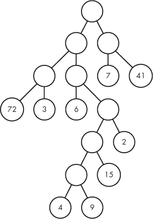
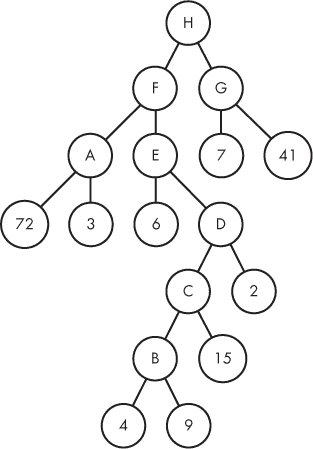
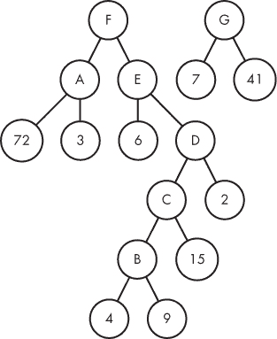
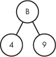
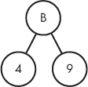
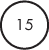
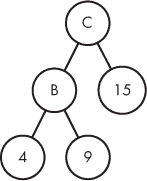
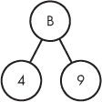
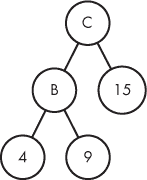
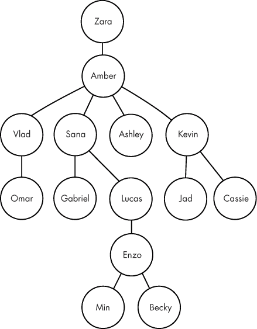

## 树与递归


本章我们将讨论两个需要处理和解答层次数据问题的题目。第一个问题是关于从邻里收集糖果，第二个问题则是关于家谱查询。由于循环是处理数据集合的自然方式，我们会先尝试使用循环。但很快我们就会发现，这些问题挑战了我们通过循环轻松表达的能力，这将促使我们改变思考和解决问题的方式。本章结束时，你将了解递归，这是一种在解决问题时应用的技巧，特别是当问题的解决方案涉及到对更简单、更小问题的解决方案时。

### 问题 1：万圣节糖果

这是 DMOJ 问题 `dwite12c1p4`。

#### *问题*

万圣节到了，这是一个通常涉及穿上戏服、从邻居那里获得糖果以及吃到肚子痛的节日。在这个问题中，你要尽可能高效地收集某个特定邻里的所有糖果。这个邻里有着严谨而奇特的形状。图 2-1 展示了一个示例邻里。



*图 2-1：一个示例邻里*

带有数字的圆圈是房子。每个数字表示你访问该房子时将获得的糖果数量。糖果值最多是两位数。顶部的圆圈是你的起始位置。没有数字的圆圈是街道交叉口，你可以选择接下来要走的方向。连接圆圈的线条是街道。从一个圆圈移动到另一个圆圈就相当于走一条街道。

让我们思考一下你如何通过这个邻里移动。从顶部圆圈开始。如果你沿着右边的街道走，你会到达一个交叉口。如果你从这个圆圈沿右边的街道继续走，你将到达一个房子并收集到 41 块糖果。然后你可以沿两条街道走回顶部，回到起始位置。这样你总共走了四条街道并收集了 41 块糖果。

然而，你的目标是收集*所有*的糖果，并通过走最少的街道来实现这一目标。你可以在收集完所有糖果后立即结束步行；不需要返回到起始圆圈。

##### 输入

输入由恰好五行组成，每行是最多 255 个字符的字符串，描述一个邻里。

如何用字符串编码一个图形？这与第一章中的独特雪花问题不同，后者中的每个雪花只是六个整数。在这里，我们有圆圈、连接圆圈的线条以及一些圆圈中的糖果值。

与独特的雪花问题一样，我们可以通过最初忽略一些完整问题的复杂性来简化问题。因此，我将推迟输入方式的说明。虽然如此，我可以给你一个预告：有一种相当巧妙且简洁的方式将这些图形表示为字符串，敬请期待。

##### 输出

我们的输出将是五行文本，每一行对应一个输入行。每一行输出包含两个由空格分隔的整数：获取所有糖果所需的最小步数和获得的糖果总量。

解决测试用例的时间限制是两秒钟。

#### *二叉树*

在图 2-2 中，我在图 2-1 的基础上，添加了非房子圆圈中的字母。这些字母与问题无关，不会影响我们的代码，但它们使我们能够唯一地引用每个圆圈。



*图 2-2：带有字母标签的示例邻域*

我们的万圣节任务问题中的邻域特定形状被称为*二叉树*。*二叉*和*树*这两个词在这里都很重要。让我们从树的定义开始解释。

##### 定义树

*树*是一种由*节点*（圆圈）和节点之间的*边*（表示街道的线）组成的结构。顶部的节点——H 圆圈——被称为*根*。你经常会看到*顶点*与节点同义使用；在本书中，我将坚持使用“节点”这一术语。

树中的节点具有父子关系。例如，我们说 H 是 F 和 G 的*父节点*，因为从 H 到 F 和从 H 到 G 都有边。我们也说 F 和 G 是 H 的*子节点*。更具体地说，F 是 H 的*左子节点*，而 G 是 H 的*右子节点*。任何没有子节点的节点被称为*叶子*。在当前问题中，具有糖果值的节点（即房子）是叶子节点。

计算机科学家在讨论树时使用的许多术语，源自家谱树的概念。例如，F 和 G 是*兄妹*，因为它们有相同的父母。E 是 H 的*后代*，因为 E 可以通过从 H 向下遍历树来到达。

树的*高度*由我们可以从根节点到叶子节点的最大边数决定。那么，我们的示例树的高度是多少呢？好吧，这里有一条我们可以遍历的下行路径：H 到 G 到 7。这条路径有两条边（H 到 G 和 G 到 7），所以它的高度至少是二。然而，我们可以找到一条更长的下行路径！以下是最长的下行路径之一：H 到 F 到 E 到 D 到 C 到 B 到 4。这条路径有六条边。自己验证一下，这里没有比这更长的下行路径了。该树的高度是六。

树具有非常规律、可重复的结构，这有助于我们处理它们。例如，如果我们移除根节点 H，以及从 H 到 F 和从 H 到 G 的边，我们最终会得到两个*子树*（图 2-3）。



*图 2-3：一棵树被分成两部分*

请注意，这两个子树各自都是一个合法的树：它们有根节点、节点和边，以及正确的结构。我们可以进一步将这些树拆分成更小的部分，每一部分都将是一个树。树可以看作是由更小的树组成的，而每棵小树又由更小的树组成，如此类推。

##### 定义二叉树

在树的上下文中，*二叉*仅仅意味着我们树中的每个节点最多有两个子节点。一个二叉树中的节点可以没有子节点，或者只有一个子节点，或者有两个子节点，但不能有更多。我们当前问题中的二叉树实际上比这更为受限：每个节点必须恰好有零个或两个子节点——你永远不会看到只有一个子节点的节点。这样的二叉树，其中每个非叶子节点恰好有两个子节点，称为*完全*二叉树。

#### *解决示例实例*

现在，让我们在我们的示例树上解决万圣节糖果收集问题（图 2-2）。我们需要返回我们必须走的最少街道数以及糖果的总数。我们先从后者开始，因为计算总糖果数较为简单。

我们可以手动计算糖果总数：只需将所有房子节点中的糖果值加起来。这样做，我们得到 7 + 41 + 72 + 3 + 6 + 2 + 15 + 4 + 9 = 159。

现在，让我们来弄清楚收集所有糖果必须走的最少街道数。树的遍历方式有关系吗？毕竟，你必须访问每一所房子——也许你最快的路线是避免多次访问同一所房子。

让我们按访问左子节点再访问右子节点的策略遍历这棵树。按照这个策略，你访问节点的顺序是：H, F, A, 72, A, 3, A, F, E, 6, E, D, C, B, 4, B, 9, B, C, 15, C, D, 2, D, E, F, H, G, 7, G, 41。注意你最后停下来的地方是 41 号房，而不是 H：收集完糖果后，你不需要返回起始位置。那条路径有 30 条边。（路径中有 31 个节点，路径中的边数总是节点数减去 1。）走 30 条街道是你能做的最好的选择吗？

实际上，你可以做得更好：最有效的路线只需要走 26 条街道。现在花点时间试着找到这种更优化的遍历方式。就像在 30 条街道的遍历中一样，你需要多次访问非房子节点，并且希望每个房子只访问一次，但通过在*最后*访问的房子上采取策略，你可以节省四次走街道的时间。

#### *表示二叉树*

为了在代码中创建解决方案，我们需要找到一种表示邻里树的方法。正如你将看到的，将输入中表示树的字符串转换为明确表示节点之间关系的树结构是很方便的。在这一节中，我将提供这些树结构。虽然我们还不能读取字符串并将其转换为树，但我们可以硬编码树。这样就为我们提供了一个起点，开始解决问题。

##### 定义节点

在上一章解决“独特雪花”问题时，我们使用了一个链表来存储雪花链。每个雪花节点包含了雪花本身，同时也包含指向链中下一个雪花的指针：

```
typedef struct snowflake_node {
  int snowflake[6];
  struct snowflake_node *next;
} snowflake_node;
```

我们可以使用类似的结构体来表示二叉树。在我们的邻里树中，房子节点有糖果值，而其他节点没有。尽管我们有这两种节点类型，但只用一个节点结构就足够了。我们只需要确保房子节点有正确的糖果值；我们甚至不会初始化非房子节点的`candy`值，因为我们反正不会查看这些值。

这为我们提供了这个起点：

```
typedef struct node {
  int candy;
  // ... what else should we add?
} node;
```

在链表中，每个节点都指向链中的下一个节点（如果没有下一个节点，则为`NULL`）。从一个节点，我们只能移动到另一个节点。相比之下，在树结构中，一个单一的`next`指针是不够的，因为一个非叶子节点将有左子节点和右子节点。我们需要每个节点两个指针，正如示例 2-1 所示。

```
typedef struct node {
  int candy;
  struct node *left, *right;
} node;
```

*示例 2-1：* 节点 *结构体*

很明显，`parent`在这里没有包含。我们是否应该再加上一个`*parent`，让我们可以访问节点的父节点以及它的子节点？这对于某些问题来说是有用的，但在“万圣节大作战”中并不是必须的。我们需要一种方式来向上移动树（从子节点到父节点），但我们可以通过隐式方式做到这一点，而不需要明确地跟踪父指针。稍后你会看到更多关于这一点的内容。

##### 构建树

有了这个`node`类型后，我们现在可以构建示例树了。我们从下往上工作，将子树联合起来，直到到达根节点。让我们在示例树上演示这一过程的开始。

我们从示例树底部的 4 号和 9 号节点开始。然后我们可以将它们组合在一个新的父节点下，创建以 B 为根的子树。

这是 4 号节点：

```
  node *four = malloc(sizeof(node));
  four->candy = 4;
  four->left = NULL;
  four->right = NULL;
```

这是一个房子节点，所以我们记得给它一个糖果值。还需要将它的左子节点和右子节点设置为`NULL`。如果我们不这么做，它们将保持未初始化，指向未定义的内存，如果我们尝试访问这些节点，就会出现问题。

现在考虑 9 号节点。这是另一座房子，因此代码结构完全相同：

```
  node *nine = malloc(sizeof(node));
  nine->candy = 9;
  nine->left = NULL;
  nine->right = NULL;
```

现在我们有了两个节点。它们还不是树的一部分，它们只是独立存在。我们可以将它们联合在一个公共父节点下，像这样：

```
  node *B = malloc(sizeof(node));
  B->left = four;
  B->right = nine;
```

这个 `B` 节点被赋予了一个指向 4 房子的左指针和一个指向 9 房子的右指针。它的 `candy` 成员没有初始化，这没关系，因为非房子节点本来就没有合理的 `candy` 值。

图 2-4 描述了我们目前为止生成的内容。



*图 2-4：我们硬编码树中的前三个节点*

在继续创建 C 子树之前，让我们做一点清理工作。创建一个房子节点需要四个步骤：分配节点，设置糖果值，将左子节点设置为 `NULL`，将右子节点设置为 `NULL`。类似地，创建一个非房子节点需要做三件事：分配节点，将左子节点设置为某个现有子树，将右子节点设置为另一个现有子树。我们可以将这些步骤封装在辅助函数中，而不是每次都输入它们，如列表 2-2 所示。

```
node *new_house(int candy) {
  node *house = malloc(sizeof(node));
  if (house == NULL) {
    fprintf(stderr, "malloc error\n");
    exit(1);
  }
  house->candy = candy;
  house->left = NULL;
  house->right = NULL;
  return house;
}

node *new_nonhouse(node *left, node *right) {
  node *nonhouse = malloc(sizeof(node));
  if (nonhouse == NULL) {
    fprintf(stderr, "malloc error\n");
    exit(1);
  }
  nonhouse->left = left;
  nonhouse->right = right;
  return nonhouse;
}
```

*列表 2-2：用于创建节点的辅助函数*

让我们重写之前的 `four`、`nine`、`B` 代码，使用这些辅助函数，同时加上 15 和 C 节点：

```
  node *four = new_house(4);
  node *nine = new_house(9);
  node *B = new_nonhouse(four, nine);
  node *fifteen = new_house(15);
  node *C = new_nonhouse(B, fifteen);
```

图 2-5 描述了我们的五节点树。


*图 2-5：我们硬编码树中的前五个节点*

注意，节点 `C` 的左子节点是一个非房子节点（在我们的代码中是 `B`），右子节点是一个房子节点（在我们的代码中是 `fifteen`）。我们的 `new_nonhouse` 函数允许这种不对称性（一个非房子子节点和一个房子子节点）：每个都只是一个节点。我们可以随意混合使用非房子节点和房子节点。

此时，我们已经有了一个以节点 `C` 为根的五节点子树。我们应该能够使用 `C` 节点来访问树中存储的糖果值。（我们也可以使用 `B`、`four`、`nine` 和 `fifteen` 来访问树的部分内容，因为分阶段构建树会留下节点变量的残余，但稍后我们会构建一个将字符串转换为树的函数，它只会提供树的根节点，所以在这里不要通过使用这些变量来作弊。）

这里有个快速练习：这将打印什么？

```
  printf("%d\n", C->right->candy);
```

如果你说是 `15`，那你是对的！我们访问了 `C` 的右子节点，即 `fifteen` 房子节点，然后我们访问了 `fifteen` 的糖果值。

这个怎么样？

```
printf("%d\n", C->left->right->candy);
```

这应该输出 `9`：先左后右，我们从 `C` 到达了 `nine`。现在试试这个：

```
printf("%d\n", C->left->left);
```

天哪！在我的笔记本上，我得到的值是 `10752944`。为什么？原因是我们打印的是一个指针值，而不是糖果值。我们必须小心这里。

最后，这将打印什么？

```
printf("%d\n", C->candy);
```

这给了我们一个无用的数字。我们在这里打印的是非房子节点的 `candy` 成员，但只有房子节点的 `candy` 值才有意义。

我们现在准备好开始解决这个问题了。完成代码来构建示例树，我们就可以继续前进了。

#### *收集所有糖果*

我们有两个主要任务：计算收集所有糖果所需的最少街道数和计算树中糖果的总量。我们将为每个任务编写一个辅助函数，从计算糖果总量开始，这是两个任务中较为简单的一个。这个辅助函数的签名如下：

```
int tree_candy(node *tree)
```

该函数接受一个指向树根节点的指针，并返回一个整数，这个整数将是树中糖果的总量。

如果我们处理的是链表，我们可以像在解决唯一雪花问题时那样使用循环。循环的主体将处理当前节点，然后使用节点的 `next` 成员来前进到下一个节点。在每一步，只有一个地方可以去：继续沿着链表向下走。然而，二叉树的结构更为复杂。每个非叶子节点都有左子树和右子树。每棵子树都必须遍历，否则我们就会错过处理树的一部分！

为了展示树的遍历过程，我们将返回到我们的示例树（图 2-2）：从节点 H 开始，我们应该先去哪儿？我们可以向右移动到 G，然后再向右移动到 41，收集那里 41 个糖果。然后呢？我们到了死胡同，还有更多的糖果需要收集。记住，每个非叶子节点仅存储指向其左子节点和右子节点的指针，而不是指向其父节点的指针。一旦到了 41，我们就无法返回到 G。

从头开始，我们需要从 H 移动到 G，并记录下我们必须稍后处理 F 子树——否则我们将无法返回到 F 子树。

一旦到了 G，我们类似地需要移动到 41，并记录下我们必须稍后处理 7 子树。当我们到达 41 时，发现没有子树需要处理，我们已经记录了两个待处理的子树（F 和 7）。

也许接下来我们选择处理 7 子树，这样糖果总数就是 41 + 7 = 48。之后，我们将处理 F 子树。关于从 F 出发去哪里做出任何决策都会导致某棵子树未被处理，所以我们也需要记录下来。

也就是说，如果我们使用循环，对于每个非叶子节点，我们必须做两件事：选择一个子树先处理，并记录下另一个子树待处理。选择一个子树相当于跟随 `left` 或 `right` 指针——这没有问题。然而，记录信息以便稍后访问另一个子树会更棘手。我们需要一种新工具。

##### 将待处理的子树存储在栈中

在任何时刻，我们可能有多个子树待我们稍后访问。我们需要能够将另一个子树添加到这个集合中，并在准备好处理时将子树移除并返回。

我们可以使用一个数组来管理这些记录。我们将定义一个大数组，可以容纳任意数量的待处理子树的引用。为了告诉我们有多少子树正在等待，我们将保持一个`highest_used`变量，用来追踪数组中正在使用的最高索引。例如，如果`highest_used`是`2`，这意味着索引`0`、`1`和`2`包含待处理子树的引用，而数组的其余部分目前没有使用。如果`highest_used`是`0`，这意味着只有索引`0`在使用。为了表示数组中没有部分正在使用，我们将`highest_used`设置为`-1`。

向数组中添加元素最简单的位置是索引`highest_used + 1`。如果我们尝试在其他地方添加元素，首先需要将现有元素向右移动；否则，我们会覆盖掉某个现有元素！类似地，从数组中移除元素最简单的位置是`highest_used`。使用其他索引则需要将元素向左移动，以填补被移除元素留下的空位。

使用这种方案，假设我们首先添加对子树 F 的引用，然后添加对子树 7 的引用。这将把 F 子树放在索引`0`的位置，把 7 子树放在索引`1`的位置。此时，`highest_used`的值为`1`。现在，当我们从这个数组中移除一个元素时，你认为会移除哪个子树：F 子树还是 7 子树？

7 子树被移除了！一般来说，最近添加的元素是被移除的元素。

计算机科学家称这种方式为*后进先出（LIFO）*访问。提供 LIFO 访问的数据集合被称为*堆栈*。向堆栈中添加元素称为*推入*，从堆栈中移除元素称为*弹出*。堆栈的*顶部*指的是下一个将从堆栈中弹出的元素；也就是说，堆栈的顶部是最近被推入的元素。

现实生活中到处都有堆栈。假设你有一些刚洗过的盘子，并将它们一一放置在橱柜的架子上。你放置的最后一个盘子（推入）将位于堆栈的顶部，它也将是你取出盘子时（弹出）最先拿走的盘子。这就是后进先出（LIFO）。

堆栈也支持文字处理器中的撤销功能。假设你先输入一个单词，然后输入第二个单词，再输入第三个单词。现在你点击撤销。第三个单词将被删除，因为它是你最后输入的单词。

##### 实现堆栈

让我们实现堆栈。首先，我们将数组和`highest_used`打包成一个结构体。这样可以将堆栈的变量集中在一起，并允许我们创建任意数量的堆栈。（在《Halloween Haul》游戏中，我们只需要一个堆栈，但你可能会在其他需要多个堆栈的环境中使用此代码。）以下是我们的定义：

```
#define SIZE 255

typedef struct stack {
  node * values[SIZE];
  int highest_used;
} stack;
```

回想一下，每行输入最多为 255 个字符。每个字符最多表示一个节点。我们处理的每棵树最多有 255 个节点，这也是为什么我们的`values`数组有 255 个元素空间的原因。此外，注意`values`中的每个元素都是`node *`类型，即指向`node`的指针。我们本可以直接存储节点，而不是节点的指针，但那样会降低内存效率，因为树中的节点在加入栈时会被重复存储。

我们将为栈的每个操作创建一个函数。首先，我们需要一个`new_stack`函数来创建一个新栈。接下来，我们需要`push_stack`和`pop_stack`函数，分别用来向栈中添加和从栈中移除元素。最后，我们会有一个`is_empty_stack`函数，用来告诉我们栈是否为空。

`new_stack`函数在列表 2-3 中提供。

```
stack *new_stack(void) {
❶ stack *s = malloc(sizeof(stack));
   if (s == NULL) {
     fprintf(stderr, "malloc error\n");
     exit(1);
  }
➋ s->highest_used = -1;
   return s;
}
```

*列表 2-3：创建栈*

首先，我们为栈分配内存 ➊。然后，我们将`highest_used`设置为`-1` ➋；回想一下，这里的`-1`表示栈为空。注意，我们在这里并没有对`s->values`中的元素进行初始化：我们的栈是空的，所以它的值不相关。

我将`stack_push`和`stack_pop`放在列表 2-4 中，以突出它们实现的对称性。

```
void push_stack(stack *s, node *value) {
❶ s->highest_used++;
➋ s->values[s->highest_used] = value;
}

node * pop_stack(stack *s) {
➌ node * ret = s->values[s->highest_used];
➍ s->highest_used--;
➎ return ret;
}
```

*列表 2-4：栈的推入与弹出*

在`push_stack`中，我们首先为一个新元素腾出空间 ➊，然后将`value`放入那个空闲位置 ➋。

我们的`pop_stack`函数负责移除索引为`highest_used`的元素。然而，如果它只是这么做，那么这个函数就没那么有用：我们可以调用它，它会为我们弹出元素，但它不会告诉我们弹出了什么！为了解决这个问题，我们将待移除的栈元素存储在`ret`中 ➌。然后，通过将`highest_used`减去一来移除该元素 ➍。最后，我们返回被移除的元素 ➎。

我没有在`push_stack`或`pop_stack`中包括错误检查。注意，如果你尝试推入超过最大元素数目，`push_stack`会失败——但我们很安全，因为我们已经将栈的大小设置为能够容纳任何输入的大小。同样地，如果你尝试从空栈中弹出元素，`pop_stack`也会失败——但我们会小心检查栈是否为空，在弹出之前确保栈不为空。当然，通用栈应当更加健壮！

我们将使用`is_empty_stack`（见列表 2-5）来判断栈是否为空，`is_empty_stack`使用`==`来检查`highest_used`是否为`-1`。

```
int is_empty_stack(stack *s) {
  return s->highest_used == -1;
}
```

*列表 2-5：判断栈是否为空*

在我们计算树中糖果的总数之前，让我们通过一个小的独立示例来练习栈的代码，具体见列表 2-6。我鼓励你花几分钟时间自己追踪这个示例。预测一下会发生什么！然后，运行代码并检查输出是否符合你的预期。

```
int main(void) {
  stack *s;
  s = new_stack();
  node *n, *n1, *n2, *n3;
  n1 = new_house(20);
  n2 = new_house(30);
  n3 = new_house(10);
  push_stack(s, n1);
  push_stack(s, n2);
  push_stack(s, n3);
  while (!is_empty_stack(s)) {
    n = pop_stack(s);
    printf("%d\n", n->candy);
  }
  return 0;
}
```

*清单 2-6：使用堆栈的示例*

让我们来看看这个示例做了什么。首先我们创建一个新的堆栈 `s`。然后我们创建三个房子节点：`n1` 有 20 个糖果，`n2` 有 30 个糖果，`n3` 有 10 个糖果。

我们将这些（单节点）子树推入堆栈：首先推入 `n1`，然后是 `n2`，再是 `n3`。只要堆栈不为空，我们就从堆栈中弹出一个元素，并打印它的糖果值。元素从堆栈中弹出的顺序与它们被推入的顺序相反，因此我们会得到 `printf` 调用的结果：10、30、20。

##### 堆栈解决方案

我们现在有了一种追踪待处理子树的方法：每当我们决定处理哪个子树时，就将另一个子树放入堆栈。对于计算糖果总量来说，堆栈给了我们一种方法来推入子树（帮助我们记住这个子树），并在准备好时弹出子树（帮助我们处理子树）。

我们也可以使用 *队列*，一种以 *先进先出（FIFO）* 顺序提供元素的数据结构，这将改变子树访问的顺序和我们添加糖果到总量的顺序，但最终结果是一样的。我选择了堆栈，因为它比队列更容易实现。

现在我们准备使用堆栈来实现 `tree_candy` 了。我们需要处理两种情况：第一种是当我们看到非房子节点时该怎么做，第二种是当我们看到房子节点时该怎么做。

为了判断当前节点是否是非房子节点，我们可以检查其`left`和`right`指针。对于非房子节点，这两个指针都不为 `NULL`，因为它们指向子树。如果确认我们正在查看的是非房子节点，我们将左子树的指针存入堆栈，然后继续遍历右子树。处理非房子节点的代码如下：

```
if (tree->left && tree->right) {
  push_stack(s, tree->left);
  tree = tree->right;
}
```

否则，如果 `left` 和 `right` 都是 `NULL`，那么我们正在查看一个房子节点。房子节点有糖果，因此我们应该做的第一件事是将该房子节点的糖果值加到总糖果量中：

```
total = total + tree->candy;
```

这是一个房子节点，因此树中不再有进一步的分支。如果堆栈为空，说明处理完毕：空堆栈表示没有更多待处理的子树。如果堆栈不为空，则需要从堆栈中弹出一个子树并处理它。处理房子节点的代码如下：

```
total = total + tree->candy;
if (is_empty_stack(s))
  tree = NULL;
else
  tree = pop_stack(s);
```

使用堆栈的完整代码 `tree_candy` 请见 清单 2-7。

```
int tree_candy(node *tree) {
  int total = 0;
  stack *s = new_stack();
  while (tree != NULL) {
    if (tree->left && tree->right) {
      push_stack(s, tree->left);
      tree = tree->right;
    } else {
      total = total + tree->candy;
      if (is_empty_stack(s))
        tree = NULL;
      else
        tree = pop_stack(s);
    }
  }
  return total;
}
```

*清单 2-7：使用堆栈计算糖果总量*

设 *n* 为树中节点的数量。每次执行 `while` 循环时，`tree` 是不同的节点。因此我们每个节点只会访问一次。每个节点最多会被推入和弹出堆栈一次。总的来说，每个节点参与的步骤是常数级别的，所以这个算法是线性时间，或者说是 *O*(*n*) 的。

#### *一个完全不同的解决方案*

我们的`tree_candy`函数是有效的，但它并不是最简单的解决方案。我们必须实现一个栈的功能。我们需要跟踪待处理的树。每当我们遇到死胡同时，我们需要回溯到待处理的树。由于两个原因，在树上编写函数时，像我们这样使用栈可能不是理想的解决策略：

1.  每当我们需要朝一个方向移动，但之后又必须回头走另一个方向时，我们就不得不使用这种栈式代码。树的处理经常出现需要这种模式的问题。

1.  基于栈的代码复杂度与问题的复杂度成正比。加总树中所有糖果并不算太难，但本章后面我们将解决的其他相关问题则更加具有挑战性。这些问题不仅需要一个待处理树的栈，还需要控制流信息来跟踪我们在每棵树上需要执行的处理。

我们将重写代码，使其能够在更高的抽象层次上工作，完全消除代码和思维过程中的栈。

##### 递归定义

我们基于栈的`tree_candy`函数关注的是解决问题所需的*特定步骤*：将这个推入栈中，在树中朝某个方向移动，当遇到死胡同时从栈中弹出，处理完整个树时停止。我现在将给出另一种解决方案，它关注的是问题的*结构*。这种方法通过将问题分解为更小的子问题来解决主要问题。该解决方案包括两个规则：

**规则 1** 如果树的根是一个房屋节点，那么树中的糖果总量等于该房屋中的糖果数量。

**规则 2** 如果树的根是一个非房屋节点，那么树中的糖果总量等于左子树中的糖果总量加上右子树中的糖果总量。

这被称为*递归*定义。如果一个定义通过引用子问题的解决方案来提供问题的解决方案，那么这个定义就是递归的。规则 2 就是在这里我们看到它的实际应用。我们关注的是解决计算树中糖果总量的原始问题。根据规则 2，这个总量可以通过将两个更小问题的解决方案相加来计算：左子树中的糖果总量和右子树中的糖果总量。

就在这个时候，我班上的学生通常会开始满脸困惑。这个描述怎么能解决问题呢？即使能，如何将这种东西写成代码呢？书籍和教程常常给递归定义蒙上神秘的面纱，要求相信但不去理解。然而，这并不需要盲目信任或胆大妄为。

让我们通过一个小例子来理解为什么这种递归定义是正确的。

考虑这个由一座房子和四块糖果组成的树：


规则 1 立即告诉我们这棵树的答案是四。以后我们看到这棵树时，只需要记住答案是四。

现在，考虑这棵只包含一个房子的树，里面有九颗糖果：


再次，规则 1 适用，告诉我们答案是九：当我们稍后看到这棵树时，我们只需要回答答案是九。

现在，让我们解决更大树的问题：



这次，规则 1 不适用：树的根是一个非房节点，而不是房节点。然而，我们得到了规则 2 的帮助，规则 2 告诉我们这里的糖果总数是左子树的糖果总数加上右子树的糖果总数。我们已经知道左子树的糖果总数是四：这是一棵我们之前见过的树。同样，我们知道右子树的糖果总数是九：我们也见过那棵树。因此，根据规则 2，整个树有 4 + 9 = 13 颗糖果。记住这个，当我们再次看到这棵树时！

再往前看一点。这是另一棵单房树，它有 15 颗糖果：



规则 1 告诉我们这棵树的糖果总数是 15 颗。记住这个！现在考虑一棵五节点的树：



规则 2 在这里适用，因为根是一个非房节点。我们需要左子树的糖果总数和右子树的糖果总数。我们已经知道左子树的糖果总数，因为我们记得之前的答案是 13。没有必要再去左子树重新计算什么：我们已经知道答案。同样，我们也知道右子树的糖果总数，因为它是 15。根据规则 2，整个树的糖果总数是 13 + 15 = 28 颗糖果。

你可以继续使用这个逻辑来找到越来越大树的糖果总数。正如我们在这里的例子中所做的那样，先解决较小的子树，再解决较大的子树。这样，规则 1 或规则 2 总是适用，较小子树的答案会在需要时知道。

让我们将规则 1 和规则 2 编码为 C 函数；请参见 列表 2-8。

```
int tree_candy(node *tree) {
❶ if (!tree->left && !tree->right)
     return tree->candy;
➋ return tree_candy(tree->left) + tree_candy(tree->right);
}
```

*列表 2-8：使用递归计算糖果总数*

注意规则 1 和规则 2 如何在这里直接表示。我们有一个 `if` 语句，当左子树和右子树都是 `NULL` 时条件为真 ➊。没有子树意味着 `tree` 是一个房节点。因此我们应该应用规则 1，这正是我们所做的。具体地，我们返回房节点 `tree` 中的糖果数量。如果规则 1 不适用，我们知道 `tree` 是一个非房节点，我们可以应用规则 2，返回左子树中的糖果加上右子树中的糖果 ➋... 但是这里我们暂停。

规则 2 如何在这里工作？左子树的糖果总量是通过在左子树上调用 `tree_candy` 得到的。对于右子树也是如此：要获得右子树的糖果总量，我们在右子树上调用 `tree_candy`。但是我们已经在 `tree_candy` 函数中了！

从函数内部调用自身被称为*递归调用*。一个进行递归调用的函数被称为使用了*递归*。在这一点上，你能犯的最大错误之一就是试图追踪计算机在递归发生时发生了什么。我会避免给出计算机如何组织这些递归调用的底层细节。（可以说，它使用栈来跟踪待处理的函数调用。这与我们之前在代码中使用栈来解决 `tree_candy` 问题非常相似！因此，我们的递归代码，像我们基于栈的代码一样，是一个 *O*(*n*) 解决方案。）

我反复看到试图手动追踪递归调用所带来的困境。这是一种错误的抽象层级。让计算机以同样的方式执行它，就像你不加思考地让计算机执行循环或函数调用一样。

这是我建议你理解递归代码的方式：

+   如果树的根节点是一个房子，返回它的糖果数量。

+   否则，树的根节点是一个非房子节点。返回左子树的糖果总量加上右子树的糖果总量。

编写递归代码时很容易出错。一个常见的错误是无意中丢弃本应返回的信息。以下错误的实现展示了这个问题：

```
// bugged!
int tree_candy(node *tree) {
  if (!tree->left && !tree->right)
    return tree->candy;
❶ tree_candy(tree->left) + tree_candy(tree->right);
}
```

我们的 bug 是在递归调用 ➊ 中没有返回任何值，因为没有 `return` 关键字。我们应该返回总和，而不是抛弃它。

另一个常见的错误是对不是当前问题更小子问题的对象进行递归调用。这里有一个例子：

```
// bugged!
int tree_candy(node *tree) {
  if (!tree->left && !tree->right)
    return tree->candy;
❶ return tree_candy(tree);
}
```

看看第二个 `return` 语句 ➊。如果我告诉你树中糖果的总量是通过计算树中糖果的总量得到的，我想你一定会很恼火——但这正是它所体现的规则。这个函数在树的根是非房子节点时不起作用：它会不断使用内存来保存待处理的函数调用，直到程序崩溃。

##### 递归练习

在继续解决万圣节糖果问题之前，让我们通过编写与`tree_candy`类似的两个函数来练习递归。

首先，给定一棵满二叉树的根节点指针，我们要返回树中节点的数量。如果该节点是叶子节点，那么树中只有一个节点，因此`1`是正确的返回值。否则，我们遇到的是一个非叶子节点，树中节点的数量是一个（即该节点）加上左子树节点的数量再加上右子树节点的数量。也就是说，两个规则如下：

**规则 1** 如果树的根是一个叶子节点，那么树中节点的数量等于`1`。

**规则 2** 如果树的根是一个非叶子节点，那么树中节点的数量等于`1`加上左子树中节点的数量，再加上右子树中节点的数量。

像规则 1 这样的规则被称为*基本情况*，因为它可以直接解决，无需使用递归。像规则 2 这样的规则被称为*递归情况*，因为它的解决需要递归地解决更小的子问题。每个递归函数至少需要一个基本情况和一个递归情况：基本情况告诉我们在问题简单时该怎么做，而递归情况告诉我们在问题复杂时该怎么做。

将这些规则转换为代码会得到示例 2-9 中的函数。

```
int tree_nodes(node *tree) {
  if (!tree->left && !tree->right)
    return 1;
  return 1 + tree_nodes(tree->left) + tree_nodes(tree->right);
}
```

*示例 2-9：计算节点的数量*

接下来，我们来写一个函数，返回树中叶子节点的数量。如果节点是叶子节点，则返回`1`。如果节点是非叶子节点，那么该节点*不是*叶子节点，因此不计算在内；需要计算的是左子树中叶子节点的数量和右子树中叶子节点的数量。代码在示例 2-10 中给出。

```
int tree_leaves(node *tree) {
  if (!tree->left && !tree->right)
    return 1;
  return tree_leaves(tree->left) + tree_leaves(tree->right);
}
```

*示例 2-10：计算叶子节点的数量*

这段代码与示例 2-9 中的代码唯一的区别是最后一行缺少了`1 +`。递归函数通常非常相似，但可以计算出非常不同的结果！

#### *最小街道数的步行路径*

我已经说了这么多，你可能需要重新回顾一下问题描述来重新定位自己。现在我们知道如何计算出糖果的总量了，但那只是两个必需输出中的一个。我们还需要输出获得所有糖果所需走的最少街道数量。想要猜出我们将如何解决这个问题吗？我们会使用递归！

##### 计算街道的数量

之前，我提供了图 2-2 中树的 30 条街道步行路径。我还要求你找到一个更好，实际上是最优的 26 条街道路径。这个最优路径通过利用收集完最后一颗糖果后就可以结束步行的事实，节省了四条街道。问题描述中并没有要求步行返回树的根节点。

如果我们*确实*将步行路径包括返回到树的根节点怎么办？确实这样会得到错误的答案，因为我们走的街道比要求的多。不过，返回根节点也大大简化了问题。我们就不需要为如何巧妙地进行步行以最小化街道数而烦恼了。（毕竟，我们最终会回到根节点，所以我们不需要精心安排最后访问的房子是个好选择。）也许我们可以通过返回根节点而超过最小值，然后减去走的多余街道？这是我们的赌注！

让我们按照`tree_candy`的相同计划来定义基本情况和递归情况。

如果树的根是房屋节点——从这个房屋开始并返回到这个房屋，我们需要走多少街道？答案是零！不需要走任何街道。

如果根节点是一个非房屋节点怎么办？返回到图 2-3，在这里我将树分成了两部分。假设我们已经知道了行走 F 子树所需的街道数和行走 G 子树所需的街道数。这些可以递归计算。然后，将 H 及其两条边加回来。现在我们还需要走多少街道？我们必须从 H 走一条街道到 F，完成 F 子树后，再从 F 走一条街道返回 H。对于 G 也是类似：从 H 走到 G，然后在完成 G 子树后从 G 返回 H。这四条额外的街道是递归计算之外的。

这里是我们的两个规则：

**规则 1** 如果树的根是房屋节点，那么我们走的街道数是零。

**规则 2** 如果树的根是一个非房屋节点，那么我们走的街道数是左子树所需的街道数加上右子树所需的街道数，再加上`4`。

在这一阶段，你应该开始更熟练地将这些规则转换成代码了。列表 2-11 提供了一个实现。

```
int tree_streets(node *tree) {
  if (!tree->left && !tree->right)
    return 0;
  return tree_streets(tree->left) + tree_streets(tree->right) + 4;
}
```

*列表 2-11：计算返回根节点所需的街道数*

如果你从 H 开始走图 2-2，收集所有糖果，并最终回到 H，你将走 32 条街道。无论你如何行走这棵树，只要每个房屋只访问一次，并且不重复走街道，你都会走 32 条。我们可以走的最少街道数是 26 条，无需返回根节点。从 32 减去 26 等于 6，所以通过回到根节点，我们多走了六条街道。

因为没有要求返回根节点，所以合理的做法是安排我们的行走，使得最后一个访问的房屋尽可能远离根节点。例如，最终在拥有 7 块糖果的房屋停下来就是一个糟糕的选择，因为无论如何我们离 H 只有两条街道——但看看那些远在底部的 4 号和 9 号房屋。将我们的行走结束在这些房屋之一将是很棒的。如果我们以 9 号房屋结束行走，那么我们可以节省六条街道：从 9 到 B，从 B 到 C，从 C 到 D，从 D 到 E，从 E 到 F，最后从 F 到 H。

计划是让我们的遍历以距离根节点最远的房子结束。如果那座房子距离根节点六条街道，意味着从根节点到某个叶子有六条边。这正是树的高度定义！如果我们能计算出树的高度——我敢打赌是递归地——那么我们可以从`tree_streets`给出的值中减去树的高度。这样就能让我们到达离根节点最远的房子，从而节省最大数量的街道。

顺便提一下，实际上没有必要知道哪座房子是最远的，甚至也不需要知道如何执行一次遍历来确保那座房子是最后一个。我们要做的只是说服自己，我们*可以*构建一条路径，使得那座房子成为最后一个。我将通过图 2-2 给出一个简短的论证，希望能说服你。从 H 开始，比较 F 和 G 子树的高度，完全遍历高度较小的那一棵——在这个例子中是 G。然后，重复这个过程，使用 F 的子树。比较 A 和 E 子树的高度，完全遍历 A 子树（因为它的高度比 E 的要小）。一直这样做，直到所有子树都被遍历；你访问的最后一座房子将是离 H 最远的房子。

##### 计算树的高度

现在让我们继续讨论`tree_height`和我们规则 1-规则 2 递归方法的另一种表现。

由单个房子组成的树的高度是零，因为没有任何边可以遍历。

对于根节点是非房子的树，再次参阅图 2-3。F 子树的高度为五，G 子树的高度为一。我们可以递归地解决这些子问题。原始树的高度（包括 H）是五和一的最大值加一，因为从 H 出发的边增加了到每个叶子的边数。

这一分析给出了以下两条规则：

**规则 1** 如果树的根是房子节点，那么树的高度为零。

**规则 2** 如果树的根是一个非房子节点，那么树的高度是左子树高度和右子树高度的最大值再加一。

参见清单 2-12 中的代码。我们有一个小的`max`辅助函数，用于告诉我们两个数字中的最大值；否则，`tree_height`没有什么惊讶之处。

```
int max(int v1, int v2) {
  if (v1 > v2)
    return v1;
  else
    return v2;
}

int tree_height(node *tree) {
  if (!tree->left && !tree->right)
    return 0;
  return 1 + max(tree_height(tree->left), tree_height(tree->right));
}
```

*清单 2-12：计算树的高度*

现在我们有了`tree_candy`来计算糖果的总量，`tree_streets`和`tree_height`来计算最小街道数。将这三者结合起来，给我们一个能在给定树的情况下解决问题的函数；见清单 2-13。

```
void tree_solve(node *tree) {
  int candy = tree_candy(tree);
  int height = tree_height(tree);
  int num_streets = tree_streets(tree) - height;
  printf("%d %d\n", num_streets, candy);
}
```

*清单 2-13：给定一棵树来解决问题*

尝试在你在“构建树”中创建的树上调用这个函数，参见第 43 页。

#### *读取输入*

我们现在已经非常接近了，但还没有完全解决。是的，如果我们手中有一棵树，我们可以解决这个问题，但请记住，问题的输入是文本行，而不是树。我们必须先将每一行转换为一棵树，然后才能对其应用`tree_solve`。最终，我们终于准备好揭示树是如何作为文本表示的。

##### 将树表示为字符串

我将通过几个例子向你展示文本和其树形结构之间的对应关系。

首先，一个单一房屋节点的树仅仅通过糖果值的文本来表示。例如，这棵树（其节点的糖果值是四）：


表示如下：

```
4
```

一棵根节点是非房屋节点的树（递归地！）按照以下顺序表示：一个左括号、第一个较小的树、一个空格、第二个较小的树和一个右括号。这里的第一个较小的树是左子树，第二个较小的树是右子树。例如，这棵三节点的树



表示如下：

```
(4 9)
```

类似地，这里是一个五节点的树：



这个五节点的树表示如下：

```
((4 9) 15)
```

这里，左子树是`(4 9)`，右子树是`15`。

以规则的形式，我们有以下内容：

**规则 1**   如果文本是整数`c`的数字，那么树就是一个带有`c`糖果的单一房屋节点。

**规则 2**   如果文本以左括号开始，那么树的根节点是一个非房屋节点。在左括号之后，文本包含树的左子树、一个空格、树的右子树和右括号。

##### 读取非房屋节点

我们的目标是编写具有以下签名的`read_tree`函数：

```
node *read_tree(char *line)
```

它接受一个字符串，并返回相应的树。

让我们从实现规则 2 开始，因为规则 1 涉及将字符转换为整数的微妙工作。

规则 2，这个递归规则，要求我们对`read_tree`进行两次调用：一次读取左子树，一次读取右子树。让我们看看我们能走多远：

```
 node *tree;
 tree = malloc(sizeof(node));
 if (line[0] == '(') {
❶ tree->left = read_tree(&line[1]);
➋ tree->right = read_tree(???);
   return tree;
}
```

在为树的根分配内存后，我们发起递归调用来读取左子树 ➊。我们传递一个指向 `line` 索引 `1` 的指针，以便递归调用接收到的字符串不包括索引 `0` 处的左括号。然而，在下一行中，我们遇到了问题 ➋。我们该从哪里开始读取右子树？换句话说，左子树有多少个字符？我们不知道！我们本可以写一个单独的函数来找出左子树的结束位置。例如，我们可以计算开括号和闭括号的数量，直到它们相等，但这似乎有些浪费：如果 `read_tree` 已成功读取左子树，那么那个递归调用肯定知道左子树在哪里结束吧？如果只有一种方法能将这个信息传回给原始的 `read_tree` 调用，它就能利用这个信息来确定应该将字符串的哪一部分传递给第二个递归调用。

向递归函数添加参数是一种通用且强大的方法来解决这类问题。每当递归调用有一些信息未通过其返回值传递，或者需要某些未传递的信息时，可以考虑添加一个参数。如果该参数是指针类型，它既可以用于将附加信息传递给递归调用，也可以用来接收返回的信息。

对于我们的目的，我们希望能够告诉递归调用它的字符串从哪里开始。同时，我们希望递归调用能够在完成时告诉我们应该从哪里继续处理字符串。为此，我们将添加一个整数指针参数 `pos`。然而，我们不想将这个参数添加到 `read_tree` 中，因为 `read_tree` 的调用者不需要知道这个额外的参数。`read_tree` 的调用者应该只需传递一个字符串，而不关心这个内部实现的 `pos` 参数。

我们将保持 `read_tree` 的签名不变，仅保留 `line` 参数。然后，`read_tree` 将调用 `read_tree_helper`，而 `read_tree_helper` 拥有这个 `pos` 参数，并引发递归。

列表 2-14 给出了 `read_tree` 代码。它将一个指针指向 `0` 传递给 `read_tree_helper`，因为索引 `0`（字符串的开始位置）是我们希望开始处理的地方。

```
node *read_tree(char *line) {
  int pos = 0;
  return read_tree_helper(line, &pos);
}
```

*列表 2-14：调用我们的助手，传递一个指向* int 的指针

我们现在准备好再次尝试实现规则 2：

```
 node *tree;
 tree = malloc(sizeof(node));
 if (line[*pos] == '(') {
❶ (*pos)++;
   tree->left = read_tree_helper(line, pos);
➋ (*pos)++;
   tree->right = read_tree_helper(line, pos);
➌ (*pos)++;
   return tree;
 }
```

该函数将被调用，`pos`指向树的第一个字符，因此我们首先将`pos`向前移动一个字符，以跳过开括号➊。现在，`pos`正好位于左子树的起始位置。然后我们递归地调用来读取左子树。这个递归调用将更新`pos`，指向左子树后的字符索引。由于左子树后面是一个空格，我们跳过这个空格➋。现在我们位于右子树的起始位置；我们递归地抓取右子树，然后跳过闭括号➌，它是最初跳过的开括号的匹配闭括号➊。跳过闭括号很重要，因为这个函数负责处理整个子树，包括它的闭括号。如果我们没有跳过这个闭括号，调用该函数的人可能会看到一个闭括号，而他们本来应该看到一个空格。跳过闭括号后，剩下的工作就是返回我们的树。

##### 读取一个房屋节点

解决完规则 2 后，我们来处理规则 1。在我们能取得更大进展之前，我们需要能够将字符串的一部分转换为整数。让我们编写一个小程序，确保我们能够做到这一点。这个程序将接受一个字符串，我们假设它代表一个房屋节点，并输出它的糖果值。令人吃惊的是，如果我们不小心，可能会得到令人困惑的结果。请注意：在清单 2-15 中，我们并没有小心。

```
#define SIZE 255

// bugged!
int main(void) {
  char line[SIZE + 1];
  int candy;
  gets(line);
  candy = line[0];
  printf("%d\n", candy);
  return 0;
}
```

*清单 2-15：读取糖果值（有 bug！）*

运行这个程序并输入数字`4`。

你可能会看到`52`作为输出。再运行一次，输入数字`9`，你可能会看到`57`。现在再试一下输入`0`，你可能会看到`48`。最后，试试输入从`0`到`9`的每个数字。你应该会发现每个输出值与`0`的输出值偏差相同。如果`0`输出 48，那么`1`将输出 49，`2`输出 50，`3`输出 51，依此类推。

我们在这里看到的是每个数字的字符代码。关键点是，整数的字符代码是连续的。因此，我们可以通过减去零的字符代码，将整数放入正确的范围。修正后，我们得到清单 2-16 中的代码。试试看吧！

```
#define SIZE 255

int main(void) {
  char line[SIZE + 1];
  int candy;
  gets(line);
  candy = line[0] - '0';
  printf("%d\n", candy);
  return 0;
}
```

*清单 2-16：读取糖果值*

这个小程序适用于单个数字的整数。然而，Halloween Haul 的描述要求我们也能处理两位数的糖果整数。假设我们先读到数字`2`，然后是数字`8`。我们希望将这两个数字组合起来，得到整数`28`。我们可以通过将第一个数字乘以 10（这样就得到 20），然后再加上 8（总共是 28）来实现。清单 2-17 是另一个小测试程序，帮助我们检查我们是否做对了。在这里，我们假设会输入一个两位数的字符串。

```
#define SIZE 255

int main(void) {
  char line[SIZE + 1];
  int digit1, digit2, candy;
  gets(line);
  digit1 = line[0] - '0';
  digit2 = line[1] - '0';
  candy = 10 * digit1 + digit2;
  printf("%d\n", candy);
  return 0;
}
```

*清单 2-17：读取一个两位数的糖果值*

这就是规则 1 所需的全部内容，我们可以写出如下代码：

```
   --snip--
   tree->left = NULL;
   tree->right = NULL;
❶ tree->candy = line[*pos] - '0';
➋ (*pos)++;
   if (line[*pos] != ')' && line[*pos] != ' ' &&
     line[*pos] != '\0') {
  ➌ tree->candy = tree->candy * 10 + line[*pos] - '0';
➍ (*pos)++;
}
return tree;
```

我们首先将左子树和右子树设置为`NULL`；毕竟我们是在创建一个树节点。接下来，我们取一个字符并将其转换为数字❶，然后跳过该数字➋。现在，如果这个糖果值只有一位数字，那么我们就已经正确存储了它的值。如果是两位数字，那么我们需要将第一位数字乘以 10 并加上第二位数字。因此，我们需要确定糖果值是一个数字还是两个数字。如果我们看到的不是一个右括号、空格或者字符串末尾的空字符，那么我们就必须在看第二位数字。如果第二位数字存在，我们将其加入到糖果值中➌，并移动到下一个数字 ➍。

清单 2-18 展示了我们为规则 2 和规则 1 编写的代码。

```
node *read_tree_helper(char *line, int *pos) {
  node *tree;
  tree = malloc(sizeof(node));
  if (tree == NULL) {
    fprintf(stderr, "malloc error\n");
    exit(1);
  }
  if (line[*pos] == '(') {
    (*pos)++;
    tree->left = read_tree_helper(line, pos);
    (*pos)++;
    tree->right = read_tree_helper(line, pos);
    (*pos)++;
    return tree;
  } else {
    tree->left = NULL;
    tree->right = NULL;
    tree->candy = line[*pos] - '0';
    (*pos)++;
    if (line[*pos] != ')' && line[*pos] != ' ' &&
        line[*pos] != '\0') {
      tree->candy = tree->candy * 10 + line[*pos] - '0';
      (*pos)++;
    }
    return tree;
  }
}
```

*清单 2-18：将字符串转换为树*

剩下的就是构建一个整洁的`main`函数，读取每个测试用例并解决它！清单 2-19 就是所需的一切。

```
#define SIZE 255
#define TEST_CASES 5

int main(void) {
  int i;
  char line[SIZE + 1];
  node *tree;
  for (i = 0; i < TEST_CASES; i++) {
    gets(line);
    tree = read_tree(line);
    tree_solve(tree);
  }
  return 0;
}
```

*清单 2-19：主函数*

我们已经成功使用递归解决了这个问题，你应该能通过将我们的解法提交给判题系统来验证这一点。

### 为什么使用递归？

有时候很难知道递归是否能为一个问题提供简洁的解决方案。这里有一个明显的标志：每当一个问题可以通过组合解决更小子问题的解决方案来解决时，你应该尝试使用递归。在本章的所有递归代码中，我们都是通过解决正好两个子问题来解决更大的问题。这类“两子问题”的问题非常常见，但有些问题可能需要解决三个、四个或更多的子问题。

你怎么知道将一个问题分解为子问题可以帮助你解决原始问题，且你又怎么知道这些子问题是什么呢？我们将在第三章中重新探讨这些问题，当时我们会基于在这里学到的内容，研究记忆化和动态规划。与此同时，想一想，如果有人告诉你较小子问题的解决方案，你是否能够轻松地解决给定的问题。例如，回想一下计算树中糖果总数的问题。这不是一个简单的问题。如果有人告诉你左子树和右子树中的糖果总数，问题就变得容易了。通过知道子问题的解决方案使问题变得更简单，这强烈暗示了递归的适用性。

让我们继续讨论另一个递归非常有用的问题。当你阅读问题描述时，试着找出递归会在何时、为何出现。

### 问题 2：后代距离

现在，我们将从二叉树转向一般树，其中节点可以有多个子节点。

这是 DMOJ 题目`ecna05b`。

#### *问题*

在这个问题中，我们给定了一个家族树和一个指定的距离*d*。树中每个节点的得分是它在距离*d*处的后代数量。我们的任务是输出得分较高的节点；我将在输出部分详细说明需要输出多少节点。为了理解我所说的指定距离的后代，请看图 2-6 中的家族树。



*图 2-6：一个示例家族树*

考虑 Amber 节点。Amber 有四个孩子，所以她在距离一的地方有四个后代。Amber 还有五个孙子：五个在距离二的节点。一般来说，我们可以说，对于任何节点，距离*d*处的后代数量是该节点到树中恰好距离*d*的节点数。

##### 输入

输入的第一行给出接下来将要处理的测试用例的数量。每个测试用例包含以下几行：

+   一行包含两个整数，*n*和*d*，其中*n*告诉我们该测试用例还有多少行，*d*指定了感兴趣的后代距离。

+   *n*行用于构建树。每行包含一个节点的名称，一个整数*m*，以及*m*个节点名称，表示该节点的子节点。这些名称最多 10 个字符长。这些行的顺序可以是任意的——父节点行不要求在其后代节点行之前。

每个测试用例最多包含 1,000 个节点。

下面是一个可能的输入，用于生成图 2-6 中的示例树，要求输出距离为二的后代最多的节点：

```
1
7 2
Lucas 1 Enzo
Zara 1 Amber
Sana 2 Gabriel Lucas
Enzo 2 Min Becky
Kevin 2 Jad Cassie
Amber 4 Vlad Sana Ashley Kevin
Vlad 1 Omar
```

##### 输出

每个测试用例的输出有两部分。

首先，输出以下一行：

```
Tree i:
```

其中 i 为`1`表示第一个测试用例，`2`表示第二个测试用例，以此类推。

然后，输出具有高分的节点信息（节点的得分是它在距离*d*处的后代数量），按得分从高到低排序。对于得分相同的节点，按字母顺序输出它们的名称。

使用以下规则确定输出多少个名称：

+   如果有三个或更少的名字具有距离为*d*的后代，则输出它们所有。

+   如果有超过三个名称在距离*d*处有后代，则首先输出得分最高的前三个名称。然后，输出每个得分与第三名相同的名称。例如，如果我们有得分为八、八、二、二、二、一、一的后代名称，我们将输出五个名称的信息：得分为八、八、二、二和二的节点。

对于每个需要输出的名称，我们输出一行，包含该名称，后跟一个空格，再后跟它在距离*d*处的后代数量。

每个测试用例的输出与下一个测试用例的输出之间由空行分隔。

以下是上面示例输入的输出：

```
Tree 1:
Amber 5
Zara 4
Lucas 2
```

解决测试用例的时间限制为 0.6 秒。

#### *读取输入*

这个问题与《万圣节大采购》问题之间的一个有趣区别是，我们不再处理二叉树了。在这里，一个节点可以有任意数量的孩子。我们需要更改节点结构，因为`left`和`right`指针将不再适用。相反，我们将使用一个`children`数组来存储孩子们，并使用一个整数`num_children`来记录数组中存储的孩子数量。我们还将有一个`name`成员来存储节点的名字（如 Zara、Amber 等），以及一个`score`成员，当我们计算距离*d*的后代数时使用。我们的`node`结构体定义见列表 2-20。

```
typedef struct node {
  int num_children;
  struct node **children;
  char *name;
  int score;
} node;
```

*列表 2-20：* 节点 *结构体*

在《万圣节大采购》中，树是通过递归定义的表达式开始的，我们可以从中递归地读取左右子树。但在这里情况不同：节点可以按任意顺序出现。例如，我们可能会看到

```
Zara 1 Amber
Amber 4 Vlad Sana Ashley Kevin
```

我们在这里先了解了 Zara 的孩子 Amber，而不是先了解 Amber 的孩子。然而，我们也可能会看到

```
Amber 4 Vlad Sana Ashley Kevin
Zara 1 Amber
```

我们在这里先了解了 Amber 的孩子，而不是 Zara 的孩子！

我们知道，从文件中读取的节点和父子关系，在处理完成后会形成一棵单一的树。然而，在处理这些行时，并没有保证我们始终会得到一棵树。例如，我们可能会读取以下几行

```
Lucas 1 Enzo
Zara 1 Amber
```

这告诉我们 Enzo 是 Lucas 的孩子，Amber 是 Zara 的孩子，但目前为止我们只知道这些。我们这里有两个不相连的子树，需要后续的行来连接这些子树。

由于这些原因，随着我们读取这些行，维持一棵单一的、连接的树是不可能的。相反，我们将维护一个指向节点的指针数组。每当我们看到一个之前没有见过的名字时，我们就会创建一个新节点，并将该节点的指针添加到数组中。因此，拥有一个辅助函数来搜索数组并告诉我们是否之前见过某个名字将会非常有价值。

##### 查找节点

列表 2-21 实现了一个`find_node`函数。`nodes`参数是一个指向节点的指针数组，`num_nodes`给出数组中指针的数量，`name`是我们要搜索的名字。

```
node *find_node(node *nodes[], int num_nodes, char *name) {
  int i;
  for (i = 0; i < num_nodes; i++)
    if (strcmp(nodes[i]->name, name) == 0)
      return nodes[i];
  return NULL;
}
```

*列表 2-21：查找节点*

*线性搜索*是逐个元素查找数组的一种方法。在我们的函数中，我们使用线性搜索来查找`nodes`，而且……等等！我们难道不是在搜索一个数组吗？这正是哈希表的用武之地（参见第一章）。我鼓励你自己尝试使用哈希表，并比较性能。为了简化处理，而且因为最多只有 1000 个节点，我们将继续使用这种（较慢的）线性搜索。

我们对数组中的每个名字与目标名字进行字符串比较。如果 `strcmp` 返回 `0`，意味着字符串相等，此时我们返回指向相应节点的指针。如果遍历完数组仍未找到该名字，我们返回 `NULL`，表示没有找到该名字。

##### 创建一个节点

当在数组中找不到一个名字时，我们需要创建一个包含该名字的节点。这将涉及到对 `malloc` 的调用，并且我们会看到在程序的其他部分也需要用到 `malloc`。因此，我编写了一个辅助函数 `malloc_safe`，在需要时可以调用。见清单 2-22：它只是一个常规的 `malloc`，但是加入了错误检查：

```
void *malloc_safe(int size) {
  char *mem = malloc(size);
  if (mem == NULL) {
    fprintf(stderr, "malloc error\n");
    exit(1);
  }
  return mem;
}
```

*清单 2-22: malloc_safe 函数*

清单 2-23 中的 `new_node` 辅助函数使用 `malloc_safe` 来创建一个新节点。

```
node *new_node(char *name) {
  node *n = malloc_safe(sizeof(node));
  n->name = name;
  n->num_children = 0;
  return n;
}
```

*清单 2-23: 创建一个节点*

我们为新节点分配内存，然后设置节点的 `name` 成员。接着，我们将节点的孩子数量设置为 `0`。这里我们使用零是因为我们可能不知道该节点有多少个孩子。例如，假设我们读取树的第一行是：

```
Lucas 1 Enzo
```

我们知道 Lucas 有一个孩子，但我们不清楚 Enzo 有多少个孩子。当 `new_node` 的调用者获得相关信息时，可以将孩子的数量设置为新的值。对于 Lucas 来说，这一过程立即发生，但对于 Enzo，则不会。

##### 构建家族树

现在我们准备读取并构建树。清单 2-24 给出了这个函数。这里的 `nodes` 是一个指向节点的指针数组，空间由调用此函数的代码分配；`num_lines` 表示要读取的行数。

```
#define MAX_NAME 10

int read_tree(node *nodes[], int num_lines) {
  node *parent_node, *child_node;
  char *parent_name, *child_name;
  int i, j, num_children;
  int num_nodes = 0;
❶ for (i = 0; i < num_lines; i++) {
   parent_name = malloc_safe(MAX_NAME + 1);
   scanf("%s", parent_name);
   scanf("%d", &num_children);
➋ parent_node = find_node(nodes, num_nodes, parent_name);
   if (parent_node == NULL) {
     parent_node = new_node(parent_name);
     nodes[num_nodes] = parent_node;
     num_nodes++;
   }
   else
   ➌ free(parent_name);

➍ parent_node->children = malloc_safe(sizeof(node) * num_children);
➎ parent_node->num_children = num_children;
   for (j = 0; j < num_children; j++) {
     child_name = malloc_safe(MAX_NAME + 1);
     scanf("%s", child_name);
     child_node = find_node(nodes, num_nodes, child_name);
     if (child_node == NULL) {
       child_node = new_node(child_name);
       nodes[num_nodes] = child_node;
       num_nodes++;
     }
     else
       free(child_name);
   ➏ parent_node->children[j] = child_node;
    }
  }
  return num_nodes;
}
```

*清单 2-24: 将行转换成树*

外层的 `for` 循环 ➊ 会对每一行输入（共有 `num_lines` 行）执行一次。每一行包含一个父母的名字以及一个或多个孩子的名字；我们首先处理父母的名字。我们分配内存，读取父母的名字，并读取父母的孩子数量。然后，我们使用 `find_node` 辅助函数来确定这个节点是否之前出现过 ➋。如果没有出现过，我们就使用 `new_node` 辅助函数创建一个新节点，将新节点的指针存储在 `nodes` 数组中，并增加节点数量。如果该节点已经在 `nodes` 数组中，我们就释放父母名字的内存，因为它将不再被使用 ➌。

接下来，我们为父节点的子指针分配内存 ➍，并存储子节点的数量 ➎。然后我们处理子节点；每个子节点的处理方式与父节点类似。一旦子节点存在并设置好其成员，我们将一个指针存储在父节点的 `children` 数组 ➏ 中。请注意，没有为子节点编写分配任何内存或设置子节点数量的代码，像我们为父节点所做的那样。如果我们之前见过某个子节点的名称，那么当第一次遇到这个名称时，它的子节点已经设置好了。如果这是我们第一次看到这个名称，那么当我们之后得知它的子节点时，会设置它的子节点；如果该子节点是叶子节点，它的子节点数量将保持初始化值 `0`。

最后，我们返回树中节点的数量。当我们想要处理每个节点时，我们需要这个数据。

#### *从一个节点的后代数量*

我们需要为每个节点计算距离 *d* 处的后代数量，以便找到具有最多此类后代的节点。一个更为谦逊的目标，也是本节的目标，是计算从一个节点出发的距离 *d* 处的后代数量。我们将以这个签名编写函数：

```
int score_one(node *n, int d)
```

`n` 是我们想要计算的节点，其后代在距离 `d` 处的数量。

如果 `d` 为 `1`，那么我们想知道 `n` 的子节点数量。我们可以做到这一点：我们已经为每个节点存储了一个 `num_children` 成员。我们所要做的就是返回它：

```
if (d == 1)
  return n->num_children;
```

如果 `d` 大于 `1`，那么该怎么办？也许可以先在更熟悉的二叉树上下文中思考一下。这里再次展示万圣节大礼包的二叉树（图 2-2）：


假设我们有一个二叉树的节点，想要知道它在某个指定距离处的后代数量。如果我们知道左子树和右子树中距离该距离的后代数量，这是否有帮助？

还不完全对。例如，假设我们想知道 H 节点在距离 2 处的后代数量。我们计算 F 节点和 G 节点在距离 2 处的后代数量。这样做没有帮助，因为这些后代离 H 的距离是 3！我们不关心距离 H 为 3 的节点。

我们该如何解决这个问题？我们计算 F 节点在距离 1 处的后代数量，以及 G 节点在距离 1 处的后代数量！每个节点离 H 的距离是 2。

因此，要计算任意距离 *d* 处的后代数量，我们需要计算左子树中距离 *d* – 1 的后代数量，以及右子树中距离 *d* – 1 的后代数量。

在家族树的上下文中，节点可以有超过两个子节点，我们稍微概括一下：距离 *d* 的后代数量是每个子树中距离 *d* – 1 的后代数量之和。那么，我们如何找到每个子树中距离 *d* – 1 的后代数量呢？是时候用递归了！

这里有一些规则供我们使用。给定一个节点 *n*：

**规则 1**   如果 *d* 等于 1，则在距离 *d* 的后代数量等于 *n* 的子节点数量。

**规则 2**   如果 *d* 大于 1，则在距离 *d* 的后代数量等于每个子树中距离 *d* – 1 的后代数量之和。

相应的代码在列表 2-25 中给出。

```
int score_one(node *n, int d) {
  int total, i;
  if (d == 1)
    return n->num_children;
  total = 0;
  for (i = 0; i < n->num_children; i++)
    total = total + score_one(n->children[i], d - 1);
  return total;
}
```

*列表 2-25：一个节点的后代数量*

#### *所有节点的后代数量*

要计算所有节点在距离 *d* 的后代数量，我们只需将 `score_one` 放入循环中（参见列表 2-26）。

```
void score_all(node **nodes, int num_nodes, int d) {
  int i;
  for (i = 0; i < num_nodes; i++)
    nodes[i]->score = score_one(nodes[i], d);
}
```

*列表 2-26：所有节点的后代数量*

这是我们在每个 `node` 结构体中使用 `score` 成员的地方：当这个函数运行时，`score` 将保存每个节点的后代数量。现在我们只需找出哪些节点具有最高的分数！

#### *排序节点*

在我们失败的雪花排序尝试中（参见“诊断问题”章节，见第 9 页），我们遇到了 C 语言中的 `qsort` 函数。我们可以在这里使用 `qsort` 来排序我们的节点。我们需要按照距离 *d* 的后代数量从高到低进行排序。如果节点在距离 *d* 的后代数量上有并列情况，我们就按字母顺序对这些节点进行排序。

要使用 `qsort`，我们需要编写一个比较函数，该函数接受两个元素的指针，并返回一个负整数（如果第一个元素小于第二个），返回 `0`（如果它们相等），或返回一个正整数（如果第一个元素大于第二个）。我们的比较函数在列表 2-27 中给出。

```
int compare(const void *v1, const void *v2) {
  const node *n1 = *(const node **)v1;
  const node *n2 = *(const node **)v2;
  if (n1->score > n2->score)
    return -1;
  if (n1->score < n2->score)
    return 1;
  return strcmp(n1->name, n2->name);
}
```

*列表 2-27：用于排序的比较函数*

任何 `qsort` 比较函数，如这个函数，具有相同的签名：它接受两个 `void` 指针。这些指针是 `const` 的，表示我们不应该对它们指向的元素进行任何修改。

在进行比较或其他方式访问底层元素之前，必须先对 `void` 指针进行类型转换。记住，`qsort` 会将我们数组中的两个元素的指针传递给 `compare`，但是因为我们的数组是指针的数组，传递给 `compare` 的实际上是指向元素指针的指针。因此，我们首先将 `void` 指针转换为 `const node**` 类型，然后使用 `*` 运算符来获取 `n1` 和 `n2` 的值，这样它们的类型就是 `const node*`。现在我们可以将 `n1` 和 `n2` 用作节点的指针了。

我们开始比较存储在每个节点中的分数。这些分数已经通过计算距离*d*的后代数得出。如果`n1`的后代数比`n2`多，我们返回`-1`表示`n1`应该排在`n2`之前。类似地，如果`n1`的后代数比`n2`少，我们返回`1`表示`n1`应该排在`n2`之后。

因此，只有当`n1`和`n2`在距离*d*的后代数相同时，才能到达最后一行。在这里，我们希望通过对节点的名称进行排序来打破平局。我们通过`strcmp`实现这一点，它会返回一个负数、零或正数，分别表示第一个字符串在字母顺序上小于、等于或大于第二个字符串。

#### *输出信息*

排序节点后，输出的名称是`nodes`数组开头的那些。清单 2-28 给出了生成该输出的函数：

```
void output_info(node *nodes[], int num_nodes) {
  int i = 0;
❶ while (i < 3 && i < num_nodes && nodes[i]->score > 0) {
     printf("%s %d\n", nodes[i]->name, nodes[i]->score);
     i++;
  ➋ while (i < num_nodes && nodes[i]->score == nodes[i - 1]->score) {
       printf("%s %d\n", nodes[i]->name, nodes[i]->score);
       i++;
    }
  }
}
```

*清单 2-28：输出节点*

变量`i`统计我们已经输出的节点数。外部`while`循环➊由三个条件控制，这三个条件共同决定是否允许我们输出更多节点。如果三个条件都为真，我们知道需要更多输出，因此进入该`while`循环的主体。然后，我们打印当前节点的信息，并增加`i`，使我们查看下一个节点。现在，只要这个新节点与前一个节点相同，我们就想继续输出节点，而不考虑“三个节点最大限制”规则。内部`while`循环➋的条件编码了这个逻辑：如果还有更多节点且当前节点的分数与前一个节点相同，那么我们进入内部`while`循环的主体，并打印相关节点的信息。

#### *主函数*

剩下的就是将我们的函数连接在一起，并添加处理测试用例的逻辑。我们在清单 2-29 中完成了这部分。

```
 #define MAX_NODES 1000

 int main(void) {
   int num_cases, case_num;
   int n, d, num_nodes;
❶ node **nodes = malloc_safe(sizeof(node) * MAX_NODES);
   scanf("%d", &num_cases);
   for (case_num = 1; case_num <= num_cases; case_num++) {
   ➋ printf("Tree %d:\n", case_num);
      scanf("%d %d", &n, &d);
      num_nodes = read_tree(nodes, n);
      score_all(nodes, num_nodes, d);
      qsort(nodes, num_nodes, sizeof(node*), compare);
      output_info(nodes, num_nodes);
   ➌ if (case_num < num_cases)
        printf("\n");
   }
   return 0;
 }
```

*清单 2-29：主* *函数*

我们首先为能够组成一个测试用例的最大节点数分配指针➊。然后，我们读取测试用例的数量，并针对每个测试用例循环一次。回想一下，每个测试用例需要两部分输出：关于测试用例编号的信息和关于相关节点的信息。第一部分通过一次`printf`调用来处理➋。对于第二部分，我们开始依赖之前的函数：我们读取树，解决每个节点的问题，排序节点，然后输出所需的信息。

代码的底部有一个检查，用于判断是否已经是最后一个测试用例➌；这是为了在测试之间输出一个空行。

### 总结

递归解决方案是优秀的，简单的，清晰的，易于构思，易于理解，并且容易证明正确……

至少，如果你阅读了足够多关于递归的资料并与足够多的递归爱好者交流，你大概会有这样的感觉。专家们的观点是显而易见的。然而，通过我的学生们，我发现递归的宣传方式和实际学习过程中存在一定的脱节。要真正理解专家的观点，确实需要时间和练习。如果你觉得递归的解决方案难以设计和信任，不必担心，继续努力！许多教师和作者都有自己介绍递归的方式和示例。我鼓励你寻找更多关于递归的资料，来补充我在这里提供的内容，这比书中的任何其他话题都更加重要。

在下一章，我们将继续探索递归，并针对不同类型的问题进行优化。

### 备注

《万圣节购物》最初来源于 2012 年 DWITE 编程竞赛第 1 轮。 《后代距离》最初来源于 2005 年东中北美地区编程竞赛。如果你想要一本关于递归的长篇书籍，可以参考 Eric Roberts（2005 年）的《*Thinking Recursively with Java*》。
