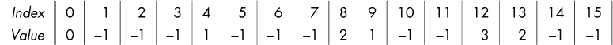
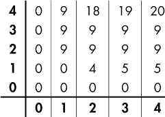

## **3

备忘录化和动态规划


在这一章中，我们将研究三个看似可以通过递归解决的问题。正如你所看到的，虽然理论上我们可以使用递归，但在实践中它会导致工作量的爆炸，使得问题变得不可解。别担心：你将学到两种强大的相关技巧，叫做备忘录化和动态规划，它们将带来惊人的性能提升，把运行时间从小时或天缩短到秒。在下一章中，我们将提升难度，使用这些技巧解决两个更具挑战性的问题。一旦你掌握了这些技巧，你将能够解决数百个其他编程问题。如果你要读本书的一章，那就读这一章。

### 问题 1：汉堡狂热

这是 UVa 问题`10465`。

#### *问题描述*

一位名叫霍默·辛普森的人喜欢吃喝。他有*t*分钟来吃汉堡和喝啤酒。有两种汉堡。一个汉堡需要*m*分钟吃完，另一个汉堡需要*n*分钟吃完。

霍默喜欢汉堡比啤酒更多，所以他想花整个*t*分钟吃汉堡。然而，这并不总是可能的。例如，如果 *m* = 4，*n* = 9，*t* = 15，那么无论如何组合 4 分钟和 9 分钟的汉堡，他都不能刚好花 15 分钟吃完汉堡。在这种情况下，他会尽可能多地吃汉堡，然后把剩下的时间用来喝啤酒。我们的任务是确定霍默能吃多少个汉堡。

##### 输入

我们将继续读取测试用例，直到没有更多输入。每个测试用例由一行三个整数表示：*m*，吃第一种汉堡所需的分钟数；*n*，吃第二种汉堡所需的分钟数；*t*，霍默将花费的分钟数来吃汉堡和喝啤酒。每个*m*，*n*，和*t*值都小于 10,000。

##### 输出

对于每个测试用例：

+   如果霍默可以刚好花*t*分钟吃汉堡，那么输出他可以吃到的最多汉堡数。

+   否则，输出霍默在尽量多吃汉堡的情况下能吃到的最多汉堡数，并输出空间和剩余的分钟数（在这段时间里，他会喝啤酒）。

解决测试用例的时间限制为三秒。

#### *制定计划*

让我们从考虑几个不同的测试用例开始。这里是第一个：

```
4 9 22
```

在这个例子中，第一种汉堡需要 4 分钟吃完（*m* = 4），第二种汉堡需要 9 分钟吃完（*n* = 9），霍默有 22 分钟可以花费（*t* = 22）。这是一个霍默可以通过吃汉堡填满全部时间的例子。霍默能吃到的最多汉堡数是三个，因此`3`是这个测试用例的正确输出。

荷马应该吃的三种汉堡是一个 4 分钟的汉堡和两个 9 分钟的汉堡。这样他需要花费 1 × 4 + 2 × 9 = 22 分钟，正好符合要求。不过请注意，我们*并没有*被要求标明每种汉堡的数量。我们唯一被要求的是输出汉堡的总数量。当我在下面提供每种汉堡的数量时，我这样做只是为了提供证据，证明所提的输出是合理的。

这是另一个测试用例：

```
4 9 54
```

再次，荷马可以通过吃汉堡填满整个时间。这里的正确输出是 `11`，通过吃九个 4 分钟的汉堡和两个 9 分钟的汉堡得到的。与 `4 9 22` 测试用例不同，在这里荷马有多种方法可以用汉堡恰好填满 54 分钟。例如，他可以吃六个 9 分钟的汉堡——这也能填满 54 分钟——但请记住，如果我们能够填满整个 `t` 分钟，那么我们需要输出 *最大* 的汉堡数量。

正如问题描述中所提到的，荷马并不总能完全用吃汉堡的方式填满 *t* 分钟。让我们以我在问题描述中给出的例子作为下一个测试用例来研究：

```
4 9 15
```

荷马应该吃多少个汉堡呢？他最多可以通过吃三个 4 分钟的汉堡来吃完三个汉堡。这样一来，荷马将花费 12 分钟吃汉堡，剩下的 15 – 12 = 3 分钟用来喝啤酒。所以他吃了三个汉堡，并且有 3 分钟的喝啤酒时间，输出为 `3 3`。我们是否解决了这个测试用例？

我们还没有解决！仔细重新阅读问题描述并专注于这一点：“输出荷马能吃到的最大数量的汉堡，以最大化他吃汉堡的时间。”也就是说，当荷马无法用吃汉堡的方式填满整个时间时，我们希望最大化他吃汉堡的 *时间*，然后输出他能在这段时间内吃到的最大数量的汉堡。对于 `4 9 15`，正确的输出实际上是 `2 2`：第一个 `2` 表示他吃了两个汉堡（一个 4 分钟的汉堡和一个 9 分钟的汉堡，共花费 13 分钟），第二个 `2` 表示他需要花 2 分钟（15 – 13）喝啤酒。

在 `4 9 22` 和 `4 9 54` 测试用例中，我们被要求分别解决 22 分钟和 54 分钟的情况。我们发现确实有一种方法可以用汉堡填满整个时间，所以我们可以报告最大数量的汉堡作为我们的解决方案。然而，在 `4 9 15` 的情况下，我们发现没有办法完全用吃汉堡的方式填满 15 分钟。想到我们的代码时，我们该如何处理呢？我们怎样才能得出答案是 `2 2` 呢？

一种思路是，我们可以接下来尝试用 4 分钟和 9 分钟的汉堡准确填满 14 分钟。如果成功，那么我们就得到了答案：我们报告霍默在准确 14 分钟内能吃的最大汉堡数量，然后是 1，霍默花在喝啤酒上的分钟数。这将最大化霍默吃汉堡的时间。我们已经知道吃汉堡 15 分钟是不可能的，所以 14 分钟是下一个最佳选择。

让我们看看 14 分钟能否成功。我们能用 4 分钟和 9 分钟的汉堡准确填满 14 分钟吗？不能！就像 15 分钟的情况一样，这也是不可能的。

但我们可以通过吃两个汉堡来准确填满 13 分钟：一个 4 分钟汉堡和一个 9 分钟汉堡。这就给霍默留了 2 分钟喝啤酒。这就证明了`2 2`是正确的输出。

总结来说，我们的计划是确定霍默是否能在准确的*t*分钟内吃汉堡。如果可以，那么任务完成：我们报告霍默能够吃的最大汉堡数量。如果不行，那么接下来我们要确定霍默是否能在准确的*t* – 1 分钟内吃汉堡。如果可以，那么任务完成，我们报告霍默能吃的最大汉堡数量以及他花在喝啤酒上的时间。如果不行，那么我们将继续尝试*t* – 2 分钟，再尝试*t* – 3 分钟，依此类推，直到找到可以完全用吃汉堡填满的时间。

#### *优化问题的表征*

以`4 9 22`测试案例为例。无论我们提出哪种汉堡和啤酒的组合，解决方案都必须正好用 22 分钟完成，而且必须能用 4 分钟和 9 分钟的汉堡来实现。符合问题规则的解决方案被称为*可行*解决方案。不符合规则的解决方案称为*不可行*解决方案。例如，让霍默花 4 分钟吃汉堡，18 分钟喝啤酒是可行的。让霍默花 8 分钟吃汉堡，18 分钟喝啤酒则是不可行的，因为 8 + 18 并不等于 22。让霍默花 5 分钟吃汉堡，17 分钟喝啤酒也是不可行的，因为我们无法用 4 分钟和 9 分钟的汉堡来凑满 5 分钟的汉堡时间。

汉堡热潮是一个*优化问题*。优化问题涉及从所有可行解中选择最好的——也就是*最优*的解决方案。可能会有许多可行解，质量各异。有些会很差，比如花 22 分钟喝啤酒。其他解可能接近但不是完全最优——可能相差一两分钟。当然，也会有一些是最优解。我们的目标是从所有可能的解中识别出最优解。

假设我们正在解决一个案例，其中第一种汉堡需要*m*分钟吃，第二种汉堡需要*n*分钟吃，而我们希望尝试花*exactly t*分钟吃汉堡。

如果*t* = 0，那么正确的输出是`0`，因为我们可以通过吃零个汉堡填满整个 0 分钟。接下来，我们将重点讨论*t*大于 0 时该怎么做。

让我们思考一下，最优解在*t*分钟内应该是什么样子的。当然，我们不可能知道任何具体的内容，比如“霍默先吃一个 4 分钟的汉堡，然后是一个 9 分钟的汉堡，再来一个 9 分钟的汉堡，接下来……”我们还没有做出任何解决方案，所以得到这种具体的细节只是痴心妄想。

然而，有一件事我们可以说，并非痴心妄想。它既简单到你可能会疑惑我为何要提及，又强大到它的核心包含了无数优化问题的解决策略。

事实如下：假设霍默可以通过吃汉堡来正好填满*t*分钟。（如果这个假设不成立，那么我们可以再尝试用*t* – 1 分钟、*t* – 2 分钟，依此类推。）他吃的最后一个汉堡，完成了他的*t*分钟，必须是一个*m*分钟的汉堡或一个*n*分钟的汉堡。

那么，最后一个汉堡怎么可能是别的呢？霍默只能吃*m*分钟和*n*分钟的汉堡，因此他吃的最后一个汉堡只有两种选择，最优解的结尾也只有两种可能。

如果我们知道霍默在一个最优解中吃的最后一个汉堡是一个*m*分钟的汉堡，那么我们就知道他还剩下*t* – *m*分钟可以花费。必须有一种方法来用汉堡填充这*t* – *m*分钟，而不喝啤酒：记住，我们假设霍默可以用吃汉堡来度过整个*t*分钟。如果我们能以最优方式度过这*t* – *m*分钟，让霍默吃到最多的汉堡，那么我们就得到了原始问题*t*分钟的最优解。我们会计算他在*t* – *m*分钟内能吃多少个汉堡，然后加上一个*m*分钟的汉堡来填补剩余的*m*分钟。

现在，假设我们知道霍默在最优解中吃的最后一个汉堡是一个*n*分钟的汉堡？那么他还有*t* – *n*分钟可以花费。同样，由于整个*t*分钟都花在吃汉堡上，我们知道霍默在前*t* – *n*分钟内一定能吃汉堡。如果我们能以最优方式度过这*t* – *n*分钟，那么我们就得到了原始问题*t*分钟的最优解。我们会计算他在*t* – *n*分钟内能吃多少个汉堡，然后加上一个*n*分钟的汉堡来填补剩余的*n*分钟。

现在，我们似乎完全进入了荒诞的领域。我们刚才假设知道了最后一个汉堡是什么！然而，我们怎么可能知道这个呢？我们确实知道最后一个汉堡是一个*m*分钟的汉堡*或者*一个*n*分钟的汉堡。我们肯定不知道它是哪一个。

美妙的事实是，我们不需要知道确切答案。我们可以假设最后一个汉堡是一个*m*分钟的汉堡，并在这种选择下最优地解决问题。然后我们再做另一个假设——假设最后一个汉堡是一个*n*分钟的汉堡，并在这种选择下最优地解决问题。在第一种情况下，我们有一个*t* - *m*分钟的子问题需要最优解决；在第二种情况下，我们有一个*t* - *n*分钟的子问题需要最优解决。每当我们用子问题的解法来描述一个问题的解法时，我们就应该尝试递归方法，就像我们在第二章中做的那样。

#### *解决方案 1：递归*

让我们尝试一个递归解法。我们将首先编写一个辅助函数，用来精确求解*t*分钟。完成后，我们将依赖这个函数来求解精确的*t*分钟、*t* - 1 分钟、*t* - 2 分钟，依此类推，直到我们能够完全用汉堡填满一些分钟数。

##### 辅助函数：求解分钟数

为了解决每个问题和子问题实例，我们需要三样东西：测试用例中的*m*和*n*，以及当前实例的*t*值。因此，我们将编写以下函数的主体：

```
int solve_t(int m, int n, int t)
```

如果霍默能恰好花`t`分钟吃汉堡，那么我们将返回他能够吃的最大汉堡数量。如果他无法恰好花`t`分钟吃汉堡——这意味着他至少需要花费 1 分钟喝啤酒——那么我们将返回`-1`。返回值为`0`或更大的数表示我们仅用汉堡就解决了问题；返回值为`-1`表示无法仅用汉堡解决问题。

如果我们调用`solve_t(4, 9, 22)`，我们期望返回值为`3`：这表示霍默在恰好 22 分钟内能吃的最大汉堡数量是 3 个。如果我们调用`solve_t(4, 9, 15)`，我们期望返回值为`-1`：没有任何 4 分钟和 9 分钟的汉堡组合能恰好给我们 15 分钟。

我们已经确定了当*t* = 0 时该怎么做：在这种情况下，我们没有时间，霍默吃零个汉堡：

```
if (t == 0)
  return 0;
```

这是我们递归的基准情况。为了实现这个函数的其余部分，我们需要上一节的分析。记住，要精确解决*t*分钟的问题，我们需要考虑霍默最后吃的那个汉堡。也许它是一个*m*分钟的汉堡。为了验证这个可能性，我们将求解*t* - *m*分钟的子问题。当然，最后的汉堡只有在我们至少有*m*分钟时间时，才可能是一个*m*分钟的汉堡。这个逻辑可以如下编程实现：

```
int first;
if (t >= m)
  first = solve_t(m, n, t - m);
else
  first = -1;
```

我们使用`first`来存储` t - m `子问题的最优解，`-1`表示“没有解”。如果`t >= m`，则表示有可能最后一个汉堡是*m*分钟的汉堡，因此我们进行递归调用来计算霍默在恰好` t - m `分钟内能够吃到的最优汉堡数量。如果可以精确解决，递归调用会返回大于`-1`的数字，如果无法解决，则返回`-1`。如果`t < m`，则不进行递归调用：我们将`first = -1`，表示*m*分钟的汉堡不能是最后一个汉堡，也无法在恰好`t`分钟内参与最优解。

那么，假设最后一个汉堡是*n*分钟的情况呢？这个情况的代码类似于*m*分钟汉堡的情况，只不过这次将结果存储在变量`second`中，而不是`first`：

```
int second;
if (t >= n)
  second = solve_t(m, n, t - n);
else
  second = -1;
```

让我们总结一下当前的进展：

+   变量`first`是` t - m `子问题的解。如果它是`-1`，那么我们无法用汉堡完全填满` t - m `分钟。如果是其他值，它则表示霍默可以在恰好` t - m `分钟内吃的最优汉堡数量。

+   变量`second`是` t - n `子问题的解。如果它是`-1`，那么我们无法用汉堡完全填满` t - n `分钟。如果是其他值，它则表示霍默可以在恰好` t - n `分钟内吃的最优汉堡数量。

有可能`first`和`second`都为`-1`。如果`first`为`-1`，则意味着*m*分钟的汉堡不能是最后一个汉堡。如果`second`为`-1`，则意味着*n*分钟的汉堡不能是最后一个汉堡。如果最后一个汉堡既不能是*m*分钟的汉堡，也不能是*n*分钟的汉堡，那么我们就没有其他选项，只能得出结论，无法在恰好`t`分钟内解决这个问题：

```
if (first == -1 && second == -1)
  return -1;
```

否则，如果`first`、`second`或两者都大于`-1`，那么我们至少可以构造一个解决方案来解决恰好`t`分钟的问题。在这种情况下，我们从`first`和`second`的最大值开始，选择更好的子问题解。如果我们将该最大值加一，从而包括最后一个汉堡，我们就得到了原问题在恰好`t`分钟的最优解：

```
return max(first, second) + 1;
```

完整的函数请参考列表 3-1。

```
int max(int v1, int v2) {
  if (v1 > v2)
    return v1;
  else
    return v2;
}

int solve_t(int m, int n, int t) {
  int first, second;
  if (t == 0)
    return 0;
  if (t >= m)
  ❶ first = solve_t(m, n, t - m);
   else
     first = -1;
   if (t >= n)
  ➋ second = solve_t(m, n, t - n);
   else
    second = -1;
  if (first == -1 && second == -1)
  ➌ return -1;
   else
  ➍ return max(first, second) + 1;
}
```

*列表 3-1：求解恰好 t 分钟的情况*

花几分钟时间了解这个函数的作用是值得的——即使你已经确信它是正确的。

让我们从`solve_t(4, 9, 22)`开始。`first` ❶的递归调用求解了 18 分钟（22 - 4）的子问题。该递归调用返回`2`，因为 Homer 在恰好 18 分钟内能吃的最大汉堡数是 2 个。`second` ➋的递归调用求解了 13 分钟（22 - 9）的子问题。该递归调用也返回`2`，因为 Homer 在恰好 13 分钟内能吃的最大汉堡数也是 2 个。也就是说，在这种情况下，`first`和`second`的值都是`2`；再加上最后四分钟或九分钟的汉堡，原始问题（恰好 22 分钟）的解就是`3` ➍。

现在让我们尝试`solve_t(4, 9, 20)`。`first` ❶的递归调用求解了 16 分钟（20 - 4）的子问题，并返回了`4`，但`second` ➋的递归调用又如何呢？它需要解决 11 分钟（20 - 9）的子问题，但无法通过吃 4 分钟和 9 分钟的汉堡恰好填满 11 分钟！因此，这个第二次递归调用返回`-1`。`first`和`second`中的最大值是`4`（`first`的值），因此我们返回`5` ➍。

到目前为止，我们已经看到过一个例子，其中两个递归调用都返回相同数量的汉堡子问题解，以及一个只有一个递归调用返回子问题解的例子。现在，让我们看一个每个递归调用都返回子问题解，但其中一个比另一个更优的情况！考虑`solve_t(4, 9, 36)`。`first` ❶的递归调用返回了`8`，这是 Homer 在恰好 32 分钟（36 - 4）内能吃的最大汉堡数。`second` ➋的递归调用返回了`3`，这是 Homer 在恰好 27 分钟（36 - 9）内能吃的最大汉堡数。`8`和`3`中的最大值是`8`，因此我们返回`9`作为整体解 ➍。

最后，尝试`solve_t(4, 9, 15)`。`first` ❶的递归调用要求解决恰好 11 分钟（15 - 4）的子问题，但由于无法用这些汉堡填满 11 分钟，它返回了`-1`。`second`递归调用 ➋ 的结果类似：解决恰好 6 分钟（15 - 9）的子问题也是不可能的，因此它也返回了`-1`。因此，无法解决恰好 15 分钟的问题，所以我们返回`-1` ➌。

##### solve 和 main 函数

回想一下在“制定计划”部分提到的内容，见于第 78 页，如果我们能够通过吃汉堡填满恰好*t*分钟，那么我们就能吃到最多的汉堡。否则，Homer 就必须至少花费一分钟喝啤酒。为了计算他必须花费的喝啤酒的时间，我们尝试计算恰好*t* - 1 分钟、*t* - 2 分钟，依此类推，直到找到一个可以通过吃汉堡填满的分钟数。幸运的是，通过我们的`solve_t`函数，我们可以将`t`参数设置为任何我们想要的值。我们可以从给定的`t`值开始，然后根据需要依次调用`t - 1`、`t - 2`等值。我们在示例 3-2 中实现了这个计划。

```
void solve(int m, int n, int t) {
  int result, i;
❶ result = solve_t(m, n, t);
   if (result >= 0)
  ➋ printf("%d\n", result);
   else {
     i = t - 1;
  ➌ result = solve_t(m, n, i);
     while (result == -1) {
       i--;
     ➍ result = solve_t(m, n, i);
     }
  ➎ printf("%d %d\n", result, t - i);
  }
}
```

*示例 3-2：解法 1*

首先，我们针对准确的 `t` 分钟解决问题 ❶。如果结果至少为零，那么我们输出最大数量的汉堡 ➋ 并停止。

如果 Homer 无法在整个 `t` 分钟内吃完汉堡，我们将 `i` 设置为 `t - 1`，因为 `t - 1` 是我们应该尝试的下一个最佳分钟数。然后我们针对这个新的 `i` 值 ➌ 来解决问题。如果结果不是 `-1`，则表示成功，跳过 `while` 循环。如果没有成功，`while` 循环将继续执行，直到我们成功解决一个子问题。在 `while` 循环中，我们递减 `i` 的值并解决那个更小的子问题 ➍。`while` 循环最终会终止；例如，我们肯定能用汉堡填满零分钟。一旦跳出 `while` 循环，我们就找到了可以用汉堡填满的最大分钟数 `i`。此时，`result` 将保存最大数量的汉堡，`t - i` 是剩余的分钟数，所以我们输出这两个值 ➎。

就是这样。我们在 `solve_t` 中使用递归来解决准确的 `t`。我们在不同的测试用例上测试了 `solve_t`，一切看起来都很不错。无法准确求解 `t` 并不成问题：我们在 `solve` 中使用一个循环，逐一尝试分钟数，从大到小。现在我们只需要一个 `main` 函数来读取输入并调用 `solve`；清单 3-3 提供了代码。

```
int main(void) {
  int m, n, t;
  while (scanf("%d%d%d", &m, &n, &t) != -1)
    solve(m, n, t);
  return 0;
}
```

*清单 3-3：主函数*

啊，这是一个和谐的时刻。我们现在准备将解法 1 提交给评审。请现在提交。我会等待……再等待……再等待。

#### *解法 2：记忆化*

解法 1 失败了，不是因为它不正确，而是因为它太慢。如果你将解法 1 提交给评审，你将收到一个 “超时” 错误。还记得在第一章中的 Unique Snowflakes 问题中我们收到的 “超时” 错误吗？当时，低效的表现是做了不必要的工作。而在这里，正如我们很快就会看到的，低效的原因并不在于做了不必要的工作，而是做了必要的工作一遍又一遍。

问题描述中提到，*t* 可以是小于 10,000 的任意分钟数。那么，下面这个测试用例应该不会有问题：

```
4 2 88
```

*m* 和 *n* 的值，`4` 和 `2`，都非常小。相对于 10,000，*t* 的值 `88` 也非常小。你可能会感到惊讶和失望，我们在这个测试用例上的代码可能无法在三秒的时间限制内运行。在我的笔记本上，它大约需要 10 秒钟。这是一个微不足道的 `88` 测试用例，居然要花 10 秒钟。既然我们说到这，不如再试一个稍大的测试用例：

```
4 2 90
```

我们所做的只是将 `t` 从 `88` 增加到 `90`，但是这个小小的增量对运行时间产生了不成比例的影响：在我的笔记本上，这个测试用例大约需要 18 秒——几乎是 `88` 测试用例的两倍！使用 `t` 值为 92 进行测试时，运行时间几乎再次翻倍，依此类推。不管计算机有多快，你不太可能跑到 `t` 值甚至是 100。通过从这个趋势推算，我们可以看出，运行代码所需的时间是难以想象的，尤其是在 `t` 值达到数千时。这样的算法，被称为 *指数时间算法*，其中问题规模的固定增量会导致运行时间的翻倍。

我们已经确认代码运行较慢——但为什么？哪里存在低效？

##### 计算函数调用次数

我将采用方案 1，并添加一些代码来统计 `solve_t` 被调用的次数；请参见 列表 3-4 中的新 `solve_t` 和 `solve` 函数。现在，我们有了一个全局变量 `total_calls`，在进入 `solve` 时初始化为 `0`，并在每次调用 `solve_t` 时增加 `1`。该变量类型为 `long long`；`long` 或 `int` 根本不足以捕捉函数调用的爆炸性增长。

```
unsigned long long total_calls;

int solve_t(int m, int n, int t) {
  int first, second;
❶ total_calls++;
   if (t == 0)
     return 0;
   if (t >= m)
     first = solve_t(m, n, t - m);
   else
     first = -1;
   if (t >= n)
     second = solve_t(m, n, t - n);
   else
     second = -1;
   if (first == -1 && second == -1)
     return -1;
   else
     return max(first, second) + 1;
}

 void solve(int m, int n, int t) {
   int result, i;
➋ total_calls = 0;
   result = solve_t(m, n, t);
   if (result >= 0)
     printf("%d\n", result);
   else {
     i = t - 1;
     result = solve_t(m, n, i);
     while (result == -1) {
       i--;
       result = solve_t(m, n, i);
      }
      printf("%d %d\n", result, t - i);
   }
➌ printf("Total calls to solve_t: %llu\n", total_calls);
 }
```

*列表 3-4：方案 1，已加装计数器*

在 `solve_t` 的开始，我们将 `total_calls` 增加 `1` ❶ 来统计这个函数的调用次数。在 `solve` 中，我们将 `total_calls` 初始化为 `0` ➋，这样每次处理测试用例时，调用次数会被重置。对于每个测试用例，代码会打印出 `solve_t` 被调用的次数 ➌。

如果我们用这个输入来试试：

```
4 2 88
4 2 90
```

我们得到以下输出：

```
44
Total calls to solve_t: 2971215072
45
Total calls to solve_t: 4807526975
```

我们已经进行了数十亿次调用！

考虑给定的 *m*、*n*、*t* 测试用例。我们的 `solve_t` 函数有三个参数，但只有第三个参数 *t* 会发生变化。因此，`solve_t` 只有 *t* + 1 种不同的调用方式。例如，如果测试用例中的 *t* 值是 `88`，那么唯一可以调用 `solve_t` 的值是 `88`、`87`、`86`，依此类推。一旦我们知道了某个 *t* 值的答案，比如 `86`，就没有理由再计算这个答案了。

在这些数十亿次的调用中，只有大约 88 或 90 次是独立的。我们得出结论，相同的子问题被解决了惊人的次数。

##### 记住我们的答案

下面是我们调用次数惊人数量的一些直觉。如果我们调用 `solve_t(4, 2, 88)`，它会进行两个递归调用：一个是 `solve_t(4, 2, 86)`，另一个是 `solve_t(4, 2, 84)`。到这里一切正常。现在考虑 `solve_t(4, 2, 86)` 这个调用，它将进行两个递归调用，其中第一个是 `solve_t(4, 2, 84)`——这正是 `solve_t(4, 2, 88)` 进行的递归调用之一！因此，`solve_t(4, 2, 84)` 这部分工作会被执行两次。一次就足够了！

然而，不谨慎的重复才刚刚开始。考虑两个`solve_t(4, 2, 84)`调用。根据上一段的推理，我们看到每个调用最终会导致两个`solve_t(4, 2, 80)`调用，总共四个调用。再次强调，调用一次就够了！

好吧，如果我们能记住第一次计算时的答案，那就足够了。如果我们记住第一次计算`solve_t`的答案，那么以后需要这个答案时就可以直接查找。

*记住，不要重新计算*。这就是*备忘录化*技术的格言。备忘录化来源于单词*memoize*，意思是像备忘录一样存储。这个词虽然笨拙，但在广泛使用。

使用备忘录优化涉及三个步骤：

1. 声明一个足够大的数组来保存所有可能子问题的解。在《汉堡狂热》中，`t`小于 10,000，所以一个包含 10,000 个元素的数组就足够了。这个数组通常被命名为`memo`。

1.  将`memo`的元素初始化为表示“未知值”的值。

1.  在递归函数的开始，添加代码检查子问题的解是否已经解决。这涉及到检查`memo`的相应索引：如果那里是“未知值”，那么我们必须现在解决这个子问题；否则，答案已经存储在`memo`中，我们只需返回它，而不进行进一步的递归。每次我们解决一个新子问题时，都将其解存储在`memo`中。

让我们将解决方案 1 与备忘录化结合起来。

##### 实现备忘录优化

声明和初始化`memo`数组的合适位置是在`solve`中，因为这是针对每个测试用例首次触发的函数。我们将使用值`-2`来表示未知值；我们不能使用正数，因为它们可能与汉堡的数量混淆，而且我们不能使用`-1`，因为我们已经用`-1`来表示“没有解”。更新后的`solve`函数见清单 3-5。

```
 #define SIZE 10000

 void solve(int m, int n, int t) {
   int result, i;
❶ int memo[SIZE];
   for (i = 0; i <= t; i++)
     memo[i] = -2;
   result = solve_t(m, n, t, memo);
   if (result >= 0)
     printf("%d\n", result);
   else {
     i = t - 1;
     result = solve_t(m, n, i, memo);
     while (result == -1) {
       i--;
       result = solve_t(m, n, i, memo);
     }
     printf("%d %d\n", result, t - i);
   }
 }
```

*清单 3-5：解决方案 2，已实现备忘录优化*

我们使用针对任何测试用例的最大可能大小声明`memo`数组❶。然后我们从`0`循环到`t`，并将该范围内的每个元素设置为`-2`。

我们对`solve_t`的调用也有一个小但重要的变化。现在我们将`memo`和其他参数一起传递；这样，`solve_t`就可以检查`memo`来判断当前子问题是否已经解决，如果没有，则更新`memo`。

更新后的`solve_t`代码见清单 3-6。

```
 int solve_t(int m, int n, int t, int memo[]) {
   int first, second;
❶ if (memo[t] != -2)
     return memo[t];
   if (t == 0) {
     memo[t] = 0;
     return memo[t];
   }
   if (t >= m)
     first = solve_t(m, n, t - m, memo);
   else
     first = -1;
   if (t >= n)
     second = solve_t(m, n, t - n, memo);
   else
     second = -1;
   if (first == -1 && second == -1) {
     memo[t] = -1;
     return memo[t];
   } else {
     memo[t] = max(first, second) + 1;
     return memo[t];
   }
 }
```

*清单 3-6：精确求解 t 分钟，已实现备忘录优化*

游戏计划与解决方案 1 中的计划相同，清单 3-1：如果`t`为`0`，则解决基本情况；否则，解决`t - m`分钟和`t - n`分钟，并使用较好的结果。

我们将备忘录化与这个结构紧密结合。当我们检查`t`的解决方案是否已经存在于`memo`数组中时，时间的巨大缩短就显现出来❶，如果存在，就返回存储的结果。没有再纠结于最终汉堡需要* m *还是* n *分钟。没有进一步的递归。我们所做的只是立即从函数返回。

如果我们在`memo`中没有找到解决方案，那我们就得做点工作。工作内容和之前一样——不过每当我们准备返回结果时，我们都会先将其存储到`memo`中。在每一个`return`语句之前，我们都会将即将返回的值存储在`memo`中，以便我们的程序保持它的记忆。

##### 测试我们的备忘录化

我通过展示两件事证明了方案 1 注定会失败：小的测试用例运行时间过长，而且这种慢速是由于调用了过多的函数导致的。方案 2 在这些指标上表现如何？

使用在方案 1 中表现最好的输入来尝试方案 2：

```
4 2 88
4 2 90
```

在我的笔记本电脑上，所花的时间几乎可以忽略不计。

调用了多少次函数？我鼓励你像我们在方案 1 中做的那样，为方案 2 添加监控代码（参见清单 3-4）。如果你这么做并使用上述输入运行它，你应该会得到以下输出：

```
44
Total calls to solve_t: 88
45
Total calls to solve_t: 90
```

当`t`是`88`时调用了 88 次。当`t`是`90`时调用了 90 次。方案 2 和方案 1 之间的差异就像夜与几亿天的区别。我们已经从一个指数时间算法转变为一个线性时间算法。具体来说，我们现在有一个*O*(*t*)算法，其中*t*是霍默的分钟数。

现在是评判时间。如果你提交方案 2，你会发现我们通过了所有的测试用例。

这无疑是一个里程碑，但它不是霍默和他的汉堡故事的终章。我们将能够使用一种叫做动态规划的技术，从我们的代码中去除递归。

#### *方案 3：动态规划*

我们将通过明确方案 2 中递归的目的，架起从备忘录化到动态规划的桥梁。考虑清单 3-7 中的`solve_t`代码；它和清单 3-6 中的代码一样，只不过我现在突出了两个递归调用。

```
int solve_t(int m, int n, int t, int memo[]) {
  int first, second;
  if (memo[t] != -2)
    return memo[t];
  if (t == 0) {
    memo[t] = 0;
    return memo[t];
  }
  if (t >= m)
 ❶ first = solve_t(m, n, t - m, memo);
  else
    first = -1;
  if (t >= n)
 ➋ second = solve_t(m, n, t - n, memo);
  else
    second = -1;
  if (first == -1 && second == -1) {
    memo[t] = -1;
    return memo[t];
  } else {
    memo[t] = max(first, second) + 1;
    return memo[t];
  }
}
```

*清单 3-7：精确求解`t`分钟，重点在递归调用*

在第一次递归调用❶时，可能会发生两种截然不同的情况。第一种是递归调用在备忘录中找到了其子问题的解决方案并立即返回。第二种是递归调用没有在备忘录中找到子问题的解决方案，在这种情况下，它会执行自己的递归调用。第二次递归调用➋也是如此。

当我们进行递归调用并且在备忘录中找到了其子问题的解决方案时，我们不得不思考为什么当初要进行递归调用。递归调用唯一能做的，就是检查备忘录并返回；我们本可以自己做这件事。然而，如果子问题的解决方案不在备忘录中，那么递归调用确实是必要的。

假设我们可以安排这样一种情况，使得`memo`数组始终保存我们需要查找的下一个子问题的解决方案。当`t`为`5`时，我们想知道最优解吗？它就在`memo`中。当`t`为`18`时呢？它也在`memo`中。由于始终可以在备忘录中找到子问题的解决方案，我们就不再需要递归调用；我们可以直接查找解决方案。

这里展示了备忘录化和动态规划之间的区别。使用备忘录化的函数会递归调用来解决子问题。也许子问题已经解决，也许没有——无论如何，当递归调用返回时，子问题就会被解决。而使用*动态规划*的函数则是以组织工作的方式确保在需要时子问题已经解决。这样，我们就不再需要使用递归：我们只需查找解决方案。

备忘录化使用递归来确保一个子问题被解决；动态规划确保子问题已经被解决，因此不需要递归。

我们的动态规划解决方案摒弃了`solve_t`函数，并系统地解决`solve`中的所有`t`值。清单 3-8 给出了代码。

```
 void solve(int m, int n, int t) {
   int result, i, first, second;
   int dp[SIZE];
❶ dp[0] = 0;
  for (i = 1; i <= t; i++) {
➋ if (i >= m)
   ➌ first = dp[i - m];
   else
     first = -1;
➍ if (i >= n)
     second = dp[i - n];
   else
     second = -1;
   if (first == -1 && second == -1)
  ➎ dp[i] = -1;
   else
  ➏ dp[i] = max(first, second) + 1;
  }

❼ result = dp[t];
   if (result >= 0)
     printf("%d\n", result);
   else {
     i = t - 1;
     result = dp[i];
     while (result == -1) {
       i--;
    ❽ result = dp[i];
    }
    printf("%d %d\n", result, t - i);
  }
}
```

*清单 3-8：使用动态规划的解决方案 3*

动态规划数组的标准名称是`dp`。我们本可以将其命名为`memo`，因为它与备忘录表的作用相同，但为了遵循惯例，我们称其为`dp`。一旦声明了数组，我们就解决基础情况，明确存储零分钟的最佳解决方案是吃零个汉堡❶。然后，我们有一个控制子问题解决顺序的循环。在这里，我们从最小的分钟数（`1`）到最大的分钟数（`t`）依次解决子问题。变量`i`决定了正在解决的子问题。在循环内部，我们检查是否有必要将* m *分钟的汉堡作为最后一个汉堡来测试➋。如果是这样，我们就在`dp`数组中查找`i - m`子问题的解答➌。

注意，我们如何仅通过查找数组中的值➌，而不使用任何递归。我们之所以能够这样做，是因为我们知道，由于`i - m`小于`i`，我们已经解决了`i - m`子问题。这正是我们按顺序从最小到最大解决子问题的原因：较大的子问题需要较小子问题的解决方案，因此我们必须确保那些较小的子问题已经解决。

下一个 `if` 语句 ➍ 类似于之前的语句 ➋，处理最后一个汉堡是 *n* 分钟汉堡的情况。像之前一样，我们通过 `dp` 数组查找子问题的解。我们可以确定，`i - n` 子问题已经解决，因为 `i - n` 的迭代发生在此 `i` 迭代之前。

现在我们已经解决了两个必需的子问题。剩下的就是将最优解存储到 `dp[i]` ➎ ➏ 中。

一旦我们构建了 `dp` 数组，解决了子问题 `0` 到 `t`，我们就可以随时查找子问题的解。因此，我们只需查找子问题 `t` ❼ 的解，如果有解就打印出来，如果没有解，就逐渐查找更小子问题的解 ❽。

和我们使用记忆化的解法一样，这也是一个线性时间的解法。通常，动态规划和记忆化解法的效率相同，但动态规划解法的效率可能更容易识别，因为它使用的是循环而非递归。

在继续之前，让我们看一个 `dp` 数组的例子。对于以下的测试用例：

```
4 9 15
```

`dp` 数组的最终内容是：



我们可以通过跟踪 Listing 3-8 中的代码来确认每个子问题的解。例如，`dp[0]`，即 Homer 在零分钟内最多能吃的汉堡数量，是 `0` ❶。`dp[1]` 是 `-1`，因为两个检查 ➋ ➍ 都失败了，意味着我们存储了 `-1` ➎。

作为最后一个例子，我们将逆向推理 `dp[12]` 是如何得到值 `3` 的。由于 12 大于 4，第一个检查通过 ➋。接着我们将 `first` 设置为 `dp[8]` ➌，它的值是 `2`。同样，由于 12 大于 9，第二个检查通过 ➍，然后我们将 `second` 设置为 `dp[3]`，其值为 `-1`。因此，`first` 和 `second` 的最大值为 `2`，所以我们将 `dp[12]` 设置为 `3`，比这个最大值多 1 ➏。

请随时将我们的动态规划解法提交给评测系统。它应该像我们的记忆化解法一样通过所有测试用例。那这两种解法有哪个更好吗？我们到底什么时候应该使用记忆化，什么时候应该使用动态规划呢？继续阅读，答案即将揭晓。

### 记忆化和动态规划

我们通过四个步骤解决了汉堡热潮问题。首先，我们描述了最优解必须具备的特征；其次，我们写出了递归解法；第三，我们添加了记忆化；最后，我们通过显式地从最小子问题到最大子问题解决问题，消除了递归。这四个步骤为解决许多其他优化问题提供了一般性方案。

#### *步骤 1：最优解的结构*

第一步是展示如何将一个问题的最优解分解成更小子问题的最优解。在《汉堡狂热》中，我们通过推理 Homer 吃的最终汉堡来完成这一点。它是一个 *m* 分钟汉堡吗？那就剩下填充 *t* – *m* 分钟的子问题。如果它是一个 *n* 分钟汉堡呢？那就剩下填充 *t* – *n* 分钟的问题。当然，我们并不知道它是哪种，但我们可以简单地解决这两个子问题来找出答案。

我们必须确保我们的子问题比原问题更 *小*。如果它们不是，那我们最终将无法达到基本情况。第五章 中的问题就作为了一个例子，说明了当子问题无法按照大小轻松排序时，我们需要做什么。

我们还要求，一个问题的最优解不仅包含一些子问题的解，而且包含这些子问题的 *最优* 解。让我们在这里明确这一点。

在《汉堡狂热》中，假设最优解中的最终汉堡是一个 *m* 分钟汉堡时，我们认为 *t* – *m* 子问题的解是整体 *t* 问题解的一部分。而且，*t* 的最优解必须包含 *t* – *m* 的最优解：如果不包含，那么 *t* 的解就不是最优的，因为我们可以通过使用更好的 *t* – *m* 解来改进它！一个类似的论证可以用来说明，如果最优解中的最后一个汉堡是 *n* 分钟汉堡，那么剩余的 *t* – *n* 分钟应该用 *t* – *n* 的最优解来填充。

让我通过一个例子来解释一下。假设 *m* = 4，*n* = 9，*t* = 54。最优解的值是 11。存在一个最优解 *S*，其中最后一个汉堡是一个 9 分钟汉堡。我声称 *S* 必须由这个 9 分钟的汉堡和一个 45 分钟的最优解组成。45 分钟的最优解是 10 个汉堡。如果 *S* 在前 45 分钟使用了某个非最优解，那么 *S* 就不是一个最优的 11 汉堡解。例如，如果 *S* 在前 45 分钟使用了一个非最优的 5 汉堡解，那么它在 54 分钟的总汉堡数就只有 6 个！

如果一个问题的最优解由子问题的最优解组成，我们说该问题具有 *最优子结构*。如果一个问题具有最优子结构，那么本章中的技术很可能适用。

我读过并听说过一些人声称，使用记忆化或动态规划来解决优化问题是公式化的，意思是说一旦你见过一个这样的题目，就能见到所有题目，你只需要转动把手应对新的问题。我不这么认为。这样的观点忽视了两方面的挑战：一是如何表征最优解的结构，二是如何识别最初就能确定这种方法会带来有用的结果。

例如，在讨论汉堡热潮的最优解结构时，我曾特别强调要关注*准确的 t* 分钟。因此，在我们的代码中，我们未必能一次性查到答案——我们需要先检查是否有针对*准确的 t* 分钟的解答，再检查*准确的 t* - 1 分钟，再检查*准确的 t* - 2 分钟，依此类推，直到找到解答。但我们难道不能找到一种方式来表征最优解，这样就不需要像这样逐步搜索了吗？当然可以，但那会导致这个问题的整体解法更为复杂。（我们将在本章稍后看到这种替代方法，作为解决问题 3 的有效手段。）

我的观点只是发现最优解的形式可能出奇地困难。可以使用备忘录法和动态规划解决的广泛问题意味着，通过尽可能多地练习并从中总结经验，是唯一的前进之路。

#### *步骤 2：递归解法*

步骤 1 不仅表明备忘录法和动态规划会导致解决方案，而且还为我们留下了一个递归解法来解决问题。为了求解原始问题，可以尝试每种最优解的可能性，利用递归最优地解决子问题。在汉堡热潮中，我们认为，对于*准确的 t* 分钟，最优解可能是一个 *m* 分钟的汉堡和一个*准确的 t* - *m* 分钟的最优解，或者是一个 *n* 分钟的汉堡和一个*准确的 t* - *n* 分钟的最优解。因此，必须解决 *t* - *m* 和 *t* - *n* 子问题，且因为这些子问题比 *t* 更小，所以我们用递归来解决它们。一般来说，递归调用的次数取决于可供选择的候选解的数量，它们在争取成为最优解的过程中竞争。

#### *步骤 3：备忘录法*

如果我们成功完成了步骤 2，那么我们就有了问题的正确解答。然而，正如我们在《汉堡热潮》中看到的那样，这样的解答可能需要耗费极其不合理的时间来执行。罪魁祸首是相同的子问题被一遍又一遍地解决，这就是所谓的*重叠子问题*现象。实际上，如果没有重叠子问题，我们就可以直接停止：递归本身是可行的。回想一下第二章和我们在其中解决的两个问题。我们单靠递归成功解决了这些问题，之所以可行，是因为每个子问题只被解决一次。例如，在《万圣节糖果》中，我们计算了树中糖果的总量。两个子问题是计算左右子树中糖果的总量。这些问题是独立的：解决左子树的子问题不可能需要关于右子树的信息，反之亦然。

如果没有子问题重叠，我们可以直接使用递归。然而，当出现子问题重叠时，就该使用备忘录技术了。正如我们在解决《汉堡狂热》问题时学到的那样，备忘录意味着我们在第一次解决子问题时将其解决方案存储起来。然后，无论何时将来需要该子问题的解决方案时，我们都可以直接查找，而不是重新计算。是的，子问题仍然有重叠，但现在它们只被解决一次，就像在第二章中一样。

#### *第 4 步：动态规划*

很可能，第 3 步得到的解决方案已经足够快了。这样的解决方案仍然使用递归，但没有重复工作的风险。正如我在接下来的段落中所解释的，有时我们想要消除递归。只要我们按顺序先解决小的子问题再解决大的子问题，就可以做到这一点。这就是动态规划：用循环代替递归，显式地按从小到大的顺序解决所有子问题。

那么，哪种更好呢：备忘录还是动态规划？对于许多问题，它们大致是等效的，在这些情况下，你可以选择自己更为舒适的方式。就我个人而言，我更倾向于使用备忘录。我们将在本章后面的第 3 个问题中看到一个例子，其中`memo`和`dp`表有多个维度。在这样的题目中，我经常难以准确设置`dp`表的所有基础情况和边界条件。

备忘录技术按需解决子问题。例如，考虑《汉堡狂热》测试案例，其中有一种汉堡需要 2 分钟吃完，一种汉堡需要 4 分钟吃完，总时间为 90 分钟。备忘录解决方案永远不会解决奇数分钟的问题，例如 89、87 或 85，因为这些子问题不能通过从 90 中减去 2 和 4 的倍数来得到。相比之下，动态规划会解决所有子问题，直到 90 分钟为止。这里的区别似乎有利于备忘录解决方案；确实，如果子问题空间的大部分从未被使用，那么备忘录可能比动态规划更快。然而，这必须与递归代码固有的开销进行权衡，考虑到所有函数的调用和返回。如果你愿意，尝试编写两种解决方案，并看看哪个更快也无妨！

你通常会看到人们将备忘录解决方案称为*自顶向下*解决方案，而将动态规划解决方案称为*自底向上*解决方案。之所以叫“自顶向下”，是因为为了求解较大的子问题，我们需要递归到较小的子问题。在“自底向上”解决方案中，我们从底部开始——即最小的子问题——逐步解决到顶部。

备忘录化和动态规划对我来说非常迷人。它们能够解决许多类型的问题；我不知道还有哪种算法设计技巧能与之媲美。我们在本书中学到的许多工具，例如第一章中的哈希表，提供了有价值的加速。事实上，即使没有这些工具，我们仍然可以解决许多问题实例——虽然可能无法在规定时间内通过裁判的验证，但可能仍然能在实际中派上用场。然而，备忘录化和动态规划是不同的。它们让递归思想变得生动，将那些令人惊讶地慢的算法变得令人惊讶地快。我希望通过这一章和下一章能将你吸引进来，并且希望你不要在这两章结束时就停下。

### 问题 2：捞钱者

在《汉堡狂潮》中，我们通过考虑两个子问题来解决每个问题。在这里，我们将看到一个例子，其中每个问题可能需要解决更多的子问题。

这是 UVa 问题`10980`。

#### *问题描述*

你想买苹果，所以你去了一个苹果商店。商店有一个购买一个苹果的价格——例如 $1.75。商店还有 *m* 种定价方案，每种方案给出购买 *n* 个苹果的价格 *p*。例如，一种定价方案可能是三只苹果总价 $4.00；另一种方案可能是两只苹果总价 $2.50。你想买 *至少 k* 只苹果，并且尽可能便宜。

##### 输入

我们会读取测试用例，直到没有更多输入。每个测试用例由以下几行组成：

+   一行包含购买一个苹果的价格，接着是该测试用例的定价方案数量 *m*。*m* 的最大值为 20。

+   *m* 行，每行包含一个整数 *n* 和购买 *n* 个苹果的总价格 *p*。*n* 的取值范围为 1 到 100。

+   一行包含若干整数，每个整数 *k* 介于 0 到 100 之间，表示想要购买的苹果数量。

输入中的每个价格都是一个浮动小数，精确到小数点后两位。

在问题描述中，我给出了一个苹果的示例价格为 $1.75。我还给出了两个定价方案的例子：三只苹果价格 $4.00 和两只苹果价格 $2.50。使用这些数据，假设我们想要确定分别购买至少一个苹果和至少四个苹果的最低价格。以下是此测试用例的输入：

```
1.75 2
3 4.00
2 2.50
1 4
```

##### 输出

对于每个测试用例，输出如下：

+   一行包含 `案例` c:，其中 c 是从 1 开始的测试用例编号。

+   对于每个整数 *k*，一行包含 `购买` *k* `个苹果，价格 $*d*`，其中 d 是购买至少 k 个苹果的最低价格。

以下是上面示例输入的输出：

```
Case 1:
Buy 1 for $1.75
Buy 4 for $5.00
```

解决测试用例的时间限制是三秒。

#### *描述最优解*

问题描述指定我们需要尽可能便宜地购买*至少 k*个苹果。这意味着购买恰好*k*个苹果只是一个选项；如果购买更多苹果更便宜，我们也可以购买超过*k*个苹果。我们将从尝试解决恰好*k*个苹果的问题开始，就像我们在《汉堡热潮》中解决恰好*t*分钟的问题一样。当时，我们在必要时找到了从恰好*t*分钟转到更少分钟数的方法。希望我们在这里能做类似的事情，从*k*个苹果开始，找到*k*、*k* + 1、*k* + 2 等的最便宜成本。如果没坏的话……

在仅仅回顾本章标题并急于深入记忆化和动态规划之前，让我们确认我们是否真的需要这些工具。

哪个更好：以总价$4.00 购买三个苹果（方案 1），还是以总价$2.50 购买两个苹果（方案 2）？我们可以通过计算每个定价方案的单个苹果成本来尝试回答这个问题。在方案 1 中，我们有$4.00/3 = 每个苹果$1.33，而在方案 2 中我们有$2.50/2 = 每个苹果$1.25。看起来方案 2 比方案 1 更好。假设我们还能以$1.75 购买一个苹果，这看起来比这两个方案更差。我们因此得到从最便宜到最贵的单个苹果成本依次为：$1.25，$1.33，$1.75。

现在，假设我们想购买*恰好 k*个苹果。这个算法怎么样：每一步都使用最便宜的单个苹果成本，直到我们买了*k*个苹果？

如果我们想买正好四个苹果，那么我们应该从方案 2 开始，因为它让我们以最优的单个苹果价格购买苹果。使用方案 2 一次，我们花费$2.50 买两个苹果，然后剩下两个苹果需要购买。我们可以再使用方案 2，购买另外两个苹果（现在一共四个苹果），再花费$2.50。我们总共花费了$5.00 买四个苹果，确实我们无法做得更好。

请注意，仅仅因为一个算法直观或者在一个测试案例中有效，并不意味着它在一般情况下是正确的。这个使用最优单个苹果价格的算法是有缺陷的，并且有测试案例证明了这一点。试着在继续之前找出这样的测试案例！

这里有一个问题：假设我们只想买三个苹果，而不是四个。我们再次从方案 2 开始，以$2.50 购买两个苹果。现在我们只剩下一个苹果要买——唯一的选择是支付$1.75 购买这个苹果。总花费是$4.25——但其实有更好的方法。也就是说，我们本来应该使用方案 1 一次，花费$4.00：是的，它的单个苹果成本高于方案 2，但通过避免支付一个更贵的苹果，弥补了这一点。

很容易开始给我们的算法附加额外的规则，试图修复它；例如，“如果有一个定价方案正好适合我们需要的苹果数量，那么就使用它。”但是，假设我们想买正好三个苹果。通过添加一个方案，其中商店以 100.00 美元出售三个苹果，我们就能轻松破坏这个增强版的算法。

在使用备忘录法和动态规划时，我们会尝试所有可用的选项来寻找最优解，然后选择最佳的那个。在《汉堡狂潮》中，霍默是否以*m*分钟汉堡或*n*分钟汉堡结束？我们不知道，所以我们尝试两者。相比之下，*贪心算法*是一种只尝试一个选项的算法：当时看起来是最佳选择的那个。

像上面那样使用每个苹果的最佳价格就是一种贪心算法的例子，因为它在每一步都选择不考虑其他选项的动作。有时，贪心算法是有效的。而且，由于它们通常比动态规划算法运行得更快，且更容易实现，一个有效的贪心算法可能比一个有效的动态规划算法更好。对于这个问题，看起来贪心算法——无论是上面提到的还是其他可能想到的——都不够强大。

在《汉堡狂潮》中，我们推理出，如果吃汉堡花了*t*分钟，那么最优解中的最后一个汉堡必须是*m*分钟汉堡或*n*分钟汉堡。对于当前的问题，我们想说类似的话：购买*k*个苹果的最优解必须以某种有限的方式结束。这里有一个声明：如果可用的定价方案是方案 1、方案 2，……，方案*m*，那么我们做的最后一件事必须是使用这*m*个定价方案中的一个。没有其他的选择，对吧？

好吧，这并不完全正确。在一个最优解中，我们最终做的事情可能是买一个苹果。我们总是可以选择这一选项。与《汉堡狂潮》中解决两个子问题不同，我们解决的是*m* + 1 个子问题：每一个价格方案一个子问题，还有一个是买一个苹果的问题。

假设购买*k*个苹果的最优解以支付*p*美元购买*n*个苹果为结束。我们需要以最优方式购买*k* – *n*个苹果，并将该成本加到*p*中。我们需要确认，购买*k*个苹果的整体最优解包含了购买*k* – *n*个苹果的最优解。这就是备忘录法和动态规划的最优子结构要求。像《汉堡狂潮》一样，最优子结构确实成立。如果一个*k*的解没有使用*k* – *n*的最优解，那么这个*k*的解最终不能是最优的：它不如我们基于*k* – *n*的最优解得到的解。

当然，我们不知道在解决方案的最后应该做什么来使其最优。是使用方案 1，方案 2，方案 3，还是只买一个苹果？谁知道呢？和任何记忆化或动态规划算法一样，我们只需要尝试所有的方案，然后选择最优的一个。

在我们查看递归解法之前，请注意，对于任何数字*k*，我们总能找到一种方法买到正好*k*个苹果。不论是一个苹果，两个苹果，还是五个苹果，或者其他数量，我们都可以买到。原因在于我们始终可以选择买一个苹果，而且可以买任意多次。与《汉堡狂热》中的情况相比，那里有些*t*值使得*t*分钟无法用现有的汉堡填充。由于这种差异，在这里我们不需要担心递归调用在更小的子问题上找不到解决方案的情况。

#### *解法 1：递归*

和《汉堡狂热》一样，首先要做的是编写一个辅助函数，来解决特定数量苹果的问题。

##### 辅助函数：求解苹果数量

让我们编写 `solve_k` 函数，其功能类似于我们为《汉堡狂热》编写的 `solve_t` 函数。函数签名如下：

```
double solve_k(int num[], double price[], int num_schemes,
               double unit_price, int num_apples)
```

除最后一个参数外，其他这些参数直接来自当前的测试用例。以下是每个参数的作用：

num   一个数组，表示每种定价方案对应的苹果数量。例如，如果我们有两个定价方案，第一个是三颗苹果，第二个是两颗苹果，那么这个数组就是 `[3, 2]`。

price   一个数组，表示每个定价方案的价格。例如，如果我们有两个定价方案，第一个价格为 `4.00`，第二个价格为 `2.50`，那么这个数组就是 `[4.00, 2.50]`。注意，`num` 和 `price` 一起提供了关于定价方案的所有信息。

num_schemes   定价方案的数量。它是测试用例中的 `m` 值。

unit_price   一个苹果的价格。

num_apples   我们要购买的苹果数量。

`solve_k` 函数返回购买正好 `num_apples` 个苹果的最小花费。

`solve_k` 的代码在 Listing 3-9 中给出。除了单独研究这段代码，我强烈建议你将它与《汉堡狂热》中的 `solve_t` 函数进行比较 (Listing 3-1)。你注意到了哪些不同之处？为什么会有这些差异？记忆化和动态规划解法共享一个共同的代码结构。如果我们能掌握这个结构，就能专注于每个问题的差异性。

```
❶ double min(double v1, double v2) {
     if (v1 < v2)
       return v1;
     else
       return v2;
  }

  double solve_k(int num[], double price[], int num_schemes,
                 double unit_price, int num_apples) {
    double best, result;
    int i;
 ➋ if (num_apples == 0)
   ➌ return 0;
    else {
   ➍ result = solve_k(num, price, num_schemes, unit_price,
                       num_apples - 1);
   ➎ best = result + unit_price;
      for (i = 0; i < num_schemes; i++)
     ➏ if (num_apples - num[i] >= 0) {
       ❼ result = solve_k(num, price, num_schemes, unit_price,
                           num_apples - num[i]);
       ❽ best = min(best, result + price[i]);
       }
          return best;
    }
}
```

*Listing 3-9：求解正好 num_apples 个苹果的最小花费*

我们从一个小小的`min`函数 ❶开始：我们需要它来比较不同的解决方案并选择更小的一个。在《汉堡狂潮》中，我们使用了类似的`max`函数，因为我们想要最大数量的汉堡。这里，我们想要最小的成本。有些优化问题是*最大化问题*（如《汉堡狂潮》），而另一些是*最小化问题*（如《钱袋贪婪》）——仔细阅读问题陈述，确保你朝着正确的方向进行优化！

如果我们被要求求解`0`个苹果 ➋该怎么办？我们返回`0` ➌，因为购买零个苹果的最低费用正好是$0.00。这是一个基本情况，就像在《汉堡狂潮》中填写零分钟一样。与递归一样，任何优化问题至少需要一个基本情况。

如果我们不在基本情况中，那么`num_apples`将是一个正整数，我们需要找到购买恰好这么多苹果的最优方式。变量`best`用于跟踪到目前为止找到的最优（最小成本）选项。

一种选择是最优地解决购买`num_apples - 1`个苹果的问题 ➍，并加上最后一个苹果的费用 ➎。

现在我们遇到了这个问题与《汉堡狂潮》之间的一个大结构性差异：递归函数内部的循环。在《汉堡狂潮》中，我们不需要循环，因为我们只有两个子问题要尝试。我们只需尝试第一个子问题，然后尝试第二个。而在这里，我们每个定价方案对应一个子问题，我们必须逐个处理它们。我们检查当前定价方案是否可以使用 ➏：如果它的苹果数量不大于我们需要的数量，那么我们可以尝试。我们递归调用来解决由此定价方案所产生的子问题 ❼。（这与之前递归调用时减去一个苹果 ➍ 类似。）如果该子问题的解决方案加上当前方案的价格是我们目前为止找到的最佳选项，那么我们就相应地更新`best` ❽。

##### 求解函数

我们已经最优地解决了购买*k*个苹果的问题，但问题陈述中有一个细节我们还没有处理：“你想要至少买* k*个苹果，并且尽可能便宜。”为什么“至少*k*个苹果”与“恰好*k*个苹果”之间的差异重要呢？你能找到一个测试用例，在这个用例中，买超过*k*个苹果反而比买恰好*k*个苹果便宜吗？

给你出一个题。假设一个苹果的价格是$1.75。我们有两种定价方案：方案 1 是四个苹果$3.00，方案 2 是两个苹果$2.00。现在，我们想要买至少三个苹果。这个测试用例的输入形式如下：

```
1.75 2
4 3.00
2 2.00
3
```

购买三个苹果的最便宜方式是花费$3.75：一个苹果$1.75，另外两个苹果使用方案 2 花费$2.00。但是，我们可以通过实际购买四个苹果而不是三个来花更少的钱。购买四个苹果的最便宜方式是使用方案 1 一次，费用仅为$3.00。因此，这个测试用例的正确输出是：

```
Case 1:
Buy 3 for $3.00
```

（这个输出有点混乱，因为我们实际上买了四个苹果，而不是三个，但输出`Buy 3`是正确的。我们始终输出要求购买的苹果数量，无论我们是否购买更多的苹果以节省费用。）

我们需要的是一个像在清单 3-2 中对汉堡狂热问题中使用的`solve`函数那样的函数。在那里，我们通过尝试越来越小的值直到找到解决方案。而这里，我们将尝试越来越大的值，并在过程中跟踪最小的解决方案。以下是代码的初步尝试：

```
double solve(int num[], double price[], int num_schemes,
             double unit_price, int num_apples) {
  double best;
  int i;
❶ best = solve_k(num, price, num_schemes,
                  unit_price, num_apples);
➋ for (i = num_apples + 1; i < ???; i++)
     best = min(best, solve_k(num, price, num_schemes,
                              unit_price, i));
   return best;
}
```

我们将`best`初始化为购买准确`num_apples`个苹果的最优解决方案❶。然后，我们使用`for`循环尝试越来越多的苹果数量➋。`for`循环会在...呃，等一下。我们怎么知道什么时候可以安全停止？也许我们被要求购买 3 个苹果，但最便宜的方式是购买 4 个、5 个、10 个甚至 20 个苹果。在《汉堡狂热》中我们没有这个问题，因为我们是在向下推进，朝零的方向，而不是向上。

我们可以从问题的输入规范中找到一个节省游戏的观察：它说每个定价方案中的苹果数量最多为 100 个。这个信息如何帮助我们呢？

假设我们被要求至少购买 50 个苹果。那么，购买 60 个苹果是不是最好的选择？当然！也许对于 60 个苹果的最优解决方案中，最终定价方案是 20 个苹果。然后，我们可以将这 20 个苹果与 40 个苹果的最优解决方案结合起来，得到总共 60 个苹果。

假设我们再次购买 50 个苹果。购买准确的 180 个苹果有意义吗？好吧，想想购买 180 个苹果的最佳解决方案。我们使用的最终定价方案最多能买 100 个苹果。在使用这个最终定价方案之前，我们至少已经买了 80 个苹果，而且比买 180 个苹果时更便宜。关键是，80 个苹果仍然大于 50 个！因此，购买 80 个苹果比购买 180 个苹果更便宜。如果我们至少想要 50 个苹果，那么购买 180 个苹果不是最优选择。

实际上，对于 50 个苹果，我们应该考虑购买的最大苹果数量是 149 个。如果我们购买 150 个或更多苹果，那么去掉最终定价方案就能找到更便宜的方式来购买 50 个或更多苹果。

问题的输入规范不仅限制了每个定价方案中苹果的数量为 100，还限制了要购买的苹果总数为 100。在要求购买 100 个苹果的情况下，我们应该考虑购买的最大苹果数量是 100 + 99 = 199 个。考虑到这一观察，最终得到了清单 3-10 中的`solve`函数。

```
#define SIZE 200

double solve(int num[], double price[], int num_schemes,
             double unit_price, int num_apples) {
  double best;
  int i;
  best = solve_k(num, price, num_schemes, unit_price, num_apples);
  for (i = num_apples + 1; i < SIZE; i++)
    best = min(best, solve_k(num, price, num_schemes,
                             unit_price, i));
  return best;
}
```

*清单 3-10：解决方案 1*

现在我们只需要一个`main`函数，就可以开始提交给评测系统了。

#### *主函数*

让我们写一个`main`函数吧。请参见示例 3-11。它并不是完全独立的，但我们只需要一个辅助函数`get_number`，我会在下面详细描述。

```
#define MAX_SCHEMES 20

int main(void) {
  int test_case, num_schemes, num_apples, more, i;
  double unit_price, result;
  int num[MAX_SCHEMES];
  double price[MAX_SCHEMES];
  test_case = 0;
❶ while (scanf("%lf%d ", &unit_price, &num_schemes) != -1) {
     test_case++;
     for (i = 0; i < num_schemes; i++)
    ➋ scanf("%d%lf ", &num[i], &price[i]);
     printf("Case %d:\n", test_case);
     more = get_number(&num_apples);
 ➌ while (more) {
      result = solve(num, price, num_schemes, unit_price, num_apples);
      printf("Buy %d for $%.2f\n", num_apples, result);
      more = get_number(&num_apples);
    }
 ➍ result = solve(num, price, num_schemes, unit_price, num_apples);
    printf("Buy %d for $%.2f\n", num_apples, result);
  }
  return 0;
}
```

*示例 3-11：主函数*

我们首先使用`scanf`尝试从输入中读取下一个测试用例的第一行❶。接下来的`scanf`调用➋位于一个嵌套循环中，它读取每个定价方案的苹果数量和价格。

请注意，每个`scanf`格式字符串的末尾都有一个空格，这确保了我们总是位于每行的开始位置。这一点非常重要，尤其是当我们到达要求购买苹果数量的那一行时，因为我们将使用一个辅助函数，该函数假设我们在行的开始位置。

为什么我们需要一个辅助函数呢？嗯，我们不能随便继续调用`scanf`来读取这些苹果数量，因为我们需要能够在遇到换行符时停止。这就是为什么我们使用我的`get_number`辅助函数，它的具体描述在下面。它返回`1`，如果还有更多的数字要读取，返回`0`，如果这是行中的最后一个数字。我们在解决测试用例的循环中调用这个函数➌。我们还需要在循环下方添加一些代码➍：当循环因读取到最后一个数字而终止时，我们仍然需要解决那个最后的测试用例。

`get_number`的代码见示例 3-12。

```
int get_number(int *num) {
  int ch;
  int ret = 0;
  ch = getchar();
❶ while (ch != ' ' && ch != '\n') {
     ret = ret * 10 + ch - '0';
     ch = getchar();
  }
➋ *num = ret;
➌ return ch == ' ';
}
```

*示例 3-12：获取整数的函数*

这个函数使用一种类似于示例 2-17 的方法来读取一个整数值。只要我们还没有遇到空格或换行符❶，循环就会继续。当循环终止时，我们将读取到的值存储到传递给此函数调用的指针参数中➋。我们使用这个指针参数，而不是返回值，因为返回值有另一个作用：表示这是否是行中的最后一个数字➌。也就是说，如果`get_number`返回`1`（因为它读取的数字后面有一个空格），则表示该行上还有更多数字；如果返回`0`，则表示这是该行的最后一个数字。

现在我们有了一个完整的解决方案，但它的性能非常慢。即使是看似小的测试用例也会花费很长时间，因为无论如何我们都会处理高达 299 个苹果的情况。

哎呀，我们来对这个东西进行记忆化吧。

#### *解决方案 2：记忆化*

我们在`solve`中引入了`memo`数组（见示例 3-5），用于对“汉堡狂热”进行记忆化处理。之所以这样做，是因为每次调用`solve`都是针对一个独立的测试用例。然而，在“贪婪者”问题中，我们有一行代码，每个整数指定了要购买的苹果数量，我们需要解决每个问题。在完全解决测试用例之前，丢弃`memo`数组是非常浪费的！

因此，我们将在 `main` 函数中声明并初始化 `memo`。更新后的 `main` 函数在列表 3-13 中。

```
int main(void) {
  int test_case, num_schemes, num_apples, more, i;
  double unit_price, result;
  int num[MAX_SCHEMES];
  double price[MAX_SCHEMES];
❶ double memo[SIZE];
   test_case = 0;
   while (scanf("%lf%d ", &unit_price, &num_schemes) != -1) {
     test_case++;
     for (i = 0; i < num_schemes; i++)
       scanf("%d%lf ", &num[i], &price[i]);
     printf("Case %d:\n", test_case);
  ➋ for (i = 0; i < SIZE; i++)
    ➌ memo[i] = -1;
      more = get_number(&num_apples);
      while (more) {
        result = solve(num, price, num_schemes, unit_price, num_apples, memo);
        printf("Buy %d for $%.2f\n", num_apples, result);
        more = get_number(&num_apples);
    }
    result = solve(num, price, num_schemes, unit_price, num_apples, memo);
    printf("Buy %d for $%.2f\n", num_apples, result);
  }
  return 0;
}
```

*列表 3-13：主函数，通过实现记忆化*

我们声明 `memo` 数组 ❶，并将 `memo` 中的每个元素初始化为 `-1`（表示“未知”） ➋ ➌。注意，`memo` 的初始化仅在每个测试用例中进行一次。唯一的其他变化是我们将 `memo` 作为新参数传递给 `solve` 函数的调用。

`solve` 函数的新代码在列表 3-14 中给出。

```
double solve(int num[], double price[], int num_schemes,
             double unit_price, int num_apples, double memo[]) {
  double best;
  int i;
  best = solve_k(num, price, num_schemes, unit_price, num_apples, memo);
  for (i = num_apples + 1; i < SIZE; i++)
    best = min(best, solve_k(num, price, num_schemes, unit_price, i, memo));
  return best;
}
```

*列表 3-14：解决方案 2，通过实现记忆化*

除了在参数列表的末尾添加 `memo` 作为一个新参数外，我们还将 `memo` 传递给 `solve_k` 函数的调用。就这些。

最后，来看看将 `solve_k` 函数进行记忆化所需的修改。我们将在 `memo[num_apples]` 中存储购买精确 `num_apples` 个苹果的最小费用。参见列表 3-15。

```
 double solve_k(int num[], double price[], int num_schemes,
                double unit_price, int num_apples, double memo[]) {
  double best, result;
  int i;
❶ if (memo[num_apples] != -1)
     return memo[num_apples];
   if (num_apples == 0) {
     memo[num_apples] = 0;
     return memo[num_apples];
   } else {
     result = solve_k(num, price, num_schemes, unit_price,
                      num_apples - 1, memo);
     best = result + unit_price;
     for (i = 0; i < num_schemes; i++)
       if (num_apples - num[i] >= 0) {
         result = solve_k(num, price, num_schemes, unit_price,
                          num_apples - num[i], memo);
         best = min(best, result + price[i]);
       }
         memo[num_apples] = best;
         return memo[num_apples];
    }
}
```

*列表 3-15：通过实现记忆化解决精确购买 `num_apples` 个苹果的问题*

请记住，当使用记忆化解决问题时，我们首先要检查解是否已经知道 ❶。如果 `num_apples` 子问题的值存储了除了 `-1` 以外的任何值，我们就返回它。否则，像任何记忆化函数一样，在返回之前，我们会将新的子问题解存储在 `memo` 中。

我们现在达到了这个问题的自然结束点：这个记忆化的解决方案可以提交给评测系统，并且应该能通过所有测试用例。如果你想进一步练习动态规划，这里有一个完美的机会，可以将这个记忆化解决方案转换为动态规划的解决方案！否则，我们就先搁置这个问题。

### 问题 3：冰球竞争

我们前面解决的两个问题使用了一维的 `memo` 或 `dp` 数组。现在，让我们看看一个需要使用二维数组的情况。

我住在加拿大，所以我想我们在读这本书的时候不能不提冰球。冰球是一项团队运动，就像足球一样……只是有进球。

这是 DMOJ 问题 `cco18p1`。

#### *问题描述*

鹅队进行了 *n* 场比赛，每场比赛有两种结果之一：鹅队获胜（`W`）或鹅队失利（`L`）。(没有平局比赛。) 对于他们的每一场比赛，我们知道他们是赢了还是输了，也知道他们进了多少球。例如，我们可能知道他们的第一场比赛获胜（`W`），并且他们在这场比赛中打进了四个球。（他们的对手，无论是谁，肯定输了并且进球数少于四个。）鹰队也进行了 *n* 场比赛，同样每场比赛有鹰队获胜（`W`）或鹰队失利（`L`）。同样，对于他们的每场比赛，我们知道他们是赢了还是输了，也知道他们进了多少球。

这些队伍所参加的部分比赛可能是相互之间的比赛，但也有其他队伍，部分比赛可能是与这些其他队伍进行的。

我们没有关于谁与谁对阵的信息。我们可能知道鹅队赢得了一场比赛，并且在那场比赛中他们进了四个球，但我们不知道他们的对手是谁——他们的对手可能是鹰队，也可能是其他队伍。

*对抗性比赛*是指鹅队和鹰队对阵的比赛。

我们的任务是确定在对抗性比赛中可能打入的最大进球数。

##### 输入

输入包含一个测试用例，相关信息分布在以下五行中：

+   第一行包含*n*，每个队伍参加的比赛数。*n*的范围是 1 到 1,000 之间。

+   第二行包含一个长度为*n*的字符串，其中每个字符是`W`（胜利）或`L`（失败）。这一行告诉我们鹅队每场比赛的结果。例如，`WLL`表示鹅队赢得了第一场比赛，输了第二场比赛，输了第三场比赛。

+   第三行包含*n*个整数，表示鹅队每场比赛中打入的进球数。例如，`4 1 2`表示鹅队在第一场比赛中进了四个球，在第二场比赛中进了一个球，在第三场比赛中进了两个球。

+   第四行与第二行类似，但它告诉我们每场比赛中鹰队的比赛结果。

+   第五行与第三行类似，但它告诉我们每场比赛中鹰队的进球数。

##### 输出

输出是一个整数：可能的对抗性比赛中打入的最大进球数。

解决测试用例的时间限制是 0.6 秒。

#### *关于对抗性比赛*

在跳到最优解的结构之前，让我们通过一些测试用例来确保我们完全理解所问的内容。

我们从这一行开始：

```
3
WWW
2 5 1
WWW
5 7 8
```

这里根本不可能有任何对抗性比赛。对抗性比赛，和任何比赛一样，要求一个队伍赢，另一个队伍输——但鹅队赢得了所有比赛，鹰队也赢得了所有比赛，所以鹅队和鹰队不可能互相对阵。由于没有可能的对抗性比赛，因此没有在对抗性比赛中打入的进球数。正确的输出是`0`。

现在让我们假设鹰队输掉了所有比赛：

```
3
WWW
2 5 1
LLL
5 7 8
```

现在有对抗性比赛吗？答案仍然是否定的！鹅队以两球获胜了他们的第一场比赛。要使这场比赛成为对抗性比赛，必须是鹰队输掉的那场比赛，并且鹰队在那场比赛中进球少于两球。然而，鹰队进球最少的是五个，因此这些比赛不能成为与鹅队第一场比赛的对抗性比赛。同样，鹅队以五个进球赢得了他们的第二场比赛，但鹰队没有输掉过进球数为四个或更少的比赛。也就是说，鹅队的第二场比赛不能成为对抗性比赛。类似的分析表明，鹅队的第三场比赛也不能成为对抗性比赛。再次地，`0`是正确的输出。

让我们跳过这些零情况。来看一个：

```
3
WWW
2 5 1
LLL
4 7 8
```

我们已经修改了雄鹰队的第一场比赛，使得他们打进四球而不是五球，这足以产生一场可能的对抗赛！具体来说，大雁队的第二场比赛（大雁队赢了并打进了五球）可能是与雄鹰队的第一场比赛（雄鹰队输了并打进了四球）的对抗赛。那场比赛打进了九个进球。由于我们不能再包含其他的对抗赛，也不能再向总进球数中添加任何进球。所以，这里的正确输出是`9`。

现在考虑这个：

```
2
WW
6 2
LL
8 1
```

看看每支队伍最后一场比赛的结果：大雁队赢了并打进了两球，而雄鹰队输掉了比赛并打进了一球。那可能是一场对抗赛，总共有三球。每支队伍的第一场比赛不可能是对抗赛（大雁队以六球获胜，而雄鹰队不可能以八球输掉同一场比赛），所以我们不能再添加更多的进球。`3`是正确的输出吗？

不是！我们选择了错误的配对，匹配了那些最后的比赛。我们应该做的是将大雁队的第一场比赛与雄鹰队的第二场比赛匹配。这可能是一次对抗赛，并且这场比赛打进了七个进球。这次我们做对了：正确的输出是`7`。

让我们再看一个例子。在读我的答案之前，尝试自己找出最大总进球数：

```
4
WLWW
3 4 1 8
WLLL
5 1 2 3
```

正确的输出是`20`，这是通过两场对抗赛得到的：第二场大雁队比赛与第一场雄鹰队比赛（那场比赛进了 9 球），以及第四场大雁队比赛与第四场雄鹰队比赛（那场比赛进了 11 球）。

你是否预测正确的输出是`25`？如果是的话，我们不允许将大雁队的第一场比赛与雄鹰队的第三场比赛配对，称之为*x*。每支队伍的比赛都是按顺序进行的，因此，如果我们使用*x*作为对抗赛，那么就不能将大雁队的第二场比赛（在*x*之后进行）与雄鹰队的第一场比赛（在*x*之前进行）配对。

#### *表征最优解*

考虑一下这个问题的最优解：一个最大化对抗赛中进球数的解决方案。这种最优解可能是什么样的呢？假设每支队伍的比赛从 1 到*n*编号。

**选项 1**

一种选择是，最优解使用大雁队和雄鹰队的最后一场比赛作为对抗赛。那场比赛有一定数量的进球：称之为*g*。然后，我们可以去掉这两场比赛，分别在大雁队前*n*–1 场和雄鹰队前*n*–1 场比赛中优化地解决更小的子问题。这个子问题的解，加上*g*，就是总体的最优解。不过，需要注意的是，这种选择只有在这两场*n*比赛真的是对抗赛的情况下才能使用。例如，如果两队在那场比赛中都有`W`（胜利），那么这场比赛就不能算作对抗赛，选项 1 就不适用了。

还记得上一节中的这个测试用例吗？

```
4
WLWW
3 4 1 8
WLLL
5 1 2 3
```

这是选项 1 的一个例子：我们匹配最右边的两个得分，`8`和`3`，然后最优地解决其余比赛的子问题。

**选项 2**

另一个选项是最优解与这些最终的比赛完全无关。在这种情况下，我们去掉鹅队的比赛*n*和鹰队的比赛*n*，并在鹅队的前*n* - 1 场比赛和鹰队的前*n* - 1 场比赛上最优解子问题。

这里是上一节的一个测试案例，展示了选项 2：

```
3
WWW
2 5 1
LLL
4 7 8
```

右侧的`1`和`8`不是最优解的一部分。其他比赛的最优解是整体最优解。

到目前为止，我们已经涵盖了使用两个比赛*n*的得分的情况和没有使用任何比赛*n*得分的情况。我们完成了吗？

为了证明我们没有完成，考虑一下来自上一节的这个测试案例：

```
2
WW
6 2
LL
8 1
```

选项 1，通过匹配`2`和`1`，导致竞争比赛中的最大进球数为三。选项 2，通过去掉`2`和`1`，导致竞争比赛中的最大进球数为零。然而，这里的整体最大值是七。因此，仅使用选项 1 和选项 2 来覆盖最优解类型是不完整的。

我们在这里需要能够做的是从鹅队的比赛中去掉一场，但不去掉鹰队的比赛。具体来说，我们希望去掉鹅队的第二场比赛，然后解决由鹅队的第一场比赛和*两场*鹰队比赛组成的子问题。为了对称性，我们也应该能够去掉鹰队的第二场比赛，并解决由鹰队的第一场比赛和鹅队的两场比赛组成的子问题。让我们把这两个额外的选项加进去。

**选项 3**

我们的第三个选项是最优解与鹅队的比赛*n*无关。在这种情况下，我们去掉鹅队的比赛*n*，并在鹅队的前*n* - 1 场比赛和鹰队的前*n*场比赛上最优解子问题。

**选项 4**

我们的第四个也是最后一个选项是最优解与鹰队的比赛*n*无关。在这种情况下，我们去掉鹰队的比赛*n*，并在鹅队的前*n*场比赛和鹰队的前*n* - 1 场比赛上最优解子问题。

选项 3 和选项 4 会引起问题解决方案结构的变化——无论该解决方案是使用递归、记忆化还是动态规划。在本章之前的问题中，我们的子问题只由一个变化的参数来表征：*t* 代表汉堡狂热问题中的时间，*k* 代表钱贪问题中的苹果数量。如果没有选项 3 和选项 4，我们也能用单一的参数 *n* 来解决冰球竞争问题。这个 *n* 参数反映的是我们正在解决鹅队前 *n* 场比赛和鹰队前 *n* 场比赛的子问题。然而，加入选项 3 和选项 4 后，这些 *n* 值不再绑定在一起：其中一个可以改变，而另一个不受影响。例如，如果我们正在解决与鹅队前五场比赛相关的子问题，这并不意味着我们必须考虑鹰队前五场比赛。同理，涉及鹰队前五场比赛的子问题也不会影响我们对于鹅队比赛场次的了解。

因此，我们需要两个参数来处理我们的子问题：*i*，代表鹅队比赛的场次数，和 *j*，代表鹰队比赛的场次数。

对于给定的优化问题，子问题的参数数量可能是一个、两个、三个或更多。当遇到一个新问题时，我建议从一个子问题参数开始。然后，思考可能的最佳解决方案选项。也许每个选项可以通过解决一个参数的子问题来解决，这种情况下就不需要额外的参数。然而，有时候会遇到一个或多个选项需要解决一个无法通过单一参数来确定的子问题。在这种情况下，第二个参数通常会有所帮助。

增加额外子问题参数的好处在于它提供了更大的子问题空间来解决我们的优化问题。代价则是需要解决更多的子问题。保持参数数量小——一个、两个，或者最多三个——是设计快速优化问题解决方案的关键。

在继续之前，我想强调一个重要的区别：我们解决汉堡狂热问题和钱贪问题的方式与我们解决冰球竞争问题的方式不同。在前两个问题中，我们专注于解决恰好 *t* 分钟或者恰好 *k* 个苹果的情况。而在这里，相反，我们并没有强制要求我们的子问题使用特定的比赛。例如，涉及鹅队前 *i* 场比赛的子问题，并不强制要求使用鹅队的第 *i* 场比赛。这个区别是通过分析最优解的结构时产生的副产品。每次我们使用动态规划时，我们都需要选择是否使用“恰好”。如果我们选择在冰球竞争问题中使用“恰好”，那么最终的代码将会更慢、更复杂。我已经把那段代码包含在了本书的在线资源中——等你完成这部分后可以去看看！

如果你在将一个问题分解为更小的子问题时遇到困难，或者在有效解决子问题时遇到困难，不妨尝试添加或移除“exactly”并再试一次。我们将在下一章继续练习识别子问题。

#### *解决方案 1：递归*

现在是时候进入我们的递归解决方案了。以下是我们这次将编写的`solve`函数的签名：

```
int solve(char outcome1[], char outcome2[], int goals1[],
          int goals2[], int i, int j)
```

前四个参数直接来自当前的测试用例，而第五和第六个是子问题的参数。以下是参数的简要描述：

outcome1   鹅队的`W`和`L`字符数组

outcome2   鹰队的`W`和`L`字符数组

goals1   鹅队进球数的数组

goals2   鹰队进球数的数组

i   我们在这个子问题中考虑的鹅队比赛数量

j   我们在这个子问题中考虑的鹰队比赛数量

最后两个参数——特定于当前子问题的参数——是递归调用时唯一会改变的参数。

如果我们将每个数组的起始索引设置为`0`，就像 C 语言数组的标准做法一样，我们必须记住，某场比赛`k`的信息不在索引`k`上，而是在索引`k - 1`上。例如，关于第四场比赛的信息将位于索引`3`。为了避免这种情况，我们将从索引`1`开始存储比赛信息，这样关于第四场比赛的信息就会位于索引`4`。这样我们就能减少一个错误！此外，这样做还使得`0`这个值可以用来表示零场比赛。

递归解决方案的代码见列表 3-16。

```
❶ int max(int v1, int v2) {
     if (v1 > v2)
       return v1;
     else
       return v2;
  }

  int solve(char outcome1[], char outcome2[], int goals1[],
            int goals2[], int i, int j) {
 ➋ int first, second, third, fourth;
 ➌ if (i == 0 || j == 0)
      return 0;
 ➍ if ((outcome1[i] == 'W' && outcome2[j] == 'L' &&
        goals1[i] > goals2[j]) ||
       (outcome1[i] == 'L' && outcome2[j] == 'W' &&
        goals1[i] < goals2[j]))
  ➎ first = solve(outcome1, outcome2, goals1, goals2, i - 1, j - 1) +
             goals1[i] + goals2[j];
   else
     first = 0;
➏ second = solve(outcome1, outcome2, goals1, goals2, i - 1, j - 1);
❼ third = solve(outcome1, outcome2, goals1, goals2, i - 1, j);
❽ fourth = solve(outcome1, outcome2, goals1, goals2, i, j - 1);
❾ return max(first, max(second, max(third, fourth)));
}
```

*列表 3-16：解决方案 1*

这是一个最大化问题：我们希望最大化对抗赛中进球的数量。我们从一个`max`函数❶开始——我们将在需要确定最佳选项时使用它。然后我们声明四个整数变量，每个选项一个➋。

让我们从基本情况开始：如果`i`和`j`都为`0`，我们应该返回什么？这个子问题是关于前零场鹅队比赛和零场鹰队比赛的。由于没有比赛，当然也没有对抗赛，而既然没有对抗赛，就没有进球。因此，我们应该返回`0`。

但这并不是唯一的基本情况。例如，考虑鹅队打零场比赛（`i = 0`），而鹰队打三场比赛（`j = 3`）的子问题。与前面提到的情况一样，这里也不可能有对抗赛，因为鹅队没有比赛！当鹰队打零场比赛时也会出现类似的情况：即使鹅队打了一些比赛，也没有任何一场是与鹰队对阵的。

这涵盖了所有基本情况。也就是说，如果`i`的值为`0` *或者* `j`的值为`0`，那么我们在对抗赛中进球的数量为零➌。

基本情况解决后，我们现在必须尝试四种可能的最优解，并选择最佳的一个。

**选项 1**

请记住，只有当最后一场大雁比赛和最后一场雄鹰比赛是对抗赛时，此选项才有效。使这场比赛成为对抗赛有两种方式：

1.  大雁获胜，雄鹰失利，且大雁的进球数多于雄鹰。

1.  大雁失利，雄鹰获胜，且大雁的进球数少于雄鹰。

我们编码这两种可能性 ➍。如果比赛可以是对抗赛，我们计算此选项的最优解 ➎：它由前`i - 1`场大雁比赛和前`j - 1`场雄鹰比赛的最优解加上对抗赛中的总进球数构成。

**选项 2**

对于这个情况，我们解决子问题，考虑前`i - 1`场大雁比赛和前`j - 1`场雄鹰比赛➏。

**选项 3**

在这里，我们解决子问题，考虑前`i - 1`场大雁比赛和前`j`场雄鹰比赛 ❼。注意，`i`改变了，但`j`没有改变。这正是为什么我们需要两个子问题参数，而不是一个。

**选项 4**

我们解决子问题，考虑前`i`场大雁比赛和前`j - 1`场雄鹰比赛 ❽。再次强调，一个子问题参数改变了，而另一个没有；幸运的是，我们不需要将它们保持在相同的值！

完成了：`first`、`second`、`third`和`fourth`——这四个是我们最优解的唯一四种可能性。我们希望得到这四个中的最大值，这就是我们计算并返回的 ❾。最内层的`max`调用计算`third`和`fourth`的最大值。向外推进，接下来的`max`调用计算这个赢家与`second`的最大值。最后，最外层的调用计算这个赢家与`first`的最大值。

我们快完成了。现在我们只需要一个`main`函数来读取五行输入并调用`solve`函数。代码见 Listing 3-17。

```
 #define SIZE 1000

 int main(void) {
   int i, n, result;
❶ char outcome1[SIZE + 1], outcome2[SIZE + 1];
➋ int goals1[SIZE + 1], goals2[SIZE + 1];
➌ scanf("%d ", &n);
   for (i = 1; i <= n; i++)
     scanf("%c", &outcome1[i]);
   for (i = 1; i <= n; i++)
     scanf("%d ", &goals1[i]);
   for (i = 1; i <= n; i++)
     scanf("%c", &outcome2[i]);
   for (i = 1; i <= n; i++)
     scanf("%d", &goals2[i]);
    result = solve(outcome1, outcome2, goals1, goals2, n, n);
    printf("%d\n", result);
    return 0;
}
```

*Listing 3-17: 主函数*

我们声明结果（`W`和`L`）❶以及进球数数组➋。这里的`+ 1`是因为我们选择从`1`开始索引。如果我们只使用`SIZE`，那么有效的索引会从 0 到 999，而我们需要的是包括索引 1,000。

然后我们读取第一行的整数 ➌，它给出大雁和雄鹰比赛的场次。`%d`之后和引号之前有一个空格。这个空格使得`scanf`读取整数后的空白字符。关键是，这样会读取到行尾的换行符，否则我们使用`scanf`读取单个字符时，换行符会被包含进来……接下来我们就会这样做！

我们读取大雁的`W`和`L`信息，然后读取大雁的进球数信息。接着我们对雄鹰做同样的操作。最后，我们调用`solve`。我们希望在考虑所有*n*场大雁比赛和所有*n*场雄鹰比赛的情况下解决问题，这也是为什么最后两个参数是`n`的原因。我们知道如何一次性调用`solve`来得到答案；不同于我们对汉堡狂热和钱贪心问题的解法，我们不需要进行搜索。

你有可能将这个解决方案提交给评测系统吗？“超时”错误应该不奇怪。

#### *解决方案 2：备忘录*

在《汉堡狂热》和《钱袋族》中，我们为备忘录使用了一维数组。那是因为我们的子问题只有一个参数：分别是分钟数和苹果数。相比之下，《冰球对决》中的子问题有两个参数，而不是一个。我们因此需要一个二维的备忘录数组，而不是一维的。元素 `memo[i][j]` 用来保存前 `i` 场 Geese 比赛和前 `j` 场 Hawks 比赛的子问题解决方案。除了将备忘录从一维切换为二维外，技术保持不变：如果解决方案已存储，则返回；如果未存储，则计算并存储它。

更新后的 `main` 函数见于清单 3-18。

```
int main(void) {
  int i, j, n, result;
  char outcome1[SIZE + 1], outcome2[SIZE + 1];
  int goals1[SIZE + 1], goals2[SIZE + 1];
  static int memo[SIZE + 1][SIZE + 1];
  scanf("%d ", &n);
  for (i = 1; i <= n; i++)
    scanf("%c", &outcome1[i]);
  for (i = 1; i <= n; i++)
    scanf("%d ", &goals1[i]);
  for (i = 1; i <= n; i++)
    scanf("%c", &outcome2[i]);
  for (i = 1; i <= n; i++)
    scanf("%d", &goals2[i]);
  for (i = 0; i <= SIZE; i++)
    for (j = 0; j <= SIZE; j++)
      memo[i][j] = -1;
  result = solve(outcome1, outcome2, goals1, goals2, n, n, memo);
  printf("%d\n", result);
  return 0;
}
```

*清单 3-18：主函数，已实现备忘录*

请注意，`memo` 数组非常庞大——每个维度中有超过 1,000 个元素，因此总共有超过 100 万个元素——所以我们像在清单 1-8 中一样将数组声明为静态。

备忘录的 `solve` 函数见于清单 3-19。

```
int solve(char outcome1[], char outcome2[], int goals1[],
          int goals2[], int i, int j, int memo[SIZE + 1][SIZE + 1]) {
  int first, second, third, fourth;
  if (memo[i][j] != -1)
    return memo[i][j];
  if (i == 0 || j == 0) {
    memo[i][j] = 0;
    return memo[i][j];
  }
  if ((outcome1[i] == 'W' && outcome2[j] == 'L' &&
       goals1[i] > goals2[j]) ||
      (outcome1[i] == 'L' && outcome2[j] == 'W' &&
       goals1[i] < goals2[j]))
    first = solve(outcome1, outcome2, goals1, goals2, i - 1, j - 1, memo) +
            goals1[i] + goals2[j];
  else
    first = 0;
  second = solve(outcome1, outcome2, goals1, goals2, i - 1, j - 1, memo);
  third = solve(outcome1, outcome2, goals1, goals2, i - 1, j, memo);
  fourth = solve(outcome1, outcome2, goals1, goals2, i, j - 1, memo);
  memo[i][j] = max(first, max(second, max(third, fourth)));
  return memo[i][j];
}
```

*清单 3-19：解决方案 2，已实现备忘录*

这个解决方案通过了所有测试用例，并且运行速度很快。如果我们只是想解决这个问题，我们现在可以停止，但在这里我们有机会进一步探索并在此过程中深入学习动态规划。

#### *解决方案 3：动态规划*

我们刚刚看到，为了备忘录化这个问题，我们需要一个二维的 `memo` 数组，而不是一维数组。为了开发一个动态规划的解决方案，我们相应地需要一个二维的 `dp` 数组。我们在清单 3-18 中声明了 `memo` 数组如下：

```
static int memo[SIZE + 1][SIZE + 1];
```

我们也将对 `dp` 数组进行同样的操作：

```
static int dp[SIZE + 1][SIZE + 1];
```

和 `memo` 数组一样，元素 `dp[i][j]` 将保存前 `i` 场 Geese 比赛和前 `j` 场 Hawks 比赛的子问题解决方案。那么我们的任务就是解决这些子问题，并在完成后返回 `dp[n][n]`。

在针对优化问题的备忘录解决方案中，确定解决子问题的顺序不是我们的责任。我们发起递归调用，然后这些调用会返回其对应子问题的解决方案。然而，在动态规划解决方案中，*确定解决子问题的顺序是我们的责任*。我们不能随意解决子问题，因为那样某些子问题的解决方案在需要时可能无法获取。

例如，假设我们想填写 `dp[3][5]`——那是第一场 Geese 比赛和前五场 Hawks 比赛的单元格。再回头看看四个选项，看看哪一个是最优解。

+   选项 1 要求我们查找 `dp[2][4]`。

+   选项 2 也要求我们查找 `dp[2][4]`。

+   选项 3 要求我们查找 `dp[2][5]`。

+   选项 4 要求我们查找 `dp[3][4]`。

我们必须安排这些`dp`元素，以便在我们想要存储`dp[3][5]`时，它们已经被存储。

对于只有一个参数的子问题，通常从最小索引到最大索引解决这些子问题。对于有多个参数的子问题，情况就不那么简单了，因为有很多种填充数组的顺序。只有一些顺序能保证在我们需要时，子问题的解已经可用。

对于冰球对抗问题，如果我们已经存储了`dp[i - 1][j - 1]`（选项 1 和选项 2），`dp[i - 1][j]`（选项 3）和`dp[i][j - 1]`（选项 4），那么我们就可以解决`dp[i][j]`。一种我们可以使用的顺序是，先解决所有的`dp[i - 1]`子问题，再解决任何`dp[i]`子问题。例如，这样会使得`dp[2][4]`在`dp[3][5]`之前被解决，这正是我们需要的，以满足选项 1 和选项 2。同时，这也会使得`dp[2][5]`在`dp[3][5]`之前被解决，这正是我们需要的，以满足选项 3。也就是说，在解决第`i`行之前先解决第`i - 1`行满足了选项 1 到选项 3。

为了满足选项 4，我们可以从最小的`j`索引到最大的`j`索引解决`dp[i]`子问题。例如，这将先解决`dp[3][4]`，再解决`dp[3][5]`。

总结来说，我们首先从左到右解决第`0`行的所有子问题，然后从左到右解决第`1`行的所有子问题，以此类推，直到解决完第`n`行的所有子问题。

`solve`函数见清单 3-20。

```
int solve(char outcome1[], char outcome2[], int goals1[],
          int goals2[], int n) {
  int i, j;
  int first, second, third, fourth;
  static int dp[SIZE + 1][SIZE + 1];
  for (i = 0; i <= n; i++)
    dp[0][i] = 0;
  for (i = 0; i <= n; i++)
    dp[i][0] = 0;
 ❶ for (i = 1; i <= n; i++)
   ➋ for (j = 1; j <= n; j++) {
        if ((outcome1[i] == 'W' && outcome2[j] == 'L' &&
             goals1[i] > goals2[j]) ||
            (outcome1[i] == 'L' && outcome2[j] == 'W' &&
             goals1[i] < goals2[j]))
         first = dp[i - 1][j - 1] + goals1[i] + goals2[j];
       else
         first = 0;
       second = dp[i - 1][j - 1];
       third = dp[i - 1][j];
       fourth = dp[i][j - 1];
       dp[i][j] = max(first, max(second, max(third, fourth)));
     }
➌ return dp[n][n];
}
```

*清单 3-20：解决方案 3，使用动态规划*

我们首先初始化基础情况的子问题，这些子问题是至少有一个索引为`0`的子问题。然后，我们进入双重`for`循环 ❶ ➋，控制非基础情况子问题的解决顺序。我们首先遍历行 ❶，然后遍历每行中的元素 ➋，正如我们所论述的，这是一个有效的子问题解决顺序。一旦我们填充了表格，我们就返回原问题的解决方案 ➌。

我们在这里解决的是*n*²个子问题，每个子问题需要的步骤数是常数。因此，我们已经实现了一个 *O*(*n*²) 的解决方案。

我们可以将二维动态规划算法产生的数组可视化为一个表格。这有助于我们理解数组元素是如何被填充的。让我们来看一下以下测试用例的最终数组：

```
4
WLWW
3 4 1 8
WLLL
5 1 2 3
```

这是得到的数组：



例如，考虑计算第`4`行第`2`列的元素，或者从`dp`表的角度看，就是`dp[4][2]`。这是前四场鹅队比赛和前两场鹰队比赛的子问题。查看鹅队的第四场比赛和鹰队的第二场比赛，我们看到鹅队以 8 个进球获胜，鹰队以 1 个进球失利，因此这场比赛可能是一场竞争比赛。所以选项 1 是一个可能的选项。这场比赛打了 9 个进球。然后，我们将第`3`行第`1`列的值加到这 9 个进球上，得到的还是 9。这给我们总共 18 个进球。这是目前为止的最大值——现在我们必须尝试选项 2 到选项 4，看看它们是否更好。如果你这么做，你会发现它们的值恰好都是 9。因此，我们将 18，所有可用选项中的最大值，存储在`dp[4][2]`中。

这里唯一真正关心的量，当然，是位于最顶端、最右侧单元格中的数值，对应的子问题是允许“鹅队”进行`n`场比赛，以及“鹰队”进行`n`场比赛。这个数值 20 就是我们返回的最优解。表格中的其他数值只是帮助我们推进计算该 20 的过程。

在`main`函数中，我们对清单 3-17 中的代码做了一个小改动：唯一需要做的就是移除传递给`solve`的第二个`n`，结果如下：

```
result = solve(outcome1, outcome2, goals1, goals2, n);
```

#### *空间优化*

我在“第 4 步：动态规划”一节中提到过，记忆化和动态规划大致上是等效的。*大致上*，因为有时选择其中一个方法会带来一些好处。冰球竞争问题提供了一个典型的优化示例，这是我们在使用动态规划时可以执行的优化，但在使用记忆化时无法做到。这个优化不是速度上的，而是空间上的。

这里是关键问题：在解决`dp`数组第`i`行的子问题时，我们访问的是哪几行？回顾四个选项，唯一使用的行是`i - 1`（上一行）和`i`（当前行）。没有`i - 2`、`i - 3`或其他任何行。因此，保持整个二维数组在内存中是浪费的。假设我们正在解决第 500 行的子问题。我们只需要访问第 500 行和第 499 行。我们完全可以不保留第 498 行、第 497 行或其他任何行在内存中，因为我们再也不会用到它们。

我们可以不使用二维表格，而仅通过两个一维数组来完成：一个用于上一行，一个用于当前正在解决的行。

清单 3-21 实现了这个优化。

```
int solve(char outcome1[], char outcome2[], int goals1[],
          int goals2[], int n) {
   int i, j, k;
   int first, second, third, fourth;
   static int previous[SIZE + 1], current[SIZE + 1];
❶ for (i = 0; i <= n; i++)
  ➋ previous[i] = 0;
  for (i = 1; i <= n; i++) {
    for (j = 1; j <= n; j++) {
      if ((outcome1[i] == 'W' && outcome2[j] == 'L' &&
           goals1[i] > goals2[j]) ||
          (outcome1[i] == 'L' && outcome2[j] == 'W' &&
           goals1[i] < goals2[j]))
         first = previous[j - 1] + goals1[i] + goals2[j];
      else
        first = 0;
      second = previous[j - 1];
      third = previous[j];
      fourth = current[j - 1];
      current[j] = max(first, max(second, max(third, fourth)));
   }
➌ for (k = 0; k <= SIZE; k++)
  ➍ previous[k] = current[k];
  }
  return current[n];
}
```

*清单 3-21：实现空间优化的解法 3*

我们将`previous`初始化为全零❶ ➋，从而解决了第`0`行的所有子问题。在代码的其余部分，每当我们之前提到第`i - 1`行时，我们现在使用`previous`。此外，每当我们之前提到第`i`行时，我们现在使用`current`。一旦新的一行完全解决并存储在`current`中，我们将`current`复制到`previous` ➌ ➍，以便`current`可以用于解决下一行。

### 摘要

我已经展示了我认为是备忘录化和动态规划的核心内容：阐明最优解的结构，开发递归算法，通过备忘录化加速它，并可选择通过填表来替代递归。

然而，还有更多的内容值得学习。如果我向你展示如何仅通过改变视角来破解一些棘手的动态规划问题，你会感兴趣吗？如果我告诉你，我们可以通过三维或更多维度来解决最困难的动态规划问题呢？

在下一章中，你将学习这些内容以及更多。到时见！

### 注释

《冰球竞争》最初来源于 2018 年加拿大计算机奥林匹克竞赛。

有时候，你不仅需要知道最优解的值，还需要知道为了达到这个解应该做出的决策。查看附录 B 中的“汉堡狂热：重建解决方案”部分，了解如何做到这一点的示例。

许多算法教材深入探讨了备忘录化和动态规划的理论与应用。我最喜欢的教材是 Jon Kleinberg 和Éva Tardos 的《算法设计》（2006 年版）。
