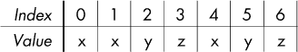

## 第四章：高级记忆化与动态规划


在本章中，我们将继续讨论记忆化与动态规划。你不需要阅读本章内容就能继续阅读本书。但如果你希望深入理解，还是可以从中学到更多内容。我们将看到如何通过改变视角使动态规划问题变得更容易，如何在子问题数组中处理超过二维的问题，并将技能拓展到超越我们至今所见的“优化解法”问题。我们还将进一步练习基础知识。通过本章，你将成为动态规划的高手。

### 问题 1：跳跃者

本章我们将从一个可以通过我们在第三章学到的内容解决的动态规划问题开始。和第三章一样，我们能够通过关注最优解的结尾来解决问题。不过，我们会发现这并不是唯一的解法。具体来说，我们将看到，我们可以选择不关注最优解的*结尾*，而是关注它的*开头*。你可能会觉得这种第二种方法比第一种方法更直观，如果不是对这个问题，那么也许对其他问题来说更合适。一旦你学会了这种视角的转变，你将拥有两种方法来解决下一个动态规划问题。

这是 DMOJ 问题`crci07p2`。

#### *问题*

尼古拉正在玩一个由 *n* 个方格组成的游戏。最左边的方格是方格 1，最右边的方格是方格 *n*。尼古拉从方格 1 开始，想要到达方格 *n*。为了实现这一目标，她需要进行一次或多次跳跃。她的第一次跳跃必须是从方格 1 跳到方格 2。之后，跳跃规则如下：

+   尼古拉可以跳跃到右侧，跳跃的方格数比上一次跳跃多 1。例如，如果尼古拉上次跳了 3 个方格，那么她这次可以向右跳 4 个方格。

+   尼古拉可以跳跃到左侧，跳跃的方格数与上次跳跃相同。例如，如果尼古拉上次跳了 3 个方格，那么她这次可以向左跳 3 个方格。

我将使用*跳跃距离*一词来指代某次跳跃中移动的方格数。

这里有效的方格是从 1 到 *n* 的方格。因此，如果一次跳跃将尼古拉带到方格 1 左侧或方格 *n* 右侧，那么该跳跃是不允许的。

每个方格都有进入成本。每当尼古拉跳跃时，她需要支付她落脚的方格的进入成本。

我们想要确定尼古拉从方格 1 跳跃到方格 *n* 的最小总成本。

##### 输入

输入包含以下几行：

+   一行包含 *n*，表示行中方格的数量。*n* 的值在 2 到 1,000 之间。

+   *n* 行，每行给出一个方格的进入成本。这些行的第一行是方格 1 的进入成本，第二行是方格 2 的进入成本，以此类推。每个进入成本是一个介于 1 到 500 之间的整数。

##### 输出

输出尼古拉从第 1 格到第*n*格的最小总成本。

解决测试用例的时间限制是 0.6 秒。

#### *通过一个例子来推导*

让我们通过一个测试用例来确保我们清楚自己需要做什么。这里是：

```
7
3
5
1
9
7
2
3
```

尼古拉从第 1 格开始，必须到达第 7 格。记住，第一次跳跃必须跳到第 2 格，以下是一条可能的路线：

**第 1 格到第 2 格**

成本 5。

最近的跳跃距离现在是 1。

**第 2 格到第 4 格**

成本 9。

最近的跳跃距离现在是 2。

**第 4 格到第 7 格**

成本 3。

最近的跳跃距离现在是 3。

我们到达了第 7 格！总成本是 5 + 9 + 3 = 17。然而，这*不是*最小的总成本。试着在继续之前找到最小的成本。

这是我们如何得到最小总成本的方法：

**第 1 格到第 2 格**

成本 5。

最近的跳跃距离现在是 1。

**第 2 格到第 1 格**

成本 3。

最近的跳跃距离保持为 1。

**第 1 格到第 3 格**

成本 1。

最近的跳跃距离现在是 2。

**第 3 格到第 6 格**

成本 2。

最近的跳跃距离现在是 3。

**第 6 格到第 3 格**

成本 1。

最近的跳跃距离保持为 3。

**第 3 格到第 7 格**

成本 3。

最近的跳跃距离现在是 4。

这次的总成本是 5 + 3 + 1 + 2 + 1 + 3 = 15。

#### *解法 1：逆向推导*

在我们编写任何代码之前，我们需要确定子问题，并了解如何利用这些子问题来表征最优解的结构。

##### 寻找子问题

我们需要多少个子问题参数？我们能只用一个吗？

如果我们只有一个子问题参数，那么我们可以用它来跟踪尼古拉在哪一格。但那样的话，我们怎么知道给定子问题中哪些跳跃是允许的呢？想想从第 1 格到第 4 格的最优解结束时的情况。为了更接近基本情况，我们需要知道尼古拉在第 4 格之前在哪一格，这样我们才能递归调用到那个较早的格子。例如，如果我们知道尼古拉用了 2 的跳跃距离到达第 4 格，那么我们就知道她在到达第 4 格之前肯定是在第 2 格或第 6 格。但我们并不知道尼古拉使用的跳跃距离——它不是我们的子问题参数之一。这行不通。

我们再试一次，仅使用一个子问题参数。如果我们用它来跟踪最近的跳跃距离呢？那么我们就没有一个子问题参数来告诉我们尼古拉在哪一格！没有知道尼古拉在哪一格，我们就无法知道何时到达基本情况格。

看起来我们需要两个子问题参数：一个告诉我们尼古拉在哪一格，另一个告诉我们她跳到那一格所用的跳跃距离。

对于这些参数中的每一个，我们需要决定是否使用“确切”。在第三章中，我们看到了在解决《汉堡狂热》和《贪婪者》时使用“确切”子问题的例子。我们还看到了在解决《冰球对抗赛》时*没有*使用“确切”的例子。如果我们在《冰球对抗赛》中使用了“确切”，我们的子问题就会强制特定的比赛被匹配为对抗赛，这在那个问题中是不需要的。

在这里，知道尼古拉究竟在哪个方格是有意义的。我们可以利用这一点来确定她在最近一次跳跃之前究竟在哪个方格……嗯，不完全是。我们还需要知道她用来跳到当前方格的*确切*跳跃距离。然后我们可以通过当前方格和跳跃距离来精确推算出尼古拉一定是从哪个地方来的。也就是说，我们需要对这两个子问题的参数都要求“确切”。

问题描述规定，第一次跳跃没有选择：必须从方格 1 跳到方格 2。我们不需要担心在子问题中维护这个条件，而是直接忽略它：我们的子问题将告诉我们从方格 2 跳到另一个方格的最小费用。稍后，我们会加上从方格 1 到方格 2 的跳跃费用，这样就能得到最终解答。

然而，我们不能随便使用从方格 2 跳跃的任意顺序。想象一下，如果我们从方格 2 的解答开始，跳跃距离是 3 会发生什么？我们需要先从方格 1 跳到方格 2，哦哦，跳跃距离为 3 是不允许紧随其后的！我们需要确保我们的子问题只求解那些可行的解，因为我们会将从方格 1 到方格 2 的跳跃放在前面。我们称这样的解答为*可连接的*。

好的，现在我们准备好解决子问题了！具有*i*和*j*参数的子问题将告诉我们，从方格 2 到*确切*的方格*i*，使用最终跳跃距离为*j*的可连接解答的最小费用。

这个子问题的定义相当复杂。让我们用上一节中的测试用例来确定几个关于定义如何工作的例子。

当*i* = 7，*j* = 3 时，子问题的解是什么？这在问我们，从方格 2 开始，最终到达方格 7，并且最后的跳跃距离是 3 的最佳可连接解答是什么？答案是 12，尼古拉从方格 2 跳到方格 4（费用 9），再跳到方格 7（费用 3）。（记住，在这些子问题中，我们忽略了从方格 1 到方格 2 的跳跃费用。）

那么，*i* = 7，*j* = 4 的子问题解答是什么？答案是 10：尼古拉可以先从方格 2 跳到方格 1（费用 3），再跳到方格 3（费用 1），跳到方格 6（费用 2），再跳回方格 3（费用 1），最后跳到方格 7（费用 3）。

那么*i* = 7，*j* = 2 呢？试试，你应该会发现这是不可能的：没有办法找到一个从方格 2 跳到方格 7，并且最终跳跃距离为 2 的可连接解答。

再来一个：*i* = 2 和 *j* = 1。我们已经处在方格 2 了。此外，*j* = 1 意味着我们需要一个距离为 1 的跳跃才能到达方格 2。没问题：我们将在前面加上的从方格 1 到方格 2 的跳跃正是这种跳跃！因此，这里的答案是 0。嗯，我想我们可能刚刚找到一个基础情况。

##### 描述最优解

考虑一个具有某个值*i*和某个值*j*的子问题。这个子问题的最优解可能是什么样子的？

**选项 1**

一个选项是这个最优解以跳向右边结束。*j*值给出了这个跳跃的距离，所以我们知道这个跳跃一定是从方格*i* – *j*跳过来的。为了向右跳跃*j*，尼古拉必须已经通过跳跃距离*j* – 1 到达了她之前的方格。（为什么是*j* – 1？因为向右跳跃需要的跳跃距离比前一次跳跃多 1。）因此，这个选项的解决方案是方格*i* – *j*和跳跃距离*j* – 1 的子问题的解决方案，再加上方格*i*的进入成本。

哎呀，像这样倒着思考解决方案可能会让人困惑！例如，我们正在讨论跳到右边，但我们却使用了一个位于左边的方格*i* – *j*。但记住：我们在寻找尼古拉从哪个方格跳过来的，所以如果她从那个方格跳到右边，那么她确实是从一个编号较小的方格跳过来的。

**选项 2**

我们的第二个选择是这个最优解以跳向左边结束。*j*值给出了这个跳跃的距离，所以我们知道这个跳跃一定是从方格*i* + *j*跳过来的。为了向左跳跃*j*，尼古拉必须已经通过跳跃距离*j*到达了她之前的方格。所以这个选项的解决方案是方格*i* + *j*和跳跃距离*j*的子问题的解决方案，再加上方格*i*的进入成本。

##### 解决一个子问题

我们跳过裸递归解决方案，改为处理一个带备忘录的解决方案。为此，我们将从编写以下`solve_ij`函数签名的代码开始：

```
int solve_ij(int cost[], int n, int i, int j,
             int memo[SIZE + 1][SIZE + 1])
```

这个函数解决给定的`i`和`j`值的子问题。以下是每个参数的作用：

cost   进入成本数组。方格 1 的进入成本是`cost[1]`，方格 2 的进入成本是`cost[2]`，以此类推。

n   行中的方格数。

i   这个子问题的结束方格。

j   这个子问题的最终跳跃距离。

memo   备忘录数组。

这个函数的代码在列表 4-1 中给出。

```
#define SIZE 1000

int min(int v1, int v2) {
  if (v1 < v2)
    return v1;
  else
    return v2;
}

int solve_ij(int cost[], int n, int i, int j, int memo[SIZE + 1][SIZE + 1]) {
  int first, second;
❶ if (memo[i][j] != -2)
     return memo[i][j];
➋ if (i ==  2 && j == 1) {
     memo[i][j] = 0;
     return memo[i][j];
  }
➌ if (i - j >= 1 && j >= 2)
     first = solve_ij(cost, n, i - j, j - 1, memo);
   else
     first = -1;
➍ if (i + j <= n)
     second = solve_ij(cost, n, i + j, j, memo);
   else
     second = -1;
➎ if (first == -1 && second == -1) {
     memo[i][j] = -1;
     return memo[i][j];
   } else if (second == -1) {
     memo[i][j] = first + cost[i];
     return memo[i][j];
   } else if (first == -1) {
     memo[i][j] = second + cost[i];
     return memo[i][j];
   } else {
     memo[i][j] = min(first, second) + cost[i];
     return memo[i][j];
   }
}
```

*列表 4-1：解决一个子问题*

正如我们在第三章中解决“汉堡狂热”时所做的那样，我们在`memo`数组中使用`-2` ➊来表示一个子问题尚未解决。这里使用的典型值是`-1`，但我们将使用`-1`来表示我们已经尝试解决一个子问题，但它没有解决方案。

正如我们在上一节中发现的，一个重要的基础情况是，当我们在方块 2 上，需要用距离为 1 的跳跃到达该方块 ➋。在这种情况下，我们返回`0`：从方块 2 到方块 2 没有任何成本！

接下来，我们尝试两种选项以找到最佳解决方案。我们使用`first`变量来保存选项 1 的值，`second`变量来保存选项 2 的值。

**选项 1**

这是尼古拉跳到右侧以到达方块`i`的选项。为了使用此选项，我们需要确保尼古拉来自一个有效的方块。我们还需要确保`j`至少为`2` ➌，这可以保证她是通过至少 1 的跳跃距离到达前一个方块的。毕竟，说尼古拉用 0 的跳跃距离到达一个先前的方块是没有意义的！

**选项 2**

这是尼古拉跳到左侧以到达方块`i`的选项。与之前的选项一样，我们需要确保尼古拉来自一个有效的方块 ➍。

一个或两个选项可能无法找到解决方案；在这种情况下，我们使用`-1`的值。如果两个选项都失败，那么我们返回`-1` ➎。其余的代码决定哪个选项最好，并返回该选项加上`cost[i]`作为解决方案。

##### 最优解在哪里？

现在我们可以解决任何我们想要的子问题。那么，我们应该调用哪个`solve_ij`来找到原始问题的解决方案呢？

难题：一次调用不够！我们需要做一些搜索，就像我们在第三章解决《汉堡热潮》和《钱袋贼》问题时一样。但为什么呢？

我们知道我们必须精确地停在方块*n*上，所以我们不需要在这里做搜索。我们*不知道*的是我们应该用什么跳跃距离作为最后一跳。我们应该以 2 的跳跃距离结束吗？3？4？谁知道？我们需要尝试所有并选择最好的一个。有关代码，请参见列表 4-2。

```
int solve(int cost[], int n) {
  int i, j, best, result;
❶ static int memo[SIZE + 1][SIZE + 1];
   for (i = 1; i <= SIZE; i++)
     for (j = 1; j <= SIZE; j++)
       memo[i][j] = -2;
➋ best = -1;
➌ for (j = 1; j <= n; j++) {
     result = solve_ij(cost, n, n, j, memo);
     if (result != -1) {
       if (best == -1)
      ➍ best = cost[2] + result;
       else
      ➎ best = min(best, cost[2] + result);
    }
  }
  return best;
}
```

*列表 4-2：解决方案 1*

这个函数是我们设置`memo`数组 ➊ 的地方，以便它在所有对`solve_ij`的调用之间共享。

`best`变量保存我们迄今为止找到的最佳解决方案。它从`-1` ➋ 开始，每当我们找到更好的解决方案时，就会更新 ➍ ➎。小心：我们需要在这里添加`cost[2]`，以重新计算从方块 1 到方块 2 的跳跃。

注意，我们正在循环遍历`1`到`n`之间的最终跳跃距离 ➌。没有必要尝试任何大于`n`的最终距离，因为它们无法到达有效的方块。也就是说，我们保证找到最佳的最终跳跃距离，因为我们正在尝试所有有效的可能性。

##### 主要函数

是时候总结这个解决方案了。我们只需要一个`main`函数来读取输入并调用`solve`。代码见列表 4-3。

```
int main(void) {
  int i, n;
  int cost[SIZE + 1];
  scanf("%d ", &n);
  for (i = 1; i <= n; i++)
    scanf("%d", &cost[i]);
  printf("%d\n", solve(cost, n));
  return 0;
}
```

*列表 4-3：* 主要 *函数*

如果你将我们的代码提交给评审，你应该能够在时间限制内通过所有测试用例。

但我们仍然可以做得更好。

#### *解决方案 2：前向公式化*

我们先来谈谈为什么解决方案 1 很快，然后再讨论为什么我们仍然可以改进它。

##### 解决方案 1 有多快？

解决方案 1 是一个 *O*( *n*²) 算法。从自底向上的动态规划解法中，我们可以更容易看到这一点，里面有明显的两个嵌套循环，但我们仍然可以使用备忘录解法来说明这一点。我们的 `solve_ij` 函数（见 Listing 4-1）最多填充 `memo` 中的每个 *n*² 元素一次。为了填充每个元素，我们的代码会做两次递归调用。因此，我们可以说我们的代码最多做 2*n*² 次递归调用。除此之外，`solve_ij` 的每次递归调用会执行一个常数步骤来决定是使用 `first` 还是 `second` 作为最优解的一部分。因此，`solve_ij` 在所有递归调用中都需要 *O*( *n*²) 的时间。

一排格子的最大数量是 1,000。我们的 *O*( *n*²) 算法因此大致执行了 1,000² = 1,000,000 步。在 0.6 秒的时间限制内我们可以轻松完成。

好的，那么解决方案 1 很快。那么我们还可以改进什么呢？

##### 反向 vs. 正向

也许你一直被问题描述中尼古拉的跳跃方式与我们在备忘录解法中思考跳跃的方式之间的不一致所困扰。问题描述告诉我们尼古拉从第一跳开始每次跳跃时能做什么。也就是说，它关注的是尼古拉现在在哪里以及她接下来能做什么。相比之下，我们的备忘录解法关注的是尼古拉到达了哪里，以及她是如何到达那里的。例如，我们不是想着“尼古拉从第 2 格跳到第 4 格”，而是要想着“尼古拉通过从第 2 格跳跃到第 4 格达到了第 4 格”。我们必须从问题的反向思考！

除了这些额外的思维挑战之外，我们的反向表达方式还对我们需要编写的代码量产生了影响。还记得我们在 Listing 4-2 中需要搜索所有可能的最终跳跃距离吗？之所以需要这样做，是因为我们不知道最优解是如何结束的。也许它以跳跃距离 2 结束，或者以跳跃距离 3 结束，或者以跳跃距离 4 结束，依此类推。但我们*确实*知道它是如何开始的：从第 1 格到第 2 格，跳跃距离是 1！只要我们跟踪最近的跳跃距离，我们就永远不需要猜测它可能是什么。也就是说，如果我们从正向解决问题（关注我们现在的位置），而不是从反向解决问题（关注我们最终的位置），我们将能够完全避免跳跃距离的搜索。我们将能够到达最优解的终点，正好需要我们想要的最终跳跃距离。

##### 再次寻找子问题

我们将坚持使用之前的两个子问题参数的思路。因为我们需要一个参数告诉我们尼古拉所在的格子，另一个参数告诉我们她用来到达该格子的跳跃距离。

这一次，参数 *i* 和 *j* 的子问题将告诉我们从方格 *i* 到方格 *n* 的最小成本解，前提是方格 *i* 是通过跳跃距离正好为 *j* 到达的。

我们需要一些例子来说明！我们将再次使用在 第 127 页 中的“通过实例演示”的测试用例。

让我们从子问题 *i* = 2 和 *j* = 1 开始。这是在询问我们从方格 2 出发，最终到达方格 7，并且通过跳跃距离 1 到达方格 2 的最佳解。（请注意，我们完全不关心最终带我们到方格 *n* 的跳跃距离，它可以是任何值！）这里的答案是 10：尼古拉可以从方格 2 跳到方格 1（花费 3），然后跳到方格 3（花费 1），再跳到方格 6（花费 2），然后跳到方格 3（花费 1），最后跳到方格 7（花费 3）。嘿，这和从反向推导得到的 *i* = 7, *j* = 4 子问题的答案是一样的！但是在反向推导中，我们必须尝试所有可能的最终跳跃距离，以确认这是最优的，而现在不再需要了。

现在考虑任何 *i* = *n* 的子问题。答案是什么？是 0：我们已经在方格 *n* 上了！我们不关心 *j* 是什么，因为我们不在乎是如何到达方格 *n* 的。我们又找到了基础情况。

##### 再次描述最优解

我们需要重新做一下优化子结构的工作，参见解决方案 1。

**选项 1**

另一种选择是尼古拉接着向右跳跃。*j* 值给出了当前方格的跳跃距离。向右跳跃的距离是 *j* + 1，因此尼古拉将着陆在方格 *i* + *j* + 1。此选项的解决方案是方格 *i* + *j* + 1 的进入成本，再加上方格 *i* + *j* + 1 和跳跃距离 *j* + 1 的子问题的解。

**选项 2**

我们的第二种选择是尼古拉接着向左跳跃。向左跳跃的距离是 *j*，因此尼古拉将着陆在方格 *i*–*j*。因此，此选项的解决方案是方格 *i*–*j* 的进入成本，再加上方格 *i*–*j* 和跳跃距离 *j* 的子问题的解。

##### 求解所需的子问题

现在我们可以编写一个 `solve` 函数来解决我们选择的子问题。查看 列表 4-4 中的代码。

```
int solve(int cost[], int n, int i, int j,
          int memo[SIZE + 1][SIZE + 1]) {
  int first, second;
  if (memo[i][j] != -2)
    return memo[i][j];
  if (i == n) {
    memo[i][j] = 0;
    return memo[i][j];
  }
❶ if (i + j + 1 <= n)
     first = solve(cost, n, i + j + 1, j + 1, memo);
   else
     first = -1;
➋ if (i - j >= 1)
     second = solve(cost, n, i - j, j, memo);
   else
     second = -1;
   if (first == -1 && second == -1) {
     memo[i][j] = -1;
     return memo[i][j];
   } else if (second == -1) {
     memo[i][j] = cost[i + j + 1] + first;
     return memo[i][j];
   } else if (first == -1) {
     memo[i][j] = cost[i - j] + second;
     return memo[i][j];
   } else {
     memo[i][j] = min(cost[i + j + 1] + first, cost[i - j] + second);
     return memo[i][j];
  }
}
```

*列表 4-4：解决方案 2*

如同在反向推导中（参见 列表 4-1），我们需要实现最优解的两种选项。在每种情况下，我们首先检查下一个方格是否是有效的方格 ❶ ➋，然后再考虑跳跃。

##### 主函数

为了找到原问题的解，我们应该调用 `solve` 函数吗？

这次不是一个技巧性问题——我们完全知道需要解决哪个子问题！我们需要解决 *i* = 2（从方格 2 开始）和 *j* = 1（通过跳跃距离 1 到达方格 2）的子问题。我们可以在读取输入的 `main` 函数中包含这一部分。查看 列表 4-5 中的代码。

```
int main(void) {
  int i, j, n, result;
  int cost[SIZE + 1];
  static int memo[SIZE + 1][SIZE + 1];
  scanf("%d ", &n);
  for (i = 1; i <= n; i++)
    scanf("%d", &cost[i]);
  for (i = 1; i <= SIZE; i++)
    for (j = 1; j <= SIZE; j++)
      memo[i][j] = -2;
  result = cost[2] + solve(cost, n, 2, 1, memo);
  printf("%d\n", result);
  return 0;
}
```

*清单 4-5：* 主 *函数*

对于这个问题，我更喜欢使用前向解法，但你也可以选择反向解法——这是个人的选择！

当我在做备忘录法或动态规划解法时，我总是从尝试制定反向解法开始。反向解法对我来说通常更自然，因为它更贴近我对递归的思考方式。然而，如果我卡住太久，或者当问题的前向描述与反向表述之间产生摩擦时，我会尝试使用前向解法。把这两种互补的方法都放在你的动态规划工具箱里！

##### 动态规划怎么回事？

我们已经有了一个非常好的前向备忘录解法。尽管如此，你可能还是想开发一个动态规划解法。如果你这么做，里面会有一些惊喜等着你！

想回我们如何在第三章中使用动态规划解决《冰球对抗》。在第 119 页的“解决方案 3：动态规划”中，我们学到了解决子问题的顺序。在《冰球对抗》中，我们通过从左到右解决第 0 行的所有子问题，再从左到右解决第 1 行的所有子问题，依此类推，来确定了解决子问题的顺序。

但这个顺序现在对我们不起作用。

为了解决`dp[i][j]`，我们需要什么？从选项 1 来看，我们需要已经解决了`dp[i + j + 1][j + 1]`；也就是说，我们需要来自更高编号列的某些内容。从选项 2 来看，我们需要已经解决了`dp[i - j][j]`；也就是说，我们需要来自当前列较低编号行的某些内容。综合来看，我们需要先解决第`n`列的所有子问题，然后解决第`n-1`列的所有子问题，依此类推。在每一列内部，我们需要先解决第 1 行的子问题，然后是第 2 行，依此类推。

这是我们可以用来按正确顺序解决子问题的双重`for`循环：

```
for (j = n; j >= 1; j--)
  for (i = 1; i < n; i++) {
    code to fill in dp[i][j]
}
```

解决子问题时，永远要小心顺序！

如果你想看到完整的动态规划解法，请查看本书的在线资源。否则，我们准备继续在这里解决另一个动态规划问题。一个真正棘手的题目，你已经准备好迎接它了。

### 问题 2：构建方式

到目前为止，我们解决的四个动态规划问题（在第三章中的三个和本章中的一个）要求我们最大化（《汉堡热情》和《冰球对抗》）或最小化（《钱财贪婪者》和《跳跃者》）解的值。我想以一个稍有不同口味的问题结束本章：我们不再寻找最佳解，而是计算可能解的数量。

另一个出现的差异是我们子问题数组的维度数。在前四个问题中，我们使用了一维或二维数组来存储子问题的解。为了这个问题，我们需要更多的维度。

这是 DMOJ 问题`noip15p5`。

#### *问题*

我们给定了一个源字符串 *a*，一个目标字符串 *b*，以及一个整数 *k*。我们希望通过将 *a* 的 *k* 个子字符串拼接在一起，来构建 *b*。

我们需要遵循一些规则：

+   我们必须按照它们在 *a* 中出现的顺序来使用 *a* 的子字符串。

+   我们不允许使用任何空子字符串——每个子字符串必须至少包含一个字符。

+   我们不允许使用重叠的子字符串：如果我们在一个子字符串中使用了 *a* 中的某个字符，那么我们不能在其他子字符串中再次使用该字符。

+   我们必须使用 *a* 中恰好 *k* 个子字符串来构建 *b*。

例如，假设 *a* 是 `xxyzxyz`，*b* 是 `xxyz`，*k* 是 `3`。一种通过拼接 *a* 的三个子字符串来构建 *b* 的方法是从 *a* 开头取 `x`，然后取右边的 `xy`，最后从 *a* 末尾取 `z`。将这些子字符串拼接在一起，我们得到了 `xxyz`，正好是我们需要的字符串 *b*。

现在，从 *a* 中构建 *b* 的方法可能有很多种。但要注意，只要我们遵守规则，构建 *b* 的方式并不重要——每种方式都是一样好的。因此，讨论构建 *b* 的最佳方式没有意义。那么，我们要在本问题中解决的，并不是构建 *b* 的最佳方式，而是可以构建 *b* 的总方式数量。在上面的示例中，有 11 种方法。你能找到它们全部吗？

##### 输入

输入包含一个测试用例，其信息分布在以下三行中：

+   第一行包含三个数字：字符串 *a* 的长度，字符串 *b* 的长度，以及整数 *k*，它表示我们必须从 *a* 中取出 *k* 个子字符串来构建 *b*。字符串 *a* 的长度在 1 到 1,000 之间，字符串 *b* 的长度在 1 到 200 之间，*k* 的值在 0 到 200 之间。

+   第二行包含字符串 *a*。

+   第三行包含字符串 *b*。

##### 输出

输出我们可以使用 *a* 中恰好 *k* 个子字符串来构建 *b* 的方式数量。

这个数字可能非常大。为了避免整数溢出的情况，问题要求我们输出这个数字对 1,000,000,007 取模后的结果。

解决该测试用例的时间限制是两秒。

#### *通过一个示例进行演示*

你能找到我在问题描述中给出的示例中构建 *b* 的所有 11 种方式吗？让我们确保你找到了所有方式，因为我们将以这个作为本问题的示例来进行分析。

这里是以测试用例形式给出的示例：

```
7 4 3
xxyzxyz
xxyz
```

方便参考，以下是字符串 *a* 中字符的索引：



如何使用恰好三个子字符串从 `xxyzxyz` 构建出 `xxyz` 呢？在下面，我将用索引范围表示每个子字符串；例如，0-0 指的是 *a* 中索引为 0 的字符组成的子字符串，而 1-2 指的是 *a* 中索引为 1 和 2 的字符组成的子字符串。

以下是五种做法：

+   0-1 (`xx`)，5-5 (`y`)，6-6 (`z`)

+   1-1 (`x`)，4-5 (`xy`)，6-6 (`z`)

+   0-0 (`x`), 4-5 (`xy`), 6-6 (`z`)

+   0-1 (`xx`), 2-2 (`y`), 6-6 (`z`)

+   0-0 (`x`), 1-2 (`xy`), 6-6 (`z`)

注意，在这些情况下，我们的最终子字符串是来自 *a* 的最后一个字符 *z*。也就是说，我们已经将最终的子字符串固定为那个 `z`，然后从 `xxyzxy` 中寻找构建 `xxy` 的方式。我们开始看到通过解决更小的子问题来找到初始问题的解决方法。

还有六种可能的方式。我们把它们列出来：

+   1-1 (`x`), 4-4 (`x`), 5-6 (`yz`)

+   0-0 (`x`), 4-4 (`x`), 5-6 (`yz`)

+   0-0 (`x`), 1-1 (`x`), 5-6 (`yz`)

+   0-1 (`xx`), 2-2 (`y`), 3-3 (`z`)

+   0-0 (`x`), 1-2 (`xy`), 3-3 (`z`)

+   0-0 (`x`), 1-1 (`x`), 2-3 (`yz`)

加上之前的五种方式，我们现在一共有 5 + 6 = 11 种解决方案。

#### *解法 1：使用“准确的”子问题*

我们需要识别出我们的子问题，然后利用它们找到所有最优解。我们将尝试采用反向公式。

##### 寻找子问题

这次我们需要多少个子问题参数？

我们需要跟踪我们在字符串 *a* 中的位置，并且需要跟踪我们在字符串 *b* 中的位置。这个是一个不错的开始，但还不够。我们还需要一个子问题参数来告诉我们还需要提取多少个子字符串。这是我们第一次使用三个子问题参数！

在本章前面我们解决“跳跃者”问题时，使用了“准确的”子问题参数，效果不错。像往常一样，我们需要决定是否对每个子问题参数使用这个方法。对于记录还需要提取多少个子字符串的参数，使用“准确的”是有意义的，因为我们需要正好提取这么多个子字符串（而不是例如提取最多这么多的子字符串）。对于那些记录我们在 *a* 和 *b* 中当前所在位置的子问题参数，使用“准确的”就不那么明确了。我们就先对这些参数也使用“准确的”，然后看看结果如何。接下来，我们将使用符号 *s*[*i*..*j*] 来表示从字符串 *s* 的索引 *i* 到索引 *j*（包括 *j*）的字符。

具有参数 *i*、*j* 和 *k* 的子问题将告诉我们从 *a*[0..*i*] 中正好选择 *k* 个子字符串来构建正好是 *b*[0..*j*] 的方法数，并且要求右边的子字符串必须恰好以字符 *a*[*i*] 结尾。

让我们回到我们的例子，以便更清楚地说明这些子问题如何工作。对于 *i* = 6，*j* = 3，*k* = 3 的子问题，我们的答案是什么？（不要太快回答“11”！）

由于 *a*[0..6] 是整个 *a*，而 *b*[0..3] 是整个 *b*，这个子问题是在询问整个 *a* 和 *b* 字符串的情况。所以我们在寻找从 *a* 中选择正好三个子字符串来构建 *b* 的所有方法，且要求右边的子字符串必须恰好以 *a*[6] 中的 `z` 结尾。

答案是 8！这些就是——前五个是使用 *a* 中的最终 `z` 作为其自身子字符串的，而剩下的三个则使用 *a* 中的最终 `yz` 作为其自身子字符串：

+   0-1 (`xx`)、5-5 (`y`)、6-6 (`z`)

+   1-1 (`x`)、4-5 (`xy`)、6-6 (`z`)

+   0-0 (`x`)、4-5 (`xy`)、6-6 (`z`)

+   0-1 (`xx`)、2-2 (`y`)、6-6 (`z`)

+   0-0 (`x`)、1-2 (`xy`)、6-6 (`z`)

+   1-1 (`x`)、4-4 (`x`)、5-6 (`yz`)

+   0-0 (`x`)、4-4 (`x`)、5-6 (`yz`)

+   0-0 (`x`)、1-1 (`x`)、5-6 (`yz`)

那么为什么我们不能包括缺失的解法，比如 0-1 (`xx`)、2-2 (`y`)、3-3 (`z`)? 难道这些不应该算吗？

我们在这里不能使用它们的原因是它们没有使用 *a*[6] 中的最终 `z`。它们不满足我们所使用的“精确”子问题的要求。

也就是说，到目前为止我们已经有了八种方法，我们确实需要得到 11 种。仅仅看 *i* = 6、*j* = 3、*k* = 3 的子问题是不够的。我们可以通过查看 *i* = 3、*j* = 3、*k* = 3 的子问题来找到剩下的三种方法。这些方法如下：

+   0-1 (`xx`)、2-2 (`y`)、3-3 (`z`)

+   0-0 (`x`)、1-2 (`xy`)、3-3 (`z`)

+   0-0 (`x`)、1-1 (`x`)、2-3 (`yz`)

正如我们在本章中对《跳跃者》的逆向构造以及《汉堡狂热》和《钱财贪婪者》在第三章中的处理一样，我们需要进行一些后处理来找出我们需要的内容。在其他问题中，我们搜索了相关的子问题来发现最优解；在这里，我们将搜索相关的子问题来找到所有可能的解。

##### 描述方法

考虑前一节中描述的 *i*、*j*、*k* 子问题。满足此子问题有两类方法。在每一类中，我们要求 *a*[*i*] 和 *b*[*j*] 是相同的字符——如果不是，那么子问题的要求就没有得到满足，答案为零。

**类别 1**

一类方法涉及将 *a*[*i*] 作为最终的子字符串。如果我们用完 *a*[*i*] 上的一个子字符串，那么就剩下 *k* – 1 个子字符串要处理，所以我们会继续解决第三个参数为 *k* – 1 的子问题。同样，我们会继续使用 *j* – 1 作为第二个参数，因为我们刚刚用过字符 *b*[*j*]。

那么第一个参数怎么办——我们该怎么做？难道我们不只是像处理 *j* 和 *k* 一样，继续使用 *i* – 1 吗？

不一定！确实，继续使用 *i* – 1 是一种可能性，但也有其他方法。我们需要能够跳过 *a* 中的一些字符，并在更早的地方继续。也就是说，我们可能希望将 *b*[*j* – 1] 与 *a*[*i* – 2] 或 *a*[*i* – 3] 或更早的字符匹配。我们需要在这里加一个循环，尝试第一个参数的所有值，直到 *i* – 1，同时固定第二个参数 *j* – 1 和第三个参数 *k* – 1。

使用我们的运行示例，再次考虑 *i* = 6，*j* = 3 和 *k* = 3 的子问题。我们知道这个子问题的答案是 8。在这 8 个答案中，有 5 个属于类别 1。我们从 *i* = 5，*j* = 2 和 *k* = 2 的子问题得到 3 个解，另外 2 个来自 *i* = 2，*j* = 2 和 *k* = 2 的子问题。

**类别 2**

另一类解法涉及使用至少两个字符作为最终子串。

对于这个问题，我们有一个巧妙的技巧可以使用。假设我们解决了具有参数 *i* – 1，*j* – 1 和 *k* 的子问题（没错：第三个参数是 *k*，不是 *k* – 1！）。事实证明，这就是我们需要解决的唯一子问题！

该子问题使用所有的 *k* 个子串来寻找通过将 *a*[*i* – 1] 与 *b*[*j* – 1] 匹配的解决方案。但这些解决方案中的每一个都可以扩展为一个解决方案，通过将 *a*[*i*]（或 *b*[*j*]—它们是相同的）附加到最终子串上，从而将 *a*[*i*] 与 *b*[*j*] 匹配。同样，任何一个匹配 *a*[*i*] 与 *b*[*j*] 并且使用 *k* 个子串的类别 2 中的解决方案，都对应于一个匹配 *a*[*i* – 1] 与 *b*[*j* – 1] 并使用 *k* 个子串的子问题的解决方案。总之，这里解的数量与 *i* – 1，*j* – 1，*k* 子问题的解数量是完全相同的。

在我们的运行示例中，*i* = 6，*j* = 3 和 *k* = 3 的子问题在这一类中有三个解。我们通过查找 *i* = 5，*j* = 2 和 *k* = 3 的子问题的答案得到这些解。

注意，除了这两类外，不可能有其他类别。类别 1 使用单字符字符串 *a*[*i*] 作为最终子串；类别 2 使用一个更长的字符串，其中以 *a*[*i*] 结尾作为最终子串。不能有其他的情况。

##### 解决一个子问题

正如我们在本章前面解决《跳跃者》时所做的那样，我们将跳过没有修饰的递归解法，直接跳到记忆化解法。我们需要一个函数来告诉我们给定 `i`、`j` 和 `k` 值的子问题的答案。这个函数的签名如下：

```
int solve_ijk(char a[], char b[], int i, int j, int k,
              int memo[MAX_A][MAX_B][MAX_K + 1])
```

这里，`a` 是源字符串；`b` 是目标字符串；`i`、`j` 和 `k` 是三个子问题参数；`memo` 是记忆化数组。

这个函数的代码见 Listing 4-6。

```
#define MAX_A 1000
#define MAX_B 200
#define MAX_K 200
#define MOD 1000000007

int solve_ijk(char a[], char b[], int i, int j, int k,
              int memo[MAX_A][MAX_B][MAX_K + 1]) {
  int total, q;
  if (memo[i][j][k] != -1)
    return memo[i][j][k];
❶ if (j == 0 && k == 1 && a[i] == b[j]) {
     memo[i][j][k] = 1;
     return memo[i][j][k];
  }
➋ if (i == 0 || j == 0 || k == 0) {
     memo[i][j][k] = 0;
     return memo[i][j][k];
  }
➌ if (a[i] != b[j]) {
     memo[i][j][k] = 0;
     return memo[i][j][k];
   }
   total = 0;
➍ for (q = 0; q < i; q++)
  ➎ total = (total + solve_ijk(a, b, q, j - 1, k - 1, memo)) % MOD;
➏ total = (total + solve_ijk(a, b, i - 1, j - 1, k, memo)) % MOD;
   memo[i][j][k] = total;
   return memo[i][j][k];
}
```

*Listing 4-6: 解决一个子问题*

当我们在 第三章 中解决《冰球对抗赛》时，我们将数组的索引从 0 改为从 1 开始，这使得我们的解法变得稍微简单一些。然而，在这里，我决定从 0 开始索引。你确实可以在这里使用《冰球对抗赛》的索引技巧；我之所以没有使用，是为了避免在空字符串参与时需要定义子问题的含义。

让我们从基本情况开始，逐步分析代码。

我们的第一个基本情况是当`j`为`0`，`k`为`1`，且`a[i]`和`b[j]`是相同字符 ➊时。在这里，我们要求的是在`a[i]`与`b[0]`匹配的前提下，构建单字符字符串`b[0]`的方式数。答案是`1`，因为我们可以使用`a[i]`作为匹配！

现在，在任何其他情况下，当`i`为`0`，或`j`为`0`，或`k`为`0` ➋时，答案是`0`。例如，如果`i`为`0`且`j`大于`0`，那么我们正在被要求从一个只有一个字符的字符串中选择子字符串，来构建一个包含多个字符的字符串。这是不可能的！

实际上，这里还有一个基本情况 ➌，它在`a[i]`和`b[j]`不相等时触发。在这种情况下，我们立刻返回`0`，因为无法用`a[i]`的最终字符匹配`b[j]`。

现在我们得到了实现这两个类别的代码。每个类别都会向`total`变量贡献其部分答案。

对于类别 1，我们需要一个循环 ➍，它尝试`a`的每个相关结束点，并将子问题的答案加到`total` ➎中。这里我们使用了模运算符，这是根据问题描述的要求。

对于类别 2，我们不需要循环：我们只需解决一个直接给出答案的子问题 ➏。

##### 收集解决方案

我们需要使用所有`i`的值调用`solve_ijk`。这是因为`a`的任何字符都可能与`b`的最右边字符匹配。以所需方式调用`solve_ijk`的代码在清单 4-7 中。

```
int solve(char a[], char b[], int a_length, int b_length,
          int num_substrings) {
  int i, j, k, result;
  static int memo[MAX_A][MAX_B][MAX_K + 1];
  for (i = 0; i < a_length; i++)
    for (j = 0; j < b_length; j++)
      for (k = 0; k <= num_substrings; k++)
        memo[i][j][k] = -1;
  result = 0;
  for (i = 0; i < a_length; i++) {
    result = result + solve_ijk(a, b, i, b_length - 1, num_substrings, memo);
    result = result % MOD;
  }
  return result;
}
```

*清单 4-7：解决方案 1*

在我们之前的动态规划问题中，我们使用了`min`或`max`来找到最佳解决方案。但请注意，在清单 4-6 和清单 4-7 中，我们并没有这样做。相反，因为我们想找到所有解决方案的总数，所以我们通过使用`+`将所有内容加在一起。

##### 主函数

本解决方案的`main`函数在清单 4-8 中。

```
int main(void) {
  int a_length, b_length, num_substrings;
  char a[MAX_A + 1], b[MAX_B + 1];
  scanf("%d%d%d", &a_length, &b_length, &num_substrings);
  scanf("%s", a);
  scanf("%s", b);
  printf("%d\n", solve(a, b, a_length, b_length, num_substrings));
  return 0;
}
```

*清单 4-8：* 主 *函数*

现在我们已经得到了这个问题的完整解决方案。可以提交给评测系统了。

准备好失望吧。

#### *解决方案 2：增加更多子问题*

本书中第一次出现“时间限制超出”错误是使用了记忆化技术时发生的。问题是，即使我们使用了记忆化或动态规划，我们仍然可能需要考虑算法的效率。一些问题允许多种解决方案，尽管这些解决方案比指数时间更快，但它们在效率上可能有所不同。

##### 解决方案 1 的运行时

假设我们用 *m* 表示源字符串的长度，用 *n* 表示目标字符串的长度，用 *k* 表示我们需要处理的子字符串的数量。我们的方法可能最终需要解决大约 *mnk* 个子问题。对于每个子问题，我们都会被类别 1 的解决方案“重击”，这些方案要求我们遍历源字符串，给我们的运行时间再增加一个 *m* 的因素。那么，问题是，我们的算法的步骤数与 *m*²*nk* 成正比。为了看看这个问题有多严重，我们这里代入这些变量的最大值：*m* 为 1,000，*n* 为 200，*k* 为 200。这样计算结果是 1,000² × 200 × 200 = 40,000,000,000。四百亿！而我们需要在两秒钟内完成所有这些工作？根本不可能。我们需要做得更好。正如我们将看到的，我们能够去掉 *m* 中的一个因子，并将这个问题的解决时间降到 *O*(*mnk*) 时间。

在这一点上，我们可能考虑两种常见的策略。第一种是丢弃现有的子问题，然后用新的子问题重新尝试。我曾经尝试过这么做；你可以查阅这本书的在线资源，看看我得出了什么结果。结果没有帮助。

在这种情况下，丢弃这些子问题是一个不必要的极端举动。毕竟，我们已经有了一个正确且相对高效的解决方案；唯一的问题是我们需要为每个类别 1 中的子问题使用的循环。

第二种策略，也是我们在这里会成功的策略，是将新的子问题添加到现有的子问题中。第二种策略可能看起来违反直觉。你可能会认为，如果我们的程序已经太慢了，那么添加和解决更多的子问题只会进一步拖慢速度。但是，如果我们的新子问题实际上能帮助我们更快地解决现有的子问题呢？特别是，如果它们为我们提供了一种不需要循环就能解决类别 1 中子问题的方法呢？如果我们还能高效地解决这些新子问题呢？那我们就发财了！是的，我们将解决更多的子问题，但我们可以通过高效解决每个子问题来弥补这一点。让我们试试吧！

##### 新的子问题

还记得清单 4-6 中的这段代码吗？

```
for (q = 0; q < i; q++)
  total = (total + solve_ijk(a, b, q, j - 1, k - 1, memo)) % MOD;
```

这是加总类别 1 中所有方式的循环。它是我们需要消除的循环。

这个`q`循环保持`j - 1`和`k - 1`不变，并将第一个子问题的参数从`0`变到`i - 1`。也就是说，它首先解决 0, *j* – 1, *k* – 1 的子问题，然后是 1, *j* – 1, *k* – 1 的子问题，再然后是 2, *j* – 1, *k* – 1 的子问题，以此类推。

如果我们能够一次性查找所有这些子问题答案的总和，那该有多棒！那样我们就根本不需要 `q` 循环了。这正是我们的新子问题将为我们做的事情。例如，具有参数 *i* = 4、*j* 和 *k* 的新子问题将是我们五个旧子问题的和：这些旧子问题的 *j* 和 *k* 值相同，但 *i* 值为 0、1、2、3 或 4。也就是说，新的子问题不再要求 *a*[*i*] 与 *b*[*j*] 是相同的字符。以下是我们旧子问题和新子问题的定义。

**旧**

具有参数 *i*、*j* 和 *k* 的旧子问题将告诉我们从 *a*[0..*i*] 中恰好选择 *k* 个子字符串来精确构建 *b*[0..*j*] 的方式数，且有一个限制条件，即最右边的子字符串恰好以字符 *a*[*i*] 结尾。

**新**

新的子问题，参数为 *i*、*j* 和 *k*，将告诉我们从 *a*[0..*i*] 中恰好选择 *k* 个子字符串来精确构建 *b*[0..*j*] 的方式数。

现在，借助这些新子问题，让我们回到我们的运行示例。对于新子问题 *i* = 6、*j* = 3 和 *k* = 3 的答案是什么？这次答案真的是 11！这个子问题是在没有限制的情况下，询问我们从 *a* 中选择恰好三个子字符串来构建 *b* 的所有方式。我们知道有 11 种方式。注意，作为一个额外的好处，我们不再需要像在列表 4-7 中那样解决多个子问题。我们只需要一个子问题的答案：那个包含 *a* 的所有字符、*b* 的所有字符以及子字符串 *k* 数量的子问题。

##### 解决所需的子问题

让我们跳转到新代码。对于每一组三个值 `i`、`j` 和 `k`，我们将存储不止一个，而是两个子问题的答案。我们将使用 C 结构体来收集这两个答案：

```
typedef struct pair {
  int end_at_i;
  int total;
} pair;
```

`end_at_i` 成员将存储我们旧子问题的解（来自解决方案 1 的那些），而 `total` 成员将存储我们新子问题的解。我们的 `memo` 数组仍然是三维数组，每个元素现在包含 `end_at_i` 和 `total`。其他可能的设计包括两个独立的三维记忆数组，或一个四维数组，其中新维度的长度为 2。

现在我们可以编写解决我们旧子问题和新子问题的代码。

在我们之前所有的记忆化和动态规划代码中，我们必须为每个子问题参数的设置找到一个答案。但在这里，我们需要为结构体的每个成员找到两个答案。请在阅读代码时留意这一点。可以在列表 4-9 中查看。

```
pair solve(char a[], char b[], int i, int j, int k,
           pair memo[MAX_A][MAX_B][MAX_K + 1]) {
  int total, end_at_i;
  if (memo[i][j][k].total != -1)
    return memo[i][j][k];
  if (j == 0 && k == 1) {
 ❶ if (a[i] != b[j]) {
      if (i == 0)
        total = 0;
      else
     ➋ total = solve(a, b, i - 1, j, k, memo).total;
   ➌ memo[i][j][k] = (pair){0, total};
    } else {
      if (i == 0)
        total = 1;
      else
        total = 1 + solve(a, b, i - 1, j, k, memo).total;
      memo[i][j][k] = (pair){1, total};
    }
    return memo[i][j][k];
  }
  if (i == 0 || j == 0 || k == 0) {
    memo[i][j][k] = (pair){0, 0};
    return memo[i][j][k];
  }
  if (a[i] != b[j])
    end_at_i = 0;
  else {
  ➍ end_at_i = (solve(a, b, i - 1, j - 1, k - 1, memo).total +
              ➎ solve(a, b, i - 1, j - 1, k, memo).end_at_i);
     end_at_i = end_at_i % MOD;
  }
➏ total = (end_at_i + solve(a, b, i - 1, j, k, memo).total) % MOD;
   memo[i][j][k] = (pair){end_at_i, total};
   return memo[i][j][k];
}
```

*列表 4-9：解决方案 2*

与解决方案 1 中一样，这里的一个关键情况是当 `j` 为 `0` 且 `k` 为 `1` 时。我们需要考虑两个重要的子情况。

让我们从`a[i]`和`b[j]`是不同字符的情况开始 ➊。我们知道此时`end_at_i`的解为`0`，就像在解法 1 中一样。但`total`的解可能不为 0。例如，如果`i`为`4`，并且`a`的前三个字符与`b[0]`相同，那么我们的答案就是`3`。为了获得所有解，我们进行递归调用，查找使用`a`中从索引`i - 1`之前的字符匹配的总数 ➋。然后我们在`memo`数组中存储我们计算的`total`答案和`end_at_i`答案`0` ➌。

我们处理子案例的方式，当`a[i]`和`b[j]`是相同字符时类似；我们只需要将`end_at_i`和`total`都加 1，以考虑`a[i]`和`b[j]`之间的匹配。

现在让我们着手解决当前的`end_at_i`子问题。回想一下，类别 1 涉及使用 *a*[*i*] 作为最终子字符串，而类别 2 涉及使用至少两个字符作为最终子字符串。

讲解类别 2 会更容易，所以我们先讲解这个。该代码几乎与之前一样：我们使用子问题参数`i - 1`、`j - 1`和`k` ➎来检索`end_at_i`解的数量。

那么，关于我们为类别 1 编写的新代码怎么样呢？这是我们胜利的时刻，因为我们可以通过直接查找所需的`total`子问题来一步解决这种子问题 ➍！

还有最后一件事我们需要做。毕竟，我们现在有了新的`total`子问题。我们有责任解决它们，确保它们在查找时是正确的。幸运的是，我们也能快速解决每个`total`子问题。为此，我们利用了刚刚找到的使用`a[i]`的解的数量。我们只需将它加到`i - 1`的旧总数上，得到最终的总数 ➏。

在这里，`end_at_i`子问题和`total`子问题之间有一个很好的相互作用，我们利用它们来高效地解决对方。这是我们添加新的`total`子问题能够帮助我们的核心原因：它们加速了`end_at_i`子问题的计算，并且通过快速解决相关的`end_at_i`子问题，我们也可以回报这个帮助，快速解决`total`子问题。

##### 主要函数

现在我们只需要我们的`main`函数了。请参见清单 4-10 中的代码。

```
int main(void) {
  int a_length, b_length, num_substrings, i, j, k, result;
  char a[MAX_A + 1];
  char b[MAX_B + 1];
  static pair memo[MAX_A][MAX_B][MAX_K + 1];
  scanf("%d%d%d", &a_length, &b_length, &num_substrings);
  scanf("%s", a);
  scanf("%s", b);
  for (i = 0; i < a_length; i++)
    for (j = 0; j < b_length; j++)
      for (k = 0; k <= num_substrings; k++)
        memo[i][j][k] = (pair){-1, -1};
  result = solve(a, b, a_length - 1, b_length - 1, num_substrings, memo).total;
  printf("%d\n", result);
  return 0;
}
```

*清单 4-10：* 主要 *函数*

如果你将这个解决方案提交给评测系统，你应该能够按时通过所有测试用例。

### 总结

在本章中，我们学到了动态规划问题可以正向或反向解决，有时选择哪种方式非常重要。我们还学到了我们的初始解决方法可能不够快，这时我们需要重新考虑我们的子问题或添加新的子问题。

还觉得不过瘾吗？你可能会很高兴地知道，动态规划相关的思想经常在其他算法中出现。在下一章中，例如，你将看到我们再次存储结果以供后续查找。而在第七章中，你将看到一个问题，其中动态规划起到了辅助作用，加速了主算法所需的计算。

### 注释

Jumper 最初来自 2007 年克罗地亚信息学区域竞赛。Ways to Build 最初来自 2015 年省级信息学奥林匹克。
