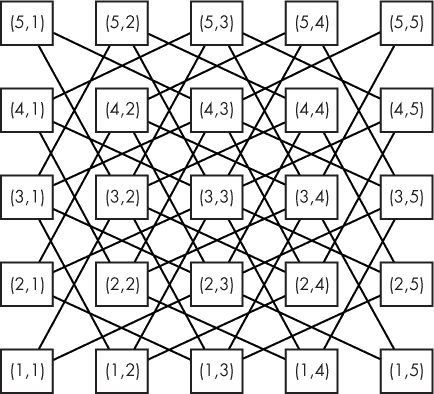
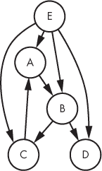
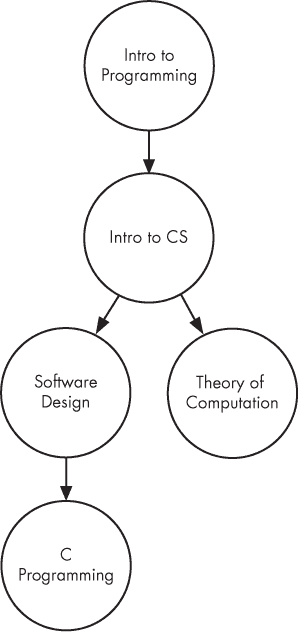
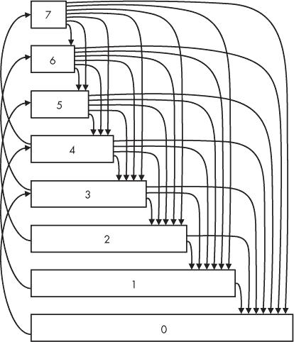
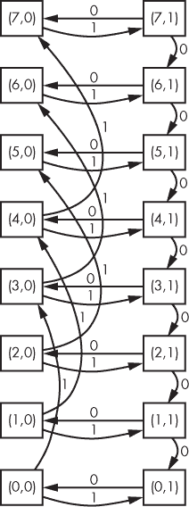
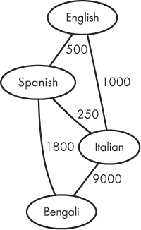

## 5

图形与广度优先搜索


在本章中，我们将研究三种问题，要求我们用最少的步数解决谜题。骑士多快能追上兵？学生在体育课上爬绳子多快？我们能以多低的成本将一本书从一种语言翻译成其他目标语言？广度优先搜索（BFS）是解决这些问题的统一算法。BFS 解决了这些问题，并且更广泛地应用于我们想要以最少步数解决谜题的场景。在此过程中，我们将学习图形，这是建模和解决涉及物体及物体间连接问题的强大工具。

### 问题 1：骑士追击

这是 DMOJ 问题`ccc99s4`。

#### *问题描述*

这个问题涉及两个玩家，一个是兵，一个是骑士，在棋盘上进行对弈。（别担心：你不需要了解任何关于国际象棋的知识。）

棋盘有*r*行，第一行在底部，*r*行在顶部。棋盘有*c*列，第一列在左侧，*c*列在右侧。

兵和骑士各自从棋盘上的一个方格开始。兵先移动，然后骑士移动，然后是兵，再是骑士，依此类推，直到游戏结束。每轮必须进行移动：不能停留在当前方格。

兵无法选择要怎么移动：每轮它都会向上一格移动。

相比之下，骑士每次移动都有最多八个选择：

+   向上 1，向右 2

+   向上 1，向左 2

+   向下 1，向右 2

+   向下 1，向左 2

+   向上 2，向右 1

+   向上 2，向左 1

+   向下 2，向右 1

+   向下 2，向左 1

我说“最多八个选择”，而不是“恰好八个选择”，因为任何让骑士超出棋盘的移动都是不允许的。例如，如果棋盘有 10 列，骑士在第 9 列，那么任何让骑士向右移动两列的行为都是不允许的。

以下图示显示了骑士的可用移动：

|   |   |   |   |   |   |   |
| --- | --- | --- | --- | --- | --- | --- |
|  |  | f |  | e |  |  |
|  | b |  |  |  | a |  |
|  |  |  | K |  |  |  |
|  | d |  |  |  | c |  |
|  |  | h |  | 9 |  |  |
|   |   |   |   |   |   |   |

这里，骑士用`K`表示，从`a`到`h`的每个字母代表其可能的移动。

游戏结束时会发生以下三种情况：骑士获胜，游戏和棋（即平局），或骑士失败。

**胜利** 如果骑士移动并停在与兵相同的方格上，而兵还未到达顶排，骑士就获胜。为了获胜，必须是骑士做出这个移动；如果是兵移动并停在骑士上，这不算骑士获胜。

**和棋** 游戏是和棋如果骑士移动并停在兵前方的方格上，而兵还没有到达顶排。同样，必须是骑士做出这个移动；唯一的例外是，如果骑士从兵上方一格开始，游戏可以一开始就为和棋。

**Loss**   如果兵在游戏结束之前到达了顶部行，骑士就输了。也就是说，如果兵在骑士踏上兵或站在兵上方的格子之前到达顶部行，那么骑士就输了。一旦兵到达顶部行，骑士将不再被允许移动。

目标是确定骑士的最佳结果及达到该结果所需的骑士步数。

##### 输入

输入的第一行给出将要处理的测试用例数量。每个测试用例由六行组成：

+   棋盘的行数，范围在 3 到 99 行之间

+   棋盘的列数，范围在 2 到 99 列之间

+   兵的起始行

+   兵的起始列

+   骑士的起始行

+   骑士的起始列

可以保证兵和骑士有不同的起始位置，并且骑士起始位置至少有一个可用的移动。

##### 输出

对于每个测试用例，输出一行，内容为以下三条消息之一：

+   如果骑士可以获胜，输出`Win in *m* knight move(s).`

+   如果骑士无法获胜，但能导致僵局，输出`Stalemate in *m* knight move(s).`

+   如果骑士无法获胜或导致僵局，输出`Loss in *m* knight move(s).`

这里，m 是骑士所需的最少步数。

解决测试用例的时间限制为一秒。

#### *最优移动*

一个真正的两人游戏，比如井字棋或象棋，给每个玩家选择下一步的机会。然而，在这里，只有骑士有选择权。兵的移动是固定的，我们随时都知道兵的位置。幸运的是，因为如果两方都有选择权，这个问题将会变得更加复杂。

骑士可能有多种方式获胜或导致僵局。假设骑士能够获胜。每种骑士获胜的方式需要一定的步数；我们想要确定最少的步数。

##### 探索棋盘

让我们通过这个输入稍微探索一下：

```
1
7
7
1
1
4
6
```

该测试用例的棋盘有七行七列。兵从第 1 行第 1 列开始，骑士从第 4 行第 6 列开始。

在最优移动下，骑士可以在三步内获胜。下面的图示展示了骑士如何实现这一点：

| **7** |  |  |  |  |  |  |  |
| --- | --- | --- | --- | --- | --- | --- | --- |
| **6** |  | K2 |  |  |  |  |  |
| **5** |  |  |  | K1 |  |  |  |
| **4** | K3 P3 |  |  |  |  | K |  |
| **3** | P2 |  |  |  |  |  |  |
| **2** | P1 |  |  |  |  |  |  |
| **1** | P |  |  |  |  |  |  |
|  | **1** | **2** | **3** | **4** | **5** | **6** | **7** |

这里，`K` 用来表示骑士的起始位置，`P` 用来表示兵的起始位置。`K1`、`K2` 和 `K3` 分别表示骑士在第 1 步、第 2 步和第 3 步后的位置；`P1`、`P2` 和 `P3` 也同样表示兵的移动位置。

坐标（*x*，*y*）指的是第 *x* 行，第 *y* 列。如预期的那样，兵只是沿着自己的列向上移动，从（1，1）到（2，1），到（3，1），最终到达（4，1）。然而，骑士的移动方式如下：

1.  从（4，6）开始，它向上移动一步并向左移两步到达（5，4）。兵的位置在（2，1）。

1.  从（5，4）开始，它向上移动一步并向左移两步到达（6，2）。兵的位置在（3，1）。

1.  从（6，2）开始，它向下移动两步并向左移一步到达（4，1）。兵就在这个位置！

骑士获胜的方式还有其他几种。例如，如果骑士有些放松，它也可能会这样：

| **7** |  |  |  |  |  |  |  |
| --- | --- | --- | --- | --- | --- | --- | --- |
| **6** |  | K2 |  |  |  |  |  |
| **5** | K4 P4 |  |  | K1 |  |  |  |
| **4** | P3 |  | K3 |  |  | K |  |
| **3** | P2 |  |  |  |  |  |  |
| **2** | P1 |  |  |  |  |  |  |
| **1** | P |  |  |  |  |  |  |
|  | **1** | **2** | **3** | **4** | **5** | **6** | **7** |

骑士在四步后才会吃掉兵，而不是三步。虽然骑士最终获胜，但这*并不是*它能做到的最快方式。我们这里需要报告最少三步，而不是四步。

假设我们有一个算法来确定骑士从起点到某个目标的最少移动步数。我们可以通过这个算法确定骑士到达每个兵的位置所需的步数；如果骑士能够与兵同时到达，那么骑士获胜。如果骑士无法获胜，那么我们可以以类似的方式处理和棋的情况。也就是说，我们可以确定骑士到达每个兵上方位置所需的步数；如果在某一点，骑士能够到达兵上方的格子，我们就达成了和棋。

为了设计这样的算法，我们可以从骑士的起点开始探索棋盘。棋盘上只有一个方格是可以在零步内到达的，那就是骑士的起点。从这里开始，我们可以发现那些在一步内可达的方格。从那些一步内可达的方格，我们可以发现那些在两步内可达的方格。我们可以用这些两步内可达的方格来找到三步内可达的方格，以此类推。直到我们找到目标位置为止；此时，我们就知道到达那里所需的最小步数。

让我们用之前相同的测试用例演示这一过程：七行七列，骑士从（4，6）开始。（我们暂时忽略兵。）为了验证我们手动得出的三步结果，我们将计算骑士从（4，6）到（4，1）所需的最小步数。

在下图中，方格内的数字表示骑士从起点到该位置的最小距离。如上所述，唯一可以在零步内到达的方格是骑士的起点（4, 6）。我们将这视为探索的第 0 轮：

| **7** |  |  |  |  |  |  |  |
| --- | --- | --- | --- | --- | --- | --- | --- |
| **6** |  |  |  |  |  |  |  |
| **5** |  |  |  |  |  |  |  |
| **4** |  |  |  |  |  | 0 |  |
| **3** |  |  |  |  |  |  |  |
| **2** |  |  |  |  |  |  |  |
| **1** |  |  |  |  |  |  |  |
|  | **1** | **2** | **3** | **4** | **5** | **6** | **7** |

从（4，6）开始，我们尝试所有八个可能的移动，来识别一步之遥的方格。我们不能上移 1 并右移 2，也不能下移 1 并右移 2，因为那样会越过棋盘的右边界。这就留下了六个距离一步之遥的方格。这是第一轮：

| **7** |  |  |  |  |  |  |  |
| --- | --- | --- | --- | --- | --- | --- | --- |
| **6** |  |  |  |  | 1 |  | 1 |
| **5** |  |  |  | 1 |  |  |  |
| **4** |  |  |  |  |  | 0 |  |
| **3** |  |  |  | 1 |  |  |  |
| **2** |  |  |  |  | 1 |  | 1 |
| **1** |  |  |  |  |  |  |  |
|  | **1** | **2** | **3** | **4** | **5** | **6** | **7** |

我们还没有找到（4，1），所以继续前进。我们从第一轮中发现的六个新方格出发进行探索，这将产生距离两步之遥的方格。例如，考虑方格（6，5）；从那里可以到达的方格如下：

+   上移 1，右移 2：（7，7）

+   上移 1，左移 2：（7，3）

+   下移 1，右移 2：（5，7）

+   下移 1，左移 2：（5，3）

+   上移 2，右移 1：（无效）

+   上移 2，左移 1：（无效）

+   下移 2，右移 1：（4，6）

+   下移 2，左移 1：（4，4）

这些方格距离起点两步之遥——除了（4，6），我们之前已经填入了它的值（0）！查看所有从一步之遥的方格出发的有效移动，将我们带到第二轮，即距离两步之遥的方格。

| **7** |  |  | 2 |  | 2 |  | 2 |
| --- | --- | --- | --- | --- | --- | --- | --- |
| **6** |  | 2 |  |  | 1 | 2 | 1 |
| **5** |  |  | 2 | 1 | 2 |  | 2 |
| **4** |  | 2 |  | 2 |  | 0 |  |
| **3** |  |  | 2 | 1 | 2 |  | 2 |
| **2** |  | 2 |  |  | 1 | 2 | 1 |
| **1** |  |  | 2 |  | 2 |  | 2 |
|  | **1** | **2** | **3** | **4** | **5** | **6** | **7** |

注意到没有其他方格距离起点两步之遥。所有距离两步之遥的方格都必须来自距离起点一步之遥的方格，我们已经探索了所有可能的一步之遥的方格。

仍然没有（4，1），所以继续前进。从所有距离两步之遥的方格出发进行探索，我们得到了第三轮，距离三步之遥的方格：

| **7** |  | 3 | 2 | 3 | 2 | 3 | 2 |
| --- | --- | --- | --- | --- | --- | --- | --- |
| **6** | 3 | 2 | 3 |  | 1 | 2 | 1 |
| **5** |  | 3 | 2 | 1 | 2 | 3 | 2 |
| **4** | 3 | 2 | 3 | 2 | 3 | 0 | 3 |
| **3** |  | 3 | 2 | 1 | 2 | 3 | 2 |
| **2** | 3 | 2 | 3 |  | 1 | 2 | 1 |
| **1** |  | 3 | 2 | 3 | 2 | 3 | 2 |
|  | **1** | **2** | **3** | **4** | **5** | **6** | **7** |

就这样：方格（4，1）被填上了值 3。因此，从（4，6）到（4，1）至少需要三步。如果我们没有在这里找到（4，1），我们将继续：我们可以继续寻找四步之遥的方格，五步之遥的方格，以此类推。

这种技术——首先找到所有与目标零步之遥的格子，然后是一步之遥、两步之遥，依此类推——称为*广度优先搜索*，简称 BFS。*广度*指的是完整的范围。BFS 之所以这样命名，是因为我们从每个格子开始，首先探索所有可达的格子，再继续向其他格子扩展。BFS 非常快速，内存高效，而且实现起来很简洁。每当你想要找出从一个位置到另一个位置的最短距离时，调用 BFS 绝对是个强力的选择。让我们开始吧！

##### 实现广度优先搜索

首先，我们定义几个类型，以便稍微清理一下代码。每个棋盘位置由一行和一列组成，因此我们将这两个元素使用结构体打包在一起：

```
typedef struct position {
  int row, col;
} position;
```

棋盘是一个二维数组，我们也可以为它定义一个类型。我们将让它保存整数，这些整数表示移动次数。棋盘最多有 99 行和 99 列，但我们额外分配了一行和一列，这样我们就可以从`1`开始索引行和列，而不是从`0`：

```
#define MAX_ROWS 99
#define MAX_COLS 99

typedef int board[MAX_ROWS + 1][MAX_COLS + 1];
```

最后，让我们为保存 BFS 过程中发现的位置创建一个数组类型。我们将使它足够大，以便能够容纳棋盘上所有可能的格子：

```
typedef position positions[MAX_ROWS * MAX_COLS];
```

现在我们准备开始广度优先搜索（BFS）了。我们需要一个函数来确定骑士从起始点到指定目标的最小移动次数。（回想一下我们的计划是找到每个棋子位置所需的最小移动次数。）这是我们将要实现的函数的签名：

```
int find_distance(int knight_row, int knight_col,
                  int dest_row, int dest_col,
                  int num_rows, int num_cols)
```

参数`knight_row`和`knight_col`给出了骑士的起始位置，`dest_row`和`dest_col`给出了目标位置。参数`num_rows`和`num_cols`分别给出了棋盘的行数和列数；我们需要这些来判断一个移动是否有效。该函数返回骑士从起始位置到目标位置的最小移动次数。如果骑士无法到达目标位置，则返回`-1`。

有两个关键数组驱动 BFS：

cur_positions   这个数组保存了当前轮 BFS 中发现的位置。例如，它可能保存的是第 3 轮发现的所有位置。

new_positions   这个数组保存了在下一轮广度优先搜索（BFS）中发现的位置。例如，如果`cur_positions`保存的是第 3 轮发现的位置，那么`new_positions`将保存第 4 轮发现的位置。

代码见清单 5-1。

```
int find_distance(int knight_row, int knight_col,
                  int dest_row, int dest_col,
                  int num_rows, int num_cols) {
  positions cur_positions, new_positions;
  int num_cur_positions, num_new_positions;
  int i, j, from_row, from_col;
  board min_moves;
  for (i = 1; i <= num_rows; i++)
    for (j = 1; j <= num_cols; j++)
      min_moves[i][j] = -1;
➊ min_moves[knight_row][knight_col] = 0;
➋ cur_positions[0] = (position){knight_row, knight_col};
   num_cur_positions = 1;

➌ while (num_cur_positions > 0) {
     num_new_positions = 0;
     for (i = 0; i < num_cur_positions; i++) {
       from_row = cur_positions[i].row;
       from_col = cur_positions[i].col;
     ➍ if (from_row == dest_row && from_col == dest_col)
          return min_moves[dest_row][dest_col];

     ➎ add_position(from_row, from_col, from_row + 1, from_col + 2,
                     num_rows, num_cols, new_positions,
                     &num_new_positions, min_moves);
        add_position(from_row, from_col, from_row + 1, from_col - 2,
                     num_rows, num_cols, new_positions,
                     &num_new_positions, min_moves);
        add_position(from_row, from_col, from_row - 1, from_col + 2,
                     num_rows, num_cols, new_positions,
                     &num_new_positions, min_moves); add_position(from_row, from_col, from_row - 1, from_col - 2,
                     num_rows, num_cols, new_positions,
                     &num_new_positions, min_moves);
        add_position(from_row, from_col, from_row + 2, from_col + 1,
                     num_rows, num_cols, new_positions,
                     &num_new_positions, min_moves);
        add_position(from_row, from_col, from_row + 2, from_col - 1,
                     num_rows, num_cols, new_positions,
                     &num_new_positions, min_moves);
        add_position(from_row, from_col, from_row - 2, from_col + 1,
                     num_rows, num_cols, new_positions,
                     &num_new_positions, min_moves);
        add_position(from_row, from_col, from_row - 2, from_col - 1,
                     num_rows, num_cols, new_positions,
                     &num_new_positions, min_moves);
    }

  ➏ num_cur_positions = num_new_positions;
     for (i = 0; i < num_cur_positions; i++)
       cur_positions[i] = new_positions[i];
  }
  return -1;
}
```

*清单 5-1：使用 BFS 计算骑士最小移动次数*

我们做的第一件事是清空`min_moves`数组，将所有值设置为`-1`；这意味着我们还没有计算出移动次数。唯一我们知道最小移动次数的方格是骑士的起始方格，因此我们将其初始化为`0` ➊。这个起始方格也是启动 BFS 的方格 ➋。然后，`while`循环会继续执行，只要最近一轮 BFS 发现至少一个新方格 ➌。在`while`循环中，我们检查每个这样的方格。如果我们发现了目标方格 ➍，我们就返回它的最小移动次数。否则，我们继续探索。

从给定的方格探索所有八个移动是通过八次调用一个名为`add_position`的辅助函数来完成的，该函数将新的方格添加到`new_positions`并相应地更新`num_new_positions`。重点是前四个参数：它们提供当前的行和列，以及通过其中一个八个移动得出的新行和新列。例如，第一个调用 ➎ 是向上移动两步并向右移动一步。我们稍后会查看`add_position`的代码。

我们已经遍历了`cur_positions`中的每个方格，并找到了距离一个移动距离的新方格。这完成了 BFS 的一个回合。为了准备下一轮，我们跟踪新方格的数量 ➏ 并将所有新方格从`new_positions`复制到`cur_positions`。这样，`while`循环的下一次迭代将使用这些新方格，并从这些方格中找到进一步的新方格。

如果我们执行到代码末尾，仍然没有找到目标方格，那么我们返回`-1`——目标方格无法从骑士的起始位置到达。

现在看一下那个`add_position`辅助函数；请参见清单 5-2。

```
void add_position(int from_row, int from_col,
                  int to_row, int to_col,
                  int num_rows, int num_cols,
                  positions new_positions, int *num_new_positions,
                  board min_moves) {
  struct position new_position;
  if (to_row >= 1 && to_col >= 1 &&
      to_row <= num_rows && to_col <= num_cols &&
      min_moves[to_row][to_col] == -1) {
  ➊ min_moves[to_row][to_col] = 1 + min_moves[from_row][from_col];
     new_position = (position){to_row, to_col};
     new_positions[*num_new_positions] = new_position;
     (*num_new_positions)++;
  }
}
```

*清单 5-2：添加位置*

`if`语句有五个条件，只有当所有条件都为真时，`to_row`和`to_col`才是一个有效的位置：行必须至少为 1，列必须至少为 1，行不能超过行数，列不能超过列数，最后一个条件是`min_moves[to_row][to_col] == -1`，这是什么意思呢？

最终条件是用来判断我们是否已经遇到过这个方格。如果没有遇到过，那么它的值将为`-1`，我们可以立即为它设置移动次数。如果它已经有其他值，那么它一定是在 BFS 的*早期*回合中被发现的，因此它已经有了一个比现在能给它的值更小的移动次数。也就是说，任何非`-1`的值都意味着最小的移动次数已经设置好，我们不应更改它。

如果所有五个条件都通过了，那么我们就发现了一个新方格。我们在上一次 BFS 中发现了（`from_row`, `from_col`）的位置，并在当前轮次发现了（`to_row`, `to_col`）。因此，最少步数到达（`to_row`, `to_col`）是到达（`from_row`, `from_col`）的最少步数加一 ➊。由于（`from_row`, `from_col`）是从上一次 BFS 中得来的，我们已经将其值存储在`min_moves`中，因此我们可以直接查找其值，而无需重新计算。

你可能会在这里看到备忘录化和动态规划的影子。没错：广度优先搜索（BFS）使用了相同的技巧，即查找已计算的结果，而不是重新计算。然而，BFS 中并没有真正的基于子问题解来最大化或最小化解，或者通过合并更小的解来形成更大的解。因此，算法开发者通常不会把 BFS 称为动态规划算法，而是将其归类为搜索或探索算法。

#### *骑士的最佳结果*

我们已经把 BFS 封装成了`find_distance`函数。现在，让我们计算棋子沿着列向上移动时的步数，并使用`find_distance`来判断骑士是否能够赶到棋子的位置。例如，如果棋子需要三步才能到达某个地方，而骑士也正好需要三步才能到达，那么骑士就会在三步内获胜。如果骑士无法获胜，我们可以尝试一种类似的技术来应对僵局：让棋子再次向上走，检查骑士是否能导致僵局。如果没有可能的僵局，那么骑士就输了。我已经在列表 5-3 中实现了这个逻辑。`solve`函数有六个参数：棋子的起始行和列、骑士的起始行和列，以及棋盘的行数和列数。它会打印出一行输出，表示骑士是否获胜、僵局或失败。

```
// bugged!
void solve(int pawn_row, int pawn_col,
           int knight_row, int knight_col,
           int num_rows, int num_cols) {
   int cur_pawn_row, num_moves, knight_takes;

➊ cur_pawn_row = pawn_row;
   num_moves = 0;
   while (cur_pawn_row < num_rows) {
     knight_takes = find_distance(knight_row, knight_col,
                                  cur_pawn_row, pawn_col,
                                  num_rows, num_cols);
  ➋ if (knight_takes == num_moves) {
       printf("Win in %d knight move(s).\n", num_moves);
       return;
    }
    cur_pawn_row++;
    num_moves++;
  }

➌ cur_pawn_row = pawn_row;
   num_moves = 0;
   while (cur_pawn_row < num_rows) {
     knight_takes = find_distance(knight_row, knight_col,
                                  cur_pawn_row + 1, pawn_col,
                                  num_rows, num_cols);
     if (knight_takes == num_moves) {
       printf("Stalemate in %d knight move(s).\n", num_moves);
       return;
    }
    cur_pawn_row++;
    num_moves++;
 }

➍ printf("Loss in %d knight move(s).\n", num_rows - pawn_row - 1);
}
```

*列表 5-3：骑士的最佳结果（有错误！）*

让我们通过分成三部分来研究这段代码，先抓住它的整体框架。

第一部分是检查骑士是否能获胜的代码。我们首先将棋子的行保存到一个新变量中 ➊——我们将移动棋子的行，因此需要记住它最初所在的行。`while`循环会一直执行，直到棋子到达最上面的一行。每次循环时，我们都会计算骑士需要多少步才能到达与棋子相同的位置。如果骑士能在棋子到达时同时到达 ➋，那么骑士就可以获胜。如果骑士无法获胜，棋子将到达棋盘顶部，我们将继续执行`while`循环之后的部分。

这就是第二段代码开始的地方 ➌。它的任务是判断骑士是否能造成和棋。该段代码与第一段相同，只是在`while`循环中检查骑士到达兵上方行的位置所需的步数，而不是兵的行位置。

第三段是一个单独的代码行 ➍，只有在骑士无法获胜或和棋时才会执行。这段代码只是输出失败信息。

这就是我们处理单个测试用例的方式。为了读取和处理所有测试用例，我们需要一个简单的`main`函数；它和列表 5-4 一样简单。

```
int main(void) {
  int num_cases, i;
  int num_rows, num_cols, pawn_row, pawn_col, knight_row, knight_col;
  scanf("%d", &num_cases);
  for (i = 0; i < num_cases; i++) {
    scanf("%d%d", &num_rows, &num_cols);
    scanf("%d%d", &pawn_row, &pawn_col);
    scanf("%d%d", &knight_row, &knight_col);
    solve(pawn_row, pawn_col, knight_row, knight_col, num_rows, num_cols);
  }
  return 0;
}
```

*列表 5-4：* 主 *函数*

感觉不错吧？我们现在有了完整的解决方案。我们使用广度优先搜索（BFS）来优化骑士所需的移动次数。我们在检查骑士的胜利、和棋和失败情况。现在把这个解决方案提交给评审。你还感觉不错吗？

#### *骑士反转*

在之前的章节中，我曾给你提供一些正确但速度太慢的解决方案，无法通过测试用例。相反，我在这里为骑士追逐问题提供的解法是*错误的*：有些测试用例会输出错误结果。我们的代码也恰好过于缓慢。

让我们来修复这个问题！

##### 使我们的代码正确

我们的代码是错误的，因为它没有考虑到骑士有时会太快！也就是说，骑士可以在兵到达之前就到达兵的位置。因此，要求骑士和兵的移动次数完全相同的测试是过于严格的。

一个测试用例可以澄清这一点：

```
1
5
3
1
1
3
1
```

这是一个五行三列的棋盘；兵从第 1 行第 1 列开始，骑士从第 3 行第 1 列开始。以下是我们当前代码对此测试用例的输出：

```
Loss in 3 knight move(s).
```

（输出是`3`，而不是`4`，因为当兵到达顶行时，骑士不允许再移动。）这意味着不存在一个胜利或和棋位置，在该位置骑士的最少移动次数与兵的移动次数相同。至少这是事实。不过，骑士仍然可以在这里获胜，并且可以在两步内做到这一点。花点时间尝试找出骑士如何做到这一点吧！

如果兵在（2, 1）的位置，骑士不可能在一步内获胜。然而，经过两步之后，兵会到达（3, 1），此时骑士也有可能在两步后到达（3, 1）。以下是骑士可以采取的动作：

+   第 1 步：从（3, 1）到（5, 2）。

+   第 2 步：从（5, 2）回到（3, 1）。

骑士到达（3, 1）的最少步数是零——毕竟这是骑士的起始位置。通过先去其他地方再返回，骑士不仅可以在零步内到达（3, 1），也可以在两步内到达。

这是一个自检：将骑士的起始位置从（3, 1）改为（5, 3）。你能弄明白骑士如何在三步内获胜吗？

概括来说，我们可以说，如果骑士能够在最少的*m*步内到达某个方格，那么它也可以在*m* + 2 步、*m* + 4 步等步数内到达该方格。它所要做的只是不断去其他方格再返回。

这对我们的解决方案意味着，在每一步，骑士有两种方式可以获胜或和棋：一种是因为它的最少步数与兵的步数相同，另一种是因为它的最少步数是一个大于兵步数的偶数。

也就是说，之前是：

```
if (knight_takes == num_moves) {
```

我们需要的是：

```
if (knight_takes >= 0 && num_moves >= knight_takes &&
    (num_moves - knight_takes) % 2 == 0) {
```

在这里，我们正在测试的是，兵的移动次数与骑士的移动次数之间的差是否是二的倍数。

列表 5-3 中有两个不正确的代码实例；更改这两个后，得到列表 5-5 中的（正确的！）代码。

```
void solve(int pawn_row, int pawn_col,
           int knight_row, int knight_col,
           int num_rows, int num_cols) {
  int cur_pawn_row, num_moves, knight_takes;

  cur_pawn_row = pawn_row;
  num_moves = 0;
  while (cur_pawn_row < num_rows) {
    knight_takes = find_distance(knight_row, knight_col,
                                 cur_pawn_row, pawn_col,
                                 num_rows, num_cols);
  ➊ if (knight_takes >= 0 && num_moves >= knight_takes &&
        (num_moves - knight_takes) % 2 == 0) {
      printf("Win in %d knight move(s).\n", num_moves);
      return;
    }
    cur_pawn_row++;
    num_moves++;
  }

  cur_pawn_row = pawn_row;
  num_moves = 0;
  while (cur_pawn_row < num_rows) {
    knight_takes = find_distance(knight_row, knight_col,
                                 cur_pawn_row + 1, pawn_col,
                                 num_rows, num_cols);
  ➋ if (knight_takes >= 0 && num_moves >= knight_takes &&
        (num_moves - knight_takes) % 2 == 0) {
      printf("Stalemate in %d knight move(s).\n", num_moves);
 return;
    }
    cur_pawn_row++;
    num_moves++;
  }

  printf("Loss in %d knight move(s).\n", num_rows - pawn_row - 1);
}
```

*列表 5-5：骑士的最佳结果*

正如承诺的那样，我们所做的只是更改了两个条件 ➊ ➋。现在代码通过了判定。

##### 一个正确性论证

如果你确信正确性，可以跳过这一部分。否则，我现在想解决一个你可能有的疑虑。

假设骑士用*m*步到达了一个方格，且这个方格比兵的移动提前了偶数步。还假设骑士可以随意离开并重新访问这个方格，每次都会在*m* + 2 步、*m* + 4 步等步数后回到该方格，最终在这里追上兵。如果骑士能用其他移动顺序，在*m* + 1 步，或者*m* + 3 步等奇数步后追上兵，那就很可怕了，因为那样加上奇数步可能会提供比加偶数步更小的最短步数。幸运的是，这种情况不会发生。

试试这个小实验：选择一个起始点和目的地，找出骑士从起始点到目的地所需的最少步数。这个步数就是*m*。现在试着找到一种方法，让骑士从同样的起始点到同样的目的地，恰好用一步更多的步数，或者三步更多的步数，依此类推。例如，如果最快的方式需要两步，试着找到一个需要三步的方式。你是做不到的。

每次骑士移动都会让行号或列号变化两个单位，另一个变化一个单位。例如，它可能把行号从六变成四，把列号从四变成五。改变一个数字两个单位不会改变该数字是偶数还是奇数，但改变一个数字一个单位*会*让该数字从偶数变为奇数，反之亦然。也就是说，就偶数或奇数而言，每次移动都会保持其中一个数字（行号或列号）不变，改变另一个数字。当一个数字从偶数变为奇数或反之时，我们说它的*奇偶性*发生了变化。

设*k*为奇数。现在我们准备来看为什么骑士不能用*m*步和*m* + *k*步到达同一目的地。假设骑士可以用*m*步到达格子*s*，其中*m*[1]步改变行的奇偶性，*m*[2]步改变列的奇偶性。

假设*m*[1]和*m*[2]都是偶数。如此一来，这些步伐不会改变行或列的奇偶性：如果我们从某个数字开始，并将其奇偶性翻转偶数次，那么它的奇偶性不会改变。如果我们进行其他一系列的移动，且它改变了行的奇偶性奇数次或改变了列的奇偶性奇数次，那么该序列不能到达*s*，因为它将落在一个与*s*具有不同行或列奇偶性的格子上。

现在，*m*是总步数，*m*[1] + *m*[2]是偶数：两个偶数相加得偶数。但是，*m* + *k*是奇数，因为它是一个偶数和一个奇数的和。由于*m* + *k*是奇数，它不能由改变行奇偶性的偶数步和改变列奇偶性的偶数步构成；至少有一个必须是奇数，从而改变行或列的奇偶性。这就是为什么这些*m* + *k*步不能让骑士落在*s*的原因！（还有三种其他情况——*m*[1]偶数，*m*[2]奇数；*m*[1]奇数，*m*[2]偶数；*m*[1]奇数，*m*[2]奇数——但我跳过了这些。它们的分析是类似的。）

#### *时间优化*

我们当前的解决方案（示例 5-5）可能会进行很多 BFS 调用。每当兵向上一行移动时，我们就使用 BFS（通过调用`find_distance`）来判断骑士是否能在该位置抓住兵。

假设兵从（1，1）位置开始。我们从骑士的起始点运行 BFS 到（1，1），并探索了一些格子。假设骑士在这里无法抓住兵。接着，我们需要从骑士的起始点运行 BFS 到（2，1）。这也会探索一些格子。然而，（1，1）和（2，1）非常接近，以至于第二次 BFS 可能会重新探索很多在第一次 BFS 调用中已发现的最短距离。不幸的是，我们每次的 BFS 调用是独立的，所以第二次 BFS 会重新做很多第一次 BFS 已完成的工作。第三次调用又会重复前两次 BFS 做的工作，如此循环。

的确，广度优先搜索（BFS）很快，我将在下一节中详细解释原因。不过，减少 BFS 调用的次数是值得尝试的。

我有个好消息：我们可以将 BFS 调用的次数减少到仅仅一次！回想一下我们在列表 5-1 中的 BFS 代码。我们曾使用代码➍来缩短 BFS 过程，如果找到了目标位置就停止。但是，如果去掉这段代码，BFS 将遍历整个棋盘，计算每个方格的最短距离。做出这个改变后，我们只需要调用一次 BFS，然后就可以结束。从那时起，我们只需查看`min_moves`数组中的数据。

去做吧！对代码进行必要的更改，使得 BFS 仅被调用一次。

我们一起讨论的代码在提交给判题系统时需要 0.1 秒。经过“仅调用一次 BFS”的优化后，代码只需 0.02 秒，速度提升了 500%。更重要的是，这项优化展示了 BFS 不仅可以用来找到从起始位置到其他某个位置的最短距离，还可以用来找到从起始位置到*所有*其他位置的距离。我将在下一节中稍微多谈一些 BFS，之后继续阅读下去，因为我认为 BFS 的灵活性会让你感到惊讶。

### 图与广度优先搜索（BFS）

BFS 是一个强大的搜索算法，正如我们在解决骑士追逐问题时看到的那样。要运行 BFS，我们需要所谓的*图*。在解决骑士追逐问题时，我们并没有考虑图的概念——或者说，我们可能不知道它是什么！——但实际上，BFS 背后确实存在一个图。

#### *什么是图？*

图 5-1 是我们的第一个图的例子。



*图 5-1：骑士移动的图*

像树一样，图由*节点*（框框）和节点之间的*边*（线条）组成。在这个图中，边表示有效的骑士移动。例如，从(5, 1)节点，骑士可以沿着一条边移动到(4, 3)，或者沿着另一条边移动到(3, 2)。(5, 1)没有其他的边，因此从这个位置没有其他骑士的移动。

现在我可以解释我们是如何隐式地使用图来解决骑士追逐问题的。假设(5, 1)是骑士的起始位置。我们的 BFS 尝试从那里进行八个移动，但其中六个会导致位置超出棋盘；用图论术语来说，这六个不算是(5, 1)的边。BFS 发现从(5, 1)出发，只有两个节点*是*可以通过边到达的： (4, 3)和(3, 2)。接下来，探索将继续进行，查找从这两个节点可以到达的其他节点，以此类推。

我将图形布局为网格，以反映底层棋盘，但图形的绘制方式并没有实际意义。真正重要的是节点和边。即使我将节点杂乱无章地分布开来，图形仍能传达相同的含义。然而，当图形基于某些底层几何结构时，以对应的方式展示图形就显得更为直观，便于理解。

为了解决骑士追逐问题，我们并不需要在代码中显式地表示图，因为在我们探索棋盘时，我们已经弄清楚了从每个节点出发的可用移动（边）。然而，有时我们确实需要在代码中显式表示一个图，类似于我们在第二章中对树的表示。我们将在问题 3 中看到如何做。

#### *图与树*

图和树有很多相似之处。它们都用于表示节点之间的关系。事实上，每一棵树都是一个图，但也有一些图不是树。图更一般化，可以表示树无法表示的内容。

首先，图（但不是树）允许循环。如果一个图中我们可以从一个节点出发，经过一些边返回到这个节点，并且没有使用任何重复的边或节点，那么这个图中就有一个*循环*。（循环中的第一个和最后一个节点是唯一重复的。）回顾图 5-1，在这个图中有一个循环：(5, 3) → (4, 5) → (3, 3) → (4, 1) → (5, 3)。

第二，图（但不是树）可以是*有向的*。我们到目前为止看到的树和图都是*无向的*，这意味着如果两个节点*a*和*b*通过一条边连接，那么我们既可以从*a*到*b*，也可以从*b*到*a*。 图 5-1 中的图是无向的；例如，我们可以沿着一条边从(5, 3)到(4, 5)，并用同一条边从(4, 5)回到(5, 3)。然而，有时我们只想允许单向旅行，而不允许反向。*有向图*是指每条边表示允许的旅行方向。图 5-2 展示了一个有向图。



*图 5-2：有向图*

请注意，在图 5-2 中，如何可以从 E 节点移动到其他每一个节点，但无法从这些节点中的任何一个移动到 E 节点。边是单向的。

有向图在无向图可能导致信息丢失的情况下非常有用。在我的计算机科学系，每个课程都有一个或多个先修课程。例如，我们有一门 C 编程课程，要求学生已经学习过我们的软件设计课程。一个有向边“软件设计 → C 编程”表示了这个关系。如果我们使用无向边，虽然我们仍然知道这些课程之间有关系，但我们就无法知道课程必须按照什么顺序来修。 图 5-3 展示了一个小的先修课程图。



*图 5-3：课程先修图*

图表比树更一般化的第三个特点是图可以是*不连通的*。到目前为止我们看到的所有树和图都是*连通的*，这意味着你可以从任意一个节点到达任何其他节点。现在看看图 5-4 中的不连通图。


*图 5-4：不连通的课程先修图*

它是断开的，因为例如，你不能从*编程入门*跳到*世界史前*。当一个图自然由多个独立部分组成时，断开图是非常有用的。

#### *图上的 BFS*

我们可以在无向图（正如我们在“骑士追逐问题”中所做的那样）或有向图上运行广度优先搜索（BFS）。算法是相同的：我们从当前节点开始，遍历可能的移动并探索它们。BFS 被称为*最短路径*算法：在从起始节点到其他节点的所有路径中，BFS 会给我们返回最短的一条（以边数为标准）。只要我们关心的是最小化边数，它就能解决*单源最短路径*问题，因为它找到的是从单一源（或起始）节点到其他节点的最短路径。

为了让 BFS 运行更快，我们需要控制的不是图是有向图还是无向图，而是我们调用 BFS 的次数和图中的边数。BFS 调用的运行时间与从起始节点可达的边数成正比。这是因为 BFS 每次检查每条边，判断它是否会发现一个新的节点。我们称 BFS 为线性时间算法，因为它的工作量是与边数成线性关系的：如果 5 条边需要 5 步来探索，那么 10 条边需要 10 步。我们将使用边的数量来估算 BFS 执行的步数。

在“骑士追逐问题”中，我们有一个*r*行和*c*列的棋盘。每个节点最多有八条边，因此棋盘总共有最多 8*rc*条边。因此，运行一次 BFS 需要 8*rc*步。对于最大的棋盘 99×99，这还不到 80,000 步。如果我们像在清单 5-5 中那样调用 BFS *r*次，那么我们就需要进行 8*r*²*c*步。现在 99×99 的棋盘看起来就不那么理想了：可能需要超过 700 万步。这就是为什么减少 BFS 调用次数会有如此大的帮助！

每当一个问题涉及一组对象（如棋盘位置、课程、人员、网站等）以及这些对象之间的关系时，将该问题建模为图通常是一个好方法。一旦将问题建模为图，你就可以利用图论中大量的快速算法。BFS 就是其中之一。

#### *图论与动态规划*

有时候很难判断是使用动态规划还是图论来解决一个问题。一个明显的标志通常是是否存在循环：如果有循环，那么你需要使用图论。

我们在第三章和第四章中解决的所有问题都没有循环。在《汉堡热潮》中，我们使用了更少的时间递归。在《贪婪的商人》中，我们使用了更少的苹果进行递归。在《冰球对决》中，我们使用了更少的比赛进行递归。我们总是向下走——没有办法回到更高的时间、苹果或比赛数值，从而形成循环。

这个结论对于 第四章中的跳跃者来说更难以察觉，但它确实成立。回想我们之前的前向推导。如果我们向右跳，那么我们就会递归地增加跳跃距离。如果我们向左跳，那么我们会以相同的跳跃距离递归，但方格编号会更小。没有办法从某个子问题开始，然后通过这些跳跃回到原点。你可能尝试先向左跳，再向右跳，但向右跳时，跳跃距离会增加一个单位，而你永远无法再减少它。

没有循环！

### 问题 2：爬绳

在骑士追逐问题中，我们明确给出了一个棋盘，游戏将在其上进行。在这里，我们不会直接给出棋盘，所以我们需要自己推导出来。策略仍然是使用 BFS 模拟有效的移动。

这是 DMOJ 问题 `wc18c1s3`。

#### *问题*

Bob 被要求在体育课上爬一根绳子。绳子是无限长的，但 Bob 被要求至少达到 *h* 米的高度。

Bob 从 0 米的高度开始。他知道如何跳升恰好 *j* 米，但这就是他唯一能做的跳跃——所以如果 *j* 是 `5`，他就不能跳升四米、六米或其他任意的米数。另外，Bob 知道如何下落，他可以下落任何米数：一米、两米、三米，以此类推。

每一次跳跃或下落都算作一次移动。例如，如果 Bob 跳升五米，下落两米，再跳升五米，然后下落八米，那么 Bob 将做出四次移动。

现在，这就是有趣的部分：Alice 在绳索的某些段落上撒了痒粉。如果某段绳索的高度从 *a* 变化到 *b*，那么从 *a* 到 *b* 的整个段落，包括端点 *a* 和 *b*，都会有痒粉。痒粉对 Bob 移动的影响如下：

+   如果跳跃 *j* 米会让 Bob 落到痒粉上，那么 Bob 不能跳跃。

+   如果跳跃会让 Bob 落到痒粉上，那么 Bob 就不能下落特定的米数。

目标是确定 Bob 到达高度 *h* 或更高所需的最少移动次数。

##### 输入

输入包含一个测试用例，包含以下行：

+   一行包含三个整数：*h*、*j* 和 *n*。*h* 告诉我们 Bob 必须达到的最低高度，*j* 是 Bob 每次能跳跃的距离，*n* 是 Alice 撒上痒粉的段数。每个整数最大为 1,000,000，且 *j* 不超过 *h*。

+   *n* 行，每行包含两个整数。第一个整数给出一段有痒粉的绳索的起始高度，第二个整数给出结束高度。每个整数最大为 *h* - 1。

##### 输出

输出 Bob 达到高度 *h* 或更高所需的最少移动次数。如果 Bob 无法达到高度 *h* 或更高，则输出 `-1`。

解决测试用例的时间限制为 1.8 秒。

#### *解法 1：寻找移动次数*

让我们通过直接与骑士追逐问题进行比较来开始。注意，在这两种情况下，我们的目标都是最小化移动的次数。无论是棋盘上的骑士，还是绳子上的鲍勃，目标都是一样的。虽然骑士在二维棋盘上移动，而鲍勃在一维绳子上移动，但这只是改变了我们如何描述每个位置。BFS（广度优先搜索）不会在意从二维到一维的变化。如果有什么不同的话，减少一个维度反而让事情变得简单了一些！

那么每个位置的可能移动次数呢？骑士最多有八种移动方式。相对而言，鲍勃的可移动次数随着他的当前位置而增加。例如，如果鲍勃处于高度 4，并且他能跳升 5 个单位，那么他有五种可能的移动方式：跳升 5，降下 1，降下 2，降下 3，或降下 4。如果鲍勃在高度 1000，那么他有 1001 种可能的移动方式！因此，我们在确定可用的移动次数时，必须考虑鲍勃的当前位置。

那痒粉呢？骑士追逐问题中并没有类似的东西。让我们通过一个测试案例来看看我们遇到的情况：

```
10 4 1
8 9
```

鲍勃必须达到 10 或更高的高度。他可以跳升 4 个单位。因此，如果没有痒粉，他就能从高度 0 跳到 4，再跳到 8，最后跳到 12。这是三次移动。

不过，鲍勃不能这样做！他不能从 4 跳到 8，因为 8 处有痒粉（痒粉从 8 到 9）。考虑到痒粉的影响，解决方案是四次移动。例如，鲍勃可以从 0 跳到 4，然后降到 3，再跳到 7，最后跳到 11。那从 7 到 11 的跳跃轻松避开了痒粉。

从 4 到 8 的移动似乎是可行的，因为鲍勃能够跳升 4 个单位，但实际上它不可行，因为有痒粉。这与骑士的某些不可行的移动类似，后者是因为该移动会导致骑士超出棋盘范围。对于这些无效的骑士移动，我们在 BFS 中进行了检测，并没有将它们添加到下一轮的位置中。我们将以类似的方式处理痒粉：任何导致鲍勃落到痒粉上的移动都会在我们的 BFS 代码中被禁止。

说到那些无效的骑士移动，它们会让骑士超出棋盘范围，我们在这里需要担心这种情况吗？绳子是无限长的，所以我们不会通过让 Bob 不断攀爬而违反任何规则。然而，某个时刻我们确实需要停止；否则，BFS 将永远在寻找并探索新位置。我将引用《Moneygrubbers》第三章中的洞察力，这帮助我们在购买苹果时解决了一个非常相似的困境。我们曾说过，如果要求我们购买 50 个苹果，那么我们应该考虑最多购买 149 个苹果，因为每种定价方案最多给我们 100 个苹果。在这里，请记住从问题描述中得知，*j*，Bob 的跳跃距离，最多为*h*，目标最小高度。因此，我们不应该让 Bob 的高度达到 2*h*或更高。想一想，当我们第一次让 Bob 达到高度 2*h*或更高时会发生什么。在前一次移动中，Bob 的高度是 2*h* – *j* ≥ *h*，那样就比将 Bob 移到高度 2*h*少了一步！因此，让 Bob 达到 2*h*或更高的高度不能是将他至少带到高度*h*的最快方式。

##### 实现广度优先搜索

我们将紧密跟随当时在骑士追击问题中所做的工作，只在必要时进行修改。那时，每个骑士的位置由行和列组成，因此我们创建了一个结构体来保存这两个信息。而现在，绳上的位置只是一个整数，因此我们不需要结构体。我们将为“棋盘”和 BFS 发现的位置创建类型定义：

```
#define SIZE 1000000

typedef int board[SIZE * 2];
typedef int positions[SIZE * 2];
```

我想，称绳子为棋盘可能有点奇怪，但它和骑士追击问题中相应类型定义的作用是一样的，所以我们还是使用这个词吧。

我们最终将进行一次 BFS 调用，这个调用将计算 Bob 从零高度到达每个有效位置的最小移动次数。BFS 的代码在列表 5-6 中给出——可以与列表 5-1 中的`find_distance`代码进行对比。（特别是，将其与我希望你在阅读《时间优化》一节后编写的代码进行比较，参见第 168 页。）

```
void find_distances(int target_height, int jump_distance,
                    int itching[], board min_moves) {
  static positions cur_positions, new_positions;
  int num_cur_positions, num_new_positions;
  int i, j, from_height;
  for (i = 0; i < target_height * 2; i++)
 ➊ min_moves[i] = -1;
  min_moves[0] = 0;
  cur_positions[0] = 0;
  num_cur_positions = 1;

  while (num_cur_positions > 0) {
    num_new_positions = 0;
    for (i = 0; i < num_cur_positions; i++) {
      from_height = cur_positions[i];

   ➋ add_position(from_height, from_height + jump_distance,
                   target_height * 2 - 1,
                   new_positions, &num_new_positions,
                   itching, min_moves);
   ➌ for (j = 0; j < from_height; j++)
        add_position(from_height, j,
                     target_height * 2 - 1,
                     new_positions, &num_new_positions,
                     itching, min_moves);
    }

    num_cur_positions = num_new_positions;
    for (i = 0; i < num_cur_positions; i++)
      cur_positions[i] = new_positions[i];
 }
}
```

*列表 5-6：Bob 使用 BFS 的最小移动次数*

这个`find_distances`函数有四个参数：

target_height   Bob 必须达到的最小高度。它是测试用例中的*h*值。

jump_distance   Bob 可以跳跃的距离。它是测试用例中的*j*值。

itching   一个数组，用于指示哪里有痒粉。如果`itching[i]`为`0`，则在高度`i`处没有痒粉；否则，表示有痒粉。（展望未来，我们需要根据测试用例中给出的痒绳段来构建这个数组。但我们能够做到这一点，这样就不需要担心具体的绳段本身了：我们只需索引这个数组即可。）

min_moves   存储到达每个位置的最少移动次数的棋盘。

如在列表 5-1 中为骑士追逐初始化，我们将棋盘上的每个位置初始化为`-1` ➊，这意味着 BFS 尚未找到该位置。与这里对`board`的其他操作一样，这种初始化操作索引的是一维（而非二维！）数组。除此之外，结构与骑士追逐的 BFS 代码非常相似。

然而，代码中有一个有趣的结构变化，增加了位置的处理。Bob 只有一个跳跃距离，因此只有一个跳跃动作需要考虑 ➋：Bob 从`from_height`开始，如果是有效位置，最终到达`from_height + jump_distance`。我们可以使用`target_height * 2 - 1`来获得 Bob 允许达到的最大高度。对于下落，我们不能硬编码 Bob 可用的跳跃；这些跳跃取决于 Bob 当前的高度。为了解决这个问题，我们使用一个循环 ➌ 来考虑所有从 0（地面）到不包括`from_height`（Bob 当前高度）的目标高度。这个循环是与骑士追逐 BFS 唯一显著的不同。

为了完成我们的 BFS 代码，我们需要实现 `add_position` 辅助函数。该代码在列表 5-7 中给出。

```
void add_position(int from_height, int to_height, int max_height,
                  positions new_positions, int *num_new_positions,
                  int itching[], board min_moves) {
  if (to_height <= max_height && itching[to_height] == 0 &&
      min_moves[to_height] == -1) {
    min_moves[to_height] = 1 + min_moves[from_height];
    new_positions[*num_new_positions] = to_height;
    (*num_new_positions)++;
  }
}
```

*列表 5-7：添加一个位置*

Bob 想从`from_height`移动到`to_height`。如果通过三个测试，这个移动是允许的。首先，Bob 不能跳跃超过最大允许高度。其次，他不能跳到有痒粉的位置。第三，`min_moves`棋盘上最好不要已经为`to_height`记录了移动次数：如果其中已经有一个值，则意味着有更快速的方式到达`to_height`。如果通过了这些测试，那么我们找到了一个新的有效位置；我们设置到达那里所需的移动次数，然后将其作为下次 BFS 的位置。

##### 寻找最佳高度

Bob 最终可能达到的目标位置有很多种。它可能是测试用例中的目标高度 *h*。然而，取决于 *j* 和痒粉的影响，它可能会更高。我们知道每个位置达到所需的最少移动次数。现在我们要做的是检查所有候选位置，选择那个最小化移动次数的位置。该代码在列表 5-8 中给出。

```
void solve(int target_height, board min_moves) {
➊ int best = -1;
   int i;
   for (i = target_height; i < target_height * 2; i++)
  ➋ if (min_moves[i] != -1 && (best == -1 || min_moves[i] < best))
      best = min_moves[i];
   printf("%d\n", best);
}
```

*列表 5-8：最少移动次数*

有可能 Bob 无法到达目标高度，因此我们将`best`初始化为`-1` ➊。对于每个候选高度，我们检查 Bob 是否能够到达。如果可以，并且这样做比当前的最少移动次数 `best` ➋ 更快，那么我们相应地更新 `best`。

现在我们已经有了处理测试用例并输出结果的所有代码。剩下的就是读取输入了。列表 5-9 中的`main`函数完成了这一部分。

```
int main(void) {
  int target_height, jump_distance, num_itching_sections;
  static int itching[SIZE * 2] = {0};
  static board min_moves;
  int i, j, itch_start, itch_end;
  scanf("%d%d%d", &target_height, &jump_distance, &num_itching_sections);
  for (i = 0; i < num_itching_sections; i++) {
    scanf("%d%d", &itch_start, &itch_end);
 ➊ for (j = itch_start; j <= itch_end; j++)
   ➋ itching[j] = 1;  
  }
  find_distances(target_height, jump_distance, itching, min_moves);
  solve(target_height, min_moves);

  return 0;
}
```

*列表 5-9：主* 函数

正如大数组的常见做法，我们将 `itching` 和 `min_moves` 设置为静态。`itching` 数组的元素初始化为 `0`，这意味着绳索上还没有痒粉。对于绳索上有痒粉的每一段，我们遍历范围 ➊ 中的每个整数，并将对应的 `itching` 元素设置为 `1` ➋。一旦完成对痒段的遍历，`itching` 数组的每个索引告诉我们该位置的绳索上是否有痒粉（值为 `1`）或没有（值为 `0`）。我们不再关心单独的痒段本身——我们已经在 `itching` 中得到了所需的全部信息。

就是这样。我们得到了一个使用单次 BFS 调用的解决方案。是时候提交给评测系统了。正如有人说的那样，**Bob’s your uncle**……

或者，希望他会，但他还没准备好。因为你应该会收到一个 “超时” 错误，代码会出错。

#### *解决方案 2：重构*

让我们运行逐渐增大的测试用例，以了解我们的运行时间如何增长。为了简化，我们将不使用任何痒粉。以下是第一个测试用例：

```
30000 5 0
```

这是一个至少目标高度为 30,000，跳跃距离为 5 的问题。在我的笔记本上，这大约需要 8 秒。现在让我们将目标高度再翻倍：

```
60000 5 0
```

我估计这里需要大约 30 秒。这几乎是之前情况的四倍时间。我们早已超过了 1.8 秒的时间限制，但我们再做一次，目标高度再翻倍：

```
120000 5 0
```

这使得运行时间极其缓慢，达到了 130 秒，几乎是上一个测试用例的四倍增长。也就是说，看起来输入大小翻倍会导致运行时间乘以四。这并不像我们在 第三章 中解决“汉堡狂热问题”的“解决方案 2：记忆化”时看到的那样灾难性，但显然还是太慢了。

##### 太多的下降边

在 “图上的 BFS” 这一节中，第 172 页，我曾警告过使用 BFS 时需要控制两件事：调用 BFS 的次数和图中边的数量。对于 BFS 调用次数，我们已经做到最好，因为我们只调用了一次 BFS。为了进一步基于 BFS 寻找解决方案，我们需要减少图中边的数量。

让我们看一下 图 5-5 中的小例子图。然后我们可以推测更大的例子，并看到为什么我们的代码会如此缓慢。



*图 5-5：Bob 的移动图*

该图展示了从高度 0 到高度 7 可用的移动，如果我们假设 Bob 可以跳跃 3 个单位。这是一个有向图的例子；例如，请注意，存在从 6 到 5 的移动，但没有从 5 到 6 的移动。

图中包含了跳跃边（jump edges）和跌落边（fall edges），跳跃边表示 Bob 可能的跳跃，跌落边表示 Bob 可能的跌落。跳跃边从底部到顶部，而跌落边则从顶部到底部。例如，从高度 0 跳到高度 3 是一条跳跃边；上述从 6 到 5 的边是跌落边。

跳跃边的数量根本不值得担心。我们每个节点最多只有一条跳跃边。如果我们有 *n* 个节点，那么我们最多有 *n* 条跳跃边。如果我们决定将高度限制提高到 8，而不是 7，那么我们只需添加一条新的跳跃边。

然而，跌落边的数量增长速度要快得多。请注意，从高度 1 有一条跌落边，从高度 2 有两条跌落边，从高度 3 有三条跌落边，依此类推。也就是说，对于高度为 *h* 的绳索，我们总共有 1 + 2 + 3 + ... + *h* 条跌落边。如果我们想知道给定绳索高度的跌落边数量，我们可以将 1 到该高度的整数加起来。然而，有一个更方便的公式可以让我们更快速地得到答案。它是 *h*(*h* + 1)/2。例如，对于高度为 50 的绳索，我们有 50(51)/2 = 1,275 条跌落边。对于高度为两百万的绳索，我们将有超过两万亿条跌落边。

回到第一章，我们在“诊断问题”部分（第 9 页）看到了一个非常相似的公式，当时我们在计算雪花对的数量。和那个公式一样，我们这里的公式是二次的，即 *O*(*h*²)，正是这种在跌落边上的二次增长影响了我们的算法。

##### 改变动作

如果我们要减少图中的边数，那么我们必须改变图中编码的可用动作。我们不能改变 Bob 在体育课上玩的实际游戏规则，但我们*可以*改变我们图中模型的游戏动作。当然，只有当在新图上进行 BFS 搜索得到的结果与旧图一致时，我们才可以改变图。

这里有一个重要的教训。将现实世界问题中的可用动作逐一映射到图中是非常诱人的。我们在骑士追逐问题中就是这么做的，并且成功地解决了问题。虽然这可能很诱人，但并不是必须的。我们可以构造一个不同的图，拥有更理想的节点或边的数量，只要该图仍然能给出原问题的答案。

假设我们想从五米的高度下落一段距离。一种可能是下落四米。实际上，按照方案 1 解决问题的话，会有一条从高度 5 到 1 的下落边。然而，另一种看待这个下落的方式是把它看作是四次每次下落一米。也就是说，我们可以想象 Bob 从 5 米掉到 4 米，再掉到 3 米，接着掉到 2 米，最后掉到 1 米。也就是说，我设想每一条下落边的长度恰好为一米。没有从 5 米到 3 米，或从 5 米到 2 米，或者从 5 米到 1 米，甚至从 5 米到 0 米的那些下落边。每个节点只会有一条下落边，让我们下降一米。这应该大大减少下落边的数量！

不过我们得小心。不能把每一个一米的小跌落都算作一次动作。如果 Bob 掉落了四米，使用了四次一米的跌落边，那么我们仍然应该把它算作一次动作，而不是四次动作。

假设我们有两条绳子（0 和 1），而不是一条。绳子 0 是我们一直有的那条，Alice 布置的，可能上面有痒粉。绳子 1 是我们新设的，目的是建模。它没有痒粉。而且，当 Bob 在绳子 1 上时，他不能向上移动。

当 Bob 想要进行一个下降动作时，他将从绳子 0 移动到绳子 1\。他会一直保持在绳子 1 上，尽情下降，直到他想停止为止。然后，在绳子 0 上没有痒粉的地方，他可以通过回到绳子 0 来结束他的下降动作\。具体来说，现在我们有以下几种动作：

+   当 Bob 在绳子 0 上时，他有两种可能的动作：跳升*j*米，或者移动到绳子 1\。每个动作都需要消耗一次移动。

+   当 Bob 在绳子 1 上时，他有两种可能的动作：下落一米，或者移动到绳子 0\。每个动作都不算移动。没错，这些动作是免费的！

Bob 像以前一样使用绳子 0 跳升。当他想要下落时，他移动到绳子 1（这花费他一次移动），在绳子 1 上自由下落（这不花费任何移动），然后再回到绳子 0（这也不花费移动）。整个下落过程对 Bob 来说只消耗了一次移动。完美——这和之前一样！没有人会知道我们使用了两条绳子而不是一条。

将图 5-5 与其大量的边进行对比，看看图 5-6，后者描绘了双绳操作。



*图 5-6：使用两条绳子的 Bob 动作图*

事实上，我们确实是把节点数加倍了，但这没关系：对于 BFS 来说，我们关心的不是节点数，而是边的数量。在这一方面，我们就轻松多了。每个节点最多有两条边：在绳子 0 上，我们有一条跳跃边和一条移到绳子 1 的边；在绳子 1 上，我们有一条下落边和一条移到绳子 0 的边。也就是说，对于高度*h*，我们大约有 4*h*条边。这个是线性的！我们避免了那种复杂的二次*h*²的情况。

我在每条边上标注了是否需要消耗一步（1）或者不需要（0）。这是我们第一次遇到*加权*图，每条边都有一个权重或代价。

##### 添加位置

我们已经绕回到一个二维的棋盘。（你好，骑士追逐！）我们需要一个维度来表示 Bob 的高度，第二个维度表示 Bob 所在的绳索。对于第二个维度，标准术语是*状态*。当 Bob 在绳索 0 上时，我们说他处于状态 0；当 Bob 在绳索 1 上时，我们说他处于状态 1。从现在开始，我们将使用“状态”而不是“绳索”。

这里是新的`typedef`定义：

```
typedef struct position {
  int height, state;
} position;

typedef int board[SIZE * 2][2];
typedef position positions[SIZE * 4];
```

我们将不再从`find_distances`开始（像本章之前那样），而是从`add_position`函数开始。没错，是函数的复数形式，因为我们将把每种类型的移动编码成各自的函数。移动有四种类型：跳跃向上、下落、从状态 0 到状态 1 的移动，以及从状态 1 到状态 0 的移动。因此，我们需要四个`add_position`函数。

##### 跳跃向上

跟踪跳跃边的代码见示例 5-10。

```
void add_position_up(int from_height, int to_height, int max_height,
                     positions pos, int *num_pos,
                     int itching[], board min_moves) {
➊ int distance = 1 + min_moves[from_height][0];
   if (to_height <= max_height && itching[to_height] == 0 &&
   ➋ (min_moves[to_height][0] == -1 ||
       min_moves[to_height][0] > distance)) {
   min_moves[to_height][0] = distance;
   pos[*num_pos] = (position){to_height, 0};
   (*num_pos)++;
  }
}
```

*示例 5-10：添加一个位置：向上跳跃*

这个函数涉及从`from_height`跳跃到`to_height`。这种移动仅在状态 0 中允许；因此，每当我们索引`min_moves`时，第二个索引将使用`0`。

这段代码与示例 5-7 类似，但做了一些重要的修改。首先，我将`new_positions`改为`pos`，并将`num_new_positions`改为`num_pos`。我们将在讲解完四个函数后，讨论为什么要将这些参数名改为更通用的名称。

其次，为了方便比较四个函数，我添加了一个`distance`变量 ➊，表示通过`from_height`到达`to_height`所需的步数。这里，它比到`from_height`的最小步数多一步，因为我们为这次跳跃付出了一次移动。

最后，我修改了 if 条件中检查是否找到了新位置的部分 ➋。这是因为一个位置可能通过一个算作一步的边被发现，但它也可能稍后通过一条不算作移动的边被重新发现。我们希望允许最小步数通过那些不消耗代价的边进行更新和改进。（跳跃向上不是一条不消耗代价的边，因此我们在这里不需要这个修改；但为了在四个函数之间保持一致性，我仍然保留了这个改动。）

##### 下落

现在，让我们来看一下示例 5-11 中给出的下落代码。

```
void add_position_down(int from_height, int to_height,
                       positions pos, int *num_pos,
                       board min_moves) {
➊ int distance = min_moves[from_height][1];
   if (to_height >= 0 &&
       (min_moves[to_height][1] == -1 ||
        min_moves[to_height][1] > distance)) {
     min_moves[to_height][1] = distance;
     pos[*num_pos] = (position){to_height, 1};
     (*num_pos)++;
  }
}
```

*示例 5-11：添加一个位置：下落*

下落只能发生在状态 1 中；这就是为什么每当我们访问`min_moves`时，第二个索引是`1`。另外，这里没有使用痒粉的情节。Bob 可以在状态 1 中随意下落，不必担心痒粉。最后，关于计算距离的一个关键点是，距离中没有加上`+ 1` ➊！

记住：这不算作一步移动。

##### 切换状态

还有两个函数。首先是列表 5-12 中的从状态 0 移动到状态 1 的函数。

```
void add_position_01(int from_height,
                     positions pos, int *num_pos,
                     board min_moves) {
  int distance = 1 + min_moves[from_height][0];
  if (min_moves[from_height][1] == -1 ||
      min_moves[from_height][1] > distance) {
    min_moves[from_height][1] = distance;
    pos[*num_pos] = (position){from_height, 1};
    (*num_pos)++;
  }
}
```

*列表 5-12：添加位置：从状态 0 移动到状态 1*

接着是从状态 1 移动到状态 0 的函数，见列表 5-13。

```
void add_position_10(int from_height,
                     positions pos, int *num_pos,
                     int itching[], board min_moves) {
  int distance = min_moves[from_height][1];
  if (itching[from_height] == 0 &&
      (min_moves[from_height][0] == -1 ||
       min_moves[from_height][0] > distance)) {
    min_moves[from_height][0] = distance;
    pos[*num_pos] = (position){from_height, 0};
    (*num_pos)++;
  }
}
```

*列表 5-13：添加位置：从状态 1 移动到状态 0*

从状态 0 移动到状态 1 需要一步，但从状态 1 移动到状态 0 则不需要。同样需要注意的是，只有在该高度没有痒粉时，我们才允许从状态 1 移动到状态 0。如果没有这个检查，我们就有可能在有痒粉的绳索段上停下来，这就违反了规则。

##### 0-1 BFS

现在是时候将状态纳入到来自列表 5-6 的`find_distances`代码中了。不过，我们最好小心一些，以免误算步数。

这是一个示例。我将用(*h*, *s*)来表示 Bob 在高度*h*的状态*s*下。假设 Bob 可以跳跃三步。Bob 从(0, 0)开始，并且到达那里不需要任何移动。从(0, 0)开始探索时，我们会找到(0, 1)作为一个新位置，并记录到达那里需要一步。这将被加入到下一轮 BFS 的位置中。我们还会发现(3, 0)，并同样记录到达那里需要一步。这也是下一轮 BFS 的位置。这就是标准的 BFS 操作。

从(3, 0)开始探索时，我们会发现新的位置(3, 1)和(6, 0)。这两个位置都会被加入到下一轮 BFS 中，并且都能在最少两步内到达。

然而，我们需要小心位置(3, 1)。我们知道(2, 1)可以从这里到达，因此很容易把它加到下一轮的 BFS 中。但是如果这么做，我们就不再做 BFS 了。我们应该把那些距离当前轮中位置只有一步之遥的位置放入下一轮 BFS 中。那么，(2, 1)离(3, 1)多一步吗？不！它们到(0, 0)的步数是相同的，因为在状态 1 中掉落是免费的。

也就是说，(2, 1)不会进入下一轮的 BFS。它会进入*当前*轮的 BFS，就像(3, 1)以及所有最小移动数为二的其他位置一样。

总结一下，每当我们沿着一条需要花费一步的边移动时，我们会将新位置添加到下一轮 BFS 中。这就是我们一直以来的做法。然而，当我们沿着一条免费边移动时，我们则将其添加到当前轮的 BFS 中，以便它能与其他距离相同的位置信息一起处理。这就是我们在“添加位置”部分中移开`new_positions`和`num_new_positions`的原因，参见第 182 页。有两个函数确实会将步数加到新位置，但另外两个会将步数加到当前的位置。

这种 BFS 的变种被称为 *0-1 BFS*，因为它适用于边的移动费用为零或一的图。

最后，是时候进行 BFS 了。可以在 列表 5-14 中查看。

```
void find_distances(int target_height, int jump_distance,
                    int itching[], board min_moves) {
  static positions cur_positions, new_positions;
  int num_cur_positions, num_new_positions;
  int i, j, from_height, from_state;
  for (i = 0; i < target_height * 2; i++)
    for (j = 0; j < 2; j++)
      min_moves[i][j] = -1;
  min_moves[0][0] = 0;
  cur_positions[0] = (position){0, 0};
  num_cur_positions = 1;

  while (num_cur_positions > 0) {
    num_new_positions = 0;
    for (i = 0; i < num_cur_positions; i++) {
      from_height = cur_positions[i].height;
      from_state = cur_positions[i].state;

    ➊ if (from_state == 0) {
         add_position_up(from_height, from_height + jump_distance,
                         target_height * 2 - 1,
                         new_positions, &num_new_positions,
                         itching, min_moves);
         add_position_01(from_height, new_positions, &num_new_positions,
                         min_moves);
       } else {
         add_position_down(from_height, from_height - 1,
                           cur_positions, &num_cur_positions, min_moves);
         add_position_10(from_height,
                         cur_positions, &num_cur_positions,
                         itching, min_moves);
       }
     }

     num_cur_positions = num_new_positions;
     for (i = 0; i < num_cur_positions; i++)
       cur_positions[i] = new_positions[i];
  }
}
```

*列表 5-14：使用 0-1 BFS 计算 Bob 的最小移动次数*

新代码检查当前位置是否处于状态 0 或状态 1 ➊。每种情况下，都有两种移动需要考虑。在状态 0 中，使用的是新位置（即下一轮 BFS 的位置）；在状态 1 中，使用的是当前的位置。

`main` 和 `solve` 函数怎么办？对于 `main`，我们可以使用解决方案 1 中的相同函数。对于 `solve`，我们只需要在每次索引 `min_moves` 时添加状态 0。如果您进行这些更改并提交给判题系统，您将看到所有测试都能通过，且时间充裕。

### 问题 3：书籍翻译

在骑士追逐和绳索攀爬问题中，输入中没有显式的图需要读取；BFS 在探索过程中逐步生成图。现在，我们将看到一个问题，其中图已经提前呈现给我们。

这是 DMOJ 问题 `ecna16d`。

#### *问题*

您已经用英语写了一本新书，并且希望将这本书翻译成 *n* 种其他目标语言。您找到 *m* 名翻译员。每个翻译员知道如何翻译两种语言之间的内容，并且会按给定的费用进行翻译。例如，某个翻译员可能知道如何以 1,800 美元的费用翻译西班牙语和孟加拉语之间的内容；这意味着您可以要求该翻译员以 1,800 美元将西班牙语翻译成孟加拉语，或将孟加拉语翻译成西班牙语。

要到达一个给定的目标语言，可能需要多次翻译。例如，您可能希望将您的书从英语翻译成孟加拉语，但两种语言之间没有翻译员。您可能需要先将书从英语翻译成西班牙语，然后再从西班牙语翻译成孟加拉语。

为了减少翻译错误，您将最小化达到每种目标语言所需的翻译次数。如果有多种方式可以以最小的翻译次数达到某个目标语言，则选择成本最小的一种。您的目标是最小化每种目标语言的翻译次数；如果有多种方式可以实现此目标，则选择总成本最小的一种。

##### 输入

输入包含一个测试用例，由以下几行组成：

+   一行包含两个整数 *n* 和 *m*。*n* 是目标语言的数量；*m* 是翻译员的数量。最多有 100 种目标语言和最多 4,500 名翻译员。

+   一行包含 *n* 个字符串，每个字符串表示一种目标语言。`English` 不是目标语言。

+   *m* 行，每行给出一个翻译员的信息。每行包含三个由空格分隔的标记：一种语言、第二种语言和它们之间的正整数翻译费用。每对语言最多有一个翻译员。

##### 输出

输出将书籍翻译成所有目标语言的最小货币成本，同时最小化到每种目标语言的翻译次数。如果无法将书籍翻译成所有目标语言，输出 `Impossible`。

解这个测试用例的时间限制是 0.6 秒。

#### *阅读语言名称*

我们不直接使用语言名称——英语、西班牙语等——而是将每种语言与一个整数关联。英语将是语言 0，其他目标语言将分配一个大于 0 的唯一整数。然后我们可以继续使用整数，就像我们在本章的其他问题中所做的那样。

这里有一个问题：问题描述没有告诉我们语言名称的最大长度。因此，我们无法硬编码一个最大语言名称长度，比如 16 或者 100，因为我们无法控制输入。为了应对这种情况，我们使用了一个 `read_word` 辅助函数；见清单 5-15。

```
/* based on https://stackoverflow.com/questions/16870485 */
char *read_word(int size) {
  char *str;
  int ch;
  int len = 0;
  str = malloc(size);
  if (str == NULL) {
    fprintf(stderr, "malloc error\n");
    exit(1);
  }  
➊ while ((ch = getchar()) != EOF && (ch != ' ') && (ch != '\n')) {
     str[len++] = ch;
     if (len == size) {
       size = size * 2;
     ➋ str = realloc(str, size);
        if (str == NULL) {
          fprintf(stderr, "realloc error\n");
          exit(1);
      }
    }
 }
➌ str[len] = '\0';
   return str;
}
```

*清单 5-15：读取单词*

`read_word` 函数接受一个初始大小，我们希望它能满足大部分或所有语言名称的需求。当我们调用该函数时，我们会提供一个初始大小为 16，因为这涵盖了我们可能看到的大多数语言名称。我们可以使用 `read_word` 来读取字符➊，直到数组达到最大长度；如果数组已满但语言名称仍未结束，它将使用 `realloc` 来将数组长度加倍➋，从而创建更多空间以读取更多字符。我们小心地用空字符来终止 `str`➌；否则它就不是一个有效的字符串！

#### *构建图*

现在让我们来构建一个图，来自输入数据。这将帮助我们探索每种语言之间允许的翻译。

让我们来处理一个小的测试用例：

```
3 5
Spanish Bengali Italian
English Spanish 500
Spanish Bengali 1800
English Italian 1000
Spanish Italian 250
Bengali Italian 9000
```

你能构建出这个图吗？哪些是节点，哪些是边？它是无向图还是有向图？是加权图还是无权图？

一如既往，边表示允许的移动；在这里，一个移动对应于两种语言之间的翻译。因此，节点就是语言。一个从语言 *a* 到语言 *b* 的边意味着这两种语言之间有翻译者。翻译者可以从 *a* 翻译到 *b* 或反之——所以图是无向的。它也是加权的，因为每条边（即翻译）都有一个权重（翻译成本）。该图如图 5-7 所示。



*图 5-7：翻译图*

为了到达所有目标语言的总翻译成本是：英语到西班牙语是 500 美元，英语到意大利语是 1000 美元，西班牙语到孟加拉语是 1800 美元。总共是 3300 美元。不要被那个迷人的 250 美元的西班牙语–意大利语翻译所吸引：使用它将导致英语到意大利语的距离为 2，但记住我们需要的是最短的距离，即使这意味着需要花费更多的钱。事实上，我们之所以能够在这里使用 BFS，正是因为我们首先关注的是每个目标语言的最小边数，而不是总体最小成本。对于后者，我们需要更强大的工具，这些将在第六章中介绍。

为了存储图，我将使用所谓的*邻接列表*。（如果从*a*到*b*有一条边，那么说节点*b*是节点*a*的*邻接*节点；这就是“邻接列表”名称的来源。）这只是一个数组，每个节点有一个索引，数组中的每个索引存储一个包含该节点的边的链表。我们使用边的链表而不是边的数组，因为我们无法提前知道涉及给定节点的边的数量。

这里是常量和`typedef`：

```
#define MAX_LANGS 101
#define WORD_LENGTH 16

typedef struct edge {
  int to_lang, cost;
  struct edge *next;
} edge;

typedef int board[MAX_LANGS];
typedef int positions[MAX_LANGS];
```

一个`edge`有一个`to_lang`和一个`cost`—这很合理。然而，它没有`from_lang`，因为我们已经能够根据邻接列表中边的位置推断出`from_lang`。

在第二章中，当存储树时，我们使用的是`struct node`，而不是`struct edge`。在第二章中专注于节点的原因是，节点是与信息相关的实体，比如糖果值和后代数量。在当前问题中，我们专注于边的实现，使用`struct edge`，因为正是这些边（而不是节点）与信息（如翻译成本）相关。

在链表的开头添加元素是最简单的。这种选择的一个副作用是，节点的边将以我们读取它们的相反顺序出现在链表中。例如，如果我们从节点 1 读取到节点 2 的边，然后从节点 1 读取到节点 3 的边，那么在我们的链表中，我们会发现指向节点 3 的边会出现在指向节点 2 的边*之前*。在追踪代码时不要因此而感到意外。

现在我们准备好查看图是如何构建的。它在列表 5-16 中给出的`main`函数中。

```
int main(void) {
  static edge *adj_list[MAX_LANGS] = {NULL};
  static char *lang_names[MAX_LANGS];
  int i, num_targets, num_translators, cost, from_index, to_index;
  char *from_lang, *to_lang;
  edge *e;
  static board min_costs;
  scanf("%d%d ", &num_targets, &num_translators);
➊ lang_names[0] = "English";

  for (i = 1; i <= num_targets; i++)
  ➋ lang_names[i] = read_word(WORD_LENGTH);

  for (i = 0; i < num_translators; i++) {
    from_lang = read_word(WORD_LENGTH);
    to_lang = read_word(WORD_LENGTH);
    scanf("%d ", &cost);
    from_index = find_lang(lang_names, from_lang);
    to_index = find_lang(lang_names, to_lang);
    e = malloc(sizeof(edge));
    if (e == NULL) {
      fprintf(stderr, "malloc error\n");
      exit(1);
    }
    e->to_lang = to_index;
    e->cost = cost;
    e->next = adj_list[from_index];
  ➌ adj_list[from_index] = e;
    e = malloc(sizeof(edge));
    if (e == NULL) {
      fprintf(stderr, "malloc error\n");
      exit(1);
    }
 e->to_lang = from_index;
    e->cost = cost;
    e->next = adj_list[to_index];
 ➍ adj_list[to_index] = e;
  }
  find_distances(adj_list, num_targets + 1, min_costs);
  solve(num_targets + 1, min_costs);
  return 0;
}
```

*列表 5-16：* 构建图的*主*函数

`lang_names`数组将整数（数组索引）映射到语言名称。我们为`英语`赋值为 0，正如承诺的那样 ➊。然后我们将每个整数 1、2、…，映射到我们读取的语言名称 ➋。

记住图是无向的：如果我们从*a*到*b*添加一条边，那么我们也必须添加从*b*到*a*的边。因此，对于每个翻译者，我们将图中添加两条边：一条从`from_index`到`to_index` ➌，一条从`to_index`到`from_index` ➍。这些`from_index`和`to_index`索引是由`find_lang`生成的，该函数用于查找语言名称；见列表 5-17。

在底部对辅助函数的调用中，我们使用`num_targets + 1`而不是`num_targets`，因为`num_targets`表示目标语言的数量；`+ 1`让我们在处理的语言总数中包括英语。

```
int find_lang(char *langs[], char *lang) {
  int i = 0;
    while (strcmp(langs[i], lang) != 0)
      i++;
  return i;
}
```

*列表 5-17：查找语言*

#### *BFS*

列表 5-18 中的`add_position`代码与我们在本章早些时候学习的其他`add_position`函数类似。

```
void add_position(int from_lang, int to_lang,
                  positions new_positions, int *num_new_positions,
                  board min_moves) {
  if (min_moves[to_lang] == -1) {
    min_moves[to_lang] = 1 + min_moves[from_lang];
    new_positions[*num_new_positions] = to_lang;

    (*num_new_positions)++;
  }
}
```

*列表 5-18：添加位置*

现在我们准备好进行 BFS 了；见列表 5-19。

```
 void find_distances(edge *adj_list[], int num_langs, board min_costs) {
➊ static board min_moves;
   static positions cur_positions, new_positions;
   int num_cur_positions, num_new_positions;
   int i, from_lang, added_lang, best;
   edge *e;
   for (i = 0; i < num_langs; i++) {
     min_moves[i] = -1;
     min_costs[i] = -1;
   }
   min_moves[0] = 0;
   cur_positions[0] = 0;
   num_cur_positions = 1;

   while (num_cur_positions > 0) {
     num_new_positions = 0;
     for (i = 0; i < num_cur_positions; i++) {
       from_lang = cur_positions[i];
    ➋ e = adj_list[from_lang];

       while (e) {
         add_position(from_lang, e->to_lang,
                      new_positions, &num_new_positions, min_moves);
         e = e->next;
      }
    }

  ➌ for (i = 0; i < num_new_positions; i++) {
      added_lang = new_positions[i];
      e = adj_list[added_lang];
      best = -1;
      while (e) {
      ➍ if (min_moves[e->to_lang] + 1 == min_moves[added_lang] &&
            (best == -1 || e->cost < best))
          best = e->cost;
        e = e->next;
      }
      min_costs[added_lang] = best;
    }

    num_cur_positions = num_new_positions;
 for (i = 0; i < num_cur_positions; i++)
      cur_positions[i] = new_positions[i];
  }
}
```

*列表 5-19：使用 BFS 的翻译最小成本*

对于每种语言，我们将使用`min_costs`存储可能用于发现该语言的最小成本边。回顾图 5-7，我们将为西班牙语存储 500，为意大利语存储 1000，为孟加拉语存储 1800。在另一个函数中，我们将把这些数字加起来，得到所有翻译的总成本。

最小的移动次数只对这个函数有意义，而对外部世界没有影响，所以我们将其声明为局部变量 ➊。外部世界关心的只是`min_costs`。

尝试每个可能的移动相当于遍历当前节点的边的链表 ➋。这为我们提供了所有`new_positions`。现在我们知道了下一轮 BFS 中发现的语言，但我们还不知道添加每种语言的成本。问题是，从`cur_positions`到`new_positions`可能有多条边。再次参考图 5-7。孟加拉语需要两次翻译，所以它在 BFS 的第二轮中被发现——但我们需要的边是西班牙语的，而不是意大利语的。

因此，我们有了一个新的`for`循环 ➌，这是我们在本章中尚未见过的。变量`added_lang`跟踪每个新位置（即下一轮 BFS 的语言位置）。我们找到`added_lang`与当前 BFS 轮次中任何已发现节点之间的最便宜边。每种语言的距离将比`added_lang`少一，这解释了`if`语句中第一个条件 ➍。

#### *总成本*

一旦我们将成本存储起来，接下来要做的就是将它们加起来，以得到翻译成所有目标语言的总成本。代码见列表 5-20。

```
void solve(int num_langs, board min_costs) {
  int i, total = 0;
  for (i = 1; i < num_langs; i++)
  ➊ if (min_costs[i] == -1) {
       printf("Impossible\n");
       return;
     } else {
       total = total + min_costs[i];
  }
➋ printf("%d\n", total);
}
```

*列表 5-20：最小总成本*

如果任何目标语言不可达，任务就无法完成 ➊。否则，我们将打印出累积的总成本 ➋。

现在，你已经准备好提交给评审了。Sabasa!

### 总结

在本章中，我们写了大量的代码。当然，我希望这些代码能为你解决自己图形问题提供一个起点。不过，从长远来看，我希望你记住的是，建模作为解决问题过程中的早期步骤的重要性。将问题用广度优先搜索（BFS）来表述，把骑士、绳索和翻译这些领域统一为图形这一单一领域。通过 Google 搜索“如何爬绳子”是不会得到有用结果的（除非你真的爬上了一根绳子）。而搜索“广度优先搜索”则会提供你愿意阅读的代码示例、解释和案例。如果你阅读程序员在评测网站上留下的评论，你会发现他们讨论的是算法层面的内容，而非问题的特定方面。通常，他们会简洁地说“BFS 问题”来表达观点。你正在学习这种建模语言，以及如何从模型转化为可工作的代码。在下一章，我们将继续介绍图形建模，重点讲解加权图的完整概念。

### 注释

《骑士追逐》最初来自 1999 年加拿大计算机竞赛。《绳索攀爬》最初来自 2018 年 Woburn 挑战赛在线第一轮高级组。《书籍翻译》最初来自 2016 年东中北美地区编程竞赛。

在考虑广度优先搜索中的多个相似操作时，我们可以使用一种技巧来减少需要编写的代码。你可以在 附录 B 的《骑士追逐：编码移动》中查看这一技巧的实现。

在本章中，我们学习了广度优先搜索，但如果你继续学习图形算法，可能也会想研究*深度优先搜索*（DFS）。我推荐 Tim Roughgarden（2018）编写的《Algorithms Illuminated (Part 2): Graph Algorithms and Data Structures》一书，进一步了解广度优先搜索、深度优先搜索和其他图形算法。
