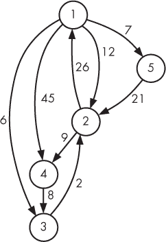
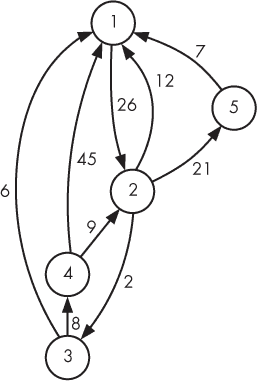
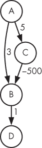
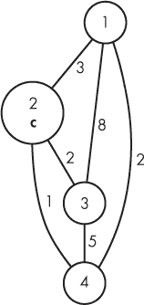
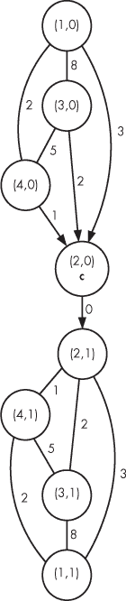
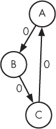

## 6

加权图中的最短路径


本章对我们在第五章中学习的最短路径问题进行了推广。在第五章中，我们的重点是找出解决问题所需的最小步数。现在，假设我们关心的不是最小步数，而是最短时间或距离？想象一下使用 GPS 应用程序回家。也许有一条只需要 10 分钟的单行道回家。也许有另一条路线，虽然需要经过三条街，但总共只需 8 分钟。我们可能会选择走这三条街，因为它们节省了时间。

在本章中，我们将学习 *Dijkstra 算法*，用于在加权图中找到最短路径。我们将使用它来确定在时间限制内能够逃脱迷宫的实验鼠数量，以及从某人家到他们祖母家的最短路径数量。我特别选择了那个关于祖母的例子，来重温我们在第五章中发现的一个结论：经过适当修改，像 BFS 和 Dijkstra 这样的算法能够做的不仅仅是“找到最短路径”。我们正在学习算法——这些算法理应广为人知——同时也在积累灵活的问题解决工具。让我们开始吧！

### 问题 1：实验鼠迷宫

这是 UVa 问题 `1112`。

#### *问题*

一个迷宫由单元格和通道组成。每条通道从某个单元格 *a* 到另一个单元格 *b*，并且行走这条通道需要 *t* 时间单位。例如，从单元格 2 到单元格 4 可能需要 5 时间单位。现在考虑反向通道：从单元格 4 到单元格 2 可能需要 70 时间单位，或者从单元格 4 到单元格 2 可能根本没有通道——*a* *→* *b* 和 *b* *→* *a* 通道是独立的。迷宫中的一个单元格被指定为出口单元格。

每个单元格中都有一只实验鼠，包括出口单元格。实验鼠已经被训练成尽可能快速地走到出口单元格。我们的任务是确定在规定时间内能够到达出口单元格的实验鼠数量。

##### 输入

第一行输入给出测试用例的数量，后面跟着一个空行。每一对测试用例之间也有一个空行。每个测试用例包含以下几行：

+   一行包含 *n*，迷宫中的单元格数量。单元格编号从 1 到 *n*；*n* 至多为 100。

+   一行包含 *e*，出口单元格。*e* 介于 1 和 *n* 之间。

+   一行包含 *t*，实验鼠到达出口单元格的整数时间限制。*t* 至少为零。

+   一行包含 *m*，迷宫中通道的数量。

+   *m* 行，每行描述迷宫中的一条通道。每行包含三个整数：第一个单元格 *a*（介于 1 和*n*之间），第二个单元格 *b*（介于 1 和*n*之间），以及从 *a* 到 *b* 行走所需的时间（至少为零）。

##### 输出

对于每个测试用例，输出在时间限制*t*内到达出口单元格*e*的老鼠数量。每个测试用例的输出之间由一个空行分隔。

解决测试用例的时间限制——是针对我们的代码，而不是老鼠——是三秒钟。

#### *从 BFS 继续*

老鼠迷宫问题与第五章中的三个问题有一些关键的相似之处。我们可以将老鼠迷宫建模为一个图，其中节点是迷宫单元格，边是通道。这个图是有向的（就像绳索攀爬问题那样），因为从单元格*a*到单元格*b*的通道并不能告诉我们从*b*到*a*的通道是否存在。

第五章中的三个问题的核心算法是广度优先搜索（BFS）。BFS 的杀手特性是它能够找到最短路径。巧合的是，我们在老鼠迷宫中也需要最短路径。它们能帮助我们确定每只老鼠到达出口单元格所需的时间。

然而，所有关于相似性的讨论掩盖了一个关键的区别：老鼠迷宫图是*加权的*：每条边上都有一个任意的整数，表示穿越该边所需的时间。具体例子请参见图 6-1。


*图 6-1：老鼠迷宫图*

假设出口单元格是单元格 4。单元格 1 到单元格 4 所需的最短时间是多少？单元格 1 到单元格 4 之间有一条直接的边，所以如果我们在计算边的数量（如 BFS 中那样），答案将是`1`。然而，我们这里不关心边的数量：我们更关心的是以边的权重总和来衡量的最短路径。1 *→* 4 边的权重是 45，这不是最短路径。单元格 1 到单元格 4 的最短路径是这样的一条三边路径：从单元格 1 到单元格 3（花费 6 个时间单位），再从单元格 3 到单元格 2（花费 2 个时间单位），最后从单元格 2 到单元格 4（花费 9 个时间单位）。这总共是 6 + 2 + 9 = 17 个时间单位。正因为如此，BFS 在这种情况下就不适用了，我们需要采用不同的算法。

但稍等：第五章中也有一些加权图，我们在其中使用了 BFS。怎么回事？回顾图 5-6，这是一个绳索攀爬图，其中有些边的权重是 1，有些边的权重是 0。我们能够在这里使用 BFS，原因仅仅是边的权重受到严格限制。现在回头看看图 5-7，这是一个书籍翻译图。这是一个完全加权的图，边的权重是任意的。我们在这里也能使用 BFS，但那是因为主要的距离度量是边的数量。一旦 BFS 确定了一个节点的边的距离，只有在此之后，边的权重才会发挥作用，帮助我们以尽可能低的成本添加节点。

然而，鼠标迷宫与边的数量毫无关系。从*a*到*b*的路径可能有 100 条边，总时间为 5 单位。另一条从*a*到*b*的路径可能只有 1 条边，时间为 80 单位。BFS 会发现第二条路径，而我们想要的是第一条路径。

#### *在加权图中寻找最短路径*

BFS 通过逐步识别离起始节点越来越远的节点（按边数计算）来运作。我在这一节中展示的算法与此类似：它通过总边权来识别离起始节点越来越远的最短路径。

BFS 按照回合组织工作，每一回合中发现的节点比当前回合的节点距离起始节点多一条边。我们无法使用这种回合的思路来寻找加权图中的最短路径，因为我们最近发现的最短路径不一定有助于我们找到新节点的最短路径。我们必须稍微多做些工作，才能找到下一个最短路径。

为了演示，我们来通过图 6-1 找到从节点 1 到图中每个节点的最短路径。这将告诉我们鼠标从单元格 1 到出口单元格需要多长时间。

对于每个节点，我们将维护两条信息：

***done*** 这是一个布尔变量。如果为 false，意味着我们还没有找到该节点的最短路径；如果为 true，表示我们已经找到了。只要一个节点的*done*值为 true，我们就完成了该节点：它的最短路径永远不会再改变。

***min_time*** 这是从起始节点到此节点的最短路径距离，按总时间计算，使用一条所有其他节点均已完成的路径。随着越来越多的节点完成，*min_time*可以减小，因为我们有更多通往该节点的路径选择。

从节点 1 到节点 1 的最短路径是 0：没有地方可去，也没有边可走。我们从这里开始，节点 1 的*min_time*为 0，其他节点没有*min_time*信息：

| ***node*** | ***done*** | ***min_time*** |
| --- | --- | --- |
| 1 | false | 0 |
| 2 | false |  |
| 3 | false |  |
| 4 | false |  |
| 5 | false |  |

接下来，我们将节点 1 标记为已完成，然后根据从节点 1 到其他节点的边权设置各自的*min_time*。以下是我们接下来的快照：

| ***node*** | ***done*** | ***min_time*** |
| --- | --- | --- |
| 1 | true | 0 |
| 2 | false | 12 |
| 3 | false | 6 |
| 4 | false | 45 |
| 5 | false | 7 |

现在，下面这个陈述是我们所做工作的核心：从节点 1 到节点 3 的最短路径是 6，并且我们永远无法做得比 6 更好。我选择节点 3 作为我的陈述对象，因为它是尚未完成节点中*min_time*值最小的节点。

现在声称答案是 6 似乎有些大胆。如果存在另一条更短的路径到达节点 3，或者是通过一些其他节点最终到达节点 3 的路径呢？

这就是为什么那种情况不可能发生，以及为什么我们可以确定 6 是正确答案的原因。假设从节点 1 到节点 3 存在一条更短的路径 *p*。这条路径必须从节点 1 开始，并通过某个边 *e* 离开节点 1。然后它必须经过零个或多个其他边，并到达节点 3。仔细想想：*e* 已经至少需要 6 时间单位，因为 6 是从节点 1 到其他节点所需的最短时间。路径 *p* 上的任何其他边只会增加这个时间，因此不可能存在总时间少于 6 单位的路径 *p*！

所以，节点 3 已完成：我们知道它的最短路径。现在我们需要使用节点 3 来检查是否能够改善任何尚未完成的节点的最短路径。请记住，*最短时间* 值是通过已完成节点计算的最短路径。到达节点 3 需要 6 时间单位，并且从节点 3 到节点 2 有一条边，花费 2 时间单位，因此我们现在有了一条从节点 1 到节点 2 仅需 8 时间单位的路径。因此，我们将节点 2 的 *最短时间* 值从 12 更新为 8。以下是当前的状态：

| ***节点*** | ***已完成*** | ***最短时间*** |
| --- | --- | --- |
| 1 | true | 0 |
| 2 | false | 8 |
| 3 | true | 6 |
| 4 | false | 45 |
| 5 | false | 7 |

节点 2、4 和 5 尚未完成。现在我们能将哪个节点标记为完成呢？答案是节点 5：它的 *最短时间* 最小。我们能否利用节点 5 更新其他最短路径？节点 5 确实有一条指向节点 2 的边，但从节点 1 到节点 5 需要 7 时间单位，然后再从节点 5 到节点 2 需要 21 时间单位，总共需要的时间（7 + 21 = 28）比我们原来的从节点 1 到节点 2 的路径（8 时间单位）要长。所以我们不会改变节点 2 的 *最短时间*。因此，下一次更新的唯一变化是将节点 5 标记为完成。

| ***节点*** | ***已完成*** | ***最短时间*** |
| --- | --- | --- |
| 1 | true | 0 |
| 2 | false | 8 |
| 3 | true | 6 |
| 4 | false | 45 |
| 5 | true | 7 |

还有两个节点要处理。节点 2 的*min_time*为 8，节点 4 的*min_time*为 45。和往常一样，我们选择较小的值，最终确定从节点 1 到节点 2 的最短路径为 8。再次强调，从节点 1 到节点 2 的最短路径无法小于 8。任何从节点 1 到节点 2 的较短路径*p*，必须先经过一些已完成的节点，并且在某一时刻，会第一次穿越一条从已完成节点到未完成节点的边。我们称这条边为*x* *→* *y*，其中*x*是已完成的节点，而*y*是未完成的节点。这就是*p*从节点 1 到达节点*y*的方式。接下来，它可以随意从节点*y*到节点 2……但这一切都是多余的。从节点 1 到节点*y*已经至少需要 8 个时间单位：如果少于 8 个单位，那*y*的*min_time*值就会小于 8，而我们本应选择将*y*标记为已完成，而不是节点 2。无论*p*如何从节点*y*到节点 2，都会增加更多的时间。所以*p*不能比 8 更短。

添加节点 2 后，我们有两条边可以检查是否存在更短的路径。从节点 2 到节点 1 有一条边，但这没有帮助，因为节点 1 已经完成。从节点 2 到节点 4 有一条 9 时间单位的边。这条边有帮助！从节点 1 到节点 2 需要 8 个时间单位，然后 2 *→* 4 的边需要 9 个时间单位，总共是 17 个时间单位。这比我们之前从节点 1 到节点 4 需要的 45 个时间单位要好。下面是下一个快照：

| ***节点*** | ***已完成*** | ***最短时间*** |
| --- | --- | --- |
| 1 | true | 0 |
| 2 | true | 8 |
| 3 | true | 6 |
| 4 | false | 17 |
| 5 | true | 7 |

只有一个节点，即节点 4，尚未完成。由于其他所有节点都已完成，我们已经找出了它们的最短路径。因此，节点 4 不能帮助我们找到任何新的、更短的路径。我们可以将节点 4 标记为已完成，并得出结论：

| ***节点*** | ***已完成*** | ***最短时间*** |
| --- | --- | --- |
| 1 | true | 0 |
| 2 | true | 8 |
| 3 | true | 6 |
| 4 | true | 17 |
| 5 | true | 7 |

在第 1 单元格的老鼠到达出口单元格 4 时，总共需要 17 个时间单位。我们可以对每个其他节点重复这个过程，找出每只老鼠到达出口单元格所需的时间，然后计算按时到达的老鼠数量。

这个算法被称为迪杰斯特拉算法（Dijkstra’s algorithm），以计算机科学的先驱和影响力人物埃德斯杰·W·迪杰斯特拉（Edsger W. Dijkstra）命名。给定一个起始节点*s*和一个加权图，它可以计算出从*s*到图中每个节点的最短路径。这正是我们解决老鼠迷宫问题所需要的。让我们读取输入来构建图形，然后看看如何实现迪杰斯特拉算法。

#### *构建图形*

基于你到目前为止构建树和图的经验，这里不会有太多惊讶。我们将像在上一章的书籍翻译问题中一样构建图（见第 189 页中的“构建图”）。唯一的不同是，之前的图是无向图，而我们这里的图是有向图。好消息是，我们直接给出了节点编号，而不需要在语言名称和整数之间进行映射。

为了方便测试，这里提供了一个输入，对应于图 6-1：

```
   1

   5
   4
➊ 12
   9
   1 2 12
   1 3 6
   2 1 26
   1 4 45
   1 5 7
   3 2 2
   2 4 9
   4 3 8
   5 2 21
```

该`12` ➊ 给出了老鼠到达出口的时间限制。（你可以验证，三只老鼠可以在这个时间限制内到达出口；这三只老鼠分别位于单元 2、3 和 4。）

和书籍翻译问题一样，我们将使用图的邻接表表示法。每条边包含指向的单元、行走该边所需的时间以及下一个指针。

这是所需的常量和`typedef`：

```
#define MAX_CELLS 100

typedef struct edge {
 int to_cell, length;
  struct edge *next;
} edge;
```

图表由`main`函数读取，见列表 6-1。

```
int main(void) {
  static edge *adj_list[MAX_CELLS + 1];
  int num_cases, case_num, i;
  int num_cells, exit_cell, time_limit, num_edges;
  int from_cell, to_cell, length;
  int total, min_time;
  edge *e;

  scanf("%d", &num_cases);
  for (case_num = 1; case_num <= num_cases; case_num++) {
    scanf("%d%d%d", &num_cells, &exit_cell, &time_limit);
    scanf("%d", &num_edges);
➊ for (i = 1; i <= num_cells; i++)
    adj_list[i] = NULL;
  for (i = 0; i < num_edges; i++) {
    scanf("%d%d%d", &from_cell, &to_cell, &length);
    e = malloc(sizeof(edge));
    if (e == NULL) {
      fprintf(stderr, "malloc error\n");
      exit(1);
    }
    e->to_cell = to_cell;
    e->length = length;
    e->next = adj_list[from_cell];
  ➋ adj_list[from_cell] = e;
  }

  total = 0;
  for (i = 1; i <= num_cells; i++) {
  ➌ min_time = find_time(adj_list, num_cells, i, exit_cell);
  ➍ if (min_time >= 0 && min_time <= time_limit)
       total++;
  }
  printf("%d\n", total);
  if (case_num < num_cases)
    printf("\n");
 }
 return 0;
}
```

*列表 6-1：用于构建图的* main *函数*

输入规范说在测试用例数量后会有一个空行，每对测试用例之间也有一个空行。然而，使用`scanf`时我们无需担心这一点：当读取数字时，`scanf`会跳过它遇到的所有前导空白（包括换行符）。

我们为每个测试用例做的第一件事是通过将每个单元的边表设置为`NULL` ➊来清空邻接表。如果不这么做，会导致一个可怕的 bug，其中每个测试用例都会包含前一个测试用例的边。（我知道，因为我犯过这个错误，结果三小时后才发现。）我们有责任为每个测试用例清空数据！

在初始化每个边时，我们将其添加到`from_cell`的链表中 ➋。我们不会向`to_cell`的链表添加任何内容，因为图是有向图（不是无向图）。

该问题要求我们找到每个单元到出口单元的最短路径。因此，对于每个单元，我们调用`find_time` ➌，它是一个实现了 Dijkstra 算法的辅助函数。我们接下来会编写这个函数。给定起始单元`i`和目标单元`exit_cell`，如果没有路径，它返回`-1`，否则返回最短路径时间。每个到达出口单元需要`time_limit`单位时间或更少的单元，都会使得`total`增加 1 ➍。一旦考虑完每个单元的最短路径，`total`就会被输出。

#### *实现 Dijkstra 算法*

现在是实现 Dijkstra 算法的时候了，按照“加权图中寻找最短路径”部分提供的概要来实现，见第 200 页。这是我们将要实现的函数签名：

```
int find_time(edge *adj_list[], int num_cells,
              int from_cell, int exit_cell)
```

这四个参数分别对应邻接表、单元格数量、起始单元格和出口单元格。Dijkstra 算法将计算从起始单元格到所有其他单元格的最短路径时间，包括出口单元格。一旦计算完成，我们可以返回到出口单元格的最短路径时间。这个看起来可能有点奢侈，计算到所有单元格的最短路径后，只保留通往出口单元格的最短路径而抛弃其他路径。我们可以进行多种优化，接下来会讨论这些优化。现在，让我们先实现一个简单可用的版本。

Dijkstra 算法的主体通过两个嵌套的 `for` 循环实现。外层 `for` 循环每个单元格运行一次；每次迭代将一个单元格标记为已完成，并使用该新单元格更新最短路径。内层 `for` 循环进行最小值计算：它在所有未完成的单元格中找到 `min_time` 值最小的单元格。代码见 Listing 6-2。

```
int find_time(edge *adj_list[], int num_cells,
              int from_cell, int exit_cell) {
  static int done[MAX_CELLS + 1];
  static int min_times[MAX_CELLS + 1];
 int i, j, found;
   int min_time, min_time_index, old_time;
   edge *e;
➊ for (i = 1; i <= num_cells; i++) {
     done[i] = 0;
     min_times[i] = -1;
   }
➋ min_times[from_cell] = 0;

   for (i = 0; i < num_cells; i++) {
     min_time = -1;
   ➌ found = 0;
   ➍ for (j = 1; j <= num_cells; j++) {
     ➎ if (!done[j] && min_times[j] >= 0) {
       ➏ if (min_time == -1 || min_times[j] < min_time) {
            min_time = min_times[j];
            min_time_index = j;
            found = 1;
          }
        }
      }
   ❼ if (!found)
        break;
      done[min_time_index] = 1;

      e = adj_list[min_time_index];
      while (e) {
        old_time = min_times[e->to_cell];
     ➑ if (old_time == -1 || old_time > min_time + e->length)
          min_times[e->to_cell] = min_time + e->length;
        e = e->next;
     }
   }
➒ return min_times[exit_cell];
}
```

*Listing 6-2: 使用 Dijkstra 算法找到通往出口单元格的最短路径*

`done` 数组的目的是指示每个单元格是否已完成：`0`表示“未完成”，`1`表示“已完成”。`min_times` 数组的目的是存储从起始单元格到每个单元格的最短路径距离。

我们使用 `for` 循环 ➊ 来初始化这两个数组：它将所有 `done` 值设置为 `0`（假），将 `min_times` 值设置为 `-1`（未找到）。然后，我们将 `from_cell` 的 `min_times` 设置为 `0` ➋，表示从起始单元格到它自身的最短路径距离为零。

`found` 变量跟踪 Dijkstra 算法是否能发现新单元格。在每次外层 `for` 循环迭代时，它初始为 `0`（假），如果找到一个单元格，则设置为 `1`（真）——但是，怎么可能找不到单元格呢？例如，在本章之前，我们已经找到了所有单元格。然而，可能存在这样的图形，其中起始单元格与某些其他单元格之间*没有*路径。在这些图形中，Dijkstra 算法无法找到某些单元格；当无法找到新单元格时，就该停止了。

现在我们进入内层 `for` 循环 ➍，它的任务是识别下一个最短路径将被找到的单元格。这个循环将把 `min_time_index` 设置为最短路径已找到的单元格的索引，并将 `min_time` 设置为最短路径的时间。符合条件的单元格是那些既未完成又有一个至少为 `0`（即非 `-1`）的 `min_times` 值的单元格 ➎。我们需要单元格未完成，因为已完成的单元格已经有了最终的最短路径。我们还需要 `min_times` 值至少为 `0`：如果它是 `-1`，表示该单元格尚未找到，因此我们不知道它的最短路径是什么。如果还没有符合条件的单元格，或者当前单元格的路径比我们当前已知的最短路径更短 ➏，我们就更新 `min_time` 和 `min_time_index`，并将 `found` 设置为 `1`，标志着我们成功找到了一个单元格。

如果没有找到单元格，那么我们就停止 ➐。否则，我们将识别出的单元格标记为完成，并循环遍历它的出边来寻找更短的路径。对于每一条边 `e`，我们检查该单元格是否提供到 `e->to_cell` 的更短路径 ➑。那个可能的更短路径是 `min_time`（从 `from_cell` 到 `min_time_index` 的时间）加上走过边 `e`（从 `min_time_index` 到 `e->to_cell` 的时间）。

在查看边 `e` 时，难道我们不应该先验证 `e->to_cell` 是否已经完成，然后再检查我们是否找到了更短的路径 ➑ 吗？虽然我们可以添加那个检查，但它不会产生任何效果。已完成的单元格已经拥有最终确定的最短路径；不可能再找到更短的路径了。

通过计算到所有单元格的最短路径，我们肯定已经计算出了到出口单元格的最短路径。最后要做的就是返回那个时间 ➒。

结束了！继续提交给评测系统吧。代码应该能够通过所有的测试用例。

#### *两个优化*

有一些方法可以加速 Dijkstra 算法。最广泛适用且显著的加速是通过一种叫做 *堆* 的数据结构实现的。在我们当前的实现中，找到下一个要标记为完成的节点非常昂贵，因为我们需要扫描所有未完成的节点，找出具有最短路径的那个节点。堆使用树将这种慢速的线性搜索转换为快速搜索。由于堆在许多场景中都很有用，不仅限于 Dijkstra 算法，我将在稍后的第八章中讨论它们。在这里，我会提供几个更具体于老鼠迷宫问题的优化方法。

记住，一旦一个单元格被标记为完成，我们就不再改变它的最短路径。因此，一旦我们将出口单元格标记为完成，我们就得到了它的最短路径。之后，就没有必要再为其他单元格找到最短路径了。我们可以提前终止 Dijkstra 算法。

然而，我们还是可以做得更好。对于一个包含 *n* 个单元格的迷宫，我们可以执行 Dijkstra 算法 *n* 次，每次对一个单元格执行。对于单元格 1，我们计算所有的最短路径——然后只保留到出口单元格的最短路径。对于单元格 2、单元格 3，依此类推，我们丢弃所有找到的最短路径，除了那些涉及出口单元格的路径。

相反，可以考虑只运行一次 Dijkstra 算法，将出口单元格作为起始单元格。Dijkstra 算法会找到从出口单元格到单元格 1，从出口单元格到单元格 2，依此类推的最短路径。然而，这并不是我们想要的，因为图是有向的：从出口单元格到单元格 1 的最短路径*不一定*是从单元格 1 到出口单元格的最短路径。

这里再次展示图 6-1：



正如我们之前发现的，从单元格 1 到单元格 4 的最短路径是 17，但从单元格 4 到单元格 1 的最短路径是 36。

从 Cell 1 到 Cell 4 的最短路径使用了边 1 *→* 3、3 *→* 2 和 2 *→* 4。如果我们打算从 Cell 4 开始运行 Dijkstra 算法，那么它需要找到边 4 *→* 2、2 *→* 3 和 3 *→* 1。每一条边都是原始图中边的*反向*。图 6-2 显示了*反向图*。



*图 6-2：图 6-1 的反向版本*

现在我们可以运行 Dijkstra 算法——只需调用一次！——从 Cell 4 开始，恢复到所有节点的最短路径。

就实现而言，我们需要生成反向图，而不是原始图。这可以在`main`函数中完成（见 Listing 6-1），在读取图时进行处理。替代方法是：

```
      e->to_cell = to_cell;
      e->length = length;
      e->next = adj_list[from_cell];
      adj_list[from_cell] = e;
```

我们需要的是：

```
      e->to_cell = from_cell;
      e->length = length;
      e->next = adj_list[to_cell];
      adj_list[to_cell] = e;
```

也就是说，边现在指向`from_cell`，并且它会被添加到`to_cell`的链表中。如果你进行这个修改并调整代码，使其只调用一次 Dijkstra 算法（从出口单元开始），你将得到一个更快的程序。试试看！

### Dijkstra 算法

Dijkstra 算法接管了 BFS 的工作。BFS 在无权图中根据边的数量找到最短路径；而 Dijkstra 算法在加权图中根据边的权重找到最短路径。

与广度优先搜索（BFS）类似，Dijkstra 算法从一个起始节点开始，并从那里找到到图中每个节点的最短路径。与 BFS 类似，它解决的是*单源最短路径*问题，不同的是，Dijkstra 算法是在加权图上运行，而不是无权图。

公平地说，Dijkstra 算法*也*可以在无权图中找到最短路径。只需将无权图中的每条边赋予权重 1。现在，当 Dijkstra 算法找到最短路径时，它实际上最小化了路径中的边数，这正是 BFS 所做的。

那为什么不使用 Dijkstra 算法来解决每个最短路径问题，无论是无权图还是加权图呢？实际上，确实存在一些问题，在这些问题中很难决定使用 BFS 还是 Dijkstra 算法。例如，我怀疑很多人会选择使用 Dijkstra 算法而不是（修改过的）BFS 来解决第五章中的绳子攀爬问题。当任务明确是最小化移动次数时，BFS 应当是首选：它通常比 Dijkstra 算法更容易实现，而且运行得稍微快一点。但无论如何，Dijkstra 算法并不慢。

#### *Dijkstra 算法的运行时间*

让我们来描述一下 Dijkstra 算法的运行时间，如 Listing 6-2 所示。我们使用*n*来表示图中的节点数。

初始化循环➊重复*n*次，每次迭代执行一个常数步骤，因此总工作量与*n*成正比。接下来的初始化步骤➋是一个单一步骤。无论我们说初始化需要*n*步还是*n* + 1 步都没关系，因此我们忽略这个 1，认为它需要*n*步。

Dijkstra 算法的真正工作现在开始。它的外层 `for` 循环最多迭代 *n* 次。在每次迭代中，内层 `for` 循环会执行 *n* 次以找到下一个节点。因此，内层 `for` 循环总共会迭代 *n*² 次。每次迭代执行固定量的工作，因此内层 `for` 循环的总工作量与 *n*² 成正比。

Dijkstra 算法的另一个工作是遍历每个节点的边。总共有 *n* 个节点，所以每个节点最多有 *n* 条离开的边。因此，我们需要进行 *n* 步来遍历一个节点的边，并且我们必须对每个节点做这件事。这又是 *n*² 步。

总结一下，我们在初始化时有 *n* 工作，在内层 `for` 循环中有 *n*² 工作，在检查边时有 *n*² 工作。最大的指数是 2，所以这是一个 *O*(*n*²) 或二次时间复杂度的算法。

在第一章中，我们对一个二次时间复杂度的“独特雪花”算法嗤之以鼻，抛弃它，选择了一个线性时间的算法。从这个意义上说，我们开发的 Dijkstra 算法实现并不算太惊艳。然而，从另一个角度来看，它确实令人印象深刻，因为它在 *n*² 时间内解决了 *n* 个问题，每个问题对应从起始节点出发的最短路径。

我选择在本书中介绍 Dijkstra 算法，但还有许多其他最短路径算法。有些算法能够一次性找到图中所有节点对之间的最短路径。这样就解决了 *所有节点对最短路径* 问题。一个这样的算法叫做 *Floyd-Warshall 算法*，它的时间复杂度是 *O*(*n*³)。有趣的是，我们也可以用 Dijkstra 算法找到所有节点对的最短路径，而且速度一样快。我们可以运行 Dijkstra 算法 *n* 次，每次从不同的起始节点开始。那就是 *n* 次调用 *n*² 算法，总共的工作量是 *O*(*n*³)。

无论是加权还是无加权，单源还是所有节点对，Dijkstra 算法都能处理。它真的无法阻挡吗？错！

#### *负权重边*

到目前为止，我们在本章中做了一个隐含假设：边的权重是非负的。例如，在老鼠迷宫中，边的权重代表走过每条边所需的时间；走一条边肯定不会让时间倒退，因此没有边的权重是负的。同样，在许多其他图中，负权重的边不会出现，因为它们没有实际意义。例如，考虑一个图，其中节点是城市，边是城市间的航班费用。没有航空公司会为我们乘坐他们的航班付费，因此每条边的费用是非负的美元。

现在考虑一个游戏，其中一些操作给我们加分，而另一些操作则扣分。后者的操作对应于 *负权重边*。因此，负权重边偶尔会出现。那么 Dijkstra 算法如何应对呢？让我们用图 6-3 中的示例图来看看。



*图 6-3：带有负权边的图*

让我们尝试从节点 A 寻找最短路径。和往常一样，Dijkstra 算法首先将最短路径 0 指定给节点 A，并将 A 设置为已完成。从 A 到 B 的距离是 3，从 A 到 C 的距离是 5，但从 A 到 D 的距离尚未定义（并且留空）：

| ***节点*** | ***已完成*** | ***最短距离*** |
| --- | --- | --- |
| A | true | 0 |
| B | false | 3 |
| C | false | 5 |
| D | false |  |

Dijkstra 算法接着决定将到 B 的最短路径定为 3，并将 B 标记为已完成。它还更新了到 D 的最短路径：

| ***节点*** | ***已完成*** | ***最短距离*** |
| --- | --- | --- |
| A | true | 0 |
| B | true | 3 |
| C | false | 5 |
| D | false | 4 |

由于 B 已完成，我们声称从 A 到 B 的最短路径是 3，但这会出问题，因为 3 *不是*从 A 到 B 的最短路径。最短路径应该是 *A* *→* *C* *→* *B*，总权重为 -495。为了好玩，我们就继续在这些可疑的情况下进行，看看 Dijkstra 算法会怎么做。下一个完成的节点是 D：

| ***节点*** | ***已完成*** | ***最短距离*** |
| --- | --- | --- |
| A | true | 0 |
| B | true | 3 |
| C | false | 5 |
| D | true | 4 |

到 D 的最短路径也错了！它应该是 -494。因为除了 C 外所有节点都已完成，所以 C 无法再做任何事情：

| ***节点*** | ***已完成*** | ***最短距离*** |
| --- | --- | --- |
| A | true | 0 |
| B | true | 3 |
| C | true | 5 |
| D | true | 4 |

即使我们让 Dijkstra 算法将最短路径更改为 B（从 3 改为 -495），到 D 的最短路径仍然是错误的。我们必须以某种方式再次处理 B，即使 B 已完成。我们需要一种方法来表示：“嘿，我知道我说 B 已完成，但我改变主意了。”无论如何，我展示的经典 Dijkstra 算法在这个例子中是错误的。

一般来说，当图的边有负权时，Dijkstra 算法是无法工作的。对此，你可以考虑探索 *Bellman-Ford 算法* 或前面提到的 Floyd-Warshall 算法。

让我们继续进行另一个问题，这次我们不必担心负权边。我们将再次使用 Dijkstra 算法，或者更确切地说，我们将调整 Dijkstra 算法来解决关于最短路径的全新问题。

### 问题 2：奶奶规划师

有时，我们不仅会被要求给出最短路径的距离，还会要求进一步提供关于最短路径的信息。这个问题就是这样一个例子。

这是 DMOJ 问题 `saco08p3`。

#### *问题*

Bruce 正在计划去奶奶家旅行。那里有 *n* 个城镇，编号为 1 到 *n*。Bruce 从城镇 1 出发，他的奶奶住在城镇 *n*。每对城镇之间都有一条道路，并且我们给出了每条道路的长度（距离）。

布鲁斯希望带着一盒饼干到达奶奶家，因此他必须在途中购买饼干。一些镇有饼干店；布鲁斯必须至少经过一个饼干镇才能到达奶奶家。

我们的任务有两个方面。首先，我们必须确定布鲁斯从起点到奶奶家的最短距离，并且途中必须经过至少一个饼干店。这个最短距离并没有告诉我们布鲁斯有多少种路径可以到达奶奶家。也许只有一种方法可以做到，所有其他路径都需要更长的距离，或者可能有几条路径，它们的最短距离是相同的。因此，第二个任务是确定这些最短路径的数量。

##### 输入

输入包含一个测试用例，由以下几行组成：

+   一行包含 *n*，即镇的数量。镇的编号从 1 到 *n*。镇的数量介于 2 到 700 之间。

+   *n* 行，每行包含 *n* 个整数。第一行给出了从镇 1 到每个镇的道路距离（先是镇 1，再是镇 2，依此类推）；第二行给出了从镇 2 到每个镇的道路距离；依此类推。从一个镇到其自身的距离为零；其他每个距离至少为 1。从镇 *a* 到镇 *b* 的距离与从镇 *b* 到镇 *a* 的距离相同。

+   一行包含 *m*，即有饼干店的镇的数量。*m* 至少为 1。

+   一行包含 *m* 个整数，每个整数表示一个有饼干店的镇的编号。

##### 输出

在一行中输出以下内容：

+   从镇 1 到镇 *n* 的最短距离（途中经过饼干店）

+   一个空格

+   最短距离路径的数量，模 1,000,000

解决此测试用例的时间限制为一秒。

#### *邻接矩阵*

这里的图表示方式与 第五章中的《老鼠迷宫》和《书籍翻译问题》不同。在这两个问题中，每条边都以一个节点、另一个节点和边权的形式提供。例如，考虑以下情况：

```
1 2 12
```

这意味着从节点 1 到节点 2 有一条边，边权为 12。

在《奶奶规划师问题》中，图是以 *邻接矩阵* 的形式表示的，邻接矩阵是一个二维数字数组，其中给定的行列坐标表示该行和列的边的权重。

这是一个示例测试用例：

```
4
0 3 8 2
3 0 2 1
8 2 0 5
2 1 5 0
1
2
```

顶部的 `4` 告诉我们有四个镇。接下来的四行是邻接矩阵。让我们关注其中的第一行：

```
0 3 8 2
```

这一行给出了离开镇 1 的所有边。镇 1 到镇 1 的边权为 `0`，镇 1 到镇 2 的边权为 `3`，镇 1 到镇 3 的边权为 `8`，镇 1 到镇 4 的边权为 `2`。

下一行，

```
3 0 2 1
```

同样地，这对镇 2 也适用，依此类推。

请注意，任意一对镇之间都有边连接；也就是说，图中没有缺失的边。这样的图称为 *完全图*。

这个邻接矩阵有一些冗余。例如，在第 1 行第 3 列，它表示从城镇 1 到城镇 3 的边权重为`8`。然而，由于问题中规定从城镇 *a* 到城镇 *b* 的路程与从城镇 *b* 到城镇 *a* 的路程相同，因此我们在第 3 行第 1 列再次看到这个`8`。 （因此我们处理的是无向图。）我们在对角线也有`0`，这明确表示从某个城镇到其自身的距离为零。我们将忽略这些。

#### *构建图形*

这个问题最终将要求我们展现创意，不是一次，而是两次。首先，我们需要强制让路径经过一个有饼干店的城镇。在这些路径中，我们要找到最短的一条。其次，我们需要跟踪的不仅是最短路径，还要统计有多少种方式可以实现最短路径。双倍的乐趣，我说！

让我们从输入中读取测试用例并构建图形。此时，我们已经准备好进行下一步了。有了图形后，我们将准备好处理接下来的问题。

计划是读取邻接矩阵，在此过程中构建我们的邻接列表。由于邻接矩阵没有明确提供城镇的索引，我们需要自己跟踪这些索引。

可以直接读取并使用邻接矩阵，完全避免使用邻接列表表示法。每一行 *i* 给出到每个城镇的距离，因此我们可以在 Dijkstra 算法中直接循环遍历第 *i* 行，而不是循环遍历 *i* 的邻接列表。由于图是完全图，我们甚至不需要浪费时间跳过不存在的边。然而，为了与我们已经做过的保持一致，我们这里还是使用邻接列表。

这是一个常量和`edge`结构体，我们将使用它：

```
#define MAX_TOWNS 700

typedef struct edge {
  int to_town, length;
  struct edge *next;
} edge;
```

读取图形的代码见于列表 6-3。

```
int main(void) {
  static edge *adj_list[MAX_TOWNS + 1] = {NULL};
  int i, num_towns, from_town, to_town, length;
  int num_stores, store_num;
  static int store[MAX_TOWNS + 1] = {0};
  edge *e;
 scanf("%d", &num_towns);
➊ for (from_town = 1; from_town <= num_towns; from_town++)
     for (to_town = 1; to_town <= num_towns; to_town++) {
       scanf("%d", &length);
    ➋ if (from_town != to_town) {
         e = malloc(sizeof(edge));
         if (e == NULL) {
           fprintf(stderr, "malloc error\n");
           exit(1);
         }
         e->to_town = to_town;
         e->length = length;
         e->next = adj_list[from_town];
         adj_list[from_town] = e;
       }
     }

➌ scanf("%d", &num_stores);
   for (i = 1; i <= num_stores; i++) {
     scanf("%d", &store_num);
     store[store_num] = 1;
   }
   solve(adj_list, num_towns, store);
   return 0;
}
```

*列表 6-3：构建图形的* 主 *函数*

读取城镇数量后，我们使用一个双重`for`循环来读取邻接矩阵。外层`for`循环的每次迭代➊负责读取一行，具体来说，就是读取`from_town`这一行。为了读取该行，我们有一个内层`for`循环，它会读取每个`to_town`的`length`值。现在我们知道了边的起始点、终点以及边的长度。接下来，我们想要添加这条边，但前提是它不是从某个城镇返回到自身的 0 权重边。如果这条边是连接两个不同城镇➋的，那么我们就将它添加到`from_town`的邻接表中。由于图是无向图，我们还必须确保这条边最终会被添加到`to_town`的邻接表中。在 Listing 5-16 中解决“书籍翻译”问题时，我们必须显式地这么做。但在这里，我们不需要这么做，因为当我们处理`to_town`的这一行时，它会在后续自动被添加。举个例子，如果`from_town`是`1`且`to_town`是`2`，那么 1 *→* 2 的边现在会被添加。稍后，当`from_town`是`2`且`to_town`是`1`时，2 *→* 1 的边会被添加。

接下来只需要读取哪些城镇有饼干店的信息，从有饼干店的城镇数量➌开始。为了跟踪这些城镇，我们使用数组`store`，其中`store[i]`为`1`（真）表示城镇`i`有饼干店，为`0`（假）表示没有饼干店。

#### *处理一个奇怪的测试案例*

让我们通过处理“邻接矩阵”中的测试案例来更好地理解这个问题，见第 214 页。对应的图形在图 6-4 中给出，其中**c**代表饼干城镇。



*图 6-4：奶奶图*

Bruce 从城镇 1 出发，必须到达城镇 4。城镇 2 是唯一有饼干店的城镇。最短路径是多少？虽然 Bruce 可以直接从城镇 1 飞速到达城镇 4，沿途经过距离为 2 的边，但这不是问题的可行解。记住，我们需要确保任何拟议的最短路径都必须包含一个有饼干店的城镇。对于这个特定的图形，这意味着我们必须包括城镇 2。（在其他测试案例中，可能会有多个城镇有饼干店；我们需要做的是包括一个或多个这样的城镇。）

这是一个从城镇 1 到城镇 4 的可行路径：1 *→* 2（距离 3） *→* 4（距离 1）。这条路径的总距离是 4，确实是从城镇 1 到城镇 4 的最短路径，且经过了城镇 2。

不过，这并不是唯一的最优路径。还有一条路径，正如下所示：1 *→* 4（距离 2）*→* 2（距离 1）*→* 4（距离 1）。这个路径有点奇怪，因为我们访问了城镇 4，也就是奶奶的家，*两次*。我们首先从城镇 1 到城镇 4，但不能在这里结束路径，因为我们还没有拿到饼干盒。然后我们从城镇 4 到城镇 2，拿到了饼干盒。最后我们从城镇 2 到城镇 4，这是我们第二次访问城镇 4，不过这次我们带着饼干盒，因此我们得到了一个可行的路径。

看起来这条路径是有环的，因为我们先到达城镇 4，然后又再次到达城镇 4。然而，从另一个角度来看，这根本没有环。当我们第一次访问城镇 4 时，手里没有饼干盒；当我们第二次访问城镇 4 时，手里有了饼干盒。因此这两次访问并不是重复的：虽然城镇 4 被访问了两次，但每次的状态（是否携带饼干盒）是不同的。

现在我们看到，同一个城镇最多只能访问两次。如果一个城镇被访问了三次，那么这三次访问中必须有两次发生在同一状态下。也许访问 1 和访问 2 都处于“没有拿饼干盒”状态。那就真的形成了一个环，而我们需要花费一定的距离来遍历这个环，所以去掉它会缩短路径。

因此，知道我们在哪个城镇是不够的。我们还需要知道是否已经拿到饼干盒。

我们之前曾经遇到过类似的问题，解决过《第五章》的绳子攀爬问题。在第五章中，我们讨论了增加第二根绳子来得到一个更合适的模型。我们将在这里重温这个想法，通过添加一个状态来告诉我们是否正在携带饼干盒。在状态 0 中，不携带饼干盒；在状态 1 中，携带饼干盒。一个可行的路径是指任何到达奶奶家时处于状态 1 的路径。到达奶奶家时如果处于状态 0，那就不能算作可行路径的结束。

看一看图 6-5，它在图 6-4 的基础上引入了饼干状态。再次说明，**c**表示一个饼干城镇。没有箭头的边是无向的，但现在我们也有一些有向边。



*图 6-5：带有饼干状态的奶奶图*

下面是我们创建这个图的步骤：

+   添加四个新的城镇节点，每个原始城镇对应一个新节点。原始节点位于状态 0；新节点位于状态 1。

+   保留所有原始边，除了那些离开小镇 2（有饼干店的小镇）的边。如果我们在状态 0 下到达小镇 2，那么我们已经过渡到状态 1，因此离开（2,0）的唯一边是指向（2,1）的有向边。它是一个 0 权重的边，因为更改状态不需要时间。虽然 Dijkstra 算法不能在含有负权边的图上信赖（请参阅第 211 页中的“负权边”），但 0 权重的边是可以的。

+   使用与原先连接状态 0 节点相同的边，连接状态 1 的节点。

当我们处于状态 0 并到达一个有饼干店的小镇时，我们购买一盒饼干并最终到达状态 1。一旦我们进入状态 1，图中就没有办法返回状态 0，因为没有办法丢失饼干盒。

我们从小镇 1 的状态 0 开始。我们必须到达小镇 4 的状态 1。这要求我们最终从状态 0 过渡到状态 1，然后通过状态 1 的边到达小镇 4。当有多个小镇有饼干店时，问题变得越来越棘手，因为我们必须选择哪个饼干小镇将我们从状态 0 带到状态 1。嗯，这对我们来说可能很棘手，但对 Dijkstra 算法来说却不是，因为我们只是在图中寻找最短路径。

#### *任务 1：最短路径*

到目前为止，我们讨论了如何将问题建模为图并找到最短路径距离，但还没有讨论如何找到最短路径的*数量*。我将依次处理这两个子任务。在这一小节的结尾，我们将解决问题的一半，正确打印最短路径距离。但对于路径数量，我们暂时不会打印任何内容，所以我们仍然会失败所有测试用例。别担心：在下一小节中，我们将研究如何从代码中引出路径的数量。是时候使用 Dijkstra 算法了！

在我们的新模型中（使用状态 0 和状态 1），我们从输入读取的图不再对应于我们用 Dijkstra 算法探索的图。一个思路是从原始图的邻接表表示中生成新图的邻接表表示。也就是说，从一个空图开始，图中有两倍的节点数，并添加所有必需的边。虽然这样做是可行的，但我认为更简单的方法是保持图的原样，在 Dijkstra 算法的代码中逻辑上添加状态。（在解决第五章中的绳索攀爬问题时，我们没有太多选择，因为输入没有包含图。）

我们将编写一个函数，签名如下：

```
void solve(edge *adj_list[], int num_towns, int store[])
```

这里，`adj_list`是邻接表，`num_towns`是小镇的数量（也是奶奶的小镇数量），`store`告诉我们给定的`i`小镇是否有饼干店。

现在我们将按照与老鼠迷宫（Listing 6-2）相同的方式进行。不过，在每一步，我们都会问状态对代码的影响，并做出相应的修改。让我们通过 Listing 6-4 中的代码来一步步走过。将此代码与 Listing 6-2 进行对比，突出其中的相似性。

```
void solve(edge *adj_list[], int num_towns, int store[]) {
  static int done[MAX_TOWNS + 1][2];
  static int min_distances[MAX_TOWNS + 1][2];
  int i, j, state, found;
  int min_distance, min_town_index, min_state_index, old_distance;
  edge *e;

➊ for (state = 0; state <= 1; state++)
    for (i = 1; i <= num_towns; i++) {
      done[i][state] = 0;
      min_distances[i][state] = -1;
    }
➋ min_distances[1][0] = 0;

➌ for (i = 0; i < num_towns * 2; i++) {
    min_distance = -1;
    found = 0;
    for (state = 0; state <= 1; state++)
      for (j = 1; j <= num_towns; j++) {
        if (!done[j][state] && min_distances[j][state] >= 0) {
          if (min_distance == -1 || min_distances[j][state] < min_distance) {
            min_distance = min_distances[j][state];
            min_town_index = j;
            min_state_index = state;
            found = 1;
          }
        }
      }
    if (!found)
      break;
 ➍ done[min_town_index][min_state_index] = 1;

 ➎ if (min_state_index == 0 && store[min_town_index]) {
      old_distance = min_distances[min_town_index][1];
      if (old_distance == -1 || old_distance > min_distance)
        min_distances[min_town_index][1] = min_distance;
    } else {
   ➏ e = adj_list[min_town_index];
      while (e) {
        old_distance = min_distances[e->to_town][min_state_index];
 if (old_distance == -1 || old_distance > min_distance + e->length)
          min_distances[e->to_town][min_state_index] = min_distance +
                                                       e->length;
        e = e->next;
      }
    }
  }
❼ printf("%d\n", min_distances[num_towns][1]);
}
```

*Listing 6-4：使用 Dijkstra 算法到奶奶家的最短路径*

从一开始，我们就看到了状态对我们数组的影响，因为`done`和`min_distances`现在是二维数组。第一维是按城镇编号索引的，第二维是按状态索引的。在我们的初始化 ➊中，我们小心地初始化了两个状态的元素。

我们的起点是城镇 1，状态 0，因此这是我们初始化为`0`的距离 ➋。

和往常一样，我们希望继续运行 Dijkstra 算法，直到找不到新的节点。我们有`num_towns`个城镇，但每个城镇在状态 0 和状态 1 中都有，所以我们最多需要找到`num_towns * 2`个节点 ➌。

嵌套的`state`和`j`循环一起找到下一个节点。当这些循环完成 ➍时，两个重要的变量将被设置：`min_town_index`给出城镇的索引，`min_state_index`给出状态的索引。

我们的下一步取决于我们所在的状态以及城镇是否有饼干店。如果我们处于状态 0 且位于有饼干店的城镇 ➎，那么我们忽略`adj_list`，仅考虑转换到状态 1。记住，从`[min_town_index][0]`到`[min_town_index][1]`的转换距离为`0`，因此我们到`[min_town_index][1]`的新路径与到`[min_town_index][0]`的最短路径具有相同的距离。按照典型的 Dijkstra 方式，如果我们新路径更短，就更新最短路径。

否则，我们处于状态 0，但不在有饼干店的城镇，或者我们处于状态 1。此时，当前城镇的所有可用边正是输入图中的边，所以我们检查所有来自`min_town_index`的边 ➏。现在，我们进入老鼠迷宫的领域，使用边`e`寻找新的更短路径。只需注意，在所有地方都使用`min_state_index`，因为这些边都不会改变状态。

最后一步是打印最短路径距离 ➐。我们使用`num_towns`作为第一个索引（这是奶奶的城镇），并使用`1`作为第二个索引（表示一个饼干盒正在被携带）。

如果你在“邻接矩阵”一节的测试案例上运行我们的程序（见第 214 页），你应该得到正确的输出`4`。实际上，对于任何测试案例，我们都会输出最短路径。接下来，让我们讨论最短路径的数量。

#### *任务 2：最短路径的数量*

只需进行几处修改，就能增强 Dijkstra 算法，使其不仅找到最短路径的距离，还能找到最短路径的数量。这些修改很微妙，因此我将先通过几个步骤的例子，给你一些直觉，帮助你理解我们所做的修改为什么是合理的。然后，我会展示新的代码，并给出更详细的正确性证明。

##### 通过一个例子来讲解

让我们从节点 (1,0) 开始，追踪 图 6-5 上的 Dijkstra 算法。除了跟踪每个节点是否完成以及到每个节点的最短距离外，我们还会跟踪 *num_paths*，即到该节点的最短路径数量。我们将看到，每当找到一条更短的路径时，由 *num_paths* 计算的路径会被丢弃。

首先，我们初始化起始节点 (1, 0) 的状态。我们将其最短距离设置为 0，并标记为已完成。由于从起始节点到自身有一条距离为 0 的路径（即没有边的路径），因此我们将其路径数量设置为 1。然后，我们使用从起始节点出发的边来初始化其他节点，并将每个节点的路径数量设置为 1（即从起始节点出发的路径）。这就是我们的第一个快照：

| ***node*** | ***done*** | ***min_distance*** | ***num_paths*** |
| --- | --- | --- | --- |
| (1,0) | true | 0 | 1 |
| (2,0) | false | 3 | 1 |
| (3,0) | false | 8 | 1 |
| (4,0) | false | 2 | 1 |
| (1,1) | false |  |  |
| (2,1) | false |  |  |
| (3,1) | false |  |  |
| (4,1) | false |  |  |

接下来怎么办？如同 Dijkstra 算法的惯例，我们会扫描未完成的节点，并选择一个具有最小 *min_distance* 值的节点。因此，我们选择节点 (4,0)。Dijkstra 算法保证该节点的最短路径已经确定，因此我们可以将其标记为已完成。然后，我们必须检查从 (4,0) 出发的边，看看是否能找到到其他节点的更短路径。我们确实找到了到 (3,0) 的更短路径：之前是 8，但现在是 7，因为我们可以先到达 (4,0)（距离为 2），然后再从 (4,0) 到 (3,0)（距离为 5）。那么，(3,0) 的最短路径数量应该是多少呢？它原来是 1，因此很容易想到把它设置为 2。然而，2 是错误的，因为这样会计算原来距离为 8 的路径，而那不再是最短路径。正确的答案是 1，因为只有一条距离为 7 的路径。

从 (4,0) 到 (2,0) 有一条边，我们不应该太快忽略它。到 (2,0) 的旧最短路径是 3。那么，(4,0) 到 (2,0) 的边为我们带来了什么？它给我们提供了一条更短的路径吗？好吧，(4,0) 的距离是 2，而从 (4,0) 到 (2,0) 的边的距离是 1，因此我们有了一种新的到达 (2,0) 的方法，距离是 3。这不是一条更短的路径，但它是 *另一条* 最短路径！也就是说，先到达 (4,0)，然后通过边到 (2,0) 给我们提供了到达 (2,0) 的新方法。新的方法数量等于到 (4,0) 的最短路径数量，即只有一条。因此，得到 (2,0) 的最短路径总数是 1 + 1 = 2 条。

这一切总结在下一个快照中：

| ***节点*** | ***已完成*** | ***最小距离*** | ***路径数量*** |
| --- | --- | --- | --- |
| (1,0) | true | 0 | 1 |
| (2,0) | false | 3 | 2 |
| (3,0) | false | 7 | 1 |
| (4,0) | true | 2 | 1 |
| (1,1) | false |  |  |
| (2,1) | false |  |  |
| (3,1) | false |  |  |
| (4,1) | false |  |  |

下一步完成的节点是(2,0)。从(2,0)到(2,1)有一条权重为 0 的边，而且从(2,0)到达(2,1)的距离是 3，因此我们也有一条到(2,1)的最短路径，距离为 3。到(2,0)的最短路径有两种方式，所以到(2,1)也有两种方式。现在的情况如下：

| ***节点*** | ***已完成*** | ***最小距离*** | ***路径数量*** |
| --- | --- | --- | --- |
| (1,0) | true | 0 | 1 |
| (2,0) | true | 3 | 2 |
| (3,0) | false | 7 | 1 |
| (4,0) | true | 2 | 1 |
| (1,1) | false |  |  |
| (2,1) | false | 3 | 2 |
| (3,1) | false |  |  |
| (4,1) | false |  |  |

下一步完成的节点是(2,1)，正是这个节点找到了到目的地(4,1)的最短路径距离。从(2,1)到(2,1)有两条最短路径，所以到(4,1)也有两条最短路径。节点(2,1)还找到到(1,1)和(3,1)的新最短路径。现在的情况如下：

| ***节点*** | ***已完成*** | ***最小距离*** | ***路径数量*** |
| --- | --- | --- | --- |
| (1,0) | true | 0 | 1 |
| (2,0) | true | 3 | 2 |
| (3,0) | false | 7 | 1 |
| (4,0) | true | 2 | 1 |
| (1,1) | false | 6 | 2 |
| (2,1) | true | 3 | 2 |
| (3,1) | false | 5 | 2 |
| (4,1) | false | 4 | 2 |

节点(4,1)是下一个出列的节点，因此我们得到了答案：最短路径是 4，最短路径数量是 2。（在我们的代码中，目的地处不会有停止条件，所以 Dijkstra 算法会继续执行，为其他节点找到最短路径和最短路径数量。我鼓励你坚持完成这个例子，直到最后。）

就是这样，算法的工作原理。可以通过两个规则总结如下：

**规则 1** 假设我们使用节点*u*找到到节点*v*的更短路径。那么，到*v*的最短路径数量就是到*u*的最短路径数量。（所有以前到*v*的路径都无效，并且不再计算，因为我们现在知道它们不是最短路径。）

**规则 2** 假设我们使用节点*u*找到到节点*v*的路径，并且该路径的距离与当前到*v*的最短路径相同。那么，到*v*的路径数量就是我们已经为*v*找到的最短路径数量，加上到*u*的最短路径数量。（所有以前到*v*的路径仍然有效。）

假设我们关注某个节点*n*，并观察在运行过程中它的最短距离和最短路径数量的变化。我们并不知道通往*n*的最短路径是什么：现在可能已经有了最短路径，也可能后来 Dijkstra 算法会找到一条更短的路径。如果我们现在已经有了最短路径，那么最好将通往*n*的最短路径数量累积起来，因为最终我们可能需要这个值来计算其他节点的最短路径数量。如果现在没有最短路径，那么回过头来看，我们可能会无意义地累积了最短路径数量。不过没关系，因为当我们找到更短的路径时，我们会重置最短路径数量。

##### 代码

为了解决这个任务，我们可以从清单 6-4 开始，并进行必要的更改以找到最短路径的数量。更新后的代码可以在清单 6-5 中找到。

```
#define MOD 1000000

void solve(edge *adj_list[], int num_towns, int store[]) {
  static int done[MAX_TOWNS + 1][2];
  static int min_distances[MAX_TOWNS + 1][2];
➊ static int num_paths[MAX_TOWNS + 1][2];
  int i, j, state, found;
  int min_distance, min_town_index, min_state_index, old_distance;
  edge *e;

  for (state = 0; state <= 1; state++)
    for (i = 1; i <= num_towns; i++) {
      done[i][state] = 0;
      min_distances[i][state] = -1;
    ➋ num_paths[i][state] = 0;
  }
  min_distances[1][0] = 0;
➌ num_paths[1][0] = 1;

  for (i = 0; i < num_towns * 2; i++) {
    min_distance = -1;
    found = 0;
    for (state = 0; state <= 1; state++)
      for (j = 1; j <= num_towns; j++) {
        if (!done[j][state] && min_distances[j][state] >= 0) {
          if (min_distance == -1 || min_distances[j][state] < min_distance) {
            min_distance = min_distances[j][state];
            min_town_index = j;
            min_state_index = state;
            found = 1;
          }
        }
      }
    if (!found)
      break;
    done[min_town_index][min_state_index] = 1;

    if (min_state_index == 0 && store[min_town_index]) {
      old_distance = min_distances[min_town_index][1];
   ➍ if (old_distance == -1 || old_distance >= min_distance) {
        min_distances[min_town_index][1] = min_distance;
      ➎ if (old_distance == min_distance)
          num_paths[min_town_index][1] += num_paths[min_town_index][0];
        else
          num_paths[min_town_index][1] = num_paths[min_town_index][0];
      ➏ num_paths[min_town_index][1] %= MOD;
       }
     } else {
       e = adj_list[min_town_index];
       while (e) {
         old_distance = min_distances[e->to_town][min_state_index];
         if (old_distance == -1 ||
             old_distance >= min_distance + e->length) {
           min_distances[e->to_town][min_state_index] = min_distance +
                                                        e->length;
        ❼ if (old_distance == min_distance + e->length)
             num_paths[e->to_town][min_state_index] +=
                 num_paths[min_town_index][min_state_index];
           else
             num_paths[e->to_town][min_state_index] =
                 num_paths[min_town_index][min_state_index];
        ➑ num_paths[e->to_town][min_state_index] %= MOD;
        }
 e = e->next;
      }
    }
  }
➒ printf("%d %d\n", min_distances[num_towns][1], num_paths[num_towns][1]);
}
```

*清单 6-5：到奶奶家的最短路径和最短路径数量*

我添加了一个`num_paths`数组，用来跟踪我们为每个节点找到的路径数量 ➊，并将其所有元素初始化为`0` ➋。`num_paths`中唯一不为零的元素是我们的起始节点(1,0)，它的路径数量为 1，距离为 0（即从起始节点开始并没有经过任何边的路径） ➌。

剩下的工作是更新`num_paths`。如我们所讨论的，有两种情况。如果我们找到一条更短的路径，那么旧的路径数量就不再有效。如果我们找到另一条路径，它的当前路径距离相同，那么我们就将旧的路径数量加上。这第二种情况如果不小心就会出错，因为我们需要在检查“大于”的同时，还需要加入等于的检查 ➍。如果我们一直使用本章中用到的代码，

```
if (old_distance == -1 || old_distance > min_distance) {
```

那么，只有在找到更短的路径时，路径数量才会更新；无法从多个源累积最短路径。相反，我们使用`>=`而不是`>`。

```
if (old_distance == -1 || old_distance >= min_distance) {
```

这样我们就可以找到更多的最短路径，即使最短路径本身没有变化。

现在我们可以准确地实现我们之前讨论的两种更新路径数量的情况。我们必须执行这两种情况两次，因为代码中有两个地方，Dijkstra 算法可能会找到最短路径。第一个添加 ➎ 是针对从状态 0 开始的 0 权重边的代码。如果最短路径与之前相同，我们就加上；如果现在有了新的更短路径，我们就重置。第二个相同的代码添加 ➐ 是针对循环遍历当前节点的出边的代码。在这两种情况下，我们都使用模运算符 ➏ ➑ 来确保路径数不超过 1,000,000。

最终需要做的更改是在最后更新`printf`调用 ➒，现在它也会打印到奶奶家的最短路径数量。

你准备好提交给评审了。在我们最终总结之前，先讨论一下正确性。

##### 算法正确性

在我们的 Grandma Planner 图中没有负权边，所以我们知道 Dijkstra 算法会正确地找到所有最短路径距离。图中有一些 0 权重的边——每个饼干城镇从状态 0 到对应的状态 1 的城镇之间都有这样的边——但是 Dijkstra 算法在找到最短路径时处理这些边没有问题。

然而，我们必须仔细思考 0 权重边对找到最短路径“数量”的影响。如果我们允许任意的 0 权重边，那么可能会有一个 *无限* 多的最短路径。看看 图 6-6，其中我们有从 A 到 B、从 B 到 C 和从 C 到 A 的 0 权重边。例如，从 A 到 C 的最短路径是 0，我们有无限多这样的路径：A *→* B *→* C，A *→* B *→* C *→* A *→* B *→* C，依此类推。



*图 6-6：一个具有无限多最短路径的图*

幸运的是，0 权重边的循环在 Grandma Planner 图中实际上不会出现。记住，所有的道路距离至少是 1。假设从节点 *u* 到节点 *v* 存在一条 0 权重的边。这意味着 *u* 在状态 0，*v* 在状态 1。我们永远无法从 *v* 返回到 *u*，因为我们的图没有提供从状态 1 返回状态 0 的方法。

最后，我要提出以下观点：一旦节点被设置为完成，我们就已经找到了它的最短路径总数。考虑一个算法执行过程，其中它给出了错误的最短路径数。我们的算法正常运行，找到最短路径和最短路径数量……然后，突然，它第一次出错。它将某个节点 *n* 设置为完成，但它错过了找出其中一些最短路径。我们需要证明这个错误是不会发生的。

假设某些最短路径到 *n* 以某条边 *m* *→* *n* 结束。如果 *m* *→* *n* 的权重大于 0，那么到 *m* 的最短路径比到 *n* 的最短路径要短。（这就是到 *n* 的最短路径减去 *m* *→* *n* 的权重。）Dijkstra 算法通过找到越来越远的节点来工作，因此节点 *m* 必须在此时被标记为完成。当 Dijkstra 算法将 *m* 设置为完成时，它会遍历所有从 *m* 出发的边，包括 *m* *→* *n*。由于 *m* 的路径数量已经正确设置（*m* 已完成，且 Dijkstra 算法尚未犯错），Dijkstra 算法会将这些路径全部计入 *n* 的路径数中。

那么，如果 *m* *→* *n* 是一条 0 权重的边呢？我们需要先完成 *m*，然后才能完成 *n*；否则，当探索离开 *m* 的边时，*m* 的路径数量将不可信。我们知道，0 权重的边是从状态 0 中的一个节点到状态 1 中的一个节点，因此 *m* 必须在状态 0 中，*n* 必须在状态 1 中。到 *m* 的最短路径必须与到 *n* 的最短路径相同，因为 0 权重边对 *m* 的最短路径没有影响。那么，在某个时刻，当 *m* 和 *n* 都未完成时，Dijkstra 算法将不得不选择下一个完成的节点。它最好选择 *m*；而它会选择 *m*，因为根据我写的代码，在存在平局的情况下，它会选择状态 0 中的节点，而不是状态 1 中的节点。

我们需要小心谨慎：我们实际上是在侥幸取巧。以下是一个测试用例，说明为什么我们必须先处理状态 0 节点，再处理状态 1 节点：

```
4
0 3 1 2
3 0 2 1
1 2 0 5
2 1 5 0
2
2 3
```

在这个例子中跟踪我们修改后的 Dijkstra 算法。如果你有选择下一个完成的节点的机会，选择一个来自状态 0 的节点。如果你这样做，你将得到正确的答案：最短路径距离为四，最短路径数量为四条。然后，再次跟踪算法，这次通过选择来自状态 1 的节点来打破平局。你仍然会得到正确的最短路径距离四，因为 Dijkstra 算法对平局如何打破并不敏感。但我们修改后的 Dijkstra 算法是敏感的，证明这一点的是，你应该得到两条最短路径，而不是四条。

### 总结

Dijkstra 算法旨在寻找图中的最短路径。在本章中，我们已经了解了如何将问题实例建模为合适的加权图，然后使用 Dijkstra 算法。此外，Dijkstra 算法像 第五章中的广度优先搜索（BFS）一样，可以作为解决相关但不同问题的指南。在“祖母计划者”问题中，我们通过对 Dijkstra 算法进行适当修改，找到了最短路径的数量。我们不需要从头开始。我们并不总是被要求找到最短路径。如果 Dijkstra 算法只是一个坚定不移的算法，只为寻找最短路径而设计，那它在上下文发生变化时就没有任何帮助。事实上，我们会学到一个强大的算法，但它的性质是非黑即白的。幸运的是，Dijkstra 算法的应用范围更广。如果你继续研究图算法，超出本书所包含的内容，你很可能会再次看到 Dijkstra 算法的思想。尽管可能存在数百万个问题，但算法远少于此。最好的算法通常是那些基于灵活的思想的算法，它们可以超越最初的目的。

### 注释

老鼠迷宫问题最初来源于 2001 年西南欧洲区域赛。祖母计划者问题最初来自 2008 年南非编程奥林匹克赛决赛。

想了解更多图搜索及其在竞争性编程问题中的应用，我推荐 Steven Halim 和 Felix Halim（2020）的 *《Competitive Programming 4》*。
