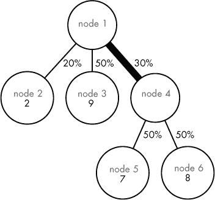
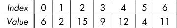
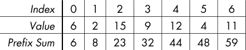

## 第七章：二分查找


本章的内容完全是关于二分查找的。如果你不知道二分查找是什么——太棒了！我很高兴有机会教你一种系统的、高效的技术，用来在成千上万的可能解中找到最佳解。如果你知道二分查找是什么，并且认为它只是用来搜索已排序的数组——也太棒了！你将会学到，二分查找不仅仅是为了这个。在本章中，我们将不会搜索已排序的数组，甚至一次也不做。

最小化喂养蚂蚁所需的液体量、最大化岩石之间最小跳跃距离、寻找城市中最佳的居住区域以及通过切换开关打开洞穴门，这些问题有什么共同点？让我们一探究竟。

### 问题 1：喂蚂蚁

这是 DMOJ 问题 `coci14c4p4`。

#### *问题*

Bobi 有一个形状像树的玻璃箱。树的每一条边都是一根管道，液体沿着这些管道流下。某些管道是超级管道，可以增加通过它们的液体量。Bobi 在树的每一片叶子上放置了一只他的宠物蚂蚁。（是的，这个背景设定有点牵强，我不会装作没有意识到，但这个问题本身是非常棒的。）

每根管道都有一个百分比值，表示通过它的液体占总液体的百分比。例如，假设某个节点 *n* 有三根向下的管道，这些管道的百分比值分别是 20%、50% 和 30%。如果 20 升液体到达节点 *n*，那么 20% 的管道会得到 20 × 0.2 = 4 升，50% 的管道会得到 20 × 0.5 = 10 升，30% 的管道会得到 20 × 0.3 = 6 升。

现在考虑超级管道。对于每个超级管道，Bobi 决定它的特殊行为是开启还是关闭。如果它关闭，那么它像普通管道一样工作。如果它开启，那么它会将接收到的液体量平方。

Bobi 将液体倒入树的根部。他的目标是给每只蚂蚁至少提供它所需的液体，并且尽可能少地倒入液体。

让我们通过研究一个样本玻璃箱来具体化这个描述；见 图 7-1。



*图 7-1：一个样本玻璃箱*

我已经将节点编号为 1 到 6；叶子节点（2、3、5 和 6）有一个额外的注释，标明了每只蚂蚁所需的液体量。我还在每条边上标注了它的百分比值。注意，从给定节点出发的向下管道的百分比值总和总是 100%。

树中有一条超级管道，从节点 1 到节点 4；我已用较粗的边表示这一管道。假设 20 升液体被倒入根节点。超级管道获得 20 升液体的 30%，即 6 升。如果超级管道的特殊行为关闭，那么 6 升液体会通过它。然而，如果超级管道的特殊行为开启，那么，6 升液体不会流过，而是 6² = 36 升液体流过。

##### 输入

输入包含一个测试用例，包含以下行：

+   一行包含 *n*，树中节点的数量。*n* 的值介于 1 到 1,000 之间。树的节点编号从 1 到 *n*，根节点是节点 1。

+   *n* – 1 行用于构建树。每一行表示一条管道，包含四个整数：连接该管道的两个节点，管道的百分比值（介于 1 和 100 之间），以及管道是否是超级管道（0 表示不是，1 表示是）。

+   一行包含 *n* 个整数，每个整数表示该节点上蚂蚁所需的液体升数。每只蚂蚁需要 1 到 10 升液体。对于任何非叶节点（即没有蚂蚁的节点），给定值为-1。

这里是一个可能生成图 7-1 中示例植物箱的输入：

```
6
1 2 20 0
1 3 50 0
1 4 30 1
4 5 50 0
4 6 50 0
-1 2 9 -1 7 8
```

请注意，第一行（此处为整数 6）表示树中节点的数量，而不是构建树的行数。构建树的行数（在本例中为五行）总是比节点数少一行。（为什么总是少一行？每一行构建树时，实际上告诉我们一个节点的父节点信息。除了根节点外，每个节点都有一个父节点，因此我们需要 *n* – 1 行来描述所有的 *n* – 1 个父节点。）

##### 输出

输出 Bobi 必须倒入树根的最少升数，以便喂养所有蚂蚁。输出结果保留四位小数。正确的输出保证不会超过 2,000,000,000（20 亿）。

解决测试用例的时间限制是 0.6 秒。

#### *一种新的树问题类型*

如同在第二章中一样，我们现在处于树的领域。如果我们想探索一个植物箱树，那么可以使用递归。（像广度优先搜索（BFS）这样的完整图搜索算法是多余的，因为没有循环。）

在第二章的两个问题中，我们的解决方案是基于树的结构和节点中存储的值：

+   在《万圣节糖果运输》中，我们通过将叶节点中的值相加来计算总糖果数，并通过树的高度和形状来计算总街道行走数。

+   在《后代距离》中，我们通过使用每个节点的子节点数量来计算所需距离的后代数。

也就是说，我们需要的——糖果的数量、身高、树的形状——这些信息就存在树结构里，编码在其中。在当前问题中，我们需要找到 Bobi 必须倒入的最小升数——但树中并没有类似的值！树中有管道的百分比、超级管道状态以及蚂蚁的食量信息，但没有直接告诉我们应该倒入多少液体。特别是，超级管道的液体平方行为使得蚂蚁所需液体量与应倒入的液体量之间的关系变得不清晰。

因为树不会直接给我们需要的值，我就随便挑一个数值——比如，10 升。好了，Bobi，把 10 升倒进去。

我希望你对我刚才做的事非常怀疑，随便选择一个数字。你应该会对 10 升是答案感到惊讶。毕竟，我是从空中凭空选择了 10 升。你可能还会惊讶于，事实上，我们通过尝试 10 升并观察结果，可以学到很多东西。

我们再用一下图 7-1。假设我们向根部倒入 10 升液体。10 升的 20%是 2 升，因此 2 升液体会到达节点 2 的蚂蚁。完美：那只蚂蚁需要 2 升液体，所以我们正好倒入了足够的液体。接下来继续。

由于 10 升的 50%是 5，节点 3 的蚂蚁得到 5 升液体。现在我们有麻烦了：那只蚂蚁需要 9 升液体，而 5 升显然不够。更糟糕的是：节点 1 和节点 3 之间的管道不是超级管道，所以我们无能为力，只能宣告 10 升不是解答。

我们可以通过随便挑选另一个升数来继续，类似地模拟那个新数字下的液体流动。然而，由于 10 升不足，现在我们应该将我们的“随便挑选”范围限制为仅*大于 10*的数值。因为 10 升不足，任何更小的数值也都不足。尝试 2 升、7 升、9.5 升或任何少于 10 升的数值都没有意义。它们都太少了。

接下来，我们试试 20 升。这次，节点 2 的蚂蚁得到 4 升，这完全没问题，因为那只蚂蚁只需要 2 升。节点 3 的蚂蚁得到 10 升，这也没问题，因为那只蚂蚁只需要 9 升。

节点 1 和节点 4 之间的管道吸收了总液体的 30%，也就是 20 升中的 6 升。然而，这条管道是超级管道！如果我们使用它的特殊行为，这 6 升液体会被管道提升至 6² = 36 升，因此 36 升液体到达节点 4。现在，节点 5 和节点 6 的蚂蚁没问题了：每只蚂蚁得到 18 升，而它们只需要 7 升（节点 5）和 8 升（节点 6）。

与 10 升不同，20 升是一个可行的解，但它是最优（即最小）解吗？也许是，也许不是。我们可以确定的是，测试任何大于 20 升的液体量没有意义。我们已经得到了 20 升作为一个可行的解；为什么要尝试更差的值，比如 25 或 30 呢？

我们现在将问题简化为在 10 到 20 升之间找到最优解。我们可以不断选择数字，在每一步缩小范围，直到范围足够小，以至于其中一个端点可以作为准确的解。

在一般情况下，我们应该先选择多少升液体？最优解可能高达 20 亿，因此从 10 开始可能会相差甚远。而且，一旦我们测试了一个液体数量，接下来应该选择多少呢？最优解可能比我们当前的猜测要大得多或小得多，所以每次增加或减少 10 可能无法帮助我们取得多大进展。

这些都是好问题，值得回答……但还不到时候。让我们首先处理如何读取输入（以便可以探索树结构），以及如何判断一个液体数量是否是可行的解决方案。然后，我们将看到一个超快的算法，用于搜索巨大的范围。20 亿的范围？我们吃得了这个早餐。

#### *读取输入*

在第二章中，我们使用了一个`node`结构体来表示树的核心结构。然后，在第五章《书籍翻译》中，我们使用了图的邻接表表示法，并使用了一个`edge`结构体。在那里，我们学到了使用`node`结构体还是`edge`结构体取决于是节点还是边缘承载额外的属性。在当前的问题中，边缘承载了信息（一个百分比和一个超管道状态），但叶节点也承载信息（每只蚂蚁所需的液体量）。因此，使用*两者*的`edge`结构体和`node`结构体既合理又具有吸引力。然而，为了更好地模拟邻接表的使用，我选择仅使用`edge`结构体。如同问题描述所说，我们从 1 开始对节点进行编号，但由于没有`node`结构体，我们没有地方存储每只蚂蚁所需的液体量。因此，我们通过一个`liquid_needed`数组来扩展邻接表，其中`liquid_needed[i]`给出了节点`i`中蚂蚁所需的液体量。

这是我们将在代码中使用的常量和`typedef`：

```
#define MAX_NODES 1000

typedef struct edge {
  int to_node, percentage, superpipe;
  struct edge *next;
} edge;
```

如同在《书籍翻译》（第五章）和第六章中的两个问题一样，我们可以通过`next`指针将这些`edge`结构体连接在一起，形成一个边的链表。如果一个边在节点`i`的链表中，那么我们就知道该边的父节点是`i`。`to_node`成员告诉我们该边与父节点连接的子节点；`percentage`是一个介于 1 到 100 之间的整数，表示该管道（边）的百分比值；`superpipe`是一个标志位，如果该管道是超级管道则其值为`1`，如果是普通管道则为`0`。

现在，我们可以从输入中读取树，如列表 7-1 所示。

```
int main(void) {
  static edge *adj_list[MAX_NODES + 1] = {NULL};
  static int liquid_needed[MAX_NODES + 1];
  int num_nodes, i;
  int from_node, to_node, percentage, superpipe;
  edge *e;
  scanf("%d", &num_nodes);

  for (i = 0; i < num_nodes - 1; i++) {
    scanf("%d%d%d%d", &from_node, &to_node, &percentage, &superpipe);
    e = malloc(sizeof(edge));
    if (e == NULL) {
      fprintf(stderr, "malloc error\n");
      exit(1);
    }
    e->to_node = to_node;
    e->percentage = percentage;
    e->superpipe = superpipe;
    e->next = adj_list[from_node];
  ➊ adj_list[from_node] = e;
  }

  for (i = 1; i <= num_nodes; i++)
  ➋ scanf("%d", &liquid_needed[i]);
  solve(adj_list, liquid_needed);
  return 0;
}
```

*列表 7-1：构建树的*主函数*

这段代码类似于列表 5-16（书籍翻译）中的代码，但更简洁。具体来说，每条边都是从输入中读取的，成员被设置好后，再将其添加到`from_node`的边列表中➊。你可能会期望会为`to_node`添加对应的边，因为图是无向的，但我省略了这些边：液体沿树向下流动，而不是向上流动，因此添加反向边会不必要地复杂化探索树的代码。

一旦读取了边的信息，剩下的就是读取每个蚂蚁所需的液体量。我们将使用`liquid_needed`数组来存储这些信息➋。`adj_list`和`liquid_needed`的组合包含了我们需要了解的测试用例的所有信息。

#### *测试可行性*

我们的下一个里程碑是：确定给定的液体量是否为可行解。这是一个关键步骤，因为一旦我们有了一个可以测试可行性的函数，我们就能够利用它逐步缩小搜索范围，直到找到最优解。以下是我们将要编写的函数签名：

```
int can_feed(int node, double liquid,
             edge *adj_list[], int liquid_needed[])
```

在这里，`node`是树的根节点，`liquid`是我们倒入树根的液体量，`adj_list`是树的邻接表，`liquid_needed`是每个蚂蚁所需的液体量。如果`liquid`足够喂养蚂蚁（即，`liquid`是可行的解决方案），我们将返回`1`，否则返回`0`。

我们在整个章节中（第二章）都在编写树的递归函数。让我们思考一下，是否还能再次使用递归。

记住，要使用递归，我们需要一个基准情况——一个可以不通过递归解决的情况。幸运的是，我们有一个！如果树只有一个叶子节点，我们就可以立即判断`liquid`是否足够。如果`liquid`大于或等于该叶子节点中蚂蚁所需的液体量，那么我们就有一个可行的解决方案；否则，我们就没有。

我们可以通过检查`liquid_needed`中的相应值来判断一个节点是否是叶子节点：如果值为`-1`，那么它不是叶子节点；否则，它就是叶子节点。（我们也可以使用邻接表来检查该节点的链表是否为空。）下面是我们得到的结果：

```
if (liquid_needed[node] != -1)
  return liquid >= liquid_needed[node];
```

现在，考虑递归情况。假设某棵树的根节点有*p*条向下的管道（即，*p*个子节点）。我们已经知道根节点输入的液体量。通过管道的百分比值，我们可以确定每条管道进入的液体量；通过超级管道的状态，我们可以确定到达每条管道底端的液体量。如果足够的液体到达每条管道的底端，那么根节点输入的液体量就是足够的，我们应该返回`1`。否则，某条管道到达底端的液体量不足，我们应该返回`0`。这表明我们应该进行*p*次递归调用，每次调用处理一条从根节点出发的管道。我们将在一个循环中使用邻接表遍历每一条管道。

函数的完整代码见清单 7-2。

```
int can_feed(int node, double liquid,
             edge *adj_list[], int liquid_needed[]) {
  edge *e;
  int ok;
  double down_pipe;
  if (liquid_needed[node] != -1)
 return liquid >= liquid_needed[node];
  e = adj_list[node];
➊ ok = 1;
  while (e && ok) {
    down_pipe = liquid * e->percentage / 100;
    if (e->superpipe)
   ➋ down_pipe = down_pipe * down_pipe;
    if (!can_feed(e->to_node, down_pipe, adj_list, liquid_needed))
   ➌ ok = 0;
    e = e->next;
 }
 return ok;
}
```

*清单 7-2：测试液体量的可行性*

`ok`变量用于跟踪`liquid`是否是树的可行解。如果`ok`为`1`，则解决方案仍然可行；如果`ok`为`0`，则肯定不可行。我们将`ok`初始化为`1` ➊，如果通过某条管道的液体量不足，我们就将其设为`0` ➌。如果函数执行到最后，`ok`仍然为`1`，说明所有管道的需求都得到了满足，我们可以得出`liquid`是可行的结论。

我们通过使用管道的百分比值来确定进入每条管道的液体量。如果该管道是超级管道，我们就对该值进行平方 ➋ ……等等，等一下！问题描述说，Bobi 可以决定是否使用每条超级管道的特殊行为。然而，在这里，我们只是毫不犹豫地对液体量进行平方，从而总是使用特殊行为。

我们之所以能够这样做，是因为平方会使数值变大：比较 2 和 2² = 4，3 和 3² = 9，依此类推。由于我们想知道给定的液体量是否可行，而且使用超级管道的特殊行为没有惩罚，因此我们可以尽可能地生成更多的液体。或许我们能不用某些超级管道的特殊行为，但并没有人要求我们节约。

不用担心平方会让小于 1 的正值（例如 0.5）变得更小。0.5² = 0.25，所以在这种情况下，我们确实不希望激活超级管道的行为。每只蚂蚁至少需要 1 升液体。然而，如果我们在某个节点上只剩下 0.5 升液体，那么无论我们做什么，都无法为该节点子树中的蚂蚁提供足够的液体。即使我们不平方该值，最终也会返回`0`。

让我们通过继续在第 233 页的《一种新的树问题》中的工作，展示`can_feed`函数有多么有用。我们在那里展示了 10 升对问题描述中的示例实例来说是不够的。将列表 7-1 底部的`solve`调用注释掉（别担心，我们很快会编写那个`solve`函数），然后添加一个`can_feed`的调用来测试 10 升的液体：

```
printf("%d\n", can_feed(1, 10, adj_list, liquid_needed));
```

你应该看到`0`的结果，这意味着 10 升不够。我们也展示了 20 升是足够的。将`can_feed`的调用修改为测试 20 升而不是 10 升：

```
printf("%d\n", can_feed(1, 20, adj_list, liquid_needed));
```

你应该看到`1`的结果，这意味着 20 升足够。

现在，我们知道 10 不够，但 20 够。让我们进一步缩小这个范围。试试 15，你应该看到`0`的输出。所以，似乎 15 还不够。我们的最优答案现在大于 15，最多为 20。

接下来试试 18：你应该看到 18 是足够的。那 17 呢？不，17 不够，17.5 和 17.9 也不行。事实证明，最优解确实是 18。

够了，不再进行这种临时搜索了。让我们将其系统化。

#### *寻找解决方案*

从问题描述中，我们知道最优解最多是 20 亿。因此，存在一个庞大的搜索空间，最优解就在其中。我们的目标是尽可能快地缩小这个空间，通过避免浪费任何一次猜测来实现。

很容易浪费一次猜测。例如，如果我们从 10 开始猜测，而最优解实际上是 20 亿，那么我们基本上浪费了那次猜测：我们做的只是排除了 0 到 10 之间的数字。确实，如果最优解是 8 的话，猜 10 会很棒，因为那一步可以将范围缩小到 0 到 10，我们很快就能找到 8。然而，像这样随意猜测并不值得，因为偶尔运气好一次也无法弥补我们猜测几乎没有用的高概率情况。正因为如此，当有人让你猜测 1 到 1000 之间的数字时，你不会选择从 10 开始猜。没错，如果他们说“更低”，你看起来像个明星，但如果他们说“更高”，也就是最有可能的情况，那你基本上就浪费了第一次猜测。

为了确保每次猜测都能获得尽可能多的信息，我们总是猜测范围的中间值。为此，我们维护两个变量，`low`和`high`，分别表示当前范围的低端和高端。然后，我们计算范围的中间值`mid`，测试`mid`的可行性，并根据我们的发现更新`low`或`high`。我们将在列表 7-3 中实现这一策略。

```
#define HIGHEST 2000000000

void solve(edge *adj_list[], int liquid_needed[]) {
  double low, high, mid;
  low = 0;
  high = HIGHEST;
➊ while (high - low > 0.00001) {
  ➋ mid = (low + high) / 2;
  ➌ if (can_feed(1, mid, adj_list, liquid_needed))
 high = mid;
    else
      low = mid;
   }
➍ printf("%.4lf\n", high);
}
```

*列表 7-3：寻找最优解*

初始化`low`和`high`很重要，这样它们的范围就能保证包含最优解。我们始终保持`low`小于或等于最优解，`high`大于或等于最优解。我们将`low`初始化为 0；因为每只蚂蚁至少需要 1 升，所以 0 升肯定小于或等于最优解。我们将`high`初始化为 20 亿，因为根据问题描述，20 亿是最优解的最大值。

`while`循环条件会在循环结束时迫使`low`和`high`之间的范围非常小 ➊。我们需要四位精度，因此在`0.00001`的小数点后有四个零。

循环体内的第一件事是计算范围的中间值。我们通过取`low`和`high`的平均值来实现这一点，将结果存储在`mid`中 ➋。

现在是时候测试`mid`升是否可行了，使用`can_feed` ➌。如果`mid`可行，我们已经知道猜测任何大于`mid`的值都是浪费时间。因此，我们将`high = mid`，将范围限制在最大值`mid`。

如果`mid`不可行，那么猜测任何比`mid`小的值都会浪费时间。因此，我们将`low = mid`，将范围限制在最小值`mid`。

一旦循环终止，`low`和`high`会非常接近。我们打印`high` ➍，但打印`low`同样有效。

这种技巧，我们通过不断将范围一分为二，直到它非常小，被称为*二分查找*。它是一个出奇精巧且强大的算法，剩下的本章问题将进一步证明这一点。它也非常快速，能够轻松处理数十亿或数万亿的范围。

提交解决方案给评测系统，然后我们继续。关于二分查找，还有很多要学的东西。

### 二分查找

"喂养蚂蚁"是二分查找得以发挥优势的典型问题。这类问题有两个关键要素；如果你在面对的新问题中看到了这些要素，那么尝试二分查找是值得的。

**要素 1：硬性最优性与容易可行性**   对于一些问题，找到最优解很困难。幸运的是，在许多这种情况下，确定某个提议的解决方案是否可行要容易得多。这就是“喂养蚂蚁”问题的情况：我们不知道如何直接找到最优解，但我们知道如何判断某个升数是否可行。

**要素 2：不可行–可行分割** 我们需要问题展现出一个特性，即在不可行解和可行解之间有一个边界。所有位于边界一侧的解都必须是不可行的，而另一侧的所有解都必须是可行的。在“喂养蚂蚁”问题中，小值是不可行的，大值是可行的。可以想象从小到大的值，并询问每个值是不可行的还是可行的。在这样做的过程中，我们会先看到一堆不可行的值，然后看到一个可行的值；在我们找到第一个可行值后，就再也看不到不可行值了。假设我们尝试了一个 20 升的值，并发现它是不可行的。这意味着我们仍然处于不可行的搜索空间中，必须继续搜索更大的值。如果 20 升是可行的，那么我们就进入了可行的搜索空间，应该搜索更小的值。（如果不满足要素 2，二分查找就失去了作用。例如，假设我们有一个问题，小值不可行，大值可行，而更大的值又不可行。我们尝试了一个 20 的值并发现它不可行。别想再关注 20 以后的值：因为我们无法知道 10 以下的值是否不可行，10 到 15 之间的值是否可行，最终最优解可能是 10。）如果搜索空间从可行变为不可行，而不是从不可行变为可行，也是可以的。我们的下一个问题将提供这样的例子。

#### *二分查找的运行时间*

二分查找如此强大的原因在于它只需一次迭代就能取得巨大的进展。例如，假设我们在一个二十亿的范围内搜索最优解。二分查找的单次迭代就能丢弃掉一半的范围，剩下只有十亿的范围。想象一下：仅仅通过一个`if`语句和一次对`mid`变量的更新，我们就取得了十亿的进展！如果二分查找需要*q*次迭代来搜索一个十亿的范围，那么只需要再加一次迭代，*q* + 1，就能搜索一个二十亿的范围。与范围宽度相比，迭代次数增长得非常缓慢。

二分查找将一个范围*n*缩小到 1 所需的迭代次数大致是将*n*除以 2 直到得到 1 所需要的次数。例如，假设我们从 8 开始一个范围。经过一次迭代，范围会缩小到最多 4。经过两次迭代，范围会缩小到最多 2。经过三次迭代，范围会缩小到 1。此外，如果我们不关心精度的小数位，那么就到此为止：三次迭代。

有一个数学函数叫做*二进制对数*，给定值*n*，它告诉你需要将*n*除以 2 多少次才能得到 1 或更小的值。它写作 log[2] *n*，或者当讨论明确表明底数为 2 时，简写为 log *n*。例如，log[2] 8 是 3，log[2] 16 是 4。log[2] 2,000,000,000（即 20 亿）是 30.9，因此大约需要 31 次迭代才能将这个范围缩小到 1。

二分查找是一个*对数时间*算法的例子。因此我们说它是*O*(log *m*)。 （通常你会在这里使用*n*而不是*m*，但在本节后面我们将使用*n*表示其他含义。）要将范围减少到 1，*m*是范围的初始宽度。然而，在“喂蚁”问题中，我们需要进一步处理，获取四位小数的精度。那么，*m*在这里代表什么呢？

现在是时候公开我们在“喂蚁”问题中如何使用二分查找了：我们做的不仅仅是 log[2] 2,000,000,000 次二分查找迭代，因为我们不会在范围宽度为 1 时停止。而是，一旦我们在小数点后获得四位精度时就停止。加上五个零，我们就得到了我们所做的迭代次数：log[2] 200,000,000,000,000 向上取整为 48 次。仅需 48 次迭代，就能从一个困惑的万亿范围中得出四位小数精度的解。这就是二分查找的魅力所在。

在一个*n*节点的树上，`can_feed`函数（见清单 7-2，“喂蚁”问题）需要线性时间；即，时间与*n*成正比。我们称该函数为 log[2] *m* × 10⁴次，其中*m*是范围的宽度（在测试用例中为 20 亿）。这与 log *m*的工作量成正比。因此，总体来说，我们需要进行*n*次工作，总共需要 log *m*次。这是一个*O*(*n* log *m*)算法。它不是完全线性的，因为有额外的 log *m*因素，但仍然非常快速。

#### *确定可行性*

我最喜欢二分查找算法的一点是，判断一个值是否可行通常需要使用其他类型的算法。也就是说，外部我们使用二分查找，但在内部——为了测试每个值是否可行——我们使用其他算法。这个“其他算法”可以是任何东西。在“喂蚁”问题中，它是树搜索。在我们下一个问题中，它将是贪心算法。在我们的第三个问题中，它将是动态规划算法。在本书中我们不会看到这一点，但确实有一些问题需要运行图算法来检查可行性。你在前几章学到的那些内容都会再次派上用场。

确定可行性通常需要相当的创造力（只是希望不需要像寻找最优解那样多的创造力！）。

#### *搜索已排序数组*

如果你在读这一章之前已经熟悉二分查找，那么大概率是在查找已排序数组的上下文中。一个典型的场景是，给定一个数组 `a` 和一个值 `v`，我们想要找到 `a` 中第一个大于或等于 `v` 的最小索引。例如，如果我们给定数组 `{-5, -1, 15, 31, 78}` 和 `v` 为 26，我们会返回索引 `3`，因为索引 `3` 处的值（31）是第一个大于或等于 26 的值。

为什么二分查找在这里有效？看一下这两个关键要素：

**关键要素 1**   如果没有二分查找，找到最优值需要在数组中进行耗时的扫描。因此，获得最优解很困难，但判断可行性却很容易：如果我给你一个索引 `i`，你可以通过比较 `a[i]` 和 `v`，立即告诉我 `a[i]` 是否大于或等于 `v`。

**关键要素 2**   任何小于 `v` 的值都会出现在大于或等于 `v` 的值之前——记住，`a` 是已排序的！也就是说，不可行的值出现在可行值之前。

确实，二分查找可以用来在对数时间内找到数组中的合适索引；稍后在第十章中，我们将用它来解决这个问题。但我们在用二分查找解决“喂养蚂蚁”问题时，并没有看到数组的存在。不要仅仅在有数组需要查找时才考虑二分查找。二分查找比这更加灵活。

### 问题 2：河流跳跃

接下来我们将看到一个问题，需要使用贪心算法来判断可行性。

这是 POJ 问题 `3258`。

#### *问题*

河流的长度为 *L*，沿途放置了若干石头。河流的起点位置是 0（起点石头），终点位置是 *L*（终点石头），还有 *n* 块石头在这两者之间。例如，在一条长度为 12 的河流上，我们可能会在以下位置放置石头：0，5，8，12。

一头牛从第一块石头（位置 0）开始，从那里跳到第二块石头，再从第二块跳到第三块石头，依此类推，直到跳到河流尽头的石头（位置 *L*）。它的最小跳跃距离是任何相邻两块石头之间的最小距离。在上述例子中，最小跳跃距离是 3，体现了位置 5 和位置 8 之间的距离。

农场主约翰对牛的短跳跃感到厌烦，因此他想尽可能增加最小跳跃距离。他不能移除位置 0 或位置 *L* 的石头，但他可以移除 *m* 块其他的石头。

在上述例子中，假设农场主约翰能够移除一块石头。他的选择是移除位置 5 或位置 8 的石头。如果他移除位置 5 的石头，最小跳跃距离将是 4（从位置 8 到位置 12）。然而，他不应该这样做，因为如果他移除位置 8 的石头，那么最小跳跃距离将变为 5（从位置 0 到位置 5），这样更好。

我们的任务是通过移除 *m* 块岩石，最大化农民约翰可以达到的最小跳跃距离。

##### 输入

输入包含一个测试用例，包含以下几行：

+   一行包含三个整数 *L*（河流的长度），*n*（岩石的数量，不包括起始和结束位置的岩石），以及 *m*（农民约翰可以移除的岩石数量）。*L* 的值在 1 到 1,000,000,000（一十亿）之间，*n* 的值在 0 到 50,000 之间，*m* 的值在 0 到 *n* 之间。

+   *n* 行，每行给出一个岩石的位置（整数）。没有两个岩石会处于同一位置。

##### 输出

输出最大可实现的最小跳跃距离。对于上面的例子，我们将输出`5`。

解决该测试用例的时间限制是两秒钟。

#### *贪心思想*

在第三章中，解决 Moneygrubbers 问题时，我们介绍了贪心算法的思想。贪心算法做出当前看起来最有希望的选择，而不考虑其选择的长期后果。这样的算法往往很容易提出：只需要说明它用来做出下一个选择的贪心规则。例如，在解决 Moneygrubbers 问题时，我提出了一个贪心算法，选择每个苹果成本最低的选项。那个贪心算法是错误的。这个教训值得记住：虽然提出一个贪心算法很容易，但找到一个正确的贪心算法并不容易。

我没有为贪心算法单独写一章，原因有两个。首先，它们不像其他算法设计方法（例如动态规划）那样广泛适用。其次，当它们确实有效时，往往是由于一些微妙的、特定问题的原因。多年来，我曾多次被看似正确但最终是有缺陷的贪心算法欺骗。通常需要仔细的正确性证明，才能区分哪些是正确的，哪些只是看起来对。

然而，贪心算法确实在第六章中以隐蔽的方式出现了——这一次是正确的，形式上是 Dijkstra 算法。算法学家通常将 Dijkstra 算法归类为贪心算法。一旦算法宣告一个节点的最短路径已找到，它就永远不会回到这个决定上。它一旦做出决定，就不允许未来的发现影响过去的决策。

贪心算法将重新出现。几年前，当我第一次接触到河流跳跃问题时，我的直觉是我可以使用贪心算法来解决它。我想知道你是否会觉得提出的算法像我一样自然。这里是贪心规则：找到两块最接近的岩石，移除离其邻近岩石最近的那块，并重复这一过程。

让我们回到问题描述中的例子。这里它作为一个测试用例：

```
12 2 1
5
8
```

为了方便，这里是岩石的位置：0、5、8 和 12。我们允许移除一块岩石。最接近的两块岩石分别位于位置 5 和 8，因此贪心规则将移除其中一块。位置 8 的岩石与右侧邻居的距离为 4；位置 5 的岩石与左侧邻居的距离为 5。因此，贪心算法会移除位置 8 的岩石。在这个例子中，它是正确的。

让我们增加一个更大的例子，看看贪心算法会怎么做。假设河流的长度为 12，允许移除两块岩石。这里是测试案例：

```
12 4 2
1
3
8
9
```

岩石的位置是 0、1、3、8、9 和 12。贪心算法会怎么做？最接近的岩石分别位于位置 0 和 1，以及位置 8 和 9。我们必须选择一对——我们选择 0 和 1。由于不允许移除位置 0 的岩石，我们移除位置 1 的岩石。剩下的岩石位置是 0、3、8、9 和 12。

现在，最接近的岩石位于位置 8 和 9。位置 9 和 12 之间的距离小于位置 8 和 3 之间的距离，因此贪心算法会移除位置 9 的岩石。剩下的岩石位置是 0、3、8 和 12。这里的最小跳跃距离，以及正确答案，是 3。贪心算法再次胜利。

不是吗？不断移除两块岩石之间最小的距离。我们怎么可能做得比这个更好呢？贪心算法令人着迷。

可惜的是，贪心算法并不正确。我鼓励你在我在下一段揭示答案之前，尝试找出一个反例。

这里是一个反例：

```
12 4 2
2
4
5
8
```

我们允许移除两块岩石。岩石的位置是 0、2、4、5、8 和 12。贪心规则识别位置 4 和 5 的岩石为最接近的岩石。由于位置 4 和 2 之间的距离小于位置 5 和 8 之间的距离，它会移除位置 4 的岩石。剩下的岩石位置是 0、2、5、8 和 12。

现在，贪心规则识别位置 0 和 2 的岩石为最接近的一对。由于不允许移除位置 0 的岩石，它移除位置 2 的岩石。剩下的岩石位置是 0、5、8 和 12。这里的最小跳跃距离是 3。贪心算法犯了一个错误，因为最大可实现的最小跳跃距离是 4。为了证明这一点，不要移除位置 2 和 4 的岩石，而是移除位置 2 和 5 的岩石。那样我们剩下的位置是 0、4、8 和 12。

问题出在哪儿？通过将位置 4 的岩石作为第一步移除，贪心算法创建了一个涉及跳跃距离 2 和跳跃距离 3 的情况。它只能用第二步修正其中一个，所以它无法产生一个大于 3 的最小跳跃距离。

我不知道有哪种贪心算法能直接解决这个问题。像“喂蚁”问题一样，这是一个不容易正面解决的难题。幸运的是，我们不必直接解决它。

#### *测试可行性*

在第 240 页的“二分查找”中，我提到过两个信号，指向二分查找的解决方案：测试可行性比求解最优解更容易，并且搜索空间从不可行到可行（或从可行到不可行）。我们将看到，河流跳跃问题在这两方面都符合。

不直接求解最优解，而是先解决另一个问题：是否可以实现至少*d*的最小跳跃距离？如果我们能解决这个问题，那么就可以使用二分查找找到*d*的最大可行值。

这是结束上一小节的测试用例：

```
12 4 2
2
4
5
8
```

我们可以移除两块岩石。岩石的位置分别是 0、2、4、5、8 和 12。

这里有一个问题：为了实现至少 6 的最小跳跃距离，最少需要移除多少块岩石？我们从左到右检查。位置 0 的岩石必须保留——这一点在问题描述中已明确指出。接下来，很明显我们无法选择如何处理位置 2 的岩石：我们必须移除它。如果不移除，它将导致位置 0 和位置 2 之间的距离小于 6。因此，我们移除了一块岩石。剩下的岩石是 0、4、5、8 和 12。

现在，考虑位置 4 的岩石——我们是保留它还是移除它？我们再次被迫移除它。如果我们保留它，那么位置 0 和位置 4 之间的距离将小于 6。这是我们的第二次移除，剩下的岩石是 0、5、8 和 12。

位置 5 的岩石也必须移除，因为它距离位置 0 的岩石只有 5 的距离。这是我们的第三次移除，剩下的岩石是 0、8 和 12。

位置 8 的岩石也必须移除！它距离位置 0 足够远，但离位置 12 太近。这是我们的第四次移除，最终只剩下 0 和 12 两块岩石。

所以需要四次移除才能实现至少 6 的最小跳跃距离，但我们只能移除两块岩石。因此，6 不是一个可行的解决方案。它太大了。

3 是一个可行的解决方案吗？也就是说，通过移除两块岩石，能实现至少 3 的最小跳跃距离吗？我们来看看。

位置 0 的岩石保留。位置 2 的岩石必须移除。这是我们的第一次移除，剩下的岩石是 0、4、5、8 和 12。

位于位置 4 的岩石可以保留：它距离位置 0 的距离大于 3。但是，位置 5 的岩石必须移除，因为它离位置 4 的岩石太近。这是我们的第二次移除，剩下的岩石是：0、4、8 和 12。

位置 8 的岩石没有问题：它与位置 4 和位置 12 的距离足够远。我们完成了：我们只需移除两块岩石，就能实现至少 3 的最小跳跃距离。所以，3 是可行的。

我们似乎正在朝着一个检查可行性的贪心算法靠近。规则是这样的：按顺序考虑每块岩石，如果它离之前保留的岩石太近，就移除它。同时检查我们保留的最右边的岩石，如果它离河流的尽头太近，就移除它。然后，计算我们移除的岩石数量；这个数量告诉我们，在允许移除的岩石数量下，所提议的最小跳跃距离是否可行。（需要明确的是，这是一个检查指定跳跃距离可行性的贪心算法提议，而不是一次性找到最优解的算法。）

这个算法的代码在清单 7-4 中。

```
int can_make_min_distance(int distance, int rocks[], int num_rocks,
                          int num_remove, int length) {
  int i;
  int removed = 0, prev_rock_location = 0, cur_rock_location;
  if (length < distance)
    return 0;
  for (i = 0; i < num_rocks; i++) {
    cur_rock_location = rocks[i];
 ➊ if (cur_rock_location - prev_rock_location < distance)
      removed++;
    else
      prev_rock_location = cur_rock_location;
  }
➋ if (length - prev_rock_location < distance)
     removed++;
 return removed <= num_remove;
}
```

*清单 7-4：测试跳跃距离的可行性*

该函数有五个参数：

distance   我们正在测试可行性的最小跳跃距离

rocks   一个数组，给出每块岩石的位置，河流的起始和结束岩石不包括在内

num_rocks   `rocks`数组中岩石的数量

num_remove   我们允许移除的岩石数量

length   河流的长度

如果`distance`是一个可行的解，函数返回`1`（真），否则返回`0`。

变量`prev_rock_location`跟踪我们保留的最新岩石的位置。在`for`循环内部，`cur_rock_location`保存我们当前考虑的岩石的位置。接下来我们进行关键的测试，决定是否保留或移除当前岩石 ➊。如果当前岩石离前一个岩石太近，那么我们移除当前岩石，并将移除次数加一。否则，我们保留当前岩石，并相应地更新`prev_rock_location`。

当循环终止时，我们已经计算出必须移除的岩石数量。好吧……差不多。我们还需要检查我们保留的最右边的岩石是否离河流的尽头太近 ➋。如果太近，我们就移除那块岩石。（不用担心移除位置 0 处的岩石。如果我们真的已经移除所有岩石，那么`prev_rock_location`会是 0。但是，`length - 0 < distance`不可能为真；如果是这样，程序在函数开头的`if`语句就会提前返回。）

现在我们确保了没有岩石彼此之间的最小跳跃距离过近，且没有不必要地移除岩石。我们怎么可能做得比这更好呢？贪心算法的魅力……不过，我们又来了。上次发生这种情况时，在第 244 页的《贪心思路》一节中，贪心算法结果是错误的。不要被几个巧合成功的例子说服。不要让我用甜言蜜语让你相信一切都好。

在继续之前，我想给出一个相当精确的论证，说明为什么这个贪心算法是正确的。具体来说，我将展示它移除了为实现至少*d*的最小跳跃距离所需的最少岩石数量。我将假设*d*最大为河流的长度；否则，贪心算法会立即并正确地判断实现至少*d*的最小跳跃距离是不可行的

对于从左到右的每块岩石，我们的贪心算法决定是保留岩石还是移除它。我们的目标是展示它与最优解的每一步操作一致。当贪心算法决定保留一块岩石时，我们将展示最优解也保留那块岩石。当贪心算法决定移除一块岩石时，我们将展示最优解也移除那块岩石。如果贪心算法做的与最优解完全相同，那么它得到的结果一定是正确的。在这个例子中，“最优解”将用来指代最优解。对于每块岩石，我们有四种可能性：贪心算法和最优解都移除岩石，贪心算法和最优解都保留岩石，贪心算法移除它但最优解保留它，贪心算法保留它但最优解移除它。我们必须证明第三种和第四种情况不可能发生。

在我们继续讨论四种情况之前，再次考虑从这些岩石位置移除两块岩石：0, 2, 4, 5, 8, 和 12。当问是否有可能实现至少 3 的最小跳跃距离时，我们已经看到贪心算法会移除位置 2 和 5 的岩石，剩下的位置是 0, 4, 8, 和 12。所以我们可能会预期最优解也会移除这两块岩石。尽管这是最优解，另一种最优解是移除位置 2 和 4 的岩石，剩下的位置是 0, 5, 8, 和 12。这是另一种通过移除两块岩石来实现至少 3 的最小距离的方法，并且它和贪心算法产生的结果一样好。与其匹配*那个*最优解，我们同样高兴地匹配*一个*最优解。我们不关心贪心算法匹配哪个最优解：所有最优解都是等价的最优解。

我们有一个我们希望贪心算法匹配的最优解*S*。贪心算法开始运行，一段时间内没有出现差异：它做的和*S*做的一样。贪心算法至少在位置 0 的岩石上做了正确的事：那块岩石无论如何都必须保留。

因此，贪心算法从左到右查看岩石，做正确的事情，保留岩石和移除岩石，就像最优解*S*一样……然后，哗啦，贪心算法和*S*在处理某些岩石时产生了分歧。我们考虑一下贪心算法和*S*产生分歧的*第一*块岩石。

**贪心算法移除它，但最优解保留它。**

贪心算法只会在石头距离另一块石头太近时才移除它。如果贪心算法移除了一块石头，因为它离左边的石头小于*d*，那么*S*也一定移除了那块石头。因为这是第一次不一致，*S*包含了和贪心算法相同的左侧石头。所以如果*S*没有移除这块石头，那它就会有两块石头的距离小于*d*。然而，这是不可能的：*S*是一个最优（并且必然可行的）解，其中所有石头之间的距离至少为*d*。因此，我们可以得出结论，*S*确实移除了那块石头，和贪心算法一致。类似的推理表明，如果贪心算法移除一块石头，因为它离河流的尽头太近，那么*S*也一定会移除它。

**贪心算法保留它，但最优算法移除它。**

我们不能让贪心算法和*S*在这里匹配，但没关系，因为我们可以形成一个新的最优解*U*，它保留了这块石头。设*r*为当前的石头；贪心算法保留的，而*S*移除的。考虑一个新的石头集合*T*，它包含了和*S*完全相同的石头，外加石头*r*。因此，*T*比*S*少移除了一块石头。正因为如此，*T*不可能是一个可行解。如果是的话，那它就比*S*（多了一块石头）更好，这与*S*是最优解的事实相矛盾。由于*S*和*T*之间唯一的不同是*T*有石头*r*，所以一定是*r*导致了*T*不可行。因此，在*T*中，*r*必须比石头*r*[2]更接近右边的石头*r*[2]。我们知道，*r*[2]不可能是河流的尽头的石头，因为那样贪心算法就不会保留*r*（因为*r*会离河流尽头太近）。因此，*r*[2]是允许被移除的某个石头。

现在，考虑另一个新的石头集合*U*，它和*T*完全相同，只是它没有石头*r*[2]。我们可以说，*U*和*S*包含相同数量的石头：我们从*S*中加入了一块石头*r*，得到*T*，然后从*T*中移除了一块石头*r*[2]，得到*U*。此外，*U*没有任何距离小于*d*的石头，因为它不包含那块问题石头*r*[2]。也就是说，*U*是一个最优解，就像*S*一样。关键是，*U*包含石头*r*！因此，贪心算法同最优解*U*一致，保留了*r*。

在继续之前，让我们先测试一下可行性测试器。这是如何在我们整个章节中使用的示例上调用它的方法：

```
int main(void) {
  int rocks[4] = {2, 4, 5, 8};
  printf("%d\n", can_make_min_distance(6, rocks, 4, 2, 12));
  return 0;
}
```

上面的代码问是否可能通过移除两块石头来达到至少 6 的最小跳跃距离。答案是“不行”，所以输出应该是`0`（假）。将第一个参数从`6`改为`3`，现在你在问是否能够实现至少 3 的最小跳跃距离。再次运行程序，输出应该是`1`（真）。

很好：现在我们有了一种检查可行性的方法。是时候使用二分查找来为我们提供最优解了。

#### *寻找解法*

为了使用二分查找，让我们改编示例 7-3 中的代码。在“喂蚁”问题中，我们需要在小数点后达到四位精度。然而在这里，我们希望优化最小跳跃距离，而这一定是一个整数值，因为所有岩石的位置都是整数。所以，我们将在`high`和`low`之间的差值为 1 时停止，而不是达到四个小数位的精度。示例 7-5 给出了新的代码。

```
// bugged!
void solve(int rocks[], int num_rocks,
           int num_remove, int length) {
  int low, high, mid;
  low = 0;
  high = length;
  while (high - low > 1) {
    mid = (low + high) / 2;
 ➊ if (can_make_min_distance(mid, rocks, num_rocks, num_remove, length))
   ➋ low = mid;
 else
   ➌ high = mid;
  }
  printf("%d\n", high);
}
```

*示例 7-5：搜索最优解（有错误！）*

在每次迭代中，我们计算范围的中点`mid`，并使用我们的辅助函数测试它的可行性 ➊。

如果`mid`是可行的，那么所有小于`mid`的值也是可行的，因此我们更新`low`，以切掉范围的下半部分 ➋。注意与示例 7-3 的对比：在那里，一个可行的`mid`意味着所有大于`mid`的值都是可行的，所以我们切掉的是范围的上半部分。

如果`mid`是不可行的，那么所有大于`mid`的值也都是不可行的，因此我们更新`high`，以切掉范围的上半部分 ➌。

不幸的是，这个二分查找并不正确。要了解原因，可以在这个测试用例上运行它：

```
12 4 2
2
4
5
8
```

你应该得到一个`5`的输出，但最优解实际上是`4`。

啊，我知道该怎么做了。让我们将底部的`printf`调用修改为输出`low`而不是`high`。当循环终止时，`low`将比`high`小 1，因此这一更改将导致输出`4`而不是`5`。新的代码见示例 7-6。

```
// bugged!
void solve(int rocks[], int num_rocks,
           int num_remove, int length) {
  int low, high, mid;
  low = 0;
  high = length;
  while (high - low > 1) {
    mid = (low + high) / 2;
    if (can_make_min_distance(mid, rocks, num_rocks, num_remove, length))
      low = mid;
    else
      high = mid;
  }
  printf("%d\n", low);
}
```

*示例 7-6：搜索最优解（仍有错误！）*

这解决了有问题的测试用例，但现在我们会错过这个测试用例：

```
12 0 0
```

这是一个完全有效的测试用例，虽然有点奇怪：河流的长度是 12，而且没有岩石。最大可达到的最小跳跃距离是 12，但我们的二分查找在这个示例中返回了`11`。再次地，我们差了一。

二分查找被认为是极难正确实现的。那里的`>`应该改成`>=`吗？应该是`mid`还是`mid + 1`？我们想要的是`low + high`还是`low + high + 1`？如果你继续研究二分查找问题，你最终会遇到这些问题。我不知道还有哪个算法的错误密度像二分查找这么高。

让我们在下一次尝试时小心一些。假设我们始终知道`low`及所有小于`low`的值是可行的，而`high`及所有大于`high`的值是不可行的。这样的声明叫做*不变式*，它意味着在代码运行时始终为真。

当循环终止时，`low`将比`high`小 1。如果我们成功地保持了不变式，那么我们知道`low`是可行的。我们还知道，`low`之后的任何值都不可能是可行的：接下来是`high`，而不变式告诉我们`high`是不可行的。所以`low`将是最大可行值，我们需要输出`low`。

然而，在这一切中，我们假设我们可以在代码开始时使不变式成立，并且之后始终保持它成立。

让我们从循环之前的代码开始。这段代码*并不*一定能使不变式成立：

```
low = 0;
high = length;
```

`low`是可行的吗？当然可以！至少为 0 的最小跳跃距离总是可以实现的，因为每次跳跃都有非零的距离。`high`是不可行的吗？嗯，可能是的，但如果我们在移除允许的岩石数量后能跳过整个河流呢？那么`length`就是可行的，我们的不变式被打破了。这里是一个更好的初始化方法：

```
low = 0;
high = length + 1;
```

现在`high`显然是不可行的：当河流的长度为`length`时，我们无法实现最小跳跃距离为`length + 1`。

接下来我们需要解决循环中的两种可能性。如果`mid`是可行的，那么我们可以设置`low = mid`。不变式是成立的，因为`low`及其左侧的所有值都是可行的；如果`mid`不可行，那么我们可以设置`high = mid`。不变式仍然成立，因为`high`及其右侧的所有值都是不可行的。因此，在这两种情况下，我们都保持不变式。

我们现在可以看到，代码中没有任何东西使不变式失效，因此当循环结束时，我们可以安全地输出`low`。正确的代码见清单 7-7。

```
void solve(int rocks[], int num_rocks,
           int num_remove, int length) {
  int low, high, mid;
  low = 0;
  high = length + 1;
  while (high - low > 1) {
    mid = (low + high) / 2;
    if (can_make_min_distance(mid, rocks, num_rocks, num_remove, length))
      low = mid;
    else
      high = mid;
  }
  printf("%d\n", low);
}
```

*清单 7-7：搜索最优解*

对于长度为*L*的河流，我们总共调用`can_make_min_distance`大约 log *L*次。如果我们有*n*个岩石，那么`can_make_min_distance`（见清单 7-4）的时间复杂度是*O*(*n*)。因此，解决这个问题的算法时间复杂度是*O*(*n* log *L*)。

#### *读取输入*

我们快到了。剩下的就是读取输入并调用`solve`。代码见清单 7-8。

```
#define MAX_ROCKS 50000

int compare(const void *v1, const void *v2) {
  int num1 = *(const int *)v1;
  int num2 = *(const int *)v2;
  return num1 - num2;
}

int main(void) {
  static int rocks[MAX_ROCKS];
  int length, num_rocks, num_remove, i;
  scanf("%d%d%d", &length, &num_rocks, &num_remove);
  for (i = 0; i < num_rocks; i++)
    scanf("%d", &rocks[i]);
➊ qsort(rocks, num_rocks, sizeof(int), compare);
  solve(rocks, num_rocks, num_remove, length);
 return 0;
}
```

*清单 7-8：读取输入的主函数*

我们一直通过从左到右思考岩石的位置来分析这个问题，即从最小位置到最大位置。然而，岩石的输入顺序是任意的。问题描述中没有任何保证岩石会按顺序排列。

过去一段时间了，但我们在第二章解决后代距离问题时确实使用了`qsort`对节点进行排序。排序岩石比排序那些节点要容易一些。我们的比较函数`compare`接受两个整数指针，并返回第二个减去第一个的结果。如果第一个整数小于第二个，它返回负整数；如果两个整数相等，则返回`0`；如果第一个整数大于第二个，它返回正整数。我们使用这个比较函数和`qsort`对岩石进行排序 ➊。然后我们用排序后的岩石数组调用`solve`。

如果你将这个解决方案提交给判题系统，你应该能看到所有测试用例都通过了。

### 问题 3：生活质量

到目前为止，在本章中我们已经看到了两种检查可行性的方法：树的递归遍历和贪心算法。现在，我们将看到一个例子，其中我们将使用动态编程（第三章）中的思想来高效地检查可行性。

这是本书中的第一个问题，我们不需要从标准输入读取数据，也不需要写入标准输出。我们将编写一个函数，函数名由裁判指定。我们将使用裁判传递的数组代替标准输入，使用函数返回的正确值代替标准输出。这样做非常好：我们根本不需要麻烦 `scanf` 和 `printf`！

顺便提一下，这也是我们在世界冠军编程竞赛（IOI 2010）中的第一个问题。你一定能搞定！

这是 DMOJ 问题 `ioi10p3`。

#### *问题描述*

城市由一个矩形网格的块组成。每个块由它的行和列坐标标识。城市有 *r* 行，从上到下编号为 0 到 *r* – 1，并且有 *c* 列，从左到右编号为 0 到 *c* – 1。

每个块都有一个唯一的*质量排名*，其值在 1 到 *rc* 之间。例如，如果我们有七行七列，那么每个块的排名将是从 1 到 49 的某种排列。请参见表 7-1 中的城市示例。

**表 7-1:** 一个示例城市

|   | **0** | **1** | **2** | **3** | **4** | **5** | **6** |
| --- | --- | --- | --- | --- | --- | --- | --- |
| **0** | 48 | 16 | 15 | 45 | 40 | 28 | 8 |
| **1** | 20 | 11 | 36 | 19 | 24 | 6 | 33 |
| **2** | 22 | 39 | 30 | 7 | 9 | 1 | 18 |
| **3** | 14 | 35 | 2 | 13 | 31 | 12 | 46 |
| **4** | 32 | 37 | 21 | 3 | 41 | 23 | 29 |
| **5** | 42 | 49 | 38 | 10 | 17 | 47 | 5 |
| **6** | 43 | 4 | 34 | 25 | 26 | 27 | 44 |

矩形的*中位数质量排名*是指该矩形中一半质量排名小于它，另一半质量排名大于它。例如，考虑表 7-1 左上角的五行三列（5×3）矩形。它由 15 个质量排名组成：48、16、15、20、11、36、22、39、30、14、35、2、32、37 和 21。中位数质量排名是 22，因为有七个数字小于 22，另外七个大于 22。

我们将得到整数 *h* 和 *w*，它们分别指定候选矩形的高度（行数）和宽度（列数）。我们的任务是确定任意一个 *h* 行 *w* 列矩形的最小中位数质量排名。（在这个问题中，低质量排名对应于高质量；因此，找到最小的中位数质量排名实际上对应于找到一个高质量的城市生活区。）

我们用 (*x*, *y*) 来表示第 *x* 行，第 *y* 列。假设 *h* 为 5，*w* 为 3。那么，对于表 7-1 中的城市，我们会将 13 作为最小的中位数质量排名。中位数质量排名为 13 的矩形的左上坐标是 (1, 3)，右下坐标是 (5, 5)。

##### 输入

标准输入中没有任何需要读取的内容。我们所需的所有信息都将通过函数参数从评测系统传入。以下是我们将要编写的函数签名：

```
int rectangle(int r, int c, int h, int w, int q[3001][3001])
```

这里，`r` 和 `c` 分别是城市的行数和列数。同样，`h` 和 `w` 分别是候选矩形的行数和列数；`h` 最多为 `r`，`w` 最多为 `c`。并且保证 `h` 和 `w` 都是奇数。（为什么是奇数呢？因为两个奇数相乘结果是奇数，所以候选矩形的块数 *hw* 将是奇数。在这种情况下，中位数是精确定义的：质量等级的中位数，即剩余质量等级中有一半小于它，另一半大于它。如果我们有一个偶数个质量等级，比如 2、6、4 和 5，这时的中位数会是什么？我们将不得不在 4 和 5 之间做出选择。好在问题作者为我们省去了这个选择。）

最后的参数 `q` 给出了块的质量等级。例如，`q[2][3]` 给出了第 2 行第 3 列块的质量等级。注意 `q` 上的维度告诉我们城市中的最大行数和列数：每个方向都是 3,001。

##### 输出

我们不会在标准输出上生成任何内容。相反，在刚才描述的 `rectangle` 函数中，我们将返回最小的中位质量等级。

解答测试用例的时间限制为 4.5 秒。

#### *排序每个矩形*

如果不使用二分查找，朝着高效解决方案的方向推进会很困难，但我们还是要尝试一下。这样做会让我们练习遍历所有候选矩形。接下来的小节我们会讨论二分查找。

首先，我们需要一些常量和类型定义：

```
#define MAX_ROWS 3001
#define MAX_COLS 3001

typedef int board[MAX_ROWS][MAX_COLS];
```

就像我们在第五章中做的那样，每当我们需要一个正确大小的二维数组时，我们将使用 `board`。

假设你给定了一个矩形的左上角和右下角坐标，并要求你计算该矩形中各个块的中位质量等级。你该如何做呢？

排序可以帮助我们。将质量等级从小到大排序，然后选出中间索引位置的元素。例如，假设我们有这 15 个质量等级：48、16、15、20、11、36、22、39、30、14、35、2、32、37 和 21。如果我们将它们排序，得到 2、11、14、15、16、20、21、22、30、32、35、36、37、39 和 48。共有 15 个质量等级，我们只需要取第八个，即 22，这就是我们的中位数。

有一些稍微更快的算法可以直接找到中位数，而不是通过排序这条“风景优美”的路。排序算法提供了一种需要 *O*(*n* log *n*) 时间的中位数查找方法；但是有一种复杂的 *O*(*n*) 算法可以找到中位数，如果你感兴趣的话，我鼓励你去查阅一下。

不过，我们不打算走这条路。在这一小节中，我们所做的事情将非常慢，以至于任何改进的中位数查找算法都无法带来任何帮助。

清单 7-9 给出了查找给定矩形中位数的代码。

```
 int compare(const void *v1, const void *v2) {
   int num1 = *(const int *)v1;
   int num2 = *(const int *)v2;
   return num1 - num2;
 }

 int median(int top_row, int left_col, int bottom_row, int right_col,
            board q) {
   static int cur_rectangle[MAX_ROWS * MAX_COLS];
   int i, j, num_cur_rectangle;
   num_cur_rectangle = 0;
   for (i = top_row; i <= bottom_row; i++)
     for (j = left_col; j <= right_col; j++) {
       cur_rectangle[num_cur_rectangle] = q[i][j];
       num_cur_rectangle++;
     }
➊ qsort(cur_rectangle, num_cur_rectangle, sizeof(int), compare);
   return cur_rectangle[num_cur_rectangle / 2];
 }
```

*清单 7-9：查找给定矩形的中位数*

`median`函数的前四个参数通过指定左上角的行和列，以及右下角的行和列，来限定矩形。最后一个参数`q`保存质量排名。我们使用一维数组`cur_rectangle`来累积矩形的质量排名。嵌套的`for`循环遍历矩形中的每个块，并将块的质量排名添加到`cur_rectangle`中。收集完质量排名后，我们可以将它们传递给`qsort` ➊。然后我们就能准确地知道中位数的位置——它位于数组的中间——所以我们只需返回它。

有了这个函数，我们现在可以开始循环遍历每个候选矩形，跟踪其中中位数质量排名最小的一个。查看清单 7-10 中的代码。

```
 int rectangle(int r, int c, int h, int w, board q) {
   int top_row, left_col, bottom_row, right_col;
➊ int best = r * c + 1;
   int result;
   for (top_row = 0; top_row < r - h + 1; top_row++)
     for (left_col = 0; left_col < c - w + 1; left_col++) {
   ➋ bottom_row = top_row + h - 1;
   ➌ right_col = left_col + w - 1;
   ➍ result = median(top_row, left_col, bottom_row, right_col, q);
      if (result < best)
 best = result;
  }
  return best;
}
```

*清单 7-10：查找所有候选矩形中的最小中位数*

变量`best`跟踪我们目前找到的最好的（最小的）中位数。我们一开始将其设为一个很大的值，远大于任何候选矩形的中位数 ➊。没有矩形的中位数会是`r * c + 1`，这意味着它的一半质量排名大于`r * c`，但根据题目描述，*没有*质量排名会大于`r * c`。嵌套的`for`循环考虑矩形的每个可能的左上角坐标。这给了我们上行和左列，但我们还需要底行和右列来调用`median`函数。为了计算底行，我们取上行，加上`h`（候选矩形的行数），然后减去 1 ➋。在这里很容易犯下“偏差一”的错误，但这个`- 1`是必须的。如果上行是 4 且`h`是 2，那么我们希望底行是 4 + 2 – 1 = 5；如果我们将底行设为 4 + 2 = 6，那么矩形就会有三行，而不是我们希望的两行。我们用类似的计算来找到右列 ➌。通过这四个坐标，我们调用`median`函数计算矩形的中位数 ➍。其余代码会在我们找到更好的中位数时更新`best`。

我们已经完成了这个解决方案。没有`main`函数，因为评测系统直接调用`rectangle`函数，但没有`main`函数意味着我们无法在自己的计算机上测试代码。为了测试，你可以添加一个`main`函数，但在提交给评测系统时，记得去掉它。

这是一个关于表格 7-1 中城市的`main`函数示例：

```
int main(void) {
static board q = {{48, 16, 15, 45, 40, 28, 8},
                  {20, 11, 36, 19, 24, 6, 33},
                  {22, 39, 30, 7, 9, 1, 18},
                  {14, 35, 2, 13, 31, 12, 46},
                  {32, 37, 21, 3, 41, 23, 29},
                  {42, 49, 38, 10, 17, 47, 5},
                  {43, 4, 34, 25, 26, 27, 44}};
  int result = rectangle(7, 7, 5, 3, q);
  printf("%d\n", result);
  return 0;
}
```

运行程序时，你应该看到输出为`13`。

随时可以将我们的解决方案提交给评测系统，去掉`main`函数后，代码会通过几个测试用例，但在其他用例上会超时。

为了了解为什么我们的代码这么慢，我们集中讨论*r*和*c*都是相同数值*m*的情况。为了展示最坏情况，令*h*和*w*都等于*m*/2。（我们不希望矩形太大，因为那样矩形就不多了；我们也不希望它们太小，因为那样每个都很容易处理。）我们`median`函数中最慢的部分是调用`qsort`。它接收一个包含*m*/2 × *m*/2 = *m*²/4 个值的数组。在大小为*n*的数组上，`qsort`需要执行*n* log *n*步。将*n*替换为*m*²/4，得到(*m*²/4) log(*m*²/4) = *O*(*m*² log *m*)。所以我们已经比二次方还慢——而我们所做的只是计算一个矩形的中位数！`rectangle`函数总共调用`median` *m*²/4 次，因此我们的总运行时间是*O*(*m*⁴ log *m*)。这个四次方的时间复杂度使得这个解法只能用于非常小的实例。

这里有两个瓶颈。第一个是对每个矩形进行排序。第二个是对每个矩形从头开始做大量工作。使用二分查找可以解决第一个问题，而一个巧妙的动态规划技巧可以解决第二个问题。

#### *使用二分查找*

为什么我们应该对二分查找带来速度提升感到乐观呢？首先，在上一小节中，我们看到直接寻找最优解是一个昂贵的任务；我们依赖排序的做法比*m*⁴算法稍慢。其次，我们还有另一个例子，说明所有不可行解在前，后面跟着所有可行解。假设我告诉你，没有一个矩形的中位质量排名在五以下。那么寻找质量排名为五、四、三或者任何小于五的矩形就没有意义了。反过来，假设我告诉你，存在一个中位质量排名不超过五的矩形。那么寻找质量排名为六、七或者任何大于五的矩形也就没有意义了。这正是二分查找的理想应用场景。

在喂蚂蚁问题中，小值是不可行的，大值是可行的。在河流跳跃问题中，小值是可行的，大值是不可行的。在这里，我们回到了喂蚂蚁的情况：小值是不可行的，大值是可行的。因此，我们需要对河流跳跃的不变式进行修改，交换解空间中可行和不可行部分的位置。

这是我们将使用的不变式：`low`及其以下的所有值都是不可行的；`high`及其以上的所有值是可行的。这告诉我们，当我们完成时应该返回`high`，因为它是最小的可行值。代码在示例 7-11 中，除了非常相似于示例 7-7 之外，其他部分没有什么不同。

```
int rectangle(int r, int c, int h, int w, board q) {
  int low, high, mid;
  low = 0;
  high = r * c + 1;
  while (high - low > 1) {
    mid = (low + high) / 2;
    if (can_make_quality(mid, r, c, h, w, q))
      high = mid;
    else
      low = mid;
  }
 return high;
}
```

*示例 7-11: 搜索最优解*

为了完成这项工作，我们需要实现`can_make_quality`来测试可行性。

#### *测试可行性*

下面是我们将要编写的可行性检查函数的签名：

```
int can_make_quality(int quality, int r, int c, int h, int w, board q)
```

在“排序每个矩形”一节中，位于第 256 页，我们被迫计算每个矩形的中位数质量排名。现在情况不再是这样：我们只需确定某个矩形的中位数是否最多是某个截止的`quality`排名值。

这是一个更简单的问题，不需要排序步骤。关键的观察点是：具体的值本身不再重要；重要的是每个值与`quality`之间的关系。为了利用这个观察点，我们将所有小于或等于`quality`的值替换为-1，将所有大于`quality`的值替换为 1。然后，我们将这些-1 和 1 的值相加，针对给定的矩形。如果-1 的值至少与 1 的值一样多（即，相对于`quality`，小值和大值的数量至少相同），那么和将是零或负数，我们可以得出结论：这个矩形的中位数质量排名是`quality`或更小。

让我们做一个例子。这里是表 7-1 左上角 5×3 矩形的 15 个质量排名：48, 16, 15, 20, 11, 36, 22, 39, 30, 14, 35, 2, 32, 37, 和 21。这个矩形的中位数质量排名是 16 或更小吗？将每个值替换为-1（如果小于或等于 16）或 1（如果大于 16）。得到的新值如下：1, -1, -1, 1, -1, 1, 1, 1, 1, -1, 1, -1, 1, 1, 和 1。如果将这些加起来，结果是 5。这意味着大值比小值多五个，我们必须得出结论：这个矩形不可能有 16 或更小的中位数。如果我们想知道 30 是否可行，我们可以在将这些数字替换为-1 和 1 后得到：1, -1, -1, -1, -1, 1, -1, 1, -1, -1, 1, -1, 1, 1 和-1。将这些加起来，总和是-3。

啊哈！所以 30 是一个可行的中位数。关键是，我们在没有任何排序的情况下做出了这个可行–不可行的决策。

我们需要遍历每个矩形，测试它是否具有`quality`或更小的中位数质量排名。列表 7-12 正是做了这件事。

```
int can_make_quality(int quality, int r, int c, int h, int w, board q) {
➊ static int zero_one[MAX_ROWS][MAX_COLS];
  int i, j;
  int top_row, left_col, bottom_row, right_col;
  int total;
 for (i = 0; i < r; i++)
    for (j = 0; j < c; j++)
    ➋ if (q[i][j] <= quality)
        zero_one[i][j] = -1;
      else
        zero_one[i][j] = 1;

   for (top_row = 0; top_row < r - h + 1; top_row++)
     for (left_col = 0; left_col < c - w + 1; left_col++) {
       bottom_row = top_row + h - 1;
       right_col = left_col + w - 1;
       total = 0;
       for (i = top_row; i <= bottom_row; i++)
         for (j = left_col; j <= right_col; j++)
         ➌ total = total + zero_one[i][j];
        if (total <= 0)
          return 1;
      }
    return 0;
}
```

*列表 7-12：测试*质量的可行性

我们不能仅仅用-1 和 1 摧毁`q`数组，因为那样我们就不能使用原始的质量排名来测试其他`quality`值。因此，我们使用一个新数组来存储-1 和 1 的值 ➊。注意，这个数组的填充是基于每个值是否小于或等于（-1）或大于（1）我们正在检查的截止`quality`参数 ➋。

然后我们像在列表 7-10 中一样遍历每个矩形。我们将所有的-1 和 1 值加起来 ➌，并返回`1`（true），如果它的中位数质量排名足够小。

好的！我们绕过了排序—聪明吧？我们在这一小节中所做的工作对于快速解决问题至关重要，但我们还没有到达最终解决方案，因为如果你计算嵌套循环的数量，你会发现总共有四个。

在“排序每个矩形”的结尾，我们观察到我们第一个解法——没有任何二分查找！——是一个非常慢的 *O*(*m*⁴ log *m*)，其中 *m* 是城市中的行数或列数。在这里，我们的可行性检查已经是 *m*⁴；再乘以二分查找的对数因子，似乎我们并没有取得什么进展。

哦，但我们已经进展了！只是被太多嵌套循环锁住，涉及过多的重复计算。动态规划现在将帮助我们完成余下的工作。

#### *一种更快速的可行性测试方法*

假设我们从表 7-1 开始，并且关心任何 5×3 的矩形是否有一个中位数质量排名小于等于 16。将所有小于或等于 16 的值改为–1，所有大于 16 的值改为 1，结果就是表 7-2。

**表 7-2：** 替换了质量排名的城市

|  | **0** | **1** | **2** | **3** | **4** | **5** | **6** |
| --- | --- | --- | --- | --- | --- | --- | --- |
| **0** | 1 | –1 | –1 | 1 | 1 | 1 | –1 |
| **1** | 1 | –1 | 1 | 1 | 1 | –1 | 1 |
| **2** | 1 | 1 | 1 | –1 | –1 | –1 | 1 |
| **3** | –1 | 1 | –1 | –1 | 1 | –1 | 1 |
| **4** | 1 | 1 | 1 | –1 | 1 | 1 | 1 |
| **5** | 1 | 1 | 1 | –1 | 1 | 1 | –1 |
| **6** | 1 | –1 | 1 | 1 | 1 | 1 | 1 |

我们可能会从求和坐标为(0, 0)的 5×3 矩形的元素开始。正如我们在前一节中看到的，那个矩形的和是 5。接下来，也许我们想要求和坐标为(0, 1)的 5×3 矩形的元素。在这里加总所有 15 个数字就是我们在上一小节中所做的事情。然而，这样做未能利用我们在计算第一个矩形的和时所做的工作。事实上，第二个矩形与第一个矩形有 10 个值是重复的。我们应该能够避免这种重复劳动，处理这个以及所有其他矩形。

避免重复工作的关键就是高效地解决所谓的二维*区间和查询*问题。一维的情况使用类似的思路，但在更简单的上下文中，因此我们会简要研究一下，然后再回到解决生活质量问题。（第八章将专门讨论区间查询，所以敬请期待！）

##### 一维区间和查询

这是一个一维数组：



如果要求找出从索引 2 到索引 5 的数组和，我们可以直接将该范围内的值相加：15 + 9 + 12 + 4 = 40。这样并不快速，特别是如果我们被要求计算整个数组的和时，就显得非常不方便。然而，如果我们只需要回答几个这样的查询，我们可以通过直接相加相应的值来应付。

现在，想象一下我们被成百上千个查询困扰。如果这样做一次预处理能让我们以后更快地回答这些查询，那就非常值得了。

考虑“索引 2 到 5”的查询。如果我们能查找到从索引 0 到 5 的和呢？这个和是 48。那不是我们需要的 40，虽然它离我们需要的值很接近。之所以不对，是因为它包含了索引 0 和索引 1 的值，这些我们现在需要排除掉。如果我们能查到从索引 0 到 1 的和呢？这个和是 8。如果我们从 48 中减去这个 8，就得到了 40。

那么需要的就是一个新的数组，其中索引*i*保存从索引 0 到索引*i*的所有值的和。这个新数组包含在下面表格中的前缀和行中：



无论查询是什么，现在我们都可以通过前缀和数组快速回答：要计算从索引*a*到*b*的区间和，只需取索引*b*的值，并减去索引*a* – 1 的值。对于从 2 到 5 的区间，我们得到 48 – 8 = 40，对于从 1 到 6 的区间，我们得到 59 – 6 = 53。这些都是常数时间的答案，永远不会改变，我们所做的仅仅是对数组进行一次预处理。

##### 二维区间和：查询

让我们回到二维的质量排名世界。对每个矩形求和太慢了，所以我们将一维的做法扩展到二维。具体来说，我们将生成一个新的数组，其中索引(*i*, *j*)保存矩形（其左上角坐标为(0, 0)，右下角坐标为(*i*, *j*)）的元素和。

让我们再次查看一下表格 7-2。

|  | **0** | **1** | **2** | **3** | **4** | **5** | **6** |
| --- | --- | --- | --- | --- | --- | --- | --- |
| **0** | 1 | –1 | –1 | 1 | 1 | 1 | –1 |
| **1** | 1 | –1 | 1 | 1 | 1 | –1 | 1 |
| **2** | 1 | 1 | 1 | –1 | –1 | –1 | 1 |
| **3** | –1 | 1 | –1 | –1 | 1 | –1 | 1 |
| **4** | 1 | 1 | 1 | –1 | 1 | 1 | 1 |
| **5** | 1 | 1 | 1 | –1 | 1 | 1 | –1 |
| **6** | 1 | –1 | 1 | 1 | 1 | 1 | 1 |

相应的前缀数组在表格 7-3 中。（可能叫它“前缀数组”有点奇怪，但为了与一维情况的术语一致，我们暂且这么称呼。）

**表格 7-3：** 用于二维区间和查询的数组

|  | **0** | **1** | **2** | **3** | **4** | **5** | **6** |
| --- | --- | --- | --- | --- | --- | --- | --- |
| **0** | 1 | 0 | –1 | 0 | 1 | 2 | 1 |
| **1** | 2 | 0 | 0 | 2 | 4 | 4 | 4 |
| **2** | 3 | 2 | 3 | 4 | 5 | 4 | 5 |
| **3** | 2 | 2 | 2 | 2 | 4 | 2 | 4 |
| **4** | 3 | 4 | 5 | 4 | 7 | 6 | 9 |
| **5** | 4 | 6 | 8 | 6 | 10 | 10 | 12 |
| **6** | 5 | 6 | 9 | 8 | 13 | 14 | 17 |

在我们担心如何快速构建这个数组之前，让我们先弄清楚这个数组告诉了我们什么。第 4 行第 2 列的值给出了左上角坐标为(0, 0)、右下角坐标为(4, 2)的矩形的和。我们在“测试可行性”中已经看到，这个和是 5，事实上，这就是这个数组中该位置的值。

我们如何利用已经计算过的其他值来计算(4, 2)位置的值 5？我们需要从表 7-2 中获得它的值，然后加上它上面范围内的值，再加上它所在行左边的所有值。我们可以通过巧妙使用表 7-3 中的数组来做到这一点，正如表 7-4 所示。

**表 7-4：** 快速计算给定和

|  | **0** | **1** | **2** | **3** | **4** | **5** | **6** |
| --- | --- | --- | --- | --- | --- | --- | --- |
| **0** | • ■ | • ■ | • |  |  |  |  |
| **1** | • ■ | • ■ | • |  |  |  |  |
| **2** | • ■ | • ■ | • |  |  |  |  |
| **3** | • ■ | • ■ | • |  |  |  |  |
| **4** | ■ | ■ | 1 |  |  |  |  |
| **5** |  |  |  |  |  |  |  |
| **6** |  |  |  |  |  |  |  |

我们需要从 1 开始，捕获包含圆圈的单元格（上面的那些），捕获包含方框的单元格（左边的那些），并将它们加起来。我们可以通过查找第 3 行、第 2 列的元素来捕获包含圆圈的单元格。我们还可以通过查找第 4 行、第 1 列的元素来捕获包含方框的单元格。然而，将它们加在一起会重复计算同时包含圆圈和方框的单元格（既在上面又在左边的那些），但这不是问题，因为第 3 行、第 1 列的元素正好捕获了那些圆圈和方框的单元格，其减法可以抵消重复计算。总的来说，我们得到了 1 + 2 + 4 – 2 = 5，正是我们所期望的。只要我们从上到下、从左到右工作，我们就能通过每个单元格仅进行两次加法和一次减法来构建这个数组。

我们现在知道如何构建类似表 7-3 中的数组。那么，接下来呢？

“那又怎样？”这使我们能够快速计算任何矩形的和。假设我们想计算一个矩形的和，它的左上角坐标是(1, 3)，右下角坐标是(5, 5)。我们不能仅仅使用表 7-3 中第 5 行第 5 列的值 10。它捕获了矩形中的所有元素，但也包括了我们不想要的部分：它包括了在矩形外部（上面或左边）的元素。然而，正如在一维情况下一样，我们可以调整该值，使它只包括矩形中的元素。有关如何做，请参见表 7-5。在这个表中，目标矩形的单元格用星号标记。

**表 7-5：** 快速计算矩形的和

|  | **0** | **1** | **2** | **3** | **4** | **5** | **6** |
| --- | --- | --- | --- | --- | --- | --- | --- |
| **0** | • ■ | • ■ | • ■ | • | • | • |  |
| **1** | ■ | ■ | ■ | ★ | ★ | ★ |  |
| **2** | ■ | ■ | ■ | ★ | ★ | ★ |  |
| **3** | ■ | ■ | ■ | ★ | ★ | ★ |  |
| **4** | ■ | ■ | ■ | ★ | ★ | ★ |  |
| **5** | ■ | ■ | ■ | ★ | ★ | ★ |  |
| **6** |  |  |  |  |  |  |  |

这次，我们需要减去包含圆形的单元格和包含方形的单元格。我们可以从第 0 行，第 5 列得到圆形的单元格，从第 5 行，第 2 列得到方形的单元格。但减去这两者会导致双重减去同时包含圆形和方形的单元格，因此我们需要加回第 0 行，第 2 列的单元格。也就是说，我们有 10 – 2 – 8 + (–1) = –1，这是矩形的和。

这是这个计算的一般表达式：

```
sum[bottom_row][right_col] - sum[top_row - 1][right_col] -
  sum[bottom_row][left_col - 1] + sum[top_row - 1][left_col - 1]
```

这将在接下来的代码中使用。

##### 二维范围和：代码

我们准备将所有内容整合在一起——–1 和 1 的思路，构建前缀数组，并利用前缀数组进行快速矩形求和——在示例 7-13 中。

```
int can_make_quality(int quality, int r, int c, int h, int w, board q) {
  static int zero_one[MAX_ROWS][MAX_COLS];
  static int sum[MAX_ROWS + 1][MAX_COLS + 1];
  int i, j;
  int top_row, left_col, bottom_row, right_col;
  int total;

➊ for (i = 0; i < r; i++)
    for (j = 0; j < c; j++)
      if (q[i][j] <= quality)
        zero_one[i][j] = -1;
      else
        zero_one[i][j] = 1;

   for (i = 0; i <= c; i++)
     sum[0][i] = 0;
   for (i = 0; i <= r; i++)
     sum[i][0] = 0;
➋ for (i = 1; i <= r; i++)
     for (j = 1; j <= c; j++)
       sum[i][j] = zero_one[i - 1][j - 1] + sum[i - 1][j] +
                   sum[i][j - 1] - sum[i - 1][j - 1];

➌ for (top_row = 1; top_row <= r - h + 1; top_row++)
     for (left_col = 1; left_col <= c - w + 1; left_col++) {
       bottom_row = top_row + h - 1;
       right_col = left_col + w - 1;
       total = sum[bottom_row][right_col] - sum[top_row - 1][right_col] -
               sum[bottom_row][left_col - 1] + sum[top_row - 1][left_col - 1];
       if (total <= 0)
         return 1;
    }
  return 0;
}
```

*示例 7-13：快速测试*质量*的可行性*

第一步是构建`zero_one`数组 ➊，就像我们在示例 7-12 中做的那样。第二步是构建前缀和数组`sum` ➋。我们将使用从 1 开始的索引，而不是从 0 开始，这样我们在稍后处理数组边缘的单元格时就不必担心越界问题。最后，第三步是使用前缀和数组来快速计算每个矩形的和 ➌。注意每个矩形如何能在常数时间内求和！我们为第二步的预处理工作付出了代价，但每次在不逐一求和的情况下计算矩形和时，这个工作都会带来回报。

与示例 7-12 相比，我们从`for`循环中去掉了两层嵌套。因此，这是一个 *O*(*m*² log *m*) 的算法，足够快，可以通过所有测试用例。加油吧！然后好好休息一下，因为在本章结束之前，我们还需要解决一个大问题。

### 问题 4：洞穴门

又一个 IOI 决赛题目？来吧！这个问题在本章中是独特的，因为它使用二分查找的目的是快速定位到目标元素，而不是找到最优解。就像我们在生活质量问题中做的一样，我们不会从标准输入读取任何内容，也不会将任何内容写入标准输出。相反，我们将通过调用评测机提供的函数来了解问题实例并提交答案。在阅读问题描述时，尝试预测为什么在这里二分查找仍然适用。

这是 DMOJ 问题 `ioi13p4`。

#### *问题*

你正站在一条狭长洞穴的入口，想要穿过洞穴到达另一边。你必须通过 *n* 扇门：第一扇是门 0，第二扇是门 1，依此类推。

每扇门可以是开着的或关闭的。你可以穿过任何开着的门，但无法穿越或看到关闭的门。所以如果门 0 和门 1 是开的，但门 2 是关的，那么你只能到达门 2，而无法再继续前进。

在洞穴入口处有一个由 *n* 个开关组成的面板。与门一样，开关的编号从 0 开始。每个开关可以处于上（0）或下（1）的位置。每个开关与一个不同的门相关联，并决定该门是开还是关。如果开关设置为正确的位置，则其关联的门是开的；否则，门是关的。你不知道哪个开关与哪个门关联，也不知道开关应该处于上还是下的位置才能打开门。例如，也许开关 0 与门 5 相关联，并且该开关必须处于下位置才能打开门 5。而开关 1 可能与门 0 相关联，且该开关必须处于上位置才能打开门 0。

你可以将开关设置为你选择的任何位置，然后穿越洞穴来确定第一个关闭的门。你有足够的体力进行最多 70,000 次这样的操作。你的目标是确定每个开关的正确位置（0 或 1）以及与之关联的门。

我们必须编写具有以下签名的函数：

```
void exploreCave(int n)
```

其中，`n` 是门和开关的数量（介于 1 和 5,000 之间）。为了实现这个函数，你需要调用评测系统提供的两个函数。接下来会描述这两个函数。

##### 输入

我们不从标准输入读取任何内容。了解问题实例的唯一方法是调用评测系统提供的 `tryCombination` 函数。其签名是：

```
int tryCombination(int switch_positions[])
```

参数 `switch_positions` 是一个长度为 *n* 的数组，给出每个开关的位置（0 或 1）。即，`switch_positions[0]` 给出开关 0 的位置，`switch_positions[1]` 给出开关 1 的位置，依此类推。`tryCombination` 函数模拟了如果我们将开关设置为 `switch_positions` 中的状态并穿越洞穴时会发生什么。如果某些门仍然关闭，函数返回第一个关闭的门的编号；否则，返回 `-1`，表示所有门都已打开。

##### 输出

我们并没有将任何内容写入标准输出。相反，当我们准备好时，我们通过调用评测系统提供的`answer`函数来提交答案。其函数签名是：

```
void answer(int switch_positions[], int door_for_switch[])
```

我们只有一次机会：当我们调用 `answer` 时，之后不能再做其他任何操作，因此最好第一次就提交正确的答案。参数 `switch_positions` 是我们提议的开关位置，格式与 `tryCombination` 相同。参数 `door_for_switch` 是我们提议的开关与门之间的关联：`door_for_switch[0]` 给出开关 0 对应的门，`door_for_switch[1]` 给出开关 1 对应的门，依此类推。

调用 `tryCombination` 的次数，而不是执行时间，是这里的稀缺资源。我们最多允许进行 70,000 次调用；如果超过这个次数，程序将被终止，我们无法解决问题。

#### *解决子任务*

该问题的作者将问题分为五个*子任务*。第五个子任务是我在这里展示的完整问题。其他子任务对问题实例施加了额外的约束，使得问题变得更容易。

我喜欢问题作者使用子任务，特别是在我难以解决问题时。我可以依次解决每个子任务，并在此过程中不断改进我的解决方案，直到最终解决整个问题。此外，即使我无法解决整个问题，我仍然可以获得我能够解决的子任务的积分。

洞门问题中的第一个子任务是解决当每个开关`i`与门号`i`关联时的问题。也就是说，开关 0 与门 0 关联，开关 1 与门 1 关联，依此类推。我们需要推导出每个开关的正确位置（0 或 1）。

别担心：我们不会在解决完全这个问题之前停止。但让我们先从解决子任务 1 开始，这样我们可以专注于正确调用`tryCombination`和`answer`评测函数，然后再解决问题的其他方面。

我们无法访问两个评测函数的代码，所以无法在本地编译和运行我们的程序。（如果你想在本地设置，你可以搜索“IOI 2013 tasks”并找到洞门问题的测试数据和模板，但你不需要做这些就可以跟随这里的讨论。）每当我们想测试我们的进展时，可以将代码提交给评测系统。特别是，当我们成功解决了子任务 1 并提交代码时，评测系统应该会给我们一些积分。子任务 1 的代码见列表 7-14。

```
void exploreCave(int n) {
  int switch_positions[n], door_for_switch[n];
  int i, result;
  for (i = 0; i < n; i++) {
 ➊ switch_positions[i] = 0;
 ➋ door_for_switch[i] = i;
  }

  for (i = 0; i < n; i++) {
  ➌ result = tryCombination(switch_positions);
    if (result == i) // door i is closed
    ➍ switch_positions[i] = 1;
   }
➎ answer(switch_positions, door_for_switch);
}
```

*列表 7-14：解决子任务 1*

首先，我们使用`for`循环将每个开关的位置设置为`0` ➊，并将门`i`与开关`i`关联起来 ➋。我们将在需要时更新开关的位置，但（根据子任务的约束）我们没有理由再次触及门与开关的关联。

第二个`for`循环遍历每个开关。它的任务是判断当前的开关是保持在位置 0 还是切换到位置 1。我们来处理第一次迭代，当`i`为`0`时。我们调用`tryCombination` ➌，它返回给我们第一个关闭的门的编号。如果它返回`0`，说明开关 0 没有设置正确；如果开关 0 设置正确，门 0 应该是打开的，`tryCombination`应该返回一个非零的数字。因此，如果门 0 是关闭的，我们将开关 0 的位置从`0`改为`1` ➍。这样就打开了门 0，我们可以继续处理门 1。

当`i`为 1 时，我们再次调用`tryCombination`。我们不会得到`0`的结果，因为我们的代码已经完成了确保门 0 是打开的工作。如果我们得到`1`的结果，意味着门 1 是关闭的，我们必须将开关 1 从位置 0 切换到位置 1。

一般来说，我们可以说，当我们开始新的循环迭代时，所有门从门`i - 1`及之前的门都是开着的。如果门`i`是关着的，那么我们将开关`i`的状态从`0`改为`1`；否则，门`i`已经是开着的，开关`i`已经是正确的设置。

一旦我们完成了第二个`for`循环，我们就已经找到了每个开关的正确位置。我们通过调用`answer`函数➎将这一信息传达给评测系统。

我建议将这段代码提交给评测系统，验证你是否正确地调用了`tryCombination`和`answer`。当你准备好后，我们将继续解决真正的难题。

#### *使用线性搜索*

我们解决了子任务 1，除了让我们有所了解外，还有一个好处。那就是我们方案中的一个策略为我们铺平了道路。这个策略是弄清楚如何打开每一扇门，并且确保这扇门在以后不会再干扰我们。

在解决子任务 1 时，我们首先关注门 0 并让它打开。一旦门 0 打开，我们就不再改变它的开关。解决了门 0 之后，我们接着关注门 1 并让它打开。一旦门 1 打开，我们也不再改变它的开关。对我们来说，门 0 和门 1 已经解决；接下来可以从门 2 开始。我们继续按照这种方式，一个个地解决每扇门，直到所有的门都打开。

在子任务 1 中，我们已经准确地知道每个开关对应哪扇门。无需进行搜索来确认这种对应关系。但为了完整地解决问题，我们确实需要搜索，因为我们不知道哪个开关控制当前的门。我们从让门 0 关闭开始。然后我们在开关中进行搜索。我们改变当前开关的位置，并询问门 0 是否已经打开。如果没有，那么这就不是正确的开关。如果打开了，那么我们就找到了门 0 的开关。从此以后我们保持门 0 开启，并且重复这一过程来解决门 1：让门 1 关闭，然后在开关中循环，找到能够打开它的开关。

我们先从列表 7-15 中给出的新`exploreCave`代码开始。这段代码很简洁，因为它将搜索的工作委托给了一个辅助函数。

```
void exploreCave(int n) {
  int switch_positions[n], door_for_switch[n];
  int i;
  for (i = 0; i < n; i++)
➊ door_for_switch[i] = -1;
 for (i = 0; i < n; i++)
 ➋ set_a_switch(i, switch_positions, door_for_switch, n);
  answer(switch_positions, door_for_switch);
}
```

*列表 7-15：* exploreCave *函数*

就像解决子任务 1 一样，`switch_positions`的每个元素最终都会是 0 或 1，表示每个开关的位置。`door_for_switch`表示每个开关所关联的门。我们初始化`door_for_switch`中的每个元素为`-1` ➊，表示每个开关所关联的门是未知的。当某个开关所关联的门确定后，我们会相应地更新`switch_positions[i]`和`door_for_switch[i]`。

快问快答：如果`door_for_switch[5]`是`8`，那意味着什么？是开关 5 与门 8 相关联，还是门 5 与开关 8 相关联？

是前者！在继续之前，请确保你理解这一点。

对于每个门 `i`，我们调用 `set_a_switch` 辅助函数 ➋。它的任务是遍历开关，找出与门 `i` 关联的开关，并确定该开关应该设置为位置 0 还是位置 1。

`set_a_switch` 的代码见 Listing 7-16。

```
void set_a_switch(int door, int switch_positions[],
                  int door_for_switch[], int n) {
  int i, result;
  int found = 0;

  for (i = 0; i < n; i++)
    if (door_for_switch[i] == -1)
    ➊ switch_positions[i] = 0;

  result = tryCombination(switch_positions);
  if (result != door) { // door is open
    for (i = 0; i < n; i++)
      if (door_for_switch[i] == -1)
      ➋ switch_positions[i] = 1;
  }

  i = 0;
  while (!found) {
    if (door_for_switch[i] == -1) {
   ➌ switch_positions[i] = 1 - switch_positions[i];
      result = tryCombination(switch_positions);
   ➍ if (result != door)
        found = 1;
      else
        i++;
    }
 else
      i++;
  }
  door_for_switch[i] = door;
}
```

*Listing 7-16：使用线性搜索查找并设置当前门的开关*

`door` 参数决定了我们接下来要解决的门。

我们从遍历开关开始。我们将开关的位置设置为 `0` ➊，但仅对那些尚未与门关联的开关进行此操作。（记住，如果某个开关已经与门关联，我们不希望再改变该开关的位置。）

当所有相关的开关位置都设置为 0 时，我们判断当前的门是开着还是关着。如果它开着，我们希望将其关上，以便稍后逐一改变开关的位置，看看哪个开关能打开它。为了关闭门，我们只需将所有开关的位置设置为 `1` ➋。这样有效，因为当所有开关的位置都是 `0` 时，门是开的；其中一个开关控制着这扇门，所以当该开关的位置发生变化时，门就会关闭。

门关闭时，是时候寻找能够打开它的开关了。对于每个尚未与门关联的开关，我们*切换*它的位置，从 0 改为 1 或从 1 改为 0 ➌。注意，减去位置 1 会改变位置：如果之前是 1，现在就是 0；如果之前是 0，现在就是 1。然后，我们检查门的状态。如果它打开了 ➍，那么我们就找到了关联的开关！如果它仍然关闭，那么这个开关不是正确的，循环继续进行。

我们在 `set_a_switch` 中做的是一个线性搜索，遍历所有剩余的开关。我们可能最多有 5,000 个开关，因此查找单个门的开关可能需要最多 5,000 次 `tryCombination` 调用。

我们可以最多调用 `tryCombination` 70,000 次。如果运气不好，第一个门的搜索需要 5,000 次调用，第二个门需要 4,999 次调用，第三个门需要 4,998 次调用，以此类推，那么我们最多只能处理 14 扇门，超过这个数量就会超出限制。14 扇门并不多。我们可能有 5,000 扇门——我们甚至还没接近这个数量！这就是线性搜索的极限。

#### *使用二分搜索*

数字 5,000（最大门数）和 70,000（最大 `tryCombination` 调用次数）微妙地编码了二分搜索作为一种可行解决策略的事实。注意，log[2] 5,000 向上取整是 13。如果我们能找到一种使用二分搜索的方法，那么它只需要 13 次 `tryCombination` 调用就能找出当前门的开关，而不是 5,000 次。如果每扇门需要 13 次调用，我们有 5,000 扇门，那么总共就是 13 × 5,000 = 65,000 次调用。每扇门还需要额外的一次调用来判断门是否关闭，但即便如此，我们仍应该能够在 70,000 次调用限制内完成。

二分查找如何在这里使用？它一定与每步消除一半开关范围有关。在继续之前，花些时间思考这个问题！

我将通过一个例子来解释这个想法。假设我们有八扇门和八个开关，且门 0 当前是关闭的。如果我们翻转开关 0，而门 0 没有打开，那么我们得到的信息很少：我们只知道开关 0 与门 0 无关。（这就像在猜一个 1 到 1000 之间的数字时，从“1”开始。）更好的做法是翻转一半的开关。那么，我们翻转开关 0、1、2 和 3。无论这对门 0 有何影响，我们学到的东西会很多。如果门 0 依然关闭，那么开关 0 到 3 与门 0 无关，我们只需关注开关 4 到 7。如果门 0 现在打开了，我们知道开关 0 到 3 中有一个与门 0 关联，接下来我们只关注开关 0 到 3。一步：消除一半的范围。我们继续这样做，直到找到与门 0 关联的开关（以及它的位置）。

假设我们一直进行下去，每次都将开关的范围对半切割，直到只剩下一个开关。假设我们发现开关 6 与门 0 关联。我们就设置开关 6，使门 0 打开。门保持这样。当我们下次解决门 1，或者以后解决任何其他门时，我们会小心不要改变开关 6 的位置。

我现在可以展示这个问题的二分查找解决方案。新的`set_a_switch`代码见于清单 7-17。`exploreCave`函数与之前一样（见清单 7-15）。

```
void set_a_switch(int door, int switch_positions[],
                  int door_for_switch[], int n) {
  int i, result;
  int low = 0, high = n-1, mid;

  for (i = 0; i < n; i++)
    if (door_for_switch[i] == -1)
      switch_positions[i] = 0;

  result = tryCombination(switch_positions);
  if (result != door) {
    for (i = 0; i < n; i++)
      if (door_for_switch[i] == -1)
        switch_positions[i] = 1;
  }

➊ while (low != high) {
    mid = (low + high) / 2;
    for (i = low; i <= mid; i++)
      if (door_for_switch[i] == -1)
        switch_positions[i] = 1 - switch_positions[i];
  ➋ result = tryCombination(switch_positions);
     if (result != door) {
       high = mid;
       for (i = low; i <= mid; i++)
         if (door_for_switch[i] == -1)
           switch_positions[i] = 1 - switch_positions[i];
    }
 else
      low = mid + 1;
  }
  door_for_switch[low] = door;
➌ switch_positions[low] = 1 - switch_positions[low];
}
```

*清单 7-17：使用二分查找找到并设置当前门的开关*

与清单 7-16 相比，唯一的实际变化是将线性查找替换为二分查找。在每次评估二分查找条件➊之前，我们会安排当前的门被关闭。特别是，一旦`low`和`high`相等，循环终止时，门仍然是关闭的。然后我们只需将开关`low`的位置调整到打开门的位置。

现在让我们研究一下二分查找本身。在每次迭代中，我们计算中点`mid`，然后改变前半部分开关的位置（但仅限于那些尚未与门关联的开关）。这对当前门产生了什么影响➋？有两种可能性：

**门现在已经打开了。**我们现在知道我们要找的开关在`low`和`mid`之间，因此我们丢弃所有大于`mid`的开关。我们还会将`low`和`mid`之间的每个开关恢复到这一轮之前的状态。这样门又关闭了，为下一轮迭代做准备。

**门仍然是关着的。** 我们想要的开关因此位于`mid + 1`和`high`之间，所以我们抛弃所有`mid`或更小的开关。我们就做这么多！这里没有开关被翻转，因为门依然是关着的，正如我们想要的那样。

当我们完成二分查找时，`low`和`high`将相等，它们告诉我们当前门所关联的开关。此时当前门仍然是关着的，因此我们翻转开关将其打开 ➌。

不再有任何警告：我们有一个干净、快速、基于二分查找的解决方案。将其提交给评审，应该能通过所有测试用例。

### 总结

有时候，找到一个最优解比检查某个提议的解是否可行要困难得多。应该给树浇多少水？我不知道。10 升水足够吗？这个问题我可以解决。

当条件合适时，二分查找可以将一个困难的优化问题转化为一个更简单的可行性检查问题。有时候感觉就像是在作弊！我们只是为二分查找增加了一个额外的对数因子。对数因子几乎是免费的。作为回报，我们可以处理一个更简单的问题。

我并不是说二分查找是解决本章问题的唯一方法。例如，像我们在第二章中做的那样，也可以在不使用二分查找的情况下解决《喂蚂蚁》问题，但我发现这种方法比本章介绍的解法更复杂。一些可以通过二分查找解决的问题，也可以通过动态规划来解决，但同样，采用这种方法可能非常具有挑战性，而且在实际应用中也很难获得多少回报。

我的观点是，二分查找可以提供既几乎和其他任何方法一样快又更容易设计的解法。如果你不信，可以重新审视本章中的每个问题，这次考虑如何在不使用二分查找的情况下解决它。但实际上，如果你正在处理一个问题，并且发现可以使用二分查找，那就直接使用它，不要回头看。

### 注释

《喂蚂蚁》最初来自 2014 年克罗地亚信息学奥林匹克竞赛第四轮。《河流跳跃》最初来自 2006 年 12 月美国计算机奥林匹克竞赛银奖组。《生活质量》最初来自 2010 年国际信息学奥林匹克竞赛。《洞门》最初来自 2013 年国际信息学奥林匹克竞赛。

二分查找是一个通用算法设计技巧的体现，称为*分治法 (D&C)*。D&C 算法通过解决一个或多个独立的子问题，然后将这些解决方案结合起来，来解决原始问题。二分查找仅解决一个子问题——即对应于我们知道包含解决方案的输入部分的子问题。其他 D&C 算法通常解决两个或更多的子问题；在第十章中，我们将看到这样的一个例子。要了解其他通过 D&C 算法高效解决的问题，请参见 Tim Roughgarden（2017 年）的*《算法启示录（第一部分）：基础》*。
