## 第八章：堆和线段树


数据结构通过组织我们的数据，使得某些操作得以加速。例如，在第一章中，我们学习了哈希表，它能加速在集合中查找指定元素的过程。

在本章中，我们将学习两种新的数据结构：堆和线段树。堆是你需要的结构，当你需要找到最大（或最小）元素时；线段树则是你需要的结构，当你需要对数组的片段进行查询时。在我们的第一个问题中，我们将看到堆如何将慢速的最大值计算转化为快速的堆操作；在我们的第二个和第三个问题中，我们将看到线段树如何以类似的方式进行更一般的数组查询。

### 问题 1：超市促销

这是 SPOJ 问题`PRO`。

#### *问题*

在超市中，每位顾客挑选他们想购买的商品，然后通过收银台结账。一旦顾客支付完成，顾客会收到一张收据，上面标明了他们购买商品的总费用。例如，如果某人挑选了一些商品，总费用为 18 美元，那么他们收据上会写明 18 美元。我们不关心单个商品的费用。

超市正在进行一项持续*n*天的促销活动。在促销期间，每张收据都会放入一个抽奖箱中。在每一天结束时，两个收据将被从抽奖箱中取出：一个最大费用的收据*x*，和一个最小费用的收据*y*。产生最大费用收据的顾客将获得价值*x* - *y*美元的奖品。（不必担心超市如何通过收据识别顾客。）这两张收据被移除后将不再出现，但当天的其他收据将继续保留在抽奖箱中（并可能在未来的某天被移除）。

保证每天结束时，抽奖箱中至少会有两张收据。

我们的任务是计算超市在促销活动中发放的总奖金额。

##### 输入

输入包含一个测试用例，由以下几行组成：

+   一行包含*n*，表示促销活动的持续天数。*n*的范围是 1 到 5000 之间。

+   *n*行，每行表示促销活动中的一天。每行以整数*k*开始，表示当天有*k*张收据。该行接着包含*k*个整数，表示当天每张收据的费用。*k*的范围是 0 到 100,000；每张收据的费用是一个正数，且不超过 1,000,000。

整个促销活动期间产生的收据总数最多为 1,000,000 张。

##### 输出

输出超市发放的总奖金额。

解决此测试用例的时间限制为 0.6 秒。

#### *解决方案 1：数组中的最大值和最小值*

对于本书中的许多问题，设计一个正确的算法已经是一个挑战，更不用说高效的算法了。至少对于当前的问题，正确性似乎并不那么难。确定每天的奖金只需要在选票箱中搜索最大费用，然后再搜索一次最小费用。也许这已经足够高效了？

让我们来看一个测试案例：

```
2
16 6 63 16 82 25 2 43 5 17 10 56 85 38 15 32 91
1 57
```

记住，每行收据的第一个数字告诉我们收据的数量，而不是收据费用。在第一天之后，并在移除任何收据之前，我们有这 16 个收据费用：

```
6 63 16 82 25 2 43 5 17 10 56 85 38 15 32 91
```

最大收据费用是 91，最小的是 2。那两张收据被移除，它们贡献了 91 – 2 = 89 的奖金。移除 91 和 2 后剩下的收据如下：

```
6 63 16 82 25 43 5 17 10 56 85 38 15 32
```

现在我们进入第二天。我们加上 57 得到：

```
6 63 16 82 25 43 5 17 10 56 85 38 15 32 57
```

现在最大值是 85，最小值是 5，所以奖金是 85 – 5 = 80。这个促销活动的总奖金因此是 89 + 80 = 169。

一种实现思路是将收据存储在一个数组中。要移除一个收据，我们可以像刚才那样直接移除它。这将涉及将后续的收据向左移动，以填补空缺的数组项。但更简单的做法是保持收据在原位置，并为每个收据关联一个 `used` 标志。如果 `used` 为 `0`，则表示该收据尚未使用；如果 `used` 为 `1`，则表示它已被使用并且在逻辑上已被移除（因此我们从此以后应该忽略它）。

这里有一些常量和 `receipt` 结构：

```
#define MAX_RECEIPTS 1000000
#define MAX_COST 1000000

typedef struct receipt {
  int cost;
  int used;
} receipt;
```

我们需要一些辅助函数来识别并移除最大和最小的收据费用，所以我们现在就来实现这些函数。清单 8-1 提供了代码。

```
 int extract_max(receipt receipts[], int num_receipts) {
   int max, max_index, i;
❶ max = -1;
   for (i = 0; i < num_receipts; i++)
   ➋ if (!receipts[i].used && receipts[i].cost > max) {
        max_index = i;
        max = receipts[i].cost;
      }
➌ receipts[max_index].used = 1;
   return max;
}

int extract_min(receipt receipts[], int num_receipts) {
  int min, min_index, i;
➍ min = MAX_COST + 1;
   for (i = 0; i < num_receipts; i++)
   ➎ if (!receipts[i].used && receipts[i].cost < min) {
        min_index = i;
        min = receipts[i].cost;
     }
➏ receipts[min_index].used = 1;
   return min;
}
```

*清单 8-1：查找并移除最大和最小费用*

移除并返回最大值的操作通常称为 *extract-max*。同样，移除并返回最小值的操作称为 *extract-min*。

这些函数的操作非常相似。`extract_max` 函数将 `max` 设置为 `-1` ❶，这个值小于任何收据费用。当它找到一个“真实的”收据费用时，`max` 会被设置为该费用，从那时起，它会跟踪到目前为止找到的最大费用。类似的推理可以解释为什么 `extract_min` 用一个比任何有效费用都高的值来初始化 `min` ➍。请注意，在每个函数中，只有那些 `used` 值为 `0` ➋ ➎ 的收据会被考虑，并且每个函数都会将识别出的收据的 `used` 值设置为 `1` ➌ ➏。

有了这两个辅助函数后，我们可以编写一个 `main` 函数来读取输入并解决问题。这里有一个有趣的地方是，读取输入和解决问题是交替进行的：我们读取一些输入（第一天的收据），计算那天的奖金，再读取一些输入（第二天的收据），计算那天的奖金，以此类推。这个过程在 清单 8-2 中得到了实现。

```
 int main(void) {
   static struct receipt receipts[MAX_RECEIPTS];
   int num_days, num_receipts_today;
   int num_receipts = 0;
❶ long long total_prizes = 0;
   int i, j, max, min;
   scanf("%d", &num_days);

   for (i = 0; i < num_days; i++) {
     scanf("%d", &num_receipts_today);
     for (j = 0; j < num_receipts_today; j++) {
       scanf("%d", &receipts[num_receipts].cost);
       receipts[num_receipts].used = 0;
       num_receipts++;
 }
    max = extract_max(receipts, num_receipts);
    min = extract_min(receipts, num_receipts);
    total_prizes += max - min;
  }
  printf("%lld\n", total_prizes);
  return 0;
}
```

*清单 8-2：用于读取输入并解决问题的主函数*

唯一需要注意的地方是`total_prizes`变量的类型 ❶。一个整数或长整数可能不足够。一个典型的长整数可以容纳最大约 40 亿的值；而总奖金金额可能高达 5000 × 1,000,000，即 50 亿。长长整数可以容纳几十亿、上万亿，甚至更多的整数，所以在这里使用长长整数是完全安全的。

外层的`for`循环针对每一天运行一次，内层的`for`循环读取当天的每个收据。一旦当天的收据被读取，我们就提取最大收据、提取最小收据，并更新总奖金金额。

这是问题的完整解决方案。它正确地输出了我们的示例测试用例中的`169`，你应该花点时间确保自己相信它在一般情况下是正确的。

不幸的是，这太慢了，你会收到一个“超时”错误。

我们可以通过思考最坏的测试用例来探索这种低效。假设促销活动持续 5000 天，并且在前 10 天中每天都会收到 100,000 个收据。那么在第 10 天之后，数组中将有大约一百万个收据。找到最大值和最小值需要在数组中进行线性扫描。然而，由于我们每天只删除两个收据，所以促销活动期间数组中几乎一直会有接近一百万个收据。因此，我们需要考虑 5000 天，几乎每天都需要大约一百万次的操作来找到最大值，再加上另一百万次操作来找到最小值。那就是大约 5000 × 2,000,000，或者 100 亿次操作！在严格的时间限制下，这是不可能解决的。如果我们能加快最大值和最小值的计算速度就好了。

让我们快速排除排序作为可能的改进方法。如果我们保持收据数组有序，那么查找并移除最大值将是常数时间操作，因为最大值会在最右侧的索引。查找最小值也可以是常数时间操作，但移除最小值将是线性时间操作，因为我们需要将其他所有元素向左移动。排序还会破坏添加收据的效率：当我们不排序时，可以直接将其放在数组的末尾，但如果排序了，我们必须找到合适的位置。排序并不是答案，答案是堆。

#### *最大堆*

我们将从快速查找并提取数组中的最大元素开始。这只解决了问题的一半——我们还需要能够做同样的事情来处理最小值——但我们会在后面讲到。

##### 查找最大值

看看图 8-1 中的树。它有 13 个节点，分别对应以下 13 个收据（我们的示例测试用例中的前 13 个收据）：6, 63, 16, 82, 25, 2, 43, 5, 17, 10, 56, 85 和 38。

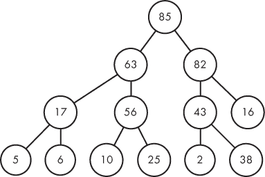

*图 8-1：一个最大堆*

快点——在那棵树中，最大收据的成本是多少？

它是 85，且位于根节点。如果有人向你承诺某个树的最大元素位于其根节点，那么你只需返回根节点的元素，而无需搜索或遍历整棵树。

我们的计划是维护这棵树，使最大账单的费用始终位于根节点。我们必须保持警惕，因为我们将会受到两种事件的干扰，它们可能会破坏我们的树：

**一个新的账单到来了。** 我们需要弄清楚如何重新组织树以纳入这个账单。这个新账单甚至可能比树中的所有元素都要大，在这种情况下，我们需要将账单移动到根节点。

**从树中提取一个账单。** 我们需要弄清楚如何重新组织树，以确保剩下的最大元素位于根节点。

当然，我们必须快速执行这些插入和提取操作。特别是，我们需要比线性时间还要快，因为线性时间扫描数组正是我们陷入困境的原因！

##### 什么是最大堆？

图 8-1 是一个*最大堆*的例子。这里的“最大”意味着这棵树让我们能够快速找到最大元素。

最大堆有两个重要性质。首先，它是一个*完全*二叉树。这意味着树中的每一层都是满的（即没有缺失的节点），除了最底层，其节点是从左到右依次填充的。在图 8-1 中，注意到每一层都是完全满的。虽然最底层并未完全满，但这没关系，因为它的节点是从左边开始填充的。（不要将这里的完全二叉树与第二章中的满二叉树混淆。）

最大堆是一个完全二叉树这一事实并不会直接帮助我们找到最大元素、插入元素或提取最大元素，但它确实导致了堆的极速实现，正如我们将看到的那样。

其次，一个节点的值大于或等于其子节点的值。（图 8-1 中的值都是不同的，因此父节点的值严格大于其子节点的值。）这就是所谓的*最大堆顺序*性质。

考虑图 8-1 中一个值为 56 的节点。正如所承诺的，56 的值大于它的子节点（10 和 25）的值。这一性质在整个树中都成立，这就是为什么最大值必须位于根节点的原因。其他每个节点都有一个值更大的父节点！

##### 向最大堆中插入元素

当一个新账单到达时，我们将其插入到最大堆中，但必须小心操作，以确保最大堆顺序性质得以保持。

从图 8-1 开始，让我们插入 15。只有一个位置可以放入它，而不破坏完全树的性质：在底层，位于 38 的右侧（见图 8-2）。

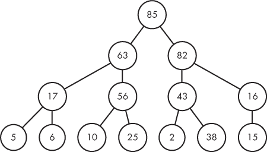

*图 8-2：插入 15 的最大堆*

它确实是一个完整的二叉树，但最大堆序列属性是否仍然成立？是的！15 的父节点是 16，并且 16 大于 15，正如我们所要求的那样。没有额外的操作需要进行。

现在考虑一个更复杂的情况。我们将 32 插入到图 8-2，得到图 8-3。

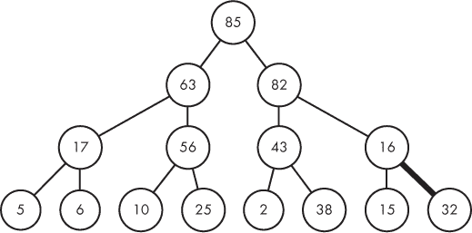

*图 8-3：插入 32 后的最大堆*

这里有点麻烦。插入 32 破坏了最大堆顺序属性，因为它的父节点 16 小于 32。（在这里和后续的图中，粗边表示最大堆顺序违规。）我们可以通过交换 16 和 32 来修复这个问题，如图 8-4 所示。

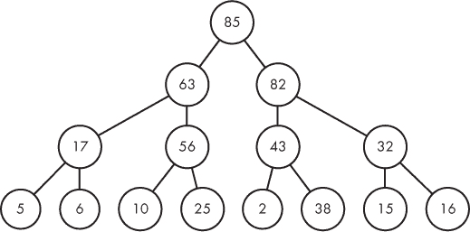

*图 8-4：修复了最大堆顺序违规的最大堆*

啊，顺序已经恢复：此时 32 必须大于它的两个子节点。它大于它的子节点 16，因为这就是我们进行交换的原因，它也大于另一个子节点 15，因为 15 曾是 16 的子节点。通常，执行这样的交换可以保证新节点和其子节点之间的最大堆顺序属性得以维持。

我们回到了一个最大堆，并且只用了一个交换就解决了问题。不过，可能需要更多的交换，我现在将通过将 91 插入到图 8-4 来演示。请参见图 8-5 查看结果。

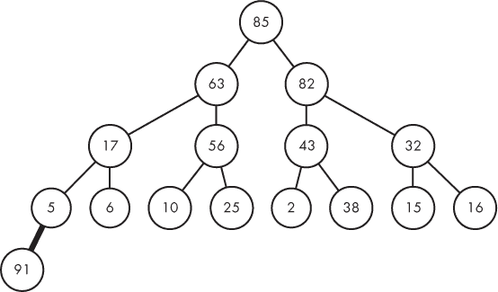

*图 8-5：插入 91 后的最大堆*

我们不得不在树的底部开始一个新层级，因为之前的底层已满。然而，我们不能将 91 作为 5 的子节点，因为它违反了最大堆序列的属性。交换一下就能修复这个问题……嗯，差不多吧。参见图 8-6。

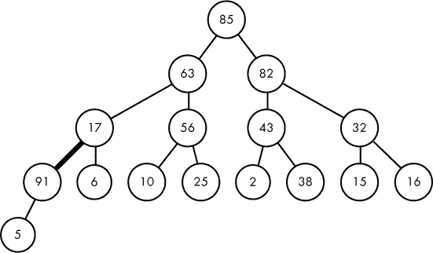

*图 8-6：91 向上移动后的最大堆*

我们修复了 5 和 91 之间的问题，但现在我们又遇到了 17 和 91 之间的新问题。我们可以通过另一次交换来解决这个问题；请参见图 8-7。

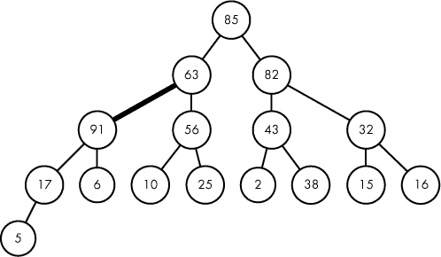

*图 8-7：91 再次向上移动的最大堆*

我们再次遇到了一个最大堆序列违规，这次是在 63 和 91 之间。然而，注意到违规正在向树的上方移动，越来越接近根节点。在最坏的情况下，我们将把 91 上移到树的根节点。正如这里所发生的那样，因为 91 是最大元素。还需要两次交换才能完成：第一次交换见图 8-8。

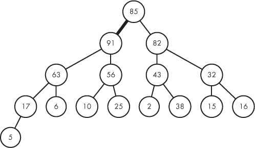

*图 8-8：91 再次上移后的最大堆*

第二次交换见图 8-9。

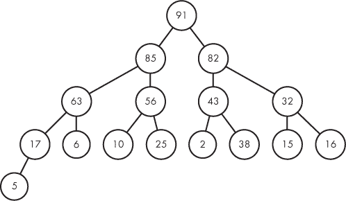

*图 8-9：修复了堆序违规的最大堆*

我们再次得到了一个最大堆！我们只需执行四次交换来修复 16 个元素的堆，而这只是对于一个冒泡到根节点的值。如我们所见，插入其他没有冒泡到根节点的值会比这更快。

##### 从最大堆中提取

每次促销结束时，我们都需要从最大堆中提取最大值。与插入一样，我们必须小心地修复树，以确保它再次成为最大堆。我们将看到，这个过程与插入非常相似，只不过这次是一个值向下冒泡，而不是向上冒泡。

让我们从图 8-1 开始，提取最大值。这里是那张图：


提取最大值将 85 移除作为树的根节点，但我们需要在根节点放置其他节点；否则，我们将不再拥有一棵树。我们可以使用的唯一节点是底层最右侧的节点，也就是说，我们可以将 85 和 38 交换，得到图 8-10。

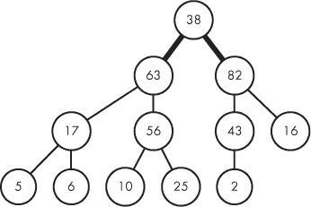

*图 8-10：提取 85 后的最大堆*

我们刚刚从树的底部取了一个小值并把它顶到顶部。通常情况下，这样做会破坏最大堆顺序属性。这里确实发生了这种情况，因为 38 小于 63 和 82。

我们将通过交换来再次修复最大堆顺序属性。与插入不同，提取给我们提供了一个选择：我们应该交换 38 和 63，还是交换 38 和 82？交换 38 和 63 并不能解决根节点的问题，因为 82 最终会成为 63 的子节点。交换 38 和 82 才是正确的选择。通常情况下，我们要与较大的子节点进行交换，这样就能修复较大子节点及其新子节点之间的最大堆顺序属性。图 8-11 展示了交换 38 和 82 后的结果。

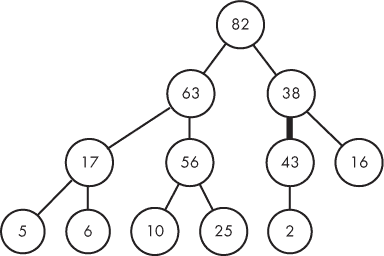

*图 8-11：38 向下移动后的最大堆*

我们还没有完全解决问题——在 38 和 43 之间仍然存在一个最大堆顺序违反。好消息是，最大堆顺序违反正在向树的下方移动。如果我们不断地将违反下移，那么在最坏的情况下，当 38 到达树的底部时，我们将再次得到一个最大堆。

让我们交换 38 和 43；请参见图 8-12。

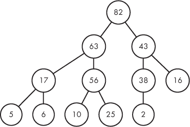

*图 8-12：38 向下移动后的最大堆*

现在 38 已经放置在合适的位置，我们恢复了最大堆顺序属性。

##### 最大堆的高度

插入和提取每层最多执行一次交换：插入将节点向上交换，提取将节点向下交换。插入和提取快吗？这取决于最大堆的高度：如果高度很小，那么这些操作会很快。因此，我们需要理解最大堆中元素数量与最大堆高度之间的关系。

看一下图 8-13，我绘制了一个包含 16 个节点的完整二叉树。

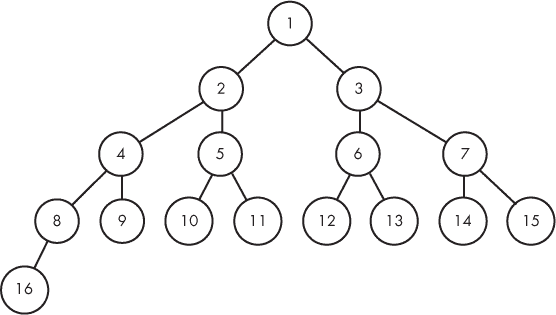

*图 8-13：一个包含 16 个节点的完整二叉树（节点编号从上到下，从左到右）*

我已经将节点从上到下、从左到右进行了编号。这就是为什么根节点是 1；它的两个子节点是 2 和 3；它们的子节点是 4、5、6 和 7，以此类推。我们可以观察到，每一层的新节点编号都是 2 的幂：根节点是 1，下面一层从 2 开始，再下面一层从 4 开始，然后是 8，接着是 16。也就是说，我们需要将节点数量加倍才能再增加一层。这就像二分查找一样，将元素数量加倍只会导致循环再多进行一次。因此，像二分查找一样，完整二叉树的高度，进而最大堆的高度是*O*(log *n*)，其中*n*是树中的元素数量。

我们成功了！插入到最大堆的时间复杂度是*O*(log *n*)。从最大堆中提取的时间复杂度也是*O*(log *n*)。我们再也不需要被*O*(*n*)线性时间的操作拖慢速度了。

##### 最大堆作为数组

最大堆其实就是一个二叉树，而我们知道如何实现二叉树。虽然可以这样实现最大堆，但其实相当有挑战性。

回想一下我们在第二章中解决的 Halloween Haul 问题。我们使用了一个带有指向左子节点和右子节点的指针的`node`结构体。这样足以让我们将一个值向下冒泡到最大堆中。然而，这对于将一个值向上冒泡到最大堆中就不够了，因为这样做需要访问父节点。因此，我们可能会添加一个父指针：

```
typedef struct node {
  fields for receipts
  struct node *left, *right, *parent;
} node;
```

即使我们像那样添加了`parent`，我们仍然只能直接访问树的根节点。在插入一个值时，我们应该如何快速找到插入的位置？在提取时，我们又该如何快速找到最底层的最右节点？其实，有更好的方法。

让我们再次使用图 8-13，我已将节点从上到下、从左到右进行了编号。节点 16 的父节点是 8。节点 12 的父节点是 6。节点 7 的父节点是 3。那么，节点编号和父节点编号之间有什么关系呢？

答案是：除以 2！16/2 = 8。12/2 = 6。7/2 = 3。嗯，最后那个其实是 3.5，所以只需要去掉小数部分。

我们通过整数除以 2 来向上移动树形结构。让我们看看如果我们反过来做，改为乘以 2 会发生什么。8 × 2 = 16，因此乘以 2 会将我们从 8 移动到它的左子节点。然而，大多数节点有两个子节点，我们也可能想从一个节点移动到它的右子节点。我们也可以做到这一点：只需在左子节点的编号上加 1。例如，我们可以通过 6 × 2 = 12 从 6 移动到它的左子节点，也可以通过 6 × 2 + 1 = 13 从 6 移动到它的右子节点。（13/2 和 6 之间的关系是为什么从子节点到父节点时可以安全地舍弃 0.5 的一个例子。）

这些节点之间的关系仅在最大堆是完全二叉树的情况下才成立。一般来说，二叉树的结构可能更为混乱，可能在某些地方有长链节点，而在其他地方有短链节点。除非我们插入占位符节点来维持树的“完全性”，否则我们不能仅通过乘以和除以 2 来轻松遍历这样的树。如果树非常不平衡，这将浪费大量内存。

如果我们将最大堆存储在数组中——首先是根节点，然后是它的子节点，再是它们的子节点，依此类推——那么数组中节点的索引对应于它的节点编号。为了与图 8-13 中的编号匹配，我们必须从 1 开始索引，而不是 0。（虽然可以从索引 0 开始，但那样会导致节点之间的关系稍显复杂：索引 *i* 处节点的父节点位于 (*i* – 1)/2 处，子节点则位于索引 2*i* + 1 和 2*i* + 2 处。）

这里再次是图 8-1，13 个收据费用的堆：

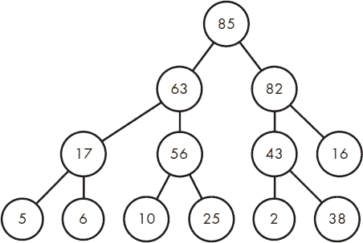

这是相应的数组：


数组中的索引 6 对应的值是 43。43 的左子节点是多少？为了回答这个问题，只需查找索引 6 × 2 = 12 的数组值：是 2。43 的右子节点是多少？查找索引 6 × 2 + 1 = 13：是 38。43 的父节点是多少？查找索引 6/2 = 3：是 82。不管我们当前关注的是树中的哪个节点，我们都可以通过数组和一点数学运算来轻松找到其子节点或父节点。

##### 实现最大堆

我们堆中的每个元素将同时包含一个收据索引和一个收据费用。这是我们在提取收据时需要了解的两条信息。

这是结构体：

```
typedef struct heap_element {
  int receipt_index;
  int cost;
} heap_element;
```

现在我们准备实现一个最大堆。两个关键操作是插入堆和从堆中提取最大值。让我们从插入堆开始；请参见清单 8-3。

```
void max_heap_insert(heap_element heap[], int *num_heap,
                     int receipt_index, int cost) {
  int i;
  heap_element temp;
❶ (*num_heap)++;
➋ heap[*num_heap] = (heap_element){receipt_index, cost};
➌ i = *num_heap;
➍ while (i > 1 && heap[i].cost > heap[i / 2].cost) {
     temp = heap[i];
     heap[i] = heap[i / 2];
     heap[i / 2] = temp;
  ➎ i = i / 2;
  }
}
```

*清单 8-3：插入最大堆*

`max_heap_insert`函数接受四个参数。前两个是堆的相关信息：`heap`是存储最大堆的数组，`num_heap`是指向堆中元素数量的指针。之所以使用指针，是因为我们需要将堆中的元素数量增加 1，并让调用者知晓这一变化。后两个参数是针对新接收的元素：`receipt_index`是我们要插入的接收元素的索引，`cost`是它的关联成本。

我们首先通过增加堆中的元素数量来进行初始化 ❶，然后将新的接收元素存储在新的堆槽中 ➋。变量`i`跟踪新插入元素在堆中的索引 ➌。

我们无法保证仍然拥有一个最大堆。我们刚刚插入的元素可能比它的父节点更大，因此我们需要执行必要的交换操作。这就是`while`循环的作用 ➍。

`while`循环继续的条件有两个。首先，我们需要`i > 1`，因为如果`i`等于 1，就没有父节点。（记住，堆的索引从 1 开始，而不是从 0 开始。）第二，我们需要该节点的接收成本大于其父节点的接收成本。`while`循环的主体执行交换操作，然后将我们从当前节点移动到其父节点 ➎。啊，没错，我们又用了通过除以 2 的方式来向上移动树结构。这种简洁、优雅且正确的代码是最好的类型。

现在让我们来看看从最大堆中提取的过程。示例 8-4 提供了相关代码。

```
 heap_element max_heap_extract(heap_element heap[], int *num_heap) {
   heap_element remove, temp;
   int i, child;
❶ remove = heap[1];
➋ heap[1] = heap[*num_heap];
➌ (*num_heap)--;
➍ i = 1;
➎ while (i * 2 <= *num_heap) {
  ➏ child = i * 2;
     if (child < *num_heap && heap[child + 1].cost > heap[child].cost)
    ❼ child++;
  ❽ if (heap[child].cost > heap[i].cost) {
       temp = heap[i];
       heap[i] = heap[child];
       heap[child] = temp;
    ❾ i = child;
     } else
       break;
  }
  return remove;
}
```

*示例 8-4：从最大堆中提取最大值*

我们从堆的根节点开始，保存即将提取的接收元素 ❶。然后，我们用最底层、最右侧的节点替换根节点 ➋，并将堆中的元素数量减少 1 ➌。新的根元素可能不满足最大堆顺序，因此我们使用变量`i`来跟踪它在堆中的位置 ➍。接下来，就像在示例 8-3 中一样，我们使用`while`循环来执行必要的交换操作。这次，`while`循环的条件 ➎表示节点`i`的左子节点在堆中；如果没有左子节点，那么节点`i`就没有子节点，也就不会发生堆顺序违规。

在循环内部，`child`被设置为左子节点 ➏。然后，如果右子节点存在，我们会检查它的成本是否比左子节点更高。如果是，我们将`child`设置为右子节点 ❼。此时，`child`是最大的子节点，我们检查它是否涉及堆排序违规 ❽。如果是，我们就执行交换操作。最后，我们向下移动树结构 ❾，准备检查是否有其他堆排序违规。

注意，如果节点和它的最大子节点已经正确排序，会发生什么：我们会`break`跳出循环，因为树中不会再有堆排序违规。

函数的最后一步是返回最大费用的收据。我们可以使用它来帮助确定当天的奖品，并确保我们再也不会考虑这张收据。不过，首先，让我们了解最小堆，这样我们就可以同时提取最小值和最大值。

#### *最小堆*

一个*最小堆*允许我们快速插入新的收据并提取最小费用的收据。

##### 定义与操作

猜猜看？你几乎已经掌握了关于最小堆的一切，因为它们与最大堆几乎完全相同。

最小堆是一个完全二叉树。它的高度为*O*(log *n*)，其中*n*是堆中元素的数量。我们可以像存储最大堆一样，将其存储在数组中。要查找节点的父节点，将其下标除以 2；要查找左子节点，将其下标乘以 2；要查找右子节点，将其下标乘以 2 并加 1。这里没有新东西。

唯一的新概念是*最小堆顺序*属性：一个节点的值小于或等于其子节点的值。这导致根节点处的值是最小值，而不是最大值。正是这个特性使得我们能够快速执行最小值提取操作。

让我们再次考虑以下 13 个收据费用：6, 63, 16, 82, 25, 2, 43, 5, 17, 10, 56, 85 和 38。 图 8-14 展示了这些费用的最小堆。

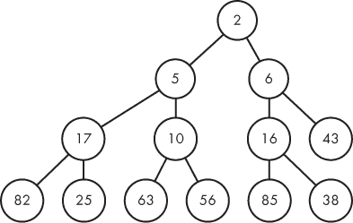

*图 8-14：一个最小堆*

向最小堆插入数据和从最小堆中提取最小值的操作类似于相应的最大堆操作。

插入时，将新节点添加到底层所有节点的右侧，或者如果底层已满，则开始一个新的一层。然后将该节点向上交换，直到它成为根节点或大于等于其父节点。

为了提取最小值，将根节点替换为最底层最右边的值，然后将该值向下交换，直到它成为叶节点或小于等于其子节点的值。

##### 实现最小堆

实现最小堆就是用最大堆的代码进行复制和粘贴。只需要更改函数名，并将比较符号从`>`改为`<`。就这么简单。请参见清单 8-5 了解插入代码。

```
void min_heap_insert(heap_element heap[], int *num_heap,
                     int receipt_index, int cost) {
  int i;
  heap_element temp;
  (*num_heap)++;
  heap[*num_heap] = (heap_element){receipt_index, cost};
 i = *num_heap;
  while (i > 1 && heap[i].cost < heap[i / 2].cost) {
    temp = heap[i];
    heap[i] = heap[i / 2];
    heap[i / 2] = temp;
    i = i / 2;
  }
}
```

*清单 8-5：向最小堆插入数据*

清单 8-6 给出了最小值提取的代码。

```
heap_element min_heap_extract(heap_element heap[], int *num_heap) {
  heap_element remove, temp;
  int i, child;
  remove = heap[1];
  heap[1] = heap[*num_heap];
  (*num_heap)--;
  i = 1;
  while (i * 2 <= *num_heap) {
    child = i * 2;
    if (child < *num_heap && heap[child + 1].cost < heap[child].cost)
      child++;
    if (heap[child].cost < heap[i].cost) {
      temp = heap[i];
      heap[i] = heap[child];
      heap[child] = temp;
      i = child;
    } else
      break;
  }
  return remove;
}
```

*清单 8-6：从最小堆中提取最小值*

这里有大量的代码重复！实际上，你可以编写更通用的`heap_insert`和`heap_extract`函数，并将比较函数作为参数传递（就像`qsort`一样）。不过，为了简化理解，我们暂时不考虑这个，保持代码原样。

#### *解决方案 2：堆*

现在我们已经了解了最大堆和最小堆，准备好迎接这个问题的第二轮挑战。

我们只需要一个`main`函数，它读取输入并利用堆快速插入和提取收据。参见清单 8-7 了解代码。当你阅读时，会遇到两个`while`循环。究竟它们在做什么呢？

```
int main(void) {
❶ static int used[MAX_RECEIPTS] = {0};
➋ static heap_element max_heap[MAX_RECEIPTS + 1];
   static heap_element min_heap[MAX_RECEIPTS + 1];
   int num_days, receipt_index_today;
   int receipt_index = 0;
   long long total_prizes = 0;
   int i, j, cost;
   int max_num_heap = 0, min_num_heap = 0;
   heap_element max_element, min_element;
   scanf("%d", &num_days);

   for (i = 0; i < num_days; i++) {
     scanf("%d", &receipt_index_today);
     for (j = 0; j < receipt_index_today; j++) {
       scanf("%d", &cost);
     ➌ max_heap_insert(max_heap, &max_num_heap, receipt_index, cost);
     ➍ min_heap_insert(min_heap, &min_num_heap, receipt_index, cost);
       receipt_index++;
    }

 ➎ max_element = max_heap_extract(max_heap, &max_num_heap);
    while (used[max_element.receipt_index])
      max_element = max_heap_extract(max_heap, &max_num_heap);
    used[max_element.receipt_index] = 1;

 ➏ min_element = min_heap_extract(min_heap, &min_num_heap);
    while (used[min_element.receipt_index])
      min_element = min_heap_extract(min_heap, &min_num_heap);
    used[min_element.receipt_index] = 1;
    total_prizes += max_element.cost - min_element.cost;
  }
  printf("%lld\n", total_prizes);
  return 0;
}
```

*列表 8-7：使用堆解决问题的主函数*

我们有一个`used`数组 ❶，它将为每个收据存储一个`1`，如果它已经被使用过，存储`0`，如果未使用。最大堆 ➋和最小堆比`used`数组多一个元素；这就是我们在堆中不使用索引 0 的原因。

对于给定的一天，我们将每个收据的索引插入到最大堆 ➌ 和最小堆 ➍ 中。然后，我们从最大堆 ➎ 中提取一个收据，并从最小堆 ➏ 中提取一个收据。这就是那两个`while`循环发挥作用的地方，循环直到我们得到一个尚未使用的收据。让我解释一下发生了什么。

当我们从最大堆中提取一个收据时，最好也能从最小堆中提取它，这样两个堆总是包含完全相同的收据。注意，实际上我们并没有从最小堆中提取那个相同的收据。为什么？因为我们根本不知道这个收据在最小堆中的位置！稍后的某个时刻，这个收据可能会从最小堆中提取出来——但是它已经被使用过了，所以我们想丢弃它，而不是再次处理它。

相反的情况也可能发生，因为我们从最小堆中提取一个收据并将其留在最大堆中。稍后，这个已使用的收据可能会从最大堆中提取出来。我们需要忽略它，并再次从最大堆中提取。

所以这就是`while`循环的作用：忽略已经被其中一个堆处理过的收据。

可能需要一个新的测试用例。它是：

```
2
2 6 7
2 9 10
```

这里的奖金是 7 – 6 = 1 来自第一天，10 – 9 = 1 来自第二天，所以总奖金是 2。

在阅读完第一天的两个收据后，每个堆都保存着这两个收据。对于最大堆，我们有：

| receipt_index | cost |
| --- | --- |
| 1 | 7 |
| 0 | 6 |

对于最小堆，我们有：

| receipt_index | cost |
| --- | --- |
| 0 | 6 |
| 1 | 7 |

然后我们进行堆提取，从每个堆中移除一个收据。这里是最大堆剩下的内容：

| receipt_index | cost |
| --- | --- |
| 0 | 6 |

下面是最小堆剩下的内容：

| receipt_index | cost |
| --- | --- |
| 1 | 7 |

收据 0 仍然在最大堆中，收据 1 仍然在最小堆中。然而，它们已经被使用了，所以我们最好不要再使用它们。

现在考虑第二天。收据 2 和 3 被添加到每个堆中，所以对于最大堆，我们有：

| receipt_index | cost |
| --- | --- |
| 3 | 10 |
| 0 | 6 |
| 2 | 9 |

对于最小堆，我们有：

| receipt_index | cost |
| --- | --- |
| 1 | 7 |
| 2 | 9 |
| 3 | 10 |

当我们从最大堆中提取时，得到的是收据 3。太好了。但是，当我们从最小堆中提取时，得到的是收据 1。没有`while`循环来丢弃它，这会是个大麻烦，因为收据 1 已经被使用过了。

在一天结束时，一个或两个 `while` 循环可能会迭代多次。如果这种情况持续发生，日复一日，我们就需要关注对程序效率的影响。不过，请注意，收据最多只能从堆中移除一次。如果堆中有 *r* 个收据，那么最多可以从堆中提取 *r* 次，不论它们是集中在同一天，还是跨越多天。

是时候提交给评审了。与解决方案 1 因为缓慢的搜索而浪费时间不同，我们基于堆的解决方案应该能在时间限制内顺利通过所有测试用例。

### 堆

如果你有一个不断输入的值流，并且在任何时刻可能需要处理最大值或最小值，那么你需要使用堆。最大堆用于提取和处理最大值；最小堆用于提取和处理最小值。

堆可以用来实现 *优先队列*。在优先队列中，每个元素都有一个优先级，决定了它的重要性。在一些应用中，重要元素的优先级是较大的数字，在这种情况下应该使用最大堆；在其他应用中，重要元素的优先级是较小的数字，这时应使用最小堆。当然，如果我们需要同时处理高优先级和低优先级元素，可以使用两个堆，就像我们在解决超市促销问题时所做的那样。

#### *另外两个应用*

我发现最小堆比最大堆使用得更频繁。让我们探讨两个可以使用最小堆的例子。

##### 堆排序

有一个著名的排序算法叫做 *堆排序*，现在我们理解了最小堆后，可以实现它。我们所要做的就是将所有的值插入到最小堆中，然后逐个提取最小值。这些提取会依次取出最小的值、第二小的值、第三小的值，依此类推，从而得到按从小到大排序的值。这实际上只有四行代码。查看清单 8-8 了解详细内容。

```
#define N 10

int main(void) {
  static int values[N] = {96, 61, 36, 74, 45, 60, 47, 6, 95, 93};
  static int min_heap[N + 1];
  int i, min_num_heap = 0;

  // Heapsort. 4 lines!
  for (i = 0; i < N; i++)
    min_heap_insert(min_heap, &min_num_heap, values[i]);
  for (i = 0; i < N; i++)
    values[i] = min_heap_extract(min_heap, &min_num_heap);

  for (i = 0; i < N; i++)
    printf("%d ", values[i]);
  printf("\n");
  return 0;
}
```

*清单 8-8：堆排序*

我们在这里插入的是整数，因此你应该将 `min_heap_insert` 和 `min_heap_extract` 修改为使用并比较整数，而不是 `heap_element` 结构体。

堆排序执行 *n* 次插入和 *n* 次提取。堆实现每一次操作的时间复杂度为对数 *n*，因此堆排序是一个 *O*(*n* log *n*) 算法。这与最快的排序算法的最坏情况运行时间相同。（C 语言中的 `qsort` 函数中的 `q` 可能源自 *快速排序*，一种在实际中比堆排序更快的排序算法。我们将在第十章中遇到快速排序。）

##### Dijkstra 算法

Dijkstra 算法（第六章）花费大量时间寻找下一个处理的节点。它通过搜索节点距离来找到最小的那个。为了加速 Dijkstra 算法，我们可以使用最小堆！这一点在附录 B 的《Dijkstra 算法：使用堆》中有演示。

#### *选择数据结构*

数据结构通常只适用于少数几种操作类型。没有一种万能数据结构可以让所有操作都变快，因此你需要根据所解决的问题选择合适的数据结构。

回想一下 第一章，我们学习了哈希表数据结构。我们是否可以用哈希表来解决超市促销问题？

不！哈希表适用于加速搜索我们要查找的特定项目。哪些雪花可能与雪花 *s* 相似？单词 *c* 是否在这个单词列表中？这些是你希望从哈希表中查询的问题。数组中最小的元素是什么？哈希技术在这方面没有帮助。你得通过哈希表进行搜索，而这与直接搜索普通数组没有区别。我们的任务是选择一个专门为当前任务设计的数据结构。对于在数组中查找最小元素，那个数据结构就是最小堆。

与任何通用数据结构一样，堆可以用来解决意想不到的多种问题——但堆的数据结构本身保持不变，就像你在这里学到的一样。所以，虽然我们不再解决另一个堆问题，但接下来我们将遇到一个需要新数据结构——*线段树*——的问题。与堆一样，线段树仅能加速少数几种操作类型。即便如此，线段树在处理问题时的加速效果仍然令人印象深刻，正是这些加速正是我们所需要的。

### 问题 2：构建 Treaps

在这个问题中，我们将构建一个 *treap* 的表示。Treap 是一种灵活的数据结构，可以解决多种搜索问题，如果你感兴趣，我鼓励你深入了解 treap。这里我们只关心构建一个 treap，而不是使用它。当然，为了我们的目的，我会提供关于 treap 的所有必要信息。

这是 POJ 问题 `1785`。

#### *问题*

Treap 是一种二叉树，每个节点都有一个标签和一个优先级。图 8-15 显示了一个示例 treap，其中大写字母是标签，正整数是优先级。我已经通过斜杠将每个节点的标签和优先级分开。例如，根节点的标签是 C，优先级是 58。

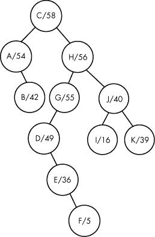

*图 8-15：Treap 示例*

Treap 必须满足两个条件：一个是关于其标签的，另一个是关于其优先级的。

首先，让我们来谈谈标签。对于任何节点 *x*，其左子树中的标签都小于 *x* 的标签，右子树中的标签都大于 *x* 的标签。这就是 *二叉搜索树（BST）* 的特性。

你可以验证图 8-15 中的 treap 是否符合这个标签属性。对于我们的字母标签，如果一个标签在字母表中出现在另一个标签之前，则该标签小于另一个标签。以根节点为例，它的标签是 C。它左子树中的所有标签都小于 C，而右子树中的所有标签都大于 C。另一个例子是考虑标签为 G 的节点。它左子树中的所有标签——D、E 和 F——都小于 G。那么它右子树中的所有标签呢？嗯，右子树中没有标签，所以不用检查！

其次，我们来谈谈优先级。对于任何节点 *x*，其子节点的优先级都小于 *x* 的优先级。嘿，这就像最大堆顺序属性一样！

再次看看根节点。它的优先级是 58。它的孩子最好有更低的优先级——它们的优先级分别是 54 和 56。那么那个优先级为 55 的 G 节点呢？我们需要它的孩子有更低的优先级——它确实如此，优先级是 49。

这就是一个 treap：一个二叉树，其标签满足二叉搜索树（BST）属性，优先级满足最大堆顺序（max-heap-order）属性。注意，没有形状的要求：treap 可以具有任何结构。显然，不像堆那样有完整树的要求。

在这个问题中，我们提供了每个节点的标签/优先级。我们的任务是为这些节点组装并输出一个 treap。

##### 输入

输入包含零个或多个测试用例。每行输入以一个整数 *n* 开头。每个 *n* 的范围是 0 到 50,000。如果 *n* 为 0，则表示没有更多的测试用例需要处理。

如果 *n* 大于零，那么它表示测试用例中节点的数量。紧接着 *n* 是 *n* 个用空格分隔的标记，每个标记对应一个节点。每个标记的形式是 `L/P`，其中 `L` 是标签，`P` 是该节点的优先级。标签是字母字符串；优先级是正整数。所有标签都是唯一的，所有优先级也是唯一的。

这是可能的输入，它生成了图 8-15 中的 treap：

```
11 A/54 I/16 K/39 E/36 B/42 G/55 D/49 H/56 C/58 J/40 F/5
0
```

##### 输出

对于每个测试用例，输出 treap 每行一个。以下是 treap 所需的格式：

```
(<left_subtreap><L>/<P><right_subtreap>)
```

这里，<left_subtreap> 是左子 treap，<L> 是根节点的标签，<P> 是根节点的优先级，<right_subtreap> 是右子 treap。子 treap 以相同的格式输出。

这是与示例输入对应的输出：

```
((A/54(B/42))C/58(((D/49(E/36(F/5)))G/55)H/56((I/16)J/40(K/39))))
```

解决测试用例的时间限制是两秒钟。

#### *递归输出 Treaps*

让我们再次考虑我们的示例节点，并推理如何从这些节点生成一个 treap。以下是这些节点：

```
A/54 I/16 K/39 E/36 B/42 G/55 D/49 H/56 C/58 J/40 F/5
```

请记住，treap 的优先级必须遵守最大堆顺序属性。特别地，这意味着具有最大优先级的节点必须是根节点。此外，由于输入保证所有优先级都是不同的，因此只有一个节点具有最大优先级。所以就这样确定了：根节点必须是 `C/58`。

现在我们必须为每个其他节点决定它应该进入 C 的左子堆树还是右子堆树。这些节点的优先级都小于 58，因此优先级不能帮助我们做出左–右划分——但二叉搜索树（BST）属性能！堆树的 BST 属性告诉我们，左子堆树中的标签必须小于 C，右子堆树中的标签必须大于 C。因此，我们可以将剩余节点分成两组，一组用于左子堆树，一组用于右子堆树，具体如下：

```
A/54 B/42
I/16 K/39 E/36 G/55 D/49 H/56 J/40 F/5
```

也就是说，左子堆树将包含节点 A 和 B，右子堆树将包含节点 I、K、E、G 等。

现在，我们完成了！我们将原始问题分解为两个更小的子问题，形式完全相同。我们被要求为 11 个节点生成一个堆树。我们已经将这个问题简化为为两个节点生成堆树和为八个节点生成堆树。我们可以递归地解决这些问题！

让我们明确一下我们将使用的具体规则。对于基准情况，我们可以使用一个零节点的堆树，这不需要输出任何内容。对于递归情况，我们将根节点识别为具有最高优先级的节点，然后将剩余的节点分成标签较小的和标签较大的节点。我们输出一个左括号，递归输出较小标签的堆树，输出堆树的根节点，输出较大标签的堆树，最后输出一个右括号。

对于我们的示例输入，我们将输出一个左括号。接着我们输出左子堆树：

```
(A/54(B/42))
```

然后是根节点：

```
C/58
```

然后是右子堆树：

```
(((D/49(E/36(F/5)))G/55)H/56((I/16)J/40(K/39)))
```

最后是一个右括号。

#### *按标签排序*

在开始编写代码之前，我还有一个实现思路。到目前为止，我描述的方式似乎需要我们实际创建一个新数组，包含小标签节点，用于传递给第一次递归调用；另一个新数组包含大标签节点，用于传递给第二次递归调用。这将导致数组之间频繁复制。幸运的是，我们可以通过一开始就按标签从小到大排序节点，避免这些操作。然后，我们只需告诉每个递归调用它负责的数组的起始和结束索引。

例如，如果我们按标签排序我们的示例输入，结果是：

```
A/54 B/42 C/58 D/49 E/36 F/5 G/55 H/56 I/16 J/40 K/39
```

然后我们可以告诉第一次递归调用生成前两个节点的子堆树，第二次递归调用生成后八个节点的子堆树。

#### *解决方案 1：递归*

这里有一些常量和一个结构体：

```
#define MAX_NODES 50000
#define LABEL_LENGTH 16
typedef struct treap_node {
  char * label;
  int priority;
} treap_node;
```

我们不知道标签的长度，所以我们将初始大小设置为 16。你会看到我们调用一个`read_label`函数来读取每个标签；如果 16 的长度不足，该函数会分配更多内存，直到标签能够适配。（这可能有点过头，因为测试用例似乎使用的标签最多只有五个字母，但安全起见总比出错好。）

##### 主函数

让我们看一下`main`函数，正如在示例 8-9 中给出的那样。它使用了一些辅助函数——我们刚才提到的`read_label`和用于比较 treap 节点的`compare`——并调用`solve`函数来实际输出 treap。我们稍后会讨论这些函数。

```
int main(void) {
  static treap_node treap_nodes[MAX_NODES];
  int num_nodes, i;
  scanf("%d ", &num_nodes);
  while (num_nodes > 0) {
    for (i = 0; i < num_nodes; i++) {
      treap_nodes[i].label = read_label(LABEL_LENGTH);
      scanf("%d ", &treap_nodes[i].priority);
    }
    qsort(treap_nodes, num_nodes, sizeof(treap_node), compare);
    solve(treap_nodes, 0, num_nodes - 1);
    printf("\n");
    scanf("%d ", &num_nodes);
  }
  return 0;
}
```

*示例 8-9：用于读取输入并解决问题的主函数*

在读取混合数字和字符串的程序中，要小心使用`scanf`。在这里，每个输入的数字后面都有空白字符，我们不希望这些空格字符出现在后续标签的前面。为了读取并丢弃这些空格，我们在每个`%d scanf`格式说明符后面加上一个空格。

##### 辅助函数

我们使用`scanf`来读取优先级，但不读取标签。标签是通过示例 8-10 中的`read_label`函数来读取的。

```
 /* based on https://stackoverflow.com/questions/16870485 */
 char *read_label(int size) {
   char *str;
   int ch;
   int len = 0;
   str = malloc(size);
   if (str == NULL) {
     fprintf(stderr, "malloc error\n");
     exit(1);
   }
❶ while ((ch = getchar()) != EOF && (ch != '/')) {
     str[len++] = ch;
     if (len == size) {
       size = size * 2;
       str = realloc(str, size);
       if (str == NULL) {
         fprintf(stderr, "realloc error\n");
         exit(1);
       }
     }
   }
   str[len] = '\0';
   return str;
}
```

*示例 8-10：读取标签*

我们在示例 5-15 中曾经用过基本相同的函数。唯一的区别是这次我们在`/`字符处停止读取，这个字符将标签与优先级分开❶。像往常一样，`qsort`需要一个比较函数，而我们需要的比较函数在示例 8-11 中给出，它通过标签比较节点。

```
int compare(const void *v1, const void *v2) {
  const treap_node *n1 = v1;
  const treap_node *n2 = v2;
  return strcmp(n1->label, n2->label);
}
```

*示例 8-11：排序的比较函数*

`strcmp`函数作为比较函数工作得非常好，因为如果第一个字符串按字母顺序小于第二个字符串，它返回负整数；如果两个字符串相等，则返回`0`；如果第一个字符串按字母顺序大于第二个字符串，则返回正整数。

##### 输出 Treap

在我们进入主要部分——`solve`函数之前，我们需要一个辅助函数来返回具有最大优先级的节点的索引。这个函数在示例 8-12 中提供。它是从`left`索引到`right`索引的慢速线性搜索（这应该让你感到担忧！）。

```
int max_priority_index(treap_node treap_nodes[], int left, int right) {
  int i;
  int max_index = left;
  for (i = left + 1; i <= right; i++)
    if (treap_nodes[i].priority > treap_nodes[max_index].priority)
      max_index = i;
  return max_index;
}
```

*示例 8-12：找到最大优先级*

现在我们准备好输出 treap 了！请参见示例 8-13 中的`solve`函数。

```
void solve(treap_node treap_nodes[], int left, int right) {
  int root_index;
  treap_node root;
❶ if (left > right)
     return;
➋ root_index = max_priority_index(treap_nodes, left, right);
   root = treap_nodes[root_index];
   printf("(");
➌ solve(treap_nodes, left, root_index - 1);
   printf("%s/%d", root.label, root.priority);
➍ solve(treap_nodes, root_index + 1, right);
   printf(")");
}
```

*示例 8-13：解决问题*

该函数接受三个参数：treap 节点的数组和确定我们希望构建 treap 的节点范围的`left`和`right`索引。为了构建包含所有节点的 treap，来自`main`的初始调用将传递`0`作为`left`，`num_nodes - 1`作为`right`。

这个递归函数的基本情况出现在 treap 中没有节点时❶。在这种情况下，我们只需返回，而不输出任何内容。没有节点，就没有输出。

否则，对于`left`和`right`之间的节点，我们找到具有最大优先级的节点的索引➋。这就是 treap 的根节点，它将问题分为两部分：输出标签较小节点的 treap 和输出标签较大节点的 treap。我们通过递归调用分别解决这两个子问题➌ ➍。

就这样：我们的第一个解决方案。老实说，我觉得它相当不错。实际上，它做对了两件重要的事。首先，它一次性排序所有节点，因此每次调用 `solve` 只需要它的 `left` 和 `right` 索引。其次，它使用递归轻松处理了本来可能令人头疼的输出 treap 的过程。

然而，将此代码提交给评测系统后，你会发现一切都停滞不前，因为需要进行线性搜索以找到具有最大优先级的节点（Listing 8-12）。它到底有什么问题？什么样的 treap 会触发其最坏情况下的性能？我们接下来会讨论这个问题。

#### *范围最大查询（RMQ）*

在上一章中，我们讨论了解决范围和查询问题。这个问题问的是：“给定一个数组 `a`、左索引 `left` 和右索引 `right`，从 `a[left]` 到 `a[right]` 的所有元素的 *和* 是多少？”

在构建 Treaps 时，我们需要解决一个相关的问题，称为 *范围最大查询（RMQ）* 问题。问题是：“给定一个数组 `a`、左索引 `left` 和右索引 `right`，从 `a[left]` 到 `a[right]` 的所有元素中，哪个元素的索引最大？”（对于某些问题，可能只需要得到最大元素本身，而不是索引，但在构建 Treaps 时，我们需要索引。）

在解决方案 1 中，我们提供了 Listing 8-12 中的 RMQ 实现。它从 `left` 遍历到 `right`，检查是否找到了一个节点的索引，其优先级高于我们到目前为止发现的节点。我们对每个子 treap 调用该函数，每次调用都涉及对数组活动区间的线性搜索。如果这些线性搜索大多是在小的数组区间内进行的，那么我们或许可以应付过去。然而，有些输入会导致许多搜索出现在数组的大区间上。以下是我们可能从输入中读取的节点列表：

```
A/1 B/2 C/3 D/4 E/5 F/6 G/7
```

我们扫描所有七个节点，找出 `G/7` 作为具有最大优先级的节点。然后，我们递归输出小标签节点的 treap，并递归输出大标签节点的 treap。不幸的是，第一个递归调用得到的是除了 `G/7` 节点之外的所有节点，而第二个递归调用则是在零个节点上进行。第一个递归调用得到的是：

```
A/1 B/2 C/3 D/4 E/5 F/6
```

现在，我们需要再扫描这六个元素以识别具有最高优先级的节点。我们将 `F/6` 识别为该节点，将其设为此子 treap 的根节点，然后再进行两个递归调用。然而，第一次递归调用仍然需要处理所有剩余的节点，导致又一次昂贵的数组扫描。这个昂贵的数组扫描模式可能会持续，直到没有节点剩余为止。

一般来说，我们可以说，对于*n*个节点，第一个 RMQ 可能需要*n*步，第二个可能需要*n* – 1 步，以此类推，一直到 1 步。总共是 1 + 2 + 3 + . . .+ *n*步。这个公式的封闭形式是*n*(*n* + 1)/2。在第一章中，我们在“诊断问题”部分的第 9 页看到过一个非常类似的公式。我们也可以得出类似的结论，我们在这里做的是*O*(*n*²)（二次方）工作。

这里有另一种方式来观察我们正在做*O*(*n*²)的工作。舍弃前*n*/2 个最小的项，专注于剩余的*n*/2 个较大的项。（假设*n*是偶数，这样*n*/2 就是整数。）这将剩下*n* + (*n* – 1) + (*n* – 2) + . . . + (*n*/2 + 1)。这里有*n*/2 个项，每一个都大于*n*/2，因此它们的和至少为(*n*/2)(*n*/2) = *n*²/4。这是二次方的！

因此，线性搜索来解决 RMQ 问题是不理想的。

在上一章中，我们使用了前缀数组来加速区间和查询。现在回顾一下这个方法，因为我马上要问你一个问题：我们能用这个技术来解决 RMQ 吗？

很遗憾，不行。（或者幸运的是不行，因为这样我可以教你我最喜欢的数据结构之一。）要从索引 2 到索引 5 求和，我们可以查找索引 5 的前缀和并减去索引 1 的前缀和。因为减法可以抵消加法：索引 5 的前缀和包含了索引 1 的前缀和，所以我们只需把后者从中减去。遗憾的是，我们不能用相同的方式“撤销”最大值计算。如果索引 5 之前的元素最大值是 10，而索引 1 之前的元素最大值也是 10，那么索引 2 到索引 5 的最大值是多少？谁知道！当那 10 被去掉后，它可能是索引 2、3、4 或 5 中的任意一个。一个巨大的早期元素阻止了后来的元素对前缀数组的任何更改。当那个巨大的元素消失时，我们就迷失了方向。相比之下，前缀和数组中的每个元素都会留下它的痕迹。

作为最后的努力，让我们尝试堆。我们能用最大堆来解决 RMQ 吗？不，再次不行。最大堆给我们的是整个堆的最大元素，而不能限制它仅仅对某个特定范围有效。

是时候尝试一些新方法了。

#### *线段树*

走开，treap，走开！我们稍后会回到 treap，就在我们有了 RMQ 更好的实现之后。

*线段树*是一个完全二叉树，其中每个节点都与基础数组的某个特定区间相关联。（在构建 Treap 时，基础数组是优先级数组。）每个节点存储其区间查询的答案。对于 RMQ，每个节点存储其区间内最大元素的索引，但线段树也可以用于其他查询。这些区间被排列成这样，少数几个区间可以组合起来回答任何查询。

##### 段

线段树的根节点覆盖整个数组。因此，如果我们被要求查询整个数组的 RMQ，我们只需看根节点，就能一步解决。对于其他查询，我们需要使用其他节点。根节点有两个子节点：左子节点覆盖数组的前半部分，右子节点覆盖数组的后半部分。这些节点每个都有两个子节点，进一步细分段，依此类推，直到我们得到仅包含一个元素的段。

图 8-16 展示了一个支持对八元素数组进行查询的线段树。每个节点都标注了它的左右端点。线段树中暂时没有 RMQ 相关信息；目前我们只关注段本身。

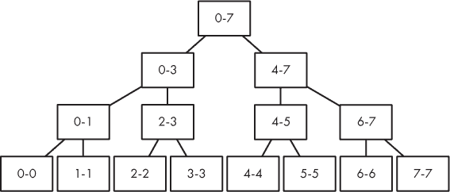

*图 8-16：一个八元素数组的线段树*

请注意，随着我们在树中每下降一层，段的大小会减半。例如，根节点段覆盖八个元素，每个子节点段覆盖四个元素，它们的子节点段覆盖两个元素，依此类推。像堆一样，线段树的高度是 log *n*，其中 *n* 是数组中的元素数量。我们可以通过每层做常量量的工作来回答任何查询，因此每次查询的时间复杂度是 *O*(log *n*)。

图 8-16 是一个完整的二叉树。通过我们对堆的学习，我们知道该如何处理这些：将它们存储在数组中！然后，我们可以使用相同的数学方法来找到父节点的子节点，这在处理线段树时会用到。

现在，我将给你展示另一个线段树，它揭示了一些意外的内容。请看图 8-17。

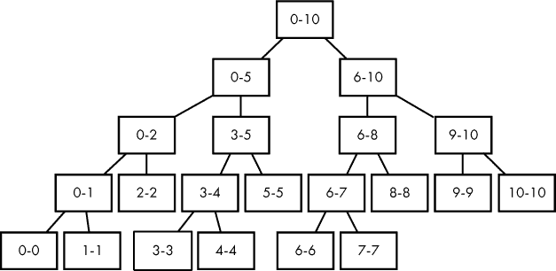

*图 8-17：一个 11 元素数组的线段树*

这根本不是一个完整的二叉树，因为底层没有从左到右填满！例如，节点 2-2 没有子节点，尽管 3-4 有。

不过没关系。我们会继续将线段树存储在数组中。我们将继续通过将节点索引乘以 2 来获得左子节点，乘以 2 再加 1 来获得右子节点。唯一发生的事就是数组会有一些浪费。例如，图 8-17 中数组元素的顺序如下，其中`*`表示未使用的元素：

```
0-10
0-5 6-10
0-2 3-5 6-8 9-10
0-1 2-2 3-4 5-5 6-7 8-8 9-9 10-10
0-0 1-1 * * 3-3 4-4 * * 6-6 7-7 * * * * * *
```

这种浪费*确实*使得确定线段树所需的数组元素个数变得稍微困难一些。

如果底层数组的元素数 *n* 是 2 的幂，那么我们可以安全地使用一个能够容纳 2*n* 元素的线段树。例如，计算 图 8-16 中的节点数量：它需要 15 个节点，少于 8 × 2 = 16。（2*n* 是安全的，因为所有小于 *n* 的 2 的幂加起来正好是 *n* – 1。例如，4 + 2 + 1 = 7，少于 8。）如果 *n* 不是 2 的幂，则 2*n* 不够用。为证明这一点，不妨看看 图 8-17，它需要一个包含 31 个元素的数组（大于 2 × 11 = 22）才能容纳。

覆盖线段树中的更多元素时，我们需要更大容量的线段树数组——那么它应该有多大呢？假设我们有一个包含 *n* 元素的底层数组，想要为其构建一颗线段树。我认为，为了安全起见，线段树应该分配一个包含 4*n* 元素的数组。

设 *m* 为大于或等于 *n* 的最小 2 的幂。例如，如果 *n* 是 11，则 *m* 是 16。我们可以在一个包含 2*m* 元素的数组中存储 *m* 个元素的线段树。由于 *m* ≥ *n*，因此一个包含 2*m* 元素的数组足以存储 *n* 个元素的线段树。

幸运的是，*m* 不会太大：它最多是 *n* 的两倍。（最坏的情况发生在 *n* 的值刚好超过 2 的幂时。例如，如果 *n* 是 9，那么 *m* 是 16，这几乎是 9 的两倍。）因此，如果我们需要一个包含 2*m* 元素的数组，并且 *m* 最多是 2*n*，那么 2*m* 至少是 2 × 2*n* = 4*n*。

##### 初始化区间

在线段树的每个节点中，我们将存储三件事：其区间的左索引、右索引和区间内最大元素的索引。我们将在处理第三项之前初始化前两项。

这是我们将用于线段树节点的结构体：

```
typedef struct segtree_node {
  int left, right;
  int max_index;
} segtree_node;
```

为了初始化每个节点的`left`和`right`成员，我们将编写以下函数签名的主体：

```
void init_segtree(segtree_node segtree[], int node,
                  int left, int right)
```

我们假设`segtree`是一个具有足够空间来存储线段树的数组。`node`参数是线段树的根索引；`left`和`right`是其区间的左和右索引。`init_segtree`的初始调用如下所示：

```
init_segtree(segtree, 1, 0, num_elements - 1);
```

这里的`num_elements`是底层数组中的元素数量（例如，treap 中的节点数）。

我们可以使用递归来实现`init_segtree`。如果`left`和`right`相等，则我们有一个包含一个元素的区间，不需要进行细分。否则，我们进入递归情况，需要将区间分成两部分。Listing 8-14 提供了代码。

```
void init_segtree(segtree_node segtree[], int node,
                  int left, int right) {
  int mid;
  segtree[node].left = left;
  segtree[node].right = right;
❶ if (left == right)
     return;
➋ mid = (left + right) / 2;
➌ init_segtree(segtree, node * 2, left, mid);
➍ init_segtree(segtree, node * 2 + 1, mid + 1, right);
}
```

*Listing 8-14: 初始化线段树区间*

我们首先将`left`和`right`的值存储在节点中。然后，我们检查基本情况❶，如果不需要子节点，则从函数返回。

如果需要子节点，我们计算当前区间的中点➋。然后，我们需要为 `left` 到 `mid` 之间的索引构建左侧段树，为 `mid + 1` 到 `right` 之间的索引构建右侧段树。这是通过两个递归调用实现的：一个是左侧 ➌，另一个是右侧 ➍。注意，我们如何使用 `node * 2` 移动到左子节点，使用 `node * 2 + 1` 移动到右子节点。

##### 填充段树

初始化段树后，接下来是将每个节点所在区间内最大元素的索引添加到该节点中。作为示例，我们需要一个段树和一个数组，段树将基于这个数组。对于段树，我们使用图 8-17，而对于数组，我们使用“按标签排序”中的 11 个优先级，见第 303 页。图 8-18 展示了填充后的段树。每个节点的最大索引列在其区间端点下方。

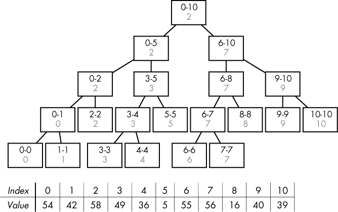

*图 8-18：一个段树和一个优先级数组*

让我们进行几个快速检查。考虑树底部的 0-0 节点。那是一个只有索引 0 的区间，所以最大元素的索引只能是 0。这听起来像是一个基准情况！

现在考虑节点 6-10。该节点表示 7 是从索引 6 到索引 10 之间最大元素的索引。索引 7 处是 56，您可以验证这是该区间内的最大元素。为了快速计算这一点，我们可以使用存储在 6-10 的子节点中的最大索引：左子节点表示 7 是 6-8 区间的所需索引，右子节点表示 9 是 9-10 区间的所需索引。那么对于 6-10，我们实际上只有两个选择：索引 7 或索引 9，这些是从这些子树返回的元素。这听起来像是一个递归情况！

没错：我们将使用递归来填充树，就像初始化树的区间时那样。清单 8-15 给出了代码。

```
int fill_segtree(segtree_node segtree[], int node,
                 treap_node treap_nodes[]) {
  int left_max, right_max;

❶ if (segtree[node].left == segtree[node].right) {
     segtree[node].max_index = segtree[node].left;
  ➋ return segtree[node].max_index;
  }
➌ left_max = fill_segtree(segtree, node * 2, treap_nodes);
➍ right_max = fill_segtree(segtree, node * 2 + 1, treap_nodes);

➎ if (treap_nodes[left_max].priority > treap_nodes[right_max].priority)
     segtree[node].max_index = left_max;
   else
     segtree[node].max_index = right_max;
➏ return segtree[node].max_index;
}
```

*清单 8-15：添加最大值*

`segtree` 参数是存储段树的数组；我们假设它已经通过清单 8-14 初始化。`node` 参数是段树的根索引，`treap_nodes` 是一个包含 treap 节点的数组。我们在这里需要 treap 节点是为了访问它们的优先级，但除此之外，这与 treap 没有关系。你可以轻松地将 treap 节点替换为任何你需要的东西，以解决给定问题。

这个函数返回段树根节点的最大元素索引。

代码首先进行基准情况检查：即节点是否仅覆盖一个索引❶。如果是，那么该节点的最大索引就是它的左索引（或者右索引，它们毕竟是相同的）。然后，我们返回该最大索引➋。

如果我们不在基础情况中，那么我们正在查看一个跨越多个索引的区间。我们递归调用左子树 ➌。该调用计算该子树中每个节点的`max_index`值，并返回该子树根节点的`max_index`值。然后，我们对右子树 ➍ 也做同样的操作。接着，我们比较从这些递归调用中得到的索引 ➎，选择优先级更高的那个，并相应地设置该节点的`max_index`。最后，我们做的事情是返回这个最大索引 ➏。

以这种方式填充树需要线性时间：对于每个节点，我们需要做一个固定量的工作来找到它的最大索引。

##### 查询线段树

让我们回顾一下。我们在尝试解决构建 Treap 的问题时遇到了瓶颈，因为我们没有一个快速的方法来响应区间最大查询。因此，我们花了很多时间来开发线段树，决定如何选择区间，如何设置线段树数组的大小，以及如何为每个节点存储最大元素的索引。

当然，所有这些线段树的内容如果不能提供快速查询，就毫无意义。最后，到了回报的时刻：使用线段树来获得快速查询。现在是行动时刻！别担心——它涉及的仅仅是我们至今在使用线段树时已经习惯的递归方式。

为了理解这一点，我们将对图 8-18 进行一些示例查询。这里再次展示该图：

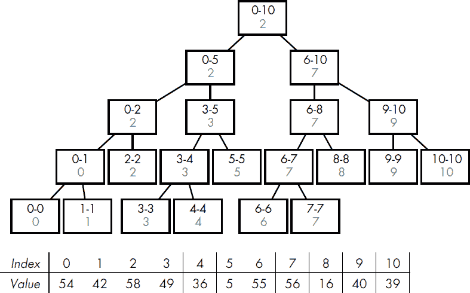

对于我们的第一个查询，我们做 6-10。这个范围仅涵盖了根节点 0-10 范围的一部分，因此返回根节点的最大索引并不合适。相反，我们将询问根节点的每个子节点获取最大相关索引，并用这些答案来返回总体的最大索引。根节点的左子节点涵盖了范围 0-5，而这个范围与我们的 6-10 完全没有重叠。左递归调用对我们没有任何帮助。然而，根节点的右子节点恰好覆盖了 6-10 范围。对右子节点的递归调用将返回 7，这是我们应返回的结果：7 是 6-10 范围内最大元素的索引。

对于我们的第二个查询，我们做 3-8。同样，我们将询问根节点的每个子节点获取最大相关索引——不过这次两个子节点都会有返回值，因为 3-8 同时与 0-5 和 6-10 有重叠。左子节点的递归调用返回 3，而右子节点的递归调用返回 7。在根节点，我们只需要将索引 3 处的元素与索引 7 处的元素进行比较。索引 7 处的元素较大，所以这是我们的答案。

我通常不展开递归，但在这里我会破例，因为我认为这可能会有所帮助。让我们进一步深入左子树的递归调用。我们仍然在查询 3-8，节点的区间是 0-5。0-5 的左子树是 0-2。0-2 与我们的 3-8 查询范围没有任何交集，所以不考虑。剩下的是 3-5 节点来完成工作。重要的是，3-5 完全包含在我们所需的 3-8 范围内，因此我们在这里停止，并从 3-5 的递归调用中返回 3。

查询线段树的节点会落入三种情况之一，我们在这里的示例中已经看到过它们。情况 1 是节点与查询范围没有交集，情况 2 是节点的区间完全包含在查询范围内，情况 3 是节点的区间部分包含在查询范围内，同时也包含不在查询范围内的索引。

我建议在查看代码之前先暂停，在手动做几个查询示例。特别是，尝试查询 4-9。你会注意到它需要沿着树向下追踪两条长路径。这是最坏的情况：我们在树的顶部分裂成两个节点，然后沿着这两条路径一直追踪到底。通过更多的示例，尤其是更大的线段树，你可以证明这些路径不会进一步分裂成各自的两条长路径。因此，虽然查询线段树确实比堆操作做了更多的工作——有时是追踪两条路径而不是一条——但它仍然在每一层访问较少的节点，保持了*O*(log *n*) 的运行时间。

查询线段树的代码见列表 8-16。

```
int query_segtree(segtree_node segtree[], int node,
                  treap_node treap_nodes[], int left, int right) {
  int left_max, right_max;

❶ if (right < segtree[node].left || left > segtree[node].right)
     return -1;

➋ if (left <= segtree[node].left && segtree[node].right <= right)
     return segtree[node].max_index;

➌ left_max = query_segtree(segtree, node * 2,
                            treap_nodes, left, right);
➍ right_max = query_segtree(segtree, node * 2 + 1,
                             treap_nodes, left, right);

   if (left_max == -1)
     return right_max;
   if (right_max == -1)
     return left_max;
➎ if (treap_nodes[left_max].priority > treap_nodes[right_max].priority)
     return left_max;
   return right_max;
}
```

*列表 8-16：查询线段树*

函数参数与列表 8-15 类似，唯一不同的是我们添加了查询的`left`和`right`索引。代码依次处理这三种情况。

在情况 1 中，节点与查询没有任何交集。这个情况发生在查询范围结束在节点的区间开始之前，或者查询范围开始在节点的区间结束之后 ❶。我们返回`-1`，表示该节点没有最大索引可以返回。

在情况 2 中，节点的区间完全包含在查询范围内 ➋。因此，我们返回该节点区间的最大索引。

剩下的是情况 3，节点的区间与查询范围部分重叠。我们会进行两次递归调用：一次获取左子树的最大索引 ➌，一次获取右子树的最大索引 ➍。如果其中一个返回`-1`，则返回另一个。如果它们都返回有效索引，则选择元素较大的索引 ➎。

#### *解决方案 2：线段树*

我们最终要做的事情是修改我们第一个解决方案（特别是清单 8-9 中的`main`函数和清单 8-13 中的`solve`函数），以使用线段树。这不需要太多工作：我们只需要调用我们已经编写的线段树函数。

清单 8-17 包含了新的`main`函数。

```
 int main(void) {
   static treap_node treap_nodes[MAX_NODES];
❶ static segtree_node segtree[MAX_NODES * 4 + 1];
   int num_nodes, i;
   scanf("%d ", &num_nodes);
   while (num_nodes > 0) {
     for (i = 0; i < num_nodes; i++) {
       treap_nodes[i].label = read_label(LABEL_LENGTH);
       scanf("%d ", &treap_nodes[i].priority);
     }
     qsort(treap_nodes, num_nodes, sizeof(treap_node), compare);
  ➋ init_segtree(segtree, 1, 0, num_nodes - 1);
  ➌ fill_segtree(segtree, 1, treap_nodes);
  ➍ solve(treap_nodes, 0, num_nodes - 1, segtree);
     printf("\n"); 
     scanf("%d ", &num_nodes);
  }
  return 0;
}
```

*清单 8-17：添加线段树后的主函数*

唯一的新增部分是声明线段树 ❶，调用初始化线段树的段 ➋，调用计算每个线段树节点的最大索引 ➌，以及传递线段树给`solve`函数的新参数 ➍。

新的`solve`函数本身见于清单 8-18。

```
void solve(treap_node treap_nodes[], int left, int right,
           segtree_node segtree[]) {
  int root_index;
  treap_node root;
  if (left > right)
    return;
❶ root_index = query_segtree(segtree, 1, treap_nodes, left, right);
   root = treap_nodes[root_index];
   printf("(");
   solve(treap_nodes, left, root_index - 1, segtree);
   printf("%s/%d", root.label, root.priority);
   solve(treap_nodes, root_index + 1, right, segtree);
   printf(")");
}
```

*清单 8-18：使用线段树解决问题（已添加）*

唯一实质性的变化是调用`query_segtree`来实现 RMQ ❶！

呼！我们得努力工作了一番。这个线段树的解决方案应该能在时间限制内通过所有评测用例。不过，最终它是值得的，因为线段树能够巧妙地嵌入到各种问题的快速解决方案中。

### 线段树

线段树在实际中有几个其他名称，包括区间树、比赛树、顺序统计树和范围查询树。更糟糕的是，“线段树”一词也用于指代与我们在这里学习的完全不同的数据结构！或许通过我所选的术语，我不经意地与某个特定的程序员群体取得了共识。

无论你称它们为什么，线段树都是学习算法和有意从事竞赛编程的人的必备结构。在一个包含*n*元素的底层数组上，你可以在*O*(n)时间内构建一棵线段树，并在*O*(log *n*)时间内查询一个区间。

在《构建 Treaps》中，我们使用线段树解决了 RMQ，但线段树也可以用于其他查询。如果你能够通过快速合并两个子查询的答案来回答一个查询，那么线段树很可能是首选工具。那最小值范围查询呢？对于线段树，你只需取子节点答案的最小值（而不是最大值）。那范围求和查询呢？对于线段树，你只需取子节点答案的总和。

也许你会想知道，线段树是否只在底层数组元素保持不变时才能应用。例如，在构建 Treaps 中，Treap 节点从不发生变化，因此我们的线段树永远不会与数组中存储的数据不同步。事实上，许多线段树问题都有这个特点：查询一个不修改的数组。然而，线段树的一个巧妙的附加特性是，即使底层数组允许变化，它们也可以继续使用。问题 3 向你展示了这是如何实现的，并且它还向我们展示了一种我们以前没有见过的新类型查询。

### 问题 3：两数之和

这次没有上下文——这只是一个纯粹的线段树问题。如你所见，我们需要支持对数组的更新，且我们所需要的查询与 RMQ 不同。

这是 SPOJ 问题 `KGSS`。

#### *问题描述*

给定一个整数序列 *a*[1]、*a*[2]、……、*a*[*n*]，其中每个整数至少为 0。（可以把序列看作一个从索引 1 开始的数组，而不是从索引 0 开始。）

我们需要支持对序列进行两种类型的操作：

**更新**  给定整数 *x* 和 *y*，将 *a*[*x*] 改为 *y*。

**查询**  给定整数 *x* 和 *y*，返回从 *a*[*x*] 到 *a*[*y*] 范围内两个元素的最大和。

##### 输入

输入包含一个测试用例，由以下几行组成：

+   一行包含 *n*，序列中元素的个数。*n* 的取值范围是 2 到 100,000。

+   一行包含 *n* 个整数，每个整数依次表示从 *a*[1] 到 *a*[*n*] 的序列元素。每个整数至少为 0。

+   一行包含 *q*，表示要在序列上执行的操作数。*q* 的取值范围是 0 到 100,000。

+   *q* 行，每行给出一个更新或查询操作，将在序列上执行。

以下是可以在 *q* 行中执行的操作。

**更新**  更新操作由字母 `U`、一个空格、一个整数 *x*、一个空格和一个整数 *y* 组成。它表示 *a*[*x*] 应该被修改为 *y*。例如，`U 1 4` 表示将 *a*[1] 从当前值更改为 4。*x* 的取值范围是 1 到 *n* 之间，*y* 至少为 0。此操作不产生任何输出。

**查询**  查询操作由字母 `Q`、一个空格、一个整数 *x*、一个空格和一个整数 *y* 组成。它表示我们需要输出从 *a*[*x*] 到 *a*[*y*] 范围内两个元素的最大和。例如，`Q 1 4` 要求我们输出从 *a*[1] 到 *a*[4] 范围内的两个元素的最大和。*x* 和 *y* 的取值范围是 1 到 *n*，且 *x* 小于 *y*。

##### 输出

输出每个查询操作的结果，每行一个结果。

解决该测试用例的时间限制为 1 秒。

#### *填充线段树*

在构建 Treap 时，我们需要段树给我们基础数组的索引，用于表征递归和拆分 Treap 节点。然而这次，没有理由在段树中存储索引。我们关心的是元素的和，而不是这些元素的索引。

我们将像在第 310 页的“初始化段”中一样初始化段树的段。现在，我们需要让段树从索引 1 开始覆盖数组，而不是从索引 0 开始，否则没有什么新的地方。图 8-19 展示了一个支持七元素数组的段树。它覆盖了索引 1 到 7，而不是 0 到 6，以符合问题描述。

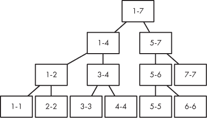

*图 8-19：一个七元素数组的段树*

将清单 8-14 中的代码添加到你的程序中。

现在，让我们考虑如何填充每个节点，使其包含其段内两个元素的最大和。假设我们已经找到了节点 1-2 中两个元素的最大和，并且已经找到了节点 3-4 中两个元素的最大和。我们想要找出节点 1-4 中两个元素的最大和。我们该怎么做呢？

当我们在解决 RMQ 时，生活是轻松的，因为一个节点的最大值就是其子节点的最大值。例如，如果左子树中的最大值是 10，右子树中的最大值是 6，那么它们的父节点的最大值就是 10。没有什么意外。相比之下，使用这个“两个元素的最大和”段树时，情况有点奇怪。

假设我们有这四个序列元素：10、8、6 和 15。段 1-2 中两个元素的最大和是 18，而段 3-4 中两个元素的最大和是 21。那段 1-4 的答案是 18 还是 21？都不对！答案是 10 + 15 = 25。如果我们只知道左边的 18 和右边的 21，我们无法推算出 25。我们需要左右子节点告诉我们更多关于它们段的信息——不仅仅是“嘿，这是我两个元素的最大和”。

需要明确的是，有时候仅仅从每个子节点获取两个元素的最大和*确实*足够了。考虑这个序列：10、8、6 和 4。段 1-2 中两个元素的最大和是 18，而段 3-4 中两个元素的最大和是 10。段 1-4 中两个元素的最大和是 18，恰好是其子段 1-2 的答案——但那是运气好！

一个段的两个元素的最大和至多有三种选择。（如果节点的子节点没有有效的最大和，则选项少于三种。）这些选项如下：

**选项 1**   最大和在左子节点。这就像我们刚才做的幸运情况。我们从左子节点得到答案。

**选项 2**   最大和在右子节点。这是另一个幸运的情况，答案就是右子节点给我们的。

**选项 3**   最大和包括来自左子节点和右子节点的一个元素。这需要更多的工作，因为答案不是子节点的最大和之一。这正是我们需要从子节点获得更多信息的地方。

如果某段的最大两元素和由左侧的一个元素和右侧的一个元素组成，那么它必须使用左侧的最大元素和右侧的最大元素。让我们回到序列 10、8、6 和 15。这里的最大和是一个例子，涉及左侧的一个元素（10）和右侧的一个元素（15）。注意，这些分别是左侧和右侧段中的最大元素。没有办法从每一侧取一个元素，比这更好。

现在我们看到段树节点提供了什么信息。除了外界关心的——两个元素的最大和——我们还需要单独的最大元素。这两部分关于子段的信息结合起来，帮助我们填写父段的信息。

图 8-20 展示了为数组构建的一个段树示例。注意，每个节点包含 maxsum（两个元素的最大和）和 maxelm（最大元素）。

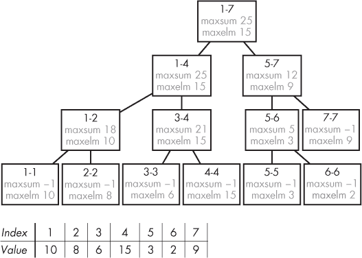

*图 8-20：段树及其对应的数组*

计算每个节点的最大元素是我们知道如何做的：这正是我们在构建 Treaps 时解决的 RMQ 问题。

这就留下了每个节点的最大两元素和。首先，我们将包含单元素段（如 1-1、2-2 等）的节点的最大和设置为特殊值 –1。这样做的原因是，这些段中甚至没有两个元素可以选择！–1 提醒我们，父节点的最大和不能是这个子节点的最大和。

每个其他节点的最大和是基于其子节点的最大和来设置的。考虑节点 1-7。它有三个选择来获得最大和。我们可以从左子节点获得最大和 25，或者从右子节点获得最大和 12，或者从左子节点获得最大元素 15，右子节点获得最大元素 9，然后将两者加起来得到 15 + 9 = 24。在这三者中，25 是最大的数字，所以我们选择它。

我们特别处理假设的 –1 最大和值，以突出显示这些值不能作为父节点最大和的选项。请留意接下来的代码。

我们将使用一个结构体来表示段树节点：

```
typedef struct segtree_node {
  int left, right;
  int max_sum, max_element;
} segtree_node;
```

我们将使用另一个结构体来表示我们从 `fill_segtree` 和 `query_segtree` 函数中返回的内容：

```
typedef struct node_info {
  int max_sum, max_element;
} node_info;
```

我们需要 `node_info`，因为它允许我们同时返回最大和和最大元素；如果没有结构体，只返回一个整数是远远不够的。

用于计算每个段的最大和和最大元素的代码见列表 8-19。

```
int max(int v1, int v2) {
  if (v1 > v2)
    return v1;
  else
    return v2;
}

node_info fill_segtree(segtree_node segtree[], int node,
                       int seq[]) {
  node_info left_info, right_info;

❶ if (segtree[node].left == segtree[node].right) {
     segtree[node].max_sum = -1;
     segtree[node].max_element = seq[segtree[node].left];
  ➋ return (node_info){segtree[node].max_sum, segtree[node].max_element};
   }

➌ left_info = fill_segtree(segtree, node * 2, seq);
   right_info = fill_segtree(segtree, node * 2 + 1, seq);

➍ segtree[node].max_element = max(left_info.max_element,
                                   right_info.max_element);

➎ if (left_info.max_sum == -1 && right_info.max_sum == -1)
  ➏ segtree[node].max_sum = left_info.max_element +
                             right_info.max_element;

❼ else if (left_info.max_sum == -1)
     segtree[node].max_sum = max(left_info.max_element +
                                 right_info.max_element,
                                 right_info.max_sum);

❽ else if (right_info.max_sum == -1)
     segtree[node].max_sum = max(left_info.max_element +
                                 right_info.max_element,
                                 left_info.max_sum);

  else
 ❾ segtree[node].max_sum = max(left_info.max_element +
                                right_info.max_element,
                                max(left_info.max_sum, right_info.max_sum));
  return (node_info){segtree[node].max_sum, segtree[node].max_element};
}
```

*清单 8-19：添加最大和最大元素*

当区间仅包含一个元素时，我们进入基准情况 ❶。我们将最大和设置为特殊的`-1`值，这表示此处没有有效的两个元素的和，并且我们将最大元素设置为区间内的唯一元素。然后我们返回最大和和最大元素 ➋。

否则，我们进入递归情况。我们使用`left_info`来保存左区间的信息，使用`right_info`来保存右区间的信息。每个变量都通过递归调用进行初始化 ➌。

如我们所讨论的，区间内的最大元素就是左侧区间的最大元素和右侧区间的最大元素中的最大值 ➍。

现在考虑两个元素的最大和。如果两个子节点都没有最大和 ➎，那么我们知道每个子节点的区间只包含一个元素。此父节点因此只有两个元素在其区间内，将这些元素相加是得到最大和的唯一选择 ➏。

接下来，如果左子节点只有一个元素而右子节点有多个元素 ❼，我们该怎么做呢？此时我们有两个选择来确定父节点的最大和。第一个选择是将每一半的最大元素相加。第二个选择是取右区间的最大和。我们使用`max`来选择这两者中的最佳方案。当右子节点只有一个元素，而左子节点有多个元素时，情况类似 ❽。

最后的情况是当两个子节点都有多个元素 ❾。此时我们有三种选择：从每一半中添加最大元素，取左区间的最大和，或取右区间的最大和。

#### *查询区间树*

我们刚刚做的填充区间信息的工作现在将在查询区间树的代码中再次派上用场。见清单 8-20。

```
node_info query_segtree(segtree_node segtree[], int node,
                        int seq[], int left, int right) {
  node_info left_info, right_info, ret_info;

❶ if (right < segtree[node].left || left > segtree[node].right)
     return (node_info){-1, -1};

➋ if (left <= segtree[node].left && segtree[node].right <= right)
     return (node_info) {segtree[node].max_sum, segtree[node].max_element};

   left_info = query_segtree(segtree, node * 2, seq, left, right);
   right_info = query_segtree(segtree, node * 2 + 1, seq, left, right);

   if (left_info.max_element == -1)
     return right_info;
   if (right_info.max_element == -1)
     return left_info;

   ret_info.max_element = max(left_info.max_element, right_info.max_element);

   if (left_info.max_sum == -1 && right_info.max_sum == -1) {
     ret_info.max_sum = left_info.max_element + right_info.max_element;
     return ret_info;
   }

   else if (left_info.max_sum == -1) {
     ret_info.max_sum = max(left_info.max_element + right_info.max_element,
                            right_info.max_sum);
     return ret_info;
   }

   else if (right_info.max_sum == -1) {
     ret_info.max_sum = max(left_info.max_element + right_info.max_element,
                            left_info.max_sum);
     return ret_info;
   }

   else {
     ret_info.max_sum = max(left_info.max_element + right_info.max_element,
                            max(left_info.max_sum, right_info.max_sum));
     return ret_info;
   }
}
```

*清单 8-20：查询区间树*

这段代码的结构与清单 8-16 中的 RMQ 代码相似。如果节点的区间与查询范围完全没有交集 ❶，我们返回一个结构，其中最大和和最大元素均为`-1`。我们可以使用`-1`作为最大元素的特殊值，告诉我们没有来自递归调用的信息。

如果节点的区间完全位于查询范围内 ➋，那么我们返回该节点的最大和和最大元素。

最后，如果节点的区间与查询范围部分重叠，那么我们遵循与在清单 8-19 中填充区间信息时相同的逻辑。

#### *更新区间树*

当序列数组的一个元素被更新时，我们必须调整区间树以保持同步。否则，对区间树的查询将使用现在已经过时的数组元素，因此可能会得出与当前数组内容不符的结果。

一种选择是从头开始，忽略树中已有的任何段信息。我们可以通过每次更新数组元素时重新执行代码清单 8-19 来实现。这当然可以使段树恢复到最新状态，因此正确性不是问题。

效率是一个问题，然而！重建段树需要 *O*(*n*) 时间。若仅有 *q* 次更新操作，没有任何查询操作，就可能大大降低我们的性能。这样，*n* 的工作需要执行 *q* 次，总的性能复杂度为 *O*(*nq*)。如果你考虑到没有段树时更新的成本，尤其让人沮丧：它们在数组上是常数时间操作！我们无法承受将常数时间换成线性时间。然而，我们 *可以* 将常数时间换成对数时间，因为后者非常接近常数时间。

我们逃避线性时间工作的方式是认识到，在更新数组的某个元素时，只需要更新少量的段树节点。拆卸整个树来进行一次更新，实在是过度反应了。

让我通过例子来解释我的意思。这里再次展示图 8-20：

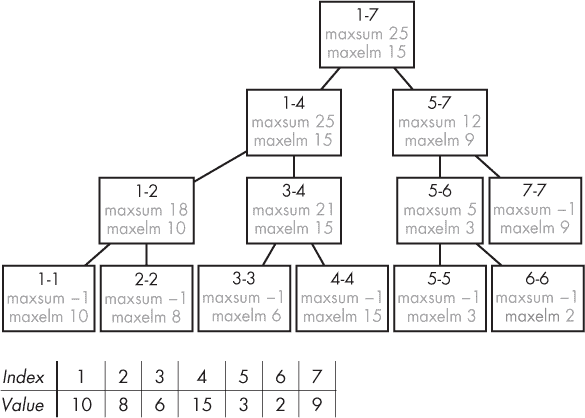

现在，假设下一个操作是 `U 4 1`，意味着序列的索引 4 应该被更改为值 1（原本是 15）。新的段树和数组如 图 8-21 所示。

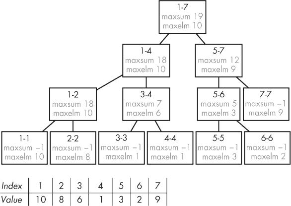

*图 8-21：段树及其对应的数组，展示数组更新后的状态*

注意，只有三个节点发生了变化。节点 4-4 必须变化，因为它所在段的唯一元素发生了改变。然而，这个变化的影响不能扩展得太远：唯一能够变化的节点是 4-4 的祖先节点，因为只有它们的段中才包含索引 4！实际上，在这个例子中，你可以确认，发生变化的节点仅为三个祖先节点：3-4、1-4 和 1-7。因此，最糟糕的情况下，我们从树的叶子节点走到根节点，沿路径更新节点。由于树的高度为 *O*(log *n*)，所以该路径上只有 *O*(log *n*) 个节点。

只要我们不在段树中对无效部分进行递归浪费时间，最终的更新过程将是 *O*(log *n*)。代码清单 8-21 给出了相关代码。

```
node_info update_segtree(segtree_node segtree[], int node,
                         int seq[], int index) {
  segtree_node left_node, right_node;
  node_info left_info, right_info;

❶ if (segtree[node].left == segtree[node].right) {
     segtree[node].max_element = seq[index];
     return (node_info) {segtree[node].max_sum, segtree[node].max_element};
  }

  left_node = segtree[node * 2];
  right_node = segtree[node * 2 + 1];

➋ if (index <= left_node.right ) {
  ➌ left_info = update_segtree(segtree, node * 2, seq, index);
➍ right_info = (node_info){right_node.max_sum, right_node.max_element};
 } else {
   right_info = update_segtree(segtree, node * 2 + 1, seq, index);
   left_info = (node_info){left_node.max_sum, left_node.max_element};
 }

 segtree[node].max_element = max(left_info.max_element,
                                 right_info.max_element);

 if (left_info.max_sum == -1 && right_info.max_sum == -1)
   segtree[node].max_sum = left_info.max_element +
                           right_info.max_element;

 else if (left_info.max_sum == -1)
   segtree[node].max_sum = max(left_info.max_element +
                               right_info.max_element,
                               right_info.max_sum);

 else if (right_info.max_sum == -1)
   segtree[node].max_sum = max(left_info.max_element +
                               right_info.max_element,
                               left_info.max_sum);

  else
    segtree[node].max_sum = max(left_info.max_element +
                                right_info.max_element,
                                max(left_info.max_sum, right_info.max_sum));
 return (node_info) {segtree[node].max_sum, segtree[node].max_element};
}
```

*代码清单 8-21：更新段树*

这个函数设计为在给定 `index` 位置的数组元素已经更新之后调用。每次调用此函数时，必须确保 `node` 是一个段树的根节点，并且该段树的段包含 `index`。

我们的基本情况是当线段仅包含一个元素 ❶。由于我们不会进行递归调用，除非`index`在节点的线段内，因此我们知道这个线段正好包含我们所需的索引。因此，我们将节点的`max_element`更新为`seq[index]`中当前存储的值。我们不更新`max_sum`：它保持为`-1`，因为这个线段仍然只有一个元素。

现在假设我们不在基本情况中。我们有一个节点，并且我们知道其元素之一——`index`——已经被更新。那么，完全没有理由进行*两次*递归调用，因为节点的子节点中只有一个可以包含更新后的元素。如果`index`在左子节点中，那么我们想在左子节点上进行递归调用来更新左子树。如果`index`在右子节点中，那么我们想在右子节点上进行递归调用来更新右子树。

为了确定`index`属于哪个子节点，我们将其与左子节点的最右端索引进行比较。如果`index`在左子节点的段落结束之前 ➋，那么我们需要在左侧进行递归调用；否则，我们需要在右侧进行递归调用。

让我们稍微谈谈在左侧进行递归调用的情况➌；右侧递归调用的`else`分支是类似的。我们进行递归调用来更新左子树，并返回更新后的信息。对于右子树，我们只需继承原来的内容 ➍——那里没有更新发生，所以不会有变化。

剩下的代码与清单 8-19 类似。

#### *主要功能*

我们现在准备使用我们改进过的线段树来解决问题。`main`函数的代码在清单 8-22 中给出。

```
#define MAX_SEQ 100000

int main(void) {
  static int seq[MAX_SEQ + 1];
  static segtree_node segtree[MAX_SEQ * 4 + 1];
  int num_seq, num_ops, i, op, x, y;
  char c;
  scanf("%d", &num_seq);
  for (i = 1; i <= num_seq; i++)
    scanf("%d", &seq[i]);
  init_segtree(segtree, 1, 1, num_seq);
  fill_segtree(segtree, 1, seq);
  scanf("%d", &num_ops);
  for (op = 0; op < num_ops; op++) {
    scanf(" %c%d%d ", &c, &x, &y);

 ❶ if (c == 'U') {
      seq[x] = y;
      update_segtree(segtree, 1, seq, x);

 ➋ } else {
     printf("%d\n", query_segtree(segtree, 1, seq, x, y).max_sum);
    }
  }
  return 0;
}
```

*清单 8-22：用于读取输入并解决问题的主要函数*

这里唯一需要强调的是处理操作的逻辑。如果下一个操作是更新操作 ❶，我们通过更新数组元素并随后更新线段树来响应。否则，操作是查询操作 ➋，我们通过查询线段树来响应。

是时候提交代码了。评测系统应该会喜欢这个快速、基于线段树的解决方案。

### 总结

在本章中，我们学习了如何实现和使用堆和线段树。像所有有用的数据结构一样，这些数据结构支持少数几个高效的操作。通常，数据结构并不会单独解决问题。更典型的是，你已经有了一个速度合理的算法，而数据结构帮助你使其更高效。例如，我们在第六章中实现的 Dijkstra 算法已经做得很好，但如果加上一个最小堆，它会做得更好。

每当你重复执行相同类型的操作时，你应该寻找机会通过数据结构来增强你的算法。你是在数组中查找指定的元素吗？那么哈希表就是你需要的。你是在寻找最大值或最小值吗？那就用堆吧。你是在查询数组的区间吗？那就使用线段树。那如果你要判断两个元素是否在同一集合中呢？嗯，那你得看下一章了！

### 注释

超市促销问题最初来自 2000 年波兰信息学奥林匹克竞赛，第三阶段。构建 Treap 最初来自 2004 年乌尔姆大学本地竞赛。两数之和最初来自 2009 年库鲁克舍特拉在线编程竞赛。

关于线段树和许多其他数据结构的更多内容，我推荐 Matt Fontaine 的*Algorithms Live!*系列视频（见* [`algorithms-live.blogspot.com`](http://algorithms-live.blogspot.com) *）。Matt 的线段树视频让我想到了在每个节点中显式地存储`left`和`right`区间索引。（你看到的大部分线段树代码都没有这样做，而是将这些索引作为额外的函数参数传递，这让我总是很难理清楚。）
