## 第九章：UNION-FIND**


我们在 第五章 和 第六章 中使用了邻接表数据结构及其算法来解决图的问题。这是一个高效的数据结构，无论是哪种图问题都能使用。然而，如果我们限制要解决的问题类型，我们可以设计出更高效的数据结构。限制问题的范围稍微一点，我们可能就无法做得比邻接表更好。限制得太多，几乎没人会使用我们的数据结构，因为它解决不了他们关心的问题。限制问题的范围恰到好处，你就得到了合并查找（union-find）数据结构，这是本章的主题。它解决图问题——并非所有问题，只有一些。对于它能够解决的问题，它的效率远高于通用图数据结构。

跟踪社交网络中的社区、维护朋友与敌人的群体、以及将物品组织到指定的抽屉中，都是图问题。重要的是，这些问题是特殊的图问题，可以通过使用合并查找方法以惊人的速度解决。让我们开始吧！

### 问题 1：社交网络

这是 SPOJ 问题 `SOCNETC`。

#### *问题*

你被要求编写一个程序，跟踪社交网络中的人和社区。

总共有 *n* 个人，编号为 1, 2, …, *n*。

*社区* 是一个人加上这个人的朋友、朋友的朋友、朋友的朋友的朋友，以此类推。例如，如果人 1 和人 4 是朋友，而人 4 和人 5 是朋友，那么这个社区就包含这三个人：1、4 和 5。处于同一社区的人彼此之间都是朋友。

每个人从一个孤立的社区开始；随着人与人之间友谊的建立，个人的社区可以逐渐扩大。

你的程序必须支持三种操作：

**Add**   使得两个提供的人成为朋友。如果这个操作发生，并且这些人在此之前不在同一个社区，那么现在他们将属于同一个（更大的）社区。

**Examine**   报告两个提供的人是否在同一个社区。

**Size**   报告提供的某个人所在社区中的人数。

你的程序将在资源有限的计算机上运行，因此有一个参数 *m*，给出了社区中最多可容纳的人数。我们要求忽略任何会导致社区人数超过 *m* 的 Add 操作。

##### 输入

输入包含一个测试用例，由以下几行组成：

+   输入一行，包含 *n*，表示社交网络中的人数，以及 *m*，表示一个社区允许的最大人数。*n* 和 *m* 的取值范围是 1 到 100,000 之间。

+   一行包含整数 *q*，表示接下来操作的数量。*q* 的取值范围是 1 到 200,000 之间。

+   *q* 行，每行对应一个操作。

每一行 *q* 可以是以下操作之一：

+   Add 操作的形式是 `A` x y，其中 x 和 y 是两个人。

+   Examine 操作的格式是`E` x y，其中 x 和 y 是两个人。

+   Size 操作的格式是`S` x，其中 x 是一个人。

##### **Output**

对于 Add 操作没有输出。每个 Examine 和 Size 操作的输出会在其单独的一行显示。

**Examine** 对于 Examine 操作，如果两个人在同一个社区中，输出`Yes`，否则输出`No`。

**Size** 对于 Size 操作，输出该人所在社区的人数。

解决该测试用例的时间限制为一秒。

#### *建模为图*

在第五章和第六章中，我们详细地练习了如何将问题框架转化为图的探索。我们弄清楚了该用什么作为节点，什么作为边，然后使用 BFS 或 Dijkstra 算法来探索图。

我们也可以将社交网络建模为图。节点代表社交网络中的人。如果测试用例告诉我们*x*和*y*是朋友，那么我们可以在节点*x*和节点*y*之间添加一条边。图是无向的，因为两个人之间的友谊是相互的。

与我们之前在第五章和第六章中解决的问题相比，一个关键的区别是社交网络图是动态的。每次我们处理两个尚未成为朋友的人的 Add 操作时，都会向图中添加一条新边。与第五章中的书籍翻译问题相比，这里我们最初就知道所有语言和翻译人员，因此可以一次性构建图并且不需要更新它。

我们通过一个测试用例来演示图的增长过程，并观察图如何帮助我们实现三个必需的操作（Add、Examine 和 Size）。如下所示：

```
7 6
11
A 1 4
A 4 5
A 3 6
E 1 5
E 2 5
A 1 5
A 2 5
A 4 3
S 4
A 7 6
S 4
```

我们从七个人和没有任何友谊连接开始，如下所示：


`A 1 4`操作使人员 1 和 4 成为朋友，因此我们在这两个节点之间添加了一条边：

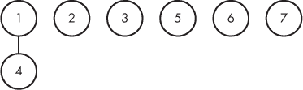

`A 4 5`操作同样适用于人员 4 和 5：

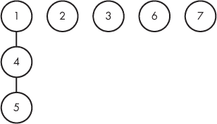

对于`A 3 6`，我们得到：

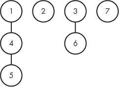

下一步操作是`E 1 5`，它询问人员 1 和 5 是否在同一个社区。图会为我们回答这个问题：如果从节点 1 到节点 5 有路径（或者从节点 5 到节点 1 也可以），那么他们在同一个社区；否则，他们不在同一个社区。在这种情况下，他们在同一个社区；从节点 1 到节点 4 再到节点 5 的路径就是从节点 1 到节点 5 的路径。

下一步操作是`E 2 5`。节点 2 和节点 5 之间没有路径，因此这两个人不在同一个社区中。

接下来是`A 1 5`，这将在节点 1 和节点 5 之间添加一条边。（注意我们如何交替进行修改图的操作和查询图的操作。）结果如下：

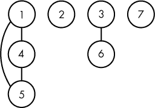

这条边的增加导致了一个环，因为它在两个已经属于同一社区的人之间增加了一个友谊链接。因此，这条新边对社区的数量或大小没有任何影响。我们本可以省略它，但我决定在这里包含所有允许的友谊链接。

现在考虑`A 2 5`，它确实将两个社区合并：

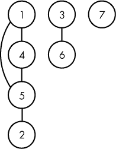

接下来是`A 4 3`，它再次将两个社区合并：

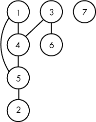

现在我们有了第一个 Size 操作：`S 4`。在人物 4 的社区中有多少人？这相当于确定从节点 4 可达的节点数。共有六个这样的节点，唯一不可达的节点是节点 7，因此答案是`6`。

现在，考虑`A 7 6`。我们必须添加节点 7 和 6 之间的边……等等！这条边会导致形成一个包含所有七个人的新社区，但测试用例强制要求任何给定社区的最大人数为六人。我们必须忽略这个 Add 操作。

因此，最后一个操作`S 4`的答案与之前相同：`6`。

我们的测试用例的正确输出是：

```
Yes
No
6
6
```

这个例子展示了实现每个操作所需的内容。对于 Add，我们将一条新边添加到图中，除非这条边会导致一个社区里的人数过多。对于 Examine，我们确定两个节点之间是否存在路径，或者等价地，是否一个节点可以从另一个节点到达。我们可以使用 BFS 来实现！对于 Size，我们确定从给定节点可达的节点数。我们可以再次使用 BFS！

#### *解决方案 1：BFS*

让我们分两步来看这个基于图的解决方案。首先，我将展示处理操作的`main`函数，随着操作的进行逐步构建图。然后，我将展示 BFS 代码。

##### 主函数

我们需要一个常量和一个结构体来开始：

```
#define MAX_PEOPLE 100000

typedef struct edge {
  int to_person;
  struct edge *next;
} edge;
```

`main`函数在清单 9-1 中给出。它读取输入，并通过逐步构建和查询图来响应操作。

```
int main(void) {
  static edge *adj_list[MAX_PEOPLE + 1] = {NULL};
  static int min_moves[MAX_PEOPLE + 1];
  int num_people, num_community, num_ops, i;
  char op;
  int person1, person2;
  edge *e;
  int size1, size2, same_community;
  scanf("%d%d", &num_people, &num_community);
  scanf("%d", &num_ops);

  for (i = 0; i < num_ops; i++) {
    scanf(" %c", &op);
 ❶ if (op == 'A') {
         scanf("%d%d", &person1, &person2);
      ➋ find_distances(adj_list, person1, num_people, min_moves);
      ➌ size1 = size(num_people, min_moves);
         same_community = 0;
      ➍ if (min_moves[person2] != -1)
           same_community = 1;
      ➎ find_distances(adj_list, person2, num_people, min_moves);
      ➏ size2 = size(num_people, min_moves);
      ❼ if (same_community || size1 + size2 <= num_community) {
           e = malloc(sizeof(edge));
           if (e == NULL) {
             fprintf(stderr, "malloc error\n");
             exit(1);
          }
          e->to_person = person2;
          e->next = adj_list[person1];
          adj_list[person1] = e;
          e = malloc(sizeof(edge));
          if (e == NULL) {
            fprintf(stderr, "malloc error\n");
            exit(1);
          }
          e->to_person = person1;
          e->next = adj_list[person2];
          adj_list[person2] = e;
        }
     }

   ❽ else if (op == 'E') {
        scanf("%d%d", &person1, &person2);
        find_distances(adj_list, person1, num_people, min_moves);
        if (min_moves[person2] != -1)
          printf("Yes\n");
        else
          printf("No\n");
     }

  ❾ else {
       scanf("%d", &person1);
       find_distances(adj_list, person1, num_people, min_moves);
       printf("%d\n", size(num_people, min_moves));
     }
  }
  return 0;
}
```

*清单 9-1：* main *函数，用于处理操作*

正如我们在第五章的书籍翻译中以及在第六章中的问题中所做的那样，我们使用图的邻接表表示法。

让我们看看代码如何处理这三种操作类型，首先从添加操作（Add ❶）开始。我们调用辅助函数`find_distances` ➋。正如我们稍后会看到的，这个函数实现了广度优先搜索（BFS）：它填充`min_moves`，找出从`person1`到每个人的图中最短路径，对于任何不可达的人，使用`-1`表示。然后，我们调用辅助函数`size` ➌，它使用`min_moves`中的距离信息来确定`person1`所在社区的大小。接下来，我们确定`person1`和`person2`是否在同一社区：如果`person2`可以从`person1`到达，那么它们就在同一个社区 ➍。我们需要这些信息来决定是否添加边：如果两个人已经在同一个社区，那么可以安全地添加这条边，而无需担心创建一个违反社区最大人数限制的社区。

找到`person1`的社区大小后，我们对`person2`的社区做相同的处理：首先对`person2`调用 BFS ➎，然后计算该社区的大小 ➏。

现在，如果没有新的社区，或者新的社区足够小 ❼，那么我们将边添加到图中。实际上，我们添加两条边，因为请记住，图是无向的。

其他操作的代码较少。对于检查操作（Examine ❽），我们运行 BFS 并检查`person2`是否可以从`person1`到达。对于大小操作（Size ❾），我们运行 BFS，然后计算从`person1`可达的节点数。

##### BFS 代码

我们在这里需要的 BFS 代码与我们在第五章中解决书籍翻译问题时编写的 BFS 代码非常相似，除了没有书籍翻译的费用。参见清单 9-2。

```
void add_position(int from_person, int to_person,
                  int new_positions[], int *num_new_positions,
                  int min_moves[]) {
  if (min_moves[to_person] == -1) {
    min_moves[to_person] = 1 + min_moves[from_person];
    new_positions[*num_new_positions] = to_person;
    (*num_new_positions)++;
  }
}

void find_distances(edge *adj_list[], int person, int num_people,
                    int min_moves[]) {
  static int cur_positions[MAX_PEOPLE + 1], new_positions[MAX_PEOPLE + 1];
  int num_cur_positions, num_new_positions;
  int i, from_person;
  edge *e;
  for (i = 1; i <= num_people; i++)
    min_moves[i] = -1;
  min_moves[person] = 0; cur_positions[0] = person;
  num_cur_positions = 1;

  while (num_cur_positions > 0) {
    num_new_positions = 0;
    for (i = 0; i < num_cur_positions; i++) {
      from_person = cur_positions[i];
      e = adj_list[from_person];

      while (e) {
        add_position(from_person, e->to_person,
                     new_positions, &num_new_positions, min_moves);
        e = e->next;
      }
    }

    num_cur_positions = num_new_positions;
    for (i = 0; i < num_cur_positions; i++)
      cur_positions[i] = new_positions[i];
  }
}
```

*清单 9-2：使用 BFS 查找最短距离*

##### 查找社区的大小

最后一个需要编写的辅助函数是`size`，它返回给定人所在社区的人数。参见清单 9-3。

```
int size(int num_people, int min_moves[]) {
  int i, total = 0;
  for (i = 1; i <= num_people; i++)
    if (min_moves[i] != -1)
      total++;
  return total;
}
```

*清单 9-3：一个人社区的大小*

在这个函数中，假设`min_moves`已经由`find_distances`填充。每个`min_moves`值不是`-1`的人，因此都是可达的。我们使用`total`来累加这些可达的人。

就是这样：一个基于图的解决方案。对于每个*q*操作，我们运行一次 BFS。最坏情况下，每个操作都会向图中添加一条边，因此每次 BFS 调用的工作量最多为*q*。因此，我们有一个*O*(*q*²)的算法，即二次算法。

在第五章中，我建议你不要运行太多次 BFS。最好如果能做到的话只调用一次 BFS。即使是少数几次调用也可以。毕竟，在解决第 151 页的骑士追击问题时，我们通过为每个棋子位置调用一次 BFS 来避免了重复。相同的想法适用于第六章中的 Dijkstra 算法：尽量少调用。在这里，少数几次调用也是可以的。我们在第 198 页上用约 100 次 Dijkstra 调用解决了老鼠迷宫问题，速度已经足够快。过度使用图搜索还没有让我们付出代价。

然而，这个问题现在确实让我们吃到了苦头。如果你将解决方案提交给评审，你会收到一个“超时限制”错误——而且甚至离超时还差得远。我正在我的笔记本上玩一个示例，社交网络中有 100,000 个人和 200,000 个操作。这些操作在添加（Add）、检查（Examine）和大小（Size）操作之间平均分配。我们的基于图的解决方案需要超过两分钟才能运行。你即将学习一种名为并查集（union-find）的新数据结构，在同一个示例上，它的运行速度快了 300 倍。并查集是一个效率怪兽。

#### *并查集（Union-Find）*

由于两个原因，图上的广度优先搜索（BFS）并不是解决社交网络问题的一个理想方案。首先，它生成了太多！它会确定人之间的最短路径。例如，它可能会告诉我们，人 1 和人 5 之间的最短路径是 2，但谁在乎呢？我们只想知道两个人是否在同一个社区里。它们是如何最终进入同一个社区的，以及连接它们的友谊链并不重要。

其次，它记住的太少——或者说，它根本不记得：BFS 在每次调用时都会从头开始。但是，想一想这有多浪费。例如，添加操作仅向图中添加一条边。社区不可能与之前有太大的不同。BFS 根本不利用过去的信息，而是重新处理整个图，在下一个操作时从头开始。

目标是设计一个数据结构，它不记住任何关于最短路径的信息，并且在建立新友谊时只做一点点工作。

##### 操作

添加（Add）操作将两个社区合并为一个。（嗯，当合并后的社区过大或者两个人已经在同一个社区时，它什么都不做，但如果它有作用，它会将两个社区合并。）这种操作在算法世界中被称为*并集（Union）*。通常，*并集*通过一个更大的集合替代两个集合，包含它们的所有元素。

检查操作告诉我们两个提供的人是否在同一个社区。实现这一点的一种方法是指定每个社区的一个元素作为其*代表*元素。例如，一个包含人物 1、4 和 5 的社区可能将 4 作为其代表；一个包含人物 3 和 6 的社区可能将 3 作为其代表。人物 1 和 5 在同一个社区吗？是的，因为人物 1 所在社区的代表（4）与人物 5 所在社区的代表（4）相同。人物 4 和 6 在同一个社区吗？不是，因为人物 4 所在社区的代表（4）与人物 6 所在社区的代表（3）不同。

确定一个人的社区代表被称为*查找（Find）*。我们可以通过两个查找来实现检查（Examine）：查找第一个人的社区代表，查找第二个人的社区代表，然后进行比较。

由于 Add 是合并操作，Examine 是查找操作，因此实现这两种操作的数据结构被称为*并查集（union-find）*数据结构。

一旦我们实现了合并和查找操作，我们就能够很好地支持大小操作了。我们所做的就是存储每个社区的大小，并确保在进行合并时更新大小。然后，我们就可以通过返回相应社区的大小来响应每个大小操作。

##### 基于数组的方法

一种思路是使用一个数组`community_of`，该数组表示每个人所属社区的代表。例如，如果人物 1、2、4 和 5 在同一个社区，人物 3 和 6 在同一个社区，人物 7 有自己的社区，那么数组可能是这样的：

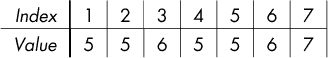

对于一个只有一个人的社区，代表没有选择的余地。这就是为什么人物 7 的代表是 7。对于一个有多人的社区，代表可以是社区中的任何人。例如，这次我们使用 6 作为代表，但我们也可以使用 3。

使用这个方案，我们可以在常数时间内实现查找操作。我们所做的就是查找目标人物的代表，如下所示：

```
int find(int person, int community_of[]) {
  return community_of[person];
}
```

你做不到比这更好了！

不幸的是，当我们实现合并操作时，这个方案就会失效。我们唯一的选择是将一个社区的所有代表换成另一个社区的代表。它看起来是这样的：

```
void union_communities(int person1, int person2,
                       int community_of[], int num_people) {
  int community1, community2, i;
  community1 = find(person1, community_of);
  community2 = find(person2, community_of);
  for (i = 1; i <= num_people; i++)
    if (community_of[i] == community1)
      community_of[i] = community2;
}
```

我在这里忽略了社交网络社区的最大大小限制，以避免分散注意力。代码使用`find`将`community1`和`community2`分别设置为`person1`和`person2`所在社区的代表。然后，它遍历所有人，将`community1`中的任何人更改为`community2`。其效果是`community1`被吸收到`community2`中，`community1`消失。

如果你基于我在这里给出的代码构建并提交了完整的解决方案，你应该会看到它仍然会出现“超时限制”错误。我们需要一种比遍历所有人员更好的方法来联合两个社区。

##### 基于树的方法

最高效的联合查找数据结构是基于树的。每个集合表示为一棵树，树的根节点作为该集合的代表。我将通过图 9-1 中的示例来描述这如何运作。

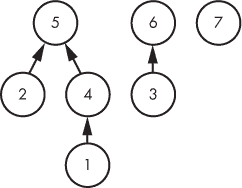

*图 9-1：基于树的联合查找数据结构*

这里有三棵树，因此有三个不同的社区：一个社区有人物 1、2、4 和 5；一个社区有人物 3 和 6；一个社区有人物 7。每棵树的根节点——人物 5、6 和 7——作为社区的代表。

我用箭头表示树的边，从子节点指向父节点。你之前在本书中没见过这种表示方式。现在这么做是为了强调我们在导航这些树时的方式。当我描述如何在树中支持查找（Find）和联合（Union）时，我们会看到有必要向上移动树（从子节点到父节点），而不是向下移动。

我们从查找（Find）开始。给定一个人，我们需要返回这个人的代表。我们可以通过向上移动适当的树结构，直到到达根节点。例如，让我们在图 9-1 中找到人物 1 的代表。由于 1 不是根节点，我们移动到 1 的父节点。人物 4 不是根节点，所以我们继续移动到 4 的父节点。人物 5 是根节点，所以我们结束了：5 是 1 的代表。

将这种“跳树”方法与我们在第 341 页的“基于数组的方法”进行对比。在基于数组的方法中，我们只需一步查找代表，而在树结构中，我们必须向上移动树直到找到根节点。这听起来有些危险——如果树变得非常高怎么办？——但我们很快会看到这种担忧是多余的，因为我们能够控制树的高度。

现在让我们来谈谈联合（Union）。给定两个人，我们希望将他们的两棵树合并。从正确性的角度来看，如何将两棵树合并并不重要。然而，正如在查找的上下文中提到的，保持树的高度较小是有帮助的。如果我们将一棵树插入到另一棵树的底部，可能会不必要地增加合并树的高度。为了避免这种情况，我们将一棵树直接插入到另一棵树的根节点下。想要了解这种方式的效果，请参见图 9-2，我已经将根节点为 5 的树与根节点为 6 的树进行了合并。

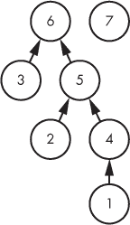

*图 9-2：联合后基于树的联合查找数据结构*

我选择将 6 作为合并树的根节点。我们也可以选择将 5 作为合并树的根节点。（这里有个小提示：为什么 5 会是更好的选择？我们在讨论联合查找优化时会看到原因。）

现在我们有足够的信息来设计解决社交网络问题的并查集方案。

#### *解法 2：并查集*

在第八章讨论了堆和线段树之后，你可能不会惊讶我们将把并查集数据结构存储在一个数组中！

并查集树不一定是二叉树，因为它们的节点可以有任意数量的子节点。所以我们不能像在第八章那样通过乘 2 或除 2 来移动这些树。但幸运的是，我们只需要支持从子节点到父节点的遍历。我们所需要的只是一个数组，它将任何给定的节点映射到它的父节点。我们可以使用`parent`数组来做到这一点，其中`parent[i]`给出节点`i`的父节点。

回想一下图 9-1，我们有三个社区：一个包含人物 1、2、4 和 5；一个包含人物 3 和 6；另一个包含人物 7。下面是与该图对应的`parent`数组：

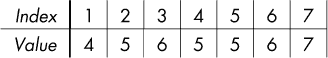

如果我们想找到人物 1 所在社区的代表，该怎么办呢？索引 1 的值是 4，这告诉我们 4 是 1 的父节点；索引 4 的值是 5，这告诉我们 4 的父节点是 5；索引 5 的值是 5，这意味着 5 是……5 的父节点？当然不是！每当`parent[i]`的值与`i`相同，就意味着我们已经到达了树的根节点。（区分根节点的另一种常见技巧是使用`-1`，因为它不能与有效的数组索引混淆。虽然我在本书中不会使用它，但你可能会在你找到的其他代码中遇到它。）

##### 主函数

现在我们准备好一些代码了。让我们从清单 9-4 中给出的`main`函数开始。（它比清单 9-1 简短得多。一般来说，并查集的代码比较简洁。）

```
int main(void) {
❶ static int parent[MAX_PEOPLE + 1], size[MAX_PEOPLE + 1];
   int num_people, num_community, num_ops, i;
   char op;
   int person1, person2;
   scanf("%d%d", &num_people, &num_community);
➋ for (i = 1; i <= num_people; i++) {
     parent[i] = i;
     size[i] = 1;
   }
   scanf("%d", &num_ops);

   for (i = 0; i < num_ops; i++) {
     scanf(" %c", &op);

     if (op == 'A') {
       scanf("%d%d", &person1, &person2);
     ➌ union_communities(person1, person2, parent, size, num_community);
     }

     else if (op == 'E') {
       scanf("%d%d", &person1, &person2);
     ➍ if (find(person1, parent) == find(person2, parent))
         printf("Yes\n");
       else
         printf("No\n");
     }

     else {
       scanf("%d", &person1);
     ➎ printf("%d\n", size[find(person1, parent)]);
     }
  }
 return 0;
}
```

*清单 9-4：处理操作的* main *函数*

除了我已经描述过的`parent`数组外，还有一个`size`数组 ❶。对于每个代表节点`i`，`size[i]`表示该社区中的人数。切记不要使用非代表节点查询社区的大小。一旦某人不是代表节点，我们就不会再更新`size`值了。

使用`for`循环来初始化`parent`和`size` ➋。对于`parent`数组，我们让每个人都是自己的代表，这相当于让每个人都在自己的集合中。由于每个集合只有一个人，我们将每个`size`值设置为 1。

为了实现 Add，我们调用`union_communities`辅助函数 ➌。它将`person1`和`person2`的社区联合起来，前提是遵循`num_community`的大小约束。我们很快会看到它的代码。

为了实现 Examine，我们调用两次`find` ➍。如果两次调用返回相同的值，那么这些人属于同一个社区；否则，他们不属于同一个社区。

最后，为了实现 Size，我们使用`size`数组，查找该人的集合代表 ➎。

接下来，我将提供 `find` 和 `union_communities` 的实现，这将完成该实现。

##### find 函数

`find` 函数以一个人作为参数，并返回该人的代表。请参阅 清单 9-5。

```
int find(int person, int parent[]) {
  int community = person;
  while (parent[community] !=  community)
    community = parent[community];
  return community;
}
```

*清单 9-5：* find *函数*

`while` 循环会不断向上遍历树，直到找到根节点。这个根节点代表了该社区，因此返回该根节点。

##### union 函数

`union_communities` 函数接收两个人，除了 `parent` 数组、`size` 数组和 `num_community` 限制之外，还将他们的两个社区合并。（我本来想将这个函数命名为 `union`，但因为 `union` 是 C 语言的保留字，所以不允许这么命名。）请参阅 清单 9-6 了解代码。

```
void union_communities(int person1, int person2, int parent[],
                       int size[], int num_community) {
  int community1, community2;
 ❶ community1 = find(person1, parent);
  ➋ community2 = find(person2, parent);
     if (community1 != community2 &&
         size[community1] + size[community2] <= num_community) {
    ➌ parent[community1] = community2;
    ➍ size[community2] = size[community2] + size[community1];
  }
}
```

*清单 9-6：* union_communities *函数*

首先，我们为每个人的社区找到代表 ❶ ➋。并操作需要满足两个条件：首先，两个社区必须不同；其次，两个社区的大小之和不能超过最大允许的社区大小。如果这两个条件都满足，那么我们就执行并操作。

我选择将 `community1` 合并到 `community2` 中。也就是说，`community1` 将消失，`community2` 将吸收 `community1`。为了实现这一点，我们必须适当修改 `parent` 和 `size`。

在这个并操作之前，`community1` 是一个社区的根节点，但现在我们希望 `community1` 以 `community2` 作为其父节点。所以，这正是我们要做的 ➌！任何之前以 `community1` 为代表的人，现在将以 `community2` 为代表。

在 `size` 方面，`community2` 拥有它之前所有的人，以及它从 `community1` 继承来的所有人。因此，大小是之前的大小加上 `community1` 的大小 ➍。

就这些！请随意将这个解决方案提交给评测系统。它应该在时间限制内完成并通过所有测试用例。

不过，我也许原本希望它没有在时间限制内通过——因为我手上有两个高级的并查集优化，我真的很想教给你们。

嘿，咱们就做这些吧！虽然对于这个问题可能有点过头，但它们能提供如此大的速度提升，所以我们会在本章中贯穿使用这些优化，再也不必担心时间限制了。

#### *优化 1：按大小合并*

我们的并查集解决方案通常运行得很快，但也可以设计出让它运行缓慢的测试用例。以下是最糟糕的测试用例：

```
7 7
7
A 1 2
A 2 3
A 3 4
A 4 5
A 5 6
A 6 7
E 1 2
```

社区 1 和社区 2 合并后，得到的社区与社区 3 合并，得到的社区与社区 4 合并，依此类推。经过六次并操作后，我们得到如 图 9-3 所示的树形结构。


*图 9-3：基于树的并查集数据结构的一个糟糕案例*

我们有一条很长的节点链，遗憾的是，Find 和 Union 操作可能最终遍历整个链条。例如，`E 1 2`会对人物 1 和人物 2 执行 Find 操作，每次都几乎访问所有节点。当然，七个节点的链条很小，但我们可以复制合并模式，生成任意长度的巨大链条。这样，我们可以迫使 Find 和 Union 操作变为线性时间；如果总共有 *q* 次操作，我们可以迫使基于树的并查集算法花费 *O*(*q*²) 的时间。这意味着，在最坏情况下，基于树的解决方案在理论上不比 BFS 更好。它在实践中优于 BFS，因为大多数测试用例不会生成长链条的节点……但某些测试用例可能会！

等一下！为什么我们要让这些专横的测试用例逼迫我们生成这些糟糕的树结构？我们不关心并查集数据结构的外观。特别是，每当执行 Union 操作时，我们可以选择哪个旧的代表节点成为合并后的社区的代表。与其总是把第一个社区并入第二个社区，我们应该做出选择，生成最佳的树形结构。将图 9-3 的乱象与图 9-4 的美妙效果做比较。

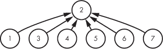

*图 9-4：一种优化过的基于树的并查集数据结构*

人物 2 是根节点，其他所有人都只与它相差一条边。不管接下来执行的是 Union 还是 Find，我们都能非常高效地完成操作。

如何让我们的代码生成图 9-4 而不是图 9-3 呢？这种优化叫做*按大小合并*。每当你准备合并两个社区时，应该将人数较少的社区合并到人数较多的社区中。

在我们讨论的测试用例中，我们从`A 1 2`开始。两个社区各有一个人，所以选择保留哪一个并不重要；我们选择保留社区 2。现在社区 2 有了两个人：它原本的成员和来自社区 1 的成员。接下来执行`A 2 3`时，我们比较社区 2（大小为 2）与社区 3（大小为 1）。我们会保留社区 2，因为它比社区 3 大。现在社区 2 有了三个人。那么`A 3 4`呢？这给社区 2 带来了一个新成员。我们继续进行操作，将一个又一个人并入社区 2。

按大小合并确实可以中和最糟糕的测试用例，但仍然有一些测试用例的树结构需要进一步优化，从节点到根的路径还很长。比如：

```
9 9
9
A 1 2
A 3 4
A 5 6
A 7 8
A 8 9
A 2 4
A 6 8
A 4 8
E 1 5
```

按大小合并产生了图 9-5。

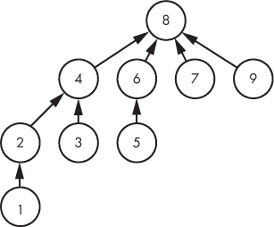

*图 9-5：按大小合并的一个糟糕案例*

虽然有些节点确实位于根节点下方，但现在还有一些节点离根更远（最严重的就是节点 1）。不过，树形结构相当平衡，显然比我们在按大小合并优化之前看到的长链结构要好。

接下来，我将展示使用按大小合并时树的最大高度是*O*(log *n*)，其中*n*是总人数。这意味着 Find 或 Union 操作需要*O*(log *n*)的时间，因为 Find 只是沿树向上遍历，而 Union 只是执行两个 Find 操作并更改父节点。

假设我们选择一个任意节点* x *，并思考* x *与其根节点之间的边数可以增加多少次。当* x *的社区吸收另一个社区时，* x *与其根节点之间的边数不变，因为它所在社区的根节点保持不变。然而，当* x *的社区被另一个社区吸收时，* x *和其新根节点之间的边数比之前多一个：从* x *到新根节点的路径，就是到旧根节点的路径加上一个额外的边，连接到新根节点。

因此，将* x *和它的根节点之间的边数设置上限，实际上就是确定* x *所属的社区被吸收到另一个社区的最大次数。

假设* x *所在的社区大小为四。它是否可以被一个大小为二的社区吸收？绝对不行！记住，我们正在使用按大小合并。* x *的社区只能被另一个至少和它一样大的社区吸收。在这个例子中，另一个社区的大小必须至少为四。所以，我们从一个大小为四的社区出发，最终进入一个至少大小为 4 + 4 = 4 × 2 = 8 的社区。也就是说，当* x *的社区被吸收到另一个社区时，它的大小至少翻倍。

从一个大小为一的社区开始，* x *的社区被吸收，现在它所在的社区至少有两个成员。它再次被吸收，现所在的社区至少有四个成员。再一次被吸收后，它所在的社区至少有八个成员。这种增长方式不能无限进行。它必须在* x *的社区包含所有* n *个人时停止。从 1 开始，我们最多能将其翻倍多少次，直到达到*n*？答案是 log *n*，这也是为什么任何节点与其根节点之间的边数被限制为 log *n*的原因。

使用按大小合并可以将线性时间减少为对数时间。更好的是，我们不需要编写太多新代码来实现此优化。实际上，对于社交网络问题，我们已经在维护社区的大小——我们只需要利用这些大小来决定哪个社区被另一个社区吸收。清单 9-7 给出了新的代码。与清单 9-6 对比，你会发现我们几乎做的和之前一样。

```
void union_communities(int person1, int person2, int parent[],
                       int size[], int num_community) {
  int community1, community2, temp;
  community1 = find(person1, parent);
  community2 = find(person2, parent);
  if (community1 != community2 &&
      size[community1] + size[community2] <= num_community) {
 ❶ if (size[community1] > size[community2]) {
      temp = community1;
      community1 = community2;
      community2 = temp;
    }
 ➋ parent[community1] = community2;
    size[community2] = size[community2] + size[community1];
  }
}
```

*清单 9-7：* 使用按大小合并的*union_communities*函数

默认情况下，代码选择 `community2` 来吸收 `community1`。如果 `community2` 大于或等于 `community1` 的大小，这是正确的做法。如果 `community1` 的大小大于 `community2` ❶，那么我们交换 `community1` 和 `community2` 的位置，反转它们的角色。之后，`community2` 一定是更大的社区，我们可以继续将 `community1` 吸收进 `community2` ➋。

#### *优化 2：路径压缩*

让我们重新审视一下产生了图 9-5 的测试案例。这一次，让我们构建树并持续执行相同的 Examine 操作：

```
9 9
13
A 1 2
A 3 4
A 5 6
A 7 8
A 8 9
A 2 4
A 6 8
A 4 8
E 1 5
E 1 5
E 1 5
E 1 5
E 1 5
```

`E 1 5` 操作有点慢，每次都需要进行长时间的根节点遍历。例如，为了查找人员 1 的代表，我们从节点 1 到节点 2，再到节点 4，最后到节点 8。现在我们知道节点 1 的代表是节点 8。我们也会对人员 5 进行类似的遍历，但这种知识是短暂的，因为我们不会记住它。每一次 `E 1 5` 操作都需要我们重新执行查找人员 1 和人员 5 的工作，重新学习上次学到的内容。

在这里，我们又有机会通过控制树的结构来获益。记住，树的具体形状并不重要：重要的是同一社区的人位于同一棵树中。因此，一旦我们确定了某人社区的根节点，我们就可以将此人移到根节点下作为子节点。与此同时，我们也可以将该人的祖先直接移到根节点下。

再次考虑图 9-5，假设我们接下来执行 `E 1 5`。如果我们仅使用按大小合并优化，那么这个 Examine 操作（就像任何 Examine 操作一样）不会改变树的结构。然而，如果我们使用一种叫做 *路径压缩* 的优化，如图 9-6 所示，看看会发生什么。

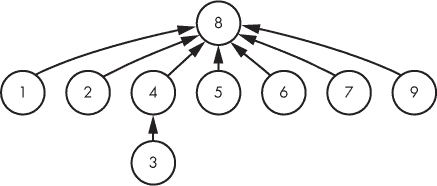

*图 9-6：路径压缩示例*

这样很好，对吧？查找节点 1 会导致节点 1 和节点 2 成为根节点的子节点；查找节点 5 会导致节点 5 成为根节点的子节点。通常，路径压缩会将路径上的每个节点作为根节点的子节点。因此，查找这些节点的速度会非常快。

要在 `find` 函数中实现路径压缩，我们可以从提供的人员开始，进行两次遍历到达树的根节点。第一次遍历定位树的根节点；这是任何 `find` 函数都会执行的遍历。第二次遍历确保路径上的每个节点都将根节点作为其父节点。列表 9-8 实现了新的代码。与列表 9-5 比较，可以看到新增的是第二次遍历。

```
int find(int person, int parent[]) {
  int community = person, temp;
❶ while (parent[community] !=  community)
     community = parent[community];
➋ while (parent[person] != community) {
     temp = parent[person];
     parent[person] = community;
     person = temp;
   }
   return community;
}
```

*列表 9-8：带有路径压缩实现的* find *函数*

这段代码分为两个阶段。第一阶段是第一个 `while` 循环 ❶，它使得 `community` 保存了社区的代表（根节点）。有了这个代表，第二阶段由第二个 `while` 循环 ➋ 捕捉，它会从 `person` 出发，追溯到树的根节点下方的路径，并更新每个节点的 `parent` 为树的根节点。`temp` 变量用来存储当前节点的旧父节点。通过这种方式，即使将当前节点设为树的根节点，我们仍然可以继续访问它的旧父节点。（在实际中，你可能会看到一种惊人简洁但隐晦的路径压缩编码方法。做好心理准备，然后查看 附录 B 中的“压缩路径压缩”部分。）

通过同时使用按大小合并和路径压缩，仍然有可能单次并查集的 Union 或 Find 操作需要 *O*(log *n*) 时间。然而，考虑到所有 Union 和 Find 操作的平均时间——尽管从技术上讲并不是常数——实际上是常数。运行时分析基于一个叫做 *反阿克曼函数* 的函数，它增长得非常非常，*非常* 慢。我不会定义反阿克曼函数或展示它如何在运行时分析中出现，但我想让你了解这个结果有多强大。

对数函数增长很慢，所以我们从这开始。对一个巨大的数字取对数会得到一个非常小的数字。例如，log 1,000,000,000 只有大约 30。然而，对数并不是常数：通过使用足够大的 *n* 值，你可以使 log *n* 变得和你想的一样大。

反阿克曼函数也不是常数，但与对数函数不同，你在实际应用中永远不会从中得到 30 这个值。你可以将 *n* 变得和你想的一样大，甚至大到计算机中能表示的最大数字，而反阿克曼函数的值最多也只有 4。你可以将带有按大小合并和路径压缩的并查集看作是每次操作平均只需要四步！

### 并查集

并查集数据结构加速了图论问题的解决，尤其是那些主要操作是 Union 和 Find 的问题。这对于诸如 第五章 和 第六章 中的某些问题没有帮助，因为这些问题需要计算节点之间的距离。但是，当并查集适用时，邻接表和图搜索就显得过于复杂且速度太慢。

#### *关系：三个要求*

并查集操作的是一个对象集合，其中每个对象最开始属于自己的集合。在任何时候，属于同一集合的对象是等价的，无论“等价”在我们正在解决的问题中意味着什么。例如，在社交网络问题中，同一集合（社区）中的人是等价的，因为他们都是朋友。

并查集要求对象之间的关系满足三个标准。首先，对象必须与自己有关系。在社交网络中的友谊关系，这意味着每个人都是自己的朋友。符合这一标准的关系称为*自反关系*。

其次，关系必须是无方向的：我们不能同时有*x*是*y*的朋友，并且*y*不是*x*的朋友。符合这一标准的关系称为*对称关系*。

第三，关系必须是传递的：如果*x*是*y*的朋友，而*y*是*z*的朋友，那么*x*也应该是*z*的朋友。符合这一标准的关系称为*传递关系*。

如果这些标准中的任何一个不满足，那么我们所讨论的并查操作就会失效。例如，假设我们有一个不满足传递性的友谊关系。如果我们知道*x*是*y*的朋友，我们无法确定*x*的朋友是否是*y*的朋友。因此，我们不能将*x*的社交圈和*y*的社交圈合并；这可能会把不是朋友的人错误地放在同一个集合中。

一个具有自反性、对称性和传递性的关系称为*等价关系*。

#### *选择并查集*

在判断是否可以应用并查集时，你需要问自己这个问题：我需要在对象之间保持什么样的关系？它是自反的、对称的、传递的吗？如果是，并且主要操作可以映射为查找和合并，那么你应该考虑将并查集作为一个可行的解决方案策略。

每个并查集问题背后都有一个图论问题，可以通过邻接表和图搜索进行建模（虽然效率较低！）。与我们在社交网络问题中所做的不同，在本章剩下的题目中，我们不会通过图论的“风景路线”来解决问题。

#### *优化*

我介绍了两种并查集优化：按大小合并和路径压缩。它们能有效防止糟糕的测试用例，并且通常无论测试用例如何，都能提升性能。它们每个只需要几行代码，因此我推荐在可能的情况下使用它们。

“只要可能”并不等同于“总是”。不幸的是，有些并查集问题并不适合这些优化。我还没有遇到路径压缩会带来问题的情形，但有时我们需要记住集合合并的顺序，在这种情况下，我们不能通过按大小合并树的根节点。你将在问题 3 中看到一个不能使用按大小合并的例子。

### 问题 2：朋友与敌人

你可能会担心我们支持的“添加”操作仅限于类似社交网络问题中的操作：*x* 和 *y* 是朋友；*x* 和 *y* 上同一所学校；*x* 和 *y* 住在同一座城市——之类的情况。事实上，我们也能支持其他类型的添加信息。*x* 和 *y* 不是朋友。嗯……这个有点意思，它告诉我们 *x* 和 *y* 不在同一集合中，而不是他们是朋友。那么并查集现在如何工作呢？继续往下看！

这是 UVa 问题 `10158`。

#### *问题*

两个国家正在交战。你已获准参加他们的和平会议，在会议期间，你可以听到一对对的人互相交谈。会议上有 *n* 个人，编号为 0, 1, . . . , *n* – 1。最开始，你对谁是朋友（同一国家的公民）或敌人（敌国的公民）一无所知。你的任务是记录有关谁是朋友或敌人的信息，并根据你目前掌握的情况回答查询。

你必须支持四个操作：

**SetFriends** 记录提供的两个人是朋友。

**SetEnemies** 记录提供的两个人是敌人。

**AreFriends** 报告你是否确定知道提供的两个人是朋友。

**AreEnemies** 报告你是否确定知道提供的两个人是敌人。

友谊是一个等价关系：它是自反的（*x* 是 *x* 的朋友），对称的（如果 *x* 是 *y* 的朋友，那么 *y* 是 *x* 的朋友），且是传递的（如果 *x* 是 *y* 的朋友，且 *y* 是 *z* 的朋友，那么 *x* 也是 *z* 的朋友）。

敌对关系不是等价关系。它是对称的：如果 *x* 是 *y* 的敌人，那么 *y* 也是 *x* 的敌人。然而，它既不是自反的，也不是传递的。

关于友谊和敌对关系，我们需要了解更多的内容。假设 *x* 有一些朋友和敌人，*y* 也有一些朋友和敌人，然后我们得知 *x* 和 *y* 是敌人。那么我们学到了什么？我们直接知道 *x* 和 *y* 是敌人——但这还不是全部。我们还可以得出结论：*x* 的敌人和 *y* 的所有朋友都是朋友。（假设 Alice 和 Bob 是敌人，David 和 Eve 是朋友——然后我们得知 Alice 和 David 是敌人。我们应该得出结论，Bob 和 David 以及 Eve 是朋友。）类似地，我们也可以得出结论，*y* 的敌人和 *x* 的所有朋友都是朋友。用一句话来总结：敌人的敌人是朋友。

现在假设 *x* 有一些朋友和敌人，*y* 也有一些朋友和敌人——但这次我们得知 *x* 和 *y* 是朋友。在这种情况下，我们还应该得出结论，*x* 的敌人和 *y* 的敌人是朋友。（坚持一下，随着一些例子的展开，我们会将这一切具体化。）

##### 输入

输入包含一个测试用例，由以下几行组成：

+   一行包含 *n*，即参加会议的总人数。*n* 小于 10,000。

+   零行或多行，每行对应一个操作。

+   一行包含三个整数，第一个是 0。这表示测试用例的结束。

每行操作具有相同的格式：一个操作码，后跟两个人（x 和 y）。

+   SetFriends 操作的形式是 `1` x y。

+   SetEnemies 操作的形式是 `2` x y。

+   AreFriends 操作的形式是 `3` x y。

+   AreEnemies 操作的形式是 `4` x y。

##### 输出

每个操作的输出位于其单独的一行。

+   如果 SetFriends 操作成功，则不会产生任何输出。如果与已知信息冲突，则输出 `-1` 并忽略该操作。

+   如果 SetEnemies 操作成功，则不会产生任何输出。如果与已知信息冲突，则输出 `-1` 并忽略该操作。

+   对于 AreFriends 操作，如果两个人是已知的朋友，则输出 `1`，否则输出 `0`。

+   对于 AreEnemies 操作，如果两个人是已知的敌人，则输出 `1`，否则输出 `0`。

解决测试用例的时间限制是三秒。

#### *增强并查集*

如果我们只需要处理 SetFriends 和 AreFriends 操作，那么我们可以直接应用并查集算法，就像在解决社交网络问题时那样。我们会为每一组朋友保留一个集合。像社交网络中的 Add 操作，SetFriends 将作为一个 Union 操作，将两组朋友合并为一个更大的集合。像社交网络中的 Examine 操作，AreFriends 将作为 Find 操作，用于确定两人是否在同一个集合中。

我们可以从只解决这两个操作的问题开始……其实，你知道吗？我相信你现在就能在没有我任何其他帮助的情况下解决这个有限的问题。我能提供帮助的地方可能是解释如何将 SetEnemies 和 AreEnemies 合并到问题中。

##### 增强：敌人

*增强*数据结构是指在数据结构中存储额外信息，以支持新的或更快的操作。在并查集数据结构中维护每个集合的大小就是增强的一个例子：你可以在没有它的情况下实现数据结构，但有了它，你可以快速报告集合的大小并执行按大小合并操作。

当现有的数据结构*几乎*可以做你想做的事时，你应该考虑增强。关键是要识别一种合适的增强方式，能够添加所需的功能，同时不显著减慢其他操作的速度。

我们已经有了一个支持 SetFriends 和 AreFriends 的并查集数据结构。它维护每个节点的父节点以及每个集合的大小。我们将增强这个数据结构，以支持 SetEnemies 和 AreEnemies。更重要的是，我们将做到这一点，而不会显著减慢 SetFriends 和 AreFriends 操作的速度。

假设我们被告知 *x* 和 *y* 是敌人。从问题描述中，我们知道我们必须将 *x* 的敌人集合与 *y* 的集合合并，并将 *y* 的敌人集合与 *x* 的集合合并。那么，*x* 的敌人是谁？*y* 的敌人又是谁？使用标准的并查集数据结构，我们并不知道。这就是为什么我们需要扩展并查集数据结构的原因。

除了每个节点的父节点和每个集合的大小外，我们还将跟踪每个集合的敌人。我们将这些敌人存储在一个名为 `enemy_of` 的数组中。假设 `s` 是某个集合的代表。如果该集合没有敌人，则我们将确保 `enemy_of[s]` 存储一个无法与人混淆的特殊值。如果该集合有一个或多个敌人，则 `enemy_of[s]` 将告诉我们其中一个敌人。

对的：是其中的*一个*，而不是*所有*。只知道每个集合中的一个敌人就足够了，因为我们可以利用这个敌人来找到该敌人集合中每个人的代表。

现在让我们解决两个测试用例。它们将为接下来的实现做准备。我展示的图示是概念性的，并不完全对应于实现的具体做法。特别地，我在图示中不会使用按大小合并或路径压缩，但我们将在实现中加入这些优化以提高性能。

##### 测试用例 1

回想一下，SetFriends 操作的代码是 `1`，SetEnemies 操作的代码是 `2`。

这是我们的第一个测试用例：

```
   9
   1 0 1
   1 1 2
   1 3 4
   1 5 6
❶ 2 1 7
➋ 2 5 8
➌ 1 2 5
   0 0 0
```

前四个操作是 SetFriends 操作。由于没有人有敌人，这些操作就像社交网络问题中的 Add 操作一样执行。图 9-7 显示了这些操作后的数据结构状态。

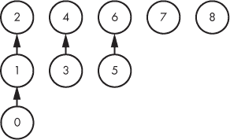

*图 9-7：四次 SetFriends 操作后的数据结构*

接下来是我们第一次的 SetEnemies 操作 ❶，它表示人物 1 和 7 是敌人。这意味着 1 的集合中的每个人都是 7 的集合中每个人的敌人。为了将此操作纳入数据结构，我们在这两个集合的根之间添加了连接：从 2（1 的集合的根）到 7 的连接，以及从 7（7 的集合的根）到 1 的连接。（你也可以决定后者应该是从 7 到 2 的连接；这也是可以的。）此操作的结果见 图 9-8。在本图及随后的图中，敌人连接以虚线表示；在我们的实现中，敌人连接将通过上述的 `enemy_of` 数组来实现。

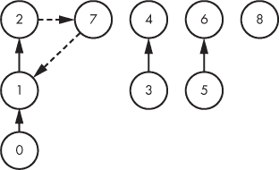

*图 9-8：SetEnemies 操作后的数据结构*

接下来是人物 5 和 8 之间的 SetEnemies 操作 ➋；执行此操作可能会得到 图 9-9。

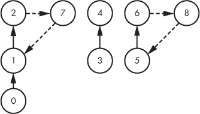

*图 9-9：另一轮 SetEnemies 操作后的数据结构*

现在是进行最终操作 ➌ 的时候了，这个操作表明人物 2 和人物 5 是朋友。这样，人物 2 的集合和人物 5 的集合就合并成了一个更大的朋友集合，正如预期的那样。或许令人惊讶的是，我们还合并了两个敌人集合。具体来说，我们将人物 2 的敌人集合与人物 5 的敌人集合合并。毕竟，如果我们知道两个人在同一个国家，那么他们各自的敌人集合必定在另一个国家合并。执行这*两个* Union 操作后的结果如图 9-10 所示。

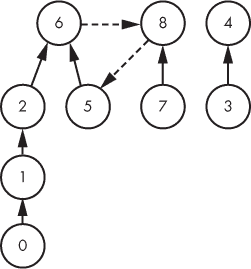

*图 9-10：最终执行 SetFriends 操作后的数据结构*

我没有从人物 2 到人物 7 和从人物 7 到人物 1 画出敌人链接，是因为我们仅在根节点之间维护敌人链接。一旦一个节点不再是根节点，我们就再也不会用它来寻找敌人。

从这个测试用例中可以学到两个关键点：一个集合的敌人存储在该集合的根节点上，且一个 SetFriends 操作需要执行两个 Union 操作，而不是一个。那么，当一个集合已经有敌人，并且该集合参与 SetEnemies 操作时，我们该怎么做呢？这就是我们下一个测试用例的内容。

##### 测试用例 2

我们的第二个测试用例与第一个的不同之处仅在于其最终操作：

```
   9
   1 0 1
   1 1 2
 1 3 4
   1 5 6
   2 1 7
   2 5 8
❶ 2 2 5
   0 0 0
```

在最终操作之前，数据结构如图 9-9 所示。最终操作 ❶ 现在是 SetEnemies 操作，而不是 SetFriends 操作。人物 2 的集合已经有一个敌人，现在它从人物 5 的集合中获得了新的敌人。因此，我们需要将人物 2 的敌人集合与人物 5 的集合合并。同样，人物 5 的集合已经有敌人，现在又从人物 2 的集合中获得了新的敌人，所以我们需要将人物 5 的敌人集合与人物 2 的集合合并。

这两个 Union 操作的结果如图 9-11 所示。

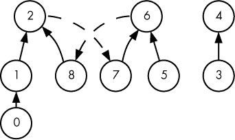

*图 9-11：最终执行 SetEnemies 操作后的数据结构*

在了解了这个背景后，我们准备好进行实现了！

#### *主要功能*

让我们从 `main` 函数开始，它在列表 9-9 中给出。它读取输入，并为我们支持的四个操作调用一个辅助函数。

```
#define MAX_PEOPLE 9999

int main(void) {
  static int parent[MAX_PEOPLE], size[MAX_PEOPLE];
  static int enemy_of[MAX_PEOPLE];
  int num_people, i;
  int op, person1, person2;
  scanf("%d", &num_people);
  for (i = 0; i < num_people; i++) {
    parent[i] = i;
    size[i] = 1;
 ❶ enemy_of[i] = -1;
  }
 scanf("%d%d%d", &op, &person1, &person2);

  while (op != 0) {
 ➋ if (op == 1)
      if (are_enemies(person1, person2, parent, enemy_of))
        printf("-1\n");
      else
        set_friends(person1, person2, parent, size, enemy_of);

 ➌ else if (op == 2)
      if (are_friends(person1, person2, parent))
        printf("-1\n");
      else
        set_enemies(person1, person2, parent, size, enemy_of);

 ➍ else if (op == 3)
      if (are_friends(person1, person2, parent))
        printf("1\n");
      else
        printf("0\n");

 ➎ else if (op == 4)
      if (are_enemies(person1, person2, parent, enemy_of))
        printf("1\n");
      else
        printf("0\n");

    scanf("%d%d%d", &op, &person1, &person2);
  }
  return 0;
}
```

*列表 9-9：处理操作的* 主要 *功能*

请注意，作为初始化的一部分，我们将每个 `enemy_of` 值设置为 `-1` ❶。这是我们用来表示“没有敌人”的特殊值。

为了实现 SetFriends ➋，我们首先检查这两个人是否已经是敌人。如果是，我们输出 `-1`；如果不是，我们调用 `set_friends` 辅助函数。SetEnemies ➌ 的实现遵循相同的模式。对于 AreFriends ➍ 和 AreEnemies ➎，我们调用一个辅助函数来确定条件是否为真，并相应地输出 `1` 或 `0`。

#### *查找与合并*

我将在这里介绍 Find 和 Union 函数；它们将由我们的辅助函数 `set_friends`、`set_enemies`、`are_friends` 和 `are_enemies` 调用。Find 函数在列表 9-10 中给出。我们已经在其中实现了路径压缩！

```
int find(int person, int parent[]) {
  int set = person, temp;
  while (parent[set] !=  set)
    set = parent[set];
  while (parent[person] != set) {
    temp = parent[person];
    parent[person] = set;
    person = temp;
  }
  return set;
}
```

*列表 9-10：* find *函数*

Union 函数在 列表 9-11 中给出。按大小联合：你最好相信它！

```
int union_sets(int person1, int person2, int parent[],
               int size[]) {
  int set1, set2, temp;
  set1 = find(person1, parent);
  set2 = find(person2, parent);
  if (set1 != set2) {
    if (size[set1] > size[set2]) {
      temp = set1;
      set1 = set2;
      set2 = temp;
    }
    parent[set1] = set2;
    size[set2] = size[set2] + size[set1];
  }
❶ return set2;
}
```

*列表 9-11：* union_sets *函数*

Union 函数有一个在我们之前的 Union 代码中没有的特性：它返回结果集的代表元素 ❶。接下来我们将讨论 SetFriends 操作，您会看到我们在其中使用了这个返回值。

#### *SetFriends 和 SetEnemies*

SetFriends 操作在 列表 9-12 中实现。

```
void set_friends(int person1, int person2, int parent[],
                 int size[], int enemy_of[]) {
  int set1, set2, bigger_set, other_set;
❶ set1 = find(person1, parent);
➋ set2 = find(person2, parent);
➌ bigger_set = union_sets(person1, person2, parent, size);
➍ if (enemy_of[set1] != -1 && enemy_of[set2] != -1)
  ➎ union_sets(enemy_of[set1], enemy_of[set2], parent, size);
➏ if (bigger_set == set1)
     other_set = set2;
   else
     other_set = set1;
❼ if (enemy_of[bigger_set] == -1)
     enemy_of[bigger_set] = enemy_of[other_set];
}
```

*列表 9-12：记录两个人是朋友*

我们首先确定每个人的代表元素：`set1` 是 `person1` 的代表 ❶，`set2` 是 `person2` 的代表 ➋。由于这两组人现在应该彼此成为朋友，因此我们将它们合并成一个更大的集合 ➌。我们将 `union_sets` 的返回值存储在 `bigger_set` 中；我们很快会用到它。

我们已经将 `person1` 的集合和 `person2` 的集合联合起来，但这还没有完成，因为——记得我们第一次测试时说的——我们可能还需要将一些敌人联合在一起。具体来说，如果 `set1` 有敌人，而 `set2` 也有敌人，那么我们需要将这些敌人联合成一个更大的集合。这正是代码的功能：如果两个集合都有敌人 ➍，我们将这些敌人集合 ➎ 联合起来。

现在很容易认为我们已经完成了。我们已经执行了所需的朋友集合联合和敌人集合联合——还有什么可做的呢？好吧，假设 `set1` 有一些敌人，而 `set2` 没有。那么，`set2` 的代表元素的 `enemy_of` 值就是 `-1`。现在，也许 `set1` 最终会并入 `set2`，使得 `set2` 成为更大的集合。如果我们就此停手不再做任何事情，那么 `set2` 将无法找到它的敌人！因为 `set2` 的代表元素的 `enemy_of` 值仍然是 `-1`——这显然不对，因为 `set2` 现在*确实*有敌人了。

这是我们在代码中处理这个问题的方式。我们已经有了 `bigger_set`，它表示是哪个集合——`set1` 还是 `set2`——通过联合 `set1` 和 `set2` 得到的。我们使用 if–else 来将 `other_set` 设置为另一个集合 ➏：如果 `bigger_set` 是 `set1`，那么 `other_set` 就是 `set2`，反之亦然。然后，如果 `bigger_set` 没有敌人 ❼，我们将从 `other_set` 复制敌人链接。这样，`bigger_set` 就能确保能找到它的敌人，如果 `set1` 或 `set2` 或两者都有敌人。

现在是时候进行 SetEnemies 操作了。请查看 列表 9-13。

```
void set_enemies(int person1, int person2, int parent[],
                 int size[], int enemy_of[]) {
  int set1, set2, enemy;
  set1 = find(person1, parent);
  set2 = find(person2, parent);
❶ enemy = enemy_of[set1];
   if (enemy == -1)
   ➋ enemy_of[set1] = person2;
 else
  ➌ union_sets(enemy, person2, parent, size);
➍ enemy = enemy_of[set2];
   if (enemy == -1)
     enemy_of[set2] = person1;
   else
     union_sets(enemy, person1, parent, size);
}
```

*列表 9-13：记录两个人是敌人*

我们再次通过查找每个集合的代表，分别存储在`set1`和`set2`中。然后我们查找`set1`的敌人 ❶。如果`set1`没有敌人，则将`person2`设为其敌人 ➋。如果`set1`有敌人，那么我们进入第二个测试用例的范围。我们将`set1`的敌人集合与`person2`的集合合并 ➌，这样确保`person2`以及`person2`的所有朋友都成为`person1`的敌人。

这样就处理了`set1`。现在我们对`set2`做同样的操作 ➍，如果它还没有敌人，则将其敌人设为`person1`，否则将其敌人集合与`person1`的集合合并。

重要的是，这个函数保持了敌人关系的对称性：如果从`person1`可以找到敌人`person2`，那么从`person2`也能找到敌人`person1`。考虑`person1`和`person2`的`set_enemies`调用。如果`person1`没有敌人，那么它的敌人就是`person2`，但如果`person1`有敌人，那么它的敌人集合将增加`person2`。对称地，如果`person2`没有敌人，那么它的敌人就是`person1`，如果`person2`有敌人，那么它的敌人集合也将增加`person1`。

#### *AreFriends 和 AreEnemies*

AreFriends 操作实际上就是检查两个人是否在同一个集合中，或者等价地，是否有相同的代表。这可以通过两次调用 Find 来完成，如清单 9-14 所示。

```
int are_friends(int person1, int person2, int parent[]) {
  return find(person1, parent) == find(person2, parent);
}
```

*清单 9-14：判断两个人是否是朋友*

我们只剩下最后一个操作了！我们可以通过检查一个人是否在另一个人的敌人集合中来实现 AreEnemies。代码见清单 9-15。

```
int are_enemies(int person1, int person2, int parent[],
                int enemy_of[]) {
  int set1, enemy;
  set1 = find(person1, parent);
  enemy = enemy_of[set1];
❶ return (enemy != -1) &&
          (find(enemy, parent) == find(person2, parent));
}
```

*清单 9-15：判断两个人是否是敌人*

要让`person2`成为`person1`的敌人，必须满足两个条件 ❶。首先，`person1`必须有敌人。其次，`person2`必须在其敌人集合中。

嘿！我们是不是也应该检查一下`person1`是否是`person2`的敌人？不，没必要，因为敌人关系是对称的。如果`person2`不是`person1`的敌人，那么就没有必要检查`person1`是否是`person2`的敌人。

就是这样！我们已经成功地扩展了普通的并查集数据结构，以包含朋友和敌人信息。如果你将代码提交给评测系统，应该能够通过所有测试用例。那么如果超时怎么办？通过大小合并和路径压缩，时间限制也无法阻止我们。

### 问题 3：抽屉事务

在社交网络和朋友与敌人问题中，我们能够使用大小合并和路径压缩来加速实现。在下一个问题中，我们将赋予每个集合的根更多的意义。我们将无法使用大小合并，因为根的选择很重要。在你阅读问题描述时，想一想为什么会这样！

这是 DMOJ 问题`coci13c5p6`。

#### *问题*

米尔科有 *n* 个物品散落在他的房间里，和 *d* 个空抽屉。这些物品编号为 1, 2, ……，*n*；抽屉编号为 1, 2, ……，*d*。每个抽屉最多能容纳一个物品。米尔科的目标是逐一考虑每个物品，如果可能将其放入一个抽屉，否则将其扔掉。

每个物品有恰好两个允许放置的抽屉：抽屉 A 和抽屉 B。（这是为了组织目的。毕竟，我们可不想把万圣节糖果和蚂蚁放在一起。）例如，我们可能允许将物品 3 放在抽屉 7（A）或抽屉 5（B）中。

为了确定每个物品的处理方式，我们依次使用以下五条规则：

1.  如果抽屉 A 是空的，将物品放入抽屉 A 并停止。

1.  如果抽屉 B 是空的，将物品放入抽屉 B 并停止。

1.  如果抽屉 A 已满，将抽屉 A 中的现有物品移到它的另一个抽屉；如果那个抽屉也已满，将它的现有物品移到它的另一个抽屉；以此类推。如果这个过程会终止，将物品放入抽屉 A 并停止。

1.  如果抽屉 B 已满，将抽屉 B 中的现有物品移到它的另一个抽屉；如果那个抽屉也已满，将它的现有物品移到它的另一个抽屉；以此类推。如果这个过程会终止，将物品放入抽屉 B 并停止。

1.  如果我们无法通过前四条规则放置物品，我们就将物品扔掉。

由于规则 3 和规则 4，放置一个物品可能会导致其他物品移动到它们的其他抽屉。

我们需要输出每个物品是被保留还是被扔掉。

##### 输入

输入包含一个测试用例，包含以下行：

+   一行包含 *n*，表示物品数量，以及 *d*，表示抽屉数量。*n* 和 *d* 的值在 1 到 300,000 之间。

+   *n* 行，每行包含两个整数 *a* 和 *b*，表示该物品的抽屉 A 是 *a*，抽屉 B 是 *b*。*a* 不会与 *b* 相同。

##### 输出

每个物品的输出单独占一行。对于每个物品，若物品被放入抽屉中，输出 `LADICA`；若物品被扔掉，输出 `SMECE`。（这两个词来自原始的 COCI 问题描述：*ladica* 是克罗地亚语中“抽屉”的意思，*smece* 是克罗地亚语中“垃圾”的意思。）

解决此测试用例的时间限制为 1 秒。

#### *等效抽屉*

这里有一个有趣的场景：我们把一个新物品放入抽屉 1——但是，哎呀，抽屉 1 已经满了。它的现有物品的另一个抽屉是抽屉 2。于是我们将现有物品移到抽屉 2，哎呀，又满了。它的现有物品的另一个抽屉是抽屉 6。唉——抽屉 6 也满了！我们将它的现有物品移到它的另一个抽屉，抽屉 4。呼！抽屉 4 是空的，所以我们停止。

在最终填满抽屉 4 的过程中，我们移动了三个现有物品：从抽屉 1 移到抽屉 2，从抽屉 2 移到抽屉 6，最后从抽屉 6 移到抽屉 4。然而，这些特定的移动对我们来说并不重要。我们只需要知道抽屉 4 最终是满的。

在添加新项目之前，抽屉 1、2、6 和 4 有一个共同点：如果你试图把一个物品放入其中任何一个抽屉，最终抽屉 4 会被填满。这就是这四个抽屉等价的含义。例如，如果你直接把物品放入抽屉 4，抽屉 4 会立刻被填满。如果你把物品放入抽屉 6，抽屉 6 中原有的物品会移动到抽屉 4，再次导致抽屉 4 被填满。如果你把物品放入抽屉 2，或者如我们在这个示例开始时看到的，如果你把物品放入抽屉 1，抽屉 4 会被填满。抽屉 4 是一个空抽屉，链条在此终止，考虑到我们的并查集数据结构，我们可以看到它将作为其集合的代表。我们的集合代表总是空抽屉；集合中的其他每个抽屉都会被填满。

为了使这一切更具实际意义，我们通过两个测试用例来演示。在第一个测试用例中，我们将看到每个物品都能被放入抽屉。第二个测试用例中，我们会看到一些 `SMECE`：有些物品我们无法放入抽屉。

##### 测试用例 1

这是我们的第一个测试用例：

```
6 7
1 2
2 6
6 4
5 3
5 7
2 5
```

我们有七个抽屉，每个抽屉开始时都是空的，并且属于自己的集合。我将每个集合列在自己的行上，并用斜体标出每个集合的代表：

*1*

*2*

*3*

*4*

*5*

*6*

*7*

在继续之前，最好回顾一下问题描述中的规则。

第一个物品是 `1 2`；这是抽屉 A 的 1 和抽屉 B 的 2。由于抽屉 1 是空的，这个物品会被放入抽屉 1（使用规则 1）。此外，抽屉 1 和 2 会被合并到同一个集合中：将新物品放入抽屉 1 或抽屉 2 会导致同一个抽屉——抽屉 2 被填满。这里是我们集合的下一个快照：

1 *2*

*3*

*4*

*5*

*6*

*7*

注意，新集合的代表是抽屉 2。使用抽屉 1 作为代表是不正确的：这会错误地表明抽屉 1 是空的！这就是为什么我们不会使用按大小合并的方法：它可能会选择错误的根节点作为结果集合的代表。

现在考虑第二个项目：`2 6`。抽屉 2 是空的，所以我们将物品放入其中（再次使用规则 1）。现在，将物品放入抽屉 1、2 或 6 会导致抽屉 6 被填满，因此我们将抽屉 1 和 2 与抽屉 6 合并：

1 2 *6*

*3*

*4*

*5*

*7*

抽屉 6 是空的，所以将物品放入抽屉 6 会立刻填满它。将物品放入抽屉 2 会导致该抽屉的现有物品移动到抽屉 6，再次填满抽屉 6。将物品放入抽屉 1 会导致其现有物品移动到抽屉 2，抽屉 2 中现有的物品会移动到抽屉 6……，因此抽屉 6 再次被填满。这就是为什么我们可以将这三个抽屉放在同一个集合中，并将抽屉 6 作为其代表。

下一个物品是 `6 4`。我们知道该怎么做（再次使用规则 1）：

1 2 6 *4*

*3*

*5*

*7*

下一个物品是 `5 3`。同样，这没有问题（使用规则 1）：

1 2 6 *4*

5 *3*

*7*

到目前为止，我们处理的每个物品都通过使用规则 1 成功了。当然，情况不必总是这样，正如下一个物品 `5 7` 所示：规则 1 不适用，因为抽屉 5 已经满了。然而规则 2 适用，因为抽屉 7 是空的。因此，这个物品被放入抽屉 7。合并后的集合的空抽屉是抽屉 3，因此它就是我们的代表，如下一个快照所示：

1 2 6 *4*

5 7 *3*

我们还有一个物品要处理，而且它挺有趣的：`2 5`。规则 1 适用吗？不适用，因为抽屉 2 已满。规则 2 适用吗？不适用，因为抽屉 5 已满。规则 3 适用吗？适用！它适用是因为抽屉 2 的集合中有一个空抽屉（抽屉 4）。我们该怎么做？

本例中的论点是，抽屉 2 的集合和抽屉 5 的集合应该合并，像这样：

1 2 6 4 5 7 *3*

我来解释一下为什么这样可行。物品 `2 5` 最终被放入抽屉 2：原有的物品从抽屉 2 移到抽屉 6，再从抽屉 6 移到抽屉 4。抽屉 4 现在被填满，因此它不能再作为其集合的代表。事实上，唯一相关的空抽屉是抽屉 3，所以我们实际上希望抽屉 3 能作为集合的代表。抽屉 5、7 和 3 肯定属于同一个集合：将物品放入其中任何一个最终都会填满抽屉 3，因为在我们引入 `2 5` 物品之前，它们就已经在同一个集合中。

现在需要解释为什么抽屉 1、2、6 和 4 也应该在抽屉 3 的集合中。抽屉 2 没问题：将物品放入抽屉 2 会把其原有物品移到抽屉 5。抽屉 5 在抽屉 3 的集合中，所以我们知道接下来会发生什么：抽屉 3 最终会被填满。

抽屉 1 也没问题：将一个物品放入抽屉 1 会把其原有的物品移到抽屉 2，从这里我们可以使用前一段中的论证来说明抽屉 3 会被填满。类似的逻辑适用于抽屉 6 和 4。例如，如果我们将物品放入抽屉 4，然后“撤销”填充抽屉 2 时发生的移动，抽屉 4 的原有物品会移回抽屉 6，抽屉 6 的原有物品会移回抽屉 2，现在我们回到了前一段中的情况。

每个物品都被放入了一个抽屉，因此正确的输出如下：

```
LADICA
LADICA
LADICA
LADICA
LADICA
LADICA
```

让我们从这个测试案例中提取一个一般性原则。假设我们正在处理物品 `x y`，并且该物品最终位于 `x` 的集合中。然后我们将 `x` 的集合和 `y` 的集合合并，保持 `y` 的代表作为合并集合的代表。

为什么这是正确的？想一想当我们试图把一个项目放入并集的集合中时，这个集合的组成部分是`x`的旧集合和`y`的旧集合。将它放入`y`的集合中的某个抽屉依然会填充`y`的代表，因为我们根本没有改变`y`的集合。将它放入`x`的抽屉也会填充`y`的代表，因为我们把`x`的现有项目移到`y`，然后我们就回到了将项目放入`y`集合的抽屉的情况。唯一剩下的选择是将新项目放入`x`集合中的抽屉`z`（与`x`不同）。从抽屉`z`到抽屉`x`有一条抽屉链；沿着这条链移动物品会填充抽屉`x`，然后`y`的代表也会被填充。

如果我们正在处理项目`x y`，而该项目最终进入了`y`的集合呢？在这种情况下，两个集合的角色会反转。特别地，我们将保持`x`的集合的代表作为并集集合的代表。

##### 测试用例 2

现在让我们看看如何产生`SMECE`。这是我们的第二个测试用例：

```
   7 7
   1 2
   2 6
   6 4
❶ 1 4
   2 4
   1 7
   7 6
```

前三个项目是`LADICA`，并且结果呈现出一个熟悉的状态：

1 2 6 *4*

*3*

*5*

*7*

现在，有个不同的情况：项目`1 4` ❶。第一次，我们看到一个抽屉 A 和抽屉 B 在*同一个*集合中。它因此不会为这个集合提供新的空抽屉。也就是说，使用规则 2 填充抽屉 4（所以它是一个`LADICA`），但是它不会给我们任何可以并集的集合。抽屉 1、2、6 和 4 进入了一种新的状态，在这种状态下，任何物品都无法成功放入它们！如果你尝试，你将永远在其中循环。例如，尝试将物品放入抽屉 1。我们可以把抽屉 1 的现有物品推到抽屉 2，然后把抽屉 2 的现有物品推到抽屉 6，然后把抽屉 6 的现有物品推到抽屉 4，抽屉 4 的现有物品被推到抽屉 1，抽屉 1 的现有物品推到抽屉 2，抽屉 2 的现有物品推到抽屉 6，依此类推，直到我撞到我的书的页面限制。

在我们的实现中，我们将通过为该集合指定代表 0 来标记这一状态：

1 2 6 4 *0*

*3*

*5*

*7*

现在我们已经非常接近一个`SMECE`了。如果有任何项目，其中的两个抽屉都在这个集合中，那么就无法放置它。看看我们下一个项目：`2 4`。我们能把它放入抽屉 2 吗？不行；它已经满了。那抽屉 4 呢？也不行；它也满了。我们能沿着抽屉 2 的链找到一个空抽屉吗？不行。有没有从抽屉 4 到空抽屉的链？不行。四次失败。`SMECE`。

接下来，我们处理项目`1 7`。这个将通过使用规则 2 来处理。因此我们执行一个并集（因为它是一个`LADICA`）——但要注意：因为这是另一个并集，它会给我们一个没有空抽屉的集合！这是结果：

1 2 6 4 7 *0*

*3*

*5*

最后的项目是`7 6`，这又是一个`SMECE`，因为没有四条`LADICA`规则适用：抽屉 7 和 6 在同一个集合中，而且这个集合没有空抽屉。

这个测试用例的正确输出是：

```
LADICA
LADICA
LADICA
LADICA
SMECE
LADICA
SMECE
```

在我们的测试用例中，唯一没有探讨的规则是规则 4。我建议你在继续之前先玩一下规则 4。特别是，你可以验证每次应用规则 4 时，合并后集合的代表将是 0。

现在是实现阶段了！

#### *主函数*

让我们从`main`函数开始，它从输入中读取每个项目并进行处理。代码在清单 9-16 中给出。

```
#define MAX_DRAWERS 300000

int main(void) {
  static int parent[MAX_DRAWERS + 1];
  int num_items, num_drawers, i;
  int drawer_a, drawer_b;
  scanf("%d%d", &num_items, &num_drawers);
❶ parent[0] = 0;
   for (i = 1; i <= num_drawers; i++)
     parent[i] = i;

   for (i = 1; i <= num_items; i++) {
     scanf("%d%d", &drawer_a, &drawer_b);

  ➋ if (find(drawer_a, parent) == drawer_a)
    ➌ union_sets(drawer_a, drawer_b, parent);
 ➍ else if (find(drawer_b, parent) == drawer_b)
    ➎ union_sets(drawer_b, drawer_a, parent);

  ➏ else if (find(drawer_a, parent) > 0)
    ❼ union_sets(drawer_a, drawer_b, parent);

  ❽ else if (find(drawer_b, parent) > 0)
    ❾ union_sets(drawer_b, drawer_a, parent);

     else
       printf("SMECE\n");
  }
  return 0;
}
```

*清单 9-16：处理项目的*主*函数*

像往常一样，`parent`数组记录了并查集数据结构中每个节点的父节点。项目的编号从 1 开始，因此我们可以安全地使用 0 作为那些永远不能放入新项目的抽屉的代表。我们将 0 的代表设置为 0 ❶，以表示这个集合像其他所有集合一样，最初是空的。

现在，让我们来看看这五个规则。我们通过一次`find`调用和一次`union`调用来实现四个`LADICA`规则。如果这些规则都不适用，那么我们就在`SMECE`的情况下。我们逐一来看每个`LADICA`规则。

对于规则 1，我们需要知道`drawer_a`是否为空。记住，每个抽屉集合（不包括“0”集合）都有且只有一个空抽屉，而这个空抽屉是该集合的代表。`find`函数返回给定集合的代表。将这两个事实结合起来，我们可以得出结论，只有当`drawer_a`为空时，`find`才会返回`drawer_a` ➋。

如果我们处于规则 1 的情况，那么我们需要将`drawer_a`的集合与`drawer_b`的集合合并。因此，我们调用`union_sets` ➌。不过要小心：记住，我们必须使`drawer_b`的代表成为新集合的代表，因为`drawer_a`的集合已经没有空抽屉了，`drawer_a`已经满了。为了实现这一点，我们将使用一种不按照大小进行并查集合并的`union_sets`实现。它保证我们传递的第二个参数（在这里是`drawer_b`）将成为合并后集合的代表。它还负责输出`LADICA`消息。我们将在下一小节中看到这段代码。

对于规则 2，我们需要知道`drawer_b`是否为空。我们再次使用`find`来检查这个 ➍，如果适用这个规则，就执行并查集操作 ➎。这一次，我们以相反的顺序调用`union_sets`，使得`drawer_a`的代表成为合并后集合的代表。

对于规则 3，我们需要知道`drawer_a`的集合是否有空抽屉。一个集合只有在其代表元素为 0 时才没有空抽屉。我们使用`find`来检查这个条件 ➏：如果`find`返回的代表不是 0，那么这个集合就有空抽屉。如果适用这个规则，我们就执行预期的并查集操作 ❼。在下一小节中，我们将看到`union_sets`如何负责将集合适当地移到“0”集合。

最后，对于规则 4，我们需要知道 `drawer_b` 的集合是否有空的抽屉。逻辑与规则 3 相同：使用 `find` 检查该集合是否有空的抽屉 ❽；如果有，则执行 Union ❾。

#### *Find 和 Union*

Find 函数见 Listing 9-17。它使用了路径压缩。这是件好事，因为我刚提交了一个没有路径压缩的解法，并收到了“超时”错误。#PathCompressionWins。

```
int find(int drawer, int parent[]) {
  int set = drawer, temp;
  while (parent[set] !=  set)
    set = parent[set];
  while (parent[drawer] != set) {
    temp = parent[drawer];
    parent[drawer] = set;
    drawer = temp;
  }
  return set;
}
```

*Listing 9-17：*find*函数*

Union 函数见 Listing 9-18。

```
void union_sets(int drawer1, int drawer2, int parent[]) {
  int set1, set2;
  set1 = find(drawer1, parent);
  set2 = find(drawer2, parent);
❶ parent[set1] = set2;
➋ if (set1 == set2)
  ➌ parent[set2] = 0; 
   printf("LADICA\n");
}
```

*Listing 9-18：*union_sets*函数*

正如之前承诺的，这里没有按大小合并：我们总是使用 `set2`，即 `drawer2` 的集合，作为新的集合 ❶。

此外，每当放置一个物品且其抽屉属于同一集合 ➋ 时，我们将结果集合的代表设置为 `0` ➌。以后每当对这个结果集合的任何元素调用 `find` 时，将返回 `0`，正确地表示该集合再也不能放置任何物品。

就这样：这是一个 50 行的并查集解决方案，解决了本书中最具挑战性的问题之一。请将你的代码提交给评测系统！

### **总结**

在本章中，我们学习了如何高效地实现并查集数据结构。在本书所有数据结构中，并查集是令我最惊讶的一个，因为它的应用范围非常广泛。“真的吗？这是一个并查集问题？”我经常有这样的想法。当我们解决《朋友与敌人》或《Drawer Chore》问题时，也许你也有过这样的想法。无论如何，你很可能会遇到其他看似与这里的例子完全不同的问题，但并查集依然适用。

幸运的是，考虑到其广泛的适用性和快速的性能，我们不需要大量的代码来实现并查集：只需要为 Union 写几行代码，为 Find 写几行代码。此外，你可能会发现，一旦我们了解了树的数组表示法，代码并不难理解。即使是优化，比如按大小合并和路径压缩，也需要很少的代码。

### 注释

Drawer Chore 最初来源于 2013 年克罗地亚开放信息学竞赛的第五轮。我在 COCI 网站上找到了“0 代表”这一概念（见 *[`hsin.hr/coci/archive/2013_2014`](http://hsin.hr/coci/archive/2013_2014)*）。
