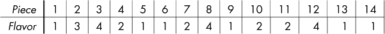
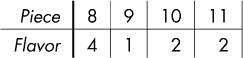
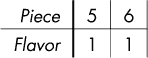
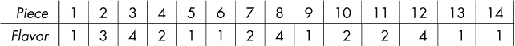
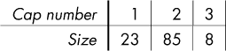
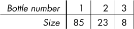
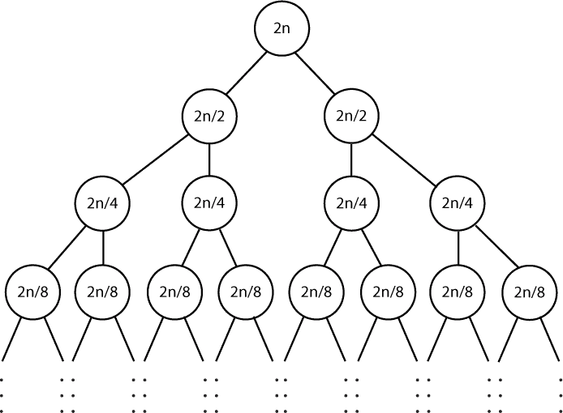

## 第十章：**随机化**


回想一下我们在第七章学习的二分查找。当时我们不是在回答“最优解是什么？”的问题，而是在问“这个特定的值是不是最优解？”在解决喂蚂蚁问题时，你可能会觉得我随意挑选值的做法很荒唐，想知道那到底怎么可能有效。但事实证明，这种做法非常有效，现在我们知道了。

你想要比二分查找更荒唐的东西吗？那就直接猜一个完全随机的解法吧。那怎么可能行得通呢？究竟是什么使得在特定问题下，随机猜测能成为一种可行的策略？即使我们已经有了解法，随机猜测还能帮我们解决问题吗？令人惊讶的结论在等着我们。

### **问题 1：羊羹**

羊羹是一种日本糖果，味道甜美，质地类似果冻或橡皮糖。买一块大块的羊羹，切成小块，搭配一些水果，冷藏一下，享受一份清爽的……哦，抱歉，我们还是回到算法吧。

这是 DMOJ 问题`dmpg15g6`。

#### *问题描述*

两个朋友找到了一个包含*n*块的羊羹。这些块按顺序编号为 1, 2, ... , *n*。每一块羊羹有一个特定的味道，每个朋友只会吃那些味道相同的部分。

一块羊羹由从第*l*块到第*r*块的所有部分组成。如果一个朋友能找到至少三分之一的羊羹部分有相同的味道，那么他们会对这块羊羹感到*高兴*。例如，如果一块羊羹有 9 块，那么朋友需要找到 9/3 = 3 块味道相同的部分。为了让两个朋友都对这块羊羹感到高兴，他们需要各自找到三分之一的味道相同的部分。

朋友们将查询不同的羊羹部分；对于每个部分，我们需要确定他们两个是否都会对这块羊羹感到高兴。

##### 输入

输入由以下几行组成：

+   一行包含*n*，即羊羹的块数，和*m*，即可能的味道数。*n*和*m*的范围在 1 到 200,000 之间。

+   一行包含*n*个整数，表示从第 1 块到第*n*块的羊羹部分的味道。每个整数表示一种味道，范围在 1 到*m*之间。

+   一行包含*q*，即朋友们的查询数。*q*的范围在 1 到 200,000 之间。

+   *q*行，每行对应一个查询。每一行包含两个整数*l*和*r*，表示从第*l*块到第*r*块的羊羹部分。

##### 输出

每个查询的输出单独一行。对于每个查询：

+   如果两个朋友都对这块羊羹感到高兴，输出`YES`。

+   否则，输出`NO`。

解决测试用例的时间限制为 1.4 秒。

#### *随机选择一块*

让我们从一个测试用例开始：

```
14 4
1 3 4 2 1 1 2 4 1 2 2 4 1 1
3
3 11
8 11
5 6
```

这里的羊羹有 14 块，长得像这样：



需要处理三个查询。第一个查询从第 3 块开始，到第 11 块结束。因此，我们关心的是这块羊羹：


这块羊羹有 9 块，因此我们要确定每个朋友是否能找到 9/3 = 3 块相同口味的部分。而他们是可以的！第一个朋友可以吃 3 块口味 1，第二个朋友可以吃 3 块口味 2。（这里有 4 块口味 2，但第四块对于我们来说多余了。）因此，针对这个问题，我们的输出应该是 `YES`。

想一想我们如何编写代码来判断朋友们是否满意这块羊羹。一般来说，通过逐一检查羊羹中的每一块来做这个判断会太慢了；毕竟，一块羊羹可能有多达 20 万块部分。到目前为止，这个问题我们已经很熟悉了；通常做法是使用一些巧妙的数据结构来加速查询。

但是我们这里要做一些不太寻常的事情。我希望你再次看那块羊羹，并随机挑选其中的一块。羊羹中有口味 1 和口味 2 的部分，所以你可能会挑到其中一个口味。如果是的话，那你就找到了满足第一个朋友的方法。如果没有，请再随机挑选一块羊羹。你可能会得到口味 1 或口味 2。还是没有？那就再试第三次。如果你是随机挑选的话，你很快就会在少数几次尝试中挑到口味 1 或口味 2。

假设你已经为第一个朋友找到了口味 1。现在，再做一次，这次为第二个朋友。这个过程会稍微困难一些：因为三个口味 1 的部分已经没有了，所以你必须选择口味 2。不过，还是试着随机挑选几次，我相信你最终会挑到口味 2 的一块。

我们要写的程序将做的事情与你刚才做的完全一样：随机挑选部分，试图找到一种口味让每个朋友都感到满意。

假设这两位朋友都对这块羊羹感到满意。这意味着羊羹中有一个口味在 2/3 的部分出现，或者有两个不同的口味各自出现在 1/3 的部分。不管怎样，我们都有 2/3 的机会通过随机选择一块来让第一个朋友满意。如果成功了，那我们就完成了第一个朋友的任务，接着转向第二个朋友。如果失败了，我们就再试一次，这时我们有新的 2/3 的成功机会。如果第二次也失败了，我们就再试第三次、第四次，直到成功为止。

我们稍后会弄清楚需要多少次尝试。不过，现在我可以保证，次数不会太多。这个直觉可以通过掷硬币实验来理解。

想象一下，你正在和一个公平的硬币玩游戏。如果你抛硬币，结果是正面朝上，你就赢了。如果是反面朝上，你就得再试一次。可以将硬币正面朝上视为让朋友开心，而反面朝上则意味着朋友不开心，并且你需要再试一次。你预计需要抛硬币多少次才能出现正面？不多吧？如果羊羹中有一种口味让朋友开心，我们就只会抛少量的反面，然后就能找到正面。

在开始进行所有随机化和抛硬币的讨论之前，我们正在处理中一个测试用例，所以让我们先完成这个部分，再继续往下讲。

第二个查询从第 8 块开始，到第 11 块结束。对应的羊羹块是：



不幸的是，这两个朋友对这个结果不满意。每个朋友至少需要找到 4/3 = 块相同口味的糖果；由于每个口味的糖果块数是整数，实际上我们需要的是至少 2 块相同口味的糖果。我们可以用口味 2 满足第一个朋友的需求，但第二个朋友就没法满足了。我们需要在这里输出`NO`。

第三个查询从第 5 块开始，到第 6 块结束。这是羊羹的这一部分：



每个朋友只需要一块指定口味的糖果。所以我们可以使用口味 1 让两个朋友都开心：我们可以把一块给第一个朋友，把另一块给第二个朋友！因此，正确的输出是`YES`。

#### *生成随机数*

我们需要一种方法来生成随机数，以便随机选择羊羹的块。我们将使用 C 语言的`rand`函数来完成这一任务。

如果我们调用`rand`并传入整数`x`，我们要求`rand`给我们`x`种可能性中的一个。具体来说，我们会得到一个在`0`到`x - 1`范围内的随机整数。例如，如果我们调用`rand(4)`，我们会得到`0`、`1`、`2`或`3`。

现在，我们如何使用`rand`来随机选择羊羹块呢？我们可以使用“宽度”一词来表示羊羹块的数量。例如，从第 8 块到第 11 块的宽度是 4。在这种情况下，我们需要`rand`返回`8`、`9`、`10`或`11`。我们可以先调用`rand(4)`，因为我们需要`rand`从四个可能的值中选择一个。这会返回`0`、`1`、`2`或`3`。这是一个不错的开始，但这些数字不在正确的范围内。为了解决这个问题，我们只需加上 8，将这个值调整到我们需要的 8–11 范围内。

在代码中，生成给定宽度`width`和起始点`left`的随机数可以参考列表 10-1 来实现。

```
int random_piece(int left, int width) {
❶ return (rand() % width) + left;
}
```

*列表 10-1：随机选择一块*

代码执行了我们刚刚概述的计划：它生成了一个从`0`到`width - 1`之间的随机数，然后加上起始点`left` ❶。

#### *确定块数*

假设我们正在处理一个特定的查询。我们将选择该查询块中的一个随机片段。这个片段的味道是否让其中一个或两个朋友开心？为了回答这个问题，我们需要能够快速确定该味道在块中出现的次数。

因此，对于我们来说，拥有一个每个味道的排序数组将非常方便，它可以为我们提供该味道的片段。我称这种数组为*味道数组*。

让我们回到测试用例中的羊羹：



味道 1 的数组是`[1, 5, 6, 9, 13, 14]`；味道 2 的数组是`[4, 7, 10, 11]`；依此类推。如同承诺的那样，这些数组已经排序：片段编号按从小到大的顺序排列。稍后我们会看到如何生成这些味道数组；现在我们暂且假设它们已经存在。

我们可以使用这样的数组来确定给定味道在某个块中的片段数量。例如，我们可以使用数组`[1, 5, 6, 9, 13, 14]`得出结论：在 3-11 块中有三个味道 1 的片段：片段 5、片段 6 和片段 9。

让我们盘点一下。我们有了要解决的查询。我们有一个随机的味道，需要检查它。我们有了味道数组：一个排序的该味道的片段编号数组。我们需要确定这些片段中有多少个在查询范围内。

我们可以通过线性查找味道数组来做到这一点。但那会太慢——每次查询都需要线性时间。

如果你回想一下第七章，你可能会想知道是否可以在这里使用二分查找。的确可以，因为数组是排序的！实际上，我们需要调用二分查找两次，而不是一次，但这不会改变我们能够在对数时间内找到所需内容的事实。

我们将编写一个二分查找函数，传入一个味道数组`pieces`和一个整数`at_least`，返回数组中第一个大于或等于`at_least`的值的索引。

在我们开始之前，我们应该确保这个函数的规范确实能满足我们的需求。为此，让我们用它来找出 3-11 块中味道 1 的片段数量。

为了找出味道 1 在该块中的片段起始位置，我们可以调用我们的函数，传入数组`[1, 5, 6, 9, 13, 14]`和`at_least`值为`3`。我们将得到结果`1`。这告诉我们，索引为 1 的片段是这个味道中编号至少为 3 的第一个片段。这个片段是片段 5，它确实是我们要找的第一个片段。

Flavor 1 的片段在该区间结束在哪里？我们也可以算出来！只需用相同的数组调用我们的函数，不过这次设置`at_least`值为`12`。为什么是 12？因为那是第一个**不**在该区间内的片段。如果我们这样调用，就会得到`4`的结果。这指的是索引 4 处的片段，即片段 13。这是这个味道在 3-11 区间外的第一个片段。一般来说，要弄清楚某个味道的结束位置，我们可以调用二分查找函数，传入比区间右端大 1 的`at_least`值。

现在我们知道相关片段的起始位置（索引 1）和结束位置（就在索引 4 的左边）。如果从 4 中减去 1，我们得到 3，这正是 3-11 区间中 Flavor 1 的片段数量。

让我们编写二分查找函数的代码。（稍后，我们将看到调用此函数两次的函数。）正如你在《寻找解决方案》中所学到的，在第 250 页，编写二分查找函数的正确方法是先找出不变式。我们的不变式将包含两部分：所有`low`索引之前的值都小于`< at_least`，以及所有`high`或更大的索引上的值都大于等于`>= at_least`。参见示例 10-2 中的代码。除了前述的`pieces`和`at_least`参数外，我们还有一个参数`num_pieces`，它给出了`pieces`数组中片段的数量。

```
int lowest_index(int pieces[], int num_pieces, int at_least) {
  int low, high, mid;
❶ low = 0;
➋ high = num_pieces;
➌ while (high - low >= 1) {
     mid = (low + high) / 2;
     if (pieces[mid] < at_least)
       low = mid + 1;
     else
       high = mid;
  }
➍ return low;
}
```

*示例 10-2：查找第一个满足条件的值*

我们需要在循环之前使不变式的两部分都成立。对于第一部分，注意不变式并没有对`low`索引上的值做任何声明；它仅对`low`左边的值做出声明。因此，我们可以在循环之前将`low`设置为`0` ❶；现在`low`左边没有任何值，所以这一部分的不变式得到了满足。

对于第二部分，不变式对`high`或更大的索引上的所有值进行了声明。由于我们对数组中的任何值都不了解，我们需要让这一部分的不变式声明为空。我们可以通过将`high`设置为数组右端之外的位置来实现 ➋：这样`high`和数组末尾之间就没有有效索引了。

`while`循环中的代码保持着不变式。我鼓励你如果愿意，可以自己检查这一点，但你已经有了很多二分查找的练习，所以如果你不想检查，我也不怪你！

`while`循环条件 ➌ 确保当循环终止时，`low`和`high`相等。不变式告诉我们，所有在`low`左边的值都太小，并且`low`是第一个`>= at_least`的值的索引。这就是为什么当函数终止时我们返回`low`的原因 ➍。

接下来，正如之前承诺的，我们将调用该函数两次，以确定某种味道的片段在给定区间内的数量。参见示例 10-3 中的代码。

```
int num_in_range(int pieces[], int num_pieces, int left, int right) {
❶ int left_index = lowest_index(pieces, num_pieces, left);
➋ int right_index = lowest_index(pieces, num_pieces, right + 1);
➌ return right_index - left_index;
}
```

*列表 10-3：确定给定口味的块数在范围内的情况*

这里，`pieces`参数是口味数组，`left`和`right`参数表示该块的最左和最右边的块。代码首先找到块中口味开始的位置的索引❶。然后找到口味结束位置的右边的索引➋。最后，它从第二个索引中减去第一个索引来确定该块中该口味的块数➌。

#### *猜测口味*

到这一步，我们已经知道该怎么做：一旦我们猜到一个口味，就用二分查找来检查猜测的口味是否让一位或两位朋友感到高兴。现在我们需要处理生成这些猜测的代码。

我们的整体策略可以分为三个步骤：

**步骤 1**   计算出让一位朋友高兴所需要的块数。

**步骤 2**   尝试让第一位朋友高兴。首先猜测一块。如果该块的口味让朋友高兴，那么我们完成了；否则，再猜一次。一直猜直到成功或者猜测用完为止。我们有可能找到一个口味，它如此常见，不仅让第一位朋友高兴，还能让*两位*朋友都高兴。如果发生这种情况，我们就输出`YES`并停止，而不执行步骤 3。

**步骤 3**   尝试使用我们为第一位朋友使用的相同策略来让第二位朋友高兴。如果我们恰好猜到了让第一位朋友高兴的口味，那么我们需要忽略它并继续下一次尝试，因为这个口味并不常见到足以让两位朋友都高兴。

我们将为以下签名编写函数：

```
void solve(int yokan[], int *pieces_for_flavor[],
           int num_of_flavor[], int left, int right)
```

以下是每个参数的用途：

yokan   Yōkan 口味的数组；`yokan[1]`是第一块的口味，`yokan[2]`是第二块的口味，依此类推。（我们从索引 1 开始而不是 0，因为在这个问题中，块的编号从 1 开始。）我们需要这个数组，以便可以选择一个随机的块。

pieces_for_flavor   口味数组的数组。每个口味数组都按从小到大的块编号排序。例如，`pieces_for_flavor[1]`可能是数组`[1, 5, 6, 9, 13, 14]`，表示所有的口味 1 的块。我们需要这些数组，以便能够进行二分查找。

num_of_flavor   给出每个口味块数的数组；`num_of_flavor[1]`是口味 1 的块数，`num_of_flavor[2]`是口味 2 的块数，依此类推。也就是说，这个数组告诉我们每个口味数组中有多少元素。

left   当前查询的起始索引。

right   当前查询的结束索引。

这个函数的代码在列表 10-4 中。阅读代码时要注意三个步骤——找出使朋友高兴的临界值，首先让第一位朋友高兴，然后让第二位朋友高兴。

```
void solve(int yokan[], int *pieces_for_flavor[],
           int num_of_flavor[], int left, int right) {
  int attempt, rand_piece, flavor, result;
  int width = right - left + 1;
❶ double threshold = width / 3.0;
   int first_flavor = 0;

➋ for (attempt = 0; attempt < NUM_ATTEMPTS; attempt++) {
  ➌ rand_piece = random_piece(left, width);
     flavor = yokan[rand_piece];
  ➍ result = num_in_range(pieces_for_flavor[flavor],
                           num_of_flavor[flavor], left, right);
  ➎ if (result >= 2 * threshold) {
       printf("YES\n");
       return;
     }
 ➏ if (result >= threshold)
    ❼ first_flavor = flavor;
  }

  if (first_flavor == 0) {
    printf("NO\n");
    return;
  }

❽ for (attempt = 0; attempt < NUM_ATTEMPTS; attempt++) {
     rand_piece = random_piece(left, width);
     flavor = yokan[rand_piece];
  ❾ if (flavor == first_flavor)
       continue;
     result = num_in_range(pieces_for_flavor[flavor],
                           num_of_flavor[flavor], left, right);
     if (result >= threshold) {
       printf("YES\n");
       return;
     }
  }

  printf("NO\n");
}
```

*列表 10-4：解决问题*

对于第 1 步，我们确定使朋友开心的块的数量 ❶。

对于第 2 步，我们开始为第一个朋友猜测口味 ➋。`for` 循环使用了一个尚未定义的 `NUM_ATTEMPTS` 常量。我们将在完成这个函数的讲解后再决定这个数字。在 `for` 循环中，我们从当前的 Yōkan 块中选择一个随机块 ➌，然后调用我们的 `num_in_range` 辅助函数，获取该块中与随机块相同口味的块的数量 ➍。

我们的随机口味是否让一个或两个朋友开心？首先，我们检查该口味是否如此普遍，以至于能让两个朋友都开心。具体来说，如果该口味出现的频率为 2/3（也就是两倍的阈值），那么它可以用来让两个朋友都开心 ➎。这样的话，我们就完成了：我们直接输出`YES`并返回。如果这个口味没有让两个朋友都开心，它可能仍然足够让第一个朋友开心，所以我们接下来检查这一点 ➏。我们还记录下为第一个朋友找到的口味 ❼。

如果在所有的猜测中，我们未能为第一个朋友找到口味，那么我们输出`NO`并停止。

如果我们为第一个朋友找到了口味，那么我们继续进行第 3 步 ❽，尝试为第二个朋友找到口味。这个逻辑和我们为第一个朋友所做的非常相似。唯一的不同是要确保我们不会不小心使用已经为第一个朋友使用过的口味 ❾。

如果我们到达函数的底部，意味着我们未能为第二个朋友找到口味。在这种情况下，我们输出`NO`。

#### *我们需要多少次尝试？*

最后，让我们回答需要多少次尝试才能确保极高的成功概率。

我们假设每个查询询问的是一个 Yōkan 的块，其中恰好三分之一的块是某种口味 *x*，另三分之一是另一种口味 *y*，其余的块则分布在其他各种口味之间。这将是我们面临的最难的查询类型。我们可能会碰巧遇到一个查询，其中某种口味出现了 50%、70% 或 85% 的时间，对于这些情况，我们的猜测会更容易一些。但我们专注于最难的查询类型，因为如果我们能解决这个，那么我们就知道其他的查询也能解决。

不用担心如果你以前没有做过概率相关的工作。*概率*只是一个在 0 到 1 之间的值。如果某件事的概率是 0，那么它永远不会发生；如果某件事的概率是 1，那么它每次都会发生。你可以将概率值乘以 100 来转换成百分比。例如，当抛硬币时，正面朝上的概率是 0.5；乘以 100，我们就可以看到它有 0.5 × 100 = 50% 的机会正面朝上。我们还需要一些其他的概率规则，但我会在之后解释这些。

我们随便挑一个猜测次数，看看我们能做得如何。比如 10 次？我们先算出让第一个朋友高兴的概率。在第一次猜测时，我们有 2/3 的成功概率。这是因为在这块石板中，有 2/3 的碎片属于两种每种出现 1/3 的口味之一。那么失败的概率是多少呢？这里只有两种结果：成功和失败。它们的概率加起来必须等于 1，因为这两种结果中总有一个会发生。所以我们可以通过从 1 中减去成功的概率来找出失败的概率。这样算出失败的概率是 1 – 2/3 = 1/3。

所有 10 次猜测都失败的概率是多少？为了发生这种情况，我们需要在每次猜测时都独立失败。第一次猜测失败的概率是 1/3，第二次猜测失败的概率是 1/3，第三次猜测失败的概率是 1/3，以此类推。我们可以用一个规则来计算所有这些 10 次独立猜测都失败的概率：将所有概率相乘。我们看到，所有 10 次猜测都失败的概率是(1/3)¹⁰，约等于 0.000017。

现在我们能够计算这个朋友的成功概率了：1 – 0.000017 = 0.999983。

这意味着成功的概率超过 99.99%。我们做得很好！

在第一个朋友成功的前提下，让第二个朋友高兴的概率是多少？对于这个问题，每次尝试的成功概率是 1/3，而不是 2/3，因为第一个朋友的口味已经没有了。如果你从 1/3 开始计算，你会得到第二个朋友的成功概率大约是 0.982658。这个概率超过 98.2%！我们依然很有希望。

现在我们得到了第一个朋友的成功概率和在第一个朋友成功的前提下，第二个朋友的成功概率。但我们更关心的是两个朋友都成功的概率。为了计算这个，我们可以将两个成功的概率相乘。这样算下来，我们发现让两个朋友都高兴的总体概率是 0.999983 × 0.982658 = 0.982641。

这个概率超过 98.2%。相当不错，对吧？不幸的是，不是这样的。如果我们只处理一个查询，这个概率就没问题了。但我们可能需要处理多达 200,000 个查询。并且每个查询都必须完全正确。如果我们有哪怕一个错了，我们就会失败。

假设你把一个球投进篮筐，每次投掷的成功概率是 98.2%。你投一个球。这个球很可能会进。现在假设你投 100 个球。你可能会搞砸其中几个。如果你投 200,000 个球呢？你把每个球都投进篮筐的概率接近于 0。

尽管 10 次尝试已经是一次不错的尝试，但仍然不够。我们需要更多。通过一些反复试探，我最终决定每个朋友使用 60 次尝试。如果你使用 60 次猜测而不是 10 次进行计算，你应该能找到每个查询的成功概率大约是 0.99999999997。

那真是好多 9！但是我们需要这些，因为否则从 1 个查询增加到 200,000 个查询时，我们的概率将大幅下降。为了找到 200,000 个查询的成功概率，我们可以将每个查询的成功概率的 200,000 次方：0.99999999997^(200,000) = 0.999994。

看起来我们丢失了一些 9。尽管如此，这仍然是一个极高的概率，这次是针对每个查询都正确的概率，而不仅仅是一个。

我们终于准备好设置我们的 `NUM_ATTEMPTS` 常量了。我们来使用 `60`：

```
#define NUM_ATTEMPTS 60
```

#### *填充风味数组*

我们已经几乎准备好 `main` 函数了；只是还需要一个小的辅助函数。

这个辅助函数将接收 `yokan`（Yōkan 数组）和 `num_pieces`（Yōkan 中的片数），并生成我们在 `solve` 函数中使用的 `pieces_for_flavor` 风味数组。有关代码，请参见 清单 10-5。

```
#define MAX_FLAVORS 200000

void init_flavor_arrays(int yokan[], int num_pieces,
                        int *pieces_for_flavor[]) {
❶ static int cur_of_flavor[MAX_FLAVORS + 1];
   int i, flavor, j;
   for (i = 1; i <= num_pieces; i++) {
     flavor = yokan[i];
  ➋ j = cur_of_flavor[flavor];
     pieces_for_flavor[flavor][j] = i;
     cur_of_flavor[flavor]++;
   }
}
```

*清单 10-5：填充风味数组*

该函数假设 `pieces_for_flavor` 中的每个数组已经分配了内存；这是接下来要编写的 `main` 函数的责任。

我们使用一个本地的 `cur_of_flavor` 数组 ❶ 来跟踪每个风味已经找到的片数。在 `for` 循环内，我们使用这个数组来确定存储当前片数的索引 ➋。

#### *主函数*

我们终于到了 `main` 函数！请查看 清单 10-6。

```
#define MAX_PIECES 200000

int main(void) {
  static int yokan[MAX_PIECES + 1];
  static int num_of_flavor[MAX_FLAVORS + 1];
  static int *pieces_for_flavor[MAX_FLAVORS + 1];
  int num_pieces, num_flavors, i, num_queries, l, r;
❶ srand((unsigned) time(NULL));
   scanf("%d%d", &num_pieces, &num_flavors);

➋ for (i = 1; i <= num_pieces; i++) {
     scanf("%d", &yokan[i]);
     num_of_flavor[yokan[i]]++;
   }

➌ for (i = 1; i <= num_flavors; i++) {
  ➍ pieces_for_flavor[i] = malloc(num_of_flavor[i] * sizeof(int));
     if (pieces_for_flavor[i] == NULL) {
       fprintf(stderr, "malloc error\n");
       exit(1);
     }
  }

➎ init_flavor_arrays(yokan, num_pieces, pieces_for_flavor);

  scanf("%d", &num_queries);
 for (i = 0; i < num_queries; i++) {
    scanf("%d%d", &l, &r);
  ➏ solve(yokan, pieces_for_flavor, num_of_flavor, l, r);
  }

  return 0;
}
```

*清单 10-6：* 主函数 *

在我们能够使用 C 的 `rand` 函数之前，我们需要使用 `srand` 函数通过一个种子来初始化随机数生成器。种子决定了生成的随机数序列。我们不想每次使用相同的种子，否则每次生成的数列都会一样。一个有效的方法是使用当前时间作为种子，这样每次运行程序时随机数都会不同。我们可以通过 C 的 `time` 函数来实现这一点 ❶。要使用该函数，您需要在程序顶部添加 `#include <time.h>`。

这里有两个重要的 `for` 循环。第一个 ➋ 填充 `yokan` 数组，并使用 `num_of_flavor` 数组来跟踪每种风味的片数。为什么我们需要知道每种风味的片数？因为如果不知道这一点，我们就不知道应该为每个风味数组分配多大的内存。第二个 `for` 循环 ➌ 负责为风味数组分配内存。它使用 `num_of_flavor` 来确定每个风味数组的确切大小 ➍。

在这些 `for` 循环之后，我们调用我们的辅助函数来填充我们刚刚分配内存的风味数组 ➎。

然后我们开始处理查询！对于每个查询，我们调用我们的`solve`函数 ➏，根据需要打印`YES`或`NO`。

如果你将我们的代码提交给评测系统，你应该会发现它在时间限制内通过了所有测试用例。如果你的代码是正确的，但你还是没通过某个测试用例，截图保存：你可能再也不会见到这种情况了。

### 随机化

随机化算法有两种主要类型。我们刚刚了解了一种。让我们在这里扩展一下这一种，并预览另一种。

#### *蒙特卡罗算法*

我们用来解决 Yōkan 问题的算法，其中有可能得到错误答案的算法叫做*蒙特卡罗算法*。使用这种算法时，关键问题是：我们应该尝试多少次？尝试次数和成功概率之间存在权衡：随着我们增加尝试次数，我们提高了成功的概率，但也让算法变慢。我们通常想找到一个平衡点，在这个平衡点上，成功概率足够高，同时算法仍然足够快。当然，什么是“足够高”的成功概率取决于我们使用该算法的目的。如果是解决编程竞赛问题？99%的成功概率就足够了。（如果算法失败，没关系：再跑一次就行了。）但是对于那些影响到人们健康与安全的算法来说，99%就不行。

在我们解决 Yōkan 问题的方案中，如果我们回答`YES`，那么我们可以确保是正确的。我们只有在面对能够解释为什么朋友们对这块糕点满意的确切口味时才会回答`YES`。相反，如果我们回答`NO`，那么我们可能是错误的。也许朋友们并不喜欢这块糕点——但也有可能是我们运气不好，一直挑到不好的口味。因为这两种回答中只有一种能是错的，所以我们说我们的算法具有*单边错误*。有些蒙特卡罗算法在`YES`和`NO`两种情况下都有可能出错；这些算法被称为*双边错误*。

一个蒙特卡罗算法帮助我们解决了 Yōkan 问题，因为随机找到一个有用口味的概率非常高。或许你会觉得 1/3 或 2/3 的成功概率并不那么出色，确实，只有三分之一或三分之二时间成功的算法是不可接受的。但是记住，这些概率只是我们的起点。在多次尝试之后，我们将把这种每次尝试的高概率转化为每次回答的高概率。

蒙特卡洛算法在其他问题中也很有用。考虑一个包含 *n* 个节点的图，假设我们将这些节点分成两个组。将这些节点分组的方式大约有 2*^n* 种，因为每个节点都有两个选择可以放在哪个组中。这种将节点分为两组的方式被称为*割*。*最小割问题*询问，在这 2*^n* 种分法中，哪一种割的边数最少。现在，如果我们只是随机选择一个割，那么每次尝试成功的概率将是 1/2*^n*，这非常糟糕，根本无法作为蒙特卡洛算法的一个好开端。不过，确实存在一个蒙特卡洛算法解决这个问题，并且它依赖于一个惊人的事实：每次尝试的成功概率可以提升到 1/*n*²。与 1/2*^n* 相比，成功的概率 1/*n*² 确实非常高。

如果你能找到一种方法，使得每次尝试的成功概率“异常高”，那么你已经在开发一个有用的蒙特卡洛算法的路上了。只需要增加尝试的次数，直到达到你想要的整体成功概率。

#### *拉斯维加斯算法*

蒙特卡洛算法通常是快速且几乎总是正确的。相比之下，*拉斯维加斯算法*总是正确的，且几乎总是快速的。（这些算法被赋予与赌场相关的名字，旨在唤起赌博的概念：使用蒙特卡洛算法，我们是在与正确性赌博，而使用拉斯维加斯算法，则是在与速度赌博。）

假设我们有一个对于绝大多数测试用例非常快速，但对于少数剩余的测试用例非常慢的算法。我们可能仍然可以部署这个算法；我们只需要希望那些致命的测试用例不会经常出现。

但我们可以做得更好，一种方法是通过使用拉斯维加斯算法。在这种算法中，我们会随机化算法运行时做出的决策。因为算法没有固定的步骤序列，所以没有人能设计出一个能可靠地拖慢它的测试用例，因为没有人知道算法在该测试用例上会做出什么决策！

为什么拉斯维加斯算法能够有效？我喜欢 Ethan Epperly 的文章《为什么使用随机化算法？》（参见 *[`www.ethanepperly.com/index.php/2021/08/11/why-randomized-algorithms/`](https://www.ethanepperly.com/index.php/2021/08/11/why-randomized-algorithms/)*）。假设你和朋友进行多轮石头剪子布游戏。一种方法是使用固定模式，例如石头、剪子、布、石头、剪子、布、石头、剪子……这种方法可能能行得通一段时间——但最终你的朋友会搞明白你在做什么，然后你就永远赢不了一局了。他们会一直选择能战胜你的选项。一种更好的方法是随机决定每一轮该做什么。如果你这么做，你就在使用拉斯维加斯算法。你的朋友根本不知道接下来会发生什么！在我们编写的这种算法代码中，我们会随机化我们的选择，以确保没有固定的测试用例能够迫使我们表现不佳。

很久以前，在第一章中，我们使用哈希表解决了两个问题。在每个问题中，我们都选择了一个特定的哈希函数，并且直接使用它。一个恶意行为者可以通过故意引发大量哈希碰撞，使这些解决方案变得极其缓慢。我们可以通过拉斯维加斯算法来解决这个问题：我们不再一成不变地使用一个哈希函数，而是让程序每次运行时随机选择使用哪一个哈希函数。这样做就叫做*随机哈希*。

随机哈希是一个常用的拉斯维加斯算法。但是，还有一个比这个更常用的拉斯维加斯算法。我们将在问题 2 中看到它。首先，让我们讨论一下我们是否真的需要随机化。

#### *确定性算法与随机化算法*

*确定性算法*是一种不使用随机性的算法。我们在本书前九章中讨论的所有算法都是确定性算法，哇，我们从这些算法中获得了大量的收益。那么，为什么不直接忘记随机化算法，坚持使用确定性算法呢？为什么要玩猜测游戏，虽然随机化算法的成功概率达到 99.9999%，但我们可以通过确定性算法实现 100%的成功呢？

原因是，开发一个快速的随机化算法比开发一个快速的确定性算法要容易。如果你感兴趣，可以尝试不使用随机化来解决 Yōkan 问题。虽然这是可能的，但需要一些在随机化算法中不需要的额外想法。

有些问题中，当前最好的随机化算法和最好的确定性算法之间的效率差距非常大。例如，判断一个数是否为质数的随机化算法的时间复杂度是 *O*(*n*²)，但我们在确定性算法方面所能做到的最好的是 *O*(*n*⁶)。

同样，使用确定性算法快速解决下一个问题是比较困难的。幸运的是，我们不需要这样做。我们来做一些随机化！

### 问题 2：瓶盖和瓶子

这是 DMOJ 问题 `cco09p4`。

#### *问题描述*

我们有 *n* 个瓶盖和 *n* 个瓶子。每个瓶盖和瓶子都有唯一的尺寸，并且每个瓶子都有一个完美匹配的瓶盖。

我们的目标是将瓶盖与对应的瓶子匹配起来。（我见过这个问题被换一种说法：匹配螺母和螺栓、钥匙和锁、帽子和人的头等。你可以根据自己的需求使用其中一个，更容易理解的话就选择它。）

这些瓶盖和瓶子具有非常相似的尺寸，因此我们不能直接比较两个瓶盖或两个瓶子。我们唯一能做的就是尝试将一个瓶盖放到一个瓶子上，从而了解瓶盖是太小、正合适还是太大。

为了解决这个问题，我们通过查询与逐步报告我们的答案与评审互动，直到问题解决。（这有点像我们在解决 第七章 中的洞门问题时与评审的互动方式，但这里我们是通过输入输出与评审通信，而不是通过调用函数。）

##### 输入与输出

由于输入与输出在这个问题中是交替进行的，因此我们将它们一起考虑。

开始时，我们读取整数 *n*，它告诉我们必须匹配的瓶盖和瓶子的数量。*n* 在 1 到 10,000 之间。瓶盖从 1 到 *n* 编号，瓶子也是如此。

在读取了 *n* 之后，我们可以通过两种方式与评审进行互动。

**查询**  我们可以通过输出 `0 cap_num bottle_num` 来进行查询。这个查询请求评审告诉我们编号为 `cap_num` 的瓶盖与编号为 `bottle_num` 的瓶子之间的关系。我们需要从输入中读取数据来获得查询的答案。如果瓶盖对于瓶子来说太小，答案是 -1；如果瓶盖和瓶子匹配，答案是 0；如果瓶盖对于瓶子来说太大，答案是 1。

**报告**  我们可以通过输出 `1 cap_num bottle_num` 向评审报告部分答案，这表示我们将编号为 `cap_num` 的瓶盖与编号为 `bottle_num` 的瓶子匹配。评审不会返回任何东西让我们读取。

我们最终需要向评审做 *n* 次报告，以便将每个 *n* 个瓶盖与一些不同的瓶子匹配。我们可以随意混合和匹配查询与报告，也就是说，并没有要求所有查询必须在所有报告之前完成，或类似的限制。

我们最多可以进行 500,000 次查询。

#### *解决子任务*

对于本书中的大多数问题，我们从标准输入读取，按照问题的要求操作，然后在标准输出上输出答案。通常情况下，例如上一章中的每个问题，我们从标准输入读取的是指示我们下一步要做什么的操作。而这个瓶盖和瓶子问题的交互方式稍有不同。我们不是响应评审的查询，而是我们向评审提出查询。

我们最后一次与裁判进行非标准交互是在第七章解决洞门问题时。在那里，我们先解决了一个小的子任务，而不是整个问题，以确保我们正确地进行交互。我们也可以这样开始这里的任务。

这个问题的第一个子任务保证*n*最多为 700。我们想到的第一个算法可能会发出很多查询；希望通过 700 个帽子和瓶子，我们至少能通过这些测试用例。

我们需要弄清楚哪个瓶子与每个帽子匹配。那么，为什么不一个一个地遍历这些帽子，然后分别询问每个帽子对应哪个瓶子呢？如果我们这样做，就会得到列表 10-7 中的代码。

```
int main(void) {
  int n, cap_num, bottle_num, result;
❶ scanf("%d", &n);
  for (cap_num = 1; cap_num <= n; cap_num++)
    for (bottle_num = 1; bottle_num <= n; bottle_num++) {
   ➋ printf("0 %d %d\n", cap_num, bottle_num);
   ➌ scanf("%d", &result);
      if (result == 0) {
     ➍ printf("1 %d %d\n", cap_num, bottle_num);
        break;
      }
   }
   return 0;
}
```

*列表 10-7：解决子任务 1*

让我们确保交互是正确的。我们从读取`n`的值开始❶，这告诉我们有多少个帽子和瓶子。然后，我们有一个双重`for`循环，考虑将每个帽子与每个瓶子进行匹配。对于每个帽子-瓶子组合，我们会查询裁判 ➋。我们知道裁判会给出回应，所以我们接下来读取这个回应 ➌。如果我们找到了匹配，我们会告诉裁判 ➍。

在本地测试这个程序有点费脑筋，但我们还是来试试吧。我们需要扮演裁判的角色，一致地回答程序提出的查询。

我们将通过一个包含三个帽子和瓶子的测试用例来进行处理。为了“扮演裁判”，我们需要为帽子和瓶子确定一些尺寸，以便我们能够一致地回答查询。程序永远不会知道这些尺寸，但作为裁判，我们需要它们，这样我们才能知道一个帽子是否太小或太大。让我们约定帽子的尺寸如下：



并且瓶子的尺寸如下：



如果程序正确处理这个测试用例，它将把 Cap 1 与 Bottle 2 匹配，把 Cap 2 与 Bottle 1 匹配，把 Cap 3 与 Bottle 3 匹配。

运行我们的程序。从键盘上输入`3`，表示`n`的值是`3`。

现在程序开始发出查询。你会看到它们出现在程序的输出部分。第一个查询是`0 1 1`，它在询问我们关于 Cap 1 和 Bottle 1 之间的关系。Cap 1（大小 23）比 Bottle 1（大小 85）小，所以我们在这里需要输入`-1`。继续输入——一旦你完成，我们将收到另一个查询。

我们收到的下一个查询是`0 1 2`，它在询问我们关于 Cap 1 和 Bottle 2 的情况。这个帽子和瓶子是匹配的，所以输入`0`。程序正确报告 Cap 1 与 Bottle 2 匹配。

现在我们的程序已经弄清楚如何匹配 Cap 1，它应该继续处理 Cap 2。正如我们从下一个查询中看到的那样，它确实做到了：`0 2 1`。Cap 2 和 Bottle 1 匹配，所以我们需要输入`0`作为回应。程序现在正确报告 Cap 2 与 Bottle 1 匹配。

现在程序要做的就是处理瓶盖 3。它询问查询`0 3 1`，我们必须输入`-1`，因为瓶盖 3 比瓶子 1 小。然后它询问`0 3 2`，我们再次输入`-1`。最后，我们得到查询`0 3 3`；由于瓶盖 3 与瓶子 3 匹配，我们输入`0`。当我们这么做时，程序应该正确报告瓶盖 3 与瓶子 3 匹配……然后我们完成了！程序成功地匹配了瓶盖和瓶子。

如果你将我们的代码提交给评审，应该能够通过一些测试用例。

我们没有通过更多测试的原因在于要求我们最多进行 500,000 次查询。从我们嵌套的`for`循环可以看出，我们的算法是*O*(*n*²)。如果有 10,000 个瓶盖和瓶子，我们最多可能进行 10,000² = 100,000,000 次查询。这太多了！我们需要新的思路来完成剩下的子任务。

#### *解法 1：递归*

如果我们坚持选择一个瓶盖，然后找出哪个瓶子匹配它，我们需要更好地利用评审给我们的信息。

##### 瓶盖和瓶子的堆叠

在我们用来解决子任务的算法中，我们询问评审瓶盖 1 与瓶子 1、瓶盖 1 与瓶子 2、瓶盖 1 与瓶子 3 之间的关系，依此类推，直到找到与瓶盖 1 匹配的瓶子。也许我们最后在瓶子 5000 上找到了匹配。这花了很多功夫！花费 5000 次查询，我们才匹配了一个瓶盖和一个瓶子，仅此而已。对于下一个瓶盖，我们又得从头开始。

然而，在匹配第一个瓶盖的过程中，我们丢失了很多信息，而这些信息可以帮助我们稍后更容易地匹配其他瓶盖。特别是，到目前为止，我们没有处理评审给出的“太小”和“太大”的信息。

如果你是手动操作的，如何使用评审提供的信息呢？你可以做的一件事是将瓶子分为两堆：一堆是小瓶子，另一堆是大瓶子。假设我们发现瓶盖 1 对瓶子 1 来说太小了。把那个瓶子丢进大堆里。然后，也许我们发现瓶盖 1 对瓶子 2 来说太大了。那瓶子就进入小堆。瓶盖 1 对瓶子 3 来说太大吗？那个瓶子也进小堆。对每个瓶子都这么做。

现在我们有了两堆瓶子。也许这些是子问题？希望我们能够解决每个子问题，从而解决原始问题。

这可能感觉像是动态规划解法的开端，但实际上不是，因为这两个子问题并没有重叠。解决一个子问题对另一个子问题没有任何帮助。那么，递归呢？我们可以使用它吗？

为了使递归工作，我们需要确保每个子问题都是原始问题的一个更小的版本。我们原始的问题有一堆瓶盖和瓶子。但是，到目前为止，我们的子问题只有瓶子。那么，这些瓶子应该配什么瓶盖呢？我们需要找到一种方法，将瓶盖分为小瓶盖和大瓶盖。一旦我们做到这一点，我们就会真正拥有两个子问题：一个是针对小瓶盖和瓶子的，另一个是针对大瓶盖和瓶子的。

以下是我们将使用的总体步骤。

**步骤 1**   选择一个瓶盖作为我们的子问题。

**步骤 2**   遍历瓶子。如果瓶盖小于瓶子，将瓶子放入大瓶子的堆中；如果瓶盖大于瓶子，将瓶子放入小瓶子的堆中。在此步骤的某个时刻，我们会找到与瓶盖匹配的瓶子。把这个瓶子叫做*匹配瓶子*。报告瓶盖和匹配瓶子之间的配对。

在步骤 2 结束时，我们将得到我们需要的两堆瓶子。现在，瓶盖的处理...

**步骤 3**   遍历瓶盖。如果当前瓶盖小于匹配瓶子，将瓶盖放入小瓶盖的堆中；如果当前瓶盖大于匹配瓶子，将瓶盖放入大瓶盖的堆中。在此步骤结束时，我们将拥有我们需要的两堆瓶盖。

**步骤 4**   递归地解决小瓶盖和小瓶子的子问题。

**步骤 5**   递归地解决大瓶盖和大瓶子的子问题。

像二分查找一样，这是一个分治算法的例子。我们将瓶盖和瓶子分解成更小的独立子问题，然后递归地解决每个子问题。

##### 主函数

在我们实现算法之前，有一些设置工作需要完成；我们先把这些处理掉。请参见清单 10-8 中的`main`函数。

```
#define MAX_N 10000

int main(void) {
  int n, i;
❶ int cap_nums[MAX_N], bottle_nums[MAX_N];
  scanf("%d", &n);
  for (i = 0; i < n; i++) {
 ➋ cap_nums[i] = i + 1;
 ➌ bottle_nums[i] = i + 1;
  }
  solve(cap_nums, bottle_nums, n);
  return 0;
}
```

*清单 10-8：* 主 *函数*

这里有两个重要的数组：`cap_nums`和`bottle_nums` ❶。我们将初始化这些数组，使它们分别包含所有瓶盖的编号 ➋ 和所有瓶子的编号 ➌。这将是我们处理的瓶盖和瓶子的起点。在接下来的代码中，我们将对这些瓶盖和瓶子的更小子集进行递归调用。

##### 实现我们的算法

现在，让我们将这五步算法转化为代码。请参见清单 10-9。

```
void *malloc_safe(int size) {
  char *mem = malloc(size);
  if (mem == NULL) {
    fprintf(stderr, "malloc error\n");
    exit(1);
 }
  return mem;
}

void solve(int cap_nums[], int bottle_nums[], int n) {
  int small_count, big_count, cap_num, i, result, matching_bottle;
  int *small_caps = malloc_safe(n * sizeof(int));
  int *small_bottles = malloc_safe(n * sizeof(int));
  int *big_caps = malloc_safe(n * sizeof(int));
  int *big_bottles = malloc_safe(n * sizeof(int));
  if (n == 0)
    return;

  small_count = 0;
  big_count = 0;

❶ cap_num = cap_nums[0];

➋ for (i = 0; i < n; i++) {
    printf("0 %d %d\n", cap_num, bottle_nums[i]);
    scanf("%d", &result);
  ➌ if (result == 0) {
      printf("1 %d %d\n", cap_num, bottle_nums[i]);
      matching_bottle = bottle_nums[i];
    } else if (result == -1) {
      big_bottles[big_count] = bottle_nums[i];
      big_count++;
    } else {
      small_bottles[small_count] = bottle_nums[i];
      small_count++;
    }
  }

  small_count = 0;
  big_count = 0;
➍ for (i = 0; i < n; i++) {
    printf("0 %d %d\n", cap_nums[i], matching_bottle);
    scanf("%d", &result);
    if (result == -1) {
      small_caps[small_count] = cap_nums[i];
      small_count++;
    } else if (result == 1) {
      big_caps[big_count] = cap_nums[i];
      big_count++;
    }
  }
➎ solve(small_caps, small_bottles, small_count);
➏ solve(big_caps, big_bottles, big_count);
}
```

*清单 10-9：解决方案 1*

在实现我们五步算法的代码之前，我们有一些`malloc`调用。我们需要这些调用，以便为我们将要创建的瓶盖和瓶子的堆分配内存。

对于步骤 1，我们必须选择一个瓶盖。如果我们直接选择第一个瓶盖，这会让问题变得简单。是的，就这么做❶，然后继续。没什么好看。

对于步骤 2，我们使用 `for` 循环遍历所有瓶子 ➋。对于每个瓶盖，在这个循环中的 `if` 语句里有三种可能性。第一种情况下，我们找到匹配 ➌，然后告诉评测系统这个匹配并记住匹配的瓶子以便后续使用。第二种情况下，瓶盖太小，无法匹配瓶子，我们就把瓶子放进大瓶子堆里。第三种情况下，瓶盖太大，无法匹配瓶子，我们就把瓶子放进小瓶子堆里。

步骤 3 与步骤 2 类似，但这次我们遍历所有瓶盖 ➍ 而不是所有瓶子。如果瓶盖太小，无法匹配瓶子，我们就把瓶盖扔进小瓶盖堆里。如果瓶盖太大，无法匹配瓶子，我们就把瓶盖扔进大瓶盖堆里。一定要小心不要弄错！很容易搞错一个 `-1` 或 `1`，把瓶盖或瓶子放进错误的堆里。

对于步骤 4，我们通过递归调用 ➎ 解决“小瓶盖和小瓶子”的子问题。

最后，对于步骤 5，我们通过另一个递归调用 ➏ 解决“大瓶盖和大瓶子”的子问题。

就是这样！将小的部分放入一个子问题，将大的部分放入另一个子问题，并递归地解决这两个子问题。很巧妙，对吧？……对吧？

不幸的是，它还不够巧妙。如果你将我们的代码提交给评测系统，你会发现它在通过所有测试用例之前就超时了。

不过，我们离解决这个问题已经很近了。我们需要做的就是添加随机化。为什么我们当前的解决方案还不够好？随机化又是如何解决这个问题的呢？这些问题的答案会在接下来的部分讲解。

#### *解决方案 2：添加随机化*

在我们看到如何添加随机化之前，让我们先准确了解一下是什么样的测试用例会击败解决方案 1。

##### 为什么解决方案 1 会很慢

我们的 `solve` 函数的每次调用都会操作一些瓶盖和一些瓶子。我们选择的瓶盖将瓶盖和瓶子分成两组：一组是小瓶盖和小瓶子，另一组是大瓶盖和大瓶子。无论我们选择哪个瓶盖，都能得到正确的行为。

话虽如此，我们选择的瓶盖确实会对解决问题所需的查询次数产生重大影响。我们用来解决子任务的算法（第 10-7 列表）是一个 *O*(*n*²) 算法，它的速度太慢了。因此，为了说明解决方案 1 为何太慢，我们可以通过展示它也有一些测试用例，处理这些用例时需要 *O*(*n*²) 的时间。

我们将使用的测试用例直觉上可能觉得它应该是一个简单的测试用例。但这种直觉是错误的。

和往常一样，对于这个问题，我们有 *n* 个瓶盖和 *n* 个瓶子。瓶盖的大小从瓶盖 1 到瓶盖 *n* 依次增大。例如，我们可以说瓶盖 1 的大小是 1，瓶盖 2 的大小是 2，瓶盖 3 的大小是 3，依此类推。对于瓶子也是一样：瓶子 1 的大小是 1，瓶子 2 的大小是 2，瓶子 3 的大小是 3，依此类推。

现在，我们的方案 1 算法会做什么呢？在第一次调用`solve`时，它会选择第一个分界点来拆分分界点和瓶子。它会遍历这些分界点，这需要 *n* 次查询，然后遍历瓶子，这又需要 *n* 次查询。所以到目前为止是 2*n* 次查询。那么，我们的子问题呢？它们的大小是否相似，还是非常不均衡？

它们是极度不均衡的！没有任何分界点或瓶子比所选的分界点小。所以，“较小的分界点和瓶子”子问题是空的。那么，“较大的分界点和瓶子”子问题就包含了所有剩余的 *n* – 1 个分界点和瓶子。

那么，带有 *n* – 1 个分界点和瓶子的子问题会发生什么呢？同样，我们会选择第一个分界点，这次是分界点 2。我们将通过第一个`for`循环进行 *n* – 1 次查询，然后通过第二个循环再进行 *n* – 1 次查询。这对于这个子问题来说是 2(*n* – 1) 次查询。而且，源自这个子问题的两个子问题是极度不均衡的：一个空子问题和一个包含 *n* – 2 个分界点和瓶子的子问题。

这里的情况非常类似于我们在解决构建 Treaps 时遇到的第 307 页的情况。在每种情况下，我们都希望能将问题均匀地拆分成两个子问题。但如果没有得到这样的拆分，我们最终做的工作量是二次的。在这里，我们将执行 2*n* 次查询，然后是 2(*n* – 1) 次查询，再然后是 2(*n* – 2) 次查询，以此类推。我们将进行的查询总数是 2(1 + 2 + 3 + . . . + *n*)，这就是 *O*(*n*²)。

真糟糕！所有这些复杂的拆分和递归，结果我们还是被困在 *O*(*n*²)。

##### 我们将随机化的内容

在方案 1 中，我们选择了第一个分界点并围绕它拆分了问题。这个第一个分界点决定了什么是“较小”的，什么是“较大”的。正如我们刚才看到的，如果这个分界点的拆分效果不佳，那么我们的算法可能会变成二次时间复杂度。

你可能会想，是否可以通过做出一个“更聪明”的分界点选择来避免这种不好的表现。也许我们应该选择最右边的分界点？不幸的是，前一小节中的测试用例也会破坏这一选择。也许我们应该选择中间的分界点？当然可以，但那时就可能有人设计出一种测试用例，其中中间的分界点总是最小的分界点。那样我们又会回到二次时间复杂度的情况了。

这里最好的做法是随机选择我们的分界点！每次需要一个分界点时，我们都调用`rand`来获取它。如果我们这样做，没有任何测试用例能可靠地导致性能差，因为在每次运行时，我们会做出不同的选择，影响算法的执行方式。这将我们的确定性算法转化为拉斯维加斯算法。

将这种随机化与我们在解决 Yōkan 时使用的随机化进行对比。在 Yōkan 中，随机化决定了我们是否得到了正确答案。而在“分界点与瓶子”问题中，我们总是能得到正确答案；随机化决定了我们得到答案的速度。

##### 添加随机化

我们只需要对解法 1 做两个修改。首先，我们需要像在解决“羊羹”问题时那样，在列表 10-8 中的`main`函数中添加`srand`的调用。

第二步，我们需要在列表 10-9 中选择一个随机的枢纽。与其选择第一个枢纽：

```
cap_num = cap_nums[0];
```

我们选择一个随机的：

```
cap_num = cap_nums[rand() % n];
```

如果你做了这两个修改，并将更新后的代码提交给评测系统，你应该会发现它通过了所有的测试用例。随机化再次起作用了！

信不信由你，在解决这个问题的过程中，我们也偷偷学会了计算机科学中最著名的算法之一。接下来我们来看一下。

### 快速排序

我们解决盖子和瓶子问题的关键思想是选择一个盖子，然后使用该盖子将问题拆分为两个子问题：一个子问题处理小的部分，另一个处理大的部分。这个思想最著名的应用是一个叫做*快速排序*的排序算法。

#### *实现快速排序*

快速排序是众多可以用来排序数组的算法之一；在实践中，它是其中之一……最快的。在“盖子和瓶子”问题中，用来拆分问题的项是一个盖子；在快速排序中，用来拆分数组的值被称为*枢纽*。

快速排序的代码与我们用来解决盖子和瓶子问题的代码类似。请查看列表 10-10 中的代码。

```
#define N 10

void *malloc_safe(int size) {
  char *mem = malloc(size);
  if (mem == NULL) {
    fprintf(stderr, "malloc error\n");
    exit(1);
 }
  return mem;
}

void swap(int *x, int *y) {
  int temp = *x;
  *x = *y;
  *y = temp;
}

void quicksort(int values[], int n) {
  int i, small_count, big_count, pivot_index, pivot;
  int *small_values = malloc_safe(n * sizeof(int));
  int *big_values = malloc_safe(n * sizeof(int));
  if (n == 0)
    return;

  small_count = 0;
  big_count = 0;

❶ pivot_index = rand() % n;
➋ swap(&values[0], &values[pivot_index]);
   pivot = values[0];

➌ for (i = 1; i < n; i++) {
     if (values[i] > pivot) {
       big_values[big_count] = values[i];
       big_count++;
     } else {
       small_values[small_count] = values[i];
       small_count++;
     }
  }

  quicksort(small_values, small_count);
  quicksort(big_values, big_count);

➍ for (i = 0; i < small_count; i++)
    values[i] = small_values[i];
➎ values[small_count] = pivot;
➏ for (i = 0; i < big_count; i++)
    values[small_count + 1 + i] = big_values[i];
}

int main(void) {
  static int values[N] = {96, 61, 36, 74, 45, 60, 47, 6, 95, 93};
  int i;
 srand((unsigned) time(NULL));

  quicksort(values, N);

  for (i = 0; i < N; i++)
    printf("%d ", values[i]);
  printf("\n");
  return 0;
}
```

*列表 10-10：快速排序*

我们选择一个随机的枢纽索引 ❶，并将枢纽移动到数组的左端 ➋。我们要把枢纽移开，这样就不会丢失它——我们稍后需要将它放到正确的位置。

接下来，我们遍历数组中的所有其他值 ➌，根据需要将它们添加到`big_values`或`small_values`中。一旦完成，我们将做出两个递归调用，分别对小值和大值进行排序。

接下来，我们要做的是将所有内容拼接在一起：首先是小值，然后是枢纽，最后是大值。我们将小值复制到`values`数组的开头 ➍，然后复制枢纽 ➎，最后复制大值 ➏。

接下来，我们将看到为什么我们解决盖子和瓶子问题的解法如此快速。虽然我们会用盖子和瓶子的问题来讨论，但我们学到的关于运行时间的知识也直接适用于快速排序的运行时间。

#### *最坏情况和预期运行时间*

我们的盖子和瓶子问题的解法是一种拉斯维加斯算法。运行时间取决于我们随机选择的每个盖子将问题拆分为两个子问题的效果。如果我们每次都选到糟糕的盖子，运行时间将是*O*(*n*²)。但那是最坏情况的表现；我们引入随机化的原因就是为了让这种情况极不可能发生。因此，算法设计者通常不关注这种算法的最坏情况运行时间，而是更关注*预期运行时间*，即告诉我们在实际情况中可能发生的情况。

那么，我们对于瓶盖和瓶子的随机化解决方案，实践中会期望什么样的表现呢？我们已经知道如果运气极差会发生什么：我们会得到 *O*(*n*²) 的性能。如果我们运气极好，恰好选择能够完美划分每个问题一半的瓶盖，会发生什么呢？

首先，我们选择瓶盖并进行 2*n* 次查询，就像我们一直做的那样。如果这个瓶盖完美地将问题一分为二，那么我们将需要处理两个子问题，每个子问题包含 *n*/2 个瓶盖和瓶子。这两个子问题中的每一个在递归之前将会各自生成 2*n*/2 = *n* 次查询。因此，这两个包含 *n*/2 个瓶盖和瓶子的子问题将会生成 2*n* 次查询，就像我们原始问题一样。

现在，如果每个包含 *n*/2 个瓶盖和瓶子的子问题被完美地划分，那么我们会得到四个大小为 *n*/4 的问题。每个问题在递归之前会生成 2*n*/4 = *n*/2 次查询，总共会有 2*n* 次查询。

总结来说，我们为原始大小为 *n* 的问题进行了 2*n* 次查询，为大小为 *n*/2 的子问题总共进行了 2*n* 次查询，为大小为 *n*/4 的子问题总共进行了 2*n* 次查询，以此类推。我们最多只能进行 log *n* 次这样的操作，直到到达基本情况的子问题。所以，我们总共进行了 2*n* 次查询，共进行 log *n* 次，因此总共进行了 *O*(*n* log *n*) 次查询。

另一种理解 *O*(*n* log *n*) 上界的方法是通过 *递归树*。这样的树能够描述每次递归调用中所做的工作量。当我们一直得到完美的划分时，我们的递归树就像 图 10-1 中的那样。



*图 10-1：一个具有完美划分的递归树*

请注意，每个节点都分裂成两个下方的节点，表示每个问题都被分成了两部分。每个节点中的数量表示为了解决该子问题而直接进行的查询次数。例如，顶部的 2*n* 表示初始调用会生成 2*n* 次查询。它并不是在说整个算法中总共会有 2*n* 次查询，而是说初始调用会进行 2*n* 次查询，然后才会递归。请注意，这棵树中的每一层——顶部的节点、下方的两个节点，以及下方的四个节点——总共会生成 2*n* 次查询。如果我们画出整棵树，它大约会有 log *n* 层。因此，总的来说，我们有 *O*(*n* log *n*) 次查询。

现在，*O*(*n* log *n*) 是一件很棒的事，但到目前为止，我所讨论的只是当算法遇到完美划分时会发生的情况。然而，算法通常不会如此幸运，就像它通常也不会遇到极度不幸的糟糕瓶盖选择一样。

结果表明，预期的运行时间非常接近于由超级幸运情况预测的运行时间，而不是超级不幸情况。例如，让我们想象每次选择一个帽子时，一个子问题将以 90%的帽子和瓶子结束，而另一个子问题将以剩余的 10%的帽子和瓶子结束。你可能会认为这相当不幸。但即使在这种情况下，我们的算法仍然是*O*(*n* log *n*)！我们最大的子问题将从大小*n*，变成大小*n*/(10/9)，然后变成大小*n*/(10/9)²，依此类推。也就是说，我们不是每次都除以 2，而是每次都除以 10/9。我们需要多少次这样做才能达到基本情况？它仍然是对数的！对数的底数变化了——从 log[2]变为 log[10/9]——但仍然是对数。没错：即使我们变得这么不幸，我们仍然不会达到*O*(*n*²)。

### 总结

当我在算法课上教授随机化时，我经常会有一些困惑的学生。“真的，丹？选择随机数？这感觉像是我在学习真正算法之前会尝试的事情。”但正如我在本章中所展示的，随机化并不是新手动作。与确定性算法相比，随机化算法可以更快速，更容易设计。

在第七章中，我给出了这样的建议：如果你看到可以用二分查找解决问题的机会，就去做吧。谁在乎是否有一个稍微更高效的解决方案不使用二分查找呢？我在这里也提供类似的建议：如果你看到可以利用随机化的机会，并且你可以容忍随机性对正确性或运行时间的影响，那就去做吧。谁在乎是否存在一个确定性算法：即使你可以想出一个（这可能不容易！），实际上它可能在实践中也会更慢。

### 注释

Yōkan 最初来自 2015 年 Don Mills 编程盛典编程竞赛，金牌部分。Caps and Bottles 最初来自 2009 年加拿大计算奥林匹克竞赛。

有一种方法可以减少我们解决 Caps and Bottles 问题所需的内存量。这是一个适用于快速排序实现的巧妙技巧。在附录 B 的“Caps and Bottles: In-Place Sorting”中查看它。

对于深入了解排序算法，我推荐 Gregory J.E. Rawlins（1991 年）的*Compared to What?：An Introduction to the Analysis of Algorithms*。这是一本老书但是经典之作。有许多排序算法：有些慢，有些快；有些合并排序后的片段，有些分割并排序片段。该书比较和对比了许多排序算法。这也是最初让我了解 Caps and Bottles 问题的书籍。
