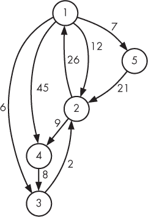

## B

因为我无法抗拒


在本附录中，我包括了一些与本书中研究的某些问题相关的附加材料。我认为这个附录是可选的：它并不涉及我认为对学习数据结构和算法目标至关重要的内容。然而，如果你渴望更深入了解某个问题，这个附录将适合你。

### Unique Snowflakes：隐式链表

通常在编译时我们并不知道程序需要多少内存。如果你曾经问过：“我应该把这个数组做多大？”或者“这个数组够大吗？”那么你就亲身体验过 C 语言数组的局限性：我们必须选择一个数组大小，但在数组开始填充之前，我们可能不知道需要多大的数组。在许多这种情况下，链表能巧妙地解决问题。每当我们需要新内存来存储数据时，我们只需在运行时调用`malloc`来向链表添加一个节点。

在第一章的第一个问题——Unique Snowflakes 中，我们使用链表将位于同一桶中的雪花串联起来。对于每个我们读取的雪花，我们使用`malloc`为每一个雪花分配内存。如果我们读取了 5,000 个雪花，我们就会进行 5,000 次`malloc`调用。这些`malloc`调用所耗费的时间可能会积累起来。

等等！我们刚才说过，当我们不知道需要多少内存时，链表是有用的。而在 Unique Snowflakes 问题中，我们*确实*知道！或者，至少我们知道我们需要的*最大*内存：它是存储最多 100,000 个雪花所需的内存。

这引出了几个问题。为什么我们要使用`malloc`呢？有没有办法避免使用`malloc`和链表呢？事实上，我们可以通过一种不使用`malloc`且能使速度翻倍的方式来解决 Unique Snowflakes 问题。怎么做呢？

关键思想是预先分配一个数组，存储我们可能使用的最大节点数（100,000）。这个数组称为`nodes`，它存储所有（现在是隐式的）链表中的节点。`nodes`中的每个元素是一个整数，表示其节点列表中下一个节点的索引。让我们通过解读一个示例`nodes`数组来理解这一点：

```
[-1, 0, -1, 1, 2, 4, 5]
```

假设我们知道其中一个列表从索引`6`开始。索引`6`的值是`5`，这告诉我们索引`5`是列表中的下一个节点。同样，索引`5`告诉我们索引`4`是列表中的下一个节点。索引`4`告诉我们索引`2`是列表中的下一个节点。那么索引`2`，值为`-1`呢？我们将`-1`作为我们的`NULL`值：它表示没有“下一个”元素。我们已经发现了索引`6`、`5`、`4`和`2`的列表。

在那个数组中还有一个非空列表。假设我们知道这个列表从索引`3`开始。索引`3`告诉我们索引`1`是列表中的下一个节点。索引`1`告诉我们索引`0`是列表中的下一个节点。然后就结束了——索引`0`是`-1`，所以列表结束了。我们已经发现了索引`3`、`1`和`0`的列表。

这就是`nodes`数组。如果某个索引的值为`-1`，则表示这是链表的结束。否则，它给出了链表中下一个元素的索引。

注意，`nodes`数组并没有告诉我们链表的起始位置。我们必须假设我们知道链表头节点的索引分别是`6`和`3`。我们是怎么知道的呢？通过使用另一个数组`heads`，它给出了链表中第一个节点的索引。如果某个元素不是链表的起始节点，`heads`会使用`-1`表示。

我们的无`malloc`解决方案在`main`函数中使用了三个数组：`snowflakes`、`nodes`和`heads`。`snowflakes`数组存储实际的雪花数据，以便我们根据`nodes`和`heads`中的索引查找雪花。以下是这三个数组：

```
static int snowflakes[SIZE][6];
static int heads[SIZE];
static int nodes[SIZE];
```

只有两个函数需要调整才能从链表过渡到我们在这里使用的隐式链表：`identify_identical`和`main`。这些调整是语法层面的，而不是功能层面的：`identify_identical`仍然执行列表中所有雪花的两两比较，而`main`仍然读取雪花并构建链表。

新的`identify_identical`函数见 Listing B-1—请与之前在 Listing 1-12 中的内容进行对比！

```
void identify_identical(int snowflakes[][6], int heads[],
                        int nodes[]) {
  int i, node1, node2;
  for (i = 0; i < SIZE; i++) {
    node1 = heads[i];
    while (node1 != -1) {
   ➊ node2 = nodes[node1];
      while (node2 != -1) {
        if (are_identical(snowflakes[node1], snowflakes[node2])) {
          printf("Twin snowflakes found.\n");
          return;
        }
     ➋ node2 = nodes[node2];
     }
   ➌ node1 = nodes[node1];
   }
  }
  printf("No two snowflakes are alike.\n");
}
```

*Listing B-1：在隐式链表中识别相同的雪花*

在`for`循环内，`node1`被设置为当前列表的头节点。如果这个列表为空，则外部的`while`循环对于这个节点不会执行。如果列表不为空，那么通过使用`nodes`数组，`node2`被设置为`node1`之后的节点➊。我们不是使用像`node2 = node2->next`这样的链表代码，而是再次使用`nodes`数组来查找下一个节点➋ ➌。

新的`main`函数见 Listing B-2。

```
int main(void) {
  static int snowflakes[SIZE][6];
  static int heads[SIZE];
  static int nodes[SIZE];
  int n;
  int i, j, snowflake_code;
  for (i = 0; i < SIZE; i++) {
    heads[i] = -1;
    nodes[i] = -1;
  }
  scanf("%d", &n);
  for (i = 0; i < n; i++) {
    for (j = 0; j < 6; j++)
      scanf("%d", &snowflakes[i][j]);
    snowflake_code = code(snowflakes[i]);
  ➊ nodes[i] = heads[snowflake_code];
  ➋ heads[snowflake_code] = i;
  }
  identify_identical(snowflakes, heads, nodes);
  return 0;
}
```

*Listing B-2：隐式链表的* main *函数*

假设我们刚读取了一片雪花，并将其存储在`snowflakes`数组的第`i`行。我们希望这片雪花成为它所在链表的头节点。为此，我们将旧的链表头节点存储在`nodes[i]`➊处，然后将链表头节点设置为雪花`i`➋。

花点时间将这个解决方案与我们的链表解决方案进行比较。你更喜欢哪个？没有`malloc`的解决方案对你来说是更难理解还是更容易理解？请提交两个版本给评审员；这种加速值得吗？

### 汉堡热潮：重构解决方案

在第三章中，我们解决了三个问题——汉堡热潮、贪财者和冰球对抗——这些问题涉及最小化或最大化解决方案的值。在汉堡热潮中，我们最大化了霍默吃汉堡的时间；我们给出了一个答案，比如`2 2`，意味着两个汉堡和两分钟喝啤酒。在贪财者中，我们最小化了购买苹果所需的金钱；我们给出了一个答案，比如`买 3 个，花费$3.00`。在冰球对抗中，我们最大化了对抗比赛中的进球数；我们给出了一个答案，比如`20`。

但是请注意，我们在这里做的是给出最优解的*值*，而不是给出最优解本身。我们并没有指明应该吃哪些汉堡，或者如何购买苹果，或者哪些游戏是竞争性游戏。

绝大多数优化问题在竞赛编程中要求最优解的*值*，这是第三章和第四章的重点。然而，如果我们愿意，也可以使用记忆化和动态规划来返回最优解本身。

让我们用“汉堡狂热”作为例子，看看这是如何做的。给定以下测试用例：

```
4 9 15
```

让我们不仅输出最优解的*值*，还输出最优解本身，像这样：

```
2 2
Eat a 4-minute burger
Eat a 9-minute burger
```

第一行是我们之前的内容；其他行则构成了最优解本身，证明`2 2`确实是可以实现的。

输出最优解的*值*被称为*重构*或*恢复*解。以上两个词都表明我们已经有了可以拼接成最优解的各个部分。确实如此：我们所需要的就在`memo`或`dp`数组中。在这里，我们使用`dp`数组；`memo`数组也可以以相同的方式使用。

我们将为这个函数签名编写主体：

```
void reconstruct(int m, int n, int dp[], int minutes)
```

回想一下，我们有*m*分钟和*n*分钟的汉堡。`m`和`n`参数就是这些值，并且来自当前的测试用例。`dp`参数是由清单 3-8 中的动态规划算法生成的数组。最后，`minutes`参数是吃汉堡所花费的时间。该函数将按行打印应在最优解中吃的汉堡数量。

在最优解中，霍默最后应该吃哪个汉堡？如果我们从头开始解决这个问题，那么我们并不知道答案。我们需要看看如果选择一个*m*分钟的汉堡作为最后一个会发生什么，同时也要看看如果选择一个*n*分钟的汉堡作为最后一个会发生什么。实际上，这就是我们在第三章中解决这个问题时所做的。记住，现在我们有了`dp`数组可以使用。这个数组将告诉我们哪种选择是最好的。

关键的思路是：查看`dp[minutes - m]`和`dp[minutes - n]`。这两个值都已经可以访问，因为`dp`数组已经构建完成。哪个值更大，就告诉我们应该选择哪一个作为最后的汉堡。也就是说，如果`dp[minutes - m]`更大，那么最后一个是*m*分钟的汉堡；如果`dp[minutes - n]`更大，那么最后一个是*n*分钟的汉堡。（如果`dp[minutes - m]`和`dp[minutes - n]`相等，那么你可以随意选择最后一个是*m*分钟还是*n*分钟的汉堡。）

这种推理与清单 3-8 中构建`dp`数组的方式相似。在那里，我们选择了`first`和`second`的最大值；这里，我们则是反向推断出动态规划算法所做的选择。

一旦我们推导出最终的汉堡，我们会去掉吃掉那个汉堡所花的时间，然后重复这个过程。我们一直进行下去，直到剩下零分钟为止，这时我们的重构就完成了。清单 B-3 给出了该函数的代码。

```
void reconstruct(int m, int n, int dp[], int minutes) {
  int first, second;
  while (minutes > 0) {
    first = -1;
    second = -1;
    if (minutes >= m)
      first = dp[minutes - m];
    if (minutes >= n)
      second = dp[minutes - n];
    if (first >= second) {
      printf("Eat a %d-minute burger\n", m);
      minutes = minutes - m;
    } else {
      printf("Eat a %d-minute burger\n", n);
 minutes = minutes - n;
    }
  }
}
```

*清单 B-3：重构解决方案*

该函数应在清单 3-8 的两个地方调用，每次在`printf`调用后。第一次是：

```
reconstruct(m, n, dp, t);
```

第二个是：

```
reconstruct(m, n, dp, i);
```

我鼓励你以同样的风格重构“Moneygrubbers”和“Hockey Rivalry”问题的最优解。

### 骑士追击：编码移动

在第五章的骑士追击问题中，我们设计了一个 BFS 算法，用来找出骑士从起点到每个方格所需的步数。骑士有八个可能的移动，我们在代码中写出了每一个（见清单 5-1）。例如，下面是我们让骑士探索上移 1 和右移 2 的做法：

```
add_position(from_row, from_col, from_row + 1, from_col + 2,
             num_rows, num_cols, new_positions,
             &num_new_positions, min_moves);
```

这是我们对上移 1 和左移 2 的做法：

```
add_position(from_row, from_col, from_row + 1, from_col - 2,
             num_rows, num_cols, new_positions,
             &num_new_positions, min_moves);
```

那里有严重的代码重复：唯一的变化是加号变成了减号！事实上，所有八个移动都以非常相似的方式编码，只是在一些加号、减号和 1、2 之间进行调整。这样的做法很容易出错。

幸运的是，有一种巧妙的技术可以避开这种代码重复。它适用于许多要求探索多维（如行和列）隐式图的题目。

这是问题描述中第五章中展示的骑士的八个可能移动：

+   上 1，右 2

+   上 1，左 2

+   下 1，右 2

+   下 1，上 2

+   上 2，右 1

+   上 2，左 1

+   下 2，右 1

+   下 2，左 1

让我们首先关注行，并写下每个移动如何改变行号。第一个移动使行号增加 1，第二个移动也如此。第三和第四个移动则使行号减少 1。第五和第六个移动使行号增加 2，第七和第八个移动使行号减少 2。以下是这些数值的数组：

```
int row_dif[8] = {1, 1, -1, -1, 2, 2, -2, -2};
```

它叫做`row_dif`，因为它给出了当前行与移动后行号之间的差异。

现在我们对列做同样的事情。第一个移动使列号增加 2，第二个移动使列号减少 2，依此类推。作为一个数组，列的差值为：

```
int col_dif[8] = {2, -2, 2, -2, 1, -1, 1, -1};
```

这两个平行数组的有用之处在于，它们描述了每个移动对当前行和列的影响。`row_dif[0]`和`col_dif[0]`中的数字告诉你，第一个移动会使行增加 1，列增加 2，`row_dif[1]`和`col_dif[1]`中的数字告诉你，第二个移动会使行增加 1，列减少 2，依此类推。

现在，我们不需要输入八个几乎完全相同的`add_position`调用，而是可以使用一个包含八次迭代的循环，只需在其中输入一次`add_position`调用。以下是实现方式，使用一个新的整数变量`m`来循环遍历移动：

```
for (m = 0; m < 8; m++)
  add_position(from_row, from_col,
               from_row + row_dif[m], from_col + col_dif[m],
               num_rows, num_cols, new_positions,
               &num_new_positions, min_moves);
```

这样更好！更新你在第五章中的骑士追击代码，并与判题系统一起测试。你应该仍然能通过所有的测试用例，且代码的运行速度不会明显变快或变慢，但你已经消除了相当多的重复代码，这是一个胜利。

我们这里只有八个移动，因此我们能够在第五章中的骑士追击游戏中生还，而没有使用这种编码技巧。然而，如果我们有更多的移动，重复调用`add_position`就不再可行了。我们在这里看到的方式扩展性更好。

### Dijkstra 算法：使用堆

在第六章中，我们学习了 Dijkstra 算法，它用于在加权图中找到最短路径。我们实现的 Dijkstra 算法的运行时间是*O*(*n*²)，其中*n*是图中节点的数量。Dijkstra 算法大部分时间都在寻找最小值：每次迭代时，它都必须找到距离最小的节点，且这些节点尚未完成处理。

然后，在第八章中，我们学习了最大堆和最小堆。最大堆在这里没有用处——但是最小堆有用，因为它的作用是快速找到最小值。因此，我们可以使用最小堆来加速 Dijkstra 算法。这简直是计算机科学的天堂配对。

最小堆将保存所有已发现且尚未完成的节点。它也可能包含一些已发现但已完成的节点。不过没关系：就像我们在第八章中使用堆解决超市促销问题时做的那样，我们只需要忽略从最小堆中出来的已完成节点。

#### *老鼠迷宫：使用堆进行追踪*

让我们增强第六章中对老鼠迷宫问题的解决方案，使用最小堆。这是我们在那里使用的图形（图 6-1）：



在第六章中，我们从节点 1 开始追踪 Dijkstra 算法。让我们再次做一次这项工作，这次使用最小堆。每个堆元素将包含一个节点和到达该节点所需的时间。我们将看到，堆中可能有多个相同节点的出现。然而，由于它是一个最小堆，我们将能够使用每个节点的最小时间来处理它。

在接下来的每个最小堆快照中，我按照它们在堆数组中存储的顺序排列了行。

我们从只有节点 1 在堆中的状态开始，时间为 0。我们没有其他节点的时间信息。因此，我们的快照如下：

最小堆

| ***节点*** | ***时间*** |
| --- | --- |
| 1 | 0 |

其余状态

| ***节点*** | ***已完成*** | ***最小时间*** |
| --- | --- | --- |
| 1 | false | 0 |
| 2 | false |  |
| 3 | false |  |
| 4 | false |  |
| 5 | false |  |

从最小堆中提取出唯一的元素节点 1。然后我们处理节点 1，更新到节点 2、3、4 和 5 的最短路径，并将这些节点放入最小堆中。现在的状态如下：

最小堆

| ***节点*** | ***时间*** |
| --- | --- |
| 3 | 6 |
| 2 | 12 |
| 5 | 7 |
| 4 | 45 |

其余状态

| ***节点*** | ***已完成*** | ***最小时间*** |
| --- | --- | --- |
| 1 | true | 0 |
| 2 | false | 12 |
| 3 | false | 6 |
| 4 | false | 45 |
| 5 | false | 7 |

节点 3 是接下来从最小堆中弹出的，它为节点 2 提供了一个更短的路径。因此，我们将另一个节点 2 加入堆中，这个节点的路径比之前更短。现在的状态如下：

最小堆

| ***节点*** | ***时间*** |
| --- | --- |
| 5 | 7 |
| 2 | 8 |
| 4 | 45 |
| 2 | 12 |

其余状态

| ***节点*** | ***已完成*** | ***最小时间*** |
| --- | --- | --- |
| 1 | true | 0 |
| 2 | false | 8 |
| 3 | true | 6 |
| 4 | false | 45 |
| 5 | false | 7 |

下一个弹出的节点是节点 5。它没有导致任何最短路径更新，所以没有新的节点被加入堆中。现在的状态如下：

最小堆

| ***节点*** | ***时间*** |
| --- | --- |
| 2 | 8 |
| 2 | 12 |
| 4 | 45 |

其余状态

| ***节点*** | ***已完成*** | ***最小时间*** |
| --- | --- | --- |
| 1 | true | 0 |
| 2 | false | 8 |
| 3 | true | 6 |
| 4 | false | 45 |
| 5 | true | 7 |

节点 2 是下一个从最小堆中弹出的节点——具体来说是时间为 8 的那个，而不是时间为 12 的那个！它导致了节点 4 最短路径的更新，因此节点 4 会重新出现在最小堆中。结果如下：

最小堆

| ***节点*** | ***时间*** |
| --- | --- |
| 2 | 12 |
| 4 | 45 |
| 4 | 17 |

其余状态

| ***节点*** | ***已完成*** | ***最小时间*** |
| --- | --- | --- |
| 1 | true | 0 |
| 2 | true | 8 |
| 3 | true | 6 |
| 4 | false | 17 |
| 5 | true | 7 |

下一个从最小堆中弹出的节点是节点 2。又来了！节点 2 已经完成，所以我们直接从堆中提取它，不做任何其他处理。我们当然不会再次处理这个节点。剩下的状态如下：

最小堆

| ***单元格*** | ***时间*** |
| --- | --- |
| 4 | 17 |
| 4 | 45 |

其余状态

| ***节点*** | ***已完成*** | ***最小时间*** |
| --- | --- | --- |
| 1 | true | 0 |
| 2 | true | 8 |
| 3 | true | 6 |
| 4 | false | 17 |
| 5 | true | 7 |

两个节点 4 会依次从最小堆中提取。第一个节点 4 不会导致任何最短路径更新——其他所有节点都已经完成——但是会将节点 4 标记为已完成。第二个节点 4 因此会被跳过。

在大多数基于堆的教材实现中，Dijkstra 算法假设有一种方法可以减少堆中节点的最短路径距离。这样，节点就可以在堆中更新，而无需存在多个相同的节点。然而，在第八章中我们开发的堆并不支持这种“减少”操作。请放心，我们这里采用插入而非更新的方法，具有相同的最坏情况时间复杂度。那么，究竟是什么呢？

设图中有 *n* 个节点，*m* 条边。我们最多处理每条边 *u* *→* *v* 一次，当 *u* 从堆中提取时。每条边至多会导致一次堆插入，因此我们最多插入 *m* 个元素。那么堆的最大大小就是 *m*。我们只能提取已经插入的元素，因此最多有 *m* 次提取操作。总共是 2*m* 次堆操作，每次操作最多花费 log *m* 时间。因此，我们得到了一个 *O*(*m* log *m*) 的算法。

将此与第六章中的 *O*(*n*²) 实现进行比较。当边的数量相对于 *n*² 较小时，基于堆的实现明显更优。例如，如果有 *n* 条边，则基于堆的实现是 *O*(*n* log *n*)，这比第六章中的 *O*(*n*²) 运行时间要快得多。如果边的数量很大，那么选择哪种实现就不那么重要了。例如，如果有 *n*² 条边，堆的实现是 *O*(*n*² log *n*)，尽管比 *O*(*n*²) 稍慢，但依然有竞争力。如果你无法预见图中边的数量较少还是较多，使用堆是一个安全的选择：唯一的成本是在边多的图中额外的 log *n* 因子，但在边少的图中获得更好的性能，这是值得付出的代价。

#### *老鼠迷宫：使用堆的实现*

现在让我们使用堆来解决老鼠迷宫问题。我们为堆元素使用以下结构：

```
typedef struct heap_element {
  int cell;
  int time;
} heap_element;
```

我不会在这里重复最小堆插入代码（清单 8-5）或提取代码（清单 8-6）。唯一的变化是将比较对象从 `cost` 改为 `time`；这部分留给你完成。

`main` 函数与第六章中的相同（清单 6-1）。我们需要做的只是替换 `find_time`（清单 6-2），使用最小堆代替线性搜索。该代码可以在清单 B-4 中找到。

```
int find_time(edge *adj_list[], int num_cells,
              int from_cell, int exit_cell) {
  static int done[MAX_CELLS + 1];
  static int min_times[MAX_CELLS + 1];
➊ static heap_element min_heap[MAX_CELLS * MAX_CELLS + 1];
  int i;
  int min_time, min_time_index, old_time;
  edge *e;
  int num_min_heap = 0;
  for (i = 1; i <= num_cells; i++) {
    done[i] = 0;
    min_times[i] = -1;
  }
  min_times[from_cell] = 0;
  min_heap_insert(min_heap, &num_min_heap, from_cell, 0);

 ➋ while (num_min_heap > 0) {
      min_time_index = min_heap_extract(min_heap, &num_min_heap).cell;
      if (done[min_time_index])
      ➌ continue;
      min_time = min_times[min_time_index];
 done[min_time_index] = 1;

   e = adj_list[min_time_index];
 ➍ while (e) {
      old_time = min_times[e->to_cell];
      if (old_time == -1 || old_time> min_time + e->length) {
        min_times[e->to_cell] = min_time + e->length;
     ➎ min_heap_insert(min_heap, &num_min_heap,
                e->to_cell, min_time + e->length);
      }
      e = e->next;
    }
  }
  return min_times[exit_cell];
}
```

*清单 B-4：使用 Dijkstra 算法和堆求解最短路径*

每个单元格最多可以向最小堆中添加 `MAX_CELLS` 个元素，并且最多有 `MAX_CELLS` 个单元格。因此，如果我们为 `MAX_CELLS * MAX_CELLS` 个元素加一分配空间，就可以避免溢出最小堆，因为我们从 `1` 开始索引，而不是从 `0` 开始 ➊。

主 `while` 循环会一直执行，只要最小堆中有元素 ➋。如果从最小堆提取的节点已经完成，那么我们就不在其迭代上做任何操作 ➌。否则，我们像往常一样处理出边 ➍，当找到更短的路径时，将节点添加到最小堆 ➎。

### 压缩路径压缩

在第九章中，你学习了路径压缩，这是对基于树的并查集数据结构的优化。我们在列表 9-8 中看到了它在社交网络问题中的代码。那样写，带有两个 `while` 循环，并不是你在实际中看到的代码样式。

我通常不喜欢停留在晦涩的代码上——我希望书中没有给你展示过这样的代码——但在这里我做个例外，因为你可能会在某个时刻遇到一个特别复杂的、一行实现的路径压缩代码。它展示在列表 B-5 中。

```
int find(int p, int parent[]) {
  return p == parent[p] ? p : (parent[p] = find(parent[p], parent));
}
```

*列表 B-5：路径压缩的实际应用*

我将 `person` 改为 `p`，使代码只占一行（因为可读性已经差到这种程度，为什么不呢？）。

这里有很多内容：`? :` 三元条件运算符，使用 `=` 赋值运算符的结果，甚至还有递归。我们将分三步来解开这个问题。

#### *步骤 1：不再使用三元条件语句*

`? :` 运算符是一种返回值的 if-else 形式。程序员通常在希望节省空间时使用它，将整个 if 语句压缩到一行中。一个简单的例子如下：

```
return x >= 10 ? "big" : "small";
```

如果 `x` 大于或等于 10，则返回 `"big"`；否则，返回 `"small"`。

`? :` 运算符被称为 *三元* 运算符，因为它有三个操作数：第一个表达式是我们正在测试其真值的布尔表达式，第二个表达式是当第一个表达式为真时的结果，第三个是当第一个表达式为假时的结果。

让我们重写列表 B-5，使用标准的 `if...else` 语句，而不是三元 `if`：

```
int find(int p, int parent[]) {
  if (p == parent[p])
    return p;
  else
    return parent[p] = find(parent[p], parent);
}
```

这样稍微好一点。现在我们明确看到代码有两条路径：一条是当 `p` 已经是根节点时，另一条是当 `p` 不是根节点时。

#### *步骤 2：更清晰的赋值运算符*

你认为这段代码做了什么？

```
int x;
printf("%d\n", x = 5);
```

答案是它打印出 `5`！你知道 `x = 5` 会把 `5` 赋给 `x`，但它也是一个值为 `5` 的表达式。没错：`=` 赋值，但它也返回存储在变量中的值。这也是我们可以执行以下操作的原因：

```
a = b = c = 5;
```

将相同的值赋给多个变量。

在路径压缩代码中，我们在同一行上有一个返回语句和一个赋值语句。那一行既赋值给 `parent[p]`，又返回该值。让我们将这两个操作分开：

```
int find(int p, int parent[]) {
  int community;
  if (p == parent[p])
    return p;
  else {
    community = find(parent[p], parent);
 parent[p] = community;
    return community;
  }
}
```

我们明确找到了 `p` 的代表，将 `parent[p]` 赋值给该代表，然后返回该代表。

#### *步骤 3：理解递归*

现在我们将递归独立成一行：

```
community = find(parent[p], parent);
```

`find`函数从它的参数到树的根进行路径压缩，并返回树的根。因此，这次递归调用执行了从`p`的父节点到树根的路径压缩，并返回树的根。这样就处理了除`p`本身之外的所有路径压缩。我们还需要将`p`的父节点设置为树的根，这可以通过以下方式实现：

```
parent[p] = community;
```

就这样：证明了一行路径压缩代码确实有效！

### 瓶盖和瓶子：就地排序

在第十章中，我们使用快速排序中一个著名的“拆分”思想解决了“瓶盖和瓶子”问题。如果你回头查看列表 10-9，你会发现我们在算法运行过程中分配了大量的额外内存。具体来说，在每次调用`solve`时，我们都会使用`malloc`为四个数组分配内存：小瓶盖、小瓶子、大瓶盖和大瓶子。

通过直接在`cap_nums`和`bottle_nums`数组中进行拆分，我们有可能避免使用额外的内存。这不会减少我们需要进行的查询次数，但确实减少了程序使用的内存。这也是在实现快速排序时，常见的一种优化方法。

为了使这个方法有效，我们需要跟踪小值和大值之间的边界。我们将维护一个名为`border`的变量来实现这一点。一旦我们完成了遍历所有瓶盖和瓶子，`border`变量将准确告诉我们问题在哪里被分成了两部分；我们需要它来进行递归调用。请参见列表 B-6，该列表展示了我们使用此思想的新解决方案。

```
#define MAX_N 10000

void swap(int *x, int *y) {
  int temp = *x;
 *x = *y;
    *y = temp;
  }

  int random_value(int left, int width) {
    return (rand() % width) + left;
  }

➊ void solve(int cap_nums[], int bottle_nums[], int left, int right) {
    int border, cap_index, cap_num, i, result, matching_bottle;
    if (right < left)
      return;

    border = left;
  ➋ cap_index = random_value(left, right - left + 1);
     cap_num = cap_nums[cap_index];

     i = left;
     while (i < right) {
       printf("0 %d %d\n", cap_num, bottle_nums[i]);
       scanf("%d", &result);
     ➌ if (result == 0) {
         swap(&bottle_nums[i], &bottle_nums[right]);
    ➍ } else if (result == 1) {
      ➎ swap(&bottle_nums[border], &bottle_nums[i]);
         border++;
         i++;
 } else {
         i++;
       }
    }

    matching_bottle = bottle_nums[right];
 ➏ printf("1 %d %d\n", cap_num, matching_bottle);

    border = left;

    i = left;
    while (i < right) {
      printf("0 %d %d\n", cap_nums[i], matching_bottle);
      scanf("%d", &result);
      if (result == 0) {
        swap(&cap_nums[i], &cap_nums[right]);
      } else if (result == -1) {
        swap(&cap_nums[border], &cap_nums[i]);
        border++;
        i++;
      } else {
        i++;
      }
   }

➐ solve(cap_nums, bottle_nums, left, border - 1);
➑ solve(cap_nums, bottle_nums, border, right - 1);
}

int main(void) {
  int n, i;
  int cap_nums[MAX_N], bottle_nums[MAX_N];
  srand((unsigned) time(NULL));
  scanf("%d", &n);
  for (i = 0; i < n; i++) {
    cap_nums[i] = i + 1;
    bottle_nums[i] = i + 1;
  }
  solve(cap_nums, bottle_nums, 0, n - 1);
  return 0;
}
```

*列表 B-6：无额外内存分配的解决方案*

与其使用一个`n`参数来表示瓶盖和瓶子的数量，现在我们需要使用`left`和`right`参数来限定数组的操作部分 ➊。

在第一次`while`循环之前，我们选择了我们的随机边界 ➋。第一个`while`循环的关键不变量是：从`left`到`border - 1`的所有瓶子都是小瓶子，而从`border`到`i - 1`的所有瓶子都是大瓶子。循环最终还会找到匹配的瓶子；当它找到时，会把它放到右边 ➌。然后我们可以在后续的递归调用中忽略这个瓶子。

如果我们发现瓶盖对于当前瓶子来说太大 ➍，这意味着当前瓶子位于`border`的错误一侧。毕竟，它是一个小瓶子，而小瓶子应该位于`border`的左边。为了解决这个问题，我们将这个小瓶子与`bottle_nums[border]`处的大瓶子交换 ➎，然后我们将`border`递增，以便考虑到我们现在有了一个新的小瓶子在`border`的左侧。

当`while`循环完成时，我们将重新排列瓶子，使小瓶子排在前面，大瓶子排在后面。我们还会把匹配的瓶子放到右边，所以现在就可以告诉判断器这个匹配了 ➏。

第二个`while`循环与第一个几乎完全相同，只不过这次它分割的是瓶盖，而不是瓶子。

我们需要做的最后一件事是进行两个递归调用。第一个调用从`left`到`border - 1` ➐——那是所有的小瓶子和瓶盖。第二个调用从`border`到`right - 1` ➑——那是所有的大瓶子和瓶盖。注意：这里我们需要`right - 1`，而不是`right`。索引为`right`的瓶子和瓶盖已经匹配过了，因此不应再传递给递归调用。
