# 第五章：机器学习基础**

在 Android 生态系统的早期，防御者通过手动分析应用程序来判断它们是否为恶意软件。这个技术在当时是可行的，因为操作系统的市场份额较小，且最初为其开发的应用程序不多。然而，情况已经发生了变化。最近的官方报告显示，每月有超过 10 万个 Android APK 文件在 Google Play 上发布。我们自己的估计表明，实际数字要高得多。

现在，公司不再可能手动评估如此多种类繁多的应用程序的安全级别。最初，分析师通过依赖人类识别的仅存在于恶意软件中的模式来解决这个问题。他们编写了检测规则，使用 YARA 或其他工具，标记包含这些模式的应用程序。然而，这种方法无法扩展，因为分析师很快就发现，追踪数百万个应用程序中出现的特征变得不再可行。

相反，分析师开始使用机器学习算法，这些算法能够在没有明确编程的情况下，通过学习示例对大量应用程序执行这些任务。这种方法证明效率更高，减轻了人工分析师的负担。本章介绍了你需要熟悉的机器学习基础知识，以便理解本书其余章节中展示的内容，重点介绍了在恶意软件检测中流行的分类算法。已经熟悉该主题的读者可以跳过此部分。

### **机器学习在恶意软件分析中的应用原理**

在恶意软件分析中，我们最常使用机器学习方法将应用程序分类为良性、恶意，或者在某些情况下，可能是恶意的。从更深的层次来看，更复杂的方法可以提供越来越细致的标签，识别出应用程序属于特定类型的恶意软件，例如间谍软件、银行木马等。鉴于自动化方法提供的支持，安全分析师可以专注于检查*灰色区域*的应用程序，或者那些不能准确归类为良性软件或恶意软件的应用程序。机器学习大大减少了分析师需要手动审查的应用程序数量。

机器学习算法可以是有监督的或无监督的。*有监督*算法需要带标签的数据集，而*无监督*算法则通过学习数据中的内在模式来工作。分类算法是最常见的有监督算法，而聚类和异常检测是无监督算法的常见例子。每种算法在与安全相关的机器学习中都有其独特的用途。

*分类*算法，也叫*分类器*，会考虑一个实体的信息，比如应用、图片或用户帐户，并将其划分到一个或多个类别中。例如，在 Android 应用的情况下，我们可能有两个感兴趣的类别：恶意软件和良性软件。但如果我们要对其他内容进行分类——例如 Instagram 帐户——我们可能会有更多的类别：*未成年*适用于 18 岁以下的人，*年轻成人*适用于 18-40 岁的人，*中年*适用于 41-65 岁的人，*老年*适用于 66 岁或以上的人。处理分类问题的工程师会定义类别的确切数量和每个类别的含义。一个挑战是，分类算法通常需要大量的标签样本（算法可以学习的已分类样本）来生成准确的模型，而这些样本并不总是可用的。

*聚类*算法从多个实体中获取信息，并将相似的样本分组到簇中。例如，恶意开发者通常会随着时间的推移创建多个版本的恶意软件，以寻找避开检测或添加新功能的方法。在这种情况下，簇可能对应于同一恶意软件家族的不同版本。聚类算法需要一种方法来衡量观察实体之间的相似性或距离，领域专家负责定义如何根据聚类目标计算这种相似性。

虽然聚类算法不需要标签数据，但如果算法不知道分析师正在寻找什么，那么它生成的聚类可能难以解释。恶意软件和良性软件经常共享 SDK 和库，这可能会混淆聚类系统，导致它仅仅因为共享一个 SDK 而将恶意软件和良性软件归为一类。

*异常检测*或*离群点检测*算法尝试识别在给定数据集中与几乎所有其他实体明显不同的实体。例如，曾经有过通过检查应用程序行为是否与常规行为显著不同来寻找恶意应用的努力。然而，特别是在 Android 恶意软件检测中，一个挑战是，大多数恶意软件都在 Android 安全模型的范围内运行，请求毫不知情的受害者授权执行恶意行为。一个将所有短信发送到远程服务器的应用程序是间谍软件，还是一个短信备份应用程序？异常检测算法可能很难区分这两种情况。

事实证明，绝大多数成功将机器学习应用于恶意软件检测的努力都依赖于分类算法。然而，一些技术尝试通过混合使用聚类和分类来识别给定恶意软件样本所属的家族，例如 Tanmoy Chakraborty 等人提出的“EC2：集成聚类与分类预测 Android 恶意软件家族”系统。

#### ***识别应用特征***

大多数机器学习算法假设每个感兴趣的实体都有一个相关的*特征向量*，这是一个有序的值列表，包含与正在研究的实体的重要属性。在恶意软件分析的情况下，感兴趣的实体是应用本身。特征向量包括从 APK 分析或应用执行中提取的属性，这些特征可以是手工制作的，也可以是自动生成的。

在恶意软件检测与分类的过程中，特征可能与应用是否请求特定权限（例如读取接收短信的权限）、代码中是否包含加密部分、代码是否尝试连接外部服务器等相关。对于这些问题，如果答案是肯定的，则特征设为 1，否则设为 0。其他特征可能具有*非二元*值。例如，我们可能会有一个特征，表示应用源代码中调用 Android API 中某个包的次数。机器学习方法利用这些特征来识别和分类实体。第六章将描述在安卓恶意软件分析中重要的各种特征类型。

安卓应用的内容本身提供了看似无限数量的潜在特征，但我们不必仅限于 APK 内部的数据作为特征集。事实上，将 APK 文件中的特征与外部信息相连接，往往能带来意想不到的价值。例如，对于一个连接到特定域名的应用，我们可以将该域名的 Whois 信息转化为特征。类似地，如果一个应用连接到某个 IP 地址，我们可以获取有关该 IP 地址的所有者、为其提供服务的数据中心、服务器所在的国家，甚至是来自服务器本身的信息，例如它运行的操作系统或它托管的其他软件。

另一个例子是，如果一个应用向一个高级短信号码发送信息，我们可能能够确定哪个移动运营商拥有该号码，以及该号码与该运营商合作注册的商业实体。机器学习系统的开发者可以选择将这些信息作为特征，来表征某些恶意软件家族和开发者。

#### ***创建训练集***

一个*训练样本*对于分类算法来说是一个计算对象，由特征向量和类别标签组成。从正式的角度来看，我们可以说它由一对(*f* , *c*)组成，其中*f*是特征向量，*c*是我们认为样本所属的类别。请注意，在安卓恶意软件分析中，要使一个应用成为训练样本，我们必须已经知道它的类别（例如，恶意软件或良性软件）。

*训练集*是一个有限的训练样本集合。我们通常可以将其表示为一个表格或电子表格。在恶意软件与良性软件分类的情况下，表格中的行对应于应用程序，列对应于各种特征。一个特殊的列代表标签或类别；也就是说，给定行中的应用程序是恶意软件（设置为 1）还是良性软件（设置为 0）。表 5-1 展示了与安卓应用程序相关的小样本训练集。

在这个训练集中，为了简化起见，我们只展示了两个特征。*电信*特征捕获了应用程序对*android.telephony.cdma*包发出的呼叫次数，而*应用程序*特征则捕获了对*android.app*包的调用次数。例如，在表 5-1 的第一行中显示的应用程序，其源代码中对*电信*包中的类进行了 27 次调用，对*应用程序*API 包中的类进行了 2,655 次调用。这个应用程序是恶意软件：我们可以看到其标签列中的值为 1。

该训练集中的每个应用程序可以看作是散点图上的一个点。例如，我们可以将表中的第一个应用程序定位到坐标(27,2655)。在图 5-1 中，我们用一个叉号表示它，因为它是恶意软件。我们用点表示良性软件。正如你所看到的，应用程序的特征向量决定了它在这个特征空间中的位置。

当然，在现实世界中，分析人员可能会使用一个更大的训练集（包含成千上万的应用程序）。特征的数量可能也会达到数百、数千甚至更多。

创建良好的训练集是具有挑战性的。理想情况下，训练集应该庞大且多样化，并且其数据，特别是标签，必须尽可能准确。对于恶意软件分析来说，这提出了一个问题。如何在没有几个月精心且昂贵的人工研究和分析的情况下，整理出一套精确标注的包含成千上万的恶意软件和良性软件的应用程序集？

**表 5-1：** 简单训练集

| **电信特征** | **应用程序特征** | **样本名称** | **标签** |
| --- | --- | --- | --- |
| 27 | 2655 | 14292932679d6930f521a21de4e8bffd.apk | 1 |
| 3 | 1764 | 04276665aaa3725ea34097c4c874873c.apk | 1 |
| 3 | 870 | e8290db04c7004ec8bb53f7cda155eb9.apk | 1 |
| 3 | 2086 | 03f9eff3229e3a4eefc9224f916202b8.apk | 1 |
| 3 | 329 | 1c4e357a8ec5f13de4ffd57cc2711afe.apk | 1 |
| 3 | 1499 | 080b0ed2d9bf87e9f3d061a1ba48da33.apk | 1 |
| 27 | 2652 | 08026e2b63ec51cb36bc6cff00c28909.apk | 1 |
| 27 | 2637 | 094f67a3a682a0cd4305d720cc786e00.apk | 1 |
| 3 | 877 | 3a895a2d19f040d7826e68c2f9596c55.apk | 1 |
| 3 | 2163 | 1a7409b8e0f6cc299a4ac0b9ca67856e.apk | 1 |
| 1 | 2016 | Starbucks_2020-10-22_16_06_36.apk | 0 |
| 1 | 1823 | Starbucks_2017-09-29_16_05_56.apk | 0 |
| 6 | 6604 | TikTok_2020-12-03_19_11_34.apk | 0 |
| 6 | 6604 | TikTok_2020-12-03_19_17_05.apk | 0 |
| 1 | 11483 | Walgreens_2020-11-21_21_45_17.apk | 0 |
| 1 | 1555 | Starbucks_2016-01-19_16_04_34.apk | 0 |
| 1 | 1738 | Starbucks_2016-09-08_16_02_23.apk | 0 |
| 1 | 11483 | Walgreens_2020-11-21_21_46_22.apk | 0 |
| 1 | 1384 | Starbucks_2015-12-07_16_07_02.apk | 0 |
| 1 | 1812 | Starbucks_2017-09-26_16_02_39.apk | 0 |

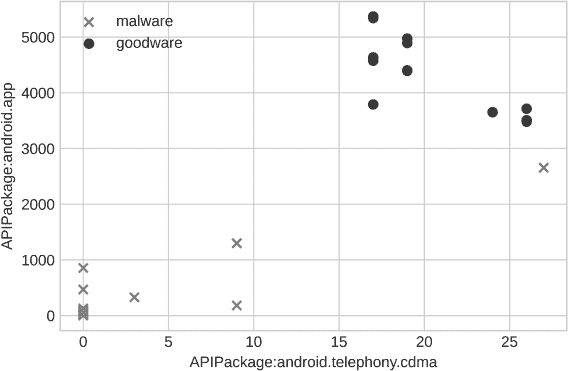

*图 5-1：训练集的可视化散点图*

幸运的是，学术研究人员已经发布了一些用于 Android 恶意软件分析的训练集，其中有三个是比较著名的。*Drebin* 数据集包含了来自 179 个不同恶意软件家族的 5,560 个应用程序，这些应用程序收集于 2010 年 8 月到 2012 年 10 月之间。你可以在 [*https://www.sec.cs.tubs.de/danarp/drebin*](https://www.sec.cs.tu-bs.de/~danarp/drebin) 找到它。*AndroZoo* 数据集是一个不断增长的 Android 应用程序集合，目前包含超过 1700 万个 APK，每个 APK 都已经通过不同的 antivirus 产品进行分析。你可以在 [*https://androzoo.uni.lu*](https://androzoo.uni.lu) 找到它。*CCCS-CIC-AndMal-2020* 数据集包含 200,000 个良性样本和 200,000 个恶意样本，来自 191 个知名恶意软件家族。数据集可以在 [*https://www.unb.ca/cic/datasets/andmal2020.html*](https://www.unb.ca/cic/datasets/andmal2020.html) 找到。如果这些网站未来无法访问，我们会在 [*https://github.com/android-malware-ml-book*](https://github.com/android-malware-ml-book) 上发布样本，只要没有法律障碍。

#### ***使用分类算法***

分类算法将训练集作为输入，并试图找到一个条件，使得当这个条件对某个应用程序的特征向量为真时，应用程序是恶意软件的概率非常高，而当条件为假时，应用程序是恶意软件的概率非常低。

例如，如果你查看 图 5-2，你会看到，当应用程序调用 *app* 包少于 3,000 次时，条件成立。所有满足这个条件的应用程序是恶意软件（叉号），而所有不满足该条件的应用程序是良性软件（圆点）。在这种情况下，位于 3,000 次 API 调用标记处的水平线将特征空间分为这两个部分。

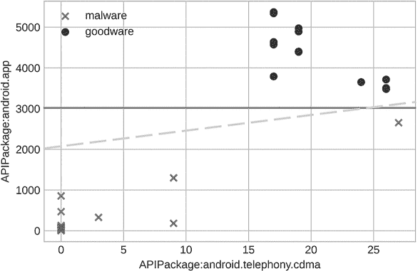

*图 5-2：训练集的两种可能分隔线，如 图 5-1 所示*

然而，这并不是唯一可能的分隔线。我们同样可以选择图中显示的虚线。这条线为 *y* = 40*x* + 2,000，其中 *x* = *APIPackage:android.telephony.cdma* 和 *y* = *APIPackage:android.app*。所有在这条线之上的点是良性软件，而所有在其下方的点是恶意软件。

到这个阶段，你可能会有很多问题。分隔符是否总是像图中所示那样将特征空间分割成两部分？分隔符是否必须总是线性的吗，还是可以包括圆形、椭圆形或其他更奇怪的形状？图 5-3 显示了一个情况，其中数据被分组为不同的区域，一些区域包含良性软件，另一些区域包含恶意软件。

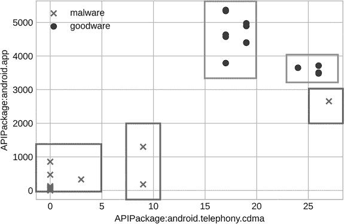

*图 5-3：在图 5-1 中显示的训练集的矩形分隔符*

这里一个潜在的问题是，特征空间的大部分区域既不属于良性软件区，也不属于恶意软件区，这可能是有道理的，因为从这些特征空间区域中从未见过样本。在下一节中，你将学习到分类算法可以采用不同的方法来排序它们的样本。

### **分类算法**

在这一节中，我们将讨论一些著名的分类方法。正如你将看到的，分类器的工作方式各不相同。

#### ***决策树***

决策树分类算法构建一棵树，每个节点将一个特征与一个特定值进行比较。因此，树的每一条路径都对应一个复杂的逻辑“与”条件，以及一个显示最佳匹配该条件的类别标签。假设我们给定了一个训练集*T*，其特征向量来自一个*n*维空间。这些样本是我们希望分类为良性软件和恶意软件的 Android 应用。为了实现这一点，我们会为每个应用*a*提供一个关联的特征向量*f*[*a*]，它由*n*个特征组成。图 5-4 显示了一个用于分类应用的示例决策树。

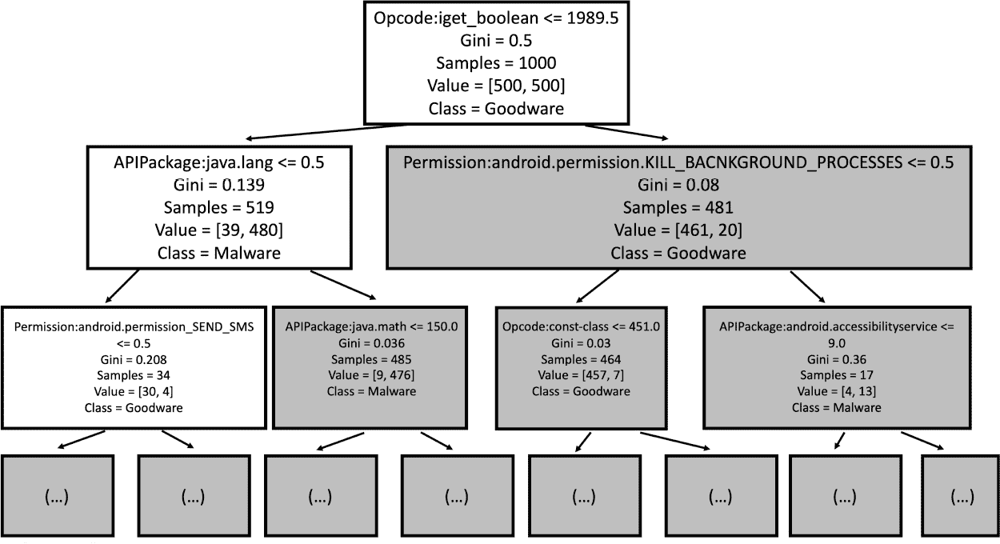

*图 5-4：示例决策树*

决策树中的每个节点都隐式地表示训练集的一个子集。例如，图 5-4 中显示的决策树的根节点代表一个包含 1,000 个应用的训练集。每个节点包括一个布尔条件，将集合分成两个不相交的子集：一个包含所有满足条件的成员，另一个包含所有不满足条件的成员。例如，在根节点中，条件检查是否`iget-boolean`操作码的调用次数小于或等于 1989.5。这个操作码从寄存器读取布尔实例字段，并以*Dalvik 格式*的字节码表示，这是 Android 运行时使用的指令集。所有满足此条件的应用会与根节点的左子节点关联，而那些不满足条件的应用会被归类到与右子节点关联的应用集合中。

这些节点还包含一些其他信息，帮助我们将应用程序分类为恶意或良性。例如，如果你查看根节点，你会看到样本数量为 1,000，并且两个类别（先是良性软件，再是恶意软件）各包含 500 个应用程序。因为根节点的分类是 50-50 的分布，所以该节点可以使用任意一个类别进行标记。在这种情况下，我们选择将其标记为良性软件。现在看一下根节点的左子节点。我们看到它包含 519 个应用程序。（也就是说，来自训练集的 519 个样本满足根节点的条件。）从*Value*字段，我们看到这 519 个应用程序中有 39 个是良性软件，而剩下的 480 个是恶意软件。因此，这个节点被标记为恶意软件，因为它的大多数应用程序属于这个类别。

现在，自然会出现两个问题。首先，决策树算法是如何决定在树的每个节点选择什么条件的？第二，图 5-4 中节点上显示的*Gini*字段是什么意思？这两个问题的答案是紧密相关的。每个决策树都会考虑一组约束条件，以选择标记节点的条件。在我们的示例决策树中，这组条件包括形如*特征* ≤ *值*的约束。除此之外，算法依赖于 Gini 值，它试图衡量节点中训练样本集合所代表的类的异质性。对于图 5-4 中的根节点，异质性最大，因为两个类被同等代表。但是对于它的左子节点，应用程序几乎全是恶意软件。Gini 度量会为异质的节点分配较高的值，而为均质的节点分配较低的值。因此，根节点的 Gini 值高于左子节点的 Gini 值。Gini 值本身的定义为：

*Gini*(*X*) = 1 – *P*(*恶意软件*|*X*)² – *P*(*良性软件*|*X*)²

因为在根节点处，应用程序是良性软件的概率与它是恶意软件的概率相同，都是 50%，所以根节点的 Gini 值为 1 *–* (0.5)² – (0.5)² = 0.5。对于根节点的左子节点，应用程序是良性软件的概率为 480/519。因此，它的 Gini 值为 1 – (39/519)² – (480/519)² = 1 – 0.075² – 0.925² = 1 – 0.0056 – 0.856 = 0.139。

我们不会深入讨论决策树算法本身的细节。只需说，当我们构建决策树时，我们会尝试从所有允许的分裂条件集中找到一个条件，使得两个子节点的组合所产生的 Gini 值最小化。节点的分裂过程会持续进行，直到我们到达被认为足够均匀的节点，意味着它们的 Gini 值低于给定的阈值。

决策树有许多变种。有些使用像熵而不是基尼分数的标准来评估可能的节点分裂方式的质量。其他变种则改变每个节点的条件类型，甚至设置决策树在每个节点上做三元或*n*元决策，而不是二元决策。你可以在 Lior Rokach 和 Oded Maimon 的《自顶向下的决策树分类器归纳法——一项调查》以及 Nasib S. Gill 和 Reena Hooda 的《通过聚类和 K 最近邻方法优化多路径决策树》中找到更多关于决策树及其变种的细节。

#### ***Bagging 和随机森林***

Bagging 和随机森林（RF）是*集成*分类器的典型示例，集成分类器通过结合多个其他分类器的预测来做出决策。集成分类器通常从一个已知的分类器开始（有时称为*弱学习器*）。在 Bagging 和 RF 分类器的情况下，这通常是一个决策树。

Bagging 和 RF 算法使用两种工具提供基于训练集的分类结果的鲁棒性。第一个工具是随机选择一些子集从训练集中获取。第二个工具是随机选择一个特征子集。通常，构建这些子集的唯一要求是每个子集的大小为原始训练集大小的某个百分比——例如 65% 或 80%。然后，弱学习器会在每个子集上独立地进行训练，产生一个类别标签。新应用的类别将被声明为大多数弱学习器预测的类别。

Bagging 不要求弱学习器必须是决策树；它可以是任何类型的分类器。另一方面，随机森林分类器假设弱学习器是决策树。对于前面讨论的每个子集，都会构建一棵决策树，并且在任何参与的决策树中的每个节点上，都会有一组被认为是*活跃的*属性。这些活跃属性是指那些从决策树根节点到该节点路径中尚未使用的属性。然后，在每个节点上随机选择一个活跃属性子集，并从由活跃属性定义的条件中选择最佳的分裂条件；即使不活跃的属性提供了更好的基尼指数结果，也不会考虑它们。然后，每棵决策树生成一个标签，和之前一样，获得更多“投票”的类别将是分配给特定应用的类别。

#### ***支持向量机***

支持向量机（SVM）算法试图找到一个*超平面*，将特征空间分为两部分，使得与一种类别（在我们的例子中是恶意软件）相关的特征向量主要位于超平面的一侧，而与另一类别（良性软件）相关的特征向量位于另一侧。我们在图 5-2 中展示了两个这样的超平面。在二维特征空间中，超平面就是一条直线。然而，超平面也可以是二次曲线甚至是正弦曲线。

*线性 SVM* 只使用直线作为分隔器。在更高维度中，线性超平面的形式如下：

*a*[1]*x*[1] + *a*[2]*x*[2] + ... + *a*[n]x*[n]* = *b*

在这里，*x*[1]、*…*、*x*[*n*] 代表 *n* 个特征，*a*[1]、*…*、*a*[*n*] 和 *b* 是常数。这样的超平面将特征空间分为两部分：一部分满足 *a*[1]*x*[1] + *a*[2]*x*[2] + *…* + *a*[*n*]*x*[*n*] ≥ *b*，另一部分满足 *a*[1]*x*[1] + *a*[2]*x*[2] + … + *a[n]x[n]* ≤ *b*。其基本思想是，大多数恶意软件将位于这两部分之一，而大多数良性软件则位于另一部分。实现者必须决定如何处理那些特征向量恰好位于分隔线上的应用程序。

为了在线性 SVM 中找到一个好的分隔超平面，我们通常考虑两个主要因素：超平面两侧特征向量的同质性，以及避免特征向量过于接近超平面。在同质性方面，我们希望分隔线一侧的大多数应用程序特征向量是恶意软件，而另一侧的大多数特征向量是良性软件。例如，回想一下图 5-2 中的水平分隔，我们通过仅仅计算一个新应用程序调用某个包中的类的次数来分类：如果次数超过 3000 次，我们将该应用程序分类为良性软件，否则分类为恶意软件。当然，这是一个高度简化的例子。在现实世界中，实施会考虑更多的特征，而分隔线的方程式可能会复杂得多。

支持向量机（SVM）设计中的第二个主要因素涉及那些特征向量非常接近分隔线的情况，例如位于图 5-2 右侧、两个分隔线正下方的恶意软件样本。我们能有多大的信心认为这些样本被正确分类了呢？为了增加特征向量与分隔线之间的距离，我们利用了*支持向量*，即训练集中最接近分隔线的特征向量。分隔线与其支持向量之间的距离称为*间隔*。SVM 试图找到一个最接近的分隔线，从而最大化间隔，这体现了我们不希望训练点过于接近边缘的直觉。

最大化边际和最小化分类错误的目标常常存在冲突。因此，我们通常将寻找最佳分隔线的问题表述为一个优化问题。我们在本章不会深入讨论 SVM 的数学细节，但有兴趣的读者可以在 Corinna Cortes 和 Vladimir Vapnik 的《支持向量网络》以及 Christopher J. Burges 和 Bernhard Schölkopf 的《提高支持向量机的准确性和速度》中找到更多信息。

还有许多非线性的支持向量机（SVM）版本。例如，二次支持向量机允许分隔超平面呈二次曲线形态，处理更复杂的特征向量分布。其他类型的 SVM 使用 *核* 技巧，将原始特征向量映射到新的特征向量。这种映射通常涉及非线性方法。当我们将线性 SVM 应用于这种非线性变换时，它会为原始数据生成一个非线性分隔符。因此，生成的分隔符可能会有不寻常的形状。例如，图 5-5 显示了一个修改后的训练数据集，其中部分 (a) 类似于本章前面展示的训练集可视化。部分 (b)、(c) 和 (d) 显示了使用不同核函数的 SVM 所生成的分隔符。

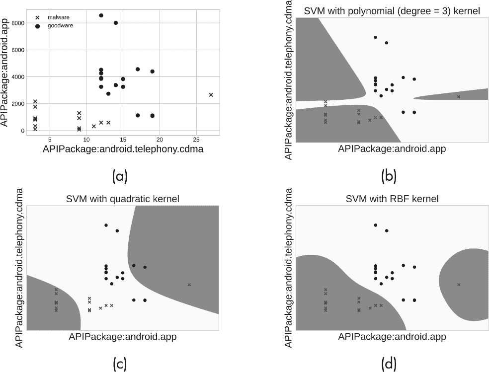

*图 5-5：使用核函数生成的样本非线性 SVM 分隔符，训练集 (a) 包含恶意软件特征向量（叉号）和良性软件特征向量（圆点），(b) 使用多项式核的 SVM 分隔符，(c) 使用二次核的 SVM 分隔符，以及 (d) 使用径向基核的 SVM 分隔符*

请注意，生成的区域不像使用线性分隔符那样容易描述。

#### ***k-最近邻算法***

一个 *k* 最近邻分类器非常简单。它并不真正“学习”一个模型。它获取一个之前从未见过的应用程序的特征向量，使用某种距离度量（例如，欧几里得距离或余弦距离）确定与该应用程序特征向量最接近的 *k* 个训练数据特征向量，然后查找这 *k* 个应用程序的类别。如果 *k* 个应用程序中超过一半是恶意软件，则该应用程序也会被判定为恶意软件；否则，它会被判定为良性软件。例如，考虑图 5-6 中展示的两个应用程序，*A*1 和 *A*2。

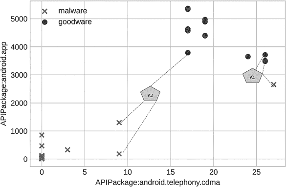

*图 5-6：一个样本的 k-最近邻分类器，k = 3*

假设我们考虑三个最近邻（换句话说，*k* = 3）。对于 *A*1，三个最近邻中的两个是良性软件，因此 *A*1 会被认为是良性软件。然而，对于 *A*2，三个最近邻中的两个被归类为恶意软件；因此，这个应用程序也会被分类为恶意软件。

#### ***朴素贝叶斯***

朴素贝叶斯分类器使用与前述分类器类型非常不同的直觉。它们从训练数据中学习一组简单的概率，然后使用这些概率来分类新的特征向量。

为了将应用程序分类为良性软件或恶意软件，朴素贝叶斯分类器可能会计算我们称之为 *类别条件* 概率。对于给定的类别（在我们这个例子中，良性软件或恶意软件），我们可以使用训练集来推导出一个特征向量的 *i* 个特征在应用程序属于特定类别时具有某个值的类别条件概率。考虑下表所示的小型训练集 表 5-2。

特征 *A* 和 *B* 分别表示对 *APIPackage:android.app* 和 *Opcode:if-eq* 的调用。概率 *P*(*A* = 10*|*0) 和 *P*(*A* = 10*|*1*) 是在类别为 0 和 1 时，属性 *A* 的值为 10 的类别条件概率。通过训练集，我们可以看到 *P*(*A* = 10*|*0*) 为 0.2，因为训练集中 10 个良性应用程序中有 2 个 *A* 的值为 10。*P*(*A* = 10*|*1*) 也是 0.2。相比之下，*P*(*A* = 3*|*0*) 等于 0，而 *P*(*A* = 3*|*1*) 等于 0.3。

**表 5-2：** 示例训练集

| **A** | **B** | **应用程序 ID** | **类别** |
| --- | --- | --- | --- |
| 3 | 0 | app1 | 1 |
| 3 | 0 | app2 | 1 |
| 5 | 0 | app3 | 1 |
| 12 | 0 | app4 | 1 |
| 3 | 0 | app5 | 1 |
| 10 | 2 | app6 | 1 |
| 10 | 1 | app7 | 1 |
| 72 | 82 | app8 | 1 |
| 72 | 24 | app9 | 1 |
| 30 | 10 | app10 | 1 |
| 0 | 0 | app11 | 0 |
| 0 | 0 | app12 | 0 |
| 0 | 0 | app13 | 0 |
| 0 | 0 | app14 | 0 |
| 0 | 0 | app15 | 0 |
| 10 | 1 | app16 | 0 |
| 10 | 1 | app17 | 0 |
| 72 | 190 | app18 | 0 |
| 72 | 190 | app19 | 0 |
| 30 | 144 | app20 | 0 |

朴素贝叶斯分类器还可能计算每个类别的 *先验概率*，即训练集中一个随机应用程序属于该类别的概率。在我们的小型训练集中，这些先验概率为 0.5，因为数据中有 10 个良性软件样本和 10 个恶意软件样本。给定一个新的应用程序 *a*，其特征向量由值 *f*[*a*] = (*v*[1], *…*, *v*[*n*]) 组成，朴素贝叶斯通过贝叶斯规则计算该应用程序属于类别 *c* 的概率，如下所示：

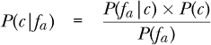

用简单的英语来说，这意味着应用程序 *a* 属于类别 *c* 的概率是 *a* 的特征向量由类别 *c* 生成的概率，乘以类别 *c* 的先验概率，再除以应用程序 *a* 的特征向量的先验概率。

要确定新应用程序 *a* 的类别，首先需要计算其特征向量 *f*[*a*]，朴素贝叶斯会找到使 *P*(*c*|*f*[*a*]) 在所有可能类别中最大化的类别 *c*。这个结果与找到使 *P*(*f*[*a*]|*c*) × *P*(*c*) 最大化的类别 *c* 是相同的，因为概率公式的分母对于任何考虑的类别都是相同的。我们称这个乘积为 *伪概率*。我们希望找到使这个伪概率最大化的类别 *c*。

现在考虑一个新应用程序 *a*，其特征向量为 (3, 1)，意味着特征 *A* 等于 3，*B* 等于 1。请注意，训练集中没有具有这个特征向量的应用程序。朴素贝叶斯通过做出独立性假设来计算看到特征向量 (3, 1) 的概率；它假设看到特征向量的概率是看到特征向量中每个分量概率的乘积。用正式的术语来说，我们可以这样写：

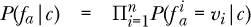

这里，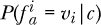 是在应用程序属于类别 *c* 的条件下，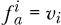 的条件概率，而 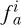 表示应用程序 *a* 的特征向量 *f*[*a*] 的第 *i* 个分量。

回到 表 5-2 中的例子，我们可以看到特征向量 (3, 1) 的伪概率如下所示：

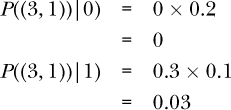

由于后者大于前者，因此具有特征向量 (3, 1) 的应用程序被分类为恶意软件。

朴素贝叶斯分类器存在几个问题。通常，尤其是在特征向量较长时，乘积计算中的分子最终会变成零，导致概率为零。一些朴素贝叶斯的变种通过对每个特征值的分布方式做出不同假设来解决这些问题。例如，高斯朴素贝叶斯假设它们符合正态分布，其均值和标准差是从训练数据中观察到的特征值计算得出的。你可以在 Concha Bielza 和 Pedro Larranaga 的《离散贝叶斯网络分类器：调查》中找到更多关于朴素贝叶斯分类器及其不同变种的信息。

### **评估机器学习模型**

一旦我们完成了模型的训练，我们就希望知道它的表现如何。研究人员开发了多种指标来评估机器学习模型。在本节中，我们将讨论几个重要的指标，重点讨论二分类器。

为了使评估结果有用，我们应使用不包含在训练数据中的样本来计算这些指标。拥有一个大规模、随机抽样的评估集对于了解分类器的优缺点至关重要。这个评估集应该像训练集一样，包含单独的样本及每个样本的标签。通常，我们的评估应考虑以下几点：

**真正例（TPs）** 被分类器预测为恶意软件且实际标记为恶意软件的应用

**假阳性（FPs）** 被分类器预测为恶意软件但实际标记为良性软件的应用

**真负例（TNs）** 被分类器预测为良性软件且实际标记为良性软件的应用

**假阴性（FNs）** 被预测为良性软件但实际上被标记为恶意软件的应用

过多的假阳性或假阴性表明性能较差。其他需要考虑的重要统计指标见表 5-3，该表展示了我们从多个在线网站收集的“良性软件与安卓银行木马”数据集上随机森林分类器的结果。接下来的讨论将详细描述这些指标。

**表 5-3：** 评估机器学习模型的示例指标

| **数据集** | **分类器** | **准确率** | **精确度** | **召回率** | **F1 分数** | **AUC** |
| --- | --- | --- | --- | --- | --- | --- |
| 良性软件与银行木马 | RF | 0.9908 | 0.9909 | 0.9910 | 0.9910 | 0.9931 |

*准确率*衡量分类器在评估集中的预测正确数量（换句话说，即真正例和真负例占所有预测总数的比例）。我们通过以下公式计算它：

*A* = (*TP* + *TN*)/(*TP* + *FP* + *TN* + *FN*)

虽然准确率是一个直观的衡量标准，但在检测恶意软件应用时，它存在一些问题。最主要的问题是恶意软件发生的频率非常低，因此如果评估数据集能够代表现实世界的情况，大部分数据可能会被标记为良性软件。这意味着分类器如果将所有应用都预测为良性软件，就能获得一个非常高的准确率。通常情况下，恶意软件样本占比不到 1%；在这种情况下，分类器的准确率可能会超过 99%。

*精确度*衡量我们的分类器在正确预测应用为恶意软件时的准确性。我们通过以下公式计算它：

*P* = *TP*/(*TP* + *FP*)

这个指标捕捉了被预测为属于某个类别的项目中，实际属于该类别的百分比。然而，它并不能反映全部情况。假设我们有一个包含 100 个样本的集合，其中 50 个是恶意软件。如果我们的分类器预测该集合中只有 1 个样本是恶意软件，而其余 99 个是良性软件，那么它的精确度将达到 100%，但在寻找恶意软件方面并没有做好工作。

*召回率*是与精度互补的一个度量，计算分类器漏掉了多少正样本。我们可以通过以下公式计算：

*R* = *TP*/(*TP* + *FN*)

单独使用召回率可能不是一个好的性能指标，因为一个将所有内容都预测为恶意软件的分类器将获得 100%的召回率。通常，我们希望分类器能够同时具备良好的精度*和*良好的召回率。

一种解决方案是将两者结合。例如，我们有时会计算分类器的*F1 分数*，或者精度和召回率的调和平均数。这个值试图平衡这两个指标，以识别强大的分类器。大多数恶意软件分类器的 F1 分数在 0 到 1 之间，其中 0 表示对预测为良性软件的信心较高，而 1 则表示该应用是恶意软件。

*接收者操作特征（ROC）曲线*绘制了分类器在不同阈值下的表现，帮助我们选择一个合适的阈值并比较不同的分类器。ROC 图有两个坐标轴。*真正率*与召回率相同，而*假正率*则通过以下公式计算：

*FPR* = *FP*/(*FP* + *TN*)

*接收者操作特征曲线（AUC）*提供了一个跨所有阈值的分类器整体表现度量。为了理解 AUC，假设我们将所有应用程序根据分类器的得分进行排序。AUC 衡量的是一个随机选择的恶意软件应用得分高于一个随机选择的良性软件应用的概率。理想的分类器总是会给良性软件分配低于恶意软件的分数；这样的分类器 AUC 为 1。一个完全错误的分类器（正好相反）将具有 AUC 为 0，而一个随机分类器的 AUC 将为 0.5。决策树算法的一个示例 ROC 曲线见图 5-7。

AUC 有几个优点：尤其是，它对类别偏斜（当一个类别的样本数远远超过另一个类别时）具有不变性，并且独立于特定的阈值。然而，它对 FP 和 FN 的处理是一样的。如果你想确保没有恶意软件漏网，这可能不太理想。例如，在你试图保护像 Google Play 这样的商店时，最好是偏向谨慎。也就是说，宁可手动审查过多的应用程序，即使它们大多数情况下是良性软件，也比审查过少更好。因此，你可能会更倾向于选择一个将 FP 视为更重要的模型。

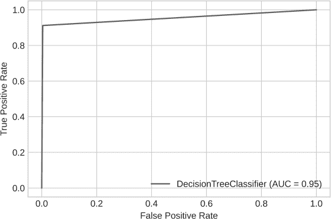

*图 5-7：决策树分类器的 ROC 曲线*

### **机器学习分类器的挑战**

在本节中，我们描述了一些常见的陷阱，这些陷阱可能会对机器学习分类器的性能产生不利影响。

#### ***相同特征向量***

一些恶意软件识别数据集包含了具有相同特征向量的应用程序。这通常发生在两种广泛的情况下。在第一种情况下，数据集中的不同应用程序是彼此的变种，我们称这些应用程序为*同构*应用程序。必须确保训练数据中的任何应用程序在测试数据中没有对应的同构应用程序，否则它们会人为地提高分类器的性能。第二种情况发生在特征集贫乏时。这也是一个非常严重的问题，因为这表明所选特征不足以区分真正不同的应用程序。

#### ***平衡与不平衡***

机器学习算法通常在数据*平衡*时表现良好，这意味着不同类别的样本比例大致相当。相反，当数据极度不平衡时，一些算法可能会表现不佳。

比如，假设我们正在尝试区分安卓间谍软件和良性软件。在今天大多数可用的恶意软件数据集中，间谍软件样本的数量通常远小于良性软件样本的数量。这可能是因为数据集的收集目的是区分所有形式的恶意软件（不仅仅是间谍软件）与良性软件。如果一个分类器被训练用来区分间谍软件和良性软件，那么与良性软件样本数量相比，间谍软件样本的数量相对较小。

类别大小的不平衡可能会严重影响分类算法的性能。

#### ***可解释性***

在检测恶意软件时，安全分析员必须识别出应用程序恶意性质的有力证据。那些在没有提供关于为何特定应用被标记为恶意或良性的原因的情况下做出判决的机器学习算法，可能对于自动化保护工作有用，但对于人工支持的分析则不够理想。为了确认，分析员需要算法引导他们找到恶意行为的源头。如果没有这种指导，验证算法的判决就变得相当于对整个应用程序进行审查，简直像是在大海捞针。

因此，许多恶意软件检测方法使用手工设计的特征，帮助分析员在代码中找到恶意部分或展示代码运行时的恶意行为。这也是深度学习方法在工业界进行恶意软件检测时并不总是最佳选择的一个主要原因。因为很难理解这些机器学习算法是如何产生其输出的。

#### ***交叉验证与滚动窗口预测***

许多基于机器学习的恶意软件检测算法已在文献中使用*k*折交叉验证进行评估，这是一种将训练数据随机拆分成*k*个不相交的部分，称为*折叠*，然后在这些折叠上执行*k*次迭代的技术。在每次迭代中，移除一个对应的折叠（例如，第三次迭代中的第三个折叠），然后某种类型的分类器（例如 SVM）从其余的折叠中学习。模型接着对移除的折叠进行预测，并仅在该次迭代中使用诸如 AUC 或 F1 分数等度量来计算其性能。然后，这项技术通过计算所有*k*个折叠上的性能度量的聚合值来对模型类型（例如 SVM）进行最终评估。

然而，使用交叉验证可能并不总是合适的，因为恶意软件会随着时间的推移不断演化，*k*折交叉验证忽略了训练数据中某个应用首次发布到互联网的时间。因此，在任何迭代过程中使用的折叠可能包含那些在移除折叠中的某些应用之后才发布到互联网的应用。直观地讲，这意味着我们很可能在使用未来的信息来预测一些应用的状态，这可能会人为地提升分类器的性能。

相比之下，*滚动窗口预测*根据每个应用首次进入互联网的时间对数据集中的应用*a*[1]、*…*、*a*[*n*]进行排序。我们接着假设我们至少需要*j*个应用进行有效的训练。对于每个*i*，使得*j* < *i* ≤ *n*，我们在数据集{*a*[1]、*…*、*a*[*j*]}上进行训练，并评估给定分类器的性能 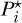。我们认为分类器的整体性能是对于*i* < *j* ≤ *n*的的平均值。这种方法避免了使用未来信息来预测过去的可能性。

### **接下来**

本章概述了广泛应用于恶意软件分析和检测的机器学习算法。在下一章中，我们将探讨可以作为这些算法输入的特征。

尽管公开可用的机器学习库在不断发展，但你可能会觉得探索 R、scikit-learn 和 TensorFlow 库所提供的可能性是值得的。你还可以在[*https://github.com/android-malware-ml-book*](https://github.com/android-malware-ml-book)找到应用哈希值的列表，以及本章和下一章中描述的静态和动态特征。使用这些库来学习不同类型的预测模型，能够区分恶意软件和良性软件。

[*OceanofPDF.com*](https://oceanofpdf.com)
