# 第六章：机器学习特征


我们已经探讨了理解 Android 应用所需的两种分析方法：静态分析和动态分析。我们还看到了人类安全分析师如何在静态分析和动态分析之间来回切换，以确定发生危险行为的位置。

然而，机器学习算法无法执行人类分析师的“来回”行为。因为它们无法选择优先探索代码的某一部分，而是必须为每个应用程序关联一个特征向量，无论它是恶意的还是良性的，然后使用之前训练的模型来对其进行预测。这意味着它们必须提前决定在特征向量中包括哪些内容。

在本章中，我们首先描述如何将静态和动态信息源转化为机器学习算法的输入，从而使我们能够将恶意软件检测工作扩展到数百万个 APK。然后，我们探索四种新型特征，这些特征对于攻击者来说更难以规避或逆向工程，但足够强大，能够以高准确率检测恶意软件。这些检测技术考虑到了这样一个事实：恶意软件开发者通常了解安全专家使用的静态和动态分析方法，并能利用这些知识来规避检测。

### **静态特征**

我们可以与 Android 应用程序关联的第一类特征是基于代码的静态分析。与通过人工静态分析获取的数据不同，软件可以轻松提取这些特征的值。这些特征是不可变的，从这个意义上讲，一旦我们使用给定的特征集训练了预测模型，在使用该模型时必须坚持这些特征（但是，在重新训练时，可以添加新特征并删除旧特征）。

在一个 APK 文件中，有几个文件和文件夹的属性和内容可以转化为机器学习特征。特征的一个来源是每个 APK 根目录中包含的*AndroidManifest.xml*文件。正如在第三章中讨论的，清单文件定义了 Android 应用程序的结构和元数据，包括包名和应用版本。它还可能包括描述应用程序基本行为的 XML 节点，以及应用程序请求的权限。列表 6-1 展示了来自恶意应用程序 Fakebank *com.a*（v152，0add）清单文件的一个片段，引用了 XML 节点。

```
<receiver android:label="@string/app2" 
android:name="com.p004a.p005a.DeAdminReciver" 
android:permission="android.permission.BIND_DEVICE_ADMIN" 
android:description="@string/app2"> 
<meta-data android:name="android.app.device_admin" 
android:resource="@xml/an"/>
```

*列表 6-1：与 Fakebank 应用程序相关的 Android 清单中的 XML 节点*

我们也可能会在 Java 源代码文件夹中找到特征。在 Java 应用中，该文件夹是原始代码的一部分，在编译后的 APK 文件中并不存在。其他值得关注的文件夹有*Res*、*lib*和*assets*。*Res*文件夹包含应用程序使用的所有非代码资源，例如 XML 布局和图片。*lib*文件夹比较复杂，因为它的用途在编译后发生变化：在 Android 源代码中，它通常用于存储常用文件、工具类和与应用程序相关的依赖项，而在编译后的 APK 文件中，它存储应用程序使用的本地代码文件。*assets*文件夹可能包括各种各样的文件，如文本、XML、字体、音乐和视频。另一个特征来源是*build.gradle*文件，其中包含与构建相关的配置。该文件仅在开发过程中存在，并不包含在最终的 APK 中。

我们可以为许多特征定义两个版本。特征的*二进制*版本根据该特征是否存在而设为 0 或 1。例如，我们可能将特征与 API 函数调用相关联。如果应用在其代码中至少调用一次该 API，我们将特征的二进制版本设置为 1；否则，设置为 0。另一方面，*统计*版本的特征可能反映应用对该 API 调用的次数。或者，它可能记录 API 函数使用特定输入时调用的次数，并返回一个统计量，如结果的均值、中位数或标准差。以下特征在基于机器学习的恶意软件检测文献中常见：

**权限**

我们可以设计与应用请求的权限相关的多个特征。例如，我们可能为每个权限创建一个二进制特征。我们还可以定义与请求的正常权限、签名权限和危险权限的数量相对应的统计特征。根据官方 Android 开发者网站的说明，危险权限是指那些涉及用户私人数据或可能影响此类私人用户数据的权限。例如，我们已经看到，在第三章中讨论的*com.bp.statis.bloodsugar*恶意软件请求了`READ_CONTACTS`权限，尽管几乎没有理由相信血糖监测应用需要访问用户的联系人。

**活动**

如在第三章中讨论的，活动实现了 Android 应用的视觉界面，并在清单文件中声明。我们可以创建一组二进制特征来表示每个活动是否被使用。活动的总数也是一个潜在的特征。

**服务**

应用通过服务实现长时间运行的后台操作，便于与系统进行交互。和活动一样，我们可以定义二进制特征，表示每个服务是否被使用。此外，我们还可以定义简单的计数和统计特征。例如，在 第三章 讨论的 *com.bp.statis.bloodsugar.PE* 服务中，我们可能会将该值设置为 1，因为血糖应用几乎没有理由接收系统中所有应用的来电通知。

**内容提供者**

内容提供者封装了数据并将其提供给其他应用。对于每个内容提供者，如果它在应用中不存在，我们可能会设置特征值为 0，如果它存在，则设置为 1。我们还可以创建一个特征，表示应用使用的内容提供者的数量。

**广播接收器**

应用的广播接收器组件使其能够接收来自系统或其他应用的广播消息。和前面的情况一样，我们可以为这些接收器创建二进制特征、计数和统计特征。然而，虽然很容易在清单文件中找到声明的广播接收器，但在运行时找到那些声明的广播接收器并不总是容易，尤其是它们可能是加密或混淆代码的一部分。此外，一些应用可能希望注册 `RECEIVE_SMS` 接收器，这使得它们能够拦截传入的短信流量（例如，一次性密码或可疑活动警报）。

**意图过滤器**

活动、服务和广播接收器可以使用意图过滤器来指定它们将响应的操作类型。对于广播接收器，意图指定它们可以处理的广播类型。和之前的情况一样，我们可以为意图定义和提取二进制特征和统计特征。

**API 调用**

Android 平台提供了一套 API 包，开发者可以用来构建应用。我们可以为每个 API 包创建二进制特征（根据是否调用该包）以及该包内的每个类（根据该类是否被调用）。此外，API 包的数值特征可能会跟踪应用调用包内某个类或类内某个函数的次数。我们将在本章稍后详细介绍 API 特征，因为我们可以利用它们生成更高级的特征。

**网络元素**

一个 Android 应用的源代码可能包含许多网络元素，如 IP 地址、URLs 和主机名。我们可以收集这些元素，生成二进制特征和统计特征（例如，文件中列出的主机名数量）。我们还可能希望使用代码中引用的外部 URLs 数量作为一个特征。

恶意软件作者可能通过各种手段来使静态分析变得困难。这些手段可能包括使用难以理解的变量名称、加密代码的部分内容以及使用其他混淆方法，如反射（见第三章）。我们还可以定义静态特性来描述这些现象是否存在于应用程序代码中，以及它们的出现频率。

### **动态特性**

我们还可以将动态分析的结果转化为机器学习特性。如第四章中所述，动态分析关注的是应用程序的运行时属性和行为。因此，从动态分析中得出的特性描述的是实际观察到的事件，而不是从代码静态分析中推测的特性。

为了生成许多这些特性，我们必须向应用程序提供一些输入集，例如应用程序与用户的交互（一个例子是第四章中讨论的`monkey`命令）。我们可以使用第一个输入运行应用程序并生成一些结果，然后使用第二个输入运行并生成更多结果，继续这个过程直到我们用尽所有输入集中的输入。我们还可以通过分析应用程序通过 tcpdump 和 Wireshark 等程序运行时生成的网络流量来提取特性。

以下是安卓平台上已经在文献中广泛讨论的动态特性：

**服务**

我们可以生成动态特性来记录每个启动的服务。这些特性可能是二进制的（基于应用程序是否启动了该服务）或数字的（例如，跨输入集调用该服务的平均次数）。启动的服务总数也可以是一个特性。此外，我们还可以通过记录应用程序是否曾调用过该服务序列（一个二进制特性）或应用程序平均调用该序列的次数（一个数字特性）来将服务序列与特性关联。

**`DexClassLoader`**

这是一个标准的安卓 API，用于加载包含*classes.dex*文件的*.jar*和*.apk*文件。恶意应用程序经常使用此 API 来规避静态分析，因为它允许执行未来自应用程序源代码的代码（一个例子是第四章中讨论的 Xenomorph 恶意软件家族）。我们可以创建一个特性，如果应用程序调用`DexClassLoader`，则该特性设为 1，否则设为 0。还可以根据调用次数、*n*元组序列和其他统计信息定义附加特性。

**权限**

我们可以创建二进制特性，记录应用程序是否调用了需要某些权限的 API，即使该权限没有出现在应用程序的代码中。尽管 Android 应用必须在清单文件中明确声明它们请求的任何权限，但它们可能会尝试通过不同的方式绕过这一要求，获取权限。一种策略是使用隐蔽通道，比如多个 APK 之间的通信，来共享信息。这种行为给动态分析人员带来了挑战，因为他们的实验室设置必须能够同时运行多个交互的应用程序。与之前的情况一样，我们也可以基于权限生成统计特性和*n*-gram 特性。例如，在 Xenomorph 恶意软件中，我们会记录它调用了辅助功能 API 的事实，并将该值设置为 1。

**数据泄露**

有时，应用程序可能会泄露用户的个人数据，无论是因为应用程序编码不良导致的意外泄漏，还是故意泄露数据以窃取信息。我们可以生成反映泄露内容的特性。

**加密操作的使用**

我们可以定义一个特性，用于跟踪应用程序是否执行任何加密操作。当一个 APK 执行加密操作（例如，存储加密文件）时，用于运行它的沙箱可以跟踪并记录这一操作。如果应用程序在执行过程中生成了加密文件，我们可以将二进制特性设置为 1，否则设置为 0。我们在 Xenomorph 应用中看到这种行为；请参阅列表 4-5 中的`encryptMessage`函数，应用程序在沙箱环境中执行时可能会调用该函数零次或多次。

**网络活动**

我们可以使用一组特性来跟踪打开或关闭网络套接字的操作，记录目标主机。我们还可以根据从网络接收到的数据、数据的来源以及应用程序发送到网络中其他设备的数据创建特性。

**发送短信**

当应用程序在执行阶段发送短信时，我们可以记录收件人的身份和消息内容，以此作为特性。我们还可以计算发送的短信总数，或者定义一个二进制特性，如果应用程序发送了任何消息，则将其设置为 1。

**电话拨打**

恶意 Android 应用有时会拨打电话（例如，拨打高收费号码）。在这种情况下，我们可以定义特性来存储拨打的号码，或者使用二进制特性记录某些外部号码被拨打的事实。

**已接听的意图**

我们可以捕获应用程序在执行过程中响应的意图，并将这些意图记录为动态特性。

**文件**

我们可能会创建一些特性，用于记录应用程序使用的任何库文件的名称。此外，当应用程序读取或写入特定文件时，我们可以捕获文件名和内容，然后基于这些信息生成特性。

### **方法调用特征（一个弱策略）**

为了超越基本的静态和动态数据，一些研究人员将 API 方法调用作为潜在特征。Android 平台提供了一套 API 包，开发者可以利用这些包来访问各种有价值的功能。例如，*android.accessibilityservice* 包可以帮助残障用户与 Android 设备进行交互。然而，恶意软件开发者也可以利用它，而且他们广泛滥用它。

每个 API 包含若干个类，每个类都有其方法，我们可以利用这些方法为我们的模型定义新特征。例如，在 Android API 23 中使用 171 个 API 包来创建特征时，我们可以为每个 Android 应用构建一个 171 维的特征向量，以捕捉该应用调用每个包中方法的频率。例如，如果某个 API 包包含 40 个不同类的方法，且应用调用每个方法两次，则对应的特征值为 40 × 2，或 80。

这些 API 特征值可能会有很大差异。例如，考虑一个叫 *ESPN 6.0.4* 的良性软件样本，其对应的 171 个 API 特征值中，最大的为 161,698，最小的是 0，标准差为 10,488.26。相比之下，另一个良性软件样本 *com.hancom.office.editor*（v1，75d1）的最大 API 特征值为 6，最小为 0，标准差仅为 0.61。你可能会本能地想对特征值进行归一化，以应对这种差异，但其实归一化并非必要，因为好的机器学习算法会自动确定哪些特征值有助于创建良好的恶意软件和良性软件之间的分隔。

虽然你会在文献中看到这些基于 API 的特征，但恶意软件开发者可以轻松规避它们。Zhengcuan Cai 和 Roland Yap 在他们 2016 年的论文《推测检测逻辑与评估 Android 杀毒应用效果》中研究了 57 款 Android 杀毒工具。他们发现，恶意黑客可以轻松揭示仅使用静态分析的杀毒应用的检测逻辑，从而规避检测。例如，在这种情况下，开发者可以在应用中加入大量虚假的 API 调用，以改变其 171 维特征向量。同样，反射和动态代码加载等混淆方法可以降低应用的特征数量。特别隐藏的方法调用的特征数量甚至可能降至零，如果静态分析未能找到这些调用（例如，调用位于加密代码段中时）。为了完整性，机器学习模型应该包括 API 调用的静态和动态特征。

相比之下，基于三元怀疑图、地标、特征聚类和关联图等技术的高级特征在识别恶意 Android 应用方面非常有效。实验表明，这些特征更难被恶意黑客规避，部分原因是黑客很难准确判断这些特征在检测系统中的使用方式。本章其余部分将介绍这些高级特征。

### **三元怀疑图特征**

我们可以通过从一种特殊类型的图形——*三元怀疑图 (TSG)*——派生出一组更强大的特征，而不仅仅是使用 API 方法调用。基本上，TSG 旨在理解良性软件和不同类型恶意应用在使用 API 包时的差异。图 6-1 是一个 TSG 示例，比较了良性软件与银行木马的不同。接下来的段落将详细讲解其元素。

TSG 由通过边连接的顶点组成。在这个上下文中，TSG 包含三种类型的顶点：Android API 中定义的 API 包调用的完整集合，采样得到的良性软件，和从更大的良性软件和恶意软件集合中随机抽取的样本。TSG 的边定义如下：

1.  对于每个良性软件 *g* 和每个 API 包调用 *a*，如果 *g* 至少调用过 *a* 中的某个方法一次，则从 *g* 到 *a* 会有一条边。

1.  对于每对 API 包调用 *a*[1] 和 *a*[2]，如果 *a*[1] 调用了 *a*[2] 中的任何方法，则从 *a*[1] 到 *a*[2] 会有一条边。

1.  对于每个恶意软件 *b* 和每个 API 包调用 *a*，如果 *b* 至少调用过 *a* 中的某个方法一次，则从 *b* 到 *a* 会有一条边。

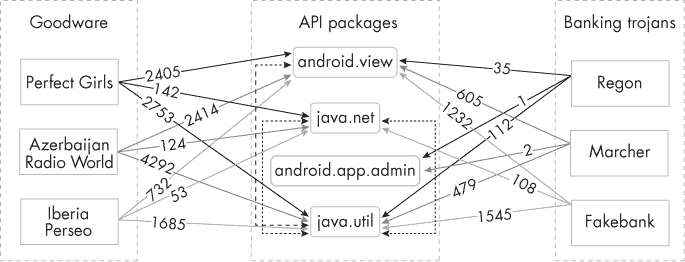

*图 6-1：一个包含三个良性软件样本的部分 TSG*

良性软件和恶意软件集合不需要固定。分析员可能在某一周使用一个样本集，下一周切换到另一个，并且定期更换样本集，以呈现出一个不断变化的目标。变化集合会改变攻击面，使得对手更难猜测防御的具体方式。

我们还建议保持这些集合的大小相对较小，并进行变化。例如，如果我们有 100 万个良性软件样本和 10,000 个恶意软件样本，我们可能会选择每组中的 1,000 个样本作为第一周的样本，第二周选择 1,322 个样本，第三周选择 1,127 个样本，依此类推。经常修改样本大小是让攻击者无法掌握防御体系特性的另一种方法；不过，两个集合中的样本数量应大致相同。

一旦我们确定了 TSG 中的顶点和边，我们就使用权重函数对边进行加权。在这个上下文中，权重反映了一个应用调用对应 API 包方法的次数。对于从良性软件或恶意软件应用 *v* 到 API 包 *a* 的任何边，我们使用 *f*(*v*, *a*) 来表示 *v* 调用 *a* 方法的次数。以下方程展示了五种可能的权重函数 *w* 定义。函数 *w*[1]、*w*[2] 和 *w*[3] 分别表示 API 包调用频率与边权重之间的线性、二次和三次关系，而 *w*[4] 和 *w*[5] 捕捉了其他可能的非线性关系：

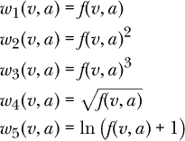

拥有不同的定义是有用的，因为大多数机器学习算法对输入特征非常敏感，单靠建模框架不能总是正确推断数据点之间最准确的非线性关系。

我们将 API 包调用之间的边的权重设置为相同的默认值 1。这是因为我们更关心特定边是否存在，而不是 Android API 中一个 API 包调用另一个的频率，因为攻击者无法控制这些关系。

你可以在图 6-1 中看到加权边，它使用了函数 *w*[1]，以及方向箭头来显示 API 包之间的调用关系。现在你可以观察到，三种良性软件样本中没有调用 API 包`android.app.admin`，而三种银行木马中的两个会多次调用该包。这类模式可能帮助我们识别恶意应用程序。

#### ***可疑得分***

定义了 TSG 后，我们现在可以计算 API 包的 *可疑得分*。简而言之，我们将一个经常被恶意软件调用而不被良性软件调用的 API 包，认为它比一个经常被良性软件调用而不被恶意软件调用的 API 包更可疑。仅凭可疑得分不足以预测一个 Android 应用是否恶意，但它确实生成了一组特征，这些特征可能提供良好的预测性能。此外，由于恶意软件开发者无法知道用于创建 TSG 的参考集和权重函数，他们无法轻易规避使用这些函数的检测框架。

我们定义了 12 个可能的可疑得分函数，*sus*[1] 到 *sus*[12]。拥有多个候选函数确保我们不容易过拟合一个预定义模型。当我们将这些得分和其他特征作为输入时，机器学习技术可以告诉我们哪个可疑得分函数最能区分良性应用和恶意应用。你可能注意到，下面显示的函数定义与权重函数 *w*[1] 到 *w*[5] 密切相关：

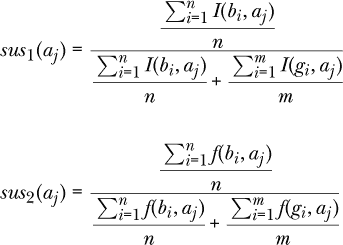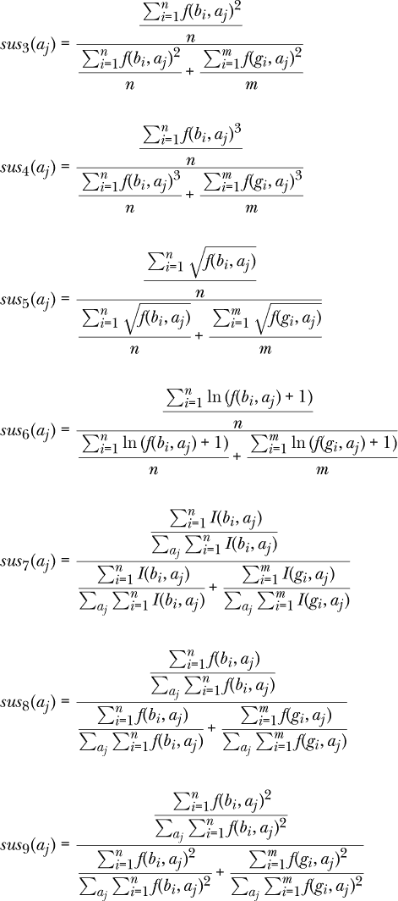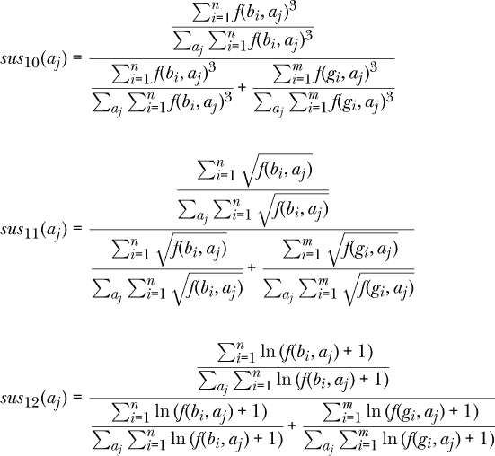

这些怀疑评分函数都使用了指示函数 *I*(*v*[1], *v*[2]) 来表示从顶点 *v*[1] 到 *v*[2]* 的边的存在，其中 *v*[1], *v*[2] ∈  ∪ 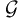 ∪ 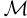。换句话说，如果 *f*(*v*[1], *v*[2]) 大于 0，那么 *I*(*v*[1], *v*[2]) 等于 1；否则，它为 0。（事实上，我们可以将从应用到 API 包的边的 *I*(*v*, *a*) 函数视为另一种权重函数。）我们用 *n* 来表示恶意样本的数量，用 *m* 来表示良性样本的数量。

例如，根据第一个函数 *sus*[1]，如果 API 包 *a*[*j*] 被 100 个恶意应用 *b* 和 10 个良性应用 *g* 调用，我们合理地认为调用该 API 包的应用比没有调用的应用更具怀疑性。*sus*[7] 中的定义是另一种方式来捕捉相同的直觉：即一个 API 函数被恶意应用调用的次数远多于良性应用时，它的怀疑评分会更高。*sus*[7] 到 *sus*[12] 的方程与 *sus*[1] 到 *sus*[6] 做出了类似的假设，不同之处在于它们评估的是某一个 API 包相对于所有 API 包的怀疑评分，而不仅仅是自身。

#### ***怀疑排名***

怀疑评分通过观察恶意软件和良性软件各自如何调用某个 Android API 包来标记单个 API 包调用。然而，一个包可能会自身调用 Android API 内的其他包。如果一个包 *P*1 调用了另一个包 *Q* 并且 *Q* 的怀疑评分很高，我们应当将第一个包排名为比没有调用高怀疑评分包的包 *P*2 更具怀疑性。

这种情况有点像某个人频繁联系毒贩。即便这个人本身并不被认为可疑，但由于他们与毒贩的频繁接触，便会被视为可疑。这正是 Google 搜索著名的 PageRank 算法背后的直觉，它通过考虑链接到网页的其他网页的重要性来捕捉一个网页的重要性。

事实上，我们可以将怀疑评分与 PageRank 结合，定义一系列怀疑排名函数来捕捉这些直觉。PageRank 使用以下公式来计算网页的重要性：


这里，*E* 是网页中的边集；*N* 是网页中节点或顶点的总数；*d* ∈ [0, 1]，称为阻尼因子，通常设置为 0.85；*out*(*u*) 是节点 *u* 的 *出度*，即离开该节点的边的数量。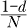 表达式捕捉了用户通过显式输入网页地址到浏览器来访问网页 *v* 的概率，而表达式的其余部分旨在捕捉用户通过点击链接访问网页 *v* 的概率。

在下文中，我们定义了相对于固定的可疑评分函数 *sus*，Android API 包 *a* 的可疑排名。我们可以使用本章前面描述的任何函数，或者一个全新的函数，只要它将可疑分数与 Android API 中的每个函数相关联：

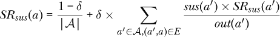

参数 *δ* ∈ [0, 1] 是一个阻尼因子，类似于 PageRank 中的 *d*。在实际操作中，我们将其设置为 0.85，通常与 PageRank 的做法一致。值 *a*′ 是任何由包 *a* 调用的包，*out*(*a*′) 值是与 *a*′ 对应的 TSG 中节点的出度。换句话说，它表示 *a*′ 调用的 API 包的数量。

读者可能已经注意到，可疑排名的定义主要依赖于 TSG 的一小部分——即表示 API 包的顶点和它们之间的边缘。因此，这个结构独立于良性软件和恶意软件集合中应用程序的选择，攻击者无法操纵它，因为它（即 Android API）在 Android 代码和文档中是公开的。这种方法与之前研究中描述的函数调用图不同，后者通常依赖于特定单个应用程序内的操作顺序，因此缺乏随机性，这是让恶意软件开发者无法猜测的关键元素。我们在“进一步阅读”中列出了这些替代方法，详见 第 202 页。

#### ***TSG 特征***

上述两节定义了如何计算给定 TSG 中 API 包的可疑分数和可疑排名。总的来说，我们为每个 API 包提供了 24 种基于可疑性的分数。研究人员可以根据需要添加新的分数。接下来，我们必须使用这些基于可疑性的分数为 Android 应用程序生成我们所称的 *TSG 特征*。这些特征捕捉了所有应用程序的包调用行为，意味着一个应用程序不必出现在恶意软件或良性软件的样本集里才能拥有 TSG 特征。

为了生成这些特征，我们首先根据 API 包的可疑分数和可疑排名结果将它们按降序排列。理论上，API 包的排名越高，它就越可疑。然而，我们可能会遇到噪声，可能来源于样本应用程序的选择。因此，我们不是直接使用排名包列表，而是在得出 TSG 特征之前对其应用基于窗口的分割。

基于 *窗口* 的分割的基本思路是使用一个大于 1 的整数 *W* 将列表分割成若干个桶，从列表的开头开始。如 图 6-2 所示，每个桶（除了可能是最后一个桶）包含 *W* 个具有相似可疑分数或排名的 API 包。

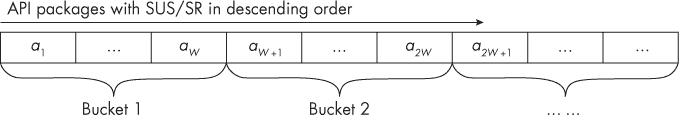

*图 6-2：基于窗口的 API 包按降序的可疑分数和排名进行排序*

假设 API 包*a*[1]到*a*[*W*]在同一桶中，且假设一个应用程序的对应 API 特征值是*f*[1]到*f*[*W*]。对于每个桶，我们可以通过以下六种方法之一计算一个 TSG 特征：

**二进制值** 该应用程序是否调用该桶中的任何 API 包？如果是，这个二进制特征值为 1；否则为 0。

**API 包数量** 该应用程序调用了该桶中多少个 API 包？特征值是一个整数 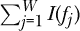，其中函数*I*(*f*[*j*]) = 1 当*f*[*j*] > 0 时；否则为 0。

**最大频率值** 该应用程序调用该桶中所有 API 包的频率中，最大值是多少？特征值是一个整数 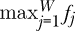。

**中位频率值** 在所有调用频率中，中位数值是多少？特征值是一个整数中位数 。

**频率和** 该应用程序总共调用了该桶中的多少个 API 包？特征值是一个整数 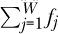。

**加权和** 基于频率和，如果我们将函数*ρ*给出的疑似评分作为相应的权重，那么值将是多少？该特征是一个实数值 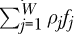，其中*ρ*[*j*]表示 API 包*a*[*j*]的疑似评分。

为了说明这些特征如何工作，考虑我们在本章前面展示的包含三个银行木马样本和三个良性软件样本的小数据集。假设表 6-1 显示了恶意软件样本 Regon 调用四个 API 包的频率。

**表 6-1：** 按地区统计的 API 包调用频率

|  | ***android.view*** | ***java.net*** | ***android.app.admin*** | ***java.util*** |
| --- | --- | --- | --- | --- |
| **频率** | 35 | 0 | 1 | 112 |

如果我们使用*sus*[1]作为我们的疑似评分函数，我们可以根据它们的疑似评分按降序对软件包进行排序，如表 6-2 所示。

**表 6-2：** 按地区统计的 API 包疑似评分

|  | ***android.app.admin*** | ***android.view*** | ***java.util*** | ***java.net*** |
| --- | --- | --- | --- | --- |
| **疑似评分** | 1 | 0.5 | 0.5 | 0.25 |

假设我们现在使用*W* = 2 作为窗口大小。在这种情况下，存在两个桶，第一个包含*android.app.admin*和*android.view*，第二个包含*java.util*和*java.net*。我们从第一个桶得出 Regon 的以下特征值：二进制值为 1，API 包数量为 2，频率和为 36，最大频率值为 35，中位频率值为 18，加权和为 1 × 1 + 0.5 × 35，即 18.5。第二个桶生成的特征值分别为 1，1，112，112，56 和 56。

现在假设我们使用疑似评分函数 *sus*[1] 和疑似排序公式重复此过程。表 6-3 显示了排序后的结果疑似排名。

**表 6-3：** Regon 调用包的疑似排名

|  | ***java.util*** | ***java.net*** | ***android.view*** | ***android.app.admin*** |
| --- | --- | --- | --- | --- |
| **疑似排名** | 0.1025 | 0.0811 | 0.0375 | 0.0375 |

这些疑似排名为 Regon 从第一个桶生成以下特征值：二进制值 1，API 包数量 1，频率总和 112，最大频率 112，中位数频率 56，和加权总和 0.1025 × 112 + 0.0811 × 0，结果为 11.48。对于第二个桶中的 API 调用，Regon 具有对应的特征值 1, 2, 36, 35, 18 和 1.35。

在这个例子中，我们为 Regon 生成了基于一部分 Android API 包和完整 TSG 的一部分的 TSG 特征。然而，在实际实现中，我们可能会使用所有 171 个 API 包、24 个不同的疑似评分函数，以及每个函数计算 TSG 特征的 6 种方法。因此，如果我们使用 *W* 为 10，我们可以为每个应用生成 2,592 个 TSG 特征。

此外，由于我们控制 *W* 参数，我们可以通过多种方式进行变化。例如，如果我们有四个 API 包，疑似评分分别为 0.9、0.3、0.29 和 0.2，我们可以将它们分成两个大小相等的桶，（0.9，0.3）和（0.29，0.2）。或者，我们可以使用可变窗口大小将相似的评分分组，并将它们分为两个桶，（0.9）和（0.3、0.29、0.2）。以这种方式使用窗口大小有一个优点：它为对手引入了另一个复杂因素。如果攻击者改变了恶意软件中调用的一个或两个 Android API 包中的类的调用数量，那么对特征的推导影响不会很大，因为具有相似特征的包会被合并，减少了任何单一特征的影响。虽然这种变化的窗口大小可能会对生成分类器的预测性能产生负面影响，但事实证明，正如后续章节所示，这并不是一个大问题。

要了解更多关于展示绕过这些特征困难的实验，请参阅 Chongyang Bai 等人的《DBank：最近 Android 银行木马的预测行为分析》和 Qian Han 等人的《通过（某种程度上）稳健的不可逆特征变换进行 Android 恶意软件检测》。

### **基于地标的特征**

另一种为 Android 应用生成攻击者难以规避的特征的方法是基于地标的概念。假设你正在考虑购买一套房子。你对房子的公平价格估计可能依赖于几个因素，其中之一可能是某些其他房子的销售价格（例如，同一区域内类似大小和年龄的房子）。我们将这些参考房子称为 *地标*。

我们可以采用使用地标的思路为 Android 应用定义一个新的特征空间。假设有一组 Android 应用，其中包含良性应用和恶意应用，每个应用都有一些特征向量。我们可以将这些特征向量看作是应用特征空间中的一个点，就像我们可以将房子看作是房产特征空间中的一个点一样。在考虑购买房子时，我们会将目标房屋与类似的房屋进行比较；在判断应用是否恶意或良性时，我们也可以采取同样的方法。

#### ***选择地标***

为了使用地标法，我们首先选择一部分应用样本并将它们设置为地标。然后，通过将每个应用与地标进行比较，我们为数据集中的每个应用定义新的特征。我们建议将地标集合的大小保持在合理的小范围内。例如，如果应用的总样本数为 100 万个，我们可以选择 1000 个地标。这样，攻击者将很难猜测出所选的地标，从而更难以猜测基于地标的特征。

我们提出了三种从样本集中选择地标集合的方法。第一种是简单的方法，即随机选择地标。另一种方法是*基于聚类的选择*，即首先将应用进行聚类。聚类有许多成熟的算法，例如*k*均值聚类、*k*中位数聚类、均值漂移聚类、基于密度的空间聚类（DBSCAN）、使用高斯混合模型的期望最大化聚类以及凝聚层次聚类。每种聚类算法都有其优缺点。由于数据集的特点，它们的表现也可能有所不同。

采用这种方法后，经过对应用进行聚类，我们从每个聚类中选择一个应用作为地标。基本思路是，当我们将所有应用分成不同的聚类时，相似的应用会被分到同一个聚类中；然后，我们可以从每个聚类中选择一个代表性的应用。回到我们之前的房产类比，聚类中的房屋可能在邻里、当地学校、房屋面积、价格和卧室数量等方面具有相似性。在判断一栋房子是否合适时，我们可能会选择每个聚类中的一个代表性房屋作为地标。得到聚类后，我们可以通过多种方式从每个聚类中选择一个代表性应用。例如，我们可以从聚类中随机选择一个应用。或者，我们可以计算聚类中每个应用与其他应用之间的距离总和，然后选择距离总和最小的应用——即聚类中最“中心”的应用——作为地标。（两个应用之间的距离可以通过计算它们特征向量之间的距离来确定，使用如欧氏距离或余弦距离等度量方法。）

因为我们可以使用至少 6 种聚类算法，并且每种聚类算法中至少有 2 种选择地标应用的方式，所以即使忽略某些聚类技术内部使用的超参数变化，基于聚类的地标选择也至少有 12 种方法。实际上，还有更多的基于聚类的地标选择方法，例如通过改变*k*来使用*k*-均值聚类和*k*-中位数聚类算法。

第三种方法，*最大距离启发式选择*，提供了一种选择分散在基本特征空间中的地标的算法。作为输入，它接受应用集*D*和要选择的地标数量*N*[*L*]，以及用于评估基于特征向量的两个应用样本之间距离的距离函数*d*。例如，我们可以使用常见的距离函数，如欧几里得距离、曼哈顿距离、余弦距离或汉明距离。算法如下：

**最大距离启发式选择算法**

1.  随机从*D*中选择一个应用并将其添加到地标集*L*′中。

1.  如果*|L*′*|* < *N*[*L*]，则从*D – L*′中抽取一组随机应用*R*。

1.  使用以下方法从*R*中选择最佳地标：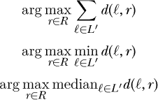

1.  将选择的地标添加到*L*′中。

1.  当*|L*′*|* = *N*[*L*]时，将*L*′作为地标集*L*。

算法首先随机选择*D*中的一个应用作为地标，并将其添加到当前选择的地标集*L*′中（步骤 1）。然后它通过迭代的方式添加更多的地标（步骤 2 到步骤 4）。在每次迭代中，它从*D – L*′中随机抽取一组应用（步骤 2），然后选择距离当前地标集*L*′中最远的应用（步骤 3）。

距离可以通过多种方式计算。例如，假设在算法的某次迭代中我们有 3 个地标，*ℓ*[1]、*ℓ*[2]、*ℓ*[3]，并且假设*D – L*′包含 100 个地标，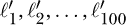。在这种情况下，100 个地标中的任何一个都可以作为第四个地标添加到*L*′中。我们可以选择将地标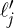添加到*L*′中，它最大化了候选第四个地标在*D – L*′中的距离与*L*′中先前选择的地标之间的距离，或者换句话说，最大化了和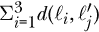的和。或者，我们也可以选择*D – L*′中那个最大化与先前选择的地标*ℓ*[1]、*ℓ*[2]、*ℓ*[3]的平均距离或中位数距离的地标，例如选择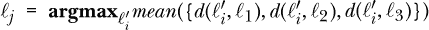。在此算法中，*d*是一个距离函数。我们让*d*(*ℓ*, *r*)表示两个应用*ℓ*和*r*之间的特征向量的距离。这个步骤确保选择的地标距离先前选择的地标足够远，从而确保地标集的多样性。

该过程在选择了*N*[*L*]个地标后结束（步骤 5）。由于有 4 个距离函数和 3 种可能的最远距离定义，我们至少可以通过 12 种方式应用此地标选择方法。

在我们描述的三种地标选择方法之间，对于每个*N*[*L*]值，选择地标集合*L*的方式有很多种。然而，为了进一步迷惑潜在的对手，我们建议安全官员定期使用新的地标集，修改地标选择方法，或两者兼而有之，然后重新计算基于地标的特征。通过每周或每两周进行一次此类操作，您可以让对手始终感到困惑，从而形成移动目标防御。

#### ***计算基于地标的特征***

一旦选择了地标，我们就使用它们为集合*D*中的每个应用程序样本*i*计算基于地标的特征。以下是生成基于地标的特征的算法：

**基于地标的特征生成算法**

1.  使用 S 生成地标集合*L*。

1.  对于每个地标*ℓ* ∈ 和每个样本应用程序*i* ∈ *D*，计算*d*(*i*，*ℓ*)。

1.  特征计算如下：

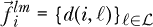

输入为带有相关特征向量的 Android 应用程序集合*D* 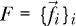，要选择的地标数量*N*[*L*]，地标选择方法 S（如适用，包含其参数）以及距离函数*d*(·)。

我们使用 S 生成地标集合*L*（步骤 1）。接下来，我们迭代地为每个样本应用程序*i*计算地标特征向量（步骤 2 和步骤 3）。这个过程从计算样本*i*到每个地标*ℓ* ∈ 的距离*d*(*i*，*ℓ*)开始，然后使用这些距离构建*N*[*L*]*维的基于地标的特征向量。换句话说，向量中的第一个元素是应用程序*i*与第一个地标之间的距离，第二个元素是应用程序*i*与第二个地标之间的距离，以此类推。

图 6-3 是一个基于地标特征的简单示意图。它假设我们的集合*D*中有六个样本（实际上，这个数量要大得多），每个样本都有一个四维的 API 特征向量。

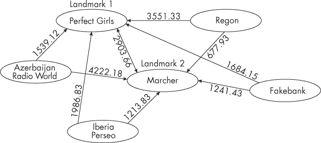

*图 6-3：具有六个应用程序、两个地标和欧几里得距离函数的基于地标的特征*

假设我们使用随机地标生成方法从六个样本中选择两个作为地标，分别是 Perfect Girls 和 Marcher。然后，我们使用欧几里得距离函数生成地标特征。在这里，您可以看到每个样本应用程序*i*到每个地标的欧几里得距离。比如，Regon 的基于地标的特征向量是（3551.33，677.93），而 Perfect Girls 的特征向量是（0，2903.66）。

### **特征聚类**

我们生成的一些特征可能与我们试图预测的标签有相似的关系。当这种情况发生时，我们可以将这些特征结合起来，创建一个更小的，但可能更具代表性的特征集合。该方法称为*特征聚类*，首先将一组基本特征分成若干类别，然后从每个类别中推导出聚合特征。我们将这些新特征称为*FC 特征*。你可以在 Qian Han 等人的《通过（某种程度上）强健的不可逆特征变换进行 Android 恶意软件检测》中了解更多关于此方法的内容。

#### ***生成特征簇***

我们使用以下算法来获得 FC 特征：

**FC 特征生成算法**

1.  从*D*中取出一个样本子集*D*′。

1.  获取*D*′中样本的特征矩阵*F*′。

1.  使用*Clu*将*n*个基本特征根据列向量{*f*[*ij*]}*i*′聚类成*G*组，结果存储在*F*′中。

1.  对于每个示例应用*i*中的每个特征组*F*[*g*]，将一个值与该组关联：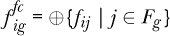

1.  对每个示例应用执行此计算：

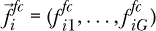

输入包括所有示例 Android 应用的集合*D*及其每个*n*维基本特征向量；要将*n*个特征分成的簇的数量*G*；所使用的聚类算法*Clu*；以及⊕，用于在一个组内聚合特征的算法。我们可以使用我们已展示的基本静态和动态分析特征的任意子集或全部特征，也可以使用其他研究人员定义的特征。

我们从*D*中提取一个示例应用子集*D*′（步骤 1），并使用它们的特征值（步骤 2）将*n*个特征聚类成*G*组（步骤 3）。我们使用*D*的一个子集，而不是*D*本身，原因有三：首先，数据集可能非常庞大，聚类整个数据集可能代价高昂；其次，通过使用样本的子集进行聚类，我们使得攻击者更难判断特征聚类的方式；第三，当*D*集合通过添加更多应用程序进行扩展时，我们可以计算新应用程序的 FC 特征，而无需重新运行算法和重新聚类基本特征。此外，与 TSGs 的情况类似，我们可以定期更新所使用的样本，并重新计算特征聚类，以保持攻击者对所使用防御机制的猜测。

一旦我们聚类了特征，我们将选取任何一个应用，并使用⊕将每个特征簇关联一个单一值（步骤 4）。该值可以是该簇内特征值的和、最小值或最大值，或者可以是从该集群派生的统计量，如中位数、标准差、方差或熵。我们对*D*中每个应用的所有簇执行此操作（步骤 5）。

#### ***选择聚类和特征聚合算法***

我们可以调用特征聚类算法，并选择多种可能的聚类和特征聚合方法。对于聚类算法，我们可能会使用我们在讨论基于地标的特征时提到的六种方法中的任何一种，或者选择完全不同的算法。对于特征聚合算法 ⊕，我们也可以选择多种可能性。以下是一些选项：

**乘积** 我们将新特征计算为集合中元素的乘积。

**均值** 我们使用该组值的均值作为新的特征值。

**中位数** 我们使用该组值的中位数作为新的特征值。

**和** 我们将新特征计算为集合中元素的总和。

**加权和** 我们将新特征值计算为集合中元素的加权和。特征 *j* 的权重与该特征向量与组 *j*[*c*] 的质心特征值 {*fij*[*c*]}*i*′ 的距离成反比，记为 *d*(*j*, *j*[*c*])。因此，我们通过以下方式计算特征值，其中 *α* 是归一化的参数：

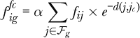

我们通常选择一个显著小于特征总数的聚类大小 *G*，这样这个数字会大幅减少。例如，如果基本特征向量有 100 个元素，我们可能将 *G* 设置为 8。图 6-4 展示了一个使用样本应用程序和四维 API 特征的特征聚类示例。

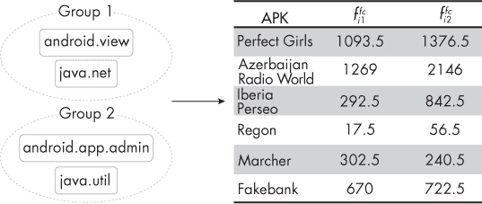

*图 6-4：一个特征聚类示例，包含两个组、四维基本 API 特征和特征平均聚合*

在这个示例中，我们将四个应用程序聚类为两组，并使用均值方法进行 ⊕。我们获得了每个应用程序的 FC 特征，见右侧表格。

虽然 FC 特征具有高度代表性，但它们很难被对手猜测，因为生成它们需要安全分析师做出多个选择，这些选择为过程引入了相当大的不确定性，并且很难逆向工程。这些选择包括要使用的样本应用程序子集、生成的聚类数目、聚类方法及其超参数，以及聚合操作符 ⊕（当 ⊕ 计算加权和时，还包括其超参数）。

### **基于相关图的特征转换**

另一种减少特征数的方法是使用相关图，我们称之为 *CG 特征*。这种方法涉及创建一个完全连接的图，将特征作为顶点，然后利用社交网络分析中的概念将这些特征划分为多个社区。由于每个社区包含相似的特征，我们可以将一个 CG 特征与每个社区关联。

我们使用以下算法执行基于相关图的特征转换：

**CG 特征生成算法**

1.  从 *D* 中取出样本的子集 *D*′。

1.  获取样本 *D*′ 的特征矩阵 *F*′。

1.  根据*F*′的列向量，计算关联图的*n* × *n*边权重。

1.  根据关联图和社区检测算法，获取具有*n*基本特征的*G*社区。

1.  对于每个示例应用*I*中的每个特征社区*C*[*g*]，应用聚合运算符：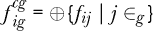

1.  对于每个示例应用*I*，计算其 CG 特征向量：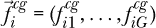

作为输入，它接受应用集*D*、这些应用的特征矩阵*F*、社区检测算法*C*、期望的社区数*G*、以及结合性和交换性的运算符⊕。它输出一个具有*G*维特征向量的关联图，表示应用集*D*中的每个示例应用。

我们首先从*D*中选择一个子集*D*’（步骤 1），并检索它们的特征矩阵*F*’（步骤 2），就像我们计算 FC 特征时做的那样。然后，我们使用皮尔逊相关系数计算每对特征之间的*相关性*（步骤 3）。这个值成为关联图中每对特征之间边的权重。接下来，我们应用社区检测算法 C（步骤 4）生成*G*个社区。最后，我们使用每个社区中的特征和结合性、交换性特征聚合运算符⊕（步骤 5 和 6）生成每个应用的 CG 特征。

我们可以像特征聚类一样，以相同的五种方式定义⊕。此外，我们可以选择许多可能的社区检测算法 C，包括最小割法、Girvan-Newman 算法、模块化最大化、统计推断和基于团体的方法。您可以在“进一步阅读”部分列出的资源中了解更多关于这些算法的信息。

图 6-5 展示了基于生成关联图特征的一个示例。假设我们希望将四个 API 特征分为两个社区，如图的左侧所示。在右侧，您可以看到使用平均特征聚合方法生成的每个示例应用的 CG 特征。

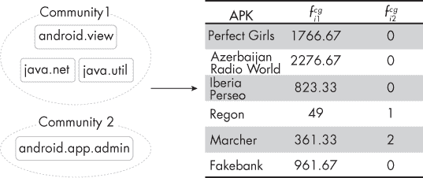

*图 6-5：使用两个社区和平均特征聚合方法生成 CG 特征*

与特征聚类一样，使用 CG 特征为任何试图重现 CG 特征的对手注入了大量的不确定性。CG 特征生成过程包含许多不同的选择，这些选择最终可能导致最终特征值的巨大差异。因此，对手将在确定其实际实现方面遇到相当大的困难。

### **进一步阅读**

本节列出了您可以用来进一步探索本章介绍的主题的资源。

要了解更多关于本章介绍的基于 API 的特征，参见 Yousra Aafer 等人的论文《DroidAPIMiner：挖掘 API 级特征用于 Android 中稳健的恶意软件检测》和 Naser Peiravian 和 Xingquan Zhu 的论文《使用权限和 API 调用进行 Android 恶意软件检测的机器学习》。

要了解 TSG 特征，请查阅介绍它们的论文《DBank：近期 Android 银行木马的预测行为分析》，作者为 Chongyang Bai 等人。此外，我们提到过，TSG 是多种恶意软件检测技术中使用的函数调用图的替代方案：

+   依赖图，首次提出于 Mu Zhang 等人的论文《基于语义的 Android 恶意软件分类：使用加权上下文 API 依赖图》中。

+   控制流图，首次提出于 Steven Arzt 等人的论文《FlowDroid：精确的上下文、流、字段、对象敏感和生命周期意识的污染分析用于 Android 应用》以及 Enrico Mariconti 等人的论文《MaMaDroid：通过构建行为模型的马尔可夫链检测 Android 恶意软件》中。

+   代码属性图，首次提出于 Fabian Yamaguchi 等人的论文《通过代码属性图建模和发现漏洞》中。

生成本章介绍的 CG 特征需要使用社区检测算法。有许多方法可以定义这样的算法：

+   最小割方法，描述于 Manfred W. Padberg 和 M. Ram Rao 的论文《奇数最小割集和 b-匹配》中。

+   层次聚类，描述于 Stephen C. Johnson 的论文《层次聚类方案》中。

+   Girvan–Newman 算法，描述于 Ljiljana Despalatović 等人的论文《网络中的社区结构：Girvan–Newman 算法改进》中。

+   模块化最大化，描述于 Mingming Chen 等人的论文《通过模块化最大化及其变体进行社区检测》中。

+   统计推断，描述于 Kate Calder 的《统计推断》（Holt, 1953）。

+   基于团体的方法，描述于 Xuyun Wen 等人的论文《一种基于最大团体的多目标进化算法用于重叠社区检测》中。

### **接下来**

每当杀毒产品检测到恶意软件时，恶意软件的开发者就会修改它，以逃避检测。到目前为止，恶意软件开发者已经明白杀毒公司越来越多地使用机器学习技术。他们还很清楚检测恶意软件时使用的基本特征类型，并且已经熟练地修改代码来改变这些特征，从而逃避检测。

本章中，我们描述了如何使用在第三章和第四章中介绍的静态和动态分析手动过程，来定义机器学习算法可以使用的特征。然后，我们讨论了两类广泛的技术，这些技术可以使恶意软件开发者的工作更加困难。第一类基于三元怀疑图的概念，最初用于检测 Android 银行木马，但实际上可以用于检测任何形式的恶意软件。第二类则将 Android 应用的原始特征转化为一组不同大小的新特征。本章中我们介绍了三种此类方法：基于地标的转换、特征聚类和基于关联图的特征转换，这些方法都具有抵抗逆向工程的能力。

然而，没有任何方法可以完美地困扰黑客。为了进一步让恶意软件开发者感到沮丧，本章介绍的技术包括了多层次的随机化。此外，我们建议组织频繁地更改其基于机器学习的恶意软件检测设置，就像所有用户应该频繁更改密码一样。例如，在 TSG 的情况下，防御者可以每周更新用于生成特征的恶意软件和良性软件样本，并修改其他参数，如窗口大小。在基于地标的特征的情况下，防御者可以定期修改其地标的数量和身份。这些修改对企业安全人员的成本相对较小，但可以带来可观的收益。

在下一章中，我们将应用到目前为止你所学到的机器学习算法和特征，来研究一种重要类别的恶意软件：Rooting 恶意软件。这种恶意软件试图获取用户设备的 Root 权限，一旦获得，就很难被清除。因此，找到区分 Rooting 恶意软件和良性软件的特征至关重要。

[*OceanofPDF.com*](https://oceanofpdf.com)
