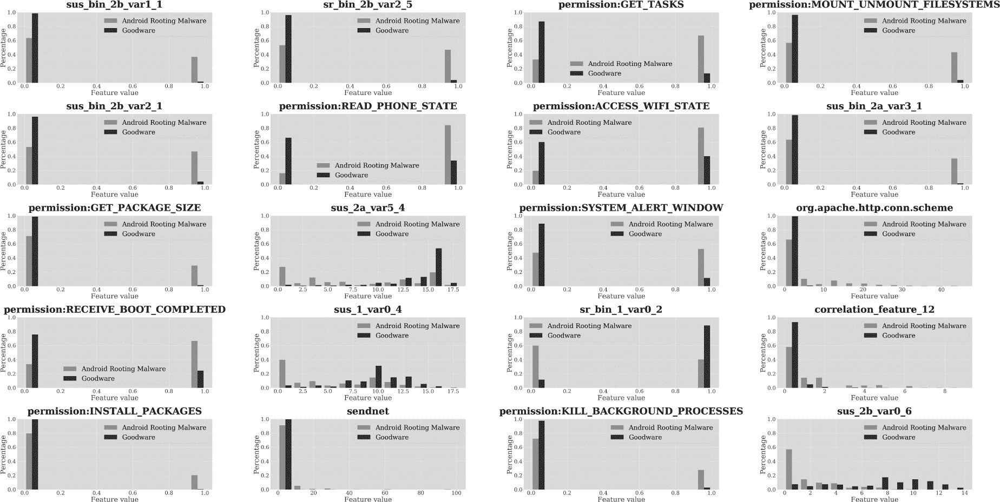
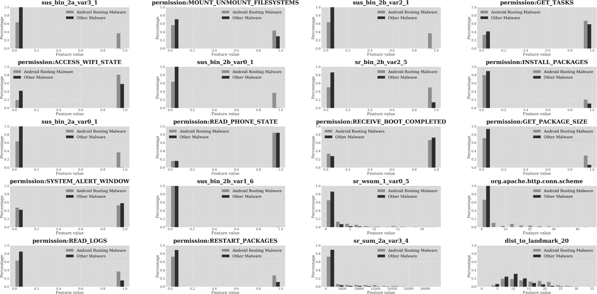

# 第七章：根植恶意软件**


恶意软件开发者常常寻求提升应用程序权限的方式，以获得 root 访问权限，这需要某种权限提升漏洞。一旦以 root 身份运行，恶意软件可以利用应用和系统资源执行操作，如安装系统级应用、访问其他应用的受保护文件以及修改文件系统权限，以允许其他恶意应用查看敏感数据。

我们在第二章中介绍了多个关于根植恶意软件的例子。在本章中，我们将首先讨论一些我们尚未探讨的著名根植恶意软件家族。接下来，我们将分析用于将根植恶意软件与良性软件区分开来，以及与其他形式的安卓恶意软件区分的不同机器学习技术的表现，并探讨实现这一目标的关键特征。尽管我们将以 Rootnik 根植恶意软件作为全章的示例，但我们也将把这些检测技术应用于 DroidDream 恶意软件。

### **根植恶意软件家族**

据我们所知，ZNIU 是首个利用 Dirty COW（写时复制）漏洞进行权限提升的根植恶意软件，Dirty COW 漏洞允许在 Linux 内核中提升权限。根据趋势科技博客文章《ZNIU：首个利用 Dirty COW 漏洞的安卓恶意软件》所述，它通过 1200 多个应用程序和被感染的网站进行分发。一旦该应用程序安装在设备上，它会联系一个指挥与控制服务器，并通过启用短信支付服务与受感染设备的移动运营商进行交易，从而向一家位于中国的公司产生费用。ZNIU 使用 root 权限绕过了安卓的默认工作流程，该工作流程要求用户同意授予应用短信相关权限。ZNIU 的某些版本利用了除了 Dirty COW 之外的漏洞，如 Iovyroot，它利用了 Linux 内核漏洞，或者利用了 KingoRoot 根植应用的各种漏洞。

2017 年，卡巴斯基实验室的研究人员发现了 Dvmap。其作者首先将一个良性应用上传到 Google Play，后来将其更新为恶意版本，这种行为在恶意软件中很常见，因为它有助于应用建立用户基础而不引起怀疑。作者会将恶意版本提供短时间，然后再用良性版本替换。

Dvmap 是已知的第一个使用代码注入技术的根植恶意软件样本。它会将可执行文件*/system/bin/ip*替换为一个完全新的包含恶意功能的文件，然后将代码注入到与安卓 Dalvik 和 ART 运行时相关的两个系统库中，以确保其以提升的权限运行。替换文件和随后的代码注入到系统库中需要使用权限提升漏洞。你可以在卡巴斯基的博客文章《Dvmap：安卓恶意软件在 Google Play 上出现，使用新技术控制设备》中了解更多关于该恶意软件的信息。

2017 年 9 月，安卓安全团队发现了 Tizi，这是一种通过利用 2012 年和 2013 年发现的多个漏洞来对设备进行 root 的间谍软件，主要在非洲地区活动。一旦获得 root 权限，Tizi 便可以利用这一访问权限记录 WhatsApp、Skype 和 Viber 等加密服务的通话内容，并监控 Facebook、X、LinkedIn 和 Telegram 等社交媒体上的活动。你可以在安卓安全团队的博客文章《Tizi：检测和阻止安卓平台上的社交工程间谍软件》中了解更多有关该恶意软件的信息。

### **测试分类器性能**

为了评估机器学习分类器区分 rooting 恶意软件与良性软件的能力，我们通过提供不同特征集来测试了 10 个分类器，如表 7-1 所示。

**表 7-1：** 分类器性能——Rooting 恶意软件与良性软件

| **特征集** | **最佳分类器** | **AUC** | **精确度** | **召回率** | **F1** | **假阳性率** | **假阴性率** |
| --- | --- | --- | --- | --- | --- | --- | --- |
| API 包 | GBDT | 0.9939 | 0.9324 | 0.9009 | 0.9164 | 0.0676 | 0.0146 |
| 静态（S） | XGBoost | 0.9811 | 0.8658 | 0.7783 | 0.8197 | 0.1342 | 0.0296 |
| 动态（D） | 随机森林（RF） | 0.9065 | 0.8735 | 0.5271 | 0.6575 | 0.1265 | 0.0608 |
| S + D | XGBoost | 0.9848 | 0.8889 | 0.8079 | 0.8465 | 0.1111 | 0.0257 |
| API + S + D | XGBoost | 0.9974 | 0.9564 | 0.9187 | 0.9372 | 0.0436 | 0.0109 |
| TSG | XGBoost | 0.9927 | 0.9018 | 0.8896 | 0.8957 | 0.0982 | 0.0163 |
| LM | XGBoost | 0.9791 | 0.8375 | 0.7488 | 0.7906 | 0.1625 | 0.0335 |
| FC | XGBoost | 0.9729 | 0.8507 | 0.7438 | 0.7937 | 0.1493 | 0.0341 |
| CG | 随机森林（RF） | 0.9571 | 0.8349 | 0.6724 | 0.7449 | 0.1651 | 0.0432 |
| API + S + D + TSG | XGBoost | 0.9970 | 0.9337 | 0.9015 | 0.9173 | 0.0663 | 0.0133 |
| API + S + D + LM | XGBoost | 0.9972 | 0.9514 | 0.9163 | 0.9335 | 0.0486 | 0.0113 |
| API + S + D + FC | XGBoost | 0.9972 | 0.9540 | 0.9187 | 0.9360 | 0.0460 | 0.0110 |
| API + S + D + CG | XGBoost | 0.9971 | 0.9580 | 0.8990 | 0.9276 | 0.0420 | 0.0136 |
| 所有特征 | XGBoost | 0.9970 | 0.9482 | 0.9015 | 0.9242 | 0.0518 | 0.0133 |
| 最佳晚期融合 | XGBoost | 0.9994 | 0.9854 | 0.9828 | **0.9840** | 0.0146 | 0.0023 |

我们首先使用了从 API 包、静态分析和动态分析（API、S 和 D）中得出的基本特征集，以及其中两种组合（S + D 和 API + S + D）。"最佳分类器"列记录了具有最佳 F1 得分的分类器。如你所见，梯度提升决策树（GBDT）、XGBoost 和随机森林（RF）分类器的表现最佳。

该表列出了几项性能指标，所有指标在第五章中有介绍：AUC、精确率、召回率、F1 分数、假阳性率（FPR）和假阴性率（FNR）。其中，F1 分数是最重要的，因为它平衡了精确率和召回率。可以看到，单独使用 API 特征已经能够获得较高的 F1 分数（0.9164），超越了使用静态特征、动态特征或它们的组合。将静态、动态和 API 特征结合使用，F1 分数进一步提高至 0.9372。

对于高级特征，我们测试了基于三元疑似图（TSG）、基于地标的特征（LM）、特征聚类特征（FC）和基于关联图的特征（CG）。我们还将每种高级特征与基本特征结合使用。结果表明，仅使用一种高级特征就能获得 0.7449 到 0.8957 之间的 F1 分数，其中 TSG 排名最高。当我们将基本特征与高级特征结合时，性能显著提高，最好的 F1 分数是将 FC 特征与基本特征结合时获得的。

最后，我们通过两种方法将所有特征结合起来：将它们全部输入到每个分类器中，并使用晚期融合（late fusion）将七个分类器的预测结果合并，每个分类器使用一种特征。*晚期融合*是一种分类技术，它将多个分类器的预测结果进行组合。假设我们使用了三个不同的分类器来预测一个给定应用是否是恶意的，这三个分类器分别返回概率 *p*[1]、*p*[2] 和 *p*[3]。晚期融合试图找到权重 *w*[1]、*w*[2] 和 *w*[3]，使得当它们的总和大于 0.5 时，应用是恶意的可能性最大。如表 7-1 的最后两行所示，最佳的晚期融合结果优于所有其他方法，F1 分数为 0.9840。

我们还测试了每个分类器区分 Rooting 恶意软件与其他类型恶意软件的能力。这项能力是有优势的；例如，如果一个机器学习分类器将某个应用标记为 Rooting 恶意软件，您可以将其发送给 Rooting 恶意软件专家进行分析。您可以在表 7-2 中看到输入和它们的表现。

**表 7-2：** 分类器性能—Rooting 恶意软件与其他恶意软件

| **特征集** | **最佳分类器** | **AUC** | **精确率** | **召回率** | **F1** | **假阳性率** | **假阴性率** |
| --- | --- | --- | --- | --- | --- | --- | --- |
| API 包 | RF | 0.9801 | 0.9669 | 0.7883 | 0.8685 | 0.0331 | 0.0435 |
| 静态 (S) | XGBoost | 0.9530 | 0.7890 | 0.6724 | 0.7261 | 0.2110 | 0.0621 |
| 动态 (D) | RF | 0.8686 | 0.8444 | 0.4680 | 0.6022 | 0.1556 | 0.0955 |
| S + D | RF | 0.9610 | 0.9085 | 0.6847 | 0.7809 | 0.0915 | 0.0587 |
| API + S + D | XGBoost | 0.9898 | 0.9472 | 0.8842 | 0.9146 | 0.0528 | 0.0223 |
| TSG | RF | 0.9717 | 0.9358 | 0.7883 | 0.8557 | 0.0642 | 0.0437 |
| LM | XGBoost | 0.9466 | 0.7922 | 0.6010 | 0.6835 | 0.2078 | 0.0743 |
| FC | RF | 0.9139 | 0.8796 | 0.5936 | 0.7088 | 0.1204 | 0.0746 |
| CG | RF | 0.8452 | 0.7093 | 0.5049 | 0.5899 | 0.2907 | 0.0914 |
| API + S + D + TSG | XGBoost | 0.9896 | 0.9395 | 0.8793 | 0.9084 | 0.0605 | 0.0233 |
| API + S + D + LM | XGBoost | 0.9897 | 0.9395 | 0.8793 | 0.9084 | 0.0605 | 0.0233 |
| API + S + D + FC | XGBoost | 0.9898 | 0.9446 | 0.8818 | 0.9121 | 0.0554 | 0.0228 |
| API + S + D + CG | XGBoost | 0.9896 | 0.9523 | 0.8842 | 0.9170 | 0.0477 | 0.0223 |
| 所有特征 | XGBoost | 0.9893 | 0.9333 | 0.8966 | 0.9146 | 0.0667 | 0.0200 |
| 最佳后期融合 | XGBoost | 0.9988 | 0.9927 | 0.9409 | **0.9656** | 0.0073 | 0.0114 |

再次强调，API 特征是所有基本特征中表现最好的，但将所有基本特征结合起来进一步提高了 F1 分数。在高级特征中，TSG 再次取得了最高的 F1 分数，尽管将基本特征添加到每种高级特征中显著提高了性能。具体来说，将 CG 特征与基本特征结合取得了最佳的 F1 分数，这一结果与区分根植恶意软件和良性软件的最佳方法不同。当我们将所有基本和高级特征结合时，后期融合的结果再次超越了所有分类器。

### **根植恶意软件与良性软件**

我们将使用一个名为 Rootnik 的恶意软件家族来说明根植恶意软件的特征如何与良性软件应用的特征不同。Rootnik 通过各种应用程序传播其根植恶意软件，例如 *com.web.sdfile*（v2, f214），这些应用宣称可以管理用户设备上的文档、视频、图片、音乐和其他文件。安装后，应用会连接到一个指挥与控制服务器，随意下载代码执行各种恶意行为，从向设备推送色情内容和广告到悄悄安装新应用程序。它将自己嵌入到各种合法应用程序中，一旦设备被根植，就会窃取 Wi-Fi 信息，包括密码和密钥、用户的位置以及设备的 MAC 地址。



*图 7-1：最佳区分 Android 根植恶意软件与良性软件的 20 个特征*

在本节中，我们将考虑一组 1,829 个 Rootnik 哈希值。在这些哈希值中，有 444 个是不同的，它们生成的特征向量不同，属于在第五章和第六章中讨论的那类。我们将使用 Extra-Trees 分类器（即极端随机树，一种随机森林分类器的变体）来介绍最能区分根植恶意软件和良性软件的 20 个特征，该分类器随机选择训练集的多个子集，为每个子集学习一棵决策树，然后聚合所有决策树。图 7-1 展示了这些特征。

它们包括九个静态权限相关特性，一个基于 `sendnet` 方法的静态特性，一个静态 API 调用特性，六个可疑分数特性，两个可疑排名特性，以及一个关联图特性。我们将在本章稍后详细解释 `sendnet`。

#### ***与权限相关的特性***

列表 7-1 显示了 Rootnik 在应用清单文件中请求的每个权限。

```
<uses-permission android:name=”android.permission.ACCESS_WIFI_STATE”/>
<uses-permission android:name=”android.permission.CHANGE_WIFI_STATE”/>
<uses-permission android:name=”android.permission.INTERNET”/>
<uses-permission android:name=”android.permission.MOUNT_UNMOUNT_FILESYSTEMS”/>
<uses-permission android:name=”android.permission.READ_EXTERNAL_STORAGE”/>
<uses-permission android:name=”android.permission.WRITE_EXTERNAL_STORAGE”/>
<uses-permission android:name=”android.permission.READ_MEDIA_STORAGE”/>
<uses-permission android:name=”android.permission.ACCESS_NETWORK_STATE”/>
<uses-permission android:name=”android.permission.READ_PHONE_STATE”/>
<uses-permission android:name=”android.permission.KILL_BACKGROUND_PROCESSES”/>
<uses-permission android:name=”android.permission.RECEIVE_BOOT_COMPLETED”/>
<uses-permission android:name=”android.permission.SYSTEM_ALERT_WINDOW”/>
<uses-permission android:name=”android.permission.WRITE_SETTINGS”/>
<uses-permission android:name=”android.permission.VIBRATE”/>
<uses-permission android:name=”android.permission.ACCESS_DOWNLOAD_MANAGER”/>
<uses-permission android:name=”android.permission.DOWNLOAD_WITHOUT_NOTIFICATION”/>
<uses-permission android:name=”android.permission.DISABLE_KEYGUARD”/>
<uses-permission android:name=”android.permission.ACCESS_COARSE_LOCATION../>
<uses-permission android:name=”android.permission.GET_PACKAGE_SIZE”/>
<uses-permission android:name=”android.permission.CLEAR_APP_CACHE”/>
<uses-permission android:name=”android.permission.GET_TASKS”/>
<uses-permission android:name=”android.permission.INSTALL_PACKAGES”/>
<uses-permission android:name=”android.permission.DELETE_PACKAGES”/>
<uses-permission android:name=”android.permission.CLEAR_APP_USER_DATA”/>
<uses-permission android:name=”android.permission.CHANGE_COMPONENT_ENABLED_STATE”/>
<uses-permission android:name=”android.permission.READ_FRAME_BUFFER”/>
<uses-permission android:name=”android.permission.WAKE_LOCK”/>
<uses-permission android:name=”android.permission.ACCESS_NETWORK_STATE”/>
<uses-permission android:name=”android.permission.ACCESS_WIFI_STATE”/>
<uses-permission android:name=”android.permission.RECEIVE_BOOT_COMPLETED”/>
<uses-permission android:name=”android.permission.CHANGE_CONFIGURATION”/>
<uses-permission android:name=”android.permission.READ_EXTERNAL_STORAGE”/>
<uses-permission android:name=”android.permission.READ_PHONE_STATE”/>
<uses-permission android:name=”android.permission.GET_TASKS”/>
<uses-permission android:name=”android.permission.INTERNET”/>
<uses-permission android:name=”android.permission.SYSTEM_ALERT_WINDOW”/>
<uses-permission android:name=”android.permission.WRITE_EXTERNAL_STORAGE”/>
<uses-permission android:name=”com.android.launcher.permission.READ_SETTINGS”/>
<uses-permission android:name=”com.android.launcher.permission.INSTALL_SHORTCUT”/>
<uses-permission android:name=”com.android.launcher.permission.UNINSTALL_SHORTCUT”/>
<uses-permission android:name=”android.permission.VIBRATE”/>
<uses-permission android:name=”android.permission.MOUNT_UNMOUNT_FILESYSTEMS”/>
<uses-permission android:name=”android.permission.WAKE_LOCK”/>
```

*列表 7-1：Rootnik 中请求的所有权限*

应用在运行时希望安装其他包或应用时，会寻求 `INSTALL_PACKAGES` 特权权限。多年来，恶意软件开发者试图利用此权限侧载新的应用包。此权限的一大优势是，它可以在没有用户同意的情况下安装应用，而不像它的非特权对等权限 `REQUEST_INSTALL_PACKAGES`。侧载的应用随后可以请求任意权限，为更多的恶意攻击提供跳板。分类器的输出显示，虽然 20.27% 的 root 恶意软件请求此权限，但只有 0.22% 的良性软件请求此权限。这是可以预见的，因为特权权限仅适用于那些已成功提升其权限级别高于普通应用的应用。

`GET_PACKAGE_SIZE` 权限允许应用获取其他应用的包大小。从分类器的输出可以看出，30.75% 的 root 恶意软件请求此权限，而只有 1.86% 的良性软件请求此权限。历史上，Android 使用 `GET_PACKAGE_SIZE` 权限来保护单一的 Android API（`PackageManager.getPackageSizeInfo`），该 API 在 Android 8.0（Oreo）中被移除。对一些 root 应用的抽查显示，尽管它们请求了此权限，但似乎并未使用它。

`KILL_BACKGROUND_PROCESSES` 权限允许 Android 应用终止在后台默默运行的进程。应用请求此权限的原因有合法和恶意两种。例如，一个良性应用可能希望获取此权限，以便在另一个应用在后台运行但未被积极使用时释放系统资源。另一方面，恶意应用可能请求此权限以终止后台运行的安全进程。从分类器的输出可以看出，28.33% 的 root 恶意软件请求此权限，但只有 2.04% 的良性软件请求此权限。

另一个重要的权限是 `GET_TASKS`。尽管该权限在 2014 年已被弃用，但它允许应用识别设备上正在运行的进程。从分类器的输出可以看出，67.81% 的 root 恶意软件请求此权限，而只有 13.57% 的良性软件请求此权限。因此，申请此权限的应用更可能是 root 恶意软件，而不是良性软件，比例大约是 5:1。为了进一步增强应用间的沙箱隔离，Android 严格限制了此功能。

应用请求 `MOUNT_UNMOUNT_FILESYSTEMS` 权限以挂载或卸载设备的文件系统。这也使它们能够在以前被限制的设备部分添加新文件、删除文件或修改文件。此权限常用于将 BusyBox 可执行文件放置在 */system/bin* 目录中。由于 BusyBox 将许多标准 Linux 命令集成在一个可执行文件中，它是将大量标准恶意软件功能加载到已 root 的设备上的一种有效方式，而无需下载、复制和安装太多独立的可执行文件。恶意软件本身可以根据需要使用这些功能。请求 `MOUNT_UNMOUNT_FILESYSTEMS` 权限的 root 恶意软件的概率为 42.65%，而良性应用的概率仅为 4.21%，因为未特权的应用根本无法使用此权限。

`SYSTEM_ALERT_WINDOW` 权限允许应用在未被使用时仍能显示弹出警告窗口，这为通过钓鱼攻击提供了明显且充分的滥用机会。我们尚未在 root 应用中看到此类滥用案例，但许多恶意 root 应用可能将其代码打包到正常使用该权限的无害应用中。恶意 root 软件请求此权限的可能性远高于良性软件（53.76% 对比 11.13%）。

`RECEIVE_BOOT_COMPLETED` 权限允许应用知道系统何时完成启动或重启。良性应用和恶意应用都可以使用此广播消息在启动完成时启动。分类器的输出显示，66.41% 的恶意 root 应用请求此权限，而良性应用仅为 24.38%。恶意软件似乎更可能在重启后立即请求重启，而良性软件通常只有在用户想要与之交互时才会启动。

恶意应用也经常请求 `READ_PHONE_STATE` 和 `ACCESS_WIFI_STATE` 权限。无害应用可能使用第一个权限获取手机的 IMEI 号以及有关手机连接的网络类型的信息。例如，移动支付应用可能需要这些信息来验证发送支付请求的设备身份。恶意软件可以使用此权限捕获受害者手机的私人信息，并且请求此权限的概率是良性应用的两倍多：35.98% 的良性软件请求 `READ_PHONE_STATE` 权限，而 83.01% 的 root 恶意软件请求此权限。同样，黑客可以使用 `ACCESS_WIFI_STATE` 捕获 Wi-Fi 服务集标识符（SSID）。虽然 80.57% 的 root 恶意软件请求此权限，但良性应用请求此权限的概率只有其一半（40.02%）。

#### ***基于网络的功能***

除了权限相关特征外，与应用网络通信相关的特征可以帮助机器学习算法识别根植恶意软件。例如，静态的`sendnet`特征记录了应用代码调用`sendnet`方法通过互联网发送数据的次数。我们可以通过在名为 DroidBox 的 Android 沙箱环境中运行 Android 应用来收集这种信息，DroidBox 可以安全地运行 Android 应用并收集如第六章中所提到的动态特征。列表 7-2 显示了 Rootnik 恶意软件调用`sendnet`。

```
"sendnet": 
  {
    "desthost": "abc.jxyxteam.com",
    "pid": 852,
    "processname": "com.web.sdfile",
    "time": 16.090091,
    "tid":  705893000,
    "data": "POST /HTTP/1.1\r\nContent-Type: application/x-www-form-urlencoded
\r\nConnection: close\r\nContent-Length: 257\r\nHost: abc.jxyxteam.com:7901\r\
nUser-Agent: Mozilla/5.0 (Linux; U; android 2.2.1; en-us; Nexus One Build/FRG83)
AppleWebKit/533.1 (KHTML, like Gecko) Version/4.0 Mobile Safari/ 533.1\r\nExpect:
100-continue\r\n\r\n",
    "destport": 7901
  },
```

*列表 7-2：在 Rootnik 中用于通过互联网发送数据的*sendnet*方法*

DroidBox 输出显示 Rootnik 将流量发送到外部网址*abc.jxyxteam.com*，该网址很可能属于恶意软件开发者运营的站点。

`sendnet`功能的值对于根植恶意软件来说远远大于零，而对于良性软件来说则较小。分类器的输出显示，7.65%的恶意软件使用此方法，而仅有 0.057%的良性软件使用，这意味着根植恶意软件应用使用此方法的可能性是良性软件的约 134 倍。

另一个用来区分根植恶意软件和良性软件的特征是`org.apache.http.conn.scheme`，它捕获了应用代码调用 HTTP 或 HTTPS 协议的次数。根植恶意软件调用此特征的频率远高于良性软件（33.27%对比仅 1.59%）。在[列表 7-3 中，你可以看到 Rootnik 根植恶意软件调用了`org.apache.http.conn.scheme` API。

```
import org.apache.http.conn.scheme.Scheme;
public C1124az(Context context, X509Certificate x509Certificate, String str,
String str2, int i) {
  this.f3838f = "";
  this.f3839g = null;
  this.f3833a = str;
  this.f3834b = i;
  this.f3836d = str2;
  this.f3840h = context;
  try {
    C1104af afVar = new C1104af(x509Certificate);
    afVar.setHostnameVerifier(SSLSocketFactory.ALLOW_ALL_HOSTNAME_VERIFIER); 
    Scheme scheme = new Scheme("https",	afVar, i);
    this.f3835c = m3559f(str);
    this.f3835c.getConnectionManager().getSchemeRegistry().register(scheme); 
    if (!C1126ba.m3582a()) {
      if (context != null) {
        this.f3838f = PreferenceManager.getDefaultSharedPreferences(context).
          getString(C1112an.m3519c(str),"");
      }
      mo5336e(this.f3833a);
    }
  } catch (Throwable th){
  }
}
```

*列表 7-3：Rootnik 中调用的 org.apache.http.conn.scheme API*

请记住，使用这种方法本身并不带有恶意，它可以支持善意和恶意的流量。

### **根植恶意软件与其他恶意软件**

现在让我们讨论一下哪些特征能最好地区分根植恶意软件与其他类型的恶意软件。图 7-2 展示了 Extra-Trees 分类器为此目的识别出的最强的 20 个特征。

这些特征包括 10 个权限相关特征，8 个怀疑分数或怀疑等级特征，1 个 API 相关特征，以及 1 个基于地标的特征。在这一部分，我们将介绍一些重点内容。因为根植恶意软件与其他类型的恶意软件相比，更类似于其他恶意软件而非良性软件，所以在此讨论的差异较小。

#### ***权限相关特征***

十个权限有助于 Extra-Trees 分类器区分根植恶意软件与其他恶意软件。第一个是`GET_PACKAGE_SIZE`。请求此权限的应用更可能是根植恶意软件，而非其他类型的恶意软件；30.15%的根植恶意软件请求此权限，而其他恶意软件的请求比例仅为 7.83%。然而，一些应用请求此权限并不一定意味着它们是恶意的。

接下来的四个权限，`MOUNT_UNMOUNT_FILESYSTEMS`、`GET_TASKS`、`ACCESS_WIFI_STATE` 和 `INSTALL_PACKAGES`，也出现在区分 Root 恶意软件与良性软件的 20 个最有用特性中。Root 恶意软件请求的两个额外权限是 `READ_LOGS` 和 `RESTART_PACKAGES`，它们比其他恶意软件稍微更常请求。`READ_LOGS` 权限允许特权应用访问所有系统日志，而普通应用只能访问自己的日志；`RESTART_PACKAGES` 从 API 15 开始已被弃用。在所有这些情况下，Root 恶意软件请求这些权限与其他类型恶意软件请求这些权限的比例差异并不大，单独使用这些特性来将应用分类为 Root 恶意软件而不是其他类型的恶意软件，可能会导致错误。



*图 7-2：最佳区分 Android Root 恶意软件与其他恶意软件的前 20 个特性*

最后，我们已经看到，`READ_PHONE_STATE` 和 `RECEIVE_BOOT_COMPLETED` 在区分 Root 恶意软件与良性软件时非常重要。有趣的是，图 7-2 显示 Root 恶意软件请求这些权限的可能性略低于其他类型的恶意软件，后者可能利用这些权限在系统重启时启动或获取设备的 IMSI 和 IMEI 信息。

#### ***其他特性***

疑似分数和疑似排名特性在区分 Root 恶意软件与其他恶意软件时，比在区分 Root 恶意软件与良性软件时更为重要。这些更具技术性的特性似乎能够做出更精细的区分，而粗略的基于权限的特性可能会遗漏这些细微差异。

API 特性 *org.apache.http.conn.scheme*，它捕获应用在代码中调用 HTTP 或 HTTPS 协议的次数，也在这里很有帮助。虽然 63.27% 的 Root 恶意软件在其代码中至少调用过一次这些协议，但其他类型的恶意软件并没有那么频繁使用 Apache 库（尽管它们可能使用其他库来完成相同的任务）。这个类表示了多个协议，并描述了诸如使用哪个套接字等协议属性。

### **DroidDream：案例分析**

DroidDream 是已知的第一个 Android 平台上的 Root 恶意软件。在这一部分，我们将应用本章前面学习的检测策略来分析它。列表 7-4 显示了应用在 *com.fall.down*（v1，7d1d）中请求的权限。

```
<uses-permission android:name=”android.permission.INTERNET”/>
<uses-permission android:name=”android.permission.VIBRATE”/>
<uses-permission android:name=”android.permission.READ_PHONE_STATE”/>
<uses-permission android:name=”android.permission.CHANGE_WIFI_STATE”/>
<uses-permission android:name=”android.permission.ACCESS_WIFI_STATE”/>
```

*列表 7-4：DroidDream 恶意软件中使用的权限*

我们看到，DroidDream 只请求了本章前面讨论的 20 个权限中的一小部分。我们分析认为，在识别 Root 恶意软件时，`READ_PHONE_STATE` 和 `ACCESS_WIFI_STATE` 是关键。你可以在列表 7-5 中看到该应用使用 `READ_PHONE_STATE` 请求设备的 IMEI 信息。

```
public static String getIMEI(Context context) {
  TelephonyManager mTelephonyMgr = (TelephonyManager) context.getSystemService("phone");
  if (mTelephonyMgr.getDeviceId() == null) {
    return "";
  }
  return mTelephonyMgr.getDeviceId();
}
```

*列表 7-5：DroidDream 恶意软件访问 IMEI*

列表 7-6 包含了 DroidBox 输出，显示 DroidDream 应用访问 IMSI 信息，这是另一个需要 `READ_PHONE_STATE` 权限的活动。在代码后面，应用将 IMEI 和 IMSI 一同发送到其指挥控制服务器。

```
"runbinary":[ 
  { 
    "code":"invoke-static Ljava/lang/Runtime;->getRuntime()Ljava/lang/Runtime;", 
    "class":"Lcom/android/root/Setting;",
    "method":"runRootCommand"
  }, 
  {
    "code":"invoke-virtual v9, vll, Ljava/lang/Runtime;->exec(Ljava/lang/String;)
Ljava/lang/Process;",
    "class":"Lcom/android/root/Setting;",
    "method":"runRootCommand"
  }, 
  {
    "code":"invoke-static Ljava/lang/Runtime;->getRuntime()Ljava/lang/Runtime;",
    "class":"Lcom/android/root/udevRoot;",
    "method":"runExploid"
  } 
], 
"imsi":[ 
  { 
    "code":"invoke-virtual v0, Landroid/telephony/TelephonyManager;->getSubscriberid()
Ljava/lang/String;",
    "class":"Lcom/android/root/adbRoot;", 
    "method": getIMSI"
  }, 
  { 
    "code":"invoke-virtual v0, Landroid/telephony/TelephonyManager;->getSubscriberid()
Ljava/lang/String;",
    "class":"Lcom/android/root/adbRoot;",
    "method": getIMSI"
  } 
], 
"socket":[ 
  { 
    "code":"invoke-virtual vl, Ljava/net/URL;->openConnection()Ljava/net/URLConnection;",
    "class":"Lcom/admob/android/ads/i;",	
    "method":"a"
  }, 
  { 
    "code":"invoke-virtual v0, Ljava/net/URL;->openConnection()Ljava/net/URLConnection;",
    "class":"Lcom/android/root/Setting;",
    "method":"postUrl"
  }
]
```

*列表 7-6：DroidDream 恶意软件访问 IMSI*

该应用还收集有关设备硬件和操作系统的信息，这需要 `INTERNET` 权限。DroidDream 也使用该权限连接到各种外部 URL。列表 7-7 显示了 DroidDream 代码中包含的 URL 列表。

```
"urls":[
  "http://api.admob.com/v1/pubcode/android_sdk_emulator_notice",
  "http://market.android.com/search?q=pname:com.teamsoft.blockedtrafficfree",
  "http://market.android.com/search?q=pname:com.teamsoft.blockedtrafficpro",
  "http://market.android.com/search?q=pname:com.teamsoft.funnytest",
  "http://market.android.com/search?q=pname:com.teamsoft.rushhour",
  "http://mm.admob.com/static/android/canvas.html",
  "http://mm.admob.com/static/android/i18n/20100331",
  "http://r.admob.com/ad_source.php",
  "http://schemas.android.com/apk/res/"
]
```

*列表 7-7：DroidDream 恶意软件访问的外部 URL*

单独来看，这些特性并不足以证明 DroidDream 是恶意的。然而，它们的共同存在足以让我们的基于集成的机器学习算法将其标记为恶意软件。然后，安全分析师可以检查恶意软件以找到确凿的证据（例如，`runExploid` 方法，如 列表 7-6 所示）。如果他们这样做，他们将发现 DroidDream 利用所谓的 Rage-Against-the-Cage 漏洞进行 root 操作，然后使用其 root 权限安装另一个具有提升权限的应用。

### **接下来**

在本章中，我们展示了通过集成晚期融合（ensemble late fusion）方法，在恶意软件检测中可以实现高水平的预测效果，且其性能显著高于其他任何分类器。我们还展示了，尽管所有特征类型都有助于将 root 恶意软件与良性软件以及其他类型的恶意软件区分开，但在 第六章 中讨论的高级特征特别有效。特别是，TSG 怀疑分数和怀疑排名对集成方法的贡献最大。权限也被证明很重要。

下一章介绍了另一种广泛流行的 Android 恶意软件——间谍软件的检测技术，它收集个人信息并用于多种恶意目的。

[*OceanofPDF.com*](https://oceanofpdf.com)
