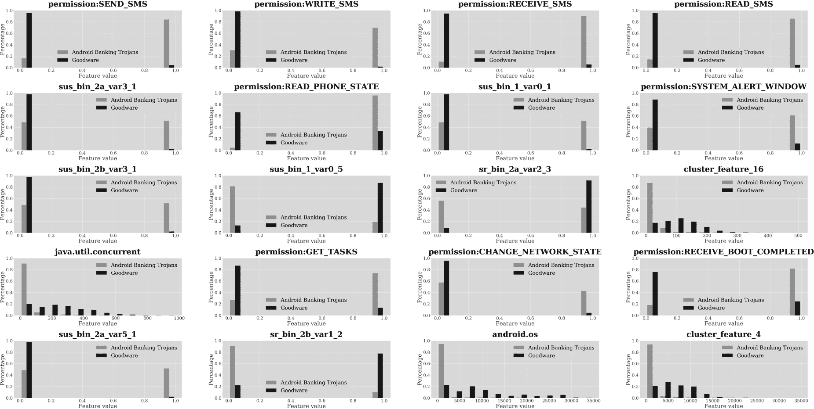
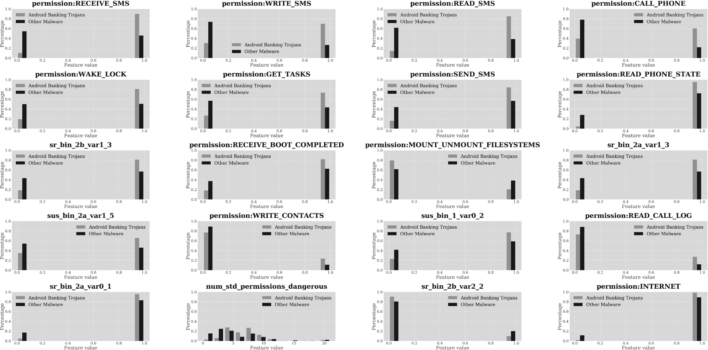

## 第九章：**9  

**银行木马**  

  

攻击者使用 Android 银行木马（ABT）来盗取毫无戒心的受害者的钱财，通过清空他们的银行账户或捕获信用卡信息，并利用这些信息进行欺诈性购买。例如，一些 ABT 通过在用户的银行应用上放置一个虚假的窗口来收集用户凭证。当用户将凭证输入恶意窗口时，它会捕获这些数据，登录到用户账户，并将资金转移给攻击者。  

其他 ABT 监控用户访问银行网站。当他们试图访问合法网站时，恶意软件会将他们重定向到一个看起来一模一样的假网站。一旦不幸的用户输入凭证，攻击者便可以利用这些凭证将资金从受害者账户转移到自己的账户。这通常通过许多中介账户进行转账，以减少被检测到的可能性。

在本章中，您将了解一些著名的 ABT 家族，并查看机器学习算法使用哪些特征来区分 ABT 与良性软件以及其他类别的 Android 恶意软件。  

### **银行木马家族**  

本节介绍了一些重要的 ABT 家族。请注意，其中几个应用程序的源代码已经泄露，导致出现了许多变种。由于样本之间的细微差异，将单独的 APK 文件归类到家族中比其他恶意软件类别更加困难。  

BankBot 是一个常见的恶意软件家族，具有多个变种，最早可追溯至 2014 年，通常通过多种类型的应用程序传播，包括游戏和提供加密货币与法币兑换率估算的应用程序。尽管这些应用确实提供了宣传的服务，但它们也包含了 BankBot 代码。该代码扫描感染的设备，寻找已安装的银行应用程序，并为这些应用提供覆盖屏幕。当受害者启动银行应用时，BankBot 会将一个用户输入屏幕覆盖在真实应用之上，以收集银行凭证。它还会捕获收到的短信并回应请求双因素认证的消息。  

Cerberus 首次由 ThreatFabric 于 2019 年发现，并在博客文章《Cerberus - 来自地下世界的新型银行木马》中进行了描述。它主要针对意大利、俄罗斯、西班牙和其他欧盟国家的用户。像 BankBot 一样，Cerberus 伪装成一个合法的货币兑换或类似目的的应用程序，并使用覆盖屏幕来捕获银行凭证，以及利用短信权限来拦截银行发送的双因素认证消息。最近，开发者将 Cerberus 的源代码发布到各种黑客论坛，导致其变种大量涌现，不同的团体试图将其商业化。  

FakeSpy ABT 家族通过向受害者发送有关未投递包裹的短信来入侵他们的手机。这类钓鱼短信被称为 *smishing*，因为钓鱼诱饵是通过 SMS 发送的。受害者点击消息中的链接，链接会要求他们下载一个看似合法但实际上包含 FakeSpy 恶意软件的应用。一旦受害者的设备被攻破，恶意软件便会窃取个人信息，如他们的联系人列表以及银行和加密货币账户信息。FakeSpy 最早由趋势科技在 2018 年的博客文章《FakeSpy 目标为讲日语和韩语的用户》中描述。

Marcher 家族，也被称为 Marchcaban，自 2013 年至少就开始存在，当时 F-Secure 发现了一些针对西班牙银行 Banca March 的应用程序。某些版本通过告知受害者其 Flash 播放器需要更新来运作。点击他们提供的链接执行更新会下载特洛伊木马应用程序。Marcher 还尝试阻止用户设备上可能安装的多款移动恶意软件检测产品。像许多其他 ABT 一样，Marcher 使用屏幕覆盖层窃取用户凭证，并通过拦截通过 SMS 发送的两步验证请求来获得对用户账户的访问权限。在本章中，我们将以 Marcher 为例，说明许多常见的 ABT 行为。

Medusa 是一个新近出现的恶意软件家族，它通过发送鼓励用户安装包含恶意软件的各种听起来合法的应用程序的 smishing 消息来入侵受害者的设备。Medusa 能够进行键盘记录和拦截消息，以及音频和视频记录。像大多数银行木马一样，它的一个功能是读取并响应来自合法银行应用的两步验证消息。ThreatFabric 在其 2021 年的博客文章《Android 银行木马的愤怒》中首次描述了它。

Zitmo 是一个有趣的 ABT，因为它早在 2011 年就出现在 Symbian、BlackBerry 和 Windows Mobile 等移动操作系统上，之后才传播到 Android。Zitmo 是广为人知的 Windows Zeus 恶意软件的移动版本，Zitmo（即 *Zeus in the Mobile*）与已经被 Zeus 感染的计算机一起运作。Zeus 向用户的手机发送 SMS，要求他们下载一个应用，从而感染设备。接着，当攻击者试图从用户的银行账户窃取资金或进行现金交易时，Zitmo 会将银行发送的移动交易认证号码（mTAN）转发到攻击者的手机，攻击者可以使用该验证码来验证交易。

另一个值得一提的 ABT 是 Xbot，它在 2015 年被发现，并开始通过从恶意网址下载的应用程序传播。安装并运行后，Xbot 跟随其他 ABT 的操作手册，通过窗口覆盖层并读取银行的两步验证短信。此外，它还能够加密设备上的数据并向用户提出赎金要求。

你可能希望自己调查其他著名的 ABT 家族，包括 Asacub、FakeToken 和 Svpeng，它们这些年来造成了相当大的破坏。

### **银行木马与良性软件**

图 9-1 显示了使用 第七章 中讨论的 Extra-Trees 分类器分离 ABT 和良性软件的前 20 个特征。

这些特征中有九个与权限相关，九个是与疑似分数、疑似等级和特征聚类相关的高级特征。仅有两个涉及特定类型的 API 调用。

#### ***短信权限特征***

你应该能立即看到，涉及短信的权限 `SEND_SMS`、`RECEIVE_SMS`、`WRITE_SMS` 和 `READ_SMS` 在区分 ABT 和良性软件中起到了巨大作用。表 9-1 显示，本章前面讨论的几乎所有恶意软件家族都会请求这些权限，只有两个例外：BankBot 不请求 `READ_SMS`，Xbot 不请求 `WRITE_SMS`。

**表 9-1：主要 ABT 家族请求的短信相关权限**

| **恶意软件** | `**SEND_SMS**` | `**WRITE_SMS**` | `**RECEIVE_SMS**` | `**READ_SMS**` |
| --- | --- | --- | --- | --- |
| BankBot | 是 | 是 | 是 | 否 |
| Cerberus | 是 | 是 | 是 | 是 |
| FakeSpy | 是 | 是 | 是 | 是 |
| Marcher | 是 | 是 | 是 | 是 |
| Medusa | 是 | 是 | 是 | 是 |
| Xbot | 是 | 否 | 是 | 是 |
| Zitmo | 是 | 是 | 是 | 是 |

分类器的输出显示，要求这些权限的 ABT 百分比非常高：70% 到 85%，而良性软件的比例不到 5%。原因很简单：大多数银行应用通过发送验证码到用户的手机来实现双重身份验证，因此 ABT 需要拦截这些消息，在进行任何欺诈行为之前完成身份验证。



*图 9-1：最佳区分 ABT 和良性软件的前 20 个特征*

#### ***其他权限特征***

ABT 还会请求许多非短信权限。例如，清单 9-1 显示了 BankBot 恶意软件 *com.interactive.crutch*（v1，9b14）请求的权限列表。

```
<?xml version="1.0" encoding="utf-8"?>
<manifest  
    android:versionCode="1" android:versionName="6.127.465" 
    android:installLocation="auto" android:compileSdkVersion="28" 
    android:compileSdkVersionCodename="9" package="com.interactive.crutch" 
    platformBuildVersionCode="1" platformBuildVersionName="6.127.465">
  <uses-sdk android:minSdkVersion="19" android:targetSdkVersion="25"/>
  <uses-permission android:name="android.permission.READ_CONTACTS"/>
  <uses-permission android:name="android.permission.READ_PHONE_STATE"/>
  <uses-permission android:name="android.permission.WRITE_SMS"/>
  <uses-permission android:name="android.permission.RECEIVE_SMS"/>
  <uses-permission android:name="android.permission.SEND_SMS"/>
  <uses-permission android:name="android.permission.CALL_PHONE"/>
  <uses-permission android:name="android.permission.REQUEST_IGNORE_BATTERY_OPTIMIZATIONS"/>
  <uses-permission android:name="android.permission.INTERNET"/>
  <uses-permission android:name="android.permission.DISABLE_KEYGUARD"/>
  <uses-permission android:name="android.permission.WAKE_LOCK"/>
  <uses-permission android:name="android.permission.RECEIVE_BOOT_COMPLETED"/>
  <uses-permission android:name="android.permission.VIBRATE"/>
```

*清单 9-1：BankBot 请求的所有权限*

你可以看到，BankBot 获取了如 `VIBRATE` 和 `DISABLE_KEYGUARD` 等权限。该应用使用 `VIBRATE` 来吸引用户注意假错误信息，诱使他们授予应用访问权限。这个步骤启用了通常对普通应用程序禁用的高级恶意软件功能。`DISABLE_KEYGUARD` 权限用于移除手机的锁屏，例如强制执行恶意软件想要处理的用户界面事件。

超过 90% 的 ABT 请求 `READ_PHONE_STATE` 权限，这也是根植恶意软件中常见的权限，而良性软件请求此权限的比例大约为 30%。ABT 可以使用此权限捕获受害者手机的私人数据，例如其 IMEI 号。如第七章中提到的，这类信息对需要验证发送支付请求的设备身份的移动支付应用程序至关重要。除 Cerberus 外，本章前面讨论的所有 ABT 家族都请求此权限。

另一个常见的、与根植恶意软件相关的权限是 `SYSTEM_ALERT_WINDOW`：超过 60% 的 ABT 请求此权限，而良性软件请求此权限的比例约为 10%。赋予应用此权限可以让其显示弹出警告窗口。这项功能对 ABT 来说具有明显价值；它使其能够在真实银行应用程序之上显示伪造的银行应用界面。在本章前面讨论的七个 ABT 中，FakeSpy、Medusa、Xbot 和 Zitmo 请求此权限，而 BankBot、Cerberus 和 Marcher 则没有请求此权限。

`GET_TASKS` 权限让应用能够识别设备上运行的进程。从分类器的输出可以看出，ABT 请求此权限的可能性远高于良性软件；几乎 80% 的 ABT 请求此权限，而良性软件请求此权限的比例约为 15%。我们的经验表明，许多银行木马请求 `GET_TASKS` 权限，以监视合法银行应用的启动，从而迅速介入并覆盖其钓鱼窗口。正因如此，Android 严格限制了此功能。在本章前面提到的七个 ABT 家族中，FakeSpy、Marcher、Medusa 和 Xbot 请求此权限。

ABT 常请求但根植恶意软件不请求的一个权限是 `CHANGE_NETWORK_STATE` 权限，它使应用能够连接到 Wi-Fi 网络。超过 40% 的 ABT 请求此权限，而良性软件请求此权限的比例不到 5%。我们之前介绍的 ABT 家族中，Marcher、Medusa、Xbot 和 Zitmo 请求此权限。有趣的是，我们还没有见过其他 ABT 利用此权限执行恶意任务。

`RECEIVE_BOOT_COMPLETED` 权限是我们在讨论根植恶意软件时提到的另一个权限。它使应用能够察觉设备已完成启动过程。ABT 可能希望接收此通知，以便在设备启动后立即开始监控短信流量或等待用户启动银行应用程序。本章前面提到的七个 ABT 家族都请求此权限。

几乎所有其他有助于区分 ABT 和良性软件的功能都与高级特性相关，包括第六章中介绍的基于怀疑排名和聚类的特性，这些特性基于 TSG 捕捉应用的潜在恶意性。

#### ***预测效能***

分类器在预测一个应用程序是否为 ABT（而不是良性软件或其他类型的恶意软件）方面有多有效？表 9-2 中的结果展示了我们在将应用程序与良性软件进行比较时，做出此类预测的能力。该表中的行展示了使用的特征类型：基本 API 特征、静态和动态特征；基于高级 TSG、基于地标、基于特征聚类和基于相关图的特征；以及这些类型的组合。

**表 9-2：** ABT 与良性软件的评估指标

| **特征集** | **最佳分类器** | **AUC** | **精确度** | **召回率** | **F1** | **FPR** | **FNR** |
| --- | --- | --- | --- | --- | --- | --- | --- |
| API 包 | XGBoost | 0.9862 | 0.9483 | 0.9161 | 0.9319 | 0.0517 | 0.0293 |
| 静态（S） | XGBoost | 0.9792 | 0.9780 | 0.9208 | 0.9485 | 0.0220 | 0.0275 |
| 动态（D） | MLP | 0.9215 | 0.9242 | 0.6550 | 0.7667 | 0.0758 | 0.1107 |
| S + D | XGBoost | 0.9810 | 0.9819 | 0.9208 | 0.9504 | 0.0181 | 0.0274 |
| API + S + D | XGBoost | 0.9975 | 0.9837 | 0.9642 | 0.9738 | 0.0163 | 0.0126 |
| TSG | XGBoost | 0.9872 | 0.9463 | 0.9142 | 0.9300 | 0.0537 | 0.0300 |
| LM | KNN | 0.5864 | 0.2826 | 0.9859 | 0.4393 | 0.7174 | 0.0419 |
| FC | RF | 0.9820 | 0.9215 | 0.8633 | 0.8915 | 0.0785 | 0.0473 |
| CG | KNN | 0.5101 | 0.2617 | 1.0000 | 0.4148 | 0.7383 | 0.0000 |
| API + S + D + TSG | XGBoost | 0.9975 | 0.9827 | 0.9661 | 0.9743 | 0.0173 | 0.0119 |
| API + S + D + LM | XGBoost | 0.9974 | 0.9837 | 0.9651 | 0.9743 | 0.0163 | 0.0123 |
| API + S + D + FC | XGBoost | 0.9975 | 0.9827 | 0.9642 | 0.9734 | 0.0173 | 0.0126 |
| API + S + D + CG | XGBoost | 0.9974 | 0.9827 | 0.9642 | 0.9734 | 0.0173 | 0.0126 |
| 所有特征 | XGBoost | 0.9973 | 0.9809 | 0.9670 | 0.9739 | 0.0191 | 0.0116 |
| 最佳后期融合 | XGBoost | 0.9982 | 0.9905 | 0.9736 | **0.9819** | 0.0095 | 0.0093 |

机器学习算法能够以较高的准确率将 ABT 与良性软件区分开，最佳的后期融合结果产生了 F1 分数 0.9819、精确度 0.9905 和召回率 0.9736。这些是很好的数字，表明大多数被分类为 ABT 的应用程序确实是 ABT，且分类器已发现了大部分应用程序中的 ABT。

### **银行木马与其他恶意软件**

图 9-2 展示了区分 ABT 与其他形式恶意软件的 20 个最重要特征。

在这个案例中，20 个特征中有 14 个涉及权限。这 13 个特征表示应用程序请求的权限，另有 1 个特征表示请求的危险权限数量。剩下的 6 个特征是高级特征。

#### ***与权限相关的特征***

正如将 ABT 与良性软件区分开来的情况一样，与短信相关的权限是最重要的。我们看到，ABT 请求`RECEIVE_SMS`权限的比例是其他类型恶意软件的两倍多。`WRITE_SMS`和`READ_SMS`也是如此，可能是因为其他恶意软件类型（如勒索软件）并不需要监控和响应银行发送的双因素认证信息。



*图 9-2：最能区分 ABT 与其他恶意软件的 20 个特征*

表 9-3 展示了 ABT 请求的四个与短信无关的权限，它们的请求频率高于其他类型的恶意软件，并且指出了章节中讨论的 ABT 家族使用了这些权限。

**表 9-3：** 主要 ABT 家族请求的与短信无关的权限

| **权限** | **BankBot** | **Cerberus** | **FakeSpy** | **Marcher** | **Medusa** | **Xbot** | **Zitmo** |
| --- | --- | --- | --- | --- | --- | --- | --- |
| `CALL_PHONE` | 是 | 是 | 否 | 是 | 是 | 是 | 是 |
| `WAKE_LOCK` | 是 | 否 | 是 | 是 | 是 | 是 | 是 |
| `WRITE_CONTACTS` | 否 | 否 | 否 | 否 | 否 | 否 | 是 |
| `READ_CALL_LOGS` | 否 | 否 | 否 | 否 | 否 | 否 | 否 |

一个关键权限是`CALL_PHONE`，它使攻击者能够在用户毫无察觉的情况下从手机拨打电话。攻击者可能会利用此权限来确认银行交易。除了 FakeSpy 之外，章节中介绍的所有恶意软件家族都请求了此权限。Xbot 使用它在感染的设备上设置呼叫转移，可能是为了将来自用户银行的来电转接到诈骗者那里。Medusa 家族的样本使用此权限根据恶意软件的指挥与控制服务器的指示拨打随机电话号码。

另一个将 ABT 与其他恶意软件区分开来的权限是`WAKE_LOCK`，它确保手机保持开启状态。在 ABT 中，这个权限的使用非常广泛，通常用于在关键时刻强制设备保持唤醒状态，以便恶意软件在尝试窃取数据或资金时不会被中断。例如，BankBot 在禁用锁屏并强制进行用户界面交互时，会保持设备处于开启状态。Marcher 家族则不那么隐晦，它强制设备始终保持唤醒状态。除了 Cerberus，章节中提到的所有恶意软件家族都请求这个权限。虽然其他类型的恶意软件，如间谍软件和短信诈骗应用，可能会利用此权限，但我们没有看到其他类型的恶意软件频繁请求此权限。

`WRITE_CONTACTS`权限允许应用程序写入联系人列表，这是另一个将 ABT 与其他恶意软件区分开来的权限。它可能被滥用为多种方式；例如，它可能会为你的银行写入一个新电话号码，然后从该号码给你打电话，假装黑客的号码就是银行的号码。在我们讨论的七个恶意软件家族中，只有 Zitmo 请求了此权限。我们尚未看到它在实际中被滥用。

一个区分 ABT 与其他恶意软件的最终权限是 `READ_CALL_LOG`。该权限使应用程序能够查看谁拨打了电话、拨打电话的日期和时间等信息。原则上，这一特权可以使诈骗者冒充曾拨打过受害者电话的人。例如，他们可以发送伪造的短信，引用受害者曾有过的真实对话，从而欺骗用户给他们钱或信息。尽管本章中讨论的恶意软件家族没有请求该权限，但我们的分类器已发现它与 ABT 相关。

#### ***预测效能***

表 9-4 显示了机器学习算法将 ABT 与其他恶意软件区分开的能力。

**表 9-4：** 用于评估 ABT 与其他恶意软件的指标

| **特征集** | **最佳分类器** | **AUC** | **精度** | **召回率** | **F1** | **假阳性率** | **假阴性率** |
| --- | --- | --- | --- | --- | --- | --- | --- |
| API 包 | GBDT | 0.9099 | 0.8476 | 0.8388 | 0.8432 | 0.1524 | 0.1603 |
| 静态 (S) | XGBoost | 0.9156 | 0.8513 | 0.8401 | 0.8456 | 0.1487 | 0.1592 |
| 动态 (D) | MLP | 0.8394 | 0.8100 | 0.6378 | 0.7137 | 0.1900 | 0.3008 |
| S + D | XGBoost | 0.9138 | 0.8560 | 0.8391 | 0.8475 | 0.1440 | 0.1591 |
| API + S + D | XGBoost | 0.9447 | 0.8794 | 0.8794 | 0.8794 | 0.1206 | 0.1214 |
| TSG | GBDT | 0.9117 | 0.8476 | 0.8492 | 0.8484 | 0.1524 | 0.1518 |
| LM | XGBoost | 0.5451 | 0.5266 | 0.8878 | 0.6611 | 0.4734 | 0.3650 |
| FC | XGBoost | 0.8409 | 0.7588 | 0.7681 | 0.7635 | 0.2412 | 0.2363 |
| CG | SVM | 0.5045 | 0.5028 | 1.0000 | 0.6692 | 0.4972 | 0.0000 |
| API + S + D + TSG | XGBoost | 0.9463 | 0.8807 | 0.8765 | 0.8786 | 0.1193 | 0.1237 |
| API + S + D + LM | XGBoost | 0.9444 | 0.8815 | 0.8831 | 0.8823 | 0.1185 | 0.1179 |
| API + S + D + FC | XGBoost | 0.9451 | 0.8803 | 0.8803 | 0.8803 | 0.1197 | 0.1205 |
| API + S + D + CG | XGBoost | 0.9439 | 0.8789 | 0.8756 | 0.8772 | 0.1211 | 0.1248 |
| 所有特征 | XGBoost | 0.9476 | 0.8827 | 0.8794 | 0.8810 | 0.1173 | 0.1210 |
| 最佳后期融合 | XGBoost | 0.9796 | 0.9447 | 0.9576 | **0.9507** | 0.0553 | 0.0424 |

在本例中，最佳的后期融合结果产生了 0.9507 的 F1 分数，精度为 0.9447，召回率为 0.9576。虽然这些数字很优秀，但略低于将 ABT 从良性软件中分离出的结果。这是可以预期的：ABT 通常与其他恶意软件类别有共同特征，使得它们更难以分离。例如，一些 ABT，如 FakeSpy，会窃取联系人列表，这种行为也在间谍软件应用中观察到。其他的，如 Xbot，既具有 ABT 行为，又具有勒索软件功能。

### **Marcher: 案例研究**

本章前面我们介绍了 Marcher。通过检查此应用 *com.fasstr*（v1，c219）中的代码，我们可以看到我们迄今讨论的几个 ABT 特征。列表 9-2 显示了应用请求的权限。请注意，它使用了我们提到的所有 ABT 权限。

```
<?xml version="1.0" encoding="utf-8"?>
<manifest  
    android:versionCode="1"  android:versionName="1.0" package="com.fasstr" 
    platformBuildVersionCode="22" platformBuildVersionName="5.1.1-1819727">
  <uses-sdk android:minSdkVersion="9" android:targetSdkVersion="18"/>
  <uses-permission android:name="android.permission.RECEIVE_BOOT_COMPLETED"/>
  <uses-permission android:name="android.permission.WAKE_LOCK"/>
  <uses-permission android:name="android.permission.RECEIVE_SMS"/>
  <uses-permission android:name="android.permission.SEND_SMS"/>
  <uses-permission android:name="android.permission.READ_SMS"/>
  <uses-permission android:name="android.permission.WRITE_SMS"/>
  <uses-permission android:name="android.permission.CALL_PHONE"/>
  <uses-permission android:name="android.permission.READ_PHONE_STATE"/>
  <uses-permission android:name="android.permission.ACCESS_NETWORK_STATE"/>
  <uses-permission android:name="android.permission.INTERNET"/>
  <uses-permission android:name="android.permission.READ_CONTACTS"/>
  <uses-permission android:name="android.permission.GET_TASKS"/>
  <uses-permission android:name="android.permission.WRITE_SETTINGS"/>
  <uses-permission android:name="android.permission.VIBRATE"/>
  <uses-permission android:name="android.permission.USES_POLICY_FORCE_LOCK"/>
  <uses-permission android:name="android.permission.ACCESS_WIFI_STATE"/>
  <uses-permission android:name="android.permission.CHANGE_WIFI_STATE"/>
  <uses-permission android:name="android.permission.CHANGE_NETWORK_STATE"/>
```

*列表 9-2：Marcher 请求的所有权限*

除了用于拦截和响应双因素认证消息的非常重要的与 SMS 相关的权限外，Marcher 还有其他有趣的功能。它借助 `RECEIVE_BOOT_COMPLETED` 权限在设备上获得持久性，这使得它可以在每次手机启动后重新启动。它可以通过 `CALL_PHONE` 权限拨打从其指挥控制服务器下载的任意号码，并使用 `VIBRATE` 权限将用户的注意力吸引到某些对话框上。

列表 9-3 显示了 Marcher 查找银行应用 *au.com.bankwest.mobile*，这是 Marcher 查找的多个银行应用之一，用于覆盖屏幕。

```
public void a(String str) {
  char c2 = 65535;
  switch (str.hashCode()) {
    case 849595102:
      if (str.equals("au.com.bankwest.mobile")) {
        c2 = 0;
        break;
      }
      break;
  }
  switch (c2) {
    case 0:
      b("au.com.bankwest.mobile");
      a((int) R.drawable.ic_stat_content_mail);
      b((int) R.drawable.ic_stat_content_mail);
      return;
    default:
      b(str);
      a((int) R.drawable.ic_stat_content_mail);
      b((int) R.drawable.ic_stat_content_mail);
      return;
  }
}
```

*列表 9-3：显示 Marcher 查找银行应用的代码片段*

需要查找的具体银行应用是由指挥控制服务器传递的。*au.com.bankwest.mobile* 出现在源代码中的唯一原因是，恶意软件似乎需要对这个应用进行特殊处理，与其他所有银行应用不同。

列表 9-4 显示了 Marcher ABT 接收并处理传入的 SMS 消息。

```
public class e extends BroadcastReceiver {
  protected static final String a = com.fasstr.e.e.a(MessageReceiver.class);
  protected c b;

  private void a(Context context, Intent intent) {
    if (this.b.b()) {
      Object[] objArr = (Object[]) intent.getExtras().get("pdus");
      SmsMessage[] smsMessageArr = new SmsMessage[objArr.length];
      for (int i = 0; i < objArr.length; i++) {
        try {
          smsMessageArr[i] = (SmsMessage) SmsMessage.class.getMethod(
            "cre_ateF_romP_du".replace("_", ""),
            new Class[]{byte[].class}).invoke(
              (Object) null, 
              new Object[]{(byte[]) objArr[i]});
          Log.d(a, "MSG GOT:" + smsMessageArr[i].getMessageBody());
        } catch (Exception e) {
          Log.d(a, "Handler method fail");
          e.printStackTrace();
        }
      }
      if (this.b.c()) {
        if (System.currentTimeMillis() - this.b.d() > this.b.e()) {
          this.b.b(false);
          this.b.a((String) null);
        }
      }
      new f(context).a(context, smsMessageArr).a(this, context, smsMessageArr);
    }
  }

  public void onReceive(Context context, Intent intent) {
    a(context, intent);
    abortBroadcast();
  }
}
```

*列表 9-4：显示 Marcher 创建要发送的 SMS 消息的代码片段*

为了访问传入的 SMS 消息，恶意软件使用与合法软件相同的 API。它注册了一个广播接收器，每当 SMS 到达系统时，操作系统都会调用它。然后，恶意软件借助 `SmsMessage.createFromPdu` 方法访问 SMS 内容。唯一的困难是，恶意软件代码有些混淆。它不是直接调用 `SmsMessage.createFromPdu`，而是通过 `SmsMessage.class.getMethod` 反射，并通过最小化字符串混淆，将 `createFromPdu` 写成 `cre_ateF_romP_du`。

在 列表 9-5 中，Marcher 尝试成为被感染设备的管理员，以便它可以随意更改与设备管理相关的设置。

```
public class AdminActivity extends Activity {
  private DevicePolicyManager a;
  private ComponentName b;

  private void a() {
    f.a("AdminActivity: get Device Admin");
    try {
      this.a = (DevicePolicyManager) getSystemService("device_policy");
      this.b = new ComponentName(this, AdminRightsReceiver.class);
      if (!this.a.isAdminActive(this.b)) {
        Log.d("TAG", "try to become admin");
        Intent intent = new Intent("android.app.action.ADD_DEVICE_ADMIN");
        intent.putExtra("android.app.extra.DEVICE_ADMIN", this.b);
        intent.putExtra("android.app.extra.ADD_EXPLANATION", 
          "Click on Activate button to secure your application.");
        startActivityForResult(intent, 100);
        return;
      }
      Log.d("TAG", "already admin");
    } catch (Exception e) {
      e.printStackTrace();
    }
  }
}
```

*列表 9-5：显示 Marcher 尝试成为设备管理员的代码片段*

再次强调，恶意软件使用的 API 与合法软件在此目的下使用的完全相同。它启动了一个类型为 `ADD_DEVICE_ADMIN` 的活动，打开了系统对话框，以便授予该应用所需的权限。如果用户按照对话框中的指示操作，恶意软件将获得设备管理员权限。其指挥控制服务器随后将能够向其发送命令，甚至能够设置或重置设备密码，并将用户锁定在自己的设备之外。

### **接下来**

机器学习方法在检测 ABT（恶意广告软件）方面表现非常出色。在本章中，我们观察到几乎所有的 ABT 都广泛使用与短信相关的权限。其他在 ABT 中经常出现的请求权限，如 `RECEIVE_BOOT_COMPLETE`，也应该使应用程序变得高度可疑。除了权限之外，基于疑似评分、疑似排名和特征聚类的高级特征在区分 ABT 和良性软件方面也非常重要。这些发现表明，先进特征可能更难被对手逆向工程。

我们的下一章将重点介绍勒索软件应用程序。我们将介绍这一类恶意软件对 Android 用户构成的风险，以及它依赖于哪些技术来操控 Android 设备上的数据访问和控制。

[*OceanofPDF.com*](https://oceanofpdf.com)
