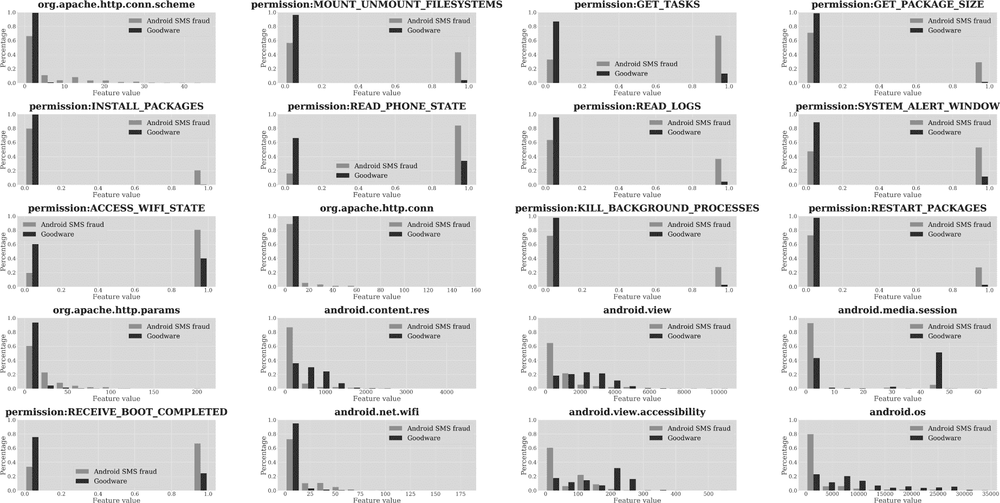
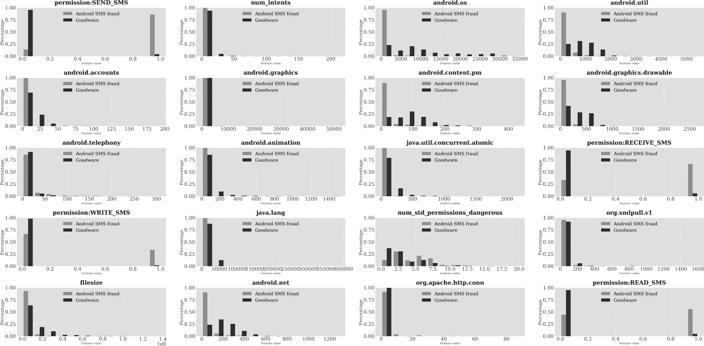
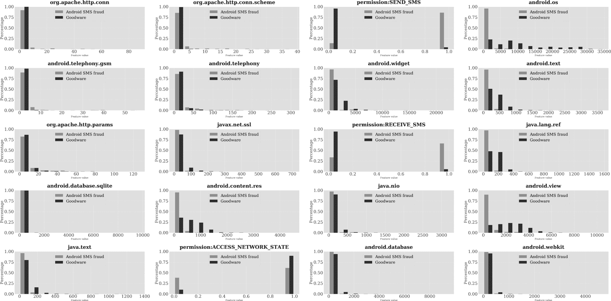
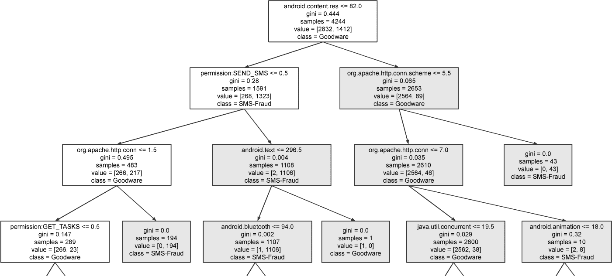
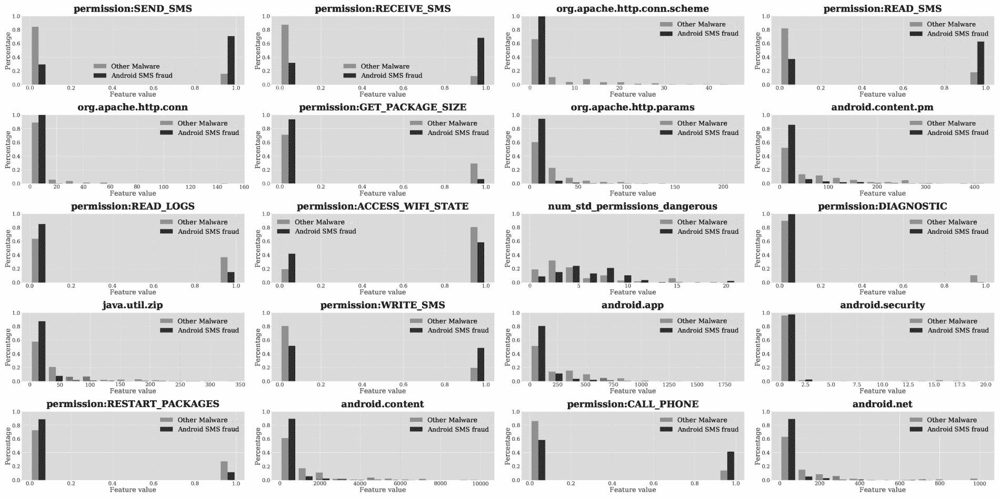

# 第十一章：SMS 欺诈**


假设某个电视节目邀请观众通过发送代码到指定电话号码，向救援组织捐款 25 美元。如果你发送了这样的代码，费用将会加到你的电话账单上，然后转交给慈善组织。你会发现这种类型的 SMS 消息在许多合法的场合中被使用，例如回应政治民调或猜测足球比赛的赢家。

然而，恶意应用往往可以在未经用户同意的情况下向高收费服务发送代码。受害者直到月底收到电话账单时才会知道发生了这种事情，并发现账单上有不明费用。我们将这种滥用行为称为 *SMS 欺诈*。SMS 欺诈恶意软件的重点是对用户账户进行未经授权的收费，但不包括其他依赖短信的恶意活动，如间谍软件或银行木马行为。

在本章中，我们使用 Extra-Trees 分类器来评估用于检测 Android SMS 欺诈应用的特征。第二章介绍了多个此类家族，包括 BeeKeeper、Camera、Joker、RuFraud、RuPlay、Taicliphot、Wallpaper 和 WallySMS。此外，我们的测试还包括 Moundial，一个之前未公开的小型 SMS 欺诈家族，曾在 2014 年左右针对西班牙 Android 用户。

### **SMS 欺诈与好应用**

如果你查看区分 Android 好应用和参与 SMS 欺诈的应用的 20 个最重要特征（见图 11-1），你应该会注意到一个有趣的现象：尽管这些特征中有 11 个与权限相关，但没有涉及 SMS 权限。也许这是因为各种合法的应用可能会使用这些权限，例如允许应用内发送短信。我们将在 “缺失的 SMS 权限” （第 270 页）中讨论其他可能性。

与勒索软件和 Root 恶意软件类似，SMS 欺诈应用比好应用更频繁地调用 `org.apache.http.com.scheme` 和 `org.apache.http.com` API。另一方面，好应用通常会调用更多 Android API，如 `android.content.res`、`android.view`、`android.media.session`、`android.view.accessibility` 和 `android.os`。唯一的例外是 Wi-Fi API（`android.net.wifi`），它提供 Wi-Fi 连接的类。我们不确定为什么 SMS 欺诈应用比好应用更频繁地使用它。这可能只是之前由相同开发者开发的恶意软件的产物。

#### ***非 SMS 权限***

我们在前几章中描述了许多重要的权限。其中有些权限似乎没有任何用途。例如，`MOUNT_UNMOUNT_FILESYSTEMS` 和 `INSTALL_PACKAGES` 是特权权限，而短信欺诈应用通常声明这些权限，但从未使用它们。这些应用也可能请求 `READ_LOGS` 权限，尽管这个权限并不会为没有特权的应用启用恶意功能。

其他权限可以使应用程序执行许多恶意软件常见的任务。例如，`KILL_BACKGROUND_PROCESSES` 和 `RESTART_PACKAGES` 权限，后者在 Android 4.0.3（冰淇淋三明治）中已被弃用，可能被用来杀死不需要的进程，作为防御策略的一部分。此外，`RECEIVE_BOOT_COMPLETED` 权限是恶意软件保持持久性的最简单方式，它可以在手机重启后自动重启。

其余权限有明显的特定于短信欺诈的用途。`READ_PHONE_STATE` 权限允许应用程序读取电话的配置设置，例如获取设备的电话号码或移动运营商。由于高级短码是运营商特定的，恶意软件需要这些信息来瞄准正确的移动运营商。我们看到，从事短信欺诈的应用请求此权限的概率超过 80%，是良性软件请求此权限概率的两倍多。



*图 11-1：使用 Extra-Trees 分类器区分 Android 短信欺诈恶意软件与良性软件的前 20 大特征*

在第十章中，我们提到过应用程序可以使用 `ACCESS_WIFI_STATE` 权限访问 Android 的 `WifiManager` 并获取设备的 Wi-Fi 连接状态。短信欺诈通过电话堆栈而不是 Wi-Fi 堆栈进行；即便如此，多个短信欺诈家族也会尝试了解设备的 Wi-Fi 状态。这可能是因为这些应用希望将 Wi-Fi 堆栈作为备用选项。请求此权限的短信欺诈应用的概率几乎是良性软件请求此权限概率的两倍。

应用程序使用 `GET_TASKS` 权限来识别设备上正在运行的进程。约有 70% 从事短信欺诈的应用请求此权限，而良性软件请求此权限的比例不到 20%。恶意应用可能出于多种原因请求此权限，例如查看是否有杀毒引擎在运行。

`SYSTEM_ALERT_WINDOW` 权限用于显示通知窗口，显然是为了通知用户合法问题。然而，短信欺诈应用可能利用此功能遮挡屏幕。例如，如果被感染设备的移动运营商发送请求以验证潜在的短信欺诈交易，此权限可能使恶意软件在响应来电短信时遮挡窗口。短信欺诈应用请求此权限的概率是良性软件的四到五倍。

#### ***缺少短信权限***

在前 20 个特征列表中缺少与 SMS 相关的权限可能会让你感到惊讶。显然，SMS 欺诈应用需要写入并发送 SMS 消息来执行其恶意操作。如果我们查看前 50 个特征，我们会发现 `WRITE_SMS` 权限排在第 33 位，表明该权限对于区分 SMS 欺诈应用与良性应用确实有一定的重要性。

尽管如此，其他与 SMS 相关的权限的稀缺性仍然令人困惑。由于不同的分类器以不同的方式识别重要特征，因此我们检查了其他分类器是否会认为这些权限更相关。图 11-2 显示了由随机森林分类器生成的前 20 个特征。

正如你所看到的，这个分类器使用了与 Extra-Trees 分类器截然不同的特征来区分良性应用和 SMS 欺诈应用。实际上，它将 `SEND_SMS` 排名为最重要的特征！根据该模型，参与 SMS 欺诈的应用请求此权限的概率是良性应用的八倍以上。`RECEIVE_SMS`、`WRITE_SMS` 和 `READ_SMS` 权限也都出现在前 20 个特征列表中，SMS 欺诈应用请求这些权限的频率远高于良性应用。

我们还查看了由 XGBoost 分类器建议的主要特征，如图 11-3 所示。在这里，我们也看到了一组不同的特征被识别为重要，`SEND_SMS` 和 `RECEIVE_SMS` 出现在前 20 名之内。



*图 11-2：使用随机森林分类器区分 Android SMS 欺诈恶意软件和良性应用的前 20 个特征*



*图 11-3：使用 XGBoost 分类器区分 Android SMS 欺诈恶意软件和良性应用的前 20 个特征*

正如这些结果所表明的，不同的机器学习方法可能会识别出不同的特征作为最重要的特征。例如，一种方法可能会考虑所有特征集合中的每个特征，通过计算去除某个特征后机器学习算法的预测性能下降程度来衡量每个特征的价值。下降幅度越大，特征就越重要。其他方法可能会使用知名的统计模型，如互信息或主成分分析（PCA）。除了所使用的统计方法外，分类器本身的设计和结构也会影响不同特征集合的识别。

最后，我们构建了一个决策树，用于区分 SMS 欺诈应用和良性应用。你可以在图 11-4 中看到决策树的前三个层级。



*图 11-4：用于区分 Android SMS 欺诈恶意软件和良性应用的深度为三的决策树*

该决策树在节点条件成立时会分支到节点的左子节点，否则分支到右子节点。`SEND_SMS`权限位于树的第二层，紧接根节点，表明此类分类器非常重视该权限。

该节点的右子节点检查在应用程序源代码中调用*android.content.res*包中类的次数。该包包含用于访问各种文件和媒体的类，以及配置设备的参数。如果调用次数小于或等于 82 次，并且应用程序请求`SEND_SMS`权限，则该应用程序为短信欺诈应用的概率为 1106/1108（几乎 100%）。

有趣的是，决策树中的其他两个分支完全不依赖于是否使用`SEND_SMS`权限，这可能解释了为什么由 Extra-Trees 分类器生成的初始前 20 个特征没有识别出任何与短信相关的权限。一个路径检查以下条件：在*android.content.res*包中的类的调用次数少于 82 次，应用程序没有请求`SEND_SMS`权限，并且在*org.apache.http.conn.scheme*包中的类的调用次数超过 1.5 次。如果所有这些条件都满足，则该应用程序为短信欺诈恶意软件的概率为 100%。另一个路径检查是否在*android.content.res*包中的类的调用次数超过 82 次，并且在*org.apache.http.conn.scheme*包中的类的调用次数超过 5.5 次，这也导致该应用程序为短信欺诈的概率为 100%。

本节描述的结果教给我们一个关于恶意软件分析中机器学习的宝贵经验：确保查看不同的分类器，以便找到手动检查代码中需要关注的线索。仅查看一个分类器的结果，即使该分类器具有高性能，也可能导致对特定应用程序元素重要性的偏差推论。

#### ***预测效能***

表 11-1 展示了不同机器学习分类器在预测应用程序是否涉及短信欺诈或是否为良性软件时，基于不同的基本和高级特征集及组合的表现。

**表 11-1：** Android 短信欺诈恶意软件与良性软件的评估

| **特征集** | **最佳分类器** | **AUC** | **精确度** | **召回率** | **F1 分数** | **假阳性率** | **假阴性率** |
| --- | --- | --- | --- | --- | --- | --- | --- |
| API 包 | GBDT | 0.9862 | 0.9483 | 0.9161 | 0.9319 | 0.0517 | 0.0293 |
| 静态 (S) | RF | 0.9792 | 0.9780 | 0.9208 | 0.9485 | 0.0220 | 0.0275 |
| 动态 (S) | MLP | 0.9056 | 0.8972 | 0.5759 | 0.7015 | 0.1028 | 0.1332 |
| S + D | XGBoost | 0.9810 | 0.9819 | 0.9208 | 0.9504 | 0.0181 | 0.0274 |
| API + S + D | XGBoost | 0.9975 | 0.9837 | 0.9642 | 0.9738 | 0.0163 | 0.0126 |
| TSG | XGBoost | 0.9872 | 0.9463 | 0.9142 | 0.9300 | 0.0537 | 0.0300 |
| LM | RF | 0.8737 | 0.6654 | 0.6748 | 0.6701 | 0.3346 | 0.1157 |
| FC | SVM | 0.8833 | 0.9127 | 0.5024 | 0.6480 | 0.0873 | 0.1519 |
| CG | RF | 0.8519 | 0.9000 | 0.6532 | 0.7570 | 0.1000 | 0.1119 |
| API + S + D + TSG | XGBoost | 0.9457 | 0.8845 | 0.8803 | 0.8824 | 0.1155 | 0.1199 |
| API + S + D + LM | RF | 0.9975 | 0.9827 | 0.9661 | 0.9743 | 0.0173 | 0.0119 |
| API + S + D + FC | GBDT | 0.9974 | 0.9837 | 0.9651 | 0.9743 | 0.0163 | 0.0123 |
| API + S + D + CG | XGBoost | 0.9975 | 0.9827 | 0.9642 | 0.9734 | 0.0173 | 0.0126 |
| 所有特征 | XGBoost | 0.9974 | 0.9827 | 0.9642 | 0.9734 | 0.0173 | 0.0126 |
| 最佳晚期融合 | XGBoost | 0.9973 | 0.9809 | 0.9670 | **0.9739** | 0.0191 | 0.0116 |

正如这些结果所示，采用晚期融合方法，机器学习技术能够生成优秀的结果，精度超过 98%，召回率超过 96%。

### **短信欺诈与其他恶意软件**

图 11-5 显示了根据 Extra-Trees 分类器区分短信欺诈应用与其他形式恶意软件的 20 个最重要特征。正如你所看到的，短信相关权限在这里发挥了重要作用，因此我们将重点关注这些权限。

#### ***与权限相关的特征***

尽管 Extra-Trees 分类器在区分短信欺诈恶意软件与良性软件时并不依赖短信相关权限，但它确实发现这些权限在区分这种类型的恶意软件与其他形式的恶意软件时很有用。约 70% 的短信欺诈应用请求 `SEND_SMS`、`READ_SMS` 和 `RECEIVE_SMS` 权限，而其他恶意软件的请求比例不到 20%。同样，50% 的短信欺诈应用请求 `WRITE_SMS` 权限，而其他恶意软件的请求比例约为 20%。你可能会想，为什么有些短信欺诈应用不需要这些权限？原因是某些应用通过欺骗用户自己发送高额短信。这样并不需要 `SEND_SMS` 权限；应用会打开默认的短信应用并希望用户自己点击发送按钮。

有一点相关的内容是，我们发现短信欺诈应用请求 `CALL_PHONE` 权限的概率是其他类型恶意软件的两倍以上（超过 40% 的短信欺诈恶意软件请求该权限，而其他恶意软件的请求率不到 20%）。这种差异的一个解释可能是一些短信欺诈家族也涉及其他形式的电话相关欺诈。例如，RuPlay 家族包含将外拨电话重定向到恶意软件开发者提供的电话号码的代码，而 BeeKeeper 家族则包含将外拨电话重定向并拨打这些号码的新电话的代码。重定向外拨电话还需要 `PROCESS_OUTGOING_CALLS` 权限，这个权限使得应用能够首先了解外拨电话。



*图 11-5：使用 Extra-Trees 分类器区分 Android 短信欺诈恶意软件与其他恶意软件的前 20 个特征*

另请注意，SMS 欺诈应用程序访问 `READ_LOGS`、`ACCESS_WIFI_STATE` 和 `RESTART_PACKAGES` 权限的频率低于其他恶意软件。然而，像勒索软件一样，它们调用 `org.apache.http.conn` 和 `org.apache.http.conn.schema` 函数的频率高于其他类型的恶意软件。对于 `org.apache.http.params` 以及一些 Android API（例如 *android.app*、*android.net*、*android.content* 和 *android.content.pm* 包中的 API），情况也是如此。

#### ***预测效能***

表格 11-2 展示了我们的机器学习方法在区分从事 SMS 欺诈的应用与其他恶意应用方面的表现。

**表格 11-2：** 用于评估 Android SMS 欺诈恶意软件与其他恶意软件的指标

| **特征集** | **最佳分类器** | **AUC** | **精确度** | **召回率** | **F1 值** | **FPR** | **FNR** |
| --- | --- | --- | --- | --- | --- | --- | --- |
| API 包 | XGBoost | 0.8075 | 0.8135 | 0.7921 | 0.8027 | 0.1865 | 0.2043 |
| 静态 (S) | XGBoost | 0.7739 | 0.7652 | 0.7926 | 0.7787 | 0.2348 | 0.2165 |
| 动态 (D) | RF | 0.6756 | 0.6395 | 0.6739 | 0.6563 | 0.3605 | 0.3470 |
| S + D | GBDT | 0.7949 | 0.7977 | 0.7827 | 0.7901 | 0.2023 | 0.2151 |
| API + S + D | GBDT | 0.8209 | 0.8088 | 0.8172 | 0.8129 | 0.1912 | 0.1856 |
| TSG | RF | 0.7097 | 0.7110 | 0.7097 | 0.7104 | 0.2890 | 0.2917 |
| LM | RF | 0.7443 | 0.7611 | 0.5992 | 0.6705 | 0.2389 | 0.3328 |
| FC | SVM | 0.5459 | 0.5222 | 0.6211 | 0.5674 | 0.4778 | 0.4713 |
| CG | RF | 0.7443 | 0.7611 | 0.5992 | 0.6705 | 0.2389 | 0.3328 |
| API + S + D + TSG | GBDT | 0.9180 | 0.8619 | 0.8351 | 0.8483 | 0.1381 | 0.1610 |
| API + S + D + LM | XGBoost | 0.8718 | 0.8385 | 0.7667 | 0.8010 | 0.1615 | 0.2166 |
| API + S + D + FC | GBDT | 0.8791 | 0.8388 | 0.7653 | 0.8004 | 0.1612 | 0.2171 |
| API + S + D + CG | GBDT | 0.8983 | 0.8688 | 0.7912 | 0.8282 | 0.1312 | 0.1932 |
| 所有特征 | XGBoost | 0.9168 | 0.8635 | 0.8285 | 0.8456 | 0.1365 | 0.1659 |
| 最佳晚期融合 | XGBoost | 0.9377 | 0.9273 | 0.9075 | **0.9173** | 0.0727 | 0.0750 |

毫不奇怪，当将 SMS 欺诈应用与其他恶意软件区分开来时，预测准确率会下降。精确度降至 93% 以下，而召回率降至 92% 以下。尽管如此，这些结果仍然很强。

### **BeeKeeper: 一个案例研究**

让我们来看一下 BeeKeeper SMS 欺诈恶意软件 *angrybirds.app*（v16，51fe）。该恶意软件在 2013 年左右广泛传播，目标是俄罗斯 Beeline 运营商。列表 11-1 显示了该应用请求的权限列表。

```
android.permission.READ_PHONE_STATE
android.permission.SEND_SMS
android.permission.RECEIVE_SMS
android.permission.INTERNET
android.permission.WAKE_LOCK
android.permission.DELETE_PACKAGES
android.permission.READ_SMS
android.permission.MODIFY_PHONE_STATE
android.permission.CALL_PHONE
android.permission.CALL_PRIVILEGED
android.permission.PROCESS_OUTGOING_CALLS
android.permission.WRITE_CONTACTS
android.permission.WRITE_EXTERNAL_STORAGE
android.permission.READ_CONTACTS
android.permission.RECEIVE_BOOT_COMPLETED
android.permission.RECEIVE_BOOT_COMPLETED
android.permission.ACCESS_WIFI_STATE
android.permission.BLUETOOTH
android.permission.INTERNET
```

*列表 11-1：BeeKeeper SMS 欺诈恶意软件请求的所有权限*

你可以看到它请求了如 `SEND_SMS` 这样的权限，这是发送实施 SMS 欺诈的短信所必需的，还有 `RECEIVE_SMS` 权限，恶意软件利用该权限在无法连接到基于互联网的命令与控制服务器时，通过 SMS 接收指令和控制消息。`CALL_PHONE` 和 `PROCESS_OUTGOING_CALLS` 权限也值得注意。BeeKeeper 使用这些权限拨打从其命令与控制服务器接收到的号码，并将外拨电话重定向到其他号码。

列表 11-2 展示了涉及发送 SMS 欺诈信息的几个代码段之一。

```
public boolean load(Context context) {
  boolean result = false;
  log("Settings::load() start");
  try {
    Constants.imei = getImei(context);
    Constants.imsi = getImsi(context);
    Constants.phone = getPhone(context);
    Constants.country = getCountry(context);
    if (Constants.DEBUG) {
      Constants.imsi = "25001";
      Constants.data = decript("VY/atwQCBfBnL/CUcJj8Wf0+uk4xyqpeOhWE273WS5...")
    }
    log("json settings: " + new JSONObject(Constants.data).toString(4));
    SharedPreferences sharedPreferences = context.getSharedPreferences(
      SETTINGS, 1);
    if (sharedPreferences.contains("first")) {
      userAgree = sharedPreferences.getBoolean("userAgree", false);
      userCancel = sharedPreferences.getBoolean("userCancel", false);
      this.subscriptionTime = sharedPreferences.getLong("subscriptionTime", 0);
      this.repeatTime = sharedPreferences.getLong("repeatTime", 0);
      this.subscriptionPhone = sharedPreferences.getString(
        "subscriptionPhone", "");
      this.subscriptionMessage = sharedPreferences.getString(
        "subscriptionMessage", "");
      JSONArray jsonOperatorList = new JSONArray(
        sharedPreferences.getString("operators", ""));
      this.operators = new Vector<>();
      for (int i = 0; i < jsonOperatorList.length(); i++) {
        JSONObject jsonOperator = jsonOperatorList.getJSONObject(i);
        Operator operator = new Operator();
        operator.name = jsonOperator.getString("name");
        operator.time = jsonOperator.getLong("time");
        this.operators.add(operator);
      }
      result = true;
    }
  } catch (Exception ex2) {
    ex2.printStackTrace();
  }
  log("Settings::load() end");
  return result;
}

static void sendSms(JSONObject item) {
  try {
    Settings.sendSms(item.getString("phone"), item.getString
(Constants.JSON_TEXT));
  } catch (Exception ex) {
    Settings.log(ex);
  }
}
```

*列表 11-2：一个高度混淆的代码片段，展示了 BeeKeeper SMS 欺诈恶意软件发送短信*

你可以看到该应用提取了受感染设备的 IMEI 和 IMSI 号码、电话号码以及国家信息。一个非常长的编码字符串参数被传递给 `decript` 方法（为了简洁起见，我们在这里进行了简化），并且位于一个 `if` 语句中，且其条件始终为假。我们无法确定恶意软件作者为何做出这样的选择；也许他们是希望在测试期间避免执行这一部分代码，方法是将 `if` 条件设置为假，但之后从未恢复其状态。最后，该应用获取订阅信息并执行 `sendSms` 函数。

### **SMS 欺诈样本的预测**

表 11-3 展示了我们的机器学习分类器在 10 个重要的 SMS 欺诈样本上的表现。

**表 11-3：** 机器学习分类器在 SMS 欺诈家族上的表现

| **样本名称** | **与良性软件的区别** | **与其他恶意软件的区别** |
| --- | --- | --- |
| BeeKeeper | 是 | 是 |
| Camera | 是 | 否 |
| HDC Bookmark | 是 | 是 |
| Joker | 是 | 否 |
| Moundial | 是 | 是 |
| RuFraud | 是 | 是 |
| RuPlay | 是 | 是 |
| TaiClipHot | 是 | 是 |
| Wallpaper | 是 | 是 |
| WallySMS | 是 | 是 |

如你所见，在每种情况下，它们（也就是我们的晚期融合集成模型）都正确地将样本分类为 SMS 欺诈应用，而不是良性软件。然而，当我们使用分类器来判断样本是否为 SMS 欺诈应用或其他形式的恶意软件时，出现了两个预测错误。重要的是，这些错误中有一个发生在分类 Joker 时，Joker 是一个可能由大型犯罪集团创建的恶意软件家族，该集团已采取广泛的措施来规避检测。该恶意软件的多个变种采用了一种接一种的规避策略，进行着一场自 2016 年以来的猫鼠游戏，导致了越来越复杂的反分析方法。

### **接下来**

正如你在本章中所看到的，提供了一组特征的机器学习模型能够成功预测一个应用程序是良性软件还是短信诈骗应用。权限在这些应用程序的行为中起着重要作用，也是区分短信诈骗应用和其他安卓恶意软件的重要因素。然而，你也看到了，自第七章以来讨论的没有任何单一特征能够单独识别某一种恶意软件。

为了最大化检测效果，我们建议将这些机器学习方法与第二部分中描述的手动分析技术结合使用。将机器学习模型作为一个分诊系统，类似于医院急诊室的处理流程：分析师应首先检查被标记为极有可能是恶意的应用程序，然后专家再进行更深入的检查。

这是最后一个恶意软件类别的章节。在下一个也是最后一章，我们将分享我们对安卓恶意软件的未来以及利用机器学习进行恶意软件检测的未来展望。

[*OceanofPDF.com*](https://oceanofpdf.com)
