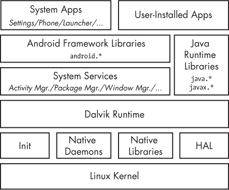
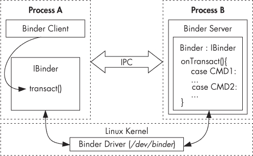

# 第一章. 安卓的安全模型

本章将首先简要介绍安卓的架构、进程间通信（IPC）机制和主要组件。然后，我们描述安卓的安全模型及其如何与底层的 Linux 安全基础设施和代码签名相关联。最后，我们简要回顾安卓安全模型中的一些新特性，具体包括多用户支持、基于 SELinux 的强制访问控制（MAC）和验证启动。安卓的架构和安全模型建立在传统的 Unix 进程、用户和文件范式之上，但此处并未从头描述这一范式。我们假设读者对类 Unix 系统，尤其是 Linux 有基本的了解。

# 安卓架构

让我们从下往上简要地查看安卓的架构。图 1-1 展示了安卓栈的简化表示。



图 1-1. 安卓架构

## Linux 内核

正如你在图 1-1 中看到的，安卓是建立在 Linux 内核之上的。与任何 Unix 系统一样，内核提供硬件驱动、网络、文件系统访问和进程管理。感谢安卓主线项目^([1])，你现在可以通过一些努力在较新的标准内核上运行安卓，但安卓内核与“常规”的 Linux 内核（你可能在桌面计算机或非安卓嵌入式设备上找到的内核）略有不同。这些差异源于一组新特性（有时称为*安卓特性*^([2]))，这些特性最初是为支持安卓而添加的。安卓特性的一些主要内容包括低内存杀手、唤醒锁（作为主线 Linux 内核中唤醒源支持的一部分）、匿名共享内存（ashmem）、报警、偏执的网络和 Binder。

我们讨论中最重要的安卓特性是 Binder 和偏执的网络。Binder 实现了进程间通信（IPC）及相关的安全机制，我们将在 Binder 中详细讨论。偏执的网络限制了只有持有特定权限的应用才能访问网络套接字。我们将在第二章中更深入地探讨这个话题。

## 本地用户空间

在内核之上是本地用户空间层，包含了*init*二进制文件（第一个启动的进程，负责启动所有其他进程）、多个本地守护进程以及几百个系统中使用的本地库。尽管*init*二进制文件和守护进程的存在让人联想到传统的 Linux 系统，但需要注意的是，*init*和相关的启动脚本是从零开始开发的，与主线 Linux 系统的版本有很大不同。

## Dalvik 虚拟机

Android 的大部分实现是基于 Java 的，因此它是由 Java 虚拟机（JVM）执行的。Android 当前的 Java 虚拟机实现被称为*Dalvik*，它是我们栈中的下一层。Dalvik 是专为移动设备设计的，无法直接运行 Java 字节码（*.class*文件）：它的本地输入格式叫做*Dalvik 可执行文件（DEX）*，并且被打包在*.dex*文件中。反过来，*.dex*文件要么被打包在系统 Java 库（JAR 文件）中，要么被打包在 Android 应用程序（APK 文件）中（详见第三章）。

Dalvik 和 Oracle 的 JVM 有不同的架构——Dalvik 是基于寄存器的，而 JVM 是基于栈的——并且它们的指令集也不同。让我们看一个简单的例子来说明这两个虚拟机之间的差异（参见示例 1-1）。

示例 1-1. 静态 Java 方法，两个整数相加

```
public static int add(int i, int j) {
    return i + j;
}
```

当为每个虚拟机编译时，`add()`静态方法（该方法只是简单地将两个整数相加并返回结果）会生成如示例 1-2 所示的字节码。

示例 1-2. JVM 和 Dalvik 字节码

**JVM 字节码**

```
public static int add(int, int);
  Code:
     0: iload_0➊
     1: iload_1➋
     2: iadd➌
     3: ireturn➍
```

**Dalvik 字节码**

```
.method public static add(II)I

    add-int v0, p0, p1➎

    return v0➏
.end method
```

在这里，JVM 使用两条指令将参数加载到栈中（➊和➋），然后执行加法操作➌，最后返回结果➍。相比之下，Dalvik 使用单条指令将参数（在寄存器*p0*和*p1*中）相加，并将结果存储在*v0*寄存器中➎。最后，它返回*v0*寄存器中的内容➏。如你所见，Dalvik 使用较少的指令来实现相同的结果。一般来说，基于寄存器的虚拟机使用较少的指令，但生成的代码比基于栈的虚拟机相应代码要大。然而，在大多数架构中，加载代码的开销低于指令调度的开销，因此基于寄存器的虚拟机能够更高效地进行解释。^([3])

在大多数生产设备中，系统库和预装应用程序不会直接包含设备无关的 DEX 代码。作为性能优化，DEX 代码会转换为设备相关格式，并存储在优化后的 DEX（*.odex*）文件中，该文件通常与其父 JAR 或 APK 文件位于同一目录下。类似的优化过程也会在用户安装应用时进行。

## Java 运行时库

Java 语言实现需要一组运行时库，这些库主要定义在 `java.*` 和 `javax.*` 包中。Android 的核心 Java 库最初来源于 Apache Harmony 项目^([4])，是我们堆栈中的下一层。随着 Android 的发展，原始的 Harmony 代码发生了显著变化。在这个过程中，一些特性被完全替换（如国际化支持、加密提供者以及一些相关类），而另一些特性则得到了扩展和改进。核心库主要是用 Java 开发的，但它们也有一些原生代码依赖。原生代码通过标准的 *Java 本地接口 (JNI)* 链接到 Android 的 Java 库中，^([5]) 允许 Java 代码调用原生代码，反之亦然。Java 运行时库层直接被系统服务和应用程序访问。

## 系统服务

直到目前为止介绍的各个层次构成了实现 Android 核心——系统服务——所需的管道。*系统服务*（截至 4.4 版本为 79 个）实现了 Android 大多数基本功能，包括显示和触摸屏支持、电话和网络连接性。大多数系统服务是用 Java 实现的；一些基础服务则是用原生代码编写的。

除少数例外，每个系统服务都定义了一个可以从其他服务和应用程序调用的远程接口。结合服务发现、调解和由 Binder 提供的进程间通信（IPC），系统服务有效地在 Linux 上实现了面向对象的操作系统。

让我们详细了解 Binder 如何在 Android 中实现 IPC，因为这是 Android 安全模型的基石之一。

## 进程间通信

如前所述，Binder 是一种进程间通信（IPC）机制。在详细讲解 Binder 工作原理之前，让我们简要回顾一下 IPC。

与任何类 Unix 系统一样，Android 中的进程有各自独立的地址空间，进程不能直接访问其他进程的内存（这被称为 *进程隔离*）。这通常是好事，无论是从稳定性还是安全性角度来看：多个进程修改同一内存可能会导致灾难性后果，而且你不希望一个由其他用户启动的潜在恶意进程通过访问邮件客户端的内存来泄露你的邮件。然而，如果一个进程想为其他进程提供某些有用的服务，它需要提供一种机制，允许其他进程发现并与这些服务进行交互。这种机制就叫做 *IPC*。

对于标准 IPC 机制的需求并不新鲜，因此在 Android 之前就有了几种选择。这些选项包括文件、信号、套接字、管道、信号量、共享内存、消息队列等。虽然 Android 使用了其中一些（例如本地套接字），但它并不支持其他一些（如 System V IPCs 中的信号量、共享内存段和消息队列）。

## Binder

由于标准的 IPC 机制不够灵活和可靠，Android 开发了一个新的 IPC 机制，称为 *Binder*。虽然 Android 的 Binder 是一种新的实现，但它基于 OpenBinder 的架构和理念。^([6])

Binder 实现了一种基于抽象接口的分布式组件架构。它类似于 Windows 的公共对象模型（COM）和类 Unix 系统上的公共对象代理请求架构（CORBA），但与这些框架不同，Binder 运行在单个设备上，并不支持跨网络的远程过程调用（RPC）（尽管可以在 Binder 之上实现 RPC 支持）。对 Binder 框架的详细描述超出了本书的范围，但我们将在接下来的章节中简要介绍其主要组件。

### Binder 实现

如前所述，在类 Unix 系统中，一个进程无法访问另一个进程的内存。然而，内核控制着所有进程，因此可以暴露一个接口来实现进程间通信（IPC）。在 Binder 中，这个接口就是 *／dev/binder* 设备，由 Binder 内核驱动程序实现。*Binder 驱动程序*是框架的核心对象，所有的 IPC 调用都通过它进行。进程间通信是通过一个单一的 `ioctl()` 调用实现的，该调用通过 `binder_write_read` 结构发送和接收数据，`binder_write_read` 结构包含一个 `write_buffer`，其中包含发送给驱动程序的命令，以及一个 `read_buffer`，其中包含用户空间需要执行的命令。

那么数据是如何在进程之间传递的呢？Binder 驱动程序管理着每个进程的一部分地址空间。Binder 驱动程序管理的内存块对进程是只读的，所有写操作都由内核模块执行。当一个进程向另一个进程发送消息时，内核会在目标进程的内存中分配一些空间，并直接从发送进程复制消息数据。然后，它会将一条简短的消息排入接收进程，告诉它接收到的消息所在的位置。接收方随后可以直接访问该消息（因为它在自己的内存空间中）。当进程处理完消息后，它会通知 Binder 驱动程序将内存标记为可释放。图 1-2 展示了 Binder IPC 架构的简化示意图。



图 1-2. Binder IPC

Android 中更高层次的 IPC 抽象，如 *Intent*（带有关联数据的命令，传递到跨进程的组件）、*Messenger*（支持跨进程消息传递的对象）和 *ContentProvider*（暴露跨进程数据管理接口的组件），都是建立在 Binder 之上的。此外，需要对外暴露服务接口的功能可以通过 *Android 接口定义语言（AIDL）* 来定义，AIDL 使得客户端可以像调用本地 Java 对象一样调用远程服务。相关的 `aidl` 工具会自动生成 *存根*（远程对象的客户端表示）和 *代理*，这些代理将接口方法映射到低层次的 `transact()` Binder 方法，并负责将参数转换为 Binder 可以传输的格式（这叫做 *参数封送/解封*）。由于 Binder 本身是无类型的，因此 AIDL 生成的存根和代理还通过在每个 Binder 事务中包含目标接口名称（在代理中）并在存根中进行验证，提供了类型安全性。

### Binder 安全性

在更高层次上，任何可以通过 Binder 框架访问的对象都实现了 `IBinder` 接口，并称为*Binder 对象*。对 Binder 对象的调用是在 *Binder 事务* 中进行的，事务包含对目标对象的引用、要执行的方法 ID 和一个数据缓冲区。Binder 驱动程序会自动将调用进程的进程 ID（PID）和有效用户 ID（EUID）添加到事务数据中。被调用的进程（*callee*）可以检查 PID 和 EUID，并根据其内部逻辑或关于调用应用程序的系统级元数据决定是否执行请求的方法。

由于 PID 和 EUID 是由内核填充的，调用进程不能伪造其身份以获取系统未允许的更多权限（即 Binder 防止了 *权限提升*）。这是 Android 安全模型的核心部分，所有更高层次的抽象（如权限）都建立在这一基础之上。调用者的 EUID 和 PID 可以通过 `android.os.Binder` 类的 `getCallingPid()` 和 `getCallingUid()` 方法访问，这些方法是 Android 公共 API 的一部分。

### 注意

*如果多个应用程序在相同的 UID 下运行，则调用进程的 EUID 可能无法映射到单一应用程序（详情见第二章）。然而，这不会影响安全决策，因为通常在相同 UID 下运行的进程会被授予相同的权限和特权（除非定义了特定于进程的 SELinux 规则）。*

### Binder 身份

Binder 对象最重要的特性之一是它们在不同进程之间保持唯一的身份。因此，如果进程 A 创建了一个 Binder 对象并将其传递给进程 B，进程 B 再将其传递给进程 C，所有三个进程的调用都会由同一个 Binder 对象处理。实际上，进程 A 将通过其内存地址直接引用 Binder 对象（因为它在进程 A 的内存空间中），而进程 B 和 C 只会接收到 Binder 对象的句柄。

内核维护着“活跃”Binder 对象与其他进程中的句柄之间的映射。由于 Binder 对象的身份是唯一的，并由内核维护，因此用户空间进程无法创建 Binder 对象的副本或获得对其的引用，除非通过 IPC 将其传递给进程。因此，Binder 对象是一个独特、不可伪造且可传递的对象，可以充当安全的*令牌*。这使得 Android 中能够使用基于能力的安全性。

### 基于能力的安全性

在*基于能力的安全模型*中，程序通过授予一个不可伪造的*能力*来获得访问特定资源的权限，该能力既引用目标对象，又封装了一组对该对象的访问权限。由于能力是不可伪造的，因此程序仅凭持有能力就足以获得对目标资源的访问权限；无需维护与实际资源相关的访问控制列表（ACL）或类似结构。

### Binder 令牌

在 Android 中，Binder 对象可以充当能力，当以这种方式使用时被称为*Binder 令牌*。Binder 令牌既可以是能力，也可以是目标资源。拥有 Binder 令牌的进程可以完全访问 Binder 对象，从而能够对目标对象执行 Binder 事务。如果 Binder 对象实现了多个操作（通过选择 Binder 事务的`code`参数来决定执行的操作），则调用方只要持有该 Binder 对象的引用，就可以执行任何操作。如果需要更细粒度的访问控制，则每个操作的实现需要执行必要的权限检查，通常通过利用调用进程的 PID 和 EUID 来实现。

在 Android 中，一个常见的模式是允许作为*system*（UID 1000）或*root*（UID 0）身份运行的调用者执行所有操作，但对所有其他进程执行额外的权限检查。因此，对重要 Binder 对象（如系统服务）的访问通过两种方式进行控制：一是限制谁可以获取该 Binder 对象的引用，二是通过在对 Binder 对象执行操作之前检查调用者的身份来控制访问。（此检查是可选的，并且由 Binder 对象自身实现，若需要的话。）

另一种方式是，Binder 对象可以仅作为一种能力使用，而不实现任何其他功能。在这种使用模式下，同一个 Binder 对象由两个（或更多）协作的进程持有，其中作为服务器的进程（处理某种类型的客户端请求）使用 Binder 令牌来验证其客户端，就像 Web 服务器使用会话 cookie 一样。

这种使用模式在 Android 框架内部使用，通常对应用程序是不可见的。一个显著的 Binder 令牌的使用案例是在公共 API 中可见的 *窗口令牌*。每个 Activity 的顶层窗口与一个 Binder 令牌（称为窗口令牌）相关联，Android 的窗口管理器（负责管理应用窗口的系统服务）会跟踪它。应用程序可以获得自己的窗口令牌，但无法访问其他应用程序的窗口令牌。通常，你不希望其他应用程序在你的窗口上添加或移除窗口；每个此类请求都必须提供与应用程序相关联的窗口令牌，从而保证窗口请求来自你的应用程序或系统。

### 访问 Binder 对象

尽管 Android 出于安全原因控制对 Binder 对象的访问，并且与 Binder 对象通信的唯一方式是获得其引用，但一些 Binder 对象（最显著的是系统服务）需要是全局可访问的。然而，将所有系统服务的引用分发给每个进程是不现实的，因此我们需要一些机制，允许进程根据需要发现并获得对系统服务的引用。

为了启用服务发现，Binder 框架有一个单一的 *上下文管理器*，用于维护对 Binder 对象的引用。Android 的上下文管理器实现是 *servicemanager* 本地守护进程。它在启动过程中很早就启动，以便系统服务可以在启动时向其注册。服务通过传递服务名称和 Binder 引用给服务管理器进行注册。一旦服务注册完成，任何客户端都可以通过使用其名称来获得该服务的 Binder 引用。然而，大多数系统服务实现了额外的权限检查，因此获得引用并不自动保证可以访问其所有功能。因为任何人都可以访问一个已注册到服务管理器的 Binder 引用，所以只有一小部分被列入白名单的系统进程可以注册系统服务。例如，只有执行 UID 1002（`AID_BLUETOOTH`）的进程才能注册 *bluetooth* 系统服务。

你可以使用 `service list` 命令查看已注册服务的列表，该命令会返回每个注册服务的名称和实现的 `IBinder` 接口。在 Android 4.4 设备上运行此命令的示例输出显示在 示例 1-3 中。

示例 1-3. 使用 `service list` 命令获取注册的系统服务列表

```
$ **service list**
service list
Found 79 services:
0       sip: [android.net.sip.ISipService]
1       phone: [com.android.internal.telephony.ITelephony]
2       iphonesubinfo: [com.android.internal.telephony.IPhoneSubInfo]
3       simphonebook: [com.android.internal.telephony.IIccPhoneBook]
4       isms: [com.android.internal.telephony.ISms]
5       nfc: [android.nfc.INfcAdapter]
6       media_router: [android.media.IMediaRouterService]
7       print: [android.print.IPrintManager]
8       assetatlas: [android.view.IAssetAtlas]
9       dreams: [android.service.dreams.IdreamManager]
--*snip*--
```

### 其他 Binder 特性

尽管与 Android 的安全模型没有直接关系，另两个值得注意的 Binder 特性是引用计数和死亡通知（也称为链接到死亡）。*引用计数* 保证当没有任何引用时，Binder 对象会自动释放，并通过内核驱动中的 `BC_INCREFS`、`BC_ACQUIRE`、`BC_RELEASE` 和 `BC_DECREFS` 命令实现。引用计数在 Android 框架的各个层次集成，但应用程序无法直接看到。

*死亡通知* 允许使用由其他进程托管的 Binder 对象的应用程序在这些进程被内核终止时收到通知，并进行必要的清理。死亡通知通过内核驱动中的 `BC_REQUEST_DEATH_NOTIFICATION` 和 `BC_CLEAR_DEATH_NOTIFICATION` 命令实现，并通过框架中 `IBinder` 接口的 `linkToDeath()` 和 `unlinkToDeath()` 方法实现^([7])。（本地绑定器不会发送死亡通知，因为本地绑定器无法在托管进程未终止的情况下死亡。）

## Android 框架库

接下来是 Android 框架库，有时简称为“框架”。框架包含所有不是标准 Java 运行时一部分的 Java 库（如 `java.*`、`javax.*` 等），并且大多数都托管在 `android` 顶级包下。框架包括构建 Android 应用程序的基本模块，例如活动、服务和内容提供者的基类（位于 `android.app.*` 包中）；GUI 小部件（位于 `android.view.*` 和 `android.widget` 包中）；以及文件和数据库访问的类（主要位于 `android.database.*` 和 `android.content.*` 包中）。它还包括一些类，用于与设备硬件进行交互，以及一些可以利用系统提供的高级服务的类。

尽管几乎所有 Android 操作系统的功能都在内核层级之上以系统服务的形式实现，但它并不会直接暴露在框架中，而是通过称为 *管理器* 的外观类进行访问。通常，每个管理器背后都有一个相应的系统服务；例如，`BluetoothManager` 是 `BluetoothManagerService` 的外观类。

## 应用程序

在堆栈的最高层是*应用程序*（或*应用*），即用户直接交互的程序。虽然所有应用都具有相同的结构，并且建立在 Android 框架之上，但我们区分系统应用和用户安装的应用。

### 系统应用

*系统应用*包含在操作系统镜像中，该镜像在生产设备上是只读的（通常挂载为*/system*），用户无法卸载或更改。因此，这些应用被认为是安全的，并且比用户安装的应用拥有更多的权限。系统应用可以是 Android 操作系统的核心部分，也可以是预安装的用户应用程序，例如电子邮件客户端或浏览器。虽然在早期版本的 Android 中，所有安装在*/system*下的应用都被平等对待（除了操作系统功能检查应用签名证书），但是 Android 4.4 及更高版本将安装在*/system/priv-app/*下的应用视为特权应用，只会向特权应用授予带有保护级别*signatureOrSystem*的权限，而不是所有安装在*/system*下的应用。使用平台签名密钥签名的应用可以获得带有*signature*保护级别的系统权限，因此即使它们不是预安装在*/system*下，也可以获得操作系统级别的权限。（有关权限和代码签名的详细信息，请参见第二章）

虽然系统应用无法卸载或更改，但只要更新使用相同的私钥签名，用户仍然可以更新它们，并且一些系统应用可以被用户安装的应用覆盖。例如，用户可以选择用第三方应用替换预安装的应用启动器或输入法。

### 用户安装的应用

*用户安装的应用*安装在专用的读写分区中（通常挂载为*/data*），该分区存储用户数据，并且可以随时卸载。每个应用都生活在一个专用的安全沙箱中，通常不能影响其他应用或访问它们的数据。此外，应用只能访问其明确获得权限使用的资源。权限隔离和最小权限原则是 Android 安全模型的核心，我们将在下一部分探讨它们是如何实现的。

### Android 应用组件

Android 应用程序是由松散耦合的*组件*组合而成，并且与传统应用程序不同，它们可以有多个入口点。每个组件可以提供多个入口点，这些入口点可以基于用户在同一应用或其他应用中的操作访问，或由应用注册的系统事件触发。

组件及其入口点，以及其他元数据，都在应用的清单文件中定义，该文件名为*AndroidManifest.xml*。像大多数 Android 资源文件一样，该文件在捆绑到应用包（APK）文件之前，会被编译成二进制 XML 格式（类似于 ASN.1），以减少文件大小并加速解析。清单文件中定义的最重要的应用属性是应用程序包名，它唯一地标识系统中的每个应用。包名采用与 Java 包名相同的格式（反向域名表示法；例如，*com.google.email*）。

*AndroidManifest.xml*文件在应用安装时被解析，它定义的包及组件会被系统注册。Android 要求每个应用都必须使用开发者控制的密钥进行签名。这保证了已安装的应用无法被声称具有相同包名的其他应用替代（除非是用相同的密钥签名，在这种情况下现有应用将被更新）。我们将在第三章中讨论代码签名和应用包。

Android 应用的主要组件列在下方。

**活动**

*活动*是一个具有用户界面的单一屏幕。活动是 Android 图形用户界面应用的主要构建块。一个应用可以有多个活动，虽然它们通常设计成按照特定顺序显示，但每个活动都可以独立启动，可能由不同的应用启动（如果允许的话）。

**服务**

*服务*是一个在后台运行且没有用户界面的组件。服务通常用于执行一些长期运行的操作，例如下载文件或播放音乐，而不会阻塞用户界面。服务还可以使用 AIDL 定义远程接口，并为其他应用提供一些功能。然而，与系统服务不同，系统服务是操作系统的一部分并且始终运行，而应用程序服务是根据需求启动和停止的。

**内容提供者**

*内容提供者*为应用数据提供接口，这些数据通常存储在数据库或文件中。内容提供者可以通过 IPC 访问，主要用于与其他应用共享应用的数据。内容提供者提供了精细的控制，允许应用仅共享其数据的子集。

**广播接收器**

*广播接收器*是一个响应系统范围事件的组件，这些事件被称为*广播*。广播可以来自系统（例如，宣布网络连接状态的变化），也可以来自用户应用（例如，宣布后台数据更新已完成）。

# Android 的安全模型

和系统的其他部分一样，Android 的安全模型也利用了 Linux 内核提供的安全特性。Linux 是一个多用户操作系统，内核可以将用户资源相互隔离，就像它隔离进程一样。在 Linux 系统中，一个用户不能访问另一个用户的文件（除非明确授予权限），每个进程以启动它的用户的身份（*用户*和*组 ID*，通常称为*UID*和*GID*）运行，除非在相应的可执行文件上设置了设置用户 ID（SUID）或设置组 ID（SGID）位。

Android 利用了这种用户隔离，但与传统的 Linux 系统（桌面或服务器）对用户的处理方式不同。在传统系统中，UID 要么分配给一个可以登录系统并通过 shell 执行命令的物理用户，要么分配给一个在后台执行的系统服务（守护进程）（因为系统守护进程通常可以通过网络访问，所以为每个守护进程分配一个专用 UID 可以限制如果某个进程被攻破时的损害）。Android 最初是为智能手机设计的，因为手机是个人设备，所以不需要在系统中注册不同的物理用户。物理用户是隐式的，UID 则用于区分应用程序。这构成了 Android 应用沙盒的基础。

## 应用沙盒

Android 在安装时自动为每个应用分配一个唯一的 UID，通常称为*应用 ID*，并以该 UID 运行一个专用进程。此外，每个应用还会被分配一个专用的数据目录，只有该应用有权限读写。因此，应用在进程级别（通过让每个应用运行在一个专用进程中）和文件级别（通过拥有一个私有数据目录）都被隔离或*沙盒化*。这创建了一个内核级的应用沙盒，适用于所有应用，无论它们是在本地进程还是虚拟机进程中执行。

系统守护进程和应用程序在定义明确且固定的 UID 下运行，且很少有守护进程以 root 用户（UID 0）身份运行。Android 没有传统的*/etc/password*文件，其系统 UID 在*android_filesystem_config.h*头文件中静态定义。系统服务的 UID 从 1000 开始，1000 为*system*（`AID_SYSTEM`）用户，拥有特殊（但仍然有限）的权限。为应用程序自动生成的 UID 从 10000 开始（`AID_APP`），对应的用户名形式为*app_XXX* 或 *uY_aXXX*（对于支持多物理用户的 Android 版本），其中*XXX*是从*AID_APP*开始的偏移量，*Y*是 Android 用户 ID（与 UID 不同）。例如，10037 UID 对应于*u0_a37*用户名，可能分配给 Google 邮件客户端应用程序（*com.google.android.email*包）。示例 1-4 显示了邮件应用程序进程作为*u0_a37*用户 ➊ 执行，而其他应用程序进程则以不同用户身份执行。

示例 1-4. 每个应用程序进程在 Android 上作为专用用户执行

```
$ **ps**
--*snip*--
u0_a37    16973 182  941052  60800 ffffffff 400d073c S com.google.android.email➊
u0_a8     18788 182  925864  50236 ffffffff 400d073c S com.google.android.dialer
u0_a29    23128 182  875972  35120 ffffffff 400d073c S com.google.android.calendar
u0_a34    23264 182  868424  31980 ffffffff 400d073c S com.google.android.deskclock
--*snip*--
```

邮件应用程序的数据目录以其包名命名，并在单用户设备的*/data/data/*目录下创建。（多用户设备使用不同的命名规则，详见第四章）。数据目录中的所有文件都归专用的 Linux 用户*u0_a37*所有，如示例 1-5 所示（省略了时间戳）。应用程序可以选择使用`MODE_WORLD_READABLE`和`MODE_WORLD_WRITEABLE`标志创建文件，以允许其他应用程序直接访问文件，这实际上会在文件上设置`S_IROTH`和`S_IWOTH`访问位。然而，不建议直接共享文件，这些标志在 Android 4.2 及更高版本中已被弃用。

示例 1-5. 应用程序目录归专用的 Linux 用户所有

```
# **ls -l /data/data/com.google.android.email**
drwxrwx--x u0_a37   u0_a37            app_webview
drwxrwx--x u0_a37   u0_a37            cache
drwxrwx--x u0_a37   u0_a37            databases
drwxrwx--x u0_a37   u0_a37            files
--*snip*--
```

应用程序 UID 与其他包元数据一起管理，在*/data/system/packages.xml*文件中（作为权威来源），并且也写入到*/data/system/packages.list*文件中。（我们将在第三章中讨论包管理和*packages.xml*文件。）示例 1-6 显示了分配给*com.google.android.email*包的 UID，在*packages.list*中的显示方式。

示例 1-6. 每个应用程序对应的 UID 存储在/data/system/packages.list

```
# **grep 'com.google.android.email' /data/system/packages.list**
com.google.android.email 10037 0 /data/data/com.google.android.email default 3003,1028,1015
```

在这里，第一个字段是包名，第二个是分配给应用程序的 UID，第三个是调试标志（如果可调试则为 `1`），第四个是应用程序的数据目录路径，第五个是 *seinfo* 标签（由 SELinux 使用）。最后一个字段是应用程序启动时附带的附加 GID 列表。每个 GID 通常与一个 Android 权限相关（接下来会讨论），GID 列表是根据授予应用程序的权限生成的。

应用程序可以使用相同的 UID 安装，这称为 *共享用户 ID*，在这种情况下，它们可以共享文件，甚至在同一进程中运行。共享用户 ID 被系统应用程序广泛使用，系统应用程序通常需要跨不同包使用相同的资源以实现模块化。例如，在 Android 4.4 中，系统 UI 和锁屏（keyguard 实现）共享 UID 10012（见 示例 1-7）。

示例 1-7. 系统包共享相同的 UID

```
# **grep ' 10012 ' /data/system/packages.list**
com.android.keyguard 10012 0 /data/data/com.android.keyguard platform 1028,1015,1035,3002,3001
com.android.systemui 10012 0 /data/data/com.android.systemui platform 1028,1015,1035,3002,3001
```

尽管不推荐非系统应用程序使用共享用户 ID，但它对第三方应用程序也是可用的。为了共享相同的 UID，应用程序需要由相同的代码签名密钥签署。此外，因为向已安装的应用程序的新版添加共享用户 ID 会导致其 UID 更改，系统不允许这样做（见 第二章）。因此，无法事后添加共享用户 ID，应用程序需要从一开始就设计为支持共享 ID。

## 权限

因为 Android 应用程序是沙盒化的，它们只能访问自己的文件和设备上任何世界可访问的资源。然而，这样一个有限的应用程序并不太有趣，Android 可以授予应用程序额外的、精细化的访问权限，以允许更丰富的功能。这些访问权限被称为 *权限*，它们可以控制对硬件设备、互联网连接、数据或操作系统服务的访问。

应用程序可以通过在 *AndroidManifest.xml* 文件中定义权限来请求权限。在应用程序安装时，Android 会检查请求的权限列表，并决定是否授予它们。一旦授予，权限就无法撤销，并且应用程序可以在没有任何额外确认的情况下访问这些权限。此外，对于如私钥或用户账户访问等功能，即使请求的应用程序已获得相应的权限，也需要每个访问对象的显式用户确认（参见第七章和第八章）。有些权限只能授予属于 Android 操作系统的应用程序，无论是因为它们是预安装的，还是与操作系统签署了相同的密钥。第三方应用程序可以定义自定义权限，并定义类似的限制，称为权限*保护级别*，从而限制对由相同作者创建的应用程序服务和资源的访问。

权限可以在不同级别进行强制执行。对于较低级别的系统资源请求，如设备文件，Linux 内核通过检查调用进程的 UID 或 GID 是否与资源的所有者和访问权限位匹配来强制执行权限。访问更高级别的 Android 组件时，权限的强制执行由 Android 操作系统或每个组件（或两者）来执行。我们在第二章中讨论权限。

## IPC

Android 使用内核驱动程序和用户空间库的组合来实现 IPC。正如在“Binder”中讨论的那样，Binder 内核驱动程序保证了调用者的 UID 和 PID 无法伪造，许多系统服务依赖于 Binder 提供的 UID 和 PID 来动态控制通过 IPC 暴露的敏感 API 的访问。例如，系统蓝牙管理服务仅允许系统应用程序在调用者使用*系统* UID（1000）运行时静默启用蓝牙，代码示例请参见示例 1-8。类似的代码在其他系统服务中也可以找到。

示例 1-8. 检查调用者是否使用系统 UID 运行

```
public boolean enable() {
    if ((Binder.getCallingUid() != Process.SYSTEM_UID) &&
        (!checkIfCallerIsForegroundUser())) {
        Log.w(TAG,"enable(): not allowed for non-active and non-system user");
        return false;
     }
--*snip*--
}
```

通过在服务声明中指定权限，系统可以自动强制执行更粗粒度的权限，这些权限影响通过 IPC 暴露的服务的所有方法。与请求的权限类似，所需的权限也在*AndroidManifest.xml*文件中声明。像上面示例中的动态权限检查一样，按组件的权限也通过查询从 Binder 获取的调用方 UID 来实现。系统使用包数据库来确定被调用组件所需的权限，然后将调用方 UID 映射到包名并检索授予调用方的权限集。如果所需的权限在该权限集中，则调用成功。如果不在，则调用失败，系统会抛出`SecurityException`。

## 代码签名和平台密钥

所有 Android 应用必须由其开发者签名，包括系统应用。由于 Android APK 文件是 Java JAR 包格式的扩展，^([8])，因此使用的代码签名方法也是基于 JAR 签名的。Android 使用 APK 签名来确保应用的更新来自同一个作者（这称为*同源策略*），并建立应用之间的信任关系。这两个安全功能都是通过将当前安装的目标应用的签名证书与更新或相关应用的证书进行比较来实现的。

系统应用由多个*平台密钥*签名。当系统组件使用相同的平台密钥签名时，它们可以共享资源并在同一进程中运行。平台密钥由维护特定设备上安装的 Android 版本的人员生成和控制：设备制造商、运营商、Nexus 设备的 Google，或自建开源 Android 版本的用户。（我们将在第三章中讨论代码签名和 APK 格式。）

## 多用户支持

因为 Android 最初是为只有一个物理用户的手机（智能手机）设备设计的，所以它为每个已安装的应用分配一个独特的 Linux UID，并且传统上没有物理用户的概念。Android 在 4.2 版本中增加了对多个物理用户的支持，但多用户支持仅在更可能被共享的平板电脑上启用。通过将最大用户数设置为 1，手机设备上禁用了多用户支持。

每个用户都会分配一个唯一的用户 ID，从 0 开始，用户会在*/data/system/users/<user ID>/*下获得一个专用的数据目录，这个目录被称为用户的*系统目录*。该目录包含用户特定的设置，例如主屏幕参数、账户数据和当前安装的应用列表。虽然应用程序二进制文件在用户之间共享，但每个用户都会获得应用程序数据目录的副本。

为了区分为每个用户安装的应用程序，Android 在为特定用户安装应用程序时，会为每个应用程序分配一个新的有效 UID。这个有效 UID 是基于目标物理用户的用户 ID 和在单用户系统中的应用程序 UID（*应用程序 ID*）组合结构。通过这种复合结构的 UID 保证，即使相同的应用程序由两个不同的用户安装，这两个应用程序实例也会拥有自己的沙箱。此外，Android 为每个物理用户保证了专用的共享存储（对于旧设备托管在 SD 卡上），该存储是世界可读的。第一个初始化设备的用户称为*设备所有者*，只有他们可以管理其他用户或执行影响整个设备的管理任务（例如恢复出厂设置）。（我们将在第四章中更详细地讨论多用户支持。）

## SELinux

传统的 Android 安全模型在很大程度上依赖于授予应用程序的 UID 和 GID。尽管这些 UID 和 GID 由内核保证，并且默认情况下每个应用程序的文件都是私有的，但没有什么可以阻止应用程序授予其文件世界可读权限（无论是故意还是由于编程错误）。

同样，恶意应用程序也无法避免利用系统文件或本地套接字的过度宽松的访问权限。事实上，不当的权限分配给应用程序或系统文件已成为多个 Android 漏洞的根源。这些漏洞在 Linux 所采用的默认访问控制模型中是不可避免的，该模型称为*自主访问控制（DAC）*。这里的*自主*意味着一旦用户获得了对特定资源的访问权限，他们可以按自己的意愿将其传递给其他用户，例如通过将某个文件的访问模式设置为世界可读。与此相对，*强制访问控制（MAC）*确保资源的访问符合一套系统范围的*授权规则*，即*策略*。该策略只能由管理员更改，用户不能覆盖或绕过它，例如，授予所有人访问他们自己文件的权限。

*安全增强 Linux（SELinux）* 是 Linux 内核的一个强制访问控制（MAC）实现，并且已经在主线内核中集成超过 10 年。从 4.3 版本开始，Android 集成了来自 Android 安全增强（SEAndroid）项目的修改版 SELinux，该版本已被增强以支持 Android 特有的功能，如 Binder。在 Android 中，SELinux 用于将核心系统守护进程和用户应用程序隔离到不同的安全*域*中，并为每个域定义不同的访问策略。从 4.4 版本开始，SELinux 被部署为*强制模式*（对系统策略的违规行为会生成运行时错误），但策略强制执行仅应用于核心系统守护进程。应用程序仍然在*宽容模式*下运行，违规行为会被记录，但不会导致运行时错误。（我们在第十二章中提供了更多关于 Android SELinux 实现的细节。）

## 系统更新

Android 设备可以通过空中下载（OTA）或将设备连接到 PC，并使用标准的 Android 调试桥（ADB）客户端或一些厂商提供的具有类似功能的应用程序推送更新镜像来进行更新。由于 Android 更新除了可能需要修改系统文件外，还可能需要修改基带（调制解调器）固件、引导加载程序以及其他无法直接从 Android 访问的设备部分，因此更新过程通常使用一个特殊用途、最小化的操作系统，该操作系统可以独占访问所有设备硬件。这被称为*恢复操作系统*，简称*恢复*。

OTA 更新通过下载 OTA 包文件（通常是一个附加了代码签名的 ZIP 文件）来执行，该文件包含一个小的脚本文件，由恢复模式解释，并通过重新启动设备进入*恢复模式*。或者，用户可以在启动设备时使用设备特定的按键组合进入恢复模式，并通过使用恢复模式的菜单界面手动应用更新，恢复模式的菜单界面通常通过设备的硬件按钮（音量增/减，电源等）进行导航。

在生产设备上，恢复模式只接受设备制造商签名的更新。更新文件通过扩展 ZIP 文件格式，在注释部分包含对整个文件的签名（参见 第三章），恢复模式会提取并验证签名后再安装更新。在某些设备上（包括所有 Nexus 设备、专用开发者设备和一些厂商设备），设备所有者可以替换恢复操作系统并禁用系统更新签名验证，从而允许安装第三方更新。将设备的引导加载程序切换到允许替换恢复和系统镜像的模式被称为 *引导加载程序解锁*（不要与 SIM 解锁混淆，后者允许设备在任何移动网络上使用），通常需要擦除所有用户数据（恢复出厂设置），以确保潜在恶意的第三方系统镜像不会访问现有用户数据。在大多数消费类设备上，解锁引导加载程序的副作用是使设备的保修失效。（我们在 第十三章中讨论系统更新和恢复镜像。）

## 验证启动

从版本 4.4 开始，Android 支持通过 Linux 的 Device-Mapper 的 *verity* 目标^([10]) 实现验证启动。Verity 使用加密哈希树对块设备进行透明的完整性检查。树中的每个节点都是一个加密哈希，叶节点包含物理数据块的哈希值，中间节点包含其子节点的哈希值。由于根节点中的哈希值是基于所有其他节点的值，因此只需要信任根哈希值即可验证树的其余部分。

验证通过包含在启动分区中的 RSA 公钥进行。设备块在运行时通过计算块的哈希值并将其与哈希树中记录的值进行比较来进行检查。如果值不匹配，则读取操作会导致 I/O 错误，指示文件系统已损坏。由于所有检查都是由内核执行的，启动过程需要验证内核的完整性才能使验证启动生效。此过程是设备特定的，通常通过使用不可更改的硬件特定密钥来实现，该密钥被“烧录”（写入只读存储器）到设备中。该密钥用于验证每个引导加载程序级别，最终验证内核的完整性。（我们在 第十章中讨论验证启动。）

# 概述

Android 是一个基于 Linux 内核的特权分离操作系统。高级系统功能作为一组协作的系统服务来实现，这些服务通过一种称为 Binder 的 IPC 机制进行通信。Android 通过为每个应用分配独特的系统身份（Linux UID）来将应用隔离开。默认情况下，应用拥有非常少的权限，必须请求细粒度的权限才能与系统服务、硬件设备或其他应用交互。权限在每个应用的清单文件中定义，并在安装时授予。系统使用每个应用的 UID 来了解其已授予的权限，并在运行时强制执行这些权限。在最近的版本中，系统进程隔离利用 SELinux 进一步限制了每个进程的权限。

* * *

^([1]) *Android 主线项目*，*[`elinux.org/Android_Mainlining_Project`](http://elinux.org/Android_Mainlining_Project)*

^([2]) 有关 Android 特性更详细的讨论，请参阅 Karim Yaghmour 的 *Embedded Android*，O'Reilly，2013，pp. 29–38。

^([3]) Yunhe Shi 等，*虚拟机对决：栈与寄存器*，*[`www.usenix.org/legacy/events/vee05/full_papers/p153-yunhe.pdf`](https://www.usenix.org/legacy/events/vee05/full_papers/p153-yunhe.pdf)*

^([4]) Apache 软件基金会，*Apache Harmony*，*[`harmony.apache.org/`](http://harmony.apache.org/)*

^([5]) Oracle，*Java™ Native Interface*，*[`docs.oracle.com/javase/7/docs/technotes/guides/jni/`](http://docs.oracle.com/javase/7/docs/technotes/guides/jni/)*

^([6]) PalmSource 公司，*OpenBinder*，*[`www.angryredplanet.com/~hackbod/openbinder/docs/html/`](http://www.angryredplanet.com/~hackbod/openbinder/docs/html/)*

^([7]) Google，*Android API 参考*，“IBinder”，*[`developer.android.com/reference/android/os/IBinder.html`](http://developer.android.com/reference/android/os/IBinder.html)*

^([8]) Oracle，*JAR 文件规范*，*[`docs.oracle.com/javase/7/docs/technotes/guides/jar/jar.html`](http://docs.oracle.com/javase/7/docs/technotes/guides/jar/jar.html)*

^([9]) SELinux 项目，*Android 的 SE*，*[`selinuxproject.org/page/SEAndroid`](http://selinuxproject.org/page/SEAndroid)*

^([10]) Linux 内核源代码树，*dm-verity*，*[`git.kernel.org/cgit/linux/kernel/git/torvalds/linux.git/tree/Documentation/device-mapper/verity.txt`](http://git.kernel.org/cgit/linux/kernel/git/torvalds/linux.git/tree/Documentation/device-mapper/verity.txt)*
