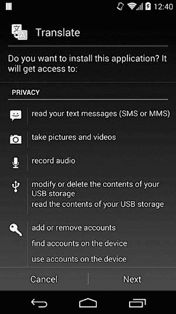
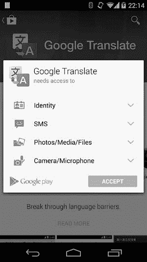

# 第二章. 权限

在上一章中，我们概述了 Android 的安全模型，并简要介绍了权限。在本章中，我们将提供有关权限的更多细节，重点讲解它们的实现和执行。接下来，我们将讨论如何定义自定义权限并将其应用于每个 Android 组件。最后，我们将简要介绍*待处理的意图*，它是一个令牌，允许应用程序以另一个应用程序的身份和权限启动意图。

# 权限的性质

正如我们在第一章中所学到的，Android 应用程序是沙箱式的，默认情况下只能访问它们自己的文件和一小部分系统服务。为了与系统和其他应用程序进行交互，Android 应用程序可以请求一组附加权限，这些权限在安装时授予，且在安装后不能更改（但有一些例外，我们将在本章后面讨论）。

在 Android 中，*权限*只是一个字符串，表示执行特定操作的能力。目标操作可以是访问物理资源（如设备的 SD 卡）或共享数据（如已注册联系人列表），也可以是启动或访问第三方应用程序中的组件的能力。Android 提供了一组内建的预定义权限，每个版本都会添加与新功能相关的新权限。

### 注意

*新的内建权限，限制了以前不需要权限的功能，依赖于* targetSdkVersion *在应用程序清单中指定的版本进行条件应用：针对引入新权限之前发布的 Android 版本的应用程序无法知道这些权限，因此这些权限通常会被隐式授予（无需请求）。不过，隐式授予的权限仍会在应用安装器屏幕的权限列表中显示，以便用户了解它们。针对较新版本的应用程序需要明确请求这些新权限。*

内建权限在平台 API 参考文档中有记录。^([11]) 另外，还可以定义由系统和用户安装的应用程序使用的*自定义权限*。

要查看系统当前已知的权限列表，可以使用`pm list permissions`命令（参见示例 2-1）。要显示关于权限的更多信息，包括定义的包、标签、描述和保护级别，可以在命令中添加`-f`参数。

示例 2-1. 获取所有权限的列表

```
$ **pm list permissions**
All Permissions:

permission:android.permission.REBOOT➊
permission:android.permission.BIND_VPN_SERVICE➋
permission:com.google.android.gallery3d.permission.GALLERY_PROVIDER➌
permission:com.android.launcher3.permission.RECEIVE_LAUNCH_BROADCASTS➍
--*snip*--
```

权限名称通常以其定义的包名和字符串*.permission*为前缀。由于内建权限在`android`包中定义，它们的名称以*android.permission*开头。例如，在示例 2-1 中，`REBOOT` ➊和`BIND_VPN_SERVICE` ➋是内建权限，而`GALLERY_PROVIDER` ➌是由图库应用（包名为`com.google.android.gallery3d`）定义的，`RECEIVE_LAUNCH_BROADCASTS` ➍则由默认启动器应用（包名为`com.android.launcher3`）定义。

# 请求权限

应用通过向其*AndroidManifest.xml*文件添加一个或多个`<uses-permission>`标签来请求权限，并可以通过`<permission>`标签定义新的权限。示例 2-2 展示了一个请求`INTERNET`和`WRITE_EXTERNAL_STORAGE`权限的清单文件示例。（我们将在“自定义权限”中展示如何定义自定义权限。）

示例 2-2. 使用应用清单文件请求权限

```
<?xml version="1.0" encoding="utf-8"?>
<manifest 

    package="com.example.app"
    android:versionCode="1"
    android:versionName="1.0" >

    <uses-permission android:name="android.permission.INTERNET" />
    <uses-permission android:name="android.permission.WRITE_EXTERNAL_STORAGE" />
    --*snip*--
    <application android:name="SampleApp" ...>
    --*snip*--
    </application>
</manifest>
```

# 权限管理

权限在应用安装时由系统的*包管理器*服务分配给每个应用（通过唯一的*包名*进行标识）。包管理器维护一个包含已安装包的中央数据库，包括预安装和用户安装的包，其中记录了每个包的安装路径、版本、签名证书和分配的权限信息，以及设备上定义的所有权限列表。（前一节介绍的`pm list permissions`命令通过查询包管理器来获取此列表。）这个包数据库存储在 XML 文件*/data/system/packages.xml*中，每次应用被安装、更新或卸载时，都会更新该文件。示例 2-3 展示了*packages.xml*中的典型应用条目。

示例 2-3. packages.xml 中的应用条目

```
<package name="com.google.android.apps.translate"
         codePath="/data/app/com.google.android.apps.translate-2.apk"
         nativeLibraryPath="/data/app-lib/com.google.android.apps.translate-2"
         flags="4767300" ft="1430dfab9e0" it="142cdf04d67" ut="1430dfabd8d"
         version="30000028"
         userId="10204"➊
         installer="com.android.vending">

    <sigs count="1">
        <cert index="7" />➋
    </sigs>
    <perms>➌
        <item name="android.permission.READ_EXTERNAL_STORAGE" />
        <item name="android.permission.USE_CREDENTIALS" />
        <item name="android.permission.READ_SMS" />
        <item name="android.permission.CAMERA" />
        <item name="android.permission.WRITE_EXTERNAL_STORAGE" />
        <item name="android.permission.INTERNET" />
        <item name="android.permission.MANAGE_ACCOUNTS" />
        <item name="android.permission.GET_ACCOUNTS" />
        <item name="android.permission.ACCESS_NETWORK_STATE" />
        <item name="android.permission.RECORD_AUDIO" />
    </perms>

    <signing-keyset identifier="17" />
    <signing-keyset identifier="6" />
</package>
```

我们将在第三章中讨论大多数标签和属性的含义，但现在让我们重点关注与权限相关的内容。每个包通过`<package>`元素表示，该元素包含有关分配的 UID（在`userId`属性 ➊中）、签名证书（在`<cert>`标签 ➋中）以及分配的权限（作为`<perms>`标签的子项列出 ➌）的信息。要以编程方式获取已安装包的信息，可以使用`android.content.pm.PackageManager`类的`getPackageInfo()`方法，该方法返回一个`PackageInfo`实例，封装了`<package>`标签中包含的信息。

如果所有权限都在安装时分配，并且在不卸载应用的情况下无法更改或撤销，包管理器如何决定是否授予请求的权限？为了理解这一点，我们需要讨论权限的保护级别。

# 权限保护级别

根据官方文档，^([12]) 权限的*保护级别*“描述了该权限所包含的潜在风险，并指示系统在决定是否授予权限时应遵循的程序。”实际上，这意味着权限是否被授予取决于其保护级别。接下来的章节讨论了 Android 中定义的四种保护级别，以及系统如何处理每种级别。

## 普通

这是默认值。它定义了一种对系统或其他应用程序风险较低的权限。具有*普通*保护级别的权限会在不需要用户确认的情况下自动授予。例如 `ACCESS_NETWORK_STATE`（允许应用访问网络信息）和 `GET_ACCOUNTS`（允许访问帐户服务中的帐户列表）。

## 危险

具有*危险*保护级别的权限会访问用户数据或对设备进行某种形式的控制。例如 `READ_SMS`（允许应用读取短信消息）和 `CAMERA`（允许应用访问相机设备）。在授予危险权限之前，Android 会显示一个确认对话框，显示请求权限的信息。由于 Android 要求在安装时授予所有请求的权限，用户可以同意安装应用，从而授予请求的*危险*权限，或者取消应用安装。例如，对于示例 2-3（Google Translate）中显示的应用，系统确认对话框将类似于图 2-1 中所示。

Google Play 和其他应用市场客户端会显示自己的对话框，样式通常不同。对于相同的应用，Google Play 商店客户端会显示图 2-2 中显示的对话框。在这里，所有*危险*权限按权限组进行组织（参见“系统权限”），普通权限则不会显示。



图 2-1. 默认的 Android 应用安装确认对话框



图 2-2. Google Play 商店客户端应用安装确认对话框

## 签名

*签名*权限仅授予与声明该权限的应用使用相同密钥签名的应用。这是“最强”的权限级别，因为它要求拥有一个只有应用（或平台）所有者控制的加密密钥。因此，使用*签名*权限的应用通常由同一个作者控制。内置的签名权限通常由执行设备管理任务的系统应用使用。示例包括`NET_ADMIN`（配置网络接口、IPSec 等）和`ACCESS_ALL_EXTERNAL_STORAGE`（访问所有多用户外部存储）。我们将在“签名权限”中更详细地讨论*签名*权限。

## signatureOrSystem

具有此保护级别的权限可以说是一种折衷：它们授予那些属于系统镜像的一部分，或与声明此权限的应用使用相同密钥签名的应用。这允许那些在 Android 设备上预安装应用的厂商在不共享签名密钥的情况下，分享需要权限的特定功能。直到 Android 4.3，安装在*system*分区上的任何应用都会自动获得*signatureOrSystem*权限。自 Android 4.4 起，应用需要安装在*/system/priv-app/*目录下，才能获得具有此保护级别的权限。

# 权限分配

权限在 Android 中的各个层面进行强制执行。较高层次的组件，例如应用程序和系统服务，会查询包管理器以确定哪些权限已分配给某个应用，并决定是否授予访问权限。较低层次的组件，如本地守护进程，通常无法访问包管理器，而是依赖于分配给进程的 UID、GID 和附加 GID 来决定授予哪些特权。对系统资源的访问，如设备文件、Unix 域套接字（本地套接字）和网络套接字，由内核基于目标资源的所有者、访问模式以及访问进程的 UID 和 GID 来进行管理。

我们将在“权限强制执行”中深入探讨框架级别的权限强制执行。首先，我们将讨论权限如何映射到操作系统级别的构造（如 UID 和 GID），以及这些进程 ID 如何用于权限强制执行。

## 权限与进程属性

与任何 Linux 系统一样，Android 进程都有一组关联的进程属性，最重要的是实际和有效的 UID 和 GID，以及一组附加的 GID。

如第一章所述，每个 Android 应用在安装时都会被分配一个唯一的 UID，并在专用进程中执行。当应用启动时，进程的 UID 和 GID 会被设置为安装程序（包管理服务）分配的应用 UID。如果应用被分配了额外的权限，这些权限会映射到 GID，并作为补充 GID 分配给进程。内建权限的权限到 GID 映射定义在 */etc/permission/ platform.xml* 文件中。示例 2-4 显示了在 Android 4.4 设备上找到的 *platform.xml* 文件的摘录。

示例 2-4. 在 platform.xml 中的权限到 GID 映射

```
<?xml version="1.0" encoding="utf-8"?>
<permissions>
    --*snip*--
    <permission name="android.permission.INTERNET" >➊
        <group gid="inet" />
    </permission>

    <permission name="android.permission.WRITE_EXTERNAL_STORAGE" >➋
        <group gid="sdcard_r" />
        <group gid="sdcard_rw" />
    </permission>

    <assign-permission name="android.permission.MODIFY_AUDIO_SETTINGS"
                                                  uid="media" />➌
    <assign-permission name="android.permission.ACCESS_SURFACE_FLINGER"
                                                  uid="media" />➍
    --*snip*--
</permissions>
```

在这里，`INTERNET` 权限与 *inet* GID ➊ 相关联，`WRITE_EXTERNAL_STORAGE` 权限与 *sdcard_r* 和 *sdcard_rw* GIDs ➋ 相关联。因此，任何已被授予 `INTERNET` 权限的应用进程，都与对应的 *inet* 组的补充 GID 相关联，而授予 `WRITE_EXTERNAL_STORAGE` 权限的进程，则将 *sdcard_r* 和 *sdcard_rw* 的 GID 添加到相关补充 GID 列表中。

`<assign-permission>` 标签的作用恰恰相反：它用于将更高级别的权限分配给在特定 UID 下运行的系统进程，这些进程没有对应的包。示例 2-4 显示了与 *media* UID（实际上是 *mediaserver* 守护进程）一起运行的进程被分配了 `MODIFY_AUDIO_SETTINGS` ➌ 和 `ACCESS_SURFACE_FLINGER` ➍ 权限。

Android 没有*/etc/group* 文件，因此从组名到 GID 的映射是静态的，并在 *android_filesystem_config.h* 头文件中定义。示例 2-5 显示了一个包含 *sdcard_rw* ➊、*sdcard_r* ➋ 和 *inet* ➌ 组的摘录。

示例 2-5. 在 android_filesystem_config.h 中的静态用户和组名到 UID/GID 映射

```
--*snip*-
#define AID_ROOT              0  /* traditional unix root user */
#define AID_SYSTEM         1000  /* system server */
--*snip*--
#define AID_SDCARD_RW      1015  /* external storage write access */
#define AID_SDCARD_R       1028  /* external storage read access */
#define AID_SDCARD_ALL     1035  /* access all users external storage */
--*snip*--
#define AID_INET           3003  /* can create AF_INET and AF_INET6 sockets */
--*snip*--

struct android_id_info {
    const char *name;
    unsigned aid;
};

static const struct android_id_info android_ids[] = {
    { "root",          AID_ROOT, },
    { "system",        AID_SYSTEM, },
    --*snip*--
    { "sdcard_rw",     AID_SDCARD_RW, },➊
    { "sdcard_r",      AID_SDCARD_R, },➋
    { "sdcard_all",    AID_SDCARD_ALL, },
    --*snip*--
    { "inet",          AID_INET, },➌
};
```

*android_filesystem_config.h* 文件还定义了 Android 核心系统目录和文件的所有者、访问模式以及关联的能力（对于可执行文件）。

包管理器在启动时读取 *platform.xml* 并维护权限及其关联的 GID 列表。当它在安装过程中授予权限时，包管理器会检查每个权限是否有关联的 GID(s)。如果有，GID(s) 会被添加到与应用相关联的附加 GID 列表中。附加 GID 列表作为 *packages.list* 文件的最后一项字段写入（参见 示例 1-6）。

### 进程属性分配

在我们了解内核和低级系统服务如何检查并强制执行权限之前，我们需要先了解 Android 应用进程是如何启动和分配进程属性的。

如 第一章中所讨论，Android 应用是用 Java 实现的，并由 Dalvik 虚拟机执行。因此，每个应用进程实际上是一个执行应用字节码的 Dalvik 虚拟机进程。为了减少应用内存占用并提高启动速度，Android 并不会为每个应用启动一个新的 Dalvik 虚拟机进程。相反，它使用一个部分初始化的进程，称为 *zygote*，当需要启动新应用时，它会分叉该进程（使用 `fork()` 系统调用^([13]))。然而，它并不会像启动本地进程时那样调用 `exec()` 函数，而是仅执行指定 Java 类的 `main()` 函数。这个过程被称为 *专门化*，因为通用的 *zygote* 进程被转化为一个特定的应用进程，就像来自合子细胞的细胞会专门化成执行不同功能的细胞一样。因此，分叉出的进程继承了 *zygote* 进程的内存映像，而 *zygote* 进程已经预加载了大多数核心和应用框架 Java 类。由于这些类从不改变，而且 Linux 在分叉进程时使用写时复制机制，所有 *zygote* 的子进程（即所有 Android 应用）共享相同的框架 Java 类副本。

*zygote* 进程由 *init.rc* 初始化脚本启动，并通过一个名为 *zygote* 的 Unix 域套接字接收命令。当 *zygote* 接收到启动新应用进程的请求时，它会自我分叉，子进程大致执行以下代码（简化自 *dalvik_system_Zygote.cpp* 中的 `forkAndSpecializeCommon()`），以便按 示例 2-6 所示进行自我专门化。

示例 2-6. 在 zygote 中的应用进程专门化

```
pid = fork();

if (pid == 0) {
    int err;
    /* The child process */
    err = setgroupsIntarray(gids);➊
    err = setrlimitsFromArray(rlimits);➋
    err = setresgid(gid, gid, gid);➌
    err = setresuid(uid, uid, uid);➍
    err = setCapabilities(permittedCapabilities, effectiveCapabilities);➎
    err = set_sched_policy(0, SP_DEFAULT);➏
    err = setSELinuxContext(uid, isSystemServer, seInfo, niceName);➐
    enableDebugFeatures(debugFlags);➑
}
```

如图所示，子进程首先使用 `setgroups()` 设置其附加 GID（对应权限），该函数由 `setgroupsIntarray()` 在 ➊ 调用。接着，它使用 `setrlimit()` 设置资源限制，该函数由 `setrlimitsFromArray()` 在 ➋ 调用，然后使用 `setresgid()` ➌ 和 `setresuid()` ➍ 设置实际、有效和保存的用户 ID 和组 ID。

子进程能够改变其资源限制和所有进程属性，因为它最初以 root 身份执行，就像它的父进程*zygote*一样。在设置完新的进程属性后，子进程将以分配的 UID 和 GID 执行，并且无法再以 root 身份执行，因为保存的用户 ID 不是 0。

设置完 UID 和 GID 后，进程使用 `capset()` 设置其能力^([14])，该函数由 `setCapabilities()` 在 ➎ 调用。然后，它通过将自己添加到预定义的控制组之一来设置调度策略 ➏.^([15]) 在 ➐ 处，进程设置其优先级名称（在进程列表中显示，通常是应用程序的包名）和 *seinfo* 标签（由 SELinux 使用，我们将在第十二章中讨论）。最后，如果请求，进程会启用调试 ➑。

### 注意

*Android 4.4 引入了一个新的实验性运行时，称为 Android 运行时（ART），预计将在未来的版本中替代 Dalvik。虽然 ART 带来了许多对当前执行环境的改变，最重要的是提前编译（AOT），但它使用与 Dalvik 相同的基于 zygote 的应用进程执行模型。*

从 `ps` 命令获取的进程列表中可以明显看到*zygote*和应用进程之间的关系，如示例 2-7 所示。

示例 2-7. zygote 和应用进程的关系

```
$ **ps**
USER      PID   PPID  VSIZE  RSS     WCHAN    PC         NAME
root       1     0     680    540   ffffffff 00000000 S /init➊
--*snip*--
root       181   1     858808 38280 ffffffff 00000000 S zygote➋
--*snip*--
radio      1139  181   926888 46512 ffffffff 00000000 S com.android.phone
nfc        1154  181   888516 36976 ffffffff 00000000 S com.android.nfc
u0_a7      1219  181   956836 48012 ffffffff 00000000 S com.google.android.gms
```

在这里，PID 列表示进程 ID，PPID 列表示父进程 ID，NAME 列表示进程名称。如你所见，*zygote*（PID 181 ➋）是由*init*进程（PID 1 ➊）启动的，所有应用进程的父进程都是*zygote*（PPID 181）。每个进程都在一个专用用户下执行，可能是内置的（*radio*，*nfc*），或者在安装时自动分配的（*u0_a7*）。进程名称被设置为每个应用的包名（`com.android.phone`，`com.android.nfc`，和 `com.google.android.gms`）。

# 权限强制执行

如前一节所述，每个应用进程在从*zygote*分叉时都会分配一个 UID、GID 和附加的 GID。内核和系统守护进程使用这些进程标识符来决定是否授予访问某个系统资源或功能的权限。

## 内核级强制执行

对常规文件、设备节点和本地套接字的访问与任何 Linux 系统一样受到管理。Android 特有的一个添加项是要求希望创建网络套接字的进程属于 *inet* 组。这个 Android 内核的添加项被称为“偏执的网络安全”，并作为 Android 内核中的一个附加检查实现，如 示例 2-8 所示。

示例 2-8. Android 内核中的偏执网络安全实现

```
#ifdef CONFIG_ANDROID_PARANOID_NETWORK
#include <linux/android_aid.h>

static inline int current_has_network(void)
{        return in_egroup_p(AID_INET) || capable(CAP_NET_RAW);➊}
#else
static inline int current_has_network(void)
{        return 1;➋
}
#endif
--*snip*--
static int inet_create(struct net *net, struct socket *sock, int protocol,
                                                     int kern)
{
        --*snip*--
        if (!current_has_network())
                 return -EACCES;➌
        --*snip*--
}
```

不属于 `AID_INET`（GID 3003，名称为 *inet*）组且没有 `CAP_NET_RAW` 能力（允许使用 RAW 和 PACKET 套接字）的调用进程会收到访问拒绝错误（➊ 和 ➌）。非 Android 内核未定义 `CONFIG_ANDROID_PARANOID_NETWORK`，因此创建套接字时不需要特别的组成员身份 ➋。为了将 *inet* 组分配给应用进程，必须授予其 `INTERNET` 权限。因此，只有具有 `INTERNET` 权限的应用程序才能创建网络套接字。除了在创建套接字时检查进程凭据外，Android 内核还会授予具有特定 GID 的进程某些能力：以 `AID_NET_RAW`（GID 3004）身份执行的进程会获得 `CAP_NET_RAW` 能力，而以 `AID_NET_ADMIN`（GID 3005）身份执行的进程会获得 `CAP_NET_ADMIN` 能力。

偏执的网络安全还用于控制对蓝牙套接字和内核隧道驱动程序（用于 VPN）的访问。内核以特殊方式处理的 Android GID 的完整列表可以在内核源代码树中的 *include/linux/android_aid.h* 文件中找到。

## 本地守护进程级别的强制执行

虽然 Binder 是 Android 中首选的进程间通信（IPC）机制，但较低级别的本地守护进程通常使用 Unix 域套接字（本地套接字）进行 IPC。由于 Unix 域套接字在文件系统中以节点的形式表示，因此可以使用标准的文件系统权限来控制访问。

由于大多数套接字是以仅允许其所有者和组访问的访问模式创建的，运行在不同 UID 和 GID 下的客户端无法连接到该套接字。系统守护进程的本地套接字在 *init.rc* 中定义，并由 *init* 在启动时以指定的访问模式创建。例如，示例 2-9 显示了如何在 *init.rc* 中定义卷管理守护进程 (*vold*)：

示例 2-9. init.rc 中的 vold 守护进程条目

```
service vold /system/bin/vold
    class core
    socket vold stream 0660 root mount➊
    ioprio be 2
```

*vold*声明了一个名为*vold*的套接字，访问模式为 0660，所有者为*root*，并且组设置为*mount* ➊。*vold*守护进程需要以 root 身份运行才能挂载或卸载卷，但*mount*组的成员（`AID_MOUNT`，GID 1009）可以通过本地套接字向其发送命令，而无需以超级用户身份运行。Android 守护进程的本地套接字创建在*/dev/socket/*目录中。示例 2-10 显示了*vold*套接字➊的所有者和权限设置，这些设置在*init.rc*中指定。

示例 2-10. /dev/socket/中的核心系统守护进程的本地套接字

```
$ **ls -l /dev/socket**

srw-rw---- system   system             1970-01-18 14:26 adbd
srw------- system   system             1970-01-18 14:26 installd
srw-rw---- root     system             1970-01-18 14:26 netd
--*snip*--
srw-rw-rw- root     root               1970-01-18 14:26 property_service
srw-rw---- root     radio              1970-01-18 14:26 rild
srw-rw---- root     mount              1970-01-18 14:26 vold➊
srw-rw---- root     system             1970-01-18 14:26 zygote
```

Unix 域套接字允许通过`SCM_CREDENTIALS`控制消息和`SO_PEERCRED`套接字选项传递和查询客户端凭证。与 Binder 事务中包含的有效 UID 和有效 GUID 类似，与本地套接字关联的对等凭证由内核检查，并且不能被用户级进程伪造。这允许本地守护进程实现对其允许的特定客户端操作的额外精细化控制，如示例 2-11 所示，使用*vold*守护进程作为示例。

示例 2-11. 基于套接字客户端凭证的精细化访问控制在 vold 中的应用

```
int CommandListener::CryptfsCmd::runCommand(SocketClient *cli,
                                                      int argc, char **argv) {
    if ((cli->getUid() != 0) && (cli->getUid() != AID_SYSTEM)) {➊
        cli->sendMsg(ResponseCode::CommandNoPermission,
               "No permission to run cryptfs commands", false);
        return 0;
    }
    --*snip*--
}
```

*vold*守护进程仅允许以*root*（UID 0）或*system*（`AID_SYSTEM`，UID 1000）用户身份运行的客户端发送加密容器管理命令。在这里，`SocketClient->getUid()`返回的 UID➊是通过`getsockopt(SO_PEERCRED)`获取的客户端 UID，如示例 2-12 获取本地套接字客户端凭证")中所示。

示例 2-12. 使用`getsockopt()`获取本地套接字客户端凭证

```
void SocketClient::init(int socket, bool owned, bool useCmdNum) {
    --*snip*--
    struct ucred creds;
    socklen_t szCreds = sizeof(creds);
    memset(&creds, 0, szCreds);

    int err = getsockopt(socket, SOL_SOCKET, SO_PEERCRED, &creds, &szCreds);➊
    if (err == 0) {
        mPid = creds.pid;
        mUid = creds.uid;
        mGid = creds.gid;
    }
}
```

本地套接字连接功能封装在`android.net.LocalSocket`类中，Java 应用程序也可以使用该功能，使得更高层次的系统服务能够与本地守护进程进行通信，而无需使用 JNI 代码。例如，`MountService`框架类使用`LocalSocket`向*vold*守护进程发送命令。

## 框架级强制执行

正如在 Android 权限介绍中所讨论的那样，访问 Android 组件可以通过声明所需权限在封闭应用程序的清单中来控制。系统会跟踪与每个组件关联的权限，并在允许访问之前检查调用者是否已被授予所需权限。由于组件不能在运行时更改其所需的权限，因此系统的强制执行是*静态的*。静态权限是声明性安全性的一个例子。使用声明性安全性时，角色和权限等安全属性被放置在组件的元数据中（在 Android 中是*AndroidManifest.xml*文件），而不是在组件本身，并由容器或运行时环境强制执行。这有一个优点，即将安全决策与业务逻辑隔离开，但相比在组件内部实现安全检查，它可能不够灵活。

Android 组件还可以检查调用进程是否已被授予某个权限，而无需在清单中声明权限。这种*动态权限强制执行*需要更多的工作，但允许更细粒度的访问控制。动态权限强制执行是命令式安全性的一个例子，因为安全决策由每个组件做出，而不是由运行时环境强制执行。

让我们更详细地了解动态和静态权限强制执行的实现方式。

### 动态强制执行

正如在第一章中讨论的那样，Android 的核心是由一组合作的系统服务实现的，这些服务可以通过 Binder IPC 机制从其他进程调用。核心服务注册到服务管理器，任何知道它们注册名称的应用程序都可以获取 Binder 引用。由于 Binder 没有内置的访问控制机制，因此当客户端拥有引用时，它们可以通过将适当的参数传递给`Binder.transact()`来调用底层系统服务的任何方法。因此，访问控制需要由每个系统服务实现。

在第一章中，我们展示了系统服务如何通过直接检查从`Binder.getCallingUid()`获取的调用者 UID 来调节对导出操作的访问（参见示例 1-8）。然而，这种方法要求服务提前知道允许的 UID 列表，这仅适用于一些已知的固定 UID，如*root*（UID 0）和*system*（UID 1000）。此外，大多数服务并不关心调用者的实际 UID；它们只关心是否已授予某个权限。

因为每个 Android 应用的 UID 都与一个唯一的包关联（除非它是共享用户 ID 的一部分），并且包管理器跟踪每个包授予的权限，所以可以通过查询包管理服务来实现这一点。检查调用者是否具有某个权限是一个非常常见的操作，Android 在`android.content.Context`类中提供了多个辅助方法来执行此检查。

我们首先来看看`int Context.checkPermission(String permission, int pid, int uid)`方法的工作原理。此方法如果传入的 UID 具有该权限，则返回`PERMISSION_GRANTED`，否则返回`PERMISSION_DENIED`。如果调用者是*root*或*system*，则权限会自动授予。作为性能优化，如果请求的权限已经被调用的应用声明，则直接授予权限，而无需检查实际权限。如果不是这种情况，方法会检查目标组件是公开（导出）还是私有，并拒绝访问所有私有组件。（我们将在“公共与私有组件”中讨论组件的导出）。最后，代码会查询包管理服务，以查看调用者是否已获得请求的权限。来自`PackageManagerService`类的相关代码可参见示例 2-13。

示例 2-13. `PackageManagerService`中的基于 UID 的权限检查

```
public int checkUidPermission(String permName, int uid) {
    synchronized (mPackages) {
        Object obj = mSettings.getUserIdLPr(➊UserHandle.getAppId(uid));
        if (obj != null) {
            GrantedPermissions gp = (GrantedPermissions)obj;➋
            if (gp.grantedPermissions.contains(permName)) {
                return PackageManager.PERMISSION_GRANTED;
            }
        } else {
            HashSet<String> perms = mSystemPermissions.get(uid);➌
            if (perms != null && perms.contains(permName)) {
                return PackageManager.PERMISSION_GRANTED;
            }
        }
    }
    return PackageManager.PERMISSION_DENIED;
}
```

在这里，`PackageManagerService`首先根据传入的 UID ➊确定应用程序的*应用 ID*（同一个应用程序在为不同用户安装时可以分配多个 UID，详细讨论请参见第四章），然后获取授予的权限集合。如果`GrantedPermission`类（其中包含实际的`java.util.Set<String>`类型的权限名称）包含目标权限，则该方法返回`PERMISSION_GRANTED` ➋。否则，它将检查目标权限是否应自动分配给传入的 UID ➌（依据`platform.xml`中的`<assign-permission>`标签，如示例 2-4 所示）。如果该检查也失败，最终返回`PERMISSION_DENIED`。

`Context` 类中的其他权限检查辅助方法遵循相同的流程。`int checkCallingOrSelfPermission(String permission)` 方法会调用 `Binder.getCallingUid()` 和 `Binder.getCallingPid()`，然后使用获取到的值调用 `checkPermission(String permission, int pid, int uid)`。`enforcePermission(String permission, int pid, int uid, String message)` 方法不会返回结果，而是在没有权限时抛出带有指定消息的 `SecurityException`。例如，`BatteryStatsService` 类通过在执行其他代码之前调用 `enforceCallingPermission()` 来确保只有拥有 `BATTERY_STATS` 权限的应用程序能够获取电池统计信息，如 示例 2-14 所示。未被授予权限的调用者会收到 `SecurityException`。

示例 2-14. `BatteryStatsService` 中的动态权限检查

```
public byte[] getStatistics() {
    mContext.enforceCallingPermission(
                android.Manifest.permission.BATTERY_STATS, null);
    Parcel out = Parcel.obtain();
    mStats.writeToParcel(out, 0);
    byte[] data = out.marshall();
    out.recycle();
    return data;
}
```

### 静态强制执行

静态权限强制执行在应用程序尝试与另一个应用程序声明的组件进行交互时起作用。强制执行过程会考虑每个目标组件声明的权限（如果有），并在调用者进程被授予所需权限时允许交互。

Android 使用意图来描述需要执行的操作，完全指定目标组件（通过包名和类名）的意图称为 *显式* 意图。另一方面，*隐式* 意图包含一些数据（通常只是一个抽象动作，例如 `ACTION_SEND`），允许系统找到匹配的组件，但并未完全指定目标组件。

当系统接收到一个隐式意图时，它首先通过搜索匹配的组件来解析该意图。如果找到多个匹配的组件，用户将看到一个选择对话框。当选择了目标组件后，Android 会检查该组件是否有相关的权限，如果有，再检查这些权限是否已经授予给调用者。

一般流程类似于动态权限强制：通过 `Binder.getCallingUid()` 和 `Binder.getCallingPid()` 获取调用者的 UID 和 PID，调用者的 UID 会被映射到一个包名，并且检索相关的权限。如果调用者权限集包含目标组件所需的权限，组件将被启动；否则，将抛出 `SecurityException`。

权限检查由 `ActivityManagerService` 执行，该服务解析指定的意图并检查目标组件是否有相关的权限属性。如果有，它将权限检查委托给包管理器。具体的权限检查时机和顺序会根据目标组件有所不同。（接下来，我们将检查每个组件如何进行检查。）

### 活动和服务权限强制执行

如果传递给`Context.startActivity()`或`startActivityForResult()`的意图指向一个声明了权限的活动，则会进行活动的权限检查。如果调用者没有所需的权限，将抛出`SecurityException`。因为 Android 服务可以启动、停止和绑定，因此调用`Context.startService()`、`stopService()`和`bindService()`时，如果目标服务声明了权限，也会受到权限检查。

### 内容提供者权限强制执行

内容提供者权限可以保护整个组件或特定的导出 URI，并且可以为读取和写入指定不同的权限。（你将在《内容提供者权限》一章中了解更多关于权限声明的内容。）如果为读取和写入指定了不同的权限，则读取权限控制谁可以在目标提供者或 URI 上调用`ContentResolver.query()`，而写入权限控制谁可以在提供者或其导出的 URI 上调用`ContentResolver.insert()`、`ContentResolver.update()`和`ContentResolver.delete()`。当调用这些方法时，权限检查会同步执行。

### 广播权限强制执行

在发送广播时，应用程序可以要求接收者持有特定的权限，方法是使用`Context.sendBroadcast(Intent intent, String receiverPermission)`方法。由于广播是异步的，调用此方法时不会执行权限检查。权限检查是在将意图传递给已注册的接收者时进行的。如果目标接收者没有持有所需的权限，它将被跳过，并且不会接收到广播，但不会抛出异常。反过来，广播接收者也可以要求广播发送者持有特定的权限，才能将广播发送给它们。

所需的权限可以在清单文件中指定，也可以在动态注册广播时指定。这个权限检查也会在传递广播时执行，并且不会导致`SecurityException`。因此，发送广播可能需要进行两次权限检查：一次是广播发送者的权限检查（如果接收者指定了权限），另一次是广播接收者的权限检查（如果发送者指定了权限）。

### 受保护和粘性广播

一些系统广播被声明为 *protected*（例如，`BOOT_COMPLETED` 和 `PACKAGE_INSTALLED`），只能由以 `SYSTEM_UID`、`PHONE_UID`、`SHELL_UID`、`BLUETOOTH_UID` 或 *root* 身份运行的系统进程发送。如果一个以其他 UID 运行的进程试图发送受保护的广播，在调用 `sendBroadcast()` 方法时会收到 `SecurityException`。发送“粘性”广播（如果标记为粘性，系统会在广播完成后保留发送的 `Intent` 对象）要求发送者持有 `BROADCAST_STICKY` 权限；否则，会抛出 `SecurityException` 并且广播不会发送。

# 系统权限

Android 的内置权限在 `android` 包中定义，有时也称为“框架”或“平台”。正如我们在第一章中所学到的，核心 Android 框架是由系统服务共享的一组类，其中一些通过公共 SDK 进行公开。框架类打包在 JAR 文件中，这些文件位于 */system/framework/*（最新版本中大约 40 个）。

除了 JAR 库，框架还包含一个 APK 文件，*framework-res.apk*。顾名思义，它打包了框架资源（动画、图形、布局等），但没有实际代码。最重要的是，它定义了 `android` 包和系统权限。由于 *framework-res.apk* 是一个 APK 文件，它包含一个 *AndroidManifest.xml* 文件，在该文件中声明了权限组和权限（参见示例 2-15）。

示例 2-15. framework-res.apk 中清单的系统权限定义

```
<?xml version="1.0" encoding="utf-8"?>
<manifest 
    package="android" coreApp="true" android:sharedUserId="android.uid.system"
    android:sharedUserLabel="@string/android_system_label">
    --*snip*-
    <protected-broadcast android:name="android.intent.action.BOOT_COMPLETED" />➊
    <protected-broadcast android:name="android.intent.action.PACKAGE_INSTALL" />
    --*snip*--
    <permission-group android:name="android.permission-group.MESSAGES"
        android:label="@string/permgrouplab_messages"
        android:icon="@drawable/perm_group_messages"
        android:description="@string/permgroupdesc_messages"
        android:permissionGroupFlags="personalInfo"
        android:priority="360"/>➋
    <permission android:name="android.permission.SEND_SMS"
        android:permissionGroup="android.permission-group.MESSAGES"➌
        android:protectionLevel="dangerous"
        android:permissionFlags="costsMoney"
        android:label="@string/permlab_sendSms"
        android:description="@string/permdesc_sendSms" />
    --*snip*--
    <permission android:name="android.permission.NET_ADMIN"
        android:permissionGroup="android.permission-group.SYSTEM_TOOLS"
        android:protectionLevel="signature" />➍
    --*snip*--
    <permission android:name="android.permission.MANAGE_USB"
        android:permissionGroup="android.permission-group.HARDWARE_CONTROLS"
        android:protectionLevel="signature|system"➎
        android:label="@string/permlab_manageUsb"
        android:description="@string/permdesc_manageUsb" />
    --*snip*--
    <permission android:name="android.permission.WRITE_SECURE_SETTINGS"
        android:permissionGroup="android.permission-group.DEVELOPMENT_TOOLS"
        android:protectionLevel="signature|system|development"➏
        android:label="@string/permlab_writeSecureSettings"
        android:description="@string/permdesc_writeSecureSettings" />
    --*snip*--
</manifest>
```

如本列表所示，*AndroidManifest.xml* 文件还声明了系统的受保护广播 ➊。一个 *权限组* ➋ 为一组相关权限指定了一个名称。个别权限可以通过在它们的 `permissionGroup` 属性中指定组名来加入该组 ➌。

权限组用于在系统 UI 中显示相关的权限，但每个权限仍然需要单独请求。也就是说，应用程序不能请求授予它们整个权限组中的所有权限。

回想一下，每个权限都有一个相关的保护级别，通过 `protectionLevel` 属性声明，如 ➍ 所示。

保护级别可以与 *保护标志* 结合使用，进一步限制权限的授予方式。目前定义的标志有 `system`（0x10）和 `development`（0x20）。`system` 标志要求应用程序必须是系统镜像的一部分（即安装在只读的 *system* 分区上），才能获得权限。例如，`MANAGE_USB` 权限，允许应用程序管理 USB 设备的偏好设置和权限，只会授予那些同时使用平台签名密钥签名并安装在 *system* 分区上的应用程序 ➎。`development` 标志标记了开发权限 ➏，我们将在介绍完签名权限后进行讨论。

## 签名权限

正如在第一章中讨论的那样，所有 Android 应用程序都需要使用开发者控制的签名密钥进行代码签名。这同样适用于系统应用程序和框架资源包。我们在第三章中会详细讨论包签名的问题，但现在我们先简单说几句关于系统应用签名的情况。

系统应用程序是由 *平台密钥* 签名的。默认情况下，当前 Android 源代码树中有四种不同的密钥：*平台*、*共享*、*媒体* 和 *testkey*（发布版本使用 *releasekey*）。所有被视为核心平台的一部分的包（如系统 UI、设置、电话、蓝牙等）都由 *平台* 密钥签名；与搜索和联系人相关的包由 *共享* 密钥签名；图库应用和与媒体相关的提供者由 *媒体* 密钥签名；其他所有包（包括那些在其 makefile 中未明确指定签名密钥的包）都由 *testkey*（或 *releasekey*）签名。定义系统权限的 *framework-res.apk* APK 文件是由 *平台* 密钥签名的。因此，任何试图请求具有 *签名* 保护级别的系统权限的应用程序，都需要使用与框架资源包相同的密钥签名。

例如，示例 2-15 中显示的 `NET_ADMIN` 权限（允许被授权的应用程序控制网络接口）是使用 *签名* 保护级别 ➍ 声明的，并且只能授予使用 *平台* 密钥签名的应用程序。

### 注意

*Android 开源仓库（AOSP）包括预生成的测试密钥，这些密钥在默认情况下用于签署已编译的包。它们不应在生产版本中使用，因为它们是公开的，任何下载 Android 源代码的人都可以获取。发布版应该使用仅属于构建所有者的新生成的私钥进行签名。密钥可以通过* make_key *脚本生成，该脚本包含在* development/tools/ *AOSP 目录中。有关平台密钥生成的详细信息，请参阅* build/target/product/security/README *文件。*

## 开发权限

传统上，Android 的权限模型不允许动态授予和撤销权限，应用的已授予权限集在安装时就已固定。然而，自 Android 4.2 起，通过添加一系列*开发权限*（如 `READ_LOGS` 和 `WRITE_SECURE_SETTINGS`），此规则有所放宽。开发权限可以通过 Android shell 上的*pm grant* 和 *pm revoke* 命令按需授予或撤销。

### 注意

*当然，这一操作并非对所有人开放，且受`GRANT_REVOKE_PERMISSIONS`签名权限的保护。该权限授予* android.uid.shell *共享用户 ID（UID 2000），并授予所有从 Android shell 启动的进程（它们也以 UID 2000 运行）。*

# 共享用户 ID

使用相同密钥签名的 Android 应用可以请求以相同的 UID 运行，并可选择在同一进程中运行。此功能称为*共享用户 ID*，被核心框架服务和系统应用广泛使用。由于它可能对进程计数和应用管理产生微妙的影响，Android 团队不推荐第三方应用使用此功能，但它同样对用户安装的应用可用。此外，切换一个未使用共享用户 ID 的现有应用到共享用户 ID 是不支持的，因此需要使用共享用户 ID 的合作应用应该从一开始就设计并发布为此方式。

共享用户 ID 通过在 *AndroidManifest.xml* 的根元素中添加 `sharedUserId` 属性来启用。清单中指定的用户 ID 需要采用 Java 包格式（至少包含一个点 [`.`]），并作为标识符使用，类似于应用程序的包名。如果指定的共享 UID 不存在，则会创建它。如果已经安装了另一个具有相同共享 UID 的包，则会将签名证书与现有包的证书进行比较，如果不匹配，则返回 `INSTALL_FAILED_SHARED_USER_INCOMPATIBLE` 错误，安装失败。

将`sharedUserId`属性添加到已安装应用程序的新版本时，会导致它更改其 UID，这将导致无法访问自己的文件（这是某些早期 Android 版本中的情况）。因此，系统不允许这样做，会拒绝更新并返回`INSTALL_FAILED_UID_CHANGED`错误。简而言之，如果你打算为应用使用共享 UID，必须从一开始就为此进行设计，并且必须从第一次发布开始就使用它。

共享 UID 本身是系统包数据库中的一个一类对象，类似于应用程序，它具有关联的签名证书和权限。Android 有五个内置的共享 UID，这些 UID 在系统引导时会自动添加：

+   *android.uid.system*（SYSTEM_UID，1000）

+   *android.uid.phone*（PHONE_UID，1001）

+   *android.uid.bluetooth*（BLUETOOH_UID，1002）

+   *android.uid.log*（LOG_UID，1007）

+   *android.uid.nfc*（NFC_UID，1027）

示例 2-16 展示了如何定义*android.uid.system*共享用户：

示例 2-16. android.uid.system 共享用户的定义

```
<shared-user name="android.uid.system" userId="1000">
<sigs count="1">
<cert index="4" />
</sigs>
<perms>
<item name="android.permission.MASTER_CLEAR" />
<item name="android.permission.CLEAR_APP_USER_DATA" />
<item name="android.permission.MODIFY_NETWORK_ACCOUNTING" />
--*snip*--
<shared-user/>
```

如你所见，除了拥有一堆令人担忧的权限（在 4.4 设备上约 66 个），其定义与前面展示的包声明非常相似。相反，作为共享用户一部分的包没有关联的已授予权限列表。它们继承了共享用户的权限，这些权限是所有当前安装的具有相同共享用户 ID 的包请求的权限的并集。一个副作用是，如果一个包是共享用户的一部分，它可以访问那些它没有显式请求权限的 API，只要某个具有相同共享用户 ID 的包已经请求了这些权限。然而，权限会在安装或卸载包时动态地从`<shared-user>`定义中移除，因此可用的权限集合既不保证也不是固定的。

示例 2-17 展示了如何声明在共享用户 ID 下运行的`KeyChain`系统应用程序。如你所见，它通过`sharedUserId`属性引用了共享用户，并且没有显式的权限声明：

示例 2-17. 在共享用户 ID 下运行的应用程序的包声明

```
<package name="com.android.keychain"
         codePath="/system/app/KeyChain.apk"
         nativeLibraryPath="/data/app-lib/KeyChain"
         flags="540229" ft="13cd65721a0"
         it="13c2d4721f0" ut="13cd65721a0"
         version="19"
         sharedUserId="1000">
        <sigs count="1">
            <cert index="4" />
        </sigs>
        <signing-keyset identifier="1" />
    </package>
```

共享 UID 不仅仅是一个包管理构造；它实际上在运行时也映射到一个共享的 Linux UID。示例 2-18 展示了两个作为*system*用户（UID 1000）运行的系统应用程序的示例：

示例 2-18. 运行在共享 UID 下的应用程序（系统）

```
system    5901  9852  845708 40972 ffffffff 00000000 S com.android.settings
system    6201  9852  824756 22256 ffffffff 00000000 S com.android.keychain
```

属于共享用户的一部分的应用可以在同一进程中运行，由于它们已经具有相同的 Linux UID 并能够访问相同的系统资源，通常不需要任何额外的修改。可以通过在所有需要在同一进程中运行的应用的`<application>`标签的`process`属性中指定相同的进程名称来请求一个公共进程。显而易见，这样做的结果是这些应用可以共享内存并直接通信，而不是使用 IPC，某些系统服务允许对同一进程中运行的组件进行特殊访问（例如，直接访问缓存的密码或在不显示 UI 提示的情况下获取认证令牌）。Google 应用（如 Play 服务和 Google 位置服务）通过请求与 Google 登录服务在同一进程中运行来利用这一点，以便能够在后台同步数据而无需用户交互。自然，它们使用相同的证书签名，并且是*com.google.uid.shared*共享用户的一部分。

# 自定义权限

*自定义权限*只是第三方应用声明的权限。当声明后，它们可以被添加到应用组件中，以便由系统进行静态强制执行，或者应用可以动态检查调用者是否已通过`checkPermission()`或`enforcePermission()`方法被授予该权限，这些方法属于`Context`类。与内建权限一样，应用可以定义权限组，并将自定义权限添加到这些组中。例如，示例 2-19 展示了一个权限组的声明➋及属于该组的权限➌。

示例 2-19. 自定义权限树、权限组和权限声明

```
<?xml version="1.0" encoding="utf-8"?>
<manifest 
    package="com.example.app"
    android:versionCode="1"
    android:versionName="1.0" >
    --*snip*--
    <permission-tree
        android:name="com.example.app.permission"
        android:label="@string/example_permission_tree_label" />➊

    <permission-group
        android:name="com.example.app.permission-group.TEST_GROUP"
        android:label="@string/test_permission_group_label"
        android:description="@string/test_permission_group_desc"/>➋

    <permission
        android:name="jcom.example.app.permission.PERMISSION1"
        android:label="@string/permission1_label"
        android:description="@string/permission1_desc"
        android:permissionGroup="com.example.app.permission-group.TEST_GROUP"
        android:protectionLevel="signature" />➌
        --*snip*--
</manifest>
```

与系统权限类似，如果保护级别为*正常*或*危险*，当用户确认对话框时，自定义权限将自动授予。为了能够控制哪些应用被授予自定义权限，你需要声明其*签名*保护级别，以保证该权限只会授予使用相同密钥签名的应用。

### 注意

*系统只能授予它已知的权限，这意味着定义自定义权限的应用必须在使用这些权限的应用之前安装。如果应用请求系统未知的权限，该权限将被忽略并不会被授予。*

应用程序还可以通过`android.content.pm.PackageManager.addPermission()`API 动态添加新权限，并使用匹配的`removePermission()`API 将其删除。这些动态添加的权限必须属于应用定义的*权限树*。应用只能从自己的包或与其共享用户 ID 的另一个包中添加或删除权限。

权限树名称采用反向域名表示法，如果一个权限的名称以权限树名称加上点号（`.`）作为前缀，则该权限被视为属于该权限树。例如，`com.example.app.permission.PERMISSION2`权限是`com.example.app.permission`树的成员，定义在示例 2-19 中的➊位置。示例 2-20 展示了如何通过编程方式添加动态权限。

示例 2-20. 通过编程方式添加动态权限

```
PackageManager pm = getPackageManager();
PermissionInfo permission = new PermissionInfo();
permission.name = "com.example.app.permission.PERMISSION2";
permission.labelRes = R.string.permission_label;
permission.protectionLevel = PermissionInfo.PROTECTION_SIGNATURE;
boolean added = pm.addPermission(permission);
Log.d(TAG, "permission added: " + added);
```

动态添加的权限会被添加到包数据库（*/data/system/packages.xml*）中。它们会在重启后持续存在，就像在清单中定义的权限一样，但它们有一个额外的`type`属性，值为*dynamic*。

# 公共和私有组件

在*AndroidManifest.xml*文件中定义的组件可以是公开的或私有的。私有组件只能被声明的应用调用，而公开组件则对其他应用也可用。

除内容提供者外，所有组件默认都是私有的。因为内容提供者的目的是与其他应用共享数据，内容提供者最初默认是公开的，但在 Android 4.2（API 级别 17）中，这一行为发生了变化。现在，目标 API 级别为 17 或更高的应用默认获得私有内容提供者，但为了向后兼容，目标较低 API 级别的应用仍然保持公开。

组件可以通过显式设置`exported`属性为`true`，或者通过声明意图过滤器隐式设置为公开。具有意图过滤器但不需要公开的组件，可以通过设置`exported`属性为`false`来使其私有。如果一个组件未被导出，来自外部应用的调用将被活动管理器阻止，无论调用进程是否拥有相应权限（除非它以*root*或*system*身份运行）。示例 2-21 展示了如何通过将`exported`属性设置为`false`来保持组件私有。

示例 2-21. 通过设置`exported="false"`保持组件私有

```
<service android:name=".MyService" android:exported="false" >
    <intent-filter>
        <action android:name="com.example.FETCH_DATA" />
    </intent-filter>
</service>
```

除非明确用于公开，否则所有公共组件都应该通过自定义权限进行保护。

# 活动和服务权限

活动和服务可以通过目标组件的`permission`属性来分别由单一权限保护。当其他应用程序使用解析到该活动的意图调用`Context.startActivity()`或`Context.startActivityForResult()`时，将检查活动权限。对于服务，当其他应用程序使用解析到该服务的意图调用`Context.startService()`、`stopService()`或`bindService()`时，将检查服务权限。

例如，示例 2-22 展示了两个自定义权限，`START_MY_ACTIVITY`和`USE_MY_SERVICE`，分别与活动 ➊ 和服务 ➋ 关联。希望使用这些组件的应用程序需要在其清单中使用`<uses-permission>`标签请求相应的权限。

示例 2-22. 使用自定义权限保护活动和服务

```
<?xml version="1.0" encoding="utf-8"?>
<manifest 
    package="com.example.myapp"
    ... >
    <permission android:name="com.example.permission.START_MY_ACTIVITY"
        android:protectionLevel="signature"
        android:label="@string/start_my_activity_perm_label"
        android:description="@string/start_my_activity_perm_desc" />
    <permission android:name="com.example.permission.USE_MY_SERVICE"
        android:protectionLevel="signature"
        android:label="@string/use_my_service_perm_label"
        android:description="@string/use_my_service_perm_desc" />

    --*snip*--
    <activity android:name=".MyActivity"
        android:label="@string/my_activity"
        android:permission="com.example.permission.START_MY_ACTIVITY">➊
        <intent-filter>
        --*snip*--
       </intent-filter>
    </activity>
    <service android:name=".MyService"
        android:permission="com.example.permission.USE_MY_SERVICE">➋
        <intent-filter>
        --*snip*--
        </intent-filter>
    </service>
    --*snip*--
</manifest>
```

# 广播权限

与活动和服务不同，广播接收器的权限既可以由接收器本身指定，也可以由发送广播的应用程序指定。在发送广播时，应用程序可以使用`Context.sendBroadcast(Intent intent)`方法发送广播，该广播将被传递给所有注册的接收器，或者通过使用`Context.sendBroadcast(Intent intent, String receiverPermission)`限制接收广播的组件范围。`receiverPermission`参数指定了感兴趣的接收器需要持有的权限才能接收广播。或者，从 Android 4.0 开始，发送方可以使用`Intent.setPackage(String packageName)`来限制接收广播的接收器范围，仅限于指定包中定义的接收器。在多用户设备上，持有`INTERACT_ACROSS_USERS`权限的系统应用程序可以通过使用`sendBroadcastAsUser(Intent intent, UserHandle user)`和`sendBroadcastAsUser(Intent intent, UserHandle user, String receiverPermission)`方法，将广播仅发送给特定用户。

接收器可以通过在清单中的`<receiver>`标签的`permission`属性中指定权限来限制谁可以向它们发送广播，对于静态注册的接收器，或者通过将所需权限传递给`Context.registerReceiver(BroadcastReceiver receiver, IntentFilter filter, String broadcastPermission, Handler scheduler)`方法来限制动态注册的接收器。

只有被授予所需权限的广播发送者才能向该接收器发送广播。例如，执行系统安全策略的设备管理应用程序（我们在第九章讨论设备管理）需要`BIND_DEVICE_ADMIN`权限才能接收`DEVICE_ADMIN_ENABLED`广播。因为这是一个具有*签名*保护级别的系统权限，要求此权限可以确保只有系统才能激活设备管理应用程序。例如，示例 2-23 展示了默认的 Android 邮件应用程序如何为其`PolicyAdmin`接收器指定`BIND_DEVICE_ADMIN` ➊权限。

示例 2-23. 为静态注册的广播接收器指定权限

```
<?xml version="1.0" encoding="utf-8"?>
<manifest 
    package="com.android.email"
    android:versionCode="500060" >
        --*snip*--
        <receiver
            android:name=".SecurityPolicy$PolicyAdmin"
            android:label="@string/device_admin_label"
            android:description="@string/device_admin_description"
            android:permission="android.permission.BIND_DEVICE_ADMIN" >➊
            <meta-data
                android:name="android.app.device_admin"
                android:resource="@xml/device_admin" />
            <intent-filter>
                <action
                    android:name="android.app.action.DEVICE_ADMIN_ENABLED" />
            </intent-filter>
        </receiver>
        --*snip*--
</manifest>
```

与其他组件一样，私有广播接收器只能接收来自同一应用程序的广播。

# 内容提供者权限

如在“权限的本质”一节中提到的，内容提供者具有比其他组件更复杂的权限模型，我们将在本节中详细描述。

## 静态提供者权限

虽然可以使用`permission`属性指定控制整个提供者访问的单一权限，但大多数提供者会为读取和写入操作使用不同的权限，并且还可以为每个 URI 指定权限。一个使用不同权限来进行读取和写入的提供者的例子是内置的`ContactsProvider`。示例 2-24 展示了其`ContactsProvider2`类的声明。

示例 2-24. `ContactsProvider` 权限声明

```
<manifest 
        package="com.android.providers.contacts"
        android:sharedUserId="android.uid.shared"
        android:sharedUserLabel="@string/sharedUserLabel">
        --*snip*--
        <provider android:name="ContactsProvider2"
           android:authorities="contacts;com.android.contacts"
           android:label="@string/provider_label"
           android:multiprocess="false"
           android:exported="true"
           android:readPermission="android.permission.READ_CONTACTS"➊
           android:writePermission="android.permission.WRITE_CONTACTS">➋
           --*snip*--
           <path-permission
                   android:pathPattern="/contacts/.*/photo"
                   android:readPermission="android.permission.GLOBAL_SEARCH" />➌
           <grant-uri-permission android:pathPattern=".*" />
        </provider>
        --*snip*--
</manifest>
```

该提供者使用`readPermission`属性指定用于读取数据的权限（`READ_CONTACTS` ➊），并使用`writePermission`属性指定用于写入数据的单独权限（`WRITE_CONTACTS` ➋）。因此，只有持有`READ_CONTACTS`权限的应用程序才能调用提供者的`query()`方法，而对`insert()`、`update()`或`delete()`方法的调用则要求调用者持有`WRITE_CONTACTS`权限。需要同时读取和写入联系人提供者的应用程序必须同时持有这两种权限。

当全局的读写权限不够灵活时，提供者可以指定每个 URI 的权限，以保护其数据的某个子集。每个 URI 权限的优先级高于组件级权限（或者，如果指定了的话，也高于读写权限）。因此，如果应用程序想访问一个具有相关权限的内容提供者 URI，它只需要持有目标 URI 的权限，而不需要持有组件级权限。在示例 2-24 中，`ContactsProvider2`使用`<path-permission>`标签要求试图读取联系人照片的应用持有`GLOBAL_SEARCH`权限➌。由于每个 URI 的权限会覆盖全局读权限，因此感兴趣的应用不需要持有`READ_CONTACTS`权限。在实际应用中，`GLOBAL_SEARCH`权限用于授权 Android 的搜索系统只读访问某些系统提供者的数据，而无需期望它持有所有提供者的读权限。

## 动态提供者权限

虽然静态定义的每个 URI 权限功能强大，但有时应用程序需要向其他应用授予对特定数据（通过其 URI 引用）的临时访问权限，而不要求它们持有特定的权限。例如，电子邮件或消息应用可能需要与图像查看器应用配合，以显示附件。由于该应用无法提前知道附件的 URI，如果它使用静态的每个 URI 权限，它将需要为图像查看器应用授予对所有附件的读取权限，这是不理想的。

为了避免这种情况和潜在的安全问题，应用程序可以使用`Context.grantUriPermission(String toPackage, Uri uri, int modeFlags)`方法动态授予临时的每个 URI 访问权限，并通过匹配的`revokeUriPermission(Uri uri, int modeFlags)`方法撤销访问权限。通过将全局`grantUriPermissions`属性设置为`true`，或通过添加`<grant-uri-permission>`标签来为特定的 URI 启用临时每个 URI 访问权限。例如，示例 2-25 展示了邮件应用如何使用`grantUriPermissions`属性➊来允许临时访问附件，而不需要`READ_ATTACHMENT`权限。

示例 2-25. 邮件应用中的`AttachmentProvider`声明

```
<?xml version="1.0" encoding="utf-8"?>
<manifest 
    package="com.android.email"
    android:versionCode="500060" >
        <provider
           android:name=".provider.AttachmentProvider"
           android:authorities="com.android.email.attachmentprovider"
           android:grantUriPermissions="true"➊
           android:exported="true"
           android:readPermission="com.android.email.permission.READ_ATTACHMENT"/>
        --*snip*--
</manifest>
```

实际上，应用程序很少直接使用 `Context.grantPermission()` 和 `revokePermission()` 方法来允许按 URI 访问权限。相反，它们将 `FLAG_GRANT_READ_URI_PERMISSION` 或 `FLAG_GRANT_WRITE_URI_PERMISSION` 标志设置到用于启动协作应用程序（在我们的示例中是图像查看器）的意图中。当这些标志被设置时，接收意图的应用程序将被授予对意图数据中 URI 进行读取或写入操作的权限。

从 Android 4.4（API 级别 19）开始，按 URI 的访问权限可以通过 `ContentResolver.takePersistableUriPermission()` 方法在设备重启后保持，如果接收到的意图设置了 `FLAG_GRANT_PERSISTABLE_URI_PERMISSION` 标志。权限被持久化到 */data/system/urigrants.xml* 文件中，可以通过调用 `releasePersistableUriPermission()` 方法撤销。系统的 `ActivityManagerService` 会管理所有的短期和持久性按 URI 访问权限的授予，相关的 API 内部调用处理这些权限。

从 Android 4.1（API 级别 16）开始，应用程序可以使用意图的 `ClipData` 功能^([16])，将多个内容 URI 临时授予访问权限。

每个 URI 的访问权限是通过 `FLAG_GRANT_*` 意图标志之一授予的，并且在被调用的应用程序的任务完成时自动撤销，因此无需调用 `revokePermission()`。 示例 2-26 展示了电子邮件应用程序如何创建一个启动附件查看器应用程序的意图。

示例 2-26. 使用 `FLAG_GRANT_READ_URI_PERMISSION` 标志启动查看器应用程序

```
public Intent getAttachmentIntent(Context context, long accountId) {
    Uri contentUri = getUriForIntent(context, accountId);
    Intent intent = new Intent(Intent.ACTION_VIEW);
    intent.setDataAndType(contentUri, mContentType);
    intent.addFlags(Intent.FLAG_GRANT_READ_URI_PERMISSION |
                    Intent.FLAG_ACTIVITY_CLEAR_WHEN_TASK_RESET);
    return intent;
}
```

# 待处理意图

待处理意图既不是 Android 组件也不是权限，但因为它们允许一个应用程序向另一个应用程序授予自己的权限，所以我们在这里讨论它们。

待处理意图封装了一个意图和一个要执行的目标操作（启动活动、发送广播等）。与“常规”意图的主要区别是，待处理意图还包括创建它们的应用程序的身份。这使得待处理意图可以被传递给其他应用程序，后者可以使用原始应用程序的身份和权限执行指定的操作。待处理意图中存储的身份由系统的 `ActivityManagerService` 保证，后者跟踪当前活动的待处理意图。

待处理意图用于在 Android 中实现警报和通知。警报和通知允许任何应用程序指定一个需要代表其执行的操作，无论是对警报的指定时间，还是用户与系统通知交互时。即使创建它们的应用程序不再运行，警报和通知仍可以被触发，系统利用待处理意图中的信息来启动该应用程序并代表其执行意图操作。示例 2-27 展示了电子邮件应用程序如何使用通过`PendingIntent.getBroadcast()`➊创建的待处理意图来调度触发电子邮件同步的广播。

示例 2-27. 使用待处理意图调度警报

```
private void setAlarm(long id, long millis) {
    --*snip*--
    Intent i = new Intent(this, MailboxAlarmReceiver.class);
    i.putExtra("mailbox", id);
    i.setData(Uri.parse("Box" + id));
    pi = PendingIntent.getBroadcast(this, 0, i, 0);➊
    mPendingIntents.put(id, pi);
    AlarmManager am =
            (AlarmManager)getSystemService(Context.ALARM_SERVICE);
    m.set(AlarmManager.RTC_WAKEUP,
          System.currentTimeMillis() + millis, pi);
    --*snip*--
}
```

待处理的意图也可以交给非系统应用程序处理。相同的规则适用：接收`PendingIntent`实例的应用程序可以使用与创建应用程序相同的权限和身份来执行指定的操作。因此，在构建基础意图时应小心，基础意图通常应该尽可能具体（明确指定组件名称），以确保意图被预期的组件接收。

待处理意图的实现相当复杂，但它基于与其他 Android 组件相同的 IPC 和沙箱原则。当一个应用程序创建待处理意图时，系统通过`Binder.getCallingUid()`和`Binder.getCallingPid()`获取其 UID 和 PID。根据这些信息，系统检索创建者的包名和用户 ID（在多用户设备上），并将它们与基础意图和任何附加元数据一起存储在`PendingIntentRecord`中。活动管理器通过存储相应的`PendingIntentRecord`来保持活跃的待处理意图列表，并在触发时检索必要的记录。然后，它使用记录中的信息来假设待处理意图创建者的身份并执行指定的操作。从那里开始，过程与启动任何 Android 组件相同，并执行相同的权限检查。

# 总结

Android 在受限的沙箱中运行每个应用程序，并要求应用程序请求特定权限才能与其他应用或系统交互。权限是表示执行特定操作能力的字符串。它们在应用程序安装时授予，并且（开发权限除外）在应用程序的生命周期内保持不变。权限可以映射到 Linux 补充组 ID，内核在授予访问系统资源之前会检查这些 ID。

高级系统服务通过使用 Binder 获取调用应用程序的 UID，并在包管理器数据库中查找其持有的权限，从而强制执行权限。与应用程序清单文件中声明的组件相关的权限由系统自动强制执行，但应用程序也可以选择动态执行额外的权限检查。除了使用内置权限外，应用程序还可以定义自定义权限，并将其与组件关联，以控制访问。

每个 Android 组件都可以要求权限，内容提供者还可以在每个 URI 基础上指定读写权限。挂起的 Intent 封装了创建它们的应用程序的身份，以及要执行的 Intent 和 Action，这使得系统或第三方应用程序能够代表原始应用程序以相同的身份和权限执行操作。

* * *

^([11]) Google，*Android API 参考*，“Manifest.permission 类”，*[`developer.android.com/reference/android/Manifest.permission.html`](http://developer.android.com/reference/android/Manifest.permission.html)*

^([12]) Google，*Android API 指南*，“应用清单：<permission>标签”，*[`developer.android.com/guide/topics/manifest/permission-element.html#plevel`](http://developer.android.com/guide/topics/manifest/permission-element.html#plevel)*

^([13]) 关于进程管理函数，如`fork()`、`setuid()`等的详细信息，请参阅相关的手册页或 Unix 编程书籍，例如 W. Richard Stevens 和 Stephen A. Rago 的*《UNIX 环境高级编程（第 3 版）》*，Addison-Wesley Professional，2013 年。

^([14]) 关于 Linux 能力的讨论，请参阅 Michael Kerrisk 的*《Linux 编程接口：Linux 和 UNIX 系统编程手册》*第三十九章，No Starch Press，2010 年。

^([15]) Linux 内核档案，*CGROUPS*，*[`www.kernel.org/doc/Documentation/cgroups/cgroups.txt`](https://www.kernel.org/doc/Documentation/cgroups/cgroups.txt)*

^([16]) Google，*Android API 参考*，“ClipData”，*[`developer.android.com/reference/android/content/ClipData.html`](http://developer.android.com/reference/android/content/ClipData.html)*
