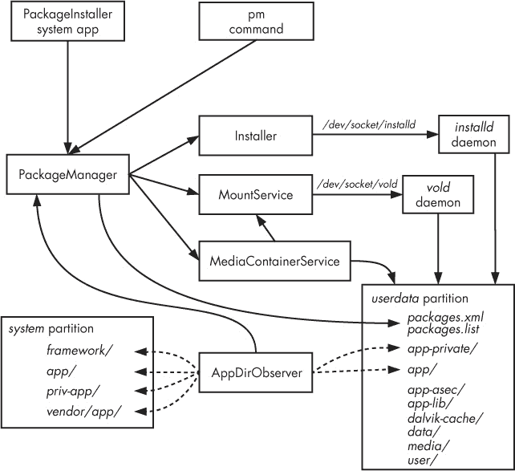
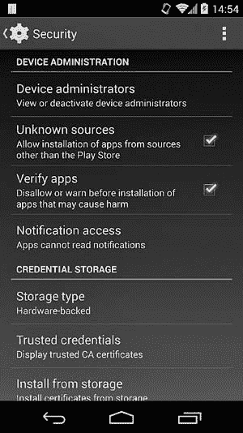
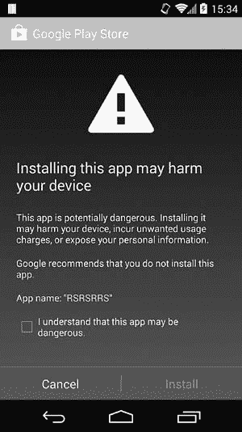

# 第三章：包管理

本章将深入探讨 Android 包管理。我们从 Android 的包格式和代码签名实现的描述开始，然后详细讲解 APK 安装过程。接下来，我们将探讨 Android 对加密 APK 和安全应用容器的支持，这些技术用于实现付费应用的数字版权管理（DRM）。最后，我们将介绍 Android 的包验证机制及其最广泛使用的实现：Google Play 应用验证服务。

# Android 应用程序包格式

Android 应用程序以应用包（APK）文件的形式分发和安装，通常称为*APK 文件*。APK 文件是容器文件，包含应用程序代码和资源，以及应用程序的清单文件。它们还可以包含代码签名。APK 格式是 Java JAR 格式的扩展，^([17])，而 JAR 格式又是流行的 ZIP 文件格式的扩展。APK 文件通常具有 *.apk* 扩展名，并与 *application/vnd.android.package-archive* MIME 类型关联。

由于 APK 文件本质上是 ZIP 文件，你可以通过任何支持 ZIP 格式的压缩工具轻松查看其内容。 示例 3-1 展示了典型 APK 文件解压后的内容。

示例 3-1：典型 APK 文件的内容

```
apk/
|-- AndroidManifest.xml➊
|-- classes.dex➋
|-- resources.arsc➌
|-- assets/➍
|-- lib/➎
|   |-- armeabi/
|   |   `-- libapp.so
|   `-- armeabi-v7a/
|       `-- libapp.so
|-- META-INF/➏
|   |-- CERT.RSA
|   |-- CERT.SF
|   `-- MANIFEST.MF
`-- res/➐
    |-- anim/
    |-- color/
    |-- drawable/
    |-- layout/
    |-- menu/
    |-- raw/
    `-- xml/
```

每个 APK 文件都包含一个 *AndroidManifest.xml* 文件 ➊，该文件声明了应用程序的包名、版本、组件和其他元数据。*classes.dex* 文件 ➋ 包含应用程序的可执行代码，并采用 Dalvik VM 的本地 DEX 格式。*resources.arsc* ➌ 打包了所有应用程序的已编译资源，如字符串和样式。*assets* 目录 ➍ 用于将原始资产文件与应用程序一起捆绑，例如字体或音乐文件。

通过 JNI 利用本地库的应用程序包含一个 *lib* 目录 ➎，其中有每种支持的平台架构的子目录。从 Android 代码直接引用的资源，通常使用 `android.content.res.Resources` 类或通过更高级的 API 间接引用，都存储在 *res* 目录 ➐ 中，每种资源类型（动画、图片、菜单定义等）都有独立的目录。像 JAR 文件一样，APK 文件还包含一个 *META-INF* 目录 ➏，该目录包含包清单文件和代码签名。我们将在下一节中描述该目录的内容。

# 代码签名

正如我们在第二章中了解到的，Android 使用 APK 代码签名，特别是 APK 签名证书，来控制哪些应用程序可以获得*签名*保护级别的权限。APK 签名证书还用于在应用程序安装过程中进行各种检查，因此，在详细了解 APK 安装之前，我们应该更加熟悉 Android 中的代码签名。本节提供了有关 Java 代码签名的一些细节，并突出显示了与 Android 实现的区别。

让我们从一些关于代码签名的一般性话题开始。为什么有人会想要签名代码？出于通常的原因：完整性和真实性。在执行任何第三方程序之前，你希望确保它没有被篡改（完整性），并且它确实是由声称创建它的实体生成的（真实性）。这些特性通常通过数字签名方案来实现，该方案保证只有拥有签名密钥的实体才能生成有效的代码签名。

签名验证过程既验证了代码是否未被篡改，也验证了签名是否是使用预期的密钥生成的。但代码签名无法直接解决的一个问题是代码签署者（软件发布者）是否值得信任。建立信任的通常方法是要求代码签署者持有数字证书，并将其附加到签名代码中。验证者根据信任模型（如 PKI 或信任网络）或逐案判断是否信任该证书。

另一个代码签名甚至没有尝试解决的问题是，签名代码是否安全运行。正如 Flame^([18])和其他签名恶意软件所示，甚至看似由可信第三方签名的代码也可能不安全。

## Java 代码签名

Java 代码签名在 JAR 文件级别进行。它重用并扩展 JAR 清单文件，以便在 JAR 归档文件中添加代码签名。主要的 JAR 清单文件（*MANIFEST.MF*）包含归档中每个文件的文件名和摘要值。例如，示例 3-2 展示了一个典型 APK 文件的 JAR 清单文件的开头。（在本节的所有示例中，我们将使用 APK 而不是常规 JAR。）

示例 3-2. JAR 清单文件摘录

```
Manifest-Version: 1.0
Created-By: 1.0 (Android)

Name: res/drawable-xhdpi/ic_launcher.png
SHA1-Digest: K/0Rd/lt0qSlgDD/9DY7aCNlBvU=
Name: res/menu/main.xml
SHA1-Digest: kG8WDil9ur0f+F2AxgcSSKDhjn0=

Name: ...
```

### 实现

Java 代码签名是通过添加另一个清单文件称为 *签名文件*（扩展名为 *.SF*）来实现的，该文件包含待签名数据，并对其进行数字签名。数字签名称为 *签名块文件*，并作为二进制文件存储在存档中，文件扩展名为 *.RSA*、*.DSA* 或 *.EC*，具体取决于使用的签名算法。如 示例 3-3 所示，签名文件与清单文件非常相似。

示例 3-3. JAR 签名文件摘录

```
Signature-Version: 1.0
SHA1-Digest-Manifest-Main-Attributes: ZKXxNW/3Rg7JA1r0+RlbJIP6IMA=
Created-By: 1.7.0_51 (Sun Microsystems Inc.)
SHA1-Digest-Manifest: zb0XjEhVBxE0z2ZC+B4OW25WBxo=➊

Name: res/drawable-xhdpi/ic_launcher.png
SHA1-Digest: jTeE2Y5L3uBdQ2g40PB2n72L3dE=➋

Name: res/menu/main.xml
SHA1-Digest: kSQDLtTE07cLhTH/cY54UjbbNBo=➌

Name: ...
```

签名文件包含整个清单文件的摘要（*SHA1-Digest-Manifest* ➊），以及 *MANIFEST.MF* 中每个条目的摘要（➋ 和 ➌）。SHA-1 是默认的摘要算法，直到 Java 6 为止，但 Java 7 及更高版本可以使用 SHA-256 和 SHA-512 哈希算法生成文件和清单摘要，在这种情况下，摘要属性分别变为 *SHA-256-Digest* 和 *SHA-512-Digest*。自版本 4.3 起，Android 支持 SHA-256 和 SHA-512 摘要。

签名文件中的摘要可以通过使用以下 OpenSSL 命令轻松验证，如 示例 3-4 所示。

示例 3-4. 使用 OpenSSL 验证 JAR 签名文件摘要

```
$ **openssl sha1 -binary MANIFEST.MF |openssl base64**➊
zb0XjEhVBxE0z2ZC+B4OW25WBxo=
$ **echo -en "Name: res/drawable-xhdpi/ic_launcher.png\r\nSHA1-Digest: \**
**K/0Rd/lt0qSlgDD/9DY7aCNlBvU=\r\n\r\n"|openssl sha1 -binary |openssl base64**➋
jTeE2Y5L3uBdQ2g40PB2n72L3dE=
```

第一个命令 ➊ 获取整个清单文件的 SHA-1 摘要，并将其编码为 Base64，从而生成 *SHA1-Digest-Manifest* 值。第二个命令 ➋ 模拟了计算单个清单条目的摘要的方式。它还展示了 JAR 规范要求的属性标准化格式。

实际的数字签名采用二进制 PKCS#7^([19])（或更一般来说，CMS^([20])) 格式，并包含签名值和签名证书。使用 RSA 算法生成的签名块文件保存为 *.RSA* 扩展名，而使用 DSA 或 EC 密钥生成的签名块文件则保存为 *.DSA* 或 *.EC* 扩展名。还可以执行多个签名操作，从而在 JAR 文件的 *META-INF* 目录中生成多个 *.SF* 和 *.RSA/DSA/EC* 文件。

CMS 格式相当复杂，允许进行签名 *和* 加密，两者使用不同的算法和参数。它还可以通过自定义的签名或非签名属性进行扩展。深入讨论超出了本章的范围（有关 CMS 的详细信息，请参见 RFC 5652），但在 JAR 签名中使用的 CMS 结构基本上包含摘要算法、签名证书和签名值。CMS 规范允许在 `SignedData` CMS 结构中包含签名数据（这种格式变体称为 *附加签名*），但 JAR 签名并不包括它。当签名数据不包含在 CMS 结构中时，签名称为 *分离签名*，验证者需要拥有原始签名数据的副本才能进行验证。示例 3-5 显示了一个解析为 *ASN.1* 的 RSA 签名块文件，证书细节被裁剪：

示例 3-5. JAR 文件签名块内容

```
$ **openssl asn1parse -i -inform DER -in CERT.RSA**
    0:d=0  hl=4 l= 888 cons: SEQUENCE
    4:d=1  hl=2 l=   9 prim:  OBJECT            :pkcs7-signedData➊
   15:d=1  hl=4 l= 873 cons:  cont [ 0 ]
   19:d=2  hl=4 l= 869 cons:   SEQUENCE
   23:d=3  hl=2 l=   1 prim:    INTEGER           :01➋
   26:d=3  hl=2 l=  11 cons:    SET
   28:d=4  hl=2 l=   9 cons:     SEQUENCE
   30:d=5  hl=2 l=   5 prim:      OBJECT            :sha1➌
   37:d=5  hl=2 l=   0 prim:      NULL
   39:d=3  hl=2 l=  11 cons:    SEQUENCE
   41:d=4  hl=2 l=   9 prim:     OBJECT            :pkcs7-data➍
   52:d=3  hl=4 l= 607 cons:    cont [ 0 ]➎
   56:d=4  hl=4 l= 603 cons:     SEQUENCE
   60:d=5  hl=4 l= 452 cons:      SEQUENCE
   64:d=6  hl=2 l=   3 cons:       cont [ 0 ]
   66:d=7  hl=2 l=   1 prim:        INTEGER           :02
   69:d=6  hl=2 l=   1 prim:       INTEGER           :04
   72:d=6  hl=2 l=  13 cons:       SEQUENCE
   74:d=7  hl=2 l=   9 prim:        OBJECT            :sha1WithRSAEncryption
   85:d=7  hl=2 l=   0 prim:        NULL
   87:d=6  hl=2 l=  56 cons:       SEQUENCE
   89:d=7  hl=2 l=  11 cons:       SET
   91:d=8  hl=2 l=   9 cons:        SEQUENCE
   93:d=9  hl=2 l=   3 prim:         OBJECT            :countryName
   98:d=9  hl=2 l=   2 prim:         PRINTABLESTRING   :JP
  --*snip*--
  735:d=5  hl=2 l=   9 cons:     SEQUENCE
  737:d=6  hl=2 l=   5 prim:      OBJECT            :sha1➏
  744:d=6  hl=2 l=   0 prim:      NULL
  746:d=5  hl=2 l=  13 cons:     SEQUENCE
  748:d=6  hl=2 l=   9 prim:      OBJECT            :rsaEncryption➐
  759:d=6  hl=2 l=   0 prim:      NULL
  761:d=5  hl=3 l= 128 prim:    OCTET STRING       [HEX DUMP]:892744D30DCEDF74933007...➑
```

签名块包含一个对象标识符 ➊，描述了后续数据的类型（ASN.1 对象）：`SignedData`，以及数据本身。包含的 `SignedData` 对象包含一个版本 ➋（1）；使用的哈希算法标识符集 ➌（单个签名者时仅一个，这个例子中是 SHA-1）；被签署的数据类型 ➍（*pkcs7-data*，即“任意二进制数据”）；签名证书集 ➎；以及一个或多个（每个签名者一个）`SignerInfo` 结构，封装签名值（在示例 3-5 中未完全显示）。`SignerInfo` 包含一个版本；一个 `SignerIdentifier` 对象，通常包含证书颁发者的 DN 和证书序列号（未显示）；使用的摘要算法 ➏（SHA-1，包含于 ➌）；用于生成签名值的摘要加密算法 ➐；以及加密的摘要（签名值）本身 ➑。

与 JAR 和 APK 签名相关的 `SignedData` 结构中最重要的元素是签名证书集 ➎ 和签名值 ➑（当由多个签名者签署时为多个值）。

如果我们提取 JAR 文件的内容，可以使用 OpenSSL 的 `smime` 命令通过指定签名文件作为内容或签名数据来验证其签名。`smime` 命令将打印签名数据和验证结果，如示例 3-6 所示：

示例 3-6. 验证 JAR 文件签名块

```
$ **openssl smime -verify -in CERT.RSA -inform DER -content CERT.SF signing-cert.pem**
Signature-Version: 1.0
SHA1-Digest-Manifest-Main-Attributes: ZKXxNW/3Rg7JA1r0+RlbJIP6IMA=
Created-By: 1.7.0_51 (Sun Microsystems Inc.)
SHA1-Digest-Manifest: zb0XjEhVBxE0z2ZC+B4OW25WBxo=

Name: res/drawable-xhdpi/ic_launcher.png
SHA1-Digest: jTeE2Y5L3uBdQ2g40PB2n72L3dE=

--*snip*--
Verification successful
```

### JAR 文件签名

JDK 官方提供的 JAR 签名和验证工具是 `jarsigner` 和 `keytool` 命令。自 Java 5.0 起，`jarsigner` 还支持通过时间戳授权机构 (TSA) 对签名进行时间戳处理，这在需要确认签名是在签名证书过期之前还是之后生成时非常有用。然而，这一功能并未被广泛使用，且在 Android 上不支持。

使用 `jarsigner` 命令通过指定密钥库文件（参见 第五章）和用于签名的密钥别名（别名的前八个字符将成为签名块文件的基础名称，除非指定了 `-sigfile` 选项）以及可选的签名算法来对 JAR 文件进行签名。参见 示例 3-7 ➊ 中的 `jarsigner` 命令调用示例。

### 注意

*自 Java 7 起，默认算法已更改为* SHA256withRSA，*因此如果你希望使用 SHA-1 以保持向后兼容性，需显式指定。自 Android 4.3 起，已支持基于 SHA-256 和 SHA-512 的签名。*

示例 3-7. 使用 `jarsigner` 命令对 APK 文件进行签名并验证签名

```
$ **jarsigner -keystore debug.keystore -sigalg SHA1withRSA test.apk androiddebugkey**➊
$ **jarsigner -keystore debug.keystore -verify -verbose -certs test.apk**➋
--*snip*--

smk      965 Sat Mar 08 23:55:34 JST 2014 res/drawable-xxhdpi/ic_launcher.png

      X.509, CN=Android Debug, O=Android, C=US (androiddebugkey)➌
      [certificate is valid from 6/18/11 7:31 PM to 6/10/41 7:31 PM]

smk   458072 Sun Mar 09 01:16:18 JST 2013 classes.dex

      X.509, CN=Android Debug, O=Android, C=US (androiddebugkey)➍
      [certificate is valid from 6/18/11 7:31 PM to 6/10/41 7:31 PM]

         903 Sun Mar 09 01:16:18 JST 2014 META-INF/MANIFEST.MF
         956 Sun Mar 09 01:16:18 JST 2014 META-INF/CERT.SF
         776 Sun Mar 09 01:16:18 JST 2014 META-INF/CERT.RSA

  s = signature was verified
  m = entry is listed in manifest
  k = at least one certificate was found in keystore
  i = at least one certificate was found in identity scope

jar verified.
```

`jarsigner` 工具可以使用平台支持的所有密钥库类型，以及那些不原生支持且需要专用 JCA 提供程序的密钥库，如由智能卡、HSM 或其他硬件设备支持的密钥库。用于签名的密钥库类型通过 `-storetype` 选项指定，提供程序名称和类通过 `-providerName` 和 `-providerClass` 选项指定。更新版本的 Android 专用 `signapk` 工具（详见 “Android 代码签名工具”）也支持 `-providerClass` 选项。

### JAR 文件验证

JAR 文件验证是通过使用 `jarsigner` 命令并指定 `-verify` 选项来执行的。在 示例 3-7 中的第二个 `jarsigner` 命令 ➋ 首先验证签名块和签名证书，确保签名文件未被篡改。接下来，它验证签名文件 (*CERT.SF*) 中的每个摘要是否与清单文件 (*MANIFEST.MF*) 中的相应部分匹配。（签名文件中的条目数量不必与清单文件中的条目数量匹配。文件可以被添加到已签名的 JAR 文件中，而不影响其签名：只要没有任何原始文件被更改，验证就会成功。）

最后，`jarsigner` 读取每个清单条目并检查文件摘要是否与实际文件内容匹配。如果通过 `-keystore` 选项指定了密钥库（如我们示例中所示），`jarsigner` 还会检查签名证书是否存在于指定的密钥库中。从 Java 7 开始，新增了 `-strict` 选项，用于启用额外的证书验证，包括时间有效性检查和证书链验证。验证错误会被视为警告，并反映在 `jarsigner` 命令的退出代码中。

### 查看或提取签名者信息

如 示例 3-7 中所见，默认情况下，`jarsigner` 会打印每个条目的证书详情（➌ 和 ➍），尽管它们对于所有条目都是相同的。在使用 Java 7 时，查看签名者信息的稍好方法是指定 `-verbose:summary` 或 `-verbose:grouped` 选项，或者使用 `keytool` 命令，如 示例 3-8 所示。

示例 3-8. 使用 `keytool` 命令查看 APK 签名者信息

```
$ **keytool -list -printcert -jarfile test.apk**
Signer #1:
Signature:
Owner: CN=Android Debug, O=Android, C=US
Issuer: CN=Android Debug, O=Android, C=US
Serial number: 4dfc7e9a
Valid from: Sat Jun 18 19:31:54 JST 2011 until: Mon Jun 10 19:31:54 JST 2041
Certificate fingerprints:
         MD5: E8:93:6E:43:99:61:C8:37:E1:30:36:14:CF:71:C2:32
         SHA1: 08:53:74:41:50:26:07:E7:8F:A5:5F:56:4B:11:62:52:06:54:83:BE
         Signature algorithm name: SHA1withRSA
         Version: 3
```

一旦你找到签名块文件名（例如通过列出归档内容），你可以使用 OpenSSL 配合 `unzip` 命令轻松地将签名证书提取到文件中，如 示例 3-9 所示。（如果 `SignedData` 结构包含多个证书，所有证书将被提取。在这种情况下，你需要解析 `SignedInfo` 结构来找到实际签名证书的标识符。）

示例 3-9. 使用 `unzip` 和 OpenSSL `pkcs7` 命令提取 APK 签名证书

```
$ **unzip -q -c test.apk META-INF/CERT.RSA|openssl pkcs7 -inform DER -print_certs -out cert.pem**
```

## Android 代码签名

因为 Android 代码签名是基于 Java JAR 签名的，它像许多代码签名方案一样使用公钥加密和 X.509 证书，但这也是相似之处的终结。

在几乎所有其他使用代码签名的平台上（例如 Java ME 和 Windows Phone），代码签名证书必须由平台信任的 CA 颁发。虽然有许多 CA 颁发代码签名证书，但要获得一个被所有目标设备信任的证书可能会相当困难。Android 很简单地解决了这个问题：它不关心签名证书的内容或签署者。因此，你不需要让证书由 CA 颁发，几乎所有用于 Android 的代码签名证书都是自签名的。此外，你也不需要以任何方式声明你的身份：你几乎可以使用任何东西作为主体名称。（Google Play 商店确实会进行一些检查，以排除一些常见的名称，但 Android 操作系统本身并不会。）Android 将签名证书视为二进制大对象，它们是 X.509 格式仅仅是因为使用了 JAR 格式。

Android 并不会按照 PKI 的方式验证证书（参见 第六章）。事实上，如果证书不是自签名的，那么签名证书颁发机构（CA）的证书不需要存在或被信任；Android 甚至会乐意安装带有过期签名证书的应用。如果你来自传统的 PKI 背景，可能会觉得这听起来像是异端邪说，但请记住，Android 并不使用 PKI 进行代码签名，它只是使用相同的证书和签名格式。

Android 与“标准”JAR 签名的另一个区别是，所有 APK 条目必须由同一组证书签名。JAR 文件格式允许每个文件由不同的签署者签名，并允许未签名的条目。这在 Java 沙箱和访问控制机制中是有意义的，因为该模型最初是为小程序设计的，它定义了 *代码来源* 为签名证书和代码来源 URL 的组合。然而，Android 为每个 APK 分配签署者（通常只有一个，但也支持多个签署者），并不允许为不同的 APK 文件条目使用不同的签署者。

Android 的代码签名模型，加上 `java.util.jar.JarFile` 类的糟糕接口，这个类并不是一个很好地抽象底层 CMS 签名格式复杂性的工具，使得正确验证 APK 文件的签名变得相当困难。虽然 Android 通过在其包解析例程中增加额外的签名证书检查，成功地验证了 APK 的完整性并确保所有 APK 文件条目都是由同一组证书签名的，但显然 JAR 文件格式并不是 Android 代码签名的最佳选择。

### Android 代码签名工具

正如“Java 代码签名”部分中的示例所示，你可以使用常规的 JDK 代码签名工具来签名或验证 APK。除了这些工具之外，AOSP 的*build/*目录还包含一个名为`signapk`的 Android 特定工具。这个工具在签名模式下与`jarsigner`执行几乎相同的任务，但有一些显著的不同之处。首先，`jarsigner`要求密钥存储在兼容的密钥库文件中，而`signapk`则接受一个独立的签名密钥（以 DER 编码的*PKCS#8*格式^([22]))和证书文件（以 DER 编码的 X.509 格式）作为输入。PKCS#8 格式的优势是，它包括一个明确的算法标识符，描述了编码私钥的类型。编码后的私钥可能包含密钥材料，可能是加密的，或者它可能仅包含一个引用，例如密钥 ID，指向存储在硬件设备中的密钥。

从 Android 4.4 开始，`signapk`只能生成使用*SHA1withRSA*或*SHA256withRSA*（在 Android 4.3 中新增）的签名机制。到目前为止，AOSP 主分支中的`signapk`版本已扩展为支持 ECDSA 签名。

虽然 PKCS#8 格式的原始私钥比较难获得，但你可以通过使用*development/tools/*目录中的`make_key`脚本轻松生成一个测试密钥对和一个自签名证书。如果你已经有现成的 OpenSSL 密钥，你需要先将它们转换为 PKCS#8 格式，可以使用像 OpenSSL 的`pkcs8`命令，如示例 3-10 所示：

示例 3-10. 将 OpenSSL 密钥转换为 PKCS#8 格式

```
$ **echo "keypwd"|openssl pkcs8 -in mykey.pem -topk8 -outform DER -out mykey.pk8 -passout stdin**
```

一旦你拥有所需的密钥，就可以使用`signapk`签名 APK，如示例 3-11 所示。

示例 3-11. 使用`signapk`工具签名 APK

```
$ **java -jar signapk.jar cert.cer key.pk8 test.apk test-signed.apk**
```

### OTA 文件代码签名

除了默认的 APK 签名模式外，`signapk`工具还有一个“签名整个文件”模式，可以通过`-w`选项启用。在此模式下，除了签名每个单独的 JAR 条目外，该工具还会对整个归档文件生成签名。此模式不被`jarsigner`支持，且是 Android 特有的。

为什么要对整个归档文件进行签名，而每个文件本身已经签名了呢？这是为了支持空中下载（OTA）更新。OTA 包是类似于 JAR 文件格式的 ZIP 文件，包含更新的文件以及应用这些文件的脚本。包内包括一个*META-INF/*目录、清单文件、签名块和一些额外的文件，其中包括*META-INF/com/android/otacert*，该文件包含更新签名证书（PEM 格式）。在启动到恢复模式以应用更新之前，Android 会验证包的签名，然后检查签名证书是否可信来签署更新。OTA 信任的证书与“常规”系统信任存储分开（见第六章），并存储在通常作为*/system/etc/security/otacerts.zip*的 ZIP 文件中。在生产设备上，这个文件通常包含一个单独的文件，通常命名为*releasekey.x509.pem*。设备重启后，恢复操作系统会再次验证 OTA 包的签名，然后再应用它，以确保在此期间 OTA 文件没有被篡改。

如果 OTA 文件类似于 JAR 文件，而 JAR 文件不支持整个文件的签名，那么签名会放在哪里呢？Android 的`signapk`工具稍微滥用 ZIP 格式，通过在 ZIP 注释部分添加一个以 null 结尾的字符串注释，后面跟着二进制签名块和一个 6 字节的最终记录，包含签名偏移量和整个注释部分的大小。将偏移记录添加到文件的末尾，使得通过首先读取并验证文件末尾的签名块来验证包变得容易，只有当签名验证通过时，才会读取文件的其余部分（可能是几百兆字节）。

# APK 安装过程

安装 Android 应用程序有几种方式：

+   通过应用商店客户端（如 Google Play 商店）进行安装。这是大多数用户安装应用的方式。

+   直接在设备上通过打开下载的应用文件进行安装（前提是系统设置中已启用“未知来源”选项）。这种方式通常称为*侧载*应用。

+   从 USB 连接的计算机通过`adb install` Android SDK 命令进行安装，该命令进而调用`pm`命令行工具并使用`install`参数。此方法主要由应用开发者使用。

+   通过使用 Android shell 将 APK 文件直接复制到某个系统应用目录中进行安装。由于生产版本无法访问应用目录，因此此方法只能在运行工程（开发）版本的设备上使用。

当 APK 文件直接复制到其中一个应用程序目录时，包管理器会自动检测到并安装它，因为包管理器会监视这些目录的变化。在所有其他安装方法中，安装应用程序（无论是 Google Play 商店客户端、默认系统包安装活动、`pm` 命令或其他）都会调用系统包管理器的 `installPackage()` 方法之一，后者会将 APK 文件复制到其中一个应用程序目录并进行安装。在接下来的章节中，我们将探索 Android 包安装过程的主要步骤，并讨论一些更复杂的安装步骤，例如加密容器创建和包验证。

Android 的包管理功能分布在多个系统组件中，这些组件在安装包时相互作用，如 图 3-1 所示。图中实线箭头表示组件之间的依赖关系以及函数调用。虚线箭头指向由组件监视以检测更改的文件或目录，但这些文件或目录不会被该组件直接修改。



图 3-1. 包管理组件

## 应用程序包和数据的位置

请回顾 第一章，Android 区分系统安装应用和用户安装应用。系统应用程序位于只读的 *system* 分区（在 图 3-1 的左下角），在生产设备上不能更改或卸载。因此，系统应用被认为是受信任的，享有更多权限，并且某些签名检查被放宽。大多数系统应用程序位于 */system/app/* 目录中，而 */system/priv-app/* 存放有特权应用，这些应用可以通过 *signatureOrSystem* 保护级别授予权限（如 第二章 中所讨论）。*/system/vendor/app/* 目录则用于存放厂商特定的应用程序。用户安装的应用程序位于可读写的 *userdata* 分区（在 图 3-1 的右下角），并且可以随时卸载或替换。大多数用户安装的应用程序安装在 */data/app/* 目录中。

系统和用户安装的应用的数据目录都在 *userdata* 分区的 */data/data/* 目录下创建。*userdata* 分区还存储了用户安装的应用的优化 DEX 文件（在 /*data/dalvik-cache/* 中），系统包数据库（在 */data/system/packages.xml* 中）以及其他系统数据库和设置文件。（当我们讨论 APK 安装过程时，会涉及图 3-1 中显示的其余 *userdata* 分区目录。）

## 活动组件

在确定了 *userdata* 和 *system* 分区的角色后，让我们介绍在包安装过程中起作用的活动组件。

### PackageInstaller 系统应用

这是默认的 APK 文件处理程序。它提供了一个基本的包管理图形界面，当传递一个包含 `VIEW` 或 `INSTALL_ACTION` 意图动作的 APK 文件 URI 时，它会解析该包并显示安装确认界面，显示应用程序所需的权限（参见图 2-1）。只有当用户在设备的安全设置中启用了“未知来源”选项时，才能使用 `PackageInstaller` 应用进行安装（参见图 3-2）。如果未启用“未知来源”，`PackageInstaller` 将显示一个对话框，通知用户已阻止从未知来源安装应用。



图 3-2. 应用安装安全设置

什么被视为“未知来源”？虽然屏幕上的提示定义它为“来自 Play 商店以外来源的应用”，但实际定义要广泛一些。`PackageInstaller` 启动时，会检索请求 APK 安装的应用的 UID 和包名，并检查它是否为特权应用（安装在 */system/priv-app/* 目录下）。如果请求应用没有特权，它将被视为未知来源。如果选择了“未知来源”选项，并且用户确认安装对话框，`PackageInstaller` 会调用 `PackageManagerService`，后者执行实际安装。当升级侧载包或从系统设置的应用屏幕卸载应用时，也会显示 `PackageInstaller` 的图形界面。

### pm 命令

`pm` 命令（在第二章中介绍）提供了一个命令行接口，用于访问系统包管理器的部分功能。当在 Android shell 中分别以 `pm install` 或 `pm uninstall` 调用时，它可以用来安装或卸载包。此外，*Android 调试桥（ADB）* 客户端提供了 `adb install/uninstall` 快捷方式。

与 `PackageInstaller` 不同，`pm install` 不依赖于未知来源系统选项，也不显示 GUI，它提供了各种有用的选项，用于测试包安装，这些选项无法通过 `PackageInstaller` GUI 指定。为了开始安装过程，它调用与 GUI 安装程序相同的 `PackageManager` API。

### PackageManagerService

`PackageManagerService`（在 图 3-1 中的 `PackageManager`）是 Android 包管理基础设施中的核心对象。它负责解析 APK 文件，启动应用安装、升级和卸载包，维护包数据库，并管理权限。

`PackageManagerService` 还提供了多个 `installPackage()` 方法，可以通过不同的选项执行包安装。其中最通用的是 `installPackageWithVerificationAndEncryption()`，该方法允许安装加密的 APK 文件，并通过验证代理进行包验证。（我们将在 “安装加密 APK” 和 “包验证” 中详细讨论应用加密和验证。）

### 注意

*`android.content.pm.PackageManager` Android SDK 外观类向第三方应用程序暴露了 `PackageManagerService` 的一部分功能。*

### Installer 类

虽然 `PackageManagerService` 是 Android 系统服务中权限最高的服务之一，但它仍然运行在系统服务器进程中（具有 *system* UID），并且没有 root 权限。然而，由于创建、删除和更改应用程序目录的所有权需要超级用户权限，因此 `PackageManagerService` 将这些操作委托给 *installd* 守护进程（下文将讨论）。`Installer` 类通过 */dev/socket/installd* Unix 域套接字连接到 *installd* 守护进程，并封装了 *installd* 的命令协议。

### 安装守护进程

*installd* 守护进程是一个具有提升权限的本地守护进程，为系统包管理器提供应用程序和用户目录管理功能（针对多用户设备）。它还用于启动 `dexopt` 命令，为新安装的包生成优化的 DEX 文件。

*installd* 守护进程通过 *installd* 本地套接字进行访问，该套接字仅对以 *system* UID 运行的进程可访问。*installd* 守护进程不以 root 身份执行（尽管在早期的 Android 版本中是这样），而是利用 `CAP_DAC_OVERRIDE` 和 `CAP_CHOWN` Linux 能力^([23]) 来设置它创建的应用程序目录和文件的所有者和组 UID 为拥有应用程序的 UID。

### MountService

`MountService` 负责挂载可拆卸的外部存储设备，如 SD 卡，以及 *不透明二进制大对象（OBB 文件）*，这些文件用作应用程序的扩展文件。它还用于启动设备加密（参见 第十章")）并更改加密密码。

`MountService` 还管理 *安全容器*，这些容器存储不应被非系统应用访问的应用文件。安全容器是加密的，用于实现一种名为 *前向锁定* 的数字版权管理（DRM）形式（详见 “前向锁定” 和 “Android 4.1 前向锁定实现”）。前向锁定主要在安装付费应用时使用，以确保其 APK 文件不能轻易从设备中复制并重新分发。

### vold 守护进程

*vold* 是 Android 的卷管理守护进程。虽然 `MountService` 包含了大多数处理卷管理的系统 API，但由于它作为 *系统* 用户运行，因此缺少实际挂载和卸载磁盘卷所需的权限。这些特权操作由作为 root 用户运行的 *vold* 守护进程来实现。

*vold* 具有一个本地套接字接口，通过 */dev/socket/vold* Unix 域套接字暴露，该接口仅对 root 用户和 *mount* 组成员可访问。由于 *system_server* 进程（托管 `MountService`）的附加 GID 列表中包含 *mount*（GID 1009），`MountService` 被允许访问 *vold* 的命令套接字。除了挂载和卸载卷外，*vold* 还可以创建和格式化文件系统以及管理安全容器。

### MediaContainerService

`MediaContainerService` 将 APK 文件复制到最终安装位置或加密容器中，并允许 `PackageManagerService` 访问可移动存储上的文件。从远程位置（无论是直接获取还是通过应用市场）获取的 APK 文件通过 Android 的 `DownloadManager` 服务下载，下载的文件通过 `DownloadManager` 的内容提供者接口进行访问。`PackageManager` 授予 `MediaContainerService` 进程对每个下载的 APK 文件的临时访问。如果 APK 文件是加密的，`MediaContainerService` 会先解密该文件（详见 “安装带有完整性检查的加密 APK 文件”）。如果请求了加密容器，`MediaContainerService` 会将加密容器的创建委托给 `MountService`，并将 APK 的受保护部分（包括代码和资源）复制到新创建的容器中。不需要保护的文件会直接复制到文件系统中。

### AppDirObserver

`AppDirObserver` 是一个监视应用目录中 APK 文件变化的组件^([24])，并根据事件类型调用相应的 `PackageManagerService` 方法。当一个 APK 文件被添加到系统时，`AppDirObserver` 会启动包扫描，进而安装或更新应用程序。当一个 APK 文件被移除时，`AppDirObserver` 会启动卸载过程，移除应用目录和系统包数据库中的应用条目。

图 3-1 由于空间限制，只显示了一个 `AppDirObserver` 实例，但每个被监视的目录都有一个专用实例。在 *系统* 分区上监视的目录包括 */system/framework/*（存放框架资源包 *framework-res.apk*）；*/system/app/* 和 */system/priv-app/*（系统包）；以及供应商包目录 */system/vendor/app/*。在 *userdata* 分区上监视的目录包括 */data/app/* 和 */data/app-private/*，其中存放“旧版” (Android 4.1 之前) 的前向锁定 APK 文件和 APK 解密过程中产生的临时文件。

## 安装本地包

现在我们已经了解了与包安装相关的 Android 组件，接下来我们将介绍安装过程，从最简单的情况开始：安装一个未经加密的本地包，不进行验证和前向锁定。

### 解析和验证包

打开本地 APK 文件会启动 *application/vnd.android.package-archive* 处理器，通常是来自 `PackageInstaller` 系统应用的 `PackageInstallerActivity`。`PackageInstallerActivity` 首先检查请求安装的应用是否被信任（即，是否被认为来自“未知来源”）。如果不是，并且 `Settings.Global.INSTALL_NON_MARKET_APPS` 为 `false`（当图 3-2 中勾选了“未知来源”复选框时，该值会被设置为 `true`），`PackageInstaller` 会显示警告对话框并终止安装过程。

如果安装被允许，`PackageInstallerActivity` 将解析 APK 文件，并从 *AndroidManifest.xml* 文件和包签名中收集信息。在提取每个条目的签名证书时，APK 文件的完整性会被自动验证，使用的是 `java.util.jar.JarFile` 和相关类。这种实现是必要的，因为 `JarFile` 类的 API 缺乏任何显式的方法来验证整个文件或某个特定条目的签名。（系统应用被隐式信任，只有 *AndroidManifest.xml* 文件的完整性会在解析其 APK 文件时进行验证。而对于非系统镜像的一部分的 APK 包，比如用户安装的应用程序或系统应用的更新，所有的 APK 条目都会被验证。）在解析 APK 文件时，*AndroidManifest.xml* 文件的哈希值也会被计算，并传递给后续的安装步骤，后续步骤使用该哈希值来验证在用户点击安装对话框的“确定”按钮和开始复制 APK 文件之间，APK 文件是否被替换过。

### 注意

*另一个值得注意的细节是，在安装时，APK 文件的完整性是通过使用标准的 Java 库类进行验证的，而在运行时，Dalvik 虚拟机使用自己本地实现的 ZIP/JAR 文件解析器加载 APK 文件。它们实现之间的细微差异已经成为多个 Android 错误的源头，最著名的就是错误 #8219321（通常被称为*Android 主密钥*），它允许已签名的 APK 文件被修改后仍然被视为有效，而不需要重新签名。为了应对这个问题，AOSP 的主分支中添加了一个 `StrictJarFile` 类，它使用与 Dalvik 相同的 ZIP 文件解析实现。`StrictJarFile` 在解析 APK 文件时被系统包管理器使用，确保 Dalvik 和包管理器以相同的方式解析 APK 文件。这一新的统一实现将在未来的 Android 版本中被采纳。*

### 接受权限并启动安装过程

一旦 APK 文件被解析，`PackageInstallerActivity` 会显示关于应用程序及其所需权限的信息，类似于 图 2-1 中显示的对话框。如果用户同意安装，`PackageInstallerActivity` 会将 APK 文件及其清单摘要，连同安装元数据（如推荐来源 URL、安装包名和原始 UID）转发给 `InstallAppProgress` 活动，后者开始实际的包安装过程。然后，`InstallAppProgress` 会将 APK URI 和安装元数据传递给 `PackageManagerService` 的 `installPackageWithVerificationAndEncryption()` 方法，启动安装过程。接着，它会等待该过程完成，并处理任何错误。

安装方法首先验证调用者是否具有 `INSTALL_PACKAGES` 权限，该权限的保护级别为*签名*，并且仅限系统应用使用。在多用户设备上，方法还会验证调用用户是否被允许安装应用程序。接下来，它确定首选的安装位置，是内部存储还是外部存储。

### 复制到应用目录

如果 APK 文件没有加密且不需要验证，下一步是将其复制到应用程序目录（*/data/app/*）。为了复制文件，`PackageManagerService` 首先在应用程序目录中创建一个临时文件（以*vmdl*前缀和*.tmp*扩展名），然后将复制操作委托给 `MediaContainerService`。文件不会直接复制，因为它可能需要解密，或者如果需要进行前向锁定，则会为其创建一个加密容器。由于 `MediaContainerServices` 封装了这些任务，因此 `PackageManagerService` 无需关心底层实现。

当 APK 文件成功复制时，它所包含的任何本地库都会被提取到系统本地库目录下的专用应用程序目录（*/data/app-lib/*）中。接下来，临时的 APK 文件和库目录会被重命名为最终的名称，这些名称基于包名，例如 APK 文件为*com.example.app-1.apk*，库目录为*/data/app-lib/com.example.app-1*。最后，APK 文件的权限被设置为*0644*，并且其 SELinux 上下文也会被设置（参见第十二章）。

### 注意

*默认情况下，APK 文件是全局可读的，任何其他应用程序都可以访问它们。这便于共享公共应用资源，并允许开发第三方启动器和其他需要显示所有已安装包列表的应用程序。然而，这些默认权限也允许任何人从设备中提取 APK 文件，这对于通过应用市场分发的付费应用来说是一个问题。APK 文件的前向锁定提供了一种方式，允许 APK 资源保持公开，同时限制对代码和资源的访问。*

### 包扫描

安装过程中的下一步是通过调用 `PackageManagerService` 的 `scanPackageLI()` 方法来触发包扫描。（如果安装过程在扫描新 APK 文件之前停止，最终会由监视 */data/app/* 目录的 `AppDirObserver` 实例接管，并触发包扫描。）

在新安装的情况下，包管理器首先创建一个新的 `PackageSettings` 结构，该结构包含包名、代码路径、如果包是前向锁定的，则还有单独的资源路径，以及本地库路径。然后，它为新包分配一个 UID，并将其存储在设置结构中。一旦新应用有了 UID，它的数据目录就可以创建了。

### 创建数据目录

因为`PackageManagerService`没有足够的权限来创建并设置应用程序目录的所有权，它将目录创建任务委托给*installd*守护进程，通过向其发送`install`命令，命令参数包括包名、UID、GID 以及*seinfo*标签（由 SELinux 使用）。*installd*守护进程会创建包数据目录（例如，在安装*com.example.app*包时，会创建*/data/data/com.example.app/*目录）、共享本地库目录（*/data/app-lib/com.example.app/*）和本地库目录（*/data/data/com.example.app/lib/*）。然后，它将包目录权限设置为*0751*并为应用程序的本地库（如果有的话）在本地库目录中创建符号链接。最后，它会设置包目录的 SELinux 上下文，并将其所有者更改为分配给该应用程序的 UID 和 GID。

如果系统有多个用户，下一步是通过向*installd*发送`mkuserdata`命令来为每个用户创建数据目录（见第四章）。当所有必要的目录创建完成后，控制返回给`PackageManagerService`，它将任何本地库提取到应用程序的本地库目录，并在*/data/data/com.example.app/lib/*目录中创建符号链接。

### 生成优化后的 DEX

下一步是为应用程序的代码生成优化过的 DEX 文件。此操作也委托给*installd*，通过发送`dexopt`命令来实现。*installd*守护进程会派生一个*dexopt*进程，在*/data/dalivk-cache/*目录中创建优化后的 DEX 文件。（优化过程也被称为“锐化”。）

### 注意

*如果设备使用的是在 4.4 版本中引入的实验性 Android Runtime（ART）而不是生成优化后的 DEX，*installd*会使用`dex2oat`命令生成本地代码。*

### 文件和目录结构

当上述所有过程完成后，应用程序的文件和目录可能会像示例 3-12 所示。（时间戳和文件大小已被省略。）

示例 3-12. 安装应用程序后创建的文件和目录

```
-rw-r--r-- system   system   ... /data/app/com.example.app-1.apk➊
-rwxr-xr-x system   system   ... /data/app-lib/com.example.app-1/libapp.so➋
-rw-r--r-- system   all_a215 ... /data/dalvik-cache/data@app@com.example.app-1.apk@classes.dex➌
drwxr-x--x u0_a215  u0_a215  ... /data/data/com.example.app➍
drwxrwx--x u0_a215  u0_a215  ... /data/data/com.example.app/databases➎
drwxrwx--x u0_a215  u0_a215  ... /data/data/com.example.app/files
lrwxrwxrwx install  install  ... /data/data/com.example.app/lib -> /data/app-lib/com.example.app-1➏
drwxrwx--x u0_a215  u0_a215  ... /data/data/com.example.app/shared_prefs
```

在这里，➊ 是 APK 文件，➋ 是提取的本地库文件。这两个文件都归 *system* 所有，并且是全局可读的。位置为 ➌ 的文件是优化过的 DEX 文件，包含应用程序代码。该文件的所有者设置为 *system*，其所属组设置为特殊的 *all_a215* 组，包含所有安装了该应用的设备用户。这允许所有用户共享相同的优化 DEX 文件，从而避免了为每个用户创建副本的需求，这在多用户设备上可能会占用过多的磁盘空间。应用程序的数据目录 ➍ 及其子目录（例如 *databases/* ➎）由专门的 Linux 用户拥有，该用户由安装应用的设备用户的 ID（*u0*，单用户设备上唯一的用户）与应用 ID（*a215*）组合生成 *u0_a215*。 （根据 Android 的沙箱安全模型，应用数据目录不可被其他用户读取或写入。*lib/* 目录 ➏ 仅是指向应用共享库目录的符号链接，位置为 */data/app-lib/*。）

### 将新包添加到 packages.xml

下一步是将该包添加到系统包数据库中。生成一个新的包条目，如 示例 3-13 所示，并将其添加到 *packages.xml* 中。

示例 3-13. 新安装应用的包数据库条目

```
<package name="com.google.android.apps.chrometophone"
         codePath="/data/app/com.google.android.apps.chrometophone-2.apk"
         nativeLibraryPath="/data/app-lib/com.google.android.apps.chrometophone-2"
         flags="572996"
         ft="142dfa0e588"
         it="142cbeac305"
         ut="142dfa0e8d7"
         version="16"
         userId="10088"
         installer="com.android.vending">➊
    <sigs count="1">
        <cert index="7" key="30820252..." />
    </sigs>➋
    <perms>
        <item name="android.permission.USE_CREDENTIALS" />
        <item name="com.google.android.apps.chrometophone.permission.C2D_MESSAGE" />
        <item name="android.permission.GET_ACCOUNTS" />
        <item name="android.permission.INTERNET" />
        <item name="android.permission.WAKE_LOCK" />
        <item name="com.google.android.c2dm.permission.RECEIVE" />
    </perms>➌
    <signing-keyset identifier="2" />➍
</package>
```

在这里，`<sigs>` ➋ 元素包含包签名证书的 DER 编码值（通常只有一个），以十六进制字符串格式表示，或者在多个应用使用相同密钥和证书签名的情况下，包含证书第一次出现的引用。`<perms>` ➌ 元素包含授予应用程序的权限，具体描述见 第二章。

`<signing-keyset>` ➍ 元素在 Android 4.4 中是新增的，它引用了应用程序的签名密钥集，该密钥集包含所有签署 APK 文件的公钥（但*不*包括证书）。`PackageManagerService` 会收集并存储所有应用的签名密钥，并将其保存在全局的 `<keyset-settings>` 元素中，但从 Android 4.4 开始，签名密钥集不会被检查或使用。

### 包属性

根元素`<package>` ➊（见示例 3-13）包含每个包的核心属性，如安装位置和版本。主要的包属性列在表 3-1 中。每个包条目中的信息可以通过`android.content.pm.PackageManager` SDK 类的`getPackageInfo(String packageName, int flags)`方法获得，该方法应返回一个`PackageInfo`实例，封装了每个*packages.xml*条目中的可用属性，以及应用清单中定义的组件、权限和特性的信息。

表 3-1. 包属性

| 属性名称 | 描述 |
| --- | --- |
| `name` | 包名称。 |
| `codePath` | 包的完整路径位置。 |
| `resourcePath` | 包中公开部分的完整路径（主要资源包和清单）。仅在前锁定的应用上设置。 |
| `nativeLibraryPath` | 存储本地库的目录的完整路径。 |
| `flags` | 与应用相关的标志。 |
| `ft` | APK 文件时间戳（Unix 时间戳，单位为毫秒，按`System.currentTimeMillis()`获取）。 |
| `it` | 应用首次安装的时间（Unix 时间戳，单位为毫秒）。 |
| `ut` | 应用最后一次更新的时间（Unix 时间戳，单位为毫秒）。 |
| `version` | 包的版本号，由应用清单中的`versionCode`属性指定。 |
| `userId` | 分配给应用的内核 UID。 |
| `installer` | 安装该应用的应用程序包名称。 |
| `sharedUserId` | 包的共享用户 ID 名称，由清单中的`sharedUserId`属性指定。 |

### 更新组件和权限

在创建了*packages.xml*条目后，`PackageManagerService`会扫描新应用程序清单中定义的所有 Android 组件，并将它们添加到其内部的内存组件注册表中。接下来，应用声明的任何权限组和权限也会被扫描并添加到权限注册表中。

### 注意

*应用定义的自定义权限使用“先到先得”策略进行注册：如果应用 A 和 B 都定义了权限 P，并且 A 先安装，则 A 的权限定义会被注册，B 的权限定义会被忽略（因为 P 已被注册）。这是可能的，因为权限名称与定义它的应用包没有任何绑定，因此任何应用都可以定义任何权限。这个“先到先得”策略可能会导致权限保护级别降级：如果 A 的权限定义具有较低的保护级别（例如，*normal*），而 B 的定义具有较高的保护级别（例如，*signature*），并且 A 先安装，那么访问 B 的受 P 保护的组件时，不需要调用者使用与 B 相同的签名密钥。因此，在使用自定义权限保护组件时，请确保检查当前注册的权限是否具有您的应用所期望的保护级别。*^([25])

最后，包数据库的更改（包条目和任何新的权限）被保存到磁盘，并且`PackageManagerService`发送`ACTION_PACKAGE_ADDED`通知其他组件有关新添加的应用。

## 更新包

更新包的过程与安装包的过程大致相同，因此我们这里只强调其差异。

### 签名验证

第一步是检查新包是否由与现有包相同的签名者签名。这个规则被称为*同源策略*，或*首次使用信任（TOFU）*。此签名检查保证更新由与原始应用相同的实体生成（假设签名密钥未被泄露），并在更新和现有应用之间建立信任关系。正如我们将在“更新非系统应用”中看到的那样，更新继承了原始应用的数据。

### 注意

*当比较签名证书的相等性时，这些证书并未在公钥基础设施（PKI）意义上进行验证（例如时间有效性、受信任的发行者、撤销等不会被检查）。*

证书相等性检查是通过`PackageManagerService.compareSignatrues()`方法执行的，如示例 3-14 所示。

示例 3-14. 包签名比较方法

```
static int compareSignatures(Signature[] s1, Signature[] s2) {
    if (s1 == null) {
        return s2 == null
            ? PackageManager.SIGNATURE_NEITHER_SIGNED
            : PackageManager.SIGNATURE_FIRST_NOT_SIGNED;
    }
    if (s2 == null) {
        return PackageManager.SIGNATURE_SECOND_NOT_SIGNED;
    }
    HashSet<Signature> set1 = new HashSet<Signature>();
    for (Signature sig : s1) {
        set1.add(sig);
    }
    HashSet<Signature> set2 = new HashSet<Signature>();
    for (Signature sig : s2) {
        set2.add(sig);
    }
    // Make sure s2 contains all signatures in s1.
    if (set1.equals(set2)) {➊
        return PackageManager.SIGNATURE_MATCH;
    }
    return PackageManager.SIGNATURE_NO_MATCH;
}
```

在这里，`Signature`类作为“与应用包相关联的签名的封闭、不变表示”。^([26]) 实际上，它是一个包装器，用于表示与 APK 文件相关联的 DER 编码签名证书。示例 3-15 显示了一个摘录，重点介绍了它的`equals()`和`hashCode()`方法。

示例 3-15. 包签名表示

```
public class Signature implements Parcelable {
    private final byte[] mSignature;
    private int mHashCode;
    private boolean mHaveHashCode;
    --*snip*--
    public Signature(byte[] signature) {
        mSignature = signature.clone();
    }

    public PublicKey getPublicKey() throws CertificateException {
        final CertificateFactory certFactory =
                CertificateFactory.getInstance("X.509");
        final ByteArrayInputStream bais = new ByteArrayInputStream(mSignature);
        final Certificate cert = certFactory.generateCertificate(bais);
        return cert.getPublicKey();
    }

    @Override
    public boolean equals(Object obj) {
        try {
            if (obj != null) {
                Signature other = (Signature)obj;
                return this == other
                    || Arrays.equals(mSignature, other.mSignature);➊
            }
        } catch (ClassCastException e) {
        }
        return false;
    }

    @Override
    public int hashCode() {
        if (mHaveHashCode) {
            return mHashCode;
        }
        mHashCode = Arrays.hashCode(mSignature);➋
        mHaveHashCode = true;
        return mHashCode;
    }
--*snip*--
}
```

如你在➊处所见，两个签名类被认为是相等的，如果底层 X.509 证书的 DER 编码完全匹配，并且 `Signature` 类的哈希值仅根据编码后的证书计算➋。如果签名证书不匹配，`compareSignatures()` 方法将返回 `INSTALL_PARSE_FAILED_INCONSISTENT_CERTIFICATES` 错误代码。

这种二进制证书比较自然与 CA 或过期日期无关。其一个后果是，在一个应用（通过唯一的包名标识）安装后，更新需要使用相同的签名证书（系统应用更新除外，详见“更新系统应用”）。

虽然 Android 应用上的多个签名是罕见的，但它们确实存在。如果原始应用由多个签名者签名，则任何更新都需要由相同的签名者签名，并且每个签名者都使用其原始签名证书（通过➊在示例 3-14 中强制执行）。这意味着如果开发者的签名证书过期或他失去对签名密钥的访问权限，他将无法更新应用，必须发布一个新的应用。这样不仅会失去现有的用户群或评分，更重要的是失去对旧版应用数据和设置的访问权限。

解决这个问题的方法很直接，虽然不是最理想的：备份你的签名密钥，并且不要让证书过期。目前推荐的有效期至少为 25 年，且 Google Play 商店要求证书有效期至少到 2033 年 10 月。虽然从技术上讲，这只是将问题推迟，但将来可能会在平台上加入适当的证书迁移支持。

当包管理器确定更新使用相同的证书签名时，它会继续更新包。这个过程对于系统应用和用户安装的应用有所不同，接下来会描述。

### 更新非系统应用

非系统应用通过基本重新安装应用的方式进行更新，同时保留其数据目录。第一步是终止正在更新的包的任何进程。接下来，从内部结构和包数据库中移除该包，这也会删除该应用注册的所有组件。然后，`PackageManagerService` 通过调用 `scanPackageLI()` 方法触发包扫描。扫描过程与新安装时相同，只是它会更新包的代码、资源路径、版本和时间戳。包的清单文件会被扫描，任何定义的组件都会在系统中注册。接着，所有包的权限会被重新授予，以确保它们与更新后的包中的定义匹配。最后，更新后的包数据库会被写入磁盘，并发送 `PACKAGE_REPLACED` 系统广播。

### 更新系统应用

与用户安装的应用程序一样，预安装的应用程序（通常位于*/system/app/*）也可以在不进行完整系统更新的情况下更新，通常是通过 Google Play 商店或类似的应用分发服务。尽管由于*系统*分区是以只读方式挂载的，更新会安装在*/data/app/*中，而原始应用保持不变。除了`<package>`条目，更新后的应用还会有一个`<updated-package>`条目，可能类似于示例 3-16 中的例子。

示例 3-16 更新的系统包的包数据库条目

```
<package name="com.google.android.keep"
         codePath="/data/app/com.google.android.keep-1.apk"➊
         nativeLibraryPath="/data/app-lib/com.google.android.keep-1"
         flags="4767461"➋
         ft="142ee64d980"
         it="14206f3e320"
         ut="142ee64dfcb"
         version="2101"
         userId="10053"➌
         installer="com.android.vending">
    <sigs count="1">
        <cert index="2" />
    </sigs>
    <signing-keyset identifier="3" />
    <signing-keyset identifier="34" />
</package>
--*snip*--
<updated-package name="com.google.android.keep"
                 codePath="/system/app/Keep.apk"
                 nativeLibraryPath="/data/app-lib/Keep"
                 ft="ddc8dee8"
                 it="14206f3e320"
                 ut="ddc8dee8"
                 version="2051"
                 userId="10053">➍
    <perms>
        <item name="android.permission.READ_EXTERNAL_STORAGE" />
        <item name="android.permission.USE_CREDENTIALS" />
        <item name="android.permission.WRITE_EXTERNAL_STORAGE" />
        --*snip*--
    </perms>
</updated-package>
```

更新的`codePath`属性设置为新 APK 在*/data/app/*中的路径➊。它继承了原始应用的权限和 UID（➌和➍），并通过在其`flags`属性中添加`FLAG_UPDATED_SYSTEM_APP`（0x80）来标记为系统应用的更新➋。

系统应用可以直接在*系统*分区中更新，通常是通过 OTA 系统更新进行的，在这种情况下，更新后的系统 APK 允许使用不同的证书签名。这样做的理由是，如果安装程序有足够的权限写入*系统*分区，那么它就可以信任修改签名证书。UID 以及任何文件和权限都将被保留。例外情况是，如果该包属于共享用户（在第二章中讨论），则无法更新签名，因为这样做会影响其他应用程序。相反的情况是，当新的系统应用程序由与当前已安装的非系统应用程序（具有相同包名）不同的证书签名时，非系统应用程序将首先被删除。

## 安装加密的 APK

在 Android 4.1 中，增加了对安装加密 APK 的支持，并支持使用 ASEC 容器进行前向锁定。这两个功能都被宣布为*应用加密*，但我们将分别讨论它们，首先从对加密 APK 文件的支持开始。但首先，让我们看看如何安装加密的 APK。

可以使用 Google Play 商店客户端或 Android shell 中的`pm`命令来安装加密的 APK，但系统的`PackageInstaller`不支持加密 APK。由于我们无法控制 Google Play 商店的安装流程，因此为了安装加密的 APK，我们需要使用`pm`命令或编写我们自己的安装程序应用。我们将采取简单的方法，使用`pm`命令。

### 创建和安装加密的 APK

`adb install`命令将 APK 文件复制到设备上的临时文件，并启动安装过程。该命令为`adb push`和`pm install`命令提供了一个方便的包装器。`adb install`在 Android 4.1 中新增了三个参数，以支持加密 APK（参见示例 3-17）。

示例 3-17. `adb install` 命令选项

```
adb install [-l] [-r] [-s] [--algo <algorithm name> --key <hex-encoded key>
--iv <hex-encoded iv>] <file>
```

`--algo`、`--key` 和 `--iv` 参数分别用于指定加密算法、密钥和初始化向量（IV）。但是为了使用这些新参数，我们首先需要创建一个加密的 APK 文件。

APK 文件可以使用 `enc` OpenSSL 命令加密，如示例 3-18 所示。这里我们使用 128 位密钥的 AES CBC 模式，并指定一个与密钥相同的 IV，以简化操作。

示例 3-18. 使用 OpenSSL 加密 APK 文件

```
$ **openssl enc -aes-128-cbc -K 000102030405060708090A0B0C0D0E0F**
**-iv 000102030405060708090A0B0C0D0E0F -in my-app.apk -out my-app-enc.apk**
```

接下来，我们通过将加密算法密钥（以 `javax.crypto.Cipher` 转换字符串格式表示，具体内容见第五章）和 IV 字节传递给 `adb install` 命令，安装我们的加密 APK，如示例 3-19 所示。

示例 3-19. 使用 `adb install` 安装加密的 APK

```
$ **adb install --algo 'AES/CBC/PKCS5Padding' \**
**--key 000102030405060708090A0B0C0D0E0F \**
**--iv 000102030405060708090A0B0C0D0E0F my-app-enc.apk**
        pkg: /data/local/tmp/my-app-enc.apk
Success
```

正如 `Success` 输出所示，APK 安装没有错误。实际的 APK 文件被复制到 */data/app/*，并且将其哈希值与加密的 APK 进行比较，结果表明它实际上是一个不同的文件。哈希值与原始（未加密）APK 的哈希值完全相同，因此我们可以得出结论，APK 在安装时使用提供的加密参数（算法、密钥和 IV）被解密。

### 实现与加密参数

让我们看看这是如何实现的。在将 APK 文件传输到设备后，`adb install` 调用 `pm` Android 命令行工具，传递 `install` 参数和已复制 APK 文件的路径。负责在 Android 上安装应用的组件是 `PackageManagerService`，而 `pm` 命令只是其某些功能的便捷前端。当以 `install` 参数启动时，`pm` 调用方法 `installPackageWithVerificationAndEncryption()`，并根据需要将其选项转换为相关参数。示例 3-20 方法签名")展示了该方法的完整签名。

示例 3-20. `PackageManagerService.installPackageWithVerificationAndEncryption()` 方法签名

```
public void installPackageWithVerificationAndEncryption(Uri packageURI,
        IPackageInstallObserver observer, int flags,
        String installerPackageName,
        VerificationParams verificationParams,
        ContainerEncryptionParams encryptionParams) {
--*snip*--
}
```

我们在前面“APK 安装过程”中讨论了该方法的大部分参数，但我们尚未涉及 `VerificationParams` 和 `ContainerEncryptionParams` 类。顾名思义，`VerificationParams` 类封装了在包验证过程中使用的参数，稍后我们会在“包验证”中讨论。`ContainerEncryptionParams` 类包含加密参数，包括通过 `adb install` 的 `--algo`、`--key` 和 `--iv` 选项传递的值。示例 3-21 展示了它的数据成员。

示例 3-21. `ContainerEncryptionParams` 数据成员

```
public class ContainerEncryptionParams implements Parcelable {
    private final String mEncryptionAlgorithm;
    private final IvParameterSpec mEncryptionSpec;
    private final SecretKey mEncryptionKey;
    private final String mMacAlgorithm;
    private final AlgorithmParameterSpec mMacSpec;
    private final SecretKey mMacKey;
    private final byte[] mMacTag;
    private final long mAuthenticatedDataStart;
    private final long mEncryptedDataStart;
    private final long mDataEnd;
    --*snip*--
}
```

上述 `adb install` 参数对应类的前三个字段。虽然 `adb install` 包装器中不可用，但 `pm install` 命令同样支持 `--macalgo`、`--mackey` 和 `--tag` 参数，这些参数分别对应 `ContainerEncryptionParams` 类中的 `mMacAlgorithm`、`mMacKey` 和 `mMacTag` 字段。为了使用这些参数，我们需要先计算加密 APK 的 MAC 值，方法是使用 OpenSSL 的 `dgst` 命令，如在示例 3-22 中所示。

示例 3-22. 计算加密 APK 的 MAC

```
$ **openssl dgst -hmac 'hmac_key_1' -sha1 -hex my-app-enc.apk**
HMAC-SHA1(my-app-enc.apk)= 962ecdb4e99551f6c2cf72f641362d657164f55a
```

### 注意

*`dgst` 命令不允许你使用十六进制或 Base64 来指定 HMAC 密钥，因此我们只能使用 ASCII 字符。这样做可能不适合生产环境，所以建议使用真正的密钥，并以其他方式计算 MAC（例如，使用 JCE 程序）。*

### 安装带有完整性检查的加密 APK

现在，我们可以通过打开 Android shell 使用 `adb shell` 并执行示例 3-23 中所示的命令来安装加密 APK 并验证其完整性。

示例 3-23. 使用`pm install`安装带有完整性验证的加密 APK

```
$ **pm install -r --algo 'AES/CBC/PKCS5Padding' \**
**--key 000102030405060708090A0B0C0D0E0F \**
**--iv 000102030405060708090A0B0C0D0E0F \**
**--macalgo HmacSHA1 --mackey 686d61635f6b65795f31 \**
**--tag 962ecdb4e99551f6c2cf72f641362d657164f55a /sdcard/my-app-enc.apk**
        pkg: /sdcard/kr-enc.apk
Success
```

通过将指定的 MAC 标签与基于实际文件内容计算的值进行比较来检查应用的完整性，文件内容会被解密，解密后的 APK 会被复制到 */data/app/* 目录。（为了测试是否真的执行了 MAC 验证，可以稍微更改标签值。这样做应该会导致安装错误，错误码为 `INSTALL_FAILED_INVALID_APK`。）

正如我们在示例 3-19 和示例 3-23 中看到的那样，最终复制到 */data/app/* 的 APK 文件并未加密，因此安装过程与未加密 APK 相同，唯一不同的是文件解密和可选的完整性验证。解密和完整性验证由 `MediaContainerService` 在将 APK 复制到应用目录时透明地执行。如果将 `ContainerEncryptionParams` 实例传递给其 `copyResource()` 方法，它会使用提供的加密参数实例化 JCA 类 `Cipher` 和 `Mac`（见第五章），以执行解密和完整性检查。

### 注意

*MAC 标签和加密 APK 可以捆绑在一个文件中，在这种情况下，`MediaContainerService` 使用 `mAuthenticatedDataStart`、`mEncryptedDataStart` 和 `mDataEnd` 成员从文件中提取 MAC 和 APK 数据。*

## 前向加锁

前向加锁出现在铃声、壁纸和其他数字“商品”开始在功能手机上销售的时候。由于 Android 上安装的 APK 文件是世界可读的，即使是生产设备，也相对容易提取应用程序。为了在不失去操作系统灵活性的情况下锁定付费应用程序（并防止用户将其转发给其他用户），早期版本的 Android 引入了前向加锁（也称为 *复制保护*）。

前向加锁的理念是将应用包分为两个部分：一个包含资源和清单的世界可读部分（位于 */data/app/*），以及一个仅系统用户可读、包含可执行代码的包（位于 */data/app-private/*）。代码包通过文件系统权限进行保护，使其对大多数消费者设备上的用户不可访问，但可以从具有 root 权限的设备中提取，这种早期的前向加锁机制很快被弃用，并被一种名为 Google Play Licensing 的在线应用授权服务所取代。

Google Play Licensing 的问题在于，它将应用保护的实现从操作系统转移到了应用开发者身上，结果不尽如人意。前向加锁机制在 Android 4.1 中进行了重新设计，现在提供了将 APK 存储在加密容器中的能力，并且需要设备特定的密钥在运行时进行挂载。我们来详细了解一下。

## Android 4.1 前向加锁实现

虽然将加密应用容器作为前向锁定机制是在 Android 4.1 中引入的，但加密容器最早在 Android 2.2 中就已出现。当时（2010 年中期），大多数 Android 设备的内部存储较为有限，而外部存储相对较大（几 GB），通常为 microSD 卡。为了简化文件共享，外部存储使用 FAT 文件系统格式化，但该文件系统不支持文件权限。因此，SD 卡上的文件可以被任何应用读取和写入。

为了防止用户仅通过复制已付费的应用程序到 SD 卡来绕过保护，Android 2.2 创建了一个加密文件系统映像文件，并在用户选择将应用移动到外部存储时将 APK 存储在其中。系统会为该加密映像创建一个挂载点，并使用 Linux 的设备映射器将其挂载。Android 在运行时从挂载点加载每个应用的文件。

Android 4.1 在此基础上进行了扩展，使容器使用 ext4 文件系统，从而支持文件权限。现在，一个典型的前向锁定应用的挂载点如 示例 3-24 所示（省略时间戳）。

示例 3-24. 前向锁定应用挂载点的内容

```
# **ls -l /mnt/asec/com.example.app-1**
drwxr-xr-x system   system             lib
drwx------ root     root               lost+found
-rw-r----- system   u0_a96     1319057 pkg.apk
-rw-r--r-- system   system      526091 res.zip
```

在这里，*res.zip* 包含应用资源和清单文件，并且是世界可读的，而 *pkg.apk* 文件包含完整的 APK，仅可由系统和应用的专用用户（*u0_a96*）读取。实际的应用容器存储在 */data/app-asec/* 目录中，文件扩展名为 *.asec*。

### 加密应用容器

加密应用容器被称为 *Android 安全外部缓存*，或 *ASEC 容器*。ASEC 容器管理（创建、删除、挂载和卸载）由系统卷守护进程（*vold*）实现，而 `MountService` 提供接口，将其功能暴露给框架服务。我们还可以使用 `vdc` 命令行工具与 *vold* 交互，以便通过 Android 的 Shell 管理前向锁定的应用（参见 示例 3-25）。

示例 3-25. 使用 `vdc` 发出 ASEC 管理命令

```
# **vdc asec list**➊
vdc asec list
111 0 com.example.app-1
111 0 org.foo.app-1
200 0 asec operation succeeded

# **vdc asec path com.example.app-1**➋
vdc asec path com.example.app-1
211 0 /mnt/asec/com.example.app-1

# **vdc asec unmount org.example.app-1**➌
200 0 asec operation succeeded

# **vdc asec mount com.example.app-1 000102030405060708090a0b0c0d0e0f 1000**➍
com.example.app-1 000102030405060708090a0b0c0d0e0f 1000
200 0 asec operation succeeded
```

在这里，`asec list` 命令 ➊ 列出了挂载的 ASEC 容器的命名空间 ID。命名空间 ID 基于包名，并且与非前向锁定应用的 APK 文件名格式相同。所有其他命令都以命名空间 ID 作为参数。

`asec path` 命令 ➋ 显示指定 ASEC 容器的挂载点，而 `asec unmount` 命令用于卸载它 ➌。除了命名空间 ID，`asec mount` ➍ 还要求指定加密密钥和挂载点的所有者 UID（1000 是 *系统*）。

ASEC 容器的加密算法和密钥长度与原始 Android 2.2 版本的应用至 SD 实现保持不变：使用 128 位密钥的 Twofish 加密算法，密钥存储在 */data/misc/systemkeys/* 中，如 示例 3-26 所示。

示例 3-26. ASEC 容器加密密钥的位置和内容

```
# **ls -l /data/misc/systemkeys**
-rw------- system   system         16 AppsOnSD.sks
# **od -t x1 /data/misc/systemkeys/AppsOnSD.sks**
0000000 00 01 02 03 04 05 06 07 08 09 0a 0b 0c 0d 0e 0f
0000020
```

向前锁定应用程序是通过指定 `pm install` 的 `-l` 选项，或者在调用 `PackageManager` 的 `installPackage()` 方法时指定 `INSTALL_FORWARD_LOCK` 标志来触发的。

### 安装向前锁定的 APK

向前锁定 APK 的安装过程涉及两个额外的步骤：创建和挂载安全容器，以及从 APK 文件中提取公共资源文件。与加密 APK 相同，这些步骤由 `MediaContainerService` 封装，并在将 APK 复制到应用程序目录时执行。由于 `MediaContainerService` 没有足够的权限来创建和挂载安全容器，它通过调用适当的 `MountService` 方法（如 `createSecureContainer()`、`mountSecureContainer()` 等）将容器管理委托给 *vold* 守护进程。

## 加密应用与 Google Play

由于安装应用程序（无论是否加密）需要系统权限，因此只有系统应用才能安装应用。Google 自家的 Play 商店 Android 客户端利用了加密应用和向前锁定技术。虽然要详细描述 Google Play 客户端的工作原理需要对底层协议有深入了解（该协议并不公开且不断发展），但我们通过简单了解最近版本的 Google Play 商店客户端的实现，仍然可以获得一些有用的信息。

Google Play 服务器会发送很多关于即将下载和安装的应用的元数据，例如下载 URL、APK 文件大小、版本号和退款窗口等。在这些信息中，显示在 示例 3-27 中的 `EncryptionParams` 与在 示例 3-21 中显示的 `ContainerEncryptionParams` 非常相似。

示例 3-27. 在 Google Play 商店协议中使用的 `EncryptionParams`

```
class AndroidAppDelivery$EncryptionParams {
  --*snip*--
  private String encryptionKey;
  private String hmacKey;
  private int version;
}
```

从 Google Play 下载的付费应用的加密算法和 HMAC 算法分别始终设置为 *AES/CBC/PKCS5Padding* 和 *HMACSHA1*。初始化向量（IV）和消息认证码（MAC）标签与加密的 APK 一起打包成一个 blob。读取和验证所有参数后，它们本质上会转换为 `ContainerEncryptionParams` 实例，并使用 `PackageManager.installPackageWithVerification()` 方法安装应用。

当安装付费应用时，`INSTALL_FORWARD_LOCK` 标志会被设置，以启用前向加密。操作系统从这里开始处理，过程如前两节所述：免费应用会被解密，APK 最终会存放在 */data/app/* 目录下，而加密容器会在 */data/app-asec/* 中创建，并挂载到 */mnt/asec/<package-name>* 目录下，用于存放付费应用。

这种做法在实践中有多安全？Google Play 现在可以声称，付费应用始终以加密形式传输和存储，若你决定使用 Android 提供的应用加密功能，自己的应用分发渠道也可以做到这一点。然而，APK 文件的内容在某个时刻必须提供给操作系统，因此，如果你拥有对运行中的 Android 设备的 root 权限，仍然可以提取前向加密的 APK 或容器加密密钥。

# 包验证

包验证作为 Android 4.2 版本中的正式功能引入，最初被称为 *应用验证*，后来被回移植到所有运行 Android 2.3 及更高版本的设备和 Google Play 商店。实现包验证的基础设施已经内置到操作系统中，但 Android 系统本身并未提供内置的验证器。最广泛使用的包验证实现是内置在 Google Play 商店客户端中的，并由 Google 的应用分析基础设施支持。该实现旨在保护 Android 设备免受 Google 所称的“潜在有害应用程序”（如后门程序、钓鱼应用、间谍软件等），通常简称为 *恶意软件*。



图 3-3. 应用验证警告对话框

当启用包验证时，APK 会在安装之前由验证器扫描，如果验证器认为该 APK 可能有害，系统会显示警告（见 图 3-3），或在安装过程中阻止安装。默认情况下，支持的设备会开启验证功能，但首次使用时需要用户一次性授权，因为这会向 Google 发送应用数据。应用验证可以通过系统设置中的“安全性”屏幕中的“验证应用”选项进行切换（见 图 3-2）。

以下章节讨论了 Android 包验证基础设施，并简要回顾了 Google Play 的实现。

## Android 对包验证的支持

与大多数处理应用管理的内容一样，包验证是在`PackageManagerService`中实现的，并自 Android 4.0（API 级别 14）以来可用。包验证由一个或多个*验证代理*执行，并具有一个*必需验证器*和零个或多个*足够验证器*。当必需验证器和至少一个足够验证器返回正面结果时，验证被视为完成。应用可以通过声明一个具有匹配`PACKAGE_NEEDS_VERIFICATION`动作和 APK 文件 MIME 类型（*application/vnd.android.package-archive*）的意图过滤器的广播接收器，注册自己作为必需验证器，如示例 3-28 所示。

示例 3-28. AndroidManifest.xml 中必需验证器的声明

```
<receiver android:name=".MyPackageVerificationReceiver"
          android:permission="android.permission.BIND_PACKAGE_VERIFIER">
    <intent-filter>
        <action
             android:name="android.intent.action.PACKAGE_NEEDS_VERIFICATION" />
        <action android:name="android.intent.action.PACKAGE_VERIFIED" />
        <data android:mimeType="application/vnd.android.package-archive" />
    </intent-filter>
</receiver>
```

此外，声明的应用需要被授予`PACKAGE_VERIFICATION_AGENT`权限。由于这是一个保留给系统应用的签名权限（`signature|system`），只有系统应用才能成为所需的验证代理。

应用可以通过在其清单文件中添加`<package-verifier>`标签，并在标签的属性中列出足够验证器的包名和公钥，来注册足够的验证器，如示例 3-29 所示。

示例 3-29. AndroidManifest.xml 中足够验证器的声明

```
<manifest 
        package="com.example.app">
        <package-verifier android:name="com.example.verifier"
                          android:publicKey="MIIB..." />
    <application ...>
     --*snip*--
    </application>
</manifest>
```

安装包时，当安装了必需验证器且`Settings.Global.PACKAGE_VERIFIER_ENABLE`系统设置为`true`时，`PackageManagerService`会执行验证。通过将 APK 添加到待安装队列并发送`ACTION_PACKAGE_NEEDS_VERIFICATION`广播给已注册的验证器来启用验证。

广播包含一个唯一的验证 ID，以及有关正在验证包的各种元数据。验证代理通过调用`verifyPendingInstall()`方法并传递验证 ID 和验证状态来响应。调用此方法需要`PACKAGE_VERIFICATION_AGENT`权限，这确保了非系统应用无法参与包验证。每次调用`verifyPendingInstall()`时，`PackageManagerService`都会检查是否已收到足够的待安装验证。如果是，它将从队列中移除待安装项，发送`PACKAGE_VERIFIED`广播，并启动包安装过程。如果包被验证代理拒绝，或者在指定时间内未收到足够的验证，安装将失败并返回`INSTALL_FAILED_VERIFICATION_FAILURE`错误。

## Google Play 实现

Google 的应用验证实现集成在 Google Play 商店客户端中。Google Play 商店应用将自己注册为必需的验证代理，如果启用了“验证应用”选项，每次应用即将被安装时，无论是通过 Google Play 商店客户端、`PackgeInstaller` 应用还是通过 `adb install`，都会接收到一个广播。

该实现并非开源，且公开的细节较少，但 Google 的“防范有害应用”Android 帮助页面中指出，“当您验证应用时，Google 会接收日志信息、与应用相关的 URL 以及设备的一般信息，例如设备 ID、操作系统版本和 IP 地址。”^([28]) 从目前的信息来看，除了这些信息外，Play 商店客户端还会发送 APK 文件的 SHA-256 哈希值、文件大小、应用包名、资源的名称及其 SHA-256 哈希值、应用的清单和类文件的 SHA-256 哈希值、版本号和签名证书，以及有关安装应用和推荐 URL 的一些元数据（如果有的话）。基于这些信息，Google 的 APK 分析算法会判断 APK 是否可能有害，并返回一个结果给 Play 商店客户端，其中包含一个状态码和错误信息，以便在 APK 被判定为可能有害时显示。然后，Play 商店客户端会调用 `PackageManagerService` 的 `verifyPendingInstall()` 方法，带上适当的状态码。应用安装是否被接受或拒绝，取决于上一节描述的算法。

在实际操作中（至少在“Google 体验”设备上），Google Play 商店验证器通常是唯一的验证代理，因此包是否被安装或拒绝，完全取决于 Google 在线验证服务的响应。

# 总结

Android 应用程序包（APK 文件）是 JAR 文件格式的扩展，包含资源、代码和清单文件。APK 文件使用 JAR 文件代码签名格式进行签名，但要求所有文件都使用同一组证书进行签名。Android 使用代码签名证书来建立应用及其更新的相同来源，并建立应用之间的信任关系。APK 文件通过将其复制到 */data/app/* 目录并在 */data/data/* 下为每个应用创建一个专用数据目录来安装。

Android 支持加密 APK 文件和安全应用容器，用于前锁定的应用。加密应用在被复制到应用目录之前会自动解密。前锁定的应用被拆分成资源和清单部分，公开可访问，以及私有代码和资源部分，这些部分存储在一个专门的加密容器中，仅操作系统可以直接访问。

Android 可以在安装应用之前选择性地通过咨询一个或多个验证代理来进行验证。目前，最广泛使用的验证代理内置于 Google Play Store 客户端应用中，并使用 Google 的在线应用验证服务来检测潜在有害的应用程序。

* * *

^([17]) Oracle，*JAR 文件规范*，*[`docs.oracle.com/javase/7/docs/technotes/guides/jar/jar.html`](http://docs.oracle.com/javase/7/docs/technotes/guides/jar/jar.html)*

^([18]) 微软公司，*Flame 恶意软件碰撞攻击解释*，*[`blogs.technet.com/b/srd/archive/2012/06/06/more-information-about-the-digital-certificates-used-to-sign-the-flame-malware.aspx`](http://blogs.technet.com/b/srd/archive/2012/06/06/more-information-about-the-digital-certificates-used-to-sign-the-flame-malware.aspx)*

^([19]) EMC RSA 实验室，*PKCS #7：加密消息语法标准*，*[`www.emc.com/emc-plus/rsa-labs/standards-initiatives/pkcs-7-cryptographic-message-syntax-standar.htm`](http://www.emc.com/emc-plus/rsa-labs/standards-initiatives/pkcs-7-cryptographic-message-syntax-standar.htm)*

^([20]) Housley，*RFC 5652 – 加密消息语法（CMS）*，*[`tools.ietf.org/html/rfc5652`](http://tools.ietf.org/html/rfc5652)*

^([21]) *抽象语法表示法一（ASN.1）*是一种标准符号，用于描述在电信和计算机网络中编码数据的规则和结构。它广泛应用于加密标准中，以定义加密对象的结构。

^([22]) EMC RSA 实验室，*PKCS #8：私钥信息语法标准*，*[`www.emc.com/emc-plus/rsa-labs/standards-initiatives/pkcs-8-private-key-information-syntax-stand.htm`](http://www.emc.com/emc-plus/rsa-labs/standards-initiatives/pkcs-8-private-key-information-syntax-stand.htm)*

^([23]) 有关 Linux 能力的讨论，请参见 Michael Kerrisk 的 *The Linux Programming Interface: A Linux and UNIX System Programming Handbook* 第三十九章，No Starch Press，2010 年。

^([24]) 文件监控是通过使用 Linux 的 *inotify* 功能来实现的。有关 *inotify* 的更多细节，请参见 Michael Kerrisk 的 *The Linux Programming Interface: A Linux and UNIX System Programming Handbook* 第十九章，No Starch Press，2010 年。

^([25]) 请参见 CommonsWare，*CWAC-Security*，*[`github.com/commonsguy/cwac-security`](https://github.com/commonsguy/cwac-security)*，以获取进一步讨论和一个示例项目，展示如何执行该检查。

^([26]) Google, *Android API 参考文档*，“签名”，*[`developer.android.com/reference/android/content/pm/Signature.html`](https://developer.android.com/reference/android/content/pm/Signature.html)*

^([27]) Google，*从零开始的安卓安全实务*，在 2013 年 VirusBulletin 会议上展示。资料来源：* [`docs.google.com/presentation/d/1YDYUrD22Xq12nKkhBfwoJBfw2Q-OReMr0BrDfHyfyPw`](https://docs.google.com/presentation/d/1YDYUrD22Xq12nKkhBfwoJBfw2Q-OReMr0BrDfHyfyPw)*

^([28]) Google*，防范有害应用程序*，* [`support.google.com/accounts/answer/2812853`](https://support.google.com/accounts/answer/2812853)*
