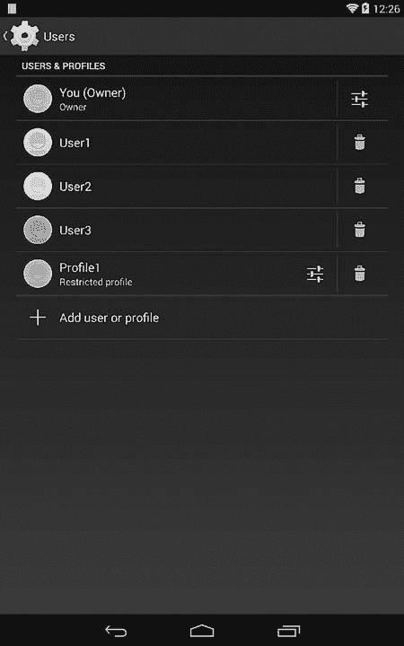
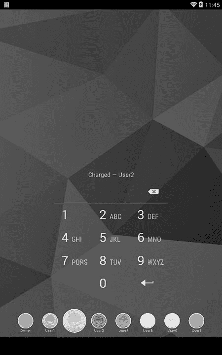
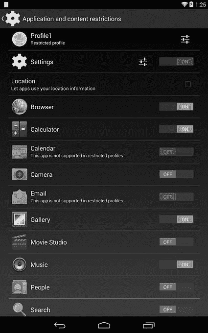
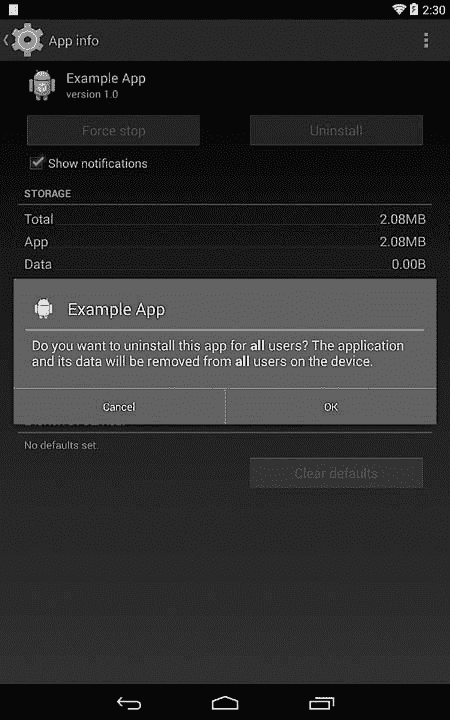

# 第四章 用户管理

Android 最初是面向个人设备（如智能手机）的，假设每个设备只有一个用户。随着平板电脑和其他共享设备的普及，Android 在 4.2 版本中增加了多用户支持，并在后续版本中进行了扩展。

本章将讨论 Android 如何管理共享设备和数据的用户。我们首先介绍 Android 支持的用户类型及其如何存储用户元数据。接着，我们讨论 Android 如何在用户之间共享已安装的应用程序，同时隔离应用程序数据并确保每个用户的数据隐私。最后，我们讲解 Android 如何实现隔离的外部存储。

# 多用户支持概述

Android 的多用户支持允许多个用户共享同一设备，通过为每个用户提供一个独立的、个人化的环境。每个用户可以拥有自己的主屏幕、小部件、应用程序、在线账户和文件，这些内容对其他用户不可访问。

用户通过一个独特的*用户 ID*（不要与 Linux 的 UID 混淆）进行标识，只有系统可以在用户之间切换。用户切换通常通过从 Android 锁屏界面选择一个用户来触发，并（可选地）通过图案、PIN、密码等方式进行身份验证（详见第十章）。应用程序可以通过 `UserManager` API 获取当前用户的信息，但通常不需要修改代码即可支持多用户环境。需要在受限配置文件下修改行为的应用程序是一个例外：这些应用程序需要额外的代码来检查当前用户所施加的任何限制（详见“受限配置文件”了解详情）。

多用户支持内建于 Android 核心平台，因此在所有运行 Android 4.2 或更高版本的设备上均可使用。然而，默认的平台配置只允许单个用户，这实际上禁用了多用户支持。为了启用多用户支持，*config_multiuserMaximumUsers* 系统资源必须设置为大于 1 的值，通常通过添加设备特定的覆盖配置文件来实现。例如，在 Nexus 7（2013）上，覆盖文件放置在 *device/ asus/flo/overlay/frameworks/base/core/res/res/values/config.xml* 文件中，*config_multiuserMaximumUsers* 设置如下所示，在示例 4-1 中定义，允许最多支持 8 个用户。

示例 4-1. 使用资源覆盖文件启用多用户支持

```
<?xml version="1.0" encoding="utf-8"?>
<resources >
    --*snip*--
    <!-- Maximum number of supported users -->
    <integer name="config_multiuserMaximumUsers">8</integer>
    --*snip*--
</resources>
```

### 注意

*Android 兼容性定义要求支持电话功能的设备（如手机）不得启用多用户支持，因为“目前多用户设备上的电话 API 行为未定义。”*^([29]) *因此，在当前的生产版本中，所有手机都被配置为单用户设备。*

当启用多用户支持时，系统设置应用会显示一个“用户”条目，允许设备所有者（下一节中讨论的第一个创建的用户）创建和管理其他用户。图 4-1 显示了用户管理屏幕。



图 4-1. 用户管理屏幕

一旦创建了多个用户，锁屏上会显示一个用户小部件，显示当前用户并允许切换到其他用户。图 4-2 展示了一个包含八个用户的设备上的锁屏界面。



图 4-2. 带有用户切换小部件的锁屏

# 用户类型

尽管 Android 缺乏大多数多用户操作系统的完整用户管理功能，这些操作系统通常允许用户添加多个管理员并定义用户组，但它确实支持配置具有不同权限的用户类型。每种用户类型及其权限将在接下来的章节中详细描述。

## 主要用户（所有者）

*主要用户*，也称为设备的*所有者*，是多用户设备上创建的第一个用户，或者是单用户设备上的唯一用户。所有者默认创建并始终存在。主要用户被分配用户 ID 0。在单用户设备上，主要用户是唯一用户，Android 的行为类似于没有多用户支持的早期版本：已安装应用程序分配的目录和 UID 保持与早期版本相同的格式和权限（详细内容请参见“用户管理”和“应用程序共享”）。

主要用户被分配所有权限，可以创建和删除其他用户，并更改影响所有用户的系统设置，包括与设备安全性、网络连接性和应用程序管理相关的设置。设备和用户管理权限通过在系统设置中显示相关设置界面并将其隐藏于其他用户之外来授予主要用户。此外，底层系统服务在执行可能影响所有用户的操作之前，会检查调用用户的身份，仅当由设备所有者调用时才允许执行。

从 Android 版本 4.4 开始，系统设置中“无线和网络”部分的以下页面仅对主用户显示：

+   蜂窝广播

+   管理移动计划

+   移动网络

+   共享与便携式热点

+   VPN

+   WiMAX（如果设备支持，则显示）

安全部分的以下页面也仅限主用户使用：

+   设备加密

+   SIM 卡锁

+   未知来源（控制应用程序侧载；见第三章）

+   验证应用程序（控制软件包验证；见第三章）

## 次要用户

除限制配置文件（将在下一节中讨论）外，所有添加的用户都是 *次要用户*。每个次要用户都有一个专用的用户目录（见“用户管理”），他们自己的已安装应用程序列表，以及每个已安装应用程序的私人数据目录。

次要用户不能添加或管理用户；他们只能通过用户屏幕设置自己的用户名（见图 4-1）。此外，他们不能执行任何主用户专有的特权操作，如前面部分所列。否则，次要用户可以执行主用户可以执行的所有操作，包括安装和使用应用程序，以及更改系统外观和设置。

尽管次要用户受到限制，他们的行为仍然可能影响设备行为和其他用户。例如，他们可以添加并连接到新的 Wi-Fi 网络。由于 Wi-Fi 连接状态是系统共享的，切换到不同用户并不会重置无线连接，该用户将连接到上一个用户选择的无线网络。次要用户还可以切换飞行模式和 NFC，并更改全局声音和显示设置。最重要的是，由于应用程序包在所有用户之间共享（如“应用程序共享”中讨论的），如果次要用户更新了一个添加了新权限的应用程序，权限将直接授予该应用程序，无需其他用户同意，且其他用户不会收到权限更改的通知。

## 限制配置文件

与次要用户不同，限制配置文件（在 Android 4.3 中新增）是基于主用户的，并共享其应用程序、数据和帐户，但有一些限制。因此，主用户必须设置锁屏密码以保护其数据。如果主用户在创建限制配置文件时未设置锁屏密码，Android 会提示他们设置一个密码。

### 用户限制

Android 定义了以下默认限制，以控制用户可以做的事情。所有限制默认值为 `false`。下面的列表显示了受限用户的相应值（括号内为限制用户的值）。

+   ****`DISALLOW_CONFIG_BLUETOOTH`****。指定是否禁止用户配置蓝牙。（默认值：`false`）

+   ****`DISALLOW_CONFIG_CREDENTIALS`****。指定是否禁止用户配置用户凭证。当该限制设置为 `true` 时，受限配置文件无法向系统凭证存储中添加受信任的 CA 证书或导入私钥；有关详细信息，请参见 第六章 和 第七章。（默认值：`false`）

+   ****`DISALLOW_CONFIG_WIFI`****。指定是否禁止用户更改 Wi-Fi 接入点。（默认值：`false`）

+   ****`DISALLOW_INSTALL_APPS`****。指定是否禁止用户安装应用程序。（默认值：`false`）

+   ****`DISALLOW_INSTALL_UNKNOWN_SOURCES`****。指定是否禁止用户启用未知来源设置（见 第三章）。（默认值：`false`）

+   ****`DISALLOW_MODIFY_ACCOUNTS`****。指定是否禁止用户添加和删除账户。（默认值：`true`）

+   ****`DISALLOW_REMOVE_USER`****。指定是否禁止用户删除其他用户。（默认值：`false`）

+   ****`DISALLOW_SHARE_LOCATION`****。指定是否禁止用户切换位置共享。（默认值：`true`）

+   ****`DISALLOW_UNINSTALL_APPS`****。指定是否禁止用户卸载应用程序。（默认值：`false`）

+   ****`DISALLOW_USB_FILE_TRANSFER`****。指定是否禁止用户通过 USB 转移文件。（默认值：`false`）

### 应用限制

在运行时，应用程序可以使用 `UserManager.getUserRestrictions()` 方法获取一个包含用户限制的 `Bundle`（一个将字符串键映射到各种值类型的通用容器类）。限制被定义为键值对，其中键是限制名称，布尔值指定该限制是否生效。应用程序可以使用该值来禁用在受限配置文件下运行时的某些功能。例如，系统设置应用会在显示位置偏好时检查 `DISALLOW_SHARE_LOCATION` 限制的值。如果值为 `true`，则禁用位置模式设置。另一个例子是 `PackageManagerService`：它会在安装或卸载应用之前检查 `DISALLOW_INSTALL_APPS` 和 `DISALLOW_UNINSTALL_APPS` 限制，并在这些限制中的任何一个被设置为 `true` 时返回 `INSTALL_FAILED_USER_RESTRICTED` 错误代码。

主要用户可以选择哪些应用程序对受限配置文件可用。当创建受限配置文件时，所有已安装的应用程序默认会被禁用，所有者必须明确启用他们希望让受限配置文件使用的应用程序（见 图 4-3）。



图 4-3. 受限个人资料管理界面

除了操作系统定义的内置限制外，应用程序还可以通过创建一个接收`ACTION_GET_RESTRICTION_ENTRIES`意图的`BroadcastReceiver`来定义自定义限制。Android 会调用此意图查询所有应用程序的可用限制，并自动构建一个用户界面，允许设备所有者切换应用程序的自定义限制。

在运行时，应用程序可以使用`UserManager.getApplicationRestrictions()`方法获取一个包含保存的限制条件的`Bundle`，这些限制以键值对的形式存储。然后，应用程序可以根据所应用的限制禁用或修改某些功能。设备所有者可以在同一个设置界面上切换系统和自定义限制，这个界面用于管理可供受限个人资料使用的应用程序。例如，在图 4-3 中，设置应用程序支持的单一应用程序限制（是否允许应用程序使用位置信息）显示在主应用程序切换按钮下方。

### 访问在线帐户

受限个人资料也可以通过`AccountManager` API 访问主用户的在线帐户（参见第八章），但默认情况下该访问是禁用的。需要访问帐户的应用程序在受限个人资料下运行时，必须明确声明它们所需的帐户类型，使用`<application>`标签的`restrictedAccountType`属性，如示例 4-2 所示。

示例 4-2. 允许受限个人资料访问所有者的帐户

```
<?xml version="1.0" encoding="utf-8"?>
<manifest 
    package="com.example.app" ...>
    <application android:restrictedAccountType="com.google" ... >
        --*snip*--
    </application>
</manifest>
```

另一方面，不希望向受限个人资料公开帐户信息的应用程序可以通过指定帐户类型（可以使用星号来匹配所有帐户类型）作为`<application>`标签的`requiredAccountType`属性的值来声明这一点。如果指定了`requiredAccountType`属性，Android 将自动禁用这些应用程序的受限个人资料。例如，由于 Android 日历应用程序在其清单文件中声明了`android:requiredAccountType="*"`，因此无法向受限个人资料提供该应用程序，并且在限制设置界面中被禁用（参见图 4-3）。

## 客户端用户

Android 支持单个访客用户，但该功能默认情况下是禁用的。虽然可以通过调用 `UserManager.setGuestEnabled()` 方法启用访客用户，但在当前 Android 版本中，访客用户似乎只在 `UserManager` 和相关类中被引用。代码注释表明访客用户可能是临时的，但截至目前，其确切用途尚不明确。它似乎是一个被拒绝或从未完全实现的拟议功能的遗留物。

# 用户管理

Android 用户由 `UserManagerService` 管理，后者负责读取和持久化用户信息，并维护活跃用户的列表。由于用户管理与包管理密切相关，`PackageManagerService` 在安装或移除包时会调用 `UserManagerService` 查询或修改用户。`android.os.UserManager` 类为 `UserManagerService` 提供了一个外观，并将其部分功能暴露给第三方应用程序。应用程序可以获取系统中的用户数量、用户的序列号、当前用户的名称和限制列表，以及某个包的限制列表，而无需任何特殊权限。所有其他用户操作，包括查询、添加、删除或修改用户，都需要 `MANAGE_USERS` 系统签名权限。

## 命令行工具

用户管理操作也可以通过 Android shell 使用 `pm` 命令来执行。这些命令可以通过 shell 运行，无需 root 权限，因为 *shell* 用户（UID 2000）被授予了 `MANAGE_USERS` 权限。你可以使用 `pm create-user` 命令创建新用户，使用 `pm remove-user` 删除用户。命令 `pm get-max-users` 返回操作系统支持的最大用户数，而 `pm list users` 列出所有用户。`pm list users` 命令的输出可能像 示例 4-3 中的输出那样，显示设备上有五个用户。大括号中的数字依次表示用户 ID、姓名和标志。

示例 4-3. 使用 `pm list` 命令列出用户

```
$ **pm list users**
Users:
        UserInfo{0:Owner:13}
        UserInfo{10:User1:10}
        UserInfo{11:User2:10}
        UserInfo{12:User3:10}
        UserInfo{13:Profile1:18}
```

## 用户状态和相关广播

`UserManagerService` 会发送多个广播来通知其他组件有关用户的事件。当添加用户时，它会发送 `USER_ADDED` 广播；当移除用户时，它会发送 `USER_REMOVED` 广播。如果用户名称或头像被更改，`UserManagerService` 会发送 `USER_INFO_CHANGED` 广播。切换用户时，会触发 `USER_BACKGROUND`、`USER_FOREGROUND` 和 `USER_SWITCHED` 广播，所有这些广播都会包含相关的用户 ID 作为附加信息。

虽然 Android 最多支持八个用户，但一次只能有三个用户处于活动状态。当通过锁屏用户切换器首次切换到某个用户时，该用户会被启动。Android 根据最少最近使用（LRU）缓存算法停止不活跃的用户，以确保最多只有三个用户处于活动状态。

当用户被停止时，其进程会被终止，且不再接收任何广播。启动或停止用户时，系统会发送`USER_STARTING`、`USER_STARTED`、`USER_STOPPING`和`USER_STOPPED`广播。主用户在系统启动时自动启动，并且永远不会停止。

启动、停止、切换用户，以及通过广播定位特定用户，需要`INTERACT_ACROSS_USERS`权限。这是一个具有签名保护的系统权限，但它也设置了`development`标志（见第二章），因此可以动态授予声明该权限的非系统应用（使用`pm grant`命令）。`INTERACT_ACROSS_USERS_FULL`签名权限允许向所有用户发送广播、更改设备管理员以及执行其他影响所有用户的特权操作。

# 用户元数据

Android 将用户数据存储在*/data/system/users/*目录中，该目录包含以 XML 格式存储的用户元数据以及用户目录。在一个有五个用户的设备上，其内容可能类似于示例 4-4（时间戳已省略）。

示例 4-4. /data/system/users/目录内容

```
# **ls -lF /data/system/users**
drwx------ system   system                0➊
-rw------- system   system            230 0.xml➋
drwx------ system   system                10
-rw------- system   system            245 10.xml
drwx------ system   system                11
-rw------- system   system            245 11.xml
drwx------ system   system                12
-rw------- system   system            245 12.xml
drwx------ system   system                13
-rw------- system   system            299 13.xml
-rw------- system   system            212 userlist.xml➌
```

## 用户列表文件

如示例 4-4 所示，每个用户都有一个名为*用户系统目录*的专用目录，目录名与分配的用户 ID 匹配（➊为主用户），并且有一个存储用户元数据的 XML 文件，文件名同样基于用户 ID（➋为主用户）。*userlists.xml*文件➌保存了关于系统上所有用户的数据，系统上有五个用户时，它可能类似于示例 4-5。

示例 4-5. userlist.xml 文件内容

```
<users nextSerialNumber="19" version="4">
    <user id="0" />
    <user id="10" />
    <user id="11" />
    <user id="12" />
    <user id="13" />
</users>
```

文件格式基本上是一个包含每个用户 ID 的`<user>`标签列表。根元素`<users>`具有一个`version`属性，指定当前文件版本，还有一个`nextSerialNumber`属性，表示下一个用户将分配的序列号。主用户的 ID 总是分配为 0。

用户分配给应用程序的 UID 是基于拥有用户的用户 ID，这确保在单用户设备上，分配给应用程序的 UID 与引入多用户支持之前相同。（有关应用程序 UID 的更多信息，请参见 “应用程序数据目录”。）次要用户和限制型配置文件的 ID 从数字 10 开始。

## 用户元数据文件

每个用户的属性都存储在专用的 XML 文件中。示例 4-6 展示了一个限制型配置文件的示例。

示例 4-6. 用户元数据文件内容

```
<?xml version='1.0' encoding='utf-8' standalone='yes' ?>
<user id="13"
      serialNumber="18"
      flags="24"
      created="1394551856450"
      lastLoggedIn="1394551882324"
      icon="/data/system/users/13/photo.png">➊
    <name>Profile1</name>➋
    <restrictions no_modify_accounts="true" no_share_location="true" />➌
</user>
```

在这里，`<name>` 标签 ➋ 保存用户的名称，`<restrictions>` 标签 ➌ 含有每个启用的限制条件的属性。（有关内置限制的列表，请参见 “限制型配置文件”。）表 4-1 总结了在 示例 4-6 中显示的根 `<user>` 元素的属性，见 ➊。

表 4-1. `<user>` 元素属性

| 名称 | 格式 | 描述 |
| --- | --- | --- |
| `id` | 整数 | 用户 ID |
| `serialNumber` | 整数 | 用户序列号 |
| `flags` | 整数 | 表示用户类型的标志 |
| `created` | 自 Unix 纪元以来的毫秒数，参照 `System.currentTimeMillis()` | 用户创建时间 |
| `lastLoggedIn` | 自 Unix 纪元以来的毫秒数，参照 `System.currentTimeMillis()` | 上次登录时间 |
| `icon` | 字符串 | 用户图标文件的完整路径 |
| `partial` | 布尔值 | 表示用户为部分初始化。部分用户可能还没有创建所有文件和目录。 |
| `pinHash` | 十六进制字符串 | 用于 PIN 保护限制条件的盐值 SHA1+MD5 PIN 哈希 |
| `salt` | 长整型 | 用于 PIN 保护限制条件的 PIN 盐值 |
| `failedAttempts` | 整数 | PIN 保护的限制条件下失败的 PIN 输入尝试次数 |
| `lastAttemptMs` | 自 Unix 纪元以来的毫秒数，参照 `System.currentTimeMillis()` | 上次尝试输入 PIN 的时间（单位为自 Unix 纪元以来的毫秒数，参照 `System.currentTimeMillis()`） |

`flags` 属性是最重要的属性之一，因为它决定了用户的类型。截止目前，标志值的六个位被用于表示用户类型，其余部分是保留的，目前已定义以下标志：

+   **`FLAG_PRIMARY` (0x00000001)** 标记主用户。

+   **`FLAG_ADMIN` (0x00000002)** 标记管理员用户。管理员可以创建和删除用户。

+   **`FLAG_GUEST` (0x00000004)** 标记访客用户。

+   **`FLAG_RESTRICTED` (0x00000008)** 标记为受限用户。

+   **`FLAG_INITIALIZED` (0x00000010)** 标记用户为完全初始化。

虽然不同的标志组合是可能的，但大多数组合并不表示有效的用户类型或状态，实际中主拥有者的属性设置为 19（0x13 或`FLAG_INITIALIZED|FLAG_ADMIN|FLAG_PRIMARY`），辅助用户的标志为 16（0x10 或`FLAG_INITIALIZED`），限制配置文件的标志为 24（0x18 或`FLAG_INITIALIZED|FLAG_RESTRICTED`）。

## 用户系统目录

每个用户系统目录包含特定用户的系统设置和数据，但不包含应用数据。如我们在下一节中所看到的，每个用户安装的应用都会在*/data*目录下获得一个专用的数据目录，类似于单用户设备上的情况。（有关应用数据目录的更多信息，请参见第三章）。例如，对于用户 ID 为 12 的辅助用户，用户系统目录将命名为*/data/system/users/12/*，并可能包含示例 4-7 中列出的文件和目录。

示例 4-7. 用户目录的内容

```
- accounts.db➊
- accounts.db-journal
- appwidgets.xml➋
- device_policies.xml➌
- gesture.key➍
d inputmethod➎
- package-restrictions.xml➏
- password.key➐
- photo.png➑
- settings.db➒
- settings.db-journal
- wallpaper➓
- wallpaper_info.xml
```

文件*accounts.db* ➊是一个 SQLite 数据库，存储在线账户的详细信息。（我们在第八章中讨论在线账户管理。）文件*appwidgets.xml* ➋存储有关用户已添加到主屏幕的小部件的信息。*device_policies.xml* ➌文件描述了当前设备策略（有关详细信息，请参见第九章），而*gesture.key* ➍和*password.key* ➐分别包含当前选定的锁屏图案或 PIN 码/密码的哈希值（有关格式的详细信息，请参见第十章）。

*inputmethod*目录 ➎包含有关输入法的信息。*photo.png*文件 ➑存储用户的个人资料图片或照片。*settings.db*文件 ➒保存特定于该用户的系统设置，而*wallpaper* ➓是当前选定的壁纸图片。*package-restrictions.xml*文件 ➏定义了用户安装了哪些应用，并存储它们的状态。（我们将在下一节中讨论应用共享和每用户应用数据。）

# 每用户应用管理

如在“多用户支持概述”中提到的，除了专用账户和设置外，每个用户都会获得自己的一份应用数据副本，其他用户无法访问。Android 通过为每个应用分配一个新的、按用户划分的有效 UID，并为该 UID 创建一个专用的应用数据目录来实现这一点。我们将在接下来的章节中讨论这一实现的细节。

## 应用数据目录

正如我们在第三章中讲到的，Android 通过将 APK 包复制到*/data/app/*目录来安装应用程序，并在*/data/data/*下为每个应用程序创建一个专用的数据目录。当启用多用户支持时，这一布局不会改变，而是扩展以支持额外的用户。主用户的应用数据仍然存储在*/data/data/*中，以便向后兼容。

如果在安装新应用程序时系统上存在其他用户，`PackageManagerService` 会为每个用户创建应用数据目录。与主用户的数据目录一样，这些目录是通过 *installd* 守护进程（使用`mkuserdata`命令）创建的，因为 *system* 用户没有足够的权限来更改目录所有权。

用户数据目录存储在*/data/user/*中，并以用户的 ID 命名。设备所有者目录 (*0/*) 是一个符号链接，指向*/data/data/*，如示例 4-8 所示。

示例 4-8. 多用户设备上 /data/user/ 的内容

```
# **ls -l /data/user/**
lrwxrwxrwx root     root         0 -> /data/data/
drwxrwx--x system   system       10
drwxrwx--x system   system       11
drwxrwx--x system   system       12
drwxrwx--x system   system       13
```

每个应用数据目录的内容与*/data/data/*相同，但每个用户实例的相同应用的目录由不同的 Linux 用户拥有，如示例 4-9 所示。

示例 4-9. 主用户和一个次要用户的应用数据目录内容

```
# **ls -l /data/data/**➊
drwxr-x--x u0_a12   u0_a12                 com.android.apps.tag
drwxr-x--x u0_a0    u0_a0                  com.android.backupconfirm
drwxr-x--x bluetooth bluetooth             com.android.bluetooth
drwxr-x--x u0_a16   u0_a16                 com.android.browser➋
drwxr-x--x u0_a17   u0_a17                 com.android.calculator2
drwxr-x--x u0_a18   u0_a18                 com.android.calendar
--*snip*--
# **ls -l /data/user/13/**➌
ls -l /data/user/13
drwxr-x--x u13_system u13_system           android
drwxr-x--x u13_a12  u13_a12                com.android.apps.tag
drwxr-x--x u13_a0   u13_a0                 com.android.backupconfirm
drwxr-x--x u13_bluetooth u13_bluetooth     com.android.bluetooth
drwxr-x--x u13_a16  u13_a16                com.android.browser➍
drwxr-x--x u13_a17  u13_a17                com.android.calculator2
drwxr-x--x u13_a18  u13_a18                com.android.calendar
--*snip*--
```

此列表显示了主用户➊和用户 ID 为 13 的次要用户➌的应用数据目录的内容。如你所见，尽管两个用户都拥有相同应用的应用数据目录，例如浏览器应用（主用户为➋，次要用户为➍），这些目录分别属于不同的 Linux 用户：主用户为*u0_a16*，次要用户为*u13_a16*。如果我们使用`su`和`id`命令检查这些用户的 UID，会发现*u0_a16*的 UID 为 10016，而*u13_a16*的 UID 为 1310016。

两个 UID 都包含数字 10016 这一事实并非巧合。重复的部分称为 *应用程序 ID*，它与应用程序在单用户设备上首次安装时分配的 UID 相同。在多用户设备上，应用程序的 UID 是通过以下代码从用户 ID 和应用程序 ID 派生出来的：

```
uid = userId * 100000 + (appId % 100000)
```

因为拥有者的用户 ID 总是 0，所以设备拥有者的应用的 UID 总是与其应用 ID 相同。当同一个应用在不同用户的上下文中执行时，它会在分配给每个用户应用实例的相应 UID 下执行。例如，如果浏览器应用同时由设备拥有者和用户 ID 为 13 的次级用户执行，将会创建两个分别作为 *u0_a16* 和 *u13_a16* 的 Linux 用户进程（设备拥有者的 UID 为 10016 ➊，次级用户的 UID 为 1310016 ➋），如 示例 4-10 所示。

示例 4-10. 不同设备用户执行浏览器应用时的进程信息

```
USER      PID   PPID  VSIZE   RSS   WCHAN    PC         NAME
--*snip*--
u13_a16   1149  180   1020680 72928 ffffffff 4006a58c R com.android.browser➊
--*snip*--
u0_a16    30500 180   1022796 73384 ffffffff 4006b73c S com.android.browser➋
--*snip*--
```

## 应用共享

虽然已安装的应用程序为每个用户提供了专用的数据目录，但 APK 文件在所有用户之间共享。APK 文件被复制到 */data/app/* 并且对所有用户可读；应用程序使用的共享库被复制到 */data/app-lib/<package name>/* 并通过符号链接链接到 */data/user/<user ID>/<package name>/lib/*；每个应用的优化 DEX 文件存储在 */data/dalvik-cache/* 中，并且也由所有用户共享。因此，一旦应用程序被安装，它对于所有设备用户都是可访问的，并且会自动为每个用户创建一个应用数据目录。

Android 通过在每个用户的系统目录中创建一个 *package-restrictions.xml* 文件（见 示例 4-7 ➏），使得用户可以拥有不同的应用程序，Android 使用该文件跟踪某个应用是否启用。除了包的安装状态外，该文件还包含有关每个应用禁用的组件的信息，以及在处理可以由多个应用处理的意图时，启动的首选应用列表（例如打开文本文件）。*package-restrictions.xml* 文件的内容可能如下所示 示例 4-11，针对次级用户的情况。

示例 4-11. package-restrictions.xml 文件的内容

```
<?xml version='1.0' encoding='utf-8' standalone='yes' ?>
<package-restrictions>
    <pkg name="com.example.app" inst="false" stopped="true" nl="true" />➊
    <pkg name="com.example.app2" stopped="true" nl="true" />➋
    --*snip*--
    <pkg name="com.android.settings">
        <disabled-components>
            <item name="com.android.settings.CryptKeeper" />
        </disabled-components>
    </pkg>
    <preferred-activities />
</package-restrictions>
```

在这里，`com.example.app` 包在系统上可用，但没有为该次用户安装，如通过添加 `<pkg>` 来表示该应用并将 `inst` 属性设置为 `false` ➊。根据此信息，`PackageManagerService` 将 `com.example.app` 包标记为该用户未安装，因此该包不会出现在启动器或设置中的应用列表中。

应用程序可以被安装，但仍然标记为停止，如➋所示。在这里，`com.example.app2`包被安装，但通过将`stopped`属性设置为`true`，该应用被标记为停止。Android 有一个特别的状态，针对那些从未启动过的应用；该状态通过`<pkg>`标签中的`nl`属性来保存。设备所有者可以阻止某个用户使用某个包，在这种情况下，`blocked`属性会被设置为`true`，但这不会在图 4-4 中显示。

当设备用户安装应用时，`inst="false"`标签会被添加到所有用户的*package-restrictions.xml*文件中。当其他用户安装相同的应用时，`inst`属性会被移除，应用被视为已为该用户安装。（根据第二个用户启动安装过程的方式，*/data/app/*中的 APK 文件可能会被替换，类似于应用更新的情况。）

受限用户无法安装应用，但当设备所有者为受限用户启用应用时，仍然会按照相同的程序进行：应用通过调用`PackageManagerService.installExistingPackageAsUser()`方法安装，该方法为包设置安装标志，并相应地更新*package-restrictions.xml*文件。



图 4-4. 设备所有者尝试为所有用户卸载应用时显示的警告

当用户卸载一个应用包时，他们的应用数据会被删除，且每个用户的包安装标志会被设置为`false`。这个状态会通过在用户的*package-restrictions.xml*文件中为已移除包的标签设置`inst="false"`来保存。APK 文件和本地库目录仅在最后一个安装了该应用的用户卸载应用时才会被移除。然而，设备所有者可以在“应用设置”界面的“所有”标签页中查看系统上安装的所有应用，包括他们没有安装的应用，他们可以为所有用户卸载这些应用。**`为所有用户卸载`**操作会隐藏在溢出菜单中，以避免被意外选中。该操作会弹出警告，警告内容见图 4-4。如果设备所有者在警告对话框中点击确定，所有用户的应用目录将被删除，APK 文件也将从设备中删除。

在多用户 Android 设备上实现的应用共享方案向后兼容以前的版本，并通过不为所有用户复制 APK 文件来节省设备空间。然而，它也有一个主要的缺点：任何用户都可以更新应用，即使它最初是由另一个用户安装的。

这个方案通常没有问题，因为每个用户的应用实例都有一个单独的数据目录，除非更新添加了新的权限。由于 Android 在安装时授予权限，如果用户更新了一个应用并接受了一个影响用户隐私的新权限（例如，`READ_CONTACTS`），那么这个权限将适用于所有使用该应用的用户。其他用户不会被通知该应用已经被授予新权限，并且可能永远不会注意到这一变化，除非他们手动检查系统设置中的应用详细信息。Android 确实会在首次启用多用户支持时显示警告，提醒用户这一事实，但不会针对特定应用发送后续通知。

# 外部存储

Android 从最早的公开版本开始就支持外部存储。因为最初几代 Android 设备通过简单地挂载一个 FAT 格式的可移动 SD 卡来实现外部存储，所以外部存储常常被称为“SD 卡”。然而，外部存储的定义更为广泛，只要求外部存储是一个“区分大小写的文件系统，具有不可变的 POSIX 权限类和模式。”^([30]) 底层实现可以是任何满足这个定义的东西。

## 外部存储实现

更新的设备倾向于通过仿真来实现外部存储，有些设备甚至根本没有 SD 卡槽。例如，最后一款带有 SD 卡槽的 Google Nexus 设备是 2010 年 1 月发布的 Nexus One，而所有 Nexus 设备（包括在 Nexus S 后发布的设备，这些设备使用专用分区来处理外部存储）都通过仿真来实现外部存储。在没有 SD 卡槽的设备上，外部存储通常是通过直接挂载一个 FAT 格式的分区，该分区与主存储设备位于同一个块设备上，或者使用一个辅助守护进程来进行仿真。

从 Android 4.4 版本开始，应用程序可以管理其特定于包的目录（例如，`com.example.app` 包的应用程序位于 *Android/data/com.example.app/*）在外部存储上，而不需要 `WRITE_EXTERNAL_STORAGE` 权限，该权限允许访问外部存储上的所有数据，包括相机照片、视频和其他媒体。这个功能叫做 *合成权限*，其 AOSP 实现基于一个 FUSE 守护进程，它将原始设备存储封装起来，并根据指定的权限仿真模式管理文件访问和权限。

### 注意

用户空间文件系统*，或称 FUSE，^([31]) *是 Linux 的一项功能，允许在用户空间程序中实现一个完全功能的文件系统。这是通过使用一个通用的 FUSE 内核模块来实现的，该模块将所有针对目标文件系统的虚拟文件系统（VFS）系统调用路由到其用户空间实现。内核模块和用户空间实现通过打开 * /dev/fuse 获取的特殊文件描述符进行通信。

从 Android 版本 4.4 开始，应用程序可以访问多个外部存储设备，但仅允许它们在 *主要外部存储* 上写入任意文件（前提是它们持有 `WRITE_EXTERNAL_STORAGE` 权限），并且只能有限地访问其他外部存储设备，这些设备被称为 *次要外部存储*。我们的讨论将重点关注主要外部存储，因为它与多用户支持关系最为密切。

## 多用户外部存储

为了在多用户环境中维护 Android 的安全模型，Android 兼容性定义文档（CDD）对外部存储提出了诸多要求。其中最重要的一条是：“每个 Android 设备上的用户实例必须拥有独立且隔离的外部存储目录。”^([32])

不幸的是，实现这一要求存在问题，因为外部存储传统上是全局可读的，并且使用 FAT 文件系统实现，而 FAT 文件系统不支持权限。Google 对多用户外部存储的实现利用了三个 Linux 内核特性，以提供向后兼容的、按用户划分的外部存储：挂载命名空间、绑定挂载和共享子树。

### 高级 Linux 挂载功能

如同其他 Unix 系统一样，Linux 将来自所有存储设备的所有文件作为单一目录树的一部分进行管理。每个文件系统通过在指定目录（称为 *挂载点*）处挂载来链接到特定的子树。传统上，目录树是所有进程共享的，每个进程看到的是相同的目录层次结构。

Linux 2.4.19 及更高版本添加了对每个进程挂载命名空间的支持，这使得每个进程可以拥有自己的一组挂载点，从而使用与其他进程不同的目录层次结构。^([33]) 当前每个进程的挂载列表可以从 */proc/PID/mounts* 虚拟文件中读取，其中 *PID* 是进程 ID。一个被 fork 的 Linux 进程可以通过在 Linux 特有的 `clone()`^([34]) 和 `unshare()`^([35]) 系统调用中指定 `CLONE_NEWNS` 标志来请求一个单独的挂载命名空间。在这种情况下，父进程的命名空间被称为 *父命名空间*。

*绑定挂载* 允许一个目录或文件在目录树中的另一路径上挂载，从而使同一个文件或目录在多个位置可见。绑定挂载通过在 `mount()` 系统调用中指定 `MS_BIND` 标志，或者通过向 `mount` 命令传递 `--bind` 参数来创建。

最后，*共享子树*，^([36])首次在 Linux 2.6.15 中引入，提供了一种控制文件系统挂载在挂载命名空间中传播的方式。共享子树使得进程能够拥有自己的命名空间，但仍能访问在启动后挂载的文件系统。共享子树提供了四种不同的挂载类型，其中 Android 使用了共享挂载和从属挂载。*共享挂载* 在父命名空间中创建后会传播到所有子命名空间，因此对所有已克隆命名空间的进程都是可见的。*从属挂载* 有一个共享挂载作为主挂载，并且也会传播新的挂载。然而，传播是单向的：主挂载的挂载会传播到从属挂载，但从属挂载的挂载不会传播到主挂载。此方案允许进程将其挂载保持对其他任何进程不可见，同时仍然能够看到共享的系统挂载。通过向 `mount()` 系统调用传递 `MS_SHARED` 标志来创建共享挂载，而创建从属挂载则需要传递 `MS_SLAVE` 标志。

### Android 实现

自 Android 4.4 起，直接挂载外部存储不再被支持，而是通过 FUSE *sdcard* 守护进程进行模拟，即使底层设备是物理 SD 卡。我们将基于一个由内部存储目录支持的配置进行讨论，这对于没有物理 SD 卡的设备是典型配置。（官方文档^([37])包含了有关其他可能配置的更多细节。）

在一个主外部存储由内部存储支持的设备上，*sdcard* FUSE 守护进程使用 */data/media/* 目录作为源，并在 */mnt/shell/emulated* 创建一个模拟文件系统。示例 4-12 显示了在这种情况下，如何在设备特定的 *init.rc* 文件中声明 *sdcard* 服务 ➐。

示例 4-12. 为模拟外部存储声明 sdcard 服务

```
--*snip*--
on init
    mkdir /mnt/shell/emulated 0700 shell shell➊
    mkdir /storage/emulated 0555 root root➋

    export EXTERNAL_STORAGE /storage/emulated/legacy➌
    export EMULATED_STORAGE_SOURCE /mnt/shell/emulated➍
    export EMULATED_STORAGE_TARGET /storage/emulated➎

    # Support legacy paths
    symlink /storage/emulated/legacy /sdcard➏
    symlink /storage/emulated/legacy /mnt/sdcard
    symlink /storage/emulated/legacy /storage/sdcard0
    symlink /mnt/shell/emulated/0 /storage/emulated/legacy
# virtual sdcard daemon running as media_rw (1023)
service sdcard /system/bin/sdcard -u 1023 -g 1023 -l /data/media /mnt/shell/emulated➐
    class late_start
--*snip*--
```

在这里，`-u` 和 `-g` 选项指定了守护进程应该以哪个用户和组身份运行，`-l` 指定了用于模拟存储的布局（将在本节稍后讨论）。如 ➊ 所示，*/mnt/shell/emulated/* 目录（通过 `EMULATED_STORAGE_SOURCE` 环境变量 ➍ 可用）由 *shell* 用户拥有并且仅该用户可访问。其内容在拥有五个用户的设备上可能类似于 示例 4-13。

示例 4-13. /mnt/shell/emulated/ 的内容

```
# **ls -l /mnt/shell/emulated/**
drwxrwx--x root    sdcard_r         0
drwxrwx--x root    sdcard_r         10
drwxrwx--x root    sdcard_r         11
drwxrwx--x root    sdcard_r         12
drwxrwx--x root    sdcard_r         13
drwxrwx--x root    sdcard_r         legacy
drwxrwx--x root    sdcard_r         obb
```

与应用数据目录一样，每个用户都有一个专用的外部存储数据目录，该目录以用户的 ID 命名。Android 使用挂载命名空间和绑定挂载的组合，使每个用户的外部存储数据目录仅对用户启动的应用程序可用，而不会显示其他用户的数据目录。由于所有应用程序都是从 *zygote* 进程分叉出来的（详见 第二章），外部存储设置分为两步：第一步是所有进程共有的，第二步是每个进程特有的。首先，在唯一的 *zygote* 进程中设置所有分叉的应用进程共享的挂载点。然后，设置每个应用进程专用的挂载点，这些挂载点仅对该进程可见。

首先让我们看看 *zygote* 进程中的共享部分。示例 4-14 显示了 `initZygote()` 函数的摘录（该函数位于 *dalvik/vm/Init.cpp* 中），重点展示了挂载点设置。

示例 4-14. zygote 中的挂载点设置

```
static bool initZygote()
{
   setpgid(0,0);

   if (unshare(CLONE_NEWNS) == -1) {➊
        return -1;
   }

    // Mark rootfs as being a slave so that changes from default
    // namespace only flow into our children.
    if (mount("rootfs", "/", NULL, (MS_SLAVE | MS_REC), NULL) == -1) {➋
        return -1;
    }

    const char* target_base = getenv("EMULATED_STORAGE_TARGET");
    if (target_base != NULL) {
        if (mount("tmpfs", target_base, "tmpfs", MS_NOSUID | MS_NODEV,➌
                "uid=0,gid=1028,mode=0751") == -1) {
            return -1;
        }
    }
    --*snip*--
    return true;
}
```

在这里，*zygote* 将 `CLONE_NEWNS` 标志传递给 `unshare()` 系统调用 ➊，以创建一个新的私有挂载命名空间，并由其所有子进程（应用进程）共享。接着，它通过将 `MS_SLAVE` 标志传递给 `mount()` 系统调用 ➋ 将根文件系统（挂载在 / 下）标记为从属。这确保了来自默认挂载命名空间的更改（如挂载加密容器或可移动存储）仅传播到其子进程，同时确保任何子进程创建的挂载不会传播到默认命名空间。最后，*zygote* 通过创建一个 *tmpfs* 文件系统 ➌ 创建了一个基于内存的 `EMULATED_STORAGE_TARGET`（通常是 */storage/emulated/*）挂载点，子进程使用该挂载点将外部存储绑定挂载到它们的私有命名空间中。

示例 4-15 显示了在 *dalvik/vm/native/dalvik_system_Zygote.cpp* 中找到的特定进程挂载点设置，该设置在从 *zygote* 分叉每个应用进程时执行。（错误处理、日志记录和某些变量声明已被省略。）

示例 4-15. 应用进程的外部存储设置

```
static int mountEmulatedStorage(uid_t uid, u4 mountMode) {
    userid_t userid = multiuser_get_user_id(uid);➊

    // Create a second private mount namespace for our process
    if (unshare(CLONE_NEWNS) == -1) {➋
        return -1;
    }

    // Create bind mounts to expose external storage
    if (mountMode == MOUNT_EXTERNAL_MULTIUSER
            || mountMode == MOUNT_EXTERNAL_MULTIUSER_ALL) {
        // These paths must already be created by init.rc
        const char* source = getenv("EMULATED_STORAGE_SOURCE");➌
        const char* target = getenv("EMULATED_STORAGE_TARGET");➍
        const char* legacy = getenv("EXTERNAL_STORAGE");➎
        if (source == NULL || target == NULL || legacy == NULL) {
            return -1;
        }
        --*snip*--
        // /mnt/shell/emulated/0
        snprintf(source_user, PATH_MAX, "%s/%d", source, userid);➏
        // /storage/emulated/0
        snprintf(target_user, PATH_MAX, "%s/%d", target, userid);➐
        --*snip*--
        if (mountMode == MOUNT_EXTERNAL_MULTIUSER_ALL) {
            // Mount entire external storage tree for all users
            if (mount(source, target, NULL, MS_BIND, NULL) == -1) {
                return -1;
            }
        } else {
            // Only mount user-specific external storage
            if (mount(source_user, target_user, NULL, MS_BIND, NULL) == -1) {➑
                return -1;
            }
        }
        --*snip*--
        // Finally, mount user-specific path into place for legacy users
        if (mount(target_user, legacy, NULL, MS_BIND | MS_REC, NULL) == -1) {➒
            return -1;
        }

    } else {
        return -1;
    }

    return 0;
}
```

在这里，`mountEmulatedStorage()` 函数首先通过进程 UID 获取当前用户 ID ➊，然后使用 `unshare()` 系统调用通过传递 `CLONE_NEWNS` 标志为进程创建一个新的挂载命名空间 ➋。然后该函数获取环境变量 `EMULATED_STORAGE_SOURCE` ➌、`EMULATED_STORAGE_TARGET` ➍ 和 `EXTERNAL_STORAGE` ➎ 的值，这些环境变量都在设备特定的 *init.rc* 文件中初始化（请参见 示例 4-12 中的 ➌、➍ 和 ➎）。接下来，它根据 `EMULATED_STORAGE_SOURCE`、`EMULATED_STORAGE_TARGET` 和当前用户 ID 的值准备挂载源 ➏ 和目标 ➐ 目录路径。

如果目录不存在，它们会被创建，然后该方法会将源目录（例如 */mnt/shell/emulated/0* 为拥有者用户）绑定挂载到目标路径（例如 */storage/emulated/0* 为拥有者用户）➑。这样可以确保外部存储能够通过 Android shell（通过 *adb shell* 命令启动）访问，该功能在应用开发和调试中广泛使用。

最后一步是将目标目录递归地绑定挂载到固定的遗留目录（*/storage/emulated/legacy/*）➒。遗留目录在设备特定的 *init.rc* 文件中通过符号链接指向 */sdcard/*（➏ 在 示例 4-12），以便与硬编码此路径的应用保持向后兼容（通常通过 `android.os.Environment.getExternalStorageDirectory()` API 获取此路径）。

执行完所有步骤后，新创建的应用进程只会看到分配给启动它的用户的外部存储。我们可以通过查看由不同用户启动的两个应用进程的挂载列表来验证这一点，具体内容如 示例 4-16 所示。

示例 4-16. 不同用户启动的进程的挂载点列表

```
# **cat /proc/7382/mounts**
--*snip*--
/dev/fuse /mnt/shell/emulated fuse rw,nosuid,nodev,relatime,user_id=1023,
group_id=1023,default_permissions,allow_other 0 0➊
/dev/fuse /storage/emulated/0 fuse rw,nosuid,nodev,relatime,user_id=1023,
group_id=1023,default_permissions,allow_other 0 0➋
/dev/fuse /storage/emulated/legacy fuse rw,nosuid,nodev,relatime,user_id=1023,
group_id=1023,default_permissions,allow_other 0 0➌

# **cat /proc/7538/mounts**
--*snip*--
/dev/fuse /mnt/shell/emulated fuse rw,nosuid,nodev,relatime,user_id=1023,
group_id=1023,default_permissions,allow_other 0 0➍
/dev/fuse /storage/emulated/10 fuse rw,nosuid,nodev,relatime,user_id=1023,
group_id=1023,default_permissions,allow_other 0 0➎
/dev/fuse /storage/emulated/legacy fuse rw,nosuid,nodev,relatime,user_id=1023,
group_id=1023,default_permissions,allow_other 0 0➏
```

在这里，由拥有者用户启动的进程（PID 为 7382）有一个 */storage/emulated/0* 挂载点 ➋，这是 */mnt/shell/emulated/0/* 的绑定挂载，而由次要用户启动的进程（PID 为 7538）有一个 */storage/emulated/10* 挂载点 ➎，这是 */mnt/shell/emulated/10/* 的绑定挂载。

由于两个进程没有对方外部存储目录的挂载点，每个进程只能看到并修改自己的文件。两个进程都有一个*/storage/emulated/legacy*挂载点（➌和➏），但由于它们绑定到不同的目录（分别是*/storage/emulated/0/* 和 */mnt/shell/emulated/10/*），每个进程看到的内容不同。两个进程都可以看到*/mnt/shell/emulated/*（➊和➍），但因为该目录仅对*shell*用户可访问（权限 0700），应用程序进程无法看到其内容。

## 外部存储权限

为了模拟最初用于外部存储的 FAT 文件系统，*sdcard* FUSE 守护进程为外部存储上的每个文件或目录分配固定的所有者、组和访问权限。此外，权限不可更改，且不支持符号链接和硬链接。分配的所有者和权限由*sdcard*守护进程使用的权限推导模式决定。

在遗留模式下（通过`-l`选项指定），该模式向后兼容先前的 Android 版本，并且仍然是 Android 4.4 中的默认模式，大多数文件和目录的所有者是 root 用户，并且它们的组被设置为*sdcard_r*。授予 `READ_EXTERNAL_STORAGE` 权限的应用程序具有*sdcard_r*作为其附加组，因此即使文件最初由其他应用程序创建，它们也可以读取外部存储上的大多数文件。示例 4-17 显示了外部存储根目录中文件和目录的所有者和权限。

示例 4-17. 外部存储中文件的所有者和权限

```
# **ls -l /sdcard/**
drwxrwx--- root     sdcard_r           Alarms
drwxrwx--x root     sdcard_r           Android
drwxrwx--- root     sdcard_r           DCIM
--*snip*--
-rw-rw---- root     sdcard_r         5 text.txt
```

在 Android 的早期版本中，外部存储上的所有文件和目录都分配了相同的所有者和权限，但 Android 4.4 对应用程序特定的外部文件目录（*Android/data/<package-name>/*，确切路径由`Context.getExternalFilesDir()`方法返回）进行了不同的处理。应用程序不必持有 `WRITE_EXTERNAL_STORAGE` 权限，就可以在该目录中读写文件，因为该目录的所有者是创建该文件的应用程序。

尽管如此，即使在 Android 4.4 中，任何持有 `READ_EXTERNAL_STORAGE` 或 `WRITE_EXTERNAL_STORAGE` 权限的应用程序仍可以访问应用程序的外部文件目录，因为该目录的组设置为*sdcard_r*，如示例 4-18 所示。

示例 4-18. 应用程序外部文件目录的所有者和权限

```
$ **ls -l Android/data/**
drwxrwx--- u10_a16  sdcard_r        com.android.browser
```

Android 4.4 支持一种更灵活的权限派生模式，该模式基于目录结构，并通过传递 `-d` 选项给 *sdcard* 守护进程来指定。此派生模式将专用组分配给 *Pictures/* 和 *Music/* 目录（如示例 4-19 中所示，分别为 *sdcard_pics* ➊ 和 *sdcard_av* ➋），从而实现对应用程序可以访问的文件的精细控制。根据本文撰写时的情况，Android 尚不支持这种精细的访问控制，但可以通过定义额外的权限来实现，这些权限映射到 *sdcard_pics* 和 *sdcard_av* 组。在基于目录结构的权限模式中，用户目录托管在 *Android/user/* ➌ 下。

### 注意

*尽管 Android 4.4 支持这种新的权限派生模式，但在撰写本文时，Nexus 设备仍使用传统的权限模式。*

示例 4-19. 新权限派生模式下的目录所有者和权限

```
rwxrwx--x root:sdcard_rw     /
rwxrwx--- root:sdcard_pics   /Pictures➊
rwxrwx--- root:sdcard_av     /Music➋

rwxrwx--x root:sdcard_rw     /Android
rwxrwx--x root:sdcard_rw     /Android/data
rwxrwx--- u0_a12:sdcard_rw   /Android/data/com.example.app
rwxrwx--x root:sdcard_rw     /Android/obb/
rwxrwx--- u0_a12:sdcard_rw   /Android/obb/com.example.app

rwxrwx--- root:sdcard_all    /Android/user➌
rwxrwx--x root:sdcard_rw     /Android/user/10
rwxrwx--- u10_a12:sdcard_rw  /Android/user/10/Android/data/com.example.app
```

# 其他多用户功能

除了专用的应用目录、外部存储和设置，其他 Android 功能也支持多用户设备配置。例如，从 4.4 版本开始，Android 的凭证存储（用于安全管理加密密钥）允许每个用户拥有自己的密钥存储。（我们在第七章中将详细讨论凭证存储。）

此外，Android 的在线账户数据库可以通过 `AccountManager` API 访问，现已扩展，允许次要用户拥有自己的账户，并且允许限制性配置文件共享部分主用户的账户（如果需要账户访问的应用支持该功能）。我们在第八章中讨论了在线账户支持和 `AccountManager` API。

最后，Android 允许为每个用户设置不同的设备管理策略。从 4.4 版本开始，它还支持为每个用户设置 VPN，仅路由单个用户的流量，并且其他用户无法访问这些 VPN。（我们在第九章中讨论了设备管理、VPN 和其他企业功能。）

# 总结

Android 允许多个用户共享设备，通过为每个用户提供专用的内部和外部存储。多用户支持遵循既定的安全模型，每个用户的应用程序被分配一个唯一的 UID，并在专用进程中运行，不能访问其他用户的数据。用户隔离是通过结合考虑用户 ID 的 UID 分配方案和允许每个用户只查看自己存储的存储挂载规则来实现的。

截至本文写作时，多用户支持仅在不支持电话功能的设备（通常是平板电脑）上可用，因为在多用户环境中，电话功能的行为目前尚未定义。大多数 Android 功能，包括账户数据库管理、凭证存储、设备策略和 VPN 支持，都具有多用户意识，允许每个用户拥有自己的配置。

* * *

^([29]) Google, *Android 4.4 兼容性定义,* “9.5\. 多用户支持，” *[`static.googleusercontent.com/media/source.android.com/en//compatibility/4.4/android-4.4-cdd.pdf`](http://static.googleusercontent.com/media/source.android.com/en//compatibility/4.4/android-4.4-cdd.pdf)*

^([30]) Google, “外部存储技术信息，” *[`source.android.com/devices/tech/storage/index.html`](http://source.android.com/devices/tech/storage/index.html)*

^([31]) “用户空间中的文件系统，” *[`fuse.sourceforge.net/`](http://fuse.sourceforge.net/)*

^([32]) Google, *Android 4.4 兼容性定义,* “9.5\. 多用户支持，” *[`static.googleusercontent.com/media/source.android.com/en//compatibility/4.4/android-4.4-cdd.pdf`](http://static.googleusercontent.com/media/source.android.com/en//compatibility/4.4/android-4.4-cdd.pdf)*

^([33]) Michael Kerrisk, *《Linux 编程接口：Linux 和 UNIX 系统编程手册》*, No Starch Press, 2010, 第 261 页

^([34]) 同上，第 598 页

^([35]) 同上，第 603 页

^([36]) Linux 内核, *共享子树*, *[`www.kernel.org/doc/Documentation/filesystems/sharedsubtree.txt`](https://www.kernel.org/doc/Documentation/filesystems/sharedsubtree.txt)*

^([37]) Google, “外部存储：典型配置示例，” *[`source.android.com/devices/tech/storage/config-example.html`](http://source.android.com/devices/tech/storage/config-example.html)*
