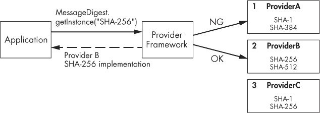
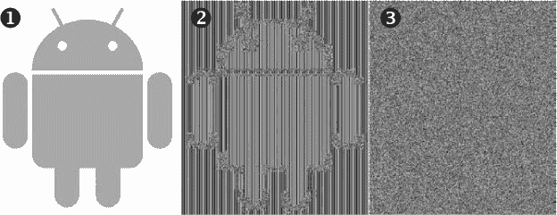
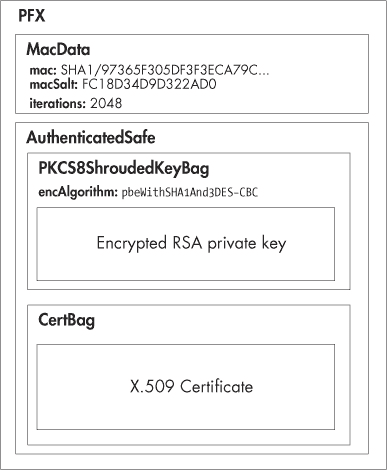

# 第五章. 加密提供者

本章介绍了 Android 的加密提供者架构，并讨论了内置的提供者及其支持的算法。由于 Android 构建于*Java 加密架构（JCA）*之上，我们简要介绍了其设计，从*加密服务提供者（CSP）*框架开始。接着，我们讨论了主要的 JCA 类和接口，以及它们实现的加密原语。（我们将简要介绍每个加密原语，但详细讨论超出了本书的范围，假设读者对基本的加密学有一定了解。）然后，我们介绍了 Android 的 JCA 提供者和加密库，以及每个提供者支持的算法。最后，我们展示了如何通过安装自定义的 JCA 提供者来使用额外的加密算法。

# JCA 提供者架构

JCA 提供了一个可扩展的加密提供者框架和一组 API，涵盖了当今使用的主要加密原语（块密码、消息摘要、数字签名等）。该架构旨在实现独立且可扩展。仅使用标准 JCA API 的应用程序只需要指定它们想要使用的加密算法，并且（在大多数情况下）不依赖于特定的提供者实现。通过简单地注册一个实现所需算法的附加提供者，可以为新的加密算法添加支持。此外，不同提供者提供的加密服务通常是互操作的（当密钥受到硬件保护或密钥材料不可直接访问时，会有某些限制），并且应用程序可以根据需要自由混合和匹配来自不同提供者的服务。让我们更详细地了解 JCA 的架构。

## 加密服务提供者

JCA 将加密功能分为多个抽象的加密服务，称为*引擎*，并为每项服务定义了相应的 API，形式为*引擎类*。例如，数字签名由 `Signature` 引擎类表示，加密则通过 `Cipher` 类建模。（你将在下一节找到完整的引擎类列表。）

在 JCA 的上下文中，*加密服务提供者*（*CSP*，简称*提供者*）是一个包（或一组包），提供某些加密服务的具体实现。每个提供者都会发布它实现的服务和算法，使得 JCA 框架能够维护一个支持的算法及其实现提供者的注册表。这个注册表会保持提供者的优先顺序，因此，如果某个算法被多个提供者提供，系统会返回优先顺序更高的那个提供者给请求的应用程序。这个规则有一个例外，那就是对于支持*延迟提供者选择*（`Cipher`、`KeyAgreement`、`Mac` 和 `Signature`）的引擎类。在延迟提供者选择的情况下，提供者不是在引擎类实例化时选择，而是在引擎类为特定加密操作初始化时选择。初始化需要一个`Key`实例，系统使用该实例来找到能够接受指定`Key`对象的提供者。延迟提供者选择在使用硬件存储的密钥时特别有用，因为系统仅凭算法名称无法找到硬件支持的提供者。然而，传递给初始化方法的具体`Key`实例通常包含足够的信息来确定底层的提供者。

### 注意

*当前的 Android 版本不支持延迟提供者选择，但在主分支中正在进行相关工作，未来版本可能会支持延迟提供者选择。*

我们来看一个使用提供者配置的例子，如图 5-1 所示。



图 5-1. JCA 算法实现选择（当未指定提供者时）

如果应用程序请求 SHA-256 摘要算法的实现而没有指定提供者（如示例 5-1 所示），则提供者框架返回在*ProviderB*中找到的实现（图 5-1 中列表中的第 2 项），而不是在*ProviderC*中找到的实现，后者也支持 SHA-256，但在图 5-1 中的列表中排在第 3 位。

示例 5-1. 请求未指定提供者的 SHA-256 实现

```
MessageDigest md = MessageDigest.getInstance("SHA-256");
```

另一方面，如果应用程序明确请求 *ProviderC*（如示例 5-2）所示，即使 *ProviderB* 的优先级较高，它的实现仍会被返回。

示例 5-2. 从特定提供者请求 SHA-256 实现

```
MessageDigest md = MessageDigest.getInstance("SHA-256", "ProviderC");
```

通常，应用程序不应显式请求提供者，除非它们将所请求的提供者作为应用程序的一部分，或能够在首选提供者不可用时处理回退。

### 提供者实现

JCA 框架通过要求所有特定加密服务或算法的实现符合一个公共接口，保证了实现的独立性。对于每个表示特定加密服务的引擎类，框架定义了一个对应的抽象 *服务提供者接口（SPI）* 类。提供特定加密服务的提供者实现并公布相应的 SPI 类。例如，提供实现某个加密算法的提供者，将有一个对应于 `Cipher` 引擎类的 `CipherSpi` 类实现。当应用程序调用 `Cipher.getInstance()` 工厂方法时，JCA 框架通过使用 “加密服务提供者” 中概述的过程，找到合适的提供者，并返回一个 `Cipher` 实例，该实例将所有方法调用路由到所选提供者中实现的 `CipherSpi` 子类。

除了 SPI 实现类外，每个提供者还有一个 `java.security.Provider` 类的子类，该子类定义了提供者的名称和版本，更重要的是，定义了支持的算法列表以及匹配的 SPI 实现类。JCA 提供者框架使用这个 `Provider` 类来构建提供者注册表，并在搜索算法实现时查询它，以返回给客户端。

### 静态提供者注册

为了使提供者对 JCA 框架可见，它必须首先注册。注册提供者有两种方式：静态注册和动态注册。静态注册需要编辑系统安全属性文件并为提供者添加条目。（在 Android 上，这个属性文件叫做 *security.properties*，并仅存在于 *core.jar* 系统库内。因此，它无法编辑，并且不支持静态提供者注册。我们这里只是为了完整性提到它。）

安全属性文件中的提供者条目格式如示例 5-3 所示。

示例 5-3. JCA 提供者的静态注册

```
security.provider.n=ProviderClassName
```

这里，*n*是提供者的优先顺序，用于在搜索请求的算法时（当未指定提供者名称时）。顺序是基于 1 的；即，1 为最优先，接下来是 2，依此类推。`ProviderClassName`是`java.security.Provider`类实现的名称，如“提供者实现”所述。

### 动态提供者注册

提供者通过`java.security.Security`类的`addProvider()`和`insertProviderAt()`方法动态注册（在运行时）。这些方法返回提供者添加的实际位置，或者如果提供者未被添加（因为它已安装），则返回-1。还可以通过调用`removeProvider()`方法动态移除提供者。

`Security`类管理安全`Provider`列表，并有效地充当前面章节描述的提供者注册表。在 Java SE 中，程序需要特殊权限才能注册提供者并修改提供者注册表，因为通过将新提供者插入到提供者列表的顶部，它们可以有效地替换系统安全实现。在 Android 中，提供者注册表的修改仅限于当前应用进程，不能影响系统或其他应用程序。因此，注册 JCA 提供者无需特殊权限。

对提供者注册表的动态修改通常放置在静态代码块中，以确保它们在任何应用程序代码之前执行。示例 5-4 展示了一个将默认（优先级最高）提供者替换为自定义提供者的示例。

示例 5-4. 动态插入自定义 JCA 提供者

```
static {
    Security.insertProviderAt(new MyProvider(), 1);
}
```

### 注意

*如果类被加载多次（例如，由不同的类加载器加载），静态代码块可能会多次执行。可以通过检查提供者是否已可用或使用仅加载一次的持有类来解决此问题。*

# JCA 引擎类

引擎类提供特定类型加密服务的接口。JCA 引擎提供以下服务之一：

+   加密操作（加密/解密、签名/验证、哈希等）

+   生成或转换加密材料（密钥和算法参数）

+   加密对象的管理和存储，如密钥和数字证书

## 获取引擎类实例

除了提供统一的加密操作接口外，engine 类还将客户端代码与底层实现解耦，这就是为什么它们不能直接实例化的原因；相反，它们提供了一个静态工厂方法`getInstance()`，使你可以间接请求一个实现。`getInstance()`方法通常具有示例 5-5 中显示的签名之一。

示例 5-5. JCA engine 类工厂方法签名

```
static EngineClassName getInstance(String algorithm)➊
    throws NoSuchAlgorithmException
static EngineClassName getInstance(String algorithm, String provider)➋
    throws NoSuchAlgorithmException, NoSuchProviderException
static EngineClassName getInstance(String algorithm, Provider provider)➌
    throws NoSuchAlgorithmException
```

通常，你会使用➊处的签名并仅指定算法名称。➋和➌处的签名允许你从特定提供者请求实现。如果请求的算法没有可用的实现，所有变体都会抛出`NoSuchAlgorithmException`，而➋会抛出`NoSuchProviderException`，如果指定名称的提供者未注册。

## 算法名称

所有工厂方法所接受的`algorithm`参数映射到特定的加密算法或变换，或指定用于管理证书或密钥集合的更高层对象的实现策略。通常，映射是直接的。例如，*SHA-256*映射到 SHA-256 哈希算法的实现，*AES*请求 AES 加密算法的实现。然而，一些算法名称具有结构，指定请求的实现的多个参数。例如，*SHA256withRSA*指定一个签名实现，使用 SHA-256 对签名的消息进行哈希处理，使用 RSA 执行签名操作。算法还可以有别名，多个算法名称可以映射到相同的实现。

算法名称不区分大小写。每个 JCA engine 类支持的标准算法名称在*JCA 标准算法名称文档*中定义（有时简称为*标准名称*）。^([38]) 除了这些，提供者还可以定义自己的算法名称和别名。（有关详细信息，请参见每个提供者的文档。）你可以使用示例 5-6 中的代码列出所有提供者、每个提供者提供的加密服务的算法名称，以及它们映射到的实现类。

示例 5-6. 列出所有 JCA 提供者及其支持的算法

```
Provider[] providers = Security.getProviders();
for (Provider p : providers) {
     System.out.printf("%s/%s/%f\n", p.getName(), p.getInfo(), p.getVersion());
     Set<Service> services = p.getServices();
     for (Service s : services) {
         System.out.printf("\t%s/%s/%s\n", s.getType(),
              s.getAlgorithm(), s.getClassName());
    }
}
```

我们将在接下来的各节中介绍每个主要 engine 类的算法名称格式。

## SecureRandom

`SecureRandom` 类代表一个加密的 *随机数生成器（RNG）*。虽然你可能不会直接频繁使用它，但它被大多数加密操作内部使用，用于生成密钥和其他加密材料。典型的软件实现通常是一个 *加密安全伪随机数生成器（CSPRNG）*，它根据一个初始值（称为 *种子*）生成一系列近似真正随机数的数字。由于 CSPRNG 生成的随机数的质量在很大程度上取决于其种子，因此种子的选择非常重要，通常基于一个真实随机数生成器的输出。

在 Android 上，CSPRNG 实现通过从标准 Linux 的 */dev/urandom* 设备文件读取种子字节来进行种子设置，该文件是内核 CSPRNG 的接口。由于内核 CSPRNG 本身在启动后可能处于一个相对可预测的状态，Android 会定期将内核 CSPRNG 的状态（在 Android 4.4 中为 4096 字节）保存到 */data/system/entropy.dat* 文件中。该文件的内容在启动时会被写回到 */dev/urandom*，以便保留之前的 CSPRNG 状态。此操作由 `EntropyMixer` 系统服务执行。

与大多数引擎类不同，`SecureRandom` 具有公共构造函数，你可以使用这些构造函数创建实例。在 Android 上，推荐的获取正确种子实例的方式是使用默认（无参数）构造函数（➊ 在 示例 5-7 中）。如果使用 `getInstance()` 工厂方法，你需要传递 *SHA1PRNG* 作为算法名称，这是 `SecureRandom` 唯一被普遍支持的算法名称。由于 *SHA1PRNG* 并不是一个严格的加密标准，不同提供者的实现可能会有不同的表现。为了让 `SecureRandom` 生成随机字节，你将一个字节数组传递给它的 `nextBytes()` 方法（➋ 在 示例 5-7 中）。它会生成与数组长度相等的字节（在 示例 5-7 中为 16），并将这些字节存储到数组中。

示例 5-7. 使用 `SecureRandom` 生成随机字节

```
SecureRandom sr = new SecureRandom();➊
byte[] output = new byte[16];
sr.nextBytes(output);➋
```

不推荐手动设置 `SecureRandom` 的种子，因为不正确地设置系统 CSPRNG 的种子可能会导致其生成可预测的字节序列，从而可能危及任何需要随机输入的高级操作。然而，如果你出于某些原因需要手动设置 `SecureRandom` 的种子（例如，如果已知默认的系统种子实现存在缺陷），你可以通过使用 `SecureRandom(byte[] seed)` 构造函数或调用 `setSeed()` 方法来进行设置。手动设置种子时，确保使用的种子足够随机；例如，可以从 */dev/urandom* 中读取。

此外，根据底层实现的不同，调用 `setSeed()` 可能不会替换内部的 CSPRNG 状态，而是仅仅将其添加到内部状态中；因此，用相同种子值初始化的两个 `SecureRandom` 实例可能不会产生相同的数字序列。因此，当需要确定性值时，不应使用 `SecureRandom`。而应使用一个设计用于根据给定输入生成确定性输出的加密原语，例如哈希算法或密钥派生函数。

## MessageDigest

`MessageDigest` 类表示加密消息摘要的功能，也称为哈希函数。加密消息摘要接受任意长度的字节序列并生成一个固定大小的字节序列，称为 *摘要* 或 *哈希*。一个好的哈希函数保证即使输入发生微小变化，也会产生完全不同的输出，并且很难找到两个不同的输入但产生相同的哈希值（*碰撞抗性*），或者生成具有特定哈希值的输入（*原像抗性*）。哈希函数的另一个重要属性是第二原像抗性。为了抵御第二原像攻击，哈希函数应使得很难找到第二个输入 m[2]，其哈希值与给定输入 m[1] 相同。

示例 5-8 展示了如何使用 `MessageDigest` 类。

示例 5-8. 使用 `MessageDigest` 进行数据哈希

```
MessageDigest md = MessageDigest.getInstance("SHA-256");➊
byte[] data = getMessage();
byte[] digest = md.digest(data);➋
```

`MessageDigest` 实例是通过将哈希算法名称传递给 `getInstance()` 工厂方法 ➊ 来创建的。可以通过使用其中一个 `update()` 方法分块提供输入数据，然后调用 `digest()` 方法之一来获取计算出的哈希值。或者，如果输入数据的大小是固定且相对较短的，也可以通过使用 `digest(byte[] input)` 方法 ➋ 一次性进行哈希，如 示例 5-8 中所示。

## 签名

`Signature` 类提供了一个基于非对称加密的数字签名算法的通用接口。数字签名算法接受一个任意消息和一个私钥，并生成一个固定大小的字节串，称为 *签名*。数字签名通常会对输入消息应用摘要算法，编码计算出的哈希值，然后使用私钥操作生成签名。然后，可以通过应用反向操作、计算签名消息的哈希值，并将其与签名中编码的哈希值进行比较，使用相应的公钥来验证签名。成功的验证保证了签名消息的完整性，并且在签名私钥保持确实私密的前提下，保证了其真实性。

`Signature`实例通过标准的`getInstance()`工厂方法创建。所使用的算法名称通常采用*<digest>with <encryption>*的形式，其中*<digest>*是`MessageDigest`使用的哈希算法名称（例如*SHA256*），*<encryption>*是非对称加密算法（例如*RSA*或*DSA*）。例如，*SHA512withRSA*的`Signature`将首先使用 SHA-512 哈希算法生成摘要值，然后使用 RSA 私钥加密编码后的摘要值以生成签名。对于使用掩码生成函数（如 RSA-PSS）的签名算法，算法名称采用*<digest>with<encryption>and<mgf>*的形式（例如，*SHA256withRSAandMGF1*）。

示例 5-9 展示了如何使用`Signature`类生成和验证加密签名。

示例 5-9. 使用`Signature`类生成和验证签名

```
PrivateKey privKey = getPrivateKey();
PublicKey pubKey = getPublicKey();
byte[] data = "sign me".getBytes("ASCII");

Signature sig = Signature.getInstance("SHA256withRSA");
sig.initSign(privKey);➊
sig.update(data);➋
byte[] signature = sig.sign();➌

sig.initVerify(pubKey);➍
sig.update(data);
boolean valid = sig.verify(signature);➎
```

获取实例后，`Signature`对象通过传递私钥给`initSign()`方法（➊，在示例 5-9 中）来初始化签名，或者通过传递公钥或证书给`initVerify()`方法 ➍来初始化验证。

签名类似于使用`MessageDigest`计算哈希值：要签名的数据被分块传递给`update()`方法 ➋，或批量传递给`sign()`方法 ➌，后者返回签名值。要验证签名，已签名的数据被传递给`update()`方法。最后，签名被传递给`verify()`方法 ➎，如果签名有效，则返回`true`。

## Cipher

`Cipher`类提供了一个用于加密和解密操作的通用接口。加密是使用某种算法（称为*加密算法*）和密钥将数据（称为*明文*或*明文消息*）转换为看似随机的形式（称为*密文*）。逆操作，称为*解密*，将密文转换回原始的明文。

当今广泛使用的两种主要加密类型是*symmetric encryption*（对称加密）和*asymmetric encryption*（非对称加密）。对称加密或*秘密密钥*加密使用相同的密钥进行数据加密和解密。非对称加密使用一对密钥：*公钥*和*私钥*。使用其中一个密钥加密的数据只能用另一把密钥解密。`Cipher`类支持对称加密和非对称加密。

根据处理输入的方式，密码算法可以是*分组密码*或*流密码*。分组密码处理固定大小的数据块，这些数据块称为*数据块*。如果输入数据无法分割成一个整数个数据块，最后一个数据块将通过添加必要的字节来进行*填充*，以匹配数据块的大小。操作和添加的字节都被称为*填充*。在解密过程中，填充会被去除，并且不会包含在解密后的明文中。如果指定了填充算法，`Cipher`类可以自动添加和去除填充。另一方面，流密码一次处理一个字节（甚至一个比特）数据，不需要填充。

### 分组密码操作模式

分组密码在处理输入数据块时采用不同的策略，以生成最终的密文（或在解密时生成明文）。这些策略称为*操作模式*、*密码模式*，或简单地称为*模式*。最简单的处理策略是将明文分割成数据块（根据需要进行填充），对每个数据块应用密码算法，然后将加密后的数据块连接在一起以生成密文。这种模式称为*电子代码本（ECB）*模式，虽然它简单易用，但它的主要缺点是相同的明文块会生成相同的密文块。因此，明文的结构会在密文中反映出来，这破坏了消息的机密性，并有助于密码分析。这个问题常常通过维基百科上的“ECB 企鹅”图示来说明。^([39]) 我们在图 5-2 中展示了我们的 Android 版本。^([40]) 这里，➊是原始图像，➋是使用 ECB 模式加密后的图像，➌是使用 CBC 模式加密后的相同图像。正如你所看到的，原始图像的模式在➋中是可辨识的，而➌看起来像是随机噪声。



图 5-2. 不同密码模式产生的密文模式

*反馈模式*通过在加密之前将前一个加密块与当前明文块结合来增加密文的随机性。为了生成第一个密文块，它们将第一个明文块与一个未出现在原始明文中的、大小与数据块相同的字节串结合，这个字节串称为*初始化向量（IV）*。在配置为使用反馈模式时，`Cipher`类可以使用客户端指定的 IV，或者自动生成一个。常用的反馈模式包括*密码块链（CBC）*、*密码反馈（CFB）*和*输出反馈（OFB）*。

另一种向密文添加随机性的方式是 *Counter (CTR)* 模式，它通过加密连续的计数器序列值，为每个需要加密的明文块生成一个新的密钥。这实际上将底层的块密码转换为流密码，因此不需要填充。

更新的密码模式，如 *Galois/Counter Mode (GCM)*，不仅能扩散原始明文中的模式，还能对密文进行认证，确保其未被篡改。它们提供了 *认证加密 (AE)* 或 *带关联数据的认证加密 (AEAD)*。^([41]) `Cipher` API 在 Java SE 7 中扩展了对认证加密的支持，并且这些扩展自 Android 4.4 以来就已经可用，该版本具有与 Java 7 兼容的运行时库 API。AE 密码通过将加密操作输出的认证标签与该操作生成的密文拼接在一起，从而形成最终输出。在 Java `Cipher` API 中，标签会在调用 `doFinal()` 后隐式包含（或在解密时进行验证），因此在确定隐式标签验证通过之前，不应使用 `update()` 的输出。

### 获取 Cipher 实例

在回顾了密码的主要参数后，我们终于可以讨论如何创建 `Cipher` 实例。像其他引擎类一样，`Cipher` 对象是通过 `getInstance()` 工厂方法创建的，这不仅要求提供一个简单的算法名称，还需要你完全指定所请求的密码将执行的加密 *转换*。

示例 5-10 展示了如何通过将转换字符串传递给 `getInstance()` 来创建一个 `Cipher` 实例。

示例 5-10. 创建一个 `Cipher` 实例

```
Cipher c = Cipher.getInstance("AES/CBC/PKCS5Padding");
```

转换需要指定加密算法、密码模式和填充方式。传递给 `getInstance()` 的转换字符串采用 *算法/模式/填充* 格式。例如，在 示例 5-10 中使用的转换字符串将创建一个使用 AES 作为加密算法、CBC 作为密码模式、PKCS#5 填充的 `Cipher` 实例。

### 注意

*术语* PKCS *将在我们讨论 JCA 提供者和引擎类时多次出现。这个缩写代表* 公钥密码学标准 *，它指的是一组最初由 RSA Security, Inc. 在 1990 年代初期开发和发布的密码学标准。大多数已经发展成为公共互联网标准，并以 RFC（请求评论，描述互联网标准的正式文件）的形式发布和维护，但它们仍然以原始名称被称呼。著名的标准包括 PKCS#1，它定义了 RSA 加密和签名的基本算法；PKCS#5，它定义了基于密码的加密；PKCS#7，它定义了在公钥基础设施下的消息加密和签名，并成为 S/MIME 的基础；以及 PKCS#12，它定义了密钥和证书的容器。完整的标准列表可以在 EMC 的网站上找到。*^([42])

可以仅通过传递算法名称来创建一个 `Cipher` 实例，但在这种情况下，返回的实现会使用提供者特定的默认值来设置加密模式和填充方式。这不仅无法在不同提供者之间移植，而且如果运行时使用了不如预期安全的加密模式（例如 ECB 模式），可能会严重影响系统的安全性。这种“快捷方式”是 JCA 提供者框架的一个重大设计缺陷，绝对不应该使用。

### 使用 Cipher

一旦获得了 `Cipher` 实例，它需要在加密或解密数据之前进行初始化。`Cipher` 通过将表示操作模式的整数常量（`ENCRYPT_MODE`、`DECRYPT_MODE`、`WRAP_MODE` 或 `UNWRAP_MODE`）、密钥或证书，以及可选的算法参数，传递给相应的 `init()` 方法来进行初始化。`ENCRYPT_MODE` 和 `DECRYPT_MODE` 用于加密和解密任意数据，而 `WRAP_MODE` 和 `UNWRAP_MODE` 是专门用于加密（*封装*）和解密（*解封装*） `Key` 对象的密钥材料的模式。

示例 5-11 演示了如何使用 `Cipher` 类加密和解密数据。

示例 5-11. 使用 `Cipher` 类加密和解密数据

```
SecureRandom sr = new SecureRandom();
SecretKey key = getSecretKey();
Cipher cipher = Cipher.getInstance("AES/CBC/PKCS5Padding");➊

byte[] iv = new byte[cipher.getBlockSize()];
sr.nextBytes(iv);
IvParameterSpec ivParams = new IvParameterSpec(iv);➋
cipher.init(Cipher.ENCRYPT_MODE, key, ivParams);➌
byte[] plaintext = "encrypt me".getBytes("UTF-8");
ByteArrayOutputStream baos = new ByteArrayOutputStream();
byte[] output = cipher.update(plaintext);➍
if (output != null) {
    baos.write(output);
}
output = cipher.doFinal();➎
baos.write(output);
byte[] ciphertext = baos.toByteArray();

cipher.init(Cipher.DECRYPT_MODE, key, ivParams);➏
baos = new ByteArrayOutputStream();
output = cipher.update(ciphertext);➐
if (output != null) {
    baos.write(output);
}
output = cipher.doFinal();➑
baos.write(output);
byte[] decryptedPlaintext = baos.toByteArray();➒
```

在这个例子中，我们创建了一个使用 AES CBC 模式和 PKCS#5 填充的 `Cipher` 实例 ➊；生成一个随机的 IV 并将其封装进 `IvParameterSpec` 对象 ➋；然后通过将 `ENCRYPT_MODE`、加密密钥和 IV 传递给 `init()` 方法来初始化 `Cipher` 进行加密 ➌。接着，我们可以通过将数据块传递给 `update()` 方法 ➍ 来加密数据，该方法返回中间结果（如果输入数据太短以至于无法形成新块，则返回 `null`），并通过调用 `doFinal()` 方法 ➎ 获得最后一个数据块。最终的密文是将中间结果和最后一个数据块连接起来得到的。

要进行解密，我们将`cipher`初始化为`DECRYPT_MODE` ➏，并传入与加密时相同的密钥和 IV。然后调用`update()` ➐，这时使用密文作为输入，最后调用`doFinal()` ➑以获得最后一块明文。最终的明文是通过将中间结果与最后一块明文连接起来获得的 ➒。

## 消息认证码（MAC）

`Mac`类提供了一个通用接口，用于*消息认证码（MAC）*算法。MAC 用于检查通过不可靠通道传输的消息的完整性。MAC 算法使用一个密钥计算一个值，即*MAC*（也叫做*标签*），该值可用于验证消息并检查其完整性。相同的密钥用于进行验证，因此它需要在通信双方之间共享。（MAC 通常与密码学算法结合使用，以提供保密性和完整性。）

示例 5-12. 使用`Mac`类生成消息认证码

```
KeyGenerator keygen = KeyGenerator.getInstance("HmacSha256");
SecretKey key = keygen.generateKey();
Mac mac = Mac.getInstance("HmacSha256");➊
mac.init(key);➋
byte[] message = "MAC me".getBytes("UTF-8");
byte[] tag = mac.doFinal(message);➌
```

一个`Mac`实例是通过`getInstance()`工厂方法 ➊（如示例 5-12）获取的，它请求一个实现 HMAC^([43]) MAC 算法，该算法使用 SHA-256 作为哈希函数。然后它被初始化 ➋，使用`SecretKey`实例，这个实例可以通过`KeyGenerator`生成（见“KeyGenerator”），也可以通过密码派生或直接从原始密钥字节实例化。对于基于哈希函数的 MAC 实现（例如本例中的 HMAC SHA-256），密钥的类型不重要，但使用对称密码的实现可能需要传入匹配的密钥类型。然后，我们可以通过使用`update()`方法之一分批传递消息，并调用`doFinal()`以获得最终的 MAC 值，或者通过将消息字节直接传递给`doFinal()` ➌来一步完成操作。

## 密钥

`Key`接口表示 JCA 框架中的*不透明*密钥。不透明密钥可以用于加密操作，但通常无法访问底层的*密钥材料*（原始密钥字节）。这使得我们可以在使用存储密钥材料于内存的软件加密算法实现和硬件支持的加密算法（密钥材料可能存储在硬件令牌中，如智能卡、HSM^([44])等）之间，使用相同的 JCA 类和接口，并且密钥材料是不可直接访问的。

`Key`接口仅定义了三个方法：

+   ****`String getAlgorithm()`****。返回此密钥可以使用的加密算法（对称或非对称）的名称。例如，*AES*或*RSA*。

+   ****`byte[] getEncoded()`****。返回密钥的标准编码形式，通常用于将密钥传输到其他系统。这可以针对私钥进行加密。对于不允许导出密钥材料的硬件支持实现，这个方法通常会返回 `null`。

+   ****`String getFormat()`****。返回编码密钥的格式。对于未以特定格式编码的密钥，这通常是 *RAW*。JCA 中定义的其他格式有 *X.509* 和 *PKCS#8*。

你可以通过以下方式获取 `Key` 实例：

+   使用 `KeyGenerator` 或 `KeyPairGenerator` 生成密钥。

+   使用 `KeyFactory` 从某些编码表示中转换。

+   从 `KeyStore` 中检索已存储的密钥。

我们将在接下来的小节中讨论不同的 `Key` 类型以及如何创建和访问它们。

## SecretKey 和 PBEKey

`SecretKey` 接口表示对称算法中使用的密钥。它是一个标记接口，并没有为父接口 `Key` 增加任何方法。它只有一个可以直接实例化的实现类，即 `SecretKeySpec`。它既是一个密钥实现类，也是一个密钥规格类（如后文的 “KeySpec” 小节所述），并允许你根据原始密钥材料实例化 `SecretKey` 实例。

`PBEKey` 子接口表示通过 *基于密码的加密 (PBE)* 派生的密钥。^([45]) PBE 定义了从密码和口令短语（通常具有低熵，因此不能直接作为密钥使用）中派生强加密密钥的算法。PBE 基于两个主要思想：使用 *盐值* 保护免受表辅助（预计算）字典攻击（*加盐*），并使用较大的迭代次数使密钥派生计算上变得昂贵（*密钥拉伸*）。盐值和迭代次数作为 PBE 算法的参数，因此需要保留，以便从特定的密码生成相同的密钥。因此，`PBEKey` 实现需要实现 `getSalt()`、`getIterationCount()` 和 `getPassword()` 方法。

## 公钥、私钥和密钥对

非对称加密算法的公钥和私钥通过 `PublicKey` 和 `PrivateKey` 接口进行建模。它们是标记接口，并没有增加任何新方法。JCA 定义了具体非对称算法的专用类，这些类包含相应密钥的参数，例如 `RSAPublicKey` 和 `RSAPrivateCrtKey`。`KeyPair` 接口只是一个容器，包含一个公钥和一个私钥。

## KeySpec

如在 Key 小节所述，JCA 的 `Key` 接口表示不透明的密钥。另一方面，`KeySpec` 模型化了一个 *密钥规格*，它是一个 *透明的* 密钥表示形式，允许你访问各个密钥参数。

在实际应用中，大多数具体算法的`Key`和`KeySpec`接口有很大的重叠，因为密钥参数需要可访问，以便实现加密算法。例如，`RSAPrivateKey`和`RSAPrivateKeySpec`都定义了`getModulus()`和`getPrivateExponent()`方法。只有在算法实现为硬件时，差异才变得重要，此时`KeySpec`只包含对硬件管理密钥的引用，而不包含实际的密钥参数。相应的`Key`将持有指向硬件管理密钥的句柄，并可用于执行加密操作，但它不会包含任何密钥材料。例如，存储在硬件中的`RSAPrivateKey`在调用其`getPrivateExponent()`方法时将返回`null`。

`KeySpec`实现可以持有编码后的密钥表示，在这种情况下，它们是与算法无关的。例如，`PKCS8EncodedKeySpec`可以持有 RSA 密钥或 DSA 密钥，格式为 DER 编码的 PKCS#8 格式。^([46])另一方面，特定算法的`KeySpec`将所有密钥参数作为字段保存。例如，`RSAPrivateKeySpec`包含 RSA 密钥的模数和私有指数，可以分别通过`getModulus()`和`getPrivateExponent()`方法获取。无论类型如何，`KeySpec`都可以通过`KeyFactory`转换为`Key`对象。

## KeyFactory

`KeyFactory`封装了一个转换例程，用于将透明的公钥或私钥表示（某个`KeySpec`子类）转换为不可见的密钥对象（某个`Key`子类），该对象可以用于执行加密操作，反之亦然。一个转换编码密钥的`KeyFactory`通常会解析编码的密钥数据，并将每个密钥参数存储在具体`Key`类的相应字段中。例如，要解析一个 X.509 编码的 RSA 公钥，可以使用以下代码（参见示例 5-13）。

示例 5-13. 使用`KeyFactory`将 X.509 编码的密钥转换为`RSAPublicKey`对象

```
KeyFactory kf = KeyFactory.getInstance("RSA");➊
byte[] encodedKey = readRsaPublicKey();
X509EncodedKeySpec keySpec = new X509EncodedKeySpec(encodedKey);➋
RSAPublicKey pubKey = (RSAPublicKey) kf.generatePublic(keySpec);➌
```

在这里，我们通过将*RSA*传递给`KeyFactory.getInstance()` ➊来创建一个 RSA `KeyFactory`。然后，我们读取编码后的 RSA 密钥，使用编码后的密钥字节实例化一个`X509EncodedKeySpec` ➋，最后将`KeySpec`传递给工厂的`generatePublic()`方法 ➌，以获取一个`RSAPublicKey`实例。

`KeyFactory`也可以将特定算法的`KeySpec`（如`RSAPrivateKeySpec`）转换为匹配的`Key`（在这个例子中是`RSAPrivateKey`）实例，但在这种情况下，它仅仅是将密钥参数（或密钥句柄）从一个类复制到另一个类。调用`KeyFactory.getKeySpec()`方法将`Key`对象转换为`KeySpec`，但这种用法并不常见，因为通过直接调用`getEncoded()`方法在密钥对象上可以简单地获取编码的密钥表示，而且特定算法的`KeySpec`通常并不会提供比具体的`Key`类更多的信息。

`KeyFactory`的另一个特性是将来自不同提供者的`Key`实例转换为与当前提供者兼容的相应密钥对象。这个操作称为*密钥转换*，是通过调用`translateKey(Key key)`方法来执行的。

## SecretKeyFactory

`SecretKeyFactory`与`KeyFactory`非常相似，区别在于它只处理对称（秘密）密钥。你可以使用它将对称密钥规格转换为`Key`对象，反之亦然。然而在实践中，如果你能够访问对称密钥的密钥材料，那么直接实例化一个`SecretKeySpec`（它也是一个`Key`）要简单得多，因此这种用法并不常见。

一个更常见的使用场景是使用 PBE 从用户提供的密码生成对称密钥（参见示例 5-14）。

示例 5-14. 使用`SecretKeyFactory`从密码生成密钥

```
byte[] salt = generateSalt();
int iterationCount = 1000; int keyLength = 256;
KeySpec keySpec = new PBEKeySpec(password.toCharArray(), salt,
                                 iterationCount, keyLength);➊
SecretKeyFactory skf = SecretKeyFactory.getInstance("PBKDF2WithHmacSHA1");➋
SecretKey key = skf.generateSecret(keySpec);➌
```

在这种情况下，`PBEKeySpec`通过密码、随机生成的盐值、迭代次数和所需的密钥长度来初始化 ➊。然后，通过调用`getInstance()` ➋ 获取实现 PBE 密钥派生算法（在此例中为 PBKDF2）的`SecretKey`工厂。将`PBEKeySpec`传递给`generateSecret()`执行密钥派生算法，并返回一个可以用于加密或解密的`SecretKey`实例 ➌。

## KeyPairGenerator

`KeyPairGenerator`类生成公钥和私钥对。通过将非对称算法名称传递给`getInstance()`工厂方法来实例化`KeyPairGenerator`（➊，参见示例 5-15）。

示例 5-15. 使用特定算法参数初始化`KeyPairGenerator`

```
KeyPairGenerator kpg = KeyPairGenerator.getInstance("ECDH");➊
ECGenParameterSpec ecParamSpec = new ECGenParameterSpec("secp256r1");➋
kpg.initialize(ecParamSpec);➌
KeyPair keyPair = kpg.generateKeyPair();➍
```

有两种方法可以初始化 `KeyPairGenerator`：一种是指定所需的密钥大小，另一种是指定算法特定的参数。在这两种情况下，你都可以选择性地传入一个 `SecureRandom` 实例用于密钥生成。如果仅指定了密钥大小，密钥生成将使用默认参数（如果有的话）。要指定其他参数，必须实例化并配置一个适用于你所使用的非对称算法的 `AlgorithmParameterSpec` 实例，并将其传递给 `initialize()` 方法，如 示例 5-15 中所示。在此示例中，➋ 初始化的 `ECGenParameterSpec` 是一个 `AlgorithmParameterSpec`，它允许你在生成 *椭圆曲线（EC）* 密码学密钥时指定使用的曲线名称。将其传递给 ➌ 中的 `initialize()` 方法后，随后的 `generateKeyPair()` 调用将在 ➍ 中使用指定的曲线（*secp256r1*）来生成密钥对。

### 注意

*虽然许多标准已经定义了命名曲线，但 Oracle JCA 规范并未明确规定任何椭圆曲线名称。由于没有官方的 JCA 标准，Android 支持的曲线名称可能会根据平台版本有所不同。*

## KeyGenerator

`KeyGenerator` 类与 `KeyPairGenerator` 类非常相似，不同之处在于它生成的是对称密钥。虽然你可以通过从 `SecureRandom` 请求一系列随机字节来生成大多数对称密钥，但 `KeyGenerator` 实现会进行额外的弱密钥检查，并在适当的位置设置密钥奇偶校验字节（对于 DES 及衍生算法），还可以利用可用的密码硬件，因此最好使用 `KeyGenerator` 而不是手动生成密钥。

示例 5-16 展示了如何使用 `KeyGenerator` 生成 AES 密钥。

示例 5-16. 使用 `KeyGenerator` 生成 AES 密钥

```
KeyGenerator keygen = KeyGenerator.getInstance("AES");➊
kg.init(256);➋
SecretKey key = keygen.generateKey();➌
```

要使用 `KeyGenerator` 生成密钥，首先创建一个实例 ➊，通过 `init()` 方法指定所需的密钥大小 ➋，然后调用 `generateKey()` ➌ 生成密钥。

## KeyAgreement

`KeyAgreement` 类表示一个 *密钥协商协议*，它允许两个或更多方生成一个共享密钥，而无需交换秘密信息。虽然有多种密钥协商协议，但目前最广泛使用的协议是基于 *Diffie-Hellman (DH) 密钥交换*——无论是基于离散对数密码学的原始协议^([48])（通常称为 *DH*），还是基于椭圆曲线密码学的更新版协议（*ECDH*^([49]))。

协议的两种变体在 JCA 中都通过 `KeyAgreement` 类建模，并且可以以相同的方式执行，唯一的区别在于密钥。对于这两种变体，每个通信方都需要拥有一对密钥，且这两对密钥是使用相同的密钥参数生成的（DH 的素数模数和基生成器，通常 ECDH 使用相同的预定义命名曲线）。然后，通信方只需要交换公钥并执行密钥协议算法以达成共享密钥。

示例 5-17 展示了如何使用 `KeyAgreement` 类通过 ECDH 生成共享密钥。

示例 5-17. 使用 `KeyAgreement` 生成共享密钥

```
PrivateKey myPrivKey = getPrivateKey();
PublicKey remotePubKey = getRemotePubKey();
KeyAgreement keyAgreement = KeyAgreement.getInstance("ECDH");➊
keyAgreement.init(myPrivKey);➋
keyAgreement.doPhase(remotePubKey, true);➌
byte[] secret = keyAgreement.generateSecret();➍
```

首先通过将算法名称 *ECDH* 传递给 `getInstance()` 工厂方法 ➊ 来创建 `KeyAgreement` 实例。然后，通过将本地私钥传递给 `init()` 方法 ➋ 来初始化协议。接下来，调用 `doPhase()` 方法 *N* - 1 次，其中 *N* 是通信方的数量，每次传递每个通信方的公钥作为第一个参数，当执行协议的最后阶段时，将第二个参数设置为 `true` ➌。（对于两个通信方，如本示例所示，`doPhase()` 方法只需要调用一次。）最后，调用 `generateSecret()` 方法 ➍ 生成共享密钥。

示例 5-17 展示了其中一方（*A*）的调用流程，但另一方（*B*）需要使用自己的私钥执行相同的步骤来初始化协议，并将 *A* 的公钥传递给 `doPhase()`。

请注意，虽然 `generateSecret()` 返回的值（或其部分）可以直接用作对称密钥，但推荐的做法是将其作为 *密钥派生函数（KDF）* 的输入，并使用 KDF 的输出作为密钥。直接使用生成的共享密钥可能会导致一些熵丧失，并且这样做限制了使用单次 DH 密钥协议操作生成密钥的数量。另一方面，使用 KDF 可以扩散密钥的结构（如填充），并通过混合盐值来生成多个派生密钥。

`KeyAgreement` 还有另一个 `generateSecret()` 方法，该方法接收一个算法名称作为参数，并返回一个可以直接用于初始化 `Cipher` 的 `SecretKey` 实例。如果 `KeyAgreement` 实例是使用包含 KDF 规格的算法字符串创建的（例如 *ECDHwithSHA1KDF*），该方法会在返回 `SecretKey` 之前将 KDF 应用到共享密钥上。如果没有指定 KDF，大多数实现会简单地截断共享密钥，以获得用于返回 `SecretKey` 的密钥材料。

## 密钥库

JCA 使用术语 *keystore* 来指代包含密钥和证书的数据库。密钥库管理多个加密对象，这些对象称为 *entries*，每个条目都与一个字符串 *alias* 相关联。`KeyStore` 类为密钥库提供了一个明确定义的接口，该接口定义了三种类型的条目：

+   ****`PrivateKeyEntry`****。一个私钥和一个关联的证书链。对于软件实现，私钥通常是加密的，并由用户提供的密码短语保护。

+   ****`SecretKeyEntry`****。一个对称（秘密）密钥。并非所有 `KeyStore` 实现都支持存储秘密密钥。

+   ****`TrustedCertificateEntry`****。 另一个方的公钥证书。`TrustedCertificateEntry` 通常包含可用于建立信任关系的 CA 证书。只包含 `TrustedCertificateEntry` 的密钥库被称为 *信任库*。

### 密钥库类型

`KeyStore` 实现不需要持久化，但大多数实现是持久化的。不同的实现通过 *密钥库类型* 来识别，该类型定义了密钥库的存储和数据格式，以及用于保护存储密钥的方法。默认的 `KeyStore` 类型通过 `keystore.type` 系统属性设置。

大多数 JCA 提供程序的默认`KeyStore`实现通常是一种将数据存储在文件中的密钥库类型。文件格式可能是专有的，也可能基于公开标准。专有格式包括原始的 Java SE *JKS* 格式及其安全增强版本 *JCEKS*，以及 *Bouncy Castle KeyStore (BKS)* 格式，这是 Android 中的默认格式。

### PKCS#12 文件支持的密钥库

最广泛使用的公共标准之一，是允许将私钥及其关联证书捆绑在一个文件中的 *个人信息交换语法标准*，通常称为 *PKCS#12*。它是 *个人信息交换语法（PFX）* 标准的继承者，因此 PKCS#12 和 PFX 这两个术语在一定程度上可以互换使用，PKCS#12 文件通常被称为 PFX 文件。

PKCS#12 是一种容器格式，可以包含多个嵌入对象，例如私钥、证书，甚至 CRL。像 PKCS#12 所基于的前几个 PKCS 标准一样，容器内容在 *ASN.1*^([50]) 中定义，本质上是一个嵌套结构的序列。内部容器结构称为 `SafeBags`，并为证书（`CertBag`）、私钥（`KeyBag`）和加密私钥（`PKCS8ShroudedKeyBag`）定义了不同的袋子。整个文件的完整性由一个使用 *完整性密码* 派生的密钥保护的 MAC 保护，每个私钥条目都使用一个从 *隐私密码* 派生的密钥加密。实际上，这两个密码通常是相同的。PKCS#12 还可以使用公钥来保护归档内容的隐私性和完整性，但这种用法并不常见。

一个典型的 PKCS#12 文件包含用户加密的密码密钥和关联证书，其结构可能如图 5-3 所示（注意，为了简洁，某些包装结构已被移除）。



图 5-3. 持有私钥和关联证书的 PKCS#12 文件结构

示例 5-18 展示了如何从 PKCS#12 文件中获取私钥和证书。

示例 5-18. 使用 `KeyStore` 类从 PKCS#12 文件中提取私钥和证书

```
KeyStore keyStore = KeyStore.getInstance("PKCS12");➊
InputStream in = new FileInputStream("mykey.pfx");
keyStore.load(in, "password".toCharArray());➋
KeyStore.PrivateKeyEntry keyEntry =
      (KeyStore.PrivateKeyEntry)keyStore.getEntry("mykey", null);➌
X509Certificate cert = (X509Certificate) keyEntry.getCertificate();➍
RSAPrivateKey privKey = (RSAPrivateKey) keyEntry.getPrivateKey();➎
```

`KeyStore` 类可以通过在创建实例时指定 *PKCS12* 作为密钥库类型来访问 PKCS#12 文件的内容（➊，见示例 5-18）。为了加载和解析 PKCS#12 文件，我们调用 `load()` 方法 ➋，传入用于读取文件的 `InputStream` 和文件完整性密码。文件加载后，我们可以通过调用 `getEntry()` 方法并传入密钥别名 ➌ 来获取私钥条目，另外，如果请求的条目密码与文件完整性密码不同，还可以传入一个用该密码初始化的 `KeyStore.PasswordProtection` 实例。如果别名未知，可以使用 `aliases()` 方法列出所有别名。一旦获得了 `PrivateKeyEntry`，我们可以访问公钥证书 ➍ 或私钥 ➎。可以使用 `setEntry()` 方法添加新条目，使用 `deleteEntry()` 方法删除条目。通过调用 `store()` 方法，可以将对 `KeyStore` 内容的更改持久化到磁盘，该方法接受一个 `OutputStream`（将密钥库字节写入该流）和一个完整性密码（用于推导 MAC 和加密密钥）作为参数。

`KeyStore` 实现不一定需要使用单个文件来存储密钥和证书对象。它可以使用多个文件、数据库或任何其他存储机制。事实上，密钥可能根本不存储在主机系统上，而是存储在单独的硬件设备上，例如智能卡或*硬件安全模块（HSM）*。（针对 Android 的 `KeyStore` 实现提供了对系统的信任存储和凭证存储的接口，相关内容在第六章和第七章中介绍。）

## CertificateFactory 和 CertPath

`CertificateFactory` 充当证书和 CRL 解析器，可以从证书列表中构建证书链。它可以读取包含编码证书或 CRL 的流，并输出一个 `java.security.cert.Certificate` 和 `java.security.cert.CRL` 对象的集合（或单个实例）。通常，只有解析 X.509 证书和 CRL 的 *X.509* 实现是可用的。

示例 5-19 展示了如何使用 `CertificateFactory` 解析证书文件。

示例 5-19. 使用 `CertificateFactory` 解析 X.509 证书文件

```
CertificateFactory cf = CertificateFactory.getInstance("X.509");➊
InputStream in = new FileInputStream("certificate.cer");
X509Certificate cert = (X509Certificate) cf.generateCertificate(in);➋
```

要创建一个 `CertificateFactory`，我们将 *X.509* 作为工厂类型传递给 `getInstance()` ➊，然后调用 `generateCertificate()`，传入一个 `InputStream` 来读取数据 ➋。由于这是一个 *X.509* 工厂，获取的对象可以安全地转换为 `java.security.cert.X509Certificate`。如果读取的文件包含多个证书，形成一个证书链，可以通过调用 `generateCertPath()` 方法获得一个 `CertPath` 对象。

## CertPathValidator 和 CertPathBuilder

`CertPathValidator` 类封装了一个证书链验证算法，该算法由 *公钥基础设施（X.509）* 或 *PKIX* 标准定义。我们在第六章中将更详细地讨论 PKIX 和证书链验证，但示例 5-20 展示了如何使用 `CertificateFactory` 和 `CertPathValidator` 来构建和验证证书链。

示例 5-20. 使用 `CertPathValidator` 构建并验证证书链

```
CertPathValidator certPathValidator = CertPathValidator.getInstance("PKIX");➊
CertificateFactory cf = CertificateFactory.getInstance("X.509");

X509Certificate[] chain = getCertChain();
CertPath certPath = cf.generateCertPath(Arrays.asList(chain));➋
Set<TrustAnchor> trustAnchors = getTrustAnchors();
PKIXParameters result = new PKIXParameters(trustAnchors);➌
PKIXCertPathValidatorResult result = (PKIXCertPathValidatorResult)
             certPathValidator.validate(certPath, pkixParams);➍
```

如你所见，我们首先通过将 *PKIX* 传递给 `getInstance()` 方法 ➊ 获得一个 `CertPathValidator` 实例。然后，我们使用 `CertificateFactory` 的 `generateCertPath()` 方法 ➋ 构建证书链。请注意，如果传入的证书列表无法形成有效的链条，方法将抛出 `CertificateException`。如果我们还没有所有构成链条所需的证书，我们可以使用初始化为 `CertStore` 的 `CertPathBuilder` 来查找所需的证书并构建一个 `CertPath`（未显示）。

一旦我们拥有了 `CertPath`，我们通过一组 *信任锚*（通常这些是可信的 CA 证书；详细信息请参见第六章）初始化 `PKIXParameters` 类 ➌，然后调用 `CertPathValidator.validate()` ➍，传入我们在 ➋ 中构建的 `CertPath` 和 `PKIXParameters` 实例。如果验证成功，`validate()` 返回一个 `PKIXCertPathValidatorResult` 实例；如果失败，则抛出一个包含失败原因的 `CertPathValidatorException`。

# Android JCA 提供者

Android 的加密提供者基于 JCA，并遵循其架构，只有一些相对较小的例外。虽然低级 Android 组件直接使用本地加密库（如 OpenSSL），JCA 是主要的加密 API，系统组件和第三方应用程序都在使用它。

Android 有三个核心 JCA 提供者，其中包括前述引擎类的实现，还有两个 *Java Secure Socket Extension (JSSE)* 提供者，它们实现了 SSL 功能。（JSSE 在第六章中有详细讨论。）

让我们来看看 Android 的核心 JCA 提供者。

## Harmony 的 Crypto 提供者

Android 的 Java 运行时库实现来源于已退役的 Apache Harmony 项目，^([52])，该项目还包括一个名为 *Crypto* 的有限 JCA 提供者，提供了基本的加密服务实现，如随机数生成、哈希和数字签名。Crypto 仍然包含在 Android 中，以确保向后兼容，但它在所有 JCA 提供者中优先级最低，因此，除非显式请求，否则不会返回 Crypto 的引擎类实现。表 5-1 显示了 Crypto 支持的引擎类和算法。

表 5-1. 截至 Android 4.4.4 加密提供者支持的算法

| 引擎类名称 | 支持的算法 |
| --- | --- |
| `KeyFactory` | *DSA* |
| `MessageDigest` | *SHA-1* |
| `SecureRandom` | *SHA1PRNG* |
| `Signature` | *SHA1withDSA* |

### 注意

*虽然 表 5-1 中列出的算法仍然可以在 Android 4.4 中使用，但除* SHA1PRNG *外，所有算法已在 Android 主分支中移除，并可能在未来的版本中不可用。*

## Android 的 Bouncy Castle 提供者

在 Android 4.0 之前，Android 唯一的全功能 JCA 提供者是 Bouncy Castle 提供者。Bouncy Castle 提供者是 Bouncy Castle 加密 API 的一部分，^([53])，这是一套开源的 Java 加密算法和协议实现。

Android 包含了一个修改版的 Bouncy Castle 提供者，该版本通过应用一系列 Android 特定的补丁从主流版本派生而来。这些补丁在 Android 源代码树中维护，并随着主流 Bouncy Castle 提供者的每个新版本进行更新。与主流版本的主要差异如下所述。

+   不被 Java 参考实现（RI）支持的算法、模式和算法参数已被移除（如 RIPEMD、SHA-224、GOST3411、Twofish、CMAC、El Gamal、RSA-PSS、ECMQV 等）。

+   不安全的算法如 MD2 和 RC2 已被移除。

+   基于 Java 的 MD5 和 SHA 系列摘要算法的实现已被本地实现所替代。

+   已移除一些 PBE 算法（例如，*PBEwithHmacSHA256*）。

+   已移除对存储在 LDAP 中的证书的访问支持。

+   已添加对证书黑名单的支持（黑名单详见 第六章）。

+   已进行各种性能优化。

+   包名已更改为 `com.android.org.bouncycastle`，以避免与捆绑 Bouncy Castle 的应用程序发生冲突（自 Android 3.0 起）。

Android Bouncy Castle 提供程序支持的引擎类和算法列表（基于 Bouncy Castle 1.49，版本为 4.4.4）见 表 5-2。

表 5-2. Android 4.4.4 版本的 Bouncy Castle 提供程序支持的算法

| 引擎类名称 | 支持的算法 |
| --- | --- |
| `CertPathBuilder` | *PKIX* |
| `CertPathValidator` | *PKIX* |
| `CertStore` | *Collection* |
| `CertificateFactory` | *X.509* |
| `Cipher` | *AES**AESWRAP**ARC4**BLOWFISH**DES**DESEDE**DESEDEWRAP**PBEWITHMD5AND128BITAES-CBC-OPENSSL**PBEWITHMD5AND192BITAES-CBC-OPENSSL**PBEWITHMD5AND256BITAES-CBC-OPENSSL**PBEWITHMD5ANDDES**PBEWITHMD5ANDRC2**PBEWITHSHA1ANDDES**PBEWITHSHA1ANDRC2**PBEWITHSHA256AND128BITAES-CBC-BC**PBEWITHSHA256AND192BITAES-CBC-BC**PBEWITHSHA256AND256BITAES-CBC-BC**PBEWITHSHAAND128BITAES-CBC-BC**PBEWITHSHAAND128BITRC2-CBC**PBEWITHSHAAND128BITRC4**PBEWITHSHAAND192BITAES-CBC-BC**PBEWITHSHAAND2-KEYTRIPLEDES-CBC**PBEWITHSHAAND256BITAES-CBC-BC**PBEWITHSHAAND3-KEYTRIPLEDES-CBC**PBEWITHSHAAND40BITRC2-CBC**PBEWITHSHAAND40BITRC4**PBEWITHSHAANDTWOFISH-CBC**RSA* |
| `KeyAgreement` | *DH**ECDH* |
| `KeyFactory` | *DH**DSA**EC**RSA* |
| `KeyGenerator` | *AES**ARC4**BLOWFISH**DES**DESEDE**HMACMD5**HMACSHA1**HMACSHA256**HMACSHA384**HMACSHA512* |
| `KeyPairGenerator` | *DH**DSA**EC**RSA* |
| `KeyStore` | *BKS*（默认）*BouncyCastle**PKCS12* |
| `Mac` | *HMACMD5**HMACSHA1**HMACSHA256**HMACSHA384**HMACSHA512**PBEWITHHMACSHA**PBEWITHHMACSHA1* |
| `MessageDigest` | *MD5**SHA-1**SHA-256**SHA-384**SHA-512* |
| `SecretKeyFactory` | *DES**DESEDE**PBEWITHHMACSHA1**PBEWITHMD5AND128BITAES-CBC-OPENSSL**PBEWITHMD5AND192BITAES-CBC-OPENSSL**PBEWITHMD5AND256BITAES-CBC-OPENSSL**PBEWITHMD5ANDDES**PBEWITHMD5ANDRC2**PBEWITHSHA1ANDDES**PBEWITHSHA1ANDRC2**PBEWITHSHA256AND128BITAES-CBC-BC**PBEWITHSHA256AND192BITAES-CBC-BC**PBEWITHSHA256AND256BITAES-CBC-BC**PBEWITHSHAAND128BITAES-CBC-BC**PBEWITHSHAAND128BITRC2-CBC**PBEWITHSHAAND128BITRC4**PBEWITHSHAAND192BITAES-CBC-BC**PBEWITHSHAAND2-KEYTRIPLEDES-CBC**PBEWITHSHAAND256BITAES-CBC-BC**PBEWITHSHAAND3-KEYTRIPLEDES-CBC**PBEWITHSHAAND40BITRC2-CBC**PBEWITHSHAAND40BITRC4**PBEWITHSHAANDTWOFISH-CBC**PBKDF2WithHmacSHA1**PBKDF2WithHmacSHA1And8BIT* |
| `Signature` | *ECDSA**MD5WITHRSA**NONEWITHDSA**NONEwithECDSA**SHA1WITHRSA**SHA1withDSA**SHA256WITHECDSA**SHA256WITHRSA**SHA384WITHECDSA**SHA384WITHRSA**SHA512WITHECDSA**SHA512WITHRSA* |

## AndroidOpenSSL 提供程序

如在 Android 的 Bouncy Castle 提供程序中提到的，Android 的 Bouncy Castle 提供程序中的哈希算法已经被本地代码替换，以提高性能。为了进一步提高加密性能，自 4.0 版本以来，每次发布时本地 AndroidOpenSSL 提供程序支持的引擎类和算法数量都在稳步增长。

最初，AndroidOpenSSL 仅用于实现 SSL 套接字，但从 Android 4.4 开始，它涵盖了 Bouncy Castle 提供程序提供的大部分功能。由于它是首选提供程序（具有最高优先级，1），因此那些没有明确请求 Bouncy Castle 的引擎类会从 AndroidOpenSSL 提供程序获取实现。顾名思义，它的加密功能由 OpenSSL 库提供。提供程序实现通过 JNI 将 OpenSSL 的本地代码与实现 JCA 提供程序所需的 Java SPI 类连接起来。大部分实现位于 `NativeCrypto` Java 类中，该类被大多数 SPI 类调用。

AndroidOpenSSL 是 Android *libcore* 库的一部分，该库实现了 Android Java 运行时库的核心部分。从 Android 4.4 开始，AndroidOpenSSL 已与 *libcore* 解耦，以便可以作为独立库进行编译，并包含在需要稳定加密实现且不依赖于平台版本的应用程序中。独立提供程序名为 *Conscrypt*，并位于 `org.conscrypt` 包中，当作为 Android 平台的一部分构建时，该包重命名为 `com.android.org.conscrypt`。

AndroidOpenSSL 提供程序在 4.4.4 版本中支持的引擎类和算法列在表 5-3 中。

表 5-3. AndroidOpenSSL 提供程序在 Android 4.4.4 版本中支持的算法

| 引擎类名称 | 支持的算法 |
| --- | --- |
| `CertificateFactory` | *X509* |
| `Cipher` | *AES/CBC/NoPadding**AES/CBC/PKCS5Padding**AES/CFB/NoPadding**AES/CTR/NoPadding**AES/ECB/NoPadding**AES/ECB/PKCS5Padding**AES/OFB/NoPadding**ARC4**DESEDE/CBC/NoPadding**DESEDE/CBC/PKCS5Padding**DESEDE/CFB/NoPadding**DESEDE/ECB/NoPadding**DESEDE/ECB/PKCS5Padding**DESEDE/OFB/NoPadding**RSA/ECB/NoPadding**RSA/ECB/PKCS1Padding* |
| `KeyAgreement` | *ECDH* |
| `KeyFactory` | *DSA**EC**RSA* |
| `KeyPairGenerator` | *DSA**EC**RSA* |
| `Mac` | *HmacMD5**HmacSHA1**HmacSHA256**HmacSHA384**HmacSHA512* |
| `MessageDigest` | *MD5**SHA-1**SHA-256**SHA-384**SHA-512* |
| `SecureRandom` | *SHA1PRNG* |
| `Signature` | *ECDSA**MD5WithRSA**NONEwithRSA**SHA1WithRSA**SHA1withDSA**SHA256WithRSA**SHA256withECDSA**SHA384WithRSA**SHA384withECDSA**SHA512WithRSA**SHA512withECDSA* |

## OpenSSL

OpenSSL 是一个开源加密工具包，实施了 SSL 和 TLS 协议，并被广泛用作通用加密库。^([54]) 它作为系统库包含在 Android 中，并用于实现 AndroidOpenSSL JCA 提供者，该提供者在 “AndroidOpenSSL Provider” 中引入，也被一些其他系统组件使用。

不同的 Android 版本使用不同的 OpenSSL 版本（通常是最新的稳定版本，例如 Android 4.4 中的 1.0.1e），并应用了一系列的补丁。因此，Android 并未提供稳定的公开 OpenSSL API，因此需要使用 OpenSSL 的应用程序应当包含该库，而不是链接到系统版本。唯一的公开加密 API 是 JCA API，它提供了一个稳定的接口，独立于底层实现。

# 使用自定义提供者

尽管 Android 的内置提供者覆盖了大多数广泛使用的加密原语，但它们并不支持一些更为特殊的算法，甚至一些较新的标准。如在 JCA 架构讨论中所述，Android 应用程序可以注册自定义提供者供自身使用，但无法影响系统范围内的提供者。

Bouncy Castle 是最广泛使用且功能最全的 JCA 提供者之一，也是 Android 内置提供者的基础。然而，如在 Android’s Bouncy Castle Provider 中讨论的那样，Android 随附的版本已经移除了一些算法。如果你需要使用这些算法，可以尝试将完整的 Bouncy Castle 库直接捆绑到你的应用中——但这可能会导致类加载冲突，特别是在 Android 3.0 之前的版本中，因为它们不会更改系统 Bouncy Castle 的包名称。为避免此问题，你可以使用 jarjar 等工具更改库的根包名，^([55]) 或者使用 Spongy Castle。^([56])

## Spongy Castle

Spongy Castle 是 Bouncy Castle 的重新包装版本。它将所有的包名称从 `org.bouncycastle.*` 移动到 `org.spongycastle.*`，以避免类加载器冲突，并将提供者名称从 *BC* 改为 *SC*。类名没有改变，因此 API 与 Bouncy Castle 相同。要使用 Spongy Castle，你只需通过 `Security.addProvider()` 或 `Security.insertProviderAt()` 将其注册到 JCA 框架中。然后，你可以通过将算法名称传递给相应的 `getInstance()` 方法，简单地请求 Android 内置提供者未实现的算法。

若要明确请求 Spongy Castle 提供程序的实现，可以将 *SC* 字符串作为提供程序名称。如果你将 Spongy Castle 库与应用打包在一起，你也可以直接使用 Bouncy Castle 的轻量级加密 API（通常更灵活），而无需经过 JCA 引擎类。此外，某些加密操作，例如签署 X.509 证书或创建 S/MIME 消息，并没有与之匹配的 JCA API，只能通过更低层次的 Bouncy Castle API 执行。

示例 5-21 显示了如何注册 Spongy Castle 提供程序并请求一个 RSA-PSS（最初在 PKCS#1^([57])) `Signature` 实现，该实现并未被 Android 内置的任何 JCA 提供程序所支持。

示例 5-21. 注册并使用 Spongy Castle 提供程序

```
static {
    Security.insertProviderAt(
        new org.spongycastle.jce.provider.BouncyCastleProvider(), 1);
}
Signature sig = Signature.getInstance("SHA1withRSA/PSS", "SC");
```

# 总结

Android 实现了 Java 加密体系结构（JCA），并自带多个加密提供程序。JCA 定义了以引擎类形式存在的常见加密算法的接口。加密提供程序提供这些引擎类的实现，并允许客户端按名称请求算法的实现，而无需了解实际的底层实现。Android 中的两个主要 JCA 提供程序是 Bouncy Castle 提供程序和 AndroidOpenSSL 提供程序。Bouncy Castle 以纯 Java 实现，而 AndroidOpenSSL 由本地代码支持，提供更好的性能。自 Android 4.4 起，AndroidOpenSSL 被视为首选的 JCA 提供程序。

* * *

^([38]) Oracle, *Java™ 加密体系结构标准算法名称文档*, *[`docs.oracle.com/javase/7/docs/technotes/guides/security/StandardNames.html`](http://docs.oracle.com/javase/7/docs/technotes/guides/security/StandardNames.html)*

^([39]) 维基百科，“分组密码操作模式，” *[`en.wikipedia.org/wiki/Block_cipher_mode_of_operation`](https://en.wikipedia.org/wiki/Block_cipher_mode_of_operation)*

^([40]) Android 机器人是由 Google 创作并共享的作品，按照 Creative Commons 3.0 署名许可协议的条款使用。

^([41]) D. McGrew, *RFC 5116 – 认证加密接口与算法*, *[`www.ietf.org/rfc/rfc5116.txt`](http://www.ietf.org/rfc/rfc5116.txt)*

^([42]) RSA 实验室, *公钥加密标准（PKCS）*, *[`www.emc.com/emc-plus/rsa-labs/standards-initiatives/public-key-cryptography-standards.htm`](http://www.emc.com/emc-plus/rsa-labs/standards-initiatives/public-key-cryptography-standards.htm)*

^([43]) H. Krawczyk, M. Bellare, 和 R. Canetti, *HMAC: 基于密钥的消息认证哈希*, *[`tools.ietf.org/html/rfc2104`](http://tools.ietf.org/html/rfc2104)*

^([44]) 硬件安全模块

^([45]) B. Kaliski, *PKCS #5: 基于密码的密码学规范，版本 2.0*, *[`www.ietf.org/rfc/rfc2898.txt`](http://www.ietf.org/rfc/rfc2898.txt)*

^([46]) RSA 实验室, *PKCS #8: 私钥信息语法标准*, *[`www.emc.com/emc-plus/rsa-labs/standards-initiatives/pkcs-8-private-key-information-syntax-stand.htm`](http://www.emc.com/emc-plus/rsa-labs/standards-initiatives/pkcs-8-private-key-information-syntax-stand.htm)*

^([47]) 一些 `Key` 子类，诸如 `RSAPrivateKey`，暴露所有密钥材料，因此在技术上并不完全是封闭的。

^([48]) RSA 实验室, *PKCS #3: Diffie-Hellman 密钥协商标准*, *ftp://ftp.rsasecurity.com/pub/pkcs/ascii/pkcs-3.asc*

^([49]) NIST, *使用离散对数密码学的配对密钥建立方案建议*, *[`csrc.nist.gov/publications/nistpubs/800-56A/SP800-56A_Revision1_Mar08-2007.pdf`](http://csrc.nist.gov/publications/nistpubs/800-56A/SP800-56A_Revision1_Mar08-2007.pdf)*

^([50]) *抽象语法表示法（ASN.1）*: 一种描述数据编码规则和结构的标准符号，广泛应用于电信和计算机网络中。广泛用于密码学标准中，以定义加密对象的结构。

^([51]) D. Cooper 等, *互联网 X.509 公钥基础设施证书和证书吊销列表（CRL）规范*, 2008 年 5 月, *[`tools.ietf.org/html/rfc5280`](http://tools.ietf.org/html/rfc5280)*

^([52]) Apache 软件基金会, “Apache Harmony,” *[`harmony.apache.org/`](http://harmony.apache.org/)*

^([53]) Bouncy Castle 公司, “Bouncy Castle 加密 API,” *[`www.bouncycastle.org/java.html`](https://www.bouncycastle.org/java.html)*

^([54]) OpenSSL 项目, “OpenSSL：SSL/TLS 的开源工具包,” *[`www.openssl.org/`](http://www.openssl.org/)*

^([55]) Chris Nokleberg, “Jar Jar Links,” *[`code.google.com/p/jarjar/`](https://code.google.com/p/jarjar/)*

^([56]) Roberto Tyley, “Spongy Castle,” *[`rtyley.github.io/spongycastle/`](http://rtyley.github.io/spongycastle/)*

^([57]) J. Jonsson 和 B. Kaliski, *公钥密码学标准（PKCS）#1：RSA 密码学规范版本 2.1*, *[`tools.ietf.org/html/rfc3447`](http://tools.ietf.org/html/rfc3447)*
